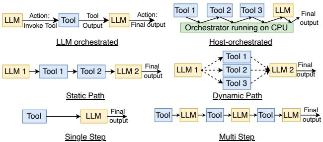
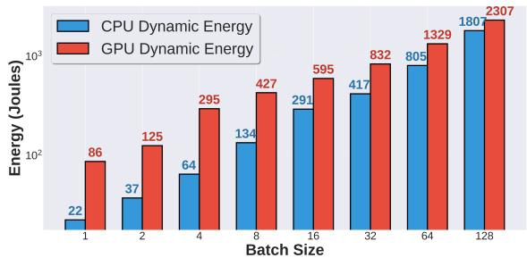
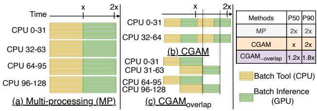
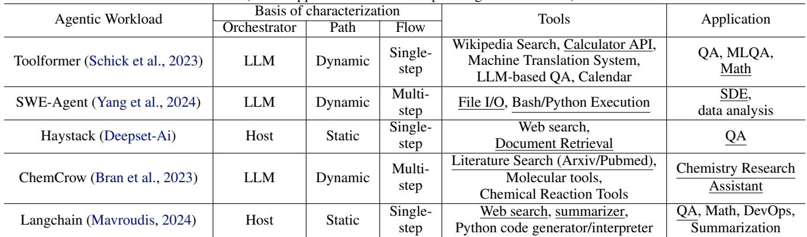

# A CPU-CENTRIC PERSPECTIVE ON AGENTIC AI 论文解析

## 0. 论文基本信息

**作者 (Authors)**: Ritik Raj, Hong Wang, Tushar Krishna

**发表期刊/会议 (Journal/Conference)**: ArXiv

**发表年份 (Publication Year)**: 2025

**研究机构 (Affiliations)**: Georgia Institute of Technology, Atlanta, GA, USA, Intel, Santa Clara, CA, USA

______________________________________________________________________

## 1. 摘要

**目的**

- 从一个被长期忽视的 **CPU-centric perspective** 出发，系统性地表征和理解 **Agentic AI** 工作负载引入的系统瓶颈。
- 挑战传统AI优化中过度关注GPU的范式，揭示 **CPU在工具处理、吞吐量和能耗方面** 的关键影响，并提出针对性的优化方案。

**方法**

- **系统级表征**：提出了三个正交的分类维度来刻画Agentic AI系统的多样性：
    - **Orchestrator-based** (LLM-orchestrated vs. Host-orchestrated)
    - **Agentic Path** (Static vs. Dynamic)
    - **Repetitiveness** (Single-step vs. Multi-step)
         *Figure 1. Characterization of agentic AI workloads on the basis of (a) Orchestrator (LLM and Host) (b) Agentic Path (Static and Dynamic) and (c) Repetitiveness (Single-step and Multi-step)*
- **全栈剖析**：基于上述表征，选取了五个具有代表性的Agentic AI工作负载（Haystack RAG, Toolformer, ChemCrow, Langchain, SWE-Agent），在配备 **Intel Emerald Rapids CPU** 和 **NVIDIA B200 GPU** 的先进系统上，对 **latency**, **throughput**, 和 **energy** 进行了全面剖析。
- **优化设计**：根据剖析洞察，设计了两种调度优化策略：
    - \*\*CGAM \*\*(CPU and GPU-Aware Micro-batching)：用于同质化工作负载。
    - \*\*MAWS \*\*(Mixed Agentic Workload Scheduling)：用于异质化工作负载。

**结果**

- **延迟剖析**：**工具处理**（在CPU上执行）是主要瓶颈，其延迟占比最高可达 **90.6%**。
     *Figure 2. (a) Haystack with ENNS retrieval on QA benchmarks (b) Toolformer with WolframAlpha API on Math benchmarks (c) Chemcrow with literature (Arxiv/Pubmed) search tool on Chemistry benchmarks (d) Langchain with web search and LexRank summarization tools on QA benchmarks (e) Mini-SWE-Agent with bash/Python execution tools on coding benchmarks*
- **吞吐量瓶颈**：Agentic AI的吞吐量受限于两类因素：
    - **CPU因素**：核心过载（over-subscription）、缓存一致性（coherence）和同步开销。
    - **GPU因素**：设备内存容量和带宽限制。
         *Figure 4. (a) vLLM throughput saturation for GPT-OSS-20B model (b) Throughput saturation for various agentic workloads (c) Average time taken by different components in Langchain benchmark showing a critical CPU context switching bottleneck at batch size 128*
- **能耗剖析**：在大批次（batch size 128）场景下，**CPU动态能耗**占总动态能耗的比例高达 **44%**。
     *Figure 5. CPU (AMD Threadripper) and GPU (Nvidia B200) dynamic energy consumption for Langchain workload*
- **优化效果**：所提出的优化方案显著提升了性能：
    - **CGAM** 在同质化工作负载上实现了最高 **2.1×** 的 P50 延迟加速。
    - **MAWS** 在异质化工作负载上实现了 **1.41×** 的 P50 延迟加速。
         *Figure 7. Comparison of CGAM and CGAMoverlap using Bcap = 64 against baseline (multi-processing or multi-threading) on (a) Langchain workload on FreshQA benchmark, (b) Haystack workload on NQ benchmark and (c) SWE-Agent on APPS benchmark*

**结论**

- Agentic AI的性能、效率和可扩展性受到 **CPU-centric bottlenecks** 的深刻影响，这些瓶颈源于其独特的工具调用和决策循环架构。
- 仅关注GPU优化的策略对于Agentic AI是不充分的。必须采用 **CPU-GPU协同优化** 的新范式。
- 通过系统性的表征、剖析和针对性的调度优化（如CGAM和MAWS），可以有效缓解CPU瓶颈，显著提升Agentic AI系统的整体效能。

______________________________________________________________________

## 2. 背景知识与核心贡献

**研究背景**

- **Agentic AI** 框架通过在大型语言模型（LLM）之上引入一个决策协调器（orchestrator），并集成外部工具（如网络搜索、Python解释器、数据库等），将被动的文本生成模型转变为能够自主规划、调用工具、记忆历史并动态调整的智能体。
- 尽管AI模型推理主要在GPU上执行，但Agentic AI工作流中的**工具处理**（tool processing）环节（如执行代码、检索、网页抓取、摘要等）严重依赖**CPU**。
- 现有研究和优化工作主要聚焦于**GPU-centric**视角，对CPU在Agentic AI中扮演的关键角色及其带来的系统瓶颈缺乏系统性的理解和分析。

**研究动机**

- 工具处理已成为Agentic AI端到端延迟的主要来源，其性能直接影响整体效率。
- CPU与GPU之间的资源分配、同步和调度问题，在批量处理Agentic请求时会引发新的**系统级瓶颈**。
- 为了高效、可扩展地部署Agentic AI系统，亟需一个**CPU-centric**的视角来全面剖析其性能特征，并据此设计针对性的优化策略。

**核心贡献**

- **系统级表征方法**：提出了三个正交的分类维度来刻画Agentic AI系统的多样性，这些维度直接影响系统性能：
    - **Orchestrator**（协调器）: LLM-orchestrated vs. Host-orchestrated。
    - **Agentic Path**（智能体路径）: Static vs. Dynamic。
    - **Repetitiveness/Flow**（重复性/流程）: Single-step vs. Multi-step。
         *Figure 1. Characterization of agentic AI workloads on the basis of (a) Orchestrator (LLM and Host) (b) Agentic Path (Static and Dynamic) and (c) Repetitiveness (Single-step and Multi-step)*
- **CPU瓶颈的实证揭示**：通过对五个代表性工作负载（Haystack RAG, Toolformer, ChemCrow, Langchain, SWE-Agent）的全面剖析，首次系统性地揭示了CPU在Agentic AI中的关键瓶颈：
    - **工具处理**在CPU上可占据高达 **90.6%** 的总延迟。
    - Agentic吞吐量受限于**CPU因素**（核心过载、缓存一致性、同步开销）或**GPU因素**（显存容量与带宽）。
    - 在大批量场景下，**CPU动态能耗**可占系统总动态能耗的 **44%**。
- **针对性调度优化**：基于上述洞察，提出了两种调度优化方案：
    - \*\*CGAM \*\*(CPU and GPU-Aware Micro-batching)：针对同构工作负载，通过设置批处理上限（Bcap）进行微批处理，有效降低P50延迟、KV Cache占用和CPU能耗。在同构工作负载上实现了最高 **2.1×** 的P50延迟加速。
    - \*\*MAWS \*\*(Mixed Agentic Workload Scheduling)：针对异构工作负载（CPU-heavy与LLM-heavy混合），采用自适应的并行策略（对CPU-heavy任务使用多进程，对LLM-heavy任务使用多线程），避免资源争抢。在异构工作负载上实现了最高 **1.41×** 的P50延迟加速。

______________________________________________________________________

## 3. 核心技术和实现细节

### 0. 技术架构概览

**整体技术架构**

本文提出了一种以 **CPU-centric** 为核心的 Agentic AI 系统分析与优化框架。其整体架构并非一个单一的模型或系统，而是一个包含 **工作负载表征 (Characterization)**、**全栈性能剖析 (Profiling)** 和 **调度优化 (Optimizations)** 的三层研究范式。

- **第一层：工作负载表征**

    - 提出了三个正交的分类维度来系统化地描述 Agentic AI 工作负载的多样性：
        - **Orchestrator-Based (基于协调器)**: 区分 **LLM-orchestrated** (如 ReAct, AutoGPT) 和 **Host-orchestrated** (如 LangChain, Haystack)。
        - **Path-based (基于路径)**: 区分 **Static Path** (预定义工作流) 和 **Dynamic Path** (运行时自适应构建执行图)。
        - **Flow/Repetitiveness-based (基于流程/重复性)**: 区分 **Single-step** (单次推理) 和 **Multi-step** (多轮迭代)。
    - 基于上述表征，精心挑选了五个具有代表性的 Agentic AI 工作负载进行深入研究：**Haystack RAG**, **Toolformer**, **ChemCrow**, **LangChain**, 和 **SWE-Agent**。
         *Figure 1. Characterization of agentic AI workloads on the basis of (a) Orchestrator (LLM and Host) (b) Agentic Path (Static and Dynamic) and (c) Repetitiveness (Single-step and Multi-step)*

- **第二层：全栈性能剖析**

    - 在配备 **Intel Emerald Rapids CPU** 和 **NVIDIA B200 GPU** 的先进硬件平台上，对选定的工作负载进行全面的性能剖析。
    - 剖析聚焦于三个核心指标，并揭示了关键的 **CPU 瓶颈**：
        - **Latency (延迟)**: **工具处理 (Tool processing)** 在 CPU 上的耗时可占总延迟的 **90.6%**。
        - **Throughput (吞吐量)**: 吞吐量饱和点由 **CPU 因素** (核心过载、缓存一致性、同步开销) 或 **GPU 因素** (设备内存容量和带宽) 决定。
        - **Energy (能耗)**: 在大批量场景下，**CPU 动态能耗** 可占系统总动态能耗的 **44%**。
             *Figure 2. (a) Haystack with ENNS retrieval on QA benchmarks (b) Toolformer with WolframAlpha API on Math benchmarks (c) Chemcrow with literature (Arxiv/Pubmed) search tool on Chemistry benchmarks (d) Langchain with web search and LexRank summarization tools on QA benchmarks (e) Mini-SWE-Agent with bash/Python execution tools on coding benchmarks*
             *Figure 4. (a) vLLM throughput saturation for GPT-OSS-20B model (b) Throughput saturation for various agentic workloads (c) Average time taken by different components in Langchain benchmark showing a critical CPU context switching bottleneck at batch size 128*
             *Figure 5. CPU (AMD Threadripper) and GPU (Nvidia B200) dynamic energy consumption for Langchain workload*

- **第三层：调度优化**

    - 基于剖析洞察，设计了两种针对不同场景的调度优化策略：
        - **CPU and GPU-Aware Micro-batching (CGAM)**: 针对 **同构 (homogeneous)** 工作负载。通过引入 **批处理上限 (Batching Cap)** 来避免因过度并行化导致的 CPU/GPU 资源饱和，从而降低 P50 延迟、减少 KV Cache 占用和 CPU 能耗。
             *Figure 6. Timeline of batched agentic AI inference for (a) Multiprocessing, (b) CGAM, and (c) CGAMoverlap*
        - **Mixed Agentic Workload Scheduling (MAWS)**: 针对 **异构 (heterogeneous)** 工作负载（混合了 CPU-heavy 和 LLM-heavy 请求）。通过为不同类型的任务采用不同的并行策略（CPU-heavy 用 **multi-processing**，LLM-heavy 用 **multi-threading**），避免资源争抢，提升整体效率。
             *Figure 8. Comparison of MAWS against multiprocessing baseline on 128 mixed Langchain tasks (half LLM heavy, half CPU heavy)*
    - 实验评估表明，这些优化能分别在同构和异构工作负载上实现最高 **2.1×** 和 **1.41×** 的 P50 延迟加速。

### 1. CPU and GPU-Aware Micro-batching (CGAM)

**核心动机与问题定义**

- 传统的大批量（large-batch）处理在智能体AI工作负载中会导致**性能饱和**，即继续增大batch size带来的吞吐量增益微乎其微。
- 这种饱和源于两大瓶颈：**CPU瓶颈**（如核心过载、上下文切换开销剧增）和**GPU瓶颈**（如KV缓存占用过高，超出HBM容量或带宽）。
- 大批量处理还会导致**P50延迟**和**尾部延迟**显著增加，并带来不成比例的**CPU动态能耗**增长。

**CGAM的核心思想**

- **放弃单一的大批量处理**，转而采用**微批处理**（Micro-batching）策略。
- 引入一个关键参数——**批处理上限**（**Bcap**），它代表了能获得最佳资源效率的最大有效批大小。
- 将一个大的请求批次（例如 B=128）拆分成多个大小为 **Bcap** 的微批次（例如 2个 Bcap=64 的微批次），并按序或重叠方式处理这些微批次。

**批处理上限（Bcap）的选择算法**

- 定义**吞吐量增益比**（**throughput gain ratio**）为 `r(B) = T(B) / T(B/2)`，其中 `T(B)` 是批大小为B时的吞吐量（requests/s）。
- 设定一个**效率阈值**（**λ**），论文中经验值为 **λ = 1.1**，意味着当批大小翻倍带来的吞吐量提升小于10%时，即进入饱和区。
- **Bcap** 被选为满足 `r(B) < λ` 的最小批大小。根据表2的实证数据，对于多数工作负载，**Bcap = 64** 是一个合适的值。

 *. Table 2. Throughput gain ratios r and selected Bcap values*

**基础CGAM的执行流程**

- 对于一个总大小为B的请求批次，将其分割为 `ceil(B / Bcap)` 个微批次。
- **顺序执行**每个微批次：先完成该微批次中所有请求的**CPU工具处理**（Tools），再将结果送入GPU进行**LLM推理**（Inference）。
- 在任意时刻，系统中活跃的请求数量不超过 **Bcap**。

 *Figure 6. Timeline of batched agentic AI inference for (a) Multiprocessing, (b) CGAM, and (c) CGAMoverlap*

**CGAMoverlap的进阶执行流程**

- 为了进一步优化**P90延迟**，在基础CGAM上引入**流水线重叠**。
- 当第一个微批次完成**CPU工具处理**后，立即启动第二个微批次的**CPU工具处理**，同时GPU开始处理第一个微批次的**LLM推理**。
- 这样，CPU和GPU可以**并发工作**，减少了整体的空闲等待时间，但会因更高的CPU竞争而略微增加P50延迟。

**CGAM带来的三大优势**

- **降低P50延迟**：由于第一个微批次能在总延迟的一半左右完成，使得前50%的用户请求能获得近**2倍**的加速。在评估中，对LangChain、Haystack和SWE-Agent分别实现了**2.11×**, **1.94×**, 和 **1.72×** 的P50延迟加速。
- **减少KV缓存使用**：活跃批大小被限制在Bcap，使得峰值**KV缓存**占用几乎减半，缓解了GPU内存压力，避免了因缓存溢出到主机内存而产生的PCIe瓶颈。
- **节约CPU能耗**：通过限制并发核心数，显著降低了CPU的动态能耗。论文指出，在大批次下，此优化可带来约**2倍**的CPU能耗节省，这对于总能耗中CPU占比高达\*\*44%\*\*的场景至关重要。

**输入输出关系与系统作用**

- **输入**：一个大的、同质化的智能体AI请求批次（Batch Size B）。
- **输出**：经过优化调度后，按微批次顺序（或重叠）完成的所有请求响应，其**P50/P90延迟**、**GPU内存占用**和**CPU能耗**均得到显著改善。
- **在系统中的作用**：CGAM作为一个**调度层**，位于请求分发器和底层执行引擎（vLLM, 工具API等）之间。它不改变模型或工具本身，而是通过智能地管理请求的并发模式，来规避硬件瓶颈，从而在不牺牲吞吐量的前提下，大幅提升服务质量和能效。

### 2. Mixed Agentic Workload Scheduling (MAWS)

**核心动机与问题定义**

- **MAWS (Mixed Agentic Workload Scheduling)** 的设计初衷是解决**异构智能体工作负载**（heterogeneous agentic workloads）在并行执行时的资源争用问题。
- 在真实场景中，请求队列可能同时包含两类任务：
    - **CPU-heavy 任务**：其延迟主要由**工具执行**（如 Web 搜索、Python/Bash 执行、ENNS 检索）主导，这些操作严重依赖 CPU 资源。
    - **LLM-heavy 任务**：其延迟主要由**GPU 上的大模型推理**主导，CPU 仅承担轻量级的协调或 I/O 工作。
- 若对所有任务统一采用**多进程**（multi-processing）策略来并行化，LLM-heavy 任务会因创建大量独立进程而造成**CPU 核心过载**（core over-subscription），进而拖慢对 CPU 资源敏感的 CPU-heavy 任务，导致整体性能下降。

**实现原理与调度策略**

- MAWS 的核心思想是**自适应地为不同类型的任务选择最优的 CPU 并行化原语**。
- 其具体策略如下：
    - 对于被识别为 **CPU-heavy** 的任务，采用 **multi-processing**。这能有效绕过 Python 的 \*\*GIL \*\*(Global Interpreter Lock)，让每个任务独占一个 CPU 核心，最大化 CPU-bound 工具的执行效率。
    - 对于被识别为 **LLM-heavy** 的任务，采用 **multi-threading**。由于这类任务的 CPU 工作负载很轻（主要是调用 vLLM API 的 I/O 操作），使用线程池可以避免进程创建和上下文切换的巨大开销，同时释放出宝贵的 CPU 核心给 CPU-heavy 任务使用。
- 这种混合调度策略通过**精细化的资源隔离**，确保了 CPU 资源被高效地分配给最需要它的任务类型。

**算法流程与输入输出**

- **输入**：一个包含 N 个异构智能体请求的批次，其中每个请求都带有类型标签（CPU-heavy 或 LLM-heavy）。
- **处理流程**：
    1. **任务分类**：调度器首先将输入批次中的请求分为两个子集：`CPU_heavy_tasks` 和 `LLM_heavy_tasks`。
    1. **差异化调度**：
        - 将 `CPU_heavy_tasks` 子集提交给一个多进程执行器。
        - 将 `LLM_heavy_tasks` 子集提交给一个多线程执行器（例如，利用 LangChain 的 `Runnable.batch` 内置的线程池）。
    1. **结果聚合**：等待两个执行器完成各自的任务，并按原始请求顺序聚合结果。
- **输出**：与输入批次一一对应的完整响应列表。
- **在整体系统中的作用**：MAWS 作为一个**高层调度器**，位于请求分发层，它不改变单个智能体的内部逻辑，而是优化了多个异构智能体在共享 CPU/GPU 资源池上的并发执行方式，从而提升了系统的**整体吞吐量**和**尾部延迟**（P99 latency）。

**性能评估与关键指标**

- 论文通过实验验证了 MAWS 的有效性。图8展示了在一个包含 **128 个混合 LangChain 任务**（一半 CPU-heavy，一半 LLM-heavy）的场景下，MAWS 相比统一使用多进程的基线方法的性能提升。
    
- 关键性能指标如下：
    - **P99 延迟**：MAWS 实现了 **1.17×** 的加速比，显著改善了最慢请求的响应时间。
    - **P50 延迟**：基本与基线持平，说明该策略在优化尾部延迟的同时，没有损害中位用户的体验。
- 当与 **CGAM** 优化结合使用时（如图9所示），在 **256 个混合任务**的更大规模负载下，MAWS+CGAM 对 CPU-heavy 任务的 **P50 延迟**实现了高达 **2.1×** 的加速。
     *Figure 9. Comparison of MAWS+CGAM against multiprocessing baseline on 256 mixed Langchain tasks*

### 3. Agentic AI System Characterization Framework

**Agentic AI系统表征框架的核心维度**

该框架通过三个正交的分类维度，从系统架构层面解构了Agentic AI工作负载的多样性，为后续的性能剖析和优化提供了理论基础。

- **基于编排器 (Orchestrator-Based)**

    - **核心区分**：决策逻辑的控制权归属。
    - **LLM-orchestrated**：**LLM** 本身作为中央控制器，负责决定任务分解、工具调用时机及最终输出。其推理能力直接驱动整个执行流程。
        - *代表系统*：ReAct, AutoGPT, BabyAGI。
    - **Host-orchestrated**：由**Host**（通常是Python代码）管理控制流，将LLM视为一个无状态的推理服务。Host代码负责调度工具、聚合结果并决定下一步操作。
        - *代表系统*：LangChain, Haystack, Semantic Kernel。
    - **系统影响**：此维度直接影响CPU与GPU的职责划分。LLM-orchestrated系统通常有更复杂的LLM推理路径，而Host-orchestrated系统则将更多逻辑卸载到CPU上执行。

- **基于智能体路径 (Path-based)**

    - **核心区分**：执行流程的确定性。
    - **Static Path**：遵循预定义的、**确定性的**工作流。工具调用的顺序和类型在运行前已固定。
        - *代表系统*：大多数RAG（Retrieval Augmented Generation）管道，如Haystack。
    - **Dynamic Path**：执行图在**运行时动态构建**，路径选择取决于中间结果、环境反馈或LLM的实时决策。
        - *代表系统*：Tree-of-Thoughts, Reflexion, LATS。
    - **系统影响**：动态路径引入了不可预测的分支和循环，使得静态优化（如预分配资源）变得困难，并可能增加同步和上下文切换的开销。

- **基于流程重复性 (Flow/Repetitiveness-based)**

    - **核心区分**：与环境交互的迭代次数。
    - **Single-step**：任务在一个推理周期内完成，**无环境反馈循环**。典型的如单次问答或简单的工具调用。
        - *代表系统*：标准CoT（Chain-of-Thought）提示、单轮RAG。
    - **Multi-step**：涉及**多次迭代**的“感知-规划-行动”循环，以解决复杂任务。每一步都可能依赖前一步的结果。
        - *代表系统*：WebArena, SWE-Agent, AgentBench。
    - **系统影响**：多步流程显著放大了工具处理（CPU-bound）部分的累积延迟，并对系统的状态管理和内存占用提出了更高要求。

 *Figure 1. Characterization of agentic AI workloads on the basis of (a) Orchestrator (LLM and Host) (b) Agentic Path (Static and Dynamic) and (c) Repetitiveness (Single-step and Multi-step)*

______________________________________________________________________

**代表性工作负载在框架中的映射**

研究选取了五个具有代表性的Agentic AI工作负载，它们在上述三个维度上覆盖了广泛的组合，从而能够全面揭示系统瓶颈。

| Workload         | Orchestrator | Path    | Flow        | Primary Tools                             |
| :--------------- | :----------- | :------ | :---------- | :---------------------------------------- |
| **Haystack RAG** | Host         | Static  | Single-step | **ENNS** (Exact Nearest Neighbor Search)  |
| **Toolformer**   | LLM          | Static  | Single-step | **WolframAlpha API**, QA APIs             |
| **ChemCrow**     | LLM          | Dynamic | Multi-step  | **Arxiv/Pubmed** literature search        |
| **LangChain**    | Host         | Dynamic | Multi-step  | **Web Search**, **LexRank** summarization |
| **SWE-Agent**    | LLM          | Dynamic | Multi-step  | **Bash/Python** execution                 |

 *Table 1. Representative Agentic AI systems (Tools/Application selected for profiling are underlined)*

______________________________________________________________________

**框架在系统剖析中的作用与输入输出关系**

该表征框架是连接高层应用逻辑与底层系统性能的桥梁。

- **输入**：一个具体的Agentic AI应用或工作负载。
- **处理**：通过分析其架构，将其归类到三个维度的特定象限中。
- **输出**：
    - **性能预测**：例如，一个**Host-orchestrated**, **Static Path**, **Single-step**的工作负载（如Haystack RAG）很可能会被**CPU-bound**的检索操作所主导。
    - **瓶颈定位**：一个多步、动态路径的LLM-orchestrated系统（如SWE-Agent）可能会同时面临**CPU**（工具执行）和**GPU**（长序列、多轮推理的KV Cache压力）的瓶颈。
    - **优化指导**：框架的分类结果直接启发了后续的优化策略。例如，针对**Multi-step**工作负载，需要考虑状态管理的开销；针对**Host-orchestrated**系统，则需重点优化CPU上的并行调度。
- **整体作用**：该框架为理解Agentic AI的“黑盒”行为提供了一个结构化的透镜，使得研究者能够超越单纯的模型层面，从**系统级**（System-level）视角去分析、预测和优化其性能、吞吐量和能效。

### 4. Batching Cap Selection Strategy

**核心原理与算法流程**

- **批处理上限 (Batching Cap) 选择策略**的核心目标是，在避免系统进入**吞吐量饱和区**的前提下，最大化资源利用效率。该策略通过量化批处理规模扩大带来的边际效益来实现。
- 其具体算法流程如下：
    - 定义 **吞吐量增益比率 r(B)** 为 `r(B) = T(B) / T(B/2)`，其中 `T(B)` 表示在批处理大小为 `B` 时的系统吞吐量（单位：requests/second）。
    - 引入一个**效率阈值 λ**（论文中设定为 **1.1**），该阈值代表可接受的最低效率增益（即10%的提升）。
    - 系统性地增加批处理大小 `B`，并计算对应的 `r(B)`。
    - 当首次出现 `r(B) < λ` 的情况时，将前一个批处理大小 `B/2` 确定为最优的**批处理上限 Bcap**。这意味着，继续将批处理大小从 `B/2` 增加到 `B` 所带来的吞吐量提升已低于10%，得不偿失。

**参数设置与决策依据**

- **效率阈值 λ** 的设定是此策略的关键超参数。论文选择 **λ = 1.1** 是基于实验分析得出的**实用平衡点**，它在追求高吞吐量和避免因过度并行化导致的延迟激增（如CPU过载、GPU内存带宽瓶颈）之间取得了良好折衷。
- 该策略的决策完全依赖于对系统**吞吐量 T(B) 随批处理大小 B 变化**的实证测量，而非理论模型，因此具有很强的**硬件和工作负载适应性**。

 *. Table 2. Throughput gain ratios r and selected Bcap values*

**输入输出关系及在整体优化中的作用**

- **输入**：一系列不同批处理大小 `B` 下测得的系统吞吐量 `T(B)` 数据。
- **输出**：一个具体的数值 **Bcap**，即推荐使用的最大微批处理（micro-batch）大小。
- **在整体优化框架中的作用**：
    - **作为 CPU and GPU-Aware Micro-batching (CGAM) 优化的基础**：`Bcap` 直接决定了微批处理的粒度。对于一个大的请求批次（例如 B=128），CGAM 会将其拆分为多个大小不超过 `Bcap`（例如 Bcap=64）的微批次进行顺序或重叠处理。
    - **解决吞吐量饱和问题**：通过限制单次并行处理的请求数量，有效规避了因**CPU核心过载 (core over-subscription)**、**缓存一致性开销 (coherence traffic)** 或 **GPU设备内存容量/带宽瓶颈** 导致的性能下降。
    - **带来多重收益**：
        - **降低 P50 延迟**：第一批微批次的请求可以更快完成，显著改善中位数响应时间。
        - **减少 KV Cache 内存占用**：并发处理的请求数减半，使得 GPU 上的 **KV Cache** 使用量也近似减半，缓解了内存压力。
        - **提升能效**：通过限制CPU核心的并发使用数量，大幅降低了**CPU动态能耗**，这对于大批次场景下（CPU能耗可占总动态能耗的44%）尤为重要。

### 5. CGAMoverlap Execution Model

**核心执行原理与流程**

- **CGAMoverlap** 是 **CPU and GPU-Aware Micro-batching (CGAM)** 的一种优化变体，其核心思想是通过**计算重叠 (computation overlap)** 来改善尾部延迟。
- 该模型将一个大批次（例如 B=128）分割为两个或多个微批次（micro-batch），每个微批次的大小不超过预设的**批处理上限 (batching cap, Bcap)**，文中实验设定为 **Bcap = 64**。
- 其执行流程的关键在于打破微批次间的严格串行依赖：
    - 当第一个微批次完成其 **CPU-bound 工具处理阶段** 后，系统**不会等待**其后续的 **GPU LLM 推理阶段** 完成。
    - 而是**立即启动**第二个微批次的 **CPU-bound 工具处理阶段**。
    - 此时，系统进入一个**重叠执行窗口**：**第一个微批次的 GPU 阶段** 与 **第二个微批次的 CPU 阶段** **并发执行**。
- 这种设计充分利用了 CPU 和 GPU 作为独立计算单元的特性，实现了异构资源的并行利用。

 *Figure 6. Timeline of batched agentic AI inference for (a) Multiprocessing, (b) CGAM, and (c) CGAMoverlap*

**性能权衡与适用场景**

- **P50 延迟 (中位数延迟)**: 由于在重叠窗口期间，CPU 资源需要同时服务于两个微批次（尽管是不同阶段），这会引入额外的 **CPU 争用 (CPU contention)**。这种争用可能导致第一个微批次的 CPU 阶段收尾工作或第二个微批次的 CPU 阶段启动变慢，从而**轻微增加 P50 延迟**。实验数据显示，CGAMoverlap 的 P50 速度提升（1.37x - 1.82x）略低于标准 CGAM（1.72x - 2.11x）。
- **P90/P99 延迟 (尾部延迟)**: 这是 CGAMoverlap 的主要优化目标。通过提前启动第二个微批次的处理，显著减少了其在队列中的等待时间。因此，**P90 延迟得到明显改善**。实验数据显示，对于 LangChain、Haystack 和 SWE-Agent，P90 延迟分别降低了 1.33x、1.15x 和 1.16x。
- **最佳适用场景**: 该模型在 **CPU 阶段和 GPU 阶段耗时相对均衡** 的工作负载上效果最佳。例如，在 **LangChain** 工作负载中，由于 Web 搜索/摘要（CPU）和 LLM 推理（GPU）耗时接近，重叠带来的收益最大，P90 改善最显著。而在 CPU 或 GPU 单方面极度占优的工作负载中，重叠窗口的效益会减弱。

**输入输出关系及系统作用**

- **输入**: 一个大的、同时到达的请求批次（例如 B=128）。
- **内部处理**:
    - 将大批次分割为 N 个微批次（N = B / Bcap）。
    - 按照重叠调度策略依次启动各微批次的 CPU 阶段。
    - 在 CPU 阶段完成后，将数据传递给 GPU 进行 LLM 推理。
- **输出**: 所有请求的最终响应，但其完成时间分布被重塑，**尾部请求的完成时间被大幅提前**。
- **在整体系统中的作用**: CGAMoverlap 是一种**延迟分布整形 (latency distribution shaping)** 策略。它不追求绝对的吞吐量最大化或平均延迟最小化，而是**主动牺牲少量的中位数性能，以换取对用户体验至关重要的尾部延迟的显著优化**。这对于需要提供稳定服务质量（SLO）的在线服务系统具有重要价值。

______________________________________________________________________

## 4. 实验方法与实验结果

**实验设置**

- **硬件平台**：
    - **Latency/Throughput Profiling**: 使用 **48-core Intel Emerald Rapids CPU** (配备 DDR5 DRAM) 和 **NVIDIA B200 GPU** (配备 HBM3e)。
    - **Energy Profiling**: 由于设施限制，在另一台主机上进行，配备 **64-core AMD Ryzen Threadripper PRO 7985WX CPU** 和 **NVIDIA H200 GPU**。
- **软件环境**：
    - 使用 **PyTorch 2.8.0** 和 **vLLM 0.11.0** 作为本地 LLM 推理服务器。
    - **ChemCrow** 工作负载因使用 GPT-4-0613 模型，通过 **OpenAI API** 调用，而非本地 vLLM。
    - 其他依赖库版本：langchain 0.3.27, haystack-ai 2.18.1, chemcrow 0.3.24, mini-swe-agent 1.9.1。
- **工作负载选择**：基于第 3 节的系统级表征，选择了五个具有代表性的 Agentic AI 工作负载，覆盖了不同的 Orchestrator、Agentic Path 和 Repetitiveness 特性。
    - **Haystack RAG**: 使用 **ENNS (Exact Nearest Neighbor Search)** 在 **305GB C4** 语料库上进行检索。
    - **Toolformer**: 基于 **GPT-J 6B** 模型，调用 **WolframAlpha API** 解决数学问题。
    - **ChemCrow**: 使用 **GPT-4-0613** 模型，通过 **Arxiv/Pubmed** 进行文献搜索。
    - **LangChain**: 构建了自定义管道（Web Search -> **LexRank Summarization** -> LLM Inference），使用 **GPT-OSS-20B** 模型。
    - **SWE-Agent**: 使用 **mini-SWE-Agent**，通过 **Bash/Python Execution** 工具解决编码问题。

**结果数据分析**

- **延迟 (Latency) 分析**：

    - **CPU 工具处理是主要瓶颈**。在所有工作负载中，工具处理阶段占据了绝大部分端到端延迟。
        - **Haystack RAG**: 检索阶段耗时 **6.0-8.0s**，占总延迟的 **84.5%-90.6%**。
        - **SWE-Agent**: Bash/Python 执行占总延迟的 **43.8%-78.7%**。
        - **LangChain**: Web 搜索或摘要工具可驱动超过 **50%** 的端到端延迟。
    - **关键结论**: **Tool processing on CPUs can take up to 90.6% of the total latency**。

- **吞吐量 (Throughput) 分析**：

    - 吞吐量饱和由 **CPU 或 GPU 瓶颈** 导致。
        - **GPU 瓶颈**: 主要由 **KV Cache** 占用过多 **GPU High-Bandwidth Memory (HBM)** 引起，导致内存带宽饱和。如 Figure 4a 所示，vLLM 吞吐量在 batch size 达到 64 后增长显著放缓。
        - **CPU 瓶颈**: 包括 **Core Over-subscription**（核心过度订阅）、**Cache Coherence**（缓存一致性）开销和 **Synchronization**（同步）开销。
            - **Haystack RAG**: 在 batch size > 32 时，因 **LLC (Last-Level Cache) 压力** 和 **Disk I/O 争用** 而饱和。
            - **LangChain/SWE-Agent**: 在 batch size = 128 时，因 **Core Over-subscription** 导致吞吐量饱和，摘要任务的平均延迟从 2.9s (bs=64) 增至 6.3s (bs=128)。
    - **关键结论**: **Agentic throughput gets bottlenecked either by CPU factors or GPU factors**。

- **能耗 (Energy) 分析**：

    - **CPU 动态能耗占比随批大小显著增加**。
        - 在 **LangChain** 工作负载上，当批大小从 1 增加到 128 时：
            - 总动态能耗增加了 **38.1** 倍。
            - **GPU** 动态能耗增加了 **26.8** 倍。
            - **CPU** 动态能耗增加了 **86.7** 倍。
        - CPU 动态能耗占总动态能耗的比例从 **小批大小时的 20%** 上升到 **批大小 128 时的 44%**。
    - **关键结论**: **CPU dynamic energy consumes up to 44% of the total dynamic energy at large batch sizes**，表明 CPU 并行化在能效上远低于 GPU。

**消融实验与优化评估**

- **优化方案一: CPU and GPU-Aware Micro-batching (CGAM)**

    - **核心思想**: 通过分析吞吐量增益比 `r(B) = T(B)/T(B/2)` 来确定最优批处理上限 `Bcap`。当 `r(B) < λ` (λ=1.1) 时，停止增大批大小，以避免进入饱和区。
    - **评估结果 (vs Multi-processing baseline, B=128)**:
        | Workload  | Metric          | Speedup   |
        | :-------- | :-------------- | :-------- |
        | LangChain | **P50 Latency** | **2.11×** |
        | Haystack  | **P50 Latency** | **1.94×** |
        | SWE-Agent | **P50 Latency** | **1.72×** |
    - **CGAMoverlap 变体**: 通过重叠两个微批次的 CPU 和 GPU 执行阶段，在略微牺牲 P50 延迟的情况下，显著改善了 P90 延迟（例如 LangChain 上 P90 延迟降低 **1.33×**）。
    -  *Figure 7. Comparison of CGAM and CGAMoverlap using Bcap = 64 against baseline (multi-processing or multi-threading) on (a) Langchain workload on FreshQA benchmark, (b) Haystack workload on NQ benchmark and (c) SWE-Agent on APPS benchmark*

- **优化方案二: Mixed Agentic Workload Scheduling (MAWS)**

    - **核心思想**: 针对混合工作负载（同时包含 **CPU-heavy** 和 **LLM-heavy** 请求），采用自适应并行策略。对 **CPU-heavy** 任务使用 **Multi-processing**，对 **LLM-heavy** 任务使用开销更轻的 **Multi-threading**，以避免 CPU 资源过度订阅。
    - **评估结果**:
        - **MAWS (B=128)**: 在混合 LangChain 任务上，相比多进程基线，**P99 延迟提升 1.17×**，同时保持 P50 延迟不变。
        - **MAWS+CGAM (B=256)**: 结合两种优化，在混合工作负载上实现了全面的性能提升。
            - **CPU-heavy 任务 P50 延迟**: **2.1×** 提升。
            - **所有任务 P50 延迟**: **1.4×** 提升。
            - **整体 P99 延迟**: **1.15×** 提升。
    -  *Figure 8. Comparison of MAWS against multiprocessing baseline on 128 mixed Langchain tasks (half LLM heavy, half CPU heavy)*
    -  *Figure 9. Comparison of MAWS+CGAM against multiprocessing baseline on 256 mixed Langchain tasks*

______________________________________________________________________
