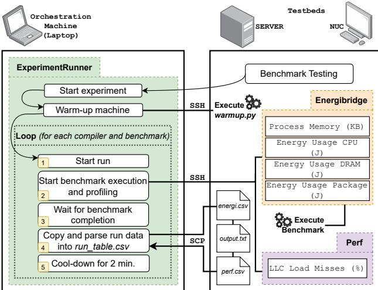

# An Empirical Study on the Performance and Energy Usage of Compiled Python Code 论文解析

## 0. 论文基本信息

**作者 (Authors)**: Vincenzo Stoico, Andrei Calin Dragomir, Patricia Lago

**发表期刊/会议 (Journal/Conference)**: EASE

**发表年份 (Publication Year)**: 2025

**研究机构 (Affiliations)**: Vrije Universiteit Amsterdam, The Netherlands

______________________________________________________________________

## 1. 摘要

**目的**

- 本研究旨在系统性地评估和比较多种 **Python 编译器**（包括 JIT 和 AOT）相较于标准解释器 **CPython** 在 **性能**（执行时间）、**能量效率**、**内存使用** 和 **Last-Level Cache (LLC) miss rate** 方面的实际效益。
- 特别关注在控制关键变量（如 **单线程执行**、**固定 CPU 频率**、**无第三方库依赖**）的条件下，不同编译器对 Python 代码效率的影响，并为开发者选择合适的工具提供实证依据。

**方法**

- **实验对象**: 选取了 **8 种主流或新兴的 Python 编译器/实现**：PyPy, Numba, Nuitka, Mypyc, Codon, Cython, Pyston-lite, 以及 Python 3.13 的实验性 JIT 编译器，并以 CPython 作为基线。
- **基准测试**: 使用 **7 个**来自 **Computer Language Benchmarks Game (CLBG)** 的单线程、无第三方库依赖的基准程序。
- **实验平台**: 在两种不同的硬件环境（一台 **Intel NUC** 和一台 **服务器**）上进行实验，以验证结果的稳健性。
- **控制变量**: 所有实验均在 **单个 CPU 核心**上运行，并将 **CPU 频率固定**，以消除多核调度和动态频率缩放对测量结果的干扰。
- **测量指标**:
    - **能量消耗**（KiloJoules），通过 **EnergiBridge** 工具利用 Intel RAPL 接口测量。
    - **执行时间**（分钟），通过 `time` 模块测量。
    - **内存使用**（MB），以 **Resident Set Size (RSS)** 为指标。
    - **LLC miss rate**（%），通过 Linux `perf` 工具测量。
- **实验设计**: 采用全因子设计，每个编译器-基准程序组合在 NUC 上重复 **15 次**，在服务器上重复 **10 次**，总计 **1575 次**运行，并对运行顺序进行随机化。
- **数据分析**: 使用 **Shapiro-Wilk** 检验数据正态性，非正态数据采用 **Kruskal-Wallis** 检验和 **Cliff’s Delta** 效应量分析。

**结果**

- **能量效率与执行时间**:
    - **Codon**, **PyPy**, 和 **Numba** 表现出最显著的优化效果。在服务器上，它们平均实现了超过 **90%** 的 **执行时间** 和 **能量消耗** 改进。
        - 具体而言，Codon、PyPy 和 Numba 的平均 **能量改进** 分别达到 **94.66%**、**86.89%** 和 **86.61%**。
        - 平均 **执行时间改进** 分别为 **94.18%**、**86.67%** 和 **85.86%**。
    - 能量消耗与执行时间之间存在 **强正相关** 关系。
    - 其他编译器（如 Nuitka, Cython, Mypyc）的改进效果不一，甚至在某些基准（如 `n_body`）上表现比 CPython 更差。
- **内存使用**:
    - **Nuitka** 在两个测试平台上均表现出最一致的 **内存优化** 能力，平均内存使用最低。
    - 内存使用数据 **变异性高**，且绝对值较低（MB 级别），使得部分结论不够稳健。
- **LLC Miss Rate**:
    - 编译对 LLC miss rate 的影响 **不明确且不一致**。该指标在不同基准和不同编译器间波动很大。
    - **Nuitka** 在两个平台上都表现出异常高的 LLC miss rate（服务器上 **58.73%**，NUC 上 **68.92%**）。
    - 总体来看，没有一种编译器能稳定地降低 LLC miss rate。
- **平台一致性**: 除 LLC miss rate 外，**能量消耗** 和 **执行时间** 的主要趋势在 NUC 和服务器两个平台上高度一致。

 *Figure 2: Average energy usage, execution time, and memory usage for each benchmark by compiler. The dashed red line represents the threshold of the CPython implementation for a given benchmark. Legend: CPython, PyPy, Numba, Pyston-lite, Python 3.13 JIT, Nuitka, Cython, Codon, MyPyc*
 *Figure 3: Speedup and Energy improvement on the server across benchmarks compared to CPython. Legend: PyPy, Numba, Pyston-lite, Python 3.13 JIT, Nuitka, Cython, Codon, MyPyc*

**结论**

- **编译是提升 Python 代码效率的有效手段**，但其效果 **高度依赖于所选的编译器和代码的具体特征**。
- 对于追求极致 **性能** 和 **能量效率** 的场景，**Codon**, **PyPy**, 和 **Numba** 是最佳选择，但需权衡其 **易用性** 和 **兼容性**（例如，Numba 和 Codon 需要代码注解，Codon 兼容性有限）。
- **Nuitka** 是优化 **内存占用** 的可靠选择。
- **LLC miss rate** 作为一个潜在的性能瓶颈，其与编译器的关系尚不清晰，值得未来深入研究，特别是其与 **uncore 组件**（如 LLC、内存控制器） **能量消耗** 的关联。
- 本研究为 Python 开发者提供了基于实证数据的决策支持，并强调了在评估软件效率时控制实验变量（如 CPU 频率、核心数）的重要性。

______________________________________________________________________

## 2. 背景知识与核心贡献

**研究背景**

- **Python** 因其易学性和丰富的库而广受欢迎，在2024年Stack Overflow调查中位列第三，被广泛应用于人工智能、Web开发和数据分析等领域。
- 然而，**Python** 的性能和**能量效率**一直备受诟病。其解释执行的特性以及**CPython**实现中的**Global Interpreter Lock (GIL)** 等因素导致其在执行速度、内存占用和能耗方面远逊于编译型语言（如C/C++）。
- 为弥合易用性与效率之间的鸿沟，业界开发了多种**Python编译器**，包括**Just-In-Time (JIT)**（如PyPy, Numba）和**Ahead-Of-Time (AOT)**（如Nuitka, Cython）两类，旨在提升代码效率。

**研究动机**

- 尽管现有编译器已被证明能提升**Python**效率，但缺乏一项**全面、受控的实证研究**来系统性地比较它们在**性能**和**能量效率**上的表现。
- 许多现有研究忽略了关键的混杂变量，例如：
    - **基准测试代码的特性**：如是否使用第三方库（如NumPy）、是否为多线程，这些都会极大影响结果。
    - **实验平台的配置**：如**CPU频率**和**核心数量**的动态变化会显著干扰能耗和性能的测量。
- 因此，亟需一个在严格控制变量（单线程、无第三方库、固定CPU频率和核心）的环境下，对主流编译器进行公平、深入的横向评测。

**核心贡献**

- 设计并执行了一项**受控实验**，在**NUC**和**服务器**两个平台上，使用**7个**来自Computer Language Benchmarks Game (CLBG)的单线程、无第三方库的基准测试，系统评估了**8种**主流**Python编译器**（PyPy, Numba, Nuitka, Mypyc, Codon, Cython, Pyston-lite, Python 3.13 JIT）相对于**CPython**的表现。
- 全面度量了四个关键维度：**执行时间**、**能量消耗**（KiloJoules）、**内存使用**（RSS, MB）和**Last-Level Cache (LLC) miss rate** (%)。
- 得出关键结论：
    - **Codon**, **PyPy**, 和 **Numba** 在**执行时间**和**能量效率**上实现了最显著的优化，平均改进幅度超过**90%**。
    - **Nuitka** 在**内存使用**方面表现最为稳定和优秀。
    - 编译对**LLC miss rate**的影响不明确，结果在不同基准测试和编译器间差异巨大。
- 为**Python**开发者提供了基于实证数据的编译器选型指南，并为未来研究指明了方向（如探索缓存效应对能耗的影响）。研究还公开了完整的**复现包**以确保可复现性。

______________________________________________________________________

## 3. 核心技术和实现细节

### 0. 技术架构概览

**研究目标与核心问题**

- 本文旨在通过一个受控的实证研究，系统性地评估和比较多种 **Python 编译器**（包括 JIT 和 AOT）相较于标准解释器 **CPython** 在 **性能**（执行时间）、**能效**（能量消耗）、**内存使用**（RSS）和 **Last-Level Cache (LLC) miss rate** 四个关键维度上的表现。
- 核心研究问题 (RQs) 聚焦于：
    - RQ1: 编译对 Python 代码的**能量效率**有何影响？
    - RQ2: 编译对 Python 代码的**性能**（执行时间、内存、LLC miss）有何影响？

**实验设计与控制变量**

- **基准测试集 (Benchmarks)**：从 **Computer Language Benchmarks Game (CLBG)** 中精心挑选了 **7 个**单线程、不依赖任何第三方库（如 NumPy）的计算密集型函数。此举旨在消除代码特性（如并行化、外部库优化）对结果的干扰。
- **编译器/解释器 (Subjects)**：对比了 **8 种**工具与 **CPython**（作为基线）：
    - **JIT 编译器**: PyPy, Numba, Pyston-lite, Python 3.13 (experimental JIT)
    - **AOT 编译器**: Nuitka, Cython, Mypyc, Codon
- **测试平台 (Testbeds)**：在两种硬件配置上重复实验以验证结果一致性：
    - **Intel NUC** (Core i7-1260P)
    - **Server** (Xeon E3-1231)
- **严格控制的环境变量**：
    - 所有实验均在 **单核** 上运行。
    - **CPU 频率被固定**（通过 Linux governor），以排除动态频率缩放对能耗和性能的影响。
    - 禁用 **Intel HyperThreading**。
    - 清理所有非必要后台进程。

**数据采集与分析流程**

- **自动化执行框架**：使用自研的 **Experiment Runner** 框架通过 SSH 协调 **Orchestration Machine**（笔记本电脑）与两个 **Testbeds** 之间的通信，实现全流程自动化。
- **测量工具**：
    - **能量与内存**：使用 **EnergiBridge**，通过 Intel **RAPL** 接口以 200ms 间隔采样。注意：NUC 因硬件限制无法获取 DRAM 能耗。
    - **执行时间**：使用 Unix `time` 命令。
    - **LLC Miss Rate**：使用 Linux `perf` 工具。
- **实验规模**：每个（编译器 x 基准）组合在 NUC 上运行 **15 次**，在 Server 上运行 **10 次**，总计 **1575 次**运行。
- **统计分析**：
    - 使用 **Shapiro-Wilk test** 检验数据正态性。
    - 对非正态数据采用 **Kruskal-Wallis test** 进行组间差异检验。
    - 使用 **Cliff’s Delta** 计算效应量 (effect size)，以量化改进的显著性。

 *Figure 1: Experiment Execution*

**关键发现总结**

- **性能与能效**：**Codon**, **PyPy**, 和 **Numba** 表现最为突出，在大多数基准测试中实现了超过 **90%** 的执行时间和能耗改进。
- **内存优化**：**Nuitka** 在两个测试平台上都表现出最一致的**内存使用**优化效果。
- **缓存行为**：编译对 **LLC miss rate** 的影响**不明确且不一致**，不同编译器和基准测试的结果差异很大，其中 **Nuitka** 在两个平台上均表现出异常高的 LLC miss rate。
- **相关性**：在本实验的受控条件下，**执行时间**与**能量消耗**之间存在**强正相关**关系。

**实践意义与未来方向**

- 为开发者选择 Python 编译器提供了基于实证数据的决策依据，并讨论了各工具的易用性和学习曲线。
- 强调了**代码特性**对编译器优化效果的关键影响。
- 提出未来研究应深入探索 **uncore components**（如 LLC）对 Python 程序能耗的影响，以及在更多样化的硬件和软件场景下验证结论。

### 1. 受控实验设计

**受控实验设计的核心目标与实现原理**

该研究的核心目标是**隔离编译器本身对Python代码效率的影响**，排除硬件动态特性（如频率缩放、多核调度）和代码外部依赖（如第三方库）带来的干扰。其实现原理是通过严格控制实验环境和基准测试集的特征，构建一个“纯净”的比较场。

- **基准测试集的选择与约束**：

    - 选用 **Computer Language Benchmarks Game (CLBG)** 中的七个基准测试。
    - 所有基准测试均为**单线程 (single-threaded)** 实现，彻底规避了**Global Interpreter Lock (GIL)** 和多线程调度的复杂性。
    - 所有基准测试**不依赖任何第三方库**（例如 NumPy），确保性能差异完全源于编译器对纯Python语言特性的优化能力，而非对C扩展库的调用。
    - 选择执行时间至少为一分钟的基准，以确保能耗和性能测量具有足够的信噪比。

- **硬件与操作系统环境的固定**：

    - **CPU核心数**：通过 `taskset -c 0` 命令将所有基准测试和测量工具**绑定到第一个物理核心**上执行，强制实验在**单核**环境下运行。
    - **CPU频率**：通过Linux内核的**governor**机制**固定CPU频率**，禁用动态频率缩放（Dynamic Voltage and Frequency Scaling, DVFS）。服务器固定为 **1.6 GHz**，NUC使用 `powersave` governor 固定在其最低频率 **2.1 GHz**。
    - **超线程**：在BIOS层面**禁用Intel HyperThreading**，防止逻辑核心干扰单物理核心的测量结果。
    - **背景进程**：实验前**停用所有非必要后台进程**（如Docker），以减少系统噪声。

**实验变量与数据采集流程**

 *Figure 1: Experiment Execution*

- **自变量 (Independent Variables)**：

    - **主要自变量**：**编译器类型**，共9种执行模式（8个编译器 + CPython基线）。
    - **阻塞因子 (Blocking Factor)**：**测试平台 (testbed)**，即 **Intel NUC** 和 **服务器**，用于检验结果在不同硬件上的可复现性。

- **因变量 (Dependent Variables)**：

    - **RQ1 (能效)**：**能量消耗 (Energy Consumption)**，单位为千焦 (KiloJoules, KJ)。
    - **RQ2 (性能)**：
        - **执行时间 (Execution Time)**，单位为分钟 (min)。
        - **内存使用 (Memory Usage)**，以**常驻集大小 (Resident Set Size, RSS)** 衡量，单位为兆字节 (MB)。
        - **末级缓存缺失率 (Last-Level Cache (LLC) miss rate)**，以百分比 (%) 表示。

- **数据采集工具链**：

    - **能耗与内存**：使用 **EnergiBridge** 工具，通过Intel CPU的 **RAPL (Running Average Power Limit)** 接口，以200毫秒为间隔进行采样。
        - *注意*：由于NUC的CPU（第11代以后的非服务器级）不支持RAPL的DRAM域，因此NUC的数据仅包含**CPU Package**（核心+uncore）的能耗。
    - **执行时间**：使用Unix `time` 模块，在脚本中记录基准测试开始和结束的时间戳。
    - **LLC缺失率**：使用Linux内置的性能分析工具 **perf** 来监控硬件性能计数器。

**实验执行与统计设计**

- **实验设计**：采用**全因子设计 (full factorial design)**。

    - 组合：9 (执行模式) × 7 (基准) = 63 种处理 (treatments)。
    - 重复：每种处理在NUC上重复 **15次**，在服务器上重复 **10次**，总计 **1575次** 运行。
    - **随机化**：在每个测试平台上，所有运行顺序被**随机打乱**，以消除顺序效应。

- **数据预处理与验证**：

    - **代码适配**：为使基准能在所有编译器上运行，对原始CLBG代码进行了最小化修改。例如，为Numba函数添加 `@njit` 装饰器，为Codon指定静态类型。所有修改均通过**输出一致性测试**验证，确保逻辑正确性。
    - **热身与冷却**：每次运行前进行 **2分钟CPU密集型热身**（如计算斐波那契数列）以稳定硬件温度；运行后暂停 **2分钟** 以散热，保证每次测量的初始条件一致。

- **统计分析方法**：

    - **正态性检验**：使用 **Shapiro-Wilk test** 和 Q-Q图。
    - **组间差异检验**：
        - 若数据正态分布，使用 **ANOVA**。
        - 若数据非正态（本研究中多数情况），使用非参数的 **Kruskal-Wallis test**。
    - **效应量 (Effect Size)**：
        - 正态数据使用 **Cohen’s d**。
        - 非正态数据使用 **Cliff’s Delta**，以量化编译器相对于CPython的改进幅度（如“大”、“小”、“可忽略”）。

**在整体研究中的作用**

此受控实验设计是整篇论文结论可靠性的基石。它通过**剥离混杂变量**，使得研究者能够清晰地回答两个核心研究问题（RQ1和RQ2），并得出诸如“**Codon, PyPy, and Numba achieve over 90% speed and energy improvements**”这样强有力的、可归因于编译器本身的结论。同时，通过在**两个不同硬件平台**上重复实验，验证了这些结论的**稳健性 (robustness)**，增强了其对外部世界的参考价值。

### 2. 多维度效能评估指标

**多维度效能评估指标体系**

该研究构建了一个严谨的四维评估体系，旨在全面、客观地衡量不同Python编译器在性能与能效方面的表现。为确保结果的可靠性和可比性，实验设计严格控制了外部变量。

- **实验环境控制**：
    - 所有基准测试均在**单核**上执行，通过 `taskset -c 0` 命令绑定到CPU核心0。
    - **CPU频率被固定**：服务器固定为1.6 GHz，NUC使用`powersave`调节器锁定在2.1 GHz最低频率。
    - **禁用超线程 (HyperThreading)**，以消除并发执行对测量结果的干扰。
    - 实验前进行2分钟的**预热 (warm-up)**，并在每次运行后暂停2分钟以散热，确保硬件温度稳定。

**执行时间 (Execution Time)**

- **测量原理**：使用Unix/Linux系统自带的`time`命令，通过记录程序开始和结束的时间戳来计算总耗时。
- **作用**：作为最直观的**性能**指标，直接反映代码运行速度。研究发现，**执行时间**与**能量消耗**之间存在强正相关性，优化前者通常能直接改善后者。
- **关键发现**：**Codon**, **PyPy**, 和 **Numba** 在此维度上表现卓越，平均提速超过85%。

**能量消耗 (Energy Consumption)**

- **测量原理**：利用 **EnergiBridge** 工具，通过Intel CPU内置的 \*\*RAPL \*\*(Running Average Power Limit) 接口进行采样（采样间隔200毫秒）。
    - RAPL提供 **Package**（整个CPU封装）、**Core**（核心）和 **DRAM**（内存）三个域的能量读数。
    - **重要限制**：由于NUC所用的第12代Intel CPU移除了非服务器级处理器的DRAM RAPL域，因此NUC上的能量数据仅包含Package（即Core + Uncore）部分。
- **作用**：量化程序运行的**能源成本**，是绿色计算和可持续软件工程的核心指标。
- **关键发现**：**Codon**, **PyPy**, 和 **Numba** 同样在此维度领先，平均节能效果超过86%。研究还指出，大部分能耗来自**Uncore组件**（如LLC和内存控制器），而非CPU核心本身。

**内存使用 (Memory Usage)**

- **测量原理**：通过 **EnergiBridge** 监控 \*\*RSS \*\*(Resident Set Size)，即进程实际占用的物理内存量（单位：MB），不包括交换空间。
- **作用**：评估编译器对**内存资源**的利用效率。低内存占用对于资源受限的环境至关重要。
- **挑战与发现**：
    - 内存测量值在重复运行中表现出**高变异性**，这归因于Python的动态内存分配策略和垃圾回收机制。
    - 尽管如此，**Nuitka** 在两个测试平台上均展现出**最一致且最低的平均内存占用**，表明其在内存优化方面具有显著优势。

**末级缓存缺失率 (Last-Level Cache Miss Rate)**

- **测量原理**：使用Linux性能分析工具 **perf** 来监控硬件性能计数器，计算LLC Load Misses占总Load Requests的百分比。
- **作用**：LLC缺失意味着CPU必须从更慢的主存(DRAM)中获取数据，这会引入显著的延迟，从而影响**执行时间**。因此，LLC缺失率是理解性能瓶颈的关键微观指标。
- **关键发现**：
    - 编译对LLC缺失率的影响**极不一致**，在不同基准测试和不同硬件平台（服务器 vs NUC）上结果差异巨大。
    - **Nuitka** 在两个平台上均表现出**异常高的LLC缺失率**（服务器58.73%，NUC 68.92%），这可能是其在某些基准（如`n_body`）上性能不佳的原因之一。
    - 研究观察到LLC缺失率与执行时间之间存在**小到中等程度的正相关**，但不足以建立明确的因果关系。

 *Figure 2: Average energy usage, execution time, and memory usage for each benchmark by compiler. The dashed red line represents the threshold of the CPython implementation for a given benchmark. Legend: CPython, PyPy, Numba, Pyston-lite, Python 3.13 JIT, Nuitka, Cython, Codon, MyPyc*

**综合效能对比**

下表总结了各编译器在服务器平台上的平均表现（基于Table 2数据），突显了不同编译器的优势领域。

| 编译器              | 平均执行时间 (min) | 平均能量消耗 (KJ) | 平均内存使用 (MB) | 平均LLC缺失率 (%) |
| :------------------ | :----------------: | :---------------: | :---------------: | :---------------: |
| **CPython**         |       30.07        |       1.51        |       4.09        |       23.66       |
| **PyPy**            |        4.01        |       0.20        |     **6.50**      |     **13.25**     |
| **Numba**           |        4.26        |       0.20        |       3.90        |       18.22       |
| **Pyston-lite**     |       28.68        |       1.47        |       3.99        |       22.85       |
| **Python 3.13 JIT** |       21.08        |       1.01        |       4.02        |       18.13       |
| **Nuitka**          |       25.44        |       1.24        |     **3.34**      |       58.73       |
| **Cython**          |       25.42        |       1.24        |       3.89        |       23.92       |
| **Codon**           |      **1.75**      |     **0.08**      |       3.41        |       21.09       |
| **Mypyc**           |       25.38        |       1.24        |       3.91        |       24.09       |

______________________________________________________________________

**指标间的内在关联**

研究揭示了这些指标之间复杂的相互作用：

- **执行时间**与**能量消耗**高度正相关，表明在固定频率下单线程任务中，更快的执行通常意味着更低的能耗。
- **内存使用**与其它指标的关联性较弱，且受测量噪声影响较大。
- **LLC缺失率**与**执行时间**存在一定的正相关趋势，但其影响被代码特性和硬件平台的巨大差异所掩盖，无法得出普适性结论。研究特别指出，**Uncore组件**（包含LLC）是主要的能耗来源，这为未来研究指明了方向。

### 3. 跨平台验证

**跨平台验证的设计与执行**

- 为确保实验结果的**鲁棒性 (robustness)** 和**可复现性 (reproducibility)**，研究者在两种截然不同的硬件平台上重复了完整的实验流程。
- 这一设计旨在回答一个核心问题：编译器带来的性能和能效提升是特定于某类硬件的“偶然现象”，还是具有普遍适用性的“稳定特性”。
- 通过控制关键变量并观察结果的一致性，可以有效排除因单一测试环境特性（如特定CPU微架构、内存子系统）导致的偏差。

**硬件平台规格对比**

| 平台                | CPU                 | 物理核心数 | 内存      | 存储       | 操作系统    |
| :------------------ | :------------------ | :--------- | :-------- | :--------- | :---------- |
| **服务器 (Server)** | Intel Xeon E3-1231  | 4          | 32 GB RAM | 1 TB HDD   | Ubuntu 24.0 |
| **NUC**             | Intel Core i7-1260P | 12         | 32 GB RAM | 512 GB SSD | Ubuntu 24.0 |

- 尽管两个平台在**CPU架构**（服务器级 vs. 移动/桌面级）、**核心数量**和**存储介质**上存在显著差异，但它们共享相同的**操作系统**和**内存容量**，这有助于隔离硬件差异对结果的影响。

**关键控制变量与实验设置**

- **单核执行**: 所有基准测试均通过 `taskset -c 0` 命令绑定到**第一个物理核心**上运行，彻底排除了多线程调度和核心间通信带来的干扰。
- **固定CPU频率**:
    - 在服务器上，CPU频率被固定在 **1.6 GHz**。
    - 在NUC上，使用Linux的 `powersave` governor 将频率锁定在其最低值 **2.1 GHz**。
- **禁用超线程 (HyperThreading)**: 从BIOS层面禁用了Intel HyperThreading技术，确保每个物理核心在同一时间只处理一个线程。
- **清理后台进程**: 所有非必要的后台服务（如Docker）在实验前被终止或挂起，以保证测量环境的纯净。
- **热身与冷却**: 每次运行前进行2分钟的CPU密集型热身任务以稳定芯片温度；每次运行后暂停2分钟让热量散去，避免热节流（thermal throttling）影响结果。

**跨平台验证的核心发现**

- **执行时间与能耗的一致性**: 实验结果显示，**PyPy**、**Numba** 和 **Codon** 在两个平台上均表现出**超过90%** 的**执行时间**和**能量消耗**改善。这种高度一致性强有力地证明了这些编译器优化的有效性并非平台特例。
- **内存使用的差异性**: 虽然**Nuitka**在两个平台上都展现出**最低的平均内存使用量**，但其具体数值和改善幅度存在一定差异，这可能与不同平台的内存管理策略有关。
- **LLC Miss Rate的不一致性**: **Last-Level Cache (LLC) miss rate** 的结果在两个平台间表现出显著差异。例如，**Nuitka**在两个平台上都显示出异常高的LLC失效率，但其他编译器（如PyPy、Numba）在服务器上表现较好，在NUC上却与CPython相当甚至更差。这表明缓存行为对底层硬件微架构极为敏感。
- **能效与性能的强相关性**: 在两个受控平台上，**能量消耗**与**执行时间**之间均呈现出**强烈的正相关性**。这意味着在该实验设定下（固定频率、单核），缩短执行时间是降低能耗的最直接有效途径。

 *Figure 2: Average energy usage, execution time, and memory usage for each benchmark by compiler. The dashed red line represents the threshold of the CPython implementation for a given benchmark. Legend: CPython, PyPy, Numba, Pyston-lite, Python 3.13 JIT, Nuitka, Cython, Codon, MyPyc*

**跨平台验证的作用与意义**

- **增强结论可信度**: 通过在异构硬件上复现实验，极大地增强了研究结论的外部效度（External Validity），使“PyPy, Numba, Codon能显著提升Python效率”这一论断更具说服力。
- **揭示平台依赖性**: 验证过程也暴露了某些指标（如LLC miss rate）对硬件平台的强依赖性，为未来研究指明了方向——即编译器优化效果的评估必须考虑目标部署环境。
- **提供实践指导**: 对于**Python Practitioners**而言，跨平台验证的结果意味着，选择**PyPy**、**Numba**或**Codon**作为性能优化工具是一个相对“安全”的决策，因为其收益在不同类型的机器上都能得到保障。

### 4. 广泛的Python编译器对比

**广泛的Python编译器对比**

该研究对八种主流的Python编译/解释器与标准 **CPython** 进行了系统性、受控的对比实验，旨在量化其在**性能**、**能耗**、**内存使用**和**缓存行为**方面的差异。

- **实验设计核心**：

    - **基准**：以 **CPython** 作为对照组。
    - **被测对象**：八种工具，分为 **AOT (Ahead-Of-Time)** 和 **JIT (Just-In-Time)** 两类。
    - **测试平台**：在两种硬件上执行（Intel NUC 和 Server），以验证结果的一致性。
    - **控制变量**：所有实验均在**单核**上运行，并**固定CPU频率**，以消除多核调度和动态调频对能耗与性能测量的干扰。
    - **基准程序**：选用 **Computer Language Benchmarks Game (CLBG)** 中的七个**单线程**、**无第三方库依赖**的程序，确保公平比较。

- **被测编译器分类与原理**：

    - **AOT 编译器**（在运行前将代码编译为机器码）：
        - **Nuitka**: 将 Python 代码转换为优化的 **C++** 代码，再编译成可执行文件。
        - **Cython**: 将带有类型注解的 Python 代码（或纯 Python）翻译成 **C** 代码进行编译。
        - **Mypyc**: 基于 **mypy** 的类型检查器，将带类型的 Python 模块编译为 **C 扩展**。
        - **Codon**: 采用一个 **Python 的静态子集**，直接编译为**原生机器码**，完全绕过 CPython 运行时和 GIL。
    - **JIT 编译器**（在运行时动态编译热点代码）：
        - **PyPy**: 使用 **RPython** 构建的替代性 Python 解释器，内置强大的 **Tracing JIT** 编译器。
        - **Numba**: 针对数值计算，通过 **@jit** 装饰器，利用 **LLVM** 在运行时将 NumPy 数组操作等编译为机器码。
        - **Pyston-lite**: 基于 CPython 的轻量级 JIT，通过**快速化**（quickening）和**激进的属性缓存**来提升速度。
        - **Python 3.13 JIT**: CPython 官方集成的实验性 JIT，采用 "**copy-and-patch**" 技术匹配预编译的代码模板。

 *Table 1: Subjects Summary*

- **关键性能指标与测量方法**：
    - **能耗**：使用 **EnergiBridge** 工具，通过 Intel CPU 的 **RAPL** 接口测量，单位为 **KiloJoules (KJ)**。
    - **执行时间**：使用 Unix `time` 命令测量，单位为 **分钟 (min)**。
    - **内存使用**：通过 **EnergiBridge** 监控 **Resident Set Size (RSS)**，单位为 **MB**。
    - **缓存效率**：使用 Linux `perf` 工具测量 **Last-Level Cache (LLC) miss rate**，单位为 **百分比 (%)**。

 *Table 2: Descriptive Statistics from Server data. The highlighted number shows the minimum average value.*

- **核心发现总结**：
    - **性能与能耗**：**Codon**、**PyPy** 和 **Numba** 表现最为突出，在多数基准测试中实现了超过 **90%** 的**执行时间缩短**和**能耗降低**。这三者构成了性能优化的第一梯队。
    - **内存优化**：**Nuitka** 在两个测试平台上都表现出最一致的**内存使用优化**能力，其平均 RSS 最低。
    - **缓存行为**：编译对 **LLC miss rate** 的影响**不明确且不一致**。例如，**Nuitka** 在两个平台上都表现出异常高的 LLC 失效率，而其他编译器的表现则因基准程序而异，没有统一规律。

 *Figure 2: Average energy usage, execution time, and memory usage for each benchmark by compiler. The dashed red line represents the threshold of the CPython implementation for a given benchmark. Legend: CPython, PyPy, Numba, Pyston-lite, Python 3.13 JIT, Nuitka, Cython, Codon, MyPyc*

- **实践启示与权衡**：
    - **易用性 vs. 性能**：
        - **PyPy** 提供了最佳的**兼容性**与**性能提升**的平衡，通常只需替换解释器，代码改动极小。
        - **Numba** 和 **Codon** 虽然性能顶尖，但需要开发者进行**显著的代码修改**（如添加装饰器、指定类型），且 **Codon** 作为一个独立的 Python 实现，与 CPython 生态（尤其是 NumPy 等库）的**兼容性有限**。
    - **代码特性依赖**：编译器的效果**高度依赖于代码特征**。例如，对于重度依赖 Python 列表和动态特性的 `n_body` 基准，某些 AOT 编译器（Nuitka, Cython, Mypyc）甚至表现不如 CPython，因为它们难以高效地将动态操作映射到静态的 C/C++ 语义。

 *Figure 3: Speedup and Energy improvement on the server across benchmarks compared to CPython. Legend: PyPy, Numba, Pyston-lite, Python 3.13 JIT, Nuitka, Cython, Codon, MyPyc*

### 5. 标准化的数据分析方法

**标准化的数据分析方法**

该研究采用了一套严谨且标准化的统计分析流程，以确保对不同Python编译器性能和能效差异的评估结果可靠且具有说服力。其核心在于结合**正态性检验**、**非参数假设检验**和**效应量分析**，形成一个完整的决策链。

- **分析流程遵循Wohlin等人提出的实验数据分析指南**，确保了方法论的规范性。
- **整个流程的核心目标是**：判断不同编译器（处理组）在**能量消耗**、**执行时间**、**内存使用**和**LLC miss rate**等关键指标上，与基准解释器**CPython**相比是否存在**统计学上的显著差异**，并量化这种差异的**实际重要性**（而不仅仅是统计显著性）。

**正态性检验与检验方法选择**

研究首先对每个处理组（即每个编译器在特定指标上的所有测量值）进行数据分布形态的检验，这是选择后续正确统计检验方法的前提。

- **采用Shapiro-Wilk检验**来定量评估数据是否来自正态分布。
- **辅以Q-Q图进行图形化验证**，直观地检查数据点与理论正态分布的拟合程度。
- **决策逻辑**：
    - 如果数据被判定为**正态分布**，则使用**ANOVA**（方差分析）来检验组间均值是否存在显著差异。
    - 如果数据被判定为**非正态分布**（这在本研究中是普遍情况，因为不同benchmark的指标值尺度差异巨大），则转而使用**Kruskal-Wallis检验**。这是一种非参数检验，用于判断多个独立样本是否来自同一分布，不依赖于数据的正态性假设。
- **研究发现**：由于不同benchmark（如`n_body`和`fasta`）在**能量消耗**和**执行时间**上的绝对值差异极大，导致聚合后的数据严重偏离正态分布（Shapiro-Wilk检验的p值远低于0.05）。因此，研究主要依赖**Kruskal-Wallis检验**来确认组间存在显著差异。

**效应量分析：量化差异的实际意义**

仅仅知道“有差异”是不够的，研究需要回答“差异有多大”。为此，研究引入了**效应量**（Effect Size）分析。

- **针对非正态分布数据**，研究选用了**Cliff's Delta**作为效应量度量。Cliff's Delta衡量的是一个随机从A组抽取的值大于一个随机从B组抽取的值的概率，减去相反情况的概率。其取值范围为[-1, 1]。
    - **|Cliff's Delta| > 0.474** 被视为**大效应**。
    - **0.33 < |Cliff's Delta| ≤ 0.474** 被视为**中等效应**。
    - **|Cliff's Delta| ≤ 0.33** 被视为**小或可忽略的效应**。
- **针对正态分布数据**（虽然本研究中较少），则会使用**Cohen’s d**。
- **具体应用**：研究将**CPython**的数据作为一个基准组，分别与其他每一个编译器的数据组进行两两比较，计算Cliff's Delta值。这使得研究能够精确地指出哪些编译器（如**PyPy**, **Numba**, **Codon**）带来了**巨大的、实质性的改进**（Cliff's Delta接近1.0），而哪些编译器（如**Nuitka**, **Cython**在某些指标上）的改进效果是**微乎其微**的。

**输入输出关系及在整体中的作用**

- **输入**：原始的、未经处理的测量数据。这些数据来自于在两个测试平台（NUC和服务器）上，对7个benchmark使用9种执行模式（8个编译器+CPython）重复运行后收集的**能量**（KJ）、**执行时间**（min）、**内存**（MB）和**LLC miss rate**（%）的原始记录。
- **输出**：
    - **统计显著性结论**（p-value）：通过Kruskal-Wallis检验得出，证明了编译器的选择确实对各项指标有显著影响。
    - **效应量结论**（Cliff's Delta）：量化了每种编译器相对于CPython的实际优化程度，为实践者提供了清晰的优先级排序。
- **在整体研究中的作用**：这套标准化的分析方法是连接原始实验数据与最终科学结论的**核心桥梁**。它避免了仅凭平均值或图表进行主观判断的陷阱，用客观的统计证据支撑了论文的核心论点，例如“**Codon, PyPy, and Numba achieve over 90% speed and energy improvements**”这一关键发现。同时，该方法也揭示了结果的复杂性，例如**Nuitka**在**内存使用**上表现优异但在**LLC miss rate**上表现极差，这种多维度的洞察正是严谨统计分析的价值所在。 *Table 2: Descriptive Statistics from Server data. The highlighted number shows the minimum average value.*

______________________________________________________________________

## 4. 实验方法与实验结果

**实验设置**

- **研究目标**: 本研究旨在系统性地比较八种主流 **Python 编译器/解释器**（PyPy, Numba, Nuitka, Mypyc, Codon, Cython, Pyston-lite, Python 3.13 JIT）与基准 **CPython** 在 **性能** 和 **能源效率** 方面的差异。
- **核心控制变量**:
    - **代码特性**: 所有基准测试均选自 **Computer Language Benchmarks Game (CLBG)**，确保代码为 **单线程** 且 **不依赖任何第三方库**（如 NumPy），以消除外部因素干扰。
    - **硬件平台**: 实验在两个不同的测试平台上进行：一台 **Intel NUC** 和一台 **服务器**，以检验结果的普适性。
    - **执行环境**: 所有测试均在 **单个 CPU 核心** 上运行，并通过 Linux **CPU 频率调节器** 将频率 **固定**（服务器 1.6 GHz，NUC 2.1 GHz），同时 **禁用超线程**，以排除动态频率和多核调度对能耗和性能的影响。
- **测量指标**:
    - **能源消耗**: 使用 **EnergiBridge** 工具通过 Intel **RAPL** 接口测量，单位为 **KiloJoules (KJ)**。注意 NUC 因硬件限制无法测量 DRAM 能耗。
    - **执行时间**: 使用 `time` 模块测量，单位为 **分钟 (min)**。
    - **内存使用**: 通过 **EnergiBridge** 监控 **Resident Set Size (RSS)**，单位为 **兆字节 (MB)**。
    - **缓存效率**: 使用 **perf** 工具测量 **Last-Level Cache (LLC) miss rate (%)**。
- **实验设计**:
    - 采用 **全因子设计**，组合 9 种执行模式（8 个编译器 + CPython）与 7 个基准测试。
    - 在 NUC 上每个组合重复 **15 次**，在服务器上重复 **10 次**，总计 **1575 次** 运行。
    - 使用 **Experiment Runner** 框架自动化整个流程，并通过 **SSH** 远程控制测试机。

 *Figure 1: Experiment Execution*

**结果数据分析**

- **能源效率 (RQ1)**:
    - **Codon**, **PyPy**, 和 **Numba** 表现出最显著的能源效率提升，在服务器上平均节能分别达到 **94.66%**, **86.89%**, 和 **86.61%**。
    - 其他编译器（如 Nuitka, Cython, Mypyc）的节能效果 **不显著**，甚至在 `n_body` 基准测试中导致能耗 **增加**。
    - 能源消耗主要来自 **uncore components**（如 LLC、内存控制器），而非 CPU 核心或 DRAM。
- **性能表现 (RQ2)**:
    - **执行时间**: **Codon**, **PyPy**, 和 **Numba** 同样在执行时间上取得巨大优势，平均加速比分别达到 **94.18%**, **86.67%**, 和 **85.86%**。`n_body` 在 Codon 上甚至获得了 **89倍** 的加速。
    - **内存使用**: **Nuitka** 在两个平台上都表现出 **最一致的内存优化能力**，平均内存占用最低。**Codon** 在服务器上也显示出良好的内存效率。然而，整体内存数据 **波动较大**，部分原因是基准测试本身内存占用较低（MB 级别）。
    - **LLC Miss Rate**: 结果 **高度不一致**。**Nuitka** 在两个平台上都表现出 **异常高的 LLC miss rate**（服务器 58.73%，NUC 68.92%）。其他编译器的表现则因基准测试和平台而异，无法得出统一结论。LLC miss rate 与执行时间存在 **微弱到中等的正相关**，但不足以确立因果关系。
- **跨平台一致性**: **能源消耗** 和 **执行时间** 的结果在 NUC 和服务器上 **高度一致**，表明这些核心发现具有较好的可复现性。然而，**LLC miss rate** 的结果在两个平台间 **差异显著**。

 *Table 2: Descriptive Statistics from Server data. The highlighted number shows the minimum average value.*
 *Figure 2: Average energy usage, execution time, and memory usage for each benchmark by compiler. The dashed red line represents the threshold of the CPython implementation for a given benchmark. Legend: CPython, PyPy, Numba, Pyston-lite, Python 3.13 JIT, Nuitka, Cython, Codon, MyPyc*
 *Figure 3: Speedup and Energy improvement on the server across benchmarks compared to CPython. Legend: PyPy, Numba, Pyston-lite, Python 3.13 JIT, Nuitka, Cython, Codon, MyPyc*
 *Figure 4: Memory usage improvement on the server across benchmarks compared to CPython. Legend: PyPy, Numba, Pyston-lite, Python 3.13 JIT, Nuitka, Cython, Codon, MyPyc*

______________________________________________________________________

**消融实验分析**

该研究并未进行传统意义上的“消融实验”（即系统性地移除模型组件以评估其贡献）。然而，其实验设计本身就构成了一种强大的 **控制变量分析**，可以视为对不同 **编译策略** 和 **代码特性** 影响的“消融”。

- **对编译策略的“消融”**:
    - 通过对比 **AOT**（如 Nuitka, Codon）和 **JIT**（如 PyPy, Numba）编译器，研究揭示了不同编译范式的效果。结果表明，**Codon**（AOT）和 **Numba/PyPy**（JIT）都能取得顶级性能，说明成功的关键可能在于 **具体的优化技术**（如类型推断、摆脱 GIL）而非单纯的 AOT/JIT 分类。
    - 对比 **Pyston-lite**（基于 CPython 的轻量级 JIT）和 **CPython**，发现 Pyston-lite **未能带来显著提升**，这“消融”了“任何基于 CPython 的 JIT 都能有效”的假设。
- **对代码特性的“消融”**:
    - 通过观察同一编译器在不同基准测试上的表现差异，特别是 `n_body` 在多个 AOT 编译器（Nuitka, Cython, Mypyc）上性能 **恶化** 的现象，有效地“消融”了“编译总是有益”的观点。
    - 这一反常现象被归因于 `n_body` 大量使用 **Python lists** 进行数学运算，而这些 AOT 编译器在将动态的 Python list 操作高效映射到静态的 C/C++ 时遇到了困难。这凸显了 **代码特性**（如数据结构的使用方式）与 **编译器能力** 之间的关键交互作用。
- **对平台特性的“消融”**:
    - 在 **两个不同硬件平台** 上重复实验，本身就是一种对平台依赖性的“消融”。**执行时间** 和 **能耗** 结果的一致性增强了结论的可信度，而 **LLC miss rate** 的不一致性则“消融”了该指标作为通用性能预测器的可能性，并指出了未来研究需要考虑 **硬件微架构** 的影响。

______________________________________________________________________
