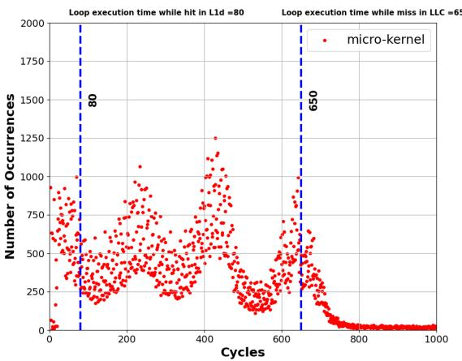
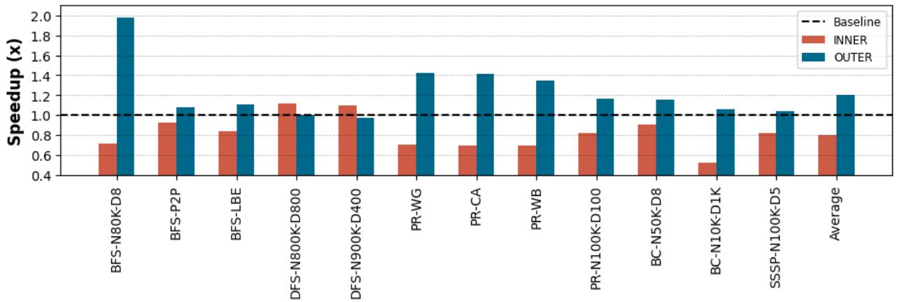
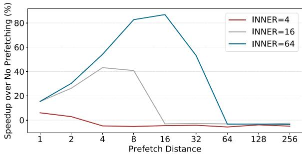

# APT-GET: Profile-Guided Timely Software Prefetching 通俗讲解

### 0. 整体创新点通俗解读

**痛点直击 (The "Why")**

- 传统的 **软件预取 (software prefetching)** 技术，比如 Ainsworth & Jones [9] 的方法，是**静态的**。它们在编译时就决定好要预取多远（prefetch-distance）以及在哪里插入预取指令（prefetch injection site）。
- 这个做法在现实世界中“很难受”，因为**最优的预取距离完全取决于程序动态运行时的行为**。一个循环里做的是简单计算还是复杂计算？循环会跑10次还是1000次？这些信息在编译时根本不知道。
- 结果就是，静态方法要么预取得太早，数据被挤出缓存白忙活；要么预取得太晚，数据还没到CPU就得等着，完全没隐藏掉内存延迟。这就导致了论文图6中，静态方法平均只有1.04倍的加速，甚至在某些情况下还会拖慢性能。

**通俗比方 (The Analogy)**

- 想象你要给一个正在高速公路上开车的朋友送水。静态方法就像是你在他们出发前，根据地图估算一个固定的距离（比如每100公里），然后在那个位置放一瓶水。
- 但如果朋友今天开的是跑车，或者路上堵车，你放水的位置就完全不对了。要么水放太早被别人拿走了（缓存被替换），要么朋友都开过去了水还没送到（预取太晚）。
- **APT-GET的做法完全不同**：它先让你朋友开着车跑一趟（**profile run**），你在旁边用秒表和GPS记录下他经过每个路标（load instruction）的实际时间。有了这份真实的“路况报告”，你就能精确计算出下次应该在哪个路口、提前多久把水递给他，确保他刚好口渴时水就到了。这个“路况报告”就是利用Intel CPU里的**Last Branch Record (LBR)** 硬件特性高效收集的。

**关键一招 (The "How")**

- 作者没有试图去构建一个复杂的静态模型来预测运行时间（这几乎不可能准确），而是巧妙地**将动态分析融入编译流程**，实现了一种**Profile-Guided Optimization (PGO)**。
- 具体来说，他们在标准的LLVM编译流程中插入了两个关键步骤：
    1. **动态画像**：利用硬件 **LBR** 和 **PEBS** 功能，在一次低开销的运行中，精准捕获那些造成性能瓶颈的“问题加载指令”（delinquent loads），并记录下包含这些指令的循环的**实际执行时间分布**（如图4所示）。通过分析这个分布的多个峰值，他们能推断出如果数据在L1缓存里，循环应该跑多快（IC_latency），从而反推出需要隐藏的内存延迟（MC_latency）。
    1. **精准制导**：基于上述动态画像，他们计算出**最优的预取距离**（`prefetch_distance = MC_latency / IC_latency`），并且还能智能判断**预取指令应该插在内层循环还是外层循环**（如图10所示）。对于trip count很小的内层循环，在外层循环进行更激进的预取反而效果更好。
- 最终，这些动态分析得出的“最优参数”会被喂给一个改进版的LLVM编译器Pass，让它在生成最终代码时，注入**时机恰到好处**的预取指令。这就把原本“盲人摸象”式的静态预取，变成了“有的放矢”的动态优化。

*Figure 4. Distribution of a loop’s execution time containing a delinquent load [39] in terms of CPU cycles measured using LBR samples*

*Figure 6. Execution time speedup provided by APT-GET over the non-prefetching baseline: APT-GET achieves 1.30× average speedup on average, compared to the 1.04× speedup provided by the state of the art (Ainsworth & Jones).*

*Figure 10. Speedup of injecting prefetches inside the outer or inner loops over non-prefetching baseline: For most of the applications, injecting prefeches inside the outer loop achieves 1.20× overall speedup in average, while injecting prefetches inside the inner loop improves speedup for DFS up to 1.11× over non-prefethcing baseline.*

### 1. Profile-Guided Prefetch Distance Calculation (ELI5)

**痛点直击**

- 传统的软件预取（Software Prefetching）最大的问题在于“静态”。它通常由编译器在编译时，基于代码结构和一些启发式规则，硬编码一个固定的 **prefetch-distance**（预取距离）。
- 这个做法在现实中非常“难受”，因为最优的预取距离根本不是代码决定的，而是由**动态执行时间**决定的。同一个循环，在不同输入、不同CPU负载下，其每次迭代的耗时天差地别。
- 如果预取太早（distance太大），数据可能在真正用到之前就被**cache eviction**（缓存驱逐）了，白忙活一场；如果预取太晚（distance太小），数据还没从内存加载完，CPU就已经stall（停顿）了，完全没起到隐藏延迟的作用。这就是论文里反复强调的 **timeliness**（及时性）问题。

**通俗比方**

- 想象你要给一个正在跑步的朋友递水。你不能在他刚起跑时就把水递过去（太早，他用不上，水还可能洒了），也不能等他跑到你面前快渴晕了才递（太晚，他已经脱水了）。
- 最佳时机取决于他的**实时配速**。如果他今天状态好跑得快，你就得提前更远的距离准备好水；如果他今天跑得慢，你就可以晚一点再准备。
- 以前的静态方法，就像是你不管他今天跑多快，每次都固定在他跑过第100米标记时递水。而APT-GET的做法是，先偷偷跟拍他跑一圈，精确记录下他每一段的速度，然后根据这个**profile**（画像）来计算出下次递水的最佳位置。

**关键一招**

- 作者没有试图去静态地估算代码的执行周期（这在现代复杂CPU上几乎不可能准确），而是巧妙地利用了Intel CPU内置的硬件性能监控单元——\*\*Last Branch Record \*\*(LBR)。
- LBR能以极低开销记录下程序执行过程中最近32次分支跳转的**精确CPU周期数**。对于一个循环来说，两次连续的循环回跳（loop back-edge）之间的周期差，就是这次循环迭代的真实耗时。
- APT-GET的核心洞察在于：一个包含**delinquent load**（导致LLC miss的坏家伙load）的循环，其执行时间的分布图会呈现出多个峰值。
    - 

*Figure 4. Distribution of a loop’s execution time containing a delinquent load [39] in terms of CPU cycles measured using LBR samples*

- 这些峰值分别对应着load指令从**L1 cache**、**L2 cache**、**LLC** 或 **DRAM** 命中时的不同延迟。最左边的峰值（如图中的~80 cycles）代表了当load能命中L1/L2时的\*\*纯指令执行时间 \*\*(IC_latency)，也就是理想情况下循环应该跑多快。
- 最右边的峰值（如图中的~650 cycles）则代表了load发生DRAM miss时的\*\*总延迟 \*\*(IC_latency + MC_latency)。
- 通过这两个关键数据点，APT-GET就能算出需要隐藏的\*\*内存延迟 \*\*(MC_latency = 650 - 80 = 570 cycles)。再除以理想情况下每次迭代的时间 (IC_latency = 80 cycles)，就得到了最优的预取距离：**prefetch-distance ≈ MC_latency / IC_latency = 570 / 80 ≈ 7**。
- 这个逻辑转换极其精妙：它绕开了无法预测的绝对执行时间，转而通过分析**执行时间的分布特征**，直接提取出了进行有效预取所必需的相对时间关系。

### 2. Dynamic Prefetch Injection Site Selection (ELI5)

**痛点直击 (The "Why")**

- 传统的软件预取（如 Ainsworth & Jones 的工作）有个“死脑筋”：它总是把 prefetch 指令塞到最内层循环里。这在内层循环跑很多次（high trip count）时没问题，因为预取有足够的时间生效。
- 但现实很骨感：很多应用（尤其是图计算）的内层循环可能只跑几次（low trip count），甚至只有一次。这时，在内层循环里插预取就“来不及了”——prefetch 指令刚发出，数据还没从内存拿回来，程序就已经要用这个数据了，完全没起到隐藏延迟的作用。
- 更糟的是，如果强行在内层循环预取，还会白白增加 **instruction overhead**，拖慢程序。这就像是在短跑比赛里做一套冗长的热身动作，不仅没帮助，反而耽误起跑。

**通俗比方 (The Analogy)**

- 这就像你要去一个很远的仓库取货。如果你知道接下来一整天都要不停地取货（高 trip count），那你就在每次取完货后，立刻为下一次取货下单（在内层循环预取），这样货总能及时送到。
- 但如果你今天只需要去仓库取 **3 次** 货（低 trip count），等你第一次取完再下单，第二次的货肯定来不及。聪明的做法是，在你出门前（在外层循环），就把今天所有要取的货单一次性都下了。这样，当你到达仓库时，货已经快送到了。
- APT-GET 做的就是这个“聪明管家”的角色，它先观察一下你的“取货频率”（通过 LBR 分析 loop trip count），再决定是在“每次取货后下单”还是“出门前一次性下单”。

**关键一招 (The "How")**

- 作者没有沿用“无脑插内层循环”的老路，而是巧妙地利用了现代 CPU 的 **Last Branch Record (LBR)** 硬件特性。
- LBR 记录了最近执行的分支历史。APT-GET 通过分析这些记录，可以精确地数出在一个外层循环迭代中，内层循环平均执行了多少次（即 **average trip count**）。
- 基于这个动态信息，APT-GET 引入了一个简单的决策逻辑（论文中的 Equation 2）：
    - 如果 `average_trip_count * K < prefetch_distance`（其中 K 是一个与覆盖率相关的常数），就意味着在内层循环预取覆盖不全、效率低下。
    - 此时，APT-GET 会“扭转”预取的位置，将 prefetch slice **提升并注入到外层循环**中。
- 这个操作的关键在于，LLVM Pass 需要能够处理跨循环的依赖关系。它不仅要复制内层循环的地址计算逻辑（load-slice），还要正确地将外层循环的 induction variable 纳入计算，并对内层变量进行合理的初始化（例如设为0）或展开，以确保在外层就能准确计算出未来需要访问的地址。

*Figure 2. Performance impact of prefetch-distance for indirect memory access kernel with low work function complexity and varying inner loop trip count*

*Figure 10. Speedup of injecting prefetches inside the outer or inner loops over non-prefetching baseline: For most of the applications, injecting prefeches inside the outer loop achieves 1.20× overall speedup in average, while injecting prefetches inside the inner loop improves speedup for DFS up to 1.11× over non-prefethcing baseline.*

### 3. LLVM Compiler Pass for Profile-Guided Prefetching (ELI5)

**痛点直击 (The "Why")**

- 传统的 **compiler-based software prefetching**（比如 Ainsworth & Jones 的工作）是纯静态的。它在编译时分析代码，决定在哪里插 `prefetch` 指令以及预取多远（**prefetch-distance**）。
- 这个做法在现实世界里“很难受”，因为它完全不知道程序跑起来后的真实情况：
    - 它不知道一个循环体到底要花多少 **CPU cycles** 才能跑完一次。这个时间取决于指令本身的延迟、cache hit/miss 状态等等，而这些在编译时是无法精确预知的。
    - 结果就是，它只能用一个**固定的、拍脑袋的 prefetch-distance**（比如 16 或 32）。如果距离太短，prefetch 发出得太晚，数据还没到 CPU 就得等着（**late prefetch**）；如果距离太长，prefetch 的数据可能早就被 cache evict 掉了，白忙活一场（**early prefetch**）。
    - 更糟的是，对于**嵌套循环**，它只会傻乎乎地在最内层循环里插 prefetch。但如果内层循环的 trip count 很小（比如只有 4 次），那在内层插 prefetch 根本没时间把数据从内存拉回来，完全无效。

**通俗比方 (The Analogy)**

- 想象你要给一个正在高速公路上开车的朋友送一份他急需的文件。传统编译器的做法就像是，你在地图上量了一下距离，然后在他出发前就打电话告诉他：“你开到第 10 个路牌的时候，我就把文件空投到你车顶上”。
- 但问题是，你不知道他今天路上会不会堵车（cache miss）、他的车性能如何（CPU IPC）、甚至他会不会临时改道（分支预测失败）。如果你按不堵车的情况计算，他很可能在空投点等半天文件都没到；如果你按最堵车的情况算，文件可能早就被风吹跑了。
- **APT-GET 的做法完全不同**：它先让你朋友开着车跑一趟（**profiling run**），车上装了个黑匣子（**Intel LBR**）记录下他每次经过关键路牌时的精确时间。有了这份真实的时间日志，你就能精确计算出下次他再经过这里时，需要提前多久发出空投指令才能让他刚好在需要时拿到文件。这就是 **profile-guided** 的精髓——用真实世界的动态信息来指导静态代码生成。

**关键一招 (The "How")**

- 作者并没有抛弃现有的 LLVM 编译框架，而是巧妙地在中间插入了一个 **profile-driven decision layer**。具体来说，他们实现了一个 **function-level LLVM pass**，其核心逻辑转换如下：
    - **第一步：精准定位问题代码**。利用 **perf** 工具和 **PEBS** 采样，找到那些导致大量 **LLC misses** 的“罪魁祸首” load 指令，并记录下它们的 **Program Counter (PC)**。
    - **第二步：建立 PC 到 IR 的映射**。这是最关键的一步。他们借助了 **AutoFDO** 的能力，将 profiling 阶段得到的二进制 PC 地址，精确地映射回 LLVM **Intermediate Representation (IR)** 中的具体 load 指令。这样，编译器就知道该对哪条 IR 指令动手了。
    - **第三步：动态计算最优参数**。通过分析 **LBR** 记录的循环执行时间分布（如

*Figure 4. Distribution of a loop’s execution time containing a delinquent load [39] in terms of CPU cycles measured using LBR samples*

所示），分离出指令执行延迟（**IC_latency**）和内存访问延迟（**MC_latency**），从而计算出理论上能完全隐藏内存延迟的 **optimal prefetch-distance**。同时，通过统计 LBR 中的分支记录，还能判断出循环的 **trip count**，以决定是在内层还是外层循环注入 prefetch。

- **第四步：灵活注入 Prefetch Slice**。一旦有了精确的目标 IR 指令和动态计算出的 **prefetch-distance**，LLVM pass 就会执行类似 Ainsworth & Jones 的 **load-slice extraction**，但它注入的不再是固定距离的 prefetch，而是根据 profile 量身定做的、带有**可变距离**的 prefetch slice。对于嵌套循环，它甚至能将 slice 提升到外层循环中执行，如

*Listing 3. The simplified LLVM’s IR-level representation of the microbenchmark 1 before injecting the prefetch slice Listing 4. The simplified LLVM’s IR-level representation of the microbenchmark 1 after injecting the prefetch slice inside the inner loop*

所示。

______________________________________________________________________

这种设计的精妙之处在于，它将**动态 profiling 的高精度**与**静态编译的低开销**完美结合。Profiling 只需运行一次，开销极小（\<20秒），而生成的优化代码在后续所有运行中都能持续受益，最终在真实应用上取得了 **1.30x** 的平均加速比，显著优于静态方法的 **1.04x**。

*Figure 6. Execution time speedup provided by APT-GET over the non-prefetching baseline: APT-GET achieves 1.30× average speedup on average, compared to the 1.04× speedup provided by the state of the art (Ainsworth & Jones).*

### 4. Automated Delinquent Load Profiling Methodology (ELI5)

**痛点直击 (The "Why")**

- 传统的软件预取（Software Prefetching）最大的问题不是“不知道要预取什么”，而是“不知道什么时候预取”。编译器在静态分析时，面对一个循环里的间接内存访问（如 `T[BO[e]+BI[i]]`），它能准确地算出未来要访问的地址（即生成正确的 **prefetch-slice**），但它完全不知道这个循环跑一圈到底需要多长时间。
- 这个“时间”至关重要。如果预取得太早，数据可能在用到之前就被 **cache eviction** 赶出去了；如果预取得太晚，CPU还是得干等着 **DRAM latency**。这就像送快递，地址写对了，但要么提前一个月送到（包裹丢了），要么在客户要用的那一刻才出发（客户等急了）。
- 静态分析无法获知动态执行时间，因为现代CPU的执行时间受太多因素影响：指令级并行（ILP）、缓存命中/未命中、分支预测等等。因此，现有方法只能靠程序员手动调一个固定的 **prefetch-distance**，这显然无法适应不同应用、不同输入甚至不同硬件。

**通俗比方 (The Analogy)**

- 想象你是一个餐厅的主厨（CPU），你的助手（Prefetcher）负责从仓库（Memory）里拿食材（Data）。菜单（Program）上写着每道菜需要哪些食材，但没写做每道菜要花多久。
- 一个笨助手只会按固定节奏拿食材，比如“做完一道菜就去拿下三道菜的料”。但如果今天客人点的都是快手菜，料还没用就放坏了（Cache Eviction）；如果点的是慢炖菜，做到一半发现料没了，就得停工等待（Stall）。
- APT-GET的做法是，在正式营业前，先试营业一天（Profiling Run）。在试营业时，它给厨房装了一个智能计时器（**LBR**），精确记录下每道菜从开始做到完成花了多少时间，并且特别关注那些因为等食材而耽误时间的菜（**Delinquent Loads**）。通过分析这些数据，它就能为每道菜精确计算出：“在开始做这道菜后的第X秒，助手就应该出发去拿Y道菜之后的食材”。这个X和Y就是最优的 **prefetch-distance** 和 **injection site**。

**关键一招 (The "How")**

- 作者没有试图去构建一个复杂的静态性能模型（那几乎不可能准确），而是巧妙地利用了现代Intel CPU里两个现成的、低开销的硬件特性：\*\*PEBS \*\*(Precise Event-Based Sampling) 和 \*\*LBR \*\*(Last Branch Record)。
- **第一步：精准定位问题**。通过 **PEBS**，系统可以精确地捕获到那些导致 \*\*LLC \*\*(Last Level Cache) 的 **delinquent load** 指令的程序计数器（PC）。这就锁定了需要优化的目标。
- **第二步：动态测量时间**。在同一个 profiling run 中，系统同时开启 **LBR**。LBR会记录下最近32次分支跳转的源地址、目标地址和**精确的CPU周期数**。
- **第三步：建立时间分布模型**。对于每一个被标记的 **delinquent load**，APT-GET会回溯LBR记录，找到包含该load的循环体的两次连续执行，并计算它们之间的时间差。由于内存访问延迟的巨大差异（L1: ~4 cycles, DRAM: ~300+ cycles），这些时间差会形成多个明显的峰值（Peaks），如

*Figure 4. Distribution of a loop’s execution time containing a delinquent load [39] in terms of CPU cycles measured using LBR samples*

所示。

- **第四步：自动推导参数**。最低的那个峰值（如图中的~80 cycles）就代表了当所有数据都在缓存中时，该循环的纯计算开销（**IC_latency**）。最高峰值与最低峰值的差值（如650 - 80 = 570 cycles）就是需要被隐藏的内存延迟（**MC_latency**）。用这个内存延迟除以每次迭代的计算开销，就得到了最优的 **prefetch-distance**（570 / 80 ≈ 7）。整个过程完全自动化，无需任何人工干预。
