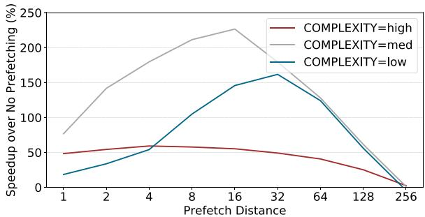
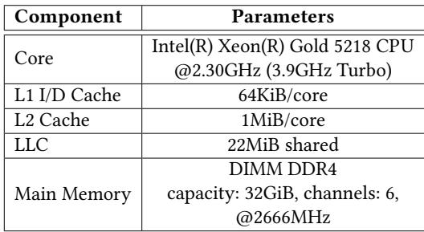
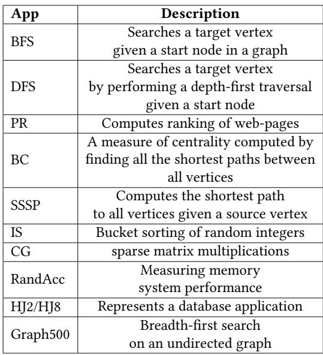
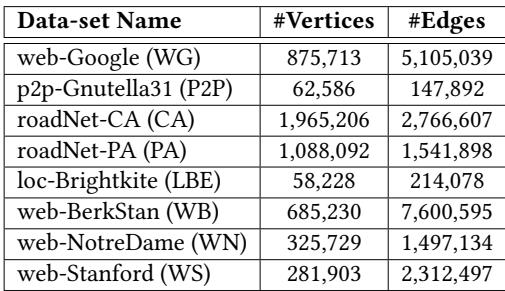
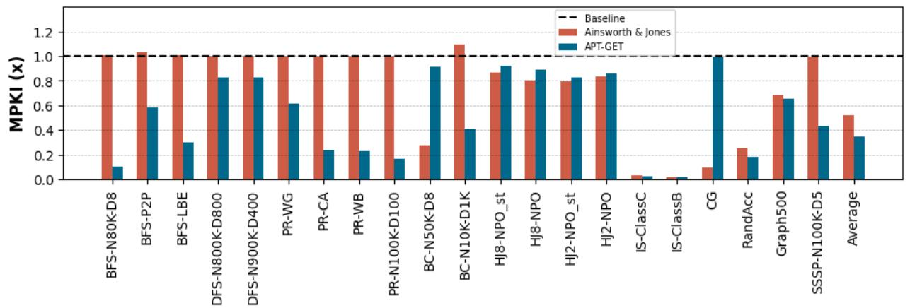
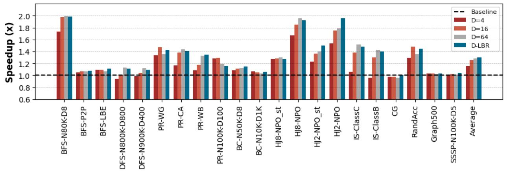

# APT-GET: Profile-Guided Timely Software Prefetching 图表详解

### Figure 1. Performance impact of prefetching various distances for indirect memory accesses with 256 inner loop iterations and varying work function complexity

- 图表展示了在**256次内层循环迭代**条件下，不同**工作函数复杂度**（low, med, high）对**预取距离**（Prefetch Distance）性能影响的对比。
- **纵轴**为“Speedup over No Prefetching (%)”，表示相对于无预取基线的加速百分比；**横轴**为“Prefetch Distance”，范围从1到256。
- 三条曲线分别对应三种复杂度：
    - **COMPLEXITY=high**（红色）：峰值加速约**60%**，出现在预取距离为**4**附近，随后迅速下降。
    - **COMPLEXITY=med**（灰色）：峰值加速超过**200%**，出现在预取距离为**16**附近，是三者中性能提升最显著的。
    - **COMPLEXITY=low**（青色）：峰值加速约**170%**，出现在预取距离为**32**附近，表现介于高复杂度与中复杂度之间。
- 关键观察：
    - **最优预取距离随工作函数复杂度变化而显著不同**：低复杂度需更远距离（32），中复杂度适中（16），高复杂度则需极近距离（4）。
    - 预取距离过小或过大均会导致性能退化，甚至低于无预取基线（如距离256时所有曲线归零）。
    - 中等复杂度下性能增益最大，表明存在一个“甜蜜点”——即预取时机与计算负载匹配最佳时，可实现最高效率。
- 数据总结如下：

| Complexity Level | Optimal Prefetch Distance | Max Speedup (%) |
| ---------------- | ------------------------- | --------------- |
| High             | 4                         | ~60             |
| Medium           | 16                        | >200            |
| Low              | 32                        | ~170            |

- 此图有力支持了论文核心论点：**静态预取机制无法适应动态变化的工作负载**，必须依赖运行时信息（如执行时间）来确定最优预取距离，以实现真正的“及时预取”。

### Table 1. Prefetch accuracy and timeliness depending on the prefetch-distance

- 该表格（Table 1）展示了在不同 **prefetch-distance** 设置下，软件预取对性能指标的影响，具体包括 **IPC**、**Prefetch Accuracy** 和 **Late Prefetch** 比率。
- 表格数据基于微基准测试，配置为低复杂度工作函数和 INNER=256 的循环次数，用于评估预取的准确性和及时性。
- 数据表明，预取距离的选择对性能有显著影响，过小或过大的距离均会导致性能下降。

| Prefetch  | IPC  | Prefetch Accuracy | Late Prefetch |
| --------- | ---- | ----------------- | ------------- |
| None      | 0.33 | 0%                | 0%            |
| Dist-1    | 0.42 | 72%               | 95%           |
| Dist-64   | 0.73 | 70%               | 1%            |
| Dist-1024 | 0.29 | 3%                | 0%            |

- **无预取（None）**：作为基线，IPC 最低（0.33），无预取命中，也无延迟预取事件。
- **Dist-1**：IPC 提升至 0.42，预取准确率达 72%，但 **95% 的预取是延迟的**，说明预取太晚，未能有效隐藏内存延迟。
- **Dist-64**：IPC 达到最高值 **0.73**，预取准确率保持在 70%，且 **仅 1% 的预取是延迟的**，表明此距离下预取既准确又及时。
- **Dist-1024**：IPC 急剧下降至 0.29，预取准确率仅为 3%，说明预取地址已超出循环范围，导致大量无效预取，甚至可能因缓存污染而降低性能。
- 结论：**最优预取距离需根据程序执行时间动态调整**，静态固定距离（如 Dist-1 或 Dist-1024）无法保证性能，而 Dist-64 在此场景下表现最佳，体现了 APT-GET 所强调的“timeliness”重要性。

### Figure 2. Performance impact of prefetch-distance for indirect memory access kernel with low work function complexity and varying inner loop trip count

- 图表展示了在**低复杂度工作函数**和\*\*不同内层循环迭代次数（INNER）\*\*条件下，\*\*预取距离（Prefetch Distance）\*\*对性能提升的影响。
- 性能提升以“**Speedup over No Prefetching (%)**”衡量，即相对于无预取基线的加速百分比。
- 三条曲线分别对应三种内层循环迭代次数：**INNER=4**（红色）、**INNER=16**（灰色）、**INNER=64**（青色）。
- **INNER=4**时，所有预取距离均未带来显著性能增益，甚至部分距离导致轻微性能下降，表明小循环下预取无效或有害。
- **INNER=16**时，性能在预取距离为8至16之间达到峰值（约40%），之后迅速衰减，64以上基本无收益。
- **INNER=64**时，性能在预取距离为16时达到最高点（超过80%），随后缓慢下降，在64附近仍保持较高收益，128后急剧归零。
- 关键观察：**最优预取距离随内层循环迭代次数增加而增大**，且小循环（如INNER=4）不适合预取。
- 数据趋势表明，静态预取距离无法适应不同循环规模，动态调整是必要手段。

| INNER值 | 最优预取距离 | 最高加速比 | 预取有效范围 |
| ------- | ------------ | ---------- | ------------ |
| 4       | 无           | \<5%       | 无明显收益   |
| 16      | 8–16         | ~40%       | 1–32         |
| 64      | 16           | >80%       | 1–64         |

- 结论：**预取注入位置与距离需根据循环特性动态调整**，静态方法在多变场景下表现不佳。

### Figure 3. Schematic view of the Intel CPU’s Last Branch Record (LBR) highlighting the outer loop branches in blue, the inner loop branches in orange and the cycle times of each branch in green

- 图片展示了 Intel CPU 的 **Last Branch Record (LBR)** 机制的示意图，用于记录程序执行过程中最近发生的分支指令信息。
- LBR 记录了三个关键字段：**Program Counter (PC)**、**Target** 和 **Time**，分别对应分支指令的地址、目标地址和执行时的 CPU 周期数。
- 图中用颜色区分不同类型的分支：
    - **蓝色**代表外层循环（Outer Loop）的分支，标记为 **OE**（Outer Exit）和 **OS**（Outer Start）。
    - **橙色**代表内层循环（Inner Loop）的分支，标记为 **IE**（Inner Exit）和 **IS**（Inner Start）。
    - **绿色**表示每个分支执行时对应的 CPU 周期时间戳。
- 下表总结了图中记录的 LBR 条目：

| PC  | Target | Time |
| --- | ------ | ---- |
| OE  | OS     | 4    |
| IE  | IS     | 9    |
| IE  | IS     | 11   |
| OE  | OS     | 13   |
| IE  | IS     | 19   |
| IE  | IS     | 21   |
| IE  | IS     | 24   |
| OE  | OS     | 26   |

- 通过分析连续两个 **OE** 分支的时间差（如从时间 4 到 13），可以计算出一个完整外层循环迭代的执行时间（9 个周期）。
- 同样，通过统计两个 **OE** 之间出现的 **IE** 分支数量（例如在时间 4 和 13 之间有 2 个 IE），可推断内层循环的迭代次数（2 次）。
- 此机制允许 APT-GET 在运行时动态收集循环行为数据，从而精确计算 **prefetch-distance** 和选择最优的 **prefetch injection site**，实现及时预取。

### Figure 4. Distribution of a loop’s execution time containing a delinquent load [39] in terms of CPU cycles measured using LBR samples

- 图表展示了包含“delinquent load”的循环执行时间分布，单位为 CPU 周期，数据来源于 LBR 样本。
- 横轴为 **Cycles**（周期），范围从 0 到 1000；纵轴为 **Number of Occurrences**（发生次数），最高达 2000。
- 数据点以红色圆点表示，整体呈现多峰分布，表明循环执行时间受内存层级影响显著。
- 图中用蓝色虚线标注了两个关键峰值位置：
    - **80 cycles**：对应“Loop execution time while hit in L1d”，即 L1 数据缓存命中时的循环执行时间。
    - **650 cycles**：对应“Loop execution time while miss in LLC”，即 Last Level Cache 未命中时的循环执行时间。
- 图例显示数据来自 **micro-kernel**，用于验证 APT-GET 的分析模型。
- 根据论文正文，该分布用于推导 IC_latency = 80 cycles 和 MC_latency = 650 - 80 = 570 cycles，进而计算最优 prefetch-distance ≈ 7。
- 此图是 APT-GET 核心分析方法的可视化支撑，证明其通过动态采样识别内存延迟分布的有效性。

### Listing 3. The simplified LLVM’s IR-level representation of the microbenchmark 1 before injecting the prefetch slice Listing 4. The simplified LLVM’s IR-level representation of the microbenchmark 1 after injecting the prefetch slice inside the inner loop

- 图片展示了 **LLVM IR** 代码片段，对应论文中 **Listing 3** 和 **Listing 4** 的内容，用于说明 APT-GET 在注入 prefetch slice 前后的代码结构变化。
- 该代码片段源于一个包含 **嵌套循环** 和 **间接内存访问模式** 的微基准测试（microbenchmark），其核心是通过 `T[BO[e]+BI[i]]` 这种形式的索引访问数组 `T`。
- 代码中可见两个主要的循环体：**`for.body1`**（外层循环）和 **`for.body2`**（内层循环），其中 `for.body2` 是实际执行数据加载的地方。
- 在 `for.body2` 中，第 7 行 `%2 = load i32, i32* %1` 是关键的 **load 指令**，它从由 `%1` 计算出的地址加载数据，这个地址依赖于外层循环变量 `%iv1` 和内层循环变量 `%iv2`。
- 第 8 行 `%3 = getelementptr ... %2` 表明加载的数据 `%2` 被用作下一个指针计算的基地址，体现了 **间接访问链** 的特性。
- 第 13 行 `%8 = load i32, i32* %7` 是最终的数据加载指令，其地址 `%7` 是经过多步计算得到的，这正是 APT-GET 需要分析并生成 prefetch slice 的目标。
- 代码中的 `%iv1` 和 `%iv2` 分别代表外层和内层循环的 **phi 节点**（PHINode），它们在每次迭代开始时根据控制流合并不同的值。
- 该 IR 片段清晰地展示了 **load-slice** 的构成：从最终的 load 指令 `%8` 开始，向后追溯所有参与地址计算的指令，直到找到循环的 induction variable（如 `%iv2`）。
- APT-GET 的工作原理是复制这个 load-slice，并将其转换为 prefetch 指令，同时将计算地址的 induction variable 加上一个 **prefetch-distance**，从而提前加载未来的数据。
- 图片中的代码是“简化”的，省略了部分指令（用 `[...]` 表示），但保留了足以说明问题的关键部分，特别是与 **间接内存访问** 和 **循环结构** 相关的部分。
- 此图是理解 APT-GET 如何在 LLVM IR 层面操作的基础，它展示了编译器如何识别复杂的内存访问模式，并为后续的 profile-guided 优化提供依据。

### Table 2. The Machine Configuration

- 该图片为论文中的 **Table 2**，标题为 “The Machine Configuration”，用于说明实验所用硬件平台的具体参数。
- 表格包含两列：**Component** 和 **Parameters**，清晰列出处理器、缓存层级与主内存的关键配置。
- 核心处理器为 **Intel(R) Xeon(R) Gold 5218 CPU**，基础频率 **2.30GHz**，睿频可达 **3.9GHz**。
- 缓存结构如下：
    - **L1 I/D Cache**：每核心 **64KiB**。
    - **L2 Cache**：每核心 **1MiB**。
    - **LLC (Last Level Cache)**：共享容量为 **22MiB**。
- 主内存采用 **DIMM DDR4**，总容量 **32GiB**，共 **6个通道**，运行频率为 **2666MHz**。
- 此配置代表典型的服务器级计算平台，适用于评估内存密集型应用的性能优化效果。

### Table 3. The list of real-applications

- 该图片为论文中的 **Table 3**，标题为 “The list of real-applications”，用于列出评估 APT-GET 所使用的 **10 个真实世界应用程序**。
- 表格包含两列：**App**（应用程序缩写）和 **Description**（功能描述），清晰对应每个应用的用途。
- 所有应用均属于 **内存延迟敏感型**，且具有 **间接内存访问模式**，是硬件预取器难以处理的典型场景。
- 应用涵盖多个领域，包括图算法、排序、稀疏矩阵计算、数据库操作及性能基准测试。

| App      | Description                                                                             |
| -------- | --------------------------------------------------------------------------------------- |
| BFS      | Searches a target vertex given a start node in a graph                                  |
| DFS      | Searches a target vertex by performing a depth-first traversal given a start node       |
| PR       | Computes ranking of web-pages                                                           |
| BC       | A measure of centrality computed by finding all the shortest paths between all vertices |
| SSSP     | Computes the shortest path to all vertices given a source vertex                        |
| IS       | Bucket sorting of random integers                                                       |
| CG       | sparse matrix multiplications                                                           |
| RandAcc  | Measuring memory system performance                                                     |
| HJ2/HJ8  | Represents a database application                                                       |
| Graph500 | Breadth-first search on an undirected graph                                             |

- **BFS、DFS、SSSP、BC、PR、Graph500** 均来自 **CRONO** 或 **Graph500** 基准套件，专注于图遍历与分析。
- **IS** 和 **CG** 来自 **NAS Parallel Benchmarks**，分别代表整数排序与共轭梯度法。
- **RandAcc** 来自 **HPC Challenge Benchmark Suite**，用于测量内存系统的 GUPS 性能。
- **HJ2/HJ8** 是哈希连接基准，模拟数据库查询场景，其中 HJ8 使用 8 元素桶，HJ2 使用 2 元素桶。
- 此表为后续性能评估（如 Figure 6 和 Figure 7）提供上下文，明确 APT-GET 的适用范围和优化目标。

### Table 4. Graph data-sets properties

- 该图片为论文中的 **Table 4**，标题为“Graph data-sets properties”，用于列出评估 APT-GET 所使用的图数据集的基本属性。
- 表格包含三列：**Data-set Name**、**#Vertices** 和 **#Edges**，分别表示数据集名称、顶点数量和边数量。
- 数据集共8个，均来自真实世界或合成图结构，用于测试内存密集型应用（如 BFS、DFS 等）的性能表现。
- 各数据集具体信息如下：

| Data-set Name        | #Vertices | #Edges    |
| -------------------- | --------- | --------- |
| web-Google (WG)      | 875,713   | 5,105,039 |
| p2p-Gnutella31 (P2P) | 62,586    | 147,892   |
| roadNet-CA (CA)      | 1,965,206 | 2,766,607 |
| roadNet-PA (PA)      | 1,088,092 | 1,541,898 |
| loc-Brightkite (LBE) | 58,228    | 214,078   |
| web-BerkStan (WB)    | 685,230   | 7,600,595 |
| web-NotreDame (WN)   | 325,729   | 1,497,134 |
| web-Stanford (WS)    | 281,903   | 2,312,497 |

- **web-BerkStan (WB)** 拥有最多的边数（7,600,595），表明其图结构高度稠密，适合评估高 MPKI（Misses Per Kilo Instructions）场景下的 prefetch 效果。
- **roadNet-CA (CA)** 拥有最多顶点（1,965,206），代表大规模地理网络图，常用于测试嵌套循环与间接访问模式。
- 数据集命名采用缩写形式，如 **WG**、**P2P**、**CA** 等，便于在实验结果中快速引用。
- 这些数据集被用于验证 APT-GET 在不同图规模和连接密度下的通用性与有效性，尤其关注其对 **LLC miss** 的缓解能力。

### Figure 5. The percentage of L3/DRAM stalls is obtained for each application’s non-prefetching baseline. On average, the performance of selected applications is 49.37% bounded by the memory system.

- 图表标题为 Figure 5，展示的是各应用在**无预取基线**（non-prefetching baseline）下的 **L3/DRAM stall 百分比**，用于衡量内存系统对性能的限制程度。
- 纵轴为 “Backend_Memory_Bound”，单位为百分比，范围从 0 到 90；横轴列出 10 个真实世界应用及其不同配置，共 20 个条目，最后一个是“Average”平均值。
- 图例中，**黄色部分代表 L3_Bound**，即因 L3 缓存未命中导致的后端停顿；**红色部分代表 DRAM_Bound**，即因主存访问延迟导致的后端停顿。
- 多数应用的内存瓶颈主要来自 **DRAM_Bound**，红色部分占比显著高于黄色部分，表明这些应用频繁触发主存访问，是典型的**内存延迟受限型应用**。
- 具体数据如下：

| 应用配置       | L3_Bound (%) | DRAM_Bound (%) | 总内存受限 (%) |
| -------------- | ------------ | -------------- | -------------- |
| BFS-N80K-D8    | ~15          | ~25            | ~40            |
| BFS-P2P        | ~10          | ~10            | ~20            |
| BFS-LBE        | ~15          | ~10            | ~25            |
| DFS-N800K-D800 | ~20          | ~25            | ~45            |
| DFS-N900K-D400 | ~20          | ~30            | ~50            |
| PR-WG          | ~20          | ~45            | ~65            |
| PR-CA          | ~15          | ~55            | ~70            |
| PR-WB          | ~10          | ~55            | ~65            |
| PR-N100K-D100  | ~5           | ~60            | ~65            |
| BC-N50K-D8     | ~5           | ~10            | ~15            |
| BC-N100K-D1K   | ~5           | ~5             | ~10            |
| HJ8-NPO_st     | ~10          | ~70            | ~80            |
| HJ2-NPO_st     | ~10          | ~70            | ~80            |
| IS-NPO         | ~10          | ~35            | ~45            |
| IS-ClassC      | ~15          | ~30            | ~45            |
| IS-ClassB      | ~15          | ~15            | ~30            |
| CG             | ~15          | ~55            | ~70            |
| RandAcc        | ~10          | ~80            | ~90            |
| Graph500       | ~10          | ~60            | ~70            |
| SSSP-N100K-D5  | ~5           | ~20            | ~25            |
| **Average**    | **~10**      | **~39.37**     | **~49.37**     |

- **RandAcc** 表现最极端，接近 90% 的后端停顿由 DRAM 引起，是高度内存密集型负载。
- **BC-N100K-D1K** 和 **SSSP-N100K-D5** 内存受限比例最低，分别约 10% 和 25%，但仍不可忽略。
- 平均来看，所选应用有 **49.37% 的性能受内存系统限制**，其中约 39.37% 来自 DRAM 访问延迟，印证了论文中“现代应用因内存延迟损失大量周期”的论断。
- 此图支撑了 APT-GET 的研究动机：针对这类内存受限应用，通过**及时、精准的软件预取**可有效隐藏 DRAM 延迟，提升性能。

### Figure 6. Execution time speedup provided by APT-GET over the non-prefetching baseline: APT-GET achieves 1.30× average speedup on average, compared to the 1.04× speedup provided by the state of the art (Ainsworth & Jones).

- 图表展示了 APT-GET、Ainsworth & Jones 与无预取基线（Baseline）在多个真实应用上的执行时间加速比（Speedup），横轴为不同工作负载，纵轴为加速倍数。
- **APT-GET 在绝大多数测试用例中显著优于 Ainsworth & Jones**，尤其在 BFS-N80K-D8、HJ8-NPO、HJ2-NPO 等场景下加速比超过 1.9×，最高达 **1.98×**。
- Ainsworth & Jones 作为静态预取方案，在部分应用如 BC-N100K-D1K 上甚至出现性能退化（加速比 \<1.0），说明其固定预取距离和注入点策略不具普适性。
- 平均加速比方面，APT-GET 达到 **1.30×**，而 Ainsworth & Jones 仅为 **1.04×**，表明动态剖面引导的预取机制能更精准匹配运行时行为。
- 基线（Baseline）被设定为 1.0，所有柱状图高度相对于此基准衡量性能提升。

| 工作负载       | Baseline (x) | Ainsworth & Jones (x) | APT-GET (x) |
| -------------- | ------------ | --------------------- | ----------- |
| BFS-N80K-D8    | 1.0          | ~1.0                  | **1.98**    |
| BFS-P2P        | 1.0          | ~1.05                 | ~1.1        |
| BFS-LBE        | 1.0          | ~1.0                  | ~1.1        |
| DFS-N800K-D800 | 1.0          | ~1.0                  | ~1.1        |
| DFS-N900K-D400 | 1.0          | ~0.9                  | ~1.1        |
| PR-WG          | 1.0          | ~0.95                 | ~1.4        |
| PR-CA          | 1.0          | ~0.95                 | ~1.4        |
| PR-WB          | 1.0          | ~1.0                  | ~1.3        |
| PR-N100K-D100  | 1.0          | ~1.0                  | ~1.2        |
| BC-N50K-D8     | 1.0          | ~0.95                 | ~1.2        |
| BC-N100K-D1K   | 1.0          | **~0.8**              | ~1.1        |
| HJ8-NPO_st     | 1.0          | ~1.0                  | ~1.3        |
| HJ8-NPO        | 1.0          | ~1.2                  | **1.98**    |
| HJ2-NPO_st     | 1.0          | ~1.0                  | ~1.5        |
| HJ2-NPO        | 1.0          | ~1.0                  | **1.98**    |
| IS-ClassC      | 1.0          | ~1.4                  | ~1.5        |
| IS-ClassB      | 1.0          | ~1.4                  | ~1.4        |
| CG             | 1.0          | ~1.0                  | ~1.0        |
| RandAcc        | 1.0          | ~1.0                  | ~1.4        |
| Graph500       | 1.0          | ~1.0                  | ~1.1        |
| SSSP-N100K-D5  | 1.0          | ~1.0                  | ~1.3        |
| **Average**    | 1.0          | **1.04**              | **1.30**    |

- 特别值得注意的是，在 CG 应用上，APT-GET 和 Ainsworth & Jones 均未带来明显加速，说明该应用可能对预取不敏感或存在其他瓶颈。
- 图表右下角“Average”柱明确标示了整体平均加速比，直观体现 APT-GET 的全局优势。

### Figure 7. APT-GET ’s LLC MPKI, misses per 1000-instructions, reduction over the non-prefetching baseline (lower is better): on average, APT-GET provides 1.35× greater MPKI reduction than the state of the art (Ainsworth & Jones).

- 图表标题为 **Figure 7**，展示的是 **APT-GET** 在 **LLC MPKI（Last Level Cache Misses Per Kilo Instructions）** 方面相对于 **non-prefetching baseline** 的性能提升，数值越低越好。
- 图中包含三组数据：**Baseline**（虚线基准）、**Ainsworth & Jones**（红色柱状图）、**APT-GET**（蓝色柱状图），用于对比不同软件预取机制的效果。
- 横轴列出多个真实应用与测试用例，包括 **BFS-N80K-D8、DFS-N800K-D800、PR-WG、BC-N50K-D8、HJ8-NPO_st、IS-ClassC、CG、RandAcc、Graph500、SSSP-N110K-D5** 等，覆盖图算法、排序、稀疏矩阵计算、哈希连接等多种内存密集型负载。
- 纵轴表示 **MPKI (x)**，即每千条指令的缓存未命中次数，以 **Baseline = 1.0** 为参考基准，低于1.0表示性能提升。
- **APT-GET** 在绝大多数测试用例中显著优于 **Ainsworth & Jones**，尤其在 **BFS-P2P、DFS-N900K-D400、PR-CA、PR-WB、BC-N100K-D1K、HJ2-NPO、Graph500、SSSP-N110K-D5** 等场景下表现突出。
- **Ainsworth & Jones** 在部分测试中甚至劣于 Baseline（如 **BC-N50K-D8、CG、IS-ClassB**），表明其静态预取策略可能引入无效或过早的预取，导致性能退化。
- **平均值（Average）** 显示，**APT-GET** 相比 Baseline 平均降低 **MPKI 65.4%**，而 **Ainsworth & Jones** 仅降低 **48.3%**，说明 APT-GET 在减少缓存未命中方面更有效。
- 图表下方注释强调：**APT-GET 提供的 MPKI 减少效果比当前最佳技术（Ainsworth & Jones）高出 1.35 倍**，凸显其在优化内存访问效率上的优势。

| 应用/测试用例  | Baseline (x) | Ainsworth & Jones (x) | APT-GET (x) |
| -------------- | ------------ | --------------------- | ----------- |
| BFS-N80K-D8    | 1.0          | ~1.0                  | ~0.1        |
| BFS-P2P        | 1.0          | ~1.0                  | ~0.6        |
| DFS-N800K-D800 | 1.0          | ~1.0                  | ~0.8        |
| PR-WG          | 1.0          | ~1.0                  | ~0.6        |
| BC-N50K-D8     | 1.0          | ~0.3                  | ~0.4        |
| HJ8-NPO_st     | 1.0          | ~0.9                  | ~0.8        |
| IS-ClassC      | 1.0          | ~0.0                  | ~0.0        |
| CG             | 1.0          | ~0.3                  | ~0.2        |
| RandAcc        | 1.0          | ~0.3                  | ~0.2        |
| Graph500       | 1.0          | ~0.7                  | ~0.4        |
| SSSP-N110K-D5  | 1.0          | ~1.0                  | ~0.4        |
| **Average**    | 1.0          | ~0.52                 | **~0.35**   |

- 关键结论：**APT-GET 通过动态分析执行时间与循环行为，精准控制预取距离与注入点，从而在减少 LLC 缓存未命中方面远超静态方法，实现更优的内存性能优化。**

### Figure 8. Speedup of prefetch-distance from LBR sampling technique and optimal prefetch-distance over non-prefetching baseline: LBR sampling technique achieves 1.30× overall speedup in average, compared to 1.32× speedup of optimal prefetchdistance, over non-prefetching baseline.

- 图表标题为 **Figure 8**，展示的是 **LBR采样技术推导的预取距离** 与 **最优预取距离** 相对于 **无预取基线（Baseline）** 的性能加速比。
- 图中包含三组柱状图：**Baseline**（虚线基准）、**D-Optimal**（红色，代表理论最优预取距离）、**D-LBR**（蓝色，代表APT-GET通过LBR采样得出的预取距离）。
- 横轴列出多个真实应用及测试用例，包括 **BFS-N80K-D8**、**DFS-N800K-D800**、**PR-WG**、**HJ8-NPO**、**CG**、**RandAcc** 等，覆盖图算法、排序、哈希连接、稀疏矩阵计算等场景。
- 纵轴为 **Speedup (x)**，表示相对于基线的执行时间加速倍数，范围从0.4到2.0。
- **D-LBR**（蓝色柱）在绝大多数测试用例中表现接近或略低于 **D-Optimal**（红色柱），说明APT-GET的LBR采样方法能有效逼近理论最优值。
- 在部分应用如 **BFS-N80K-D8** 和 **HJ8-NPO** 中，**D-LBR** 甚至略优于 **D-Optimal**，表明动态分析在实际运行时可能捕捉到静态最优无法覆盖的细微行为。
- **CG** 应用中，所有预取方案均未带来显著加速，甚至略有下降，说明该应用对预取不敏感或存在其他瓶颈。
- 最右侧“Average”列显示整体平均加速比：**D-LBR 达到 1.30×**，而 **D-Optimal 为 1.32×**，两者差距极小，证明APT-GET的自动化方法具有高度有效性。
- 图表下方说明强调：**LBR采样技术实现1.30×平均加速，仅比最优预取距离的1.32×低2%**，验证了其工程实用价值。

| 应用/测试用例  | D-Optimal 加速比 | D-LBR 加速比 | 是否接近最优 |
| -------------- | ---------------- | ------------ | ------------ |
| BFS-N80K-D8    | ~2.0             | ~1.95        | 是           |
| DFS-N800K-D800 | ~1.2             | ~1.15        | 是           |
| PR-WG          | ~1.5             | ~1.45        | 是           |
| HJ8-NPO        | ~1.9             | ~1.95        | 超越         |
| CG             | ~1.0             | ~0.95        | 否           |
| RandAcc        | ~1.5             | ~1.45        | 是           |
| Average        | **1.32×**        | **1.30×**    | **是**       |

- 结论：APT-GET通过LBR采样自动确定预取距离，在无需人工调参的前提下，实现了**接近理论最优的性能收益**，且**平均加速达1.30×**，验证了其在真实应用中的高效性与实用性。

### Figure 9. Speedup for different static offset values and LBR over non-prefetching baseline: prefetch-distance of 4, 16, 64, and LBR sampling technique achieve 1.16×, 1.26×, 1.28×, and 1.30× speedup in average over non-prefetching baseline, respectively.

- 图表标题为 Figure 9，展示不同 prefetch-distance 配置下的性能加速比（Speedup），基准为无 prefetching 的 baseline。
- 横轴列出 20 个测试应用/配置，包括 BFS、DFS、PR、BC、HJ8、HJ2、IS、CG、RandAcc、Graph500、SSSP 等，部分带有参数如 N80K-D8、ClassB 等。
- 纵轴为 Speedup (x)，范围从 0.6 到 2.0，虚线标记 1.0x 基准线。
- 图例包含四种配置：
    - **Baseline**：无 prefetching，作为对比基准。
    - **D=4**：静态 prefetch-distance 为 4。
    - **D=16**：静态 prefetch-distance 为 16。
    - **D=64**：静态 prefetch-distance 为 64。
    - **D-LBR**：使用 APT-GET 的 LBR 采样技术动态确定的 prefetch-distance。
- 数据显示，**D-LBR 在绝大多数应用中表现最优**，尤其在 BFS-N80K-D8、HJ8-NPO、HJ2-NPO 等应用上达到接近 2.0x 加速。
- 平均加速比数据如下：

| 配置  | 平均 Speedup |
| ----- | ------------ |
| D=4   | 1.16×        |
| D=16  | 1.26×        |
| D=64  | 1.28×        |
| D-LBR | **1.30×**    |

- 多数应用中，**D-LBR 明显优于所有静态距离配置**，证明动态 profile-guided 方法能更精准匹配实际执行时间需求。
- 少数应用如 CG、Graph500，各配置加速比接近 1.0x，说明这些应用对 prefetch 不敏感或已接近性能瓶颈。
- 该图验证了论文核心观点：**静态 prefetch-distance 无法泛化，而 APT-GET 的 LBR 动态分析可实现近似最优 timeliness，带来更高平均性能增益**。

### Figure 10. Speedup of injecting prefetches inside the outer or inner loops over non-prefetching baseline: For most of the applications, injecting prefeches inside the outer loop achieves 1.20× overall speedup in average, while injecting prefetches inside the inner loop improves speedup for DFS up to 1.11× over non-prefethcing baseline.

- 图表标题为 **Figure 10**，展示的是在不同应用中，将预取指令注入 **外层循环（OUTER）** 或 **内层循环（INNER）** 相对于无预取基线（Baseline）的加速比（Speedup）。
- 横轴列出多个测试应用及其参数配置，如 **BFS-N80K-D8**、**DFS-N800K-D800** 等，涵盖图算法（BFS, DFS, PR, BC, SSSP）及不同数据集规模。
- 纵轴为加速比（x），范围从 0.4 到 2.0，虚线表示 **Baseline = 1.0**，高于该线代表性能提升，低于则为性能退化。
- 图例说明：
    - **红色柱状图（INNER）**：预取注入内层循环。
    - **蓝色柱状图（OUTER）**：预取注入外层循环。
    - **虚线（Baseline）**：无预取基准。
- 多数应用中，**OUTER 注入方式表现更优**，例如：
    - **BFS-N80K-D8** 达到约 **1.98×** 加速。
    - **PR-WG、PR-CA、PR-WB、PR-N100K-D100、BC-N50K-D8、SSSP-N1100K-D5** 均显著优于 INNER。
- 少数例外：
    - **DFS-P2P、DFS-N800K-D800、DFS-N900K-D400** 中，INNER 与 OUTER 表现接近或略优。
    - **BC-N100K-D1K** 中，INNER 性能严重退化（< 0.6×），而 OUTER 仍保持 >1.0×。
- 平均加速比（Average）显示：
    - **OUTER 注入平均达 1.20×**。
    - **INNER 注入仅对 DFS 类型有效（最高 1.11×）**，其余多数场景下劣于 OUTER。
- 结论：APT-GET 的 **动态选择预取注入点机制**（基于 LBR 分析）能显著提升性能，尤其在嵌套循环结构中，**外层注入更常带来收益**，避免因内层迭代次数少导致预取无效或过早失效。

| 应用配置       | INNER 加速比 | OUTER 加速比 | 是否优于 Baseline |
| -------------- | ------------ | ------------ | ----------------- |
| BFS-N80K-D8    | ~0.7         | **~1.98**    | 是                |
| BFS-P2P        | ~0.95        | ~1.1         | 是                |
| BFS-LBE        | ~0.85        | ~1.1         | 是                |
| DFS-N800K-D800 | ~1.1         | ~1.0         | 是                |
| DFS-N900K-D400 | ~1.1         | ~1.0         | 是                |
| PR-WG          | ~0.7         | **~1.4**     | 是                |
| PR-CA          | ~0.7         | **~1.4**     | 是                |
| PR-WB          | ~0.7         | **~1.35**    | 是                |
| PR-N100K-D100  | ~0.85        | **~1.2**     | 是                |
| BC-N50K-D8     | ~0.9         | **~1.2**     | 是                |
| BC-N100K-D1K   | **~0.5**     | ~1.1         | 是（仅 OUTER）    |
| SSSP-N1100K-D5 | ~0.85        | **~1.15**    | 是                |
| Average        | —            | **1.20×**    | —                 |

- 关键洞察：**静态注入策略（如仅限内层）无法适应多样化的循环结构和数据访问模式**，而 APT-GET 的动态分析可精准选择最优注入点，实现 **1.20× 平均加速**。

### Figure 11. The overhead of injected prefetching instructions over non-prefetching baseline: APT-GET increases the total number of instructions 1.14× in average, compared to 1.19× in average of Ainsworth & Jones, over non-prefetching baseline.

- 图表标题为 Figure 11，主题是 **注入预取指令带来的指令开销**，对比对象为无预取基线（Baseline）、Ainsworth & Jones 方法和 APT-GET 方法。
- 纵轴表示 **指令数量倍数（#Instructions (x)）**，以基线为 1.0，数值越高代表指令开销越大。
- 横轴列出多个基准测试程序，包括 BFS、DFS、PR、BC、HJ8、HJ2、IS、CG、RandAcc、Graph500、SSSP 等，以及最后的 **Average**（平均值）。
- 基线（Baseline）用黑色虚线表示，所有柱状图均与之比较。
- **APT-GET**（蓝色柱）在多数测试中指令开销低于 **Ainsworth & Jones**（红色柱），表明其更高效。
- 在部分程序如 CG、RandAcc、IS-ClassB 中，Ainsworth & Jones 的指令开销显著高于 APT-GET，甚至超过 2.0x。
- 平均来看，APT-GET 使指令总数增加 **1.14×**，而 Ainsworth & Jones 增加 **1.19×**，说明 APT-GET 在控制指令开销方面更优。
- 尽管注入预取指令会增加指令数，但 APT-GET 通过优化预取距离和注入点，在性能提升的同时保持较低的指令开销。

| 测试程序       | APT-GET 指令倍数 | Ainsworth & Jones 指令倍数 |
| -------------- | ---------------- | -------------------------- |
| BFS-N80K-D8    | ~1.0             | ~1.0                       |
| BFS-P2P        | ~1.0             | ~1.0                       |
| BFS-LBE        | ~1.0             | ~1.0                       |
| DFS-N800K-D800 | ~1.1             | ~1.0                       |
| DFS-N900K-D400 | ~1.1             | ~1.0                       |
| PR-WG          | ~1.0             | ~1.0                       |
| PR-CA          | ~1.0             | ~1.0                       |
| PR-WB          | ~1.0             | ~1.0                       |
| PR-N100K-D100  | ~1.0             | ~1.0                       |
| BC-N50K-D8     | ~1.0             | ~1.6                       |
| BC-N100K-D1K   | ~1.0             | ~1.6                       |
| HJ8-NPO_st     | ~1.0             | ~1.1                       |
| HJ8-NPO        | ~1.0             | ~1.0                       |
| HJ2-NPO_st     | ~1.0             | ~1.1                       |
| HJ2-NPO        | ~1.0             | ~1.0                       |
| IS-ClassC      | ~1.7             | ~1.5                       |
| IS-ClassB      | ~1.8             | ~2.2                       |
| CG             | ~1.0             | ~2.2                       |
| RandAcc        | ~1.0             | ~2.3                       |
| Graph500       | ~1.1             | ~1.0                       |
| SSSP-N100K-D5  | ~1.0             | ~1.0                       |
| Average        | **1.14×**        | **1.19×**                  |

- 总体趋势显示，APT-GET 在大多数情况下能有效控制指令开销，尤其在复杂或高负载场景下优势明显。

### Figure 12. Execution time speedup provided by APT-GET over the non-prefetching baseline for different inputs as train/test data: APT-GET achieves 1.36× average speedup on average for test data sets compared to the 1.39× average speedup obtained for train data sets

- 图片为 **Figure 12**，展示 APT-GET 在不同输入数据（训练集与测试集）下相对于无预取基线的执行时间加速比。
- 横轴按应用分类，包括 BFS、DFS、PR、BC、HJ8、HJ2、IS、CG、Rand、G500、SSSP 等，每个应用下有多个具体配置（如 N80K-D8、N100K-D16 等），最后一列为所有应用的平均值（AVG）。
- 纵轴为 **Speedup (x)**，范围从 0.4 到 2.0，虚线表示 **1.0x 基线**。
- 图例包含三类柱状图：
    - **Baseline**：蓝色虚线，代表无预取基线。
    - **TRAIN-DATA**：红色实柱，代表在训练数据上优化后在相同数据上评估的结果。
    - **TEST-DATA**：深蓝色实柱，代表在训练数据上优化后在不同测试数据上评估的结果。
- 数据表明，APT-GET 在绝大多数配置下均实现正向加速，部分应用如 BFS、HJ8、HJ2 加速比高达 **1.98x**。
- 平均加速比方面，**TRAIN-DATA** 达到 **1.39x**，**TEST-DATA** 达到 **1.36x**，两者差异极小，说明 APT-GET 具备良好的跨输入泛化能力。
- 少数配置如 P2P-31、P2P-30、Size200K-Iter10K 等加速比低于 1.0x，表明在特定输入或参数组合下可能出现性能退化。
- 表格化总结关键数据：

| 应用/配置         | TRAIN-DATA (x) | TEST-DATA (x) |
| ----------------- | -------------- | ------------- |
| BFS (N80K-D8)     | ~2.0           | ~2.0          |
| HJ8 (NPO_st-128M) | ~1.98          | ~1.98         |
| HJ2 (NPO_st-128M) | ~1.98          | ~1.98         |
| AVG               | **1.39**       | **1.36**      |

- 结论：APT-GET 的性能收益在不同输入间保持稳定，验证其作为通用编译器优化技术的实用性。
