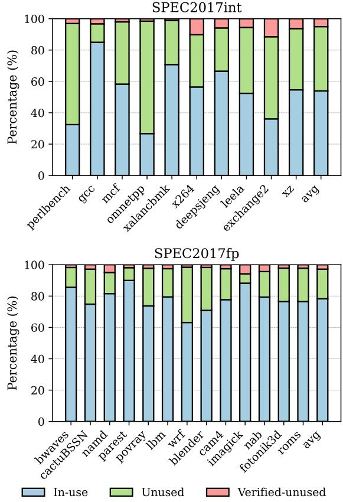
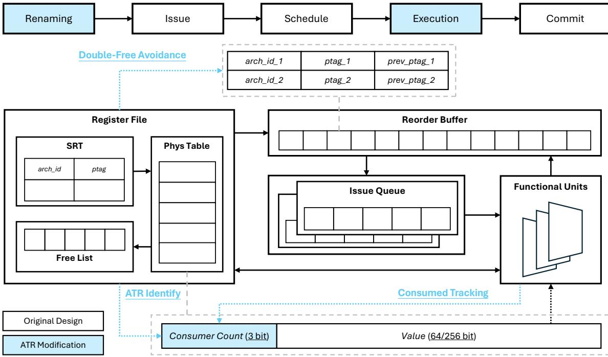
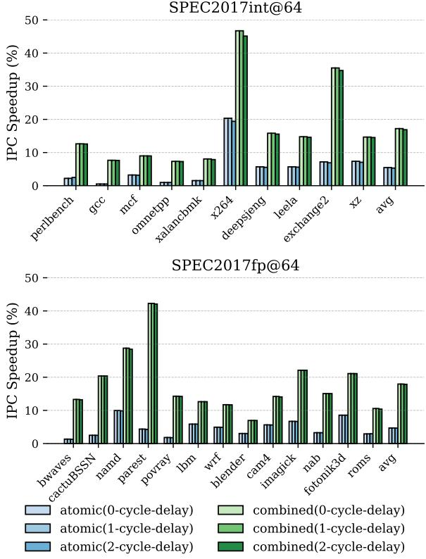

# ATR: Out-of-Order Register Release Exploiting Atomic Regions 图表详解

### Figure 1: IPC improves with increasing register file size

- 图表标题为“SPEC2017int”，横轴为“Number of Physical Registers”，范围从64至280，纵轴为“Normalized IPC”，范围从0.0至1.0，**基准值1.0代表无限寄存器配置下的理想性能**。
- 图中包含多条曲线，分别对应不同SPEC2017int基准测试程序：perlbench、gcc、mcf、omnetpp、xalancbmk、x264、deepsjeng、leela、exchange2、xz。
- 所有曲线均呈现随物理寄存器数量增加而**IPC逐步提升并趋于饱和**的趋势，表明寄存器资源对性能存在显著约束。
- 在64寄存器配置下，各程序的归一化IPC普遍较低，例如perlbench约为0.35，gcc约为0.45，**平均仅达理想性能的37.7%**，与正文描述一致。
- 随着寄存器数增至280，所有程序的IPC均接近1.0，说明在此规模下寄存器压力基本消除。
- 不同程序对寄存器敏感度存在差异：如x264和leela在低寄存器数时表现较差，增长斜率更陡；而perlbench和gcc则相对平缓。
- 该图直观验证了论文核心观点：**扩大物理寄存器文件是提升IPC的关键手段，但受限于面积与功耗，需通过高效释放机制（如ATR）缓解压力**。

| 程序名    | 64寄存器IPC（近似） | 280寄存器IPC（近似） |
| --------- | ------------------- | -------------------- |
| perlbench | 0.35                | 0.98                 |
| gcc       | 0.45                | 0.99                 |
| mcf       | 0.50                | 0.99                 |
| omnetpp   | 0.55                | 0.99                 |
| xalancbmk | 0.60                | 0.99                 |
| x264      | 0.30                | 0.99                 |
| deepsjeng | 0.40                | 0.99                 |
| leela     | 0.35                | 0.99                 |
| exchange2 | 0.50                | 0.99                 |
| xz        | 0.55                | 0.99                 |

- 曲线间交叉现象表明不同工作负载的寄存器需求模式各异，进一步凸显动态优化技术（如ATR）的必要性。

### Figure 2: An example of a register value that is speculatively released and laterreused.

- 图片展示了一个**寄存器值被投机性释放后又被重用**的典型场景，用于说明传统早期释放机制（Speculative Early Release）的安全隐患。
- 指令序列按程序顺序从上到下排列，左侧标注“Old”至“Young”，表示指令年龄递增。
- **I1** 执行 `add r1 ← r2, r3`，分配物理寄存器 **p1** 给架构寄存器 r1。
- **I2** 执行 `sub r2 ← r1, r3`，消费 p1 的值，此时若采用投机性释放策略，可能在 I2 执行后立即释放 p1。
- **I3** 执行 `cmp r2, r4`，无直接数据依赖于 p1。
- **I4** 执行 `jne .LABEL`，为条件分支指令，其预测结果将决定后续路径。
- **I5** 位于错误路径（misprediction），执行 `add r1 ← r3, r4`，重新定义 r1，触发对 p1 的释放（因 r1 被重定义且所有消费者已执行）。
- **.LABEL:** 标记正确路径的起始点。
- **I6** 位于正确路径，执行 `add r5 ← r1, r3`，试图消费 r1 的旧值（即 p1），但此时 p1 已被错误路径中的 I5 释放。
- 此例揭示了投机性释放的核心问题：**分支误预测后，被释放的寄存器值可能在恢复时被再次需要，导致数据错误**。
- 为应对该问题，现有方案需引入**影子寄存器文件（shadow register file）** 来备份已释放值，但这增加了硬件复杂度和资源开销。
- 该图直观支持论文主张：**非投机性释放（如ATR）通过原子提交区域避免此类风险，无需额外备份机制**。

### Figure 3: Partial events across the lifecycle of a register.

- 图片展示了物理寄存器生命周期中的关键事件及其部分时序关系，用于说明寄存器从分配到释放的完整过程。
- **I1 Renamed**：指令 I1 在重命名阶段为其目标架构寄存器 A 分配一个物理寄存器 P1，标志着寄存器生命周期的起点。
- **I2 Consumed**：最后一个消费指令 I2 执行完毕，意味着该物理寄存器 P1 的值已被所有消费者读取，进入“无用”状态。
- **I3 Redefined**：下一个指令 I3 重命名同一架构寄存器 A，将其映射到新的物理寄存器 P2，此时 P1 被重新定义，但尚未安全释放。
- **I3 Precommitted**：指令 I3 预提交，表示其之前的所有分支和异常指令均已解决，P1 可被标记为“验证无用”，但仍需等待最终提交。
- **I3 Committed**：指令 I3 提交，此时可安全释放物理寄存器 P1，完成其生命周期。

| 事件            | 描述                                      | 状态影响                                     |
| --------------- | ----------------------------------------- | -------------------------------------------- |
| I1 Renamed      | 指令 I1 重命名目标寄存器，分配 P1         | 寄存器进入 **In-use** 状态                   |
| I2 Consumed     | 最后一个消费者 I2 执行完毕                | 寄存器进入 **Unused** 状态（需 Oracle 信息） |
| I3 Redefined    | 指令 I3 重命名同一架构寄存器              | 寄存器仍为 **Unused**，但已重新定义          |
| I3 Precommitted | I3 预提交，所有前置控制流与异常指令已解决 | 寄存器进入 **Verified-unused** 状态          |
| I3 Committed    | I3 提交，允许释放 P1                      | 寄存器生命周期结束                           |

- 图中箭头表示事件间的部分顺序约束，例如 I1 Renamed 必须先于 I2 Consumed 和 I3 Redefined，而 I3 Precommitted 必须在 I3 Committed 之前。
- **关键洞察**：寄存器在“Unused”状态期间虽未被使用，但由于分支预测错误可能导致其重新被消费，因此不能立即释放；只有进入“Verified-unused”状态后才可安全释放。
- 此图是理解 ATR 技术的基础，它通过识别原子提交区域，在不依赖预提交的前提下安全释放寄存器，从而缩短寄存器占用时间。

### Figure 4: Cyclecount distribution across the register lifecycle.

- 图片展示了在 SPEC2017int 和 SPEC2017fp 基准测试中，物理寄存器在其生命周期内不同状态所占的周期百分比分布。

- 该图分为上下两个子图，分别对应整数型（SPEC2017int）和浮点型（SPEC2017fp）工作负载。

- 每个柱状图由三部分堆叠组成，代表三种寄存器状态：

    - **In-use**（蓝色）：寄存器正在被使用，即从分配到其所有消费者完成读取且已被重定义前的时间段。
    - **Unused**（绿色）：寄存器已不再被任何消费者需要，且已被重定义，但重定义指令尚未预提交（precommitted），此状态依赖于“Oracle”信息，因分支误预测可能导致寄存器重新进入 In-use 状态。
    - **Verified-unused**（红色）：寄存器已被消费、重定义，且重定义指令已预提交，此时可安全释放，无需担心误预测或异常。

- 对于 SPEC2017int 工作负载，各状态平均占比为：

    | 状态            | 平均占比 (%) |
    | --------------- | ------------ |
    | In-use          | 53.52        |
    | Unused          | 41.03        |
    | Verified-unused | 5.05         |

- 对于 SPEC2017fp 工作负载，各状态平均占比为：

    | 状态            | 平均占比 (%) |
    | --------------- | ------------ |
    | In-use          | 78.27        |
    | Unused          | 18.91        |
    | Verified-unused | 2.813        |

- 从数据可见，**Unused** 状态占据了相当大的比例，尤其是在整数基准中高达 41.03%，这表明存在巨大的早期释放潜力。

- 然而，传统非投机性早期释放（nonspeculative early release）仅能释放 **Verified-unused** 状态的寄存器，效率极低（仅 5.05% 或 2.813%）。

- 投机性早期释放（speculative early release）虽能释放 **Unused** 状态寄存器，但因不安全（需影子寄存器文件支持），实际应用受限。

- 本文提出的 ATR 技术旨在安全地释放部分 **Unused** 状态寄存器，填补了非投机性与投机性释放之间的性能鸿沟。

- 各基准测试程序间存在显著差异，例如在 SPEC2017int 中，`perlbenc` 的 In-use 占比最低（约 35%），而 `x264` 的 In-use 占比最高（约 75%），反映了不同程序对寄存器压力的不同需求。

### Figure 5: An example segment of instructions from SPEC2017int omnetpp.

- 图片展示了来自 SPEC2017int 基准测试程序 omnetpp 的一段指令序列及其在处理器流水线中的关键阶段时间戳，用于说明 **Atomic Commit Region** 的概念。
- 表格包含五列：指令编号（I1-I5）、指令操作码、目标寄存器与源寄存器、以及四个流水线阶段的时间点：**Re** (Rename), **Ex** (Execute), **Cm** (Commit), **Pr** (Precommit)。
- 指令 I1 是 `MOVE RAX ← RAX`，其 Rename 阶段发生在周期 510，Execute 在 675，Commit 和 Precommit 均在 839。该指令是后续分析的关键起点。
- 指令 I2 是 `TEST + JNZ ZPS ← RAX`，这是一个宏融合的条件分支指令。它在周期 510 被重命名，在 841 执行并提交/预提交。由于其分支特性，它阻止了后续指令的预提交。
- 指令 I3 是 `LEA RAX ← RDI`，在周期 709 重命名，716 执行和提交，841 预提交。其执行依赖于 I1 的结果。
- 指令 I4 是 `LEA RBX ← RAX`，在周期 729 重命名，737 执行和提交，842 预提交。它消费了 I3 的结果。
- 指令 I5 是 `SHR RBX ← RBX, ZPS`，在周期 729 重命名，738 执行和提交，842 预提交。它重新定义了寄存器 RBX。
- 核心观察点在于指令 I4 和 I5。尽管 I2 这个分支指令尚未解决（其 Pr 时间为 841），但在周期 738，当 I5 重命名时，I4 分配的物理寄存器可以被安全释放。这是因为 I4 和 I5 构成了一个原子区域——它们之间没有分支或异常指令。
- 如果 I2 发生误预测并导致刷新，那么 I4 和 I5 也会一并被刷新，因此提前释放 I4 的寄存器不会导致错误。这正是 ATR 技术的核心洞察：**在原子区域内，即使指令仍处于推测状态，也可以安全地提前释放其分配的寄存器**。
- 此例清晰地说明了传统非推测性早期释放机制的保守性（必须等待 I2 预提交）与 ATR 技术的激进性（在 I5 重命名时即可释放 I4 的寄存器）之间的区别。

### Figure 6: Atomic register ratio.

- 图片展示了 **Figure 6: Atomic register ratio**，用于量化在 SPEC2017int 和 SPEC2017fp 基准测试中，不同类型的指令序列所占物理寄存器分配比例。
- 图表分为上下两部分，分别对应 **SPEC2017int** 和 **SPEC2017fp** 的数据，纵轴为 Ratio（比例），横轴为各基准测试程序名称。
- 图例包含三种区域类型：
    - **nonbranch**：无条件分支的指令序列。
    - **nonexcept**：不含内存指令或异常引发指令的序列。
    - **atomic**：既无分支也无异常引发指令的原子提交区域。
- 数据表明，在 **SPEC2017int** 中，平均有 **17.04%** 的寄存器分配属于 **atomic** 区域；在 **SPEC2017fp** 中，该比例为 **13.14%**。
- 各程序表现差异显著：
    - 在 SPEC2017int 中，**x264** 的 atomic 区域占比最高，接近 0.5；而 **gcc** 几乎为 0。
    - 在 SPEC2017fp 中，**namd** 的 atomic 区域占比最高，超过 0.9；**cactusBSSN** 和 **parest** 则极低。
- 下表汇总了部分代表性程序的 atomic 区域比例：

| Benchmark  | atomic Ratio (SPEC2017int) | atomic Ratio (SPEC2017fp) |
| ---------- | -------------------------- | ------------------------- |
| x264       | ~0.5                       | ~0.25                     |
| gcc        | ~0.0                       | ~0.0                      |
| namd       | ~0.2                       | ~0.9                      |
| cactusBSSN | —                          | ~0.0                      |
| avg        | **17.04%**                 | **13.14%**                |

- 该图支撑论文核心观点：**atomic commit regions** 在实际程序中广泛存在，为安全的乱序寄存器释放提供了可观的优化空间。

### Figure 7: The proposed ATR design.

- 图片展示了 **ATR (Atomic register Release)** 技术在现代超标量乱序处理器中的整体架构设计，核心目标是实现安全的、非推测性的寄存器提前释放。
- 整个流水线从左至右依次为 **Renaming**、**Issue**、**Schedule**、**Execution** 和 **Commit** 阶段，其中 **Renaming** 和 **Execution** 阶段被高亮显示，表明它们是 ATR 修改的关键点。
- **Register File** 模块包含三个主要子组件：
    - **SRT (Speculative Renaming Table)**：负责将架构寄存器 ID（arch_id）映射到物理寄存器标签（ptag），这是重命名阶段的核心数据结构。
    - **Phys Table**：存储实际的寄存器值，每个条目包含一个 **64/256 bit** 的值字段和一个新增的 **3-bit Consumer Count** 字段。该计数器用于跟踪当前物理寄存器有多少个待消费的指令。
    - **Free List**：管理可用的物理寄存器标签（ptags），供重命名阶段分配使用。
- **Reorder Buffer (ROB)** 与 **Issue Queue** 协同工作，管理指令的乱序执行和提交顺序。
- **Functional Units** 执行指令，并在执行完成后通知相关模块。
- 图中用虚线框和文字标注了 ATR 引入的三项关键修改：
    - **ATR Identify**：指向 Phys Table 中新增的 **Consumer Count (3 bit)** 字段，这是识别原子区域和触发早期释放的基础。
    - **Consumed Tracking**：表示在指令进入 **Issue** 阶段时，会根据其源操作数对应的 ptag，对 Phys Table 中的 Consumer Count 进行递减操作。
    - **Double-Free Avoidance**：指向 ROB 中每个指令条目新增的 **prev_ptag** 字段。该字段在重命名时记录前一个被覆盖的 ptag。ATR 通过将其设为无效来标记该寄存器已被 ATR 提前释放，从而避免在后续的 Commit 阶段重复释放。
- 下方图例清晰区分了 **Original Design**（原始设计）和 **ATR Modification**（ATR 修改部分），突出了 ATR 是在现有架构上进行的增量式改进。
- 核心创新在于利用 **Consumer Count** 和 **prev_ptag** 的组合，在不引入复杂栈、队列或影子寄存器文件的前提下，实现了对原子提交区域的安全、提前寄存器释放。

### Figure 8: An example of aggressively releasing within ATR.

- 图片展示了一个指令序列示例，用于说明 **ATR (Atomic register Release)** 技术如何在原子提交区域内实现寄存器的激进释放。

- 该序列包含五条指令（I1 到 I5），每条指令后标注了其操作类型或语义：

    - I1: `jne .LABEL` —— 条件分支指令，标记为 **branch**。
    - I2: `add r1 ← r2, r3` —— 加法运算，将结果写入寄存器 r1，标记为 **rename r1**，表示对架构寄存器 r1 进行重命名。
    - I3: `sub r2 ← r1, r4` —— 减法运算，读取 r1 的值，标记为 **consume r1**，表示消费 r1。
    - I4: `mul r3 ← r1, r5` —— 乘法运算，再次读取 r1 的值，标记为 **consume r1**。
    - I5: `mul r1 ← r4, r5` —— 乘法运算，重新定义 r1，标记为 **redefine r1**。

- 指令 I2、I3、I4、I5 构成一个 **原子提交区域 (atomic commit region)**，因为它们之间没有条件分支或异常引发指令。

- 在此区域内，物理寄存器分配给 I2 的 r1 可以在 I5 重定义 r1 且 I3 和 I4 都已执行（即所有消费者完成）后被安全释放，即使更早的 I1 分支尚未解决。

- 关键洞察：**即使 I1 分支预测错误并导致刷新，I2-I5 也会作为一个整体被刷新，因此提前释放 I2 分配的物理寄存器是安全的**，不会导致后续指令访问无效寄存器。

- 此机制允许 **out-of-order register release**，即无需等待重定义指令预提交即可释放寄存器，从而减少寄存器文件压力。

- 该示例突显了 ATR 的核心优势：在保证精确异常处理的前提下，安全地提前释放仍处于推测状态的寄存器。

### Figure 9: Renaming stage modifcations for bulk setting of no-early-release

- 图片展示了 **ATR** 技术在寄存器重命名阶段为实现 **批量设置 no-early-release** 所做的硬件修改，核心目标是在检测到分支或异常指令时，快速标记当前所有活跃的物理寄存器（ptag）为不可提前释放。
- 该设计围绕 **SRT (Speculative Renaming Table)** 展开，SRT 存储了架构寄存器（arch_id）到物理寄存器（ptag）的映射。图中 SRT 显示了从索引 0 到 15 的条目，代表一个典型的 x86 架构中可能被访问的寄存器集合。
- **Per-way decoder** 模块负责根据当前周期内重命名的 N 条指令，生成对应的控制信号，以读取 SRT 中相关的 ptag。
- 关键路径包括：
    - 从 SRT 读取所有当前有效的 **旧 ptag**（即被架构寄存器当前映射的物理寄存器）。
    - 同时，从当前周期重命名的 N 条指令中获取 **新 ptag**。
    - 这些读取操作通过多路复用器（MUX）汇聚，并输入到 **ATR Cycle 1** 和 **ATR Cycle 2** 的逻辑云中进行处理。
- **ATR Cycle 1** 和 **ATR Cycle 2** 代表了为满足时序要求而引入的流水线级。它们共同执行“批量标记”逻辑，判断哪些 ptag 需要被设置为 **no-early-release** 状态。
- 最终输出是两组信号：
    - **Bulk marking**：一组并行信号，用于将选定的 ptag 标记为不可提前释放。
    - **SRT pipelined**：经过流水线延迟后的 SRT 数据，用于后续的寄存器重定义判断。
- 整个设计的关键在于其 **并行化** 和 **流水线化**。为了在单个周期内处理多达 23 个 ptag（例如在 8-wide x86 设计中），需要并行计算所有标记信号。同时，为了缓解组合逻辑延迟，引入了两级流水线，这要求对“重定义”信号进行相应的延迟补偿，以保证数据一致性。
- 下表总结了该模块的主要功能和设计考量：

| 组件                               | 功能                                              | 设计考量                           |
| :--------------------------------- | :------------------------------------------------ | :--------------------------------- |
| **SRT**                            | 提供架构寄存器到物理寄存器的实时映射              | 是批量标记操作的数据源             |
| **Per-way decoder**                | 解码当前周期重命名的指令，定位相关寄存器          | 支持多指令并行处理                 |
| **ATR Logic Clouds (Cycle 1 & 2)** | 执行批量标记算法，判断是否需设为 no-early-release | 采用流水线设计以满足时序           |
| **Bulk marking**                   | 输出最终的标记信号                                | 并行驱动多个 ptag 的状态位         |
| **SRT pipelined**                  | 延迟后的 SRT 数据                                 | 与标记逻辑同步，确保重定义判断准确 |

- 此设计的核心优势在于其 **高效性** 和 **安全性**。它能够在不增加复杂恢复机制的前提下，安全地阻止在非原子区域内的寄存器被过早释放，从而为 ATR 技术提供了关键的硬件支持。

### Figure 10: IPC speedup over the baseline with 64 and 224 physical registers.

- 图片展示了在 **64** 和 **224** 个物理寄存器配置下，三种寄存器重命名方案相对于基线（baseline）的 IPC 加速比（Speedup %），涵盖 **SPEC2017int** 和 **SPEC2017fp** 两大类基准测试。
- 四个子图分别对应：
    - SPEC2017int @ 64
    - SPEC2017fp @ 64
    - SPEC2017int @ 224
    - SPEC2017fp @ 224
- 每个子图中包含三组柱状图，代表三种技术：
    - **atomic**：蓝色，代表本文提出的 ATR 技术。
    - **nonspec-ER**：橙色，代表非投机性早期释放（Non-Speculative Early Release）。
    - **combined**：绿色，代表 ATR 与 nonspec-ER 的组合方案。
- 在 **64 寄存器配置**下：
    - **atomic** 方案在整数和浮点程序上均带来显著加速，平均分别为 **5.70%** 和 **4.69%**。
    - **nonspec-ER** 表现更优，平均加速达 **13.91%**（int）和 **14.43%**（fp），因其覆盖范围更广。
    - **combined** 方案进一步提升性能，在 int 和 fp 上分别额外获得 **3.23%** 和 **3.27%** 的加速，证明两种机制可协同增效。
- 在 **224 寄存器配置**下：
    - 寄存器压力减小，所有方案加速幅度下降。
    - **atomic** 平均加速为 **1.48%**（int）和 **1.11%**（fp）。
    - **nonspec-ER** 仍优于 atomic，但差距缩小。
    - **combined** 依然领先，平均比 nonspec-ER 多出约 **0.4%** 的加速。
- 关键观察：
    - 寄存器越少，ATR 效果越明显，因资源竞争更激烈。
    - ATR 与 nonspec-ER 互补：ATR 适用于原子区域，nonspec-ER 适用于非原子但已预提交的指令。
    - 组合方案始终最优，验证了技术正交性。

| 配置 | 工作负载    | atomic (avg) | nonspec-ER (avg) | combined (avg) |
| ---- | ----------- | ------------ | ---------------- | -------------- |
| 64   | SPEC2017int | 5.70%        | 13.91%           | 17.14%         |
| 64   | SPEC2017fp  | 4.69%        | 14.43%           | 17.70%         |
| 224  | SPEC2017int | 1.48%        | 1.11%            | 1.48%          |
| 224  | SPEC2017fp  | 1.11%        | 0.65%            | 1.11%          |

> 注：表中“combined (avg)”为相对于 baseline 的总加速，非增量值。实际增量为 combined 减去 nonspec-ER。例如在 64 寄存器 int 上，combined 相对于 nonspec-ER 增加了 3.23%。

### Figure 11: IPC speedup of the atomic scheme over the baseline with different RF Size.

- 图片展示了 **ATR** 技术在不同物理寄存器文件（RF）大小下相对于基线的 IPC 速度提升，分为 **SPEC2017int** 和 **SPEC2017fp** 两组。
- 每个基准测试的柱状图按寄存器文件大小分组，从 **64** 到 **280** 入口，颜色渐变表示尺寸递增。
- **SPEC2017int** 部分：
    - 多数程序在小 RF（如 64、96）时获得显著加速，例如 **x264** 在 64 入口时速度提升超过 **20%**。
    - 随着 RF 增大，加速效果普遍下降，如 **x264** 在 280 入口时加速降至约 **5%**。
    - 平均加速随 RF 增加而降低，64 入口平均约 **5.7%**，280 入口降至约 **0.93%**。
- **SPEC2017fp** 部分：
    - 加速趋势与整数类似，但整体幅度略低。
    - **parest** 和 **fotonik3d** 在小 RF 下表现突出，前者在 64 入口时加速接近 **10%**。
    - 平均加速从 64 入口的 **4.69%** 降至 280 入口的 **0.53%**。
- 总体观察：**寄存器压力越大（RF 越小），ATR 的收益越显著**；当 RF 足够大（如 280），寄存器不再是瓶颈，加速效果趋于平缓。
- 数据汇总如下：

| RF Size | SPEC2017int Avg Speedup (%) | SPEC2017fp Avg Speedup (%) |
| ------- | --------------------------- | -------------------------- |
| 64      | 5.70                        | 4.69                       |
| 96      | —                           | —                          |
| 128     | —                           | —                          |
| 160     | —                           | —                          |
| 192     | —                           | —                          |
| 224     | 1.48                        | 1.11                       |
| 280     | 0.93                        | 0.53                       |

- 图中 “avg” 表示所有程序的平均加速值，显示 ATR 在资源受限场景下具有明显优势。

### Table 1: Processor Configuration Table 2: SPEC CPU 2017 Benchmarks

- **核心配置**：该处理器模型基于 **Golden Cove** 架构，主频设定为 **3.0 GHz**，前端与退休宽度均为 **6-wide fetch/decode** 与 **8-wide retirement**，功能单元包含 **5 ALU、3 Load、2 Store**。
- **分支预测器**：采用 **TAGE-SC-L + BPU enhancements**，分支目标缓冲区（BTB）容量为 **12K entries**，间接分支目标缓冲区为 **3K entries**。
- **重排序缓冲区（ROB）**：大小为 **512 entries**，保留站（Reservation Station）为 **160 entries**，数据预取器支持 **Stream, Spatial** 策略。
- **指令预取器**：使用 **FDIP with deeper prefetch window**，加载缓冲区为 **96 entries**，存储缓冲区为 **64 entries**。
- **前端取指目标**：每周期支持 **2 FT targets**，FT块大小为 **64 B**。
- **缓存与内存系统**：
    - L1 指令缓存：**32 KiB, 8-way**
    - L1 数据缓存：**48 KiB, 12-way**
    - L2 统一缓存：**1.25 MiB, 10-way**
    - LLC 统一缓存：**Shared 3 MiB/core, 12-way**
    - L1 D-cache 延迟：**3 cycles**
    - L1 I-cache 延迟：**3 cycles**
    - L2 延迟：**14 cycles**
    - LLC 延迟：**40 cycles**
    - 内存类型：**DDR4-3200 (2 channels)**

| 参数                                  | 数值                                   |
| ------------------------------------- | -------------------------------------- |
| CPU                                   | Golden Cove                            |
| All-core turbo frequency              | 3.0 GHz                                |
| Frontend width and retirement         | 6-wide fetch/decode, 8-wide retirement |
| Functional Units                      | 5 ALU, 3 Load, 2 Store                 |
| Branch Predictor                      | TAGE-SC-L + BPU enhancements           |
| Branch Target Buffer (BTB)            | 12K entries                            |
| Indirect Branch Target Buffer         | 3K entries                             |
| ROB                                   | 512 entries                            |
| Reservation Station                   | 160 entries                            |
| Data Prefetcher                       | Stream, Spatial                        |
| Instruction Prefetcher                | FDIP with deeper prefetch window       |
| Load Buffer                           | 96 entries                             |
| Store Buffer                          | 64 entries                             |
| Frontend Fetch targets (FT) per cycle | 2                                      |
| FT block size                         | 64 B                                   |
| L1 instruction cache                  | 32 KiB, 8-way                          |
| L1 data cache                         | 48 KiB, 12-way                         |
| L2 unified cache                      | 1.25 MiB, 10-way                       |
| LLC unified cache                     | Shared 3 MiB/core, 12-way              |
| L1 D-cache latency                    | 3 cycles                               |
| L1 I-cache latency                    | 3 cycles                               |
| L2 latency                            | 14 cycles                              |
| LLC latency                           | 40 cycles                              |
| Memory                                | DDR4-3200 (2 channels)                 |

- **模拟环境**：该配置用于 **Scarab** 微架构模拟器，以匹配现代 Intel Golden Cove 处理器的性能特征，支持对 **SPEC2017int** 和 **SPEC2017fp** 基准测试套件进行评估。
- **设计目标**：通过精确建模前端、执行单元、缓存层次和内存子系统，确保模拟结果能反映真实硬件行为，从而有效评估 **ATR** 技术在不同寄存器文件大小下的性能增益。

### ea974a0515084d68793d911affa971644cb9d11b06a3a8a70b6490df2bd93f1b.jpg

- 该图片为一张表格，清晰列出了用于实验评估的 **SPEC CPU 2017** 基准测试套件中的具体程序。
- 表格内容分为两大类：**Integer benchmarks (SPEC2017int)** 和 **Floating-point benchmarks (SPEC2017fp)**。
- **Integer benchmarks (SPEC2017int)** 包含以下 9 个程序：
    - 500.perlbenc_h_r
    - 502.gcc_r
    - 505.mcf_r
    - 520.omnetpp_r
    - 523.xalancbmk_r
    - 525.x264_r
    - 531.deepsjeng_r
    - 541.leela_r
    - 548.exchange2_r
    - 557.xz_r
- **Floating-point benchmarks (SPEC2017fp)** 包含以下 13 个程序：
    - 503.bwaves_r
    - 507.cactuBSSN_r
    - 508.namd_r
    - 510.parest_r
    - 511.povray_r
    - 519.lbm_r
    - 521.wrf_r
    - 526.blender_r
    - 527.cam4_r
    - 538.imagick_r
    - 544.nab_r
    - 549.fotonik3d_r
    - 554.roms_r
- 此表格是论文第 5.1 节 “Experimental Methodology” 中所提及工作负载（Workloads）的具体清单，用于在 **Scarab** 模拟器上进行性能评估。

### Figure 12: Consumer count distribution.

- 图片展示了 **Figure 12: Consumer count distribution**，用于分析 ATR 技术中每个原子区域（atomic region）内物理寄存器的平均消费者数量分布。
- 数据按 **SPEC2017int** 和 **SPEC2017fp** 两大类基准测试分别呈现，横轴为具体工作负载名称，纵轴为百分比（%），表示不同消费者数量区间所占比例。
- 消费者数量分为六个区间：**1、2、3、4、5、6+**，分别用不同颜色块表示，图例位于图表下方。
- **SPEC2017int** 结果显示：
    - 多数工作负载（如 perlbench、gcc、mcf、omnetpp、xalancbmk、x264、leela、exchange2、xz）中，**1个消费者** 占主导地位（蓝色块占比最大）。
    - **deepsjeng** 是例外，其 **2个消费者**（绿色块）占比显著高于其他，接近 30%，表明该程序中寄存器重用模式更复杂。
    - 所有工作负载中，**6+ 消费者**（红色块）占比极低或为零，说明绝大多数原子区域内的寄存器消费行为集中在少数指令上。
- **SPEC2017fp** 结果显示：
    - **bwaves、cactuBSSN、parest、povray、lbm、wrf、blender、cam4、imagick、nab、fotonik3d、roms** 等多数工作负载同样以 **1个消费者** 为主。
    - **namd** 表现特殊，其 **3个消费者**（深蓝色块）和 **4个消费者**（深绿色块）合计占比超过 20%，是所有工作负载中消费者数量最多的，表明其数据流更密集。
    - 同样，**6+ 消费者** 在所有浮点工作负载中均未出现或可忽略。
- 综合来看，**绝大多数原子区域仅包含 1~2 个消费者**，这支持了 ATR 使用 **3-bit 计数器**（支持最多 6 个消费者，其中 1 位保留为 no-early-release）的设计是充分且高效的。
- 下表总结关键数据：

| 工作负载   | 主要消费者数量 | 特殊表现             |
| ---------- | -------------- | -------------------- |
| deepsjeng  | 1              | 2个消费者占比约30%   |
| namd       | 1              | 3/4个消费者合计超20% |
| 其余大部分 | 1              | 6+消费者基本为0      |

- 此分布验证了 ATR 的硬件开销（3-bit counter）在实际应用中是轻量级且有效的，无需更大计数器即可覆盖绝大多数场景。

### Figure 13: Performance effect of pipelining the register redefinition logic.

- 图片展示了在 **64-entry register file** 配置下，对 **SPEC2017int** 和 **SPEC2017fp** 基准测试套件中各程序的 IPC Speedup (%) 结果，用于评估 ATR 技术中寄存器重定义逻辑流水线化（pipelining）对性能的影响。
- 该图分为上下两个子图，分别对应整数和浮点工作负载。每个子图中的柱状图代表不同延迟配置下的性能提升百分比。
- 所有柱状图均按基准程序名称排列，从左至右依次为：perlbenc、gcc、mcf、omnetpp、xalancbmk、x264、deepsjeng、leela、exchange2、xz、avg（平均值）；以及 bwaves、cactuBSSN、namd、parest、povray、lbm、wrf、blender、cam4、imagick、nab、fotonik3d、roms、avg。
- 图例说明了六种不同的实验配置：
    - **atomic(0-cycle-delay)**：原子区域释放，无延迟
    - **atomic(1-cycle-delay)**：原子区域释放，1周期延迟
    - **atomic(2-cycle-delay)**：原子区域释放，2周期延迟
    - **combined(0-cycle-delay)**：原子 + 非投机性早期释放，无延迟
    - **combined(1-cycle-delay)**：原子 + 非投机性早期释放，1周期延迟
    - **combined(2-cycle-delay)**：原子 + 非投机性早期释放，2周期延迟
- 从数据趋势看，**延迟对性能影响极小**。无论是 atomic 还是 combined 方案，在引入 1 或 2 周期延迟后，IPC 提升幅度几乎没有变化，多数程序的差异在 ±1% 以内。
- 例如，在 SPEC2017int 的 x264 程序中，atomic(0) 达到约 20%，而 atomic(2) 仍保持在 20% 左右；在 SPEC2017fp 的 povray 中，combined(0) 约为 42%，combined(2) 仍接近 42%。
- 平均值（avg）显示，对于 SPEC2017int，atomic 方案在 0/1/2 延迟下分别为 ~5.7% / ~5.7% / ~5.7%；combined 方案为 ~8.9% / ~8.9% / ~8.9%。对于 SPEC2017fp，atomic 为 ~4.7% / ~4.7% / ~4.7%，combined 为 ~7.9% / ~7.9% / ~7.9%。
- 表格总结关键平均值：

| 配置                    | SPEC2017int avg IPC Speedup (%) | SPEC2017fp avg IPC Speedup (%) |
| ----------------------- | ------------------------------- | ------------------------------ |
| atomic(0-cycle-delay)   | 5.7                             | 4.7                            |
| atomic(1-cycle-delay)   | 5.7                             | 4.7                            |
| atomic(2-cycle-delay)   | 5.7                             | 4.7                            |
| combined(0-cycle-delay) | 8.9                             | 7.9                            |
| combined(1-cycle-delay) | 8.9                             | 7.9                            |
| combined(2-cycle-delay) | 8.9                             | 7.9                            |

- 结论：**ATR 的寄存器重定义逻辑即使引入 1~2 周期流水线延迟，也不会显著影响性能**，这验证了其设计在时序上的鲁棒性，允许硬件实现中通过增加流水级来满足高频需求而不牺牲效能。

### Figure 14: Average cyclecount between rename, redefine, and commit.

- 图片展示了在 **atomic commit regions** 内，物理寄存器生命周期中三个关键事件之间的平均周期数：**I1 Renamed**（首次重命名）、**I2 Consumed**（最后一次消费）、**I3 Redefined**（被重新定义）和 **I3 Committed**（重新定义指令提交）。
- 图表分为上下两部分，分别对应 **SPEC2017int** 和 **SPEC2017fp** 基准测试集。
- 每个基准测试的柱状图包含三组数据：
    - **黄色柱**：I3 Redefined - I1 Renamed，表示从寄存器首次分配到被重新定义的时间跨度。
    - **粉色柱**：I2 Consumed - I1 Renamed，表示从寄存器首次分配到其值被最后一次消费的时间跨度。
    - **绿色柱**：I3 Committed - I1 Renamed，表示从寄存器首次分配到重新定义指令最终提交的时间跨度。
- 数据表明，在绝大多数工作负载中，**I2 Consumed** 发生在 **I3 Redefined** 之后，这支持了 ATR 的设计前提：只要寄存器被重新定义且所有消费者已执行，即可安全释放，无需等待提交。
- 在 **SPEC2017int** 中，例如 `x264` 和 `deepspjeng`，**I3 Committed** 的周期数显著高于前两者，说明传统方法（等待提交）会持有寄存器过久。
- 在 **SPEC2017fp** 中，如 `bwaves` 和 `cactuBSSN`，**I3 Committed** 的延迟尤为明显，进一步凸显 ATR 提前释放寄存器的潜力。
- 平均值（avg）显示，无论整型还是浮点型基准，**I3 Committed - I1 Renamed** 的周期数远大于 **I3 Redefined - I1 Renamed** 和 **I2 Consumed - I1 Renamed**，证明 ATR 能有效缩短寄存器占用时间。

| Benchmark Group | Event Pair                | Average Cycle Count (Approx.) |
| --------------- | ------------------------- | ----------------------------- |
| SPEC2017int     | I3 Redefined - I1 Renamed | ~50                           |
|                 | I2 Consumed - I1 Renamed  | ~80                           |
|                 | I3 Committed - I1 Renamed | ~150                          |
| SPEC2017fp      | I3 Redefined - I1 Renamed | ~100                          |
|                 | I2 Consumed - I1 Renamed  | ~150                          |
|                 | I3 Committed - I1 Renamed | ~300                          |

- **关键结论**：ATR 利用原子区域特性，在 **I3 Redefined** 且 **I2 Consumed** 后即可释放寄存器，相比传统方法（等待 **I3 Committed**），可大幅减少寄存器占用周期，从而缓解寄存器文件压力。

### Figure 15: Overhead reduction of different schemes.

- 图片展示了三种不同寄存器重命名方案在**Register Count（寄存器数量）**、\*\*Runtime Power（运行功耗）**和**Core Area（核心面积）\*\*三个维度上的开销降低效果，对应论文中的Figure 15。
- 三种方案分别为：**atomic**（ATR原子区域释放）、**nonspec**（非投机性早期释放）、**combined**（两者结合）。
- 所有数据均以百分比形式呈现，表示相对于基线（280寄存器配置）的降低幅度。

| 维度           | atomic    | nonspec | combined  |
| -------------- | --------- | ------- | --------- |
| Register Count | **27.1%** | 24.3%   | **30.0%** |
| Runtime Power  | **5.5%**  | 5.0%    | **5.5%**  |
| Core Area      | **2.7%**  | 2.6%    | **2.9%**  |

- 在**寄存器数量**方面，**combined**方案表现最优，达到\*\*30.0%\*\*的降低，显著优于单独使用atomic或nonspec方案。
- 在**运行功耗**方面，**atomic**与**combined**方案均实现\*\*5.5%\*\*的降低，优于nonspec方案的5.0%。
- 在**核心面积**方面，**combined**方案同样领先，达到\*\*2.9%\*\*的降低，略高于atomic的2.7%和nonspec的2.6%。
- 数据表明，**ATR技术不仅独立有效，且与非投机性早期释放机制协同工作时能带来最大综合收益**，尤其在减少物理寄存器需求上效果突出。
