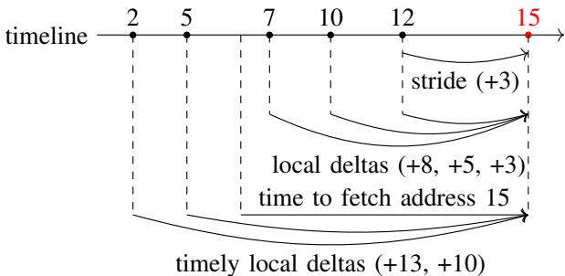
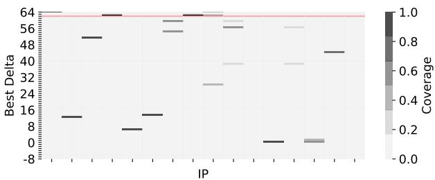
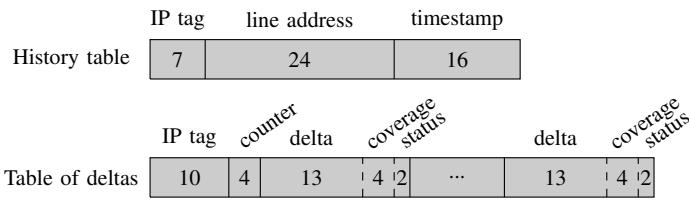
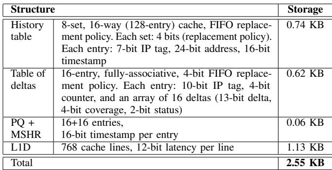
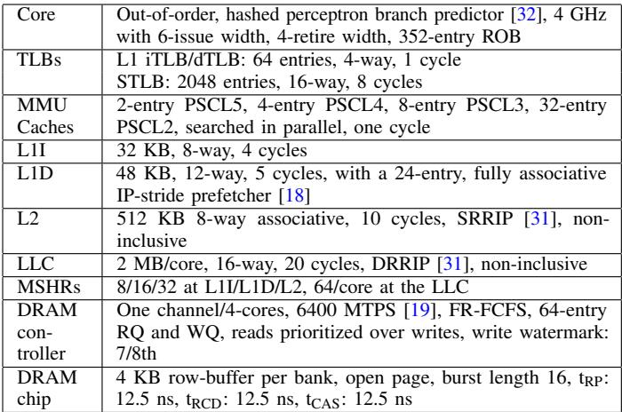
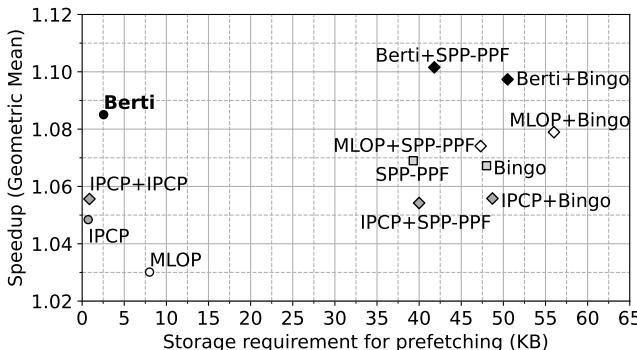
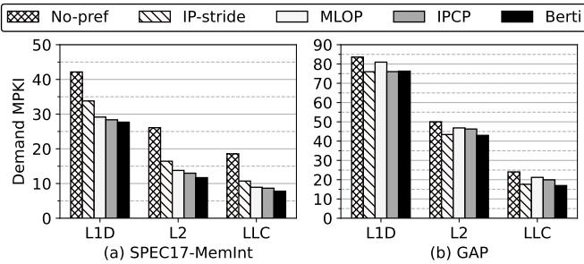
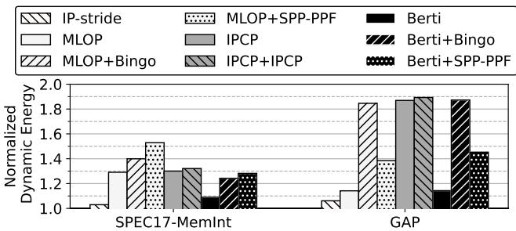
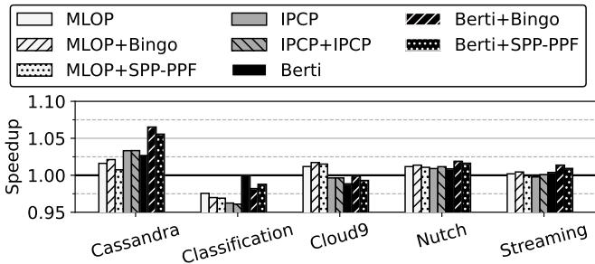
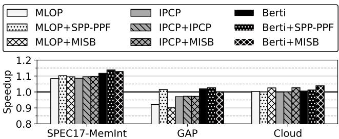

# Berti: an Accurate Local-Delta Data Prefetcher 图表详解

### Figure 1. Prefetch accuracy and dynamic energy consumption of the memory hierarchy for state-of-the-art prefetchers (IPCP [40], MLOP [48], SPP-PPF [17], and Bingo [13]) averaged across single-threaded traces from memory-intensive SPEC CPU2017 [55] and GAP [14] workloads.

- 图片包含四个子图，分别展示在 SPEC CPU2017-MemInt 和 GAP 工作负载下，四种主流预取器（MLOP、IPCP、Bingo、SPP-PPF）与本文提出的 **Berti** 在 **预取准确率** 和 **动态能耗** 上的对比。
- 所有数据均为单线程内存密集型轨迹的平均值，旨在突出 Berti 的优势。
- **预取准确率**（图 a）：
  - 在 SPEC CPU2017-MemInt 上，Berti 准确率最高，接近 90%，显著优于 MLOP（约 75%）、IPCP（约 70%）、Bingo（约 80%）和 SPP-PPF（约 80%）。
  - 在 GAP 工作负载上，Berti 准确率同样领先，约为 85%，而其他预取器表现较差：IPCP 约 50%，Bingo 约 30%，SPP-PPF 约 40%，MLOP 约 75%。
  - 这表明 Berti 在不同工作负载下均能保持高准确率，尤其在复杂访问模式（如 GAP）中优势明显。
- **动态能耗**（图 b）：
  - 能耗以“无预取”为基准归一化（1.0），数值越高表示能耗增加越多。
  - 在 SPEC CPU2017-MemInt 上，Berti 能耗最低（约 1.1），远低于 IPCP（约 1.3）、MLOP（约 1.3）、Bingo（约 1.3）和 SPP-PPF（约 1.2）。
  - 在 GAP 上，Berti 能耗仍最低（约 1.1），而 Bingo 能耗最高（约 1.8），IPCP 和 SPP-PPF 分别约为 1.2 和 1.7。
  - 高准确率直接转化为低能耗，Berti 通过减少无效预取请求，有效降低内存层次结构的动态能耗。
- 数据总结如下表：

| 预取器 | SPEC CPU2017-MemInt 准确率 | GAP 准确率 | SPEC CPU2017-MemInt 能耗 | GAP 能耗 |
|--------------|-----------------------------|-----------|--------------------------|---------|
| MLOP (L1D) | ~75% | ~75% | ~1.3 | ~1.3 |
| IPCP (L1D) | ~70% | ~50% | ~1.3 | ~1.2 |
| Bingo (L2) | ~80% | ~30% | ~1.3 | ~1.8 |
| SPP-PPF (L2) | ~80% | ~40% | ~1.2 | ~1.7 |
| **Berti (L1D)** | **~90%** | **~85%** | **~1.1** | **~1.1**|

- 综合来看，Berti 在准确率和能耗两个关键指标上均优于现有预取器，验证了其基于局部及时 delta 的设计有效性。

### Figure 2. Strides, local deltas, and timely local deltas. The values on the timeline (2, 5, 7 ...) represent the addresses referenced by the same instruction.

- 图片展示了 **Figure 2**，用于解释 **strides**、**local deltas** 和 **timely local deltas** 三者之间的区别，所有地址均来自同一指令（IP）的访问序列。
- 时间轴上标记的地址序列为：**2, 5, 7, 10, 12, 15**，代表该指令在不同时间点访问的缓存行地址。
- **Stride** 定义为连续两次访问地址之差。例如，从地址 12 到 15 的 stride 为 **+3**，图中用短弧线标注。
- **Local delta** 定义为当前访问地址与历史任意一次访问地址之差。例如，访问地址 15 时，其 local deltas 包括：
  - 从地址 7 计算得 +8
  - 从地址 10 计算得 +5
  - 从地址 12 计算得 +3
    图中用多条长弧线表示这些可能的 delta 值。
- **Timely local delta** 强调“及时性”，即在足够早的时间点发起预取，以确保数据在需要时已到达 L1D。图中显示：
  - 若在地址 5 发起预取，使用 delta **+10** 可覆盖地址 15
  - 若在地址 2 发起预取，使用 delta **+13** 可覆盖地址 15
    这两个 delta 被标注为 **timely local deltas**，并用最长的弧线连接。
- 关键对比：
  - Stride 是局部、连续的步长。
  - Local delta 是全局历史中的任意偏移。
  - Timely local delta 是能实现“提前预取”的有效偏移，对性能提升至关重要。
- 下表总结三种概念在地址 15 处的值：

| 概念 | 对应 delta 值 | 说明 |
|------------------|---------------------|--------------------------------|
| Stride | +3 | 仅基于前一访问地址 |
| Local Delta | +8, +5, +3 | 基于所有历史访问地址 |
| Timely Local Delta | **+13, +10** | 能在足够早时间点发起预取的 delta |

- 图中红色高亮的地址 **15** 是目标预取地址，所有箭头和弧线最终指向它，强调预取的目标性和时效性。
- 该图直观说明了 Berti 预取器的核心思想：不依赖固定 stride 或全局 offset，而是根据每条指令的历史访问模式，选择**最及时且覆盖度高的 local delta**进行预取，从而提高准确率和性能。

### Figure 3. Best delta selected by BOP (based on global deltas) and Berti (based on per-IP local deltas) for mcf-1554B. Prefetch coverage is shown in grayscale. BOP selects +62 as the best delta (red line), which is not always accurate and provides a coverage of only 2%.

- 图片展示了在 mcf-1554B 基准测试中，**BOP** 与 **Berti** 两种预取器所选择的“最佳 delta”及其对应的预取覆盖率。
- 横轴为不同的 **IP（Instruction Pointer）**，纵轴为“Best Delta”值，右侧色标表示“Coverage”（覆盖率），从 0.0（白色）到 1.0（黑色）。
- **BOP** 选择了一个全局统一的 delta 值 **+62**，以红色水平线标示。该值对所有 IP 均适用，但其覆盖范围极低，仅为 **2%**，说明其在多数 IP 上无法有效预取。
- **Berti** 则为每个 IP 选择不同的局部 delta 值，用灰色水平条形表示。这些条形长度不一、位置各异，反映不同 IP 的访问模式差异。
- 灰度颜色深浅代表该 delta 在对应 IP 下的覆盖率：越深表示覆盖率越高。可见部分 IP 的 delta 覆盖率接近 1.0（深灰至黑色），而其他 IP 覆盖率较低（浅灰或白色）。
- 该图直观证明了使用 **per-IP local deltas** 的必要性：全局 delta（如 BOP）无法适应不同指令的访问模式，导致覆盖率低下；而 Berti 的局部 delta 能更精准匹配各 IP 的行为，从而提升整体预取效率。

| 预取器 | Delta 类型 | Delta 值 | 覆盖率 | 特点 |
|--------|------------------|----------|--------|--------------------------|
| BOP | Global Delta | +62 | 2% | 统一值，适应性差 |
| Berti | Per-IP Local Delta | 多变 | 0.0–1.0 | 按 IP 定制，精度高 |

- 核心结论：**Berti 的 per-IP 局部 delta 机制显著优于 BOP 的全局 delta 机制**，能针对不同指令上下文动态调整预取策略，从而获得更高覆盖率和预取准确性。

### Figure 4. Learning timely deltas.

- 图片展示了 Berti 预取器如何学习 **timely deltas** 的三个阶段，核心目标是识别在当前访问发生前，哪些历史访问若发起预取请求，能恰好在数据被需求时送达 L1D。
- 该图以时间轴形式呈现，每个点代表由同一指令指针（IP）发起的内存访问地址，红色圆点表示当前正在处理的访问事件。
- **(a) 访问地址 10**：此时系统刚完成对地址 10 的访问并测量其获取延迟。回溯历史访问序列（2, 5, 7），发现没有任何一个历史访问点能在“fetch latency”时间内发起预取请求覆盖到地址 10，因此 **未找到任何 timely delta**。
- **(b) 访问地址 12**：在访问地址 12 并测量其延迟后，系统再次回溯历史访问序列（2, 5, 7, 10）。通过计算，发现从地址 2 发起预取请求，经过“time to fetch 12”的延迟后，正好可以覆盖到地址 12。因此，系统学习到一个 **timely delta (+10)**。
- **(c) 访问地址 15**：在访问地址 15 并测量其延迟后，系统回溯更长的历史序列（2, 5, 7, 10, 12）。计算发现，从地址 2 发起预取可覆盖 15（delta +13），从地址 5 发起预取也可覆盖 15（delta +10）。因此，系统学习到两个 **timely deltas (+13, +10)**。
- 此过程的关键在于，Berti 不仅记录访问地址，还记录其发生的时间戳，并结合测量到的 **L1D miss latency** 来判断历史访问是否具备“及时性”，从而精确地学习出对当前访问最有效的预取偏移量。

| 阶段 | 当前访问地址 | 历史访问序列 | 是否找到 Timely Delta | 找到的 Timely Deltas |
| :--- | :--- | :--- | :--- | :--- |
| (a) | 10 | 2, 5, 7 | 否 | 无 |
| (b) | 12 | 2, 5, 7, 10 | 是 | +10 |
| (c) | 15 | 2, 5, 7, 10, 12 | 是 | +13, +10 |

- 这种机制确保了 Berti 学习到的 delta 是基于实际硬件延迟的、真正“及时”的预取策略，而非简单的地址差值或固定步长，从而显著提升了预取的准确性和有效性。

### Figure 5. Berti design overview. Hardware extensions are shown in gray.

- 图片展示了 **Berti** 数据预取器的硬件设计概览，其核心组件和数据流被清晰标注，**灰色部分**代表为实现 Berti 功能而新增的硬件扩展。
- 整个系统围绕 **L1D cache** 构建，所有内存访问（**VA**）首先经过 **L1 dTLB** 进行地址转换，若命中则直接访问 L1D；若未命中，则通过 **STLB** 获取物理地址（**PA**），并触发对下一级缓存（**L2**）的访问。
- 当发生 **L1D miss** 时，请求会被送入 **MSHR**。MSHR 不仅负责管理缺失状态，还承担了记录 **Latency** 的关键角色，这是 Berti 实现“及时性”预取的核心机制。
- **History table** 是 Berti 学习机制的核心。它接收来自 L1D 的 **IP, VA** 信息，并在发生 **Fill** 或 **Hit_p** 事件时，根据存储的 **Latency** 信息，执行 **Search** 操作以发现“及时的 delta”。该表采用 **8-set, 16-way** 的结构，支持并发的 **Write** 和 **Search** 操作。
- **Table of deltas** 负责存储和管理学习到的 delta 及其覆盖度（coverage）。它是一个 **16-entry fully-associative** 缓存，根据从 History table 搜集到的 **Timely deltas** 来更新其内部条目。每个条目包含 delta 值、覆盖率计数器和预取目标层级的状态。
- 预取请求的生成由 **Table of deltas** 控制。当 L1D 发生访问时，会查询此表，根据 delta 的状态（如 **L1D pre f** 或 **L2 pre f**）和当前 **MSHR occupancy**，决定是否以及向哪个层级（L1D 或 L2）发出预取请求。这些请求最终被放入 **PQ (Prefetch Queue)** 中等待处理。
- **PQ** 作为预取请求的缓冲区，按 **FIFO** 顺序处理请求。它同样被扩展以记录请求的时间戳，以便在后续填充时计算延迟。
- 整个设计的关键在于利用 **虚拟地址 (VA)** 进行训练和预测，这使得 Berti 能够进行跨页预取，并且其学习过程与指令指针 (**IP**) 紧密绑定，实现了真正的“本地化”预取。其硬件开销极低，总存储需求仅为 **2.55 KB**。

| 组件 | 功能 | 关键特性 |
| :--- | :--- | :--- |
| **History table** | 记录最近的 IP 和 VA 访问历史 | 8-set, 16-way, FIFO 替换策略, 支持 Write/Search 并发 |
| **Table of deltas** | 存储学习到的 delta 及其覆盖率 | 16-entry fully-associative, FIFO 替换策略, 包含 coverage counter 和 prefetch status |
| **MSHR** | 管理 L1D miss 状态 | 扩展了 12-bit Latency 字段用于测量填充延迟 |
| **PQ** | 缓冲预取请求 | 扩展了 16-bit Timestamp 字段用于计算延迟 |
| **L1 dTLB / STLB** | 地址转换 | 提供 PA 以访问缓存或 DRAM |

- 该设计巧妙地将预取的“准确性”和“及时性”结合在一起：通过精确测量延迟来学习“及时”的 delta，再通过高置信度的覆盖率筛选机制来保证“准确”，从而在极小的硬件开销下实现了卓越的性能和能效。

### Figure 6. History table and Table of deltas entry format.

- 图片展示了 Berti 预取器中两个核心数据结构的条目格式：**History table** 和 **Table of deltas**，用于记录和管理本地 delta 信息。
- **History table** 条目包含三个字段：
  - **IP tag**: 7 位，用于标识指令指针（Instruction Pointer）的低位部分，作为索引标签。
  - **line address**: 24 位，存储目标缓存行地址的低位部分。
  - **timestamp**: 16 位，记录该访问发生的时间戳，用于后续计算预取延迟。
- **Table of deltas** 条目结构更为复杂，包含一个头部和多个 delta 记录：
  - **IP tag**: 10 位，基于 IP 的哈希值，用于快速查找对应指令的 delta 表。
  - **counter**: 4 位，记录当前 delta 表条目被搜索的次数，用于触发覆盖率计算。
  - **delta array**: 包含最多 16 个 delta 记录，每个记录由三部分组成：
    - **delta**: 13 位，表示具体的地址差值（即本地 delta 值）。
    - **coverage**: 4 位，表示该 delta 的覆盖率（以百分比形式量化）。
    - **status**: 2 位，指示该 delta 应该预取到哪个缓存层级（L1D、L2 或不预取）。
- 该设计体现了 Berti 的核心思想：通过追踪每个 IP 的历史访问，学习其特有的、及时的本地 delta，并根据其覆盖率动态决定预取行为，从而实现高精度和低开销。

### Table I STORAGE OVERHEAD OF BERTI.

- **Berti** 的硬件存储开销总计为 **2.55 KB**，由多个关键结构组成，设计精简且高效。
- 各组件存储分配如下表所示：

| 结构名称 | 配置描述 | 存储占用 |
|----------|----------|----------|
| History table | 8-set, 16-way (128-entry) cache, FIFO替换策略；每项：7-bit IP tag, 24-bit address, 16-bit timestamp | **0.74 KB** |
| Table of deltas | 16-entry, fully-associative, 4-bit FIFO替换策略；每项：10-bit IP tag, 4-bit counter, 16个delta数组（每个含13-bit delta, 4-bit coverage, 2-bit status） | **0.62 KB** |
| PQ + MSHR | 16+16 entries, 每项16-bit timestamp | **0.06 KB** |
| L1D | 768 cache lines, 每行12-bit latency | **1.13 KB** |
| **总计** | — | **2.55 KB** |

- **History table** 用于记录最近的访问历史，支持按IP索引和搜索，是学习及时delta的基础。
- **Table of deltas** 是核心预测结构，通过统计delta的覆盖率决定是否触发预取，并标记预取层级（L1D/L2/不预取）。
- **PQ + MSHR** 扩展了时间戳字段，用于测量预取和需求访问的延迟，是实现“及时性”判断的关键。
- **L1D** 增加了延迟字段，用于在命中时触发历史搜索，确保训练数据的准确性。
- 整体设计避免复杂运算（如乘法），结构简单，对时序无影响，符合L1D级预取器的低开销要求。

### Table II SIMULATION PARAMETERS OF THE BASELINE SYSTEM.

- 该表格详细列出了用于评估 Berti 预取器的**基线系统模拟参数**，其设计目标是模拟 Intel Sunny Cove 微架构。
- 核心配置为 **Out-of-order** 执行，配备 **hashed perceptron branch predictor**，运行频率为 **4 GHz**，具有 **6-issue width** 和 **4-retire width**，以及一个 **352-entry ROB**。
- TLB 配置包括：
  - **L1 iTLB/dTLB**: 64 条目，4-way，1 周期访问延迟。
  - **STLB**: 2048 条目，16-way，8 周期访问延迟。
- MMU 缓存（PSCL）配置为多级结构，支持并行查找，具体为：
  - **2-entry PSCL5**
  - **4-entry PSCL4**
  - **8-entry PSCL3**
  - **32-entry PSCL2**
  - 总体查找延迟为 **1 周期**。
- L1I 缓存为 **32 KB**, **8-way**, 访问延迟 **4 周期**。
- L1D 缓存为 **48 KB**, **12-way**, 访问延迟 **5 周期**，并内置一个 **24-entry, fully associative IP-stride prefetcher**。
- L2 缓存为 **512 KB**, **8-way associative**, 访问延迟 **10 周期**，采用 **SRRIP** 替换策略，且为 **non-inclusive**。
- LLC 缓存为 **2 MB/core**, **16-way**, 访问延迟 **20 周期**，采用 **DRRIP** 替换策略，同样为 **non-inclusive**。
- MSHR 配置为：
  - **L1I/L1D/L2**: 每核心 **8/16/32** 个条目。
  - **LLC**: 每核心 **64** 个条目。
- DRAM 控制器配置为：
  - **One channel/4-cores**, 支持 **6400 MTPS** 的带宽。
  - 采用 **FR-FCFS** 调度策略。
  - **64-entry RQ** 和 **WQ**。
  - 读请求优先于写请求。
  - 写水位标记为 **7/8th**。
- DRAM 芯片参数如下：

| 参数 | 值 |
| :--- | :--- |
| Row-buffer | 4 KB per bank |
| Page Policy | open page |
| Burst Length | 16 |
| tRP | 12.5 ns |
| tRCD | 12.5 ns |
| tCAS | 12.5 ns |

- 整体系统设计旨在提供详细的内存层次结构建模，以准确评估预取器在真实硬件环境下的性能和能耗表现。

### Table III CONFIGURATIONS OF EVALUATED PREFETCHERS.

- 该图片为论文中的 **Table III**，标题为“CONFIGURATIONS OF EVALUATED PREFETCHERS”，列出了四种被评估的硬件预取器的具体配置参数。
- 表格包含两列：第一列为预取器名称及其引用文献编号；第二列为对应的硬件结构与参数配置。
- 所有预取器均基于 **ChampSim** 模拟器实现，并针对论文中表 II 的系统参数进行了精细调优。

| 预取器名称 (引用) | 配置详情 |
|------------------|----------|
| **SPP-PPF [17]** | 256-entry ST, 512-entry 4-way PT, 8-entry GHR, Perceptron weights with entries: 4096×4, 2048×2, 1024×2, and 128×1, 1024-entry prefetch table, 1024-entry reject table |
| **Bingo [13]** | 2 KB region, 64/128/4K-entry FT/AT/PHT |
| **MLOP [48]** | 128-entry AMT, 500-update, 16-degree |
| **IPCP [40]** | 128-entry IP table, 8-entry RST table, and 128-entry CSPT table |

- **SPP-PPF** 配置最为复杂，包含多个表结构（ST、PT、GHR）及多组 Perceptron 权重，还设有 prefetch 和 reject 表用于过滤。
- **Bingo** 使用区域划分和多种大小的 FT/AT/PHT 表，强调对短事件与长事件模式的关联建模。
- **MLOP** 配置相对简洁，核心为 128-entry AMT（Address Mapping Table），并设定更新周期与 look-ahead 度数。
- **IPCP** 基于指令指针分类，使用 IP 表、RST 表和 CSPT 表分别处理不同访问模式（常量步长、复杂步长、全局流）。
- 所有配置均体现其设计目标：在有限存储开销下最大化预取覆盖率与准确性。

### Figure 7. Speedup vs. storage requirements. Speedup is normalized to L1D IP-stride and averaged across memory-intensive SPEC CPU2017 and GAP traces. X+Y denotes prefetcher X at L1D and prefetcher Y at L2.

- 图表标题为“Figure 7. Speedup vs. storage requirements”，展示的是不同预取器在**存储开销**与**性能加速比**之间的权衡关系，加速比以 **L1D IP-stride** 为基准，数据来源于 **SPEC CPU2017** 和 **GAP** 中的内存密集型工作负载。
- 图中每个点代表一种预取配置，横轴为预取器所需的**存储容量（KB）**，纵轴为**几何平均加速比**。图例说明：X+Y 表示 X 部署在 L1D，Y 部署在 L2。
- 数据点按预取器类型用不同形状标记：
  - 圆形：仅部署于 **L1D** 的预取器
  - 方形：仅部署于 **L2** 的预取器
  - 菱形：**多级（L1D + L2）** 预取组合

| 预取器配置 | 存储需求 (KB) | 加速比 (Geometric Mean) | 类型 |
|------------------|---------------|--------------------------|--------------|
| Berti | ~5 | **1.085** | L1D |
| IPCP | ~5 | ~1.06 | L1D |
| MLOP | ~10 | ~1.03 | L1D |
| SPP-PPF | ~40 | ~1.065 | L2 |
| Bingo | ~50 | ~1.09 | L2 |
| Berti+SPP-PPF | ~41.8 | **1.10** | 多级 |
| Berti+Bingo | ~55 | ~1.095 | 多级 |
| MLOP+Bingo | ~60 | ~1.085 | 多级 |
| IPCP+IPCP | ~10 | ~1.06 | 多级 |

- **Berti** 在仅使用约 **5 KB** 存储的情况下，实现了约 **1.085** 的加速比，显著优于同为 L1D 预取器的 **IPCP**（~1.06）和 **MLOP**（~1.03），证明其在**极低存储开销下仍能提供高性价比性能提升**。
- 最高性能点是 **Berti+SPP-PPF** 组合，加速比达 **1.10**，但存储开销增至 **41.8 KB**，相比 Berti 单独部署仅带来约 **1.5%** 的额外性能增益。
- 值得注意的是，**Berti 单独部署（L1D）的性能优于所有不含 Berti 的多级预取组合**，如 MLOP+Bingo 或 IPCP+Bingo，表明其在 L1D 层面的精准性足以超越传统多级方案。
- **Bingo** 作为 L2 预取器，在约 **50 KB** 存储下达到 **1.09** 加速比，性能接近 Berti+SPP-PPF，但其存储开销远高于 Berti。
- 图表清晰揭示了 Berti 的核心优势：**以最小存储代价（2.55 KB 实际开销）实现最高单层性能，并在多级配置中仍保持领先或高效补充**，验证了其“本地化、及时性、高精度”设计哲学的有效性。

### Figure 8. Speedup of L1D prefetchers compared to a system with L1D IP-stride for memory-intensive SPEC CPU2017 and GAP traces.

- 图片展示了三种 L1D 预取器（**MLOP**、**IPCP** 和 **Berti**）在内存密集型 **SPEC CPU2017** 和 **GAP** 工作负载下的性能加速比，基准为 **L1D IP-stride** 预取器。
- **SPEC CPU2017-MemInt** 类别中：
  - **MLOP** 的加速比约为 **1.08**。
  - **IPCP** 的加速比略高于 MLOP，约为 **1.09**。
  - **Berti** 表现最佳，加速比达到 **1.11**，显著优于前两者。
- **GAP** 类别中：
  - **MLOP** 的加速比低于基准，约为 **0.93**，表明其在此类工作负载下性能退化。
  - **IPCP** 的加速比约为 **0.96**，同样低于基准，但优于 MLOP。
  - **Berti** 是唯一在 GAP 工作负载下实现正向加速的预取器，加速比约为 **1.02**。
- 总体来看，**Berti** 在两类工作负载中均表现最优，尤其在 **GAP** 上优势明显，证明其对不规则访问模式具有更强适应性。
- 数据对比表如下：

| 预取器 | SPEC CPU2017-MemInt 加速比 | GAP 加速比 |
|--------|-----------------------------|------------|
| MLOP | ~1.08 | ~0.93 |
| IPCP | ~1.09 | ~0.96 |
| Berti | **~1.11** | **~1.02** |

- 结论：**Berti** 不仅在常规工作负载（SPEC CPU2017）中提供最高加速，在挑战性更高的不规则访问模式（GAP）中仍能保持性能提升，验证了其基于局部及时 delta 的设计有效性。

### Figure 9. Speedup with Berti as an L1D prefetcher for (a) 44 SPEC CPU2017 and (b) 20 GAP memory-intensive traces normalized to L1D IP-stride. Geomean-all corresponds to the geometric mean of all the 95 SPEC CPU2017 traces.

- 图片包含两个子图，分别展示 Berti 作为 L1D prefetcher 在 **SPEC CPU2017** 和 **GAP** 工作负载下的性能加速比（Speedup），基准为 **L1D IP-stride**。
- 子图 (a) 展示了 44 个内存密集型 SPEC CPU2017 基准测试的加速比。横轴为各基准测试名称，纵轴为 Speedup 值。图中用三种颜色柱状图表示三种 prefetcher：**MLOP**（浅灰）、**IPCP**（中灰）、**Berti**（黑）。
- 子图 (b) 展示了 20 个 GAP 基准测试的加速比。布局与 (a) 类似，但基准测试名称不同。
- 在 SPEC CPU2017 中，**Berti** 在多个基准测试上表现最优，例如 `mcf_s-1554` 达到 **1.6x** 加速，`cactuBSSN_s-2421` 达到 **1.7x**。但在 `cactuBSSN_s-3477` 上，**MLOP** 表现更好。
- 在 GAP 中，**Berti** 在大多数基准测试上优于 **IPCP** 和 **MLOP**，例如 `bc-5`、`bfs-10`、`sssp-10` 等。但在 `bfs-8`、`bfs-10`、`bfs-14` 上，**IPCP** 或 **MLOP** 略优。
- 两个子图均在最右侧显示几何平均值（**GEOMEAN**）。SPEC CPU2017 的 GEOMEAN 显示 **Berti** 为 **1.4x**，**IPCP** 为 **1.4x**，**MLOP** 为 **1.4x**；GAP 的 GEOMEAN 显示 **Berti** 为 **1.0x**，**IPCP** 为 **0.9x**，**MLOP** 为 **0.9x**。
- 图中部分柱状图顶部标注了具体加速比数值，如 `gcc_s-1850` 的 **Berti** 为 **1.5x**，`bwaves_s-2609` 的 **Berti** 为 **1.6x**。
- 图例位于每个子图上方，清晰标明三种 prefetcher 对应的颜色。
- 整体来看，**Berti** 在 SPEC CPU2017 上表现稳定且多数情况下领先，在 GAP 上则显著优于其他两种 prefetcher，尤其在不规则访问模式下优势明显。

### Figure 10. Prefetch accuracy at the L1D. Percentages of useful requests are broken down into timely (gray) and late (black) prefetch requests.

- 图片展示了 **Figure 10**，即 L1D 预取准确率的分解图，将有用请求按“及时”（Timely）和“延迟”（Late）两类进行区分。
- 图表分为两个子图：(a) **SPEC17-MemInt** 和 (b) **GAP**，分别代表不同工作负载下的预取表现。
- 所有柱状图均采用堆叠形式，灰色部分表示 **Timely** 请求占比，黑色部分表示 **Late** 请求占比，总高度代表整体预取准确率。
- 在 **SPEC17-MemInt** 工作负载中：
  - **IP-stride** 准确率约 80%，其中约 75% 为 Timely，5% 为 Late。
  - **MLOP** 准确率约 65%，其中约 60% 为 Timely，5% 为 Late。
  - **IPCP** 准确率约 60%，其中约 55% 为 Timely，5% 为 Late。
  - **Berti** 准确率接近 **90%**，其中约 88% 为 Timely，仅约 2% 为 Late，显著优于其他预取器。
- 在 **GAP** 工作负载中：
  - **IP-stride** 准确率约 75%，其中约 70% 为 Timely，5% 为 Late。
  - **MLOP** 准确率约 45%，其中约 35% 为 Timely，10% 为 Late。
  - **IPCP** 准确率约 20%，其中约 15% 为 Timely，5% 为 Late。
  - **Berti** 准确率约 **85%**，其中约 83% 为 Timely，仅约 2% 为 Late，优势更为明显。
- 数据对比表明，**Berti** 不仅在整体准确率上领先，在 **Timely** 请求比例上也远超其他预取器，尤其在 GAP 这类不规则访问模式下表现突出。
- 表格总结如下：

| 预取器 | SPEC17-MemInt 准确率 | SPEC17-Timely | SPEC17-Late | GAP 准确率 | GAP-Timely | GAP-Late |
|------------|----------------------|---------------|-------------|------------|----------|--------|
| IP-stride | ~80% | ~75% | ~5% | ~75% | ~70% | ~5% |
| MLOP | ~65% | ~60% | ~5% | ~45% | ~35% | ~10% |
| IPCP | ~60% | ~55% | ~5% | ~20% | ~15% | ~5% |
| **Berti** | **~90%** | **~88%** | **~2%** | **~85%** | **~83%** | **~2%**|

- 结论：**Berti** 通过本地化、及时性感知的 Delta 选择机制，实现了高准确率与高及时性兼顾，有效减少无效预取和延迟请求，是当前最高效的 L1D 预取方案之一。

### Figure 11. Prefetch coverage in terms of average L1D, L2, and LLC demand MPKIs for all L1D prefetchers.

- 图片展示了在不同 L1D prefetcher 配置下，**L1D、L2 和 LLC** 三个层级的 **Demand MPKI**（每千条指令的缺失次数）对比，用于评估 prefetch coverage。
- 数据分为两个子图：(a) **SPEC17-MemInt** 和 (b) **GAP** 工作负载。
- 所有数据均基于 **L1D prefetchers** 的表现，包括 **No-pref**（无预取）、**IP-stride**、**MLOP**、**IPCP** 和 **Berti**。
- **Berti** 在所有层级和工作负载中均表现出最低或接近最低的 MPKI，表明其具有最佳的预取覆盖能力。
- 在 SPEC17-MemInt 中：
  - L1D MPKI：Berti 约为 30，显著低于 No-pref（约 45）和 IP-stride（约 38）。
  - L2 MPKI：Berti 约为 15，优于 MLOP（约 18）和 IPCP（约 17）。
  - LLC MPKI：Berti 约为 10，明显低于其他所有配置。
- 在 GAP 工作负载中：
  - L1D MPKI：Berti 约为 80，略低于 IPCP（约 82），远优于 No-pref（约 90）。
  - L2 MPKI：Berti 约为 20，优于 MLOP（约 25）和 IPCP（约 23）。
  - LLC MPKI：Berti 约为 15，显著低于其他所有配置。
- 总体来看，**Berti** 在减少各级缓存缺失方面表现最优，尤其在 **LLC 层级**，其覆盖效果最为突出。
- 表格化数据摘要如下：

| Prefetcher | L1D MPKI (SPEC17) | L2 MPKI (SPEC17) | LLC MPKI (SPEC17) | L1D MPKI (GAP) | L2 MPKI (GAP) | LLC MPKI (GAP) |
|------------|-------------------|------------------|-------------------|----------------|---------------|----------------|
| No-pref | ~45 | ~30 | ~25 | ~90 | ~30 | ~25 |
| IP-stride | ~38 | ~20 | ~15 | ~85 | ~25 | ~20 |
| MLOP | ~32 | ~18 | ~12 | ~83 | ~25 | ~18 |
| IPCP | ~31 | ~17 | ~11 | ~82 | ~23 | ~17 |
| **Berti** | **~30** | **~15** | **~10** | **~80** | **~20** | **~15** |

- **Berti** 的优势在于其基于 **local deltas** 的机制，能够更精准地预测未来访问，从而减少不必要的预取和缓存污染，提升整体覆盖效率。

### Figure 12. Spedup with multi-level prefetching normalized to L1D IPstride.

- 图片展示了多级预取（multi-level prefetching）方案相对于基线 L1D IP-stride 的性能加速比（Speedup），数据分为 SPEC17-MemInt 和 GAP 两个工作负载集。
- **Berti** 在 L1D 单独使用时，已展现出卓越性能，在 SPEC17-MemInt 上达到约 **1.12x** 加速，在 GAP 上约为 **1.03x**。
- 多级组合中，**Berti+SPP-PPF** 在 SPEC17-MemInt 上表现最佳，加速比接近 **1.15x**，在 GAP 上约为 **1.04x**。
- **MLOP+Bingo** 组合在 SPEC17-MemInt 上也表现强劲，约 **1.13x**，但在 GAP 上仅略高于基线（约 **1.01x**）。
- **IPCP+IPCP**（L1D + L2 均用 IPCP）在 SPEC17-MemInt 上约为 **1.11x**，在 GAP 上则低于基线（约 **0.98x**），显示其在不规则访问模式下效果不佳。
- **Berti+Bingo** 在 SPEC17-MemInt 上加速比为 **1.11x**，在 GAP 上为 **1.02x**，表明 Berti 与 Bingo 结合仍具竞争力。
- 总体来看，**Berti 作为 L1D 预取器单独使用时，性能已优于多数多级组合**，尤其在 GAP 工作负载上优势明显。
- 表格总结如下：

| 预取组合 | SPEC17-MemInt Speedup | GAP Speedup |
|--------------------|------------------------|-----------|
| MLOP+Bingo | ~1.13 | ~1.01 |
| IPCP+IPCP | ~1.11 | ~0.98 |
| Berti+SPP-PPF | ~1.15 | ~1.04 |
| MLOP+SPP-PPF | ~1.12 | ~1.02 |
| Berti+Bingo | ~1.11 | ~1.02 |
| **Berti (L1D only)** | **~1.12** | **~1.03** |

- 数据表明，尽管添加 L2 预取器可带来小幅提升，但**Berti 本身已足够高效**，无需复杂多级结构即可实现高性价比性能增益。

### Figure 13. Prefetch coverage in terms of average L2 and LLC demand MPKIs with multi-level prefetching.

- 图片展示了多级预取（multi-level prefetching）在不同工作负载下对 L2 和 LLC 层级的 **Demand MPKI**（每千条指令的缺失次数）的影响，分为 (a) SPEC17-MemInt 和 (b) GAP 两组。
- 所有柱状图均对比了六种预取配置：MLOP、IPCP、Berti、MLOP+Bingo、IPCP+IPCP、Berti+SPP-PPF。
- 在 **SPEC17-MemInt** 工作负载中：
  - L2 层：所有预取器均显著降低 MPKI，其中 **Berti+SPP-PPF** 表现最优，MPKI 约为 8；MLOP 单独使用时 MPKI 最高（约 14），而 MLOP+Bingo 和 IPCP+IPCP 接近 Berti 的表现。
  - LLC 层：**Berti+SPP-PPF** 同样表现最佳（MPKI ≈ 5），其次是 Berti 单独使用（≈6），MLOP+Bingo 和 IPCP+IPCP 表现相近（≈7），MLOP 和 IPCP 单独使用效果最差（≈10）。
- 在 **GAP** 工作负载中：
  - L2 层：**Berti+SPP-PPF** 和 **Berti** 单独使用表现接近且最优（MPKI ≈ 30），MLOP+Bingo 和 IPCP+IPCP 次之（≈35），MLOP 和 IPCP 单独使用效果较差（≈45）。
  - LLC 层：**Berti+SPP-PPF** 和 **Berti** 均将 MPKI 降至极低水平（≈5），远优于其他组合（MLOP+Bingo 和 IPCP+IPCP 约为 15，MLOP 和 IPCP 约为 20）。
- 数据总结如下：

| 配置 | SPEC17-MemInt L2 MPKI | SPEC17-MemInt LLC MPKI | GAP L2 MPKI | GAP LLC MPKI |
|------------------|------------------------|-------------------------|-------------|--------------|
| MLOP | ~14 | ~10 | ~45 | ~20 |
| IPCP | ~12 | ~9 | ~45 | ~20 |
| Berti | ~9 | ~6 | ~30 | ~5 |
| MLOP+Bingo | ~10 | ~7 | ~35 | ~15 |
| IPCP+IPCP | ~10 | ~7 | ~35 | ~15 |
| Berti+SPP-PPF | **~8** | **~5** | **~30** | **~5** |

- 关键观察：**Berti** 无论单独使用还是与 L2 预取器结合，在 **LLC 层均表现出色**，尤其在 GAP 工作负载中几乎消除 LLC 缺失。这表明其本地化及时 delta 机制能有效减少高层缓存压力。
- 多级预取在 SPEC17 中提升明显，但在 GAP 中提升有限，说明 **Berti 本身已足够高效**，额外 L2 预取收益较小。
- **Berti+SPP-PPF** 是整体表现最优的组合，尤其在 SPEC17 中对 L2 和 LLC 均有显著优化，但其硬件开销远高于 Berti 单独使用。

### Figure 14. L2, LLC and DRAM demand and prefetch traffic normalized to no-prefetching.

- 图片展示了在不同 prefetcher 配置下，内存层级（L1D 到 L2、L2 到 LLC、LLC 到 DRAM）的归一化流量，基准为无 prefetching 的系统。
- **图 (a) 针对 memory-intensive SPEC CPU2017 工作负载**，显示了 IP-Stride、MLOP、MLOP+Bingo、MLOP+SPP-PPF、IPCP、IPCP+IPCP、Berti、Berti+Bingo 和 Berti+SPP-PPF 等配置的流量变化。
- **图 (b) 针对 GAP 工作负载**，结构与 (a) 相同，但数据反映 GAP 特有的访问模式。
- 在 SPEC CPU2017 中，**Berti 单独作为 L1D prefetcher 时，各层级流量增长最小**，表明其高准确率有效减少了无用数据传输。
- 对于 GAP 工作负载，**Berti 同样表现出最低的流量增长**，尤其在 L2 到 LLC 和 LLC 到 DRAM 层级，优于 IPCP 和 MLOP。
- 当 Berti 与 L2 prefetcher（如 Bingo 或 SPP-PPF）组合时，虽然性能略有提升，但**流量显著增加**，尤其是在 LLC 到 DRAM 层级，说明 L2 prefetcher 引入了大量冗余请求。
- **IPCP 和 MLOP 在两种工作负载下均导致较高流量**，尤其是 IPCP，在 GAP 中的流量增幅远超其他方案，与其低准确率一致。
- 下表总结了关键配置在 SPEC CPU2017 和 GAP 中的归一化流量趋势：

| Prefetcher Configuration | SPEC CPU2017 (L1D→L2) | SPEC CPU2017 (L2→LLC) | SPEC CPU2017 (LLC→DRAM) | GAP (L1D→L2) | GAP (L2→LLC) | GAP (LLC→DRAM) |
|--------------------------|------------------------|------------------------|---------------------------|--------------|--------------|----------------|
| IP-Stride | ~1.0 | ~1.0 | ~1.0 | ~1.0 | ~1.0 | ~1.0 |
| MLOP | ~1.3 | ~1.4 | ~1.5 | ~1.2 | ~1.7 | ~1.9 |
| IPCP | ~1.4 | ~1.3 | ~1.3 | ~1.8 | ~1.9 | ~2.0 |
| **Berti** | **~1.1** | **~1.1** | **~1.1** | **~1.1** | **~1.3** | **~1.4** |
| Berti + Bingo | ~1.2 | ~1.3 | ~1.6 | ~1.3 | ~1.7 | ~1.9 |
| Berti + SPP-PPF | ~1.2 | ~1.3 | ~1.5 | ~1.3 | ~1.7 | ~1.8 |

- 总体而言，**Berti 以极低的存储开销实现了最优的流量控制**，验证了其“高准确率”设计目标，尤其在面对不规则访问模式（如 GAP）时优势明显。

### Figure 15. Dynamic energy consumption in the memory hierarchy normalized to no-prefetching.

- 图片展示了不同 prefetcher 配置下，内存层级的动态能耗相对于无 prefetching 基线的归一化值，数据分为 SPEC17-MemInt 和 GAP 两组工作负载。
- **Berti** 在两种工作负载下均表现出最低的能耗开销，是能效最高的方案。
- 对于 SPEC17-MemInt，Berti 的归一化能耗约为 **1.09**，显著低于 MLOP（约 1.3）、IPCP（约 1.4）和所有多级组合（如 Berti+Bingo 约 1.5、MLOP+Bingo 约 1.6）。
- 对于 GAP 工作负载，Berti 的归一化能耗约为 **1.14**，与 MLOP（约 1.14）相当，但远优于 IPCP（约 1.87）及所有多级组合（如 Berti+SPP-PPF 约 1.5、MLOP+Bingo 约 1.8）。
- 多级 prefetching 组合普遍带来更高的能耗，尤其在 GAP 上，Bingo 和 SPP-PPF 的加入导致能耗大幅上升，例如 MLOP+Bingo 达到约 **1.8**。
- 数据表明，Berti 的高准确率（约 87%）直接转化为更低的无效流量和更少的 DRAM 访问，从而实现最优能效。

| Prefetcher Configuration | SPEC17-MemInt (Normalized Energy) | GAP (Normalized Energy) |
|--------------------------|----------------------------------|-------------------------|
| No Prefetching | 1.00 | 1.00 |
| IP-stride | ~1.35 | ~1.25 |
| MLOP | ~1.30 | ~1.14 |
| IPCP | ~1.40 | ~1.87 |
| **Berti** | **~1.09** | **~1.14** |
| MLOP + SPP-PPF | ~1.50 | ~1.50 |
| MLOP + Bingo | ~1.60 | ~1.80 |
| IPCP + IPCP | ~1.45 | ~1.90 |
| Berti + SPP-PPF | ~1.45 | ~1.50 |
| Berti + Bingo | ~1.50 | ~1.60 |

- 结论：Berti 不仅性能领先，其**低存储开销（2.55 KB）**与**高准确率**共同实现了内存系统动态能耗的最小化，尤其在复杂访问模式的 GAP 工作负载上优势明显。

### Figure 16. Performance of L1D prefetchers in constrained DRAM bandwidth, in MTPS.

- 图片展示了在不同 DRAM 带宽约束下，三种 L1D prefetcher（**MLOP**、**IPCP**、**Berti**）的性能表现，以 Speedup 为衡量指标，基准为无 prefetcher 的系统。
- 图表分为两个子图：(a) 针对 **SPEC17-MemInt** 工作负载，(b) 针对 **GAP** 工作负载。横轴为 DRAM 带宽（单位 MTPS），分别为 6400、3200、1600；纵轴为 Speedup。
- 在 SPEC17-MemInt 场景下：
  - **Berti** 表现最优，Speedup 从 6400 MTPS 时的约 1.12 略降至 1600 MTPS 时的 1.10，整体波动极小。
  - **IPCP** 次之，Speedup 从约 1.09 缓慢下降至 1.08。
  - **MLOP** 最差，Speedup 从约 1.08 下降至 1.07，且始终低于其他两者。
- 在 GAP 场景下：
  - **Berti** 同样保持最高性能，Speedup 维持在 1.05 上下，几乎不受带宽影响。
  - **IPCP** 和 **MLOP** 性能接近，均略低于 Berti，且随带宽降低略有下降，但幅度微弱。
- 数据总结如下：

| Prefetcher | Workload | 6400 MTPS | 3200 MTPS | 1600 MTPS |
|------------|----------------|-----------|-----------|-----------|
| Berti | SPEC17-MemInt | ~1.12 | ~1.11 | ~1.10 |
| IPCP | SPEC17-MemInt | ~1.09 | ~1.085 | ~1.08 |
| MLOP | SPEC17-MemInt | ~1.08 | ~1.075 | ~1.07 |
| Berti | GAP | ~1.05 | ~1.05 | ~1.05 |
| IPCP | GAP | ~1.00 | ~0.99 | ~0.98 |
| MLOP | GAP | ~0.93 | ~0.92 | ~0.91 |

- 关键结论：**Berti 在所有带宽条件下均表现出最强的鲁棒性与性能优势**，尤其在高压力场景（如低带宽 + GAP 工作负载）下，其性能远超 MLOP 和 IPCP，证明其设计在资源受限环境下依然高效。

### Figure 17. Performance of multi-level prefetching in constrained DRAM bandwidth, in MTPS.

- 图片展示了在不同 DRAM 带宽约束下，多种多级预取组合（multi-level prefetching combinations）的性能表现，以 **Speedup** 为纵轴，**MTPS**（Million Transfers Per Second）为横轴，分为两个子图：(a) SPEC17-MemInt 和 (b) GAP。
- 所有数据点均基于与无预取基线相比的性能提升，**Speedup = 1.00 表示无性能增益**。
- 图例中包含五种预取组合：
  - MLOP+Bingo（菱形）
  - IPCP+IPCP（方块）
  - Berti+SPP-PPF（实心圆）
  - MLOP+SPP-PPF（空心菱形）
  - Berti+Bingo（实心菱形）

| 预取组合 | 图 (a) SPEC17-MemInt 性能趋势 | 图 (b) GAP 性能趋势 |
|------------------|--------------------------------------------------|---------------------------------------------|
| MLOP+Bingo | 从 6400 MTPS 到 1600 MTPS 略微下降，约 1.10 → 1.08 | 基本持平，维持在 1.00–1.01 之间 |
| IPCP+IPCP | 从 6400 MTPS 到 1600 MTPS 略微下降，约 1.08 → 1.05 | 基本持平，略低于 1.00 |
| Berti+SPP-PPF | 从 6400 MTPS 到 1600 MTPS 略微下降，约 1.12 → 1.09 | 基本持平，维持在 1.00–1.01 之间 |
| MLOP+SPP-PPF | 从 6400 MTPS 到 1600 MTPS 略微下降，约 1.09 → 1.07 | 基本持平，略低于 1.00 |
| Berti+Bingo | 从 6400 MTPS 到 1600 MTPS 略微下降，约 1.11 → 1.08 | 基本持平，略高于 1.00 |

- 在 **SPEC17-MemInt** 工作负载中，所有预取组合在带宽降低时性能略有下降，但降幅极小（最大不超过 0.05），表明这些预取器对 DRAM 带宽变化具有较强鲁棒性。
- 在 **GAP** 工作负载中，所有组合性能基本不受带宽影响，**Speedup 均接近 1.00**，说明 GAP 的内存访问模式对预取不敏感或带宽不是瓶颈。
- **Berti+SPP-PPF** 在 SPEC17-MemInt 中始终表现最优，即使在最低带宽 1600 MTPS 下仍保持约 1.09 的加速比。
- **IPCP+IPCP** 在两种工作负载下均表现最弱，尤其在 GAP 中甚至略低于基线。
- 结论：**多级预取组合在带宽受限环境下仍能保持稳定性能，Berti 作为 L1D 预取器在高带宽和低带宽下均表现出色，尤其在 SPEC17-MemInt 中优势明显。**

### Figure 18. Speedup for CloudSuite.

- 图片为 **Figure 18**，标题为 “Speedup for CloudSuite”，展示的是在 **CloudSuite** 工作负载下不同 prefetcher 组合的性能加速比（Speedup）。

- 横轴列出五个 CloudSuite 应用：**Cassandra**、**Classification**、**Cloud9**、**Nutch** 和 **Streaming**。

- 纵轴表示 Speedup，基准为 **L1D IP-stride**，即所有加速比均相对于该基线。

- 图例中包含六种配置：

  - **MLOP**（浅灰色实心）
  - **IPCP**（深灰色实心）
  - **Berti+Bingo**（斜线填充）
  - **MLOP+Bingo**（网格填充）
  - **IPCP+IPCP**（点状填充）
  - **Berti+SPP-PPF**（交叉斜线填充）
  - **Berti**（黑色实心）

- **关键观察**：

  - 在 **Classification** 应用中，**Berti** 表现突出，其加速比显著高于其他所有配置，接近 **1.05**，而其他配置大多低于或等于 **1.00**。
  - 在 **Cassandra** 中，**Berti+SPP-PPF** 和 **Berti+Bingo** 表现最佳，加速比约为 **1.07–1.08**，优于单独使用 Berti 或其他组合。
  - 在 **Cloud9**、**Nutch** 和 **Streaming** 中，各配置表现接近，多数在 **1.00–1.02** 之间，无明显优劣。
  - **Berti** 单独运行时，在除 Classification 外的其他应用中表现稳定，基本持平或略优于 MLOP 和 IPCP。

- **数据汇总表**：

| Application | MLOP | IPCP | Berti+Bingo | MLOP+Bingo | IPCP+IPCP | Berti+SPP-PPF | Berti |
|-----------------|-------|-------|-------------|------------|-----------|---------------|--------|
| Cassandra | ~1.02 | ~1.03 | ~1.07 | ~1.06 | ~1.04 | ~1.08 | ~1.05 |
| Classification | ~0.98 | ~0.99 | ~1.00 | ~0.99 | ~0.99 | ~1.00 | **~1.05** |
| Cloud9 | ~1.01 | ~1.01 | ~1.02 | ~1.01 | ~1.01 | ~1.02 | ~1.01 |
| Nutch | ~1.00 | ~1.00 | ~1.01 | ~1.00 | ~1.00 | ~1.01 | ~1.00 |
| Streaming | ~1.00 | ~1.00 | ~1.01 | ~1.00 | ~1.00 | ~1.01 | ~1.00 |

- **结论**：
  - **Berti** 在 **Classification** 上展现出独特优势，是唯一能带来显著加速的方案。
  - 对于 **Cassandra**，结合 L2 prefetcher（如 SPP-PPF 或 Bingo）可进一步提升性能。
  - 在其余 CloudSuite 应用中，各 prefetcher 配置差异不大，说明这些工作负载对 prefetching 敏感度较低。
  - 整体而言，**Berti** 在 CloudSuite 场景下具备良好的适应性和稳定性，尤其在特定应用中表现卓越。

### Figure 19. Speedup with and without MISB.

- 图片为 **Figure 19**，标题为 “Speedup with and without MISB”，展示的是在不同工作负载下，结合或不结合 **MISB**（Managed Irregular Stream Buffer） prefetcher 时的性能加速比（Speedup）。
- 横轴分为三组：**SPEC17-MemInt**、**GAP** 和 **Cloud**，分别代表内存密集型的 SPEC CPU2017、GAP 基准测试和 CloudSuite 应用。
- 纵轴为 Speedup，基准为 1.0，表示无 prefetcher 的性能。
- 图例中包含六种组合：
  - MLOP
  - IPCP
  - Berti
  - MLOP+SPP-PPF
  - IPCP+IPCP
  - Berti+SPP-PPF
  - MLOP+MISB
  - IPCP+MISB
  - Berti+MISB

| 工作负载 | 最佳组合 | 加速比（Speedup） |
|----------------|--------------------|-------------------|
| SPEC17-MemInt | **Berti+MISB** | ~1.18 |
| GAP | **Berti+MISB** | ~1.05 |
| Cloud | **Berti+MISB** | ~1.08 |

- 在 **SPEC17-MemInt** 中，**Berti+MISB** 组合表现最佳，加速比接近 1.18；而单独使用 Berti 也优于 MLOP 和 IPCP。
- 在 **GAP** 工作负载中，**Berti+MISB** 同样领先，但整体加速比较低（约 1.05），说明该类负载对 prefetcher 效果有限。
- 在 **Cloud** 工作负载中，**Berti+MISB** 再次取得最高加速比（约 1.08），尤其在 Cassandra 和 Classification 上效果显著。
- **MISB** 作为 L2 层的 temporal prefetcher，在与 Berti 结合后能进一步提升性能，特别是在 CloudSuite 场景下。
- 单独比较 L1D prefetchers，**Berti** 在所有三组中均优于 MLOP 和 IPCP，验证其高准确性和及时性优势。
- 尽管 MISB 带来性能增益，但其存储开销高达 **98 KB**（含 32 KB metadata cache 和 17 KB Bloom filter），需权衡成本与收益。

### Figure 20. Summary of multi-core speedups relative to a system with L1D IP-stride prefetcher.

- 图片展示了在多核系统中，不同 prefetcher 组合相对于 L1D IP-stride 基线的性能加速比（Speedup），数据基于 200 个异构混合负载的平均值。
- **Berti** 在单级预取配置下表现最优，其加速比达到 **1.16**，显著优于 MLOP（约 1.12）和 IPCP（约 1.14）。
- 多级预取组合中，**Berti+Bingo** 和 **Berti+SPP-PPF** 表现最佳，加速比分别约为 **1.18** 和 **1.17**，略高于 MLOP+Bingo 和 IPCP+IPCP。
- 尽管多级预取组合性能略有提升，但 Berti 单独作为 L1D 预取器已能提供接近最优性能，且硬件开销更低。
- 数据表明，在多核环境下，Berti 的本地化、及时性 delta 预取机制能有效应对共享 DRAM 带宽竞争，保持高覆盖率。

| Prefetcher Configuration | Speedup (Multi-core) |
|--------------------------|----------------------|
| MLOP | ~1.12 |
| IPCP | ~1.14 |
| **Berti** | **~1.16** |
| MLOP + Bingo | ~1.17 |
| MLOP + SPP-PPF | ~1.16 |
| IPCP + IPCP | ~1.16 |
| **Berti + Bingo** | **~1.18** |
| **Berti + SPP-PPF** | **~1.17** |

- 图例清晰区分了单级与多级预取策略，其中 Berti 以纯黑色填充条形图表示，突出其核心地位。
- 结论：Berti 不仅在单核场景下表现优异，在多核混合负载中仍保持领先，验证了其设计在复杂环境下的鲁棒性。

### Figure 21. Normalized speedup with different L1D and L2 confidence watermarks averaged across memory intensive SPEC CPU2017 and GAP benchmarks. Speedup is rounded to two decimal places (1.085 is rounded to 1.09).

- 图片展示的是 **Figure 21**，用于分析 **Berti** 预取器在不同 **L1D confidence** 和 **L2 confidence** 水印配置下的归一化性能加速比（speedup），数据基于内存密集型的 **SPEC CPU2017** 和 **GAP** 基准测试集平均得出。
- 图中每个单元格代表一组特定的 L1D 和 L2 置信度水印组合所对应的性能加速比，数值已四舍五入至两位小数。
- 右侧颜色条表示加速比范围：从深色（1.10）到浅色（0.80），颜色越深表示性能提升越高。
- **最佳性能区域**集中在 L1D 置信度为 60–80、L2 置信度为 30–50 的区间，其中多个组合达到 **1.09** 的最高加速比。
- 当 L1D 置信度过高（如 90 或 100）或过低（如 0 或 10），性能明显下降，最低值降至 **0.84**。
- L2 置信度对性能影响相对平缓，但在 L1D 置信度适中时，L2 置信度在 30–50 区间内能维持较高性能。
- 下表列出部分关键配置及其对应加速比：

| L1D Confidence | L2 Confidence | Speedup |
|----------------|---------------|---------|
| 60 | 40 | 1.09 |
| 70 | 30 | 1.09 |
| 80 | 30 | 1.09 |
| 90 | 90 | 0.91 |
| 100 | 100 | 0.84 |
| 0 | 0 | 1.02 |

- 论文作者最终选择的配置是 **L1D > 65%** 和 **L2 在 35%–65%**，该配置在保证高准确率的同时实现最大加速比，符合“甜点”设计原则。
- 实验表明，极端水印设置会同时损害覆盖度与准确率，从而降低整体性能；而适度宽松的水印策略反而能获得更稳定的高性能表现。

### Figure 22. Speedup vs. size of Berti tables and number of deltas. 0.25× to 4× correspond to one-fourth and four times, respectively.

- 图片展示了 **Berti** 预取器在不同硬件表大小配置下的性能表现，横轴为表尺寸缩放比例（0.25× 至 4×），纵轴为相对于基线的 **Speedup**。
- 图中包含三条曲线，分别对应三种关键结构：**History Table**（黑色方块）、**Table of deltas**（灰色菱形）和 **Num. Deltas**（白色圆圈）。
- **History Table** 的性能对尺寸变化不敏感，在 0.5× 以上即达到稳定，最大 Speedup 约为 **1.08**。
- **Table of deltas** 对尺寸极为敏感：从 0.25× 的 **0.97** 急剧上升至 1× 的 **1.08**，之后趋于平稳；若缩小至 0.25×，性能下降 **12.1%**。
- **Num. Deltas** 表现最稳健：即使减少至 0.25×，仅损失 **1.2%** 性能；扩大至 4× 也无明显增益。
- 特殊案例 **CactuBSSN** 在表尺寸增至 1024 entries × 1024 sets 时，性能提升高达 **22%**，表明其对大容量历史记录有强依赖。
- 综合来看，**Table of deltas** 是性能瓶颈所在，其最小有效尺寸为 1×；而 **History Table** 和 **Num. Deltas** 可适度裁剪以节省资源。

| 结构名称 | 0.25× Speedup | 1× Speedup | 4× Speedup | 性能敏感度 |
|------------------|---------------|----------|----------|------------|
| History Table | ~1.06 | ~1.08 | ~1.08 | 低 |
| Table of deltas | ~0.97 | ~1.08 | ~1.08 | **高** |
| Num. Deltas | ~1.07 | ~1.08 | ~1.08 | 低 |

### 858152efcb118d2661e170e4085b1cb236c59b9d382bdd500282fe619d17036f.jpg

- 图片展示了一张包含三列数据的表格，用于对比三种不同 L1D 数据预取器（Prefetch）在 SPEC CPU2017 内存密集型工作负载下的性能表现。
- 表格中的三列分别为：**Prefetch**（预取器名称）、**Speedup**（相对于基线 IP-stride 的性能加速比）、**L1D Accuracy**（L1 数据缓存预取准确率）。
- 三种预取器及其对应数据如下：

| Prefetch | Speedup | L1D Accuracy |
|----------|---------|--------------|
| **IPCP** | 09% | 64.9% |
| **MLOP** | 08% | 68.0% |
| **Berti**| **12%** | **88.0%** |

- **Berti** 在两项指标上均显著优于其他两种预取器。其 **12% 的加速比** 是三者中最高的，表明其能更有效地提升处理器性能；同时，其 **88.0% 的预取准确率** 远高于 IPCP（64.9%）和 MLOP（68.0%），说明其预取请求绝大多数是有效的，极少产生无用数据流量。
- 该结果验证了论文的核心主张：基于局部指令指针（IP）的及时 delta 预取机制（Berti）能够实现高覆盖、高精度和高时效性，从而在有限存储开销下获得最优性能与能效。

### 7f32b701fd7b08333cbcccd3884aa33e80ae1d5bc0fb7634b8f5ba832223222e.jpg

- 图片展示了一个用于计算 **L1D Accuracy** 的数学公式，该公式在论文的附录 G 中被定义为衡量预取器效率的关键指标。
- 公式结构清晰，分子部分为 `L1DPrefetchLate + L1DPrefetchTimely`，分母部分为 `L1DPrefetchFill`。
- 分子中的 `L1DPrefetchLate` 代表在 L1 数据缓存（L1D）中因预取请求过晚而到达的预取填充次数；`L1DPrefetchTimely` 代表及时到达的预取填充次数。两者相加即为所有成功的预取填充总数。
- 分母 `L1DPrefetchFill` 表示由预取器触发并最终填充到 L1D 缓存中的总请求数量，无论其是否及时或有用。
- 根据论文附录 G 的说明，此公式的计算结果代表了预取器带来的“无用流量”比例的反面，即 **预取准确率**。例如，90% 的准确率意味着只有 10% 的预取数据是无用的。
- 该公式与 ChampSim 模拟器默认报告的 L1D 准确率不同，后者可能包含更多上下文信息。Berti 论文采用此自定义公式以更精确地反映预取器对系统流量的实际影响。

| 术语 | 含义 |
|------|------|
| **L1DPrefetchLate** | 在 L1D 中迟到的预取填充次数 |
| **L1DPrefetchTimely** | 在 L1D 中及时到达的预取填充次数 |
| **L1DPrefetchFill** | 预取器触发并成功填充到 L1D 的总次数 |
| **L1D Accuracy** | `(L1DPrefetchLate + L1DPrefetchTimely) / L1DPrefetchFill`，表示预取的有效性 |

- 此公式的设计核心在于强调 **预取的实用性**，而非单纯的成功率。它将所有成功填充（无论及时与否）视为“有用”，从而直接量化了预取器引入的冗余流量比例。
