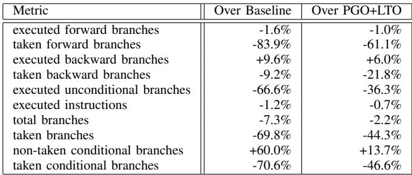
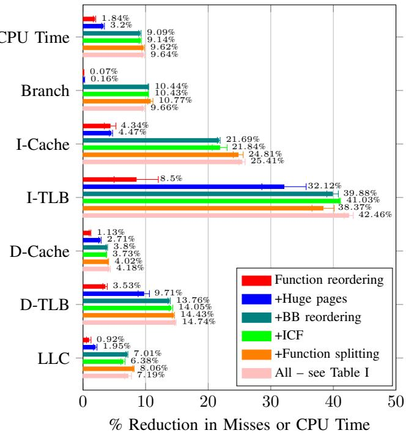
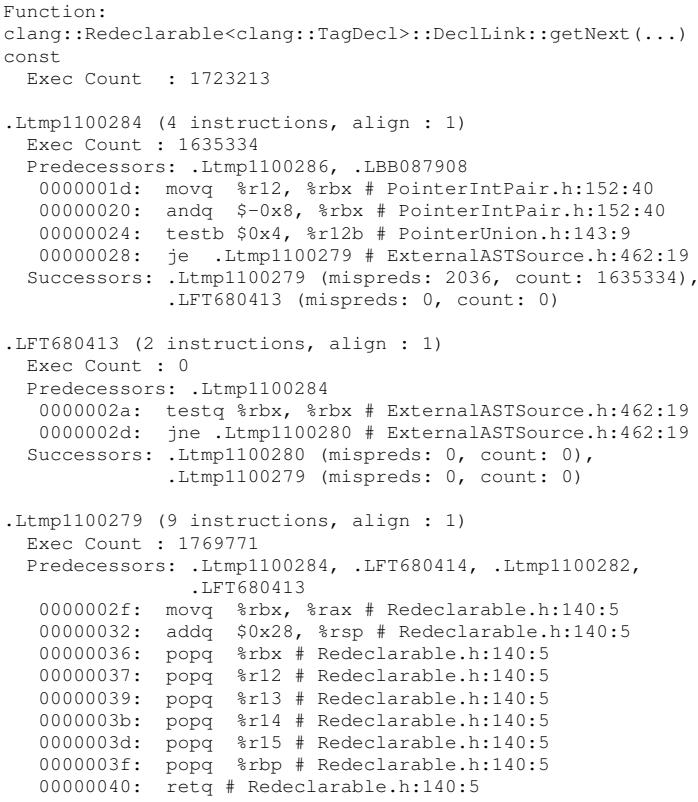
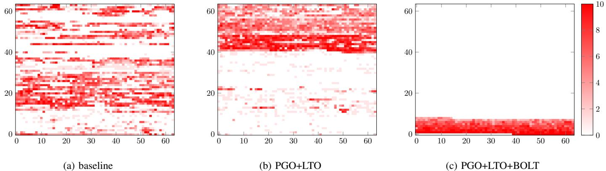

# BOLT: A Practical Binary Optimizer for Data Centers and Beyond 图表详解

### Fig. 1: Example of a compilation pipeline and the various alternatives to retrofit sample-based profile data.

- 图片展示了标准编译流程，从 **Source Code** 开始，经由 **Parser** 生成 **Compiler IR**，再通过 **Code Gen.** 生成 **Object Files**，接着由 **Linker** 合并为 **Executable Binary**，最后可选地经过 **Binary Opt.** 优化得到 **Optimized Executable Binary**。
- **Profile Data** 可在多个阶段注入，图中用箭头标示了其可作用点：可回溯至 **Source Code**、**Compiler IR**、**Object Files** 或直接作用于 **Executable Binary**。
- 此图核心在于说明 **sample-based profile data** 的“ retrofitting”（回溯注入）位置选择。越早注入（如 Source Code 或 Compiler IR），理论上能影响更多优化阶段；但越晚注入（如 Executable Binary），数据映射更精确，尤其对底层优化如代码布局至关重要。
- BOLT 的设计哲学正是基于此权衡：它作为 **post-link optimizer**，在 **Executable Binary** 阶段注入 Profile Data，牺牲了早期优化机会，换取了更高的数据准确性和对代码布局的精准控制。
- 图中未明确标注具体工具，但结合正文可知，**AutoFDO** 属于在 **Compiler IR** 阶段注入，而 **BOLT** 和 **Ispike** 则属于在 **Executable Binary** 阶段注入。**LIPO** 和 **HFSort** 则可能在 **Linker** 阶段注入。
- 该图直观呈现了论文的核心论点之一：不同阶段的 FDO 并非相互取代，而是**互补**关系。BOLT 的价值在于填补了 post-link 优化这一被忽视的环节，并证明其有效性。

### Fig. 2: Example showing a challenge in mapping binary-level events back to higher-level code representations.

- 图片展示了在将二进制层面的性能事件映射回高级代码表示时所面临的一个典型挑战，核心问题在于**函数内联**与**分支频率准确性**之间的冲突。
- 代码示例包含三个函数：`foo`、`bar` 和 `baz`。其中，`foo` 函数包含一个条件分支（第02行），而 `bar` 和 `baz` 分别调用 `foo`，且 `foo` 在这两个调用点被**内联**。
- 关键观察点是：`foo` 中的 `if (x > 0)` 分支，在 `bar` 的上下文中总是执行 `B1` 路径（因为传入参数满足 `x > 0`），而在 `baz` 的上下文中总是执行 `B2` 路径（因为传入参数满足 `x < 0`）。
- 当在二进制层面进行采样分析时，会记录到两个独立的分支事件：一个位于 `bar` 内联后的代码中，另一个位于 `baz` 内联后的代码中。这两个事件分别对应 `foo` 中的同一个 `if` 语句。
- 如果仅从源码层面分析，由于 `bar` 和 `baz` 执行次数相同，系统会错误地推断出 `foo` 中的分支有50%的概率走向 `B1`，50%的概率走向 `B2`。
- 这种不准确的映射会导致编译器无法为 `bar` 和 `baz` 中内联的 `foo` 生成最优的代码布局。例如，对于 `bar`，理想布局应是 `B1` 紧跟在 `if` 之后作为**fall-through**路径；而对于 `baz`，则应是 `B2` 作为 fall-through。
- 此问题在跨模块内联时尤为突出，因为如果 `foo` 定义在另一个模块中，内联只能在链接时发生，此时编译器已无法获取精确的、按调用点区分的分支频率信息。
- 该图旨在说明，**后链接优化器（如 BOLT）** 相较于编译器，在处理此类问题时具有天然优势，因为它直接操作最终的二进制代码，能够精确识别每个内联实例的实际执行路径，从而实现更优的代码布局。

| 位置                 | 分支行为                        | 理想布局               |
| :------------------- | :------------------------------ | :--------------------- |
| `bar` 中内联的 `foo` | 总是走 `B1`                     | `B1` 作为 fall-through |
| `baz` 中内联的 `foo` | 总是走 `B2`                     | `B2` 作为 fall-through |
| 源码级分析           | 推断为 50% 走 `B1`，50% 走 `B2` | 无法确定最佳布局       |

- 结论：此例清晰地论证了论文的核心观点——**后链接优化器能更准确地利用采样数据**，因为它避免了将二进制层面的精确事件映射回抽象中间表示所带来的信息损失和歧义。

### Fig. 3: Diagram showing BOLT’s binary rewriting pipeline.

- **图3** 展示了 BOLT 的二进制重写流水线，该流程从左至右依次执行，共包含八个主要阶段。
- 流水线起始于 **Function discovery**，此阶段负责识别二进制文件中的函数边界与入口点，依赖 ELF 符号表和 DWARF 调试信息进行定位。
- 接着是 **Read debug info**，读取调试符号（如源码行号、变量名等），用于后续优化时关联机器指令与源代码上下文。
- 然后进入 **Read profile data**，加载由 perf2bolt 工具转换的 YAML 格式采样性能数据，为优化提供热点路径与分支频率依据。
- **Disassembly** 阶段使用 LLVM 的 MCInst 解码器将机器码反汇编为可操作的指令对象，为构建控制流图做准备。
- **CFG construction** 构建每个函数的控制流图（Control Flow Graph），通过分析跳转指令连接基本块，形成程序执行路径的结构化表示。
- **Optimization pipeline** 是核心优化阶段，应用包括基本块重排、函数重排、ICF、间接调用提升等十余种优化策略，具体顺序见 Table I。
- **Emit and link functions** 将优化后的函数重新编码为机器码，并利用 LLVM 的运行时链接器解析跨函数引用，确保地址正确性。
- 最终阶段 **Rewrite binary file** 将所有修改写回原始二进制文件，同时更新 ELF 头部结构（如节大小、重定位表等）以保持文件完整性。

| 阶段                    | 功能描述                 | 依赖组件                           |
| ----------------------- | ------------------------ | ---------------------------------- |
| Function discovery      | 定位函数入口与边界       | ELF symbol table, DWARF frame info |
| Read debug info         | 加载调试元数据           | DWARF debug sections               |
| Read profile data       | 导入采样性能数据         | perf2bolt-generated YAML           |
| Disassembly             | 反汇编为 MCInst 对象     | LLVM MC disassembler               |
| CFG construction        | 构建控制流图             | Branch instruction analysis        |
| Optimization pipeline   | 应用代码布局与指令级优化 | BOLT passes (Table I)              |
| Emit and link functions | 重编码并解析符号引用     | LLVM JIT linker                    |
| Rewrite binary file     | 输出最终优化二进制       | ELF structure updater              |

- 整个流水线设计强调**模块化**与**可扩展性**，依托 LLVM 基础设施实现跨架构支持。
- 关键优化如 **basic block reordering** 和 **function reordering** 直接作用于 CFG，显著改善 I-cache 与 I-TLB 局部性。
- 该流水线允许部分函数被跳过（保守处理），确保对复杂或不支持代码的兼容性。

### Fig. 4: Partial CFG dump for a function with C++ exceptions.

- 图片展示了 BOLT 工具对一个包含 C++ 异常处理的函数 `_Z11filter_onlyi` 进行控制流图（CFG）分析后的部分输出，用于说明其内部如何表示和处理二进制代码。

- 输出内容以结构化文本形式呈现，包含函数元信息、基本块（Basic Block, BB）定义及其指令序列，并标注了异常处理相关的元数据。

- **函数元信息**：

    - 函数名：`_Z11filter_onlyi`
    - 状态：CFG 已构建
    - 地址：`0x400ab1`
    - 大小：`0x2f` 字节
    - 所属段：`.text`
    - LSDA（Language-Specific Data Area）地址：`0x401054`
    - 基本块数量：5
    - CFI 指令数：4
    - 执行计数：104
    - 配置文件准确率：100.0%

- **基本块 `.LBB07`**：

    - 包含 11 条指令，对齐方式为 1。
    - 入口点，执行计数为 104。
    - 包含 CFI 指令用于记录栈帧状态变化。
    - 最后一条指令 `callq _Z3fooi` 被标记为可能抛出异常，其处理程序为 `.LLP0`，动作编号为 1。
    - 后继块为 `.Ltmp9`（误预测数 0，计数 100），着陆垫为 `.LLP0`（计数 4）。

- **基本块 `.LLP0`**：

    - 包含 2 条指令，对齐方式为 1。
    - 标记为“着陆垫”（Landing Pad），执行计数为 4。
    - CFI 状态为 3。
    - 抛出者（Throwers）为 `.LBB07`。
    - 指令包括比较和跳转，用于异常分发逻辑。
    - 后继块为 `.Ltmp10`（误预测数 0，计数 4）和 `.LFT8`（推断计数 0）。

- **关键术语与注释**：

    - **CFI**（Call Frame Information）：用于支持栈展开和异常处理的调试信息。
    - **Landing Pad**：异常处理的入口点，当异常被抛出时，控制流会跳转至此处。
    - **Exec Count**：该基本块在采样期间被执行的次数，用于指导优化决策。
    - **Profile Acc**：配置文件数据的准确性评估，此处为 100%，表明数据完整可靠。

- **BOLT 的处理能力体现**：

    - 能够识别并保留 DWARF 调试信息中的 CFI 指令。
    - 在重写二进制时，能重建所有 CFI 信息，确保异常处理机制正常工作。
    - 支持对包含复杂控制流（如异常处理）的函数进行精确的 CFG 构建和优化。

- **输出格式特点**：

    - 使用缩进和标签清晰划分不同部分。
    - 指令旁附有源码位置（如 `exception4.cpp:22`），便于调试和验证。
    - 注释中包含操作语义（如 `OpDefCfaOffset`、`OpOffset Reg6`），反映底层机器指令行为。

- **表格化摘要**：

| 项目           | 内容                             |
| -------------- | -------------------------------- |
| 函数名         | `_Z11filter_onlyi`               |
| 总执行次数     | 104                              |
| 基本块数       | 5                                |
| CFI 指令数     | 4                                |
| 主要异常处理块 | `.LLP0`                          |
| 关键指令类型   | `callq`, `jmp`, `cmpq`, `je`     |
| 异常处理机制   | 支持 Landing Pad 和 Thrower 映射 |

- 此输出证明 BOLT 不仅能处理普通控制流，还能安全地处理包含 C++ 异常的复杂函数，是其作为生产级二进制优化器的重要能力支撑。

### TABLE I: Sequence of transformations applied by BOLT’s optimization pipeline.

- **BOLT优化流水线**包含15个独立的优化阶段，按序执行以最大化性能收益。
- 优化过程始于**strip-rep-ret**，移除为兼容旧版AMD处理器而保留的`repz retq`指令中的冗余`repz`前缀。
- **icf**（Identical Code Folding）首次出现于第2步，用于合并内容完全相同的函数或代码段，减少代码体积。
- 第3步**icp**（Indirect Call Promotion）利用调用频率信息，将高频间接调用转换为直接调用，提升执行效率。
- 第4步和第9步均为**peepholes**，分别在不同阶段进行局部指令序列优化，如消除冗余跳转或简化指令。
- 第5步**simplify-ro-loads**尝试将从只读数据段加载常量的操作替换为立即数加载，减轻D-cache压力。
- 第6步再次应用**icf**，作为二次扫描，进一步挖掘可合并的重复代码。
- 第7步**plt**（Procedure Linkage Table）优化移除对PLT的间接调用，直接跳转至目标函数，降低动态链接开销。
- 第8步**reorder-bbs**是核心布局优化，根据执行频率重排基本块，并拆分冷热路径至不同段，提升I-cache命中率。
- 第10步**uce**（Unreachable Code Elimination）移除无法到达的基本块，精简代码。
- 第11步**fixup-branches**修正因重排导致的分支指令目标地址错误，确保CFG一致性。
- 第12步**reorder-functions**应用**HFSort**算法，基于加权调用图重新排列函数位置，优化I-TLB表现。
- 第13步**stct**（Simplify Conditional Tail Calls）简化条件尾调用，减少不必要的跳转。
- 第14步**frame-opts**移除不必要的调用者保存寄存器溢出，节省栈空间和指令开销。
- 最后一步**shrink-wrapping**根据剖面数据，将被调用函数的寄存器保存/恢复操作移动到更靠近实际使用点的位置，减少冷路径开销。

| Pass Name             | Description                                                                                                       |
| --------------------- | ----------------------------------------------------------------------------------------------------------------- |
| 1. strip-rep-ret      | Strip repz from repz retq instructions used for legacy AMD processors                                             |
| 2. icf                | Identical code folding                                                                                            |
| 3. icp                | Indirect call promotion                                                                                           |
| 4. peepholes          | Simple peephole optimizations                                                                                     |
| 5. simplify-ro-loads  | Fetch constant data in .rodata whose address is known statically and mutate a load into a mov                     |
| 6. icf                | Identical code folding (second run)                                                                               |
| 7. plt                | Remove indirection from PLT calls                                                                                 |
| 8. reorder-bbs        | Reorder basic blocks and split hot/cold blocks into separate sections (layout optimization)                       |
| 9. peepholes          | Simple peephole optimizations (second run)                                                                        |
| 10. uce               | Eliminate unreachable basic blocks                                                                                |
| 11. fixup-branches    | Fix basic block terminator instructions to match the CFG and the current layout (redone by reorder-bbs)           |
| 12. reorder-functions | Apply HFSort [3] to reorder functions (layout optimization)                                                       |
| 13. stct              | Simplify conditional tail calls                                                                                   |
| 14. frame-opts        | Removes unnecessary caller-saved register spilling                                                                |
| 15. shrink-wrapping   | Moves callee-saved register spills closer to where they are needed, if profiling data shows it is better to do so |

- 整体流程设计体现**分层优化**思想：先做轻量级指令清理（如strip、peephole），再做结构重组（如reorder-bbs、reorder-functions），最后做深度优化（如shrink-wrapping）。
- 多次应用**icf**和**peepholes**表明BOLT采用迭代式优化策略，逐步逼近最优解。
- **reorder-bbs**与**reorder-functions**是性能提升的核心，直接影响I-cache和I-TLB效率，也是BOLT区别于传统编译器的关键所在。

### Fig. 5: Performance improvements from BOLT for our set of Facebook data-center workloads.

- 图片为柱状图，标题为“Fig. 5: Performance improvements from BOLT for our set of Facebook data-center workloads”，展示BOLT在Facebook数据中心工作负载上的性能提升百分比。
- 横轴列出六个应用：**HHVM**、**TAO**、**Proxygen**、**Multifeed1**、**Multifeed2** 和 **GeoMean**。
- 纵轴表示性能提升百分比（% Speedup），范围从0到10。
- 各应用的性能提升数据如下：

| 应用       | % Speedup |
| ---------- | --------- |
| HHVM       | ~7.0%     |
| TAO        | ~5.0%     |
| Proxygen   | ~5.0%     |
| Multifeed1 | ~2.0%     |
| Multifeed2 | ~7.0%     |
| GeoMean    | ~5.1%     |

- **HHVM** 和 **Multifeed2** 表现最佳，均达到约 **7.0%** 的速度提升。
- **TAO** 和 **Proxygen** 提升幅度相近，约为 **5.0%**。
- **Multifeed1** 提升最小，仅约 **2.0%**。
- **GeoMean** 作为几何平均值，显示整体平均提升为 **5.1%**，表明BOLT对多数工作负载均有显著优化效果。
- 所有柱体均为蓝色，高度直观反映各应用受益程度，说明BOLT在不同数据中心应用中表现稳定且有效。

### Fig. 6: Performance improvements for Clang.

- 图片为柱状图，标题为“Fig. 6: Performance improvements for Clang”，展示 BOLT 对 Clang 编译器性能的提升效果。

- 图表横轴包含四个测试场景：**input1**、**input2**、**input3** 和 **clang-build**，分别代表不同规模的源文件编译和完整 Clang 构建过程。

- 纵轴为 **% Speedup**，表示相对于基线的性能加速百分比。

- 图例包含三种优化配置：

    - **BOLT**（蓝色）：仅应用 BOLT 优化。
    - **PGO+LTO**（橙色）：应用 Profile-Guided Optimization 与 Link-Time Optimization。
    - **PGO+LTO+BOLT**（绿色）：在 PGO+LTO 基础上再应用 BOLT。

- 各测试场景具体数据如下：

| 测试场景    | BOLT 加速 | PGO+LTO 加速 | PGO+LTO+BOLT 加速 |
| ----------- | --------- | ------------ | ----------------- |
| input1      | 52.14%    | 39.92%       | **68.49%**        |
| input2      | 40.15%    | 30.54%       | **53.25%**        |
| input3      | 22.27%    | 21.52%       | **33.98%**        |
| clang-build | 36.22%    | 29.93%       | **49.42%**        |

- 关键观察：
    - 在所有测试中，**PGO+LTO+BOLT 组合方案均取得最高加速比**，表明 BOLT 与传统编译时优化互补。
    - **BOLT 单独使用时性能优于 PGO+LTO**，尤其在 input1 和 clang-build 场景下优势明显。
    - **clang-build 场景下，BOLT 贡献了约 19.5% 的额外加速**（49.42% - 29.93%），验证其对大型前端绑定应用的有效性。
    - 随着输入规模增大（从 input1 到 clang-build），BOLT 相对于 PGO+LTO 的增益比例下降，但仍保持显著正向贡献。

### Fig. 7: Performance improvements for GCC. LTO was not used due to build errors.

- 图片展示了 **GCC** 编译器在不同优化配置下的性能提升百分比，横轴为四种不同的测试场景（input1, input2, input3, clang-build），纵轴为 **% Speedup**。
- 三种优化策略以不同颜色柱状图表示：
    - **蓝色**：仅使用 **BOLT** 优化。
    - **橙色**：仅使用 **PGO**（Profile-Guided Optimization）。
    - **绿色**：**PGO + BOLT** 联合优化。
- 数据表明，在所有测试场景中，**PGO + BOLT** 的组合均带来最高性能增益，证明两者优化策略具有**互补性**。
- 各场景具体数据如下：

| 测试场景    | BOLT (%) | PGO (%) | PGO+BOLT (%) |
| ----------- | -------- | ------- | ------------ |
| input1      | 24.28    | 16.46   | 27.08        |
| input2      | 24.12    | 17.28   | 27.52        |
| input3      | 13.99    | 12.42   | 17.76        |
| clang-build | 21.26    | 15.73   | 24.35        |

- 在 **clang-build** 场景下，**BOLT** 单独优化带来 **21.26%** 提升，而 **PGO** 为 **15.73%**，联合优化达到 **24.35%**，显示 BOLT 对大型编译任务有显著加速效果。
- 图注明确指出，该实验中 **LTO** 未启用，因构建时出现错误，因此所有结果均为非 LTO 配置下的表现。
- 整体趋势显示，**BOLT** 在无 PGO 基础上仍能提供可观加速，尤其在复杂编译任务中表现突出，验证其作为后链接优化器的有效性。

### TABLE II: Statistics reported by BOLT when applied to Clang’s baseline and PGO+LTO binaries.

- 图片内容为 **TABLE II**，展示了 BOLT 应用于 Clang 编译器二进制文件时报告的性能统计指标，对比了两种基准：**Baseline**（未优化）和 **PGO+LTO**（已应用 Profile-Guided Optimization 与 Link-Time Optimization）。
- 表格包含三列：**Metric**（指标名称）、**Over Baseline**（相对于基线的改进百分比）、**Over PGO+LTO**（相对于 PGO+LTO 的改进百分比）。
- 所有数据均为负值或正值，负值表示减少（如分支数、指令数），正值表示增加（如非跳转条件分支），反映 BOLT 优化后对程序执行行为的影响。

| Metric                          | Over Baseline | Over PGO+LTO |
| ------------------------------- | ------------- | ------------ |
| executed forward branches       | -1.6%         | -1.0%        |
| taken forward branches          | -83.9%        | -61.1%       |
| executed backward branches      | +9.6%         | +6.0%        |
| taken backward branches         | -9.2%         | -21.8%       |
| executed unconditional branches | -66.6%        | -36.3%       |
| executed instructions           | -1.2%         | -0.7%        |
| total branches                  | -7.3%         | -2.2%        |
| taken branches                  | -69.8%        | -44.3%       |
| non-taken conditional branches  | +60.0%        | +13.7%       |
| taken conditional branches      | -70.6%        | -46.6%       |

- **关键观察点**：
    - **taken forward branches** 和 **taken conditional branches** 在两种基准下均大幅减少，分别达 **-83.9%** 和 **-70.6%**（相对基线），表明 BOLT 通过优化基本块布局显著减少了“跳转”路径，提升了 I-cache 局部性。
    - **non-taken conditional branches** 增加，说明 BOLT 将冷路径移出热路径，使原本“不跳转”的分支变多，符合其“热路径直通化”策略。
    - 即使在已应用 **PGO+LTO** 的高度优化二进制上，BOLT 仍能带来可观改进，例如 **taken branches** 减少 **44.3%**，证明其优化与编译器级优化互补。
    - **executed instructions** 仅小幅减少（-0.7% over PGO+LTO），说明 BOLT 主要优化的是代码布局而非指令数量，其核心价值在于提升前端硬件结构（如 I-cache、branch predictor）效率。
    - 数据表明，BOLT 对 **forward branches** 的优化效果最强，这与其“将最常执行的后继块设为 fall-through”的基本块重排策略一致。

### Fig. 8: Breakdown of improvements on different metrics for HHVM (higher is better). ICF refers to identical code folding. Optimizations are always added on top of the previous bar, i.e., +BB reordering has function reordering, huge pages and basic block reordering all turned on.

- 图表展示了 BOLT 对 HHVM 应用在不同优化阶段下各项性能指标的提升效果，**所有指标均为百分比减少值（越低越好）**，但图例说明“higher is better”，实际应理解为“减少得越多，性能提升越大”。
- 优化策略按顺序叠加应用：从“Function reordering”开始，逐步增加“+Huge pages”、“+BB reordering”、“+ICF”、“+Function splitting”，最终到“All”（包含 Table I 中所有优化）。
- 各项指标的优化效果如下：

| 指标     | Function reordering | +Huge pages | +BB reordering | +ICF   | +Function splitting | All        |
| -------- | ------------------- | ----------- | -------------- | ------ | ------------------- | ---------- |
| CPU Time | 1.84%               | 3.2%        | 9.09%          | 9.14%  | 9.62%               | **9.64%**  |
| Branch   | 0.07%               | 0.16%       | 10.44%         | 10.43% | 10.77%              | **9.66%**  |
| I-Cache  | 4.34%               | 4.47%       | 21.69%         | 21.84% | 24.81%              | **25.41%** |
| I-TLB    | 8.5%                | —           | 32.12%         | 39.88% | 41.03%              | **42.46%** |
| D-Cache  | 1.13%               | 2.71%       | 3.8%           | 3.73%  | 4.02%               | **4.18%**  |
| D-TLB    | 3.53%               | 9.71%       | 13.76%         | 14.05% | 14.43%              | **14.74%** |
| LLC      | 0.92%               | 1.95%       | 7.01%          | 6.38%  | 8.06%               | **7.19%**  |

- **I-TLB 和 I-Cache 的改进最为显著**，在“All”优化下分别达到 42.46% 和 25.41% 的减少，表明 BOLT 在改善指令缓存和 TLB 局部性方面效果突出。
- **CPU Time 的最终优化幅度为 9.64%**，与论文摘要中提到的“up to 7.0%”略有出入，可能因测试环境或工作负载不同所致，但仍体现显著性能增益。
- “+BB reordering”对 I-Cache 和 I-TLB 的贡献巨大，分别带来 21.69% 和 32.12% 的改进，说明**基本块重排是提升代码局部性的核心手段**。
- “+Huge pages”仅对 I-TLB 有明显帮助（从 8.5% 提升至 32.12%），而对其他指标影响较小，符合其设计目标——减少 TLB miss。
- “+Function splitting”对 I-Cache 和 I-TLB 仍有小幅提升，说明将冷代码移出热路径能进一步压缩热点区域。
- 最终“All”优化并未在所有指标上都达到峰值（如 Branch 和 LLC 反而略降），说明部分优化存在权衡，需根据目标选择组合。

### Fig. 9: Breakdown of improvements on different metrics for Clang (higher is better). ICF refers to identical code folding. Optimizations are always added on top of the previous bar, i.e., +ICF includes BB reordering and ICF both turned on.

- 图表展示了 BOLT 对 Clang 编译器二进制文件应用不同优化组合后，在多个微架构指标上的性能提升百分比，**数值越高代表优化效果越好**。
- 优化策略按顺序叠加：从基础的 **BB reordering**（基本块重排）开始，逐步增加 **+ICF**（相同代码折叠）、**+Function splitting**（函数拆分）、**+Function reordering**（函数重排），最终到 **All**（包含 Table I 中所有优化）。
- 各项指标的优化效果如下表所示：

| 指标     | BB reordering | +ICF   | +Function splitting | +Function reordering | All    |
| -------- | ------------- | ------ | ------------------- | -------------------- | ------ |
| CPU Time | 7.57%         | 7.27%  | 9.75%               | 15.6%                | 16.68% |
| Branch   | 9.94%         | 9.64%  | 11.14%              | 11.36%               | 9.91%  |
| I-Cache  | 18.13%        | 17.29% | 19.3%               | 20.46%               | 20.44% |
| I-TLB    | 1.96%         | 3.3%   | 5.66%               | 36.38%               | 63.74% |
| D-Cache  | 0.9%          | 0.6%   | 1.63%               | 7.7%                 | 9.5%   |
| D-TLB    | 4.17%         | 3.7%   | 6.02%               | 19.7%                | 22.19% |
| LLC      | 0.14%         | 0.51%  | 3.09%               | 3.31%                | 2.83%  |

- **I-TLB** 的优化效果最为显著，从基础重排的 1.96% 提升至全优化的 **63.74%**，表明 **函数重排** 和 **函数拆分** 对减少指令 TLB 缺失极为有效。
- **I-Cache** 优化稳定在 17%-20% 区间，说明 **基本块重排** 和 **函数重排** 能有效提升指令缓存命中率。
- **CPU Time** 随优化叠加持续提升，最终达到 **16.68%**，验证了 BOLT 优化策略的累积效应。
- **Branch** 指标在加入函数重排后略有下降，可能因函数重排引入额外跳转或改变分支预测模式，但整体仍保持在 9% 以上。
- **D-Cache** 和 **D-TLB** 优化幅度较小，说明 BOLT 主要针对指令路径优化，对数据路径影响有限。
- **LLC**（Last Level Cache）优化效果最弱，最高仅 3.31%，表明 BOLT 未重点优化跨层级缓存行为。

### Fig. 10: Real example of poor code layout produced by the Clang compiler (compiling itself) even with PGO. Block .LFT680413 is cold (Exec Count: 0), but it is placed between two hot blocks connected by a forward taken branch.

- 图片展示了 Clang 编译器在自身编译过程中，即使启用了 **PGO**（Profile-Guided Optimization），仍产生的一个**不良代码布局**实例。
- 该函数名为 `clang::Redeclarable<clang::TagDecl>::DeclLink::getNext(...)`，其内部包含三个基本块：`.Ltmp1100284`、`.LFT680413` 和 `.Ltmp1100279`。
- 核心问题是：**冷代码块 `.LFT680413` 被夹在两个热代码块之间**，且这两个热块通过一个向前的、高频率执行的分支相连。
- 执行计数（Exec Count）数据清晰表明了各块的热度：
    - `.Ltmp1100284`: 1,635,334 次执行
    - `.LFT680413`: **0** 次执行（完全冷）
    - `.Ltmp1100279`: 1,769,771 次执行
- 这种布局导致处理器在执行完热块 `.Ltmp1100284` 后，必须跳过中间的冷块 `.LFT680413` 才能到达下一个热块 `.Ltmp1100279`，这会破坏指令缓存（I-cache）和分支预测器的效率。
- 从源码注释看，`.LFT680413` 对应的源文件是 `ExternalASTSource.h:462:19`，其功能是检查指针是否为零并跳转。虽然该逻辑本身可能不冷，但在当前这个特定的调用点被内联后，其执行路径变得完全不活跃。
- **BOLT 的作用**正是识别这种由编译器内联造成的“虚假”冷热混合布局，并在二进制层面重新排列基本块，将冷代码移出热路径，从而提升性能。
- 该图作为证据，证明了即使在高级优化（如 PGO）之后，**编译器在代码布局上仍可能存在缺陷**，而 BOLT 能够利用更精确的二进制级剖面数据来修复这些问题。

### Fig. 11: Heat maps for instruction memory accesses of Clang binaries. Heat is in a log scale.

- 图片展示了 Clang 编译器在三种不同优化配置下，其指令内存访问的热力图，用于直观比较代码布局对 I-cache 利用率的影响。

- 热力图采用**对数刻度**（log scale）来表示访问频率，颜色从白色（未访问）到深红色（高频访问），右侧色标范围为 0 至 10。

- 三张子图分别对应：

    - **(a) baseline**: 未经任何 PGO 或 BOLT 优化的原始二进制。
    - **(b) PGO+LTO**: 经过编译时反馈驱动优化（PGO）和链接时优化（LTO）后的二进制。
    - **(c) PGO+LTO+BOLT**: 在 PGO+LTO 基础上再应用 BOLT 后的二进制。

- 通过对比三张图，可以观察到以下关键变化：

| 配置                 | 热区分布                                                         | 冷区分布                                                     | 总体趋势                                                                                                   |
| -------------------- | ---------------------------------------------------------------- | ------------------------------------------------------------ | ---------------------------------------------------------------------------------------------------------- |
| (a) baseline         | 访问热点分散在整个地址空间，无明显聚集。                         | 大量冷代码穿插于热区之间，导致缓存利用率低。                 | 代码布局杂乱，I-cache 效率低下。                                                                           |
| (b) PGO+LTO          | 热点开始局部聚集，但仍有大量分散的热块。                         | 冷区依然广泛存在，与热区交错。                               | 相比 baseline 有改善，但优化不彻底。                                                                       |
| **(c) PGO+LTO+BOLT** | **热点高度集中于图像底部区域（Y=0~10）**，形成一个紧凑的“热岛”。 | **绝大部分冷代码被移出核心热区，集中在图像上部或空白区域**。 | **BOLT 实现了极致的代码压缩，将 55MB 的文本段压缩至约 6.7MB 的活跃区域，极大提升 I-cache 和 I-TLB 效率**。 |

- 核心结论：BOLT 通过在二进制层面进行**函数重排**和**基本块拆分**，能够识别并分离冷热代码路径，从而在物理内存中实现**热代码的紧密打包**。这种优化是传统编译器在源码或 IR 层面难以精确完成的，因为它直接基于运行时采样数据，避免了映射误差。最终结果是显著减少指令缓存缺失和 TLB 缺失，带来可观的性能提升。

### Fig. 12: Improvements on different metrics for HHVM by using LBRs (higher is better).

- 图片展示了在 HHVM 应用上，使用 **LBR**（Last Branch Records）进行性能优化后，不同指标的提升百分比。图表标题明确指出“**higher is better**”，即数值越高代表优化效果越好。
- 图表横轴列出了六个关键性能指标：Instructions、Branch-miss、I-cache-miss、LLC-miss、iTLB-miss 和 CPU time。
- 纵轴表示 **% Reduction**，即相对于未使用 LBR 的基线，各项指标的减少百分比。
- 图例包含三种优化场景：
    - **Functions**（蓝色柱）：仅对函数进行重排序。
    - **BBs**（橙色柱）：仅对基本块（Basic Blocks）进行重排序及其他优化。
    - **Both**（绿色柱）：同时应用函数重排序和基本块重排序等所有优化。

| 指标         | Functions (蓝色) | BBs (橙色) | Both (绿色) |
| ------------ | ---------------- | ---------- | ----------- |
| Instructions | 0.28%            | 0.35%      | —           |
| Branch-miss  | 0.52%            | 2.88%      | 2.82%       |
| I-cache-miss | 0.66%            | 2.43%      | 5.16%       |
| LLC-miss     | 0.03%            | 1.03%      | 1.41%       |
| iTLB-miss    | 1.75%            | 5.39%      | **8.2%**    |
| CPU time     | 0.09%            | 1.71%      | **2.16%**   |

- **关键发现**：

    - **iTLB-miss** 在 “Both” 场景下获得最大改善，达到 **8.2%** 的减少，表明 LBR 对指令 TLB 命中率有显著正面影响。
    - **CPU time** 在 “Both” 场景下减少 **2.16%**，说明综合优化能有效降低整体执行时间。
    - **I-cache-miss** 在 “Both” 场景下减少 **5.16%**，显示代码布局优化对指令缓存效率提升明显。
    - **Branch-miss** 在 “BBs” 和 “Both” 场景下均接近 2.8%，说明基本块重排序对分支预测准确率提升至关重要。
    - 函数重排序（Functions）单独作用时，除 iTLB-miss 外，其他指标改善有限，表明其主要贡献在于函数间局部性优化。
    - **BBs 优化对细粒度指标（如 Branch-miss, I-cache-miss）影响更大**，而 **Both 组合优化带来最全面且最高的性能收益**。

- 总体而言，该图证实了 **LBR 提供的精确分支采样数据对 BOLT 的基本块重排序优化至关重要**，尤其在改善 i-TLB 和 I-cache 表现方面效果突出，最终转化为可观的 CPU 时间节省。
