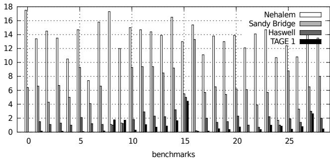
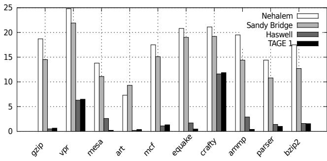
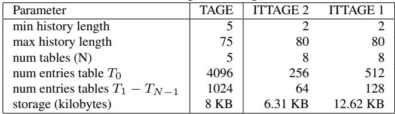
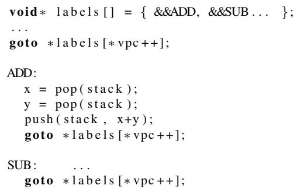

# Branch Prediction and the Performance of Interpreters – Don’t Trust Folklore 通俗讲解

### 0. 整体创新点通俗解读

**痛点直击 (The "Why")**

- 过去十几年里，解释器（Interpreter）性能优化领域有个根深蒂固的“民间传说”（Folklore）：解释器慢的主要原因，在于其核心分发循环（dispatch loop）中的那个**间接跳转**（indirect branch）。这个跳转通常由C语言的`switch`语句编译而来，拥有成百上千个可能的目标地址，导致**分支预测器**（Branch Predictor）频频失手，每次失误都要付出高达20个周期的流水线冲刷代价。
- 这个观点在早期处理器（如Nehalem）上是成立的，当时的硬件计数器数据显示**MPKI**（每千条指令的误预测次数）高达12-20，确实是性能瓶颈。因此，社区投入了大量精力去“绕开”这个问题，比如采用**Jump Threading**（跳转穿线）等复杂技术，甚至不惜牺牲代码的可移植性和简洁性。
- 然而，这篇论文敏锐地指出：**时代变了**！现代处理器（如Haswell）的分支预测器已经今非昔比，但大家还在用老眼光看待新问题。如果这个“间接跳转是罪魁祸首”的假设已经过时，那么围绕它构建的许多优化策略就可能是徒劳甚至有害的。

**通俗比方 (The Analogy)**

- 想象一下，你在一个巨大的、结构复杂的迷宫（代表程序的执行流）里送信。老式的保安（旧分支预测器）只能记住你上次从哪个门出来，然后猜你下次还会走同一个门。但在解释器的迷宫里，你几乎每一步都要从一个有上百个出口的大厅（`switch`语句）里选路，老保安根本记不住，总是猜错，让你不断走回头路，效率极低。
- 但现在，迷宫换了一套全新的智能安防系统（现代分支预测器，如Haswell内置的或论文中模拟的**ITTAGE**）。这套系统不光看你上一步，还能记住你过去几十步、甚至上百步的完整路径（**超长全局历史**），并从中发现规律。即使大厅出口再多，只要你的送信路线本身有迹可循（而真实程序的字节码序列确实有很强的局部性和模式），新系统就能精准预测你下一步会走哪个门。
- 论文的核心洞见就是：**别再抱怨大厅出口太多了，真正的问题是你的保安太落后了**。现在有了顶级保安，这个大厅本身已经不再是障碍。

**关键一招 (The "How")**

- 作者并没有提出一种新的解释器优化技术，而是做了一件更基础、更重要的事：**用严谨的实验和模拟，对一个被广泛接受的“常识”进行证伪**。
- 具体来说，他们做了两件事：
    - **实测现代硬件**：他们在Intel三代处理器（Nehalem, Sandy Bridge, Haswell）上，使用真实的**硬件性能计数器**（PMU）测量了Python、JavaScript和CLI三大主流解释器的**MPKI**。结果惊人：**MPKI从Nehalem时代的12-20，骤降到Haswell时代的0.5-2**。这意味着分支预测失误带来的性能损失已经微乎其微。
    - **对标学术前沿**：为了证明Haswell的预测器已经足够好，他们用当前学术界最顶尖的**ITTAGE**间接分支预测器模型对同样的工作负载进行了模拟。结果发现，**Haswell的实际表现与ITTAGE的模拟结果处于同一水平**。这说明现代商用处理器的分支预测能力已经逼近理论前沿，解释器的间接跳转问题在很大程度上已经被硬件“免费”解决了。
- 这个“扭转”在于：**将优化的焦点从“如何重构软件以适应孱弱的硬件预测器”，转向了“重新评估硬件的真实能力，并据此调整软件优化的优先级”**。他们用数据告诉社区：是时候放下对`switch`语句的执念了，解释器的性能瓶颈很可能在别处（比如动态类型检查、内存访问等）。

 *Figure 4. Python MPKI for all predictors*
 *Figure 5. Javascript MPKI for all predictors*
 *Figure 6. CLI MPKI for all predictors*

______________________________________________________________________

**总结一句话**：这篇论文像一位冷静的侦探，用最新的证据（Haswell数据和ITTAGE模拟）推翻了一个流传已久的“冤案”（间接跳转是主要瓶颈），从而为解释器的未来优化指明了更正确的方向——别再在已经解决的问题上内耗了。

### 1. Indirect Branch Prediction with ITTAGE (ELI5)

**痛点直击 (The "Why")**

- 以前大家普遍认为，解释器（Interpreter）里那个负责 **dispatch loop** 的 **indirect branch**（间接跳转）是性能杀手。为什么？因为它就像一个有上百个出口的旋转门，传统分支预测器（比如只记住上次去了哪）根本猜不准下一次会去哪个出口。
- 这种高 **misprediction rate**（误预测率）会导致现代 CPU 流水线频繁冲刷（flush），带来巨大的 **performance penalty**（性能惩罚），动辄损失 **20 cycles**。所以过去十几年，很多优化工作（比如 **jump threading**）都围绕着如何绕开或优化这个“不可预测”的间接跳转。

**通俗比方 (The Analogy)**

- 想象你是一个图书管理员，每天要根据读者递过来的书单（opcode）去书库里找对应的书（执行代码）。老派的做法是，每次拿到新书单，你就从头开始在一张巨大的索引表（jump table）里查找，这很慢。
- 更聪明一点的管理员（传统 BTB）会记住：“上一个读者要《三体》，他下一个通常要《黑暗森林》”。但如果读者口味多变，这个记忆就失效了。
- **ITTAGE** 的做法则像一个超级侦探。他不只看上一本书，而是记下读者最近一长串的借书历史（**global history**），并且用不同长度的记忆片段（**geometrically increasing history lengths**）去匹配模式。比如，他发现“只要借书序列是 [科幻, 哲学, 科幻]，下一本八成是《基地》”。他有一整套带标签的笔记本（**tagged tables**），每个本子记录一种特定长度的历史模式和对应的目标。当新书单来了，他就翻遍所有笔记本，用最长、最匹配的那个历史片段来预测下一本该拿什么书。

**关键一招 (The "How")**

- 作者的核心洞察是：**现代硬件（如 Haswell）和先进的预测器（如 ITTAGE）已经足够强大，能有效预测解释器的 dispatch branch**。他们并没有提出新的预测器，而是用 **ITTAGE** 这个学术界的 SOTA 作为标尺，来验证和解释硬件上的现象。
- **ITTAGE 解决痛点的关键逻辑转换在于**：
    - **存储内容**：它不像传统 BTB 只存一个目标地址，而是在预测表里直接存储完整的 **branch target**（跳转目标地址）。
    - **索引方式**：它使用 **PC + 全局历史寄存器 (GHR)** 的哈希值来索引预测表，并且维护了**多张**预测表。
    - **历史长度**：这些表的索引所用的 **GHR 长度** 是按**几何级数**（如 4, 8, 16, 32...）递增的。这意味着它既能捕捉短距离的、简单的模式（比如 `LOAD` 后面总是 `ADD`），也能捕捉跨越成百上千条指令的、极其复杂的长距离依赖模式。
    - **预测选择**：当进行预测时，它会并行查询所有表，并**优先采用历史长度最长且命中（tag 匹配）的那张表的预测结果**。这保证了在模式足够清晰时，能利用最丰富的上下文信息做出精准预测。

 *Table 2. Branch predictor parameters*

- 论文通过实验表明，在 Python、JavaScript 等主流解释器上，**Haswell** 处理器的 **MPKI**（每千条指令的误预测次数）已经从 Nehalem 时代的 **12-20** 降到了惊人的 **0.5-2**。而 **ITTAGE** 模拟器的结果与 Haswell 非常接近，这强有力地证明了：**dispatch branch 的不可预测性已不再是瓶颈**。那些预测不准的少数情况，往往是因为解释器的 opcode 太多（如 CLI 有 478 个），导致 **ITTAGE 的存储 footprint 不够大**，而不是预测逻辑本身有问题。

| Processor / Predictor  | Typical MPKI Range on Interpreters |
| :--------------------- | :--------------------------------- |
| Nehalem                | 12 - 20                            |
| Sandy Bridge           | 4 - 8                              |
| **Haswell**            | **0.5 - 2**                        |
| **ITTAGE (simulated)** | **Comparable to Haswell**          |

- 因此，这篇论文颠覆了长期以来的 **folklore**（经验之谈），告诉我们：在设计现代解释器时，不必再过分担忧那个经典的 indirect jump，可以把精力投入到其他更有价值的优化上。

### 2. Switch-Based Interpreter Dispatch Loop (ELI5)

**痛点直击**

- 传统 **Switch-Based Interpreter** 的核心是一个巨大的 C 语言 `switch` 语句，它会被编译器翻译成一个 **jump table（跳转表）** 加上一条 **indirect jump（间接跳转）** 指令。
- 在过去（比如 Nehalem 时代），这条间接跳转指令被认为是性能杀手。为什么？因为它有**成百上千个可能的跳转目标**（每个 bytecode opcode 对应一个），而当时的 **branch predictor（分支预测器）** 非常“笨”，根本猜不准下一条要执行哪个 opcode。
- 这导致了灾难性的后果：**极高的 misprediction rate（误预测率）**，论文里提到在 Nehalem 上能达到 **12-20 MPKI**。每次预测失败，CPU 流水线就要清空重来，白白浪费 **~20 个时钟周期**。对于一个每条指令都要走这个循环的解释器来说，这是无法承受之重。

**通俗比方**

- 想象你在一个巨大的、没有指示牌的图书馆里工作，你的任务是根据读者递过来的一张写着书名缩写的纸条（opcode），立刻跑到对应的书架（代码段）去取书（执行操作）。
- 最初的策略（naive switch）就是站在图书馆中央，面前有一本厚厚的目录（jump table），你每次都要先查目录，然后冲向那个书架。
- 问题在于，读者的需求（程序的控制流）看似随机，你根本记不住上次去了 A 区，这次是不是该去 B 区。你每次都是瞎猜，猜错了就得跑回来重新查目录，效率极低。
- 而现代 CPU 的分支预测器，就像是一个超级聪明的图书管理员助手。他不仅记得你最近几次去了哪些区域，还能发现你行为中的**深层模式**。比如，他发现每当读者要了“微积分”之后，99% 的概率下一本会要“线性代数”。于是，当你拿到“微积分”的纸条时，他已经提前把“线性代数”那本书拿在手里等着了。这就是 **TAGE/ITTAGE** 这类先进预测器干的事——它能捕捉到跨越成百上千条指令的**长距离历史相关性**。

 *Figure 1. Main loop of naive interpreter*

**关键一招**

- 这篇论文的核心洞见并非提出新方法，而是**颠覆了一个流传已久的“民间传说”（folklore）**。
- 作者通过在 **Nehalem, Sandy Bridge, Haswell** 三代 Intel CPU 上的实际测量和 **ITTAGE** 模拟器仿真，发现：
    - **硬件分支预测器已经进化得足够强大**。到了 **Haswell** 时代，全局的 **misprediction rate 已经骤降到 0.5-2 MPKI**，不再是性能瓶颈。
    - **间接跳转本身并不可怕**，可怕的是预测器不够聪明。一旦预测器（如 ITTAGE）能利用足够长的历史信息，它就能将 opcode 序列的历史当作一种“签名”，从而高精度地“预测”出虚拟程序计数器（virtual PC）的下一个值。
- 因此，作者的关键论证逻辑是：**不要再去盲目优化 dispatch loop（比如用 jump threading）来绕过间接跳转了，因为现代硬件已经把它处理得很好了**。之前大家觉得“很难受”，是因为用的是老掉牙的预测器；现在换了新装备，这个问题自然就烟消云散了。
- 论文还指出，像 **Python** 和 **Javascript** 这样的现代解释器，其性能提升中，**jump threading 带来的收益已经从过去的 ~20% 锐减到 Haswell 上的 ~2.8%**，并且这部分收益更多来自于**减少了指令数量**，而非改善了分支预测。

### 3. Jump Threading (Token Threading) (ELI5)

**痛点直击**

- 传统的解释器核心是一个巨大的 **switch-case** 循环。每次执行一个字节码（opcode）后，程序都必须无条件地跳回循环顶部。
- 在循环顶部，它需要重新 **fetch**（取出）下一个 opcode，然后再次进入 **switch** 语句进行 **decode**（解码），最后通过一个 **间接跳转**（indirect jump）去执行对应的代码块。
- 这个流程有两个致命伤：
    - **性能开销大**：每条字节码都要重复执行 fetch 和 decode 的指令，这些是纯粹的“调度税”。
    - **分支预测灾难**：那个实现 switch 的间接跳转，其目标地址是动态变化的（取决于下一个 opcode 是什么）。在老式 CPU 上，这种高度不确定的跳转会频繁导致 **分支预测失败**（misprediction），引发流水线冲刷，带来巨大的延迟惩罚。

**通俗比方**

- 想象你在一家大型图书馆里找书。传统 switch 方式就像这样：你拿到一张书单（字节码流），每看完一行（执行完一个 opcode），就必须 **跑回服务台**（循环顶部）。在服务台，工作人员（CPU）要先看下一行是什么书（fetch），然后查目录（decode），最后告诉你去哪个书架（间接跳转）。这个来回跑路的过程非常耗时。
- **Jump Threading** 的做法则聪明得多：它直接在每本书（opcode 的实现代码）的末尾，贴上一个便签，上面写着“下一本要看的书在XX书架”。这样，你看完一本书后，**不用再跑回服务台**，直接根据便签上的指示，一步到位地走到下一本书的位置。这省去了所有不必要的往返和查询时间。

 *Figure 2. Token threading, using a GNU extension*

**关键一招**

- 作者并没有试图去优化那个巨大的 switch 语句本身，而是巧妙地 **绕过了它**。
- 利用 GCC 的 **Labels as Values** 扩展，他们将每个 opcode 处理代码块的入口地址（label）预先计算出来，并存入一个 **跳转表**（jump table）。
- 在执行任何一个 opcode 的最后一步，不再是简单地 `break` 回到循环顶部，而是 **直接从当前代码块末尾，跳转到下一个 opcode 对应的代码块入口**。
- 这个操作完成了两个关键转换：
    - **控制流扁平化**：将“循环-分发”的层级结构，变成了近乎线性的、一个接一个的直接跳转序列。
    - **消除冗余指令**：完全省去了每次循环迭代中 fetch 和 decode 的开销，从而 **减少了指令总数**。
    - **提升可预测性**：虽然还是跳转，但这些跳转是从一个固定位置（当前 opcode 末尾）到另一个固定位置（下一 opcode 开头），其模式与程序的实际执行流高度一致，使得现代 CPU 的 **分支预测器** 能够更准确地预判，大幅降低 **misprediction** 率。

### 4. Hardware Performance Counter Analysis (ELI5)

**痛点直击**

- 以前研究解释器（Interpreter）性能时，大家普遍相信一个“民间传说”（folklore）：那个负责分发字节码的 **间接跳转**（indirect jump）指令因为目标太多、太随机，所以 **分支预测器**（Branch Predictor）根本猜不准，导致巨大的性能惩罚（比如20个周期的流水线冲刷）。这个观点成了很多优化工作的出发点。
- 但问题是，这个“传说”是基于**十几年前**的硬件和预测器得出的结论。现代CPU（如Haswell）的分支预测器已经进化得非常强大，而解释器本身的负载特性也可能发生了变化。如果我们还抱着旧观念不放，可能会：
    - 在错误的地方浪费精力（比如过度优化一个已经不痛的点）。
    - 忽略了真正影响现代解释器性能的新瓶颈。

**通俗比方**

- 想象你是一个老派的交通警察（**旧式分支预测器**），站在一个有上百个出口的环岛中央。每来一辆车（**一条字节码**），你都得凭感觉猜它要去哪个出口。因为你记性不好，只能记住最近几辆车的去向，所以经常猜错，导致交通大堵塞。
- 现在，城市升级了，给你配了一个超级AI助手（**现代分支预测器，如Haswell里的或ITTAGE**）。这个AI不仅能记住最近几百辆车的完整行驶路径，还能发现复杂的规律（比如“连续三辆蓝色卡车之后，下一辆一定是去3号出口”）。结果，虽然出口还是那么多，但AI的预测准到让你几乎不用手动指挥了，交通变得异常顺畅。
- 这篇论文干的事，就是用**真实的交通摄像头数据**（Hardware Performance Counters）来证明：现在的AI助手确实已经把问题解决了，那个老环岛（间接跳转）不再是堵点。

**关键一招**

- 作者没有停留在理论推测或过时的数据上，而是直接动用了CPU内部的“黑匣子”——**PMU**（Performance Monitoring Unit）。
- 他们通过PMU精确地抓取了三个代际的Intel CPU（**Nehalem, Sandy Bridge, Haswell**）在运行真实解释器（Python, Javascript, CLI）时的**核心性能计数器**。
- 最关键的指标是 \*\*MPKI \*\*(Mispredictions Per Kilo Instructions)，它能直观反映分支预测错误对性能的实际影响。
- 通过对比这三代处理器的MPKI数据，他们清晰地展示了：
    - 在**Nehalem**上，MPKI高达 **12-20**，证实了旧时代的巨大开销。
    - 到了**Haswell**，MPKI骤降到惊人的 **0.5-2**，说明间接跳转的预测问题已经基本被现代硬件“消化”掉了。
- 为了进一步验证这不是Intel的“黑科技”独有，他们还用**模拟器**跑了学术界最先进的 **ITTAGE** 预测器模型，发现其效果与Haswell实测数据**处于同一水平**，从而证明了这一现象的普适性。

 *Figure 4. Python MPKI for all predictors*
 *Figure 5. Javascript MPKI for all predictors*
 *Figure 6. CLI MPKI for all predictors*

______________________________________________________________________

**最终结论**
这项工作最精妙之处在于，它用**最硬核的硬件证据**（Hardware Performance Counter Analysis）戳破了一个流传已久的性能“神话”。它告诉我们，在评估系统性能时，必须与时俱进，用**真实、量化**的数据去检验那些“大家都这么说”的假设，而不是盲目地遵循**Folklore**。

### 5. Pin-based Trace Simulation (ELI5)

**痛点直击**

- 评估一个新型 **branch predictor**（比如论文里的 **ITTAGE**）的性能，最理想的方式是在真实的 CPU 硬件上跑。但现实是，CPU 的内部预测器结构是黑盒，你无法随意修改它的参数（比如增大历史表大小）来测试“如果预测器更大一点会怎样”。
- 直接在硬件上做实验只能得到一个固定的结果，无法进行“**What-if**”分析。你想知道一个理论上更强大的预测器能带来多少提升？硬件不让你试。
- 另一方面，完全从头开始写一个 CPU 模拟器又太重、太慢，尤其对于像 **interpreter** 这种需要执行海量指令的应用，模拟时间可能长得无法接受。

**通俗比方**

- 想象你要测试一种新型的赛车轮胎在各种赛道上的表现。你不可能为每一种轮胎配方都造一辆真车去跑。聪明的办法是：先用一台标准赛车（真实硬件）跑一圈，同时用高精度传感器（**Pin**）把车子在每一毫秒的**速度、转向、位置、油门开度**等所有关键操作都完整记录下来，形成一份“驾驶日志”（**execution trace**）。
- 回到实验室后，你就可以用这份日志，在电脑上**回放**这趟驾驶过程。这时，你可以随意更换虚拟轮胎（**TAGE/ITTAGE simulator**），看它在完全相同的驾驶操作下表现如何，而无需真的再造一辆车或再跑一次赛道。**Pin** 就是那个高精度的“行车记录仪”。

**关键一招**

- 作者并没有尝试去模拟整个 CPU 的复杂流水线，而是巧妙地利用 **Intel Pin** 这个**动态二进制插桩（dynamic binary instrumentation）** 工具。
- **Pin** 能在程序运行时，精确地、逐条地记录下每一条 **x86 instruction** 的执行情况，特别是所有 **branch instruction** 的 **PC (Program Counter)** 和它的 **target address**。
- 通过这种方式，他们生成了一份干净、准确、只包含控制流信息的 **trace**。这份 **trace** 完美地捕捉了 **interpreter**（如 Python, Javascript）在执行真实 workload 时的 **branch behavior**。
- 接着，他们把这个 **trace** 喂给一个独立的、可配置的 **TAGE/ITTAGE predictor simulator**。这个模拟器可以被设置成任意大小和参数（比如 **Table 2** 中的 TAGE1, TAGE2），从而回答“一个理想的、state-of-the-art 的预测器在这种 workload 下究竟能做到多好？”这个问题。
- 这样，他们就建立了一个桥梁：一边是**不可更改但真实**的硬件性能计数器数据（来自 **Haswell, Sandy Bridge**），另一边是**高度灵活但理想化**的模拟器结果。通过对比两者（如 **Figure 4, 5, 6** 所示），他们就能有力地论证：现代硬件（Haswell）的预测能力已经非常接近理论最优（ITTAGE），从而推翻了“间接跳转难以预测”的旧观念。

 *Table 2. Branch predictor parameters*
