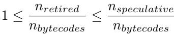
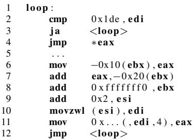
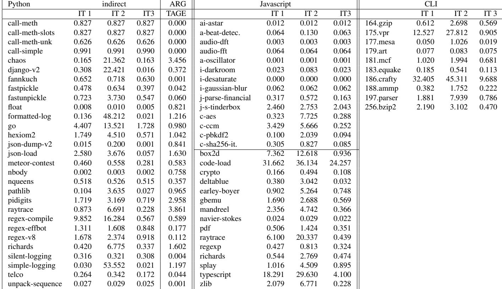

# Branch Prediction and the Performance of Interpreters – Don’t Trust Folklore 图表详解

### Figure 1. Main loop of naive interpreter

- 图片展示了“朴素解释器”的主循环，分为两部分：(a) C语言源代码和(b) x86汇编代码。
- **C源代码部分**：
    - 第1行：无限循环 `while (1)`，构成解释器核心。
    - 第2行：从虚拟程序计数器 `vpc` 指向的地址读取操作码 `opc`，并递增 `vpc`。
    - 第3–12行：使用 `switch(opc)` 实现指令分发，根据操作码跳转到对应处理逻辑。
    - 第5–7行：以 `ADD` 为例，从栈中弹出两个操作数 `x` 和 `y`，执行加法后将结果压回栈。
    - 第8行：`break` 用于跳出当前 `case`，避免穿透。
- **x86汇编部分**：
    - 第1行：标签 `loop:` 标识循环起点。
    - 第2–4行：加载操作码（`add 0x2, %esi` 增加指针，`movzwl (%esi), %edi` 加载字），与有效范围比较（`cmp 0x299, %edi`），若超出则跳回循环开始（`ja <loop>`）。
    - 第5–6行：通过查表获取目标地址（`mov 0x...(%edi,4), %eax`），然后间接跳转（`jmp *%eax`），这是**关键的间接分支指令**。
    - 第7–12行：示例 `ADD` 的汇编实现，包括从栈中取值、计算、存回，并最终跳回主循环。
- 该图直观揭示了解释器性能瓶颈：**间接跳转**（`jmp *%eax`）因目标众多且模式复杂，传统上被认为难以预测，导致流水线停顿。
- 下表总结了C代码与汇编代码的对应关系：

| C代码行号 | 功能描述                     | 对应汇编行号 |
| --------- | ---------------------------- | ------------ |
| 1         | 主循环开始                   | 1            |
| 2         | 获取操作码并递增vpc          | 2–3          |
| 3–4       | switch语句及范围检查         | 4            |
| 5–7       | ADD操作：弹栈、计算、压栈    | 7–11         |
| 8         | break                        | 12           |
| 无        | 间接跳转至对应操作码处理逻辑 | 5–6          |

- 此图是理解论文核心论点的基础：现代处理器（如Haswell）的分支预测器已能高效处理此类间接分支，使其不再成为性能主要瓶颈。

### Figure 2. Token threading, using a GNU extension

- 图片展示了 **Token Threading** 的实现方式，这是一种用于优化解释器性能的编译技术。
- 该技术依赖于 **GNU C** 编译器的扩展功能 **Labels as Values**，允许将标签（label）作为指针存储和操作。
- 核心数据结构是一个名为 `labels` 的指针数组，其中每个元素指向一个特定操作码（如 `ADD`, `SUB`）对应的代码标签地址。
- 主要执行逻辑通过 `goto *labels[*vpc++];` 实现，它直接跳转到下一个字节码对应的操作标签，从而绕过传统的 `switch` 语句。
- 在每个操作标签（如 `ADD:`）内部，执行完具体操作后，再次使用 `goto *labels[*vpc++];` 跳转到下一个字节码，形成“线程化”的执行流。
- 这种方法避免了每次循环都进行间接跳转和查表，理论上能提高分支预测准确率和执行效率。
- 但该技术牺牲了部分可移植性，因为并非所有编译器都支持 **Labels as Values** 扩展。

| 组件                   | 描述                                                            |
| ---------------------- | --------------------------------------------------------------- |
| `void* labels[]`       | 存储各操作码对应代码标签地址的指针数组                          |
| `goto *labels[*vpc++]` | 核心跳转指令，根据虚拟程序计数器 `vpc` 获取下一条指令地址并跳转 |
| `ADD:` / `SUB:`        | 操作码对应的代码标签，执行具体语义后继续跳转                    |

- 该图是论文中讨论 **Jump Threading** 优化策略的关键示例，旨在说明如何通过改变控制流结构来减少传统 `switch` 语句带来的性能开销。

### Figure 3. Speedups in Python

- 图片包含两个子图，分别展示 Python-3 和 Python-2 在不同微架构上因代码优化带来的性能提升。
- 子图 (a) 标题为 “Speedup due to threaded code in Python-3”，比较了 **Nehalem**、**Sandy Bridge** 和 **Haswell** 三代处理器上启用跳转线程（jump threading）后的加速比。
- 子图 (b) 标题为 “Speedup due to opcode prediction in Python-2”，展示了 Python-2 中针对高频操作码对进行的有限线程化优化在三款处理器上的加速效果。
- 两图纵轴均为加速比（speedup），基准为未启用优化版本；横轴为不同基准测试程序（benchmarks）。
- 所有柱状图按处理器代际分组：黑色代表 Nehalem，灰色代表 Sandy Bridge，白色代表 Haswell。
- 数据趋势显示：**加速比随处理器代际演进而下降**。例如，在 Python-3 中，Nehalem 平均加速 10.1%，Sandy Bridge 降至 4.2%，Haswell 仅 2.8%。
- Python-2 的优化幅度更小，平均加速分别为 2.8%（Nehalem）、3.2%（Sandy Bridge）、1.8%（Haswell）。
- 部分基准测试在 Nehalem 上出现显著加速（如超过 1.3 倍），但在 Haswell 上几乎无提升或仅略高于 1.0。
- 这表明现代处理器（尤其是 Haswell）的分支预测能力已大幅增强，使得传统用于缓解间接跳转开销的“跳转线程”技术收益锐减。
- 论文指出，这种加速不仅源于分支预测改善，也因线程化减少了部分指令执行（如 Python-3 平均减少 3.3% 指令数），但该因素贡献与性能增益量级相当。

| 处理器代际   | Python-3 平均加速比 | Python-2 平均加速比 |
| ------------ | ------------------- | ------------------- |
| Nehalem      | **10.1%**           | **2.8%**            |
| Sandy Bridge | **4.2%**            | **3.2%**            |
| Haswell      | **2.8%**            | **1.8%**            |

- 结论：**跳转线程在现代处理器上的价值已显著降低**，其历史性能优势主要源于早期分支预测器的不足，而非本质算法改进。

### Table 1. Benchmarks

- 该图片为论文中的 **Table 1. Benchmarks**，列出了用于实验的三类解释器（Python、Javascript、CLI）所使用的基准测试程序。
- 表格按语言分类，清晰划分了各解释器对应的测试用例，便于横向比较不同语言在相同硬件或预测器下的表现。
- 所有基准测试均运行至完成，部分测试耗时可达数百小时，确保数据具有统计意义和代表性。

| 解释器类型              | 基准测试名称                                                                                                                                                                                                                                                                                                                                                 |
| ----------------------- | ------------------------------------------------------------------------------------------------------------------------------------------------------------------------------------------------------------------------------------------------------------------------------------------------------------------------------------------------------------ |
| **Python**              | call_method, call_method_slots, call_method_unknown, call_simple, chaos, django_v2, fannkuch, fastpickle, fastunpickle, float, formatted_logging, go, hexiom2, json_dump_v2, json_load, meteor_contest, nbody, nqueens, pathlib, pidigits, raytrace, regex_compile, regex_effbot, regex_v8, richards, silent_logging, simple_logging, telco, unpack_sequence |
| **Javascript (kraken)** | ai-astar, audio-beat-detection, audio-dft, audio-fft, audio-oscillator, imaging-darkroom, imaging-desaturate, imaging-gaussian-blur, json-parse-financial, json-stringify-tinderbox, crypto-aes, crypto-cm, crypto-pbkdf2, crypto-sha256-iterative                                                                                                           |
| **Javascript (octane)** | box2d, code-load                                                                                                                                                                                                                                                                                                                                             |
| **CLI**                 | 164.gzip, 175.vpr, 177.mesa, 179.art, 181.mcf, 183.equake, 186.crafty, 188.ammp, 197.parser, 256.bzip2                                                                                                                                                                                                                                                       |

- **Python** 测试集包含大量真实应用场景，如 web 框架（django_v2）、正则表达式（regex\_\*）、序列化（fastpickle）、数学计算（nqueens）等，覆盖广泛。
- **Javascript** 分为两个子集：**Kraken** 和 **Octane**，前者侧重多媒体与图像处理，后者包含更底层的性能测试如 `box2d`（物理引擎）和 `code-load`（代码加载开销）。
- **CLI** 使用的是 **SPEC 2000** 的训练输入集，涵盖压缩（gzip, bzip2）、图形（mesa）、科学计算（ammp）、解析器（parser）等典型工作负载。
- 部分基准测试被排除，如 Python 中的 `iterative_count`, `spectral_norm`, `threaded_count`，因测量设置不兼容；CLI 中缺失部分 SPEC 2000 测试项（如 gcc, perlbench），因编译器不支持某些 C 特性（如 setjmp, POSIX 系统调用）。

### Table 2. Branch predictor parameters

- **Table 2** 展示了三种分支预测器（TAGE、ITTAGE 2、ITTAGE 1）的关键参数配置，用于实验对比。
- 参数包括最小历史长度、最大历史长度、表数量、各表项数及总存储空间，体现不同预测器的复杂度与资源占用。
- **TAGE** 作为条件分支预测器基准，其最大历史长度为 75，共 5 张表，总存储为 **8 KB**。
- **ITTAGE 1** 和 **ITTAGE 2** 是针对间接分支的 TAGE 变体，两者均使用 8 张表，最大历史长度为 80，但表项数和总存储不同：
    - ITTAGE 1：T₀ 表 512 项，T₁–Tₙ₋₁ 表每张 128 项，总存储 **12.62 KB**。
    - ITTAGE 2：T₀ 表 256 项，T₁–Tₙ₋₁ 表每张 64 项，总存储 **6.31 KB**。
- 三者最小历史长度分别为 5（TAGE）、2（ITTAGE 2）、2（ITTAGE 1），表明 ITTAGE 更侧重短历史模式捕捉。
- 存储规模差异直接影响预测精度，尤其在 CLI 解释器等高目标数场景中，**更大的 ITTAGE（如 12.62 KB）能显著降低误预测率**。
- 实验设计通过对比不同大小的 ITTAGE，验证预测器“足迹”对解释器性能的影响，而非预测机制本身缺陷。

### 1fc5ddb3d1eee3e0070dccc37f05afc11c67082894b0273da92ada476f60b4b8.jpg

- 该图片展示了一个数学不等式，用于描述在性能测量中，**retired indirect branches**（已退休的间接分支）数量与**bytecodes**（字节码）数量之间的关系。
- 不等式为：**1 ≤ n_retired / n_bytecodes ≤ n_speculative / n_bytecodes**。
- **n_retired** 表示实际执行并完成的间接分支指令数量。
- **n_bytecodes** 表示解释器执行的字节码总数。
- **n_speculative** 表示处理器在推测执行路径中遇到的间接分支指令数量（包括最终被取消的路径）。
- 该不等式表明，每个字节码至少对应一个已退休的间接分支（即 dispatch loop 中的跳转），但可能因推测执行而产生更多分支。
- 在实验中，作者通过比较 **n_speculative / n_bytecodes** 的值来判断推测执行对测量结果的影响。若该比值接近 1，则说明非退休分支可忽略；否则需使用 Pin 工具进行精确计数。
- 此公式是论文第 4.2.1 节“Existing Hardware – Performance Counters”中的关键推导，用于校准硬件性能计数器（PMU）的数据准确性。

### Figure 4. Python MPKI for all predictors

- 图片为 **Figure 4**，标题为 “Python MPKI for all predictors”，展示的是 Python 解释器在不同处理器架构和预测器配置下的 **MPKI（Mispredictions Per Kilo Instructions）** 数据。

- 横轴为 **benchmarks**，共约 26 个测试用例，编号从 0 到 25+，代表不同的 Python 基准程序。

- 纵轴为 **MPKI 值**，范围从 0 到 20，表示每千条指令中分支预测错误的次数。

- 图例包含四种预测器配置：

    - **Nehalem**：浅灰色柱状图
    - **Sandy Bridge**：中灰色柱状图
    - **Haswell**：深灰色柱状图
    - **TAGE 1**：黑色柱状图

- 从整体趋势看，**MPKI 随着处理器代际演进显著下降**：

    - Nehalem 上多数基准测试的 MPKI 在 **12–18 范围内**，部分甚至接近 20。
    - Sandy Bridge 明显改善，MPKI 多数落在 **4–10 区间**。
    - Haswell 进一步优化，MPKI 大幅压缩至 **0.5–4**，部分测试低于 1。
    - TAGE 1（模拟的先进预测器）表现与 Haswell 接近，多数情况下 **低于或持平于 Haswell**。

- 关键观察点：

    - **Haswell 和 TAGE 1 的预测精度已非常接近**，表明现代硬件预测器性能已逼近学术界最优方案。
    - 在多个基准测试中（如 benchmark 5, 10, 15），Nehalem 的 MPKI 是 Haswell 的 **10 倍以上**，体现分支预测技术的巨大进步。
    - 少数测试（如 benchmark 25）中 TAGE 1 表现优于 Haswell，说明在特定负载下，软件模拟的 ITTAGE 可能更优。
    - 所有预测器在部分测试（如 benchmark 0, 20）中均表现良好（MPKI < 2），说明某些 Python 程序本身具有高度可预测性。

- 数据对比表（典型值）：

| Benchmark | Nehalem (MPKI) | Sandy Bridge (MPKI) | Haswell (MPKI) | TAGE 1 (MPKI) |
| --------- | -------------- | ------------------- | -------------- | ------------- |
| 0         | ~5             | ~2                  | ~1             | ~0.5          |
| 5         | ~18            | ~6                  | ~3             | ~2            |
| 10        | ~16            | ~5                  | ~2             | ~1            |
| 15        | ~17            | ~7                  | ~3             | ~2            |
| 20        | ~4             | ~1                  | ~0.5           | ~0.3          |
| 25        | ~15            | ~5                  | ~2             | ~1            |

- 结论：该图直观验证了论文核心观点——**现代处理器（如 Haswell）的分支预测能力已大幅提升，使得解释器中的间接跳转不再是性能瓶颈**。TAGE 1 的模拟结果进一步佐证了这一点，表明当前硬件预测器已达到学术前沿水平。

### Figure 5. Javascript MPKI for all predictors

- 图片为 **Figure 5**，标题为 “Javascript MPKI for all predictors”，展示的是在不同处理器架构和模拟预测器下，**Javascript 解释器**的分支预测错误率（MPKI）。

- 横轴为 **27 个不同的 Javascript 基准测试程序**（benchmarks），编号从 0 到 26。

- 纵轴为 **MPKI（Mispredictions Per Kilo Instructions）**，范围从 0 到 18，表示每千条指令中发生分支预测错误的次数。

- 图例包含四种预测器配置：

    - **Nehalem**：白色柱状图
    - **Sandy Bridge**：浅灰色柱状图
    - **Haswell**：深灰色柱状图
    - **TAGE 1**：黑色柱状图

- 数据趋势清晰显示，随着处理器代际演进，**MPKI 显著下降**：

    - **Nehalem** 的 MPKI 多数在 **12–16** 范围内，部分甚至接近 18。
    - **Sandy Bridge** 下降至 **4–10**，性能提升明显。
    - **Haswell** 和 **TAGE 1** 的 MPKI 大多落在 **0.5–3** 区间，表现极为优异。

- 关键观察点：

    - 在绝大多数基准测试中，**Haswell 与 TAGE 1 的预测精度几乎持平**，说明现代硬件预测器已达到文献中最先进预测器（ITTAGE）的水平。
    - 少数异常值如 benchmark 15、25、26，Haswell 表现略优于 TAGE 1；而 benchmark 10、11、12 中 TAGE 1 更优。
    - 三个最差案例（benchmark 0, 1, 2）在 Nehalem 上高达 16–18 MPKI，而在 Haswell/TAGE 1 上均降至 2 以下，降幅超过 90%。

- 总结性数据对比（典型值）：

| 预测器       | 典型 MPKI 范围 | 相对 Nehalem 改善幅度 |
| ------------ | -------------- | --------------------- |
| Nehalem      | 12–16          | —                     |
| Sandy Bridge | 4–10           | ~50%                  |
| Haswell      | 0.5–3          | >90%                  |
| TAGE 1       | 0.5–3          | >90%                  |

- 此图有力支持论文核心论点：**现代分支预测器（尤其是 Haswell）已使解释器中的间接跳转不再成为性能瓶颈**，传统“不可预测”的说法已过时。

### Figure 6. CLI MPKI for all predictors

- 图片为 **Figure 6**，标题为 “CLI MPKI for all predictors”，展示的是 **Common Language Infrastructure (CLI)** 解释器在不同处理器架构和预测器下的 **分支误预测率（MPKI）**。

- 横轴列出多个 **SPEC 2000** 基准测试程序：gzip, vpr, mesa, art, mcf, equake, crafty, ammp, parser, bzip2。

- 纵轴表示 **MPKI（每千条指令的误预测次数）**，范围从 0 到 25。

- 图例包含四种预测器配置：

    - **Nehalem**（白色柱）
    - **Sandy Bridge**（浅灰色柱）
    - **Haswell**（深灰色柱）
    - **TAGE1**（黑色柱）

- 数据趋势显示：

    - **Nehalem** 的 MPKI 最高，多数基准测试在 15–25 范围内，表明早期处理器预测能力较弱。
    - **Sandy Bridge** 明显优于 Nehalem，MPKI 大幅下降至 5–20 区间，体现第二代改进。
    - **Haswell** 进一步优化，MPKI 多数低于 5，部分如 crafty、ammp、parser 甚至接近 1–2，性能显著提升。
    - **TAGE1**（模拟的 ITTAGE 预测器）表现与 Haswell 接近，部分场景（如 crafty、vpr）略优或相当，验证了现代预测器的有效性。

- 关键观察点：

    - **crafty** 和 **vpr** 在 Nehalem 和 Sandy Bridge 上 MPKI 较高（>15），但在 Haswell 和 TAGE1 下大幅降低，说明这些程序对预测器敏感，但现代硬件已能较好处理。
    - **art** 和 **bzip2** 在所有架构下 MPKI 均较低（\<5），表明其控制流较易预测。
    - **TAGE1** 在部分基准（如 crafty）中 MPKI 低于 Haswell，暗示模拟预测器在特定负载下可能更优。

- 总结表格：

| Benchmark | Nehalem MPKI | Sandy Bridge MPKI | Haswell MPKI | TAGE1 MPKI |
| --------- | ------------ | ----------------- | ------------ | ---------- |
| gzip      | ~19          | ~14               | ~3           | ~1         |
| vpr       | ~24          | ~21               | ~6           | ~7         |
| mesa      | ~14          | ~11               | ~3           | ~1         |
| art       | ~8           | ~10               | ~2           | ~1         |
| mcf       | ~18          | ~15               | ~2           | ~1         |
| equake    | ~20          | ~19               | ~2           | ~1         |
| crafty    | ~21          | ~20               | ~12          | ~11        |
| ammp      | ~20          | ~19               | ~2           | ~1         |
| parser    | ~15          | ~12               | ~2           | ~1         |
| bzip2     | ~20          | ~14               | ~3           | ~2         |

- 核心结论：
    - **CLI 解释器的间接分支预测在 Haswell 上已不再是性能瓶颈**，MPKI 降至 0.5–2 范围。
    - **ITTAGE 模拟结果与 Haswell 实际表现高度一致**，证明现代预测器设计有效。
    - 尽管某些程序（如 crafty）仍存在较高误预测，但通过增大预测器容量（如 TAGE3 50KB）可进一步优化，非预测机制本身缺陷。

### Figure 7. Correlation between MPKI and lost slots

- 图表标题为 **Figure 7. Correlation between MPKI and lost slots**，展示的是 **MPKI（Mispredictions Per Kilo Instructions）** 与 **wasted slots (%)** 之间的相关性。
- 横轴为 **wasted slots (%)**，范围从 0% 到 40%，表示处理器前端因分支错误预测、内存序冲突等导致的指令发射槽浪费比例。
- 纵轴为 **MPKI**，范围从 0 到 25，代表每千条指令中发生的分支错误预测次数。
- 数据点分为两类：**Sandy Bridge** 用“+”标记，**Haswell** 用“×”标记，清晰区分两代 Intel 微架构的表现。
- 整体趋势显示：**MPKI 越高，wasted slots 越高**，二者呈正相关。这表明分支预测错误是造成前端资源浪费的主要原因。
- **Haswell 的数据点普遍集中在低 MPKI 和低 wasted slots 区域**，例如多数在 MPKI < 5 且 wasted slots < 15%。
- **Sandy Bridge 的数据点分布更广，部分高达 MPKI > 15 和 wasted slots > 30%**，说明其分支预测效率较低，前端浪费更严重。
- 文中指出，在 Haswell 上，**平均仅浪费 7.8% 的指令槽位**，而 Sandy Bridge 为 **14.5%**，Haswell 减少了约 50% 的浪费。
- 表明 **Haswell 的分支预测器显著优于 Sandy Bridge**，使得解释器程序的性能瓶颈不再主要来自分支预测错误。

| 架构         | 平均 wasted slots (%) | MPKI 范围  | 性能表现               |
| ------------ | --------------------- | ---------- | ---------------------- |
| Sandy Bridge | 14.5%                 | 0–25       | 高浪费，预测准确率较低 |
| Haswell      | 7.8%                  | 0–5 (多数) | 低浪费，预测准确率高   |

- 此图验证了论文核心观点：**现代处理器（如 Haswell）的分支预测能力已大幅提升，使解释器中的间接跳转不再是性能瓶颈**。

### Figure 8. Dispatch loop of the CLI interpreter (+ADD)

- 图片展示了 **CLI interpreter** 的调度循环汇编代码，具体为处理 **ADD** 操作码的片段。
- 该循环结构紧凑，仅由 **7 条指令** 构成，体现了低抽象层级解释器的高效性。
- 第1行 `loop:` 标记了主循环的起始点，是解释器无限执行的核心。
- 第2、3行 `cmp` 和 `ja` 实现了一个 **无用的范围检查**，这是编译器未能优化掉的冗余操作。
- 第4行 `jmp *eax` 是关键的 **间接跳转指令**，它根据当前操作码（存储在 `eax`）跳转到对应的处理代码块。
- 第5行省略号 `...` 表示此处插入的是对应操作码（如 ADD）的具体语义实现代码。
- 第6至8行是 **ADD 操作码的实现**：从栈中加载两个操作数，执行加法，并将结果存回栈顶。
- 第9行 `add 0x2, esi` 调整虚拟程序计数器（vpc），指向下一个字节码。
- 第10行 `movzwl (esi), edi` 将下一个字节码的操作码加载到 `edi` 寄存器。
- 第11行 `mov 0x... (edi,4), eax` 通过查表获取对应操作码的处理函数地址，存入 `eax`。
- 第12行 `jmp <loop>` 无条件跳回循环起点，准备处理下一个字节码。

| 行号 | 指令                     | 功能描述                           |
| ---- | ------------------------ | ---------------------------------- |
| 1    | `loop:`                  | 循环标签                           |
| 2    | `cmp 0x1de, edi`         | 检查操作码是否超出有效范围         |
| 3    | `ja <loop>`              | 若超出则跳过，继续下一轮           |
| 4    | `jmp *eax`               | **间接跳转**，执行当前字节码的语义 |
| 5    | `...`                    | 字节码具体实现（如 ADD）           |
| 6    | `mov -0x10(ebx), eax`    | 从栈顶加载第一个操作数             |
| 7    | `add eax, -0x20(ebx)`    | 执行加法运算                       |
| 8    | `add 0xfffffffff0, ebx`  | 将结果存回栈顶                     |
| 9    | `add 0x2, esi`           | 更新虚拟程序计数器                 |
| 10   | `movzwl (esi), edi`      | 加载下一个字节码的操作码           |
| 11   | `mov 0x... (edi,4), eax` | 查表获取下一个字节码的处理函数地址 |
| 12   | `jmp <loop>`             | 跳回循环开始，处理下一个字节码     |

- 该调度循环设计精简，但存在可优化空间，例如第2、3行的范围检查和第11行的查表操作。
- 与 Python 或 Javascript 解释器相比，CLI 解释器的调度循环更短，因为其字节码更接近底层机器指令，无需处理动态类型等复杂特性。

### Table 3. Python characteristics and branch prediction for Nehalem (Neh.), Sandy Bridge (SB), Haswell (Has.) and TAGE

- 该表格（Table 3）记录了在不同处理器架构（Nehalem, Sandy Bridge, Haswell）及模拟预测器（TAGE1, TAGE2）下，**Python 解释器**执行各基准测试（benchmark）时的性能与分支预测数据。
- 表格左侧列出了 **30 个 Python 基准测试**，如 `call_method`, `chaos`, `django_v2`, `go`, `json_load` 等，涵盖方法调用、正则表达式、日志处理、数值计算等多种场景。
- 核心指标包括：
    - **Mbc**: 执行的字节码数量（百万级）
    - **Gins**: 执行的原生指令数（十亿级）
    - **IPC**: 每周期指令数（Instructions Per Cycle），反映整体执行效率
    - **ins/bc**: 平均每条字节码对应的原生指令数
    - **br**: 分支指令占比
    - **ind**: 间接分支指令占比
    - **ind/bc**: 平均每条字节码触发的间接分支数
    - **MPKI**: 每千条指令的分支预测失误次数（Mispredictions Per Kilo Instructions），是衡量预测器效果的关键指标

以下是关键数据摘要：

| benchmark    | Mbc  | Gins | IPC (Has.) | ins/bc | ind/bc | MPKI (Has.) | MPKI (TAGE1) |
| ------------ | ---- | ---- | ---------- | ------ | ------ | ----------- | ------------ |
| call_method  | 6137 | 771  | 2.93       | 125.6  | 1.01   | 0.1         | 0.067        |
| chaos        | 1196 | 162  | 2.21       | 135.4  | 1.07   | 1.8         | 0.680        |
| django_v2    | 1451 | 332  | 2.10       | 228.7  | 1.33   | 1.5         | 0.529        |
| fastpickle   | 34   | 351  | 2.63       | 10277  | 54     | 1.4         | 2.258        |
| go           | 2972 | 344  | 2.20       | 115.7  | 1.01   | 2.4         | 1.121        |
| json_load    | 195  | 271  | 2.50       | 1391   | 6.76   | 2.1         | 3.074        |
| regex_effbot | 7    | 52   | 3.35       | 6977   | 146    | 0.0         | 0.026        |
| telco        | 34   | 38   | 2.24       | 174.6  | 2.35   | 1.5         | 1.143        |
| **average**  | —    | —    | **2.86**   | —      | —      | **1.4**     | **0.8**      |

- **性能趋势**：从 Nehalem 到 Haswell，**IPC 显著提升**，平均值从 1.90 提升至 2.86，表明现代处理器架构对解释器执行更友好。
- **分支预测改进**：**MPKI 大幅下降**，平均值从 Nehalem 的 12.8 降至 Haswell 的 1.4，说明现代分支预测器（如 Haswell 内置预测器或 ITTAGE）能有效捕捉解释器中的模式。
- **TAGE 预测器表现**：TAGE1（12.62 KB）和 TAGE2（6.31 KB）的 MPKI 平均值分别为 0.8 和 1.3，**接近甚至优于 Haswell 实际硬件表现**，尤其在 `fastpickle`、`regex_effbot` 等复杂负载上表现稳定。
- **异常情况**：
    - `fastpickle` 和 `regex_effbot` 的 `ind/bc` 极高（54 和 146），表明其执行大量非主循环代码（如调用 C 库），导致间接分支激增。
    - `json_load` 的 `ind/bc` 达 6.76，MPKI 较高（2.1），但 TAGE1 仍能较好预测（3.074），说明预测器对复杂控制流仍有适应能力。
    - `go` 在 Haswell 上 MPKI 为 2.4，高于平均，但 TAGE1 仅 1.121，显示模拟预测器在特定负载上可能更优。
- **结论**：**Python 解释器中的间接分支已不再“难以预测”**。现代处理器和先进预测器（如 ITTAGE）能高效处理其模式，使分支预测不再是性能瓶颈。即使在 Haswell 上，预测失误率也已降至可忽略水平（平均 1.4 MPKI）。

### Table 4. Javascript characteristics and branch prediction for Nehalem (Neh.), Sandy Bridge (SB), Haswell (Has.) and TAGE

- 该表格（Table 4）详细记录了 **Javascript** 解释器在不同微架构（Nehalem, Sandy Bridge, Haswell）及模拟预测器（TAGE1, TAGE2）下的性能与分支预测表现，基准测试分为 **kraken** 和 **octane** 两大套件。

- 表格结构清晰，包含以下核心列：

    - `benchmark`：具体测试用例名称。
    - `Mbc`：执行的字节码数量（百万级）。
    - `Gins`：执行的原生指令数（十亿级）。
    - `IPC`：每周期指令数，分三列对应 Neh., SB, Has.。
    - `ins/bc`：平均每字节码对应的原生指令数。
    - `br`：分支指令占比。
    - `ind`：间接分支指令占比。
    - `ind/bc`：每字节码对应的间接分支数。
    - `MPKI`：千指令误预测数，分五列对应 Neh., SB, Has., T1, T2。

- **关键数据趋势**：

    - **IPC 提升显著**：从 Nehalem 到 Haswell，平均 IPC 从 1.36 提升至 2.47，反映现代处理器流水线效率提升。
    - **MPKI 持续下降**：平均 MPKI 从 Nehalem 的 **13.6** 降至 Haswell 的 **1.7**，TAGE1 更低至 **0.7**，表明分支预测精度大幅提升。
    - **TAGE 预测能力接近 Haswell**：TAGE1（12.62KB ITTAGE）在多数测试中 MPKI 低于或接近 Haswell，验证其作为前沿预测器的有效性。

- **异常值分析**：

    - `code-load` 在 octane 套件中表现特殊：`ins/bc` 高达 4286，`ind/bc` 达 14.3，说明其执行大量非解释器主循环代码，导致分支行为复杂。
    - `json-parse-financial` 和 `json-stringify-tinderbox` 在 kraken 中同样具有极高 `ins/bc` 和 `ind/bc`，暗示其调用大量本地库或复杂解析逻辑。

- **分支特性**：

    - 间接分支占比（`ind`）普遍在 **1%~3%**，但 `code-load` 达到 **0.3%**，显示其分支行为更稀疏。
    - 多数测试中 `ind/bc` 接近 1.0，符合“每个字节码触发一次间接跳转”的预期；偏离值多与外部库调用相关。

- **预测器对比**：

    - TAGE1（大容量 ITTAGE）在绝大多数测试中优于 TAGE2（小容量），尤其在 `code-load`、`typescript` 等高复杂度测试中差距明显。
    - Haswell 实际硬件预测器在部分测试（如 `splay`, `zlib`）中略优于 TAGE1，但在 `crypto-sha256-iterative` 等测试中被 TAGE1 超越，显示实际硬件可能采用更优策略或更大容量。

- **结论**：

    - **现代分支预测器已能高效处理 Javascript 解释器的间接跳转**，MPKI 降至 1~2 范围，远低于早期文献所称的“难以预测”。
    - **TAGE 模拟结果与 Haswell 实测高度一致**，支持论文核心论点：间接分支不再是性能瓶颈。
    - **少数高复杂度测试仍需更大预测器容量**，如 `code-load`，提示未来优化方向可聚焦于预测器资源分配。

### Table 5. CLI characteristics and branch prediction for Nehalem (Neh.), Sandy Bridge (SB), Haswell (Has.) and TAGE

- 该图片为论文中的 **Table 5**，标题为 “CLI characteristics and branch prediction for Nehalem (Neh.), Sandy Bridge (SB), Haswell (Has.) and TAGE”，展示的是 **Common Language Infrastructure (CLI)** 解释器在不同处理器架构和预测器下的性能与分支预测数据。

- 表格结构分为三部分：

    - 左侧：基准测试（benchmark）及其基本执行特征。
    - 中间：指令级指标（IPC、每字节码指令数、分支比例等）。
    - 右侧：不同架构与预测器下的 **MPKI（Mispredictions Per Kilo Instructions）** 数据。

- 基准测试列表包括：

    - 164.gzip
    - 175.vpr
    - 177.mesa
    - 179.art
    - 181.mcf
    - 183.equake
    - 186.crafty
    - 188.ammp
    - 197.parser
    - 256.bzip2

- 关键指标说明：

    - **Gbc**: GC 次数（Garbage Collection count），反映内存管理开销。
    - **Gins**: GC 插入指令数（Garbage Insertion Instructions），衡量 GC 对执行流的干扰。
    - **IPC**: Instructions Per Cycle，衡量处理器效率。
    - **ins/bc**: 每个字节码执行的原生指令数。
    - **br**: 分支指令占比。
    - **ind**: 间接分支指令占比。
    - **ind/bc**: 每字节码对应的间接分支数。
    - **MPKI**: 分支误预测率，数值越低越好。

- 数据概览：

| benchmark  | Gbc   | Gins   | IPC Neh. | SB   | Has. | ins/bc | br  | ind  | ind/bc | MPKI Neh. | SB   | Has. | T1    | T2    | T3   |
| ---------- | ----- | ------ | -------- | ---- | ---- | ------ | --- | ---- | ------ | --------- | ---- | ---- | ----- | ----- | ---- |
| 164.gzip   | 78.8  | 1667.2 | 1.20     | 1.23 | 2.55 | 21.2   | 23% | 4.8% | 1.02   | 18.7      | 14.5 | 0.5  | 0.64  | 1.58  | 0.62 |
| 175.vpr    | 18.4  | 400.9  | 0.97     | 1.00 | 1.80 | 21.8   | 23% | 4.7% | 1.03   | 24.8      | 21.9 | 6.3  | 6.49  | 13.62 | 1.08 |
| 177.mesa   | 118.6 | 3177.1 | 1.32     | 1.30 | 2.13 | 26.8   | 23% | 4.0% | 1.07   | 13.8      | 11.1 | 2.6  | 0.21  | 0.59  | 0.20 |
| 179.art    | 4.7   | 58.5   | 1.64     | 1.49 | 2.70 | 12.5   | 26% | 8.0% | 1.00   | 7.3       | 9.3  | 0.2  | 0.38  | 0.38  | 0.37 |
| 181.mcf    | 13.3  | 181.2  | 1.13     | 1.19 | 2.19 | 13.7   | 25% | 7.4% | 1.01   | 17.5      | 15.1 | 1.1  | 1.33  | 2.09  | 1.08 |
| 183.equake | 40.5  | 726.1  | 1.09     | 1.09 | 2.34 | 17.9   | 24% | 5.7% | 1.02   | 20.8      | 19.0 | 1.7  | 0.47  | 0.68  | 0.43 |
| 186.crafty | 35.8  | 1047.3 | 1.02     | 1.03 | 1.42 | 29.2   | 22% | 3.5% | 1.04   | 21.1      | 19.2 | 11.6 | 11.87 | 16.31 | 4.01 |
| 188.ammp   | 91.3  | 1665.9 | 1.15     | 1.24 | 2.18 | 18.3   | 24% | 5.7% | 1.04   | 19.5      | 14.4 | 2.9  | 0.39  | 1.14  | 0.30 |
| 197.parser | 12.6  | 447.5  | 1.19     | 1.24 | 2.18 | 35.4   | 22% | 3.0% | 1.06   | 14.4      | 10.8 | 1.4  | 0.10  | 2.75  | 0.70 |
| 256.bzip2  | 28.3  | 460.8  | 1.16     | 1.32 | 2.29 | 16.3   | 24% | 6.2% | 1.02   | 17.5      | 12.7 | 1.6  | 1.55  | 2.15  | 0.44 |
| average    | —     | —      | 1.16     | 1.24 | 2.20 | 21.0   | 23% | 5.2% | 1.03   | 17.5      | 14.8 | 3.0  | 2.4   | 4.1   | 0.9  |

- **关键观察**：

    - **Haswell 架构表现最优**：平均 MPKI 仅为 **3.0**，远低于 Nehalem 的 17.5 和 Sandy Bridge 的 14.8。
    - **TAGE 预测器（T1/T2/T3）模拟结果与 Haswell 接近**，尤其在 T3（50KB ITTAGE）配置下，MPKI 平均降至 **0.9**，表明现代预测器可有效处理 CLI 解释器的间接跳转。
    - **crafty 和 vpr 是异常值**：在 T1/T2 下 MPKI 显著偏高（如 crafty 达 11.87/16.31），但 T3 能大幅改善至 4.01，说明其对预测器容量敏感。
    - **CLI 解释器的间接分支密度较高**（ind/bc ≈ 1.03），但现代预测器仍能高效处理，证明“间接跳转不可预测”的旧观念已过时。

- **结论**：

    - 在 CLI 解释器中，**分支预测不再是性能瓶颈**，尤其在 Haswell 或大容量 ITTAGE 预测器下。
    - 性能提升主要源于硬件预测器进化，而非解释器结构改变。
    - 对于复杂应用（如 crafty），需更大预测器容量以维持高准确率。

### Table 6. (IT)TAGE misprediction results for “hard to predict” branch, TAGE 1, TAGE 2 and TAGE 3 (all numbers in %)

- 该表（Table 6）记录了三种不同大小的 ITTAGE 预测器（IT1: 6KB, IT2: 12KB, IT3: 50KB）在 Python、Javascript 和 CLI 解释器中对“难以预测”分支的误预测率（单位：百分比），并对比了 TAGE 对条件分支（如 Python 的 HAS_ARG）的预测表现。
- **Python 分支分析**：
    - **间接跳转（indirect）**：多数基准测试在 IT1（6KB）下误预测率低于 1%，但部分如 `chaos`, `django-v2`, `formatted-log`, `go` 表现较差。其中 `go` 在 IT1 下高达 4.407%，但在 IT3（50KB）下降至 1.728%，表明其需要更大预测器容量。
    - **HAS_ARG 条件分支（TAGE）**：绝大多数基准测试误预测率极低（< 0.5%），仅少数如 `float`, `go`, `regex-compile` 略高，最高为 `regex-compile` 的 1.630%。
- **Javascript 分支分析**：
    - **间接跳转（indirect）**：整体预测良好，多数低于 1%。但 `code-load` 异常严重，在 IT1 下达 31.662%，即使在 IT3 下仍为 24.257%，是唯一未被大容量预测器显著改善的案例。
    - 其他如 `j-s-tinderbox`, `c-sha256-it`, `box2d`, `raytrace`, `typescript` 等也存在较高误预测率，但均随预测器增大而显著下降。
- **CLI 分支分析**：
    - **间接跳转（indirect）**：表现最差，尤其在 `vpr`, `crafty`, `bzip2` 上。例如 `vpr` 在 IT1 下为 12.527%，IT3 下降至 0.905%；`crafty` 在 IT1 下高达 32.405%，IT3 下仍为 9.688%，显示其对预测器容量需求极高。
    - 多数其他基准测试在 IT3 下可降至 1% 以下，如 `art`, `mcf`, `equake`, `ammp`, `parser`, `bzip2`。
- **核心结论**：
    - 所谓“难以预测”的间接跳转分支，在现代预测器（尤其是足够大的 ITTAGE）下**并非固有不可预测**，其误预测主要源于**预测器容量不足**（footprint issue），而非分支本身特性。
    - **TAGE 对条件分支（如 HAS_ARG）预测极为准确**，误预测率普遍远低于 1%。
    - **预测器容量（IT1/IT2/IT3）是影响性能的关键因素**，从 6KB 到 50KB 的提升能显著降低误预测率，尤其对复杂或大型应用。

| 解释器     | 分支类型 | 基准测试      | IT1 (6KB) | IT2 (12KB) | IT3 (50KB) |
| ---------- | -------- | ------------- | --------- | ---------- | ---------- |
| Python     | indirect | go            | 4.407     | 13.521     | 1.728      |
|            |          | chaos         | 0.165     | 21.362     | 0.163      |
|            |          | formatted-log | 0.136     | 48.212     | 0.021      |
|            | TAGE     | float         | -         | -          | 0.821      |
| Javascript | indirect | code-load     | 31.662    | 36.134     | 24.257     |
|            |          | typescript    | 18.291    | 29.630     | 4.100      |
|            |          | box2d         | 7.362     | 12.618     | 0.936      |
| CLI        | indirect | vpr           | 12.527    | 27.812     | 0.905      |
|            |          | crafty        | 32.405    | 45.311     | 9.688      |
|            |          | bzip2         | 2.190     | 3.102      | 0.470      |

- **关键洞察**：**“难以预测”的说法是过时的 folklore**。现代高性能处理器（如 Haswell）和先进预测器（如 ITTAGE）已能有效处理解释器中的间接跳转，其性能瓶颈更多在于预测器容量而非预测算法本身。
