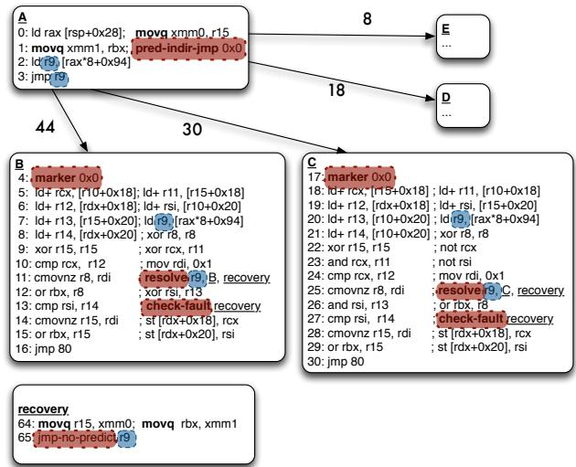
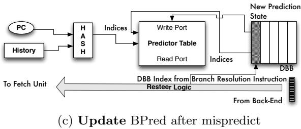

# Bungee Jumps: Accelerating Indirect Branches Through HW/SW Co-Design 通俗讲解

### 0. 整体创新点通俗解读

**痛点直击 (The "Why")**

- 传统的 **in-order (IO) 处理器**在处理 **indirect branch**（间接跳转）时非常痛苦。虽然现代的 **branch predictor**（分支预测器）已经能非常准确地预测出跳转目标（如 Figure 1 和 Figure 2 所示，**predictability** 远高于 **bias**），但 IO 处理器依然会卡住。
- 为什么？因为在现有 ISA 下，**预测点**和**执行/解析点**是同一个 `jmp` 指令。IO 处理器必须等整个“计算跳转地址的依赖链”（比如 `load -> load -> add -> jmp`）完全执行完，才能知道去哪取下一条指令。这个过程会产生大量 **stall cycles**（停顿周期）。
- 相比之下，**out-of-order (OOO) 处理器**没这个问题，因为它可以一边算跳转地址，一边根据预测结果提前把目标代码取进来并执行（如 Figure 3(a) 所示）。IO 处理器眼巴巴看着 OOO “吃肉”，自己却只能“喝汤”。

**通俗比方 (The Analogy)**

- 想象你要寄一个包裹（执行跳转后的代码），但包裹的地址写在一个保险箱里（需要一系列计算才能得到）。
- **传统 IO 做法**：你必须先打开保险箱（完成所有计算），拿到地址，然后才能去邮局寄包裹。这段时间你啥也干不了，干等着。
- **OOO 做法**：你有个超准的预言家（branch predictor），他猜出地址很可能是“A市”。于是你一边让助手去开保险箱，一边自己先跑去邮局，按“A市”的地址把包裹寄了。如果预言家猜对了，你就省了大把时间；猜错了，大不了把寄错的追回来重寄。
- **这篇论文的核心思想**：既然我们已经有了一个很准的预言家，那能不能给 IO 处理器也设计一套“先寄后验”的流程？答案就是，把“预言”和“验证”拆成两个独立的动作。

**关键一招 (The "How")**

- 作者没有去改进预测器本身，而是对 **ISA**（指令集架构）做了个精巧的手术，引入了两条新指令：
    - **`predict-indir-jmp`**: 这是一个纯粹的“预言”指令。它只在 **frontend**（取指前端）起作用，告诉处理器：“嘿，我猜我们要跳到 XXX 地址，你先去那儿取指令吧！” 这条指令本身不进入执行流水线。
    - **`resolve`**: 这是一个“验证”指令，被放置在每个可能的跳转目标代码块的开头。它的作用是检查：实际计算出来的跳转地址，是否和之前 `predict-indir-jmp` 预测的一致。如果一致，万事大吉；如果不一致，就跳转到 **recovery code**（恢复代码）去修正错误。
- 通过这个拆分，编译器（code generator）就可以大胆地将原本阻塞在跳转指令之后的、计算跳转地址的那部分代码（the indirect branch computation chain），**co-mingle**（混合调度）到各个预测的目标代码块中去执行（如 Figure 3(b) 和 Figure 7 所示）。
- 这样一来，IO 处理器就能模仿 OOO 的行为：在等待最终地址确认的同时，已经开始执行预测路径上的有用工作，从而**完全隐藏了间接跳转的计算延迟**。为了保证这种推测执行的安全性，论文还配套使用了 **fault-suppressed instructions**（抑制异常的指令）和 **temporary registers**（临时寄存器）来处理可能的异常和状态回滚。整个方案的硬件开销也很小，主要增加了一个叫 **Decomposed Branch Buffer (DBB)** 的小结构来关联 `predict` 和 `resolve` 指令。

### 1. Bungee Jump Transformation (ELI5)

**痛点直击 (The "Why")**

- 传统 **in-order (IO) 处理器** 面对间接分支（indirect branch）时，有一个致命的“卡脖子”问题：计算跳转目标地址的指令链（比如 `load -> add -> jmp reg`）必须在跳转发生前**完全执行完**。
- 这导致了一个长长的**关键路径**，后面的指令只能干等着，造成大量 **issue stalls**。
- 而 **out-of-order (OOO) 处理器** 则没这个问题。它靠强大的动态调度器，一旦预测了跳转目标，就立刻开始执行目标地址的代码，同时在后台慢慢算那个跳转地址。两者并行不悖，效率极高。
- 对 IO 处理器来说，即使现代分支预测器已经能**非常准确地预测**间接分支（如论文图2所示，预测准确率远高于分支偏置度），这种**编译时的控制依赖**依然锁死了指令调度，让它无法享受到预测准确带来的红利。之前的解决方案，如 **RCPO** 或 **predication**，要么只适用于目标很少的分支，要么会爆炸式地增加指令数和关键路径长度，得不偿失。

**通俗比方 (The Analogy)**

- 想象你要从A点开车去一个未知的目的地B、C或D。你有一个非常准的导航（**branch predictor**），它在你刚出发时就告诉你：“95%概率是去B”。
- **传统IO处理器的做法**：你必须先把车开到一个叫“地址计算中心”的地方，查清楚确切地址（比如通过查户口本 `load` 再拼门牌号 `add`），拿到纸质地址条后，才能根据地址条开车去B/C/D。即使导航早就告诉你是B，你也得先绕路去拿那张纸，浪费时间。
- **OOO处理器的做法**：它信任导航，一出A点就直接往B开，同时派个无人机（**动态调度器**）去“地址计算中心”拿地址条。等你快到B时，无人机也把地址条送到了，一对比，果然是B，完美。
- **Bungee Jump Transformation 的做法**：它给你的车加了个新功能。你在A点出发时，先按一下“**predict-indir-jmp**”按钮，告诉车载系统“我相信导航，现在就按它说的去B”。然后，你**一边开车去B，一边在路上完成查户口本和拼门牌号的动作**。当你到达B点门口时，再按一下“**resolve**”按钮，核对一下你刚在路上算出来的地址和B点的门牌是否一致。如果一致，万事大吉；如果不一致（预测错了），你就立刻掉头去正确的地方，并且路上算的那些东西作废。

 *Figure 3: The indirect branch computation chain (highlighted) is a source of stall cycles for the In-Order; the Out-of-Order overlaps the chain with instructions from the target B. Our transformation enables the In-Order to mimic the schedule found by the OOO.*

**关键一招 (The "How")**

- 作者并没有试图去改进预测器本身，而是巧妙地**重构了间接分支的语义**，把它从一个原子操作拆成了两个独立的指令。
- **第一步：分离预测与解析**。引入一个新的 **`predict-indir-jmp`** 指令，它**只负责通知前端取指单元**（fetch unit）“请根据预测器的结果，开始从预测的目标地址取指”。这个指令本身不参与后续的流水线执行。
- **第二步：交织计算与执行**。原本在跳转前必须完成的“地址计算链”，现在被**推送到各个可能的分支目标块内部**。这样，在预测路径上，处理器可以**并行地**执行两件事：1) 完成剩余的地址计算；2) 执行预测目标的有用工作。
- **第三步：延迟验证**。在每个分支目标块的开头，放置一个 **`resolve`** 指令。它会检查刚刚计算出的实际跳转地址是否和当前所在的目标块匹配。如果不匹配，就跳转到**恢复代码**（recovery code），回滚状态并重新定向到正确的路径。
- **第四步：硬件协同**。为了支持这套机制，硬件需要一个小巧的 **Decomposed Branch Buffer **(DBB)，用来将前端的 `predict` 指令和后端的 `resolve` 指令关联起来，确保预测器能得到正确的训练反馈。此外，还需要支持**投机执行中的故障抑制**（fault suppression），因为 `predict` 和 `resolve` 之间的代码都是推测执行的。

 *(a) Indirect Branch to be overlapped highlighted: branch bias shown on arcs*

 *Figure 7: Transformation*

### 2. Decomposed Branch Buffer (DBB) (ELI5)

**痛点直击 (The "Why")**

- 传统处理器里，一个 **indirect branch**（间接跳转）指令身兼二职：它既是前端 **预测** 的起点（“我们要跳去哪？”），又是后端 **解析/执行** 的终点（“我们到底算出来要跳去哪？”）。这两个动作在同一个指令上完成，天经地义。
- 但对于 **In-Order (IO) 处理器** 来说，这就成了枷锁。因为 IO 处理器无法像 Out-of-Order (OOO) 那样动态地把跳转目标的代码和计算跳转地址的代码重叠执行。IO 必须老老实实地等跳转地址算完，才能去取下一条指令，这中间就产生了 **stall cycles**（停顿周期）。
- 论文提出的解决方案很聪明：把一个跳转指令拆成两个——一个 **predict-indir-jmp**（只负责告诉前端“我猜我们要去这里”）和一个 **resolve**（在目标代码里，负责检查“我们猜得对不对”）。这样，IO 就能提前开始取目标代码，把计算地址的延迟给“藏”起来。
- **但是，拆开之后就乱套了！** 分支预测器怎么知道是哪个 `predict` 指令猜错了？它需要把 `resolve` 指令反馈的“正确答案”关联到当初发出预测的那个 `predict` 指令上，才能正确地更新自己的预测表。如果关联错了，预测器就会越学越笨。

**通俗比方 (The Analogy)**

- 想象一个餐厅的点餐系统。以前是一个服务员（传统branch指令）既负责记下客人的点单（预测），又负责把做好的菜端给客人（解析）。
- 现在为了提高效率，老板把工作拆了：一个 **接单员**（`predict`）专门在门口快速记录客人的需求并传给厨房；另一个 **上菜员**（`resolve`）在厨房做好菜后，负责核对订单再上菜。
- **问题来了**：如果上菜时发现做错了（misprediction），厨房主管（分支预测器）怎么知道是哪个接单员记错了单子？他们之间没有直接联系！
- **DBB 就是那个“订单号”系统**。每当接单员记下一个新订单，他都会生成一个唯一的 **订单号**（DBB entry）并把它贴在订单上，同时自己也留一份底单（写入DBB FIFO）。当上菜员拿着菜来核对时，他必须报出这个订单号。主管根据订单号，就能精准地找到是哪个接单员、在哪一桌犯了错，并针对性地进行培训（更新预测器）。

**关键一招 (The "How")**

- 作者并没有设计一套复杂的全局追踪机制，而是巧妙地利用了 **IO 处理器指令按序发射** 这一特性，引入了一个极简的硬件结构：**Decomposed Branch Buffer (DBB)**。
- DBB 本质上就是一个小型的 **FIFO circular buffer**（先进先出环形缓冲区）。
- 具体流程如下：
    - 当前端 **fetch** 到一个 `predict-indir-jmp` 指令时：
        - 它会像往常一样查询 **branch predictor** 得到一个预测目标。
        - 然后，它会将这次预测所需的所有 **metadata**（比如预测器表项的索引、预测的目标地址等）打包，作为一个新条目 **push** 进 DBB 的尾部。
        - 这个 `predict` 指令本身在完成其“指引前端取指”的使命后，就被丢弃，不再进入后端流水线。
    - 当后续的 `resolve` 指令被 **fetch** 时：
        - 由于指令是按序处理的，这个 `resolve` 必然对应于 DBB **尾部**（或者说头部，取决于实现视角）的那个最新 `predict` 条目。
        - 硬件会从 DBB 中 **pop** 出这个条目，并将其 **index/metadata** 打包进 `resolve` 指令的内部，让它带着这个“订单号”一起流经后端。
    - 当 `resolve` 指令在后端 **执行** 时：
        - 如果发现预测错误，它会带着这个“订单号”发起 **resteer**（重定向）。
        - 前端收到重定向信号后，利用这个“订单号”从 DBB 中找回当初的预测信息，从而能够 **精准地更新** 分支预测器的状态。
             *(b) Insert tail pointer index into corresponding resolution instruction.*
             *Figure 8: The Decomposed Branch Buffer and its operations.The area shaded in grey denotes existing HW structures and data/control paths.*

### 3. Landing Pad with Marker Instructions (ELI5)

**痛点直击**

- 传统的间接分支处理，预测和跳转是同一个指令。在作者提出的“Bungee Jumps”新方法里，他们把这两件事拆开了：一个 **predict-indir-jmp** 指令只负责告诉前端“去哪取指”，而真正的跳转验证则被推迟到目标代码块里的一个 **resolve** 指令。
- 这个拆分带来了一个致命问题：如果 **predict-indir-jmp** 指令被一个糟糕的预测器误导，或者因为 BTB（Branch Target Buffer）冲突，它可能会指向一个**完全无效的地址**。这个地址上根本没有 **resolve** 指令！
- 结果就是，处理器会一头扎进错误的代码里执行，既无法验证预测是否正确，也无法触发恢复机制回到正确的路径。整个系统就崩溃了。这就像你让一个信使去一个地址送信，但他走错了地方，那个地方根本没人能签收，信也就永远送不到了。

**通俗比方**

- 这个 **Landing Pad with Marker Instructions** 的设计，就像是给每一个合法的“降落点”（即间接分支的有效目标）都安装了一个独一无二的 **电子门禁卡**。
- 那个 **predict-indir-jmp** 指令在出发前，会从自己的口袋里掏出一张写着特定ID（即8位立即数）的 **通行证**。
- 当处理器前端根据预测跳转到目标地址后，它做的第一件事不是执行业务逻辑，而是检查门口（目标地址的第一条指令，即 **marker instruction**）的门禁卡ID。
- 只有当门口的ID和信使手里的通行证ID **完全匹配** 时，才说明降落在了正确的、受保护的区域，可以安全地继续执行。
- 如果ID对不上，或者门口根本没有门禁卡（即没有marker指令），那就说明降落在了“野外”，必须立刻启动应急预案——回退到一个已知的安全位置（即 **predict** 指令后面的顺序地址），那里有一套完整的、能算出正确地址的“导航系统”（即原始的间接分支计算链）。

 *Figure 11: A naive implementation of predict and resolve. Figure 12: (1) Invalid target address predicted and no resolve present; unable to resteer to the correct path (2) marker “landing pad” introduced to ensure a valid indirect branch target is fetched (3)placement indirect branch computation chain in the shadow of the predict allows us to resteer to correct path as shown in (4).*

**关键一招**

- 作者并没有依赖复杂的硬件来验证目标地址的有效性，而是巧妙地在软件层面引入了一种轻量级的 **握手协议**。
- 具体来说，他们在编译/动态翻译阶段做了两件事：
    - 在 **predict-indir-jmp** 指令中嵌入一个唯一的 **8-bit marker ID**。
    - 在每一个该间接分支的合法目标块的开头，插入一条特殊的 **marker instruction**，这条指令也包含同样的 **8-bit marker ID**。
- 硬件前端在取指阶段增加了一个简单的检查逻辑：一旦执行了 **predict-indir-jmp**，下一次取指的目标地址处的第一条指令**必须**是一条 **marker instruction**，并且其ID必须与 **predict** 指令中的ID一致。
- 如果检查失败（ID不匹配或不是marker指令），硬件就会忽略这次预测，转而从 **predict** 指令的下一条顺序地址开始取指。这个顺序地址处，保留了完整的、未经优化的间接分支计算代码（`ld r9; jmp r9`），它能保证最终一定能找到并跳转到正确的路径。
- 这一招的核心在于，它用极小的硬件开销（一个8位比较器）和微小的代码膨胀（每个目标块加一条指令），就完美地解决了因预测目标无效而导致的系统可靠性问题，为整个“预测-解析分离”的大胆构想提供了坚实的安全网。

### 4. Speculative Execution with Fault Suppression (ELI5)

**痛点直击 (The "Why")**

- 传统的 **speculative execution**（推测执行）在遇到可能出错的指令（比如访存越界、除零等）时会很“难受”。因为一旦在错误的路径上触发了异常（fault），处理器就必须立刻处理它，这会破坏整个推测执行的逻辑。
- 对于 **in-order processor**（顺序处理器）来说，这个问题更严重。因为它不像 **out-of-order**（乱序）处理器那样有复杂的 **reorder buffer** 来轻松回滚状态。如果在推测路径上贸然执行了可能出错的指令，一旦预测错误，恢复正确的 **architected state**（架构状态）会非常麻烦，甚至可能导致 **memory corruption**（内存损坏）。
- 因此，之前的方案要么不敢在推测路径上放太多代码，限制了性能提升；要么需要极其复杂的硬件来支持完整的事务性回滚，成本太高。

**通俗比方 (The Analogy)**

- 想象你是一个谨慎的图书管理员（处理器），需要根据一张模糊的借书单（predict 指令）去书架上找书。你相信这张单子大概率是对的，所以你提前把可能要用到的几本书（推测路径上的指令）都拿了出来，并开始做些准备工作，比如撕掉旧的借阅标签（计算）。
- 但是，在你完全确认借书单正确之前（resolve 指令），你绝不会真的把新标签贴上去（提交写操作），也绝不会把任何可能损坏书籍的操作（比如用剪刀裁剪——对应 faulting instruction）付诸实践。
- 相反，你会先用铅笔轻轻做个记号（**non-faulting instructions**），并记下“如果这张单子是对的，我就在这里剪”。只有当你最终核对完借书单，确认无误后（resolve 成功），你才会拿出剪刀和胶水，正式完成所有操作。如果发现单子错了，你只需要擦掉铅笔印（丢弃推测结果），一切完好如初。

**关键一招 (The "How")**
作者并没有引入一套全新的、昂贵的硬件事务内存系统，而是巧妙地在软件和硬件之间做了一个轻量级的协同设计：

- **将推测区域内的危险操作“钝化”**：在 `predict-indir-jmp` 和 `resolve` 之间的所有可能触发异常的指令（如 load/store），都被编译器替换成了它们的 **non-faulting** 版本（文中用 `+` 后缀表示，如 `load+`）。这些指令在执行时，如果遇到异常情况（如 page fault），不会立即抛出，而是将异常信息 **suppress**（抑制）并 **accumulate**（累积）在一个内部标志位里。
- **集中检查与处理**：在每个推测路径的末尾（紧邻 `resolve` 指令），插入一个 `check-fault` 指令。这个指令的作用就是检查刚才累积的异常标志。
    - 如果 `resolve` 指令确认路径正确 **并且** `check-fault` 发现没有异常，那么万事大吉，推测执行成功。
    - 如果 `resolve` 指令发现预测错误 **或者** `check-fault` 发现了异常，控制流就会跳转到 **recovery code**（恢复代码）。
- **安全的恢复机制**：恢复代码会禁用 fault suppression，然后重新执行正确的路径。在这个正确的路径上，所有的指令都是普通的、会正常触发异常的版本，从而保证了程序语义的正确性。同时，所有 **store** 操作都被严格安排在 `resolve` 和 `check-fault` **之后**，从根本上杜绝了在错误路径上污染内存的可能性。

 *(a) Indirect Branch to be overlapped highlighted: branch bias shown on arcs*

 *Figure 7: Transformation*

这种设计的核心在于，它用一种非常经济的方式（只需要硬件支持 non-faulting 指令和一个 fault 标志位）就解决了推测执行中最棘手的异常处理问题，使得 in-order 处理器也能安全、高效地执行大块的推测代码，从而逼近 out-of-order 处理器的调度效果。

### 5. Profile-Guided Transformation Selection (ELI5)

**痛点直击**

- 传统上，编译器面对间接分支（indirect branch）时很“难受”，因为它不知道该往哪跳。为了处理它，要么用 **RCPO**（Receiver Class Predication Optimization）把它展开成一长串 if-else，要么用 **predication** 把所有路径都算一遍再选结果。
- 这两种方法在**静态偏置**（static bias）高的时候很有效，比如 90% 的情况都跳到同一个地方。但问题在于，很多现代程序（尤其是 Python、PHP 这类动态语言）里的间接分支是 **unbiased**（各目标概率差不多），但却是 **highly predictable**（硬件预测器能猜得很准）。
- 如果强行对这些分支做 RCPO 或 predication，会带来灾难性的后果：
    - **代码膨胀**：一个有 8 个目标的 switch 语句会展开成 8 条路径，指令数暴增。
    - **关键路径变长**：计算所有谓词（predicates）本身就成了瓶颈。
    - **得不偿失**：你花了巨大代价去消除一个其实硬件已经能很好预测的分支。

**通俗比方**

- 想象你是个快递分拣员（in-order processor），面前有一条传送带（instruction stream）。每当遇到一个“神秘包裹”（indirect branch），你必须停下来看清楚地址才能继续分拣，因为后面所有包裹的流向都取决于它。
- 而你的同事（out-of-order processor）有个超能力：他能**凭直觉**（branch predictor）提前把神秘包裹后面的货也一起分拣了，哪怕猜错了大不了重来。
- 现在，公司给你配了个新工具：一个“预判标签”（predict-indir-jmp）和一个“核验站”（resolve）。但问题是，不是所有神秘包裹都值得贴这个标签——有些包裹地址本来就很随机，贴了也白贴，反而浪费标签纸（代码空间）和核验时间。
- 所以，聪明的做法是：先观察一周（**profile-guided**），只给那些“看起来随机但其实有规律”（**predictability > bias**）的包裹贴标签。比如，一个包裹表面上周一到周日发往 7 个不同城市（bias 低），但只要你注意到天气、节日等线索（硬件预测器看到的历史模式），就能 95% 猜中明天发哪（predictability 高）——这种才值得投资。

**关键一招**

- 作者并没有对所有间接分支都应用他们的 **Bungee Jump** 转换（即插入 predict/resolve 指令），而是设置了一个非常务实的筛选条件：**仅当该分支的动态可预测性**（predictability）。
- 这个 **3% 的阈值** 是通过实验得出的经验法则，它巧妙地划定了“值得转换”和“不值得转换”的边界：
    - 对于 **high-bias** 分支：传统 RCPO/predication 已经足够好，没必要用新机制。
    - 对于 **low-predictability** 分支：即使转换了，也会频繁进入 recovery code，性能反而更差。
    - 只有 **high-predictability but low-bias** 的分支，才是 Bungee Jump 的“天选之子”——它们能完美利用硬件预测器的能力，又避免了传统软件优化的膨胀开销。
- 这个策略直接体现在论文的评估数据中（见 Table 2）：
    - **PDC**（Percentage of Dynamic indirect branches Converted）指标显示，像 **perl2k** 这样的 benchmark 有 **98%** 的动态间接分支被转换，而 **eon** 只有 **58%**，正是因为前者有更多满足 `predictability > bias + 3%` 的分支。
    - 这也解释了为什么 **mbrot** 虽然 **PDS**（间接分支占比）很高，但提速不明显——它的 **MPKI**（misprediction rate）太高，说明很多分支并不满足高 predictability 的前提。

