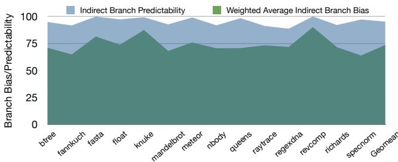
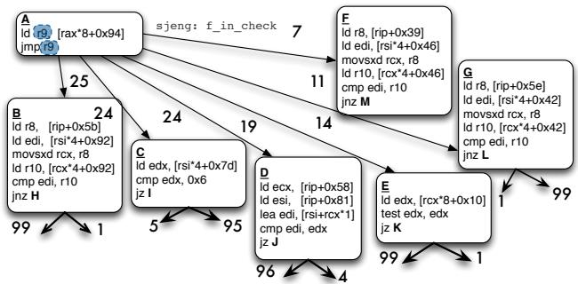
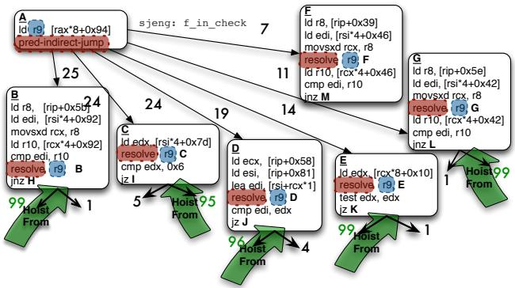
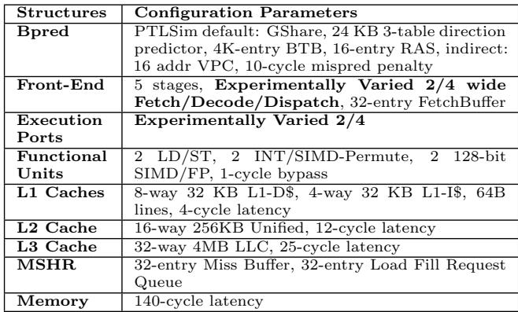

# Bungee Jumps: Accelerating Indirect Branches Through HW/SW Co-Design 图表详解

### Figure 1: Improvement in Branch Prediction Accu-Indirect Branch Predictability Weighted Average Indirect Branch Bias10 racy (fewer Mispredictions Per Kilo Instructions) on 7529 Python benchmarks across several predictor genera-5 tions; from [2]0 0 1 2 3 4 5

- 图片展示的是 **Figure 1**，标题为“Improvement in Branch Prediction Accuracy (fewer Mispredictions Per Kilo Instructions) on 7529 Python benchmarks across several predictor generations”，数据来源为文献 [2]。
- 图表纵轴为 **Mispredicts/Kilo Instrs**（每千条指令的错误预测次数），范围从 0 到 20；横轴为 28 个不同的 Python 基准测试程序编号（0–27）及一个平均值（Avg）。
- 图中使用四种颜色柱状图代表不同代际的分支预测器：
    - **Nehalem**（蓝色）
    - **Sandy Bridge**（绿色）
    - **Haswell**（橙色）
    - **TAGE**（红色）
- 数据趋势显示：随着处理器代际演进（从 Nehalem → Sandy Bridge → Haswell → TAGE），**间接分支预测准确率持续提升**，即每千条指令的错误预测次数显著下降。
- **TAGE 预测器表现最优**，在绝大多数基准测试中错误预测次数最低，尤其在平均值（Avg）上远低于其他预测器。
- 下表总结各预测器在平均值（Avg）上的表现：

| 预测器       | 平均错误预测次数（Mispredicts/Kilo Instrs） |
| ------------ | ------------------------------------------- |
| Nehalem      | 约 16                                       |
| Sandy Bridge | 约 8                                        |
| Haswell      | 约 5                                        |
| TAGE         | 约 3                                        |

- 该图表明现代分支预测技术（如 TAGE）能大幅降低间接分支的误预测率，这对提升 **Out-of-Order 处理器性能**尤为关键，因其依赖预测流进行动态调度。
- 论文指出，尽管预测准确率提升，**In-order 处理器仍受限于编译时控制依赖**，无法像 OOO 处理器那样重叠执行目标路径指令，这正是本文提出“Bungee Jumps”硬件/软件协同设计的动机。

### Figure 2: Indirect Branch Predictability Vs. Weighted Average Indirect Branch Bias for Python benchmarks: With modern predictors, indirect branch predictability is substantially higher than the branch bias

- 图表标题明确指出，该图对比了 Python 基准测试中 **Indirect Branch Predictability**（间接分支可预测性）与 **Weighted Average Indirect Branch Bias**（加权平均间接分支偏向性）。
- 纵轴表示 “Branch Bias/Predictability”，范围从 0 到 100，代表百分比或归一化值；横轴列出多个 Python 基准程序名称，如 btree、fannkuch、fasta、float、knuke、mandelbrot、meteor、nbody、queens、raytrace、regexdna、revcomp、richards、spectorm，以及 Geomean（几何平均值）。
- 图中使用两种颜色区域：**蓝色区域代表 Indirect Branch Predictability**，**绿色区域代表 Weighted Average Indirect Branch Bias**。
- 从视觉上看，**蓝色区域始终位于绿色区域之上**，表明在所有列出的基准测试中，现代分支预测器实现的间接分支可预测性均显著高于其加权平均分支偏向性。
- 在 Geomean 处，蓝色区域高度约为 95%，而绿色区域高度约为 75%，说明**整体上预测性比偏向性高出约 20%**，这与正文描述一致。
- 该图表有力支持论文核心论点：即使间接分支本身不具备强偏向性（bias），现代预测器仍能实现高预测准确率（predictability），为本文提出的 HW/SW 协同优化方案提供数据基础。
- 各基准程序间差异明显，例如 knuke 和 meteor 的预测性峰值接近 100%，而 revcomp 的偏向性相对较高，但预测性仍更高。

| 基准程序   | 预测性 (蓝色) | 偏向性 (绿色) | 差值估算 |
| ---------- | ------------- | ------------- | -------- |
| btree      | ~90%          | ~65%          | +25%     |
| fannkuch   | ~95%          | ~70%          | +25%     |
| fasta      | ~90%          | ~65%          | +25%     |
| float      | ~95%          | ~70%          | +25%     |
| knuke      | ~98%          | ~75%          | +23%     |
| mandelbrot | ~90%          | ~65%          | +25%     |
| meteor     | ~98%          | ~75%          | +23%     |
| nbody      | ~90%          | ~65%          | +25%     |
| queens     | ~90%          | ~65%          | +25%     |
| raytrace   | ~95%          | ~70%          | +25%     |
| regexdna   | ~90%          | ~65%          | +25%     |
| revcomp    | ~90%          | ~75%          | +15%     |
| richards   | ~95%          | ~70%          | +25%     |
| spectorm   | ~90%          | ~65%          | +25%     |
| Geomean    | **~95%**      | **~75%**      | **+20%** |

- 此图强调：**预测性 ≠ 偏向性**。传统代码生成依赖分支偏向性进行优化（如 predication 或 assert conversion），但现代预测器已能超越此限制，使“无偏”间接分支也具备高可预测性，从而为本文提出的分离预测与解析点的架构创新提供必要性和可行性支撑。

### 9fc418e5f94a16a353d933e01c95988a5207a65612cad36987695cf2e1edcd9e.jpg

- 图片展示了 **Out-of-Order (OOO)** 与 **In-Order (IO)** 处理器在处理间接分支时的调度差异，核心对比点为 **间接分支计算链** 的执行方式。
- 左侧为控制流图，显示一个间接跳转（`jmp r8`）有三个目标：B、C、D，各路径的分支偏置（bias）分别为 40%、30%、30%，表明该分支无强偏向性。
- 右侧分为两列：
    - **Out-of-Order 列**：动态调度器将间接分支计算链（如 `ld r8, [rbx+0x8]` 和 `add r8, 0xAD`）与目标块 B 中的指令重叠执行，实现 **指令级并行（ILP）**，无停顿。
    - **In-Order 列**：由于顺序执行特性，必须等待整个间接分支计算链完成才能跳转到目标，导致 **4周期停顿（STALL）**，显著降低性能。
- 关键视觉元素：
    - 红色箭头标注 “**4 Cycle STALL On Use**”，强调 In-Order 处理器因依赖关系产生的瓶颈。
    - OOO 列中，目标块 B 的指令（如 `mov rdi, 0x1`、`ld rcx, [r10]`）在分支计算期间即被提前执行，体现其动态调度优势。
- 此图直观说明论文核心观点：**当前 ISA 将预测点与解析点绑定于同一指令，限制了 In-Order 编译器优化能力**；而 OOO 可通过动态调度自然覆盖延迟。
- 表格化对比：

| 特性           | Out-of-Order     | In-Order                     |
| -------------- | ---------------- | ---------------------------- |
| 分支预测与执行 | 动态重叠执行     | 顺序等待，产生停顿           |
| 性能影响       | 无停顿，高吞吐   | **4周期停顿**，效率下降      |
| 优化空间       | 自然利用 ILP     | 需编译器介入，受限于静态调度 |
| 适用场景       | 高性能通用处理器 | 资源受限或功耗敏感设备       |

- 该图是论文 Figure 3(a) 的一部分，用于论证提出“分离预测与解析”机制的必要性，使 In-Order 编译器能模拟 OOO 的高效调度。

### Figure 3: The indirect branch computation chain (highlighted) is a source of stall cycles for the In-Order; the Out-of-Order overlaps the chain with instructions from the target B. Our transformation enables the In-Order to mimic the schedule found by the OOO.

- 图片展示了 **Figure 3**，旨在说明传统 **In-Order (IO)** 处理器在处理间接分支时的性能瓶颈，以及论文提出的 **Bungee Jumps** 转换如何使 IO 处理器模拟 **Out-of-Order (OOO)** 的调度优势。
- 左侧为 **转换后的 In-Order 调度示意图**，右侧为 **原始 In-Order 调度示意图**，两者对比突出优化效果。
- 核心指令 `predict-indir-jmp` 被前端“剥离”（Peel Off By Front-End: Not Dispatched），仅用于预测目标地址，不进入后端执行流水线，从而允许后续指令提前调度。
- 分支预测后，控制流被引导至多个可能目标（B、C、D），每个目标路径均包含部分原间接分支计算链（如 `ld r8, [rbx+0x8]`）与目标代码，并以 `resolve r8, B/C/D` 指令结束，用于验证预测是否正确。
- 原始 In-Order 调度中，整个间接分支计算链必须串行执行完毕后才能跳转到目标，导致大量 **stall cycles**；而转换后，计算链被拆分并“混入”各目标路径，实现 **指令级并行（ILP）**。
- 各路径标注的 “95” 表示该分支路径的 **预测准确率高达 95%**，体现现代预测器对间接分支的良好支持。
- 关键术语保留英文：**predict-indir-jmp**, **resolve**, **In-Order**, **Out-of-Order**, **stall cycles**, **ILP**。
- 该图直观呈现了论文核心思想：**分离预测点与解析点**，使编译器能像 OOO 动态调度器一样重排指令，提升 IO 处理器性能。

| 组件                    | 描述                                                             |
| ----------------------- | ---------------------------------------------------------------- |
| `predict-indir-jmp`     | 预测指令，由前端处理后即剥离，不进入执行单元，触发目标预取。     |
| `resolve r8, B/C/D`     | 解析指令，位于各目标路径末尾，验证预测目标是否匹配实际计算结果。 |
| 分支弧上“95”            | 表示该路径预测准确率为 95%，反映高可预测性。                     |
| “Peel Off By Front-End” | 强调预测指令仅用于前端控制流引导，不参与后端执行。               |

- 此图是论文动机的核心可视化表达，揭示了传统 IO 架构在间接分支上的固有缺陷及通过 ISA 与编译器协同设计可实现的性能突破。

### (a) RCPO and Predication: indirect branch→conditional branch.

- 图片展示了从**间接分支**（indirect branch）到**条件分支**（conditional branch）的两种代码转换技术：**RCPO** 和 **Predication**。
- 起始代码为 `r = obj->func();`，这是一个典型的面向对象语言中的虚函数调用，其目标在运行时决定，属于间接分支。
- 第一步转换是 **RCPO**（Receiver Class Predication Optimization），将间接调用展开为一系列基于对象类型的 `if-else if` 条件判断：
    - `if (obj is type B) r = B::func();`
    - `else if (obj is type C) r = C::func();`
    - `else if (obj is type D) r = D::func();`
    - `else r = obj->func();` （兜底，处理未预测到的类型）
- 第二步转换是 **Predication**，进一步将条件分支转化为**谓词化指令**（predicated instructions）：
    - 引入三个谓词变量：`p0 = (obj is type B)`，`p1 = (obj is type C)`，`p2 = (obj is type D)`
    - 对应的函数调用被标记为谓词化执行：`p0: r = B::func();`，`p1: r = C::func();`，`p2: r = D::func();`
    - 最后添加一个条件判断：`if (!(p0 | p1 | p2)) r = obj->func();`，确保所有可能路径都被覆盖
- 此转换的核心目的是**消除间接分支**，将其替换为可静态预测或完全消除控制依赖的结构，从而提升**In-Order**处理器的性能。
- 转换代价包括：
    - 静态和动态指令数增加
    - 关键路径高度可能上升
    - 但能利用条件分支更高的预测准确率

| 转换阶段    | 输入代码           | 输出代码                                        | 目标                         |
| ----------- | ------------------ | ----------------------------------------------- | ---------------------------- |
| 原始        | `r = obj->func();` | —                                               | 间接分支，目标未知           |
| RCPO        | —                  | `if (obj is type B) ... else ...`               | 转为条件分支，利用历史偏置   |
| Predication | —                  | `p0: r = B::func(); ... if (!(p0\|p1\|p2)) ...` | 消除控制依赖，实现全并行执行 |

- 该图与论文第2节内容紧密相关，用于说明传统优化手段在处理**非收敛**、**多目标**间接分支时的局限性。

### (b) Indirect call transformation: inlining small get method. Figure 4: RCPO & Predication Transformation of indirect call. Predicates and predicated instructions are highlighted.

- 图片展示了 **gcc2006: htab_find_slot_with_hash** 函数中一个间接调用（`call r13`）经过 **RCPO & Predication Transformation** 后的代码结构变化。
- 左侧为原始控制流图，包含三个基本块：A、B、C。其中 A 块执行 `call r13`，根据 `r13` 的值跳转到 B 或 C。
- 右侧为转换后的代码，将间接调用替换为基于 **predicate** 的条件执行路径：
    - 引入了三个谓词寄存器：**p0, p1, p2**，分别对应目标 B、C 和默认路径。
    - 使用 `cmp` 指令比较 `r13` 与各目标地址，设置相应谓词。
    - 所有目标路径的指令被 **predicated**（即带谓词前缀），如 `p0: mov rax, r1;` 表示仅当 p0 为真时执行。
    - 最后通过 `assert p0 | p1 | p2` 确保至少有一个谓词为真，否则跳转至恢复代码。
- 转换后代码消除了控制依赖，允许编译器在 **in-order** 处理器上更自由地调度指令，但代价是增加动态指令数和潜在的错误路径执行。
- 此变换适用于 **小的 get 方法**，因其目标数量少、可内联，适合 predication 优化。

| 原始结构            | 转换后结构              |
| ------------------- | ----------------------- |
| 间接调用 `call r13` | 多路条件分支 + 谓词执行 |
| 控制流依赖强        | 控制流依赖弱化          |
| 动态指令数低        | 动态指令数增加约40-50%  |
| 依赖运行时预测      | 依赖静态分析与谓词生成  |

- 高亮部分（红色、绿色、蓝色）表示 **predicated instructions**，其执行受谓词控制，体现 **predication** 技术的核心思想。
- 该图说明了 **Receiver Class Predication Optimization (RCPO)** 如何将间接调用转化为条件分支序列，并进一步通过 predication 消除分支，提升 in-order 处理器的指令级并行性（ILP）。

### 95Figure 5: The conditional branches immediately down90stream of indirect branches exhibit very high bias.

- 图片展示了三个子图，分别对应 SPEC、PHP 和 Python 基准测试套件中**间接分支下游的条件分支偏置（next branch bias）**。
- 所有子图的 Y 轴均为“Branch Bias”，范围从 80% 到 100%，X 轴为各基准测试程序名称。
- **所有程序的 next branch bias 均高于 90%**，多数接近或达到 95%-100%，表明这些条件分支具有极强的可预测性。
- 子图 (a) SPEC 系列：除 sjeng 外，其余程序均在 90% 以上；sjeng 略低但仍高于 85%。
- 子图 (b) PHP 系列：bench、fasta、knuke、nbody、revcomp 等均接近 100%；btree 略低但仍在 85% 以上。
- 子图 (c) Python 系列：float、knukе、meteor、queens、raytrace 等均超过 95%；btree 和 fannkuch 略低但仍高于 90%。
- 三组数据的 Geomean 均在 95% 以上，说明**间接分支后紧跟的条件分支普遍高度偏置**，这一现象在论文中被首次系统报告。
- 此高偏置特性构成重要优化机会：若能提前执行这些条件分支对应的代码路径，可显著提升性能，而当前间接分支因不可预测性成为“门卫”阻碍了该优化。

| 基准套件 | 最高偏置程序                   | 最低偏置程序    | Geomean 偏置 |
| -------- | ------------------------------ | --------------- | ------------ |
| SPEC     | gap, h264ref, omnetpp, perl2k6 | sjeng           | >95%         |
| PHP      | bench, fasta, knuke, nbody     | btree           | >95%         |
| Python   | float, knuke, meteor, queens   | btree, fannkuch | >95%         |

- 论文指出，此高偏置特性未被充分利用，因为间接分支本身往往**无偏置但高可预测**，传统编译器无法有效调度其下游代码。
- 本文提出的 Bungee Jumps 技术正是为了打破这种控制依赖，使编译器能将下游高偏置分支的代码与间接分支计算链重叠执行，从而释放 ILP。

### (a) sjeng switch statement. Heavily unbiased, nonreconvergent but highly predictable (> 90%).

- 图片展示了 SPEC 2006 基准测试中 **sjeng** 程序的一个 **switch statement** 控制流图，该分支结构具有 **高度不可预测的偏置（unbiased）**，但 **动态预测准确率超过90%**。
- 控制流从一个间接跳转指令 `jmp [rax*8+0x94]` 开始，其目标由寄存器 `rax` 的值决定，指向多个可能的代码块：**B、C、D、E、F、G**。
- 每个目标块执行不同的数据加载和比较操作，并最终通过条件跳转（如 `jnz H`, `jz I`, `jz J`, `jz K`, `jnz M`, `jnz L`）结束，这些后续分支均 **不收敛到同一地址**，属于 **nonreconvergent** 类型。
- 各分支路径上的数字表示该路径的 **执行频率权重**（即分支偏置），例如：
    - 从主跳转到 B 的路径权重为 **25**，B 块内 `jnz H` 路径权重为 **99**，说明该路径极常被执行。
    - 到 C 的路径权重为 **24**，C 块内 `jz I` 路径权重为 **95**。
    - 到 D 的路径权重为 **19**，D 块内 `jz J` 路径权重为 **96**。
    - 到 E 的路径权重为 **14**，E 块内 `jz K` 路径权重为 **99**。
    - 到 F 的路径权重为 **11**，F 块内 `jnz M` 路径权重为 **99**。
    - 到 G 的路径权重为 **7**，G 块内 `jnz L` 路径权重为 **99**。
- 尽管各分支目标的静态偏置较低（如主跳转无明显偏向），但整体 **动态预测准确率极高**，这正是论文提出“分离预测与解析点”技术所针对的典型场景。
- 该图直观体现了论文核心观点：**高预测性但低偏置的间接分支** 是传统编译优化（如 RCPO 或 predication）难以处理的瓶颈，而本文提出的 **predict-indir-jmp + resolve** 机制可有效利用其预测性，将计算链与目标代码重叠调度，从而提升 **in-order** 处理器性能。

| 目标块 | 主跳转权重 | 块内主要操作              | 块内条件跳转 | 条件跳转权重 |
| ------ | ---------- | ------------------------- | ------------ | ------------ |
| B      | 25         | `ld r8, [rip+0x5b]`...    | `jnz H`      | 99           |
| C      | 24         | `ld edx, [rsi*4+0x7d]`... | `jz I`       | 95           |
| D      | 19         | `ld ecx, [rip+0x58]`...   | `jz J`       | 96           |
| E      | 14         | `ld edx, [rcx*8+0x10]`... | `jz K`       | 99           |
| F      | 11         | `ld r8, [rip+0x39]`...    | `jnz M`      | 99           |
| G      | 7          | `ld r8, [rip+0x5e]`...    | `jnz L`      | 99           |

- 此类结构在 **in-order** 处理器上会导致严重流水线停顿，因为间接跳转的目标计算链（如 `ld r9, [rax*8+0x94]`）必须在跳转前完成，无法与目标代码并行执行。论文的变换技术旨在打破这种控制依赖，允许编译器将部分计算链与目标代码混合调度，从而模仿 **out-of-order** 处理器的重叠执行能力。

### (b) sjeng switch statement with proposed transformation. Figure 6: sjeng switch statement transformed.

- 图片展示了 **sjeng** 基准测试中一个 switch 语句在应用 **Bungee Jumps** 变换后的控制流图，核心目标是将间接跳转的预测点与解析点分离，以提升 **in-order** 处理器性能。
- 控制流从顶部的 **pred-indirect-jmp** 指令开始，该指令不执行实际跳转，仅向前端发出预测信号，指示最可能的目标地址（如 B、C、D、E）。
- 各分支目标块（B、C、D、E）内均包含 **resolve r9, [target_label]** 指令，用于验证预测路径是否正确。若预测失败，控制流将转向恢复代码（未在图中完整展示）。
- 图中绿色箭头标注 “**Hoist From**”，表示原本位于间接跳转前的计算链（如加载寄存器 r9 的指令）被部分“提升”并复制到各目标块中，与目标块内的指令并行执行，从而隐藏延迟。
- 分支弧上的数字（如 25、24、19 等）代表该路径的 **动态执行频率权重**，反映分支偏斜程度；例如，路径 B 权重为 24，路径 E 为 11，说明 B 更常被执行。
- 各目标块内还保留了原始的条件分支逻辑（如 `cmp edi, r10` 和 `jz L`），这些分支通常具有高偏斜性（>95%），可被进一步优化或断言转换。
- 该变换允许编译器将原本因控制依赖而串行执行的指令重新调度，使 **in-order** 处理器能模拟 **out-of-order** 处理器的重叠执行能力，减少因间接跳转计算链导致的停顿周期。

| 目标块 | 关键指令                                | 功能说明                             |
| ------ | --------------------------------------- | ------------------------------------ |
| B      | `ld r8, [rip+0x5b]`, `resolve r9, B`    | 加载数据并验证预测路径是否为 B       |
| C      | `ld edx, [rsi*4+0x7d]`, `resolve r9, C` | 计算并验证路径 C，同时进行比较和跳转 |
| D      | `ld edx, [rip+0x58]`, `resolve r9, D`   | 类似 C，处理路径 D 的数据和验证      |
| E      | `ld r8, [rip+0x39]`, `resolve r9, E`    | 处理路径 E，包含多条加载和比较指令   |

- 此变换特别适用于 **非收敛型** 且 **目标数较多** 的间接跳转（如 sjeng 中平均 8 个目标），传统 RCPO 或谓词化方法在此类场景下成本过高。
- 图中未显示恢复代码，但根据论文描述，恢复代码需负责修复被覆盖的寄存器状态（如 rbx、r15），并通过间接跳转返回正确路径，确保中断和异常下的正确性。

### (a) Indirect Branch to be overlapped highlighted: branch bias shown on arcs

- 图片展示的是一个间接分支（indirect branch）的控制流图，源自 SPEC 2006 的 gcc 基准测试中的 `bitmap_operation` 函数。
- **核心结构**：图中包含三个基本块 A、B 和 C，分别代表分支源点和两个目标路径。块 A 是间接跳转指令所在位置，其后分叉至多个目标（此处仅详述 B 和 C，E 和 D 被省略或简化）。
- **分支偏置（branch bias）标注在弧线上**：
    - A → B 的分支偏置为 **44%**
    - A → C 的分支偏置为 **30%**
    - A → D 的分支偏置为 **18%**
    - A → E 的分支偏置为 **8%**
- **块 A 内容**：
    - 指令序列用于计算间接跳转的目标地址：
        - `ld rax, [rsp+0x28]`
        - `ld r9, [rax*8+0x94]`
        - `jmp r9`
    - 这些指令构成“间接分支计算链”，是性能瓶颈所在，尤其对 in-order 处理器而言。
- **块 B 和 C 内容**：
    - 两者结构相似，均为 load + logical 操作密集型代码。
    - 块 B 包含 13 条指令，块 C 包含 25 条指令。
    - 两者均以 `jmp 80` 结尾（未完整显示），表明它们是独立的执行路径。
- **关键观察**：
    - 尽管该间接分支整体偏置较低（最高仅 44%），但论文指出其**预测准确率高达 95%**，说明现代预测器能有效处理此类非偏置分支。
    - 此图作为“待重叠”示例，后续章节将展示如何通过 **predict-indir-jmp** 和 **resolve** 指令将计算链部分下推至目标块，从而隐藏延迟。
- **数据摘要表**：

| 块  | 分支目标 | 分支偏置 | 指令数 | 特征                |
| --- | -------- | -------- | ------ | ------------------- |
| A   | —        | —        | 3      | 计算链，含 `jmp r9` |
| B   | 目标 B   | 44%      | 13     | Load + Logical 密集 |
| C   | 目标 C   | 30%      | 25     | Load + Logical 密集 |
| D   | 目标 D   | 18%      | —      | 省略                |
| E   | 目标 E   | 8%       | —      | 省略                |

- **设计意图**：此图旨在说明传统 in-order 架构因无法重叠分支计算与目标执行而产生停顿，而本文提出的 HW/SW 协同设计可打破此控制依赖，实现类似 OOO 的调度效果。

### cf3a20d7ef553f2a29fd121ebf2fb530f18e3210fa2848f338faeb325888eee8.jpg

- 图片展示了论文中提出的 **Bungee Jumps** 技术对一个间接跳转（indirect branch）进行代码变换后的控制流图。
- 该图的核心是将原始的间接跳转指令（`jmp r9`）分解为两个独立的指令：**predict-indir-jmp** 和 **resolve**，从而实现预测点与解析点的分离。
- 原始代码块 A 中的 `jmp r9` 被替换为 `pred-indir-jmp 0x0`，该指令仅用于前端预测，不进入后端执行流水线。
- 原始的 `ld r9; jmp r9` 链被保留并移至 `pred-indir-jmp` 指令之后，作为“影子”代码，用于在预测失败时恢复正确路径。
- 四个目标块 B、C、D、E 均被修改：
    - 每个目标块开头插入了一个 **marker 0x0** 指令，其立即数 `0x0` 与 `pred-indir-jmp 0x0` 的立即数相匹配，用于验证预测目标的有效性。
    - 原始的 `jmp r9` 被替换为 **resolve 9, B recovery**（或其他对应目标），该指令负责验证预测路径是否正确。
    - 每个目标块中都添加了 **check-fault** 指令，用于在预测执行期间抑制和延迟故障处理，直到 resolve 指令确认路径正确。
    - 如果 resolve 检测到预测错误，控制权将转移到 **recovery** 代码块。
- **recovery** 代码块包含：
    - `movq r15, xmm0; movq rbx, xmm1`：从临时寄存器恢复被覆盖的寄存器值。
    - `jmp-no-predict r9`：无预测地跳转到正确的间接分支目标地址，确保最终能回到正确路径。
- 控制流图中的数字（44, 30, 18, 8）代表各分支路径的**权重或频率**，表明不同目标的执行概率。
- 整个变换的关键在于通过 **predict-indir-jmp** 提前触发前端预测，同时将部分计算链（如 `ld r9`）与目标代码共调度，从而隐藏间接分支的延迟，使 in-order 处理器能模拟 out-of-order 处理器的重叠执行能力。

| 组件                    | 功能                                                 |
| ----------------------- | ---------------------------------------------------- |
| `pred-indir-jmp 0x0`    | 前端预测点，触发对目标地址的预取，自身不进入后端。   |
| `marker 0x0`            | 目标块入口标记，用于验证预测目标的有效性。           |
| `resolve 9, X recovery` | 分支解析点，验证预测路径，失败则转向 recovery。      |
| `check-fault`           | 在预测执行期间抑制和延迟故障处理。                   |
| `recovery`              | 恢复被覆盖的寄存器状态，并无预测地跳转到正确路径。   |
| `jmp-no-predict r9`     | 在 recovery 末尾，确保最终能回到正确的间接分支目标。 |

### Figure 7: Transformation

- 图片展示了论文中 **Figure 7** 的核心内容，即对一个间接分支（indirect branch）进行 **HW/SW co-design transformation** 的完整代码结构与控制流。
- 该图分为三个主要部分：**Block A**（原始分支计算链）、**Block B 和 C**（转换后的目标块），以及底部的 **recovery code**。
- **Block A** 是原始的间接分支计算路径：
    - 包含三条指令：`ld rax [rsp+0x28]`、`movq xmm0, r15`、`ld r9 [rax*8+0x94]`，最终通过 `jmp r9` 跳转。
    - 在转换后，`jmp r9` 被保留但移至第3行，并在其前插入 **predict-indir-jmp 0x0** 指令，作为新的预测点。
    - 该预测指令被前端处理后即“剥离”，不进入后续流水线，仅用于指导取指。
- **Block B 和 C** 是两个不同的间接分支目标，分别对应原分支的两个高概率路径。
    - 每个目标块开头都插入了 **marker 0x0** 指令，其立即数与 predict-indir-jmp 中的 0x0 相匹配，用于验证预测目标的有效性。
    - 原始分支计算链中的部分指令（如 `ld r9 [rax*8+0x94]`）被复制并“下推”到目标块中，与目标代码混合执行。
    - 在每个目标块中，原 `jmp r9` 被替换为 **resolve r9, B, recovery** 或 **resolve r9, C, recovery**，用于验证预测路径是否正确。
    - 若 resolve 失败，则跳转至 recovery 代码；若成功，则继续执行目标代码。
    - 每个目标块还包含 **check-fault recovery** 指令，用于在 speculative 执行期间抑制和延迟异常，直到 resolve 确认路径正确。
- **recovery code** 位于图底部，用于处理 misprediction：
    - 包含两条指令：`movq r15, xmm0; movq rbx, xmm1`，用于恢复被目标块覆盖的寄存器值。
    - 最后一条指令是 **jmp-no-predict r9**，它不参与预测，直接跳转到正确的路径地址，确保恢复后的执行正确性。
- 控制流箭头显示了从 Block A 到 Block B/C/E/D 的可能路径，以及从 resolve 失败时跳转至 recovery 的路径。
- 图中标注了各路径的 **branch bias**（如 44%、30%、18%、8%），表明不同目标的执行频率。
- 整体结构体现了论文的核心思想：**将间接分支的预测点与解析点分离**，允许编译器将分支计算链与目标代码混合调度，从而隐藏分支延迟，提升 in-order 处理器性能。

| 组件                        | 功能描述                                                                   |
| --------------------------- | -------------------------------------------------------------------------- |
| **predict-indir-jmp 0x0**   | 新增预测指令，触发前端预测目标地址，自身不进入流水线。                     |
| **marker 0x0**              | 插入目标块首部，用于验证预测目标有效性，与 predict 指令的 immediate 匹配。 |
| **resolve r9, B, recovery** | 验证实际目标是否匹配预测目标，失败则跳转至 recovery。                      |
| **check-fault recovery**    | 抑制 speculative 执行期间的异常，延迟至 resolve 后处理。                   |
| **jmp-no-predict r9**       | recovery 末尾指令，不参与预测，确保正确路径跳转。                          |

- 此转换依赖于硬件支持，如 **Decomposed Branch Buffer (DBB)** 用于关联 predict 与 resolve，以及 **fault suppression** 机制。
- 图中所有新增或修改的指令均用红色框标出，清晰展示 transformation 的改动范围。

### (b) Insert tail pointer index into corresponding resolution instruction.

- 图片展示了 **Decomposed Branch Buffer (DBB)** 在前端（Front-End）中的集成与操作流程，具体为“**Insert tail pointer index into corresponding resolution instruction**”阶段。
- 该图分为上下两个子图，分别对应预测指令（predict instruction）和解析指令（resolve instruction）在流水线中的处理路径。
- 上半部分（a）描述了预测指令的插入过程：当预测指令被部分解码后，其预测结果（目标地址）被送至 Fetch Unit，同时 **DBB Tail Pointer** 自增，并将预测元数据（如索引、目标地址等）写入 DBB 对应位置。
- 下半部分（b）描述了解析指令的处理：解析指令从 Fetch Buffer 中被取出时，系统读取当前 **DBB Tail Pointer** 指向的条目，并将其中的索引值注入到解析指令中，以便后续用于更新分支预测器。
- **关键硬件组件**包括：
    - **Existing BPU**（Branch Prediction Unit）：负责生成预测结果。
    - **Predictor Table**：存储预测状态和索引。
    - **DBB**（Decomposed Branch Buffer）：一个小型 FIFO 缓冲区，用于关联预测与解析指令。
    - **Fetch Buffer**：暂存待处理指令。
- **数据流向**：
    - PC 和 History 输入至 HASH 单元，生成索引访问 Predictor Table。
    - 预测结果输出至 Fetch Unit，同时元数据写入 DBB。
    - 解析指令携带 DBB 索引进入流水线，用于后续恢复与训练。
- **设计目的**：确保预测指令与对应的解析指令在运行时能正确关联，即使两者物理位置分离，仍可维持分支预测器的准确训练。
- **实现机制**：
    - 使用 **FIFO 结构**维护预测-解析配对。
    - **DBB Tail Pointer** 控制写入位置，确保顺序一致性。
    - 解析指令携带索引回传，用于更新预测表。
- **性能影响**：DBB 仅需 16 条目（4-bit 索引），占用资源极小，且因 In-Order 处理天然有序，无需复杂同步机制。

| 组件            | 功能               | 关键输入                    | 关键输出                      |
| --------------- | ------------------ | --------------------------- | ----------------------------- |
| Existing BPU    | 生成分支预测       | PC, History                 | Prediction State, Indices     |
| Predictor Table | 存储预测信息       | Indices                     | Target Address                |
| DBB             | 关联预测与解析指令 | Prediction Metadata         | Index for Resolve Instruction |
| Fetch Buffer    | 暂存指令           | Predict/Resolve Instruction | To Back-End                   |

- **术语保留**：BPU、DBB、PC、Fetch Unit、Tail Pointer、Predictor Table、Indices、Prediction State。

### Figure 8: The Decomposed Branch Buffer and its operations.The area shaded in grey denotes existing HW structures and data/control paths.

- 图片展示了 **Decomposed Branch Buffer (DBB)** 在分支预测器更新流程中的作用，属于图 8 的子图 (c)，标题为 “Update BPred after mispredict”。
- 核心功能是：当 **resolve instruction** 检测到间接分支预测错误时，通过 DBB 索引将正确的路径信息反馈给 **Predictor Table**，从而更新预测器状态。
- 数据流向清晰：
    - **Back-End** 发送 **DBB Index** 和 **Correct Path Address** 给 **Resteer Logic**。
    - **Resteer Logic** 将 **DBB Index** 传入 **DBB**，读取对应条目中的元数据（如预测索引、目标地址等）。
    - 利用读取的元数据和实际正确路径，更新 **Predictor Table** 中对应的预测条目。
    - 更新后的预测状态被写入 **New Prediction State**，供后续预测使用。
- 图中灰色区域表示已存在的硬件结构，如 **HASH**、**History**、**Predictor Table**、**Fetch Unit** 等，表明 DBB 是新增的辅助结构，与现有预测机制协同工作。
- 关键控制信号包括：
    - **Write Port** 和 **Read Port** 用于访问 Predictor Table。
    - **Indices** 用于定位 Predictor Table 中的具体条目。
    - **To Fetch Unit** 表示更新后的预测结果会指导前端取指。
- DBB 的设计简化了预测器训练逻辑，因为它维护了 predict 和 resolve 指令之间的关联，确保即使两者在代码中分离，也能正确关联训练数据。

| 组件                | 功能                   | 输入                                     | 输出                                               |
| ------------------- | ---------------------- | ---------------------------------------- | -------------------------------------------------- |
| **Back-End**        | 提供分支解析结果       | 分支执行结果                             | DBB Index, Correct Path Address                    |
| **Resteer Logic**   | 控制重定向和预测器更新 | DBB Index, Correct Path Address          | DBB Index (to DBB), Resteer Signal (to Fetch Unit) |
| **DBB**             | 存储预测指令的元数据   | DBB Index                                | 预测元数据 (Indices, Target Address)               |
| **Predictor Table** | 存储和更新分支预测信息 | Indices, Predicted Target, Actual Target | New Prediction State                               |
| **Fetch Unit**      | 根据预测结果取指       | New Prediction State                     | 下一条指令流                                       |

- 此机制确保了即使在 **in-order** 处理器上，也能像 **out-of-order** 处理器一样，利用高精度的间接分支预测来提升性能，同时保证预测器能持续学习和改进。

### Figure 9: Resteer sequence: (1): resolve fails and two addresses are piped to the fetch-unit: (2) the recovery code and the (3) correct path (4): the recovery code is fetched and is terminated by a jmp (5) which (via a register) always points to the correct path (6).

- 图片展示了 **resolve** 指令失败后，处理器如何执行 **resteer**（重定向）的完整时序流程。
- 整个过程分为六个关键步骤，按时间轴自上而下展开，涉及 **fetch unit**、**resteer logic** 和 **back end** 的协同操作。
- **Step 1**: 当 **resolve** 指令检测到预测错误时，它会触发 **resteer** 机制，并向 **fetch unit** 同时提供两个地址：一个是 **recovery code** 的起始地址，另一个是 **correct path** 的目标地址。
- **Step 2**: **resteer logic** 首先将 **recovery code** 的地址发送给 **fetch unit**，确保处理器能立即开始获取恢复代码。
- **Step 3**: 紧接着，**resteer logic** 将 **correct path** 的地址（存储在寄存器 r3 中）传递给 **branch prediction unit (BPU)**，为后续跳转做准备。
- **Step 4**: **fetch unit** 开始获取 **recovery code**。该代码段通常包含修复架构状态的指令，例如恢复被覆盖的寄存器值。
- **Step 5**: **recovery code** 的末尾是一条 **jmp** 指令，该指令通过寄存器（如 r3）间接跳转到 **correct path**。这条 **jmp** 指令不参与预测，以避免污染预测器状态。
- **Step 6**: **fetch unit** 获取并执行 **correct path** 上的指令，处理器恢复正常执行流。

| 步骤 | 动作描述                             | 关键组件                   | 目的             |
| ---- | ------------------------------------ | -------------------------- | ---------------- |
| 1    | resolve 失败，触发 resteer           | resolve instruction        | 标记预测错误     |
| 2    | 提供 recovery code 地址至 fetch unit | resteer logic              | 快速启动恢复流程 |
| 3    | 提供 correct path 地址至 BPU         | resteer logic              | 准备最终跳转目标 |
| 4    | fetch recovery code                  | fetch unit                 | 执行状态修复     |
| 5    | jmp 指令跳转至 correct path          | recovery code, register r3 | 完成路径切换     |
| 6    | fetch & execute correct path         | fetch unit, back end       | 恢复正确执行     |

- 图中左侧的垂直箭头标示了 **TIME** 流向，强调这是一个严格按序执行的硬件级恢复流程。
- **RC** 标记出现在多个指令块中，代表 **Recovery Code** 的一部分，表明其贯穿整个恢复阶段。
- 寄存器 **r3** 在此流程中扮演关键角色，用于临时存储 **correct path** 的地址，确保跳转的准确性。
- 该设计确保了即使在预测失败的情况下，处理器也能快速、可靠地恢复到正确的执行路径，同时最小化对分支预测器状态的干扰。

### Figure 10: Resteer under interrupt: (1): the resolve fails (2)(3): the recovery code and correct path addresses are piped to the fetch unit (4): recovery code is fetched and is terminated by (5) a jmp to the correct path address which was piped back in (3) (6): recovery code begins to proceed down the pipe but an interrupt occurs and the correct path address (a pending resteer) is not present in the front-end but the jmp-no-predict instruction at the end of the recovery code provides the correct path address when it completes in the back-end.

- 图片展示的是 **Figure 10: Resteer under interrupt**，描述在发生中断时，系统如何处理间接分支预测失败后的重定向（resteer）流程。
- 流程从左至右、自上而下展开，共分六个关键步骤，每个步骤对应图中编号区域：
    - **(1) resolve fails**：resolve 指令检测到预测失败，触发恢复机制。
    - **(2)(3) Resteer RC addr to Front End**：恢复代码（Recovery Code, RC）地址与正确路径地址被管道传送到前端（Fetch Unit）。
    - **(4) Fetch Recovery Code**：前端开始获取恢复代码段，该段包含一系列 undo 操作以恢复寄存器状态。
    - **(5) jmp-no-predict r3**：恢复代码末尾是一条 **jmp-no-predict** 指令，它不参与预测，直接跳转到寄存器 r3 中存储的正确路径地址。
    - **(6) Fetch Correct Path starting at r3**：前端根据 r3 地址开始获取正确的执行路径指令。
- 在中断场景下，若中断发生在恢复代码执行过程中（如图右侧所示），此时正确路径地址可能尚未到达前端，但 **jmp-no-predict r3** 指令会在后端完成时提供最终目标地址，确保系统能继续执行正确路径。
- 关键设计点包括：
    - **恢复代码结构**：包含多个 undo 操作，用于撤销错误路径上的寄存器修改。
    - **jmp-no-predict 指令**：避免预测干扰，确保在异常情况下仍能准确跳转。
    - **中断容忍机制**：即使中断打断恢复流程，系统仍可通过后端完成的 jmp-no-predict 指令恢复执行。

| 步骤   | 动作描述                   | 关键组件/指令      |
| ------ | -------------------------- | ------------------ |
| (1)    | resolve 失败触发恢复       | resolve 指令       |
| (2)(3) | 传递恢复代码和正确路径地址 | RC 地址、r3 寄存器 |
| (4)    | 获取恢复代码               | Recovery Code 段   |
| (5)    | 执行无预测跳转             | jmp-no-predict r3  |
| (6)    | 获取并执行正确路径         | 正确路径起始地址   |

- 该机制确保了在中断等异常控制流下，系统仍能可靠地恢复到正确执行路径，维持架构语义一致性。

### 304f26c330f325a914526c2e2f695b2ae4cf40b52a6c813efc364cebf23e2120.jpg

- 图片展示了“**预测点**”（Prediction Point）与“**有效目标**”（Valid Targets: {A, G}）之间的关系，用于说明间接分支预测机制中的一个关键问题。
- 左侧列（1）为原始代码结构：包含三条指令 `r0 = load[a]`、`r2 = r0 + r1` 和 `jmp [r2]`，其中 `jmp [r2]` 是间接跳转指令，其目标地址由寄存器 `r2` 决定。
- 右侧列（2）为引入 **predict** 指令后的结构：将原 `jmp [r2]` 替换为 `predict`，该指令仅用于前端预测，不进入后端执行流水线。
- 下方两个区块分别展示目标 A 的原始代码和变换后代码：
    - 原始目标 A 包含四条指令块（A、B、C、D），无特殊处理。
    - 变换后目标 A 中，插入了两条新指令：`r2 = r0 + r1` 和 `resolve r3, A`，其中 `resolve` 指令用于验证预测路径是否正确，并与目标 A 关联。
- 该图旨在说明：在 naive 实现中，若预测错误（如预测到无效目标 M），则无法 resteer 到正确路径，因为 `resolve` 指令只存在于有效目标（如 A 或 G）中。
- 此图是论文 Figure 11 的一部分，用于引出后续提出的“**landing pad**”机制以解决预测错误时的恢复问题。

| 位置             | 内容描述                                             |
| ---------------- | ---------------------------------------------------- |
| (1)              | 原始间接跳转代码：`load` → `add` → `jmp [r2]`        |
| (2)              | 引入 `predict` 指令替代 `jmp`，仅用于前端预测        |
| 目标 A（原始）   | 纯目标代码块 A、B、C、D                              |
| 目标 A（变换后） | 插入 `r2 = r0 + r1` 和 `resolve r3, A`，实现预测验证 |

- 核心问题：**predict 指令无法保证预测目标有效**，而 resolve 仅存在于合法目标中，导致错误预测时无法恢复。
- 解决方案将在后续图（Figure 12）中提出，即通过“**marker landing pad**”确保任何预测目标都能被验证或回退。

### Figure 11: A naive implementation of predict and resolve. Figure 12: (1) Invalid target address predicted and no resolve present; unable to resteer to the correct path (2) marker “landing pad” introduced to ensure a valid indirect branch target is fetched (3)placement indirect branch computation chain in the shadow of the predict allows us to resteer to correct path as shown in (4).

- 图片展示了论文中 Figure 12 的核心机制，用于解决 **predict** 和 **resolve** 指令分离后可能出现的 **无效目标地址预测** 问题。
- 该图分为四个子图，分别对应四种场景或解决方案阶段：
    - (1) 原始间接跳转结构：包含 `load[a]` → `jmp r0`，目标为 A 或 G。
    - (2) 引入 marker landing pad：在每个有效目标（A, B, C, D）前插入带立即数 `0x0` 的 marker 指令，用于验证预测目标的有效性。
    - (3) 在 predict 指令阴影处放置部分计算链：保留 `r2 = r0 + r1` 和 `jmp r2`，确保即使预测失败也能回退到正确路径。
    - (4) 完整恢复流程：当预测目标 M 无效时，通过检查 marker 失败，触发重定向至 shadow 区域的计算链，最终执行 `jmp r2` 跳转到正确目标。

| 子图编号 | 描述内容                  | 关键指令/结构                                                  | 目的                             |
| -------- | ------------------------- | -------------------------------------------------------------- | -------------------------------- |
| (1)      | 原始间接分支              | `load[a]`, `jmp r0`                                            | 展示传统间接跳转结构             |
| (2)      | 引入 marker landing pad   | `marker 0x0`, `resolve r3, A`                                  | 验证预测目标是否合法             |
| (3)      | 放置计算链于 predict 阴影 | `r2 = r0 + r1`, `jmp r2`                                       | 提供 fallback 路径以恢复正确执行 |
| (4)      | 完整错误恢复流程          | `Fails 0x0 Check`, `Redirect Fetch`, `No Predict: Stall Fetch` | 确保在预测失败时仍能正确执行     |

- **关键机制**：

    - **Predict 指令**：仅用于前端预测，不进入后端执行，携带立即数 `0x0` 作为标识。
    - **Marker 指令**：位于每个有效目标入口，其立即数需与 predict 指令匹配，否则视为无效目标。
    - **Shadow 区域**：存放原始间接分支计算链，用于在预测失败时恢复正确路径。
    - **Resolve 指令**：位于各目标内部，用于确认预测路径并更新预测器状态。

- **错误处理流程**：

    - 若预测目标 M 无效（无 marker 或 marker 不匹配），则触发 **Redirect Fetch**，跳转至 shadow 区域。
    - Shadow 区域重新计算目标地址并执行 `jmp r2`，确保程序继续在正确路径上运行。
    - 若未预测到任何目标，则进入 **Stall Fetch** 状态，等待计算完成。

- **设计优势**：

    - **无需额外硬件缓存**：通过 immediate value 匹配实现目标验证，避免复杂缓存管理。
    - **保证正确性**：即使预测失败，仍可通过 shadow 区域恢复到正确路径。
    - **兼容现有架构**：仅需少量前端修改，即可支持 predict-resolve 分离机制。

### Figure 13: (1)The top of the RAS points to the shadow of the indirect call (2) The RAS incorrectly points to our placement of a portion of the indirect branch computation chain in the shadow of the predict (3) New instructions are introduced jump over the indirect branch computation chain in the predict shadow (4) Alternately, a new predict-call instruction contains an immediate: the offset from the address of predict-call to the first non indirect branch computation chain instruction.

- 图片展示了在引入 **predict-call** 指令后，如何解决 **Return Address Stack (RAS)** 在间接调用场景下的错误指向问题，共分为四个阶段。
- 阶段（1）：原始代码中，`call [r2]` 执行后，**RAS** 将返回地址压栈，该地址指向 `call` 后的下一条指令（即“shadow”区域），此处包含间接分支目标计算逻辑。若预测失败，恢复代码将从该处开始执行。
- 阶段（2）：引入 `predict-call 0x0` 后，其后的“shadow”区域被保留用于恢复路径。但此时 RAS 仍指向该 shadow 区域起始点，导致后续 `return` 指令会错误跳转至恢复代码而非原定目标。
- 阶段（3）：为修正此问题，在 shadow 区域开头插入一个条件跳转指令 `jpret shadow`，并在其后添加 `jmp` 跳过恢复代码直接到达原函数返回点。该 `jmp` 由 `return` 指令触发时预测为“taken”，否则执行恢复逻辑。同时修改 `return` 更新条件码寄存器以支持下游条件跳转。
- 阶段（4）：替代方案是设计新指令 `predict-call 0x2, 0x0`，其中第二个立即数表示从 `predict-call` 地址到第一个非恢复代码指令的偏移量（如图中 `call [r2]`）。前端通过加法器计算真实返回地址并压入 RAS，避免了额外跳转开销。

| 阶段 | 关键操作                         | 目标           | 问题/解决方案                             |
| ---- | -------------------------------- | -------------- | ----------------------------------------- |
| (1)  | 原始 `call [r2]`                 | 正常调用与返回 | RAS 指向 shadow 区域，无预测机制          |
| (2)  | 引入 `predict-call 0x0`          | 支持预测       | RAS 错误指向 shadow，导致 return 跳转错误 |
| (3)  | 插入 `jpret shadow` + 条件 `jmp` | 修复返回路径   | 通过条件跳转绕过恢复代码，依赖条件码更新  |
| (4)  | 使用 `predict-call 0x2, 0x0`     | 硬件级优化     | 前端计算正确返回地址，无需额外跳转        |

- 核心挑战在于：**predict-call** 的引入改变了控制流结构，使传统 RAS 机制无法自动适配新的返回点。
- 解决方案本质是两种：软件层面插入跳转指令（阶段3），或硬件层面扩展指令语义（阶段4）。
- **阶段4** 更优，因其减少动态指令开销、提升效率，且仅需前端增加简单加法器逻辑，符合现代可变长指令集架构的设计惯性。

### Table 1: Machine Configuration Parameters.

- 该表格详细列出了用于评估“Bungee Jumps”技术的模拟处理器配置参数，涵盖从分支预测器到内存系统的多个关键模块。
- **Bpred** 配置基于 PTLSim 默认设置，采用 GShare 分支预测器，包含 24 KB 的 3-table 方向预测器、4K 条目 BTB、16 条目 RAS，以及针对间接分支的 16 地址 VPC 和 10 周期误预测惩罚。
- **Front-End** 为 5 级流水线，支持实验性可变 2/4 宽度的取指/译码/分发单元，并配备 32 条目 FetchBuffer。
- **Execution Ports** 同样支持实验性可变 2/4 宽度，提供灵活的执行资源分配。
- **Functional Units** 包含 2 个 LD/ST 单元、2 个 INT/SIMD-Permute 单元、2 个 128-bit SIMD/FP 单元，以及 1 个周期旁路单元。
- **L1 Caches** 为 8 路组相联 32 KB L1 数据缓存和 4 路组相联 32 KB L1 指令缓存，均为 64 字节行大小，4 周期延迟。
- **L2 Cache** 为 16 路组相联 256KB 统一缓存，12 周期延迟。
- **L3 Cache** 为 32 路组相联 4MB LLC，25 周期延迟。
- **MSHR** 包含 32 条目 Miss Buffer 和 32 条目 Load Fill Request Queue，用于处理未命中请求。
- **Memory** 访问延迟固定为 140 周期。

| 结构             | 配置参数                                                                                                                   |
| ---------------- | -------------------------------------------------------------------------------------------------------------------------- |
| Bpred            | PTLSim 默认: GShare, 24 KB 3-table 方向预测器, 4K-entry BTB, 16-entry RAS, indirect: 16 addr VPC, 10-cycle mispred penalty |
| Front-End        | 5 stages, 实验性可变 2/4 wide Fetch/Decode/Dispatch, 32-entry FetchBuffer                                                  |
| Execution Ports  | 实验性可变 2/4 wide                                                                                                        |
| Functional Units | 2 LD/ST, 2 INT/SIMD-Permute, 2 128-bit SIMD/FP, 1-cycle bypass                                                             |
| L1 Caches        | 8-way 32 KB L1-D$, 4-way 32 KB L1-I$, 64B lines, 4-cycle latency                                                           |
| L2 Cache         | 16-way 256KB Unified, 12-cycle latency                                                                                     |
| L3 Cache         | 32-way 4MB LLC, 25-cycle latency                                                                                           |
| MSHR             | 32-entry Miss Buffer, 32-entry Load Fill Request Queue                                                                     |
| Memory           | 140-cycle latency                                                                                                          |

- 所有配置均围绕 **in-order** 处理器设计，旨在评估在不同宽度（2-wide 和 4-wide）下，通过分离间接分支预测与解析点所带来的性能提升。
- 关键参数如 **VPC** 和 **BTB** 的大小直接影响间接分支预测精度，而 **FetchBuffer** 和 **Execution Ports** 的宽度则决定了指令级并行度（ILP）的潜力。
- 内存子系统（L1/L2/L3 缓存及主存延迟）的配置反映了现代处理器的典型层次结构，确保模拟结果具有现实意义。

### 808530%40%Figure 14: Speedup on 2-wide and 4-wide Configs.

- 图片 15f3cc9ebca56894fa7583b447fdcbf364f5fb3e22368bb530b0b2e4af284ec8.jpg 是论文 Figure 14，标题为 “Speedup on 2-wide and 4-wide Configs.”，展示在 2-wide 和 4-wide 配置下，Bungee Jumps 技术对 SPEC、PHP 和 Python 基准测试的加速效果。
- 图表分为三个子图：(a) SPEC Speedup, (b) PHP Speedup, (c) Python Speedup，每个子图均以柱状图形式呈现不同基准程序在两种配置下的性能提升百分比。
- **颜色编码**：深蓝色代表 2-wide 配置，绿色代表 4-wide 配置。所有图表 Y 轴均为 Speedup（%），X 轴为各基准程序名称。
- 在 SPEC 套件中，**richards** 表现最突出，在 4-wide 配置下加速达 **28%**，2-wide 下也接近 25%；而 **gcc95**、**m88ksim** 等程序加速较低，约在 5%-10% 区间。
- PHP 基准中，**specnorm** 在 4-wide 下获得最高加速 **45%**，其次是 **mandelbrot** 和 **knuke**，均超过 30%；**run** 和 **revcomp** 加速最低，不足 5%。
- Python 基准中，**regexdna** 在 4-wide 下加速高达 **22%**，**richards** 和 **spenorm** 也表现优异，均超 15%；**revcomp** 和 **raytrace** 加速较弱，低于 5%。
- 所有子图末尾均包含 **Geomean** 栏，汇总几何平均加速：
    - SPEC: 2-wide 为 **9%**，4-wide 为 **11%**
    - PHP: 2-wide 为 **22%**，4-wide 为 **24%**
    - Python: 2-wide 为 **12%**，4-wide 为 **14%**

| 基准套件 | 配置   | Geomean Speedup |
| -------- | ------ | --------------- |
| SPEC     | 2-wide | 9%              |
|          | 4-wide | 11%             |
| PHP      | 2-wide | 22%             |
|          | 4-wide | 24%             |
| Python   | 2-wide | 12%             |
|          | 4-wide | 14%             |

- 总体趋势显示，**4-wide 配置普遍优于 2-wide**，尤其在间接分支密集型程序中（如 richards、specnorm）优势显著。
- 加速效果与程序特性强相关：间接分支频率高、预测性好但偏斜度低的程序（如 sjeng、regexdna）受益最大；而偏斜度高或预测性差的程序（如 revcomp、eon）加速有限。
- 该图直观验证了论文核心主张：通过分离预测点与解析点，**Bungee Jumps 技术能有效提升 In-order 处理器在间接分支密集场景下的性能**，且在更宽发射宽度下收益更明显。

### SPEC Data: Ordered By Speedup PHP Data: Ordered By Speedup

- 图片展示了 **SPEC Data: Ordered By Speedup** 的详细性能指标表格，用于评估论文中提出的“Bungee Jumps”技术在不同基准程序上的效果。
- 表格按 **速度提升（Speedup）从高到低排序**，共包含18个SPEC基准程序，涵盖SPEC2006、SPEC2000和SPEC95。
- 每行代表一个基准程序，列标题包括：
    - **Name**: 基准程序名称
    - **PDS**: 动态指令流中间接分支所占百分比（%）
    - **WAB**: 加权平均间接分支偏置（Weighted Average Branch Bias）
    - **MPKI**: 每千条指令的间接分支错误预测次数（Mispredictions Per Kilo Instructions）
    - **PSB**: 被转换的静态间接分支百分比（%）
    - **PTC**: 被转换的间接分支目标百分比（%）
    - **PDC**: 被转换的动态间接分支百分比（%）
    - **WAT**: 加权平均间接分支目标数量（Weighted Average Number of Targets）
    - **PCI**: 静态代码大小增长百分比（%）

| Name     | PDS | WAB | MPKI | PSB | PTC | PDC | WAT | PCI |
| -------- | --- | --- | ---- | --- | --- | --- | --- | --- |
| richards | 4.0 | 41  | 7.6  | 8   | 13  | 99  | 3   | 1.1 |
| perl2k6  | 1.5 | 55  | 1.8  | 10  | 4   | 85  | 70  | 1.3 |
| perl95   | 1.4 | 51  | 0.2  | 10  | 9   | 84  | 70  | 1.0 |
| gap      | 1.5 | 76  | 0.1  | 43  | 76  | 86  | 7   | 9.7 |
| perl2k   | 1.2 | 52  | 1.0  | 30  | 68  | 98  | 47  | 2.9 |
| eon      | 1.4 | 74  | 0.1  | 17  | 15  | 58  | 3   | 1.0 |
| omnetpp  | 1.3 | 91  | 0.5  | 13  | 19  | 26  | 3   | 1.1 |
| povray   | 1.0 | 64  | 0.3  | 29  | 42  | 98  | 6   | 1.2 |
| xalanc   | 1.0 | 88  | 0.1  | 3   | 10  | 31  | 3   | 1.2 |
| sjeng    | 1.1 | 43  | 1.0  | 28  | 98  | 98  | 8   | 1.7 |
| h264ref  | 1.0 | 86  | 0.1  | 36  | 42  | 81  | 2   | 2.5 |
| li       | 1.0 | 80  | 0.9  | 26  | 70  | 72  | 5   | 1.2 |
| gcc95    | 0.8 | 63  | 1.1  | 36  | 74  | 83  | 16  | 1.8 |
| gcc2k6   | 0.6 | 53  | 0.4  | 38  | 63  | 90  | 8   | 2.8 |
| gcc2k    | 0.4 | 57  | 0.4  | 48  | 40  | 93  | 8   | 4.1 |
| m88ksim  | 0.4 | 57  | 0.4  | 13  | 43  | 43  | 9   | 1.0 |

- **richards** 以 **4.0% PDS** 和 **99% PDC** 居首，表明其间接分支密集且高度可转换，是该技术最受益的程序。
- **gap** 的 **PCI高达9.7%**，说明其代码膨胀显著，可能因大量目标需复制分支计算链所致。
- **sjeng** 虽然 **MPKI=1.0** 较高，但 **PDC=98%**，显示其虽预测不准但转换覆盖率极高，仍能获得良好加速。
- **eon** 的 **WAB=74** 较高，导致其 **PDC仅58%**，说明高偏置分支较少被选中转换，符合论文中“仅转换预测性高于偏置的分支”的策略。
- **gcc2k** 和 **gcc2k6** 的 **PCI分别为4.1%和2.8%**，反映GCC系列程序在转换后代码膨胀较明显，但仍保持较高PDC（93%和90%）。
- 整体来看，**PDS与速度提升正相关**，但非绝对；**PDC是更直接的性能驱动因素**，如 **perl2k (PDC=98%)** 和 **sjeng (PDC=98%)** 均表现优异。
- **PCI普遍较低（多数\<3%）**，验证了论文所述“最小化代码膨胀”的设计目标，仅 **gap** 和 **gcc2k** 超过4%。

### Python Data: Ordered By Speedup

- 图片标题为 **“Python Data: Ordered By Speedup”**，表明该表格数据是针对 Python 基准测试程序，按性能加速比（Speedup）排序。
- 表格包含 10 个 Python 基准程序，从上到下按加速效果递减排列，最上方的 **fasta** 加速效果最佳，最下方的 **run** 加速效果最弱。
- 表格列名及其含义如下：
    - **Name**: 基准程序名称。
    - **PDS**: 动态指令流中间接分支所占百分比（% Dynamic Instruction Stream is Indirect Branches）。
    - **WAB**: 间接分支偏置加权平均值（Indirect Branch Bias Weighted Average）。
    - **MPKI**: 每千条指令中的间接分支错误预测次数（Indirect Branch Mispredictions Per Kilo Instructions）。
    - **PSB**: 被转换的静态间接分支百分比（% of Static Indirect Branches Converted）。
    - **PTC**: 被转换的间接分支目标百分比（% of Indirect Branch Targets Converted）。
    - **PDC**: 被转换的动态间接分支百分比（% of Dynamic Indirect Branches Converted）。
    - **WAT**: 间接分支目标数加权平均值（Weighted Average Number of Indirect Branch Targets）。
    - **PCI**: 静态代码尺寸增长百分比（% Increase in Static Code Size）。

| Name     | PDS | WAB | MPKI | PSB | PTC | PDC | WAT | PCI |
| -------- | --- | --- | ---- | --- | --- | --- | --- | --- |
| fasta    | 1.8 | 29  | 0.9  | 11  | 52  | 83  | 49  | 0.8 |
| specnorm | 1.4 | 18  | 3.9  | 10  | 50  | 91  | 40  | 0.6 |
| fastardx | 1.8 | 29  | 2.3  | 13  | 63  | 82  | 50  | 0.8 |
| nbody    | 2.0 | 53  | 4.2  | 14  | 49  | 61  | 32  | 0.8 |
| fannkuch | 2.0 | 46  | 4.9  | 13  | 48  | 69  | 21  | 0.7 |
| bench    | 2.0 | 27  | 5.6  | 15  | 65  | 93  | 98  | 1.4 |
| regexdna | 1.2 | 60  | 0.2  | 12  | 46  | 98  | 10  | 0.7 |
| mbrot    | 2.5 | 21  | 12   | 13  | 41  | 98  | 35  | 0.6 |
| btree    | 1.0 | 50  | 0.8  | 10  | 26  | 64  | 26  | 0.7 |
| knuke    | 1.4 | 40  | 3.1  | 14  | 63  | 69  | 49  | 1.0 |
| revcomp  | 0.7 | 56  | 0.9  | 12  | 34  | 77  | 9   | 0.5 |
| run      | 0.6 | 49  | 1.4  | 19  | 63  | 62  | 90  | 1.0 |

- **关键观察**：
    - **fasta** 和 **specnorm** 的 MPKI 较低（分别为 0.9 和 3.9），意味着预测准确率高，因此转化后收益显著。
    - **mbrot** 虽然 PDS 最高（2.5%），但 MPKI 高达 12，导致其加速效果不佳，说明**高错误预测率会抵消转化带来的性能增益**。
    - **bench** 和 **regexdna** 的 PDC 接近 98%，说明几乎全部动态间接分支都被成功转化，但 **bench** 因 MPKI 高（5.6）而排名靠后，**regexdna** 则因 MPKI 极低（0.2）而表现优异。
    - **PCI**（代码尺寸增长）普遍控制在 1.4% 以内，说明该技术对代码膨胀影响极小，符合论文中“最小化静态代码增长”的设计目标。
    - **WAT**（目标数加权平均）与加速效果无直接正相关，例如 **bench** 的 WAT 高达 98，但加速效果仍较好，说明**目标数量多并不必然阻碍转化有效性**。

### 511d4138b2d0b78b22751b5e2497d0772da4fd5cd50b2d4d5e60045a4bba2554.jpg

- 该图片为一张数据表格，标题为“Table 2: Important Transformation Metrics”，用于展示论文中所提出的“Bungee Jumps”技术在不同SPEC基准测试程序上的关键性能指标。
- 表格包含15行（含表头）和9列，每一行代表一个具体的基准测试程序，每一列代表一个特定的度量指标。
- 所有数据均按**速度提升（Speedup）从高到低排序**，反映了该技术在不同程序上的优化效果差异。
- 关键指标及其含义如下：
    - **PDS**: % Dynamic Instruction Stream is Indirect Branches — 动态指令流中间接分支所占百分比。
    - **WAB**: Indirect Branch Bias Weighted Average — 间接分支偏置的加权平均值。
    - **MPKI**: Indirect Branch Mispredictions Per Kilo Instructions — 每千条指令中的间接分支错误预测次数。
    - **PSB**: % of Static Indirect Branches Converted — 被转换的静态间接分支百分比。
    - **PTC**: % of Indirect Branch Targets Converted — 被转换的间接分支目标百分比。
    - **PDC**: % of Dynamic Indirect Branches Converted — 被转换的动态间接分支百分比。
    - **WAT**: Weighted Average Number of Indirect Branch Targets — 间接分支目标数的加权平均值。
    - **PCI**: % Increase in Static Code Size — 静态代码尺寸增加百分比。

以下是该表格的具体数据：

| Name     | PDS | WAB | MPKI | PSB | PTC | PDC | WAT | PCI |
| -------- | --- | --- | ---- | --- | --- | --- | --- | --- |
| regexdna | 2.7 | 72  | 3.0  | 30  | 61  | 89  | 3   | 3.5 |
| meteor   | 2.2 | 76  | 0.2  | 25  | 59  | 74  | 13  | 3.6 |
| nbody    | 2.3 | 71  | 1.9  | 25  | 60  | 61  | 14  | 2.6 |
| mbrot    | 2.3 | 68  | 1.8  | 24  | 56  | 75  | 16  | 3.5 |
| richards | 1.5 | 71  | 1.2  | 24  | 56  | 68  | 14  | 2.9 |
| raytrace | 1.4 | 73  | 1.2  | 26  | 60  | 79  | 10  | 3.5 |
| fasta    | 1.7 | 72  | 0.3  | 25  | 59  | 53  | 10  | 3.5 |
| specnorm | 1.8 | 64  | 0.5  | 25  | 61  | 63  | 12  | 1.8 |
| queens   | 1.6 | 71  | 0.3  | 26  | 60  | 79  | 12  | 2.7 |
| btree    | 1.9 | 71  | 1.0  | 26  | 60  | 64  | 15  | 3.6 |
| knuke    | 2.1 | 87  | 0.2  | 23  | 55  | 38  | 10  | 3.4 |
| float    | 1.6 | 73  | 0.4  | 25  | 57  | 63  | 11  | 3.8 |
| fannkuch | 1.7 | 65  | 1.4  | 26  | 61  | 74  | 17  | 3.5 |
| revcomp  | 1.0 | 90  | 0.1  | 25  | 57  | 37  | 10  | 3.7 |

- 从数据可见，**regexdna**拥有最高的PDS（2.7%），表明其指令流中间接分支占比最大，同时其PDC高达89%，意味着绝大多数动态间接分支被成功转换，这与其在速度提升排名中的高位相符。
- **meteor**和**knuke**虽然PDS不高，但因其极低的MPKI（分别为0.2和0.2），表明其分支预测非常准确，因此也获得了较高的转换效率（PDC分别为74%和38%）。
- **specnorm**的PCI仅为1.8%，是所有程序中代码膨胀最小的，说明该技术在某些程序上能以极小的代码尺寸代价获得性能提升。
- **revcomp**的WAB高达90%，表明其间接分支高度偏向，这导致其PDC较低（仅37%），因为该技术主要针对“可预测但不偏向”的分支，偏向性过高的分支反而不符合转换条件。
- 整体来看，该表格清晰地展示了“Bungee Jumps”技术在不同程序上的适用性和效果，验证了其通过分离预测点与解析点来提升In-Order处理器性能的有效性。

### 3%Figure 15: Efficiency: Percentage Increase in Issued In2%structions on the 4-wide Experimental (Lower is Better)

- 图片 1a5a4e88bea6681a4686ad517339e5d084d87853879d87bd395811c0939515db.jpg 展示了 **Figure 15**，标题为“Efficiency: Percentage Increase in Issued Instructions on the 4-wide Experimental (Lower is Better)”，用于衡量在 4-wide 配置下应用 Bungee Jumps 技术后，额外发出指令的百分比增长情况，数值越低代表效率越高。
- 该图分为三个子图，分别对应 **SPEC**、**PHP** 和 **Python** 基准测试集的效率表现：
    - **(a) SPEC Efficiency**：横轴列出各 SPEC 基准程序（如 gcc95, li, m88ksim 等），纵轴为“Extra Instrs Issued”百分比。多数程序增长低于 2%，其中 **richards** 显著高于其他，接近 4%；Geomean 为约 1.5%。
    - **(b) PHP Efficiency**：横轴为 PHP 基准程序（如 bench, btree, fannkuch 等）。**fannkuch** 和 **mandelbrot** 较高，约 2%-3%；其余多在 1%-2% 之间；Geomean 约 1.8%。
    - **(c) Python Efficiency**：横轴为 Python 基准程序（如 btree, fannkuch, fasta 等）。**raytrace** 最高，约 3%；**revcomp** 和 **richards** 也较高；Geomean 约 1.2%。
- 整体趋势显示，Bungee Jumps 技术引入的额外指令开销较小，平均在 **1% 左右**，符合论文中“under 1%”的描述，表明其对 **in-order 处理器效率影响极小**。
- 关键数据汇总如下：

| Benchmark Suite | Highest Overhead Program | Max Extra Instrs Issued | Geomean Extra Instrs Issued |
| --------------- | ------------------------ | ----------------------- | --------------------------- |
| SPEC            | richards                 | ~4%                     | ~1.5%                       |
| PHP             | fannkuch / mandelbrot    | ~3%                     | ~1.8%                       |
| Python          | raytrace                 | ~3%                     | ~1.2%                       |

- 所有子图均以蓝色柱状图表示各程序的额外指令比例，背景为白色网格，视觉清晰，便于横向比较不同基准程序间的效率差异。
- 此图支持论文结论：Bungee Jumps 在提升性能的同时，**保持了 in-order 处理器的高效率**，仅引入微小的指令开销，尤其在 Python 上表现最优。

### Figure 16: Improvement in 4-wide Performance with TAGE + ITTAGE vs. gshare + VPC

- 图片展示的是 **Figure 16**，标题为“Improvement in 4-wide Performance with TAGE + ITTAGE vs. gshare + VPC”，用于比较不同分支预测器组合对 **4-wide in-order 处理器性能的影响**。
- 横轴列出多个 SPEC 基准测试程序（如 gcc95、m88ksim、perl5、eon 等），以及一个 **Geomean** 综合指标。
- 纵轴表示性能提升百分比，范围从 0% 到 4%，刻度间隔为 1%。
- 所有柱状图均为绿色，代表在采用 **TAGE + ITTAGE 分支预测器组合** 相较于基线 **gshare + VPC** 的性能增益。
- 多数基准测试的性能提升集中在 **1% 至 2%** 区间，表明新预测器组合带来稳定但非爆炸性的收益。
- **povray** 表现突出，其性能提升接近 **3.5%**，是所有测试中最高的，说明该程序对间接分支预测精度高度敏感。
- **Geomean** 显示整体平均性能提升约为 **1.5%**，反映在典型工作负载下，改进型预测器可带来可观但温和的加速。
- 数据表明，随着分支预测准确率提高（如 TAGE + ITTAGE 相较于 gshare + VPC），本文提出的 **Bungee Jumps 转换技术能进一步放大性能收益**，符合第5.4节所述“每降低1% MPKI，速度提升约0.3%”的趋势。
- 此图支持论文核心论点：**间接分支预测能力的持续进步，可通过软硬件协同设计（如分离预测与解析点）转化为实际性能优势**，尤其在 in-order 架构中。

| Benchmark | Performance Improvement (%) |
| --------- | --------------------------- |
| gcc95     | ~1.2%                       |
| li        | ~1.0%                       |
| m88ksim   | ~1.1%                       |
| perl5     | ~1.6%                       |
| eon       | ~1.7%                       |
| gap       | ~1.3%                       |
| gcc2k     | ~1.5%                       |
| perl2k    | ~1.4%                       |
| gcc2k6    | ~1.3%                       |
| h264ref   | ~1.1%                       |
| omnetpp   | ~1.0%                       |
| perl2k6   | ~1.2%                       |
| povray    | **~3.5%**                   |
| povray    | ~1.2%                       |
| sjeng     | ~1.6%                       |
| xalanc    | ~1.5%                       |
| richards  | ~2.0%                       |
| Geomean   | **~1.5%**                   |
