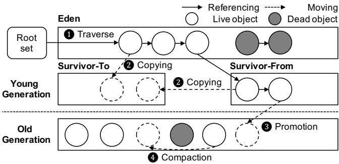
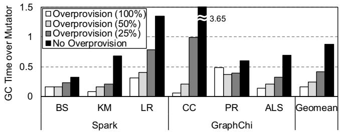
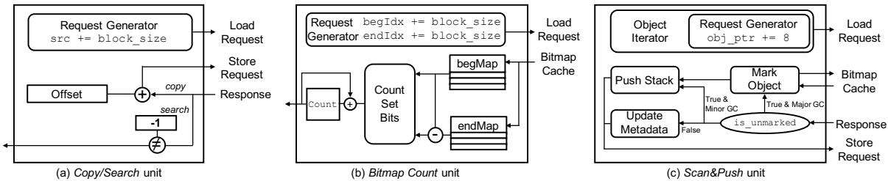
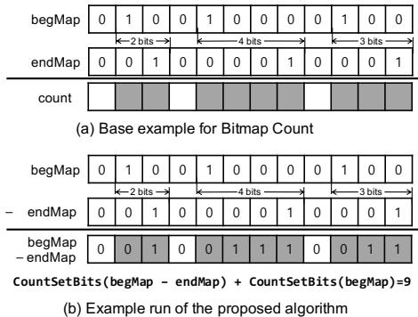
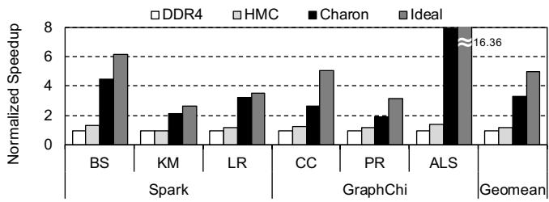
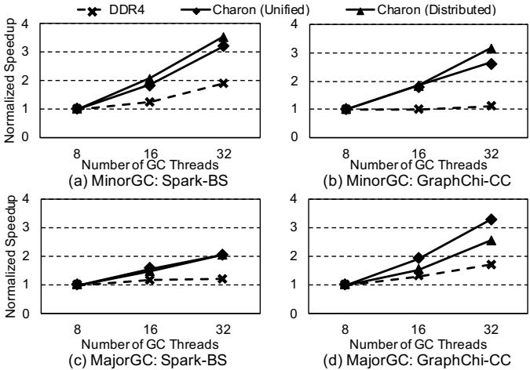

# Charon: Specialized Near-Memory Processing Architecture for Clearing Dead Objects in Memory 图表详解

### Figure 1: Overview of ParallelScavenge GC in HotSpot

- 图片展示了 HotSpot JVM 中 **ParallelScavenge GC** 的工作流程概览，聚焦于对象在不同代（Generation）之间的移动与回收。
- 整个流程分为四个主要阶段，分别用数字 1 至 4 标注：
    - **1. Traverse（遍历）**: 从 Root Set 出发，遍历 Eden 区域中的对象图，识别所有可达的 Live Object（白色圆圈），并标记不可达的 Dead Object（灰色圆圈）。
    - **2. Copying（复制）**: 将 Eden 和 Survivor-From 空间中的 Live Object 复制到空闲的 Survivor-To 空间。此过程同时清理原空间。
    - **3. Promotion（晋升）**: 对于在 Young Generation 中存活超过一定次数的对象，将其晋升至 Old Generation。
    - **4. Compaction（压缩）**: 在 MajorGC 阶段，对 Old Generation 进行压缩，将所有 Live Object 移动到连续内存区域，消除碎片。
- 图中使用箭头区分两种操作：
    - 实线箭头表示 **Referencing Live object**，即对象间的引用关系。
    - 虚线箭头表示 **Moving Dead object**，即垃圾对象被清除或移动的过程。
- 内存区域划分清晰：
    - **Young Generation** 包含 Eden、Survivor-From 和 Survivor-To 三个子区域。
    - **Old Generation** 位于下方，用于存放长期存活的对象。
- 此图直观体现了 **Generational Hypothesis**：大多数对象生命周期短，仅少量对象长期存活，因此通过分代收集可提升效率。
- 该流程是论文中分析 GC 开销的基础，后续章节基于此分解出 Copy、Scan&Push、Search 等关键原语进行硬件加速。

### Figure 2: GC overhead normalized to mutator time (for useful work) in big data processing workloads over varying heap size

- 图表标题为 **Figure 2**，展示的是在不同堆内存配置下，**GC overhead** 相对于 **mutator time**（即有用工作时间）的归一化比例。
- 横轴分为两组：**Spark** 和 **GraphChi**，每组包含多个具体工作负载：
    - Spark：**BS**（Naive Bayes）、**KM**（K-Means）、**LR**（Logistic Regression）
    - GraphChi：**CC**（Connected Components）、**PR**（PageRank）、**ALS**（Alternating Least Squares）
    - 最右侧为 **Geomean**，表示几何平均值
- 纵轴为 **GC Time over Mutator**，范围从 0 到 1.5，表示 GC 时间占 mutator 时间的比例。
- 图例说明四种堆内存配置：
    - **Overprovision (100%)**：堆内存为最小需求的 2 倍
    - **Overprovision (50%)**：堆内存为最小需求的 1.5 倍
    - **Overprovision (25%)**：堆内存为最小需求的 1.25 倍
    - **No Overprovision**：堆内存刚好满足最小需求，无冗余

| 工作负载 | No Overprovision | Overprovision (25%) | Overprovision (50%) | Overprovision (100%) |
| -------- | ---------------- | ------------------- | ------------------- | -------------------- |
| BS       | ~0.3             | ~0.2                | ~0.15               | ~0.1                 |
| KM       | ~0.6             | ~0.4                | ~0.3                | ~0.2                 |
| LR       | ~0.8             | ~0.5                | ~0.4                | ~0.3                 |
| CC       | ~1.2             | ~0.9                | ~0.7                | ~0.5                 |
| PR       | ~0.7             | ~0.5                | ~0.4                | ~0.3                 |
| ALS      | ~1.4             | ~1.0                | ~0.8                | ~0.6                 |
| Geomean  | **~3.65**        | ~1.0                | ~0.7                | ~0.5                 |

- 关键观察：
    - 所有工作负载在 **No Overprovision** 条件下，GC 开销显著上升，尤其 **ALS** 和 **CC** 超过 1.0，意味着 GC 时间超过有用工作时间。
    - **Geomean** 在无冗余堆内存时高达 **3.65**，表明整体上 GC 时间是 mutator 时间的 3.65 倍，性能严重受阻。
    - 随着堆内存冗余增加（25% → 50% → 100%），GC 开销持续下降，证明堆内存充足可有效缓解 GC 压力。
    - **ALS** 在所有配置下均表现出最高 GC 开销，因其处理大型矩阵对象，复制成本高。
    - **BS** 是最轻量级的工作负载，即使在无冗余堆内存下，GC 开销也相对较低。

### Figure 3: Simplified execution flow of GC

- 图片展示了 **Garbage Collection (GC)** 的简化执行流程，分为两个主要部分：**(a) MinorGC 流程** 和 **(b) MajorGC 流程**，均以流程图形式呈现。
- 在 **MinorGC 流程** 中：
    - 起始操作为 **Pop object**，即从对象栈中弹出一个对象进行处理。
    - 若该对象未被标记（**Unmarked**），则进入 **Scan & Push** 阶段，遍历其可达对象并推入栈中。
    - 接着执行 **Copy or promote** 操作，将对象复制到 Survivor 空间或提升至 Old generation。
    - 同时，系统会 **Search card table**，用于查找由 Old generation 引用的 Young generation 对象，确保这些对象也被正确处理。
    - 所有已标记对象（**Marked**）直接跳过后续处理，避免重复操作。
- 在 **MajorGC 流程** 中：
    - 同样从 **Pop object** 开始，弹出对象后检查是否已标记。
    - 若未标记，则进入 **Scan & Push** 阶段，递归遍历所有可达对象并标记。
    - 标记完成后，进入 **Compacting** 阶段，首先通过 **Bitmap count** 计算指定范围内存活对象所占字数，以确定新位置。
    - 最后执行 **Copy** 操作，将存活对象移动至连续内存区域，减少碎片。
- 两个流程的核心操作包括：
    - **Pop object**：从栈中取出待处理对象。
    - **Scan & Push**：遍历对象引用并推入栈中，实现图遍历。
    - **Copy / Promote**：对象迁移或晋升。
    - **Search card table**：仅在 MinorGC 中出现，用于跨代引用追踪。
    - **Bitmap count**：仅在 MajorGC 中出现，用于计算对象大小和定位。
- 关键术语保留英文原名，如 **MinorGC**, **MajorGC**, **card table**, **bitmap count**, **Scan & Push** 等。
- 整体流程强调 **对象标记、遍历、迁移与压缩**，是 GC 算法的核心步骤，尤其适用于 **HotSpot JVM** 的 ParallelScavenge 收集器。

### Figure 4: Runtime breakdown of GC

- 图片展示了 Figure 4，即 GC 运行时分解图，分为 (a) MinorGC breakdown 和 (b) MajorGC breakdown 两部分，用于说明在不同工作负载下，GC 各操作所占时间比例。
- **MinorGC 分解图 (a)** 显示了 Spark 和 GraphChi 框架中六个应用（BS, KM, LR, CC, PR, ALS）的 MinorGC 时间分布，主要操作包括 Search、Scan&Push、Copy 和 Others。
- **MajorGC 分解图 (b)** 展示了相同六个应用在 MajorGC 阶段的时间分布，主要操作为 Bitmap Count、Scan&Push、Copy 和 Others。
- 从图中可观察到，在 MinorGC 中，**Copy** 操作在大多数应用中占据主导地位，尤其在 Spark 的 LR 和 GraphChi 的 ALS 中占比极高；而 **Search** 在 Spark 的 BS 和 KM 中较为显著。
- 在 MajorGC 中，**Copy** 依然是主要耗时操作，但在 GraphChi 的 CC 和 PR 中，**Scan&Push** 占比明显上升，表明这些应用涉及更多对象引用遍历。
- **Bitmap Count** 在 MajorGC 中对 LR 和 ALS 应用贡献较大，这与论文中提到的这些应用需要频繁计算对象大小和位置相符。
- 下表总结了各应用在 MinorGC 和 MajorGC 中关键操作的占比趋势：

| 应用 | MinorGC 主要操作 | MajorGC 主要操作    |
| ---- | ---------------- | ------------------- |
| BS   | Search + Copy    | Copy                |
| KM   | Search + Copy    | Copy                |
| LR   | Copy             | Bitmap Count + Copy |
| CC   | Copy             | Scan&Push + Copy    |
| PR   | Copy             | Scan&Push + Copy    |
| ALS  | Copy             | Copy                |

- 图中数据支持论文观点：GC 时间主要由少数几个原语（primitives）主导，如 Copy、Search、Scan&Push 和 Bitmap Count，这些正是 Charon 加速器重点优化的对象。
- 通过对比不同应用的行为差异，可看出 Charon 的设计需兼顾不同工作负载特性，例如对 Scan&Push 的优化在 GraphChi 的图算法中尤为重要。

### 22a682835fcca0dea4ad6bc03118b7c37b77bfeac656433772690ed4a5d44290.jpg

- 该图展示了 **Charon** 架构的系统级视图与单个 HMC 逻辑层内部结构，分为 (a) 和 (b) 两个部分。
- 图 (a) 描绘了整体系统架构：**Host processor** 通过串行链路连接至 **HMC 0**，其余 HMC（1、2、3）以星型拓扑互联，形成多立方体内存系统。
- 每个 HMC 的底部为 **Logic layer**，其中嵌入 **Charon** 加速单元，实现近内存计算，直接访问其上方堆叠的 **DRAM layers**。
- 图 (b) 是单个 HMC 逻辑层内 **Charon** 的详细块图，包含三个核心处理单元：**Copy/Search Units**、**BitMap Count Units**、**Scan&Push Units**，每个单元前设有独立的 **CMD Queue** 用于接收主机下发的卸载请求。
- 所有处理单元共享一个 **Memory Access Interface (MAI)**，负责将内存访问请求路由至本地或远程 DRAM，并管理请求元数据和单元 ID。
- **MAI** 连接 **TLB**（Translation Lookaside Buffer）进行虚拟地址到物理地址的转换，确保内存访问正确性。
- 系统中还包含一个共享的 **Bitmap Cache**，专用于缓存位图数据，提升 **BitMap Count** 和 **Scan&Push** 单元的访问效率。
- 数据流方向清晰：主机通过 **Offload Request Packet** 向 Charon 发送任务，完成后通过 **Return Packet** 返回结果。
- 整体设计强调 **低延迟、高带宽、并行化**，利用 HMC 内部 TSV 带宽优势，最大化 **MLP (Memory-Level Parallelism)**。
- 关键组件如 **CMD Queue**、**MAI**、**TLB**、**Bitmap Cache** 均位于逻辑层，不占用主机资源，实现真正的近内存加速。

| 组件名称                          | 功能描述                                        | 关联单元                                   |
| --------------------------------- | ----------------------------------------------- | ------------------------------------------ |
| **CMD Queue**                     | 接收并缓冲来自主机的卸载请求包                  | Copy/Search, BitMap Count, Scan&Push Units |
| **Copy/Search Units**             | 执行对象复制与旧代到新代对象搜索                | MinorGC & MajorGC                          |
| **BitMap Count Units**            | 计算指定范围内存活对象总大小，用于压缩阶段      | MajorGC                                    |
| **Scan&Push Units**               | 遍历对象图，扫描引用并推入栈，用于标记阶段      | MinorGC & MajorGC                          |
| **Memory Access Interface (MAI)** | 管理内存请求，支持本地/远程访问，维护请求元数据 | 所有处理单元                               |
| **TLB**                           | 虚拟地址到物理地址转换，支持大页与 NUMA 分配    | MAI                                        |
| **Bitmap Cache**                  | 缓存位图数据，提升读取命中率，减少远程访问      | BitMap Count & Scan&Push Units             |

- 该架构设计允许 **Charon** 在不修改主机处理器的前提下，高效卸载 GC 中最耗时的原语操作，显著提升吞吐量并降低能耗。

### Figure 5: Charon overview Figure 6: Hardware block diagram of each processing unit

- 图片展示了 Charon 架构中三个核心处理单元的硬件块图，分别为 **Copy/Search unit**、**Bitmap Count unit** 和 **Scan&Push unit**，对应 Figure 6 的 (a)、(b)、(c) 子图。
- 每个单元均围绕特定 GC 原语设计，旨在通过近内存处理最大化 MLP（Memory-Level Parallelism）并利用 HMC 内部高带宽。
- **Copy/Search unit**：
    - 核心组件包括 Request Generator、Offset、copy/search 判断模块和响应路径。
    - Request Generator 以 block_size 步长递增 src 地址，生成 Load Request。
    - Offset 与加法器配合计算目标地址，触发 Store Request（用于 Copy）或比较操作（用于 Search）。
    - 支持两种模式：Copy 时执行内存复制；Search 时检查指定范围内是否存在非 -1 值，返回布尔结果。
- **Bitmap Count unit**：
    - 包含 Request Generator、begMap/endMap 数据结构、Count Set Bits 模块、Bitmap Cache 和计数逻辑。
    - Request Generator 以 block_size 步进 begIdx 和 endIdx，从 begMap 和 endMap 读取位图数据。
    - Count Set Bits 模块执行优化算法：**CountSetBits(begMap - endMap) + CountSetBits(begMap)**，替代传统逐位扫描。
    - Bitmap Cache 缓存频繁访问的小范围位图，命中率约 90%，显著降低延迟。
    - 最终输出为指定范围内 live objects 占用的 word 数量。
- **Scan&Push unit**：
    - 组件包括 Object Iterator、Request Generator、Mark Object、Push Stack、Update Metadata 和 is_unmarked 判断模块。
    - Object Iterator 遍历对象字段，Request Generator 以 obj_ptr += 8 步长生成 Load Request 获取引用对象。
    - is_unmarked 判断对象是否已标记，若未标记则触发 Mark Object（写入 bitmap）和 Push Stack（压入对象栈）。
    - 若已标记，则执行 Update Metadata（如更新 card table），不压栈。
    - 支持 MinorGC 和 MajorGC 两种场景，根据 GC 类型选择不同操作路径。
- 三者共同特点：
    - 均采用流水线式请求生成机制，每周期发出新请求，最大化 MLP。
    - 依赖 MAI（Memory Access Interface）进行内存访问，并支持远程立方体通信。
    - 通过专用硬件加速低计算、高访存的 GC 原语，避免通用 CPU 的指令窗口和缓存局限。
- 性能影响：
    - Copy/Search 单元在 Copy 上实现最高 **26.15×** 加速，在 Search 上达 **4.09×**。
    - Bitmap Count 单元因算法优化和缓存，平均加速 **5.63×**。
    - Scan&Push 单元因间接访问特性，加速较弱，平均仅 **1.20×**，但在高引用密度场景（如 GraphChi-CC）表现更佳。

| 单元名称     | 主要功能                        | 关键优化点              | 平均加速比 | 最大加速比 |
| ------------ | ------------------------------- | ----------------------- | ---------- | ---------- |
| Copy/Search  | 对象复制 / 范围搜索             | 大粒度（256B）并行访问  | 10.17×     | 26.15×     |
| Bitmap Count | 计算位图区间内 live object 大小 | 算法优化 + Bitmap Cache | 5.63×      | 6.11×      |
| Scan&Push    | 对象图遍历与栈推送              | MLP 优化 + 分支预测     | 1.20×      | 1.86×      |

### Figure 7: Pseudocode of Copy and Search primitives Figure 8: Pseudocode of Bitmap Count primitive Figure 9: Bitmap Count primitive example

- 图片展示了 **Bitmap Count** 原语的两个示例，分别标记为 (a) 和 (b)，用于说明其在 HotSpot JVM 中如何计算指定内存范围内活跃对象所占字数。

- 在图 (a) “Base example for Bitmap Count” 中：

    - **begMap** 和 **endMap** 是两个位图，每个位代表 64 位（8 字节）堆空间。
    - **begMap** 中置位（1）表示一个活跃对象的起始地址，**endMap** 中置位（1）表示该对象的结束地址。
    - 例如，第一个对象从第 2 位开始，到第 3 位结束，占据 2 个 8 字节块（即 16 字节），对应 **count** 区域中两个灰色方块。
    - 第二个对象从第 7 位开始，到第 10 位结束，占据 4 个 8 字节块（即 32 字节），对应 **count** 区域中四个灰色方块。
    - 第三个对象从第 14 位开始，到第 16 位结束，占据 3 个 8 字节块（即 24 字节），对应 **count** 区域中三个灰色方块。
    - 总计：2 + 4 + 3 = 9 个 8 字节块，即 **count = 9**。

- 在图 (b) “Example run of the proposed algorithm” 中：

    - 展示了 Charon 优化后的算法执行过程。
    - 算法核心表达式为：**CountSetBits(begMap - endMap) + CountSetBits(begMap)**。
    - 首先，将 **endMap** 从 **begMap** 中按位相减（二进制减法），得到中间结果。
    - 然后，统计该中间结果中置位（1）的数量，即 **CountSetBits(begMap - endMap)**。
    - 接着，统计原始 **begMap** 中置位（1）的数量，即 **CountSetBits(begMap)**。
    - 最后，将两者相加得到最终结果。
    - 示例中，**begMap - endMap** 的结果为 `0 0 1 0 0 1 1 1 0 0 1 1`，其中置位数量为 6。
    - **begMap** 中置位数量为 3。
    - 总计：6 + 3 = 9，与图 (a) 结果一致。
    - 该优化算法通过一次减法和两次位计数操作，避免了原软件版本中逐位遍历的低效循环，显著提升性能。

- 该图旨在直观解释 Charon 如何通过硬件优化实现高效的 **Bitmap Count** 原语，从而加速 MajorGC 中的压缩阶段。

### Figure 10: Example of object traversal

- 图片展示了 **Object Traversal** 的示例流程，用于说明垃圾回收（GC）中对象图遍历的核心操作。
- 该过程涉及三个主要对象：**Object A**、**Object B** 和 **Object C**，以及一个名为 **Object Stack** 的数据结构。
- 流程分为四个步骤：
    - 步骤①：从 **Object Stack** 中弹出 **Object A**。
    - 步骤②：迭代 **Object A** 的字段，包括其 **Header** 和多个字段（灰色为引用字段，白色为非引用字段）。
    - 步骤③：扫描引用字段，发现 **Object A** 引用了 **Object B** 和 **Object C**。
    - 步骤④：将 **Object B** 和 **Object C** 推入 **Object Stack**，以便后续处理。
- 图例说明：
    - 灰色方块代表 **Reference field**（引用字段）。
    - 白色方块代表 **Non-reference field**（非引用字段）。
    - 虚线箭头表示 **Reference**（引用关系）。
- 该图直观解释了 **Scan&Push** 原语的工作机制，即通过递归遍历对象图来识别所有可达对象。
- 在 **MinorGC** 和 **MajorGC** 中，此原语均被用于标记存活对象，是 GC 性能的关键瓶颈之一。

### Figure 11: Pseudocode of Scan&Push primitive

- 图片 e0922932e041c00249eb893d47e106151651496d0eb6406dd2bed187c084e1aa.jpg 展示的是 **Figure 11: Pseudocode of Scan&Push primitive**，即 Scan&Push 原语的伪代码。
- 该伪代码描述了在 **MinorGC** 和 **MajorGC** 中如何处理对象图遍历的核心逻辑，是 Charon 加速器中 Scan&Push 单元的主要功能实现。
- 伪代码分为三个主要函数：`iterate_object`、`push_contents` 和 `follow_contents`。
- `iterate_object` 函数作为入口点，根据当前 GC 类型（MinorGC 或 MajorGC）调用不同的处理函数。它接收一个对象指针数组 `references`，并逐个处理每个引用。
- 在 MinorGC 场景下，调用 `push_contents` 函数：
    - 首先获取对象 `obj`。
    - 检查对象是否未被标记 (`is_unmarked(obj)`)。
    - 如果未标记，则将其推入 `minor_stack` 以供后续处理。
    - 否则，更新对象的元数据 (`update_metadata(obj)`)，例如更新 card table。
- 在 MajorGC 场景下，调用 `follow_contents` 函数：
    - 同样获取对象 `obj`。
    - 检查对象是否未被标记 (`is_unmarked(obj)`)。
    - 如果未标记，则执行原子读-改-写操作标记对象 (`mark_obj(obj)`)，然后将其推入 `major_stack`。
- 伪代码中的关键操作包括：
    - **对象标记 (marking)**：通过 `is_unmarked` 和 `mark_obj` 实现，用于识别和记录存活对象。
    - **栈操作 (stack operations)**：通过 `push` 操作将待处理对象加入 `minor_stack` 或 `major_stack`，这是图遍历的基础。
    - **元数据更新 (metadata update)**：在 MinorGC 中，对已标记对象更新 card table 等元数据。
- 下表总结了伪代码中各函数的功能和应用场景：

| 函数名            | 功能描述                                        | 应用场景          |
| :---------------- | :---------------------------------------------- | :---------------- |
| `iterate_object`  | 根据 GC 类型分发处理任务                        | MinorGC & MajorGC |
| `push_contents`   | 处理 MinorGC 中的对象，标记并推入栈或更新元数据 | MinorGC           |
| `follow_contents` | 处理 MajorGC 中的对象，标记并推入栈             | MajorGC           |

- 该伪代码体现了 GC 中对象图遍历的基本模式：从根集开始，递归访问所有可达对象，并对其进行标记或移动。
- Charon 的 Scan&Push 单元正是为了加速这一过程而设计，通过利用近内存计算的优势，提高内存级并行度，从而提升 GC 效率。

### 6a0444500bced66a25da1b2172fb146b7a7183150e7b16a1c3511ca2af4d2ef2.jpg

- 该图片为一张表格，标题为“Table 1: Applicability of Charon Primitives”，用于展示 Charon 提出的三个关键 GC 原语在 HotSpot JVM 中几种主流垃圾回收器上的适用性。
- 表格包含四列：第一列为 **GC 算法名称**，第二至第四列分别为三个原语：**Copy/Search**、**Scan&Push** 和 **Bitmap Count**，最后一列为 **Remarks**（备注）。
- 表格内容如下：

| GC Algorithm     | Copy/Search | Scan&Push | Bitmap Count | Remarks         |
| ---------------- | ----------- | --------- | ------------ | --------------- |
| ParallelScavenge | ✓✓          | ✓✓        | ✓✓           | High throughput |
| G1               | ✓✓          | ✓✓        | ✓            | Low latency     |
| CMS              | ✓✓          | ✓✓        | ×            | No compaction   |

- 表格下方有图例说明：

    - **✓✓**: applicable as is（可直接适用）
    - **✓**: applicable with minor fix（需少量修改后适用）
    - **×**: not applicable（不适用）

- 分析表明，Charon 的 **Copy/Search** 和 **Scan&Push** 原语对所有三种 GC 算法均高度适用（标记为 ✓✓），而 **Bitmap Count** 原语仅适用于 **ParallelScavenge** 和 **G1**，不适用于 **CMS**，因为 CMS 不执行内存压缩（No compaction），而 Bitmap Count 主要服务于压缩阶段。

- 备注栏进一步说明了各 GC 算法的设计目标：

    - **ParallelScavenge**：追求高吞吐量（High throughput）
    - **G1**：兼顾低延迟与吞吐量（Low latency）
    - **CMS**：专注于低暂停时间，但不进行压缩（No compaction）

- 此表旨在强调 Charon 设计的通用性——其核心原语覆盖了主流 GC 算法的关键操作，尤其在吞吐导向和低延迟导向的收集器中均有良好适配性，仅在无压缩需求的 CMS 上受限。

### Table 2: Architectural parameters for evaluation

- 该图片为论文中的 **Table 2: Architectural parameters for evaluation**，详细列出了用于评估 Charon 架构的仿真系统配置，涵盖 Host Processor、DDR4 Main Memory System、HMC Main Memory System 和 Charon Configuration 四大模块。

- **Host Processor** 配置如下：

    - 核心：8 × **2.67 GHz Westmere OoO core**
    - 指令窗口/重排序缓冲区：36-entry IW / 128-entry ROB / 4-way issue
    - TLB：L1I/D 64-entry per core；Shared L2 1024-entry
    - L1/D Cache：32KB, 4-way, 3-cycle / 32KB, 8-way, 4-cycle
    - L2 Cache：256KB, 8-way, 12-cycle
    - L3 Cache：8MB, 16-way, 28-cycle

- **DDR4 Main Memory System** 参数：

    - 组织结构：32GB, 2 channels, 4 ranks per channel, 4GB 8 banks per rank
    - 时序参数：
        - tCK=0.937ns, tRAS=35ns, tRCD=13.50ns
        - tCAS=13.50ns, tWR=15ns, tRP=13.50ns
    - 带宽与能耗：
        - 总带宽 **34GB/s**（每通道 17GB/s）
        - 能耗 **35pJ/bit**

- **HMC Main Memory System** 参数：

    - 组织结构：32GB, 4 cubes, 32 vaults per cube
    - 时序参数：
        - tCK = 1.6ns, tRAS = 22.4ns, tRCD = 11.2ns
        - tCAS = 11.2ns, tWR = 14.4ns, tRP = 11.2ns
    - 带宽与能耗：
        - 单立方体带宽 **320GB/s**
        - 能耗 **21pJ/bit**
    - 串行链路：
        - 总带宽 **80GB/s per link**
        - 延迟 **3ns**

- **Charon Configuration** 各处理单元配置：

    - Copy/Search Unit：共 **8 units**（每立方体 2 units）
    - Bitmap Count Unit：共 **8 units**（每立方体 2 units）
    - Scan&Push Unit：共 **8 units**（全部位于单个立方体）
    - Bitmap Cache：**8KB**, 8-way, 32B block size
    - MAI / TLB：**8KB**, 32B block size / 32 entries per cube

- 所有配置均服务于 zsim 仿真器，用于对比 Charon 在 HMC 平台上的性能与能效提升，尤其突出其利用 **3D stacked DRAM 内部高带宽** 的设计优势。

### Table 3: Workloads

- 该图片为论文中的 **Table 3: Workloads**，用于列出实验所使用的基准测试工作负载及其相关配置。
- 表格包含四列：**Workload**、**Input**、**Heap**，以及一个隐含的框架分类（Spark 或 GraphChi）。
- 所有工作负载均运行于 **Spark 2.1.0** 或 **GraphChi 0.2.2** 框架之上，并搭配 **HotSpot JVM (OpenJDK 1.7.0)**。
- 实验设定聚焦于 **GC事件** 的性能与能耗，因此所有测试均在特定堆内存大小下运行，以避免 OOM 错误并观察 GC 开销。

| Workload                        | Input                                   | Heap |
| ------------------------------- | --------------------------------------- | ---- |
| **Spark**                       |                                         |      |
| Bayesian Classifier (BS)        | KDD 2010 [28, 29]                       | 10GB |
| k-means Clustering (KM)         | KDD 2010 [28, 29]                       | 8GB  |
| Logistic Regression (LR)        | URL Reputation [36]                     | 12GB |
| **GraphChi**                    |                                         |      |
| Connected Components (CC)       | R-MAT Scale 22 [44]                     | 4GB  |
| PageRank (PR)                   | R-MAT Scale 22 [44]                     | 4GB  |
| Alternating Least Squares (ALS) | Matrix Market Format (15000x15000) [55] | 4GB  |

- **Spark 工作负载**：

    - 均为机器学习算法，输入数据集来自 **KDD Cup 2010** 或 **URL Reputation** 数据集。
    - 堆内存配置从 **8GB 到 12GB** 不等，反映不同算法对内存的需求差异。
    - 特别是 **Logistic Regression (LR)** 使用了最大的堆空间（12GB），表明其对象规模或引用复杂度更高。

- **GraphChi 工作负载**：

    - 包含图算法（**Connected Components**, **PageRank**）和矩阵分解算法（**Alternating Least Squares**）。
    - 输入数据统一使用 **R-MAT Scale 22** 或 **Matrix Market Format**，均为大规模稀疏图或矩阵结构。
    - 所有 GraphChi 工作负载均配置 **4GB 堆内存**，说明其对象数量虽多但单个对象体积较小，或算法本身更注重遍历而非复制。

- **关键术语保留**：

    - **Workload**、**Input**、**Heap** 等字段名称保持英文原样。
    - 数据集如 **KDD 2010**、**R-MAT Scale 22**、**Matrix Market Format** 均为标准学术数据集，保留原始命名。
    - 算法缩写如 **BS**、**KM**、**LR**、**CC**、**PR**、**ALS** 亦保留，便于对照论文正文。

- **实验设计意图**：

    - 选择的工作负载具有**显著不同的对象特性**，从而体现 Charon 在不同 GC 行为下的加速效果。
    - 例如，**ALS** 因处理大型矩阵对象而产生大量 Copy 操作，成为 Charon 加速最显著的案例。
    - **CC** 和 **PR** 则因频繁图遍历而依赖 Scan&Push，用于评估该原语的加速能力。

### Figure 12: Normalized GC performance of Charon compared with the host CPU-only execution

- 图表标题为“Figure 12: Normalized GC performance of Charon compared with the host CPU-only execution”，展示的是不同平台下垃圾回收（GC）性能的归一化加速比。
- 横轴包含六个具体工作负载：BS、KM、LR（属于 Spark 框架），CC、PR、ALS（属于 GraphChi 框架），以及一个综合指标“Geomean”。
- 纵轴为“Normalized Speedup”，表示相对于基线（DDR4 + CPU）的加速倍数，刻度从0到8。
- 图例包含四种配置：
    - **DDR4**：白色柱状，代表传统 DDR4 内存系统 + CPU。
    - **HMC**：浅灰色柱状，代表 HMC 内存系统 + CPU。
    - **Charon**：黑色柱状，代表 HMC + Charon 近内存加速器。
    - **Ideal**：深灰色柱状，代表理想情况下的零周期卸载。
- 各工作负载表现如下：

| 工作负载 | DDR4 加速比 | HMC 加速比 | Charon 加速比 | Ideal 加速比 |
| -------- | ----------- | ---------- | ------------- | ------------ |
| BS       | ~1.0        | ~1.2       | ~4.5          | ~6.5         |
| KM       | ~1.0        | ~1.2       | ~2.2          | ~2.8         |
| LR       | ~1.0        | ~1.2       | ~3.5          | ~4.0         |
| CC       | ~1.0        | ~1.2       | ~2.8          | ~3.5         |
| PR       | ~1.0        | ~1.2       | ~2.0          | ~3.0         |
| ALS      | ~1.0        | ~1.2       | ~3.5          | **~16.36**   |
| Geomean  | 1.0         | 1.21       | **3.29**      | —            |

- **关键观察**：
    - 所有工作负载在 HMC 平台上均获得约 1.21× 的平均加速，主要源于更高的外部带宽。
    - **Charon** 在所有工作负载上均显著优于 HMC，平均加速比达 **3.29×**，最高可达 4.5×（BS）。
    - **ALS** 工作负载在 Ideal 情况下达到 **16.36×** 加速，表明其对 Copy 原语高度依赖，而 Charon 对该原语优化效果极佳。
    - Charon 性能接近 Ideal 情况，说明其硬件设计高效，卸载延迟极低。
    - 不同工作负载间加速比差异显著，反映其对象特征和 GC 行为不同（如 ALS 复制大对象，Scan&Push 并行度低）。

### Figure 13: Utilized bandwidth during GC and ratio of local accesses

- 图片展示了在垃圾回收（GC）期间，不同系统配置下所利用的带宽以及本地访问比例。横轴列出了多个工作负载，包括 Spark 框架下的 BS、KM、LR，以及 GraphChi 框架下的 CC、PR、ALS，最后是所有工作负载的平均值。

- 纵轴左侧表示带宽使用量，单位为 GB/s；右侧表示本地访问比例，范围从 0 到 1。

- 图中包含四种数据系列：

    - **DDR4**：白色柱状图，代表基于传统 DDR4 内存系统的主机处理器。
    - **HMC**：灰色柱状图，代表主机处理器搭配 Hybrid Memory Cube（HMC）内存系统。
    - **Charon**：黑色柱状图，代表主机处理器搭配位于 HMC 逻辑层的 Charon 加速器。
    - **Ratio of local access**：带有“×”标记的虚线，表示 Charon 系统中本地访问的比例。

- 各工作负载下的带宽使用情况如下表所示：

| 工作负载 | DDR4 (GB/s) | HMC (GB/s) | Charon (GB/s) |
| -------- | ----------- | ---------- | ------------- |
| BS       | ~20         | ~40        | ~280          |
| KM       | ~20         | ~40        | ~200          |
| LR       | ~20         | ~40        | ~150          |
| CC       | ~20         | ~40        | ~130          |
| PR       | ~20         | ~40        | ~120          |
| ALS      | ~20         | ~40        | ~300          |
| Average  | ~20         | ~40        | ~190          |

- 本地访问比例（Ratio of local access）在各工作负载下均保持较高水平，除 CC 和 PR 外，其余工作负载的本地访问比例均超过 70%。CC 和 PR 的本地访问比例约为 50%，但仍显著高于其他系统配置所能提供的带宽。

- **关键观察**：

    - Charon 在所有工作负载下均实现了远超 DDR4 和 HMC 系统的带宽利用率，平均达到约 190 GB/s，最高可达 300 GB/s（ALS）。
    - 这种高带宽利用率得益于 Charon 利用 HMC 内部的高带宽 TSV（Through-Silicon Via）进行内存访问，而非依赖传统的片外链路。
    - 尽管部分工作负载（如 CC 和 PR）有约一半的内存请求指向远程节点，但由于这些应用本身带宽需求较低，因此并未造成显著瓶颈。
    - **本地访问比例高**表明 Charon 能有效利用 HMC 内部的高带宽资源，减少对片外带宽的依赖，从而提升整体 GC 性能。

- 综上，该图清晰地展示了 Charon 如何通过近内存处理架构充分利用 HMC 的内部带宽，实现远超传统内存系统的带宽利用率，并维持较高的本地访问比例，从而显著加速垃圾回收过程。

### Figure 14: Per-primitive speedup analysis (S: Search, SP: Scan&Push, C: Copy, BC: Bitmap Count)

- 图片展示了 Charon 架构在不同工作负载和 GC 类型下，对三个关键 GC 原语（Search、Scan&Push、Copy）以及 Bitmap Count 的性能加速比分析。
- **横轴**按工作负载分组，包括 BS、KM、LR、CC、PR 和 ALS，每组内又细分为 MinorGC 和 MajorGC 两种场景。
- **纵轴**为归一化加速比（Normalized speedup），基准为 DDR4 内存系统的 CPU 执行性能。
- 每组柱状图中，白色柱代表 DDR4 系统，黑色柱代表 Charon 加速器，直观对比加速效果。
- **S (Search)**、**SP (Scan&Push)**、**C (Copy)**、**BC (Bitmap Count)** 分别对应四种原语的加速表现，其中 Copy 原语在多数情况下贡献最大加速比。
- 在 ALS 工作负载的 MajorGC 场景中，**Copy 原语达到最高加速比 26.15×**，显著优于其他原语和工作负载。
- Scan&Push 原语在部分工作负载（如 BS、KM、LR、ALS）中加速比偏低甚至接近 1×，原因在于这些应用对象引用少、并行度低，难以发挥 Charon 的 MLP 优势。
- Bitmap Count 原语在所有工作负载中均表现出稳定且显著的加速，平均达 **5.63×**，得益于其优化算法与硬件设计结合。
- 多数工作负载中，**Copy 原语是主要性能瓶颈**，Charon 对其高效加速直接推动了整体 GC 性能提升。
- 图中虚线标注了各原语在特定场景下的具体加速数值，便于量化比较。

| 工作负载 | GC 类型 | Search (S) | Scan&Push (SP) | Copy (C)  | Bitmap Count (BC) |
| -------- | ------- | ---------- | -------------- | --------- | ----------------- |
| BS       | MinorGC | ~1.5       | ~1.0           | ~7.0      | ~5.0              |
|          | MajorGC | ~2.0       | ~1.2           | ~17.8     | ~5.5              |
| KM       | MinorGC | ~1.8       | ~1.1           | ~11.6     | ~5.2              |
|          | MajorGC | ~2.2       | ~1.3           | ~15.1     | ~5.8              |
| LR       | MinorGC | ~2.1       | ~1.0           | ~21.3     | ~5.6              |
|          | MajorGC | ~2.5       | ~1.4           | ~21.8     | ~6.0              |
| CC       | MinorGC | ~1.6       | ~1.5           | ~8.0      | ~5.3              |
|          | MajorGC | ~1.9       | ~1.7           | ~10.0     | ~5.7              |
| PR       | MinorGC | ~1.7       | ~1.6           | ~9.0      | ~5.4              |
|          | MajorGC | ~2.0       | ~1.8           | ~12.0     | ~5.9              |
| ALS      | MinorGC | ~2.0       | ~1.2           | ~19.2     | ~6.1              |
|          | MajorGC | ~2.3       | ~1.3           | **26.15** | ~6.0              |

- 整体来看，Charon 在 Copy 和 Bitmap Count 原语上表现最优，Scan&Push 受限于数据访问模式，并非所有场景都受益。
- 该图验证了论文核心观点：通过识别并加速少数关键原语，即可实现整体 GC 性能的大幅提升，无需全量卸载。

### Figure 15: GC throughput scalability

- 图片展示了 **Charon** 架构在不同 GC 线程数下的吞吐量可扩展性，对比了三种配置：**DDR4**、**Charon (Unified)** 和 **Charon (Distributed)**。
- 四个子图分别对应不同工作负载和 GC 类型：
    - (a) MinorGC: Spark-BS
    - (b) MinorGC: GraphChi-CC
    - (c) MajorGC: Spark-BS
    - (d) MajorGC: GraphChi-CC
- 所有子图的 Y 轴为“Normalized Speedup”，X 轴为“Number of GC Threads”，取值为 8、16、32。
- **Charon (Unified)** 设计中，所有处理单元共享中心立方体上的单个 bitmap cache 和 TLB；**Charon (Distributed)** 则将这些结构分布到各个立方体上。
- 数据表明，随着 GC 线程数增加，**Charon** 的性能提升显著优于 **DDR4**，后者因内存带宽受限（最大 34GB/s）几乎无法扩展。
- 在大多数情况下，**Charon (Distributed)** 比 **Charon (Unified)** 表现更好，因为减少了中心立方体的争用。
- 唯一例外是 **GraphChi-CC** 的 MajorGC，由于内存压力较低，**Charon (Unified)** 反而表现更优，分布式设计因远程 TLB 访问带来开销。
- 性能可扩展性还可通过采用带宽可扩展的 HMC 拓扑和改进的页面交错策略进一步优化。

| 子图 | 工作负载    | GC 类型 | 最佳配置             | 关键观察                                                 |
| ---- | ----------- | ------- | -------------------- | -------------------------------------------------------- |
| (a)  | Spark-BS    | MinorGC | Charon (Distributed) | 随线程数增加，Charon 显著优于 DDR4，分布式优于统一设计   |
| (b)  | GraphChi-CC | MinorGC | Charon (Distributed) | 分布式设计在高线程数下表现最佳，DDR4 几乎无扩展性        |
| (c)  | Spark-BS    | MajorGC | Charon (Distributed) | 分布式设计在 32 线程时达到约 3.5x 加速，远超 DDR4        |
| (d)  | GraphChi-CC | MajorGC | Charon (Unified)     | 统一设计在低内存压力下表现更优，分布式因远程访问开销略逊 |

- 结论：**Charon** 架构通过利用 3D 堆叠内存的内部带宽，在多线程 GC 场景下展现出优异的可扩展性，尤其在分布式设计下表现更佳。

### Figure 16: Memory-side implementation speedup over CPUside on-chip implementation

- 图片展示了三种不同架构配置在多个工作负载下的归一化加速比，旨在比较 **Charon** 作为 **CPU-side accelerator** 与 **DRAM-side accelerator** 的性能差异。
- 横轴列出了七个具体工作负载：**BS**、**KM**、**LR**（均来自 Spark）、**CC**、**PR**、**ALS**（均来自 GraphChi），以及一个综合指标 **Geomean**。
- 纵轴为 **Normalized Speedup**，表示相对于基准（CPU+DDR4）的性能提升倍数。
- 图例清晰区分了三种配置：
    - 白色柱状图：**CPU+DDR4**，作为性能基准。
    - 浅灰色柱状图：**Charon (CPU-side)+HMC**，即 Charon 作为 CPU 侧加速器，搭配 HMC 内存。
    - 黑色柱状图：**Charon (DRAM-side)+HMC**，即 Charon 作为 DRAM 侧加速器，搭配 HMC 内存。

| 工作负载 | CPU+DDR4 | Charon (CPU-side)+HMC | Charon (DRAM-side)+HMC |
| -------- | -------- | --------------------- | ---------------------- |
| BS       | ~1.0     | ~2.0                  | ~2.5                   |
| KM       | ~1.0     | ~1.8                  | ~2.3                   |
| LR       | ~1.0     | ~2.2                  | ~3.0                   |
| CC       | ~1.0     | ~1.7                  | ~2.0                   |
| PR       | ~1.0     | ~1.6                  | ~1.9                   |
| ALS      | ~1.0     | ~2.5                  | ~4.5                   |
| Geomean  | ~1.0     | ~2.0                  | ~3.0                   |

- 数据表明，**Charon (DRAM-side)+HMC** 在所有工作负载上均显著优于 **Charon (CPU-side)+HMC**。
- **ALS** 工作负载表现最为突出，**DRAM-side** 实现了约 **4.5x** 的加速比，而 **CPU-side** 仅为 **2.5x**，差距接近 **80%**。
- 综合来看，**Geomean** 加速比显示，**DRAM-side** 配置比 **CPU-side** 配置平均高出约 **50%**。
- 这种性能差异主要源于 **DRAM-side** 能够充分利用 **HMC** 内部的高带宽 **TSV**，而 **CPU-side** 则受限于外部内存总线带宽。
- 尽管 **CPU-side** 配置仍能带来可观的性能提升（平均 **2.0x**），但 **DRAM-side** 配置在性能上更具优势，验证了近内存计算架构的有效性。

### Figure 17: Energy consumption of Charon on GC compared with the host CPU-only execution

- 图表标题为 **Figure 17: Energy consumption of Charon on GC compared with the host CPU-only execution**，展示的是在不同工作负载下，**Charon** 相较于纯 **CPU** 执行的垃圾回收（GC）能耗对比。
- 纵轴为 **Normalized Energy Consumption**，表示归一化后的能耗值，基准为 DDR4 + CPU 配置下的能耗。
- 横轴按工作负载分组，包括 Spark 的三个子任务（BS, KM, LR）和 GraphChi 的三个子任务（CC, PR, ALS），每个任务下比较三种配置：**DDR4 + CPU**、**HMC + CPU**、**Charon**。
- 图例说明：
    - 白色柱体代表 **CPU** 能耗部分；
    - 灰色柱体代表 **DRAM** 能耗部分；
    - 黑色柱体代表 **Components of Charon**（即 Charon 自身硬件组件的能耗）。
- **Charon** 在所有工作负载中均显著降低总能耗。例如，在 **ALS** 上，Charon 总能耗仅为 DDR4+CPU 的约 **20%**，节能效果最突出。
- **Charon** 的自身能耗（黑色部分）占比极小，最高不超过总能耗的 **5%**，表明其硬件设计高效且低功耗。
- 对比 **HMC + CPU** 与 **DDR4 + CPU**，HMC 内存系统本身已带来一定节能（灰色部分减少），但加入 **Charon** 后进一步大幅降低 CPU 负担（白色部分锐减），从而实现整体能耗优化。
- 数据汇总如下：

| Workload | Platform   | Normalized Energy Consumption |
| -------- | ---------- | ----------------------------- |
| BS       | DDR4 + CPU | 1.00                          |
|          | HMC + CPU  | ~0.80                         |
|          | Charon     | ~0.35                         |
| KM       | DDR4 + CPU | 1.00                          |
|          | HMC + CPU  | ~0.75                         |
|          | Charon     | ~0.30                         |
| LR       | DDR4 + CPU | 1.00                          |
|          | HMC + CPU  | ~0.70                         |
|          | Charon     | ~0.25                         |
| CC       | DDR4 + CPU | 1.00                          |
|          | HMC + CPU  | ~0.65                         |
|          | Charon     | ~0.30                         |
| PR       | DDR4 + CPU | 1.00                          |
|          | HMC + CPU  | ~0.60                         |
|          | Charon     | ~0.25                         |
| ALS      | DDR4 + CPU | 1.00                          |
|          | HMC + CPU  | ~0.55                         |
|          | Charon     | ~0.20                         |

- **结论**：**Charon** 通过将 GC 关键原语卸载至近内存处理单元，有效减少 CPU 和 DRAM 的能耗，尤其在对象复制密集型任务（如 ALS）中节能效果最为显著，平均节能达 **60.7%**（如论文摘要所述）。其自身硬件开销可忽略，符合“低面积/低功耗”设计目标。

### Table 4: Total area usage of Charon for whole cubes

- 图片内容为 **Table 4: Total area usage of Charon for whole cubes**，展示 Charon 架构在多个 HMC 立方体上部署时各组件的面积开销。
- 表格分为两大类：**General Components** 和 **Processing Units**，分别统计通用结构与专用处理单元的面积消耗。
- **总芯片面积为 1.9470 mm²**，平均每个 HMC 立方体承担约 **0.4868 mm²** 的额外逻辑面积。
- 各组件具体面积分布如下：

|\-------------------|---------------------|----------|----------------------------|
| Command Queue | 0.0049 | 4 | 0.0196 |
| Request Queue(R) | 0.0015 | 4 | 0.0060 |
| Request Queue(W) | 0.0162 | 4 | 0.0648 |
| Metadata Array | 0.0805 | 4 | 0.3220 |
| Bitmap Cache | 0.1562 | 1 | 0.1562 |
| TLB | 0.0706 | 4 | 0.2824 |
| Copy/Search | 0.0223 | 8 | 0.1784 |
| Bitmap Count | 0.0427 | 8 | 0.3416 |
| Scan&Push | 0.0720 | 8 | 0.5760 |

- **Bitmap Cache** 占用单个实例但面积较大（0.1562 mm²），因其为集中式缓存，服务于所有立方体。
- **Scan&Push Unit** 是面积最大的处理单元，共 8 个实例，总计 **0.5760 mm²**，反映其复杂度和并行需求。
- **TLB** 与 **Metadata Array** 作为关键系统支持结构，合计占总面积约 **0.6044 mm²**，体现地址翻译与元数据管理的重要性。
- 整体来看，Charon 在 HMC 逻辑层引入的面积开销极小——假设 HMC 逻辑层总面积为 100 mm²，则 Charon 仅占用 **0.49%**，证明其设计高度轻量、可扩展。
