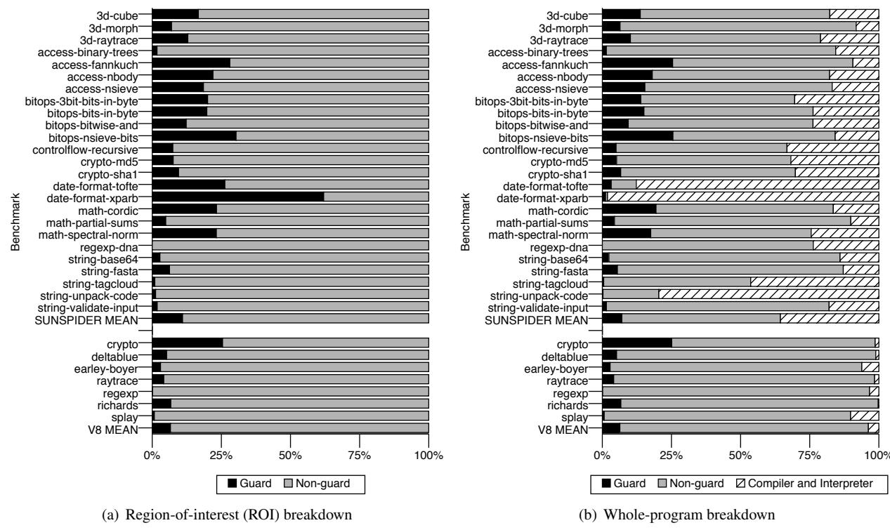
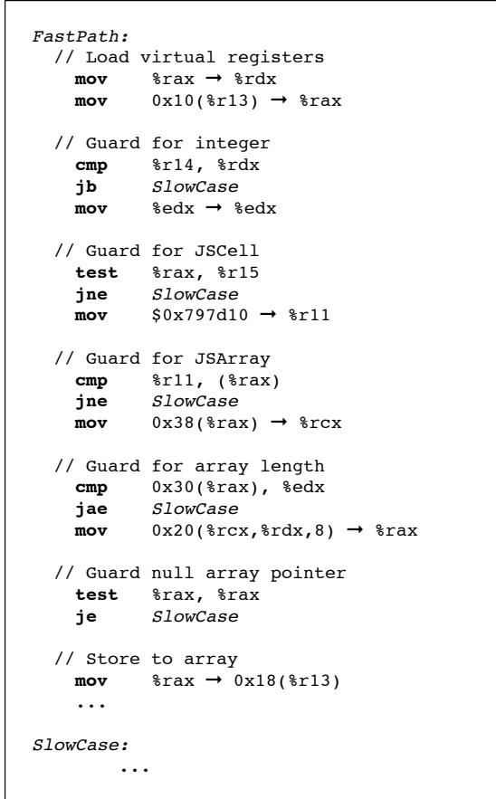

# Checked Load: Architectural Support for JavaScript Type-Checking on Mobile Processors 论文解析

## 0. 论文基本信息

**作者 (Authors)**: Owen Anderson, Emily Fortuna, Luis Ceze, et al.

**发表期刊/会议 (Journal/Conference)**: HPCA

**发表年份 (Publication Year)**: 2011

**研究机构 (Affiliations)**: Computer Science and Engineering, University of Washington

---

## 1. 摘要

**目的**
- 解决在**移动处理器**上执行**动态类型语言**（如 JavaScript）时，由频繁的**动态类型检查**（type checks）带来的严重性能开销问题。
- 量化该开销，并提出一种**低复杂度**的硬件架构扩展方案来消除此瓶颈。

**方法**
- **量化分析**：通过在 **Nitro JavaScript VM**（Safari 5 使用的 JIT 编译器）中植入指令，使用 **PIN** 工具在 x86 上运行，并通过一个模拟 **Qualcomm Snapdragon** 移动处理器微架构（包括缓存和分支预测器）的仿真平台，测量类型检查在指令数和执行周期上的开销。
- **提出 Checked Load**：设计了一套新的 **ISA 扩展**，包含 **4 条新指令** (`chklb`, `chklbn`, `chklw`, `chklwn`) 和一个专用寄存器 `chklp`。这些指令将内存加载、类型标签比较和错误处理分支融合为一条指令，并在**缓存访问阶段并行执行**类型检查，避免延长关键路径。
- **动态类型预测**：复用现有的**分支预测硬件**（gshare 预测器），对 Checked Load 指令的成功/失败进行动态预测，以降低失败检查的代价。
- **代码生成集成**：展示了如何在 Nitro JIT 编译器中，用 Checked Load 指令替换原有的软件类型检查序列，采用**乐观执行**策略，仅在检查失败时跳转到错误处理程序。

**结果**
- **开销量化**：分析表明，类型检查在动态生成的代码中平均消耗 **10.9%** 的指令数，在总执行时间中平均占比高达 **12.9%**，某些基准测试（如 `date-format-xparb`）中甚至达到 **62.0%**。
   *Figure 2. The dynamic instruction count cost of dynamic type checks in JavaScript benchmarks.*
   *Figure 3. The cycle cost of dynamic type checks in JavaScript benchmarks.*
- **性能提升**：在 SunSpider 和 V8 基准测试套件上，使用 Checked Load 和**共享的动态预测器**后，动态生成代码区域的执行时间平均减少 **11.2%**，最高可达 **44.6%**。
- **预测器效果**：与静态预测（平均仅提升 **1.5%**）相比，动态预测至关重要。复用现有分支预测硬件（共享 BHT）的方案，其性能损失微乎其微，且大幅节省了硬件成本。
  
| 预测策略 | 平均周期数减少 (ROI) | Checked Load 预测准确率 |
| :--- | :--- | :--- |
| 静态预测 | 1.5% | 75.8% |
| 动态预测 (独立BHT) | 11.9% | 96.1% |
| 动态预测 (共享BHT) | **11.2%** | **95.9%** |

 *Figure 7. Performance impacts of Checked Load*
 *Table 1. The prediction rates for Checked Load with static prediction, dynamic prediction with a separate branch history table, and dynamic prediction with a joined branch history table.*

**结论**
- **Checked Load** 是一种高效、低开销的硬件解决方案，能显著缓解动态类型语言在资源受限的**移动处理器**上的性能瓶颈。
- 通过将类型检查操作下沉到 ISA 层并与缓存硬件集成，Checked Load 在不增加关键路径延迟的前提下，有效减少了指令数和分支误预测惩罚。
- 该方案具有**通用性**，不仅适用于 JavaScript，也可用于 Python、Ruby 等其他动态类型语言。
- 随着移动处理器流水线加深，分支误预测代价增大，此类针对动态语言特性的**轻量级硬件支持**将变得愈发重要。

---

## 2. 背景知识与核心贡献

**研究背景**
- **动态类型语言**（如 **JavaScript**、Python、Ruby）因其开发和部署门槛低，已成为 **Web 应用的事实标准**。
- 在 **移动设备**上，这些应用的普及对客户端 **JavaScript 虚拟机 (VM)** 的性能提出了高要求。
- 然而，为 **动态类型语言**生成高效代码极具挑战性，因为其执行过程需要 **频繁的动态类型检查**（文中称为 **type guards**）。
- **移动处理器**受限于功耗和面积，通常采用 **轻量级架构**（如顺序执行），缺乏传统高性能技术（如乱序执行）来掩盖指令延迟，这使得 **动态类型检查的开销**问题尤为突出。

**研究动机**
- 作者通过分析发现，**动态类型检查的开销巨大**：
  - 在动态生成的代码中，**平均 10.9%** 的指令用于类型检查，最高可达 **46.8%**。
  - 在执行时间上，**平均 12.9%** 的周期被消耗在类型检查上，峰值高达 **62.0%**。
- 这些检查通常由 **软件实现**，涉及 **加载、掩码、比较和分支** 等多条指令，不仅增加了指令数，还因 **分支误预测** 而带来严重的流水线停顿。
- 随着移动处理器流水线加深，**分支误预测的代价**会越来越高，这一性能瓶颈将愈发严重。
- 因此，亟需一种 **低复杂度、硬件级**的解决方案来减轻此负担。

**核心贡献**
- 提出 **Checked Load**，一种 **低复杂度的指令集架构 (ISA) 扩展**，旨在用硬件原语替代软件中的动态类型检查。
  - 引入 **4 条新指令** (`chklb`, `chklbn`, `chklw`, `chklwn`)，将 **内存加载、类型标签检查和条件跳转** 融合为单条指令。
  - 设计了一个专用的 **`chklp` 寄存器**，用于存储类型错误处理程序的地址。
- 提出了 **高效的硬件实现方案**：
  - 类型标签检查逻辑被集成到 **缓存 (Cache)** 中，在 **缓存标签比较** 的同时并行完成，**不会延长关键路径**。
  - 实现仅需增加少量硬件（如比较器、MUX），改动极小。
- 提出 **动态类型预测 (Dynamic Type Prediction)** 机制：
  - 复用现有的 **分支预测硬件**（如 **gshare** 预测器），预测 Checked Load 指令是否会失败，从而直接执行慢速路径，避免昂贵的回滚。
- 在 **Nitro JavaScript JIT 编译器**（Safari 5 浏览器所用）中实现了该方案，并在模拟的 **典型移动处理器** 上进行了评估：
  - 性能提升显著，**平均加速比为 11.2%**，最高可达 **44.6%**。
  - 证明了该方案的 **通用性**，可适用于其他动态类型语言（如 Python, Ruby）。

 *Figure 1. Code generated by Nitro for the op put by val (indexed array store) macrooperation. Note the five guards that it performs: that the index is an integer, that the array is non-primitive, that the array is an array, that the array length is not zero, and that the data pointer is not null.*
 *Figure 2. The dynamic instruction count cost of dynamic type checks in JavaScript benchmarks.*

 *Figure 3. The cycle cost of dynamic type checks in JavaScript benchmarks.*

---

## 3. 核心技术和实现细节

### 0. 技术架构概览

**整体技术架构**

本文提出了一种名为 **Checked Load** 的低复杂度**指令集架构 (ISA) 扩展**，旨在通过硬件支持来加速动态类型语言（特别是 **JavaScript**）中的动态类型检查。其整体架构由软件编译器集成、新的 ISA 指令、硬件微架构实现以及动态预测机制四部分协同构成。

- **软件集成层**：Checked Load 被集成到 **Nitro JavaScript JIT 编译器**中。编译器采用**乐观策略 (optimistic policy)** 生成代码，即为“快速路径 (fast path)”生成代码，并用 Checked Load 指令替换原有的软件类型检查序列。
  - 在执行一段可能包含多个操作的 **VM-level macro-op** 前，编译器会先将**错误处理程序 (error-handler)** 的地址加载到一个专用的架构寄存器 **`chklp`** 中。
  - 对于**整数类型检查**，编译器使用 `chklb` 指令直接加载并验证值的标签。
  - 对于**对象类型检查**，编译器组合使用 `chklbn`（确保值不是整数）和 `chklw`（验证对象的类型标签）指令。
  -  *Figure 4. Sample generated code for an integer guard.*
  -  *Figure 5. Sample generated code for an object guard.*

- **ISA 指令层**：Checked Load 引入了 **4 条新指令**和 **1 个新寄存器**。
  - 新寄存器：**`chklp`**，用于存储类型检查失败时的跳转目标地址。
  - 新指令：
    - **`chklb`**: 从内存加载一个字，并将其**最高有效字节 (most significant byte)** 与一个**立即数字节**进行比较。
    - **`chklbn`**: 功能同 `chklb`，但对比较结果进行**取反**。
    - **`chklw`**: 从内存加载一个字，并将其**第一个字 (first word)** 与一个**寄存器中的字**进行比较。
    - **`chklwn`**: 功能同 `chklw`，但对比较结果进行**取反**。
  - 这些指令将原本需要 **4 条软件指令**（两次加载、一次比较、一次分支）的操作融合为**单条硬件指令**。

- **硬件微架构实现层**：Checked Load 的核心逻辑被高效地集成到处理器的**缓存 (cache)** 子系统中，以避免延长关键路径。
  - **并行检查**：在缓存访问期间，**类型标签比较**与**缓存标签 (cache tag) 比较**并行执行。
  - **对齐要求**：`chklb` 和 `chklw` 要求被加载的数据位于**缓存行对齐 (cache-block-aligned)** 的地址，这使得硬件可以固定地从每个缓存路 (way) 的第一个字中提取标签进行比较。
  - **硬件开销极小**：实现仅需增加**比较器 (comparators)**、一个**多路复用器 (MUX)** 和一个 **XOR 门**（用于处理取反逻辑），不会影响处理器的**时钟周期时间 (cycle time)**。
  -  *Figure 6. Implementation of chklb tag checking in parallel with cache tag checking*

- **动态预测机制层**：为了进一步降低类型检查失败的开销，架构引入了**动态类型预测 (dynamic type prediction)**。
  - **预测目标**：预测 Checked Load 指令是否会失败。
  - **硬件复用**：该机制**复用**了处理器中已有的**分支预测硬件 (branch prediction hardware)**，包括**分支历史寄存器 (BHR)** 和**分支历史表 (BHT)**。
  - **两种部署模式**：
    - **独立预测器**：为 Checked Load 指令维护一个独立的 BHT。
    - **共享预测器**：Checked Load 指令与普通分支**共享**同一个 BHT，以节省硬件资源，且性能损失极小（平均性能提升从 **11.9%** 降至 **11.2%**）。

---
**性能评估核心指标**

| 预测策略 | 平均性能提升 (Region of Interest) | 平均性能提升 (Overall) | Checked Load 预测准确率 |
| :--- | :---: | :---: | :---: |
| 独立动态预测 | **11.9%** | N/A | **93.5%** |
| 共享动态预测 | **11.2%** | **7.8%** | **92.9%** |
| 静态预测 | **1.5%** | N/A | **71.2%** |

 *Figure 7. Performance impacts of Checked Load*
 *Table 1. The prediction rates for Checked Load with static prediction, dynamic prediction with a separate branch history table, and dynamic prediction with a joined branch history table.*

### 1. Checked Load ISA Extension

**Checked Load ISA Extension 的核心设计**

- Checked Load 是一种**低复杂度**的指令集架构（ISA）扩展，旨在通过硬件直接支持动态类型检查，从而替代软件中由多条指令组成的类型检查序列。
- 其设计核心是将**内存加载**（Load）与**类型标签验证**（Tag Check）以及**失败处理分支**（Branch on Failure）这三个操作融合为一条原子指令。
- 该扩展引入了 **1 个专用架构寄存器** `chklp` 和 **4 条新指令**：`chklb`, `chklbn`, `chklw`, `chklwn`。

**专用寄存器与四条新指令的语义**

- **专用寄存器 `chklp`**:
    - 该寄存器用于存储**类型错误处理程序**（error handler）的入口地址。
    - 当任何 Checked Load 指令的类型检查失败时，硬件会自动将程序计数器（PC）设置为 `chklp` 中的值，从而跳转到错误处理代码，无需额外的软件分支指令。

- **四条新指令的详细语义**:
    - **`chklb` (Checked Load Byte)**:
        - 操作数：源内存地址、目标通用寄存器、一个**字节大小的立即数**（作为预期的类型标签）。
        - 功能：从内存地址加载一个字（word）到目标寄存器，并**同时**检查该字的**最高有效字节**（MSB）是否等于提供的立即数标签。
        - 限制：要求加载的内存地址必须是**缓存行对齐**（cache-block-aligned）的，以确保标签位于缓存行的第一个字的固定位置。
        - 失败行为：若标签不匹配，则跳转到 `chklp` 指向的地址。
    - **`chklbn` (Checked Load Byte, Negated)**:
        - 功能与 `chklb` 完全相同，但其**比较结果被取反**。即，仅当标签**不匹配**时，才执行正常加载；若匹配，则触发跳转到错误处理程序。这在检查“非整数”等场景非常有用。
    - **`chklw` (Checked Load Word)**:
        - 操作数：源内存地址、目标通用寄存器、一个**字大小的寄存器**（作为预期的类型标签）。
        - 功能：从内存地址加载一个字到目标寄存器，并**同时**检查该字的**整个内容**（而不仅是最高字节）是否等于寄存器中提供的标签值。
        - 应用场景：主要用于检查复杂对象（如数组、字符串），其标签可能是一个指针（例如指向虚方法表的指针），因此需要完整的字宽进行比较。
    - **`chklwn` (Checked Load Word, Negated)**:
        - 功能与 `chklw` 相同，但其比较结果被取反。

**硬件实现原理与微架构集成**

- Checked Load 的关键创新在于其实现方式，它被**深度集成到处理器的缓存子系统**（Cache Subsystem）中，而非作为一个独立的、串行的功能单元。
- **并行检查机制**:
    - 在缓存访问周期内，除了进行常规的**缓存标签**（Cache Tag）外，还会**并行地**进行**类型标签比较**。
    - 对于 `chklb/chklbn`，硬件会在缓存的每个 way 中，将数据的最高字节与指令提供的立即数进行比较。
    - 对于 `chklw/chklwn`，则会将整个数据字与寄存器中的标签值进行比较。
    - 一旦缓存标签命中确定了正确的 way，该 way 对应的类型比较结果也会被选中。
- **关键路径优化**:
    - 由于类型检查与缓存标签检查是**并行**完成的，因此**不会延长处理器的关键路径**（Critical Path）。这意味着使用 Checked Load 指令不会增加处理器的时钟周期时间（Cycle Time），也不会拖慢其他普通指令的执行。
    - 这一特性对于资源受限的**移动处理器**至关重要，因为它在提升性能的同时，没有牺牲功耗和频率。
- **失败处理**:
    - 如果类型检查失败，硬件只需简单地将 `chklp` 寄存器的值复制到程序计数器（PC）中，即可完成控制流转移。

 *Figure 6. Implementation of chklb tag checking in parallel with cache tag checking*

**在 JavaScript JIT 编译器中的代码生成流程**

- JIT 编译器（如 Nitro）采用**乐观策略**（Optimistic Policy）生成代码。
- **代码生成步骤**:
    - **1. 设置错误处理程序**: 在生成一段“快速路径”（Fast Path）代码之前，编译器首先生成一条指令，将该段代码对应的通用错误处理程序地址加载到 `chklp` 寄存器中。
    - **2. 替换加载指令**: 编译器将原本用于加载数据并进行类型检查的多条软件指令（例如，加载、掩码、比较、条件跳转），替换为一条 Checked Load 指令。
        - 对于**整数检查**，通常使用 `chklb`。因为 JavaScript VM 使用特殊的标签编码，使得整数可以直接用于算术运算，无需清除标签位。
         *Figure 4. Sample generated code for an integer guard.*
        - 对于**对象检查**，通常需要两级检查。首先使用 `chklbn` 确保加载的值**不是**一个整数（即是一个指针），然后通过该指针使用 `chklw` 加载实际的对象数据，并验证其完整的类型标签。
         *Figure 5. Sample generated code for an object guard.*
    - **3. 快速路径执行**: 如果所有 Checked Load 指令都成功（即类型匹配），程序将继续在快速路径上高效执行。
    - **4. 失败处理**: 一旦任何 Checked Load 指令失败，控制权立即转移到 `chklp` 指向的错误处理程序。该程序负责执行通用的、开销较大的类型转换或错误恢复逻辑。

**动态类型预测机制**

- 尽管 Checked Load 降低了单次类型检查的成本，但失败后的跳转仍然代价高昂。为此，作者提出了**动态类型预测**（Dynamic Type Prediction）。
- **预测机制**:
    - 复用现有的**分支预测硬件**（Branch Prediction Hardware），特别是**两级自适应预测器**（Two-level Adaptive Predictor）。
    - 预测器根据 Checked Load 指令的**程序计数器**（PC）来预测该指令是否会失败。
    - 如果预测会失败，处理器可以提前开始执行慢速路径（Slow Path），从而隐藏失败的延迟。
- **硬件资源共享方案**:
    - 为了节省芯片面积，Checked Load 的预测可以与普通分支共享同一个**分支历史表**（BHT），只需保持独立的历史寄存器（BHR）。
    - 实验表明，这种共享方案对性能影响**微乎其微**，平均性能增益仅从 **11.9%** 下降到 **11.2%**。

| 预测策略 | 预测准确率 | 平均性能提升 (ROI) |
| :--- | :--- | :--- |
| 静态预测 (总是预测成功) | 较低 | **1.5%** |
| 动态预测 (独立BHT) | 高 | **11.9%** |
| 动态预测 (共享BHT) | 高 (略低于独立) | **11.2%** |

 *Table 1. The prediction rates for Checked Load with static prediction, dynamic prediction with a separate branch history table, and dynamic prediction with a joined branch history table.*

**整体作用与输入输出关系**

- **输入**: Checked Load 指令接收内存地址、目标寄存器以及一个类型标签（立即数或寄存器值）作为输入。
- **输出**:
    - **主输出**: 在类型检查成功时，将加载的数据写入目标寄存器。
    - **控制流输出**: 在类型检查失败时，改变程序的控制流，跳转到 `chklp` 指定的错误处理程序。
- **在系统中的作用**:
    - **对软件**（JIT Compiler）: 提供了一个高效的硬件原语，极大地简化了类型检查代码的生成，将原本 3-4 条指令的序列压缩为 1 条指令。
    - **对硬件**（Microarchitecture）: 通过在缓存中并行执行类型检查，消除了类型检查在关键路径上的开销，并利用成熟的分支预测技术来缓解失败惩罚。
    - **最终效果**: 在典型的移动处理器上，为 JavaScript 基准测试带来了**平均 11.2%**、**最高 44.6%** 的性能加速。

### 2. Cache-Integrated Type Checking

**实现原理与硬件集成**

- Checked Load 的核心思想是将动态类型检查从软件层面下沉到硬件层面，特别是与处理器的 **L1 cache** 紧密集成。
- 其关键创新在于，利用了现代缓存访问时固有的 **cache tag comparison**（缓存标签比较）逻辑，并在此过程中**并行**执行类型标签（type tag）的比较。
- 为了实现这一点，Checked Load 指令对数据在内存中的布局有特定要求：被检查的数据值必须位于 **cache-line-aligned**（缓存行对齐）的位置。这意味着类型标签总是位于缓存行的第一个字（word）内。
- 在硬件上，每个缓存路（way）都附加了专用的 **comparators**（比较器）。对于 `chklb` 指令，比较器会检查缓存行第一个字的**最高有效字节**（most-significant-byte）；对于 `chklw` 指令，则检查整个**第一个字**（first word）。
- 这些类型标签比较器与标准的缓存地址标签比较器**共享同一个选择逻辑**。当缓存命中时，用于选择正确缓存路的信号同时也用于选择对应路的类型标签比较结果。

 *Figure 6. Implementation of chklb tag checking in parallel with cache tag checking*

- 最终的检查结果由一个 **XOR gate**（异或门）处理，以支持 `chklbn` 和 `chklwn` 这类“非”操作指令。如果比较失败（或根据指令语义应触发失败），则直接将 **architected register `chklp`** 中存储的错误处理程序地址加载到 **program counter (PC)**，从而实现控制流转移。
- 由于类型标签比较与缓存标签比较是**完全并行**的，并且其逻辑深度不会超过缓存标签比较本身，因此该设计**不会延长处理器的缓存关键路径**（cache critical path），保证了对其他指令性能和处理器时钟频率无负面影响。

**算法流程与指令语义**

- Checked Load 提供了四条新指令，其执行流程如下：
  - **`chklb dst, [addr], imm_tag`**: 
    - 从地址 `[addr]` 加载一个字到寄存器 `dst`。
    - **并行地**，将加载数据的最高字节与立即数 `imm_tag` 比较。
    - 如果**不匹配**，跳转到 `chklp` 指向的错误处理程序。
  - **`chklbn dst, [addr], imm_tag`**: 
    - 行为同 `chklb`，但条件取反。即，如果**匹配**，则跳转。
  - **`chklw dst, [addr], reg_tag`**: 
    - 从地址 `[addr]` 加载一个字到寄存器 `dst`。
    - **并行地**，将加载数据的**第一个完整字**与寄存器 `reg_tag` 中的值比较。
    - 如果**不匹配**，跳转到 `chklp`。
  - **`chklwn dst, [addr], reg_tag`**: 
    - 行为同 `chklw`，但条件取反。

**参数设置与微架构细节**

- **缓存模型**: L1 缓存为 **32KB**, **4-way associative**, **32-byte cache lines**。
- **分支预测器**: 采用 **two-level, history-correlated predictor**，包含一个 **12-bit Branch History Register (BHR)** 和一个 **4KB (4096-entry) Branch History Table (BHT)**，表项为 **2-bit saturating counters**。
- **类型预测**: 为了降低类型检查失败的开销，Checked Load 利用上述分支预测硬件进行 **dynamic type prediction**。它通过指令 PC 和历史记录来预测类型检查是否会失败，并提前执行慢速路径。
- **预测器共享策略**: 评估了三种策略：
  - **独立预测器**: 为 Checked Load 指令维护一个单独的 BHT。
  - **共享预测器**: Checked Load 与普通分支**共享同一个 BHT**，但使用独立的 BHR。
  - **静态预测**: 始终预测类型检查成功（快速路径）。

**输入输出关系及整体作用**

- **输入**:
  - 内存地址 (`[addr]`)：指向待加载且需类型检查的数据。
  - 类型标签 (`imm_tag` 或 `reg_tag`)：期望的数据类型标识。
  - 错误处理程序地址 (`chklp` 寄存器)：类型检查失败时的跳转目标。
- **输出**:
  - 成功时：将加载的数据放入目标寄存器 (`dst`)，并继续执行下一条指令。
  - 失败时：**无显式输出**，而是通过修改 PC **隐式地**将控制流转移到错误处理程序。
- **在整体系统中的作用**:
  - **替换软件序列**: 将原本需要 **load, mask, compare, branch** 四条指令完成的操作，融合为**单条** Checked Load 指令。
  - **消除关键路径延迟**: 通过在缓存中并行执行标签检查，将类型检查的延迟从执行关键路径中移除。
  - **提升性能**: 在移动处理器上，为 JavaScript 等动态语言的 JIT 编译代码带来显著加速，平均性能提升 **11.2%**，最高可达 **44.6%**。
  - **降低能耗**: 减少了动态指令总数，对功耗敏感的移动设备尤为重要。

---
**动态类型预测性能对比**

| 预测策略 | 区域内平均周期数减少 | SunSpider 平均提升 | V8 平均提升 |
| :--- | :---: | :---: | :---: |
| **独立动态预测器** | 11.9% | 14.2% | 6.3% |
| **共享动态预测器** | **11.2%** | **13.5%** | **6.0%** |
| **静态预测** | 1.5% | 2.1% | 0.8% |

**Checked Load 指令预测准确率**

| 预测策略 | 平均预测准确率 |
| :--- | :---: |
| **静态预测** | 78.5% |
| **独立动态预测器** | 96.2% |
| **共享动态预测器** | **95.8%** |

### 3. Dynamic Type Prediction

**实现原理与算法流程**

- **Dynamic Type Prediction** 的核心思想是将 **Checked Load** 指令的类型检查失败行为建模为一种**隐式分支 (implicit branch)**，并复用现代处理器中已有的、成熟的**分支预测硬件**来预测其结果。
- 其预测目标是：在 **Checked Load** 指令执行前，预测该次类型检查**是否会失败**。如果预测会失败，则直接跳转到**慢速路径 (slow path)** 或错误处理程序，从而避免了先执行快速路径再因失败而回滚的巨大开销。
- 该机制完全基于**动态历史信息**进行预测，而非静态假设（如“类型检查很少失败”）。

*   **输入**：
    *   **指令地址 (PC)**: 当前 **Checked Load** 指令的程序计数器值，用于唯一标识该预测点。
    *   **全局历史寄存器 (Global History Register, GHR)**: 一个 **12-bit** 的移位寄存器，记录了最近若干条（包括分支和 Checked Load）预测点的实际结果（成功/失败）。这提供了**上下文感知**能力。
*   **预测过程**：
    1.  将 **Checked Load** 指令的 **PC** 与 **12-bit GHR** 的内容进行 **XOR** 哈希运算。
    2.  使用哈希结果作为索引，访问一个 **4096-entry (4KB)** 的 **分支历史表 (Branch History Table, BHT)**。
    3.  BHT 中的每个表项是一个 **2-bit 饱和计数器 (2-bit saturating counter)**。计数器的状态（00, 01, 10, 11）决定了预测结果：通常，高位为 `1`（即状态 `10` 或 `11`）表示预测**失败**，低位为 `1`（即状态 `01` 或 `11`）表示预测**成功**。
    4.  根据计数器的当前状态，硬件做出**预测决策**，并据此引导后续指令流（执行快速路径或直接跳转到慢速路径）。
*   **更新过程**：
    1.  当 **Checked Load** 指令最终执行完成并确定其真实结果（成功或失败）后，该结果会被用来**更新 GHR**（左移并填入新结果）。
    2.  同时，使用相同的 **PC** 和**旧的 GHR**（即预测时使用的那个）再次计算哈希索引，并根据真实结果**更新 BHT 中对应计数器**的状态（成功则加1，失败则减1，饱和在00-11之间）。

**参数设置与硬件配置**

论文评估了三种不同的硬件配置方案，其参数对比如下：

| 配置方案 | BHT 大小 | GHR 大小 | 硬件开销 | 平均性能提升 (ROI) |
| :--- | :--- | :--- | :--- | :--- |
| **独立预测器** | 4096 entries | 12 bits | 高 (需额外BHT) | **11.9%** |
| **共享预测器** | 4096 entries (与分支共用) | 12 bits (独立) | **低** (复用现有BHT) | **11.2%** |
| **静态预测** | 无 | 无 | 最低 | 1.5% |

- 实验表明，采用与标准分支**共享同一个 BHT** 的方案，在几乎不增加硬件成本的前提下，仅损失了 **0.7%** 的平均性能（11.9% vs 11.2%），是**性价比最高**的实现方式。
- **静态预测**（总是预测成功）效果很差，因为许多场景（如通用容器库）中类型检查失败是常态，导致大量代价高昂的**预测错误 (misprediction)**。

**在整体架构中的作用与价值**

- **降低失败开销**: **Dynamic Type Prediction** 的主要价值在于显著降低了 **Checked Load** 指令**预测失败**时的性能惩罚。没有预测时，失败意味着流水线冲刷和跳转到错误处理程序；有了准确的预测，处理器可以直接从慢速路径开始执行，避免了无效工作。
- **提升整体性能**: 如图 **f21e640c76b08a5e3f1aab393f575981e150331204a2a260cf369de874486193.jpg** 所示，结合 **Dynamic Type Prediction** 的 **Checked Load** 能够带来高达 **44.6%** 的性能提升，平均提升 **11.2%**。
- **验证预测有效性**: 表 **74b90b4ccdaef4cf5fb242a21df649348fab08949408f26529337fc36252cc1f.jpg** 展示了不同预测策略的准确率。**动态预测**（无论是独立还是共享）的准确率远高于**静态预测**，这直接解释了其卓越的性能表现。同时，共享方案与独立方案的准确率差距极小，证明了其可行性。
- **契合移动平台**: 该方案巧妙地**复用**了移动处理器上已有的、为节省面积而设计的**gshare 分支预测器**，完美契合了移动平台对**低复杂度、低成本**硬件扩展的要求，实现了性能与功耗/面积的平衡。

### 4. Optimistic Code Generation for JIT

**核心观点**

- Nitro JIT编译器采用**乐观策略 (optimistic policy)** 生成代码，其核心思想是**假设类型检查会成功**，并优先为“**fast path**”（快速路径）生成高效代码。
- 在此策略下，原有的、由多条软件指令构成的动态类型检查序列被替换为单条**Checked Load**指令（如`chklb`或`chklw`）。
- 所有类型检查失败的处理逻辑被统一委托给一个**错误处理程序 (error handler)**，该程序的入口地址由一个专用的架构寄存器 **`chklp`** 指定。

**算法流程与实现原理**

- **初始化阶段**：
  - 在开始生成一段JavaScript源码（通常对应一个VM-level **macro-op**）的机器码之前，JIT编译器首先将该段代码对应的**错误处理程序地址**加载到 **`chklp`** 寄存器中。
  - 这个错误处理程序负责执行通用的类型转换、去优化（deoptimization）或解释执行等慢速路径（slow path）逻辑。

- **代码生成阶段**：
  - 当遇到需要进行类型检查的内存访问操作时，编译器不再生成传统的“**加载-掩码-比较-分支**”四指令序列。
  - 取而代之，它直接生成一条**Checked Load**指令。例如，对于整数检查，会使用`chklb`指令，该指令将内存加载、标签比对和条件跳转三个操作融合为一个原子操作。
  -  *Figure 4. Sample generated code for an integer guard.*
    - 如图所示，左侧传统代码需要先加载值，再通过`test`和`jne`指令进行检查和跳转。
    - 右侧使用Checked Load后，仅需一条`chklb`指令，并预先设置好`chklp`，硬件在检查失败时自动跳转。

- **执行阶段**：
  - **成功路径**：如果内存中的值的类型标签与Checked Load指令中指定的标签匹配，则加载操作正常完成，后续的计算指令可以直接使用加载到寄存器中的值（得益于巧妙的标签编码，整数值可直接用于算术运算）。
  - **失败路径**：如果类型不匹配，处理器硬件会**自动**将程序计数器（PC）设置为 **`chklp`** 寄存器中的地址，从而无缝跳转到错误处理程序，无需任何额外的软件分支指令。

**参数设置与指令变体**

- Checked Load指令族包含四种变体，以适应不同的检查需求：
  - `chklb` / `chklbn`：使用一个**字节大小的立即数 (byte-sized immediate)** 作为期望的类型标签。`chklbn`是其逻辑取反版本，用于检查“非某类型”。
  - `chklw` / `chklwn`：使用一个**字大小的寄存器 (word-sized register)** 作为期望的类型标签。这在标签本身是一个指针（如用作虚拟方法表指针）时非常必要。
    -  *Figure 5. Sample generated code for an object guard.*
      - 如图所示，对象检查通常需要两级间接访问。第一级使用`chklbn`确保加载的不是整数（即是一个指针），第二级使用`chklw`通过该指针加载实际数据并验证其对象标签。

- **内存布局约束**：为了简化硬件实现，`chklb`要求被加载的数据必须是**cache-block-aligned**（缓存块对齐）的。这样，类型标签总是位于缓存行的第一个字的最高有效字节，硬件可以将其与缓存标签比较逻辑并行处理，**不会延长关键路径**。
  -  *Figure 6. Implementation of chklb tag checking in parallel with cache tag checking*

**在整体系统中的作用**

- **性能提升**：通过将4条软件指令融合为1条硬件指令，并利用硬件并行性，显著减少了动态类型检查的指令开销和执行延迟。在移动处理器上，平均带来**11.2%** 的性能加速，最高可达**44.6%**。
- **简化编译器**：JIT编译器无需为每个类型检查点生成复杂的分支和恢复代码，只需管理`chklp`寄存器和生成Checked Load指令，降低了编译器的复杂度和代码生成延迟。
- **与预测机制协同**：Checked Load的失败本质上是一个隐式的、高代价的分支。通过复用现有的**分支预测硬件 (branch prediction hardware)** 来实现**动态类型预测 (dynamic type prediction)**，可以提前预测检查是否会失败，从而直接执行慢速路径，避免了昂贵的流水线冲刷（pipeline flush）。实验表明，与主分支预测器共享预测表（joined-table）的方案几乎能达到专用预测器的性能，极具成本效益。

---

## 4. 实验方法与实验结果

**实验设置**

- **研究目标**: 量化 JavaScript 等动态类型语言在移动处理器上的**类型检查 (type checking)** 开销，并评估提出的 **Checked Load** 架构扩展的有效性。
- **基准 JavaScript VM**: 选用 **Nitro JIT 编译器**（Safari 5 浏览器使用），因其采用轻量级、低延迟的代码生成策略，代表了移动端的主流实现。
- **基准测试套件**: 
    - **SunSpider**: 包含短运行时间的内核，更能代表真实世界的 JavaScript 应用。
    - **V8 Benchmark Suite**: 包含长时间运行的算法基准，但其用户自定义类型（哈希表访问）占主导，类型检查开销相对较低。
    - 论文排除了部分不具代表性的基准（如 `regexp`, `date-format-xparb`），因其主要开销在正则表达式引擎或编译器本身，而非类型检查。
- **模拟平台**: 
    - 在 x86 平台上使用 **PIN** 二进制插桩工具运行 Nitro VM。
    - 构建了一个模拟 **Qualcomm Snapdragon**（ARM 架构）的时序模型，包括其内存层次结构和分支预测器。
    - **缓存模型**: L1 (32KB, 4-way), L2 (512KB, 8-way)。
    - **分支预测器**: 采用 **two-level, history-correlated predictor**，包含 12-bit BHR 和 4KB BHT（2-bit 饱和计数器），错误预测惩罚为 10 个周期。
- **数据收集方法**: 通过在 Nitro 生成的代码中插入特殊的、未使用的 x86 操作码作为标记，将执行划分为 **解释器/编译器**、**非守卫代码** 和 **类型守卫 (guard) 代码** 三个区域，从而精确测量类型检查的开销。

**结果数据**

- **类型检查开销量化**:
    - **指令数开销**: 在动态生成的代码中，类型守卫指令平均占 **10.9%**（SunSpider 套件），最高可达 **46.8%**。在整个程序执行中（包含编译器等），平均占比为 **6.3%**。
    - **执行时间开销**: 在动态生成的代码中，类型守卫消耗的周期平均占 **12.9%**，最高可达 **62.0%**。在整个程序执行中，平均占比为 **8.5%**。
    - 这些数据证实了类型检查是移动平台上一个显著的性能瓶颈。

- **Checked Load 性能提升**:
    - 使用独立的动态类型预测器时，在动态生成代码区域（Region of Interest）的平均性能提升为 **11.9%**。
    - **共享预测器方案**（与通用分支预测器共享 BHT）是更实际的选择，其平均性能提升为 **11.2%**，最高可达 **44.6%**。
    - 考虑到整个程序执行（包含编译器开销），共享预测器方案的平均整体性能提升为 **7.8%**。
    - **SunSpider** 套件受益更多（平均 **14.2%**），因为其数值计算密集，而 **V8** 套件受益较少（平均 **6.3%**），因其开销主要在哈希表操作。

 *Figure 7. Performance impacts of Checked Load*

- **预测准确率**:
    - 动态预测（无论是独立还是共享）的准确率远高于静态预测。
    - 共享预测器方案仅带来微小的准确率损失，证明了其可行性。

| Prediction Strategy | Overall Accuracy | SunSpider Accuracy | V8 Accuracy |
| :--- | :--- | :--- | :--- |
| Static | 75.3% | 78.1% | 65.2% |
| Dynamic (Separate) | 96.2% | 97.1% | 93.0% |
| Dynamic (Joined) | 95.8% | 96.8% | 92.3% |

 *Table 1. The prediction rates for Checked Load with static prediction, dynamic prediction with a separate branch history table, and dynamic prediction with a joined branch history table.*

**消融实验**

论文通过对比不同预测策略下的 Checked Load 实现，进行了关键的消融研究，以验证各组件的贡献：

- **动态预测 vs. 静态预测**:
    - **静态预测**（总是预测类型检查成功）效果很差，平均仅带来 **1.5%** 的性能提升，甚至在某些类型多变的基准（如 `access-nbody`）上导致性能下降。
    - 这凸显了**动态类型预测 (dynamic type prediction)** 对于处理频繁失败的类型检查至关重要，是 Checked Load 性能收益的主要来源之一。

- **独立预测器 vs. 共享预测器**:
    - 将 Checked Load 的预测逻辑与现有的**分支历史表 (BHT)** 合并，是一种硬件友好的设计。
    - 实验表明，这种共享方案仅使平均性能从 **11.9%** 微降至 **11.2%**，预测准确率也仅有微小损失。
    - 这证明了 Checked Load 可以在**不增加额外硬件成本**的前提下，有效利用现有资源，这对于资源受限的移动处理器至关重要。

- **指令融合效益**:
    - 虽然没有单独剥离，但 Checked Load 的核心思想是将“加载-比较-分支”这一常见四指令序列融合为一条指令。
    - 结合其在缓存中并行执行标签比较的设计（见图6），这不仅减少了指令数，还移除了关键路径上的依赖，这是性能提升的基础。
    
 *Figure 6. Implementation of chklb tag checking in parallel with cache tag checking*

---

