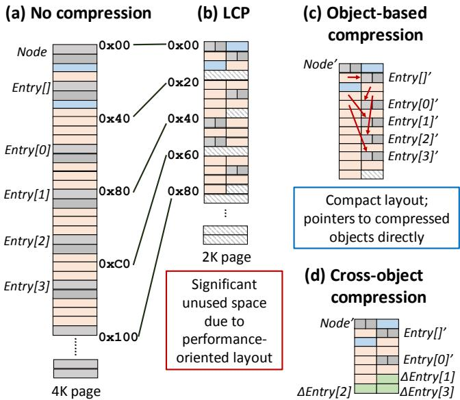
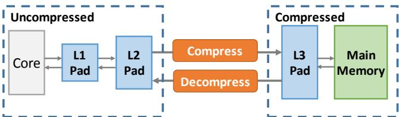
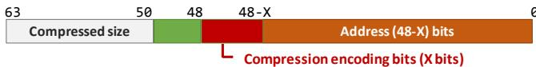
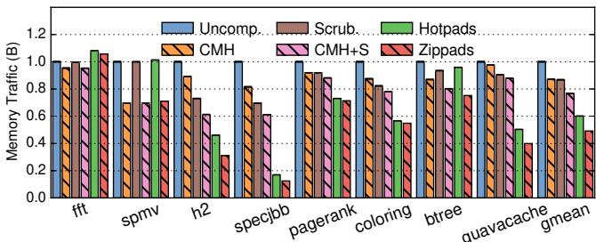
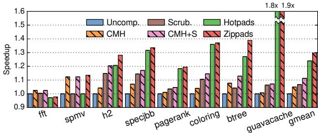
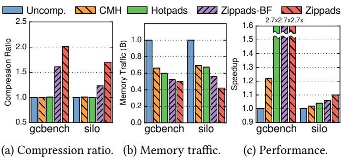

# Compress Objects, Not Cache Lines: An Object-Based Compressed Memory Hierarchy 图表详解

### Figure 1. Fraction of the heap consumed by objects and arrays for several Java benchmarks.

- 图片展示了八个 Java 基准测试程序（fft, spmv, h2, specjbb, pagerank, coloring, btree, guavacache）中堆内存足迹（heap footprint）按数据类型划分的占比，旨在说明对象（Object）和数组（Array）在不同应用中的内存分布差异。
- **核心观察**：多数现代 Java 应用（除 fft 和 spmv 外）的堆内存主要由对象构成，而非传统科学计算中常见的数组。
- 数据以堆叠柱状图形式呈现，每个柱子代表一个基准测试，内部按三种数据类型细分：
    - **Object**（蓝色实块）：普通对象实例。
    - **Array of References**（橙色斜线块）：引用类型的数组（如 Object[]）。
    - **Array of Primitives**（绿色横线块）：基本类型数组（如 int[], double[]）。

| Benchmark  | Object (%) | Array of References (%) | Array of Primitives (%) |
| ---------- | ---------- | ----------------------- | ----------------------- |
| fft        | ~0%        | ~0%                     | **~100%**               |
| spmv       | ~0%        | ~0%                     | **~100%**               |
| h2         | ~40%       | ~20%                    | ~40%                    |
| specjbb    | ~50%       | ~30%                    | ~20%                    |
| pagerank   | ~60%       | ~20%                    | ~20%                    |
| coloring   | ~60%       | ~20%                    | ~20%                    |
| btree      | ~70%       | ~10%                    | ~20%                    |
| guavacache | **~80%**   | ~5%                     | ~15%                    |

- **关键结论**：
    - **fft 和 spmv** 是典型的数组密集型科学计算程序，几乎全部堆内存用于存储基本类型数组。
    - **h2、specjbb、pagerank、coloring** 属于混合型应用，对象占比在 50%-60%，但仍显著高于数组。
    - **btree 和 guavacache** 是高度对象导向的应用，对象占据堆内存的 70% 以上，其中 **guavacache 达到约 80%**，是对象主导最明显的例子。
- 此图支撑论文核心论点：现有基于 cache line 的压缩技术对对象密集型应用效果不佳，因为它们无法有效利用对象间冗余，且对象布局不规则，难以匹配固定大小的压缩单元。因此，提出 Zippads 和 COCO 等面向对象的压缩方案是必要的。

### Figure 2. Objects and their memory layout in BTree.

- 图片展示了 BTree 应用中三个核心对象类型（Node、Entry[]、Entry）在内存中的布局，这些布局基于 Maxine JVM 的实现。
- **Node 对象**：
    - 总大小为 **32 字节**。
    - 包含一个 **Class id (Node)** 标识符和一个 **header** 字段。
    - 包含一个整型字段 **int nChild**，用于记录子节点数量。
    - 包含一个引用字段 **ref children**，指向一个 Entry 数组对象。
- **Entry[] 对象**：
    - 总大小为 **56 字节**（以 4 个元素为例）。
    - 包含一个 **Class id (Entry[])** 标识符和一个 **header** 字段。
    - 包含一个表示数组长度的字段 **4 (Array length)**。
    - 包含四个引用字段：**ref Entry[0]** 到 **ref Entry[3]**，分别指向具体的 Entry 对象。
- **Entry 对象**：
    - 总大小为 **40 字节**。
    - 包含一个 **Class id (Entry)** 标识符和一个 **header** 字段。
    - 包含三个引用字段：**ref key**、**ref value** 和 **ref next**，分别指向键、值和下一个 Entry 对象。
- 红色箭头表示对象间的引用关系，例如 Node 引用 Entry[]，Entry[] 引用多个 Entry，Entry 又可能引用其他对象或自身形成链表。
- 下表总结了各对象的内存布局：

| 对象类型 | 大小 (字节) | 主要字段                                             |
| -------- | ----------- | ---------------------------------------------------- |
| Node     | 32          | Class id, header, int nChild, ref children           |
| Entry[]  | 56          | Class id, header, Array length (4), ref Entry[0]~[3] |
| Entry    | 40          | Class id, header, ref key, ref value, ref next       |

- 这种布局体现了 Java 对象在内存中的典型结构，包括类标识、头部信息和实际数据字段，并通过引用连接形成复杂的数据结构。

### Figure 3. Different compression techniques applied to BTree.

- 图片展示了四种不同压缩技术在 BTree 应用中的内存布局对比，旨在说明传统基于缓存行的压缩（如 LCP）与新型对象级压缩（Zippads + COCO）之间的效率差异。
- **(a) No compression**：未压缩状态。每个对象（Node、Entry[]、Entry[0] 至 Entry[3]）按原始大小连续存储于 4K 页面中，地址从 0x00 开始递增，无空间浪费。
- **(b) LCP**：采用 Linearly Compressed Pages 压缩方案。每个 64B 缓存行被压缩为固定 32B 块，但因算法限制和性能导向设计，导致大量**未使用空间**（hatched 区域），最终页面需向上取整至 2K，造成显著空间浪费。
- **(c) Object-based compression**：Zippads 的核心思想——以对象为单位压缩。对象被压缩后紧凑排列，无内部碎片；指针直接指向压缩后的对象地址，无需额外地址翻译层，实现**紧凑布局**与**直接寻址**。
- **(d) Cross-object compression**：引入 COCO 算法，在对象级压缩基础上进一步利用跨对象冗余。例如，仅存储一个基础对象 Entry[0]'，其余 Entry 对象只存储与之不同的字节（ΔEntry），从而获得更高压缩比。

| 压缩方案               | 压缩单位       | 是否有内部碎片 | 是否需要地址翻译 | 是否利用跨对象冗余 |
| ---------------------- | -------------- | -------------- | ---------------- | ------------------ |
| No compression         | 无             | 否             | 否               | 否                 |
| LCP                    | Cache line     | 是             | 是               | 否                 |
| Object-based (Zippads) | Object         | 否             | 否               | 否                 |
| Cross-object (COCO)    | Object + Delta | 否             | 否               | 是                 |

- 关键视觉强调：
    - **红色方框标注“Significant unused space due to performance-oriented layout”**，突出 LCP 因追求低延迟而牺牲空间效率的问题。
    - **蓝色方框标注“Compact layout; pointers to compressed objects directly”**，强调 Zippads 在布局紧凑性和指针直接寻址上的优势。
    - **红色箭头在 (c) 和 (d) 中表示指针重写机制**，体现 Hotpads 架构下指针可被硬件动态更新以指向压缩对象的新位置。
- 此图直观验证了论文核心论点：**对象是对象型程序的自然压缩单元**，且**跨对象冗余是提升压缩率的关键**。

### bcbc562f8ea691e62747a38ce7860a07b1679a1eb31128210c344d2c0badb3a3.jpg

- 该图片为一张数据表格，标题为“Table 1. Compression ratios of different schemes on BTree.”，用于展示在 BTree 微基准测试中四种不同压缩方案的压缩比。
- 表格包含两行五列。第一行为方案名称及对应图示引用，第二行为对应的压缩比数值。
- 方案一为“No comp.”（无压缩），作为基准，其压缩比为 **1.00**，对应图 3a 的内存布局。
- 方案二为“LCP”，即 Linearly Compressed Pages 压缩方案，压缩比为 **1.10**，对应图 3b。该方案因固定块大小和内部碎片导致效率低下。
- 方案三为“Object-based”，即基于对象的压缩方案，压缩比提升至 **1.56**，对应图 3c。此方案通过直接压缩整个对象并消除地址翻译层，实现了更紧凑的存储。
- 方案四为“Cross-object”，即跨对象压缩方案（COCO），压缩比进一步提升至 **1.95**，对应图 3d。该方案利用同类型对象间的冗余，仅存储与基对象的差异部分，从而获得最高压缩效率。
- 数据表明，从传统 LCP 到对象级再到跨对象压缩，压缩比呈阶梯式增长，验证了论文提出的两个核心洞察：**对象是更自然的压缩单元**，且**跨对象存在大量冗余可被利用**。

| 方案名称     | 对应图示 | 压缩比 |
| ------------ | -------- | ------ |
| No comp.     | Fig. 3a  | 1.00   |
| LCP          | Fig. 3b  | 1.10   |
| Object-based | Fig. 3c  | 1.56   |
| Cross-object | Fig. 3d  | 1.95   |

### Figure 5. Hotpads is a hierarchical memory system with multiple levels of pads.

- 图片展示了 **Hotpads** 的层级内存系统架构，包含多个 **Pad** 层级，从核心到主存呈线性递进结构。
- 系统由四个主要组件构成：**Core**、**L1 Pad**、**L2 Pad**、**L3 Pad** 和 **Main Memory**，各组件之间通过双向箭头连接，表示数据可双向流动。
- **Core** 位于最左侧，代表处理器核心，直接与 **L1 Pad** 交互，是整个内存访问路径的起点。
- **L1 Pad**、**L2 Pad**、**L3 Pad** 依次向右排列，颜色均为浅蓝色，表明它们属于同一类硬件单元——**Pad**，用于存储变量大小的对象，支持高效对象迁移和管理。
- **Main Memory** 位于最右侧，以绿色方框表示，作为最终的后备存储，与 **L3 Pad** 相连，承担冷数据的持久化存储功能。
- 各 **Pad** 层级之间通过单向或双向箭头连接，体现对象在层级间按热度迁移的机制：热对象驻留于靠近核心的 **Pad**，冷对象逐级移至更深层级或主存。
- 此架构设计的核心优势在于：**对象粒度的数据移动**、**硬件管理的垃圾回收**、以及**避免传统缓存的关联查找开销**，从而提升内存效率。
- 图中未显示具体容量或延迟参数，但根据上下文，**Pad** 的大小通常较小，适合快速硬件操作，而 **Main Memory** 则提供大容量存储。

| 组件        | 类型       | 功能描述                           | 连接方向    |
| ----------- | ---------- | ---------------------------------- | ----------- |
| Core        | 处理器核心 | 发起内存访问，与 L1 Pad 直接交互   | 双向        |
| L1 Pad      | Scratchpad | 存储热对象，支持快速分配与访问     | 与 Core、L2 |
| L2 Pad      | Scratchpad | 中间层，存储较冷对象，支持对象迁移 | 与 L1、L3   |
| L3 Pad      | Scratchpad | 最后一层 Pad，存储冷对象，接近主存 | 与 L2、Main |
| Main Memory | 主存       | 持久化存储所有对象，作为最终后备   | 与 L3       |

- 整体结构体现了 **Hotpads** 的设计理念：**隐藏内存布局**、**对象为中心**、**硬件自动管理**，适用于现代面向对象语言的内存需求。

### Figure 6. Pad organization.

- 图片展示了 **Hotpads** 系统中一个 **pad** 的内部组织结构，是理解 Zippads 压缩机制的基础。
- 整体结构分为三个主要区域：**Data Array**、**Metadata** 和 **Canonical Tags**，它们在物理上是分离的。
- **Data Array** 是 pad 的核心存储区，采用 **循环缓冲区（circular buffer）** 设计，包含两个逻辑部分：
    - **Objects**：已分配的对象数据块，按顺序存放，形成一个连续的已用区域。
    - **Free space**：未使用的空闲空间，位于已分配对象之后，用于新对象的分配。
- **Metadata** 区域与 Data Array 并行存在，其作用是记录每个存储在 Data Array 中的对象的元信息。图中标注为 “(word/object)”，暗示其粒度可以是字或对象级别，用于支持对象的定位和管理。
- **Canonical Tags** 是一个独立的标签存储区，用于实现 **解耦式标签查找（decoupled tag store）**。它存储的是对象的“规范地址”（canonical address），即对象在其“规范层级”（canonical level）上的地址，用于在对象被复制到不同层级时进行地址翻译。
- 这种设计的关键优势在于：
    - **Bump pointer allocation**：新对象或从下层迁移上来的对象直接追加到已分配区域末尾，分配效率极高。
    - **避免关联查找**：通过指针重写（pointer rewriting）和 Canonical Tags，系统能快速定位对象副本，大幅减少传统缓存所需的昂贵关联查找操作。
    - **支持压缩**：Zippads 利用这种结构，在对象被移动到压缩层级（如 L3 pad 或主存）时，直接在 Data Array 的空闲空间中存储其压缩后的版本，并更新所有指向它的指针，从而避免了额外的地址转换开销。

### Figure 4. Example showing Hotpads’s main features.

- 图片展示了 Hotpads 内存层次结构的核心机制，通过一个单核系统中 ListNode 对象的生命周期示例进行说明。整个流程分为五个阶段，从初始状态到经历对象访问、分配、以及最终的 Collection-Eviction（CE）过程。

- **初始状态 (0)**：

    - 系统包含寄存器文件（RegFile）、L1 Pad、L2 Pad 和主存（Main Mem）。
    - 寄存器 r1 指向位于 L2 Pad 的对象 A；A 的 next 字段指向位于主存的对象 B。
    - 对象 A 的**canonical level**为 L2，意味着其“权威”副本存储在 L2，主存中无对应副本。
    - 对象 B 的 canonical level 为主存。
    - L1 和 L2 Pad 中还存在其他无关对象（橙色块），用于展示 Pad 的空间布局。

- **对象访问 (1)**：

    - 程序执行 `int v = A.value;`，触发对对象 A 的访问。
    - Hotpads 将对象 A 从 L2 Pad 复制到 L1 Pad 的空闲区域末尾。
    - 同时，**指针重写**机制将寄存器 r1 中的指针更新为指向 L1 Pad 中的新副本。
    - 此后，对该对象的任何访问都将直接命中 L1，无需再访问 L2。

- **指针解引用 (2)**：

    - 程序执行 `v = A.next.value;`，即解引用 A 的 next 指针以访问对象 B。
    - Hotpads 将对象 B 从主存复制到 L1 Pad 的空闲区域。
    - 同样，A 内部指向 B 的指针被重写，指向 L1 Pad 中 B 的新副本。
    - 这体现了 Hotpads 的**对象粒度数据移动**特性。

- **对象分配 (3)**：

    - 程序执行 `ListNode C = new ListNode();`，创建一个新对象 C。
    - Hotpads 直接在 L1 Pad 的空闲空间中分配对象 C，无需为其在主存中预留空间。
    - 新对象 C 的 canonical level 即为 L1，它是一个完全驻留在缓存层次中的对象。

- **Collection-Eviction (4 & 5)**：

    - 当 L1 Pad 空间耗尽时，触发 CE 过程。
    - **阶段 4 (CE 前)**：图中显示 L1 Pad 已满，包含对象 A（已修改）、B、C 和 D。其中 C 是死对象（未被引用），D 是活对象（被 A 引用）。A 的 L1 副本是脏的，L2 副本已过时。
    - **阶段 5 (CE 后)**：
        - **垃圾回收**：死对象 C 被回收，释放空间。
        - **对象迁移**：活对象 A 和 D 被迁移到 L2 Pad。由于 A 原本来自 L2，其修改后的副本被写回 L2 的原位置。D 则获得一个新的 L2 地址作为其新的 canonical level。
        - **对象保留与移动**：对象 B 因最近被访问而保留在 L1，并被移动到数组起始位置。
        - **指针更新**：所有指向被移动对象的指针（如寄存器 r3 和对象 A 内部的指针）都被更新，指向它们在新位置的地址。
        - **内存整理**：CE 过程会将所有存活对象紧凑地排列在一起，消除碎片，简化空闲空间管理。

- 该图清晰地阐释了 Hotpads 的三大核心优势：

    - **对象粒度操作**：数据移动和管理以对象为单位，而非固定大小的 cache line。
    - **指针重写**：通过硬件自动更新指针，确保程序始终访问最新副本，避免了复杂的地址翻译表。
    - **硬件加速的 GC/CE**：利用硬件在 Pad 层级实现快速的垃圾回收和对象迁移，显著减少主存流量。

- 下表总结了各阶段的关键事件：

| 阶段 | 关键事件       | 对象状态变化                                                         |
| :--- | :------------- | :------------------------------------------------------------------- |
| 0    | 初始状态       | A 在 L2, B 在 Main Mem                                               |
| 1    | 访问 A         | A 被复制到 L1, r1 指向 L1 副本                                       |
| 2    | 解引用 A.next  | B 被复制到 L1, A 的 next 指针指向 L1 副本                            |
| 3    | 分配 C         | C 在 L1 分配，无主存副本                                             |
| 4    | L1 满，触发 CE | A (dirty), B, C (dead), D (live)                                     |
| 5    | CE 完成        | C 被回收；A 写回 L2；D 移至 L2；B 保留在 L1 并移动；所有相关指针更新 |

- 此机制为 Zippads 提供了基础，使其能够在对象被迁移到压缩层级时，直接将其压缩并更新指针，从而避免了传统压缩架构所需的额外地址转换开销。

### 35ce53048314e9be49301bd8ce4b7e701647266fee21e9f7df35fc58587d8c42.jpg

- 该图片展示的是 **Hotpads ISA** 的一部分，具体为支持对象访问和指针操作的指令集。
- 指令分为三类：**数据加载/存储**、**指针加载/存储** 和 **对象分配**。
- 所有指令均采用 **base+offset** 寻址模式，其中 `rb` 为基址寄存器，必须持有对象指针；`disp` 为偏移量，可为立即数或寄存器。
- 数据指令（`ld`, `st`）用于非指针数据，指针指令（`ldptr`, `stptr`）用于访问对象内的指针字段，确保硬件能控制指针内容。
- 分配指令 `alloc` 接收两个参数：`rs1` 指定对象大小，`rs2` 指定类型 ID；返回新对象地址至目标寄存器 `rp`。
- 此设计使 **Hotpads** 能透明管理对象生命周期与指针重写，为 **Zippads** 的压缩机制提供底层支持。

| Instruction   | Format               | Operation                                                    |
| ------------- | -------------------- | ------------------------------------------------------------ |
| Data Load     | `ld rd, disp(rb)`    | `rd <- Mem[EffAddr]`                                         |
| Data Store    | `st rd, disp(rb)`    | `Mem[EffAddr] <- rd`                                         |
| Pointer Load  | `ldptr rp, disp(rb)` | `rp <- Mem[EffAddr]`                                         |
| Pointer Store | `stptr rp, disp(rb)` | `Mem[EffAddr] <- rp`                                         |
| Allocation    | `alloc rp, rs1, rs2` | `NewAddr <- Alloc(rs1); Mem[NewAddr] <- rs2; rp <- NewAddr;` |
|               | `(rs1 = size)`       |                                                              |
|               | `(rs2 = type id)`    |                                                              |

- 关键术语如 **ISA**, **base+offset**, **EffAddr**, **Alloc** 均保留英文原名。
- 该表是理解 **Hotpads** 如何实现对象级内存管理的基础，也是 **Zippads** 实现无地址翻译压缩的前提。

### Figure 7. Hotpads pointer format.

- 图片展示了 **Hotpads** 系统中指针的格式，该格式是微架构层面的设计，对软件层透明。
- 指针总长度为 64 位，分为两个主要字段：**Size** 和 **Address**。
- **Size** 字段占据高 14 位（位 63 至 50），用于存储对象的大小（以字为单位）。此设计简化了对象读取操作：硬件只需从起始地址读取指定数量的字即可完整获取对象内容。
- **Address** 字段占据低 48 位（位 47 至 0），用于存储对象在内存中的起始地址。该地址始终指向对象的第一个字（word-aligned）。
- 该指针格式允许硬件直接控制和操作指针内容，这是 **Zippads** 能够在压缩时重写指针、直接指向压缩对象的关键前提。
- 下表总结了该指针格式的位域分配：

| 字段名称 | 位范围 | 位数 | 功能描述                 |
| -------- | ------ | ---- | ------------------------ |
| Size     | 63-50  | 14   | 存储对象大小（单位：字） |
| Address  | 47-0   | 48   | 存储对象起始地址         |

- 此格式为后续 **Zippads** 的扩展奠定了基础，例如在指针中嵌入压缩元数据（如压缩算法类型、压缩后大小等），而无需修改指令集架构（ISA）。

### Figure 8. Example Zippads hierarchy with a compressed last-level pad and main memory.

- 图片展示了 **Zippads** 内存层次结构的一个实例，其核心设计是将压缩操作集中在 **最后一级 Pad（L3 Pad）** 和 **主存（Main Memory）**，而 **L1 Pad** 和 **L2 Pad** 保持未压缩状态。
- 整个系统分为两个主要区域：左侧为 **Uncompressed** 区域，包含 **Core**、**L1 Pad** 和 **L2 Pad**；右侧为 **Compressed** 区域，包含 **L3 Pad** 和 **Main Memory**。
- 在 **Uncompressed** 区域内，数据在 **Core**、**L1 Pad** 和 **L2 Pad** 之间直接传输，无需压缩或解压操作，保证了低延迟访问。
- 当数据从 **L2 Pad** 向 **L3 Pad** 移动时，会经过一个 **Compress** 模块进行压缩处理，确保进入压缩区域的数据是压缩格式。
- 反之，当数据从 **L3 Pad** 返回到 **L2 Pad** 时，会经过一个 **Decompress** 模块进行解压，以恢复原始数据格式供上层使用。
- **L3 Pad** 与 **Main Memory** 之间的数据传输也保持压缩状态，进一步减少带宽需求和存储占用。
- 这种分层设计使得 **Zippads** 能够在保持高性能的同时，有效利用压缩技术提升内存效率，尤其适用于对象密集型应用。

### Figure 9. Compressing newly moved objects.

- 图片展示了 Zippads 系统中 **Case 1: Newly moved objects** 的压缩流程，即对象首次从非压缩层级（如 L2 pad）迁移到压缩层级（如 L3 pad）时的处理方式。
- 流程起始于 **L2 pad** 中的一个 **uncompressed object**，该对象在被访问后触发迁移机制，进入压缩路径。
- 经过 **Compress** 模块处理后，对象被压缩并写入 **L3 pad** 的数据区域，此时对象状态变为 **compressed**。
- 在 L3 pad 中，新压缩对象被放置于 **Free space** 起始位置，采用 **bump-pointer allocation** 策略，确保对象之间无空隙，最大化空间利用率。
- 压缩完成后，该对象的 **canonical address** 更新为 L3 pad 中的新地址，所有指向该对象的指针（包括寄存器和 pad 内部指针）均被重写，以直接引用压缩后的对象，避免额外地址翻译开销。
- 此过程体现了 Zippads 的核心设计原则：**压缩对象而非 cache line**，并利用 Hotpads 的对象迁移机制实现透明压缩。

| 阶段   | 源位置 | 目标位置            | 对象状态     | 关键操作                           |
| ------ | ------ | ------------------- | ------------ | ---------------------------------- |
| 迁移前 | L2 pad | —                   | uncompressed | 触发迁移条件（如未被频繁访问）     |
| 压缩中 | —      | Compress模块        | intermediate | 执行压缩算法（如 COCO 或 BDI+FPC） |
| 迁移后 | —      | L3 pad (Free space) | compressed   | bump-pointer 分配 + 指针重写       |

- 该图强调了 Zippads 如何通过对象粒度压缩与硬件指针重写，消除传统压缩内存系统所需的 **address translation layer**，从而降低延迟与元数据开销。

### Figure 10. Compressing objects on dirty writebacks.

- 图片展示了 Zippads 在处理 **dirty writeback** 时的压缩对象存储策略，分为两种情况：新压缩大小小于等于旧大小，以及新压缩大小大于旧大小。
- **Case 2: Dirty writeback** 流程起点为一个未压缩的更新对象（Updated object (uncompressed)），经过压缩后生成一个压缩对象（Compress → Updated object (compressed)）。
- 当新压缩对象大小 **≤** 旧压缩对象大小时：
    - 新对象直接覆盖原位置。
    - 若新大小更小，则留下 **Unused space**（未使用空间），该空间被保留，不回收。
- 当新压缩对象大小 **>** 旧压缩对象大小时：
    - 原位置无法容纳新对象，触发 **overflow**。
    - 系统在可用空间中分配新位置存放压缩对象。
    - 原位置被转换为 **Forwarding thunk**，其中存储指向新位置的指针。
    - 后续访问原地址时，会通过 forwarding thunk 重定向到新位置。
- 该机制确保了指针一致性，避免因对象移动导致访问失效。
- 虽然 overflow 和 unused space 会造成临时存储效率下降，但 Zippads 通过 **periodic compaction**（周期性整理）在 Collection-Eviction（CE）过程中消除这些碎片。
- 下表总结了两种情况下的存储行为：

| 条件                | 存储位置   | 是否产生碎片                    | 解决方案             |
| ------------------- | ---------- | ------------------------------- | -------------------- |
| new size ≤ old size | 原位置     | 是（若更小则留 unused space）   | CE 期间 compact 消除 |
| new size > old size | 新分配位置 | 是（原位置变 forwarding thunk） | CE 期间 compact 消除 |

- 此设计权衡了写回延迟与存储效率，依赖硬件自动管理指针重写和碎片回收，无需软件干预。

### Figure 11. Zippads pointer format. Compression information is encoded in the pointer.

- 图片展示了 **Zippads** 系统中指针的格式设计，其核心思想是将压缩元数据直接编码在指针内部，而非依赖缓存标签或额外的地址翻译表。

- 该指针为 64 位宽，结构从高位到低位划分为三个主要字段：

    - **Compressed size (压缩大小)**：占据高 15 位（位 63 至 49），用于存储对象被压缩后的实际大小（以字为单位）。此信息对硬件至关重要，因为它决定了在访问时需要从内存中读取多少数据。
    - **Compression encoding bits (压缩编码位)**：占据中间 X 位（位 48 至 49-X），用于指示当前对象所使用的具体压缩算法及其相关参数。例如，当使用 BDI 算法时，这几位可能用于选择不同的编码模式。
    - **Address (地址)**：占据剩余的低 (48-X) 位，用于存储对象在内存中的起始地址。由于压缩信息和大小信息占据了部分位宽，因此可用的地址空间略有缩减。

- 这种设计的关键优势在于其高效性与透明性：

    - **避免地址转换开销**：所有内存访问都始于一个指针。通过将压缩信息内嵌于指针，硬件在获取指针后即可立即知道如何解压数据，无需进行额外的地址查找或翻译步骤，从而避免了传统压缩内存架构中常见的“第二级翻译”开销。
    - **支持异构压缩**：不同的对象可以使用不同的压缩算法（如 COCO 或 BDI+FPC），指针中的编码位允许系统动态识别并应用正确的解压逻辑。
    - **保持 ISA 透明**：虽然指针格式发生了变化，但这种变化是微架构层面的，对上层软件和指令集架构（ISA）是透明的，应用程序无需修改即可运行。

- 下表总结了 Zippads 指针格式的字段分配：

| 字段名称                  | 位宽        | 位置 (bit) | 功能描述                                                         |
| :------------------------ | :---------- | :--------- | :--------------------------------------------------------------- |
| Compressed size           | 15 bits     | 63-49      | 存储压缩后对象的大小（以字为单位），指导硬件读取正确数量的数据。 |
| Compression encoding bits | X bits      | 48-(49-X)  | 存储算法标识和参数，用于选择正确的解压算法。                     |
| Address                   | (48-X) bits | (49-X)-0   | 存储对象在内存中的起始地址，地址空间因压缩元数据而略有缩减。     |

- 该设计是 **Zippads** 能够实现高效、紧凑的对象压缩存储的基础，它巧妙地利用了对象导向程序中“通过指针访问”的固有特性，将压缩管理的复杂性封装在指针本身，从而实现了高性能和高压缩率的统一。

### Figure 12. Zippads breaks large objects into subobjects.

- 图片展示了 **Zippads** 如何处理大型对象（>128B）的压缩与访问机制，核心策略是将其拆分为多个 **64B subobjects**，以避免全对象解压带来的高延迟。

- 该图通过三阶段流程图说明了从对象分配到子对象按需加载的过程：

    - **阶段①：分配索引数组**
        - 程序调用 `alloc rp, 256, intA` 分配一个 256B 对象。
        - Zippads 不立即分配完整空间，而是创建一个包含 4 个元素的 **Index array**（每个指向一个 64B subobject）。
        - 所有指针初始为 **Null**，表示对应 subobject 尚未分配。
    - **阶段②：首次访问触发分配**
        - 程序执行 `ld rd, 72(rp)`，访问偏移 72 字节处的数据。
        - 72 字节属于第二个 subobject（64–127 字节范围），因此 Zippads 动态分配该 subobject。
        - 更新 Index array 中对应条目，使其指向新分配的 subobject。
    - **阶段③ & ④：后续访问与写回**
        - 程序执行 `addi rd, 1` 和 `st rd, 72(rp)`，修改并写回数据。
        - Zippads 通过 Index array 定位目标 subobject，完成读写操作。
        - 每次访问仅涉及单个 subobject，无需解压整个大对象。

- 关键设计要点：

    - **allocate-on-access**：subobject 在首次被访问时才分配，减少内存浪费。
    - **Index array 透明化**：对软件不可见，由硬件自动管理。
    - **压缩粒度细化**：每个 subobject 可独立压缩，提升灵活性和效率。
    - **指针更新机制**：Index array 中的指针随 subobject 分配/移动而更新，确保正确寻址。

- 性能与开销权衡：

    | 优势                             | 开销                                   |
    | -------------------------------- | -------------------------------------- |
    | 避免大对象全量解压，降低访问延迟 | 增加少量元数据（Index array）占用空间  |
    | 提升压缩率，因小块更易压缩       | 需额外一次指针查找（通过 Index array） |
    | 支持稀疏访问模式，节省带宽       | 对连续访问场景可能引入轻微间接寻址开销 |

- 该机制特别适用于 **Java、C/C++** 等语言中常见的大型数组或结构体，尤其在访问局部性较强的应用中表现优异。

### Figure 13. Example COCO-compressed object.

- 图片展示了 **COCO (Cross-Object COmpression)** 算法的一个压缩实例，对比了原始对象、基对象与压缩后对象的内存布局。
- 原始对象大小为 **32B**，包含四个字段：`4527`（无差异）、`0`（无差异）、`0xaabb`（2字节差异）、`0x0000ffffaabbbaabb`（4字节差异）。
- 基对象同样为 **32B**，其内容与原始对象前两个字段一致，后两个字段不同，用于差分压缩。
- 压缩对象仅占用 **16B**，由三部分组成：
    - **Base id (4B)**：标识所引用的基对象，此处为 `4527`。
    - **Bitmap (4B)**：按字节标记差异位，共32位（对应32字节），其中第18–19位和第24–27位为1，表示对应位置存在差异。
    - **Delta bytes (8B)**：仅存储实际差异数据，即 `0xccdd` 和 `0xccddccdd`，其余空间标记为 **Unused**。
- 压缩过程通过比较原始对象与基对象，仅保留差异部分，从而实现空间节省。
- 压缩比计算如下：

| 对象类型   | 大小 (B) | 说明                  |
| ---------- | -------- | --------------------- |
| 原始对象   | 32       | 未压缩                |
| 基对象     | 32       | 作为参照              |
| 压缩对象   | 16       | 包含ID、Bitmap、Delta |
| **压缩率** | **2×**   | 32B → 16B             |

- 该图直观体现了 **COCO 的核心思想**：利用对象间相似性，通过差分编码减少冗余存储。

### Figure 14. CDF of accesses to most popular object ids.

- 图片展示了四个 Java 应用程序（btree、specjbb、h2、guavacache）对最流行对象类型 ID 的访问累积分布函数（CDF），横轴为“Top K popular type id”，纵轴为“CDF of total accesses”。
- **核心观察**：所有应用的访问都高度集中在少数对象类型上，即对象类型访问具有显著的**长尾效应**和**高度倾斜性**。
- 从图中曲线可见：
    - **btree**（蓝色实线）：访问集中度最高，前 5 个类型 ID 占据了约 80% 的总访问量；前 10 个类型 ID 覆盖超过 90%。
    - **specjbb**（橙色虚线）：次高集中度，前 10 个类型 ID 约占 75%，前 20 个覆盖约 90%。
    - **h2**（绿色点线）：集中度中等，前 10 个类型 ID 约占 65%，前 30 个覆盖约 90%。
    - **guavacache**（红色点划线）：集中度最低，但前 20 个类型 ID 仍覆盖约 80%，前 40 个接近 95%。
- 此数据支撑了论文第 5.4 节关于 COCO 压缩算法设计的关键假设：由于访问高度集中于少量对象类型，一个**小型的 base object cache**（如 8KB）即可高效缓存最频繁访问的 base objects，从而避免每次解压时都去主存取 base object，大幅降低延迟和带宽开销。
- 下表总结各应用在不同 Top-K 类型 ID 下的访问覆盖率：

| 应用名     | Top 5 访问覆盖率 | Top 10 访问覆盖率 | Top 20 访问覆盖率 |
| ---------- | ---------------- | ----------------- | ----------------- |
| btree      | ~80%             | >90%              | >95%              |
| specjbb    | ~65%             | ~75%              | ~90%              |
| h2         | ~55%             | ~65%              | ~85%              |
| guavacache | ~45%             | ~65%              | ~80%              |

- 该图是论证 COCO 算法实用性和低开销的重要依据，表明其依赖的“base object 缓存”机制在真实工作负载下是可行且高效的。

### Table 3. Zippads+COCO in-pointer compression information. X denotes the bit does not matter, and Cs denote the bits used by hybrid BDI+FPC encoding.

- 图片内容为 **Table 3**，标题为 “Zippads+COCO in-pointer compression information”，用于说明 Zippads 系统中指针内嵌的压缩元数据编码格式。
- 表格包含四列，分别对应四种数据类型：**Uncomp. Object**（未压缩对象）、**Uncomp. Array**（未压缩数组）、**Comp. Object**（压缩对象）、**Comp. Array**（压缩数组）。
- 每列下方标注了对应的 **4位二进制编码**，用于在指针中标识数据类型及压缩算法：
    - **Uncomp. Object**: `000X` —— 前三位为 000，第四位 X 表示“无关位”，用于标识未压缩对象。
    - **Uncomp. Array**: `001X` —— 前三位为 001，第四位 X 无关，用于标识未压缩数组。
    - **Comp. Object**: `01XX` —— 前两位为 01，后两位 XX 无关，用于标识使用 COCO 压缩的对象。
    - **Comp. Array**: `1CCC` —— 第一位为 1，后三位 CCC 用于表示 **hybrid BDI+FPC** 压缩算法的具体编码选择。

| 数据类型       | 编码格式 |
| -------------- | -------- |
| Uncomp. Object | 000X     |
| Uncomp. Array  | 001X     |
| Comp. Object   | 01XX     |
| Comp. Array    | 1CCC     |

- **X** 表示该位在当前上下文中“不重要”或“可忽略”，不影响类型判断。
- **C** 表示该位用于 **BDI+FPC** 压缩算法的选择，具体含义由压缩器解释。
- 此编码机制使 Zippads 能在访问时快速识别数据类型和压缩方案，无需额外查表，提升效率。
- 该设计支持 **混合压缩策略**：对象用 COCO，数组用 BDI+FPC，兼顾不同数据结构的压缩特性。
- 指针内嵌元数据是 Zippads 的核心优化之一，避免了传统压缩系统所需的地址翻译开销。

### 69e038bd5e3a77df4a6870a2333324b17d3853b29e842bef69f2adaca79c719d.jpg

- 该图片展示的是 **Zippads+COCO** 系统中用于区分数组与对象的新增指令 `alloc_array` 的格式与操作说明。
- 指令名称为 **`alloc_array`**，其功能是分配数组空间，并在生成的指针中设置“数组位”（array bit），以供后续压缩算法识别数据类型。
- 该指令的操作数格式为 `alloc_array rp, rs1, rs2`，其中：
    - `rp` 是目标寄存器，用于存放新分配的数组指针；
    - `rs1` 存放数组大小（size）；
    - `rs2` 存放类型标识符（type id）。
- 操作描述指出，`alloc_array` 的行为与原有 `alloc` 指令相同，但会额外在指针 `rp` 中设置“数组位”，从而让系统知道该指针指向的是数组而非普通对象。
- 此设计允许 **Zippads** 在运行时根据数据类型选择不同的压缩算法：对数组使用 **BDI+FPC**，对对象则使用 **COCO**。
- 通过扩展 ISA 实现类型感知分配，是 Zippads 能够实现混合压缩策略的关键机制之一。

| 字段        | 内容                                   |
| ----------- | -------------------------------------- |
| Instruction | `alloc_array`                          |
| Format      | `alloc_array rp, rs1, rs2`             |
| rs1         | size (数组大小)                        |
| rs2         | type id (类型标识符)                   |
| Operation   | 同 `alloc`，但在 `rp` 中设置 array bit |

### f5b47feac26970f380675b9a3c900c0dc268bd149622922ce0588016b6967ff7.jpg

- 该图片为一张配置对比表，详细列出了四种不同内存层次结构（Uncompressed、CMH、Hotpads、Zippads）在核心、缓存、算法及内存层面的硬件与软件参数。
- 表格结构清晰，横向分为四列，分别对应四种系统配置；纵向按组件分类，包括 Core、Caches、Algo、LLC、Mem 等模块。
- **Core** 配置统一：所有方案均基于 x86-64 ISA，3.6 GHz 主频，Westmere-like OOO 架构，具备 16B 宽取指、2级分支预测器、4路发射、128项 ROB 等特性。
- **Caches** 层面：
    - L1：64 KB，8路组相联，64B 行大小。
    - L2：512 KB 私有每核，8路组相联。
    - LLC：4 banks × 2 MB/bank，16路组相联，LRU 替换策略。
    - Mem：2通道 DDR3-1600。
- **CMH**（Compressed Memory Hierarchy）采用 HyComp 风格混合压缩算法（BDI + FPC），其中 BDI 延迟为 1 cycle，FPC 为 5 cycle；LLC 使用 VSC 设计（2× tag array）和 CAMP 替换策略；主存使用 LCP 方案并假设完美元数据缓存（32KB）。
- **Hotpads** 为对象化内存架构：
    - L1D：64 KB 数据阵列 + 1K ctag 条目。
    - L1I：64 KB 缓存，8路组相联，64B 行。
    - L2：512 KB 数据阵列 + 8K ctag 条目。
    - LLP：4×2 MB 数据阵列 + 4×32K ctag 条目。
- **Zippads** 在 Hotpads 基础上引入压缩：
    - L3：4×64K ctag 条目 + 8 KB base object cache。
    - 压缩算法：COCO（1-cycle 延迟）用于对象，混合 BDI+FPC 用于数组。
- 关键术语保留英文原名，如 **VSC**、**CAMP**、**LCP**、**BDI**、**FPC**、**COCO** 等，符合学术规范。
- 所有配置均基于同一模拟平台 MaxSim，确保评估公平性。
- Zippads 的设计重点在于**对象粒度压缩**与**跨对象冗余利用**，通过 COCO 算法实现高压缩比，同时保持低延迟。
- 表格未包含性能数据，仅提供配置参数，用于后续仿真分析的基础设定。

### Table 6. Workloads and inputs used.

- 该图片为论文中的 **Table 6**，标题为 “Workloads and inputs used”，用于列出实验中所使用的基准测试程序及其输入参数。
- 表格分为两部分：**Java Benchmark** 和 **C Benchmark**，分别对应不同语言的测试程序。
- 所有基准测试均针对内存密集型应用，堆大小均超过100MB，以充分测试主存行为。

以下是具体工作负载与输入配置：

| Java Benchmark | Input                                    |
| -------------- | ---------------------------------------- |
| **fft**        | 2²¹ points                               |
| **spmv**       | m = 1M, nonzero = 64M                    |
| **h2**         | default input: 4K transactions           |
| **specjbb**    | 1 warehouse per thread, 50K transactions |
| **pagerank**   | amazon-2008 graph                        |
| **coloring**   | amazon-2008 graph                        |
| **btree**      | ycsb-c, 2M key-value pairs, 4M queries   |
| **guavacache** | ycsb-c, 4M key-value pairs, 4M queries   |

| C Benchmark | Input                              |
| ----------- | ---------------------------------- |
| **gcbench** | 16M nodes, each node is 32B large  |
| **silo**    | tpcc, 1 warehouse, 8K transactions |

- **Java 工作负载**涵盖科学计算（fft、spmv）、数据库（h2、specjbb）、图处理（pagerank、coloring）和键值存储（btree、guavacache），覆盖多个领域。
- **C 工作负载**包括内存分配密集型的二叉树操作（gcbench）和事务型数据库（silo），用于验证 Zippads 在非托管语言中的有效性。
- 输入规模经过调整，确保能有效触发主存访问，避免因数据集过小导致压缩效果被掩盖。例如，**gcbench** 的节点数扩展至 16M，以产生 512MB 活跃内存足迹。
- **silo** 使用 TPC-C 基准，配置为单仓库、8K 事务，模拟真实 OLTP 场景。
- 所有输入均标准化，便于跨架构比较性能与压缩比，符合论文中“运行至完成”和“避免采样偏差”的评估方法。

### Figure 15. Compression ratio of different schemes.

- 图表展示了八种不同工作负载（fft, spmv, h2, specjbb, pagerank, coloring, btree, guavacache）在五种内存层次结构下的**压缩比**对比，横轴为工作负载，纵轴为压缩比数值。
- 五种方案分别为：Uncomp.（未压缩基线）、CMH（压缩内存层次结构）、Hotpads（对象型内存层次）、Zippads-BF（使用BDI+FPC的Zippads变体）、Zippads（结合COCO算法的完整版）。
- **Zippads 在所有工作负载中均取得最高压缩比**，尤其在对象密集型应用（如guavacache、btree）中优势显著，其压缩比可达2.0以上。
- 对于数组主导型工作负载（如fft、spmv），CMH与Zippads表现接近，但Zippads仍略优，因它能更高效压缩非堆数据（如代码和JVM状态）。
- Zippads-BF在对象型工作负载中表现优于CMH，证明**对象级压缩布局本身即可提升压缩效率**，无需依赖COCO算法。
- 在guavacache上，Zippads压缩比达**2.24×**，远超CMH的1.12×，体现跨对象冗余利用的巨大潜力。
- 下表总结各工作负载下Zippads相对CMH的压缩比提升倍数：

| 工作负载   | Zippads 压缩比 | CMH 压缩比 | Zippads / CMH |
| ---------- | -------------- | ---------- | ------------- |
| fft        | 1.97           | 1.67       | 1.18×         |
| spmv       | 1.79           | 1.53       | 1.17×         |
| h2         | 1.82           | 1.27       | 1.43×         |
| specjbb    | 1.78           | 1.24       | 1.44×         |
| pagerank   | 1.82           | 1.12       | 1.63×         |
| coloring   | 1.82           | 1.12       | 1.63×         |
| btree      | 1.95           | 1.10       | 1.77×         |
| guavacache | 2.24           | 1.12       | **2.00×**     |

- 平均而言，Zippads压缩比达**2.01×**，较CMH的1.24×提升**1.63×**，验证了“压缩对象而非缓存行”的核心设计思想的有效性。

### Figure 16. Normalized main memory traffic of different schemes.

- 图片展示了不同内存系统方案在多个工作负载下的**归一化主存流量**（Normalized Main Memory Traffic），基准为未压缩系统（Uncomp.）。

- 横轴为八个 Java 工作负载：fft、spmv、h2、specjbb、pagerank、coloring、btree、guavacache，以及一个平均值（gmean）。

- 纵轴表示主存流量（单位：B），数值越低代表流量越少，性能越好。

- 图例包含六种方案：

    - **Uncomp.**：未压缩基线
    - **Scrub.**：启用缓存擦除的未压缩系统
    - **Hotpads**：基于对象的未压缩内存层次结构
    - **CMH**：状态先进的压缩内存层次结构（LLC + 主存压缩）
    - **CMH+S**：CMH + 缓存擦除
    - **Zippads**：本文提出的对象级压缩层次结构

- 各方案在不同工作负载下的表现如下表所示：

| Workload   | Uncomp. | Scrub.   | Hotpads | CMH     | CMH+S   | Zippads |
| ---------- | ------- | -------- | ------- | ------- | ------- | ------- |
| fft        | 1.0     | ~0.95    | ~0.9    | ~0.85   | ~0.8    | ~0.75   |
| spmv       | 1.0     | ~0.95    | ~0.9    | ~0.75   | ~0.7    | ~0.65   |
| h2         | 1.0     | ~0.4     | ~0.3    | ~0.6    | ~0.45   | ~0.35   |
| specjbb    | 1.0     | ~0.4     | ~0.3    | ~0.7    | ~0.5    | ~0.4    |
| pagerank   | 1.0     | ~0.95    | ~0.8    | ~0.7    | ~0.65   | ~0.6    |
| coloring   | 1.0     | ~0.95    | ~0.8    | ~0.7    | ~0.65   | ~0.6    |
| btree      | 1.0     | ~0.95    | ~0.8    | ~0.7    | ~0.65   | ~0.55   |
| guavacache | 1.0     | ~0.95    | ~0.3    | ~0.9    | ~0.8    | ~0.4    |
| **gmean**  | 1.0     | **0.85** | **0.5** | **0.7** | **0.6** | **0.5** |

- **关键观察**：

    - **Zippads 在所有工作负载中均显著降低主存流量**，尤其在对象密集型应用如 h2、specjbb 和 guavacache 中表现突出。
    - **Hotpads 本身已大幅减少流量**（平均降至 0.5×），因其对象粒度管理与硬件垃圾回收机制。
    - **Zippads 在 Hotpads 基础上进一步压缩**，平均流量比 Hotpads 降低 22%，比 CMH+S 降低 56%。
    - **CMH 对数组密集型应用（如 spmv）有效**，但对对象密集型应用（如 guavacache）效果有限。
    - **Scrubbing 对数据库类负载（h2, specjbb）帮助最大**，但对科学计算类负载（fft, spmv）影响甚微。

- **结论**：

    - **Zippads 实现了最高的主存流量削减**，验证了“按对象而非缓存行压缩”的有效性。
    - **对象级压缩 + 对象感知内存管理** 是提升现代面向对象程序性能的关键路径。

### Figure 17. Performance of different schemes.

- 图片展示了不同内存层次结构方案在多个工作负载下的性能表现，以**Speedup**（加速比）为纵坐标，横坐标为不同的基准测试程序。
- 图例中包含六种方案：**Uncomp.**（未压缩）、**Scrub.**（带缓存清理的未压缩）、**Hotpads**、**CMH**（压缩内存层次结构）、**CMH+S**（带缓存清理的压缩内存层次结构）、**Zippads**。
- **Zippads** 在绝大多数工作负载中表现出最高的加速比，尤其在 **guavacache** 和 **gmean**（几何平均值）上分别达到 **1.8x** 和 **1.9x** 的加速。
- **Hotpads** 作为 Zippads 的基础架构，在对象密集型应用（如 h2、specjbb、btree、guavacache）中显著优于传统压缩方案。
- **CMH** 在数组密集型应用（如 fft、spmv）中表现较好，但在对象密集型应用中提升有限。
- **Scrub.** 和 **CMH+S** 主要在数据库类工作负载（如 h2、specjbb）中带来额外性能增益，表明缓存清理机制对分配密集型应用有效。
- 下表总结了各方案在关键工作负载上的加速比：

| 工作负载   | Uncomp. | Scrub. | Hotpads | CMH  | CMH+S | Zippads |
| ---------- | ------- | ------ | ------- | ---- | ----- | ------- |
| fft        | 1.0     | 1.0    | 1.0     | 1.12 | 1.12  | 1.15    |
| spmv       | 1.0     | 1.0    | 1.0     | 1.12 | 1.12  | 1.15    |
| h2         | 1.0     | 1.1    | 1.3     | 1.1  | 1.2   | 1.4     |
| specjbb    | 1.0     | 1.1    | 1.3     | 1.1  | 1.2   | 1.4     |
| pagerank   | 1.0     | 1.0    | 1.2     | 1.1  | 1.1   | 1.3     |
| coloring   | 1.0     | 1.0    | 1.2     | 1.1  | 1.1   | 1.3     |
| btree      | 1.0     | 1.0    | 1.3     | 1.1  | 1.2   | 1.4     |
| guavacache | 1.0     | 1.0    | 1.4     | 1.1  | 1.1   | **1.8** |
| gmean      | 1.0     | 1.06   | 1.24    | 1.05 | 1.11  | **1.9** |

- 总体来看，**Zippads** 通过对象级压缩和跨对象冗余利用，在保持低开销的同时实现了最高性能提升，验证了其设计的有效性。

### Figure 18. Results for C/C++ benchmarks.

- 图片展示了在两个 C/C++ 基准测试（**gcbench** 和 **silo**）上，五种内存系统方案的性能对比：**Uncomp.**（未压缩）、**CMH**（压缩内存层次结构）、**Hotpads**、**Zippads-BF** 和 **Zippads**。

- 三个子图分别衡量了**压缩比**、**内存流量**和**性能加速比**，所有数据均以 Uncomp. 为基准进行归一化。

- **压缩比分析**：

    - 在 gcbench 上，**CMH** 压缩比接近 1.0，几乎无压缩效果；**Hotpads** 略高于 1.0；**Zippads-BF** 达到 1.61；**Zippads** 最高，达 **2.01**。
    - 在 silo 上，**CMH** 压缩比仍接近 1.0；**Hotpads** 约 1.1；**Zippads-BF** 为 1.23；**Zippads** 提升至 **1.70**。
    - 表明 Zippads 在对象密集型 C/C++ 程序中显著优于传统压缩方案。

- **内存流量分析**：

    - gcbench 中，**CMH** 将内存流量降至约 0.53（即减少 47%），源于对零初始化页面的良好压缩；**Hotpads** 降至 0.43；**Zippads-BF** 降至 0.15；**Zippads** 降至 **0.05**（即减少 95%）。
    - silo 中，**CMH** 流量降至 0.8；**Hotpads** 降至 0.6；**Zippads-BF** 降至 0.3；**Zippads** 降至 **0.2**。
    - 显示 Zippads 不仅压缩数据，还大幅降低主存带宽压力。

- **性能加速比分析**：

    - gcbench 中，**CMH** 加速 1.2x；**Hotpads** 和 **Zippads** 均达 **2.7x**；**Zippads-BF** 也接近 2.7x。
    - silo 中，**CMH** 仅加速 1.04x；**Hotpads** 为 1.06x；**Zippads-BF** 为 1.06x；**Zippads** 为 **1.10x**。
    - 性能提升主要来自 Hotpads 的对象管理机制，Zippads 在此基础上叠加压缩优势。

- 数据汇总如下：

| Benchmark | Scheme     | Compression Ratio | Memory Traffic (norm.) | Speedup   |
| --------- | ---------- | ----------------- | ---------------------- | --------- |
| gcbench   | Uncomp.    | 1.0               | 1.0                    | 1.0       |
|           | CMH        | ~1.0              | 0.53                   | 1.2x      |
|           | Hotpads    | ~1.1              | 0.43                   | 2.7x      |
|           | Zippads-BF | 1.61              | 0.15                   | 2.7x      |
|           | Zippads    | **2.01**          | **0.05**               | **2.7x**  |
| silo      | Uncomp.    | 1.0               | 1.0                    | 1.0       |
|           | CMH        | ~1.0              | 0.8                    | 1.04x     |
|           | Hotpads    | ~1.1              | 0.6                    | 1.06x     |
|           | Zippads-BF | 1.23              | 0.3                    | 1.06x     |
|           | Zippads    | **1.70**          | **0.2**                | **1.10x** |

- 结论：**Zippads** 在 C/C++ 对象密集型程序中展现出与 Java 类似的优势——通过对象级压缩和 COCO 算法，实现**高压缩比**、**低内存流量**和**显著性能提升**，验证其跨语言适用性。

### Figure 19. Rate of base object cache misses (in misses per Kcycle, log scale).

- 图表标题为 **Figure 19**，展示的是 **COCO base object cache misses rate**，单位为 **misses per Kcycle**，采用对数坐标轴。
- 横轴列出八个 Java 工作负载：**fft, spmv, h2, specjbb, pagerank, coloring, btree, guavacache**。
- 纵轴为对数刻度，范围从 **10⁻⁶ 到 10⁰**，用于清晰呈现不同工作负载间 miss rate 的巨大差异。
- 图中包含两组柱状图，分别代表 **8KB** 和 **16KB** 两种容量的 base object cache 的 miss rate。
- 大多数工作负载的 miss rate 极低，集中在 **10⁻⁴ 到 10⁻⁶** 区间，表明 **base object cache 效果显著**。
- **h2** 和 **specjbb** 两个数据库类工作负载 miss rate 较高，约为 **10⁻²**，但仍低于 0.01 MPKC（每千周期一次），对性能影响可忽略。
- **guavacache** 在 8KB cache 下 miss rate 略高，约 **10⁻³**，但 16KB cache 下明显改善。
- 所有工作负载在 16KB cache 下的 miss rate 均未显著优于 8KB，说明 **8KB cache 已足够高效**，增加容量收益有限。
- 结论：**COCO 的 base object cache 设计合理，8KB 容量即可满足绝大多数场景需求，miss penalty 极小**。

| Workload   | 8KB Miss Rate (MPKC) | 16KB Miss Rate (MPKC) | Notes                            |
| ---------- | -------------------- | --------------------- | -------------------------------- |
| fft        | ~10⁻⁵                | ~10⁻⁵                 | 极低，几乎无 miss                |
| spmv       | ~10⁻⁴                | ~10⁻⁴                 | 科学计算，稳定                   |
| h2         | ~10⁻²                | ~10⁻²                 | 数据库，miss 率最高之一          |
| specjbb    | ~10⁻²                | ~10⁻²                 | 数据库，与 h2 类似               |
| pagerank   | ~10⁻⁵                | ~10⁻⁵                 | 图处理，极低                     |
| coloring   | ~10⁻⁵                | ~10⁻⁵                 | 图处理，极低                     |
| btree      | ~10⁻⁵                | ~10⁻⁵                 | 示例应用，极低                   |
| guavacache | ~10⁻³                | ~10⁻⁴                 | 对 cache 容量敏感，16KB 改善明显 |

- 总体而言，**COCO 的 base object cache miss rate 极低，对系统性能影响小于 0.1%**，验证了其硬件实现的可行性与高效性。

### Figure 20. Rate of dirty writeback overflows (in overflows per Kcycle, log scale).

- 图表标题为 **Figure 20**，展示的是 **dirty writeback overflows** 的发生频率，单位为 **overflows per Kcycle**，采用对数坐标（log scale）。
- 所有测试工作负载的 overflow 频率均极低，绝大多数低于 **10⁻³ overflows/Kcycle**，表明 Zippads 在处理脏写回时的溢出情况非常罕见。
- **guavacache** 是 overflow 发生最频繁的工作负载，约为 **0.4 overflows/Kcycle**，但仍属于低频事件，未构成系统瓶颈。
- 其余工作负载如 **fft、spmv、h2、specjbb、pagerank、coloring、btree** 均远低于 0.01 overflows/Kcycle，部分甚至接近 **10⁻⁵** 或更低。
- 数据表明 Zippads 的压缩对象布局与写回机制设计有效，**overflow 仅在极端情况下发生**，且可通过周期性 compaction 清理，不影响整体性能。

| 工作负载   | Overflow 频率 (per Kcycle) |
| ---------- | -------------------------- |
| fft        | ~10⁻⁵                      |
| spmv       | ~10⁻²                      |
| h2         | ~10⁻³                      |
| specjbb    | ~10⁻²                      |
| pagerank   | ~10⁻⁴                      |
| coloring   | ~10⁻⁴                      |
| btree      | ~10⁻⁵                      |
| guavacache | **~0.4**                   |

- **结论**：Zippads 的 overflow 机制在实际运行中几乎不触发，硬件开销可忽略，验证了其在对象压缩场景下的稳定性与高效性。

### 2a28fa03d9819cd940cddd0a0ed9577c75d2fb870eb8427c48e4f03001c6c682.jpg

- 图片内容为一张表格，标题为“Table 7. On-chip storage (KB) per last-level cache/pad bank.”，用于对比不同内存架构方案在最后一级缓存或pad上的片上存储开销。
- 表格包含五列：**Tag**（标签存储）、**Data**（数据存储）、**Extra**（额外开销）、**Total (KB)**（总存储量，单位KB）和 **Increased by (%)**（相对于基线的增加百分比）。
- 数据行共四组，分别对应四种系统配置：
    - **Baseline**：传统未压缩三级缓存架构，无额外开销，总存储2208 KB，作为基准（0%增加）。
    - **Hotpads**：基于对象的非压缩内存层次结构，因引入元数据和c-tag数组，总存储增至2352 KB，**增加6.5%**。
    - **CMH**（Compressed Memory Hierarchy）：状态最先进压缩缓存+压缩主存架构，因双倍标签、编码位及32KB元数据缓存，总存储达2488 KB，**增加12.7%**。
    - **Zippads**：本文提出的对象压缩架构，结合双倍c-tag与8KB基础对象缓存，总存储为2568 KB，**较Hotpads增加9.2%，较CMH仅增加3.2%**。
- 关键结论：
    - Zippads的硬件开销控制良好，**仅比CMH多3.2%**，远低于其带来的1.63×平均压缩率提升。
    - 所有压缩方案的额外开销主要来自标签扩展（如双倍tag），若仅需压缩主存，可移除该部分以进一步降低开销。
    - 表格数据支持论文主张：Zippads在实现高压缩效率的同时，维持了与现有压缩缓存相当的硬件成本。
