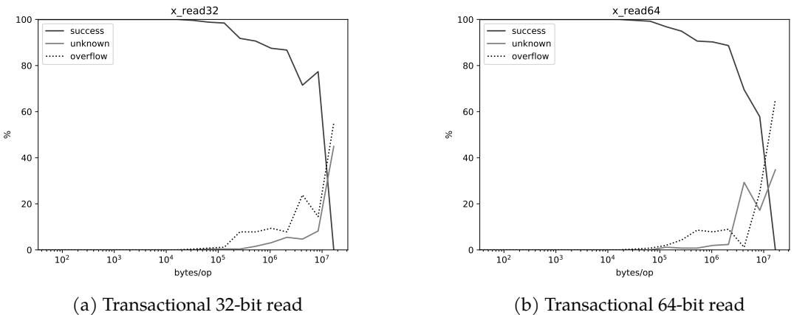

# Concurrent Copying Garbage Collection with Hardware Transactional Memory 通俗讲解

### 0. 整体创新点通俗解读

**痛点直击 (The "Why")**

- 传统的 **concurrent copying garbage collection (并发复制式垃圾回收)** 虽然能有效减少应用暂停时间（latency）并解决内存碎片问题，但它需要确保在回收器（collector）移动对象时，应用程序（mutator）看到的堆内存视图是一致的。
- 为了保证这种一致性，现有方案主要依赖两种机制：**read barriers (读屏障)** 或 **page protection (页面保护)**。
- 这两种机制的代价都非常高：
    - **Read barriers** 会在每次从堆中读取引用时插入额外的检查代码。由于读操作极其频繁，这会给 mutator 带来持续且显著的性能开销（论文提到可能高达10%），即使在没有进行 GC 的时候也无法轻易移除。
    - **Page protection** 则通过触发 page fault 来捕获对“陈旧”内存页的访问，其上下文切换和内核态处理的开销同样巨大。

**通俗比方 (The Analogy)**

- 想象一个图书馆（堆内存）正在进行图书（对象）搬迁。管理员（collector）要把一批书从A区搬到B区，并更新所有指向这些书的索引卡片（指针）。
- 传统方法就像是给每个读者（mutator）配一个监督员（read barrier），每当读者想看书时，监督员都要先检查这本书是不是已经搬走了，如果是，就带他去新位置。或者，直接把A区的门锁上（page protection），任何想进A区的人都会被保安拦下，然后由保安带他去B区找书。
- 这篇论文提出的思路是：与其给每个读者配监督员或锁门，不如让读者在进入图书馆前，先戴上一副特殊的“事务性眼镜”（HTM transaction）。在这副眼镜的视野里，图书馆要么完全是搬迁前的样子，要么完全是搬迁后的样子，绝不会出现一半在A区一半在B区的混乱状态。如果管理员恰好在他戴着眼镜时完成了搬迁，他的这次阅读尝试就会“作废”（transaction abort），他摘下眼镜重新看一眼公告牌（检查全局状态），再决定是否要重新戴上眼镜尝试。这样，大部分时间读者都是自由活动的，只有在极少数“撞车”时刻才需要重试。

**关键一招 (The "How")**

- 作者的核心洞察是利用 **Hardware Transactional Memory (HTM)** 的原子性和隔离性来替代昂贵的 read barrier。
- 具体来说，他们并没有让 mutator 永远运行在事务中，而是设计了一个精巧的协调协议：
    - **Collector 端**：当 collector 准备开始一个区域的复制工作时，它会先将一个**全局单调计数器**（`CollectorCopyingState`）设为奇数，然后通过 **yieldpoints** 通知所有 mutator 线程。
    - **Mutator 端**：Mutator 在 yieldpoint 处收到通知后，知道 collector 即将开始工作。此后，直到下一个 yieldpoint 之前，mutator 会将自己的执行包裹在一个 HTM 事务中。
    - **Gap Covering**：这个事务的关键在于，在事务提交前，它会再次检查那个全局计数器。如果发现计数器已经变成偶数（意味着 collector 已经完成了复制并提交了事务），那么当前 mutator 的事务就会**主动中止**（`XABORT`）。
    - 这个中止操作保证了：任何在 collector 完成复制之后、mutator 更新其栈上引用之前的“间隙期”（problematic gap）内发生的 mutator 执行都会被回滚。随后，mutator 会在下一个 yieldpoint 处安全地更新其栈上的陈旧引用。
- 因此，作者巧妙地将原本需要在**每一次读操作**上都付出的高昂成本，转化成了只在**GC活跃期间**、并且只在**极少数发生冲突的代码路径**上才需要付出的、一次性的事务启动和可能的重试成本。 *Table 4.1: Machines used in the evaluation.*

### 1. 基于HTM的并发复制垃圾回收算法

**痛点直击**

- 传统的 **并发复制垃圾回收 (Concurrent Copying GC)** 面临一个两难困境：既要让应用程序（**mutator**）和垃圾回收器（**collector**）同时运行以减少停顿，又要保证 **mutator** 在任何时候看到的堆内存都是**一致且正确**的。
- 为了实现这种一致性，现有方案主要依赖两种机制：
    - **读屏障 (Read Barriers)**：每次从堆中读取一个对象引用时，都要先检查该对象是否已被移动，并可能触发同步逻辑。这就像给每次内存读操作都加了一道安检门，**开销巨大且无法轻易关闭**。
    - **页保护 (Page Protection)**：通过操作系统将包含旧对象的内存页设为只读或不可访问，一旦 **mutator** 访问就会触发缺页中断，由中断处理程序来修复引用。这种方式涉及昂贵的**内核态/用户态切换**，同样带来很高的性能损耗。
- 这两种方法的核心问题在于，它们都是**持续性、侵入式**的开销，无论回收器是否正在工作，只要GC系统启动了，这些开销就一直存在。

**通俗比方**

- 想象一个图书馆（堆内存）正在进行图书（对象）搬迁。管理员（**collector**）要把A区的书搬到B区。
- 传统方法就像是在A区每个书架前都安排一个保安（**读屏障**），每当有读者（**mutator**）想拿书时，保安必须先确认这本书是不是已经搬走了，如果搬走了，还得告诉读者新位置。或者，直接把A区所有书架都锁起来（**页保护**），读者一碰就报警，然后管理员跑过来开锁并告知新位置。
- 而这篇论文提出的新方法更像是这样：管理员在开始大规模搬迁前，会广播一个通知。在此期间，任何进入图书馆的读者都会被要求戴上一个特殊的“**事务眼镜**”（**HTM**）。这个眼镜有一个神奇的功能：它能记录下读者在馆内所有的行动。如果在读者阅读期间，管理员恰好完成了某批书的搬迁并更新了目录，那么这位读者刚才所看到的一切（基于旧目录的）就会被瞬间“**回滚**”，他会被要求重新进入图书馆，这次就能看到最新的、正确的目录了。这个“眼镜”的成本只在佩戴和摘下时产生，而不是在每一次翻书时都产生。

**关键一招**

- 作者的核心洞察是：**不需要时刻监控 mutator 的每一次读操作，只需要确保在 collector 完成一次关键的“发布”动作（即提交对象移动和指针更新）时，没有任何 mutator 正在基于旧状态执行错误的逻辑。**
- 为了实现这一点，他们设计了一个精巧的协调协议：
    - **Collector 端**：使用 **HTM 事务**来原子地完成“复制对象 + 更新堆内所有相关指针”这一系列操作。事务提交的那一刻，就是“发布”新状态的时刻。
    - **Mutator 端**：引入一个全局的**单调递增计数器**（`CollectorCopyingState`）来标记回收阶段。当计数器为奇数时，表示 **collector** 即将或正在尝试进行事务性复制。
    - **Mutator 的执行被 yieldpoint 切分成小段**。在每一段开始前，**mutator** 会检查计数器。如果发现计数器是奇数，它就会**将自己的整段执行包裹在一个 HTM 事务中**。
    - **最关键的逻辑转换在于**：在事务结束提交前，**mutator** 会再次检查全局计数器。如果发现计数器已经变为偶数（意味着 **collector** 的事务已经成功提交），那么 **mutator** 的事务就会**主动中止 (XABORT)**。HTM 的硬件机制会自动回滚这段执行期间的所有副作用，确保错误的状态不会被提交。
- 这样，通过让 **mutator** 在潜在的危险窗口期**短暂地、批量地**在事务中执行，巧妙地利用了 **HTM** 的**原子性**和**回滚能力**，替代了细粒度、持续性的**读屏障**。开销从“**每次读都付费**”变成了“**每次执行片段开始时尝试开启事务，并在必要时回滚**”，在大多数情况下能显著降低平均开销。

 *Figure 5.1: Success rate curves on Haswell.*

### 2. Collector-Mutator协调协议

**痛点直击 (The "Why")**

- 传统的 **concurrent copying GC** 面临一个两难困境：要么用昂贵的 **read barrier**（每次读对象都要检查），要么用复杂的 **page protection**（触发页错误来修复指针）。这两种方法都会给 **mutator**（应用程序）带来持续且显著的性能开销。
- 核心难点在于 **“问题间隙” (Problematic Gap)**：当 **collector**（垃圾回收器）在后台把一个对象从 **fromspace** 复制到 **tospace** 并提交事务后，到 **mutator** 线程发现这个变化并更新自己栈上的旧指针之前，存在一个微小但致命的时间窗口。在这个窗口里，**mutator** 可能会使用栈上已经失效的 **fromspace** 指针，导致读取到错误数据或丢失写入。

**通俗比方 (The Analogy)**

- 想象你在和朋友玩一个“同步画画”的游戏。你（**collector**）负责把画布A上的画作原样搬到画布B上。你的朋友（**mutator**）则根据他脑子里记住的坐标（**stack reference**）在画布上作画。
- 以前的做法是：要么让你朋友每次下笔前都打电话问你“画搬完了吗？”（**read barrier**，很烦人）；要么直接把画布A盖起来，等他想用时再告诉他去画布B（**page protection**，有延迟）。
- 这篇论文的新思路是：你搬完画后，立刻按下一个**全局喇叭**（**CollectorCopyingState** 计数器）。你朋友每隔一小会儿（在 **yieldpoint**）就会抬头看一眼喇叭有没有响。如果响了，他就知道刚才那几笔可能画错地方了，于是立刻**擦掉重画**（**abort transaction**）。这样，他大部分时间都可以自由作画，只有在你搬画的关键时刻才需要额外检查。

**关键一招 (The "How")**

- 作者没有给 **mutator** 的每一次内存访问都加上检查，而是巧妙地利用了 \*\*Hardware Transactional Memory \*\*(HTM) 和 **yieldpoint** 机制，在 **collector** 和 **mutator** 之间建立了一个轻量级的协调协议。
- 具体来说，这个协议通过以下几步扭转了局面：
    - **引入一个全局信号**：使用一个单调递增的 **CollectorCopyingState** 计数器。**collector** 在开始和结束一次复制事务时，都会让计数器加1。因此，**奇数**表示“正在搬家”，**偶数**表示“刚刚搬完”。
    - **Mutator 主动握手**：**mutator** 只在 **yieldpoint**（如循环回边、函数返回等预设的安全点）检查这个计数器。如果发现自上次检查以来，计数器变成过**偶数**，就意味着它可能在“问题间隙”里执行过代码。
    - **用事务包裹执行**：当 **mutator** 发现 **CollectorCopyingState** 是奇数（即 **collector** 正在工作）时，它会将自己的下一段执行逻辑包裹在一个 **HTM transaction** 里。
    - **自动回滚错误**：如果在这段事务执行期间，**collector** 完成了搬家（计数器变为偶数），那么 **mutator** 事务在提交前会检查计数器。一旦发现计数器变了，就**主动 abort**。HTM 的硬件特性会自动回滚这段执行，确保任何基于旧指针的错误操作都被抹去。之后 **mutator** 会在下一个 **yieldpoint** 更新自己的栈指针，并重试。

 *Table 4.1: Machines used in the evaluation.*

### 3. 乐观复制优化 (Optimistic Copying)

**痛点直击 (The "Why")**

- 作者想用 **HTM (Hardware Transactional Memory)** 来做并发垃圾回收，核心想法是在一个事务里完成对象复制和所有指针更新，保证原子性。
- 但 **HTM 的写容量 (write capacity) 极其有限**（论文第五章实验证明，通常只有 **20-25KB** 左右），而直接在事务里复制对象会产生海量的写操作（把源对象每个字节都写到新位置）。
- 这导致一个很“难受”的局面：即使要复制的对象总大小没超过读容量，也因为**写操作太多**而频繁触发事务 **abort**，让整个方案变得不切实际。

**通俗比方 (The Analogy)**

- 想象你要把一个装满文件的保险柜（fromspace 对象）搬到另一个新保险柜（tospace 对象）。传统做法是，在一个上锁的房间里（事务内）完成所有搬运工作。但这个房间太小，你搬几份文件就满了（写缓冲区溢出），只能不断放弃重来。
- “乐观复制”就像这样：你先在房间外找一个临时桌子（**shadow region**），快速把旧保险柜里的文件原样摆一份在桌子上。然后，你只带着一张清单（比较逻辑）进那个小房间。在房间里，你只需要核对旧保险柜和桌子上的文件是否完全一致。如果一致，说明没人动过旧柜子，你的“搬运计划”是有效的，就可以安全地宣布新保险柜正式启用；如果不一致，说明有人在你准备期间修改了旧柜子，这次搬运作废，下次再来。
- 关键在于，**真正费力气的搬运工作（写操作）被挪到了房间外**，而房间里只做轻松的核对工作（读操作），从而完美适应了小房间（HTM）的空间限制。

**关键一招 (The "How")**

- 作者并没有在 HTM 事务内部执行昂贵的对象复制（`copy(object)`），而是巧妙地将流程拆解为事务内外两部分：
    - **事务外 (Optimistic Phase)**:
        - 将待移动的 fromspace 对象 **O** 完整地复制一份到一个临时的 **shadow region**，得到快照 **Os**。
        - 然后，用这个快照 **Os** 作为模板，在 tospace 中创建最终的目标对象 **O'**。
    - **事务内 (Validation Phase)**:
        - 不再进行任何实质性的数据复制（写操作）。
        - 只做一件事：**逐字节比较**原始对象 **O** 和它的快照 **Os**。
        - 如果 **O == Os**，证明在准备阶段没有发生并发修改，**O'** 是有效的，事务提交，发布 **O'**。
        - 如果 **O != Os**，证明有并发写入导致数据不一致，事务主动 **abort**，丢弃 **O'**，下次重试。
- 这一招的精髓在于，它把事务内的 **大量写操作**（复制 O 到 O'）成功转换成了 **大量读操作**（比较 O 和 Os）。由于 HTM 的 **读容量远大于写容量**（论文显示读容量可达数 MB），这极大地提高了事务的成功率，使整个并发 GC 方案变得可行。

### 4. 缓存预热优化 (Cache Warmup)

**痛点直击**

- 传统的 **HTM (Hardware Transactional Memory)** 事务在执行时，其成功与否严重依赖于底层 **CPU缓存**的状态。
- 问题在于 **伪LRU (pseudo-LRU)** 替换策略：即使一个事务访问的数据总量小于缓存容量，但如果这些数据在事务开始前不在缓存里，它们在被加载进来的同时，可能会因为替换算法的“不完美”而挤掉其他同样属于该事务的、刚刚被加载的数据。
- 这导致了一个非常难受的局面：一个本应能成功的 **大读取事务 (large read-only transaction)**，仅仅因为初始缓存是“冷”的（充满了无关数据），就在执行过程中因缓存行被错误地驱逐而触发了 **非必要的容量中止 (spurious capacity abort)**。这使得 HTM 的有效容量变得不可预测且远低于理论值。

**通俗比方**

- 想象你要在一个拥挤的图书馆（CPU缓存）里完成一项研究（HTM事务）。你的研究需要查阅100本书（数据），而图书馆恰好有100个空位。
- 但是，图书管理员（**伪LRU替换策略**）用的是一套不完美的记忆法。当你开始找第一本书时，它被放在了架子上。但当你去找第二本时，管理员可能错误地认为第一本“不重要”了，把它拿走给第二本腾位置。
- 结果就是，尽管图书馆物理空间足够，你却永远无法同时拥有所有100本书来完成研究，因为你总是在找新书的时候弄丢旧书。
- **缓存预热** 就像是在正式研究开始前，你先派一个助手快速地把这100本书都借一遍再还回去。这样，当管理员看到你正式开始研究时，这100本书已经在他的“近期借阅”名单顶部了，他就会尽力把它们都留在架子上供你使用。

**关键一招**

- 作者没有去修改复杂的 CPU 缓存硬件或替换策略（这显然不可能），而是巧妙地在软件层面增加了一个预备步骤。
- 具体来说，在真正启动那个关键的 **收集器事务 (collector transaction)** 之前，系统会**预先执行一遍该事务的主体代码逻辑**（特别是其中大量的内存比较操作），但会**主动丢弃这次执行的所有结果**。
- 这个“空跑”过程的唯一目的，就是让 CPU 的缓存子系统将事务即将频繁访问的所有内存地址（缓存行）都提前加载到高速缓存中，并通过多次访问让它们在 **伪LRU** 队列中获得很高的优先级。
- 通过这个简单的“**预演**”操作，当真正的事务开始时，它所依赖的数据已经“热”在缓存里了，从而极大地降低了因缓存抖动而导致的非必要中止，有效**放大了HTM的实际可用读取容量**。

 *Figure 5.10: Success rate curves on Coffee Lake when warming up caches.*

### 5. HTM容量特性分析

**痛点直击**

- 之前研究HTM（Hardware Transactional Memory）容量时，大家报告的数字五花八门，甚至互相矛盾。有的说读事务能到7.5MB，有的却说连L1缓存大小都撑不住。这让想用HTM做系统设计的人非常难受：我到底能指望它处理多大的原子操作？这种不确定性直接阻碍了HTM在像垃圾回收这类对事务大小有要求的场景中的应用。
- 根本原因在于，大家都忽略了**缓存状态**这个“隐藏变量”。HTM的底层实现严重依赖CPU缓存来追踪事务内的读写集，而缓存的行为（比如替换策略）会极大地影响一个事务能否成功提交。之前的实验方法不统一，有的重用内存，有的不用，导致结果无法横向比较，造成了文献中的混乱局面。

**通俗比方**

- 想象HTM事务就像一个需要在一张**有限大小的白板**上完成所有草稿计算的数学家。这张白板就是CPU缓存。
- **清空缓存**（Invalidation）就像是把白板彻底擦干净，给新计算腾出最大、最连续的空间。
- **预热缓存**（Warmup）则像是提前把需要用到的公式和数据抄到白板的固定位置上，确保计算时伸手就能拿到，不会因为临时去找而把其他重要内容挤掉。
- **重用内存区域**就像是反复在白板的同一块区域演算，虽然没特意准备，但因为内容相似，旧的草稿和新的计算能很好地共存，不容易超出白板范围。
- 之前的实验者，有的用的是干净白板，有的用的是乱糟糟的旧白板，自然得出的“最大计算量”就完全不同。这篇论文的贡献就是揭示了“白板的初始状态”才是关键，并给出了让白板发挥最大效用的方法。

**关键一招**

- 作者没有停留在复现矛盾数据上，而是设计了一套精巧的对照实验，系统地操控**缓存的初始状态**这个变量。
- 他通过三种方式验证了自己的猜想：
    - **重用内存**：让不同大小的事务测试都跑在同一块内存区域上。
    - **清空缓存**：在每次事务开始前，用`wbinvd`指令强制清空所有级别的缓存。
    - **预热缓存**：在事务开始前，先非事务性地多次访问即将在事务中读取的数据。
- 实验结果惊人地一致：这三种看似不同的操作，都能**显著提升大读事务的成功率**。这背后的核心逻辑是，它们都绕过了CPU缓存（特别是**pseudo-LRU**替换策略）的缺陷。在正常情况下，即使事务工作集小于缓存总容量，伪LRU算法也可能错误地驱逐掉事务刚访问过的缓存行，导致不必要的容量溢出（Capacity Abort）。而这三种方法要么提供了完全干净的空间，要么让所需数据牢牢占据缓存，从而避免了这种“假溢出”。
- 这个发现完美解释了文献中的矛盾：那些报告高容量的实验，很可能无意中采用了类似“重用内存”或“预热”的模式；而报告低容量的，则可能是在冷缓存或不利的内存访问模式下进行的。 *Figure 5.9: Success rate curves on Coffee Lake when invalidating caches.*
     *Figure 5.10: Success rate curves on Coffee Lake when warming up caches.*
