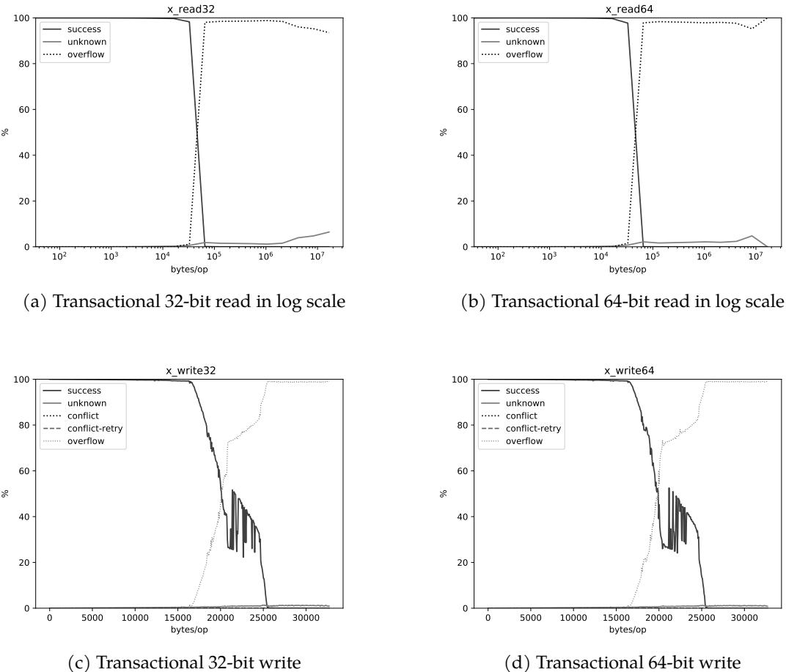
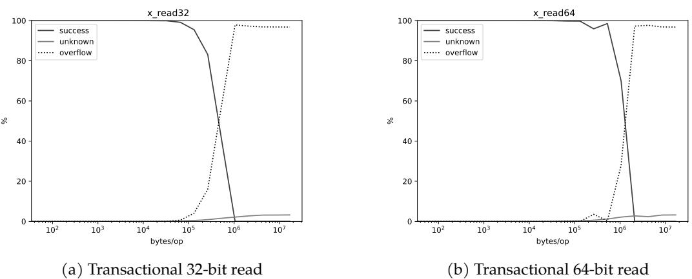
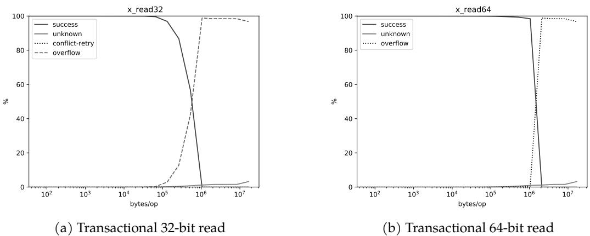
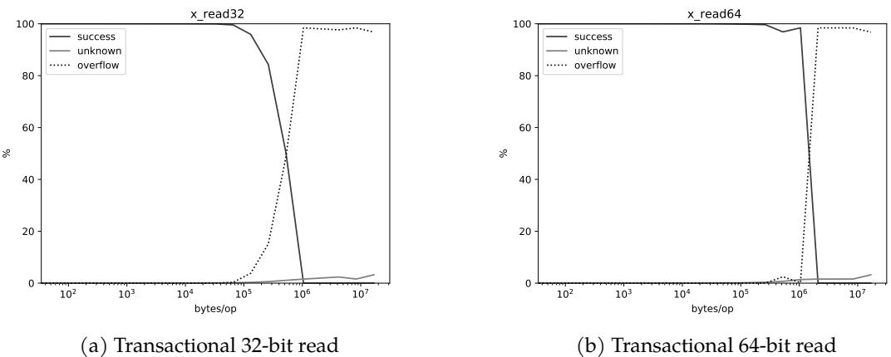

# Concurrent Copying Garbage Collection with Hardware Transactional Memory 图表详解

### Table 4.1: Machines used in the evaluation.

- 该图像为论文中 **Table 4.1**，标题为 “Machines used in the evaluation”，用于展示实验所用的四款不同微架构处理器的硬件规格。
- 表格横向列出四种架构：**Haswell**、**Broadwell**、**Skylake** 和 **Coffee Lake**，纵向则列出各项关键硬件参数。
- 所有测试机器均启用 **SMT**（Simultaneous Multithreading），但关闭了频率缩放功能，以确保实验环境的一致性。

| Architecture  | Haswell      | Broadwell   | Skylake       | Coffee Lake   |
| ------------- | ------------ | ----------- | ------------- | ------------- |
| Model         | Core i7-4770 | Xeon D-1540 | Core i7-6700K | Core i9-9900K |
| Technology    | 22nm         | 14nm        | 14nm          | 14nm          |
| Clock         | 3.4GHz       | 2.0GHz      | 4.0GHz        | 3.6GHz        |
| Cores × SMT   | 4 × 2        | 8 × 2       | 4 × 2         | 8 × 2         |
| L1 Data Cache | 32KB × 4     | 32KB × 8    | 32KB × 4      | 32KB × 8      |
| L2 Cache      | 256KB × 4    | 256KB × 8   | 256KB × 4     | 256KB × 8     |
| L3 Cache      | 8MB          | 12MB        | 8MB           | 16MB          |
| Memory Size   | 16GB         | 16GB        | 16GB          | 32GB          |
| Memory Type   | DDR3-1600    | DDR4-2133   | DDR3-1600     | DDR4-2133     |

- **Haswell** 与 **Skylake** 均采用 14nm 或 22nm 工艺，L3 缓存均为 8MB，内存为 16GB DDR3-1600，但 Skylake 主频更高（4.0GHz）。
- **Broadwell** 与 **Coffee Lake** 均为 14nm 工艺，支持更多核心（8核）和更大 L3 缓存（12MB / 16MB），内存升级至 DDR4-2133，其中 Coffee Lake 内存容量达 32GB。
- 此配置选择旨在覆盖不同代际的 Intel 处理器，以评估 **Intel TSX** 在不同硬件平台上的 HTM 容量表现。

### Figure 5.1: Success rate curves on Haswell.

- 该图（Figure 5.1）展示了在 **Haswell** 微架构上，不同类型的事务性内存操作的成功率随操作大小（bytes/op）变化的曲线，是论文第5章“Experiments and Results”的核心数据之一。
- 图中包含四个子图，分别对应四种不同的事务操作类型：
    - (a) Transactional 32-bit read
    - (b) Transactional 64-bit read
    - (c) Transactional 32-bit write
    - (d) Transactional 64-bit write
- 每个子图的纵轴为成功率百分比（%），横轴为每次操作访问的字节数（bytes/op）。图例统一包含四条曲线：**success**（成功）、**unknown**（未知原因失败）、**conflict-retry**（冲突重试）、**overflow**（容量溢出）。
- 关键观察结果如下：

| 子图 | 操作类型  | 成功率峰值位置 | 主要失败原因 | 最大成功操作大小 |
| :--- | :-------- | :------------- | :----------- | :--------------- |
| (a)  | x_read32  | ~16KB          | overflow     | ~22KB            |
| (b)  | x_read64  | ~16KB          | overflow     | ~25KB            |
| (c)  | x_write32 | ~16KB          | overflow     | ~20KB            |
| (d)  | x_write64 | ~16KB          | overflow     | ~25KB            |

- 所有四条 **success** 曲线均在约 **16KB** 处开始急剧下降，表明这是 Haswell 平台上 HTM 事务的一个关键容量阈值。
- 在所有情况下，**overflow** 曲线在成功率下降时同步上升，明确指出事务失败的主要原因是硬件事务缓冲区溢出，而非冲突或未知错误。
- 对于读操作，使用 **64-bit** 访问（图b）相比 **32-bit** 访问（图a）能支持略大的操作规模（~25KB vs ~22KB），这与论文中关于内存访问粒度影响有效容量的讨论一致。
- 写操作的容量限制（图c和图d）与读操作类似，但其成功率曲线的下降趋势更为陡峭，且最大成功操作大小普遍小于读操作，印证了论文中“写集容量远小于读集容量”的结论。
- 该实验结果与作者引用的 Ritson and Barnes [2013] 的研究高度吻合，验证了其实验平台和方法的有效性，为后续章节中基于 HTM 的 GC 算法设计提供了关键的容量基准。

### Figure 5.2: Success rate curves on Broadwell.

- 图片展示了在 Broadwell 微架构上，Intel TSX 的事务成功率曲线，用于评估其容量特性。图中包含六个子图，分别对应不同类型的内存操作（读/写）和数据宽度（32位/64位），并以线性或对数尺度呈现。
- 所有子图的纵轴均为成功率百分比（%），横轴为每次操作访问的字节数（bytes/op）。图例统一包含四条曲线：**success**（成功提交）、**unknown**（未知原因中止）、**conflict-retry**（冲突重试）和 **overflow**（缓冲区溢出）。
- 在线性尺度下，读操作（图 a, b）的成功率在约 20,000 bytes/op 处开始急剧下降，而写操作（图 e, f）则在约 15,000 bytes/op 处出现陡降。这表明 **写集容量远小于读集容量**，与文献中普遍观察到的现象一致。
- 对数尺度下的读操作图（图 c, d）揭示了更广阔的容量范围。在 10^4 bytes/op 附近，成功率从接近 100% 骤降至 0%，但随后在 10^5 至 10^7 bytes/op 区间内，成功率又回升至 80% 以上。这种非单调行为暗示了 HTM 内部存在复杂的缓存管理策略，例如 L3 缓存的二级跟踪结构。
- 64位操作（图 b, d, f）相比32位操作（图 a, c, e），在相同字节数下通常能维持更高的成功率，尤其是在大容量区域。这可能是因为64位操作访问的内存地址空间更稀疏，减少了缓存行冲突的概率。
- 写操作的失败模式与读操作显著不同。写操作的失败主要由 **overflow** 引起，且在容量上限处表现为尖锐的下降，几乎没有“重试”或“未知”错误。这印证了 Intel 文档中关于写集必须驻留在 L1 缓存中的设计，一旦超出即触发溢出。
- 下表总结了各子图的关键特征：

| 子图 | 操作类型 | 数据宽度 | 主要失败原因 | 容量拐点 (bytes/op) | 特殊现象                            |
| :--- | :------- | :------- | :----------- | :------------------ | :---------------------------------- |
| (a)  | 读       | 32-bit   | overflow     | ~20,000             | 线性尺度下平滑下降                  |
| (b)  | 读       | 64-bit   | overflow     | ~20,000             | 成功率略高于32位                    |
| (c)  | 读       | 32-bit   | overflow     | ~10,000             | 对数尺度下出现“U型”曲线             |
| (d)  | 读       | 64-bit   | overflow     | ~10,000             | “U型”曲线更明显，高容量区成功率更高 |
| (e)  | 写       | 32-bit   | overflow     | ~15,000             | 尖锐下降，无重试                    |
| (f)  | 写       | 64-bit   | overflow     | ~15,000             | 尖锐下降，无重试                    |

- 综合来看，该图清晰地描绘了 Broadwell 平台上 HTM 的容量边界，并揭示了其内部机制的复杂性，特别是读集容量受缓存状态影响巨大，而写集容量则严格受限于 L1 缓存大小。这些发现对于设计基于 HTM 的并发算法（如本论文中的 GC）至关重要。

### Figure 5.3: Success rate curves on Skylake.

- 图片展示了在 **Skylake** 微架构上，Intel TSX 的事务成功率曲线，分为四个子图，分别对应不同类型的内存操作。
- 子图 (a) 和 (b) 展示了 **Transactional 32-bit read** 和 **64-bit read** 在对数坐标下的表现。两者均显示，在约 10^4 bytes/op 时，成功率从接近 100% 急剧下降至 0%，表明读取容量在此处达到瓶颈。64-bit 读取的容量略高于 32-bit。
- 子图 (c) 和 (d) 展示了 **Transactional 32-bit write** 和 **64-bit write** 在线性坐标下的表现。两者均显示，在约 20,000 bytes/op 附近，成功率开始急剧下降，并在 25,000 bytes/op 左右降至 0%。这表明写入容量远小于读取容量，且 64-bit 写入的容量略低于 32-bit。
- 所有子图中，“success” 曲线代表事务成功提交的比例，“unknown”、“conflict”、“overflow” 等曲线代表不同的失败原因。在读取操作中，失败主要归因于 “overflow”；在写入操作中，失败主要归因于 “conflict” 和 “overflow”。
- 数据总结如下：

| 操作类型  | 成功率骤降点 (bytes/op) | 主要失败原因       |
| :-------- | :---------------------- | :----------------- |
| x_read32  | ~10,000                 | overflow           |
| x_read64  | ~10,000                 | overflow           |
| x_write32 | ~20,000                 | conflict, overflow |
| x_write64 | ~20,000                 | conflict, overflow |

- 该图验证了论文中的核心发现：**HTM 的写入容量远小于读取容量**，且写入容量受限于 L1 缓存大小，而读取容量则可能受更高级缓存或二级结构影响。

### Figure 5.4: Success rate curves on Coffee Lake.

- 图片展示了在 **Coffee Lake** 微架构上，使用 **Intel TSX** 进行事务性内存操作的 **成功率曲线**，分为读操作和写操作，以及 32 位和 64 位两种数据宽度。
- 图 (a) 和 (b) 分别显示了 **32 位** 和 **64 位** 事务性读操作的成功率。横轴为每操作字节数（bytes/op），采用对数刻度；纵轴为成功率百分比。两条曲线均在约 10^4 字节处开始急剧下降，在约 10^5 字节处降至接近 0%。这表明 **读操作容量** 在此平台约为 100KB。
- 图 (c) 和 (d) 分别显示了 **32 位** 和 **64 位** 事务性写操作的成功率。横轴为线性刻度，范围从 0 到 30,000 字节。两条曲线均在约 18,000 字节处开始急剧下降，并在约 20,000 字节处降至接近 0%。这表明 **写操作容量** 在此平台约为 20KB。
- 所有子图中，除了“success”（成功）曲线外，还包含“unknown”、“conflict”、“conflict-retry”和“overflow”等其他状态的曲线，用于说明事务失败的原因。其中，“overflow”曲线在读操作图中不明显，但在写操作图中于容量极限附近出现，表明写集溢出是主要失败原因。
- 对比 32 位和 64 位操作，**64 位读操作** 的成功率曲线在高容量区域略高于 32 位，表明其能支持稍大的读集。而 **写操作** 的容量则基本不受数据宽度影响。
- 综合来看，该图清晰地揭示了 **Coffee Lake** 平台上 **HTM** 的容量限制：**写集容量远小于读集容量**，且写集容量受硬件缓存大小（L1 数据缓存）严格限制。

| 操作类型 | 数据宽度 | 容量上限 (bytes) | 主要失败原因 |
| :------- | :------- | :--------------- | :----------- |
| 读操作   | 32-bit   | ~100,000         | 冲突/溢出    |
| 读操作   | 64-bit   | ~100,000         | 冲突/溢出    |
| 写操作   | 32-bit   | ~20,000          | 溢出         |
| 写操作   | 64-bit   | ~20,000          | 溢出         |

### Fig. 5.5, Fig. 5.6, Fig. 5.7, and Fig. 5.8 for Haswell, Broadwell, Skylake and Coffee Lake respectively. Figure 5.5: Success rate curves on Haswell when reusing memory.

- 图片展示了在 **Haswell** 微架构上，当**重复使用内存区域**时，事务性读操作的成功率曲线。该图是论文中 Figure 5.5 的一部分，用于对比不同内存访问模式对 HTM 容量的影响。
- 图表包含两个子图，分别对应 **32-bit 读取 (a)** 和 **64-bit 读取 (b)** 操作，横轴为每操作字节数（bytes/op），纵轴为成功率百分比（%）。
- 两个子图均包含三条曲线：
    - **success** (实线): 表示事务成功提交的百分比。
    - **unknown** (虚线): 表示因未知原因（如异步中断、特权指令等）导致的事务中止百分比。
    - **overflow** (点线): 表示因内部缓冲区溢出导致的事务中止百分比。
- 关键观察结果如下：

| 操作类型     | 成功提交峰值 | 成功提交骤降点   | 最大可提交事务大小 |
| :----------- | :----------- | :--------------- | :----------------- |
| **x_read32** | 接近 100%    | 约 10^6 bytes/op | 约 10^6 bytes/op   |
| **x_read64** | 接近 100%    | 约 10^6 bytes/op | 约 10^7 bytes/op   |

- 在 **x_read32** 情况下，事务成功率在约 10^5 bytes/op 时开始下降，并在 10^6 bytes/op 附近急剧降至 0%，此时 overflow 曲线急剧上升，表明容量限制是主要瓶颈。
- 在 **x_read64** 情况下，事务成功率同样在约 10^6 bytes/op 开始下降，但其最大可提交事务大小显著更大，达到约 10^7 bytes/op，这表明使用更大的数据单元进行读取可以有效提升 HTM 的读集容量。
- 与基线实验（使用独立内存区域）相比，**重复使用内存区域**显著提升了读事务的容量，这验证了作者关于缓存状态影响 HTM 容量的假设。缓存预热和重用使得相关数据更可能驻留在高速缓存中，从而减少了因缓存行驱逐导致的事务中止。

### Figure 5.6: Success rate curves on Broadwell when reusing memory.

- 图片展示了在 **Broadwell** 微架构上，当**重复使用内存区域**时，事务性读操作的成功率曲线。该图分为两个子图：(a) 32位读取和 (b) 64位读取。
- 两个子图的横轴均为 **bytes/op**（每操作字节数），采用对数刻度，范围从 10² 到 10⁷。纵轴为百分比（%），表示事务成功、未知或溢出的比例。
- 在图 (a) 中，**32位读取**：
    - **成功**（solid line）曲线在约 10⁵ bytes/op 之前保持接近 100%，随后急剧下降，在约 10⁶ bytes/op 处降至 0%。
    - **溢出**（dotted line）曲线在约 10⁵ bytes/op 开始上升，并在约 10⁶ bytes/op 达到峰值后迅速下降。
    - **未知**（dashed line）曲线在整个范围内始终接近 0%。
- 在图 (b) 中，**64位读取**：
    - **成功**（solid line）曲线在约 10⁵ bytes/op 之前保持接近 100%，随后急剧下降，在约 10⁶ bytes/op 处降至 0%。
    - **溢出**（dotted line）曲线在约 10⁵ bytes/op 开始上升，并在约 10⁶ bytes/op 达到峰值后迅速下降。
    - **未知**（dashed line）曲线在整个范围内始终接近 0%。
- 关键观察：**64位读取**的事务容量略高于**32位读取**，这与论文中提到的“当使用64位读取而非32位读取时，只读事务的容量在所有平台上都一致更大”的结论相符。
- 数据总结如下表：

| 操作类型    | 成功率开始下降点 (bytes/op) | 成功率降至0点 (bytes/op) | 溢出峰值点 (bytes/op) |
| ----------- | --------------------------- | ------------------------ | --------------------- |
| 32-bit read | ~10⁵                        | ~10⁶                     | ~10⁶                  |
| 64-bit read | ~10⁵                        | ~10⁶                     | ~10⁶                  |

- 此结果表明，**重复使用内存区域**可以显著提高事务容量，尤其是在只读事务中，这解释了先前文献中关于 HTM 容量报告不一致的原因。

### Figure 5.7: Success rate curves on Skylake when reusing memory.

- 图片展示了在 **Skylake** 微架构上，当**重用内存区域**时，事务性读操作的成功率曲线，具体分为 32 位读（图 a）和 64 位读（图 b）两种情况。
- 两幅子图的横坐标均为每操作字节数（bytes/op），采用对数刻度，范围从 10² 到 10⁷；纵坐标为百分比（%），表示不同事务结果的占比。
- 图例清晰地标明了四种事务结果：**success**（实线）、**unknown**（灰色实线）、**conflict-retry**（点线）和 **overflow**（虚线）。
- 在图 (a) 中，**32 位读事务**的成功率在约 10⁵ bytes/op 时开始急剧下降，并在约 10⁶ bytes/op 时降至接近 0。此时，**overflow**（虚线）的比例迅速上升至接近 100%，表明事务因容量溢出而失败是主要瓶颈。
- 在图 (b) 中，**64 位读事务**的成功率曲线与 32 位读类似，但其性能表现更优。成功率达到 100% 的阈值更高，且在约 10⁶ bytes/op 时才开始显著下降，最终也由 **overflow** 主导失败原因。
- 对比两图可发现，使用 64 位读操作相较于 32 位读操作，能支持更大规模的事务（即更高的 bytes/op 值）仍保持高成功率，这与正文第 5.2 节的结论一致，即“当事务使用 64 位读而非 32 位读时，只读事务的容量在所有平台上都一致更大”。
- 下表总结了关键数据点：

| 操作类型 | 成功率开始显著下降点 (bytes/op) | 主要失败原因 |
| :------- | :------------------------------ | :----------- |
| x_read32 | ~10⁵                            | overflow     |
| x_read64 | ~10⁶                            | overflow     |

- 此实验结果验证了作者的假设：重用内存区域可以提升只读事务的容量，因为事务间的交互影响了缓存内容，从而间接提升了 HTM 的有效容量。

### Figure 5.8: Success rate curves on Coffee Lake when reusing memory.

- 图片展示了在 **Coffee Lake** 微架构上，当**重复使用内存区域**时，事务性读操作的成功率曲线。该图分为两个子图：(a) 32位读取和 (b) 64位读取。
- 两个子图的横轴均为 **bytes/op**（每操作字节数），采用对数刻度，范围从 10² 到 10⁷；纵轴为成功率百分比（%），范围从 0 到 100。
- 图例包含三条曲线：
    - **success**（实线）：事务成功提交的比例。
    - **unknown**（虚线）：未知原因导致的事务状态比例。
    - **overflow**（点线）：因内部缓冲区溢出导致的事务中止比例。

| 子图 | 操作类型                  | 成功峰值位置 (bytes/op) | 成功率下降拐点 (bytes/op) | 最大可提交事务大小 (bytes/op) |
| ---- | ------------------------- | ----------------------- | ------------------------- | ----------------------------- |
| (a)  | Transactional 32-bit read | ~10⁶                    | ~10⁵                      | ~10⁶                          |
| (b)  | Transactional 64-bit read | >10⁶                    | ~10⁶                      | >10⁶                          |

- 在 **32位读取**（图 a）中，事务成功率在约 10⁶ bytes/op 处达到峰值，随后急剧下降，在约 10⁶.⁵ bytes/op 处降至接近 0。此时，**overflow** 曲线迅速上升，表明事务失败主要由缓冲区溢出引起。
- 在 **64位读取**（图 b）中，事务成功率在超过 10⁶ bytes/op 后仍保持高位，直到约 10⁶.⁵ bytes/op 才开始显著下降。这表明**64位读取能支持更大的事务容量**。
- 与基线实验相比，重复使用内存区域显著提升了事务容量，尤其是在64位读取场景下，最大可提交事务大小明显大于32位读取。
- 该结果验证了作者在第5.2节中的假设：重复访问同一内存区域有助于缓存预热，从而提升HTM事务的成功率和容量。

### Figure 5.9: Success rate curves on Coffee Lake when invalidating caches.

- 图片展示了在 **Coffee Lake** 平台上，当使用 **wbinvd** 指令 **无效化所有缓存** 后，事务性读取操作的成功率曲线。该图分为两个子图：(a) 32位读取和 (b) 64位读取。
- 两个子图的横轴均为 **bytes/op**（每操作字节数），采用对数刻度，范围从 10² 到 10⁷；纵轴为成功率百分比（%），范围从 0 到 100。
- 图例包含三条曲线：
    - **success**（实线）：事务成功提交的比例。
    - **unknown**（灰色实线）：未知原因导致的中止比例。
    - **overflow**（虚线）：因缓冲区溢出导致的中止比例。
- 在 **x_read32** 子图 (a) 中：
    - 成功率在约 10⁶ bytes/op 之前保持接近 100%，随后急剧下降，在约 1.5×10⁷ bytes/op 处降至 0。
    - **overflow** 曲线在约 10⁶ bytes/op 开始显著上升，并在约 1.5×10⁷ bytes/op 达到峰值后下降。
    - **unknown** 曲线在整个范围内都较低，仅在高负载时略有上升。
- 在 **x_read64** 子图 (b) 中：
    - 成功率同样在约 10⁶ bytes/op 前维持高位，之后快速下降，在约 1.8×10⁷ bytes/op 处归零。
    - **overflow** 曲线在约 10⁶ bytes/op 后开始上升，其峰值位置比 32位读取更靠右，表明 **64位读取能支持更大的事务容量**。
    - **unknown** 曲线表现与 (a) 类似，始终处于低位。
- 关键观察：
    - **缓存无效化后，事务容量显著提升**，最大成功事务大小远超基线实验（见图 5.4），甚至接近文献报道的最大值。
    - **64位读取的事务容量大于32位读取**，这与第5.2节中“重用内存区域”实验的结论一致，说明数据宽度影响有效容量。
    - **overflow 是主要失败原因**，尤其在大事务时，表明 HTM 的硬件缓冲区是容量瓶颈。
- 数据对比表：

| 参数             | x_read32 (32-bit) | x_read64 (64-bit) |
| ---------------- | ----------------- | ----------------- |
| 最大成功事务大小 | ~1.5×10⁷ bytes/op | ~1.8×10⁷ bytes/op |
| 成功率开始下降点 | ~10⁶ bytes/op     | ~10⁶ bytes/op     |
| 主要失败类型     | overflow          | overflow          |

- 结论：**缓存无效化通过避免伪LRU替换策略导致的过早驱逐，提升了事务容量**，验证了作者关于缓存状态影响 HTM 容量的假设。同时，64位操作因访问密度更低，能容纳更大规模的事务。

### Figure 5.10: Success rate curves on Coffee Lake when warming up caches.

- 图片展示了在 **Coffee Lake** 微架构上，当执行 **缓存预热（cache warmup）** 操作时，**事务性读取（transactional read）** 的成功率曲线。
- 该图包含两个子图，分别对应 **32位读取（x_read32）** 和 **64位读取（x_read64）** 两种内存访问模式。
- 两幅图的横坐标均为 **bytes/op**（每操作字节数），采用对数刻度，范围从 10² 到 10⁷；纵坐标为 **成功率百分比（%）**，范围从 0 到 100。
- 图例中包含三条曲线：
    - **success**：实线，表示事务成功提交的比例。
    - **unknown**：灰色填充区域，表示因系统中断等原因导致结果未知的事务比例。
    - **overflow**：虚线，表示因硬件资源溢出（如缓冲区满）导致事务中止的比例。

| 子图         | 事务类型 | 成功曲线特征                                                                                                          | 溢出曲线特征                                                               | 关键观察                                                            |
| :----------- | :------- | :-------------------------------------------------------------------------------------------------------------------- | :------------------------------------------------------------------------- | :------------------------------------------------------------------ |
| (a) x_read32 | 32位读取 | 在约 10⁶ bytes/op 处开始显著下降，在 10⁷ bytes/op 附近降至 0。                                                        | 在 10⁶ bytes/op 后急剧上升，与成功曲线呈镜像关系。                         | 最大成功事务规模约为 10⁷ bytes/op。                                 |
| (b) x_read64 | 64位读取 | 在约 10⁵ bytes/op 处开始下降，但在 10⁶ bytes/op 附近出现一个局部峰值（约85%），随后继续下降至 10⁷ bytes/op 附近归零。 | 在 10⁵ bytes/op 后开始上升，中间有波动，最终在 10⁷ bytes/op 附近达到峰值。 | 64位读取在中等规模（~10⁶ bytes/op）时表现优于32位，但最大容量相近。 |

- **关键结论**：在缓存预热条件下，**64位读取**在中等规模事务（约 10⁶ bytes/op）时表现出更高的成功率，这可能与缓存行利用率或硬件内部优化有关。然而，两种模式的最大可提交事务规模均接近 **10⁷ bytes/op**，表明缓存预热能有效提升 HTM 容量，使其接近文献中报道的最大值。
- 此结果支持了作者在第5.3节提出的假设：**伪LRU（pseudo-LRU）** 替换策略下，预热缓存可以避免因替换算法导致的有效容量损失，从而提高大事务的成功率。
