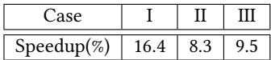
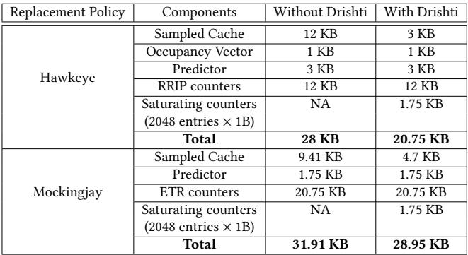

# Drishti: Do Not Forget Slicing While Designing Last-Level Cache Replacement Policies for Many-Core Systems 通俗讲解

### 0. 整体创新点通俗解读

**痛点直击**

现代高性能CPU的Last-Level Cache (LLC) 早已不是一块“整”的存储，而是被切分成多个物理上分离的 **slices**（切片），每个核心访问不同切片的延迟还不一样（NUCA）。当前最顶尖的LLC替换策略，比如 **Hawkeye** 和 **Mockingjay**，它们的设计和评估都基于一个过时的假设：LLC是**单体**（monolithic）的。当这些策略被直接搬到真实的多核切片LLC上时，会遇到两个致命的“水土不服”问题：

- **“管中窥豹”的预测器**：在单体LLC里，一个全局的reuse predictor能看到所有相关的内存访问。但在切片LLC里，每个切片都有自己的局部预测器。同一个程序计数器（PC）触发的内存请求会被哈希分散到不同切片，导致每个切片的预测器只能看到一部分、不完整的访问历史。这种**myopic**（目光短浅）的训练数据让预测器学不到全局的重用模式，决策自然就变差了。
- **“闲忙不均”的采样缓存**：这些策略依赖一个叫 **sampled cache** 的小结构，它只监控LLC中随机挑选的少数几个sets的行为，并以此来指导整个LLC的替换决策。但在切片LLC中，由于工作负载的访问模式不均匀，有些被选中的sets可能几乎收不到任何LLC miss（即没什么可学的），而另一些sets则非常繁忙。这导致采样缓存的效率低下，宝贵的决策信息被浪费了。

**通俗比方**

想象一下管理一个大型连锁超市（LLC）。

- **旧方法的问题**：以前总部（单体LLC）有一个全能的商品经理（全局预测器），他能看到所有分店（sets）的销售数据，知道哪些商品畅销（cache-friendly），哪些滞销（cache-averse）。但现在公司扩张了，变成了几十家独立运营的分店（切片LLC），每家店都有自己的小经理（局部预测器）。问题是，顾客（内存请求）是根据住址（地址哈希）被随机分配到不同分店的。结果，卖牛奶的畅销品信息被分散在A、B、C三家店里，每家店的小经理都只看到自己店里零星的几笔牛奶交易，误以为牛奶不好卖，于是决定下架。这就是“管中窥豹”。
- **Drishti的解决方案**：Drishti的做法很聪明。它没有强行把所有销售数据都汇总到一个超级总部（那样通信开销太大），而是给**每个采购员**（core）。这个采购员虽然驻扎在某一家分店（靠近某个slice），但他负责跟踪自己经手的所有商品（该core发出的所有请求）在全国各家分店的销售情况。同时，Drishti还改变了采样规则：它不再随机抽查分店，而是专门去那些**人流量最大、交易最频繁**（高MPKA）的分店收集数据，确保拿到的都是最有价值的信息。

**关键一招**

Drishti并没有发明一种全新的替换算法，而是对现有顶级策略（如Hawkeye, Mockingjay）与切片LLC的交互方式做了两处精妙的“外科手术式”改造：

- **改造预测器架构**：作者将原来的“**每切片一个局部预测器**”模式，扭转为“**每核心一个全局预测器**”。具体来说：

    - 每个核心拥有一个专属的reuse predictor。
    - 这个预测器虽然是物理上靠近某个LLC slice放置的，但它能接收来自**所有LLC slices**的训练信号。因为一个core发出的请求会散落到各个slice，所以每个slice在处理完属于该core的请求后，会通过一个专用的低延迟互连（**NOCSTAR**）将训练信息（如重用距离）发送给对应core的预测器。
    - 这样，预测器就能获得关于该core行为的完整、全局视图，彻底解决了myopic问题。

- **改造采样缓存机制**：作者抛弃了“**随机选择采样sets**”的传统做法，引入了“**动态采样缓存**”（Dynamic Sampled Cache）：

    - 在每个LLC slice内部，Drishti会用一组**饱和计数器**来监控每个set的miss频率（即MPKA）。
    - 它会周期性地挑选出那些**miss最多**（高容量需求）的sets作为新的采样对象。
    - 这确保了sampled cache总是聚焦在最活跃、信息量最大的区域，极大提升了训练数据的质量和预测器的准确性。

*Figure 9: Drishti's enhancement: Tracking reuse behavior and training the per-core and yet global reuse predictor with local (per-slice) sampled caches.*

最终效果非常显著：在32核系统上，Drishti将Mockingjay的性能提升从6.7%一举推高到**13.2%**，并且还节省了硬件存储开销。这证明了在设计缓存策略时，充分考虑底层硬件的物理布局（如切片）是多么重要。

### 1. Per-Core Yet Global Reuse Predictor (ELI5)

**痛点直击**

- 在现代 **many-core** 处理器中，**Last-Level Cache (LLC)** 通常被切分成多个物理上分离的 **slice**，并通过 **interconnect** 连接。一个核心发出的内存请求，会根据其地址哈希到某个特定的 slice 上。
- 现有的先进替换策略（如 **Hawkeye**, **Mockingjay**）依赖于 **reuse predictor** 来判断一个缓存行未来是否会被重用。在 sliced LLC 架构下，如果每个 slice 都维护自己独立的预测器（即 **per-slice local predictor**），就会产生一个致命问题：**myopic behavior (短视行为)**。
- 具体来说，同一个程序计数器 (**PC**) 发出的不同内存请求，会因为地址不同而被散列到**不同的 LLC slice** 上。结果就是，没有任何一个 slice 的本地预测器能看到这个 PC 的**完整访问历史**。每个预测器只看到了“管中窥豹”的一部分数据，导致其训练出的模型严重失真，做出的预测自然也就差强人意。核心越多，地址散列越分散，这个问题就越严重。

**通俗比方**

- 想象你是一个侦探（**reuse predictor**），任务是根据一个人（**PC**）过去的消费记录（**memory accesses**）来预测他未来的消费习惯（**reuse behavior**）。
- 在旧方案里，你的团队被分成了很多个小组（**per-slice predictors**），每个小组只负责监视这个人去某一家特定商店（**LLC slice**）的消费记录。
- 结果，A组看到他在书店买了书，B组看到他在超市买了菜，C组看到他在加油站加了油……但没有任何一个小组知道这些消费其实是同一个人干的！他们各自基于片面的信息，得出了完全错误的结论，比如A组认为他是个书呆子，从不花钱吃饭。
- **Drishti** 的做法是，给每个人（**PC**）指定一个专属的、全局视角的侦探（**per-core global predictor**）。无论这个人去哪家商店消费，所有商店的监控录像（**access information**）都会实时汇总给这个专属侦探。这样，侦探就能掌握他的完整画像，做出精准预测。

**关键一招**

- 作者并没有采用一个笨重的、所有核心共享的**centralized global predictor**（这会造成严重的 interconnect 带宽瓶颈），而是设计了一个精巧的折中方案：**Per-Core Yet Global Reuse Predictor**。
- **具体操作**：
    - 为系统中的**每一个核心 (core)** 分配一个独立的 reuse predictor。
    - 这个 predictor 虽然“属于”某个核心，但它在逻辑上是“全局”的——**所有 LLC slices** 都可以访问它。
    - 当任何一个 slice 处理来自核心 X 的内存请求时，它会使用 `(PC, Core_X_ID)` 作为索引，去更新或查询**核心 X 专属的那个 predictor**。
- 这个设计的精妙之处在于：
    - **解决了短视问题**：核心 X 的所有内存访问，无论散落到哪个 slice，最终都会汇总到它自己的 predictor 那里，从而获得了完整的全局视图。
    - **控制了通信开销**：相比于一个所有核心争抢的中心化预测器，这种 per-core 的设计将通信流量分散了。每个 slice 只需要和与之相关的那几个核心的 predictor 通信，大大降低了对 interconnect 的压力。
    - **配合专用互连**：为了进一步降低 slice 访问 remote predictor 的延迟，论文还引入了名为 **NOCSTAR** 的低延迟专用互连，将通信延迟从平均20周期骤降到3周期，使得这个全局预测器的设计在性能上变得可行。

*Figure 9: Drishti's enhancement: Tracking reuse behavior and training the per-core and yet global reuse predictor with local (per-slice) sampled caches.*

### 2. Local Per-Slice Sampled Cache (ELI5)

**痛点直击**

- 在现代 **many-core** 处理器中，**Last-Level Cache (LLC)** 通常被物理切分成多个 **slice**，每个 slice 靠近一部分核心，并通过 **interconnect** 连接。这种设计带来了 **Non-Uniform Cache Access (NUCA)** 的特性。
- 传统的高性能 **LLC replacement policy**（如 Hawkeye, Mockingjay）依赖一个 **sampled cache** 来监控一小部分缓存集合的访问行为，并用它来训练一个 **reuse predictor**（通常基于 **PC**）。
- 当这些策略直接应用到 **sliced LLC** 上时，一个朴素的做法是为每个 slice 都配一套独立的 sampled cache 和 predictor。这导致了严重的 **myopic behavior（短视行为）**：
    - 同一个程序计数器 **PC** 触发的内存访问，会因为地址哈希而散落到不同的 slice 上。
    - 每个 slice 的 predictor 只能看到自己“一亩三分地”里的访问，无法得知这个 PC 在全局范围内的真实重用模式。
    - 结果就是，预测器学到的信息是片面且有噪声的，做出的替换决策自然就 **suboptimal**。

**通俗比方**

- 想象你是一个城市（整个 LLC）的交通调度员，需要根据历史数据预测哪些路口（cache lines）未来会拥堵（被重用），从而提前调配资源。
- 旧方法在 sliced LLC 上，相当于给城市的每个区（slice）都派了一个调度员，但他们只能看到自己区内的摄像头（sampled cache）。
- 现在，一条主干道（由同一个 PC 发起的访问流）贯穿了东、西、南、北四个区。东区的调度员只看到车流进来，西区的只看到车流出去，他们都无法判断这是一条繁忙的主干道，可能会错误地认为自己区内的这段路不重要。
- **Drishti 的做法是**：保留每个区自己的摄像头（**local per-slice sampled cache**），因为它们离得近、看得清、成本低。但是，所有摄像头的数据都汇总给一个对全市交通有完整视野的总调度员（**per-core global predictor**）来分析。这样，总调度员就能拼凑出完整的主干道图景，做出更明智的决策。

**关键一招**

- 作者并没有抛弃本地采样的高效性，而是巧妙地 **解耦了“数据采集”和“决策制定”** 这两个环节。
- **数据采集**（tracking reuse behavior）依然在本地进行：每个 slice 维护自己的 **sampled cache**，监控其内部采样集合的命中/失效情况。这避免了将所有原始访问数据都发送到中心节点造成的巨大带宽开销。
- **决策制定**（training the predictor）则提升到全局视角：当本地 sampled cache 捕获到一次有意义的访问（比如一次失效）时，它会将这次事件的关键信息（PC、核心ID、重用距离等）通过一个专用的、**低延迟互连**（NOCSTAR）发送给对应核心的 **全局预测器**。
- 这个 **per-core global predictor** 虽然物理上可能分布在各个 slice 附近，但逻辑上是“全局”的——它接收来自 *所有* slice 关于 *该核心* 发起的访问的信息。因此，它能基于完整的访问历史来训练，彻底解决了 **myopic behavior** 的问题。
- 

*Figure 9: Drishti's enhancement: Tracking reuse behavior and training the per-core and yet global reuse predictor with local (per-slice) sampled caches.*

- 这种设计在 **性能** 和 **开销** 之间取得了精妙的平衡：既获得了全局预测的准确性，又避免了集中式方案的带宽瓶颈。论文数据显示，相比集中式预测器动辄 **65+ 次/kilo-instruction** 的访问，这种 per-core 全局预测器的平均访问量仅为 **2.46 次/kilo-instruction**，并且配合 NOCSTAR 互连将通信延迟从约20周期降至3周期，使得性能增益得以兑现。

### 3. Dynamic Sampled Cache (ELI5)

**痛点直击**

- 传统的 **sampled cache**（采样缓存）机制，比如在 Hawkeye 和 Mockingjay 中，会**随机**挑选一些 LLC sets（缓存组）来监控访问行为，以此训练全局的 reuse predictor（重用预测器）。
- 这个做法在一个**单体LLC**（monolithic LLC）里问题不大，因为所有访问都集中在一起。但在现代**多核处理器**的**切片式LLC**（sliced LLC）架构下，问题就暴露了。
- 由于地址哈希和工作负载特性，不同 LLC slice（切片）里的 sets 访问热度极不均衡。有些 sets 承载了大量 misses（失效），是真正的“热点”；而另一些 sets 则非常“冷清”，几乎没什么访问。
- 如果你的 sampled cache 恰好随机选中了这些“冷清”的 sets，那么你用来训练预测器的数据就**严重失真且充满噪声**。这就像让一个侦探只在犯罪率最低的街区巡逻，然后让他去预测整个城市的犯罪趋势，结果必然是**无效甚至有害的**。
- 论文中的 Figure 5

*Figure 5: Miss per kilo accesses (MPKA) per LLC set with three different 16-core homogeneous workloads.*

清晰地展示了这种 **MPKA**（每千次访问的失效次数） 的巨大差异，而 Table 1

则用实验证明：用高 MPKA sets 做采样，性能提升高达 **16%**；而用低 MPKA sets，效果则大打折扣。

**通俗比方**

- 想象你是一家大型连锁超市（LLC）的区域经理，手下有几十家分店（slices）。你想优化全国的商品库存策略（replacement policy），所以你决定派“神秘顾客”（sampled cache）去一些门店蹲点，观察哪些商品卖得快、哪些积压。
- 旧方法是**闭着眼睛随机**选几家店派人。结果很可能派到了偏远郊区客流稀少的店，或者刚开业还没什么顾客的新店。你根据这些“冷清”门店的数据做出的全国库存决策，肯定是灾难性的。
- **Dynamic Sampled Cache** 的思路就聪明多了：它先让每个区域经理（per-slice logic）统计自己辖区内所有门店过去一段时间的**客流量和销售额**（通过监控 hits/misses 来计算 MPKA）。然后，它**动态地**只选择那些客流量最大、销售最火爆的门店（high-MPKA sets）作为“神秘顾客”的蹲点目标。
- 这样，你收集到的数据才是真正反映市场“脉搏”的高质量信号，据此做出的决策自然更精准、更有效。

**关键一招**

- 作者没有改变 sampled cache 的基本功能，而是彻底改变了**如何选择**被采样的 sets。
- 具体来说，在每个 LLC slice 内部：
    - 引入了一套轻量级的监控机制：为每个 set 配备一个 **k-bit saturating counter**（饱和计数器）。
    - 这个计数器的逻辑很简单：每次发生 **LLC miss** 就加一，每次发生 **LLC hit** 就减一。这样，计数器的值就能大致反映出该 set 的 **capacity pressure**（容量压力），也就是它的 **MPKA** 趋势。
    - 系统以固定的间隔（论文中是每 32K 次 load accesses）进行一次“快照”。在这个时间窗口结束后，slice 会从自己的所有 sets 中，**动态挑选出 N 个计数器值最高的 sets**，将它们指定为下一个周期的 sampled sets。
    - 为了应对程序运行时的 **phase change**（相变），这个选择过程是周期性重复的（每 128K 次访问重置一次），确保采样目标能跟上工作负载的变化。
- 这一招的精妙之处在于，它用极小的硬件开销（每个 set 一个很小的计数器），就将采样过程从**盲目的随机赌博**转变为**基于真实热度的精准狙击**，从而极大地提升了训练数据的质量和最终 replacement policy 的有效性。更妙的是，因为采样更高效了，所需的 sampled sets 数量反而可以**减少**（如 Table 3

*Table 3: Per-core hardware budget with and without Drishti for a 16-way 2MB LLC slice.*

所示），还节省了存储空间。

### 4. Dedicated Low-Latency Interconnect (NOCSTAR) (ELI5)

**痛点直击 (The "Why")**

- 现代高性能LLC替换策略（如Hawkeye, Mockingjay）依赖一个“Reuse Predictor”来判断哪些数据值得留在缓存里。在**sliced LLC**（切片式末级缓存）架构下，如果每个切片都用自己的本地预测器，就会产生“**myopic behavior**”（短视行为）：因为同一个程序计数器（PC）产生的内存请求会被散列到不同切片，导致每个本地预测器只能看到全局访问模式的一小部分，从而做出错误判断。
- 一个直观的解决方案是搞一个**centralized global predictor**（中心化全局预测器），让所有切片共享。但这会带来灾难性的后果：
    - **带宽瓶颈**：每次缓存填充（fill）或采样缓存（sampled cache）更新时，都需要访问这个全局预测器。在32核甚至更多核的系统上，这会产生海量的互连网络流量。
    - **延迟飙升**：通过常规的Mesh等片上网络（NoC）访问远端的全局预测器，延迟可能高达**20个周期**。论文图11a明确指出，这种高延迟会完全抵消甚至逆转性能收益，在32核系统上反而比基线慢**9%**。

**通俗比方 (The Analogy)**

- 想象一个大型图书馆（LLC），被分成了几十个独立的阅览室（slices）。每个阅览室都有自己的图书管理员（本地预测器），但他们只负责自己房间里的书。当读者（CPU核心）想借一本热门书时，这本书可能被分散放在不同的阅览室。每个管理员只知道“自己房间里这本书被借过几次”，却不知道“全图书馆这本书有多抢手”，结果可能把真正热门的书给清理掉了。
- 为了解决这个问题，有人提议设立一个**总馆长办公室**（中心化全局预测器），所有管理员都要向他汇报和请示。但问题来了：几十个管理员同时挤在总馆长门口排队汇报，走廊（互连网络）瞬间堵死，等总馆长处理完一个请求，读者早就走了。效率反而更低。
- Drishti的做法是：不设一个总馆长，而是给**每位常来的读者（CPU核心）配一个专属顾问**（per-core global predictor）。这个顾问就坐在离读者最近的阅览室里。更重要的是，图书馆专门修了一条**VIP快速通道**（NOCSTAR），让任何一个阅览室的管理员都能在**3个周期内**（几乎瞬时）把信息传给这位专属顾问。这样，顾问就能基于全馆（所有切片）的信息给出建议，又不会造成大拥堵。

**关键一招 (The "How")**

- 作者的核心洞察是：**不需要一个物理上集中的预测器，只需要逻辑上的全局视野，并用极低的通信开销来维持它**。
- 具体实现上，他们做了两个关键设计：
    - **Per-Core Global Predictor**: 为每个CPU核心分配一个专用的预测器。这个预测器虽然物理上可能分布在各个LLC切片附近，但它负责跟踪该核心发出的所有内存请求（这些请求会散落到各个切片），因此它拥有了**全局视角**。
    - **Dedicated Low-Latency Interconnect (NOCSTAR)**: 这是最精妙的一招。他们没有使用主计算用的通用NoC，而是引入了一个**side-band**（旁路式）、**latchless circuit-switched**（无锁存器的电路交换）的专用互连网络。
        - 这个网络像一张蜘蛛网，直接将所有LLC切片和所有预测器连接起来。
        - 它牺牲了通用性和高带宽（因为预测器更新并不频繁），换来了**超低延迟**（仅**3 cycles**）和**极低功耗**（平均每次通信仅**50pJ**）。
        - 如图

*Figure 11: (a) Slowdown in Mockingjay with Drishti without a low-latency interconnect between slices and the predictors. (b)Interconnect latency sensitivity on a 32-core system across 35 homogeneous and 35 heterogeneous mixes.*

所示，正是这个3周期的延迟，使得性能增益得以兑现；如果用20周期的常规网络，性能反而会下降。

- 通过这一招，作者成功地在**避免带宽瓶颈**和**消除高延迟惩罚**之间找到了完美的平衡点，让全局预测器的想法在多核切片LLC上真正变得可行。
