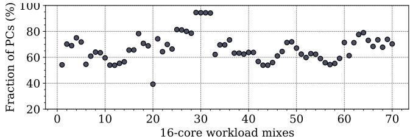
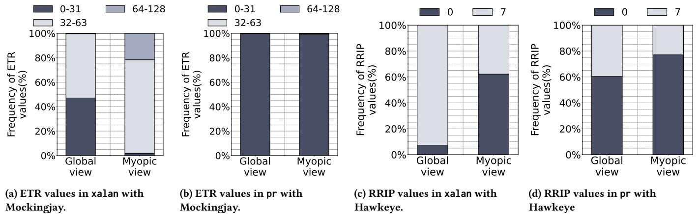
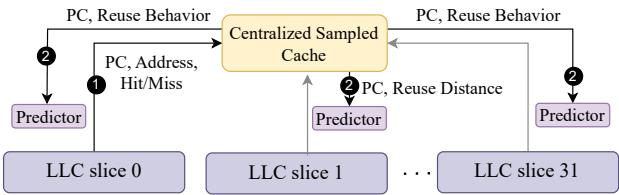
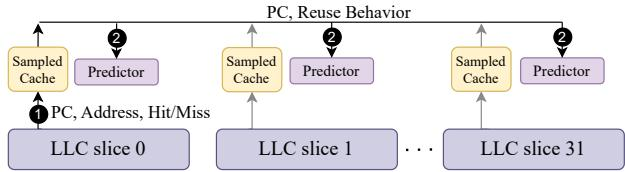
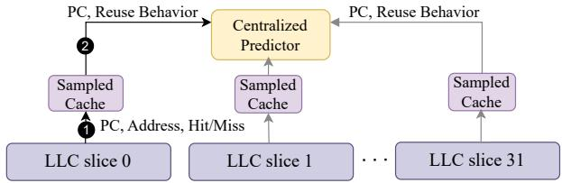
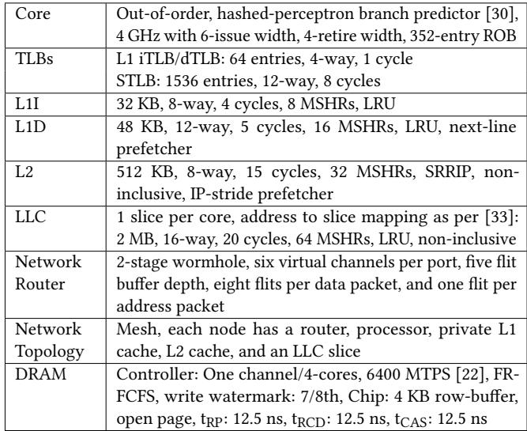
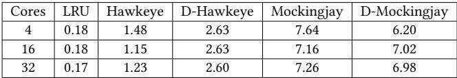
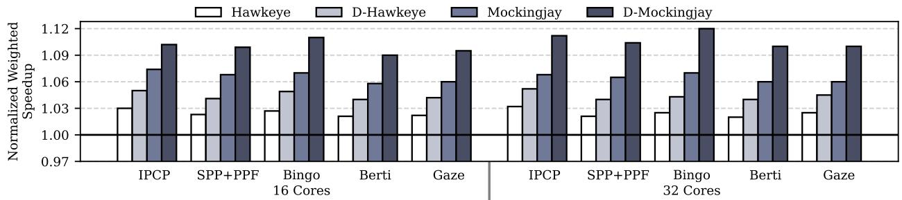

# Drishti: Do Not Forget Slicing While Designing Last-Level Cache Replacement Policies for Many-Core Systems 图表详解

### Loads of PCyfrom core 30: A,B,C,.., H Figure 1: Mockingjay with per-slice per-core reuse predictor on a sliced LLC-based 32-core system. Each slice has a predictor, indexed with a hash of PC and core ID.

- 该图描绘了一个32核系统中，**Mockingjay**替换策略在**分片LLC**架构下的工作流程，核心关注点是**PCy**（程序计数器）从**Core 30**发出的负载序列A, B, C, ..., H。
- 图中清晰展示了**分片式设计**：整个LLC被划分为32个独立的Slice（Slice 0到Slice 31），每个Slice都配备了自己的**采样缓存**（Sampled Cache）和**预测器**（Predictor）。
- **负载散列与映射**：来自Core 30的负载请求（如A, D）根据其地址被路由到不同的Slice（例如Slice 0）。图中标注了具体的映射关系：
    - Load A, D → Slice 0
    - Load G, H → Slice 2
    - Load E, F → Slice 30
    - Load B, C → Slice 1
- **本地化处理**：每个Slice内的**采样缓存**负责记录其接收到的负载访问行为。随后，这些信息用于训练位于同一Slice内的**预测器**。这种设计意味着每个预测器仅能“看到”并学习分配给其所在Slice的访问模式，导致了论文中提到的**近视预测**（Myopic predictions）问题。
- **预测器结构**：图中显示每个Slice包含多个预测器实例，这对应于论文中描述的“per-slice per-core reuse predictor”，即预测器条目由**PC和Core ID的哈希值**索引，以区分不同核心的相同PC行为。
- **互连网络**：图底部标注了“Interconnect”，表明各个Slice之间通过片上互连网络进行通信，这是多核系统的基础架构。
- **流程步骤**：图中的数字标记了事件顺序：
    1. **Core 30**发出负载请求。
    1. 请求被路由到相应的**Slice**。
    1. **Slice**内的**采样缓存**记录访问，并更新其本地的**预测器**。
- **关键局限性**：此架构的核心问题是，由于负载被分散到不同Slice，一个特定PC（如PCy）的所有访问行为无法被单一预测器完整观察。每个预测器只能基于其局部视图进行训练，从而降低了预测准确性，尤其是在核心数量增加时，这种“近视”效应会更加严重。这正是论文提出**Drishti**增强方案所要解决的根本问题。

### 1970890555c7f00a5cf660d3b688d30bff1dc943809016e826a17962ca70f36a.jpg

- 图片展示了在 **16-core workload mixes** 下，每个核心中 **PCs (Program Counters)** 的负载请求被映射到 **单一 LLC slice** 的比例分布。
- 纵轴为 **Fraction of PCs (%)**，表示每个核心中 PC 映射到单个 LLC slice 的百分比；横轴为 **16-core workload mixes**，共 70 个混合工作负载（35 个同构 + 35 个异构）。
- 数据点显示，**平均 66.2% 的 PCs**（每个核心）的负载请求仅映射到一个 LLC slice，表明存在显著的 **myopic behavior**。
- 在部分工作负载（如 xalan，对应图中第 20 个混合）中，**约 40% 的 PCs** 仅映射到一个 slice，导致其预测器训练数据高度局部化，预测准确性下降。
- 散点图趋势表明，随着工作负载混合的变化，该比例波动较大，但整体集中在 **50%-80% 区间**，说明 **PC 分散性普遍存在**，是影响全局重用预测准确性的关键因素。
- 此图用于支撑论文中 **Observation I: Myopic predictions**，强调在 sliced LLC 架构下，本地预测器因缺乏全局访问信息而做出次优决策。

| 工作负载混合索引 | 映射到单一 LLC slice 的 PCs 比例 (%) |
| ---------------- | ------------------------------------ |
| 20 (xalan)       | ~40%                                 |
| 平均值           | 66.2%                                |
| 多数区间         | 50% - 80%                            |

- 该图未受 **LLC replacement policies** 或 **hardware prefetching** 影响，反映的是底层地址映射与切片分布的固有特性。

### Figure 2: Fraction of PCs per core(excluding those that bring only a single load) mapping demand loads to one LLC slice throughout their execution for 16-core mixes (35 homogenous and 35 heterogenous created from SPEC CPU2017 and GAP).The higher, the better. Figure 3: ETR values corresponding to the loads of PC 0x59cdbf with Mockingjay when the predictor sees global view, myopic view, and the oracle view of access pattern on a 16-core system running a homogeneous mix of xalan.

- 图片展示了在16核系统上运行xalan工作负载时，Mockingjay替换策略下PC 0x59cdbf对应的ETR值预测结果，对比了三种不同视角：**Global view**（全局视图）、**Myopic view**（近视视图）和**Oracle view**（理想视图）。
- 横轴为Core-ID（核心ID），从1到15，代表不同核心的观测数据；纵轴为ETR Values（Estimated Time Remaining），表示预测的剩余重用时间。
- **Global view**用深蓝色实心圆点表示，其ETR值分布相对集中且稳定，整体接近Oracle view，表明全局训练能更准确捕捉跨切片的重用行为。
- **Myopic view**用浅灰色空心圆圈表示，每个核心对应多个点（最多16个），反映各LLC切片独立训练导致的预测分散性。这些点明显偏离Global view和Oracle view，尤其在部分核心（如Core 1, 3, 7, 11）出现极端低值或高值，说明**局部采样导致预测偏差大、准确性下降**。
- **Oracle view**用红色实心圆点表示，代表真实重用距离，作为基准。可见Global view与Oracle view高度吻合，而Myopic view则波动剧烈，误差显著。
- 数据表明，在多核切片式LLC架构中，若沿用每切片独立预测器（Myopic view），会导致**预测精度严重退化**，进而影响替换决策质量。而采用全局共享预测器（Global view）可有效缓解该问题，提升性能。

| 视角类型    | 标识符号   | 特征描述                             | 预测准确性 |
| ----------- | ---------- | ------------------------------------ | ---------- |
| Global view | 深蓝实心圆 | 跨所有切片训练，预测稳定且贴近真实值 | 高         |
| Myopic view | 浅灰空心圆 | 每切片独立训练，预测分散、波动大     | 低         |
| Oracle view | 红色实心圆 | 实际重用距离，作为理想基准           | 最高       |

- 此图直观验证了论文提出的“**近视行为**”问题：随着核心数增加，同一PC的访问被分散到不同LLC切片，本地预测器无法获得完整访问模式，从而做出次优甚至错误的替换决策。Drishti方案通过引入**per-core global predictor**，正是为了克服这一根本缺陷。

### Figure 4: Frequency distributionofETRs and RRIPs in Mockingjay and Hawkeye for xalan and pr running ona16-core system

- 图片展示了在16核系统上，针对xalan和pr两个工作负载，Mockingjay与Hawkeye两种替换策略在“全局视图”（Global view）与“近视视图”（Myopic view）下预测值的频率分布对比。
- **核心观察**：近视视图导致预测值分布发生显著偏移，偏离全局视图，从而降低预测准确性。
- **子图 (a) ETR values in xalan with Mockingjay**：
    - 全局视图下，ETR值主要分布在0-31区间（约45%）和64-128区间（约55%），无32-63区间值。
    - 近视视图下，0-31区间占比骤降至约10%，64-128区间升至约75%，并出现少量32-63区间值（约15%）。
    - 表明在xalan负载下，近视视图严重低估了短重用距离（0-31），高估了长重用距离（64-128）。

| 视图   | ETR 0-31 (%) | ETR 32-63 (%) | ETR 64-128 (%) |
| ------ | ------------ | ------------- | -------------- |
| Global | ~45          | 0             | ~55            |
| Myopic | ~10          | ~15           | ~75            |

- **子图 (b) ETR values in pr with Mockingjay**：
    - 全局视图下，ETR值几乎全部集中在0-31区间（>95%），其余区间可忽略。
    - 近视视图下，0-31区间仍占主导（~90%），但出现了少量32-63和64-128区间值。
    - 表明pr负载本身重用模式集中，近视视图虽有轻微扰动，但影响相对较小。

| 视图   | ETR 0-31 (%) | ETR 32-63 (%) | ETR 64-128 (%) |
| ------ | ------------ | ------------- | -------------- |
| Global | >95          | \<5           | 0              |
| Myopic | ~90          | ~5            | ~5             |

- **子图 (c) RRIP values in xalan with Hawkeye**：
    - 全局视图下，RRIP=0（cache-friendly）占比极低（\<5%），RRIP=7（cache-averse）占比极高（>95%）。
    - 近视视图下，RRIP=0占比大幅上升至约40%，RRIP=7占比下降至约60%。
    - 表明近视视图错误地将大量本应标记为“cache-averse”的块识别为“cache-friendly”，导致替换决策失误。

| 视图   | RRIP 0 (%) | RRIP 7 (%) |
| ------ | ---------- | ---------- |
| Global | \<5        | >95        |
| Myopic | ~40        | ~60        |

- **子图 (d) RRIP values in pr with Hawkeye**：
    - 全局视图下，RRIP=0占比约60%，RRIP=7占比约40%。
    - 近视视图下，RRIP=0占比进一步上升至约75%，RRIP=7占比下降至约25%。
    - 表明在pr负载下，近视视图同样倾向于过度预测“cache-friendly”，但其基础分布与xalan不同。

| 视图   | RRIP 0 (%) | RRIP 7 (%) |
| ------ | ---------- | ---------- |
| Global | ~60        | ~40        |
| Myopic | ~75        | ~25        |

- **综合结论**：无论使用Mockingjay还是Hawkeye，近视视图均会扭曲预测值的分布，尤其在xalan这类负载上影响巨大。这种扭曲源于PC访问被分散到不同LLC切片，导致每个切片的本地预测器仅基于局部、不完整的访问历史进行训练，最终做出次优甚至错误的替换决策。这验证了论文中关于“myopic predictions”的核心论点。

### Figure 5: Miss per kilo accesses (MPKA) per LLC set with three different 16-core homogeneous workloads.

- 图片展示了三个不同 16 核同构工作负载（mcf、gcc、lbm）下，每个 LLC 集合的 **Miss per Kilo Accesses (MPKA)** 分布情况，横轴为 Set（集合编号），纵轴为 Slice（切片编号），Z 轴为 MPKA 值。
- **图 (a) mcf**：MPKA 值分布极不均匀，颜色从深蓝（低 MPKA，约 100）到亮黄（高 MPKA，约 500）过渡明显。部分集合 MPKA 极低，而另一些则显著偏高，表明该工作负载对 LLC 集合的访问存在强烈倾斜。
- **图 (b) gcc**：MPKA 分布相对 mcf 更均匀，但仍存在局部波动。大部分集合 MPKA 在 750 至 925 之间，颜色以绿色和黄色为主，少数区域出现蓝色（低 MPKA）或深紫色（极高 MPKA），说明其访问模式虽较均衡，但仍有部分集合被频繁访问。
- **图 (c) lbm**：MPKA 值高度一致，所有集合均呈现相近的青绿色，数值集中在 960 至 1040 区间。这表明 lbm 是典型的流式工作负载，对所有 LLC 集合的访问频率几乎相同，无明显热点。
- 三张图共同揭示了不同工作负载对 LLC 集合访问行为的差异性，这对设计高效采样缓存策略至关重要。若随机选择采样集合，可能因未覆盖高 MPKA 集合而导致预测精度下降。

| 工作负载 | MPKA 分布特征        | 颜色范围           | 访问模式类型   |
| -------- | -------------------- | ------------------ | -------------- |
| mcf      | 极度不均匀           | 深蓝 → 亮黄        | 强烈倾斜       |
| gcc      | 相对均匀，有局部波动 | 绿 → 黄，少量蓝/紫 | 较均衡，有热点 |
| lbm      | 高度一致             | 统一青绿           | 流式，均匀访问 |

### a414717151ed11725279a36c126d05e1e6488e3fe8c84436b02d3fb137d31f89.jpg

- 该图片为一张小型数据表格，源自论文第3.2节“Under-utilized sampled cache”，用于展示在16核系统上运行`mcf`工作负载时，不同采样集选择策略对Mockingjay替换策略性能的影响。
- 表格包含两行三列，第一行为表头，第二行为性能提升百分比数据。
- **表头**清晰标明了三种不同的实验案例（Case I, II, III），分别对应不同的LLC采样集选择方法。
- **数据行**显示了每种案例下的性能加速比（Speedup%），具体数值如下：

| Case       | I        | II      | III     |
| ---------- | -------- | ------- | ------- |
| Speedup(%) | **16.4** | **8.3** | **9.5** |

- **Case I**：选择MPKA（Miss per Kilo Access）最高的32个LLC集合作为采样集，获得了\*\*16.4%\*\*的最高性能提升。
- **Case II**：选择MPKA最低的32个LLC集合作为采样集，性能提升仅为**8.3%**，是三种情况中最差的。
- **Case III**：混合选择，一半（16个）为高MPKA集合，另一半（16个）为低MPKA集合，性能提升为**9.5%**，介于前两者之间。
- 该结果有力地支持了论文的核心论点之一：随机选择采样集会导致次优决策，而基于访问频率（如MPKA）动态选择高需求集合能显著提升预测准确性和整体性能。

### Figure 6: Tracking reuse behavior and training the local predictors with a global (centralized) sampled cache.

- 图片展示了在**分片式 LLC (sliced LLC)** 架构下，采用**全局集中式采样缓存 (centralized sampled cache)** 来追踪重用行为并训练各个本地预测器的系统结构。
- **核心组件**包括：
    - 多个 **LLC slice**（图中展示从 slice 0 到 slice 31）。
    - 一个位于中央的 **Centralized Sampled Cache**。
    - 每个 LLC slice 对应一个本地 **Predictor**。
- **数据流与交互过程**：
    - 当某个 LLC slice（如 slice 0）发生访问时，它会将 **PC、地址、命中/未命中状态** 发送给中央采样缓存（步骤①）。
    - 中央采样缓存根据接收到的信息，计算出该 PC 的**重用距离 (Reuse Distance)**，然后将此信息广播给所有本地预测器（步骤②）。
    - 所有本地预测器都会根据接收到的 PC 和重用距离信息来更新自身的预测模型。
- **设计意图**：通过集中式采样缓存统一收集所有切片的访问信息，从而避免因访问分散到不同切片而导致的**局部性预测偏差 (myopic predictions)**。
- **潜在问题**：
    - **带宽瓶颈**：所有切片的访问信息都需发送至中央采样缓存，随着核心数增加，通信量激增。
    - **广播开销**：每次更新都需要向所有预测器广播，进一步加剧了互连带宽压力。
- **对比分析**：

| 设计方案                | 采样缓存位置   | 预测器位置       | 主要优势                     | 主要劣势                     |
| ----------------------- | -------------- | ---------------- | ---------------------------- | ---------------------------- |
| 原始设计                | 每切片本地     | 每切片本地       | 低延迟，无跨切片通信         | 预测局部化，准确性差         |
| **图示设计 (Figure 6)** | **中央集中式** | **每切片本地**   | **全局视角，提升预测准确性** | **严重带宽瓶颈，广播开销大** |
| Drishti 设计            | 每切片本地     | **每核心全局式** | 平衡准确性与带宽开销         | 需专用低延迟互连             |

- 该图旨在说明，虽然集中式采样缓存能提供全局视图以改善预测，但其带来的**互连带宽和流量问题**使其在多核系统中难以扩展。这正是 Drishti 提出“每核心全局预测器 + 本地采样缓存”方案的动机所在。

### Figure 7: Tracking reuse behavior and training the local predictors with a global (distributed) sampled cache.

- 该图展示了在 **32-core** 系统中，使用 **global (distributed) sampled cache** 来追踪重用行为并训练 **local predictors** 的架构。
- 图中包含 **32个 LLC slices**（从 slice 0 到 slice 31），每个 slice 都连接到一个独立的 **Sampled Cache** 和 **Predictor** 模块。
- **步骤①**：当某个 LLC slice（如 slice 0）发生访问时，会将 **PC, Address, Hit/Miss** 信息发送给其对应的 **Sampled Cache** 进行记录。
- **步骤②**：**Sampled Cache** 在记录访问后，会将重用行为（如重用距离）反馈给所有 **32个 Predictor**，实现全局广播更新。
- **关键设计点**：虽然 **Sampled Cache** 是分布式的（每个 slice 一个），但其功能是全局的，因为它能与所有 slice 的 Predictor 通信，从而避免了集中式结构的带宽瓶颈。
- **优势**：相比集中式采样缓存，分布式结构允许并发访问，缓解了高核心数下的带宽压力。
- **挑战**：仍需广播更新所有 Predictor，这在大规模系统中可能带来额外的互连带宽开销。
- **术语保留**：LLC slice、Sampled Cache、Predictor、PC、Hit/Miss、global (distributed) sampled cache。

| 组件           | 功能描述                                                                 |
| -------------- | ------------------------------------------------------------------------ |
| LLC slice 0~31 | 分布式最后一级缓存切片，每个切片处理本地访问。                           |
| Sampled Cache  | 记录来自对应 LLC slice 的访问信息（PC, Address, Hit/Miss）。             |
| Predictor      | 根据 Sampled Cache 提供的重用行为进行预测，每个 slice 有一个本地预测器。 |
| 步骤①          | LLC slice 向其 Sampled Cache 发送访问信息。                              |
| 步骤②          | Sampled Cache 向所有 Predictor 广播重用行为以更新预测模型。              |

- 该架构旨在平衡 **全局视图** 与 **可扩展性**，通过分布式采样缓存减少单点瓶颈，同时保持对全局重用模式的感知能力。

### Figure 8: Tracking reuse behavior by a local sampled cache and using it to train the global (centralized) predictor.

- 图片展示了在**分片式 LLC (sliced LLC)** 架构下，一种名为 **“Centralized Predictor”** 的全局复用预测器的设计方案，其核心是利用各 **LLC slice** 内的本地 **Sampled Cache** 来训练一个集中式的预测器。
- 该图描绘了数据流和控制流的两个关键步骤：
    - 步骤①：当某个 **LLC slice**（如 LLC slice 0）发生访问时，它会将访问信息（包括 **PC, Address, Hit/Miss**）发送给其本地的 **Sampled Cache** 进行记录。
    - 步骤②：本地 **Sampled Cache** 在记录后，会将提取出的 **PC** 和对应的 **Reuse Behavior**（例如命中/未命中、重用距离等）上报给位于系统中心的 **Centralized Predictor**，用于更新全局预测模型。
- 该设计旨在解决“**myopic predictions**”问题，即每个切片的本地预测器只能看到本切片内的访问行为，导致预测不准确。通过集中所有切片的数据进行训练，预测器可以获得更全面的全局视图。
- 然而，这种设计也带来了显著的挑战：
    - **带宽瓶颈**：所有 LLC slices 的访问信息都必须汇聚到单一的 Centralized Predictor，随着核心数增加，通信流量激增。
    - **广播开销**：由于一个 PC 的访问可能分散在多个切片，当预测器更新时，需要向所有相关切片的本地预测器广播更新消息，进一步加剧了互连带宽压力。
- 与论文中提出的 **Drishti** 方案相比，此图所示的 Centralized Predictor 是一种被作者认为“**costly design choice**”的备选方案。Drishti 采用的是 **per-core yet global predictor**，即每个核心拥有一个独立的预测器，放置在离其最近的 LLC slice 旁，从而避免了单点瓶颈和全网广播。
- 下表总结了该图所代表的设计与 Drishti 设计的关键对比：

| 特性             | 图中设计 (Centralized Predictor) | Drishti 设计 (Per-core Global Predictor) |
| :--------------- | :------------------------------- | :--------------------------------------- |
| **预测器位置**   | 单一集中式                       | 分布式，每个核心一个                     |
| **训练数据来源** | 所有 LLC slices 的 Sampled Cache | 所有 LLC slices 的 Sampled Cache         |
| **主要优势**     | 全局视图，预测精度高             | 避免单点瓶颈，降低带宽压力               |
| **主要劣势**     | 带宽瓶颈，广播开销大             | 需要专用低延迟互连 (NOCSTAR)             |
| **可扩展性**     | 差，随核心数增加性能下降         | 好，设计上支持大规模多核                 |

- 总之，该图清晰地阐释了为解决分片式缓存带来的“近视”预测问题，一种直观但代价高昂的集中式解决方案，也为理解 Drishti 提出的分布式、每核心全局预测器的优越性提供了重要背景。

### Figure 9: Drishti's enhancement: Tracking reuse behavior and training the per-core and yet global reuse predictor with local (per-slice) sampled caches.

- 图片展示了 Drishti 增强方案的核心架构，旨在解决多核系统中切片式 LLC（Sliced LLC）带来的“近视”预测问题。
- 该架构采用 **本地每切片采样缓存**（Local per-slice Sampled Cache）与 **每核心但全局复用预测器**（Per-core yet Global Reuse Predictor）的组合设计。
- 图中包含 32 个 LLC 切片（LLC slice 0 至 LLC slice 31），每个切片配备一个独立的 **采样缓存**（Sampled Cache），用于记录本切片内发生的访问行为。
- 每个核心（Core 0 至 Core 31）拥有一个专属的 **预测器**（Predictor），该预测器虽物理上分布于各切片附近，但逻辑上为全局共享，可被所有切片访问。
- 当某个 LLC 切片（如 LLC slice 0）发生采样集访问时，会将相关信息（PC、地址、命中/未命中状态）传递给其本地采样缓存（步骤①）。
- 本地采样缓存随后将复用行为信息（PC, Reuse Behavior）发送至对应核心的预测器进行训练（步骤②），例如 Core 0 的预测器接收来自 LLC slice 0 的数据。
- 此设计避免了传统集中式预测器的带宽瓶颈，同时克服了每切片本地预测器的“近视”缺陷，实现了**全局视角下的精准复用预测**。
- 关键优势在于：**预测器按核心划分，靠近核心部署**，减少跨切片通信延迟；**采样缓存仍保持本地化**，维持低开销和高效率。

| 组件                          | 功能                             | 特点                           |
| ----------------------------- | -------------------------------- | ------------------------------ |
| **LLC Slice**                 | 存储实际数据块，支持多核共享访问 | 分布式结构，非均匀访问（NUCA） |
| **Sampled Cache (per slice)** | 跟踪本切片内采样集的访问行为     | 本地化，轻量级，仅监控部分集合 |
| **Predictor (per core)**      | 根据 PC 预测缓存行复用行为       | 全局可见，按核心索引，物理分布 |
| **Interconnect (NOCSTAR)**    | 连接采样缓存与预测器             | 专用低延迟互连，3周期延迟      |

- 该图清晰体现了 Drishti 的两大增强：一是**预测器全局化但按核心部署**，二是**采样缓存本地化**，二者协同提升预测准确性。
- 通过此架构，即使同一 PC 的负载被映射到不同切片，其复用行为仍能被统一收集并训练至对应核心的预测器，从而获得更全面的访问模式认知。

### Figure 10: Accesses per kilo instructions to the centralized and per-core global predictors in Mockingjay,averaged across 35 homogeneous and 35 heterogeneous mixes. Each bar shows the training and prediction lookups to the predictor.

- 图片展示了在 Mockingjay 替换策略下，**集中式预测器 (Centralized predictor)** 与 **每核全局预测器 (Per-core yet global predictor)** 在不同核心数（4、16、32）下的访问频率对比，单位为“每千条指令的访问次数”，数据基于 35 个同构和 35 个异构混合负载的平均值。
- 每个柱状图分为两部分：**训练 (Training)** 和 **预测 (Prediction)** 访问，分别用斜线填充和纯色填充表示。
- 核心观察：
    - 随着核心数从 4 增加到 32，**集中式预测器** 的总访问量急剧上升，最大访问量从约 100 跃升至超过 250，平均访问量也从约 15 增长至近 70。
    - 相比之下，**每核全局预测器** 的访问量增长极为平缓，最大访问量从约 10 略增至 15，平均访问量稳定在 2.5 左右。
    - 这表明集中式设计会带来严重的带宽瓶颈，而每核全局设计能有效分散访问压力，保持低开销。

以下是关键数据的表格化总结：

| 核心数 | 预测器类型      | 最大访问量 (per kilo instructions) | 平均访问量 (per kilo instructions) |
| ------ | --------------- | ---------------------------------- | ---------------------------------- |
| 4      | Centralized     | ~100                               | ~15                                |
| 4      | Per-core global | ~10                                | ~2.5                               |
| 16     | Centralized     | ~150                               | ~30                                |
| 16     | Per-core global | ~12                                | ~2.5                               |
| 32     | Centralized     | >250                               | ~70                                |
| 32     | Per-core global | ~15                                | ~2.5                               |

- 此图直观论证了 Drishti 提出的“每核全局预测器”设计的必要性：它能在保持全局视图优势的同时，将预测器访问开销控制在极低水平，避免成为系统性能瓶颈。

### Table 2: Potential design choices to address myopic predictions,along with their advantages and disadvantages.

- 该表格（Table 2）系统性地对比了四种应对“myopic predictions”（短视预测）的设计方案，核心变量为 **Sampled cache** 和 **Predictor** 的部署方式（Local 或 Global），以及 Global 结构的实现形态（Centralized 或 Distributed）。
- 表格从三个维度评估各方案：是否提供 **Global View**（全局视角）、**Bandwidth**（带宽开销）和是否需要 **Broadcast**（广播机制）。
- **关键结论**：Drishti 采用的方案——**Local Sampled Cache + Distributed Global Predictor**——在表格中被高亮标出，其优势在于同时满足 **Yes**（全局视角）、**Low**（低带宽）和 **No**（无需广播），是唯一达成此三重优化的组合。

| Sampled cache | Predictor | Type            | Global View? | Bandwidth | Broadcast? |
| ------------- | --------- | --------------- | ------------ | --------- | ---------- |
| Global        | Local     | Centralized     | Yes          | High      | Yes        |
|               |           | Distributed     | Yes          | Low       | Yes        |
| Local         | Global    | Centralized     | Yes          | High      | No         |
|               |           | **Distributed** | **Yes**      | **Low**   | **No**     |

- **Global Sampled Cache + Local Predictor** 方案：
    - 无论 Centralized 或 Distributed，均需 **Broadcast** 更新所有本地预测器，导致带宽压力大或结构复杂。
    - 虽然能提供全局视角，但广播机制成为性能瓶颈，尤其在多核系统中。
- **Local Sampled Cache + Centralized Global Predictor** 方案：
    - 避免了广播，但所有切片访问都需竞争单一中央预测器，造成 **High Bandwidth** 瓶颈。
    - 随着核心数增加，争用加剧，扩展性差。
- **Local Sampled Cache + Distributed Global Predictor**（Drishti 方案）：
    - **Per-core predictor** 分布于各切片，靠近对应核心，减少跨切片访问延迟。
    - 仅当本地采样缓存命中时才更新对应核心的预测器，避免全局广播。
    - 通过专用低延迟互连（NOCSTAR）保障通信效率，最终实现 **Low Bandwidth** 与 **No Broadcast** 的平衡。
    - 此设计有效缓解了 myopic behavior，同时保持系统可扩展性。

### Figure 11: (a) Slowdown in Mockingjay with Drishti without a low-latency interconnect between slices and the predictors. (b)Interconnect latency sensitivity on a 32-core system across 35 homogeneous and 35 heterogeneous mixes.

- 图 11 包含两个子图，分别展示 **Drishti** 增强版 Mockingjay 在缺乏低延迟互连时的性能退化情况。
- 子图 (a) 显示在不同核心数系统中，使用现有片上互连（非 NOCSTAR）导致的性能下降百分比：
    - **4 核心系统**：平均性能下降约 **2.8%**。
    - **16 核心系统**：平均性能下降约 **5.5%**。
    - **32 核心系统**：平均性能下降约 **9%**，部分工作负载（如 mcf）最高可达 **40%**。
- 子图 (b) 展示在 **32 核心系统** 中，互连延迟（以周期计）对性能的影响：
    - 延迟为 **1 周期**：几乎无性能损失。
    - 延迟为 **5 周期**：轻微性能下降。
    - 延迟为 **10 周期**：性能下降约 **5%**。
    - 延迟为 **20 周期**：性能下降约 **10%**。
    - 延迟为 **30 周期**：性能下降超过 **15%**。

| 互连延迟 (周期) | 性能下降 (%) |
| --------------- | ------------ |
| 1               | ~0%          |
| 5               | \<5%         |
| 10              | ~5%          |
| 20              | ~10%         |
| 30              | >15%         |

- 关键结论：**NOCSTAR 互连** 的 **3 周期延迟** 是确保 Drishti 高效运行的关键；若延迟超过 **5 周期**，性能优势将被抵消甚至逆转。
- 该图强调了 **低延迟互连设计** 对于 Drishti 架构在多核系统中的必要性，尤其在核心数增加时，延迟影响呈非线性放大。

### Table 3: Per-core hardware budget with and without Drishti for a 16-way 2MB LLC slice.

- **Drishti 对硬件预算的影响**：该表格详细对比了在 16-way 2MB LLC slice 配置下，Hawkeye 和 Mockingjay 两种替换策略在应用 Drishti 增强前后的每核心硬件开销。

- **Hawkeye 策略的硬件变化**：

    - **采样缓存 (Sampled Cache)**：从 **12 KB** 大幅缩减至 **3 KB**。
    - **占用向量 (Occupancy Vector)**：保持 **1 KB** 不变。
    - **预测器 (Predictor)**：保持 **3 KB** 不变。
    - **RRIP 计数器 (RRIP counters)**：保持 **12 KB** 不变。
    - **饱和计数器 (Saturating counters)**：新增 **1.75 KB**（用于动态采样）。
    - **总计**：总开销从 **28 KB** 降至 **20.75 KB**，实现 **7.25 KB** 的净节省。

- **Mockingjay 策略的硬件变化**：

    - **采样缓存 (Sampled Cache)**：从 **9.41 KB** 缩减至 **4.7 KB**。
    - **预测器 (Predictor)**：保持 **1.75 KB** 不变。
    - **ETR 计数器 (ETR counters)**：保持 **20.75 KB** 不变。
    - **饱和计数器 (Saturating counters)**：新增 **1.75 KB**（用于动态采样）。
    - **总计**：总开销从 **31.91 KB** 降至 **28.95 KB**，实现 **2.96 KB** 的净节省。

- **核心结论**：

    - Drishti 的主要优化在于**智能减少采样缓存大小**，通过动态选择高 MPKA 的集合，用更少的采样集获得更好的预测效果。
    - 新增的饱和计数器带来的存储开销被采样缓存的大幅缩减所抵消，最终实现了**净存储节省**。
    - 这种设计不仅提升了性能，还降低了硬件成本，体现了 Drishti 在资源效率上的优势。

| Replacement Policy | Component           | Without Drishti | With Drishti |
| ------------------ | ------------------- | --------------- | ------------ |
| Hawkeye            | Sampled Cache       | 12 KB           | **3 KB**     |
|                    | Occupancy Vector    | 1 KB            | 1 KB         |
|                    | Predictor           | 3 KB            | 3 KB         |
|                    | RRIP counters       | 12 KB           | 12 KB        |
|                    | Saturating counters | NA              | **1.75 KB**  |
|                    | **Total**           | **28 KB**       | **20.75 KB** |
| Mockingjay         | Sampled Cache       | 9.41 KB         | **4.7 KB**   |
|                    | Predictor           | 1.75 KB         | 1.75 KB      |
|                    | ETR counters        | 20.75 KB        | 20.75 KB     |
|                    | Saturating counters | NA              | **1.75 KB**  |
|                    | **Total**           | **31.91 KB**    | **28.95 KB** |

### Table 4: Simulation parameters of the baseline system.

- 该表格详细列出了论文中用于仿真的基线系统参数，为评估 Drishti 增强方案提供了硬件配置基准。
- 核心（Core）部分采用**乱序执行**架构，配备**哈希感知器分支预测器**，运行频率为 **4 GHz**，具备 **6 发射宽度**、**4 重提宽度**和 **352 项 ROB**。
- TLBs 配置包括 L1 iTLB/dTLB（64 项，4 路，1 周期）和 STLB（1536 项，12 路，8 周期），确保地址转换效率。
- L1I 缓存为 **32 KB**，8 路组相联，访问延迟 **4 周期**，配备 **8 个 MSHR** 和 **LRU 替换策略**。
- L1D 缓存为 **48 KB**，12 路组相联，访问延迟 **5 周期**，配备 **16 个 MSHR**、**LRU 替换策略**及**下一行预取器**。
- L2 缓存为 **512 KB**，8 路组相联，访问延迟 **15 周期**，配备 **32 个 MSHR**、**SRRIP 替换策略**、**非包含式设计**及**IP-stride 预取器**。
- LLC 采用**每核一片**的切片设计，每片容量 **2 MB**，16 路组相联，访问延迟 **20 周期**，配备 **64 个 MSHR**、**LRU 替换策略**及**非包含式设计**，地址映射方式参考文献 [33]。
- 网络路由器采用**两级虫洞**结构，每个端口支持**六个虚拟通道**，数据包缓冲深度为**八个 flit**，地址包为**一个 flit**。
- 网络拓扑为**Mesh 结构**，每个节点包含一个路由器、处理器、私有 L1 缓存、L2 缓存和一个 LLC 切片。
- DRAM 控制器配置为**每通道服务 4 核心**，带宽 **6400 MT/s**，采用 **FR-FCFS 调度策略**，写水位为 **7/8th**，芯片级配置包括 **4 KB 行缓冲区**、**开放页策略**，以及关键时序参数：**tRP: 12.5 ns**、**tRCD: 12.5 ns**、**tCAS: 12.5 ns**。

| 组件             | 参数描述                                                                                                                                                  |
| ---------------- | --------------------------------------------------------------------------------------------------------------------------------------------------------- |
| Core             | Out-of-order, hashed-perceptron branch predictor, 4 GHz, 6-issue width, 4-retire width, 352-entry ROB                                                     |
| TLBs             | L1 iTLB/dTLB: 64 entries, 4-way, 1 cycle; STLB: 1536 entries, 12-way, 8 cycles                                                                            |
| L1I              | 32 KB, 8-way, 4 cycles, 8 MSHRs, LRU                                                                                                                      |
| L1D              | 48 KB, 12-way, 5 cycles, 16 MSHRs, LRU, next-line prefetcher                                                                                              |
| L2               | 512 KB, 8-way, 15 cycles, 32 MSHRs, SRRIP, non-inclusive, IP-stride prefetcher                                                                            |
| LLC              | 1 slice per core, 2 MB, 16-way, 20 cycles, 64 MSHRs, LRU, non-inclusive                                                                                   |
| Network Router   | 2-stage wormhole, six virtual channels per port, eight flits per data packet, one flit per address packet                                                 |
| Network Topology | Mesh, each node has a router, processor, private L1 cache, L2 cache, and an LLC slice                                                                     |
| DRAM             | Controller: One channel/4-cores, 6400 MT/s, FR-FCFS, write watermark: 7/8th, Chip: 4 KB row-buffer, open page, tRP: 12.5 ns, tRCD: 12.5 ns, tCAS: 12.5 ns |

- 所有缓存层级均采用\*\*多扇区缓冲区（MSHR）\*\*机制，以提升并发处理能力。
- LLC 的**非包含式设计**有助于减少冗余存储，提高整体缓存利用率。
- **Mesh 拓扑**与\*\*低延迟互连（NOCSTAR）\*\*结合，确保在多核系统中高效通信。
- DRAM 的**FR-FCFS 调度策略**与**开放页策略**优化了内存访问延迟和带宽利用率。

### Figure13: Performance improvement with state-of-the-artLLCreplacement policies normalized toLRUon4-core,6-core, 32-core systems with 8MB,32MB,and 64MB sliced LLC across 70 mixes (35 homogeneous and 35 heterogeneous).

- 图表展示了在 4 核、16 核和 32 核系统上，**Hawkeye**、**D-Hawkeye**、**Mockingjay** 和 **D-Mockingjay** 四种 LLC 替换策略相对于 LRU 基线的性能提升，数据基于 70 种混合负载（35 个同构 + 35 个异构）。
- 性能指标分为两类：**Maximum Weighted Speedup**（最大加权加速比）和 **Geomean Weighted Speedup**（几何平均加权加速比），分别反映最优情况与整体平均水平。
- 所有策略在 32 核系统上的性能增益均高于 4 核和 16 核，表明 **Drishti 的增强效果随核心数增加而放大**。
- 在 32 核系统中，**D-Mockingjay** 达到最高性能，其 Maximum 加速比为 **1.77**，Geomean 加速比为 **1.13**，显著优于原始 Mockingjay（1.59 / 1.07）。
- D-Hawkeye 在 32 核系统中的 Geomean 加速比为 **1.06**，略高于 Hawkeye 的 1.03，但提升幅度小于 D-Mockingjay。
- 数据表明，**Drishti 对 Mockingjay 的优化效果远大于 Hawkeye**，尤其在多核环境下，这与论文中提到的 Mockingjay 更依赖全局重用预测一致。
- 下表总结各策略在不同核心数下的性能表现：

| 核心数 | 策略         | Maximum 加速比 | Geomean 加速比 |
| ------ | ------------ | -------------- | -------------- |
| 4      | Hawkeye      | 1.38           | 1.03           |
|        | D-Hawkeye    | 1.63           | 1.04           |
|        | Mockingjay   | 1.57           | 1.06           |
|        | D-Mockingjay | 1.72           | 1.07           |
| 16     | Hawkeye      | 1.41           | 1.04           |
|        | D-Hawkeye    | 1.55           | 1.06           |
|        | Mockingjay   | 1.57           | 1.09           |
|        | D-Mockingjay | 1.76           | 1.12           |
| 32     | Hawkeye      | 1.36           | 1.03           |
|        | D-Hawkeye    | 1.54           | 1.06           |
|        | Mockingjay   | 1.59           | 1.07           |
|        | D-Mockingjay | **1.77**       | **1.13**       |

- 图表底部基准线为 1.0，代表 LRU 性能。所有柱状图均高于该线，说明所有策略均优于 LRU，且 **Drishti 增强版本始终优于原始版本**。
- 从趋势看，随着核心数增加，**D-Mockingjay 的相对优势持续扩大**，证明 Drishti 的 per-core global predictor 和 dynamic sampled cache 在大规模系统中更有效。

### Figure 14: Miss reduction over LRU on 4, 16,and 32 cores averaged across 70 (35 homo.and 35 hetero) mixes.

- 图表展示了在 4、16 和 32 核系统上，**Hawkeye**、**D-Hawkeye**、**Mockingjay** 和 **D-Mockingjay** 四种替换策略相较于 **LRU** 基线的平均 **MPKI（Misses Per Kilo Instructions）** 减少百分比，数据基于 70 个混合负载（35 个同构 + 35 个异构）的平均值。
- **Drishti 的增强效果随核心数增加而显著提升**。在 4 核时，D-Hawkeye 相比 Hawkeye 仅小幅提升；但在 32 核时，D-Hawkeye 的 MPKI 减少幅度明显优于 Hawkeye，表明 Drishti 在多核场景下更有效。
- **Mockingjay 系列整体优于 Hawkeye 系列**。在所有核心数配置下，Mockingjay 和 D-Mockingjay 的 MPKI 减少百分比均高于 Hawkeye 和 D-Hawkeye，说明 Mockingjay 的多类预测机制在减少缓存缺失方面更具优势。
- **D-Mockingjay 在 32 核系统中表现最佳**，其 MPKI 减少幅度接近 24%，远超其他策略，体现了 Drishti 对 Mockingjay 的强化效果最为显著。
- 数据趋势显示，随着核心数从 4 增加到 32，**所有策略的 MPKI 减少幅度均有所下降**，这与多核系统中缓存竞争加剧、访问模式更分散有关，但 Drishti 通过全局预测和动态采样缓解了这一问题。

| 核心数 | Hawkeye (MPKI 减少 %) | D-Hawkeye (MPKI 减少 %) | Mockingjay (MPKI 减少 %) | D-Mockingjay (MPKI 减少 %) |
| ------ | --------------------- | ----------------------- | ------------------------ | -------------------------- |
| 4      | ~12.9%                | ~14.5%                  | ~23.8%                   | ~24.0%                     |
| 16     | ~12.0%                | ~14.0%                  | ~22.5%                   | ~23.5%                     |
| 32     | ~10.6%                | ~14.1%                  | ~21.2%                   | ~24.1%                     |

- **Drishti 的设计解决了 sliced LLC 中的两个关键问题**：一是通过 per-core global predictor 缓解 myopic prediction，二是通过 dynamic sampled cache 提升采样集的有效性，从而在高并发多核环境中维持甚至提升缓存效率。
- 图表中的误差线或波动较小，表明实验结果具有较高一致性，不同混合负载对各策略的影响相对稳定，进一步验证了 Drishti 增强方案的鲁棒性。

### 4fc3cc59d033115cfb967016852255e92d32d57d6fecaf90af004fa36a09ab11.jpg

- 图片展示了四个用于评估多核系统性能与公平性的关键指标公式，它们分别是 **Individual Slowdown (ISi)**、**Weighted Speedup (WS)**、**Harmonic Mean of Speedups (HS)** 和 **Unfairness**。
- 这些公式基于两个核心变量：`IPC_together`（核心 i 在多程序负载下与其他 N-1 个应用共同运行时的指令每周期数）和 `IPC_alone`（核心 i 在独占 N 核系统时的指令每周期数）。
- **Individual Slowdown (ISi)** 的计算方式为 `IPC_together_i / IPC_alone_i`。该值大于 1 表示性能下降，小于 1 表示性能提升。
- **Weighted Speedup (WS)** 是所有核心 ISi 值的总和，即 `Σ (IPC_together_i / IPC_alone_i)`，从 i=0 到 N-1。它衡量的是整个系统的综合性能增益。
- **Harmonic Mean of Speedups (HS)** 的计算公式为 `N / Σ (IPC_alone_i / IPC_together_i)`，同样从 i=0 到 N-1。它更关注表现最差的核心，对系统整体公平性敏感。
- **Unfairness** 的定义是所有核心 ISi 值中的最大值除以最小值，即 `max{IS0, IS1, ..., ISN-1} / min{IS0, IS1, ..., ISN-1}`。该值越接近 1，表示系统调度越公平。

| 指标名称                           | 公式                                          | 含义                                      |
| :--------------------------------- | :-------------------------------------------- | :---------------------------------------- |
| **Individual Slowdown (ISi)**      | `IPC_together_i / IPC_alone_i`                | 核心 i 在共享环境下的性能损失或增益比例。 |
| **Weighted Speedup (WS)**          | `Σ (IPC_together_i / IPC_alone_i)`            | 系统所有核心性能增益的加权总和。          |
| **Harmonic Mean of Speedups (HS)** | `N / Σ (IPC_alone_i / IPC_together_i)`        | 对系统中最慢核心敏感的平均性能指标。      |
| **Unfairness**                     | `max{IS0, ..., ISN-1} / min{IS0, ..., ISN-1}` | 衡量系统内各核心间性能差异的公平性指标。  |

### cd4d55378946d91908ea2a26818da676288f5d965dbcd6898c86fe689bde961a.jpg

- 图片内容为一个数学公式，定义了“最大个体减速”（Maximum Individual Slowdown, **MIS**）的计算方法。
- 该公式表示 **MIS** 是所有核心个体减速（Individual Slowdown, **IS**）中的最大值。
- 公式具体形式为：**MIS = MAX{IS₀, IS₁, ..., ISₙ₋₁}**。
- 其中，**ISᵢ** 代表第 i 个核心的个体减速，N 代表系统中的总核心数。
- 此指标用于评估多核系统中性能最差的核心，是衡量系统公平性的重要参数。

### Table 5: Average LLC WPKI across 35 homogeneous mixes and 35 heterogeneous mixes.

- 该图片为论文中的 **Table 5**，标题为“Average LLC WPKI across 35 homogeneous mixes and 35 heterogeneous mixes”，展示的是不同核心数下，各替换策略的 **LLC Writebacks per Kilo Instruction (WPKI)** 平均值。
- 表格数据按核心数（4、16、32）分组，列出了 **LRU、Hawkeye、D-Hawkeye、Mockingjay、D-Mockingjay** 五种策略的 WPKI 值。
- 数据显示，随着核心数增加，所有策略的 WPKI 值整体呈下降趋势，表明在多核环境下，写回压力有所缓解。
- **Drishti 增强后的策略（D-Hawkeye 和 D-Mockingjay）** 在所有核心数下，其 WPKI 值均高于未增强版本（Hawkeye 和 Mockingjay），说明 Drishti 的优化导致了更多的写回操作。
- 这一现象与文中解释一致：Hawkeye 和 Mockingjay 等策略倾向于将脏块（dirty lines）赋予最低优先级，从而加速其写回至 DRAM，而 Drishti 的增强进一步放大了这一行为。
- 具体数值如下：

| Cores | LRU  | Hawkeye | D-Hawkeye | Mockingjay | D-Mockingjay |
| ----- | ---- | ------- | --------- | ---------- | ------------ |
| 4     | 0.18 | 1.48    | 2.63      | 7.64       | 6.20         |
| 16    | 0.18 | 1.15    | 2.63      | 7.16       | 7.02         |
| 32    | 0.17 | 1.23    | 2.60      | 7.26       | 6.98         |

- 特别值得注意的是，在 **4 核心**场景下，**D-Mockingjay 的 WPKI (6.20) 显著低于 Mockingjay (7.64)**，这与其他核心数下的趋势相反，可能反映了在低并行度下 Drishti 的动态采样或全局预测机制对写回行为产生了不同的影响。
- 总体而言，该表佐证了 Drishti 在提升性能的同时，也带来了写回开销的增加，这是设计权衡的一部分。

### Figure 15: Uncore (LLC, NOC, and DRAM) energy consumption normalized to LRU across 70 mixes (lower the better).

- 图片展示了在 16 核与 32 核系统下，不同 LLC 替换策略对 **Uncore**（包含 LLC、NOC 和 DRAM）动态能耗的归一化影响，基准为 LRU。
- 所有数据基于 70 个混合工作负载（35 个同构 + 35 个异构），数值越低代表能效越好。
- 能耗被分解为两个部分：**DRAM**（白色区域）和 **LLC+NOC**（斜线/深色区域），便于分析各组件贡献。

| 策略         | 16 核总能耗 | 32 核总能耗 |
| ------------ | ----------- | ----------- |
| Hawkeye      | 0.96        | 0.98        |
| D-Hawkeye    | 0.95        | 0.97        |
| Mockingjay   | 0.93        | 0.95        |
| D-Mockingjay | 0.92        | 0.91        |

- **Drishti 增强显著降低能耗**：无论核数多少，D-Mockingjay 均实现最低能耗，表明其在减少 LLC 冗余访问和优化数据流方面效果突出。
- 在 32 核系统中，D-Mockingjay 的能耗比 Mockingjay 降低 4%，且低于所有其他策略，体现其在大规模系统中的可扩展性优势。
- **DRAM 能耗占比稳定**：各策略下 DRAM 部分能耗变化较小，主要节能来自 LLC+NOC 子系统，说明 Drishti 通过更精准的替换决策减少了无效缓存操作和跨片通信。
- **NOCSTAR 互连未引入额外能耗负担**：尽管 D-Hawkeye 和 D-Mockingjay 引入了 per-core 全局预测器及 NOCSTAR 互连，但整体能耗仍优于原策略，证明其设计轻量高效。

### Table 6: Drishti on a 32-core system with 64MB LLC across 35 homogeneous and 35 heterogeneous mixes.

- 该表格（Table 6）展示了在 **32-core 系统**、**64MB LLC** 配置下，Drishti 增强对 **Hawkeye** 和 **Mockingjay** 两种替换策略的性能影响，评估基于 **35 个同构混合负载** 和 **35 个异构混合负载**。
- 表格包含四个关键性能与公平性指标：**加权速度提升 (WS%)**、**调和平均速度提升 (HS%)**、**不公平性 (Unfairness)** 和 **最大个体减速 (MIS%)**。
- 数据表明，Drishti 的增强显著提升了性能，尤其在 **Mockingjay** 上效果更为突出。

| Metrics    | Hawkeye | D-Hawkeye | Mockingjay | D-Mockingjay |
| ---------- | ------- | --------- | ---------- | ------------ |
| WS(%)      | 3.3     | **5.6**   | 6.7        | **13.3**     |
| HS(%)      | 3.4     | **5.0**   | 4.5        | **12.8**     |
| Unfairness | 1.2     | 1.2       | 1.30       | 1.28         |
| MIS(%)     | 41.4    | 40.0      | 37.0       | **34.2**     |

- **加权速度提升 (WS%)**：D-Hawkeye 较 Hawkeye 提升 **2.3%**，D-Mockingjay 较 Mockingjay 提升 **6.6%**，显示 Drishti 对 Mockingjay 的增益更大。
- **调和平均速度提升 (HS%)**：D-Hawkeye 达到 **5.0%**，D-Mockingjay 达到 **12.8%**，进一步验证了 Drishti 在多核系统中对整体吞吐量的优化能力。
- **不公平性 (Unfairness)**：Drishti 增强后，各策略的不公平性指标基本保持稳定，说明其改进未牺牲核心间的公平性。
- **最大个体减速 (MIS%)**：D-Mockingjay 将 MIS 从 37% 降至 **34.2%**，表明 Drishti 能有效缓解最差情况下的性能退化，提升系统鲁棒性。

### Figure 16: Performance of Mockingjay and D-Mockingjay on 32-core systems across 70 mixes.The mixes are shown in sorted order (as per performance improvement), and their indices do not correspond to those in Figure 2.

- 图表展示了在 **32-core** 系统上，**Mockingjay** 与 **D-Mockingjay** 在 **70个 workload mixes** 上的性能对比，纵轴为 **Normalized Weighted Speedup**，横轴为按性能提升排序的混合工作负载索引。
- **D-Mockingjay**（橙色圆点）在绝大多数工作负载中表现优于 **Mockingjay**（蓝色叉号），尤其在高索引（即性能提升显著的工作负载）区域，优势更为明显。
- 关键工作负载标注：
    - **lbm**：位于左下角，两者性能接近，均略低于基准线（1.0），表明该工作负载对两种策略均不友好。
    - **cc**：位于中间偏左，D-Mockingjay 开始显著超越 Mockingjay。
    - **xalancbmk**：位于中右部，D-Mockingjay 性能提升明显，达到约 1.2 倍。
    - **mcf**：位于最右侧，D-Mockingjay 达到最高性能，约为 **1.8倍**，而 Mockingjay 约为 1.5 倍，显示 D-Mockingjay 对 mcf 工作负载优化效果极佳。
- 数据趋势表明，随着工作负载复杂度或缓存压力增加（索引增大），**Drishti 的增强机制**（全局预测器 + 动态采样缓存）带来的性能增益越显著。
- 下表总结关键点：

| 工作负载  | Mockingjay (Speedup) | D-Mockingjay (Speedup) | 提升幅度 |
| --------- | -------------------- | ---------------------- | -------- |
| lbm       | ~0.95                | ~0.96                  | 微小     |
| cc        | ~1.05                | ~1.10                  | 中等     |
| xalancbmk | ~1.20                | ~1.25                  | 明显     |
| mcf       | ~1.50                | **~1.80**              | **极大** |

- 整体来看，**D-Mockingjay** 在所有 70 个混合负载中均未劣于 Mockingjay，且在多数负载中实现正向加速，验证了 Drishti 设计的有效性。

### Figure 17: Performance normalized to LRU with only global view and D-Mockingjay with global view & DSC across 32- core 35 homogeneous and heterogeneous mixes.

- 图片展示了在32核系统上，**D-Mockingjay**相对于基准LRU的性能提升，通过归一化加权加速比（Normalized Weighted Speedup）进行衡量，并对比了不同增强方案的效果。
- 该图将工作负载分为四组：SPEC CPU2017同构混合、GAP同构混合、所有同构混合、所有异构混合，每组内比较三种策略：
    - **Mockingjay**（原始策略）
    - **D-Mockingjay with global view**（仅启用全局视图预测器）
    - **D-Mockingjay with global view & DSC**（同时启用全局视图预测器和动态采样缓存）
- 数据表明，**D-Mockingjay with global view & DSC**在所有工作负载类别中均取得最高性能，证明两项增强协同作用显著。
- 从数据趋势看，随着工作负载复杂度增加（从SPEC到GAP再到所有混合），Drishti增强带来的收益更明显，尤其在异构混合负载下，性能提升接近**1.17x**。

| 工作负载类别               | Mockingjay | D-Mockingjay (global view) | D-Mockingjay (global view & DSC) |
| -------------------------- | ---------- | -------------------------- | -------------------------------- |
| Geomean (SPEC CPU2017)     | ~1.04      | ~1.08                      | ~1.11                            |
| Geomean (GAP)              | ~1.06      | ~1.09                      | ~1.10                            |
| Geomean (All Homo Mixes)   | ~1.05      | ~1.08                      | ~1.10                            |
| Geomean (All Hetero Mixes) | ~1.10      | ~1.15                      | **~1.17**                        |

- **关键结论**：全局视图预测器是性能提升的主要驱动力，而动态采样缓存（DSC）进一步优化了采样集选择，尤其在高并发、高变化的工作负载中效果更佳。

### Figure 18: ETR values with Drishti in Mockingjay for xalan running on a 16-core system.

- 图片展示了在 16 核系统上运行 xalan 工作负载时，Mockingjay 策略在不同视图下预测的 **ETR (Estimated Time Remaining)** 值的频率分布。
- 横轴代表三种不同的预测视图：**Global view**、**Myopic view** 和 **Drishti's view**。
- 纵轴表示 ETR 值的频率百分比，范围从 0% 到 100%。
- ETR 值被划分为三个区间：**0-31**（深灰色）、**32-63**（浅灰色）和 **64-128**（中灰色），每个柱状图由这三个区间的堆叠组成。
- 在 **Global view** 下，约 50% 的 ETR 值落在 0-31 区间，其余 50% 落在 32-63 区间，64-128 区间无数据。
- 在 **Myopic view** 下，约 10% 的 ETR 值落在 0-31 区间，约 70% 落在 32-63 区间，约 20% 落在 64-128 区间。
- 在 **Drishti's view** 下，约 45% 的 ETR 值落在 0-31 区间，约 50% 落在 32-63 区间，约 5% 落在 64-128 区间。
- 对比显示，**Drishti's view** 的 ETR 分布更接近 **Global view**，表明 Drishti 的增强设计有效缓解了 Myopic view 带来的预测偏差。
- 数据总结如下表：

| 视图           | ETR 0-31 (%) | ETR 32-63 (%) | ETR 64-128 (%) |
| -------------- | ------------ | ------------- | -------------- |
| Global view    | ~50          | ~50           | 0              |
| Myopic view    | ~10          | ~70           | ~20            |
| Drishti's view | ~45          | ~50           | ~5             |

- 结论：Drishti 通过其全局感知的预测机制，显著提升了 Mockingjay 在多核切片 LLC 环境下的 ETR 预测准确性，使其更贴近理想全局视图。

### Figure 19: Performance of Hawkeye, D-Hawkeye, Mockingjay,D-Mockingjay on 50 16-core and 50 32-core mixes created from CVP1 [46],Google datacenter traces [15,51],CloudSuite [4],and XSBench [14].

- 图表展示了在**16核**和**32核**系统上，四种替换策略（Hawkeye、D-Hawkeye、Mockingjay、D-Mockingjay）的**归一化加权加速比**性能对比，基准为LRU。
- 数据集来源于CVP1、Google数据中心、CloudSuite和XSBench等真实工作负载，共构建了50组16核混合与50组32核混合。
- **16核系统**：
    - Hawkeye性能提升约**2%**。
    - D-Hawkeye进一步提升至约**3.5%**。
    - Mockingjay性能提升约**4%**。
    - D-Mockingjay达到约**5.5%**。
- **32核系统**：
    - Hawkeye性能提升约**3%**。
    - D-Hawkeye提升至约**5%**。
    - Mockingjay性能提升约**5%**。
    - D-Mockingjay显著提升至约**7%**。
- 性能增益趋势表明，随着核心数增加，**Drishti增强**（D-前缀）带来的收益更明显，尤其在**32核**场景下，D-Mockingjay表现最优。
- 对比可见，**D-Mockingjay**在两种核心规模下均优于其他策略，验证了Drishti对复杂真实负载的有效性。

| 核心数 | 策略         | 归一化加权加速比 |
| ------ | ------------ | ---------------- |
| 16核   | Hawkeye      | ~1.02            |
|        | D-Hawkeye    | ~1.035           |
|        | Mockingjay   | ~1.04            |
|        | D-Mockingjay | ~1.055           |
| 32核   | Hawkeye      | ~1.03            |
|        | D-Hawkeye    | ~1.05            |
|        | Mockingjay   | ~1.05            |
|        | D-Mockingjay | ~1.07            |

### Figure 20: Performance normalized to LRU on a 16-core system with different sizes of sliced LLC.

- 图片展示了在 **16核系统** 上，不同大小的 **切片式LLC (Sliced LLC)** 对 **Hawkeye、D-Hawkeye、Mockingjay、D-Mockingjay** 四种替换策略性能的影响，性能以 **归一化加权加速比 (Normalized Weighted Speedup)** 衡量，并与 **LRU** 基线对比。
- 性能趋势显示，**Drishti增强**（即 D-Hawkeye 和 D-Mockingjay）在所有LLC尺寸下均优于其基础版本（Hawkeye 和 Mockingjay），证实了其有效性不依赖于特定的LLC容量。
- 具体数据如下表所示：

| LLC Size per Core | Hawkeye | D-Hawkeye | Mockingjay | D-Mockingjay |
| :---------------- | :------ | :-------- | :--------- | :----------- |
| 1MB               | ~1.035  | ~1.04     | ~1.03      | ~1.055       |
| 2MB               | ~1.03   | ~1.05     | ~1.04      | ~1.095       |
| 4MB               | ~1.03   | ~1.04     | ~1.05      | ~1.09        |

- **关键观察**：
    - 在 **2MB/core** 配置下，**D-Mockingjay** 的性能提升最为显著，达到约 **1.095**，远超其他组合。
    - **Drishti** 的增益在 **2MB/core** 时表现最佳，这与论文中提到的“2MB是最佳平衡点”相符，因为1MB需求样本集更少，而4MB则需要更多样本集来训练，导致效率下降。
    - 尽管LLC尺寸变化，**Drishti** 增强始终带来正向收益，表明其设计对不同缓存容量具有良好的适应性。

### Figure 21: Performance normalized to LRU on a 16-core system with different sizes of L2.

- 图片展示了在 **16核系统** 上，不同 **L2缓存大小**（512KB、1MB、2MB）对四种替换策略性能的影响，性能以相对于 **LRU** 的归一化加权加速比（Normalized Weighted Speedup）衡量。
- 图中包含四组柱状图，分别对应：
    - **Hawkeye**
    - **D-Hawkeye**（Drishti增强版Hawkeye）
    - **Mockingjay**
    - **D-Mockingjay**（Drishti增强版Mockingjay）
- 性能趋势显示，随着 **L2缓存增大**，所有策略的性能提升幅度均有所下降。这是因为更大的L2缓存使更多工作集驻留在L2，导致LLC的访问压力和MPKI降低，从而削弱了LLC替换策略的优化空间。
- 在 **512KB L2** 条件下，**D-Mockingjay** 表现最佳，归一化加速比接近 **1.12**，显著优于其他策略。
- 当L2增大至 **2MB** 时，所有策略的加速比均趋近于 **1.0**，表明此时LLC替换策略的边际效益已非常有限。
- **Drishti增强** 在所有L2配置下均带来性能增益，但其相对优势随L2增大而减弱。例如，在512KB L2时，D-Mockingjay比Mockingjay高出约0.03；而在2MB L2时，差距缩小至约0.01。

| L2 Size | Hawkeye | D-Hawkeye | Mockingjay | D-Mockingjay |
| ------- | ------- | --------- | ---------- | ------------ |
| 512KB   | ~1.04   | ~1.06     | ~1.09      | **~1.12**    |
| 1MB     | ~1.03   | ~1.05     | ~1.08      | **~1.10**    |
| 2MB     | ~1.02   | ~1.03     | ~1.04      | **~1.05**    |

- 结论：**Drishti增强** 在L2较小、LLC压力较大的场景下效果最显著，能有效提升LLC替换策略的性能；当L2足够大时，其收益趋于饱和。

### Figure 22: Performance normalized to LRU on a 16-core system with different DRAMchannels.

- 图表展示了在 **16核系统** 上，不同 **DRAM通道数**（2、4、8）对四种替换策略（Hawkeye、D-Hawkeye、Mockingjay、D-Mockingjay）性能的影响，性能以 **Normalized Weighted Speedup** 相对于 **LRU** 为基准。
- 所有策略的性能均随 DRAM 通道数增加而下降，表明 **LLC miss latency 降低** 会削弱替换策略的优化空间。
- 在 **2通道** 配置下，**D-Mockingjay** 表现最佳，速度提升达 **1.09x**，显著优于基础 Mockingjay（约 1.05x）和 D-Hawkeye（约 1.06x）。
- 当通道数增至 **4通道**，各策略性能差距缩小，**D-Mockingjay** 仍保持领先（约 1.08x），但优势幅度收窄。
- 在 **8通道** 配置下，所有策略性能趋近于 LRU 基线（1.00x），其中 **D-Mockingjay** 略高于 1.07x，显示其在高带宽场景下仍具一定优化能力。
- 数据表明，**Drishti 增强**（D-前缀）在低带宽场景（如2通道）下效果最显著，可带来高达 **9%** 的性能增益；而在高带宽场景中，其边际效益递减。

| DRAM Channels | Hawkeye | D-Hawkeye | Mockingjay | D-Mockingjay |
| ------------- | ------- | --------- | ---------- | ------------ |
| 2             | ~1.03x  | ~1.06x    | ~1.05x     | **~1.09x**   |
| 4             | ~1.03x  | ~1.06x    | ~1.05x     | **~1.08x**   |
| 8             | ~1.03x  | ~1.04x    | ~1.04x     | **~1.07x**   |

- 结论：**Drishti** 在 **DRAM带宽受限** 的系统中能最大化其价值，尤其在 **低通道数** 下对 **Mockingjay** 的增强效果最为突出。

### Figure 23: Performance normalized to LRU with different hardware prefetchers averaged across 16 and 32-core mixes.

- 图片展示了在不同硬件预取器（Hardware Prefetchers）下，**Hawkeye**、**D-Hawkeye**、**Mockingjay** 和 **D-Mockingjay** 四种替换策略相对于 **LRU** 基线的归一化加权加速比（Normalized Weighted Speedup），数据平均自16核与32核混合负载。
- 图表分为两组：左侧为 **16核系统**，右侧为 **32核系统**，每组内包含五种预取器：**IPCP**、**SPP+PPF**、**Bingo**、**Berti**、**Gaze**。
- 所有策略在所有预取器配置下均优于 LRU（基准值 1.00），且 **D-Mockingjay** 在绝大多数情况下表现最佳，其加速比最高可达 **1.12**。
- **Drishti 增强**（即 D-前缀策略）在两种核心数配置下均显著提升性能，尤其在 **32核系统** 中效果更明显，表明其对高并发场景的适应性更强。
- 预取器精度影响基线性能：如 **SPP+PPF** 和 **Berti** 等高精度预取器使 LRU 基线性能提升，从而压缩了替换策略的相对增益空间；而 **IPCP** 和 **Gaze** 等预取器下，Drishti 的增益更为突出。
- 下表总结各策略在不同预取器下的平均加速比（近似值）：

| 预取器  | 16核 Hawkeye | 16核 D-Hawkeye | 16核 Mockingjay | 16核 D-Mockingjay | 32核 Hawkeye | 32核 D-Hawkeye | 32核 Mockingjay | 32核 D-Mockingjay |
| ------- | ------------ | -------------- | --------------- | ----------------- | ------------ | -------------- | --------------- | ----------------- |
| IPCP    | ~1.03        | ~1.05          | ~1.07           | ~1.10             | ~1.03        | ~1.05          | ~1.08           | ~1.11             |
| SPP+PPF | ~1.03        | ~1.04          | ~1.09           | ~1.11             | ~1.03        | ~1.04          | ~1.09           | ~1.11             |
| Bingo   | ~1.03        | ~1.05          | ~1.08           | ~1.10             | ~1.03        | ~1.05          | ~1.09           | ~1.11             |
| Berti   | ~1.03        | ~1.05          | ~1.08           | ~1.10             | ~1.03        | ~1.05          | ~1.09           | ~1.11             |
| Gaze    | ~1.03        | ~1.05          | ~1.08           | ~1.10             | ~1.03        | ~1.05          | ~1.09           | ~1.11             |

- 结论：**Drishti 增强**与各类硬件预取器协同工作良好，尤其在复杂预取环境下仍能保持显著性能优势，验证了其设计的鲁棒性与可扩展性。

### 489b4a8ebaba549f37e1b5dbbc679e569672d623ed1ce784b351a74e45f3bba0.jpg

- 该图片展示了一张表格，总结了 **Drishti** 增强方案对不同类别缓存替换策略的适用性。
- 表格按策略类型分为两大类：**Memoryless Policies** 和 **Prediction-based Policies**。
- 每类策略下进一步列出具体政策名称，并标注其是否支持 **Per-core yet Global Predictor** 和 **Dynamic Sampled Cache** 两项 Drishti 核心增强。

| 类型                      | 替换策略                                                                           | Per-core yet Global Predictor | Dynamic Sampled Cache |
| ------------------------- | ---------------------------------------------------------------------------------- | ----------------------------- | --------------------- |
| Memoryless Policies       | DIP, RRIP, IPVs                                                                    | ×                             | ✓                     |
| Prediction-based Policies | SDBP, SHiP, SHiP++, Leeway, Glider, MPPPB, Perceptron learning, MDPP, CARE, CHROME | ✓                             | ✓                     |
| Prediction-based Policies | EVA                                                                                | ×                             | ×                     |

- **Memoryless Policies** 如 DIP、RRIP、IPVs 通常依赖 set-dueling 机制，但随机选择采样集易导致次优决策。Drishti 的 **Dynamic Sampled Cache** 可提升其有效性，但无需全局预测器。
- **Prediction-based Policies** 多数使用采样缓存和重用预测器，如 SDBP、SHiP++、CHROME 等，均能从 Drishti 的两项增强中受益。
- **EVA** 是例外，它基于缓存命中分布优先级，不依赖 PC 或采样集，因此 **两项增强均不适用**。
- 该表清晰表明，Drishti 的设计具有广泛适用性，尤其对依赖 PC 和采样集的预测型策略效果显著。

### Table 8: Drishti with SHiP++,CHROME,and Glider policies for16-core systems.

- 该图片为论文中的 **Table 8**，标题为 “Drishti with SHiP++, CHROME, and Glider policies for 16-core systems”，用于展示 Drishti 增强方案在三种不同替换策略上的性能提升效果。
- 表格数据以 **归一化至 LRU 的性能加速比** 形式呈现，数值越高代表性能越优。
- 数据表明，Drishti 对所有三种策略均带来显著性能增益，验证其增强机制的广泛适用性。

| 策略名称     | 性能加速比（归一化至 LRU） |
| ------------ | -------------------------- |
| SHiP++       | 1.03                       |
| **D-SHiP++** | **1.08**                   |
| CHROME       | 1.06                       |
| **D-CHROME** | **1.13**                   |
| Glider       | 1.03                       |
| **D-Glider** | **1.06**                   |

- **D-SHiP++** 相较于原始 SHiP++ 提升 **5%**（从 1.03 → 1.08），说明 Drishti 的动态采样与全局预测机制有效缓解了 SHiP++ 的局部性偏差问题。
- **D-CHROME** 相较于原始 CHROME 提升 **7%**（从 1.06 → 1.13），表明即使基于强化学习的策略也能从 Drishti 的结构优化中获益。
- **D-Glider** 相较于原始 Glider 提升 **3%**（从 1.03 → 1.06），显示深度学习型策略同样可受益于 Drishti 的采样集优化和跨切片预测共享。
- 所有增强版本（D-前缀）均优于基线策略，证明 Drishti 的两项核心增强——**每核全局复用预测器** 与 **动态采样缓存** ——对多种架构设计具有普适价值。
