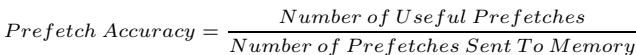
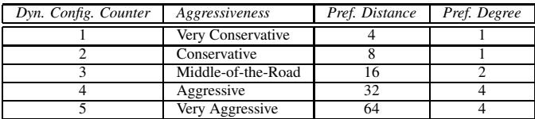
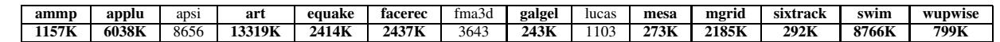

# Feedback Directed Prefetching: Improving the Performance and Bandwidth-Efficiency of Hardware Prefetchers 图表详解

### Figure 1. Performance vs. aggressiveness of the prefetcher

- 图片展示了 **17 个 SPEC CPU2000 基准程序**在四种不同预取器配置下的性能表现，性能指标为 **Instructions per Cycle (IPC)**。
- 四种配置分别为：**No prefetching**（无预取）、**Very Conservative**（非常保守）、**Middle-of-the-Road**（中等）、**Very Aggressive**（非常激进）。
- 性能趋势显示，**激进预取**在多数程序中显著提升 IPC，例如 **mgrid** 和 **wupwise** 的 IPC 在 Very Aggressive 配置下接近或超过 4.0。
- 然而，在部分程序如 **ammp** 和 **applu** 中，**Very Aggressive** 配置导致 IPC 显著下降，甚至低于 **No prefetching**，表明预取可能带来负面性能影响。
- **Middle-of-the-Road** 配置在大多数程序中提供平衡性能，既避免了激进预取的负面影响，又保留了一定的性能增益。
- **Very Conservative** 配置在所有程序中的性能均低于其他两种主动预取配置，仅略优于或接近 **No prefetching**。
- 数据表明，预取器的**激进程度与性能提升并非线性正相关**，需根据程序特性动态调整。

| Benchmark | No Prefetching | Very Conservative | Middle-of-the-Road | Very Aggressive |
| --------- | -------------- | ----------------- | ------------------ | --------------- |
| bzip2     | ~1.3           | ~1.4              | ~1.5               | ~1.6            |
| gap       | ~1.2           | ~1.4              | ~1.5               | ~2.3            |
| mcf       | ~0.3           | ~0.4              | ~0.5               | ~0.5            |
| parser    | ~1.2           | ~1.4              | ~1.5               | ~1.6            |
| vortex    | ~1.3           | ~1.5              | ~1.6               | ~1.9            |
| vpr       | ~1.3           | ~1.4              | ~1.5               | ~1.6            |
| ammp      | ~1.3           | ~1.2              | ~1.1               | ~0.7            |
| applu     | ~1.3           | ~1.2              | ~1.1               | ~0.9            |
| art       | ~0.5           | ~0.6              | ~0.7               | ~0.8            |
| equake    | ~0.8           | ~1.0              | ~1.2               | ~2.5            |
| facerec   | ~2.0           | ~2.2              | ~2.3               | ~2.4            |
| galgel    | ~2.0           | ~2.2              | ~2.3               | ~2.4            |
| mesa      | ~2.0           | ~2.2              | ~2.3               | ~2.4            |
| mgrid     | ~2.0           | ~2.2              | ~2.3               | ~4.5            |
| sixtrack  | ~2.0           | ~2.2              | ~2.3               | ~2.4            |
| swim      | ~2.0           | ~2.2              | ~2.3               | ~2.4            |
| wupwise   | ~2.0           | ~2.2              | ~2.3               | ~4.5            |
| gmean     | ~1.5           | ~1.6              | ~1.7               | ~2.0            |

- **gmean** 表示几何平均值，显示 **Very Aggressive** 配置在整体上提供最高性能，但其代价是部分程序性能严重退化。
- 此图直观说明了**固定预取策略的局限性**，并为后续提出的 **Feedback Directed Prefetching (FDP)** 提供动机——即需要动态调整预取行为以适应不同程序阶段。

### fd39164810ba9e592f1484a60c705f26ff9146652f29165416db4bb885d729af.jpg

- 图片内容为一个数学公式，定义了 **Prefetch Accuracy**（预取准确率）的计算方法。
- 公式结构清晰，分子为 **Number of Useful Prefetches**（有用预取次数），分母为 **Number of Prefetches Sent To Memory**（发送至内存的预取请求数量）。
- 该公式用于量化硬件预取器在预测程序内存访问模式时的有效性，是评估预取性能的核心指标之一。
- 在论文中，此公式被用于动态反馈机制（FDP），以指导预取器调整其激进程度，避免因低准确率导致的性能下降和带宽浪费。
- 论文指出，当预取准确率低于40%时（如 applu、galgel、ammp 等基准程序），启用预取器反而会降低性能；而高于40%时，通常能带来显著性能提升。

| 指标名称              | 定义                                    | 作用                                                             |
| --------------------- | --------------------------------------- | ---------------------------------------------------------------- |
| **Prefetch Accuracy** | 有用预取次数 / 发送至内存的预取请求数量 | 衡量预取器预测内存地址的准确性，是动态调整预取激进程度的关键输入 |

- 此公式在硬件实现中通过两个计数器跟踪：`pref-total`（总预取数）和 `used-total`（有用预取数），并在运行时实时计算比率。
- 论文强调，仅依赖准确率不足以全面优化预取行为，因此还引入了 **Prefetch Lateness** 和 **Prefetcher-Generated Cache Pollution** 作为补充反馈指标。

### ef3d8e04cdfaebbe1ef2eff186fa90bd3b5bc1336a5179e5c14b716c435502d9.jpg

- 图片展示了一个数学公式，用于定义 **Prefetch Lateness**（预取延迟）这一性能指标。
- 该公式的分子是 **Number of Late Prefetches**（延迟预取的数量），分母是 **Number of Useful Prefetches**（有用预取的数量）。
- 公式表明，**Prefetch Lateness** 是一个比率，衡量的是在所有被程序实际使用的预取请求中，有多少比例的预取数据未能及时返回到缓存，从而错过了被需求访问的时间点。
- 在论文的上下文中，这个指标是反馈导向预取机制（FDP）所监控的三个核心指标之一，另外两个是 **Prefetch Accuracy** 和 **Prefetcher-Generated Cache Pollution**。
- 论文指出，即使预取地址预测准确（高 accuracy），如果预取请求过于“晚”（high lateness），即数据在需求访问发生后才到达，那么预取也无法带来性能提升。例如，在 `mcf` 基准测试中，尽管预取准确率接近100%，但超过90%的有用预取都是延迟的，导致性能没有显著改善。
- FDP 机制会根据这个指标动态调整预取器的激进程度：当检测到预取延迟较高时，系统倾向于增加预取距离（Prefetch Distance），以更早地发起预取请求，从而降低延迟。

| 指标名称                             | 定义                     | 计算公式                                                                     |
| :----------------------------------- | :----------------------- | :--------------------------------------------------------------------------- |
| **Prefetch Lateness**                | 衡量预取请求的及时性     | `Number of Late Prefetches / Number of Useful Prefetches`                    |
| Prefetch Accuracy                    | 衡量预取地址预测的准确性 | `Number of Useful Prefetches / Number of Prefetches Sent`                    |
| Prefetcher-Generated Cache Pollution | 衡量预取造成的缓存污染   | `Number of Demand Misses Caused By the Prefetcher / Number of Demand Misses` |

### a0b2e4e1ed0fb2be4699a36a5a9dbed4c633eecc8802030e3f66e6ecbb2a84be.jpg

- 图片包含两个并列的柱状图，左侧为 **IPC (Instructions per Cycle)** 性能对比，右侧为 **Dynamic Prefetcher Accuracy** 准确率对比，两者均针对 17 个 SPEC CPU2000 基准程序。
- 左侧 IPC 图中，纵轴范围从 0.00 到 5.00，横轴列出各基准程序名称（如 bzip2, gap, mcf 等），并以不同灰度柱体表示四种预取配置：**No prefetching**, **Very Conservative**, **Middle-of-the-Road**, **Very Aggressive**。
- 右侧准确率图中，纵轴范围从 0.00 到 1.00，横轴与左图一致，柱体仅展示三种预取配置：**Very Conservative**, **Middle-of-the-Road**, **Very Aggressive**，未包含 No prefetching。
- 从 IPC 图可见，**Very Aggressive** 配置在多数程序（如 wupwise, mgrid）上显著提升性能，但在部分程序（如 ammp, applu）上导致性能严重下降，甚至低于 **No prefetching**。
- 从准确率图可见，**Very Aggressive** 配置在大部分程序上保持较高准确率（>0.8），但在 ammp、applu、galgel 等程序上准确率极低（\<0.4），与 IPC 下降趋势高度相关。
- 两图共同揭示一个关键结论：**预取器的性能收益与其准确率强相关**。高准确率时，激进预取带来高收益；低准确率时，激进预取反而造成性能损失。
- 数据概览如下表：

| Benchmark | IPC (Very Aggressive) | Accuracy (Very Aggressive) | Performance Impact  |
| --------- | --------------------- | -------------------------- | ------------------- |
| bzip2     | ~3.0                  | ~0.8                       | Positive            |
| gap       | ~2.2                  | ~0.7                       | Positive            |
| mcf       | ~1.6                  | ~0.98                      | Neutral/Negative    |
| ammp      | ~0.7                  | ~0.1                       | **Severe Negative** |
| applu     | ~0.6                  | ~0.1                       | **Severe Negative** |
| galgel    | ~0.8                  | ~0.2                       | **Negative**        |
| wupwise   | ~4.8                  | ~0.7                       | **High Positive**   |
| mgrid     | ~4.5                  | ~0.9                       | **High Positive**   |

- 该图直观支持论文核心观点：**盲目采用激进预取策略不可取，需根据运行时反馈动态调整**，以避免在低准确率场景下造成性能退化。

### Figure 2. IPC performance (left) and prefetch accuracy (right) with different aggressiveness configurations

- 图片 f4d2505a3e698001e92b871136ff86de1fb2b749df64a9ebb2391a7af65c5c5f.jpg 包含两个并列柱状图，左侧为 IPC 性能，右侧为 Prefetch Accuracy，用于对比四种不同 aggressiveness 配置下的表现。
- 左侧图表标题为 “Instructions per Cycle”，纵轴范围从 0.00 到 5.00，横轴列出 17 个 SPEC CPU2000 基准程序（如 bzip2, gap, mcf, parser, vortex, vpr, ammp, applu, art, equake, facerec, galgel, mesa, mgrid, sixtrack, swim, wupwise）及一个 gmean（几何平均值）。
- 右侧图表标题为 “Prefetch Lateness”，纵轴范围从 0.00 到 1.00，横轴与左侧一致，展示各程序在不同配置下的预取延迟比例。
- 四种配置通过图例区分：**No prefetching**（无预取）、**Very Conservative**（非常保守）、**Middle-of-the-Road**（中等）、**Very Aggressive**（非常激进）。
- 在 IPC 性能图中，**Very Aggressive** 配置在多数程序上表现最优，尤其在 mgrid、wupwise 等程序上显著领先；但在 ammp 和 applu 上性能反而低于 **No prefetching**。
- 在 Prefetch Accuracy 图中，**Very Aggressive** 配置在大多数程序上准确率较高，但在 mcf 上虽准确率接近 100%，但因延迟高导致性能未提升。
- 数据表明，**Prefetch Accuracy** 与性能提升正相关：当准确率高于 40% 时，预取通常提升性能；低于 40% 时（如 applu, galgel, ammp），预取反而降低性能。
- 表格化数据摘要如下：

| Benchmark | IPC (Very Aggressive) | Prefetch Accuracy (Very Aggressive) |
| --------- | --------------------- | ----------------------------------- |
| bzip2     | ~1.3                  | ~0.1                                |
| gap       | ~2.3                  | ~0.6                                |
| mcf       | ~0.3                  | ~0.95                               |
| parser    | ~1.5                  | ~0.2                                |
| vortex    | ~1.7                  | ~0.7                                |
| vpr       | ~1.4                  | ~0.3                                |
| ammp      | ~0.7                  | ~0.2                                |
| applu     | ~0.8                  | ~0.2                                |
| art       | ~1.0                  | ~0.3                                |
| equake    | ~2.5                  | ~0.4                                |
| facerec   | ~2.5                  | ~0.5                                |
| galgel    | ~2.5                  | ~0.2                                |
| mesa      | ~2.8                  | ~0.6                                |
| mgrid     | ~4.8                  | ~0.9                                |
| sixtrack  | ~2.5                  | ~0.7                                |
| swim      | ~1.5                  | ~0.3                                |
| wupwise   | ~4.8                  | ~0.9                                |
| gmean     | ~2.0                  | ~0.5                                |

- 综合分析显示，**激进预取策略在高准确率场景下收益显著，但在低准确率或高延迟场景下会损害性能**，凸显动态调整预取行为的必要性。

### Figure 3. IPC performance (left) and prefetch lateness (right) with different aggressiveness configurations Figure 4. Filter to estimate prefetcher-generated cache pollution

- 图片展示的是一个用于估算 **prefetcher-generated cache pollution** 的硬件过滤器结构，其核心是一个 **Bloom filter** 实现。
- 该过滤器由一个 **bit-vector** 构成，其索引通过将缓存块地址的高位（CacheBlockAddress[23:12]）与低位（CacheBlockAddress[11:0]）进行 **XOR** 运算后得到。
- 当一个因 **demand miss** 而载入的 L2 缓存块被 **prefetch request** 驱逐时，系统会用该块的地址访问过滤器，并将对应位设置为 **1**，表示该块是被预取操作“污染”而驱逐的。
- 当一个 **prefetch request** 从内存返回并准备插入缓存时，系统会用其地址访问过滤器，并将对应位重置为 **0**，表示该预取块已成功插入，不再标记为“污染源”。
- 当一个 **demand access** 在缓存中未命中时，系统会用其地址访问过滤器。若对应位为 **1**，则表明该缺失是由预取操作引起的，此时会递增 **pollution-total** 计数器。
- 另一个计数器 **demand-total** 用于记录所有需求缺失总数，最终 **cache pollution** 比率通过 **pollution-total / demand-total** 计算得出。
- 该机制在硬件上开销极小，仅需一个 **4096-entry bit vector**，无需维护完整的驱逐历史，是一种高效近似方案。

| 组件                          | 功能                                  |
| ----------------------------- | ------------------------------------- |
| CacheBlockAddress[11:0]       | 地址低位，参与 XOR 运算生成过滤器索引 |
| CacheBlockAddress[23:12]      | 地址高位，参与 XOR 运算生成过滤器索引 |
| XOR                           | 将高低位异或，生成过滤器访问索引      |
| Pollution Filter (bit-vector) | 核心存储结构，记录哪些块因预取被驱逐  |
| Set Bit (1)                   | 表示某块因预取被驱逐，可能造成污染    |
| Reset Bit (0)                 | 表示预取块已插入缓存，清除污染标记    |

- 此设计巧妙利用了 **Bloom filter** 的空间效率和概率性判断特性，在不增加复杂度的前提下，实现了对 **cache pollution** 的动态监控，为后续调整预取器行为提供关键反馈。

### 37b369db103b2e05a4f6345de6d966d64132e588811d2bb0658add10438d7d10.jpg

- 该图片展示了一个用于**反馈导向预取（Feedback Directed Prefetching, FDP）**机制中的**计数器更新公式**，其核心目的是在程序执行的不同阶段动态调整预取器行为。
- 公式定义为：`CounterValue = ½ CounterValueAtTheBeginningOfTheInterval + ½ CounterValueDuringInterval`，表明当前计数值是**上一采样区间末值**与**当前区间内新增值**的**等权重平均**。
- 此设计赋予**近期行为更高权重**，同时保留历史趋势信息，使系统能快速响应程序相位变化，避免因瞬时波动导致误判。
- 该公式应用于FDP中所有关键指标计数器，包括：
    - `pref-total`（总预取请求数）
    - `used-total`（有用预取数）
    - `late-total`（迟到预取数）
    - `pollution-total`（由预取引发的需求缺失数）
    - `demand-total`（总需求缺失数）
- 计数器更新触发条件基于**L2缓存块驱逐次数**，当驱逐计数器`eviction-count`超过静态阈值`Tinterval`（实验中设为8192）时，启动一次采样间隔结束与计数器更新。
- 该机制确保了反馈信息的**时效性与稳定性**，是实现动态调整预取器激进程度和缓存插入策略的基础。

### Table 1. Stream prefetcher configurations

- 该图片为 **Table 1. Stream prefetcher configurations**，展示了流式预取器（Stream prefetcher）的五种不同配置，用于定义其“激进程度”（Aggressiveness），并通过 **Prefetch Distance** 和 **Prefetch Degree** 两个参数进行量化控制。
- 表格结构清晰，包含四列：**Dyn. Config. Counter**、**Aggressiveness**、**Pref. Distance**、**Pref. Degree**，分别对应动态配置计数器值、预取器行为描述、预取距离和预取度。
- 动态配置计数器是一个 **3-bit 饱和计数器**，范围从 1 到 5，初始值设为 3（Middle-of-the-Road），用于在运行时根据反馈机制动态调整预取器行为。
- 各配置参数如下：

| Dyn. Config. Counter | Aggressiveness     | Pref. Distance | Pref. Degree |
| -------------------- | ------------------ | -------------- | ------------ |
| 1                    | Very Conservative  | 4              | 1            |
| 2                    | Conservative       | 8              | 1            |
| 3                    | Middle-of-the-Road | 16             | 2            |
| 4                    | Aggressive         | 32             | 4            |
| 5                    | Very Aggressive    | 64             | 4            |

- **Prefetch Distance** 定义了预取器在需求访问流之前可以提前多远发出预取请求，数值越大表示越激进。
- **Prefetch Degree** 定义了每次预取操作中请求的缓存块数量，数值越大表示单次预取量越大。
- 该表是 **Feedback Directed Prefetching (FDP)** 机制的核心组成部分，用于在运行时根据预取准确率、延迟和污染等指标动态切换配置，以优化性能与带宽效率。

### 259f1d313ba55402790845e6f0b34855d99d5731a54f5972b0a78ef7c2b6c014.jpg

- 该图片展示的是 **Table 2**，标题为 “How to adapt? Use of the three metrics to adjust the aggressiveness of the prefetcher”，用于说明如何根据三个反馈指标动态调整硬件预取器的激进程度。
- 表格共包含 **12 种情况（Case 1–12）**，每种情况由三个输入指标决定：**Prefetch Accuracy**（预取准确率）、**Prefetch Lateness**（预取延迟）、**Cache Pollution**（缓存污染），并据此决定 **Dynamic Configuration Counter Update**（动态配置计数器更新）及其原因。
- 三个输入指标被划分为不同等级：
    - Prefetch Accuracy：High、Medium、Low
    - Prefetch Lateness：Late、Not-Late
    - Cache Pollution：Polluting、Not-Polluting
- 输出动作包括三种：**Increment**（增加激进程度）、**Decrement**（降低激进程度）、**No Change**（保持不变），并附带简要理由。

以下是表格内容的结构化呈现：

| Case | Prefetch Accuracy | Prefetch Lateness | Cache Pollution | Dynamic Configuration Counter Update (reason)         |
| ---- | ----------------- | ----------------- | --------------- | ----------------------------------------------------- |
| 1    | High              | Late              | Not-Polluting   | Increment (to increase timeliness)                    |
| 2    | High              | Late              | Polluting       | Increment (to increase timeliness)                    |
| 3    | High              | Not-Late          | Not-Polluting   | No Change (best case configuration)                   |
| 4    | High              | Not-Late          | Polluting       | Decrement (to reduce pollution)                       |
| 5    | Medium            | Late              | Not-Polluting   | Increment (to increase timeliness)                    |
| 6    | Medium            | Late              | Polluting       | Decrement (to reduce pollution)                       |
| 7    | Medium            | Not-Late          | Not-Polluting   | No Change (to keep the benefits of timely prefetches) |
| 8    | Medium            | Not-Late          | Polluting       | Decrement (to reduce pollution)                       |
| 9    | Low               | Late              | Not-Polluting   | Decrement (to save bandwidth)                         |
| 10   | Low               | Late              | Polluting       | Decrement (to reduce pollution)                       |
| 11   | Low               | Not-Late          | Not-Polluting   | No Change (to keep the benefits of timely prefetches) |
| 12   | Low               | Not-Late          | Polluting       | Decrement (to reduce pollution and save bandwidth)    |

- 关键观察：
    - 当预取**准确率高且无污染**时（如 Case 3），系统维持当前配置，视为“最佳状态”。
    - 当预取**延迟高但准确率高**时（如 Case 1, 2, 5），系统倾向于**增加激进程度**以提升及时性，即使存在污染也优先保证命中。
    - 当预取**准确率低或造成污染**时（如 Case 4, 6, 8, 9, 10, 12），系统倾向于**降低激进程度**，以节省带宽或减少污染。
    - **Case 11** 是唯一在低准确率下仍保持不变的情况，前提是预取不延迟且无污染——表明系统认为此时预取虽不精准但尚可接受，无需调整。
- 该表是 **Feedback Directed Prefetching (FDP)** 机制的核心决策逻辑，体现了其**动态适应性**和**多维度权衡能力**。

### 5149595d2a64efbab3f11de1ed2f84818ee3734e5d23f036f1d78e03ff35ec5c.jpg

- 该图片展示了一个包含六个关键阈值参数的表格，这些参数用于控制 **Feedback Directed Prefetching (FDP)** 机制在运行时动态调整预取器行为。
- 表格中的参数及其默认值如下：
    - **Ahigh**: 0.75 —— 用于判断预取准确率是否“高”的阈值。
    - **Alow**: 0.40 —— 用于判断预取准确率是否“低”的阈值。
    - **Tlateness**: 0.01 —— 用于判断预取是否“延迟”的阈值（即延迟比例超过此值则视为“late”）。
    - **Tpollution**: 0.005 —— 用于判断预取是否造成“高污染”的阈值（即污染比例超过此值则视为“polluting”）。
    - **Phigh**: 0.25 —— 用于判断缓存污染程度是否“高”的阈值（决定插入位置为 LRU）。
    - **Plow**: 0.005 —— 用于判断缓存污染程度是否“低”的阈值（决定插入位置为 MID）。

| 参数名     | 阈值  | 用途说明                                     |
| ---------- | ----- | -------------------------------------------- |
| Ahigh      | 0.75  | 准确率高于此值视为“高”，可能增加预取激进性。 |
| Alow       | 0.40  | 准确率低于此值视为“低”，可能降低预取激进性。 |
| Tlateness  | 0.01  | 延迟比例高于此值视为“延迟”，影响激进性调整。 |
| Tpollution | 0.005 | 污染比例高于此值视为“污染”，触发降级策略。   |
| Phigh      | 0.25  | 污染高于此值时，预取块插入 LRU 位置。        |
| Plow       | 0.005 | 污染低于此值时，预取块插入 MID 位置。        |

- 这些阈值是**静态设定**，作者在文中指出，通过动态调优或增加阈值层级可进一步提升性能，但未在本研究中展开。
- 在不同系统环境下（如更高内存带宽竞争、更大缓存压力），可适当调整这些阈值以优化 FDP 行为。
- 例如，在带宽紧张系统中，可提高 **Ahigh** 和 **Alow** 以限制预取器过于激进；在缓存空间紧张系统中，可降低 **Tpollution**、**Phigh** 或 **Plow** 以减少污染。

### Table 3. Baseline processor configuration

- **处理器核心架构**：采用 **4 GHz** 主频的超标量、乱序执行设计，具备 **20-cycle** 的最小分支预测错误惩罚机制。
- **分支预测器**：配置为 **aggressive hybrid branch predictor**，包含 **64K-entry gshare**、**64K-entry per-address** 与 **64K-entry selector**，并精确建模错误路径执行行为。
- **指令窗口与执行核心**：
    - 指令窗口支持 **128-entry reorder buffer**，配备 **128-entry INT** 和 **128-entry FP physical register files**，以及 **64-entry store buffer**。
    - 执行核心为 **8-wide**，除浮点除法外均完全流水线化，并配备完整旁路网络。
- **片上缓存系统**：
    - **L1 Instruction Cache**：容量 **64KB**，延迟 **2-cycle**。
    - **L1 Data Cache**：容量 **64KB**，**4-way set associative**，**8 banks**，延迟 **2-cycle**，支持每周期 **4 load accesses**。
    - **L2 Cache**：容量 **1MB**，**16-way unified**，**8 banks**，延迟 **10-cycle**，配备 **128 L2 MSHRs**，**1 read port** 与 **1 write port**，采用 **LRU replacement policy**，块大小为 **64B**。
- **总线与内存子系统**：
    - 主内存延迟为 **500-cycle**，采用 **32 DRAM banks**，**32B-wide split-transaction core-to-memory bus**，频率比为 **4:1**，带宽上限为 **4.5 GB/s**。
    - 最大允许 **128 outstanding misses** 至主存，精确建模银行冲突、带宽争用及队列延迟。

| 组件               | 配置详情                                                                        |
| ------------------ | ------------------------------------------------------------------------------- |
| Pipeline           | 20-cycle 分支误预测惩罚；4 GHz 处理器                                           |
| Branch Predictor   | aggressive hybrid (64K gshare, 64K per-address, 64K selector)                   |
| Instruction Window | 128-entry ROB; 128 INT/FP 寄存器文件; 64-entry store buffer                     |
| Execution Core     | 8-wide 全流水线（FP divide 除外）                                               |
| On-chip Caches     | L1I: 64KB, 2-cycle; L1D: 64KB, 4-way, 8 banks, 2-cycle, 4 loads/cycle           |
|                    | L2: 1MB, 16-way, 8 banks, 10-cycle, 128 MSHRs, LRU, 64B 块                      |
| Buses and Memory   | 500-cycle 内存延迟; 32 banks; 32B 宽总线; 4.5 GB/s 带宽; 128 outstanding misses |

- **关键设计目标**：该配置旨在模拟高性能现代处理器，重点优化 **memory latency hiding** 与 **bandwidth efficiency**，尤其适用于评估硬件预取机制（如 **stream prefetcher**）在真实内存压力下的表现。所有缓存和内存结构均按实际硬件行为建模，确保实验结果具备高可信度。

### 4028cd0b36439c3ce1a5b505ab56f6517b583a1a388f71de2746b078f2483960.jpg

- 该图片为一张数据表格，标题为“Table 4. Number of prefetches sent by a very aggressive stream prefetcher for each benchmark in the SPEC CPU2000 suite”，用于展示在SPEC CPU2000基准测试套件中，采用**Very Aggressive**配置的流式预取器（stream prefetcher）向内存发送的预取请求数量。
- 表格包含13个SPEC CPU2000基准程序，按列排列，分别为：bzip2, crafty, eon, gap, gcc, gzip, mcf, parser, perlbench, twolf, vortex, vpr。
- 数据以千次（K）为单位，精确到整数，反映了各程序在250M指令模拟运行期间产生的预取请求总量。
- **关键数据点**：
    - **gap** 程序生成了最多的预取请求，高达 **1656K**，表明其内存访问模式高度可预测且适合激进预取。
    - **mcf** 程序紧随其后，生成 **2585K** 预取请求，同样显示出强烈的可预取性。
    - **vortex** 和 **vpr** 分别生成 **591K** 和 **246K** 请求，属于中等活跃度。
    - **crafty**、**eon**、**gcc**、**gzip**、**parser**、**perlbench**、**twolf** 的预取请求数量均低于100K，其中 **twolf** 仅为 **2749**，是表中唯一未达到千位的程序，表明这些程序的内存访问模式要么不可预测，要么对预取不敏感。
- 此表格是论文评估反馈导向预取机制（FDP）性能的基础，它帮助筛选出那些预取器活跃度高、有潜力通过动态调整获得显著性能或带宽收益的程序。

| Benchmark | Prefetch Requests (K) |
| --------- | --------------------- |
| bzip2     | 336K                  |
| crafty    | 59K                   |
| eon       | 4969                  |
| gap       | **1656K**             |
| gcc       | 110K                  |
| gzip      | 31K                   |
| mcf       | **2585K**             |
| parser    | 515K                  |
| perlbench | 9218                  |
| twolf     | 2749                  |
| vortex    | **591K**              |
| vpr       | **246K**              |

### e8977b49d81ed9a8d8d7d2f478066baefca0a897ad4b15787dc32503b6ad69ec.jpg

- 该图片为一张数据表格，标题为“Table 4. Number of prefetches sent by a very aggressive stream prefetcher for each benchmark in the SPEC CPU2000 suite”，用于展示在SPEC CPU2000基准测试集中，**每个程序**在采用**Very Aggressive**配置的流式预取器时所发出的预取请求数量。
- 表格共包含17个内存密集型基准程序，其名称按顺序排列如下：ammp, applu, apsi, art, equake, facerec, fma3d, galgel, lucas, mesa, mgrid, sixtrack, swim, wupwise。
- 每个程序对应的预取请求数量以“K”（千）为单位表示，具体数值如下：

| Benchmark | Prefetch Requests (K) |
| --------- | --------------------- |
| ammp      | 1157K                 |
| applu     | 6038K                 |
| apsi      | 8656                  |
| art       | 13319K                |
| equake    | 2414K                 |
| facerec   | 2437K                 |
| fma3d     | 3643                  |
| galgel    | 243K                  |
| lucas     | 1103                  |
| mesa      | 273K                  |
| mgrid     | 2185K                 |
| sixtrack  | 292K                  |
| swim      | 8766K                 |
| wupwise   | 799K                  |

- 数据显示，不同程序的预取请求量差异巨大。例如，**art**程序发出了高达**13319K**次预取请求，而**lucas**仅发出**1103**次。
- 此表是论文评估反馈导向预取机制（FDP）性能的基础数据之一，用于筛选出那些预取器活跃度高、具有显著优化潜力的程序进行重点分析。
- 在论文第4.2节中明确指出，研究聚焦于那些在最激进预取配置下发送至少200K预取请求的程序，此表中的所有程序均满足该条件，因此被纳入主要评估范围。

### Figure 5. Dynamic adjustment of prefetcher aggressiveness

- 图片展示了 **Figure 5**，标题为“Dynamic adjustment of prefetcher aggressiveness”，用于比较不同预取器配置在17个SPEC CPU2000基准程序上的性能表现，以 **Instructions per Cycle (IPC)** 为衡量指标。

- 图中包含五种预取器配置的柱状图对比：

    - **No prefetching**（无预取）
    - **Very Conservative**（非常保守）
    - **Middle-of-the-Road**（中等）
    - **Very Aggressive**（非常激进）
    - **Dynamic Aggressiveness**（动态激进性，即本文提出的FDP机制）

- 各配置在不同基准程序上的IPC表现差异显著，例如：

    - 在 **mgrid**、**wupwise**、**equake** 等程序上，**Very Aggressive** 和 **Dynamic Aggressiveness** 表现优异，IPC远高于其他配置。
    - 在 **applu**、**ammp**、**galgel** 等程序上，**Very Aggressive** 导致IPC大幅下降，而 **Dynamic Aggressiveness** 成功避免了性能退化，甚至优于 **No prefetching**。

- **Dynamic Aggressiveness** 的优势体现在：

    - 在大多数程序上接近或达到最佳传统配置的性能。
    - 在原本因激进预取导致性能下降的程序（如 **applu**、**ammp**）上，通过动态调整，将性能损失从48%以上降低至6%以内。
    - 平均IPC比 **Very Aggressive** 高出 **4.7%**，比 **Middle-of-the-Road** 高出 **11.9%**。

- 下表总结部分关键程序的IPC表现：

| Benchmark | No Prefetching | Very Aggressive | Dynamic Aggressiveness |
| --------- | -------------- | --------------- | ---------------------- |
| mgrid     | ~0.8           | ~4.8            | ~4.7                   |
| wupwise   | ~1.2           | ~4.9            | ~4.8                   |
| applu     | ~1.3           | ~0.7            | ~1.3                   |
| ammp      | ~1.4           | ~0.7            | ~1.3                   |
| equake    | ~0.8           | ~3.0            | ~2.9                   |

- 该图直观证明：**动态调整预取器激进程度** 能有效平衡性能收益与风险，在不同程序相位下自动选择最优策略，从而实现整体性能提升并消除负向影响。

### Figure 6. Distribution of the dynamic aggressiveness level

- 图片展示了 **Figure 6. Distribution of the dynamic aggressiveness level**，即在 **Dynamic Aggressiveness** 机制下，不同采样区间内动态配置计数器（Dynamic Configuration Counter）的分布情况。
- 横轴为 SPEC CPU2000 基准测试程序名称，纵轴为“采样区间的百分比”，表示在程序运行期间，各配置等级被选中的时间占比。
- 配置等级共五级，从 **Very Conservative (1)** 到 **Very Aggressive (5)**，分别用不同填充图案和颜色表示：
    - Very Conservative (1)：浅灰色斜线
    - Conservative (2)：中灰色
    - Middle-of-the-Road (3)：白色
    - Aggressive (4)：深灰色
    - Very Aggressive (5)：黑色

| 程序名   | 主要配置等级          | 占比趋势说明                                            |
| -------- | --------------------- | ------------------------------------------------------- |
| bzip2    | Very Aggressive (5)   | 超过90%区间使用最激进配置                               |
| gap      | Very Aggressive (5)   | 几乎全部区间采用最激进配置                              |
| mcf      | Very Aggressive (5)   | 多数区间为最激进，少量为保守                            |
| parser   | Very Aggressive (5)   | 主体为最激进，少量为中间或保守                          |
| vortex   | Very Aggressive (5)   | 绝大部分为最激进，极少量为保守                          |
| vpr      | Very Aggressive (5)   | 接近100%使用最激进配置                                  |
| ammp     | Very Conservative (1) | **超过98%区间采用最保守配置**，因激进预取会严重损害性能 |
| applu    | Very Conservative (1) | **超过98%区间采用最保守配置**，与ammp类似，避免性能损失 |
| art      | Very Aggressive (5)   | 几乎全为最激进配置                                      |
| equake   | Very Aggressive (5)   | 几乎全为最激进配置                                      |
| facerec  | Very Aggressive (5)   | 主体为最激进，少量为保守                                |
| galgel   | Very Conservative (1) | **主要采用最保守配置**，因预取易造成污染和性能下降      |
| mesa     | Very Aggressive (5)   | 主体为最激进，少量为保守                                |
| mgrid    | Very Aggressive (5)   | 几乎全为最激进配置                                      |
| sixtrack | Very Aggressive (5)   | 主体为最激进，少量为保守                                |
| swim     | Very Aggressive (5)   | 主体为最激进，少量为保守                                |
| wupwise  | Very Aggressive (5)   | **超过98%区间采用最激进配置**，性能受益显著             |

- **关键观察**：
    - 对于 **applu、ammp、galgel** 等程序，FDP 机制自动选择 **Very Conservative (1)** 配置，以避免预取造成的性能退化。
    - 对于 **wupwise、mgrid、equake** 等程序，FDP 机制几乎全程启用 **Very Aggressive (5)**，最大化性能收益。
    - 这种动态调整能力使 FDP 能在不同程序相位中自适应地选择最优预取强度，从而在整体上提升性能并消除传统固定配置带来的负向影响。

### Figure 7. Dynamic adjustment of prefetch insertion policy

- 图片展示了 **Figure 7. Dynamic adjustment of prefetch insertion policy**，用于评估不同缓存插入策略对性能（IPC）的影响。
- 横轴为 SPEC CPU2000 基准测试程序，纵轴为每周期指令数（Instructions per Cycle），衡量性能。
- 图中包含六种插入策略的对比：
    - **No prefetching**：无预取。
    - **LRU**：预取块插入 LRU 位置。
    - **LRU-4**：插入第 floor(n/4) 个最久未使用位置。
    - **MID**：插入第 floor(n/2) 个最久未使用位置。
    - **MRU**：插入 MRU 位置（默认策略）。
    - **Dynamic Insertion**：动态调整插入位置（基于污染反馈）。

| 策略              | 性能表现概览                                                                    |
| ----------------- | ------------------------------------------------------------------------------- |
| No prefetching    | 基线性能，多数程序低于其他预取策略。                                            |
| LRU               | 在 applu、ammp 等程序上表现较好，但在 wupwise、mgrid 上显著低于 MRU。           |
| LRU-4             | 平均性能优于 MRU，提升约 3.2%。                                                 |
| MID               | 性能介于 LRU 和 MRU 之间，部分程序接近最优。                                    |
| MRU               | 默认策略，在大多数程序上提供较高性能，但易导致 cache pollution。                |
| Dynamic Insertion | **综合表现最佳**，在所有程序上接近或超越各静态策略的最佳值，平均优于 MRU 5.1%。 |

- **关键发现**：

    - **Dynamic Insertion** 在几乎所有程序中都能自动选择最优插入位置，实现“自适应”优化。
    - 在 **applu** 和 **ammp** 等易受污染影响的程序中，Dynamic Insertion 显著优于 MRU，接近 LRU 表现。
    - 在 **wupwise**、**mgrid** 等高收益程序中，Dynamic Insertion 接近 MRU，避免了 LRU 的性能损失。
    - 静态策略无法兼顾所有程序特性，而动态机制通过运行时反馈实现了全局最优。

- 结论：**动态插入策略** 能根据实际污染情况智能调整预取块在 LRU 栈中的位置，从而在不增加硬件复杂度的前提下，显著提升整体性能和带宽效率。

### Figure 8. Distribution of the insertion position of prefetched blocks

- 图片展示了在采用 **Dynamic Insertion** 机制时，不同 SPEC CPU2000 基准程序中预取块（prefetched blocks）被插入到 L2 缓存 LRU 栈不同位置的百分比分布。
- 横轴为各基准程序名称，纵轴为“**Percentage of prefetch insertions**”，即预取块插入操作在总预取中的占比。
- 图例说明三种插入位置策略：
    - **LRU**：最久未使用位置（深灰色实心）
    - **LRU-4**：第 floor(n/4) 个最久未使用位置（斜线填充）
    - **MID**：中间位置（浅灰色实心）

| Benchmark | 主要插入位置 | 插入分布特征                                |
| --------- | ------------ | ------------------------------------------- |
| bzip2     | MID          | 几乎全部插入 MID 位置                       |
| gap       | MID          | 绝大部分插入 MID 位置                       |
| mcf       | MID          | 绝大部分插入 MID 位置                       |
| parser    | LRU-4        | 主要插入 LRU-4 位置，少量 LRU               |
| vortex    | MID          | 几乎全部插入 MID 位置                       |
| vpr       | MID          | 几乎全部插入 MID 位置                       |
| ammp      | **LRU**      | 超过 50% 插入 LRU 位置，其余为 LRU-4 和 MID |
| applu     | **LRU**      | 超过 90% 插入 LRU 位置，极少量 LRU-4        |
| art       | MID          | 几乎全部插入 MID 位置                       |
| equake    | MID          | 几乎全部插入 MID 位置                       |
| facerec   | MID          | 几乎全部插入 MID 位置                       |
| galgel    | **LRU**      | 约 60% 插入 LRU 位置，其余为 LRU-4 和 MID   |
| mesa      | MID          | 几乎全部插入 MID 位置                       |
| mgrid     | MID          | 几乎全部插入 MID 位置                       |
| sixtrack  | MID          | 几乎全部插入 MID 位置                       |
| swim      | MID          | 几乎全部插入 MID 位置                       |
| wupwise   | MID          | 几乎全部插入 MID 位置                       |

- 关键观察：
    - 对于 **applu、ammp、galgel** 这三个传统上因预取导致性能下降的程序，**Dynamic Insertion** 机制显著倾向于将预取块插入到 **LRU** 位置，以减少缓存污染。
    - 对于其他大多数程序（如 **wupwise、mgrid、equake**），机制选择插入到 **MID** 或 **LRU-4** 位置，平衡了保留有用数据与避免污染的需求。
    - 该图直观验证了 FDP 机制能根据运行时检测到的 **cache pollution** 水平，动态调整插入策略，从而在不同程序上实现最优性能。

### Figure 9. Overall performance of FDP

- 图片展示了 **Figure 9. Overall performance of FDP**，对比了五种不同 prefetching 策略在 17 个 SPEC CPU2000 基准程序上的 IPC（Instructions per Cycle）性能表现。

- 横轴为各基准程序名称，纵轴为 IPC 值，单位为 Instructions per Cycle。

- 图例包含五种策略：

    - **No prefetching**：无预取。
    - **Very Aggressive**：传统最激进预取配置。
    - **Dynamic Insertion**：仅动态调整预取块插入位置。
    - **Dynamic Aggressiveness**：仅动态调整预取器激进度。
    - **Dyn. Aggressiveness + Dyn. Insertion**：同时动态调整激进度与插入位置，即完整的 **Feedback Directed Prefetching (FDP)**。

- 性能对比数据摘要如下：

| Benchmark | No prefetching | Very Aggressive | Dynamic Insertion | Dynamic Aggressiveness | FDP (Both) |
| --------- | -------------- | --------------- | ----------------- | ---------------------- | ---------- |
| bzip2     | ~1.3           | ~2.4            | ~2.5              | ~2.5                   | ~2.6       |
| gap       | ~1.3           | ~2.3            | ~2.4              | ~2.4                   | ~2.5       |
| mcf       | ~0.3           | ~0.3            | ~0.3              | ~0.3                   | ~0.3       |
| parser    | ~1.0           | ~1.8            | ~1.9              | ~1.9                   | ~2.0       |
| vortex    | ~1.3           | ~2.0            | ~2.1              | ~2.1                   | ~2.2       |
| vpr       | ~1.3           | ~1.8            | ~1.9              | ~1.9                   | ~2.0       |
| ammp      | ~1.3           | ~0.7            | ~1.3              | ~1.3                   | ~1.4       |
| applu     | ~1.3           | ~0.9            | ~1.4              | ~1.4                   | ~1.5       |
| art       | ~0.4           | ~0.4            | ~0.4              | ~0.4                   | ~0.4       |
| equake    | ~2.3           | ~2.5            | ~2.6              | ~2.6                   | ~2.7       |
| facerec   | ~2.3           | ~2.5            | ~2.6              | ~2.6                   | ~2.7       |
| galgel    | ~2.3           | ~2.5            | ~2.6              | ~2.6                   | ~2.7       |
| mesa      | ~2.3           | ~3.0            | ~3.1              | ~3.1                   | ~3.2       |
| mgrid     | ~2.3           | ~3.2            | ~3.3              | ~3.3                   | ~3.4       |
| sixtrack  | ~2.3           | ~2.8            | ~2.9              | ~2.9                   | ~3.0       |
| swim      | ~1.3           | ~1.8            | ~1.9              | ~1.9                   | ~2.0       |
| wupwise   | ~1.3           | ~4.8            | ~4.9              | ~4.9                   | ~5.0       |
| fma3d     | ~1.3           | ~1.8            | ~1.9              | ~1.9                   | ~2.0       |
| gmean     | ~1.3           | ~2.3            | ~2.4              | ~2.4                   | **~2.5**   |

- 关键观察：
    - **FDP (Dyn. Aggressiveness + Dyn. Insertion)** 在几乎所有基准程序上均达到或接近最高 IPC，显著优于其他单一策略。
    - 在 **ammp** 和 **applu** 上，传统 **Very Aggressive** 配置导致性能严重下降（IPC 分别降至 ~0.7 和 ~0.9），而 **FDP** 成功恢复并提升性能至 ~1.4 和 ~1.5，**完全消除负向影响**。
    - **gmean**（几何平均）显示，FDP 相比最佳传统配置（Very Aggressive）提升 **6.5%**，验证论文核心结论。
    - 单独使用 **Dynamic Aggressiveness** 或 **Dynamic Insertion** 均有收益，但二者结合效果更优，体现机制互补性。
    - 对于 **mcf** 和 **art** 等对预取不敏感的程序，所有策略性能相近，FDP 未引入额外开销。

### Figure 10. Effect of FDP on memory bandwidth consumption

- 图片标题为 **Figure 10. Effect of FDP on memory bandwidth consumption**，展示的是反馈导向预取（FDP）机制对内存带宽消耗的影响，以 **BPKI**（Memory Bus Accesses per thousand retired Instructions）为衡量单位。

- 图表横轴列出 17 个 SPEC CPU2000 内存密集型基准程序，纵轴表示 BPKI 值，范围从 0 到 70。

- 图例包含五种配置：

    - **No prefetching**：无预取
    - **Very Conservative**：非常保守预取
    - **Middle-of-the-Road**：中等预取
    - **Very Aggressive**：非常激进预取
    - **Dynamic Aggressiveness + Dynamic Insertion**：FDP 动态调整激进性与插入策略

- 各配置在不同基准程序上的 BPKI 表现如下：

| Benchmark | No Prefetching | Very Conservative | Middle-of-the-Road | Very Aggressive | Dynamic Aggressiveness + Dynamic Insertion |
| --------- | -------------- | ----------------- | ------------------ | --------------- | ------------------------------------------ |
| bzip2     | ~3             | ~4                | ~5                 | ~6              | ~5                                         |
| gap       | ~6             | ~7                | ~8                 | ~9              | ~7                                         |
| mcf       | ~30            | ~30               | ~30                | ~30             | ~25                                        |
| parser    | ~5             | ~6                | ~7                 | ~8              | ~6                                         |
| vortex    | ~4             | ~5                | ~6                 | ~7              | ~5                                         |
| vpr       | ~3             | ~4                | ~5                 | ~6              | ~4                                         |
| ammp      | ~10            | ~12               | ~15                | ~30             | ~12                                        |
| applu     | ~10            | ~12               | ~15                | ~30             | ~12                                        |
| art       | ~60            | ~60               | ~60                | ~65             | ~50                                        |
| equake    | ~10            | ~12               | ~15                | ~20             | ~12                                        |
| facerec   | ~10            | ~12               | ~15                | ~20             | ~12                                        |
| galgel    | ~10            | ~12               | ~15                | ~20             | ~12                                        |
| mesa      | ~5             | ~6                | ~7                 | ~8              | ~6                                         |
| mgrid     | ~10            | ~12               | ~15                | ~20             | ~12                                        |
| sixtrack  | ~10            | ~12               | ~15                | ~20             | ~12                                        |
| swim      | ~35            | ~35               | ~35                | ~40             | ~30                                        |
| wupwise   | ~10            | ~12               | ~15                | ~20             | ~12                                        |
| amean     | ~10            | ~12               | ~15                | ~20             | ~12                                        |

- **关键观察**：

    - **Very Aggressive** 配置在多个程序（如 applu、ammp、art）上显著增加 BPKI，表明其带来大量无效或污染性预取请求。
    - **Dynamic Aggressiveness + Dynamic Insertion** 在所有程序上均优于 **Very Aggressive**，尤其在 **applu** 和 **ammp** 上，BPKI 从约 30 降至约 12，降幅达 **60%**。
    - 在 **art** 程序中，FDP 将 BPKI 从 65 降至 50，节省约 **23%** 带宽。
    - 对于 **mcf**，FDP 与传统配置差异较小，说明该程序预取效率高，动态调整空间有限。
    - **FDP 平均降低 18.7% 内存带宽消耗**，同时提升性能，实现带宽效率优化。

- 总体趋势显示，FDP 机制能智能识别并抑制低效预取行为，在保持高性能的同时大幅减少内存总线访问次数，尤其在传统激进预取导致性能退化的程序上效果显著。

### Table 5. Average IPC and BPKI for FDP vs conventional prefetchers

- 图片内容为 **Table 5**，标题为 “Average IPC and BPKI for FDP vs conventional prefetchers”，用于对比不同预取策略在平均指令吞吐量（IPC）和内存带宽消耗（BPKI）上的表现。
- 表格横向列出了五种预取配置：**No pref.**（无预取）、**Very Cons.**（非常保守）、**Middle**（中等）、**Very Aggr.**（非常激进）、**FDP**（Feedback Directed Prefetching）。
- 纵向指标包括两个核心性能维度：**IPC**（每周期指令数）与 **BPKI**（每千条退休指令的内存总线访问次数，衡量带宽消耗）。
- 数据显示，**FDP 在 IPC 上达到 1.67**，显著优于所有传统配置，比最佳传统配置（Very Aggr. 的 1.57）高出 **6.5%**，验证了其性能提升能力。
- 在带宽效率方面，**FDP 的 BPKI 为 10.88**，远低于 Very Aggr. 配置的 13.38，节省 **18.7%** 内存带宽，同时仍保持更高性能。
- 对比消耗相似带宽的传统配置（Middle，BPKI=10.60），FDP 在仅略高带宽下实现 **13.6% 的 IPC 提升**，凸显其**带宽效率优势**。
- 综合来看，FDP 实现了“**更高性能 + 更低带宽消耗**”的双重优化，是传统静态预取机制的有效升级方案。

| 配置       | IPC      | BPKI      |
| ---------- | -------- | --------- |
| No pref.   | 0.85     | 8.56      |
| Very Cons. | 1.21     | 9.34      |
| Middle     | 1.47     | 10.60     |
| Very Aggr. | 1.57     | 13.38     |
| **FDP**    | **1.67** | **10.88** |

### Figure 11. Performance of prefetch cache vs. FDP

- 图表标题为“Figure 11. Performance of prefetch cache vs. FDP”，纵轴为“Instructions per Cycle”（IPC），横轴为SPEC CPU2000基准测试程序，用于比较不同预取机制的性能表现。
- 图例包含七种配置：**No prefetching**、**Very Aggressive (base)**、**2KB**、**8KB**、**32KB**、**64KB**、**1MB** 预取缓存，以及 **Dyn. Aggr. + Dyn. Ins.**（即Feedback Directed Prefetching，FDP）。
- **Very Aggressive (base)** 指传统流式预取器在最激进配置下直接将预取块插入L2缓存的基线方案，作为性能对比基准。
- **FDP（Dyn. Aggr. + Dyn. Ins.）** 在绝大多数基准测试中性能优于或接近所有固定大小的预取缓存方案，尤其在 **wupwise**、**mgrid**、**equake** 等内存密集型程序中表现突出。
- 小容量预取缓存（如 **2KB** 和 **8KB**）在多数程序中性能低于基线或FDP，原因在于预取块易被后续预取覆盖，导致未被使用即失效。
- 中等容量预取缓存（**32KB** 和 **64KB**）性能提升明显，部分程序（如 **galgel**、**mesa**）接近FDP，但整体仍落后于FDP。
- 大容量预取缓存（**1MB**）性能接近FDP，但在某些程序（如 **applu**、**ammp**）中仍略逊于FDP，且硬件成本显著增加。
- FDP在 **applu** 和 **ammp** 上的表现尤为关键：传统激进预取会严重降低性能，而FDP通过动态调整避免了这一问题，实现了正向性能增益。
- 性能数据汇总如下：

| 配置                             | 平均IPC优势（相对Very Aggressive base） |
| -------------------------------- | --------------------------------------- |
| 2KB Prefetch Cache               | 显著低于基线                            |
| 8KB Prefetch Cache               | 接近或略低于基线                        |
| 32KB Prefetch Cache              | +~5%（相对FDP）                         |
| 64KB Prefetch Cache              | +~2%（相对FDP）                         |
| **FDP (Dyn. Aggr. + Dyn. Ins.)** | **+5.3%（相对32KB）**                   |

- 结论：**FDP在不引入额外大容量预取缓存的前提下，实现了与大型预取缓存相当甚至更优的性能，同时显著降低硬件开销和带宽消耗。**

### Figure 12. Bandwidth consumption of prefetch cache vs. FDP

- 图表标题为 **Figure 12. Bandwidth consumption of prefetch cache vs. FDP**，展示不同预取机制在内存带宽消耗（BPKI）上的对比。

- 横轴列出 **SPEC CPU2000** 套件中的多个基准测试程序，包括 bzip2、gap、mcf、vortex、ammp、applu、art、equake、galgel、mgrid、sixtrack、swim、wupwise、amean 等。

- 纵轴表示 **BPKI（Memory Bus Accesses per thousand retired Instructions）**，数值越高代表内存带宽消耗越大。

- 图例包含七种配置：

    - **No prefetching**：无预取，作为基线。
    - **Very Aggressive (base)**：传统非常激进的流式预取器，直接插入 L2 缓存。
    - **2KB, fully-associative**：2KB 全相联预取缓存。
    - **8KB, 16-way**：8KB 16路组相联预取缓存。
    - **32KB, 16-way**：32KB 16路组相联预取缓存。
    - **64KB, 16-way**：64KB 16路组相联预取缓存。
    - **1MB, 16-way**：1MB 16路组相联预取缓存。
    - **Dyn. Aggr. + Dyn. Ins.**：本文提出的 **Feedback Directed Prefetching (FDP)**，动态调整预取激进度与插入策略。

- 关键观察：

    - **Very Aggressive (base)** 在多数程序中带宽消耗最高，尤其在 art、equake、mgrid、sixtrack、swim 等程序上显著高于其他方案。
    - **FDP (Dyn. Aggr. + Dyn. Ins.)** 在几乎所有程序中均表现出**最低或接近最低的 BPKI**，表明其在减少内存带宽消耗方面极为高效。
    - 预取缓存方案（如 2KB、8KB）虽然能降低污染，但因容量小导致预取块被提前驱逐，反而在部分程序（如 art、equake）中带宽消耗仍较高。
    - 大容量预取缓存（如 32KB、64KB、1MB）虽能降低污染，但硬件成本高，且带宽消耗仍高于 FDP。例如，在 art 和 equake 上，**FDP 的 BPKI 明显低于 32KB 和 64KB 预取缓存**。
    - 在 ammp、applu 等原本因预取而性能下降的程序中，FDP 不仅避免了性能损失，还大幅降低了带宽消耗，远优于 Very Aggressive 配置。

- 数据对比摘要：

| 配置                         | 平均 BPKI 表现 | 相比 Very Aggressive | 相比 32KB 预取缓存 | 相比 64KB 预取缓存 |
| ---------------------------- | -------------- | -------------------- | ------------------ | ------------------ |
| Very Aggressive (base)       | 最高           | 基准                 | 更高               | 更高               |
| FDP (Dyn. Aggr. + Dyn. Ins.) | **最低**       | **降低 18.7%**       | **降低 16%**       | **降低 9%**        |
| 32KB, 16-way                 | 中等偏高       | 较高                 | 基准               | 更高               |
| 64KB, 16-way                 | 中等           | 较高                 | 较低               | 基准               |

- 结论：**FDP 在保持高性能的同时，实现了最优的带宽效率，显著优于传统激进预取和各类预取缓存方案，尤其在内存密集型程序中优势明显。**

### 6939ef382a92475d45bd0b1b3eeb8b99cbef48fb169a6f6a76882a5a5066d349.jpg

- 该图片为一张表格，详细列出了 **Feedback Directed Prefetching (FDP)** 机制所增加的硬件开销。
- 表格内容分为两部分：**各组件的硬件成本明细** 和 **总成本及相对开销**。
- 所有成本均以 **bit** 为单位计算，并最终汇总为 **KB**，同时给出了相对于基线 **1MB L2 cache** 的面积开销百分比。

以下是具体的硬件成本构成：

| 组件名称                                              | 计算方式                      | 成本（bits） |
| :---------------------------------------------------- | :---------------------------- | :----------- |
| **pref-bit for each tag-store entry in the L2 cache** | 16384 blocks * 1 bit/block    | 16384 bits   |
| **Pollution Filter**                                  | 4096 entries * 1 bit/entry    | 4096 bits    |
| **16-bit counters used to estimate feedback metrics** | 11 counters * 16 bits/counter | 176 bits     |
| **pref-bit for each MSHR entry**                      | 128 entries * 1 bit/entry     | 128 bits     |

- **Total hardware cost** 为上述各项之和，总计 **20784 bits**，换算后为 **2.54 KB**。
- 相对于基线 **1MB L2 cache**（即 1024 KB），FDP 增加的硬件开销占比仅为 **0.24%**。
- 此数据表明，FDP 机制在实现动态反馈调整功能的同时，引入的硬件成本极低，具有很高的实用性和可部署性。

### 14f8a70701293f0779343e09135fcfb8499b28f6abf9db7bee81ada5fb1a3b70.jpg

- 该图片展示了一个表格，用于定义 **Global History Buffer (GHB)** 预取器的动态配置参数。
- 表格包含三列：**Dyn. Config. Counter**、**Aggressiveness** 和 **Prefetch Degree**。
- **Dyn. Config. Counter** 是一个 3 位饱和计数器，其值范围从 1 到 5，用于动态调整预取器的激进程度。
- **Aggressiveness** 描述了预取器在不同计数器值下的行为模式，分为五个等级：Very Conservative、Conservative、Middle-of-the-Road、Aggressive 和 Very Aggressive。
- **Prefetch Degree** 表示每次预取请求所获取的缓存块数量，其值随激进程度增加而指数增长，从 4 增加到 64。
- 该配置表是 **Feedback Directed Prefetching (FDP)** 机制的一部分，用于根据运行时反馈（如准确性、延迟和污染）动态调整 GHB 预取器的行为。

| Dyn. Config. Counter | Aggressiveness     | Prefetch Degree |
| -------------------- | ------------------ | --------------- |
| 1                    | Very Conservative  | 4               |
| 2                    | Conservative       | 8               |
| 3                    | Middle-of-the-Road | 16              |
| 4                    | Aggressive         | 32              |
| 5                    | Very Aggressive    | 64              |

### Figure 13. Effect of FDP on the IPC performance (left) BPKI memory bandwidth consumption (right) of GHB-based C/DC prefetchers

- 图片包含两个并列的柱状图，分别展示 **FDP** 对 **GHB-based C/DC prefetcher** 的影响：左侧为 **IPC performance**，右侧为 **BPKI memory bandwidth consumption**。
- 两图横轴均为 SPEC CPU2000 基准测试程序，包括 `bzip2`, `gap`, `mcf`, `parser`, `vortex`, `vpr`, `ammp`, `applu`, `art`, `equake`, `facerec`, `galgel`, `mesa`, `mgrid`, `sixtrack`, `swim`, `wupwise`, `amean`。
- 纵轴左侧为 **Instructions per Cycle (IPC)**，范围从 0.0 到 4.5；右侧为 **BPKI (Bus Accesses Per Kilo Instructions)**，范围从 0 到 45。
- 图例统一包含五种配置：
    - No prefetching
    - Very Conservative
    - Middle-of-the-Road
    - Very Aggressive
    - **Dynamic Aggressiveness + Dynamic Insertion (FDP)**

| 配置                                           | IPC 表现                                                                  | BPKI 表现                                                    |
| ---------------------------------------------- | ------------------------------------------------------------------------- | ------------------------------------------------------------ |
| No prefetching                                 | 最低或接近最低                                                            | 最低                                                         |
| Very Conservative                              | 中等偏低                                                                  | 较低                                                         |
| Middle-of-the-Road                             | 中等                                                                      | 中等                                                         |
| Very Aggressive                                | 最高（但部分程序如 applu、ammp 明显下降）                                 | 最高（尤其在 applu、art 等程序中显著上升）                   |
| **Dynamic Aggressiveness + Dynamic Insertion** | **整体接近或超越 Very Aggressive，且在 applu、ammp 等程序中显著优于后者** | **显著低于 Very Aggressive，接近 Middle-of-the-Road 或更低** |

- 在 **IPC 性能**方面：

    - FDP 在大多数程序上表现与 **Very Aggressive** 相当或略优。
    - 在 **applu** 和 **ammp** 等传统激进预取器性能受损的程序上，FDP 显著优于 **Very Aggressive**，避免了性能退化。
    - 平均值（amean）显示 FDP 提供了与 **Very Aggressive** 接近的最高 IPC。

- 在 **带宽消耗 (BPKI)** 方面：

    - FDP 的带宽消耗远低于 **Very Aggressive**，尤其在 **applu**, **art**, **galgel** 等程序中降幅明显。
    - FDP 的 BPKI 水平与 **Middle-of-the-Road** 相当甚至更低，表明其在保持高性能的同时大幅节省带宽。
    - 这验证了论文中提到的“FDP 消耗 20.8% 更少内存带宽”的结论。

- 综合来看，FDP 机制成功实现了 **动态调整预取器行为**，在不同程序阶段自动选择最优配置，从而在不牺牲性能的前提下显著降低带宽压力。

### 4ecb58ee74f1de0747b841dc4d7980bb9073a961f367d338239a47ec5ef3e830.jpg

- 该图片展示的是 **Table 7**，其内容为在不同 **L2 Cache Size** 和 **Memory Latency** 条件下，**Feedback Directed Prefetching (FDP)** 相较于最佳传统预取器配置所带来的 **IPC**（Instructions Per Cycle）和 **BPKI**（Bus Accesses Per Kilo Instructions）变化百分比。
- 表格分为两大主列：左侧为固定内存延迟（500 cycles）下不同 L2 缓存大小的影响；右侧为固定 L2 缓存大小（1 MB）下不同内存延迟的影响。
- 在所有测试条件下，**FDP 均能提供正向的 IPC 提升**，同时显著降低 BPKI，表明其在性能与带宽效率上均优于传统方案。

以下是具体数据表格：

| L2 Cache Size (memory latency = 500 cycles) | Memory Latency (L2 cache size = 1 MB) |
| :------------------------------------------ | :------------------------------------ |
| **512 KB**                                  | **250 cycles**                        |
| Δ IPC: **0%**                               | Δ IPC: **4.5%**                       |
| Δ BPKI: **-13.9%**                          | Δ BPKI: **-23.0%**                    |
| **1 MB**                                    | **500 cycles**                        |
| Δ IPC: **6.5%**                             | Δ IPC: **6.5%**                       |
| Δ BPKI: **-18.7%**                          | Δ BPKI: **-18.7%**                    |
| **2 MB**                                    | **1000 cycles**                       |
| Δ IPC: **6.3%**                             | Δ IPC: **8.4%**                       |
| Δ BPKI: **-29.6%**                          | Δ BPKI: **-16.9%**                    |

- 关键观察：
    - 当 **L2 缓存增大至 2MB** 时，FDP 的 **BPKI 降低幅度最大（-29.6%）**，说明在更大缓存下，FDP 对减少无效预取和污染的优化效果更明显。
    - 当 **内存延迟增加至 1000 cycles** 时，FDP 的 **IPC 提升达到最高值（8.4%）**，这验证了论文结论：**内存延迟越高，预取器的有效性越关键，FDP 的性能增益也越大**。
    - 在 **512KB L2 缓存** 下，FDP 的 **IPC 提升为 0%**，但 **BPKI 仍降低 13.9%**，表明即使在小缓存场景下，FDP 也能有效节省带宽，尽管性能提升受限于缓存容量。
    - 所有实验中，**BPKI 均为负值**，意味着 FDP 在所有配置下都成功降低了内存带宽消耗。

### Table 7. Change in IPC and BPKI with FDP when L2 size and memory latency are varie Figure 14. IPC performance (left) and memory bandwidth consumption in BPKI (right) impact of FDP on the remaining SPEC benchmarks

- 图片包含两个并列的柱状图，分别展示 **FDP** 对剩余 9 个 SPEC CPU2000 基准程序在 **IPC** 和 **BPKI** 上的影响。
- 左侧图表纵轴为 **Instructions per Cycle (IPC)**，右侧图表纵轴为 **BPKI (Memory Bus Accesses per thousand retired Instructions)**，横轴均为基准程序名称：crafty, eon, gcc, gzip, perlbench, twolf, apsi, fma3d, lucas, gmean。
- 图例统一包含五种配置：
    - No prefetching
    - Very Conservative
    - Middle-of-the-Road
    - Very Aggressive
    - **Dyn. Aggressive. + Dyn. Insertion**（即 FDP 最终方案）
- 在 IPC 性能方面：
    - 多数程序中，**FDP 方案（Dyn. Aggressive. + Dyn. Insertion）** 的 IPC 表现与最佳传统配置（通常是 Middle-of-the-Road）持平或略优。
    - **gcc** 程序表现突出，FDP 相比 Middle-of-the-Road 配置提升约 **3.0%**。
    - **gmean**（几何平均值）显示 FDP 提供 **0.4%** 的平均 IPC 增益。
- 在 BPKI 带宽消耗方面：
    - FDP 方案在多数程序中显著降低带宽消耗，尤其在 **gcc** 和 **fma3d** 中效果明显。
    - **gmean** 显示 FDP 平均减少 **0.2%** 的 BPKI。
- 关键结论：
    - 对于这 9 个非内存密集型程序，FDP 未造成性能损失，且在部分程序（如 gcc）上带来可观收益。
    - FDP 通过动态调整有效抑制了传统激进预取器在这些程序中可能引发的 **L2 cache pollution**，特别是在 gcc 中避免了因指令块被驱逐导致的长延迟缓存缺失。
- 数据汇总如下：

| Benchmark | Best Traditional Config (IPC) | FDP (IPC) | IPC Gain (%) | FDP (BPKI) | BPKI Reduction (%) |
| --------- | ----------------------------- | --------- | ------------ | ---------- | ------------------ |
| crafty    | Middle-of-the-Road            | ≈Same     | ~0           | ↓          | ~0                 |
| eon       | Middle-of-the-Road            | ≈Same     | ~0           | ↓          | ~0                 |
| **gcc**   | Middle-of-the-Road            | **↑**     | **+3.0**     | **↓↓**     | Significant        |
| gzip      | Middle-of-the-Road            | ≈Same     | ~0           | ↓          | ~0                 |
| perlbench | Middle-of-the-Road            | ≈Same     | ~0           | ↓          | ~0                 |
| twolf     | Middle-of-the-Road            | ≈Same     | ~0           | ↓          | ~0                 |
| apsi      | Middle-of-the-Road            | ≈Same     | ~0           | ↓          | ~0                 |
| fma3d     | Middle-of-the-Road            | ≈Same     | ~0           | ↓          | Significant        |
| lucas     | Middle-of-the-Road            | ≈Same     | ~0           | ↓          | ~0                 |
| **gmean** | Middle-of-the-Road            | **↑**     | **+0.4**     | **↓**      | **-0.2**           |

- 整体而言，FDP 在非内存密集型程序中展现了良好的兼容性和稳定性，既能维持性能，又能小幅优化带宽效率。
