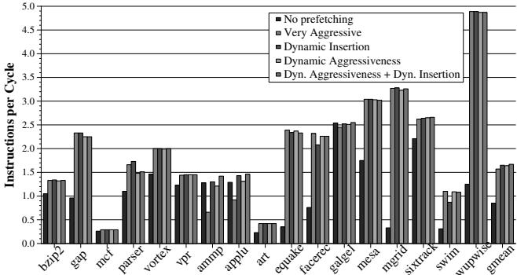
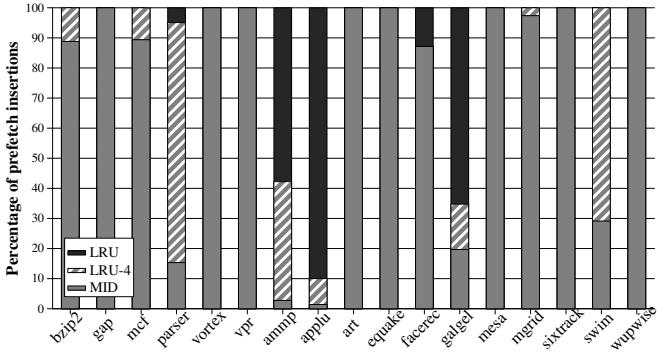
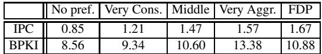

# Feedback Directed Prefetching: Improving the Performance and Bandwidth-Efficiency of Hardware Prefetchers 论文解析

## 0. 论文基本信息

**作者 (Authors)**
- Santhosh Srinath†‡
- Onur Mutlu§
- Hyesoon Kim‡
- Yale N. Patt‡

**发表期刊/会议 (Journal/Conference)**
- 该论文未在提供的文本中明确指出其发表的期刊或会议名称。

**发表年份 (Publication Year)**
- 该论文未在提供的文本中明确指出其发表年份。

---

## 1. 摘要

**目的**
- 解决传统硬件数据预取器（hardware data prefetcher）存在的两大核心问题：**性能不稳定**（在某些程序上因过度激进的预取导致性能严重下降）和**内存带宽效率低下**（产生大量无用预取，浪费带宽并引发缓存污染）。
- 提出一种通用的、基于动态反馈的机制，以提升预取器的**性能**和**带宽效率**。

**方法**
- 提出 **Feedback Directed Prefetching (FDP)** 机制，通过实时监控三个关键指标来动态调整预取行为：
  - **Prefetch Accuracy **(预取准确率)：衡量预取的数据块中有多少被后续的实际需求（demand access）所使用。
  - **Prefetch Lateness **(预取延迟)：衡量有用的预取请求中有多少未能及时返回，导致需求访问时仍需等待。
  - **Prefetcher-Generated Cache Pollution **(预取器引发的缓存污染)：衡量因预取数据而被驱逐、且后续又被需求访问的缓存块数量。
- 设计了低成本的硬件结构来收集上述反馈信息：
  - 使用 **pref-bit** 标记预取块，并通过计数器 `pref-total` 和 `used-total` 计算准确率。
  - 利用 **MSHR **(Miss Status Holding Register) 中的 `pref-bit` 和计数器 `late-total` 来检测延迟的预取。
  - 采用 **Bloom filter** 结构（一个4096-entry的位向量）来近似估算缓存污染，避免了为每个被驱逐块维护状态的高昂开销 

*Figure 3. IPC performance (left) and prefetch lateness (right) with different aggressiveness configurations Figure 4. Filter to estimate prefetcher-generated cache pollution*

。
- 基于采样间隔（以L2缓存驱逐次数为单位）收集的指标，动态调整两个方面：
  1.  **预取器的激进度 **(Aggressiveness)：通过一个3-bit的饱和计数器，在“非常保守”到“非常激进”五个配置间切换。调整策略综合考虑了准确率、延迟和污染三个指标 

。
  2.  **预取块的缓存插入位置 **(Cache Insertion Policy)：根据估算的污染程度，动态决定将预取块插入LRU栈的 **MRU**（最近使用）、**MID**（中间）、**LRU-4** 或 **LRU**（最久未使用）位置。

**结果**
- 在17个内存密集型SPEC CPU2000基准测试上，与表现最佳的传统流式预取器（Very Aggressive）相比：
  - FDP（同时调整激进度和插入策略）实现了 **6.5%** 的平均性能（IPC）提升。
  - 内存带宽消耗（BPKI）减少了 **18.7%**。
- 与消耗相似带宽的传统预取器（Middle-of-the-Road）相比，FDP提供了 **13.6%** 的更高性能。
- **完全消除了**传统激进预取器在 `ammp` 和 `applu` 等基准测试上的巨大性能损失 

*Figure 9. Overall performance of FDP*

。
- FDP机制具有良好的通用性，在 **Global-History-Buffer **(GHB) 和 **PC-based stride prefetcher** 上同样有效。
- 硬件开销极低，仅为 **2.54 KB**，不到1MB L2缓存数据存储大小的0.25%。

| 配置 | 平均 IPC | 平均 BPKI |
| :--- | :--- | :--- |
| No Prefetching | 1.00x | 1.00x |
| Very Conservative | 1.08x | 1.06x |
| Middle-of-the-Road | 1.12x | 1.13x |
| **Very Aggressive **(Best Conventional) | **1.18x** | **1.30x** |
| **FDP **(Proposed) | **1.26x **(+6.5%) | **1.06x **(-18.7%) |

**结论**
- 将**动态反馈**机制引入硬件预取器设计是提升其性能和带宽效率的有效途径。
- **综合考量准确率、延迟和缓存污染**这三个维度，比仅依赖单一指标（如准确率）能带来更显著的收益（+3.4%性能，-2.5%带宽）。
- 所提出的低成本硬件方案（特别是基于Bloom filter的污染估算和动态LRU插入策略）具有很高的实用价值和可扩展性，适用于多种现代预取器架构。

---

## 2. 背景知识与核心贡献

**研究背景与动机**

- 现代高性能处理器普遍采用**硬件数据预取 (hardware data prefetching)** 技术来隐藏巨大的**主存延迟 (main memory latency)**，通过预测程序的内存访问模式并提前将数据加载到缓存中。
- 尽管预取能显著提升许多程序的性能，但它也存在两大严重弊端：
  - **带宽浪费与争用**: 不准确的预取请求会消耗宝贵的**内存带宽 (memory bandwidth)**，并与关键的**需求请求 (demand requests)** 产生争用，反而增加延迟。
  - **缓存污染 (cache pollution)**: 预取的数据可能驱逐掉未来会被程序真正使用的缓存块，不仅降低性能，还会因需要重新加载被驱逐的数据而进一步浪费带宽。
- 传统的预取器（如**流式预取器 (stream-based prefetcher)**）通常采用**静态的、固定激进度 (fixed aggressiveness)** 配置。如图1所示，这种“一刀切”的策略在某些基准测试（如 `ammp`, `applu`）上会导致**严重的性能下降**，迫使现代处理器不得不采用相对保守的策略，从而牺牲了在其他程序上的潜在性能收益。

*Figure 1. Performance vs. aggressiveness of the prefetcher*

- 预取器本身是一个**正反馈系统**：错误的预取导致缓存缺失，新的缺失又可能触发更多无用的预取，形成恶性循环。因此，亟需引入一个**负反馈机制**来动态调节其行为，使其稳定高效。

**核心贡献**

- 提出了一种名为**反馈导向预取 (Feedback Directed Prefetching, FDP)** 的通用动态调节框架，该框架通过实时监控三个关键指标来调整预取器的行为：
  - **预取准确率 (Prefetch Accuracy)**: 衡量预取地址的预测准确性。
  - **预取及时性/延迟 (Prefetch Lateness)**: 衡量预取数据是否在需求到来前已就绪。
  - **预取器引发的缓存污染 (Prefetcher-Generated Cache Pollution)**: 衡量预取操作导致的有用数据被驱逐的程度。
- 设计了一种**低成本、基于布隆过滤器 (Bloom filter)** 的硬件机制，用于在运行时高效地估算**缓存污染**，解决了精确追踪污染开销过大的难题。

*Figure 3. IPC performance (left) and prefetch lateness (right) with different aggressiveness configurations Figure 4. Filter to estimate prefetcher-generated cache pollution*

- FDP 从两个维度动态调整预取行为：
  - **动态调节预取激进度**: 根据上述三个指标的反馈，使用一个**饱和计数器 (saturating counter)** 在多个预设配置（从非常保守到非常激进）之间切换。
  - **动态调节缓存插入策略**: 根据估算的缓存污染程度，决定将预取块插入到 LRU 栈的不同位置（如 MRU, MID, LRU-4, LRU），以平衡保留有用预取和减少污染之间的矛盾。
- 实验结果表明，FDP 在 **SPEC CPU2000** 的 17 个内存密集型基准测试上，相比性能最佳的传统流式预取器配置，实现了 **6.5%** 的平均性能提升，并减少了 **18.7%** 的内存带宽消耗。更重要的是，它**完全消除了**传统激进预取在 `ammp` 和 `applu` 等程序上的巨大性能损失。
- FDP 具有**良好的通用性**，同样适用于 **GHB-based delta correlation prefetcher** 和 **PC-based stride prefetcher**，证明了其作为一种通用优化框架的价值。其硬件开销仅为 **2.54 KB**，且不增加关键路径延迟。

---

## 3. 核心技术和实现细节

### 0. 技术架构概览

**整体技术架构**

本文提出的 **Feedback Directed Prefetching (FDP)** 是一种动态反馈机制，旨在通过实时监控硬件预取器（Hardware Prefetcher）的运行效果，来动态调整其行为，从而在提升性能的同时降低内存带宽消耗。其核心架构围绕三个关键指标的收集、分析与反馈执行展开。

- **反馈信息收集层 (Feedback Collection Layer)**
  - 该层负责在硬件层面实时估算三个核心指标：
    - **Prefetch Accuracy (预取准确率)**: 通过在 L2 缓存的每个 tag 条目中增加一个 **pref-bit** 标记位，并配合两个计数器 **preftotal** (总预取数) 和 **used-total** (有用预取数) 来计算。当预取块被需求访问时，该位被重置并增加 used-total。
    - **Prefetch Lateness (预取延迟度)**: 利用 **Miss Status Holding Register (MSHR)** 结构。MSHR 中的每个条目也包含一个 **pref-bit**。当一个需求请求命中了一个 pref-bit 被置位的 MSHR 条目时，说明该预取是延迟的，此时递增 **late-total** 计数器。
    - **Prefetcher-Generated Cache Pollution (预取器引发的缓存污染)**: 采用基于 **Bloom filter** 概念的硬件结构（称为 pollution filter）来低成本地近似估算。该 filter 是一个位向量，用于追踪因预取而被驱逐的需求块。当发生需求缺失时，查询此 filter 可判断该缺失是否由预取引起，并更新 **pollution-total** 计数器。
  - 所有指标的收集都采用**基于采样的区间更新策略**，以适应程序的阶段性行为变化。一个采样区间的长度由 L2 缓存的驱逐块数量（**eviction-count**）决定，而非固定时间周期。

- **决策与调整层 (Decision & Adaptation Layer)**
  - 在每个采样区间结束时，系统会根据收集到的三个指标的加权平均值，与预设的静态阈值进行比较，从而做出调整决策。
  - FDP 通过两种互补的方式来调整预取器行为：
    - **动态调整预取器激进程度 (Dynamic Aggressiveness)**:
      - 使用一个 **3-bit 饱和计数器 (Dynamic Configuration Counter)** 来表示当前的预取配置，范围从 **Very Conservative** 到 **Very Aggressive**。
      - 根据 **Accuracy**, **Lateness**, 和 **Pollution** 三个指标的组合情况（共12种场景），查表（Table 2）决定是增加、减少还是保持计数器的值，从而动态改变 **Prefetch Distance** 和 **Prefetch Degree**。
      

    - **动态调整预取块缓存插入策略 (Dynamic Insertion Policy)**:
      - 不再将所有预取块无差别地插入 LRU 栈的 **MRU (Most-Recently-Used)** 位置。
      - 而是根据估算的 **Cache Pollution** 程度，动态选择插入位置：**MID** (中间位置), **LRU-4** (四分之一位置), 或 **LRU** (最不常用位置)。污染越高，插入位置越靠近 LRU 端，以减少对有用数据的干扰。

- **适用性与评估**
  - FDP 被设计为一个通用框架，论文验证了其在 **Stream-based prefetcher**, **Global-History-Buffer (GHB) based delta correlation prefetcher**, 和 **PC-based stride prefetcher** 三种主流硬件预取器上的有效性。
  - 实验结果表明，FDP 在 **SPEC CPU2000** 套件的 17 个内存密集型基准测试中，相比最佳的传统预取器配置，实现了 **6.5%** 的平均性能提升和 **18.7%** 的内存带宽节省。
  - 其硬件开销极低，仅为 **2.54 KB** 的额外存储，且不增加关键路径延迟。

### 1. 动态反馈驱动的预取器激进度调整

**动态反馈驱动的预取器激进度调整机制**

该机制的核心在于通过一个闭环控制系统，利用运行时收集的反馈信息来动态调节硬件预取器的行为，从而在最大化性能收益的同时，最小化其带来的负面影响。

- **输入：三大核心反馈指标**
    - **Prefetch Accuracy (预取准确率)**: 衡量预取请求中有多少是真正被程序使用的。计算公式为 `有用预取数 / 总预取数`。低准确率意味着大量带宽被浪费在无用数据上。
    - **Prefetch Lateness (预取及时性)**: 衡量有用的预取请求中有多少是“迟到”的，即在程序真正需要数据时，数据尚未从内存返回。计算公式为 `迟到的有用预取数 / 有用预取数`。高延迟会削弱甚至抵消预取带来的性能增益。
    - **Prefetcher-Generated Cache Pollution (预取器引发的缓存污染)**: 衡量由预取操作直接导致的额外需求缺失（Demand Misses）的比例。高污染意味着预取的数据挤占了未来会被使用的有效数据，反而增加了总缺失率和带宽消耗。

- **反馈信息的硬件实现**
    - **准确率追踪**: 在L2缓存的每个tag条目中增加一个 **pref-bit**。当预取块被插入缓存时，该位被置位；当该块被需求访问（useful）时，该位被清除，并累加 **used-total** 计数器。同时，每次发送预取请求都会累加 **pref-total** 计数器。
    - **及时性追踪**: 利用 **MSHR (Miss Status Holding Register)** 结构。MSHR中的每个条目也包含一个 **pref-bit**。当一个需求请求命中了一个pref-bit被置位的MSHR条目时，说明该预取请求还未完成，即为“迟到”，此时累加 **late-total** 计数器。
    - **缓存污染追踪**: 采用基于 **Bloom filter** 概念的低成本硬件结构（称为污染过滤器）。该过滤器是一个位向量。
        - 当一个因需求缺失而加载的块被预取请求驱逐出缓存时，在过滤器中对应地址的位置1。
        - 当一个预取请求完成并插入缓存时，在过滤器中对应地址的位置0。
        - 当发生一个新的需求缺失时，查询过滤器。如果对应位为1，则认为此次缺失是由预取器造成的，并累加 **pollution-total** 计数器。

- **采样与更新策略**
    - 为了避免对瞬时噪声过度反应，系统采用**基于采样的区间更新**策略。
    - 一个采样区间的长度由L2缓存的**驱逐事件**数量定义（实验中阈值 Tinterval=8192）。
    - 在每个区间结束时，使用指数移动平均（如 `CounterValue = α * CounterValueDuringInterval + (1-α) * CounterValue`）来平滑历史数据，并据此计算最新的三个指标值。
    - 这些更新后的指标值将用于决定下一个区间的预取器行为。

- **输出：动态调整预取器激进度**
    - 预取器的激进度由两个关键参数控制：**Prefetch Distance**（预取距离，决定预取多远）和 **Prefetch Degree**（预取度，决定一次预取多少块）。
    - 系统维护一个3位的**Dynamic Configuration Counter (动态配置计数器)**，其值（1-5）对应五种预设的激进度配置，从 **Very Conservative** 到 **Very Aggressive**。
    - 在每个采样区间结束时，根据三个指标与预设阈值（Ahigh, Alow, Tlateness, Tpollution）的比较结果，查表（Table 2）决定如何更新该计数器。
        - 例如，如果检测到**高污染**，通常会**降低**激进度以减少带宽浪费和缓存干扰。
        - 如果检测到**低准确率但高延迟**，可能会**降低**激进度，因为盲目提前预取只会带来更多无用流量。
        - 如果检测到**低污染、低延迟但高准确率**，则维持当前激进度，因为此时预取效果最佳。

- **在整体系统中的作用**
    - 该机制充当了一个**自适应的负反馈控制器**，解决了传统固定激进度预取器的根本缺陷：无法适应不同程序或同一程序不同执行阶段的内存访问特性。
    - 它成功地将预取器从一个可能带来巨大性能损失的“双刃剑”，转变为一个稳定、高效且带宽友好的性能提升工具。
    - 实验结果表明，该机制能**完全消除**传统激进预取器在某些基准测试（如 ammp, applu）上造成的严重性能下降，同时在其他受益于预取的程序上保持甚至超越其性能，并显著降低内存带宽消耗（平均减少18.7%）。

### 2. 基于布隆过滤器的预取缓存污染估算

**实现原理与核心思想**

- 该机制的核心挑战在于，精确追踪所有因预取而被驱逐的 **demand-fetched L2 cache blocks** 在硬件上是不切实际的，因为这需要为每个被驱逐块维护历史记录，开销巨大。
- 论文提出了一种基于 **Bloom filter** 概念的低成本近似方案。其核心思想是：用一个共享的 **bit-vector**（即布隆过滤器）来“标记”那些**可能**因预取而被驱逐的块的地址。
- 这是一种**有损但高效**的估算方法，它牺牲了精确性（存在假阳性），换取了极低的硬件存储成本（论文中仅使用 **4096-entry bit vector**）。

**算法流程与状态机**

- **初始化**: 污染过滤器（Pollution Filter）是一个全零的位向量。
- **事件1: 需求块被预取驱逐 (Demand Block Evicted by Prefetch)**:
    - 当一个因 **demand miss** 而加载进L2缓存的块，被一个 **prefetch request** 驱逐出缓存时，系统会获取该被驱逐块的地址。
    - 使用该地址（通过 `lower_bits XOR higher_bits` 的哈希函数）索引到过滤器的特定位，并将该位**置为1**。这表示“此地址对应的块可能已被预取污染”。
- **事件2: 预取块被加载 (Prefetch Block Inserted)**:
    - 当一个 **prefetch request** 从内存返回并被插入L2缓存时，系统会获取该预取块的地址。
    - 同样通过哈希函数索引到过滤器，并将对应位**重置为0**。这是一个关键的“清理”步骤，用于防止过滤器饱和和假阳性率过高。其逻辑是：如果一个预取块成功进入缓存，那么它就不再是“被驱逐的需求块”，应该清除之前的潜在标记。
- **事件3: 需求未命中发生 (Demand Miss Occurs)**:
    - 当一个 **demand access** 在L2缓存中未命中时，系统会检查污染过滤器。
    - 使用该需求未命中地址通过相同的哈希函数索引过滤器。
    - **如果对应位为1**，则认为这次 **demand miss** 很可能是由预取器造成的（即 **prefetcher-caused demand miss**），并将 **pollution-total** 计数器加一。
    - **如果对应位为0**，则认为这次未命中与预取无关。

*Figure 3. IPC performance (left) and prefetch lateness (right) with different aggressiveness configurations Figure 4. Filter to estimate prefetcher-generated cache pollution*

**输入、输出与在整体中的作用**

- **输入**:
    - L2缓存的**驱逐事件**（特别是由预取请求触发的驱逐）。
    - L2缓存的**插入事件**（特别是预取块的插入）。
    - L2缓存的**需求未命中事件**。
- **输出**:
    - 一个硬件计数器 **pollution-total**，用于统计估算出的 **prefetcher-caused demand misses** 数量。
    - 结合另一个计数器 **demand-total**（总需求未命中数），可以计算出 **Prefetcher-Generated Cache Pollution** 指标：`pollution-total / demand-total`。
- **在整体中的作用**:
    - 这个估算出的 **cache pollution** 指标是 **Feedback Directed Prefetching (FDP)** 机制的关键反馈信号之一。
    - 它直接驱动两个核心决策：
        1. **动态调整预取器激进程度 (Dynamic Aggressiveness)**: 如表2所示，当检测到高污染时，系统会倾向于降低预取器的激进程度（减少Prefetch Distance和Degree），以减轻对缓存的干扰。
        2. **动态调整预取块插入策略 (Dynamic Insertion Policy)**: 如3.3.2节所述，根据污染程度的高低，系统会决定将新预取的块插入到LRU栈的不同位置（MRU, MID, LRU-4, 或 LRU），高污染时插入更靠近LRU的位置，使其更快被驱逐，从而减少对有用数据的挤占。

**参数设置与设计考量**

- **过滤器大小**: 论文中使用了 **4096-entry** 的位向量。这是一个在硬件开销和估算精度之间的权衡。更大的过滤器可以降低假阳性率，但会增加面积；更小的则相反。
- **哈希函数**: 采用了简单的 `lower_bits XOR higher_bits` 方式，这是一种轻量级的哈希方法，易于硬件实现，能有效分散地址空间，避免局部冲突。
- **“插入时清零”策略**: 这是该设计的一个精妙之处。它不仅防止了过滤器被长期占用而失效，还隐含地模拟了缓存的时间局部性——一个很久以前被驱逐的块，其标记被后续插入的预取块覆盖是合理的。

### 3. 基于污染感知的动态缓存插入策略

**核心机制与实现原理**

- 该策略的核心思想是，**预取块的缓存价值与其造成的污染成反比**。当预取器准确性高、污染低时，应让预取块在缓存中存活更久（插入靠近MRU的位置）；反之，当污染严重时，应让其快速被淘汰（插入靠近LRU的位置）。
- 具体实现依赖于一个**动态决策模块**，该模块在每个**采样间隔 (sampling interval)** 结束时，根据估算出的 **Prefetcher-Generated Cache Pollution** 指标来决定下一个间隔内所有预取块的插入位置。
- 插入位置并非随意选择，而是定义了三个离散的、与缓存**set-associativity (n)** 相关的固定位置：
    - **MID (Middle) 位置**: 定义为 LRU 栈中第 `floor(n/2)` 个最不常使用的位置。这是一个折中策略，既非最热也非最冷。
    - **LRU-4 位置**: 定义为 LRU 栈中第 `floor(n/4)` 个最不常使用的位置。比 MID 更靠近淘汰端，生存时间更短。
    - **LRU (Least Recently Used) 位置**: 直接插入到即将被淘汰的位置，生存时间最短。

**算法流程与输入输出**

- **输入**: 算法的主要输入是 **Prefetcher-Generated Cache Pollution** 的估算值。该值通过一个基于 **Bloom filter** 概念的硬件结构（文中称为 pollution filter）在运行时动态追踪和计算得出。
    - 该 filter 通过跟踪因预取而被驱逐的**需求块 (demand-fetched blocks)** 来间接估算污染。
    - 在每个采样间隔结束时，会计算出一个污染比率：`pollution-total / demand-total`。
- **决策逻辑**: 将计算出的污染比率与两个静态阈值 **Plow** 和 **Phigh** 进行比较，进行三分类：
    - **低污染 (Low)**: 污染比率 < Plow → 下一间隔插入 **MID** 位置。
    - **中等污染 (Medium)**: Plow ≤ 污染比率 < Phigh → 下一间隔插入 **LRU-4** 位置。
    - **高污染 (High)**: 污染比率 ≥ Phigh → 下一间隔插入 **LRU** 位置。
- **输出**: 决策结果是一个**插入位置指针**，该指针被缓存控制器用于指导所有预取请求的缓存填充操作。
- **在整体中的作用**: 此策略与 **动态调整预取器激进程度 (Dynamic Aggressiveness)** 机制相辅相成。后者控制“预取多少”，前者控制“预取的数据在缓存里待多久”。两者共同构成了 **Feedback Directed Prefetching (FDP)** 的完整闭环反馈系统，旨在最大化性能收益的同时最小化带宽开销和缓存污染。

**参数设置与实验效果**

- 文中使用的具体阈值（来自 Section 4.3）为：**Plow = 0.1**, **Phigh = 0.2**。
- 实验结果表明，静态插入策略各有缺陷：
    - 始终插入 **MRU** 会导致高污染场景下性能严重下降。
    - 始终插入 **LRU** 虽能避免污染，但会使有用的预取数据过早被淘汰，损失性能。
- 动态策略成功地为不同基准测试选择了最优或接近最优的静态策略。例如，在 `applu` 和 `ammp` 等高污染基准上，动态策略大部分时间选择 **LRU** 插入；而在 `wupwise` 等低污染基准上，则更多地使用 **MID** 或更靠前的位置。
- 

*Figure 8. Distribution of the insertion position of prefetched blocks*

- 性能对比数据显示，**Dynamic Insertion** 策略相比最佳静态策略（LRU-4）还能再提升 **1.9%** 的性能，充分证明了其有效性。

---
**关键数据对比**

下表总结了不同缓存插入策略在 **Very Aggressive** 预取器配置下的平均性能表现（以 IPC 为指标，MRU 策略为基准 1.0）：

| 插入策略 | 相对 IPC (vs. MRU) | 特点 |
| :--- | :---: | :--- |
| **MRU** | 1.000 | 基准，高收益高风险 |
| **MID** | ~1.015 | 折中策略 |
| **LRU-4** | **1.032** | 最佳静态策略 |
| **LRU** | ~0.950 | 避免污染，但牺牲收益 |
| **Dynamic Insertion** | **1.051** | **最优，自适应平衡** |

### 4. 基于采样的运行时反馈收集机制

**核心机制：基于采样的运行时反馈收集**

该机制的核心思想是将程序执行划分为动态的、非固定时间长度的**采样区间 (sampling interval)**，并在每个区间结束时对预取器的性能进行评估，从而为下一区间的决策提供依据。

- **采样区间的定义与触发**:
    - 区间的边界并非由固定的指令数或时钟周期决定，而是由**L2缓存的实际活动**来驱动。
    - 具体而言，系统维护一个名为 **`eviction-count`** 的硬件计数器，用于追踪从L2缓存中驱逐出的块的总数。
    - 当 `eviction-count` 的值超过一个预设的静态阈值 **`Tinterval`** 时，当前采样区间即告结束。
    - 在实验中，`Tinterval` 被设置为 **8192**，这恰好是基准配置中1MB L2缓存总块数（16384）的一半。这种设计确保了采样频率与缓存的实际压力相关联。

- **反馈指标的计算与更新**:
    - 在每个采样区间内，系统会持续累加三个关键指标的原始计数：
        *   **`pref-total`**: 发送到内存的预取请求数。
        *   **`used-total`**: 被需求访问命中的有用预取数。
        *   **`late-total`**: 因预取请求仍在处理中而导致的需求访问延迟数。
        *   **`pollution-total`**: 通过Bloom Filter估算的、由预取器导致的需求缺失数。
    - 当一个采样区间结束时，这些计数器的值会被用来计算三个核心反馈指标：
        *   **Prefetch Accuracy (预取准确率)** = `used-total` / `pref-total`
        *   **Prefetch Lateness (预取延迟率)** = `late-total` / `used-total`
        *   **Prefetcher-Generated Cache Pollution (预取器生成的缓存污染)** = `pollution-total` / `demand-total`
    - 计算完成后，所有原始计数器（`pref-total`, `used-total`等）会被**重置为零**，为下一个区间做准备。

- **历史行为的平滑处理**:
    - 为了防止因单个异常区间而导致预取策略剧烈波动，系统并未完全丢弃历史信息。
    - 相反，它采用了一种**指数加权移动平均**的更新策略。在论文的公式(1)中，每个指标的全局状态值（`CounterValueGlobal`）会根据当前区间的测量值（`CounterValueDuringInterval`）进行更新：
        `CounterValueGlobal = (7/8) * CounterValueGlobal + (1/8) * CounterValueDuringInterval`
    - 这种方式赋予了**最近区间的行为更高的权重**，同时保留了对历史行为的记忆，使得反馈信号更加平滑和稳健。

**输入输出关系及在整体架构中的作用**

- **输入**:
    - **原始事件流**: 来自L2缓存和MSHR（Miss Status Holding Register）的底层硬件事件，包括预取请求的发送、需求访问对预取块的命中、需求访问与预取请求在MSHR中的冲突、以及通过Bloom Filter检测到的潜在污染事件。
    - **L2驱逐事件**: 作为触发采样区间结束的信号。

- **输出**:
    - **三个量化指标**: 经过平滑处理后的 **Prefetch Accuracy**, **Prefetch Lateness**, 和 **Prefetcher-Generated Cache Pollution** 的数值。这些是高层决策逻辑的直接输入。

- **在整体架构中的作用**:
    - 该机制是**Feedback Directed Prefetching (FDP)** 架构的**感知层 (Perception Layer)**。它负责将底层复杂的、瞬时的硬件交互，抽象并聚合为三个简洁、可操作的性能指标。
    - 它充当了**动态调整策略**（如改变预取激进程度和缓存插入位置）与**实际硬件行为**之间的桥梁。没有这个实时、低成本的反馈回路，上层的自适应策略就失去了决策依据。
    - 通过将采样与**L2驱逐**这一与缓存污染和带宽压力高度相关的事件绑定，该机制能够敏锐地捕捉到程序行为的变化（例如，从具有良好空间局部性的循环进入一个随机访问阶段），并及时做出反应。

---

## 4. 实验方法与实验结果

**实验设置**

- **模拟器与处理器模型**：使用一个内部的、基于执行驱动的 **Alpha ISA** 模拟器，该模拟器建模了一个高性能的乱序超标量处理器。具体的基线处理器配置参数见下表。
- **内存模型**：采用了一个详细的内存模型，忠实地模拟了内存系统中所有硬件结构（如总线、队列）的行为和带宽/端口限制。内存总线带宽为 **4.5 GB/s**。
- **基线预取器**：建模了一个 **stream prefetcher**，能够跟踪 **64** 个不同的数据流。预取请求被放入一个 **128** 项的预取请求队列，并以最低优先级处理，以避免阻塞需求请求。
- **缓存配置**：L2 缓存大小为 **1MB**，采用 **16-way** 组相联。在基线配置中，预取的数据块被插入到 LRU 栈的 **MRU (Most-Recently-Used)** 位置。
- **基准测试集**：主要评估对象是 **SPEC CPU2000** 套件中的 **17** 个内存密集型基准测试程序。选择标准是，在最激进的预取器配置下，这些程序在 2.5 亿条指令的运行过程中至少会发出 **200K** 条预取请求。此外，还对剩余的 **9** 个程序进行了评估。
- **运行配置**：所有基准测试均使用 Compaq C/Fortran 编译器，开启 `-fast` 优化和 profile-driven feedback。模拟前会跳过初始化阶段，然后运行 **250 million instructions**。

*Table 3. Baseline processor configuration*

**结果数据**

- **整体性能提升**：与性能最佳的传统 **stream prefetcher** 配置（即 **Very Aggressive**）相比，**Feedback Directed Prefetching (FDP)** 将 **17** 个内存密集型基准测试的平均性能提升了 **6.5%**。
- **消除负面性能影响**：FDP 完全消除了传统激进预取器在某些基准测试（如 `ammp`, `applu`）上造成的巨大性能损失。例如，在 `applu` 上，FDP 相比无预取实现了 **13.4%** 的性能提升，而传统激进预取器则导致 **28.9%** 的性能下降。
- **带宽效率**：FDP 比 **Very Aggressive** 配置消耗 **18.7%** 更少的内存带宽（以 **BPKI**, Bus accesses Per Kilo Instructions 衡量）。与消耗相似带宽的传统配置相比，FDP 提供了 **13.6%** 更高的性能。
- **通用性**：FDP 的优势不仅限于 stream prefetcher。应用到 **GHB-based delta correlation prefetcher** 上时，在相似带宽下性能提升 **9.9%**；应用到 **PC-based stride prefetcher** 上时，平均性能提升 **4%**，带宽减少 **24%**。
- **对其他基准的影响**：在剩余的 **9** 个 SPEC 基准测试上，FDP 也表现稳健，平均性能提升 **0.4%**，且没有任何程序出现性能下降。

*Figure 9. Overall performance of FDP*

*Table 5. Average IPC and BPKI for FDP vs conventional prefetchers*

**消融实验**

论文通过一系列消融实验，验证了 FDP 中各个组件的有效性和必要性。

- **动态调整预取激进度 (Dynamic Aggressiveness) vs. 静态配置**：
  - 仅使用动态调整激进度（固定 MRU 插入策略），其平均性能就超过了所有静态配置（No, Very Conservative, Middle-of-the-Road, Very Aggressive）。
  - 与 **Very Aggressive** 配置相比，性能提升 **4.7%**，并几乎完全消除了 `ammp` 和 `applu` 上的性能损失。
  - 

*Figure 5. Dynamic adjustment of prefetcher aggressiveness*

  - 机制能自适应地为不同程序选择最优的激进度级别，例如在 `wupwise` 上几乎总是选择 **Very Aggressive**，而在 `ammp` 上几乎总是选择 **Very Conservative**。
  - 

*Figure 6. Distribution of the dynamic aggressiveness level*

- **动态调整缓存插入策略 (Dynamic Insertion) vs. 静态策略**：
  - 在固定 **Very Aggressive** 配置下，动态插入策略的性能优于任何静态策略（MRU, MID, LRU-4, LRU）。
  - 与最佳静态策略 **LRU-4** 相比，性能提升 **1.9%**；与基线 **MRU** 相比，性能提升 **5.1%**。
  - 

*Figure 7. Dynamic adjustment of prefetch insertion policy*

  - 该机制能根据污染情况动态选择插入位置，例如在 `ammp` 上主要使用 **LRU** 位置以减少污染。
  - 

*Figure 8. Distribution of the insertion position of prefetched blocks*

- **仅使用预取准确率 (Accuracy-only) vs. 完整反馈机制**：
  - 一个仅基于 **Prefetch Accuracy** 来调整激进度的简化版 FDP，其性能和带宽效率均低于完整的 FDP。
  - 完整的 FDP（同时考虑 **Accuracy**, **Timeliness/Lateness**, **Pollution**）比仅用准确率的版本性能高 **3.4%**，带宽消耗低 **2.5%**。这证明了综合多维度反馈信息的重要性。

- **FDP vs. 预取缓存 (Prefetch Cache)**：
  - 为了对比解决缓存污染的另一种方案，作者将 FDP 与使用专用 **prefetch cache** 的方案进行了比较。
  - FDP（直接预取到 L2）的性能比使用 **32KB prefetch cache** 的激进预取器高 **5.3%**，并且带宽消耗更低。
  - FDP 在性能上接近 **64KB prefetch cache** 的方案，但硬件开销远小于后者。
  - 

*Figure 11. Performance of prefetch cache vs. FDP*

  - 

*Figure 12. Bandwidth consumption of prefetch cache vs. FDP*

---

