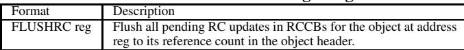

# Flexible Reference-Counting-Based Hardware Acceleration for Garbage Collection 通俗讲解

### 0. 整体创新点通俗解读

**痛点直击 (The "Why")**

- 传统的 \*\*Garbage Collection \*\*(GC) 是个“事后诸葛亮”。它得等内存快用光了，才停下来（或并发地）去扫描整个堆，找出哪些对象没人用了。这个过程非常 **昂贵**，会消耗大量 CPU 时间、污染缓存，并且在内存紧张时（比如嵌入式或高密度服务器场景）会导致频繁的、破坏性的 \*\*停顿 \*\*(pause times)。
- 而 \*\*Reference Counting \*\*(RC) 理论上可以“实时”回收：一个对象的引用数一归零，就能立刻回收。但它在软件里实现起来 **开销巨大**，因为每次指针赋值都要原子地更新计数器，这在多核环境下更是灾难。
- 过去的 **纯硬件 GC 方案** 虽然快，但把整个 GC 算法都固化在硬件里，**牺牲了灵活性**。现代软件 GC 需要根据应用特性做很多高级优化（比如对象布局、分代策略），纯硬件方案做不到这一点。

所以，核心痛点是：我们既想要 **RC 的即时性** 来减少 GC 频率，又不想承担其 **软件开销**，同时还必须保留 **软件 GC 的灵活性**。这是一个典型的“既要、又要、还要”的难题。

______________________________________________________________________

**通俗比方 (The Analogy)**

想象一个大型图书馆（堆内存），图书管理员（软件 GC）每隔一段时间就要闭馆盘点（Stop-the-world GC），工作量巨大。

这篇论文提出的 \*\*HAMM \*\*(Hardware-Assisted Automatic Memory Management) 就像是给每个读者（CPU 核心）配了一个智能小助手（硬件加速单元）。这个小助手不负责整个图书馆的管理，只做两件事：

1. **默默记账**：每当读者借书（创建引用）或还书（销毁引用），小助手就在自己的小本子（**RCCB**, Reference Count Coalescing Buffer）上记一笔。他很聪明，如果同一个读者短时间内对同一本书反复借还，他会把账目合并（Coalescing），最后只向总账（对象头里的引用计数）汇报一次净变化。
1. **即时上架**：一旦他发现某本书的总借阅数归零了（对象死亡），他就立刻把这本书放到一个“快速取书架”（**ABT**, Available Block Table）上。

这样，当有新读者想借书（分配新对象）时，图书管理员可以先问问本地的“快速取书架”有没有现成的。如果有，就省去了去仓库（软件分配器）找新书的麻烦。只有当“快速取书架”空了，或者需要处理复杂的循环引用（小助手搞不定的情况）时，才需要启动耗时的全馆盘点（软件 GC）。

 *Figure 2: Overview of the major hardware structures provided by HAMM (components are not to scale)*

______________________________________________________________________

**关键一招 (The "How")**

作者并没有试图用硬件完全取代软件 GC，而是巧妙地在软件 GC 的流程中，**插入了一个低成本、高效率的“预筛选”和“预回收”层**。具体来说，他们扭转了两个关键点：

- **将 RC 更新从“同步、原子”变为“异步、批处理”**：

    - 通过引入 **两级 RCCB 缓存**（L1 per-core, L2 per-chip），硬件将频繁、细粒度的 RC 更新操作在本地进行合并。论文数据显示，这套机制能过滤掉 **96.3%** 的冗余内存更新。这从根本上解决了软件 RC 开销大的问题，让 RC 在硬件中变得可行。

- **将内存回收从“被动等待”变为“主动供给”**：

    - 通过 **ABT 层次结构**（L1, L2, Memory），硬件将已确认死亡的对象地址组织成一个对软件分配器友好的、低延迟的“可用块池”。当软件调用 `REALLOCMEM` 指令时，它能像访问本地缓存一样快速获取一个可重用的内存块，而无需触发完整的 GC 周期。

最终，这套机制与现有的 **Generational GC** 完美协同。它大幅减少了新生代（nursery）的 Minor GC 次数（平均 **-52%**），也显著降低了老年代（mature space）的存活对象数量，从而减少了 Major GC 的频率（平均 **-50%**）和每次 GC 的工作量（存活空间 **-49%**）。结果就是，在几乎不影响应用程序本身性能（mutator slowdown only **0.38%**）的前提下，将总的 GC 时间开销平均降低了 **31%**。

### 1. Reference Count Coalescing Buffers (RCCBs) (ELI5)

**痛点直击 (The "Why")**

- 传统的 **reference counting**（引用计数）在软件里实现时，最大的问题就是“**太碎、太勤、太吵**”。
- 每次指针赋值（比如 `a = b`），都要立刻去内存里找到 `b` 指向对象的引用计数加一，同时把 `a` 原来指向的对象的引用计数减一。这会产生海量的、细粒度的内存读写。
- 在多核环境下，这更是灾难：多个核心可能同时修改同一个对象的引用计数，必须用锁或原子操作同步，导致严重的 **synchronization overhead**（同步开销）和 **memory traffic**（内存流量），直接拖垮性能。
- 简单说，之前的方案就像一个强迫症会计，每发生一笔微小的交易（指针变化），就要立刻冲到金库（主存）里更新总账（引用计数），效率极低。

**通俗比方 (The Analogy)**

- **RCCBs 的作用，就像是在每个员工（Core）和公司总部（Main Memory）之间，设立了一套“本地记事本 + 部门汇总簿”的两级缓冲系统**。
- 想象你是一个销售员（Core），每天要处理很多客户的款项变动（引用计数增减）。你不会每收一笔钱或付一笔钱就立刻跑去公司财务室（主存）改账本，那太傻了。
- 相反，你先在自己的 **L1 记事本**（L1 RCCB）上随手记下：“客户A +1, 客户B -1”。一天下来，你发现对客户A的操作是 +3, -2, +1，净结果其实是 +2。你只需要把最终的净变化 **+2** 汇报给部门经理就行了。
- 部门经理手里有个 **L2 汇总簿**（L2 RCCB），他把所有销售员关于客户A的净变化再加总一次。只有当这个汇总簿满了，或者到了结算日，他才会去一趟财务室，一次性把最终的、干净的净变化写入总账。
- 这样，财务室（主存）的访问次数和被骚扰的频率就**急剧下降**了。

**关键一招 (The "How")**

- 作者没有改变引用计数的基本逻辑，而是巧妙地在硬件层面插入了一个 **coalescing**（合并/聚合）机制。
- 具体来说，他们做了两件事：
    - **引入了两级缓冲区**：每个核心有自己的 **L1 RCCB**，整个芯片有一个共享的 **L2 RCCB**。
    - **改变了更新策略**：所有由指针操作产生的 **incRC**（增加引用）和 **decRC**（减少引用）操作，不再直接冲向主存。它们首先被发送到 **L1 RCCB**。
        - L1 RCCB 会根据对象地址（tag）查找对应条目，并将新的增减操作累加到一个 **delta**（增量）字段里。这样，短时间内对同一对象的多次增减操作就被**合并**成了一个净增量。
        - 只有当 L1 RCCB 的某个条目因为容量限制被 **evicted**（换出）时，它才会把这个净增量发送到 **L2 RCCB**。
        - L2 RCCB 会做同样的合并操作。最终，只有从 L2 RCCB 被换出的净增量，才会真正去更新主存中对象头里的引用计数。
- 这个设计的精妙之处在于，它利用了程序的 **locality**（局部性）：短时间内对同一对象的引用操作往往会相互抵消。通过两级缓冲进行 **filtering**（过滤），论文数据显示能**过滤掉 96.3% 的冗余更新**，从根本上解决了传统引用计数的性能瓶颈。 *Figure 2: Overview of the major hardware structures provided by HAMM (components are not to scale)*

### 2. Available Block Tables (ABTs) (ELI5)

**痛点直击**

- 传统的垃圾回收（GC）在找到死对象后，需要软件分配器（allocator）去管理空闲内存块。这个过程通常涉及复杂的**free-list**遍历或同步操作，对于追求极致速度的**bump-pointer allocator**来说，这会引入不可接受的延迟和开销。
- 即使硬件通过引用计数快速发现了死对象，如果不能以**极低延迟**的方式将这些空闲块交还给分配器，那么硬件加速的优势就大打折扣。分配器在关键路径上等待内存块，会直接拖慢整个应用（mutator）的速度。

**通俗比方**

- 想象一个高效的快递分拣中心（对应**内存分配器**）。它的理想工作模式是，从一个巨大的、连续的包裹堆（**bump-pointer allocation**）里，随手拿一个新箱子打包。这非常快。
- 现在，硬件加速器（HAMM）就像一个高效的“回收员”，他能立刻发现哪些包裹箱是空的（**dead objects**），并想把它们送回分拣中心复用。
- 但如果“回收员”每次都要跑到仓库深处（**main memory**）去找一个总清单（**global free list**），再把这个箱子搬回来，那分拣员就得停下来等他，效率反而更低。
- **ABTs** 的设计精髓在于，它在分拣员手边（**L1 ABT**）放了一个小货架，在车间中央（**L2 ABT**）放了一个中型货架，仓库深处（**memory ABT**）才是总库。回收员先把空箱子放到最近的货架上。当分拣员需要箱子时，直接从手边的小货架拿，**零等待**。拿完后，系统再在后台悄悄地从中央货架补货到手边货架，完全不影响分拣员的主流程。

 *Figure 2: Overview of the major hardware structures provided by HAMM (components are not to scale)*

**关键一招**

- 作者没有让分配器直接去访问主存里的全局空闲列表，而是构建了一个**三级缓存式**的空闲块供给体系。
- **核心逻辑转换**在于：将“**按需查找**”（on-demand search）的模式，转变为“**预取供给**”（prefetch-and-supply）的模式。
    - **L1 ABT**（每个核心一个）：这是一个**单入口**的超高速缓存。`REALLOCMEM`指令只访问这里，命中则立即返回地址，保证了分配器关键路径的**低延迟**。
    - **L2 ABT**（每个芯片一个）：作为L1的后备，容量更大。当L1被消耗后，会发起一个**非关键路径**的请求来补充L1。
    - **Memory ABT**（主存中）：这是最终的、按**size class**（大小类别）组织的全局空闲块链表。L2 ABT从这里补充自己。
- 这个设计巧妙地将硬件发现死对象的“生产”行为和软件分配器的“消费”行为**解耦**。生产者（RCCB）可以慢慢把死块归还到Memory ABT，而消费者（Allocator）总能从本地L1 ABT拿到“现货”，两者互不阻塞，从而实现了**无缝、高速的内存块复用**。

### 3. Hardware-Software Cooperative ISA Extensions (ELI5)

**痛点直击**

- 传统的 **Garbage Collection (GC)** 是个“事后诸葛亮”。它得等内存快用光了，才停下来（或边运行边）扫描整个堆，找出哪些对象没人用了。这个过程非常 **昂贵**：不仅消耗大量 CPU 周期，还会污染缓存，甚至导致应用暂停。
- **Reference Counting (RC)** 理论上能“实时”发现垃圾：一个对象的引用数归零，立刻就能回收。但它在软件里实现起来是个灾难：
    - **开销巨大**：每次指针赋值（创建/销毁引用）都要原子地更新计数器，这在多核环境下意味着频繁的 **cache coherence traffic** 和 **synchronization overhead**。
    - **不完整**：无法处理循环引用。
- 纯硬件 GC 方案又太 **僵化**，把特定的 GC 算法硬编码进芯片，剥夺了软件 GC 的灵活性（比如做内存布局优化、适应不同应用特性等）。

**通俗比方**

- 想象一个大型图书馆（内存堆），图书管理员（软件 GC）每隔一段时间就要闭馆盘点（Stop-the-world GC），效率低下。
- HAMM 的做法是，在每本书（对象）上贴一个电子计数器（**reference count field**），并给每个借阅台（CPU Core）配一个智能记事本（**L1 RCCB**）。
- 当读者（程序）借书（创建引用）或还书（销毁引用）时，借阅员（硬件）不是立刻跑去找书更新计数器，而是先在自己的记事本上记一笔（`incRC`/`decRC`）。
- 这个记事本很聪明，会自动合并对同一本书的多次操作（比如先借后还，就直接划掉）。只有当记事本快满了，才把净变化批量同步到图书馆中央的总账本（**L2 RCCB**），最后再更新书上的计数器。
- 一旦某本书的计数器归零，系统会立刻把它放到一个“快速取书架”（**ABT**）上。下次有新读者要借书，管理员可以优先从这个架子上拿，而不用去新书区（bump-pointer allocation），从而大大推迟了下一次全馆盘点的时间。

**关键一招**

- 作者的核心洞察是：**不需要在硬件里实现一个完整的 GC，只需要提供几个精准的“硬件原语”（Hardware Primitives），让软件 GC 能更高效地工作即可**。
- 为了实现这个协同，他们设计了一套 **Hardware-Software Cooperative ISA Extensions**，巧妙地将硬件加速能力暴露给软件栈：
    - **Store Pointer Instructions**: 这是最关键的一招。编译器在生成指针存储代码时，不再用普通的 `STORE` 指令，而是用特殊的 `STOREPTR` 或 `STOREPTROVR`。这些指令在提交（commit）时，会**自动、非推测性地**触发 `incRC` 和 `decRC` 操作，并交给 RCCB 处理。这利用了硬件已有的 **cache coherence 机制** 来保证原子性，避免了软件层面昂贵的 CAS 循环。
        -  *Table 2: HAMM ISA store pointer instructions*
    - **REALLOCMEM / ALLOCMEM**: 这两个指令建立了硬件与软件分配器的桥梁。
        - `REALLOCMEM` 让分配器能**零延迟**地查询本地 L1 ABT，看是否有现成的、刚被硬件标记为死亡的内存块可以复用。
        - `ALLOCMEM` 则在分配完成后通知硬件，初始化新对象的引用计数和大小类别。
        -  *Table 1: HAMM ISA instructions for object allocation*
    - **FLUSHRC**: 这是指令集里最体现“协同”思想的设计。当软件 GC 启动时（尤其是移动对象的 GC），它需要确保所有 pending 的 RC 更新都已落盘，否则会出错。`FLUSHRC` 指令就是为此服务的，它能**按需、精确地**刷新特定对象的 RC 状态，而不是粗暴地 flush 所有缓冲区，保证了软硬件交接的正确性和效率。
        -  *Table 3: HAMM ISA instruction for garbage collection*
- 通过这套指令集，硬件承担了最繁重、最底层的引用计数跟踪和死块快速供给工作，而软件 GC 依然保留了高层次的控制权（比如决定何时进行 full GC、如何布局内存等），实现了 **性能** 与 **灵活性** 的完美平衡。

### 4. Object Reference Map (ORM) for Dead Object Scanning (ELI5)

**痛点直击 (The "Why")**

- 传统的硬件辅助引用计数（Reference Counting）有个致命盲点：它只能追踪对象**外部**的指针变化。一旦一个对象被判定为“死亡”（引用计数为零），它的内存块就可以被回收。但这个死亡对象内部可能还包含指向其他对象的指针！如果这些内部指针不被处理，那些被指向的对象的引用计数就永远不会减少，导致它们永远无法被回收，形成**内存泄漏**。
- 软件垃圾回收器（GC）知道如何扫描对象内部来找到这些指针，因为它有完整的类型和元数据信息。但纯硬件方案通常不知道一个对象内部哪些字（word）是真正的指针，哪些只是普通整数。让硬件盲目地将每个字都当作指针去递减引用计数，不仅效率极低，而且会**破坏数据**（把整数当地址操作）。

**通俗比方 (The Analogy)**

- 想象你是一个专业的文件销毁员（硬件RC系统）。你的任务是销毁一个文件夹（死亡对象）。但这个文件夹里不仅有废纸，还有一些索引卡片（内部指针），每张卡片上写着另一个文件夹的名字。如果你只是简单地把整个文件夹扔进碎纸机，那些被索引的文件夹就永远不会被标记为“可销毁”，因为没人知道它们的索引已经失效了。
- **Object Reference Map (ORM)** 就像是公司给你配备的一本**智能目录手册**。这本手册不是由你（硬件）维护的，而是由公司的档案管理员（软件运行时系统）根据最新的文件结构实时更新的。当你拿到一个要销毁的文件夹时，你先查这本手册，手册会明确告诉你：“在这个特定类型的文件夹里，第2页和第5页是索引卡片，其他都是废纸。” 这样，你就能精准地只处理那两张索引卡片，通知对应的文件夹可以准备销毁了，而不会误伤其他内容。

**关键一招 (The "How")**

- 作者并没有试图让硬件去理解复杂的对象布局，而是巧妙地在软件和硬件之间建立了一个**轻量级的契约**——ORM表。
- 具体来说，这个机制做了以下几件事：
    - **软件负责提供地图**：运行时系统（如JVM）在主存中维护一个**ORM**表。这个表以对象的**类型标识符**（通常是类指针）为索引，每个条目是一个**位图**（bitmap）。位图中的每一位对应对象体内的一个字（word），`1`表示该位置是一个指针，`0`则不是。
    - **硬件负责按图索骥**：当硬件通过引用计数发现一个对象死亡后，它会：
        1. 从该对象的头部读取其**类型标识符**。
        1. 用这个标识符去查询主存中的**ORM**表，获取对应的**位图**。
        1. 将这个位图与对象在L1缓存中的实际数据对齐。
        1. 利用现有的、用于处理栈上指针的硬件逻辑（见论文2.3.2节），**只为位图中标记为`1`的位置**发出`decRC`操作，递减那些内部指针所指向对象的引用计数。
- 这个设计的关键在于**职责分离**：软件最清楚对象的内部结构，所以由它来生成精确的“指针地图”；硬件最擅长高效执行简单的、规则化的任务，所以由它来“按图施工”。两者通过一个简单、固定格式的**ORM**表进行通信，既保证了准确性，又避免了硬件设计的过度复杂化。
