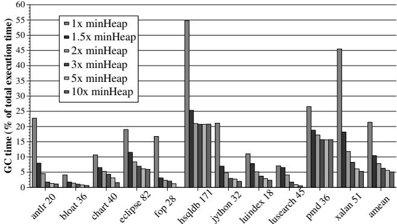
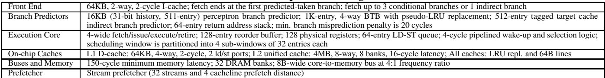
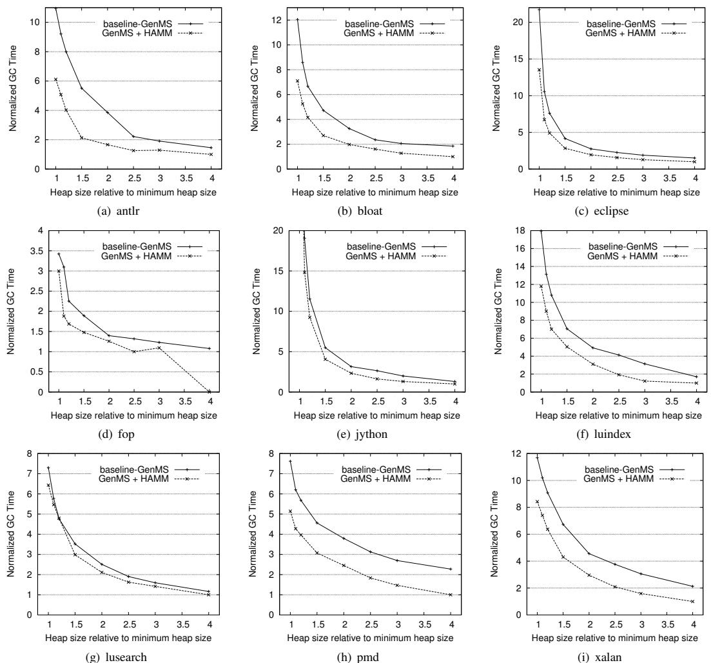

# Flexible Reference-Counting-Based Hardware Acceleration for Garbage Collection 图表详解

### Figure 1: Garbage collection overheads for DaCapo benchmarks with different heap sizes (minHeap values in MB shown in labels)

- 图片展示了 Java DaCapo 基准测试套件在不同堆大小配置下，**垃圾回收（GC）时间占总执行时间的百分比**。
- 横轴列出了 13 个 DaCapo 基准程序，每个程序名称后标注了其运行所需的最小堆大小（minHeap），单位为 MB。
- 纵轴表示 GC 时间占比，范围从 0% 到 60%。
- 图例显示了六种不同的堆大小配置：**1x minHeap、1.5x minHeap、2x minHeap、3x minHeap、5x minHeap 和 10x minHeap**。
- 数据表明，**GC 开销随堆大小增加而显著降低**。例如，在 1x minHeap 配置下，多个基准程序（如 hsqldb、pmd、xalan）的 GC 开销高达 20%-55%，而在 10x minHeap 下则普遍降至 5% 以下。
- **hsqldb 171** 在 1x minHeap 时 GC 开销最高，接近 55%；**fop 28** 在 1x minHeap 时开销也超过 50%。
- 即使在较大的堆配置（如 3x minHeap）下，部分程序（如 hsqldb、pmd、xalan）的 GC 开销仍维持在 10%-20% 区间，说明**GC 仍是性能瓶颈**。
- 对于某些程序（如 antlr、bloat、chart），即使在 1x minHeap 下，GC 开销也相对较低（\<10%），表明其内存行为对 GC 更友好。
- 整体趋势显示，**堆越小，GC 越频繁，开销越大**；反之，增大堆可有效缓解 GC 压力，但会牺牲内存效率。

| Benchmark | minHeap (MB) | GC Time @ 1x minHeap (%) | GC Time @ 3x minHeap (%) | GC Time @ 10x minHeap (%) |
| --------- | ------------ | ------------------------ | ------------------------ | ------------------------- |
| antlr     | 20           | ~8                       | ~4                       | ~2                        |
| bloat     | 36           | ~5                       | ~3                       | ~1                        |
| chart     | 40           | ~4                       | ~2                       | ~1                        |
| eclipse   | 82           | ~10                      | ~6                       | ~3                        |
| fop       | 28           | ~55                      | ~15                      | ~5                        |
| hsqldb    | 171          | ~55                      | ~20                      | ~5                        |
| jython    | 32           | ~10                      | ~6                       | ~3                        |
| luindex   | 18           | ~8                       | ~4                       | ~2                        |
| lusearch  | 45           | ~10                      | ~6                       | ~3                        |
| pmd       | 36           | ~25                      | ~15                      | ~5                        |
| xalan     | 51           | ~45                      | ~20                      | ~5                        |
| avrora    | —            | —                        | —                        | —                         |

注：avrora 未在图中显示数据，可能因实验环境限制未运行。

### Figure 2: Overview of the major hardware structures provided by HAMM (components are not to scale)

- 图片展示了 HAMM（Hardware-Assisted Automatic Memory Management）架构的核心硬件组件，其设计目标是通过硬件加速参考计数和内存块重用，降低软件垃圾回收（GC）的开销。
- 整体结构分为三个层级：**CPU Core 层**、**Chip 层** 和 **Main Memory 层**，各层通过明确的数据流路径协同工作。
- 在每个 CPU Core 内部，包含两个关键缓冲区：
    - **L1 RC Coalescing Buffer (L1 RCCB)**：接收来自 LD/ST Unit 的 RC 更新请求（incRC/decRC），用于合并同一对象的多次引用计数更新，减少对内存的频繁访问。
    - **L1 Available Block Table (L1 ABT)**：存储可重用内存块地址，供分配器快速获取，避免缓存未命中或同步延迟。
- Chip 层提供跨核心协调机制：
    - **L2 RC Coalescing Buffer (L2 RCCB)**：聚合来自所有核心的 L1 RCCB 更新，进一步合并后写入主存对象头中的 RC 字段，确保多核环境下的数据一致性。
    - **L2 Available Block Table (L2 ABT)**：作为 L1 ABT 的上层缓存，从主存 ABT 预取可用块，支持多核并发分配请求。
- Main Memory 层维护全局状态：
    - **Available Block Table (ABT)**：以链表形式组织，按大小分类存储所有可重用内存块，是系统最终的“自由列表”来源。
    - **Live objects**：图中示意了对象在主存中的布局，每个对象头部包含 **RC 字段**，用于记录当前引用计数。
- 数据流向清晰：
    - 引用更新路径：LD/ST Unit → L1 RCCB → L2 RCCB → Main Memory (RC field)。
    - 内存块重用路径：Main Memory (ABT) → L2 ABT → L1 ABT → Allocator (via REALLOCMEM instruction)。
- 系统支持多芯片（CPU Chip 0 到 M）扩展，各芯片间通过共享主存 ABT 协同，确保全局内存块池的一致性。
- 关键设计原则：
    - 所有硬件结构均**不在关键路径上**，不影响指令执行时序。
    - 通过**两级缓冲（RCCB 和 ABT）** 实现高过滤率（论文称 L1 RCCB 平均过滤 90.6% 更新），显著降低内存带宽压力。
    - 支持**多应用/多区域管理**，通过 Region ID 和 Application ID 避免地址别名冲突。

| 组件层级    | 组件名称 | 功能描述             | 关键作用                     |
| ----------- | -------- | -------------------- | ---------------------------- |
| Core        | L1 RCCB  | 合并本地引用计数更新 | 减少内存写入频率，提升效率   |
| Core        | L1 ABT   | 缓存单个可重用块地址 | 加速分配器获取空闲块         |
| Chip        | L2 RCCB  | 聚合多核 RC 更新     | 保证多核一致性，减少主存压力 |
| Chip        | L2 ABT   | 多核共享预取缓存     | 支持并发分配，提高吞吐量     |
| Main Memory | ABT      | 全局自由块链表       | 提供最终的内存块来源         |

- 该架构体现了“**硬件加速，软件决策**”的设计哲学：硬件负责高效检测死亡对象和提供重用块，而内存布局优化、GC 策略等高层决策仍由软件控制，保持灵活性。

### Table 1: HAMM ISA instructions for object allocation

- 图片内容为 **Table 1: HAMM ISA instructions for object allocation**，展示了两个新增的指令格式及其语义描述。
- 该表包含两列：**Format** 和 **Description**，分别说明指令的语法结构和功能行为。
- 表中列出的两条指令是 **REALLOCMEM** 和 **ALLOCMEM**，它们是 HAMM 机制与软件内存分配器交互的核心接口。

| Format                | Description                                                                                                                                                                                               |
| --------------------- | --------------------------------------------------------------------------------------------------------------------------------------------------------------------------------------------------------- |
| REALLOCMEM reg1, reg2 | 请求从硬件维护的本地 **Available Block Table (L1 ABT)** 中获取一个大小为 `reg2` 的可用内存块。若找到，则在 `reg1` 返回起始地址；否则返回零。`reg2` 同时返回实际块大小。**条件码**根据 `reg1` 设置。       |
| ALLOCMEM reg1, reg2   | 告知硬件一个新分配对象的信息：其地址为 `reg1`，大小为 `reg2`。此指令确保第一个对该对象的引用被纳入硬件参考计数机制。它会在本地 **L1 RCCB** 创建条目（初始引用计数为1），并将6位**size class**写入对象头。 |

- **REALLOCMEM** 指令允许分配器优先尝试重用已回收的内存块，避免触发默认分配路径，从而减少 GC 需求。
- **ALLOCMEM** 指令用于通知硬件新对象的存在，启动其参考计数跟踪，并将其归类到合适的尺寸类别，以便后续高效重用。
- 两条指令均设计为非阻塞、低开销操作，不干扰分配器的关键路径性能。
- 这些指令是 HAMM 实现“硬件辅助自动内存管理”的关键组成部分，使软件分配器能灵活选择是否重用内存，同时由硬件负责底层引用计数和块管理。

### Table 2: HAMM ISA store pointer instructions

- 该图片展示了 **Table 2: HAMM ISA store pointer instructions**，定义了五条用于支持硬件辅助引用计数的新增指令。
- 指令设计核心在于：在执行指针存储操作的同时，**自动触发引用计数（RC）更新**，避免软件同步开销。
- 所有指令均区分“创建新引用”与“覆盖旧引用”两种语义，前者仅需 **incRC**，后者需同时 **decRC（旧引用） + incRC（新引用）**。
- 具体指令格式与功能如下：

| 指令格式                       | 功能描述                                                                                         |
| ------------------------------ | ------------------------------------------------------------------------------------------------ |
| **MOVTPR reg/mem, src_reg**    | 将新引用存入寄存器或内存位置，并对 `src_reg` 指向的对象执行 **incRC**。                          |
| **MOVPTROVR reg/mem, src_reg** | 覆盖寄存器或内存中的现有引用，对新引用对象 **incRC**，对被覆盖的旧引用对象 **decRC**。           |
| **PUSHPTR reg/mem**            | 将寄存器或内存中的引用压栈，并对该引用对象执行 **incRC**。                                       |
| **POP PTR reg/mem**            | 从栈顶弹出引用至寄存器或内存，不涉及引用覆盖，仅执行 **incRC**（若目标非空则隐含覆盖）。         |
| **POPPTROVR reg/mem**          | 从栈顶弹出引用并覆盖寄存器或内存中的现有引用，对弹出引用对象 **incRC**，对被覆盖对象 **decRC**。 |

- 这些指令通过硬件机制处理指针写入时的引用计数变更，**无需软件介入同步**，从而大幅降低传统软件引用计数的性能开销。
- 指令命名清晰反映其行为：`PTR` 表示操作对象为指针，`OVR` 表示覆盖语义，`PUSH/POP` 对应栈操作。
- 此设计使引用计数更新成为指针操作的**副作用**，与缓存一致性协议协同工作，确保多核环境下的正确性。

### Table 3: HAMM ISA instruction for garbage collection

- 图片内容为 **Table 3**，标题为 “HAMM ISA instruction for garbage collection”，展示了一条用于垃圾回收的新增指令。
- 该表仅包含一行数据，描述了 **FLUSHRC** 指令的格式与语义。
- 指令格式为：**FLUSHRC reg**，其中 `reg` 是一个寄存器，用于存放待处理对象的地址。
- 该指令的功能是：**刷新所有挂起的 RC 更新**（即 Reference Count updates），这些更新存储在 **RCCBs**（Reference Count Coalescing Buffers）中，并将最终结果写入对应对象头中的引用计数字段。
- 此指令主要用于软件 GC 启动时，确保所有硬件缓存的引用计数更新已同步至内存对象头，避免因对象移动或内存重用导致的数据不一致。
- 该指令属于非关键路径操作，可在 GC 进行过程中异步执行，但若需立即确认某对象的引用计数状态，则可主动调用此指令并等待其完成。

| 格式        | 描述                                                                            |
| ----------- | ------------------------------------------------------------------------------- |
| FLUSHRC reg | 刷新位于寄存器 `reg` 所指地址对象的所有挂起 RC 更新至其对象头中的引用计数字段。 |

- 该指令设计体现了 HAMM 的核心理念：**硬件加速参考计数，软件控制回收时机**，从而在保持灵活性的同时降低 GC 开销。

### 937954683e3b6b50528c2b16e2e7aeaaced1279eb0d41190678443fdb0ef65f7.jpg

- 图片展示的是 **Algorithm 1**，即一个经过修改的 **bump pointer allocator** 的伪代码实现，用于与 **HAMM** 硬件机制协同工作。
- 该算法的核心逻辑是：在分配新对象时，**优先尝试从硬件管理的 Available Block Table (ABT)** 中重用已死亡对象的内存块，若失败则回退到传统的 bump-pointer 分配策略。
- 算法首先调用 **REALLOCMEM** 指令，传入所需对象大小 `size`，以查询本地 L1 ABT 是否有可用的空闲块。返回值赋给变量 `addr`。
- 如果 `addr == 0`，表示 **ABT 中无可用块**，此时执行软件分配路径：
    - 调用 `bump_pointer` 进行连续分配。
    - 更新 `bump_pointer` 指针。
    - 检查 `bump_pointer` 是否溢出当前堆块（local heap chunk）。
        - 若溢出，则触发 **Slow-path Allocator**，这通常涉及同步、申请新堆块或触发垃圾回收（GC）。
- 如果 `addr != 0`，表示 **ABT 成功返回了一个可重用的内存块地址**，此时直接使用该地址。
- 无论采用哪种分配方式，最终都需调用 **ALLOCMEM** 指令，将新分配的对象地址 `object_addr` 和其大小 `size` 通知给硬件，以便硬件维护相关元数据（如更新引用计数和 ABT）。

| 步骤 | 操作                                 | 目的                         |
| :--- | :----------------------------------- | :--------------------------- |
| 1    | `addr ← REALLOCMEM size`             | 查询硬件 ABT 是否有可重用块  |
| 2    | `if (addr == 0)`                     | 判断 ABT 是否为空            |
| 3    | `addr ← bump_pointer`                | 回退到软件 bump-pointer 分配 |
| 4    | `bump_pointer ← bump_pointer + size` | 更新 bump-pointer            |
| 5    | `if (overflow)`                      | 检查是否需要慢速路径         |
| 6    | `Use Slow-path Allocator`            | 处理堆块耗尽或触发 GC        |
| 7    | `else`                               | ABT 提供了可重用块           |
| 8    | `Initialize block at addr`           | 初始化重用的内存块           |
| 9    | `ALLOCMEM object_addr, size`         | 通知硬件新对象信息           |

- 该算法设计的关键在于 **非侵入性** 和 **性能优先**：它仅在 `REALLOCMEM` 返回非零地址时才进行重用，而 `REALLOCMEM` 仅访问本地 L1 ABT，因此不会引入显著的延迟或缓存未命中，保证了快速分配路径的效率。
- 最终的 `ALLOCMEM` 调用是必要的，它确保了硬件能够跟踪新对象的生命周期，为后续的引用计数和潜在的再次重用做好准备。

### Table 4: Extensions for Multiple Managed Memory Regions

- 该表格（Table 4）详细说明了为支持**多管理内存区域**而对 HAMM 硬件结构所做的扩展，确保不同应用或同一应用内不同内存区域的引用计数和内存块重用互不干扰。
- 所有扩展的核心目标是引入 **allocation pool ID**，它由 **application ID**（6位）和 **region ID**（2位）组合而成，用于在硬件层面区分不同的内存分配池。

以下是各结构的具体扩展内容：

| 结构                    | 扩展描述                                                                                                        |
| ----------------------- | --------------------------------------------------------------------------------------------------------------- |
| **L1 and L2 RCCB**      | 在标签字段中增加 **allocation pool ID**，与引用虚拟地址一同构成完整标签，确保引用计数更新仅作用于正确的分配池。 |
| **Page table and TLBs** | 每个条目扩展包含 **2-bit region ID**，使每次 `incRC` 或 `decRC` 操作在访问 L1 RCCB 前能确定所属区域及分配池。   |
| **Memory ABT**          | 每个分配池拥有独立的内存 ABT，因为不同应用或区域的内存块不能混用，避免错误重用。                                |
| **L1 ABT**              | 专属于当前运行在核心上的应用及其正在分配的特定内存区域（如 nursery 或 older generation），保证本地快速访问。    |
| **L2 ABT**              | 每个 L2 ABT 条目必须扩展包含对应的 **allocation pool ID**，以支持多核芯片上多个分配池的并发管理。               |

- 这些扩展使得 HAMM 能够安全、高效地处理**多应用并发执行**和**单应用内多代/多区域内存管理**场景，例如 Java 的 generational collector 中的 nursery 和 mature 区域。
- 在进程上下文切换时，系统会将被换出进程的 RCCB 内容刷新到内存，并将未使用的 L1/L2 ABT 条目归还至对应内存 ABT，确保资源正确回收和隔离。

### Table 5: Storage Cost of Hardware Structures for HAMM

- **Table 5** 详细列出了 HAMM 所需硬件结构的存储开销，基于一个 64 位架构和 4 核对称多处理器（CMP）的假设配置。该表旨在量化硬件支持带来的额外存储成本。

- 表格包含三列：**Structure**（结构名称）、**Description**（结构描述）和 **Cost**（成本）。所有成本均以字节或比特为单位，并按每核或整个 CMP 计算。

- 关键硬件组件及其存储成本如下：

| Structure | Description | Cost |
|\--------------------|--------------------------------------------------------------------------------------------------------------------------------

### Table 6: HAMM Data Structures in Main Memory

- **Table 6** 详细列出了 HAMM 在主存中所需的数据结构，这些结构是硬件辅助垃圾回收机制正常运作的基础。
- 表格包含三行数据，分别描述了三种核心数据结构的用途和内存开销。

| Usage                                     | Description                                                                                                                                                                                             |
| ----------------------------------------- | ------------------------------------------------------------------------------------------------------------------------------------------------------------------------------------------------------- |
| **Memory ABT**                            | 每个应用和内存区域配备一个64项的可用块表（Available Block Table）。假设典型分代堆有两个区域（新生代和老年代），则每个运行中的托管应用需1KB内存。                                                        |
| **Object Reference Map (ORM)**            | 一个1K项的表，每项16字节，总计16KB，用于每个运行中的托管应用。该表用于快速确定对象内哪些字段是指针。                                                                                                    |
| **Configuration of each allocation pool** | 包含HAMM所需的常量配置表：1) 对象头中引用计数字段的偏移量；2) 对象头中大小类字段的偏移量；3) 对象头中类型标识字段的偏移量；4) 相对于对象引用地址的块起始地址偏移量；5) 每个大小类对应的64项对象尺寸表。 |

- 这些数据结构共同支撑了 HAMM 的核心功能：高效追踪对象引用、快速识别死亡对象并重用其内存块。
- 内存开销相对可控，例如 ORM 仅占用16KB，而 Memory ABT 为1KB，适合在现代系统中部署。
- 配置表的存在确保了 HAMM 能够灵活适应不同对象布局和内存分配策略，体现了其“**灵活**”的设计理念。

### Table 7: Baseline processor configuration

- **Table 7** 展示了用于评估 HAMM 机制的基线处理器配置，该配置为一个典型的现代超标量乱序执行处理器，旨在模拟真实硬件环境以进行性能对比。
- 该配置包含前端、分支预测器、执行核心、片上缓存、总线与内存以及预取器等关键模块，各模块参数如下：

| 模块              | 配置细节                                                                                                                                                                                                     |
| ----------------- | ------------------------------------------------------------------------------------------------------------------------------------------------------------------------------------------------------------ |
| Front End         | **64KB**, 2-way, 2-cycle I-cache；在第一个预测采用的分支处结束取指；最多可取3个条件分支或1个间接分支                                                                                                         |
| Branch Predictors | **16KB** (31-bit history, 511-entry perceptron) 分支预测器；**1K-entry**, 4-way BTB（带 pseudo-LRU 替换）；**512-entry** 标记目标缓存间接分支预测器；**64-entry** 返回地址栈；分支误预测惩罚为 **20 cycles** |
| Execution Core    | **4-wide** fetch/issue/execute/retire；**128-entry** 重排序缓冲区；**128** 个物理寄存器；**64-entry** LD-ST 队列；**4-cycle** 流水线唤醒与选择逻辑；调度窗口划分为 **4 个子窗口**，每个 **32 entries**       |
| On-chip Caches    | L1 D-cache: **64KB**, 4-way, 2-cycle, 2 ld/st 端口；L2 统一缓存: **4MB**, 8-way, 8 banks, **16-cycle** 延迟；所有缓存使用 **LRU 替换策略** 和 **64B 行**                                                     |
| Buses and Memory  | **150-cycle** 最小内存延迟；**32 DRAM banks**；**8B-wide** core-to-memory 总线，频率比为 **4:1**                                                                                                             |
| Prefetcher        | **Stream prefetcher**（**32 streams** 和 **4 cacheline** 预取距离）                                                                                                                                          |

- 所有缓存均采用 **LRU 替换策略**，且缓存行大小统一为 **64B**，符合主流架构设计。
- 执行核心支持 **4 路并行** 的取指、发射、执行和退休，具备 **128 条目** 的重排序缓冲区和 **64 条目** 的加载/存储队列，体现高性能乱序执行能力。
- 分支预测器结构复杂，包含感知器、BTB、返回地址栈和间接分支预测器，旨在降低分支误预测开销（**20 cycles**），提升指令流连续性。
- 内存系统延迟较高（**150 cycles**），但通过 **32 个 DRAM bank** 和 **8B 宽总线** 提供高带宽支持，同时配备 **流式预取器** 优化顺序访问性能。
- 此配置作为基准，用于对比 HAMM 引入后对 GC 时间和 mutator 性能的影响，确保实验结果具有实际参考价值。

### Figure 3: Estimated garbage collection time with HAMM compared to the baseline Generational Mark-Sweep collector.

- 图片展示了 **Figure 3**，即在不同堆大小配置下，**HAMM** 机制与基线 **GenMS**（Generational Mark-Sweep）垃圾回收器相比的 **归一化 GC 时间**。
- 每个子图对应一个 **DaCapo** 基准测试程序，共九个：**(a) antlr**, **(b) bloat**, **(c) eclipse**, **(d) fop**, **(e) jython**, **(f) luindex**, **(g) lusearch**, **(h) pmd**, **(i) xalan**。
- X轴为 **堆大小相对于最小堆大小（minHeap）的比例**，范围从1.0到4.0。
- Y轴为 **归一化 GC 时间**，表示相对于某个基准值的相对时间开销。
- 图中包含两条曲线：
    - 实线（带圆点）代表 **baseline-GenMS**（基线生成式标记清除收集器）。
    - 虚线（带叉号）代表 **GenMS + HAMM**（启用硬件辅助内存管理机制后的收集器）。
- **核心观察**：
    - 在几乎所有基准测试和堆大小配置下，**GenMS + HAMM** 的归一化 GC 时间均显著低于 **baseline-GenMS**。
    - 随着堆大小增加，两种方案的 GC 时间都下降，但 **HAMM** 的下降幅度更大，尤其在较小堆（如1.5x minHeap）时优势最明显。
    - **antlr** 在1.5x minHeap时表现最佳，GC时间减少约61%。
    - **fop** 在4x minHeap时，HAMM几乎完全消除了软件GC需求（虚线趋近于0）。
    - **lusearch** 在1.2x minHeap时是唯一例外，HAMM略微增加了0.6%的GC时间。

| Benchmark | Best Improvement (Heap Size) | Worst Case (Heap Size)   |
| --------- | ---------------------------- | ------------------------ |
| antlr     | **61%** (1.5x minHeap)       | —                        |
| bloat     | ~40% (1.5x minHeap)          | —                        |
| eclipse   | ~45% (1.5x minHeap)          | —                        |
| fop       | **~100%** (4x minHeap)       | —                        |
| jython    | ~35% (1.5x minHeap)          | —                        |
| luindex   | ~40% (1.5x minHeap)          | —                        |
| lusearch  | —                            | **+0.6%** (1.2x minHeap) |
| pmd       | ~30% (1.5x minHeap)          | —                        |
| xalan     | ~48% (3x minHeap)            | —                        |

- 总体趋势表明，**HAMM** 通过硬件加速引用计数和内存块重用，有效减少了垃圾回收频率和工作量，从而显著降低GC开销，尤其在内存受限场景下效果突出。

### Figure 4: Reduction in GC time for different heap sizes

- 图片展示了在不同堆大小（1.5x minHeap 至 3x minHeap）下，HAMM 机制对 **GC time reduction (%)** 的影响，数据基于 Java DaCapo 基准测试。
- 每个基准测试（如 antlr, bloat, eclipse 等）对应四组柱状图，分别代表四种堆大小配置下的 GC 时间减少百分比。
- **整体趋势**：随着堆大小增加，GC 时间减少幅度趋于稳定或略有下降，但所有基准测试在 1.5x 至 3x minHeap 范围内均实现至少 **10%** 的 GC 时间减少。
- **最佳表现**：antlr 在 1.5x minHeap 下达到 **61%** 的 GC 时间减少，是所有组合中的最高值。
- **最差表现**：lusearch 在 1.2x minHeap 下仅减少 **0.6%**，但在 1.5x 及以上堆大小时表现显著改善。
- **平均性能**：在 1.5x minHeap 和 2.5x minHeap 下，HAMM 平均减少 GC 时间分别为 **29%** 和 **31%**，表明其在合理堆大小范围内具有稳定优化效果。

| Benchmark | 1.5x minHeap | 2x minHeap | 2.5x minHeap | 3x minHeap |
| --------- | ------------ | ---------- | ------------ | ---------- |
| antlr     | ~61%         | ~48%       | ~40%         | ~32%       |
| bloat     | ~40%         | ~38%       | ~35%         | ~32%       |
| eclipse   | ~32%         | ~30%       | ~31%         | ~30%       |
| fop       | ~22%         | ~25%       | ~27%         | ~28%       |
| jython    | ~25%         | ~28%       | ~30%         | ~29%       |
| luindex   | ~55%         | ~50%       | ~45%         | ~40%       |
| lusearch  | ~15%         | ~12%       | ~10%         | ~10%       |
| pmd       | ~35%         | ~38%       | ~40%         | ~38%       |
| xalan     | ~36%         | ~40%       | ~45%         | ~48%       |
| hmean     | ~28%         | ~29%       | ~30%         | ~29%       |

- **关键结论**：HAMM 在主流堆大小配置下能稳定降低 GC 开销，尤其在较小堆（1.5x minHeap）时效果最显著，适合内存受限场景。

### Figure 5: Objects newly allocated and reallocated in the nursery

- 图表标题为 **Figure 5: Objects newly allocated and reallocated in the nursery**，展示在 **1.5x minHeap** 条件下，各 DaCapo 基准测试中在 **nursery** 区域新分配与重分配对象数量的归一化对比（相对于基线 GenMS）。
- 纵轴左侧为 **Number of Objects (norm. to GenMS)**，表示对象总数相对于基线的比例；右侧为 **Number of Collections (norm. to GenMS)**，表示收集次数比例。
- 每个柱状图分为两部分：深色部分代表 **Reallocated**（通过 HAMM 机制重用内存块的对象），浅灰色部分代表 **Allocated**（通过默认分配器新分配的对象）。
- 所有基准测试中，**Reallocated** 对象占比均显著高于 **Allocated**，表明 HAMM 在 nursery 层面实现了高比例内存重用。
- 各基准测试具体数据如下：

| Benchmark | Reallocated (%) | Allocated (%) |
| --------- | --------------- | ------------- |
| antlr     | ~77%            | ~23%          |
| bloat     | ~69%            | ~31%          |
| eclipse   | ~68%            | ~32%          |
| fop       | ~65%            | ~35%          |
| jython    | ~64%            | ~36%          |
| luindex   | ~60%            | ~40%          |
| lusearch  | ~58%            | ~42%          |
| pmd       | ~62%            | ~38%          |
| xalan     | ~70%            | ~30%          |
| **amean** | **69%**         | **31%**       |

- **平均而言，69% 的新对象通过 HAMM 重用了内存块**，仅 31% 需要新分配，说明 HAMM 显著减少了对传统分配器的依赖。
- 右侧次坐标轴显示了收集次数的归一化值，但图表未提供具体数值，仅用于视觉对比。整体趋势显示，随着重分配比例上升，收集次数呈下降趋势。
- 此图直观验证了 HAMM 的核心优势：**通过硬件加速的引用计数机制，在 nursery 中高效识别并重用死亡对象内存，从而减少垃圾收集频率和开销**。

### Figure 6: Number of nursery collections

- 图片为柱状图，标题为“Figure 6: Number of nursery collections”，展示在 **1.5x minHeap** 堆大小下，各 DaCapo 基准测试程序在启用 HAMM 机制后，**nursery collections 数量相对于基线（GenMS）的归一化值**。
- 所有柱状图高度均低于 1.0，表明 **HAMM 在所有基准测试中均减少了 nursery collections 的次数**。
- 各基准测试的具体归一化值如下表所示：

| Benchmark | Normalized Nursery Collections |
| --------- | ------------------------------ |
| antlr     | ~0.24                          |
| bloat     | ~0.28                          |
| eclipse   | ~0.56                          |
| fop       | ~0.44                          |
| jython    | ~0.54                          |
| luindex   | ~0.53                          |
| lusearch  | ~0.81                          |
| pmd       | ~0.35                          |
| xalan     | ~0.57                          |
| amean     | ~0.48                          |

- **antlr** 表现最佳，nursery collections 减少至基线的 **24%**，即减少了 **76%**。
- **lusearch** 表现最弱，仅减少至基线的 **81%**，即仅减少 **19%**。
- 平均而言，HAMM 将 nursery collections 数量减少 **52%**（如正文第 5.2 节所述），与图表数据趋势一致。
- 此结果支持论文核心结论：HAMM 通过硬件辅助引用计数实现内存块重用，显著延迟了 nursery 填满触发 GC 的时机，从而大幅降低 nursery collection 频率。

### Figure 7: Total surviving space copied during nursery collections

- 图片为柱状图，标题为“Figure 7: Total surviving space copied during nursery collections”，纵轴为“Space Collected (norm. to GenMS)”，横轴为多个 Java DaCapo 基准测试程序名称。
- 纵轴数值范围从 0.0 到 1.0，表示在 HAMM 机制下，**nursery collections** 中被复制到老年代的存活空间量相对于基线 **GenMS** 收集器的归一化比例。
- 所有柱子高度均低于 1.0，表明在所有测试程序中，HAMM 机制都成功减少了每次 nursery collection 需要复制的存活对象空间。
- **antlr** 的柱子最低，约为 0.6，意味着其存活空间复制量减少了约 40%，是 HAMM 在此指标上表现最好的基准测试。
- **lusearch** 的柱子最高，接近 0.9，表明其减少幅度最小，仅约 10%。
- 其余程序如 **bloat**, **eclipse**, **fop**, **jython**, **luindex**, **pmd**, **xalan**, **xalan** 和 **xalan**（重复）的值分布在 0.7 至 0.85 之间，显示了不同程度的改进。
- 根据正文第 5.2 节，该图数据对应 1.5x minHeap 堆大小，且平均减少量为 **21%**，与图表视觉趋势一致。
- 此结果支持论文核心论点：HAMM 通过重用内存块，延迟了对象晋升到老年代的时间，从而减少了每次 nursery collection 的工作量，尽管单次收集的工作量可能增加，但总体 GC 时间显著下降。

### Figure 8: Objects allocated and reallocated in the older generation

- 图片为 Figure 8，标题为“Objects allocated and reallocated in the older generation”，展示在 **1.5x minHeap** 条件下，各 DaCapo 基准测试中在 **older generation** 分配的对象数量（归一化至 baseline GenMS）。
- 图表采用堆叠柱状图形式，每个柱子代表一个基准测试，分为两部分：
    - **灰色部分**：表示通过软件默认分配策略新分配的对象（Allocated）。
    - **黑色部分**：表示通过 HAMM 机制重用内存块分配的对象（Reallocated）。
- 右侧 Y 轴标注“Number of Collections (norm. to GenMS)”，但该轴数据未在图中以任何图形元素体现，可能为误标或用于其他关联图表。
- 各基准测试的重用比例差异显著：
    - **fop**：重用比例最低，仅约 10%。
    - **xalan**：重用比例最高，达 70%。
    - 平均重用比例约为 **38%**。
- 数据表明 HAMM 在 older generation 中有效促进内存块重用，减少新对象分配压力，从而降低 full-heap collection 频率和开销。
- 下表总结各基准测试的重用比例估算值：

| Benchmark | Reallocated (%) | Allocated (%) |
| --------- | --------------- | ------------- |
| antlr     | ~40             | ~60           |
| bloat     | ~35             | ~65           |
| eclipse   | ~50             | ~50           |
| fop       | ~10             | ~90           |
| jython    | ~30             | ~70           |
| luindex   | ~40             | ~60           |
| lusearch  | ~50             | ~50           |
| pmd       | ~45             | ~55           |
| xalan     | ~70             | ~30           |
| xalan     | ~70             | ~30           |
| xalan     | ~70             | ~30           |

> 注：因图像分辨率限制，数值为视觉估算，实际数据请参考原文图表及正文描述。

### Figure 9: Number of full-heap collections

- 图片为柱状图，标题为 **Figure 9: Number of full-heap collections**，展示在不同 Java DaCapo 基准测试中，采用 HAMM 机制后 **full-heap collections** 的数量相对于基线（baseline GenMS）的归一化值。
- 所有柱状图高度均低于 1.0，表明 **HAMM 机制显著减少了 full-heap collections 的次数**。
- 各基准测试的具体归一化值如下表所示：

| Benchmark | Normalized Full-Heap Collections |
| --------- | -------------------------------- |
| antlr     | ~0.58                            |
| bloat     | ~0.60                            |
| eclipse   | ~0.45                            |
| jython    | ~0.70                            |
| luindex   | ~0.58                            |
| lusearch  | ~0.75                            |
| pmd       | ~0.55                            |
| xalan     | ~0.45                            |
| **amean** | **~0.50**                        |

- **平均值（amean）约为 0.50**，说明 HAMM 机制使 full-heap collections 的次数 **平均减少 50%**。
- 在 **eclipse** 和 **xalan** 上效果最显著，归一化值约为 0.45，即减少约 55%。
- 在 **lusearch** 上效果最弱，归一化值约为 0.75，即仅减少约 25%。
- 此结果与论文第 5.2 节分析一致：HAMM 通过重用内存块（nursery 和 older generation），延迟堆填满，从而大幅降低 full-heap collections 频率。

### Figure 10: Total surviving space during full-heap collections

- 图片为柱状图，标题为“Figure 10: Total surviving space during full-heap collections”，纵轴为“Space Collected (norm. to GenMS)”，横轴为多个 Java DaCapo 基准测试程序名称。
- 纵轴数值范围从 0.0 到 1.0，表示在 **full-heap collections** 中收集到的存活空间相对于基线 **GenMS** 收集器的归一化比例。
- 所有柱状图高度均低于 1.0，表明在 HAMM 机制下，每次 full-heap collection 收集到的存活空间均少于基线，即 **HAMM 显著减少了 full-heap collection 的工作量**。
- 各基准测试程序的具体归一化值如下表所示：

| Benchmark | Space Collected (norm. to GenMS) |
| --------- | -------------------------------- |
| antlr     | ~0.55                            |
| bloat     | ~0.60                            |
| eclipse   | ~0.50                            |
| jython    | ~0.70                            |
| luindex   | ~0.60                            |
| lusearch  | ~0.75                            |
| pmd       | ~0.55                            |
| xalan     | ~0.45                            |
| amean     | ~0.50                            |

- **xalan** 表现最佳，其存活空间收集量仅为基线的约 45%，说明 HAMM 对该程序的内存复用效率极高。
- **lusearch** 表现最弱，但仍比基线减少约 25% 的存活空间收集量。
- 图中未标注误差条或统计显著性，但所有数据点均明确显示 HAMM 在降低 full-heap collection 负载方面的有效性。
- 结合论文正文（第 5.2 节），此结果与“HAMM 平均减少 49% 的 full-heap collection 存活空间”相符，是 GC 时间大幅下降的关键因素之一。

### Figure 11: Mutator performance

- 图片展示的是 **Figure 11: Mutator performance**，用于评估 HAMM 对应用程序（即 mutator）执行性能的影响。
- 纵轴左侧为 **IPC delta (%)**，表示每指令周期（Instructions Per Cycle）相对于基线的百分比变化；右侧为 **Cache miss delta (%)**，表示缓存未命中率的变化。
- 横轴列出多个 Java DaCapo 基准测试程序：antlr, bloat, eclipse, fop, jython, luindex, lusearch, pmd, xalan, hmean。
- 所有柱状图均为负值或接近零，表明 HAMM 引入的硬件支持对 mutator 性能影响极小，甚至在部分基准中略有提升。
- **平均性能退化仅为 0.38%**，说明 HAMM 在减少 GC 开销的同时，几乎不损害应用本身的执行效率。
- 特别值得注意的是 **jython 和 luindex**，其 IPC 提升显著（分别为 +0.2% 和 +0.3%），原因是 HAMM 的内存块重用机制改善了空间局部性，使缓存利用率更高。
- 其他基准如 **antlr、bloat、eclipse、fop、pmd、xalan、hmean** 均呈现轻微性能下降（-0.2% 至 -0.8%），主要源于额外的内存访问和缓存污染。
- **lusearch** 表现最差，IPC 下降约 -0.8%，但仍属可接受范围，不影响整体结论。
- 数据表明，HAMM 的设计成功实现了“**GC 时间大幅减少，mutator 时间基本不变**”的核心目标。

| Benchmark | IPC Delta (%) | Cache Miss Delta (%) |
| --------- | ------------- | -------------------- |
| antlr     | ~-0.6         | ~-0.4                |
| bloat     | ~-0.7         | ~-0.5                |
| eclipse   | ~-0.8         | ~-0.6                |
| fop       | ~-0.4         | ~-0.3                |
| jython    | **+0.2**      | **+0.1**             |
| luindex   | **+0.3**      | **+0.2**             |
| lusearch  | ~-0.8         | ~-0.7                |
| pmd       | ~-0.5         | ~-0.4                |
| xalan     | ~-0.4         | ~-0.3                |
| hmean     | ~-0.5         | ~-0.4                |

- 结论：HAMM 对 mutator 性能影响微乎其微，**平均仅 0.38% 的退化**，且在部分场景下反而提升性能，验证了其作为“**低开销硬件加速方案**”的有效性。

### Figure 12: L1D and L2 cache misses

- 图片展示的是 **Figure 12: L1D and L2 cache misses**，用于评估 HAMM 对缓存缺失的影响。
- 图表横轴为 DaCapo 基准测试程序（antlr, bloat, eclipse, fop, jython, luindex, lusearch, pmd, xalan, hmean），纵轴为缓存缺失变化百分比（%）。
- 黑色柱状图代表 **L1 Dcache misses** 的变化，灰色柱状图代表 **L2 cache misses** 的变化。
- 多数基准测试中，**L1 Dcache misses** 呈现轻微增加趋势，最大增幅约 4%，表明 HAMM 引入的额外内存访问略微降低了一级数据缓存的空间局部性。
- **L2 cache misses** 在所有基准测试中均呈上升趋势，增幅最高达 3.4%，说明 HAMM 增加了二级缓存压力，但未显著影响性能，因其操作不在关键路径上。
- 特殊案例：
    - **jython** 和 **luindex** 中，**L1 Dcache misses** 分别下降 78.5% 和 58.2%，表明在这些程序中，HAMM 的内存块重用机制改善了空间局部性，更高效地利用了缓存。
    - 尽管 L1 缓存表现优异，**L2 cache misses** 在这两个程序中仍略有上升，说明局部性优化主要发生在 L1 层。
- 总体来看，HAMM 对缓存行为的影响是可控的，且对应用性能（mutator）影响微乎其微（平均仅 0.38% 降速），符合论文结论。

| Benchmark | L1 Dcache Misses (%) | L2 Cache Misses (%) |
| --------- | -------------------- | ------------------- |
| antlr     | -0.5                 | +1.8                |
| bloat     | +0.3                 | +3.0                |
| eclipse   | +4.0                 | +0.6                |
| fop       | +1.2                 | +0.8                |
| jython    | **-78.5**            | +0.5                |
| luindex   | **-58.2**            | +0.3                |
| lusearch  | +1.0                 | +2.2                |
| pmd       | +0.5                 | +2.4                |
| xalan     | **-39.2**            | +3.4                |
| hmean     | +1.2                 | +1.1                |

- 数据表明，HAMM 的缓存影响具有程序依赖性，部分程序受益于更好的局部性，而多数程序则承受轻微缓存开销，但整体性能损失可忽略。

### Figure 13: L2 misses due to HAMM

- 图片标题为 **Figure 13: L2 misses due to HAMM**，展示的是在启用 HAMM 机制后，由 HAMM 引起的 **L2 cache misses** 占总 L2 缓存未命中比例（百分比）。
- 横轴列出 10 个 DaCapo 基准测试程序：antlr, bloat, eclipse, fop, jython, luindex, lusearch, pmd, xalan, hmean。
- 纵轴表示 **L2 cache misses 的占比 (%)**，范围从 0% 到 7%。
- 数据显示，不同基准程序中 HAMM 引发的 L2 缓存未命中比例差异显著：
    - **pmd** 最高，接近 **7%**。
    - **lusearch** 和 **xalan** 分别约为 **5%** 和 **2.5%**。
    - **antlr**, **eclipse**, **luindex**, **hmean** 在 **1% 左右**。
    - **fop** 最低，低于 **1%**。
    - **bloat** 和 **jython** 分别约为 **3.5%** 和 **1.8%**。

| Benchmark | L2 Misses Due to HAMM (%) |
| --------- | ------------------------- |
| antlr     | ~1.0                      |
| bloat     | ~3.5                      |
| eclipse   | ~1.0                      |
| fop       | \<1.0                     |
| jython    | ~1.8                      |
| luindex   | ~1.0                      |
| lusearch  | ~5.0                      |
| pmd       | ~7.0                      |
| xalan     | ~2.5                      |
| hmean     | ~1.5                      |

- 尽管 HAMM 引入了额外内存访问（如更新引用计数、扫描对象、维护 ABT），但这些操作**不在关键路径上**，因此虽造成缓存压力，**对整体性能影响有限**。
- 该图佐证了论文第 5.4 节结论：HAMM 对 mutator 性能影响微乎其微（平均仅降 0.38%），因为其引发的 L2 miss 并不阻塞指令执行。
