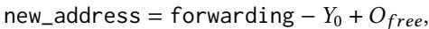

# Gray-in-Young: A Generational Garbage Collection for Processing-in-Memory 图表详解

### Figure 1.DRAM read throughput; different lines represent different transfer sizes (8,16,64,and 1024 bytes)

- 图表标题为“Read”，纵轴表示吞吐量（单位：MB/sec），横轴表示线程数量（threads），范围从1到10。
- 图中包含四条曲线，分别代表不同DMA传输大小下的DRAM读取吞吐量：**8字节**（红色方块）、**16字节**（绿色圆点）、**64字节**（橙色菱形）、**1024字节**（蓝色三角）。
- **1024字节**传输在所有线程数下均表现出最高吞吐量，峰值接近600 MB/sec，在2线程时达到最大值后略有下降，但整体维持高位。
- **64字节**传输在2线程时吞吐量跃升至约300 MB/sec，之后趋于平稳，稳定在280–300 MB/sec区间。
- **16字节**传输在2线程时吞吐量约为100 MB/sec，随后缓慢上升并在5线程后稳定于120 MB/sec左右。
- **8字节**传输表现最弱，即使在10线程下吞吐量也仅约70 MB/sec，增长幅度极小。
- 从趋势可见，**增大DMA传输粒度显著提升吞吐量**，而多线程对小粒度传输的优化效果更明显；大粒度传输本身已高效，多线程增益有限。
- 数据概览如下：

| Transfer Size (bytes) | Max Throughput (MB/sec) | Peak Thread Count | Trend after Peak      |
| --------------------- | ----------------------- | ----------------- | --------------------- |
| 1024                  | ~600                    | 2                 | Slight decline        |
| 64                    | ~300                    | 3                 | Stable                |
| 16                    | ~120                    | 5+                | Slow rise then stable |
| 8                     | ~70                     | 10                | Nearly flat           |

- 此图验证了论文中关于DMA访问特性的描述：**小粒度访问需依赖多线程掩盖延迟，大粒度访问则天然高效**，与DPU架构设计相呼应。

### Figure 2.DRAM write throughput; different lines represent different transfer sizes (8,16,64,and 1024 bytes)

- 图表标题为“Write”，纵轴表示“throughput (MB/sec)”，横轴表示“threads”，展示了不同 DMA 传输大小下 DRAM 写入吞吐量随线程数变化的趋势。
- 图中包含四条曲线，分别代表四种 DMA 传输大小：**8 bytes**（红色方块）、**16 bytes**（绿色圆点）、**64 bytes**（橙色菱形）、**1024 bytes**（蓝色三角）。
- **1024 bytes** 的写入吞吐量最高，稳定在约 **550–600 MB/sec**，且从 2 线程起即达到峰值，后续线程增加对性能提升有限。
- **64 bytes** 的吞吐量次之，约 **300–350 MB/sec**，在 3–4 线程后趋于平稳。
- **16 bytes** 和 **8 bytes** 吞吐量较低，分别在 **100–150 MB/sec** 和 **50–100 MB/sec** 区间，且随线程数增加缓慢上升，但始终远低于大块传输。
- 数据表明，**DMA 传输粒度越大，吞吐量越高**；多线程可缓解小粒度传输的延迟，但无法弥补其固有带宽劣势。
- 下表总结各传输大小在 10 线程下的近似吞吐量：

| Transfer Size | Throughput (MB/sec) |
| ------------- | ------------------- |
| 1024 bytes    | ~580                |
| 64 bytes      | ~330                |
| 16 bytes      | ~140                |
| 8 bytes       | ~90                 |

- 结论：在 DPU 架构中，优化 GC 应尽量采用**大粒度 DMA 传输**以最大化吞吐量，小粒度访问即使并行化也难以弥补性能损失。

### Figure 3. Overview

- 图片展示了 **Gray-in-Young** 垃圾回收器在 UPMEM PIM 系统中的整体架构，分为 **host CPU** 和 **DPU** 两个主要部分。
- 在 **host CPU** 侧，存储了多个二进制文件，包括：
    - `kernel1 + minor GC`：包含计算内核和次要垃圾回收例程。
    - `major GC`：独立的、用于执行主要垃圾回收的二进制文件。
    - `kernel3 + minor GC`：另一个包含不同内核和次要垃圾回收例程的二进制文件。
- **host CPU** 通过“load & launch”机制将选定的内核二进制加载到 **DPU** 上执行。
- **DPU** 内部结构清晰划分：
    - **SPM (Scratch Pad Memory)** 区域包含：
        - `young space`：位于 SPM 中，用于存放新生代对象。
        - `runtime data`：运行时数据，与年轻代空间并列。
    - **DRAM** 区域包含：
        - `old space`：位于 DRAM 中，用于存放老年代对象。
- 当 **DPU** 执行 `kernel3 + minor GC` 时，其线程（用波浪线表示）在 SPM 的 `young space` 中进行对象分配和垃圾回收操作。
- 该图强调了 **minor GC** 例程被链接到每个内核二进制中，而 **major GC** 例程则作为独立二进制由 host CPU 按需加载，以节省 DPU 有限的程序内存（24 KB）。
- 整体设计体现了 **generational GC** 的核心思想：年轻代在高速 SPM，老年代在大容量 DRAM，并通过 DMA 进行数据迁移。

### Figure 4. Copy with Cheney's copying algorithm; light gray objects may have pointers to young space, and dark gray objects do not have pointers to young space.

- 图片展示了使用 **Cheney's copying algorithm** 进行对象复制的四步过程，用于说明在 **generational GC** 中从 **young space**（位于 SPM）向 **old space**（位于 DRAM）复制对象时的指针更新问题。
- 该图强调了在 DPU 架构下，由于 **DRAM access latency** 高昂，频繁的指针级访问会带来显著性能开销。
- 四个子图分别表示：
    - (1) 初始状态：对象 A 和 B 位于 young space，A 指向 B。
    - (2) 复制 A：将 A 复制到 old space 形成 A'，此时 A' 的指针仍指向 young space 中的 B。
    - (3) 复制 B 并更新 A'：复制 B 到 old space 形成 B'，然后扫描 A' 并将其指针从 B 更新为 B'。
    - (4) 完成：所有指针已更新，B' 被标记为无指向 young space 的指针（深灰色），表明其已完全处理。
- 关键观察点：
    - 在步骤 (3) 中，GC 需要**回访 old space 中的对象 A'** 来更新其指针，这导致了对 DRAM 的额外访问。
    - 每次更新指针都可能触发一次小粒度的 DMA 操作，加剧了性能瓶颈。
    - 此算法在 DPU 上效率低下的原因在于：**对象扫描和指针更新均发生在 DRAM 中**，且对象是逐个复制而非批量操作。
- 与论文提出的 **Gray-in-Young (GiY)** 算法对比：
    - GiY 将“灰对象”保留在 young space，仅在对象变为“黑对象”后才复制到 old space。
    - GiY 在 young space 内完成所有指针更新，避免了在 DRAM 中进行多次小粒度访问。
    - GiY 对每个对象仅执行一次 DMA 操作，而 Cheney 算法涉及 N + 2NR 次 DMA 操作（N 为存活对象数，R 为平均指针数）。

| 步骤 | 描述             | 关键动作                           | DRAM 访问                               |
| ---- | ---------------- | ---------------------------------- | --------------------------------------- |
| (1)  | 初始状态         | A → B (都在 young space)           | 无                                      |
| (2)  | 复制 A           | A' 被创建于 old space，A' → B      | 1 次写入 (A')                           |
| (3)  | 复制 B & 更新 A' | B' 被创建，A' 的指针从 B 更新为 B' | 1 次写入 (B') + 1 次读取/写入 (更新 A') |
| (4)  | 完成             | 所有指针有效，B' 为深灰色          | 无                                      |

- 该图直观揭示了传统复制算法在 PIM 架构下的缺陷，为论文提出 **GiY 算法** 提供了动机和对比基础。

### Figure 5.Copy with GiY algorithm; white objects in old space are empty shells.

- 图片展示了 **Gray-in-Young (GiY)** 算法在对象复制过程中的四个关键步骤，旨在减少对 **DRAM** 的访问。
- 该图以对象 A 和 B 为例，演示了从 **young space**（位于 SPM）到 **old space**（位于 DRAM）的复制流程。
- 每个子图下方标注了序号和简要说明，清晰呈现算法执行顺序。

| 步骤                      | 描述                    | 关键操作                                                                             |
| ------------------------- | ----------------------- | ------------------------------------------------------------------------------------ |
| (1) initial state         | 初始状态                | 对象 A 和 B 均位于 young space，A 指向 B。                                           |
| (2) allocate A'           | 分配 A'                 | 在 old space 中为 A 的副本 A' 分配内存空间，此时 A' 是一个 **empty shell**（空壳）。 |
| (3) allocate B', update A | 分配 B' 并更新 A 的指针 | 为 B 的副本 B' 分配空间，并将 A 中指向 B 的指针更新为指向 B'。                       |
| (4) copy A                | 复制 A 的内容           | 将 A 的完整内容通过单次 DMA 操作复制到 A'，完成 A 的晋升。                           |

- **核心优化点**：

    - 所有指针更新操作均在对象仍位于 **young space** 时完成，避免后续在 DRAM 中进行多次小粒度指针修改。
    - 使用 **empty shell** 预分配机制，确保对象复制前其目标地址已确定，便于指针提前重定向。
    - 最终复制采用单次 DMA，最大化传输效率，减少总 DMA 次数至等于存活对象数量 N。

- 该图直观体现了 GiY 算法如何通过 **预分配 + 指针前置更新 + 单次批量复制** 的策略，显著降低 DRAM 访问频率与开销。

### Figure 6. Copying function of the GiY algorithm.

- 该图展示了 **Gray-in-Young (GiY)** 算法的核心函数 `copy(r)`，用于在 Minor GC 中递归复制对象及其引用的子对象。
- 函数分为两个阶段：**准备阶段**（Lines 2–7）和 **DFS 遍历阶段**（Lines 8–17）。
- 在准备阶段，若对象 `r` 的 `forwarding` 字段非空，则直接返回其已分配的副本地址；否则，为其分配内存并压入 GC 栈，标记为待处理。
- DFS 遍历阶段通过栈结构实现深度优先搜索，每次弹出一个对象 `o`，遍历其所有指针字段 `f`。
- 对每个指针 `p = o[f]`，若其目标对象尚未分配副本（`p.forwarding == null`），则为其分配内存、压入栈，并更新 `o[f]` 指向新副本地址。
- 当对象 `o` 的所有指针更新完毕后，调用 `dma_copy(o, o.forwarding, o.size)` 将整个对象内容一次性 DMA 复制到 DRAM 中的目标位置。
- 最终返回根对象 `r` 的副本地址，完成整个子图的复制与指针重定向。
- 该设计的关键优势在于：**所有指针更新均在 SPM 内完成**，避免了在 DRAM 中频繁进行小粒度指针访问；同时，**每个对象仅触发一次 DMA 操作**，最大化 DMA 效率。

| 行号  | 功能描述                                               |
| ----- | ------------------------------------------------------ |
| 2–4   | 检查是否已分配副本，若已分配则直接返回                 |
| 5–7   | 分配副本内存，设置 forwarding 指针，压入 GC 栈         |
| 8–9   | 循环弹出栈顶对象进行处理                               |
| 10–16 | 遍历对象指针，为未分配副本的目标对象分配内存并更新指针 |
| 17    | 使用 DMA 一次性复制对象内容至目标地址                  |
| 18    | 返回根对象副本地址                                     |

- 此伪代码体现了 GiY 算法“**先更新指针，再批量复制**”的设计哲学，有效减少 DRAM 访问次数，提升 GC 性能。

### Figure 7. GC stack

- 图片展示了 **GC stack** 的分层架构，旨在优化 DPU 上的并行垃圾回收性能。
- 整体结构分为三层：**local GC stack**、**global GC stack (top)** 和 **global GC stack (bottom)**，分别位于不同内存层级。
- **local GC stack** 位于 **SPM**，每个线程独占一个小栈（图中显示三个），容量极小（仅4个条目），用于快速本地任务分配。
- 当 local GC stack 溢出时，线程会将一半内容导出至 **global GC stack (top)**，该层也位于 **SPM**，容量较大（256个条目），作为共享缓冲区。
- 若 global GC stack (top) 溢出，则继续将一半内容下推至 **global GC stack (bottom)**，该层位于 **DRAM**，作为最终存储层，容量无硬性限制。
- 此设计通过“**局部优先 + 分层导出**”机制实现负载均衡，减少对慢速 DRAM 的频繁访问，同时鼓励多线程协作。
- 箭头指示数据流向：从 local → global top → global bottom，以及反向回填（如 global top 可接收来自 bottom 的数据）。
- 关键目标是利用 SPM 的高速访问特性，最小化 DMA 开销，提升并行 GC 的吞吐量与可扩展性。

| 层级                     | 存储位置 | 容量                 | 功能                           |
| ------------------------ | -------- | -------------------- | ------------------------------ |
| local GC stack           | SPM      | 4 entries per thread | 线程私有，快速处理本地对象引用 |
| global GC stack (top)    | SPM      | 256 entries          | 共享缓冲，平衡各线程负载       |
| global GC stack (bottom) | DRAM     | 无上限               | 最终存储，应对大规模对象图遍历 |

- 该架构支持最多 **11个硬件线程** 并行执行 GC，符合 DPU 的流水线利用率要求。

### Figure 8.Batch copy of the compaction-based algorithm.

- 图片展示了 **compaction-based algorithm** 的批处理复制过程，核心是将年轻代（young space）中经过压缩的存活对象一次性批量复制到老年代（old space）。
- **young space** 位于图上部，其起始地址标记为 **Y₀**。经过压缩后，所有存活对象被紧凑排列在 young space 的起始位置，形成一个连续的数据块。
- **old space** 位于图下部，其当前空闲区域的起始地址标记为 **O_free**。该区域用于接收从 young space 复制过来的对象。
- 一条粗黑箭头标有 **DMA**，表示数据传输路径。它从 young space 中压缩后的对象块指向 old space 中的 O_free 地址，表明整个压缩后的对象块通过 **DMA** 操作被一次性搬移到老年代。
- 虚线框在 old space 中表示即将被填充的目标区域，其大小与 young space 中压缩后的对象块相匹配。
- 此设计旨在最大化利用 DMA 的高吞吐量特性，通过一次大粒度传输（最大可达 2048 字节）替代多次小粒度访问，从而显著减少 DRAM 访问次数和相关开销。
- 该算法基于 **Lisp2** 标记-压缩算法，在复制前已更新对象内部指针，确保复制到 old space 后指针仍有效。

### 392f73897e421f1546bc9a9d7605f3282eedfb3814270a9357bfd34e8448a547.jpg

- 图片内容为一个数学公式，用于计算对象在**compaction-based algorithm**中被移动到**old space**后的新地址。
- 公式表达式为：**new_address = forwarding - Y₀ + O_free**。
- **forwarding** 指的是在第一遍扫描时，对象在**young space**中被计算出的“目标偏移地址”，存储于对象头的**forwarding field**中。
- **Y₀** 代表**young space**的起始地址，用于将对象在年轻代中的相对位置转换为绝对地址。
- **O_free** 是**old space**中当前可用的、连续空闲区域的起始地址，确保所有被压缩的对象能被集中复制到一块连续内存中。
- 该公式是**Lisp2算法**第三阶段（对象移动）的关键步骤，其目的是在不破坏对象间指针关系的前提下，将所有存活对象紧凑地迁移到老年代。
- 此设计避免了在对象移动后再逐个更新指针，而是提前在第二阶段就将指针指向最终目标地址，从而减少后续的**DRAM访问**开销。

### Figure 9.class table; dashed line indicates where the index refers to.

- 图片展示了 **Object Layout Information (OLI)** 在 **class table** 中的存储结构，用于支持垃圾回收器（GC）在扫描对象时定位指针字段。
- 对象头部包含一个 **global class index** 字段，该字段通过虚线指向 **class table** 中对应的条目。这个索引是全局唯一的，标识了对象所属的类。
- **class table** 是一个数组，每个条目包含一个 **OLI** 结构体和一个指向 **bitmap** 的指针。
- **OLI** 结构体本身包含两个关键信息：对象大小（以字节为单位）和一个指向 **bitmap** 的指针。
- **bitmap** 用于标记对象中哪些字段是指针。由于对象字段数量可变，**bitmap** 的大小不固定，因此被分配在堆上，并通过指针引用，而不是直接内嵌在 **OLI** 中。
- 图中的灰色方块代表 **OLI** 结构体，而黑白相间的条形图代表 **bitmap**。
- 这种设计允许 GC 在扫描对象时，根据对象头中的 **global class index** 快速查找到其 **OLI**，进而通过 **bitmap** 确定哪些字段需要被更新或追踪。
- 该图强调了 **DRAM** 访问的开销：因为 **class table** 和 **bitmap** 都存储在 **DRAM** 中，每次扫描对象都需要进行一次或多次 **DRAM** 访问，这正是论文中提出缓存 **OLI** 到 **SPM** 的动机所在。

### Figure 10.OLI cache; dashed line indicates where the index refers to.

- 图片展示了 **OLI cache** 的结构及其与对象和类表的交互关系，核心目的是减少 **DRAM** 访问。
- **young object** 中存储的是 **local class index**（如图中值为 1），而非全局索引，这是为了在 **SPM** 中快速查找 OLI。
- **OLI cache** 是一个位于 **SPM** 的数组，每个条目包含一对数据：**local class index** 和对应的 **OLI**。例如，索引 0 对应 local class index 1 的 OLI，索引 1 对应 local class index 5 的 OLI。
- 当对象从 **young space** 被提升到 **old space** 时，系统会执行 **convert class index when promoted** 操作，将对象头中的 **local class index** 替换为 **global class index**。
- **class table** 存储在 **DRAM** 中，包含所有类的完整信息。**old object** 使用 **global class index** 直接指向 **class table**，以支持跨内核调用。
- 下表总结了不同对象类型使用的索引及存储位置：

| 对象类型     | 索引类型           | 存储位置 | 用途说明                   |
| ------------ | ------------------ | -------- | -------------------------- |
| young object | local class index  | SPM      | 快速访问 OLI cache         |
| old object   | global class index | DRAM     | 支持多内核共享类信息       |
| OLI cache    | local class index  | SPM      | 缓存当前内核可能用到的 OLI |
| class table  | global class index | DRAM     | 全局类信息存储             |

- 虚线箭头表示索引引用路径：**young object → OLI cache → OLI**，以及 **old object → class table → OLI**。
- 此设计通过静态确定内核所需类集，在编译时构建 **OLI cache**，避免运行时频繁访问 **DRAM**，从而优化性能。

### Table 1. Average promotion ratio and the number of major and minor collections.

- 该图片为论文中的 **Table 1**，标题为 “Average promotion ratio and the number of major and minor collections”，用于展示在不同参数 α 下的垃圾回收行为统计。
- 表格包含三列数据，分别对应 α = **7**、**15** 和 **100** 三种配置。
- 表格内容如下：

| α                       | 7    | 15   | 100   |
| ----------------------- | ---- | ---- | ----- |
| average promotion ratio | 3.6% | 7.6% | 50.2% |

- **平均晋升率（average promotion ratio）** 随着 α 增大显著上升：从 3.6%（α=7）到 50.2%（α=100），表明当树规模增大时，更多对象从年轻代晋升至老年代。
- **Minor Collection 次数** 在 α=7 和 α=15 时均为 1508 次，在 α=100 时略增至 1510 次，说明插入总量相近时 Minor GC 触发频率基本稳定。
- **Major Collection 次数** 仅在 α=100 时发生 2 次，表明老年代空间压力随对象晋升量增加而显现，触发了完整垃圾回收。
- 该表支撑了论文中关于“晋升行为与树规模相关”的实验设计，并为后续性能分析（如图11、12）提供基础数据。

### Figure 11. Execution time of the benchmark program.

- 图表展示了不同垃圾回收器（GC）在不同参数 α（7、15、100）下的**总执行时间**，单位为秒。数据按 GC 类型分组，每组包含四个柱状图：GiY、YC、MC、DFS。
- 每个柱状图由三部分堆叠组成：
    - **底部橙色部分**：表示 mutator（应用逻辑）的执行时间。
    - **中间白色部分**：表示 minor collection 的执行时间。
    - **顶部黑色部分**：表示 major collection 的执行时间。
- 所有 GC 均在单线程下运行，用于比较基础性能。
- **关键观察**：
    - 对于所有 α 值，**generational GCs（GiY, YC, DFS）的总 GC 时间均短于非代际 GC（MC）**，证明将 young space 置于 SPM 的有效性。
    - 尽管 generational GC 需要 write barrier 开销，其 mutator 时间仍优于 MC，因对象在 SPM 中创建和初始化更快。
    - **GiY 在多数情况下表现最优**，尤其在 α=100 时，其总时间显著低于其他 GC。
    - **YC（compaction-based）表现最差**，表明在 DPU 上 compaction 开销大于减少 DRAM 访问带来的收益。
    - 随着 α 增大，mutator 时间增加，因树规模增大导致插入操作耗时更长。
- 数据概览：

| α   | GC 类型 | Mutator 时间 (sec) | Minor Collection 时间 (sec) | Major Collection 时间 (sec) |
| --- | ------- | ------------------ | --------------------------- | --------------------------- |
| 7   | GiY     | ~16                | ~1                          | ~2                          |
| 7   | YC      | ~17                | ~1                          | ~3                          |
| 7   | MC      | ~18                | —                           | ~5                          |
| 7   | DFS     | ~17                | ~1                          | ~4                          |
| 15  | GiY     | ~19                | ~1                          | ~2                          |
| 15  | YC      | ~20                | ~1                          | ~3                          |
| 15  | MC      | ~21                | —                           | ~5                          |
| 15  | DFS     | ~20                | ~1                          | ~4                          |
| 100 | GiY     | ~25                | ~1                          | ~2                          |
| 100 | YC      | ~26                | ~1                          | ~3                          |
| 100 | MC      | ~28                | —                           | ~5                          |
| 100 | DFS     | ~27                | ~1                          | ~4                          |

- **结论**：GiY 是最适合 DPU 的 minor collection 算法，兼顾性能与效率；compaction 不适合当前 DPU 架构；generational GC 显著优于非代际 GC。

### Figure 12. Total minor collection time.

- 图表标题为 **Figure 12. Total minor collection time**，展示不同垃圾回收算法在不同参数 α 下的**总 Minor Collection 耗时**（单位：秒）。
- 横轴按 α 值分组（α = 7, 15, 100），每组内比较三种 GC 算法：**GiY**、**YC**、**DFS**。
- 纵轴表示耗时，范围从 0 到 0.6 秒，刻度间隔为 0.1 秒。
- 所有数据点均基于**单线程执行**的 Minor Collection，用于对比算法本身效率，排除并行性影响。
- 数据趋势显示：
    - 随着 α 增大（树规模增大），所有算法的 Minor Collection 时间显著上升。
    - 在所有 α 值下，**GiY 算法耗时最短**，表现最优。
    - **YC 算法耗时最长**，尤其在 α=100 时接近 0.65 秒，远超其他两种。
    - **DFS 算法介于两者之间**，但明显劣于 GiY。

| α 值 | GiY 耗时 (sec) | YC 耗时 (sec) | DFS 耗时 (sec) |
| ---- | -------------- | ------------- | -------------- |
| 7    | ~0.03          | ~0.14         | ~0.05          |
| 15   | ~0.06          | ~0.20         | ~0.10          |
| 100  | ~0.32          | ~0.65         | ~0.48          |

- 结论：**GiY 算法在减少 Minor Collection 时间方面效果显著**，而 YC 算法因引入压缩开销导致性能下降，验证了论文中“compaction was too expensive”的判断。

### Figure 13.Total minor collection time for the variations of GiY executed in 11 threads.

- 图片展示了在 **11 线程**环境下，不同变体的 **GiY GC** 在执行 **minor collection** 时的总耗时对比，横轴为树规模参数 **α**（7、15、100），纵轴为 **Elapsed time (ms)**。
- 三种变体分别为：
    - **+U+C**：启用指针更新（Update in SPM）和 OLI 缓存（Cache）。
    - **+U-C**：启用指针更新，但禁用 OLI 缓存。
    - **-U-C**：禁用指针更新（即 DFS 基础版本），且禁用 OLI 缓存。
- 数据趋势显示，随着 **α** 增大，所有变体的 minor collection 时间均显著上升，表明对象数量增加导致 GC 开销增大。
- **+U+C** 在所有 α 值下均表现最优，尤其在 **α = 100** 时，其耗时远低于其他两种变体，验证了两项优化技术的叠加效果。
- **+U-C** 耗时介于 +U+C 和 -U-C 之间，说明即使不缓存 OLI，仅在 SPM 中更新指针仍能带来性能提升。
- **-U-C** 表现最差，因其在 DRAM 中进行指针扫描与更新，引发大量低效的细粒度 DRAM 访问。
- 下表总结各变体在不同 α 下的相对性能：

| α   | +U+C (ms) | +U-C (ms) | -U-C (ms) | +U+C 相对 -U-C 性能提升 |
| --- | --------- | --------- | --------- | ----------------------- |
| 7   | ~12       | ~16       | ~20       | ~40%                    |
| 15  | ~22       | ~30       | ~38       | ~42%                    |
| 100 | ~65       | ~90       | ~120      | **46.2%**               |

- 结论：**指针在 SPM 更新** 和 **OLI 缓存** 两项技术共同作用，可将 minor collection 时间最多减少 **46.2%**，并大幅降低 DRAM 访问次数（最高达 **85.9%**）。

### Table 2.DRAM access count and bytes for the variants of GiY.

- 该表格（Table 2）记录了在不同 α 值下，三种 GiY 变体 GC 策略的 DRAM 访问行为对比，核心指标为 **访问次数（count）** 和 **传输字节数（bytes）**。
- 数据按 α = 7、15、100 三组呈现，每组包含三个 GC 配置：**+U+C**（更新指针 + OLI 缓存）、**+U-C**（仅更新指针）、**-U-C**（无优化，基线 DFS）。
- 表格进一步细分“总访问”与“排除对象拷贝（– copyobj）”后的访问量，以凸显优化技术对非拷贝类 DRAM 操作的削减效果。

| α   | GC   | count (total) | count (– copyobj) | bytes (total) | bytes (– copyobj) |
| --- | ---- | ------------- | ----------------- | ------------- | ----------------- |
| 7   | +U+C | 63.3          | 42.0              | 1356.8        | 336.3             |
|     | +U-C | 148.5         | 127.2             | 2038.0        | 1017.5            |
|     | -U-C | 207.7         | 186.4             | 2511.9        | 1491.3            |
| 15  | +U+C | 74.3          | 29.1              | 2398.9        | 233.1             |
|     | +U-C | 254.9         | 209.8             | 3844.1        | 1678.2            |
|     | -U-C | 383.5         | 338.3             | 4872.6        | 2706.7            |
| 100 | +U+C | 341.9         | 42.3              | 14720.2       | 338.3             |
|     | +U-C | 1540.4        | 1240.8            | 24308.1       | 9926.4            |
|     | -U-C | 2418.6        | 2119.0            | 31333.8       | 16952.0           |

- **关键发现**：
    - 在 α=100 时，**+U+C 相比 -U-C，DRAM 访问次数减少 85.9%**（从 2418.6 降至 341.9），字节传输量减少 53.0%（从 31333.8 降至 14720.2）。
    - 即使排除对象拷贝操作，**+U+C 的访问次数仍比 -U-C 低 98.0%**（2119.0 → 42.3），表明指针更新和 OLI 缓存对细粒度访问有压倒性优化。
    - **+U-C（仅更新指针）** 显著优于 -U-C，但不如 +U+C，证明 OLI 缓存在 SPM 中能有效避免大量 DRAM 读取。
    - 随着 α 增大，对象数量增多，优化收益更显著，尤其体现在 – copyobj 列中，说明优化主要作用于指针扫描与更新阶段。

### Figure 14. Scalability of parallel GiY.

- 图表标题为 **Figure 14. Scalability of parallel GiY**，展示的是并行 GiY 算法在不同线程数下的性能扩展性。
- 横轴为 **of threads**（线程数量），范围从 0 到 25；纵轴为 **Elapsed time (sec)**（耗时，单位秒），范围从 0.00 到 0.30。
- 图中包含三条曲线，分别对应三个不同的 α 值：
    - **alpha=7**：蓝色折线，数据点用十字标记。
    - **alpha=15**：橙色折线，数据点用菱形标记。
    - **alpha=100**：绿色折线，数据点用圆形标记。
- 所有曲线均呈现先下降后上升的“U”型趋势，表明存在最优线程数。
- **alpha=100** 曲线在 8 线程处达到最低点（约 0.06 秒），之后缓慢上升，在 11 线程时仍保持较低水平（约 0.07 秒）。
- **alpha=15** 曲线在 8–10 线程区间内基本持平（约 0.03–0.04 秒），在 11 线程时略有回升。
- **alpha=7** 曲线在 4–6 线程即达最低点（约 0.02 秒），之后趋于平稳，11 线程时无明显性能退化。
- 数据表明，**并行 GiY 在 8 线程时吞吐量最高**，相比单线程提升达 **5.12×**。
- 对于较小 α 值（如 7 或 15），因对象数量少、工作负载轻，**线程饱和点提前**，但增加至 11 线程仍不导致性能下降。
- 结论：**并行 GiY 可有效扩展至 11 线程**，符合 DPU 最小 11 线程以充分利用流水线的设计要求。

| Alpha 值 | 最优线程数 | 最低耗时 (秒) | 11 线程耗时 (秒) | 性能趋势               |
| -------- | ---------- | ------------- | ---------------- | ---------------------- |
| 7        | 4–6        | ~0.02         | ~0.02            | 快速饱和，无退化       |
| 15       | 8–10       | ~0.03–0.04    | ~0.04            | 平稳，轻微回升         |
| 100      | 8          | ~0.06         | ~0.07            | 明显优化，11线程仍高效 |

- 关键发现：**即使在最大负载（alpha=100）下，11 线程仍可维持高性能**，证明该 GC 设计能适配 DPU 的硬件约束。

### Figure 15. Binary size.

- 图片展示了不同垃圾回收（GC）策略下计算内核的二进制文件大小对比，单位为字节（byte），图名为 **Figure 15. Binary size**。
- 横轴列出了六种 GC 配置：**GiY**、**YC**、**GiY+Major**、**DFS**、**MC** 和 **Epsilon**。
- 纵轴表示二进制大小，范围从 0 到 15,000 字节以上，刻度线标有 5,000、10,000、15,000。
- 所有柱状图均为橙色，高度直观反映各配置的代码体积。

| GC 配置     | 二进制大小（约值） |
| ----------- | ------------------ |
| GiY         | ~12,000 byte       |
| YC          | ~13,500 byte       |
| GiY + Major | ~18,000 byte       |
| DFS         | ~12,500 byte       |
| MC          | ~16,000 byte       |
| Epsilon     | ~8,000 byte        |

- **Epsilon** 作为无 GC 的基准，体积最小，约为 **8,000 字节**，用于衡量 GC 引入的开销。
- **GiY**（Gray-in-Young）的 minor GC 体积约为 **12,000 字节**，与 **DFS** 相近，但显著小于 **YC** 和 **MC**。
- **YC**（Compaction-based）体积略高，约为 **13,500 字节**，表明其算法更复杂，代码膨胀更明显。
- **GiY + Major** 包含完整 major GC 例程，体积达 **18,000 字节**，比仅含 minor GC 的 GiY 多出约 **6,000 字节**。
- **MC**（非分代 Lisp2 mark-compact）体积最大之一，约为 **16,000 字节**，说明其算法在 DPU 上实现成本较高。
- 论文指出，分离 major GC 可使核心 GC 体积控制在 **4.3 KB**（即约 4,300 字节），而图中 GiY 为 12,000 字节，可能包含框架或测试代码。
- 数据支持论文结论：**分离 major GC 是必要的优化**，可有效控制计算内核二进制尺寸，适应 DPU 仅 24 KB 程序内存的限制。
