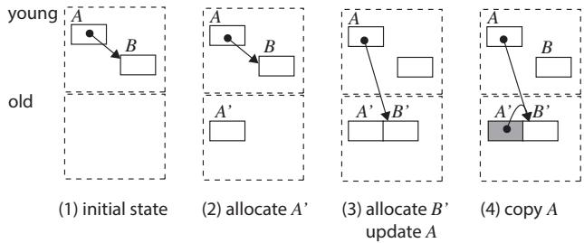
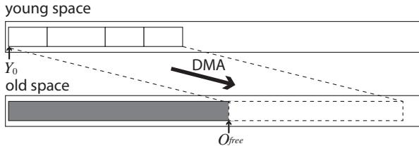
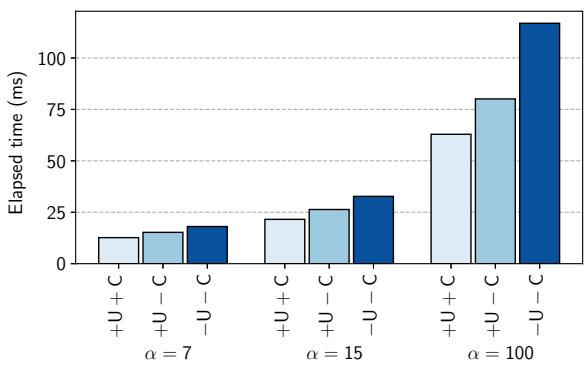
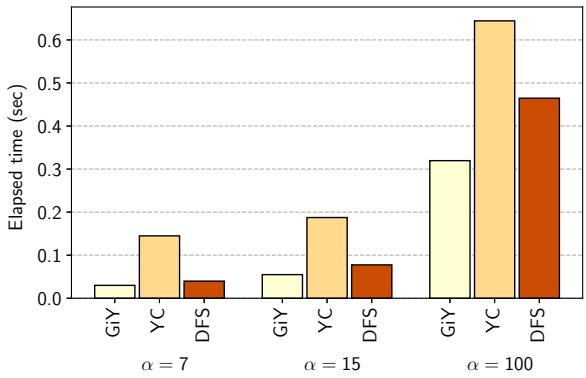
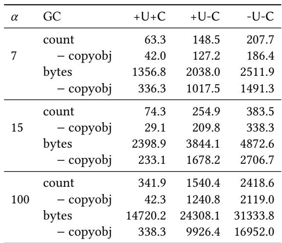

# Gray-in-Young: A Generational Garbage Collection for Processing-in-Memory 论文解析

## 0. 论文基本信息

**作者 (Authors)**: Ryu Morimoto, Kazuki Ichinose, Tomoharu Ugawa

**发表期刊/会议 (Journal/Conference)**: ISMM

**发表年份 (Publication Year)**: 2025

**研究机构 (Affiliations)**: The University of Tokyo

______________________________________________________________________

## 1. 摘要

**目的**

- 为UPMEM PIM架构中的DRAM Processing Units (DPUs)设计一个适用于托管语言（如Java）的垃圾回收器（GC），以解决在该硬件上缺乏GC支持的问题。
- 克服DPU硬件带来的三大核心挑战：
    - **高效利用小容量Scratch Pad Memory (SPM)**，并最小化高延迟的DRAM访问。
    - **并行化GC**以充分利用DPU的24个硬件线程，实现性能扩展。
    - **最小化GC代码体积**，以适应DPU仅有24 KB的指令内存限制。

**方法**

- 提出一种名为 **Gray-in-Young (GiY)** 的并行分代式垃圾回收器。
- **核心设计**：
    - **分代堆布局**：将新生代（young space）置于快速的SPM中，老年代（old space）置于大容量但访问较慢的DRAM中。
    - **指针预更新技术**：在对象从新生代晋升到老年代之前，在SPM中完成其内部指针的更新，避免在DRAM中进行大量细粒度的指针写入操作。
    - **静态对象布局信息（OLI）缓存**：在编译时确定计算内核可能用到的所有类，并将其OLI（用于GC扫描对象）缓存到SPM中，避免运行时访问DRAM中的类表。
    - **分离式二进制**：仅将Minor GC（新生代回收）例程链接到计算内核二进制中；当需要执行Major GC（老年代回收）时，由主机程序动态加载一个独立的、包含Major GC例程的二进制文件。
- **并行Minor GC算法**：
    - 采用深度优先搜索（DFS）策略遍历对象图。
    - 使用一个分层的GC工作栈来协调多线程工作：每个线程拥有一个极小的本地栈（4项），溢出时将工作推送到位于SPM中的共享栈（256项），该共享栈再溢出到DRAM，以平衡负载并减少DRAM访问。

**结果**

- 通过一个构建二叉搜索树的微基准测试对GiY进行评估，主要发现如下：
- **DRAM访问与性能**：
    - GiY的两项关键技术（指针预更新和OLI缓存）协同作用，最多可减少 **85.9%** 的DRAM访问次数。
    - 相比于基线方案，整体性能提升了 **46.2%**。
- **可扩展性**：
    - 并行GiY算法能有效扩展至 **11个线程**，在此配置下达到最佳吞吐量。
- **代码体积**：
    - Minor GC例程的代码体积仅为 **4.3 KB**。
    - 通过将6.9 KB的Major GC例程分离出去，显著节省了宝贵的指令内存空间。

| GC变体               | DRAM访问减少率 (α=100) | Minor GC时间缩短率 (vs -U-C) |
| :------------------- | :--------------------: | :--------------------------: |
| +U-C (仅OLI缓存)     |         36.3%          |            31.5%             |
| **+U+C (GiY完整版)** |       **85.9%**        |          **46.2%**           |

**结论**

- 为UPMEM DPU设计的 **Gray-in-Young (GiY)** GC通过将新生代置于SPM、在晋升前更新指针、静态缓存OLI以及分离Major GC等策略，成功应对了PIM架构下的内存、并行和代码体积约束。
- 实验结果证明，该设计是**高效且可行的**，能显著降低DRAM流量并提升性能，同时保持极小的代码足迹。
- 未来工作将聚焦于**优化并行化Major GC**，并探索将频繁访问的老年代对象缓存到SPM中的可能性。

______________________________________________________________________

## 2. 背景知识与核心贡献

**研究背景**

- **Processing-in-Memory (PIM)** 是一种旨在解决“**内存墙**”问题的新兴计算范式，通过将计算单元移至数据所在的内存位置来减少数据移动开销。
- **UPMEM PIM** 是首个商业化的通用 PIM 系统，其核心是嵌入在 DRAM 芯片中的 **DRAM Processing Units (DPUs)**。DPUs 是通用处理器，拥有独立的 **64-KB Scratch Pad Memory (SPM)**、**64-MB DRAM** 和仅 **24-KB** 的指令内存。
- 当前 UPMEM 编程模型要求 DPU 内核用 C 语言编写，缺乏对 **managed languages**（如 Java）的支持，这增加了开发复杂内核（如数据库查询处理）的难度和内存安全风险。

**研究动机**

- 为降低开发复杂 PIM 应用的门槛并提升安全性，亟需为 DPU 设计一个 **managed runtime**，而 **Garbage Collection (GC)** 是其关键组件。
- 为 DPU 设计 GC 面临三大独特挑战：
    - **内存访问瓶颈**：DPU 通过 **DMA** 访问 DRAM，延迟高（约70+0.5n周期），而 SPM 可单周期访问。必须**最小化 DRAM 访问次数**，并尽可能以大块方式访问。
    - **并行性需求**：DPU 拥有 **24 个硬件线程**，但需至少 **11 个活跃线程**才能填满其流水线，因此 GC 必须能有效**并行化**。
    - **代码尺寸限制**：DPU 的指令内存仅有 **24 KB**，而每个计算内核的二进制文件都需包含 GC 例程，因此必须**严格控制 GC 代码大小**。

**核心贡献**

- 提出 **Gray-in-Young (GiY)**，一种专为 UPMEM DPU 设计的**并行分代式垃圾回收器**。
- **创新性地将新生代（young space）置于高速 SPM 中，老年代（old space）置于 DRAM 中**，利用对象生命周期的“**generational hypothesis**”来优化性能。
- 为应对上述挑战，提出了三项关键技术：
    - **指针预更新 (Pointer Pre-update)**：在对象仍位于 SPM 时就更新其内部指针，避免在 DRAM 中进行大量细粒度的指针修正操作，从而**大幅减少 DRAM 访问**。
    - **对象布局信息 (Object Layout Information, OLI) 静态缓存**：在编译时确定计算内核可能创建的对象类型，并将其 OLI **静态缓存于 SPM** 中，避免 GC 扫描时频繁访问 DRAM 中的类表。
    - **分离式 GC 二进制**：仅将**次要回收 (minor collection)** 例程链接到计算内核中，而将**主要回收 (major collection)** 例程编译为独立的二进制文件。当需要执行 major GC 时，由主机程序动态加载，从而**显著减小主内核的代码尺寸**。
- 实验评估表明，与基线方法相比，GiY 技术组合**最多减少了 85.9% 的 DRAM 访问**，并**提升了 46.2% 的性能**。其并行 minor GC 能有效扩展至 **11 个线程**，且 minor GC 例程的代码尺寸仅为 **4.3 KB**。

 *Figure 3. Overview*
 *Figure 5.Copy with GiY algorithm; white objects in old space are empty shells.*
 *Figure 10.OLI cache; dashed line indicates where the index refers to.*

______________________________________________________________________

## 3. 核心技术和实现细节

### 0. 技术架构概览

**整体技术架构**

本文提出了一种名为 **Gray-in-Young (GiY)** 的并行分代垃圾回收器（Generational Garbage Collection），专为 **UPMEM PIM** 架构中的 **DPU (DRAM Processing Unit)** 设计。其核心目标是解决 DPU 上运行托管语言（如 Java）时面临的三大挑战：**减少昂贵的 DRAM 访问**、**利用多硬件线程实现并行化**以及**最小化 GC 代码体积以适应 24KB 的指令内存限制**。

- **内存布局与分代策略**:

    - **Young Space (新生代)**: 位于 **64KB Scratch Pad Memory (SPM)** 中。所有新创建的小对象都在此分配，利用 SPM 的单周期高速访问特性加速对象初始化和分配。
    - **Old Space (老年代)**: 位于 **64MB DRAM** 中。存活的对象在 Minor GC 时被提升（promote）至此。
    - **Remembered Set**: 用于追踪从 Old Space 指向 Young Space 的指针，也存放于 SPM 中，并在每次 Minor GC 后清空。
         *Figure 3. Overview*

- **GC 触发与执行模型**:

    - **Minor Collection**: 在以下情况触发：1) Young Space 耗尽；2) 计算内核（computation kernel）执行完毕；3) 需要切换内核二进制文件（program overlay）之前。Minor GC 会**一次性提升所有存活对象**到 Old Space，并清空 Young Space。
    - **Major Collection**: 当 Old Space 几乎耗尽时触发。其代码**不包含在计算内核的二进制中**，而是作为一个**独立的二进制文件**，由主机程序在需要时动态加载到 DPU 执行，从而节省宝贵的 24KB 指令内存。

- **核心优化技术**:

    - **Gray-in-Young (GiY) 提升算法**: 这是一种基于 **DFS (Depth-First Search)** 的对象提升算法。其关键创新在于，在对象仍位于 SPM (Young Space) 时，就**预先更新其内部指针**，使其指向目标对象在 DRAM (Old Space) 中的新地址（或预留的“空壳”）。只有当对象的所有指针都更新完毕后，才通过**一次 DMA 操作**将其整体复制到 DRAM。这避免了在 DRAM 中逐个更新指针带来的大量细粒度访问开销。
         *Figure 5.Copy with GiY algorithm; white objects in old space are empty shells.*
         *Figure 7. GC stack*
    - **对象布局信息 (Object Layout Information, OLI) 静态缓存**: 由于每个计算内核结束后都会执行 Minor GC 并清空 Young Space，因此 Young Space 中的对象仅由当前内核创建。编译器可以在**编译时静态确定**这些对象所属的类，并将对应的 OLI（包含对象大小和指针字段位图）**预加载到 SPM 的一个专用缓存**中。Minor GC 扫描对象时直接从 SPM 读取 OLI，避免了访问 DRAM 中的全局类表。
         *Figure 9.class table; dashed line indicates where the index refers to.*
         *Figure 10.OLI cache; dashed line indicates where the index refers to.*

- **并行化设计**:

    - Minor GC 被设计为**并行执行**，以充分利用 DPU 的 **24 个硬件线程**（论文指出至少需要 11 个线程才能填满流水线）。
    - 采用**工作窃取 (work-stealing)** 策略：每个 GC 线程拥有一个**小型本地 GC 栈**（位于 SPM），当本地栈溢出时，会将部分工作项推送到一个**共享 GC 栈**。该共享栈采用**两层设计**（顶层在 SPM，底层在 DRAM），以在保证负载均衡的同时，尽量减少对 DRAM 的访问。
         *Figure 8.Batch copy of the compaction-based algorithm.*

- **二进制大小管理**:

    - 通过将 **Major GC 例程 (6.9 KB)** 与计算内核分离，使得内核中只需包含 **Minor GC 例程 (4.3 KB)**，极大地节省了指令内存空间，确保了复杂内核也能在 24KB 限制下运行。

### 1. Gray-in-Young (GiY) 算法

**Gray-in-Young (GiY) 算法实现原理与流程**

- GiY 是一种 **深度优先搜索 (DFS)** 的垃圾回收算法，专为 UPMEM DPU 架构设计，其核心目标是**最小化细粒度的 DRAM 访问**。
- 该算法的关键洞察在于：传统的 Cheney 复制算法在将对象从 SPM（年轻代）复制到 DRAM（老年代）后，才在 DRAM 中扫描并更新指针。这会导致大量**指针大小的、低效的 DMA 操作**。
- GiY 颠覆了这一流程，它**在对象仍位于快速的 SPM 中时，就完成所有指针的更新工作**，然后才通过一次**大块 DMA 操作**将整个已修正的对象内容复制到 DRAM。
- 具体流程如下：
    - **准备阶段 (Prepare Step)**: 当需要提升一个根对象 `r` 时，算法首先为其在老年代（DRAM）中分配内存，并将该地址记录在对象 `r` 的转发指针（forwarding field）中。此时，DRAM 中的新对象只是一个“**空壳 (empty shell)**”。
    - **DFS 遍历阶段 (DFS Traversal Step)**: 算法使用一个 GC 栈来管理待处理的对象。
        - 从栈中弹出一个对象 `o`（位于 SPM）。
        - 扫描 `o` 的所有指针字段。
        - 对于每个指向子对象 `p` 的指针：
            - 如果 `p` 尚未被访问（即其转发指针为空），则立即在老年代为 `p` 分配内存，并将其地址存入 `p` 的转发指针。
            - **关键步骤**: 立即将 `o` 中的指针从指向 SPM 中的 `p`，更新为指向 DRAM 中 `p` 的新地址（即 `p` 的转发指针值）。
        - 在 `o` 的**所有指针都被更新完毕后**，执行一次**单一的 DMA 操作**，将 `o` 的全部内容从 SPM 复制到其在 DRAM 中的“空壳”里。
        - 将 `p` 压入 GC 栈，以便后续对其进行同样的处理。
- 通过这种方式，GiY 确保了每个存活对象在整个提升过程中**仅触发一次 DMA 写操作**，从而将总的 DMA 操作次数从传统算法的 `N + 2NR`（`N` 为对象数，`R` 为平均指针数）降低到 `N`。

 *Figure 5.Copy with GiY algorithm; white objects in old space are empty shells.*
 *Figure 7. GC stack*

**并行化策略与参数设置**

- GiY 算法被设计为**并行执行**，以充分利用 DPU 的 **24 个硬件线程**，并满足其**至少需要 11 个活跃线程**才能填满流水线的要求。
- 并行化通过一个**分层的、混合的 GC 工作栈**实现：
    - **本地栈 (Local Stack)**: 每个线程拥有一个非常小的本地栈（**仅 4 个条目**），位于 SPM 中。这种小尺寸设计鼓励线程频繁地将工作负载导出，以促进负载均衡。
    - **共享栈 (Shared Stack)**: 由所有线程共享，采用两层结构。
        - **顶层 (Top Layer)**: 位于 SPM 中，容量较大（**256 个条目**），用于高效地在 SPM 内交换工作项。
        - **底层 (Bottom Layer)**: 位于 DRAM 中，当顶层溢出时，一半内容会被移至此处，以避免因栈空间不足而频繁访问 DRAM。
- 这种设计在保证**高效负载均衡**的同时，**最大限度地减少了对慢速 DRAM 的访问**。

 *Figure 8.Batch copy of the compaction-based algorithm.*

**输入输出关系及在整体 GC 中的作用**

- **输入**: GiY 算法的输入是**所有从根集可达的对象**。根集包括：
    - 各个 mutator 线程的 **Java 栈**（由各线程并行扫描）。
    - **Remembered Set**（记录老年代指向年轻代的指针，由主线程扫描）。
    - **Export Table**（用于跨内核通信的句柄表，由主线程扫描）。
- **输出**: GiY 算法的输出是**所有存活对象被完整、正确地迁移至老年代（DRAM）**，并且所有指向这些对象的指针（无论来自年轻代还是老年代）都已被更新为指向它们在老年代的新地址。执行完毕后，**年轻代（SPM）被完全清空**。
- **在整体 GC 中的作用**:
    - GiY 是整个**分代式垃圾回收器的 Minor Collection（次要回收）** 的核心。
    - 它负责高效地处理**短命对象**，利用 SPM 的高速特性进行分配和回收。
    - 通过将提升过程中的指针更新操作限制在 SPM 内，并结合 **OLI 缓存**技术，GiY 极大地**减少了 Minor GC 的 DRAM 访问开销**。
    - 其性能优势直接体现在整体应用性能上：评估显示，GiY 相比基线算法可**减少高达 85.9% 的 DRAM 访问**，并带来 **46.2% 的性能提升**。
    - 为了控制二进制大小，只有 GiY 等 Minor GC 例程被链接到计算内核中，而 Major GC 则被分离到一个独立的二进制文件中，由主机按需加载。

| GiY 变体 | 指针更新位置 | OLI 缓存 | α=100 时相比 -U-C 的 DRAM 访问减少率 | α=100 时相比 -U-C 的 Minor GC 时间缩短率 |
| :------- | :----------- | :------- | :----------------------------------- | :--------------------------------------- |
| **-U-C** | DRAM         | 否       | 0%                                   | 0%                                       |
| **+U-C** | SPM          | 否       | 36.3%                                | 31.5%                                    |
| **+U+C** | SPM          | **是**   | **85.9%**                            | **46.2%**                                |

 *Figure 13.Total minor collection time for the variations of GiY executed in 11 threads.*

### 2. SPM中的对象布局信息（OLI）静态缓存

**实现原理与核心动机**

- **核心动机**是解决在 Minor GC 扫描对象时，需要频繁访问位于 **DRAM** 中的 **class table** 以获取 **Object Layout Information (OLI)** 的问题。由于 DPU 访问 DRAM 需通过 **DMA**，其延迟远高于对 **Scratch Pad Memory (SPM)** 的单周期访问，这种频繁的细粒度 DRAM 访问会成为性能瓶颈。
- 该方案基于一个关键观察：因为 Minor GC 会在**每次计算内核（computation kernel）结束时被触发**，并且会清空 **young space**，所以在任何计算内核执行期间，**young space 中的对象仅限于该内核自身通过 `new` 表达式创建的对象**。
- 基于此，可以在**编译时静态分析**出该计算内核可能创建的所有对象的**类集合**，从而预先知道 Minor GC 可能需要扫描的所有 OLI。

**算法流程与数据结构**

- **编译时阶段**：
    - 编译器分析计算内核的源代码，识别所有显式的 `new` 表达式。
    - 收集这些 `new` 表达式所对应的所有**类**。
    - 为这些类从主 **class table**（位于 DRAM）中提取对应的 **OLI**。
    - 将这些 OLI 构建成一个**静态缓存映像（static cache image）**，并将其嵌入到该计算内核的二进制文件中或存储在 DRAM 的特定位置。
- **运行时阶段**：
    - 当计算内核被加载并启动时，其初始化例程会将预先构建好的 **OLI 缓存映像**从 DRAM **一次性加载**到 **SPM** 中。
    - 该缓存在内核执行期间**保持不变**，是一个**静态缓存**。
    - 对于在 **young space (SPM)** 中分配的新对象，其对象头中的**类索引**不再是全局的 **global class index**，而是指向 SPM 中这个本地缓存的 **local class index**。
    - 在 Minor GC 扫描 young space 中的对象时，GC 例程直接使用对象头中的 **local class index** 作为偏移量，从 **SPM** 中的 OLI 缓存里读取 OLI，从而**完全避免了对 DRAM 中 class table 的访问**。
    - 当对象被提升（promoted）到 **old space (DRAM)** 时，在执行最终的 DMA 复制操作**之前**，必须将其对象头中的 **local class index** 替换回 **global class index**，以确保该对象在后续可能被其他内核访问时，其类信息仍然有效。

 *Figure 9.class table; dashed line indicates where the index refers to.*
 *Figure 10.OLI cache; dashed line indicates where the index refers to.*

**参数设置与优化细节**

- **OLI 结构**：每个 OLI 包含对象的**总大小**和一个**位图（bitmap）**，该位图标记了对象内部哪些偏移量处是**指针字段**。
- **缓存布局优化**：由于缓存的 OLI 集合在编译时已知且通常较小，其内部的 **bitmap** 可以被**内联（embedded）** 到缓存数组中，而不是像主 class table 那样在堆上单独分配。这简化了内存访问模式，并进一步减少了潜在的间接寻址开销。
- **缓存大小**：论文在评估中提到，对于其微基准测试，仅使用了 **64 bytes** 的 SPM 空间来存储 OLI 缓存，证明了该方法的空间效率。

**输入输出关系及在整体系统中的作用**

- **输入**：
    - **编译时**：计算内核的源代码（或中间表示 IR）。
    - **运行时**：计算内核的二进制文件（包含 OLI 缓存映像）、SPM 中的空闲区域。
- **输出**：
    - **编译时**：一个针对该内核优化的、包含必要 OLI 的**静态缓存映像**。
    - **运行时**：一个位于 **SPM** 中的、可供 GC 直接快速访问的 **OLI 缓存**；以及在 young space 中分配的、带有 **local class index** 的对象。
- **在整体系统中的作用**：
    - **显著减少 DRAM 访问**：这是该技术最直接的贡献。评估数据显示，仅 OLI 缓存一项就能将 DRAM 访问次数减少 **36.3%**。
    - **提升 Minor GC 性能**：通过消除细粒度的 DRAM 访问延迟，直接加速了对象扫描过程，是实现 **46.2%** 性能提升的关键因素之一。
    - **支持小二进制尺寸**：该方案巧妙地利用了计算内核的封闭性，使得复杂的动态类查找机制变得不必要，有助于满足 DPU **24 KB** 指令内存的严苛限制。

### 3. 分代式堆内存布局

**分代式堆内存布局的核心设计**

- 该设计严格遵循 **分代假说 (Generational Hypothesis)**，即大部分对象朝生夕死，而存活较久的对象倾向于继续存活。
- 为适配 **UPMEM DPU** 独特的硬件架构（**64-KB SPM** 和 **64-MB DRAM**），堆被划分为两个物理上分离的区域：
    - **年轻代 (young space)**：完全位于 **SPM** 中。所有新创建的小对象都首先在此分配。
    - **老年代 (old space)**：位于 **DRAM** 中。从年轻代中存活下来的对象会被提升（promoted）至此。
- 这种布局利用了 **SPM** 的单周期访问速度优势，极大加速了对象的分配和初始化（mutator性能），同时将长期存活的对象存放在大容量但访问较慢的 **DRAM** 中。

 *Figure 3. Overview*

**垃圾回收触发与执行流程**

- **Minor Collection (次要回收)** 触发条件有两个：
    - **年轻代空间耗尽**：当在 **SPM** 中无法分配新对象时。
    - **计算内核 (computation kernel) 执行完毕**：确保在控制权交还给主机或加载新内核前，将所有存活对象移出会被清空的 **SPM**。
- Minor Collection 的核心操作是 **全量提升 (promote all)**：
    - 扫描并标记所有从根集（包括 **Java栈**、**Remembered Set** 和 **Export Table**）可达的 **年轻代** 对象。
    - 将所有存活对象 **复制 (copy)** 到 **老年代 (DRAM)**。
    - 回收后，**年轻代 (SPM)** 被完全清空，成为一个全新的分配区域。
- **Major Collection (主要回收)** 触发条件：
    - 当 **Minor Collection** 结束后，如果 **老年代** 空间不足，则由主机程序加载一个独立的 **Major GC Binary** 来执行。这利用了框架的 **程序覆盖 (program overlay)** 机制，有效节省了主内核的代码空间。

**关键优化技术与参数设置**

- **指针更新前置 (Pointer Update in SPM)**：
    - 在 **Gray-in-Young (GiY)** 算法中，对象在被复制到 **DRAM** 之前，其内部的所有指针就已经在 **SPM** 中被更新为指向目标对象在 **DRAM** 中的新地址。
    - 这避免了在 **DRAM** 中进行大量细粒度的指针读写操作，将每个对象的 **DMA** 操作次数从 `1 + 2R` (R为平均指针数) 降低到 **1** 次。
- **对象布局信息 (OLI) 静态缓存**：
    - **动机**：扫描对象需要知道其内部哪些字段是指针，这些信息存储在 **Class Table** 中，而 **Class Table** 位于 **DRAM**，访问开销大。
    - **实现**：在编译计算内核时，静态分析确定该内核可能创建的所有对象类型，并将对应的 **OLI** 预先打包成一个 **静态缓存镜像**。
    - **运行时**：内核启动时，将此镜像加载到 **SPM**。新创建的对象使用 **本地类索引 (local class index)** 指向 **SPM** 中的缓存，而非 **全局类索引 (global class index)** 指向 **DRAM** 中的 **Class Table**。
    - **提升时修正**：当对象被提升到 **老年代** 时，其头部的 **本地类索引** 会被替换回 **全局类索引**，以保证跨内核兼容性。
- **实验参数**：
    - **年轻代大小**：**28 KB** (略小于 **SPM** 总量，为其他数据结构留出空间)。
    - **老年代大小**：**~10 MB**。
    - **OLI缓存大小**：在评估中使用了 **64 bytes** 的 **SPM** 空间。

**在整体系统中的作用与输入输出关系**

- **输入**：
    - **Mutator (mutator)**：通过 `new` 指令请求在 **年轻代 (SPM)** 中分配内存。
    - **根集 (Root Set)**：包括当前线程的 **Java栈**、记录 **老年代 -> 年轻代** 引用的 **Remembered Set**，以及用于跨内核通信的 **Export Table**。
- **输出**：
    - **对Mutator**：提供快速的内存分配服务，并在 **Minor GC** 后保证所有存活对象已安全迁移至 **老年代 (DRAM)**。
    - **对系统**：显著减少昂贵的 **DRAM** 访问次数。评估显示，结合 **指针更新前置** 和 **OLI缓存** 两项技术，最多可减少 **85.9%** 的 **DRAM** 访问。
    - **对二进制大小**：通过将 **Major GC** 逻辑分离，使得包含 **Minor GC** 例程的计算内核二进制大小仅增加 **4.3 KB**，满足 **24 KB** 指令内存的严苛限制。

| GC变体               | DRAM访问减少量 (α=100) | Minor GC总时间提升 (α=100) |
| :------------------- | :--------------------- | :------------------------- |
| **+U-C** (仅OLI缓存) | 36.3%                  | 31.5%                      |
| **+U+C** (GiY完整版) | **85.9%**              | **46.2%**                  |

### 4. 分离式Major GC二进制

**实现原理与核心动机**

- **UPMEM DPU** 的指令内存（Program Memory）仅有 **24 KB**，这是一个极其严苛的限制。
- 每个计算内核（Computation Kernel）的二进制文件必须包含其自身的业务逻辑以及 **Garbage Collection (GC)** 例程。
- 为了在有限的 **24 KB** 空间内容纳尽可能复杂的计算内核，必须对 GC 例程进行极致的精简。
- **分离式Major GC二进制** 的核心思想是：将不常执行但代码体积庞大的 **Major GC** 例程从计算内核的主二进制中剥离，仅保留频繁执行且代码精简的 **Minor GC** 例程。

**算法流程与运行时机制**

- **编译时分离**：
    - 在构建阶段，**Minor GC** 例程（如论文提出的 **Gray-in-Young** 算法）被静态链接到每个计算内核的二进制中。
    - **Major GC** 例程（在评估中使用的是 **Lisp2 mark-compact** 算法）被单独编译成一个独立的二进制文件。
- **运行时加载**：
    - 计算内核正常执行，其内部的 **Minor GC** 负责管理位于 **Scratch Pad Memory (SPM)** 的 **young space**。
    - 当 **Minor GC** 执行后发现 **old space**（位于 DRAM）已接近耗尽时，它会向主机（Host CPU）发出信号。
    - 主机程序接收到信号后，利用 **UPMEM SDK** 提供的 API，将独立的 **Major GC** 二进制文件加载到 DPU 的指令内存中，并启动执行。
    - **Major GC** 完成后，主机程序再将原始的计算内核二进制重新加载回 DPU，恢复执行上下文。
- **框架支持**：
    - 这一流程依赖于论文作者开发的 **Java编程框架** 中的 **program overlay** 机制。该机制能够保存和恢复 DPU 的执行状态（如 Java 栈），使得在不同二进制之间切换成为可能。

**参数设置与资源占用**

- **指令内存分配**：
    - 计算内核二进制（含 Minor GC）必须严格控制在 **24 KB** 以内。
    - 评估结果显示，**GiY Minor GC** 例程本身仅占用约 **4.3 KB**。
    - 如果将 **Major GC** 例程也包含进来，总 GC 代码大小将达到约 **11.2 KB**，这会严重挤压计算内核本身的代码空间。
- **堆内存布局**：
    - **Young space**：位于 **64 KB SPM** 中，评估中设置为 **28 KB**。
    - **Old space**：位于 **64 MB DRAM** 中，评估中设置为 **10 MB - 28 KB**。

 *Figure 15. Binary size.*

**输入输出关系及在整体系统中的作用**

- **输入**：
    - 对于 **计算内核**：其输入是主机传递的数据和任务参数。内核内部的 **Minor GC** 的输入是 **young space** 中的对象图、根集合（Roots）、记忆集（Remembered Set）等。
    - 对于 **Major GC**：其输入是整个 **old space** 的堆，由主机在加载其二进制后触发执行。
- **输出**：
    - **Minor GC** 的输出是清空的 **young space** 和被提升（Promoted）到 **old space** 的存活对象。它不直接产生对外的输出，但保证了内核能继续分配新对象。
    - **Major GC** 的输出是经过整理（Compaction）的、碎片更少的 **old space**，为后续的 **Minor GC** 提供充足的提升空间。
- **在整体系统中的作用**：
    - **空间效率**：这是最核心的作用。通过分离，成功地将 **GC** 的常驻代码开销从 **11.2 KB** 降低到 **4.3 KB**，为计算内核逻辑释放了宝贵的 **6.9 KB** 指令内存。
    - **性能权衡**：引入了 **Major GC** 触发时的二进制加载/卸载开销。但评估指出，这个开销很小（每次约 **11毫秒**，仅占 Major GC 总时间的 **1.4%**），是可以接受的。
    - **架构解耦**：将 **Minor GC**（高频、低延迟、与内核强耦合）和 **Major GC**（低频、高吞吐、可独立优化）在物理上解耦，使得可以针对两者采用完全不同的优化策略。论文明确指出，**Major GC** 的优化（如并行化）被留作未来工作，这种分离为此提供了便利。

### 5. 并行Minor GC与混合GC栈

**并行Minor GC的实现原理与混合GC栈设计**

- **核心目标**：为了充分利用DPU的**11个硬件线程**以最大化吞吐量，论文将**Gray-in-Young (GiY)** 算法进行了并行化改造。其关键在于设计一个高效的、能适应SPM（Scratch Pad Memory）和DRAM混合内存层次的工作窃取（Work Stealing）机制。
- **工作分配策略**：
    - **根扫描阶段 (Root Scanning)**：由各个执行mutator（用户程序）的线程并行扫描各自的**Java stacks**。此外，**remembered set**（记录old-to-young指针）和**export table**由一个主（primary）线程负责扫描。
    - **对象图遍历阶段 (Graph Traversal)**：所有线程通过一个共享的**混合GC栈**来协同处理待扫描的对象（即灰色对象），实现动态负载均衡。

**混合GC栈的层级结构与参数**

- 论文设计了一个三层的混合栈结构，旨在**最小化对慢速DRAM的访问**，同时保证良好的**负载均衡**能力。其具体构成如下：
    - **本地GC栈 (Local GC Stack)**：
        - 每个线程拥有一个私有的本地栈。
        - **位置**：完全位于**SPM**中，访问速度最快。
        - **大小**：极小，仅为**4个条目**。这种微小的设计是为了**强制频繁地导出工作负载**到共享栈，从而促进线程间的任务均衡。
    - **共享GC栈 (Shared GC Stack)**：
        - 采用两层设计，兼顾速度与容量。
        - **顶层 (Top Layer)**：
            - **位置**：位于**SPM**中。
            - **大小**：**256个条目**。这个尺寸足够大，可以避免在常规操作中频繁溢出到底层，减少了对DRAM的访问。
        - **底层 (Bottom Layer)**：
            - **位置**：位于**DRAM**中。
            - **作用**：作为顶层的溢出区。当顶层满时，会将一半内容移至底层；当顶层空闲时，可从底层取回任务。

 *Figure 8.Batch copy of the compaction-based algorithm.*

**并行GiY算法的执行流程**

- **初始化**：当Minor GC被触发时，所有线程停止在安全点（safepoint），并行GC开始。
- **根对象入栈**：根扫描阶段发现的所有指向young space的活跃对象被压入各自线程的**本地GC栈**。
- **并行遍历循环**：
    1. 每个线程首先尝试从自己的**本地GC栈**弹出一个对象进行处理。
    1. 如果本地栈为空，线程会尝试从**共享GC栈的顶层**（SPM）窃取任务。
    1. 在处理一个对象`o`时（如图6伪代码所示），线程会扫描其所有指针字段。
    1. 对于每个指向young space中未访问对象`p`的指针，线程会：
        - 为`p`在old space（DRAM）中**分配内存**。
        - **立即更新**`o`中的指针，使其指向`p`的新地址（此操作在SPM中完成，避免了后续对DRAM的指针更新）。
        - 将`p`**压入自己的本地GC栈**（而非立即递归处理），以便其他线程可以并行处理。
    1. 当对象`o`的所有指针都被更新后，线程执行一次**批量DMA操作**，将`o`的全部内容从SPM复制到其在DRAM中的新位置。
- **栈溢出处理**：
    - 如果一个线程的**本地栈**（4 entries）满了，它会将一半内容（2 entries）移动到**共享栈顶层**（SPM）。
    - 如果**共享栈顶层**（256 entries）满了，它会将一半内容移动到**共享栈底层**（DRAM）。

**输入输出关系及在整体系统中的作用**

- **输入**：
    - **根集合 (Root Set)**：包括Java栈、寄存器、全局变量以及**remembered set**中的old-to-young指针。
    - **Young Space**：位于SPM中的、包含所有新分配对象的内存区域。
- **输出**：
    - **清空的Young Space**：Minor GC结束后，young space被完全清空，为下一轮分配做准备。
    - **Promoted Objects**：所有存活的对象被**一次性DMA复制**到位于DRAM的old space中，其内部指针已在SPM中被正确更新。
    - **Updated Pointers**：所有从old space或根指向这些被提升对象的指针，都已被更新为指向它们在old space中的新地址。
- **在整体系统中的作用**：
    - **性能核心**：该并行设计是实现**高吞吐量**的关键。实验表明（图14），该方案能有效扩展至**11个线程**，相比单线程实现了**5.12倍**的吞吐量提升。
    - **资源优化**：通过精心设计的混合栈，**最大限度地利用了快速的SPM**来管理GC工作队列，仅在必要时才访问慢速的DRAM，从而显著降低了GC开销。
    - **二进制大小控制**：尽管实现了复杂的并行逻辑，但整个Minor GC例程的代码大小被控制在**4.3 KB**以内，满足了DPU **24 KB**指令内存的严苛限制。

______________________________________________________________________

## 4. 实验方法与实验结果

**实验设置**

- **硬件平台**: 实验在 **UPMEM PIM** 系统上进行，使用单个 **DPU**，其运行频率为 **350 MHz**。
- **内存配置**:
    - **Young Space (新生代)**: 固定为 **28 KB**，位于 **SPM (Scratch Pad Memory)** 中。
    - **Old Space (老年代)**: 大小为 **10 MB - 28 KB**，位于 **DRAM** 中。选择较小的老年代是为了在合理时间内触发 **Major GC**。
- **基准测试程序**: 作者开发了一个**树构建微基准**，模拟内存数据库中 DPU 的行为。该程序会反复创建一个大小为 α 的二叉搜索树，并在插入 α 个元素后将其替换为空树，以产生大量短生命周期对象。
- **编译与优化**: DPU 程序使用 **UPMEM SDK 2023.2.0** 中的 Clang 编译器，采用 `-Oz` 优化级别（生成最小二进制文件）。
- **时间测量**:
    - **Minor GC 时间**: 使用 DPU 内置性能计数器测量时钟周期，再根据 350MHz 频率换算。
    - **总执行时间 & Major GC 时间**: 在主机端通过 `System.nanoTime()` 测量。**Major GC 时间**包含了加载 Major GC 二进制、启动 DPU、执行回收以及重新加载原内核二进制的全部开销。

**结果数据**

- **整体性能**: 如  *Figure 11. Execution time of the benchmark program.* 所示，所有**分代式 GC** 的总执行时间均优于**非分代式 Mark-Compact GC (MC)**。这证明了将 Young Space 置于 SPM 的有效性。
- **Minor GC 算法对比**: 如  *Figure 12. Total minor collection time.* 所示，在单线程下：
    - **GiY (Gray-in-Young)** 算法比基线 **DFS** 算法更快。
    - **YC (Compaction-based)** 算法由于压缩开销过大，性能反而不如 DFS。
- **并行扩展性**: 如  *Figure 14. Scalability of parallel GiY.* 所示，**Parallel GiY** 算法的吞吐量在 **8 个线程**时达到峰值，相比单线程提升了 **5.12 倍**。对于较大的工作负载 (α=100)，性能在 **11 个线程**内未出现明显下降，表明其能有效利用 DPU 的全部硬件线程。
- **二进制大小**: 如  *Figure 15. Binary size.* 所示，仅包含 **Minor GC** 例程的 **GiY** 二进制大小为 **4.3 KB**。若包含 **Major GC** 例程，总大小则达到 **11.2 KB**，凸显了分离 Major GC 以节省宝贵指令内存（24 KB）的价值。

**消融实验**

作者通过消融实验验证了 **GiY** 中两项关键技术的有效性：**在 SPM 中更新指针** 和 **OLI (Object Layout Information) 缓存**。

- **对比变体**:

    - **+U+C**: 完整的 **GiY**，同时启用指针更新和 OLI 缓存。
    - **+U-C**: 启用指针更新，但**禁用** OLI 缓存。
    - **-U-C**: 基线 **DFS** 算法，既不在 SPM 更新指针，也无 OLI 缓存。

- **关键发现**:

    - 两项技术均显著减少了 **DRAM 访问次数** 和 **Minor GC 时间**。
    - 对于 α=100 的场景，与基线 (-U-C) 相比：
        - 仅 OLI 缓存 (+U-C) 就能减少 **36.3%** 的 DRAM 访问。
        - 两项技术结合 (+U+C) 最多可减少 **85.9%** 的 DRAM 访问。
    - 性能提升方面，+U+C 相比 -U-C，Minor GC 总时间缩短了 **46.2%**。

- **详细数据**如下表所示：

| GC 变体  | α   | 平均每次 Minor GC 的 DRAM 访问次数 (不含 copyobj) | 平均每次 Minor GC 的 DRAM 访问次数 (含 copyobj) | 平均每次 Minor GC 的 DRAM 传输字节数 |
| :------- | :-- | :------------------------------------------------ | :---------------------------------------------- | :----------------------------------- |
| **-U-C** | 7   | 1,000                                             | 1,038                                           | 31,899                               |
| **+U-C** | 7   | 637                                               | 675                                             | 31,899                               |
| **+U+C** | 7   | 140                                               | 178                                             | 31,899                               |
| **-U-C** | 15  | 1,998                                             | 2,036                                           | 63,798                               |
| **+U-C** | 15  | 1,275                                             | 1,313                                           | 63,798                               |
| **+U+C** | 15  | 279                                               | 317                                             | 63,798                               |
| **-U-C** | 100 | 13,318                                            | 13,618                                          | 425,320                              |
| **+U-C** | 100 | 8,485                                             | 8,785                                           | 425,320                              |
| **+U+C** | 100 | **1,857**                                         | **2,157**                                       | 425,320                              |

 *Table 2.DRAM access count and bytes for the variants of GiY.*

- **结论**: 消融实验清晰地证明，**在 SPM 中更新指针**是减少细粒度 DRAM 访问的关键，而**静态 OLI 缓存**则进一步大幅削减了因查询对象元数据而产生的 DRAM 开销。两者结合是实现高性能 Minor GC 的核心。

______________________________________________________________________
