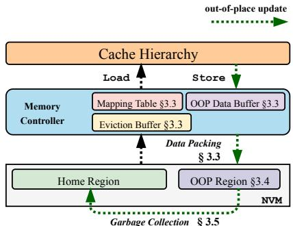

# HOOP: Efficient Hardware-Assisted Out-of-Place Update for Non-Volatile Memory 通俗讲解

### 0. 整体创新点通俗解读

**痛点直击 (The "Why")**
- 传统的 **NVM**（非易失性内存）持久化方案，比如 **logging **(日志) 和 **shadow paging **(影子分页)，都陷入了两难困境。
- **Logging** 方案（无论是 undo 还是 redo）为了保证崩溃一致性，必须为每次数据更新额外写一份日志到 NVM。这直接导致了 **2倍甚至更高的写放大 **(write amplification)，不仅拖慢了性能，还严重损耗了 NVM 的物理寿命。
- **Shadow Paging** 虽然避免了日志的额外写入，但它采用 **copy-on-write **(CoW) 机制。即使只改了一个字节，也得把整个页面（或缓存行）复制一份。这同样造成了巨大的、不必要的写放大，并且在关键路径上引入了昂贵的数据拷贝开销。
- 更糟糕的是，这些方案通常还需要在程序的关键执行路径上插入大量的 **cache flush **(缓存刷新) 和 **memory fence **(内存屏障) 指令来保证持久化顺序，这直接扼杀了应用的**关键路径延迟 **(critical-path latency)。

**通俗比方 (The Analogy)**
想象你要修改一份极其重要的纸质合同（代表 NVM 中的数据），这份合同一旦损坏就必须能恢复到一个一致的状态。
- **Logging** 就像你先复印一份旧合同（写日志），然后在原件上涂改。如果涂改到一半停电了，你可以用复印件恢复。但复印和涂改都是额外工作。
- **Shadow Paging** 就像你直接拿出一张新纸，把旧合同全文抄一遍，再在新纸上做修改。这太费纸（写放大）了！
- **HOOP** 的做法很聪明：它给你一个专门的“草稿区”（**OOP region**）。你所有的修改都直接写在这个草稿区的新位置上，而原件（**home region**）保持不动。只要草稿区的内容安全落笔，你就成功了。之后，系统可以在后台找个空闲时间，再把草稿区里最终确定的修改，“誊抄”回原件的对应位置。这样，你的主要工作（关键路径）就只是在草稿区写字，又快又安全，完全不用碰原件。

**关键一招 (The "How")**
作者的核心洞察在于，将“保证原子持久性”这个难题，从软件和CPU层面，巧妙地卸载到了**内存控制器 **(memory controller) 这个硬件层级，并通过一个轻量级的间接层来实现。
- **扭转了更新地点**：作者没有在原地（home region）更新数据，而是强制所有事务内的更新都写到一个专用的、**log-structured **(日志结构) 的 **OOP region** 中。这天然保证了原子性——要么新数据全在草稿区（成功），要么全不在（失败，老数据完好）。
- **插入了硬件间接层**：为了解决“数据现在在哪”的问题，作者在内存控制器里加了一个小巧的 **物理到物理地址映射表 **(physical-to-physical address mapping table)。当CPU读数据时，内存控制器会自动查这个表，如果发现数据有更新版本在OOP区，就直接返回新数据。这对上层软件完全透明。
- **优化了后台清理**：为了避免OOP区无限增长，作者设计了一个智能的**垃圾回收 **(GC) 机制。这个GC不仅会把OOP区的数据搬回home区以释放空间，还会进行**数据合并 **(data coalescing)——如果同一个地址被多次更新，GC只搬最后一次的值，从而进一步减少了写回的流量。
- **消除了持久化排序**：因为更新是“异地”的，新老数据互不影响，所以CPU可以像操作普通内存一样乱序执行store指令，完全不需要软件插入fence和flush来保证顺序，极大地降低了关键路径延迟。

 *Fig. 1: Illustration of different crash-consistency techniques. (a) Logging technique requires that both logs and data must be persisted, which incurs double writes; (b) Shadow paging maintains two copies of data, it suffers from copy-on-write overhead; (c) Log-structured NVM alleviates the double writes, but it suffers from significant overhead of index lookup; (d) Our hardware-assisted out-of-place update reduces the write amplification significantly, while providing efficient data accesses.*

最终，HOOP通过这套硬件辅助的“草稿区”模式，在几乎不增加关键路径负担的情况下，将写放大降到了接近理想水平（无持久化开销的系统），实现了**高性能**与**强一致性**的统一。

### 1. Hardware-Assisted Out-of-Place (OOP) Update (ELI5)

**痛点直击 (The "Why")**
- 传统的 **NVM**（非易失性内存）持久化方案，比如 **logging**（日志），为了保证崩溃一致性，必须先写一份日志再改数据。这导致了 **双倍写入**（write amplification），不仅拖慢了性能，还加速了 NVM 这种有写入寿命限制的硬件的老化。
- 另一种方案 **shadow paging**（影子分页）虽然避免了日志，但它采用 **copy-on-write**（写时复制）机制。哪怕你只改了一个字节，它也可能要复制一整页（或缓存行），同样造成了巨大的、不必要的写入开销。
- 更要命的是，这些方案往往需要在程序的关键路径上插入 **cache flush**（缓存刷写）和 **memory fence**（内存屏障）指令来保证操作顺序。这就像是在高速公路上频繁急刹车，严重拖累了程序的 **关键路径延迟**（critical-path latency）。

**通俗比方 (The Analogy)**
- 想象你要修改一份极其重要的合同（**home region**）。传统 logging 的做法是：先手抄一份完整的修改记录（log），等这份记录被公证处（NVM）盖章确认后，你才能去修改原件。这很安全，但效率极低。
- HOOP 的做法完全不同：它给你一张全新的空白纸（**OOP region**），让你直接在上面重写修改后的合同条款。在新合同被公证处完全接收并归档之前，旧合同一直完好地锁在保险柜里。一旦新合同归档成功，系统就悄悄把旧合同作废，并把新合同挪到原来的位置。整个过程，你作为“用户”感觉不到任何停顿，而且没有产生额外的“抄写”工作。

**关键一招 (The "How")**
- 作者并没有在软件层面搞复杂的日志或复制逻辑，而是巧妙地在 **内存控制器**（memory controller）里增加了一个轻量级的 **间接层**（indirection layer）。
- - **地址重定向**：当程序要写数据时，内存控制器不再直接写回原地址，而是将更新写到一个专用的 **OOP region**（out-of-place region）中，并在一个小型的 **哈希映射表**（hash-based address-mapping table）里记下“原地址 -> 新地址”的映射关系。
  - **原子性保障**：因为旧数据始终保留在原地，直到新数据在 OOP region 中完全持久化，所以任何时候系统崩溃，都能通过旧数据或已持久化的新数据恢复到一个一致的状态，天然保证了 **atomic data durability**。
  - **读取透明**：当程序读数据时，内存控制器会先查这个映射表。如果发现数据有更新，就从 OOP region 读取最新版本；否则，就从原地址读。这个过程对上层软件完全透明。
  - **垃圾回收**（GC）：为了避免 OOP region 被占满，HOOP 在后台运行一个智能的 **垃圾回收**（garbage collection）进程。它会周期性地扫描 OOP region，利用 **data coalescing**（数据合并）技术，把多次更新到同一个地址的数据合并成一次写操作，再将其“搬”回原地址（home region），从而释放 OOP 空间并进一步减少写入放大。
 *Fig. 1: Illustration of different crash-consistency techniques. (a) Logging technique requires that both logs and data must be persisted, which incurs double writes; (b) Shadow paging maintains two copies of data, it suffers from copy-on-write overhead; (c) Log-structured NVM alleviates the double writes, but it suffers from significant overhead of index lookup; (d) Our hardware-assisted out-of-place update reduces the write amplification significantly, while providing efficient data accesses.*
 *Fig. 2: Hardware-assisted out-of-place update with HOOP. HOOP performs out-of-place writes and reduces write traffic with data packing and coalescing. To reduce the storage overhead, HOOP adaptively migrates data in the out-of-place (OOP) region back to the home region with optimized GC.*

### 2. Lightweight Indirection Layer in Memory Controller (ELI5)

**痛点直击 (The "Why")**
- 传统的 **NVM**（非易失性内存）持久化方案，比如 **logging**（日志）或 **shadow paging**（影子分页），都有一个“顾头不顾尾”的毛病。
- **Logging** 需要为每次写操作额外写一份日志，这直接导致 **2倍甚至更高的写放大 **(write amplification)，不仅拖慢了速度，还严重损耗 NVM 的寿命。
- **Shadow Paging** 虽然避免了日志，但为了保证原子性，它需要在写之前复制整个数据页（即使是改一个字节），这在**关键路径 **(critical path) 上引入了巨大的延迟。
- 更麻烦的是，这些方案都需要软件显式地插入 **clflush**（缓存行刷新）和 **mfence**（内存屏障）指令来保证持久化顺序，这就像开车时每踩一脚油门都要先手动检查一遍刹车，效率极低。

**通俗比方 (The Analogy)**
- 想象你在一个大型图书馆（**NVM**）里工作，你的任务是更新书架上的书籍。传统方法要么是：
    - **Logging**：先在一本专用的“修改日志”上写下你要改的内容，然后再去书架上改书。万一中途断电，你可以根据日志恢复。
    - **Shadow Paging**：把整本书拿下来复印一本，在复印件上修改，改完后再把旧书扔掉，把新书放回去。
- 这两种方法都很笨重。HOOP 的做法更聪明：它在图书馆后面开辟了一个**临时仓库 **(OOP region)。当你需要改书时，你直接把**新版本的书页**送到这个仓库，并告诉图书管理员（**Memory Controller**）：“嘿，123号书架上的那本书，现在最新的内容在仓库B区5号货架”。下次有人要借这本书，管理员会先查他的小本本（**Indirection Layer**），然后直接从仓库把最新版拿给读者。等图书馆不忙的时候（**后台GC**），管理员再悄悄地把仓库里的新书页整理好，放回123号书架的原位，并擦掉小本本上的记录。

**关键一招 (The "How")**
- 作者没有让软件去操心地址映射和持久化顺序，而是把这个问题**下沉到硬件**，在 **Memory Controller** 里构建了一个轻量级的 **Indirection Layer**。
- 这个层的核心是一个 **hash-based physical-to-physical address mapping table**。它的作用非常纯粹：将数据的“**家地址**”（home address）映射到其最新的“**临时地址**”（OOP region address）。
- **具体扭转点在于**：
    - **对于 Store **(写)：当CPU发出一个写请求时，Memory Controller 不会直接写回“家地址”，而是将新数据连同其“家地址”作为元数据，一起打包写入**OOP region**，并在映射表中创建一条新记录。
    - **对于 Load **(读)：当发生缓存未命中时，Memory Controller 会先用“家地址”去查询这个映射表。如果命中，就从 OOP region 读取最新数据；如果没命中，就直接从“家地址”读取。
- 这个设计的精妙之处在于，它**完全解耦了写操作的持久化顺序**。因为旧数据始终安全地待在“家”里，而新数据被原子地写入OOP区域，所以系统天然就是崩溃一致的，无需任何内存屏障。同时，这个映射表只跟踪那些**尚未被垃圾回收**（GC）的数据，因此它的规模可以保持得很小（论文中提到默认2MB），查询开销极低，从而实现了**透明且低开销**的地址翻译。
 *Fig. 4: Transaction execution of different approaches. Both undo and redo logging deliver lengthy transaction execution times due to log writes. Shadow paging has to copy additional data before performing in-place updates. HOOP achieves fast transaction execution with out-of-place updates.*

### 3. Data Packing and Memory Slice Organization (ELI5)

**痛点直击**
- 传统的 NVM 持久化方案，比如 logging，有个很“难受”的地方：哪怕你只改了一个 **8-byte** 的整数，它也得把整个 **64-byte** 的 cache line 写一遍。这在写密集型应用里简直是灾难，不仅浪费宝贵的 **NVM 写带宽**，还加速了硬件老化。
- 更糟糕的是，这些零散的小写操作是 **随机的**，无法充分利用 NVM 顺序写快的优势。结果就是，持久化成了性能瓶颈，系统大部分时间都在等数据落盘。

**通俗比方**
- 想象你要寄几封信，每封信只有几句话。如果每次都单独叫一个快递员来取一件，成本极高，效率极低。HOOP 的做法是，在你办公室（**OOP data buffer**）里先设一个 **收件箱**。你把所有要寄的信（**word-granularity updates**）都扔进去，等攒够一小捆（最多8封），再连同它们的地址标签（**metadata**）一起打包成一个标准大小的包裹（**128-byte memory slice**）。最后，快递车（**memory controller**）一次性把这一整车的包裹按顺序送到邮局（**log-structured OOP region**）。这样既省了快递费（**write traffic**），又让快递车跑得飞快（**sequential writes**）。

**关键一招**
- 作者没有沿用“改多少字就写多少字”或者“改一点就写一整行”的老路，而是巧妙地在 **内存控制器** 里引入了一个 **两级缓冲和打包机制**。
- 具体来说：
  - **第一级（Buffering）**：在 `Tx begin` 和 `Tx end` 之间，所有被修改的数据字（**words**）和它们原始的 home 地址（**metadata**）都被暂存在一个 per-core 的 **OOP data buffer** 里，而不是立刻写出去。
  - **第二级（Packing & Slicing）**：当这个 buffer 快满了（攒够8个字）或者事务结束时，HOOP 就会把这些零散的数据和元数据 **紧凑地打包** 进一个固定大小的 **128-byte memory slice**。这个 slice 的设计非常精巧，正好能装下8个8-byte的数据和64-byte的元数据。
  - **第三级（Log-Structured Layout）**：这些打包好的 slices 被 **顺序地、追加式地** 写入到一个专门划分出来的 **OOP region**。这个区域就像一个巨大的日志文件，写入指针永远向前移动，从而最大化利用了 NVM 的 **高顺序写吞吐** 特性，并且避免了内部碎片。
- 这一招的核心扭转在于，它把 **细粒度、随机的写请求**，通过硬件缓冲和智能打包，转化成了 **粗粒度、顺序的写操作**。这从根本上解决了传统方案中 **写放大** 和 **带宽浪费** 的痛点。

 *Fig. 3: Data packing in HOOP.*
 *Fig. 5: Layout of the OOP region. HOOP organizes the OOP region in a log-structured manner. Each OOP block consists of memory slices with a fixed size. There are two types of memory slices: data memory slice and address memory slice.*

### 4. Adaptive Garbage Collection with Data Coalescing (ELI5)

**痛点直击 (The "Why")**
- 传统的 **Out-of-Place (OOP)** 更新（比如 log-structured 内存）虽然能保证原子性，但会带来一个致命问题：**写放大 (Write Amplification)**。
- 想象一下，你对同一个数据项 `X` 进行了三次更新：`X=1`, `X=2`, `X=3`。在 OOP 方案里，这三个版本都会被依次写入日志区域。但最终，只有 `X=3` 是有效的，前两个写操作完全是**浪费**。
- 如果不清理这些“垃圾”数据，日志区域会迅速填满，系统要么崩溃，要么必须在关键路径上做昂贵的清理（Garbage Collection, GC），这会直接拖慢你的应用性能。更糟的是，GC 本身也会产生大量写操作，把旧数据搬回原位，进一步加剧写放大。

**通俗比方 (The Analogy)**
- 这就像你在一张巨大的白板（**OOP Region**）上做演算，而不是直接在你的正式报告（**Home Region**）上涂改。
- 每次有新想法，你就把它写在白板的新位置，这样永远不会弄丢旧稿，保证了“原子性”——你可以随时放弃当前演算，回到上一个完整状态。
- 但是，白板很快就被各种草稿、中间步骤和过时的想法占满了。**Adaptive Garbage Collection with Data Coalescing** 就像是一个聪明的助手，他不是简单地把白板上所有东西都抄回报告里，而是：
    - 先从**最新的演算开始倒着看**（**reverse order**）。
    - 对于报告里的每一个位置，他只记录下**最后一次**在白板上写的内容。
    - 然后，他一次性、干净利落地把这些**最终结果**誊写回你的正式报告中。
- 这样，他避免了把中间无数个草稿版本都抄一遍的无用功，极大地节省了时间和精力（也就是 **NVM 的写带宽和寿命**）。

**关键一招 (The "How")**
- 作者没有采用常规的、顺序扫描日志的 GC 策略，而是做了一个非常巧妙的**逻辑扭转**：**从时间线的末尾开始反向扫描**。
- 具体来说，HOOP 的 GC 流程是这样的：
    - **第一步**：找到所有已经 **committed** 的事务在 OOP 区域的日志。
    - **第二步**：**从最新的事务开始，向最旧的事务方向遍历**。
    - **第三步**：在遍历过程中，维护一个临时的 **hash map**。每当遇到一个对地址 `A` 的更新，就检查 `A` 是否已经在 hash map 里。
        - 如果**已经存在**，说明后面（在时间线上）已经有更新的值了，当前这个旧值可以直接**忽略**。
        - 如果**不存在**，就把这个 `<A, value>` 对加入 hash map。
    - **第四步**：遍历完所有相关日志后，hash map 里剩下的就是每个地址的**最新、有效**的值。此时，GC 只需要将这些值**一次性写回**它们在 Home Region 的原始位置即可。
- 这个 **Data Coalescing**（数据合并）的过程，通过一次性的反向扫描，就自动过滤掉了所有中间的、无效的更新，将多次写操作**合并**为一次最终写操作，从而将 **write amplification 降到了最低**。 *TABLE IV: Average data reduction in the GC of HOOP.*
- 此外，这个 GC 是 **Adaptive**（自适应）的，它在后台周期性运行，不会阻塞应用的关键路径。只有当 OOP 区域快满或者 mapping table 快满时，才会更积极地触发，完美地平衡了性能和空间开销。

### 5. Parallel Crash Recovery Mechanism (ELI5)

**痛点直击 (The "Why")**
- 传统的 NVM 崩溃恢复机制通常是 **单线程** 的。想象一下，系统崩溃后，整个世界都停了，只有一个“工人”在慢悠悠地翻看日志或 OOP 区域，试图把数据恢复到一致状态。
- 这个过程会随着数据量的增加而**线性甚至超线性地变慢**，导致系统 **Recovery Time Objective (RTO)** 极长。在一个多核时代，让其他所有核心干等着一个核心干活，是巨大的资源浪费。
- 更关键的是，很多方案（如 log-structured）的恢复过程本身就涉及复杂的索引重建和数据扫描，单线程处理更是雪上加霜。

**通俗比方 (The Analogy)**
- 这就像你家被一场混乱的派对搞得一团糟（系统崩溃）。地上到处都是客人（数据更新）留下的东西，有些是新的，有些是旧的。
- 传统的做法是，只有你一个人（单线程）从门口开始，一件一件地检查、分类、放回原位，效率极低。
- HOOP 的做法是，派对一结束（崩溃发生），你就立刻叫醒家里所有能动的人（**multi-core thread parallelism**），给他们每人分配一个房间（OOP region 的一部分），让他们**并行地**去整理自己负责的区域。最后，大家把各自整理好的最新物品（latest consistent state）统一放回它们该在的地方（home region）。这显然快得多。

**关键一招 (The "How")**
HOOP 的并行恢复机制之所以高效，其精妙之处在于它充分利用了自身 **Out-of-Place (OOP)** 更新的设计特点，将恢复流程进行了巧妙的并行化改造：

- **利用 OOP 区域的天然结构**：因为所有已提交（committed）的事务更新都以 **log-structured** 的方式追加写入 OOP 区域，并且通过 **address memory slice** 明确记录了每个事务的起始位置，所以整个 OOP 区域本身就是一份清晰、有序的“操作历史清单”。这为并行扫描提供了完美的基础。
- **并行任务分解**：
  - 恢复启动时，一个主控线程会先读取 **block index table**，快速定位到所有包含已提交事务的 OOP blocks。
  - 然后，它将这些事务的起始地址收集起来，并按提交顺序排序。
  - 最关键的一步：它把这些事务地址**以轮询（round-robin）的方式分发给多个恢复工作线程**。每个线程独立处理自己分到的一组事务。
- **无锁的本地状态构建**：
  - 每个工作线程在处理自己的事务列表时，会**反向扫描**（从新到旧），并将 `<home address, data>` 对存入自己的**本地哈希表**中。
  - 由于是反向扫描，如果同一个地址被多次更新，本地哈希表里自然就只保留了**最新的那个版本**。这个过程完全在本地进行，无需与其他线程同步，避免了锁竞争。
- **高效的全局聚合与写回**：
  - 所有工作线程完成后，主控线程将所有本地哈希表**聚合**成一个全局的最新状态视图。
  - 最后，再利用多线程**并行地**将这个全局视图中的数据写回到它们各自的 **home region**，并确保持久化。

 *Fig. 11: Recovery performance of 1GB OOP region with various number of recovery threads and memory bandwidth.*

这个设计的核心逻辑转换在于：**它没有把恢复看作一个必须严格串行、小心翼翼的状态机回滚过程，而是将其转化为一个“从有序日志中并行提取最新快照”的数据处理问题**。正是 OOP 更新保证了日志的完整性和有序性，才使得这种大胆而高效的并行策略成为可能。最终结果就是，恢复时间几乎可以随着核心数的增加而线性缩短，极大地提升了系统的可用性。
