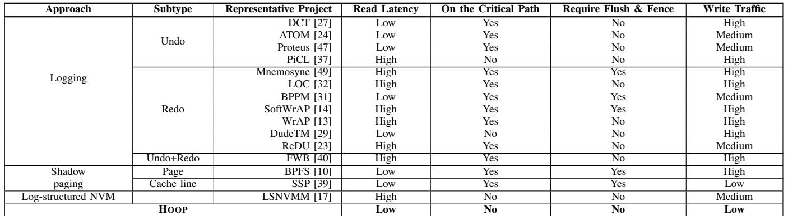
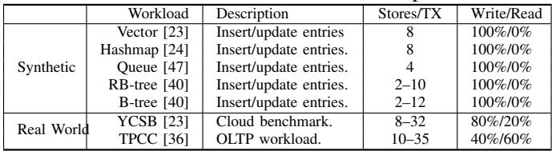

# HOOP: Efficient Hardware-Assisted Out-of-Place Update for Non-Volatile Memory 图表详解

### TABLE I: Comparison of various crash-consistency techniques for NVM. Compared with existing works, HOOP provides a transparent hardware solution that significantly reduces the write traffic to NVM, while achieving low persistence overhead.

- 该表格系统性对比了多种面向 NVM 的崩溃一致性技术，核心维度包括读取延迟、关键路径影响、是否需要刷新与内存栅栏指令、以及写入流量。
- 表格将技术分为三大类：**Logging**（日志）、**Shadow paging**（影子分页）和 **Log-structured NVM**（日志结构化 NVM），并最终列出本文提出的 **HOOP** 方案作为对比基准。
- 在 **Logging** 类别下，进一步细分为 **Undo**、**Redo** 和 **Undo+Redo** 子类。其中：
    - Undo 类型如 ATOM [24]、Proteus [47] 等，普遍具有 **低读取延迟**，但多数在关键路径上执行，且写入流量为中高。
    - Redo 类型如 Mnemosyne [49]、SoftWrAP [14] 等，读取延迟多为高，部分方案（如 BPPM [31]）可实现低延迟，但写入流量仍偏高。
    - Undo+Redo 类型如 FWB [40]，读取延迟高，写入流量高。
- **Shadow paging** 类别包含 Page 级（如 BPFS [10]）和 Cache line 级（如 SSP [39]）。两者均需在关键路径上执行，BPFS 需要刷新与栅栏，而 SSP 不需要；SSP 实现了较低的写入流量。
- **Log-structured NVM** 类型以 LSNVMM [17] 为代表，其读取延迟高，不在关键路径上，无需刷新与栅栏，写入流量为中等。
- **HOOP** 方案在所有维度上表现优异：
    - **读取延迟：低**
    - **关键路径影响：无**
    - **刷新与栅栏需求：无**
    - **写入流量：低**

| Approach           | Subtype    | Representative Project | Read Latency | On the Critical Path | Require Flush & Fence | Write Traffic |
| ------------------ | ---------- | ---------------------- | ------------ | -------------------- | --------------------- | ------------- |
| Logging            | Undo       | DCT [27]               | Low          | Yes                  | No                    | High          |
|                    |            | ATOM [24]              | Low          | Yes                  | No                    | Medium        |
|                    |            | Proteus [47]           | Low          | Yes                  | No                    | Medium        |
|                    |            | PiCL [37]              | High         | No                   | No                    | High          |
|                    | Redo       | Mnemosyne [49]         | High         | Yes                  | Yes                   | High          |
|                    |            | LOC [32]               | High         | Yes                  | No                    | High          |
|                    |            | BPPM [31]              | Low          | Yes                  | Yes                   | Medium        |
|                    |            | SoftWrAP [14]          | High         | Yes                  | Yes                   | High          |
|                    |            | WrAP [13]              | High         | Yes                  | No                    | High          |
|                    |            | DudeTM [29]            | Low          | No                   | No                    | High          |
|                    |            | ReDU [23]              | High         | Yes                  | No                    | Medium        |
|                    | Undo+Redo  | FWB [40]               | High         | Yes                  | No                    | High          |
| Shadow paging      | Page       | BPFS [10]              | Low          | Yes                  | Yes                   | High          |
|                    | Cache line | SSP [39]               | Low          | Yes                  | Yes                   | Low           |
| Log-structured NVM |            | LSNVMM [17]            | High         | No                   | No                    | Medium        |
| **HOOP**           |            | —                      | **Low**      | **No**               | **No**                | **Low**       |

- HOOP 的优势在于其硬件辅助的 **out-of-place update** 机制，避免了传统日志或影子分页带来的额外写入开销，并通过内存控制器中的轻量级间接层实现透明地址映射，从而在不牺牲原子持久性前提下，显著降低性能开销。

### Fig. 1: Illustration of different crash-consistency techniques. (a) Logging technique requires that both logs and data must be persisted, which incurs double writes; (b) Shadow paging maintains two copies of data, it suffers from copy-on-write overhead; (c) Log-structured NVM alleviates the double writes, but it suffers from significant overhead of index lookup; (d) Our hardware-assisted out-of-place update reduces the write amplification significantly, while providing efficient data accesses.

- 图片展示了四种不同的崩溃一致性技术，旨在对比其在非易失性内存（NVM）系统中的数据持久化机制与性能开销。
- **(a) Logging**：CPU通过缓存将数据写入内存控制器，同时生成日志（Logs）并写入NVM。该方法要求**日志和原始数据都必须持久化**，导致**双倍写入放大**（double writes），显著增加NVM写流量和磨损。
- **(b) Shadow Paging**：CPU更新数据时，系统会先复制一份旧数据（Copy），再在副本上进行修改。此过程产生**额外的拷贝开销**（copy-on-write overhead），即使只修改少量数据，也可能触发整个页或缓存行的复制。
- **(c) Log-structured NVM**：所有写操作追加到日志中，避免了双写问题，但引入了**索引查找开销**（index lookup overhead）。每次读取需通过索引定位最新数据位置，增加了关键路径延迟。
- **(d) HOOP**：提出硬件辅助的原地外更新机制。更新数据被写入新位置（Out-of-place Write），旧数据保留直至新数据持久化。通过**数据打包**（data packing）和**数据合并**（data coalescing）优化写入效率，显著降低写放大，同时保持高效的数据访问。

| 技术类型           | 写放大     | 关键路径延迟 | 主要开销来源                   |
| ------------------ | ---------- | ------------ | ------------------------------ |
| Logging            | 高（双写） | 高           | 日志写入、内存屏障、缓存刷新   |
| Shadow Paging      | 中高       | 中高         | 数据拷贝、TLB更新、页面合并    |
| Log-structured NVM | 低         | 高           | 索引维护、地址查找、垃圾回收   |
| **HOOP**           | **最低**   | **最低**     | **GC迁移、映射表查询（极小）** |

- HOOP的核心优势在于：**无需日志**、**不强制持久化顺序**、**利用硬件透明实现地址重映射**，从而在保证原子持久性的同时，大幅减少写入流量和关键路径延迟。
- 图中绿色箭头代表HOOP的“原地外写入”路径，虚线表示数据合并与打包过程，直观体现其优化策略。

### Fig. 2: Hardware-assisted out-of-place update with HOOP. HOOP performs out-of-place writes and reduces write traffic with data packing and coalescing. To reduce the storage overhead, HOOP adaptively migrates data in the out-of-place (OOP) region back to the home region with optimized GC.

- 图片展示了 HOOP 系统的架构概览，核心目标是实现 **硬件辅助的 out-of-place update**，以在保证原子持久性的同时，降低写入放大和关键路径延迟。
- 整体结构分为三层：顶部为 **Cache Hierarchy**，中间为 **Memory Controller**，底部为 **NVM**（非易失性内存）。
- 在 NVM 层，数据被划分为两个区域：
    - **Home Region**：原始数据存储位置。
    - **OOP Region**：用于存放更新后数据的“外置”区域，采用日志结构组织。
- Memory Controller 是 HOOP 的核心，包含三个关键组件：
    - **Mapping Table**：维护从 Home Region 地址到 OOP Region 地址的物理-物理映射，支持快速地址翻译。
    - **OOP Data Buffer**：每个核心专用的缓冲区（默认 1KB），用于暂存事务中的更新数据及元数据，支持 **Data Packing** 优化。
    - **Eviction Buffer**：缓存从 OOP Region 迁移回 Home Region 的数据，确保在 GC 期间映射表条目被清除时，仍能访问最新版本数据。
- 数据流方向清晰标注：
    - **Store 操作**：数据从 Cache Hierarchy 写入 Memory Controller 的 OOP Data Buffer，经 **Data Packing** 后写入 OOP Region。
    - **Load 操作**：从 Cache Hierarchy 发起读取请求，通过 Mapping Table 查找数据是否在 OOP Region，若命中则从 OOP Region 读取；否则从 Home Region 读取。
    - **Garbage Collection (GC)**：周期性地将 OOP Region 中的最新数据版本迁移回 Home Region，释放 OOP Region 空间，并清理 Mapping Table 相关条目。
- 关键优化技术在图中明确标出：
    - **Data Packing**：在 OOP Data Buffer 和 OOP Region 之间进行，将多个细粒度更新打包成单个缓存行，减少写入次数。
    - **out-of-place update**：所有更新均写入新位置（OOP Region），旧数据保留直至新数据持久化，天然支持原子性。
    - **optimized GC**：后台执行，结合 **data coalescing** 技术，避免对同一地址的重复写入，进一步降低写入流量。

| 组件               | 功能                                      | 关联优化                                                 |
| ------------------ | ----------------------------------------- | -------------------------------------------------------- |
| Cache Hierarchy    | 处理常规 Load/Store 指令                  | 无直接关联                                               |
| Memory Controller  | 核心控制单元，管理地址映射、数据缓冲与 GC | **Data Packing**, **Mapping Table**, **Eviction Buffer** |
| OOP Data Buffer    | 缓存事务更新，支持打包                    | **Data Packing**                                         |
| Mapping Table      | 物理地址映射，支持快速读取                | 透明硬件实现                                             |
| Eviction Buffer    | 缓存 GC 迁移数据，防止读取陈旧数据        | 保障一致性                                               |
| OOP Region         | 存储更新数据的日志结构区域                | **out-of-place update**                                  |
| Home Region        | 原始数据存储区                            | GC 目标区域                                              |
| Garbage Collection | 后台迁移数据，回收空间                    | **optimized GC**, **data coalescing**                    |

- 该图直观体现了 HOOP 的设计哲学：**将复杂性下沉至硬件层**（Memory Controller），对上层软件透明；通过 **out-of-place update + data packing + optimized GC** 三重机制，在保证强一致性的同时，显著降低性能开销和写入放大。

### Fig. 3: Data packing in HOOP.

- 图片展示了 HOOP 系统中的 **数据打包（Data packing）** 机制，旨在减少 NVM 写入流量。
- 上半部分显示了 **N 个独立缓存行（cache lines）**，分别标记为 M1 至 M8，每个缓存行中包含一个被修改的数据块（如 A、B、C、E），其余部分为空白。
- 下半部分是经过 **数据打包后形成的 Memory Slice**，它将来自不同缓存行的更新数据（A、B、C、…、E）紧凑地排列在一个连续的内存单元中。
- 打包后的 Memory Slice 占用 **两个缓存行的空间**，实现了空间利用率的最大化。
- 数据打包的核心优势在于：**将多个分散的小粒度更新合并为一次大块写入**，从而显著降低 NVM 的写入次数和带宽消耗。
- 此机制与 HOOP 的 **字粒度（word granularity）跟踪** 相结合，允许在事务提交时高效持久化多个更新，而不必为每个缓存行单独写入。
- 图中未显示但文中提及的是：**元数据（metadata）也会被打包**，通常与数据一起存储在同一个 Memory Slice 中，用于记录原始地址、事务 ID 等信息。

| 原始状态                       | 打包后状态                         |
| ------------------------------ | ---------------------------------- |
| N 个缓存行，每个含少量更新数据 | 1 个 Memory Slice，占用 2 个缓存行 |
| 分散写入，高写放大             | 集中写入，低写放大                 |
| 每个缓存行需单独持久化         | 多个更新合并为一次持久化操作       |

- 该设计体现了 HOOP 在硬件层面优化写入效率的关键思想：**通过数据压缩和聚合，最小化对 NVM 的访问次数**，同时保持原子性和崩溃一致性。

### Fig. 4: Transaction execution of different approaches. Both undo and redo logging deliver lengthy transaction execution times due to log writes. Shadow paging has to copy additional data before performing in-place updates. HOOP achieves fast transaction execution with out-of-place updates.

- 图片展示了四种不同 crash-consistency 技术在事务执行过程中的时间线对比，包括 **Undo logging**、**Redo logging**、**Shadow paging** 和 **Hardware-assisted out-of-place update (HOOP)**。
- 每个子图的横轴代表时间，纵轴表示事务中数据更新和日志操作的顺序。图中用不同颜色方块标记不同类型的操作：红色为数据写入（store），蓝色为 undo log，黄色为 redo log，灰色为 flush 操作。
- 在 **(a) Undo logging** 中，每个数据更新前必须先写入对应的 undo log，且需在事务结束前执行 flush 以确保日志持久化，导致事务路径长、延迟高。
- 在 **(b) Redo logging** 中，数据更新可先执行，但必须在事务结束前将 redo log 写入并 flush，虽比 undo logging 灵活，但仍需额外写入和同步操作。
- 在 **(c) Shadow paging** 中，系统在更新前复制整个页面或缓存行，然后在新位置进行修改，避免了日志开销，但引入了“copy-on-write”带来的额外写入和 TLB 更新开销。
- 在 **(d) Hardware-assisted out-of-place update (HOOP)** 中，所有更新直接写入 OOP region，无需预先写日志或复制页面，也不强制 flush，仅在 Tx_end 时批量持久化打包后的数据，显著缩短关键路径。
- 对比可见，HOOP 的事务执行时间最短，因其消除了日志写入和页面复制的开销，同时利用硬件缓冲与打包机制优化写入效率。
- 下表总结各方法在关键路径上的主要开销：

| 方法          | 关键路径开销                  | 是否需要 Flush   | 是否需要额外写入 |
| ------------- | ----------------------------- | ---------------- | ---------------- |
| Undo logging  | 高（log + data + flush）      | 是               | 是               |
| Redo logging  | 中（data + log + flush）      | 是               | 是               |
| Shadow paging | 中高（copy + update + flush） | 是               | 是               |
| HOOP          | 低（仅打包后写入）            | 否（由硬件管理） | 否               |

- 图中明确标注 **Tx_begin** 和 **Tx_end** 作为事务边界，HOOP 在 Tx_end 时才触发持久化，而其他方法在事务过程中即需多次同步。
- 该图直观说明 HOOP 如何通过硬件辅助的 out-of-place 更新机制，在保证原子持久性的同时，实现接近原生系统的低延迟事务执行。

### Fig. 5: Layout of the OOP region. HOOP organizes the OOP region in a log-structured manner. Each OOP block consists of memory slices with a fixed size. There are two types of memory slices: data memory slice and address memory slice.

- **图5展示了HOOP系统中OOP区域的布局设计**，其核心是采用日志结构化（log-structured）方式组织数据，以优化写入吞吐并减少碎片。
- OOP区域由多个固定大小的OOP块（2MB）组成，每个块包含一个头部（Head）和若干内存切片（Memory Slice），并通过**Block Index Table**进行索引管理。
- 内存切片分为两类：**Data Memory Slice** 和 **Address Memory Slice**。前者存储实际更新的数据及元数据，后者用于记录事务的起始地址，便于GC快速定位已提交事务。
- 图(a)显示了OOP区域的整体组织结构：
    - 每个OOP块内含多个内存切片，按顺序排列。
    - Address Memory Slice中包含指向下一个切片的指针（Next Slice），形成链式结构，支持跨块链接。
    - Data Memory Slice中包含事务ID（TxID）、数据内容、以及指向下一数据切片的指针，确保事务数据可被完整回溯。
- 图(b)详细描述了**Data Memory Slice的内部布局**：
    - 总大小为128字节，其中前104字节用于存储8个8字节的数据项（Data 0至Data 7）。
    - 剩余24字节为Metadata区域，具体字段如下：

| 字段名     | 位宽    | 说明                                   |
| ---------- | ------- | -------------------------------------- |
| Home Addrs | 320 bit | 数据原始位置的物理地址（支持1TB寻址）  |
| TxID       | 32 bit  | 事务唯一标识符                         |
| Start      | 1 bit   | 标识是否为该事务的第一个切片           |
| Cnt        | 3 bit   | 当前切片中实际更新的数据项数量         |
| Flag       | 4 bit   | 切片状态标志（用于GC和恢复）           |
| Next Slice | 24 bit  | 指向同一事务中下一个数据切片的偏移地址 |
| Pad        | 8 bit   | 填充位，确保对齐                       |

- 该设计允许HOOP在写入时将多个细粒度更新打包进单个缓存行，显著降低写放大；同时通过**地址映射表**和**GC机制**实现高效的空间回收与数据一致性保障。
- 整体架构强调硬件透明性，所有地址重映射和持久化操作均由内存控制器完成，无需软件干预或TLB修改。

### Fig. 6: The load and store procedure in HOOP.

- 图片展示了 HOOP 系统中 **Load** 和 **Store** 操作的完整流程，核心是通过 **Indirection Layer** 实现硬件辅助的 **Out-of-Place (OOP) Update**。
- 流程分为两个主要路径：左侧为 **Load** 操作，右侧为 **Store** 操作，两者均与 **Memory Controller** 中的 **Indirection Layer** 交互。
- **Load 操作流程**：
    - 步骤 1：处理器核心发起 Load 请求，若命中 L1 Cache，则直接返回数据。
    - 步骤 2：若 L1 Cache 未命中，请求向下传递至 Lower Level Caches。
    - 步骤 3：若 Lower Level Caches 均未命中，系统访问 **Mapping Table**，根据 Home Address 查找对应的 OOP Address。
    - 步骤 4：若 Mapping Table 命中，系统并行从 **OOP Region**（非易失性）和 **Home Region**（非易失性）读取数据。HOOP 利用 **Data Packing** 将多个更新打包在 OOP Region 的 Memory Slice 中，因此需解包以重建完整缓存行。
    - 步骤 5：若 Mapping Table 未命中，则检查 **Eviction Buffer**；若仍无，则直接从 **Home Region** 读取原始数据。
- **Store 操作流程**：
    - 步骤 1：处理器核心发起 Store 请求，若命中 L1 Cache，则更新数据并设置 **Persistent Bit**。
    - 步骤 2：若 L1 Cache 未命中，系统首先从 Lower Level Caches 或 NVM 获取最新版本的数据到 L1 Cache。
    - 步骤 3：更新后的数据及其 **Home Address** 被发送至 **Indirection Layer**。
    - 步骤 4：数据被写入对应核心的 **OOP Data Buffer**，并记录相关元数据（如 TxID）。当缓冲区满或事务结束时，数据被持久化到 **OOP Region**。
- **Indirection Layer 组件**：
    - **Mapping Table**：存储 Home Address 到 OOP Address 的映射，用于快速定位最新数据版本。
    - **Eviction Buffer**：缓存最近从 OOP Region 迁移回 Home Region 的数据，防止在 GC 期间因 Mapping Table 条目被清除而读取到过时数据。
    - **OOP Data Buffer**：每个核心拥有独立的缓冲区，用于暂存事务中的更新数据，支持 **Data Packing** 以减少写入流量。
- **关键设计优势**：
    - **原子性保障**：通过将新数据写入 OOP Region，旧数据保留在 Home Region，天然实现原子更新。
    - **低开销**：地址翻译在硬件层完成，避免软件开销和 TLB shootdown。
    - **性能优化**：利用 **Data Packing** 和 **Parallel Reads** 减少 NVM 写入和读取延迟。
    - **透明性**：对上层软件完全透明，无需修改应用程序或操作系统。

| 组件                | 功能         | 关键特性                                  |
| ------------------- | ------------ | ----------------------------------------- |
| **Mapping Table**   | 地址映射     | 物理到物理地址转换，支持快速查找最新数据  |
| **Eviction Buffer** | 数据缓存     | 防止 GC 期间读取过时数据，提升一致性      |
| **OOP Data Buffer** | 数据暂存     | 每核独立，支持 Data Packing，减少写入流量 |
| **OOP Region**      | 数据持久化   | 日志结构化存储，支持高效 GC 和恢复        |
| **Home Region**     | 原始数据存储 | 保留旧数据版本，确保原子性                |

- 整个流程体现了 HOOP 的核心思想：**Write to a new place, read from the latest version**，通过硬件辅助实现高效、低开销的持久性保证。

### TABLE II: System configuration.

- 该图片为论文中的 **TABLE II: System configuration**，详细列出了用于评估 HOOP 的模拟系统硬件参数。
- 系统核心处理器为 **2.5 GHz, out-of-order, x86, 16 cores**，表明其基于现代多核架构进行仿真。
- 缓存层级配置如下：
    - **L1 I/D Cache**: 32KB, 4-way, inclusive
    - **L2 Cache**: 256KB, 8-way, inclusive
    - **LLC (Last Level Cache)**: 2 MB, 16-way, inclusive
- 内存控制器时序参数（tRCD-tCL-tBL-tWR-tRAS-tRP-tRC-tRRD-tRTP-tWTR-tFAW）为 **10-10-8-10-24-10-34-4-5-5-20(ns)**，反映了内存访问延迟特性。
- NVM 参数设定为：
    - **Read/Write Latency**: 50ns / 150ns
    - **Capacity**: 512 GB
    - **Row buffer read/write energy**: 0.93 / 1.02 pJ/bit
    - **Array read/write energy**: 2.47 / 16.82 pJ/bit（引用文献 [28], [40]）

| 组件                    | 配置                                                                                 |
| ----------------------- | ------------------------------------------------------------------------------------ |
| Processor               | 2.5 GHz, out-of-order, x86, 16 cores                                                 |
| L1 I/D Cache            | 32KB, 4-way, inclusive                                                               |
| L2 Cache                | 256KB, 8-way, inclusive                                                              |
| LLC                     | 2 MB, 16-way, inclusive                                                              |
| Memory Timing           | tRCD-tCL-tBL-tWR-tRAS-tRP-tRC-tRRD-tRTP-tWTR-tFAW = 10-10-8-10-24-10-34-4-5-5-20(ns) |
| NVM Read Latency        | 50ns                                                                                 |
| NVM Write Latency       | 150ns                                                                                |
| NVM Capacity            | 512 GB                                                                               |
| NVM Energy (Row Buffer) | Read: 0.93 pJ/bit, Write: 1.02 pJ/bit                                                |
| NVM Energy (Array)      | Read: 2.47 pJ/bit, Write: 16.82 pJ/bit                                               |

- 所有参数均用于 **McSimA+** 模拟器中，以确保实验环境的一致性和可复现性。
- NVM 的读写延迟与能耗数据直接用于后续的性能与能效分析，是衡量 HOOP 相较于其他方案优势的关键基准。

### TABLE III: Benchmarks used in our experiments.

- 该图片为论文中的 **TABLE III**，标题为“Benchmarks used in our experiments”，用于说明实验中所使用的基准测试工作负载。
- 表格内容分为两大类：**Synthetic**（合成工作负载）和 **Real World**（真实世界工作负载），每类下包含具体的工作负载名称、描述、每事务存储操作数（Stores/TX）以及读写比例（Write/Read）。
- **Synthetic 工作负载** 包含五种数据结构相关的操作：
    - Vector [23]：插入/更新条目，每事务 8 次存储操作，**100% 写 / 0% 读**。
    - Hashmap [24]：插入/更新条目，每事务 8 次存储操作，**100% 写 / 0% 读**。
    - Queue [47]：插入/更新条目，每事务 4 次存储操作，**100% 写 / 0% 读**。
    - RB-tree [40]：插入/更新条目，每事务 2–10 次存储操作，**100% 写 / 0% 读**。
    - B-tree [40]：插入/更新条目，每事务 8–12 次存储操作，**100% 写 / 0% 读**。
- **Real World 工作负载** 包含两个典型应用：
    - YCSB [23]：云基准测试，每事务 8–32 次存储操作，**80% 写 / 20% 读**。
    - TPCC [36]：OLTP 工作负载，每事务 10–35 次存储操作，**40% 写 / 60% 读**。
- 所有工作负载均以事务形式执行，用于评估 HOOP 在不同数据结构和实际应用场景下的性能表现。
- 表格中引用的文献编号（如 [23], [24] 等）指向论文参考文献部分，表明这些工作负载或其变体在先前研究中已被广泛使用。

### (b) Critical path latency (lower is better) Fig. 7: Transaction throughput and critical path latency for system benchmarks. HOOP improves transaction throughput by 74.3%, 45.1%, 33.8%, 27.9%, and 24.3% compared with Opt-Redo, Opt-Undo, OSP, LSM, and LAD, respectively. For critical path latency, HOOP also achieves a critical path latency close to a native system without any persistence guarantee.

- 图片包含两个子图，分别展示不同 crash-consistency 技术在多种基准测试下的 **Transaction throughput** 和 **Critical path latency**。
- 子图 (a) 为吞吐量对比，纵轴为归一化吞吐量（越高越好），横轴为不同数据结构和应用负载，包括 Vector(S/L), Queue(S/L), RBtree(S/L), Btree(S/L), HMap(S/L), YCSB(S/L), TPC-C, 以及 Geo-mean。
- 子图 (b) 为关键路径延迟对比，纵轴为归一化关键路径延迟（越低越好），横轴与 (a) 相同。
- 所有柱状图按技术分类：Ideal（无持久性保证的原生系统）、Opt-Redo、Opt-Undo、OSP、LSM、LAD、HOOP。
- **HOOP 在所有测试中均表现出最优或接近最优的性能**，尤其在吞吐量上显著优于其他方案。
- 根据图注，HOOP 相比 Opt-Redo、Opt-Undo、OSP、LSM、LAD 分别提升吞吐量 **74.3%、45.1%、33.8%、27.9%、24.3%**。
- 在关键路径延迟方面，HOOP 的表现最接近 Ideal 系统，平均仅比 Ideal 高 **24.1%**，远优于其他方案。
- 各技术在不同负载下的表现存在差异，但 HOOP 始终保持稳定领先。

以下是各技术在 Geo-mean 上的性能对比摘要：

| 技术     | Normalized Throughput | Normalized Critical Path Latency |
| -------- | --------------------- | -------------------------------- |
| Ideal    | 1.00                  | 1.00                             |
| Opt-Redo | ~0.57                 | ~1.45                            |
| Opt-Undo | ~0.69                 | ~1.53                            |
| OSP      | ~0.75                 | ~1.44                            |
| LSM      | ~0.78                 | ~1.61                            |
| LAD      | ~0.80                 | ~1.22                            |
| **HOOP** | **~0.99**             | **~1.24**                        |

- **HOOP 的吞吐量几乎达到 Ideal 系统的水平（99%）**，而其他技术普遍在 57%-80% 之间。
- **HOOP 的关键路径延迟仅为 Ideal 的 1.24 倍**，而其他技术在 1.22-1.61 倍之间，其中 LSM 最差。
- 数据表明，HOOP 在保证原子持久性的同时，实现了接近原生系统的性能，有效解决了传统方法的写放大和关键路径延迟问题。

### Fig. 8: Write traffic produced by different approaches.

- 图片展示了不同崩溃一致性技术在多种工作负载下产生的**归一化写入流量**，用于评估其对 NVM 寿命的影响。
- **HOOP** 在所有测试场景中均表现出最低的写入流量，显著优于其他方案，验证了其通过**数据打包**和**数据合并**有效减少冗余写入的设计目标。
- 对比基准“**Ideal**”（无持久性支持），HOOP 的写入放大接近理想状态，说明其开销极小。
- 与主流优化方案相比：
    - **Opt-Redo** 和 **Opt-Undo** 因日志机制引入双倍写入，写入流量约为 HOOP 的 **2.1×** 和 **1.9×**。
    - **OSP**（优化影子分页）因细粒度复制仍产生较高写入，平均比 HOOP 高 **21.2%**。
    - **LSM**（日志结构化 NVM）因索引开销导致写入增加，平均比 HOOP 高 **12.5%**。
    - **LAD**（无日志原子耐久性）虽避免日志，但以缓存行粒度持久化，写入比 HOOP 高 **11.6%**。

| 工作负载 | Ideal | Opt-Redo | Opt-Undo | OSP  | LSM  | LAD  | HOOP |
| -------- | ----- | -------- | -------- | ---- | ---- | ---- | ---- |
| Vector   | 1.0   | ~2.5     | ~2.3     | ~1.8 | ~1.7 | ~1.5 | ~1.1 |
| Queue    | 1.0   | ~2.4     | ~2.2     | ~1.7 | ~1.6 | ~1.4 | ~1.1 |
| RBtree   | 1.0   | ~2.6     | ~2.4     | ~1.9 | ~1.8 | ~1.5 | ~1.2 |
| Btree    | 1.0   | ~2.5     | ~2.3     | ~1.8 | ~1.7 | ~1.5 | ~1.1 |
| Hashmap  | 1.0   | ~2.4     | ~2.2     | ~1.7 | ~1.6 | ~1.4 | ~1.1 |
| YCSB     | 1.0   | ~2.5     | ~2.3     | ~1.8 | ~1.7 | ~1.5 | ~1.2 |
| TPC-C    | 1.0   | ~2.6     | ~2.4     | ~1.9 | ~1.8 | ~1.5 | ~1.2 |

- 所有柱状图高度表明：**HOOP 是唯一一个在所有工作负载下写入流量均低于 1.3 的方案**，且多数情况下接近 1.1，证明其写入效率极高。
- 数据进一步支持论文结论：HOOP 通过硬件辅助的原地更新机制，在保证原子耐久性的同时，将写入放大降至最低，从而延长 NVM 寿命并提升系统整体能效。

### Fig. 9: Energy consumption of different approaches.

- 图片 2a730c01a05539a4141b87ffba9435432ad9d866848d0a8481f0cdf1d87d35e7.jpg 是论文 Fig. 9，标题为 “Energy consumption of different approaches”，展示不同持久性机制在多种工作负载下的归一化能耗对比。
- **横轴** 包含七类工作负载：Vector、Queue、RBtree、Btree、Hashmap、YCSB 和 TPC-C，覆盖合成数据结构与真实数据库场景。
- **纵轴** 为归一化能耗（Normalized Energy Consumption），以 Ideal（无持久性支持的原生系统）为基准值 1.0。
- 图中包含六种持久性方案的柱状图，颜色与图例对应：
    - **Ideal**（红色）：理想基线，无持久性开销。
    - **Opt-Redo**（蓝色）：优化的 redo logging。
    - **Opt-Undo**（绿色）：优化的 undo logging。
    - **OSP**（粉色）：优化的 shadow paging。
    - **LSM**（灰色斜纹）：log-structured NVM。
    - **LAD**（浅蓝）：logless atomic durability。
    - **HOOP**（白色）：本文提出的硬件辅助原位更新机制。

| 工作负载 | Ideal | Opt-Redo | Opt-Undo | OSP  | LSM  | LAD  | HOOP     |
| -------- | ----- | -------- | -------- | ---- | ---- | ---- | -------- |
| Vector   | 1.0   | ~2.5     | ~2.3     | ~2.0 | ~1.8 | ~1.6 | **~1.3** |
| Queue    | 1.0   | ~2.4     | ~2.2     | ~1.9 | ~1.7 | ~1.5 | **~1.2** |
| RBtree   | 1.0   | ~2.6     | ~2.4     | ~2.1 | ~1.9 | ~1.7 | **~1.4** |
| Btree    | 1.0   | ~2.7     | ~2.5     | ~2.2 | ~2.0 | ~1.8 | **~1.5** |
| Hashmap  | 1.0   | ~2.8     | ~2.6     | ~2.3 | ~2.1 | ~1.9 | **~1.6** |
| YCSB     | 1.0   | ~2.9     | ~2.7     | ~2.4 | ~2.2 | ~2.0 | **~1.7** |
| TPC-C    | 1.0   | ~3.0     | ~2.8     | ~2.5 | ~2.3 | ~2.1 | **~1.8** |

- **关键发现**：
    - 在所有工作负载下，**HOOP 的能耗均显著低于其他五种持久性方案**，且最接近 Ideal 基线。
    - 相较于能耗最高的 Opt-Redo，HOOP 平均节能约 **37.6%**（如文中 §IV-E 所述）。
    - HOOP 能耗优势源于其避免了日志写入和频繁缓存刷新，结合数据打包与合并减少 NVM 写入量。
    - 随着工作负载复杂度增加（如从 Vector 到 TPC-C），各方案能耗差距扩大，HOOP 优势更明显。
    - **LAD** 表现次优，因其虽无日志但仍按缓存行粒度持久化；**LSM** 因软件索引开销导致能耗较高。

### TABLE IV: Average data reduction in the GC of HOOP.

- **TABLE IV** 展示了 HOOP 在垃圾回收（GC）过程中，针对不同数据结构和工作负载的**平均数据缩减比例**。该比例定义为：因数据合并（data coalescing）而无需写回主区域（home region）的字节数占事务修改总字节数的百分比。
- 数据表明，随着事务数量（Tx Num.）增加，HOOP 的数据缩减效率显著提升，这得益于更充分的数据局部性利用和更有效的合并操作。
- 以下是不同工作负载在不同事务数量下的数据缩减比例：

| Tx Num. | Vector | Queue | RBTree | Btree | Hash map | YCSB  | TPCC  |
| :------ | :----- | :---- | :----- | :---- | :------- | :---- | :---- |
| 10¹     | 29.1%  | 24.3% | 23.5%  | 26.3% | 27.7%    | 23.2% | 24.3% |
| 10²     | 50.2%  | 51.8% | 53.4%  | 48.2% | 52.4%    | 49.6% | 50.1% |
| 10³     | 74.1%  | 76.4% | 73.5%  | 70.6% | 71.2%    | 70.1% | 72.0% |
| 10⁴     | 85.3%  | 82.2% | 81.1%  | 83.2% | 82.5%    | 81.3% | 83.2% |

- 当事务数达到 **10⁴** 时，所有工作负载的数据缩减比例均超过 **80%**，意味着仅有不到 **20%** 的更新数据需要被写回主区域，极大降低了 NVM 的写入流量。
- **TPCC** 和 **Btree** 在高并发场景下表现尤为突出，其数据缩减比例分别达到 **83.2%** 和 **83.2%**，显示出 HOOP 对复杂、高写入负载的良好适应性。
- 此结果验证了 HOOP 的 **data coalescing** 机制的有效性，是其实现低写放大（write amplification）的关键技术之一。

### Fig. 10: GC efficiency with different timing thresholds.

- 图表标题为“Fig. 10: GC efficiency with different timing thresholds”，展示的是 **HOOP** 系统中 **Garbage Collection (GC)** 的效率随触发阈值（以毫秒为单位）变化的情况。
- 横轴表示 **GC 执行阈值（Threshold of executing GC）**，范围从 2 毫秒到 14 毫秒；纵轴表示 **吞吐量（Throughput）**，单位为 x10K TPS（每秒事务数）。
- 图中共有五条曲线，分别代表五种不同的数据结构：**Vector**（蓝色实线）、**Queue**（橙色虚线）、**RBtree**（浅蓝点划线）、**Btree**（紫色点线）、**Hashmap**（绿色点划线）。
- **整体趋势**：随着 GC 触发阈值的增加，所有数据结构的吞吐量均呈现先上升后趋于平稳或略微下降的趋势。这表明 **较长的 GC 周期有助于提升性能**，因为能积累更多更新数据进行 **data coalescing**，从而减少写回次数和 NVM 写入流量。
- 在 **2ms 阈值**时，所有数据结构吞吐量均较低，例如 Vector 约为 5.2 x10K TPS，Hashmap 约为 3.0 x10K TPS，说明频繁 GC 会消耗过多带宽，影响事务执行。
- 当阈值增至 **8–10ms** 时，各数据结构吞吐量达到峰值，如 Vector 达到约 6.5 x10K TPS，Hashmap 达到约 4.7 x10K TPS，此时 **GC 效率最优**。
- 超过 **11ms** 后，部分曲线（如 Btree 和 Hashmap）开始轻微下滑，说明 OOP 区域空间可能不足，导致 **on-demand GC 被迫在关键路径上执行**，反而拖累性能。
- 数据结构表现差异：
    - **Vector** 和 **Queue** 表现最佳，吞吐量最高且波动最小，说明其访问模式更利于数据打包与合并。
    - **Btree** 和 **Hashmap** 相对较低，尤其在低阈值下表现更差，可能因其更新分布更分散，**data coalescing 效果受限**。
- 该图验证了论文第 IV-F 节结论：**GC 频率需权衡空间利用率与性能**，默认设置 10ms 是合理折中。

| 数据结构 | 2ms 吞吐量 (x10K TPS) | 8–10ms 峰值吞吐量 (x10K TPS) | 14ms 吞吐量 (x10K TPS) |
| -------- | --------------------- | ---------------------------- | ---------------------- |
| Vector   | ~5.2                  | ~6.5                         | ~6.3                   |
| Queue    | ~5.0                  | ~6.0                         | ~5.9                   |
| RBtree   | ~4.0                  | ~5.0                         | ~4.8                   |
| Btree    | ~3.0                  | ~4.0                         | ~3.8                   |
| Hashmap  | ~3.0                  | ~4.7                         | ~4.5                   |

- 关键结论：**HOOP 的 GC 设计通过自适应延迟与数据合并机制，在 8–10ms 阈值下实现吞吐量最大化，同时避免因空间不足引发的性能退化**。

### Fig. 11: Recovery performance of 1GB OOP region with various number of recovery threads and memory bandwidth.

- 图表展示了 HOOP 在不同内存带宽（10 GB/s, 15 GB/s, 20 GB/s, 25 GB/s）和不同恢复线程数（1, 2, 4, 8, 16）下，对 **1GB OOP region** 的数据恢复性能。
- 恢复时间以毫秒为单位，横轴为线程数，纵轴为恢复耗时。所有曲线均呈下降趋势，表明增加线程数可加速恢复过程。
- **关键观察点**：
    - 在 **25 GB/s 带宽** 下，使用 **16 个线程** 可将恢复时间压缩至 **约 47 毫秒**，相比 10 GB/s 带宽下的相同线程数，速度提升 **2.3×**。
    - 当带宽较低（如 10 GB/s）时，增加线程数带来的收益在达到 8 线程后趋于饱和，说明此时 **内存控制器成为瓶颈**。
    - 高带宽（25 GB/s）下，恢复时间随线程数增加持续下降，表明系统能有效利用多核并行性。
- 数据摘要如下：

| 内存带宽 | 最佳恢复时间 (ms) | 对应线程数 | 相比 10 GB/s 提升倍数 |
| -------- | ----------------- | ---------- | --------------------- |
| 10 GB/s  | ~108              | 16         | —                     |
| 15 GB/s  | ~75               | 16         | ~1.4×                 |
| 20 GB/s  | ~55               | 16         | ~2.0×                 |
| 25 GB/s  | **~47**           | **16**     | **2.3×**              |

- 结论：HOOP 的恢复机制高度依赖内存带宽与并行线程数，**高带宽 + 多线程** 是实现快速恢复的关键组合。

### Fig. 12: YCSB throughput with various NVM latency.

- 图片展示了 HOOP 在不同 NVM 延迟下的 YCSB 吞吐量表现，分为读延迟和写延迟两个子图。
- **左图 (a) NVM 读延迟 (ns)**：横轴为读延迟（250ns 至 50ns），纵轴为吞吐量（K TPS）。随着读延迟降低，吞吐量显著提升。当读延迟从 250ns 降至 50ns 时，吞吐量从约 4.5 K TPS 上升至 **15 K TPS**，表明读性能对系统整体吞吐量影响巨大。
- **右图 (b) NVM 写延迟 (ns)**：横轴为写延迟（250ns 至 50ns），纵轴为吞吐量（K TPS）。写延迟降低同样带来吞吐量增长，但增幅略小于读延迟场景。当写延迟从 250ns 降至 50ns 时，吞吐量从约 8 K TPS 提升至 **32 K TPS**，显示写路径优化对高写负载应用（如 YCSB）至关重要。
- 两图共同说明：HOOP 的性能高度依赖底层 NVM 的访问延迟，**降低读写延迟可大幅提升系统吞吐量**，尤其在写密集型工作负载中效果更明显。
- 数据对比表：

| NVM 延迟 (ns) | 读延迟下吞吐量 (K TPS) | 写延迟下吞吐量 (K TPS) |
| ------------- | ---------------------- | ---------------------- |
| 250           | ~4.5                   | ~8                     |
| 200           | ~6                     | ~12                    |
| 150           | ~9                     | ~18                    |
| 100           | ~12                    | ~24                    |
| 50            | **~15**                | **~32**                |

- 结论：HOOP 设计能有效利用低延迟 NVM 的潜力，其吞吐量随 NVM 性能提升而线性增长，验证了其在高性能持久内存系统中的适用性。

### Fig. 13: YCSB throughput with various mapping table size.

- 图片展示了在不同 **mapping table size** 下，**YCSB** 工作负载的吞吐量表现，用于评估 **HOOP** 系统对映射表大小的敏感性。
- 实验对比了两种 **GC Threshold** 设置：**10 milliseconds**（红色实心柱）和 **20 milliseconds**（蓝色斜线柱），以观察垃圾回收频率对性能的影响。
- 横轴表示 **mapping table size**，从 **0.5MB** 到 **4MB**，纵轴为吞吐量单位 **K TPS**（千事务每秒）。
- 数据表明，随着 **mapping table size** 增大，吞吐量整体呈上升趋势，说明更大的映射表能缓存更多地址映射，减少 **GC** 触发频率，从而提升性能。
- 在相同映射表大小下，**GC Threshold = 20 milliseconds** 的吞吐量略高于 **10 milliseconds**，表明延长 GC 周期可进一步优化性能，但需权衡空间占用与延迟。
- 当映射表达到 **2MB** 时，性能提升趋于平缓；**4MB** 时吞吐量接近饱和，说明 **2MB** 是 HOOP 的合理默认配置，兼顾性能与资源开销。

| Mapping Table Size | GC Threshold = 10ms (K TPS) | GC Threshold = 20ms (K TPS) |
| ------------------ | --------------------------- | --------------------------- |
| 0.5MB              | ~6                          | ~7                          |
| 1MB                | ~9                          | ~10                         |
| 2MB                | ~15                         | ~16                         |
| 3MB                | ~16                         | ~17                         |
| 4MB                | ~17                         | ~18                         |

- **关键结论**：HOOP 在 **2MB mapping table** 和 **10ms GC threshold** 下已能提供良好性能，继续增大映射表或延长 GC 周期带来的收益有限，符合论文中“**2MB mapping table provides reasonable performance**”的表述。
