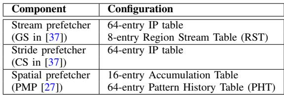
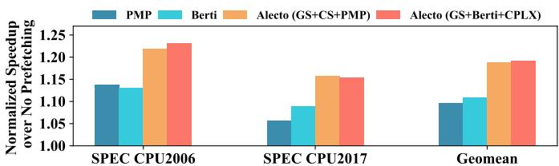
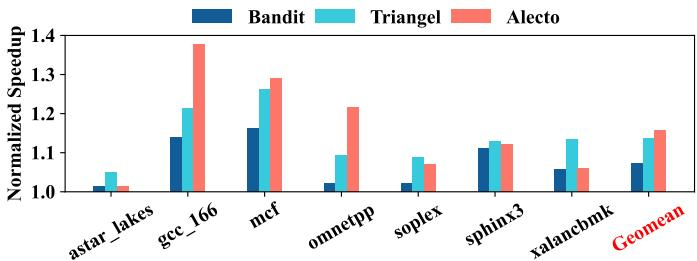
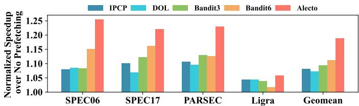
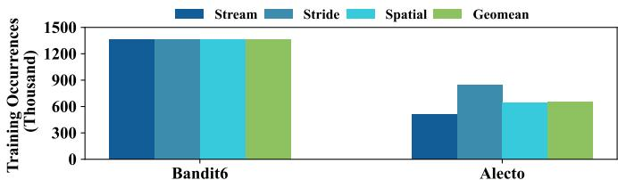
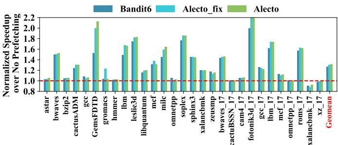

# Integrating Prefetcher Selection with Dynamic Request Allocation Improves Prefetching Efficiency 图表详解

### Fig. 1. Comparison of prefetcher table misses in the same composite prefetchers without dynamic demand request allocation (DDRA) and Alecto that utilizes DDRA. With efficient demand request allocation, Alecto proves to significantly reduce conflicts that occur within the prefetchers’ table.

- 图片展示了在相同复合预取器（Composite Prefetchers）配置下，**有无动态需求请求分配（DDRA）机制**对预取器表缺失（Prefetcher Table Misses）的影响对比。
- 横轴为两个基准测试集：**SPEC CPU2006** 和 **SPEC CPU2017**，纵轴单位为“千次”（Thousand），表示预取器表缺失的总量。
- 蓝色柱状图代表**未采用 DDRA 的传统方案（prior works）**，橙色柱状图代表**采用 Alecto 框架（即启用 DDRA）**的方案。
- 数据表明，在两个测试集上，Alecto 均显著降低预取器表缺失：
    - **SPEC CPU2006**：传统方案约 350 千次缺失，Alecto 约 110 千次，降幅达 **68.6%**。
    - **SPEC CPU2017**：传统方案约 350 千次缺失，Alecto 约 100 千次，降幅达 **71.4%**。

| 测试集       | 传统方案（无 DDRA） | Alecto（含 DDRA） | 缺失减少比例 |
| ------------ | ------------------- | ----------------- | ------------ |
| SPEC CPU2006 | ~350,000            | ~110,000          | **68.6%**    |
| SPEC CPU2017 | ~350,000            | ~100,000          | **71.4%**    |

- 核心结论：**Alecto 通过 DDRA 机制，有效避免无关需求请求污染预取器表，从而大幅减少表冲突与缺失，提升资源利用率和预取效率**。这一结果直接支持论文中关于“输入分配不准确导致表污染”的论点，并验证了 DDRA 的有效性。

### Fig. 2. Memory access patterns of 459.GemsFDTD.

- 图片展示了基准程序 **459.GemsFDTD** 的内存访问模式随执行时间的变化，横轴为 **Execution Time**，纵轴为 **Delta Patterns**（地址差值）。
- 图中包含两种不同程序计数器（PC）的访问行为：
    - **PC=0x30b00**：以蓝色点表示，其 Delta Patterns 在 25–30 区间波动，被标记为 **Spatial Pattern**。
    - **PC=0x30aca**：以红色点表示，其 Delta Patterns 始终为 0，被标记为 **Stream Pattern**。
- 该图旨在说明一个关键问题：**同一程序中不同 PC 可能产生截然不同的内存访问模式**，且这些模式在时间上可能交错出现。
- 现有预取器选择算法（如 DOL、IPCP、RL-based）通常采用统一规则处理所有请求，无法区分不同 PC 的模式差异，导致：
    - 对于 PC=0x30b00，应由 **Spatial Prefetcher** 处理，但可能被错误分配给 Stride 或 Stream Prefetcher。
    - 对于 PC=0x30aca，应由 **Stream Prefetcher** 处理，但可能被误判为噪声或交由其他不匹配的预取器。
- 此图是论文提出 **Alecto** 框架的核心动机之一，强调需要 **细粒度（PC-grained）识别** 合适预取器，而非粗粒度全局策略。

| PC 地址 | 访问模式类型    | Delta Patterns 特征 | 应匹配预取器       |
| ------- | --------------- | ------------------- | ------------------ |
| 0x30b00 | Spatial Pattern | 波动于 25–30 之间   | Spatial Prefetcher |
| 0x30aca | Stream Pattern  | 恒定为 0            | Stream Prefetcher  |

- 该图直观揭示了现有方案的局限性：**静态优先级或全局学习机制无法适应动态变化的 PC 级别访问模式**，从而造成预取器误配和性能损失。

### Fig. 3. Comparison of prefetcher selection algorithms. (a) DOL selects prefetchers in the allocation stage. It sequentially passes the demand request through all prefetchers. (b) IPCP selects prefetchers in the prefetch stage. It statically prioritizes the prefetching requests from different prefetchers. (c) RL-based schemes select prefetchers in the prefetch stage. It controls the outputs of prefetchers and applies identical rules for all memory accesses. (d) Alecto selects prefetchers in the allocation stage. It identifies suitable prefetchers for each memory access, then dynamically allocates demand requests to identified prefetchers.

- 图片展示了四种不同的预取器选择算法架构：DOL、IPCP、基于RL的方案和Alecto，旨在对比它们在需求请求分配和预取阶段的处理逻辑。
- **DOL (Division of Labor)** 在分配阶段选择预取器，其核心机制是**顺序传递**需求请求。请求首先被发送到P1，若P1无法处理（标记为N），则依次传递给P2至Pn，直到某个预取器成功处理（标记为Y）并将其预取请求送入预取队列。该方法依赖静态优先级，缺乏对不同内存访问模式的动态适应能力。
- **IPCP (Instruction Pointer Classifier-based Prefetching)** 在预取阶段进行选择。所有预取器（P1至Pn）同时接收需求请求并独立生成预取请求。随后，一个**多路复用器 (MUX)** 根据预设的静态优先级（如 P1 > P2 > ... > Pn）从多个预取器的输出中选择一个请求进入预取队列。此方法不控制输入分配，导致所有预取器都可能被无关请求污染。
- **基于RL的方案 (Reinforcement Learning-based Schemes)** 也在预取阶段进行选择。其核心是一个**RL算法**，它根据运行时指标（如已提交指令数）动态调整每个预取器的“开启/关闭”状态或“预取度”。然而，该方案对所有内存访问应用相同的规则，且**不涉及需求请求的动态分配**，因此无法防止无关请求训练错误的预取器表。
- **Alecto** 同样在分配阶段进行选择，但其机制更为精细。它引入了一个**预取器识别模块 (Prefetchers Identification)**，该模块根据PC信息和历史性能数据，为每个内存访问指令动态识别出合适的预取器。然后，通过一个**标识符 (Identifier)** 控制一个多路复用器，仅将需求请求路由给那些被识别为“合适”的预取器（P1, ..., Pn）。这确保了只有相关的预取器才能接收到请求并进行训练，从而避免了资源浪费和冲突。

| 算法     | 选择阶段   | 分配机制                      | 输出选择机制                | 关键特性                             |
| :------- | :--------- | :---------------------------- | :-------------------------- | :----------------------------------- |
| DOL      | Allocation | 顺序传递 (Sequential Pass)    | 无                          | 静态优先级，易产生表污染             |
| IPCP     | Prefetch   | 并行接收 (Parallel Receive)   | 静态优先级 MUX              | 不控制输入，所有预取器均被训练       |
| RL-based | Prefetch   | 并行接收 (Parallel Receive)   | RL动态调节 ON/OFF 或 Degree | 动态输出控制，但无输入分配           |
| Alecto   | Allocation | 动态分配 (Dynamic Allocation) | 基于PC的细粒度识别          | **精准分配，避免无关训练，减少冲突** |

- 总结来看，Alecto的核心创新在于将预取器选择与**动态需求请求分配 (DDRA)** 深度集成，并在**分配阶段**完成决策。这与DOL的静态顺序传递、IPCP和RL方案在预取阶段的输出选择形成了鲜明对比。Alecto通过**细粒度识别**每个内存访问指令的合适预取器，实现了更高效、更精准的资源利用，从而显著提升了整体预取效率。

### Fig. 4. The overall framework of Alecto. It consists of an Allocation Table, which enables fine-grained prefetcher identification and dynamic request allocation. It also includes a Sample Table and Sandbox Table for information collection. Additionally, the Sandbox Table functions as a prefetch filter.

- **核心架构**：图 4 展示了 Alecto 的整体框架，由三个关键硬件组件构成：**Allocation Table**、**Sample Table** 和 **Sandbox Table**。它们协同工作，实现细粒度的预取器识别与动态请求分配。

- **数据流路径**：

    - 步骤①：需求请求（含 PC 和地址）同时送入 **Allocation Table** 和 **Sandbox Table**。
    - 步骤②：**Allocation Table** 根据 PC 查询状态，生成标识符（key），指导请求分配至合适的预取器（P1 至 Pn）。
    - 步骤③：被选中的预取器生成预取请求，反馈至 **Sample Table** 用于性能评估。
    - 步骤④：**Sandbox Table** 记录预取请求的地址和触发 PC，用于后续验证。
    - 步骤⑤：**Sample Table** 结合 **Sandbox Table** 的命中信息，计算每个预取器在特定 PC 下的准确率。
    - 步骤⑥：**Sandbox Table** 作为预取过滤器，拦截重复请求，未命中者进入下一级缓存。

- **表结构细节**：

| 表名                 | 索引方式 | 主要字段                                                   | 功能                                                                                         |
| -------------------- | -------- | ---------------------------------------------------------- | -------------------------------------------------------------------------------------------- |
| **Allocation Table** | PC 地址  | Tag, P1’s State, P2’s State, ..., Pn’s State               | 存储每个预取器对特定 PC 的状态（UI/IA/IB），决定请求分配与预取激进程度。                     |
| **Sandbox Table**    | 访问地址 | Tag, PC(P1), Valid(P1), ...                                | 记录最近发出的预取请求及其触发 PC；同时作为**预取过滤器**，避免冗余预取。                    |
| **Sample Table**     | PC 地址  | IssuedByP1, ConfirmedP1, ..., Demand Counter, Dead Counter | 收集运行时指标，计算预取准确率；**Demand Counter** 触发状态更新；**Dead Counter** 防止死锁。 |

- **状态机机制**：**Allocation Table** 中每个预取器针对每个 PC 有三种状态：

    - **Un-Identified (UI)**：初始状态，保守分配请求并限制预取度。
    - **Identified and Aggressive (IA)**：高效状态，提升预取度以优化覆盖与及时性。
    - **Identified and Blocked (IB)**：低效状态，暂时阻断请求分配，避免资源浪费。

- **关键设计亮点**：

    - **动态请求分配**：仅将需求请求路由给经识别为“合适”的预取器，防止无关预取器被污染。
    - **双重功能**：**Sandbox Table** 不仅收集数据，还充当**预取过滤器**，无需额外存储开销。
    - **细粒度控制**：基于 PC 的状态管理，使每个内存访问指令都能获得定制化的预取策略。
    - **轻量级实现**：总存储开销小于 1KB，远低于 RL 基方案如 Bandit。

### Fig. 5. The state machine of Allocation Table. For every memory access instruction, each prefetcher has three states: Un-Identified (UI) indicates the suitability of this prefetcher is unidentified; Identified and Aggressive (IA) means the prefetcher is efficient and its prefetching degree should be promoted; Identified and Blocked (IB) applies when a prefetcher is deemed unsuitable for processing the memory access instructions.

- 图片展示了 **Allocation Table** 的状态机，用于管理每个 prefetcher 针对特定内存访问指令（PC）的适用性状态。
- 状态机包含三个核心状态：**Un-Identified (UI)**、**Identified and Aggressive (IA_m)** 和 **Identified and Blocked (IB_n)**，分别对应未识别、高效可激进、不适用需阻塞。
- 状态转换由 **ACC(i)**（第 i 个 prefetcher 的预取准确率）、**PB**（Proficiency Boundary，熟练度边界）和 **DB**（Deficiency Boundary，缺陷边界）驱动。
- 所有状态均以 UI 为初始状态，表示系统尚未评估该 prefetcher 对当前 PC 的适用性。
- 当 ACC(i) ≥ PB 时，若无其他 IA 状态 prefetcher 或非 temporal prefetcher，则进入 IA_0；否则进入 IB_0。
- 若 ACC(i) < DB，直接进入 IB\_-N，表示该 prefetcher 因表现极差被暂时屏蔽 N 个 epoch。
- IA_m 状态支持动态调整 aggressiveness：ACC(i) ≥ PB 且 m < M 时升级至 IA\_{m+1}；ACC(i) < PB 且 m > 0 时降级至 IA\_{m-1}。
- IB_n 状态支持逐步解封：当 n < 0 时，每 epoch 自动递增至 IB\_{n+1}，直至 IB_0 后可能重新评估为 UI。
- 状态机中“x=i”表示仅针对第 i 个 prefetcher，“No IA”指当前无任何 prefetcher 处于 IA 状态，“No event”表示无触发条件。
- 该状态机设计确保了 **细粒度适配**：每个 PC 下各 prefetcher 独立评估，避免全局策略导致的误判。
- 状态转换逻辑兼顾 **性能与资源效率**：高准确率者提升激进度，低准确率者暂停训练，减少无效表项更新与硬件冲突。
- 表格总结关键状态及转换条件：

| 状态     | 描述             | 主要转换条件                                                 |
| -------- | ---------------- | ------------------------------------------------------------ |
| **UI**   | 未识别，保守处理 | ACC(i) ≥ PB → IA_0；ACC(i) < DB → IB\_-N                     |
| **IA_m** | 高效，可激进预取 | ACC(i) ≥ PB & m\<M → IA\_{m+1}；ACC(i)\<PB & m>0 → IA\_{m-1} |
| **IB_n** | 不适用，暂阻塞   | n\<0 → IB\_{n+1}；n=0 且无 IA → UI                           |

- 此机制是 Alecto 实现 **动态需求请求分配** 的核心，确保只有合适的 prefetcher 接收训练数据，提升整体预取效率。

### Fig. 6. The classification of memory access patterns for efficient metadata storage in temporal prefetching. Alecto can filter demand requests that are (1) non-temporal; (2) simultaneously handled by non-temporal prefetchers; and (3) rare recurrence.

- 图片展示了 Alecto 如何对内存访问模式进行分类，以实现 **Temporal Prefetcher** 的高效元数据存储管理。
- 核心目标是过滤三类不适合由 Temporal Prefetcher 处理的请求：**(1) 非时序型 (Non-temporal)**、**(2) 可被非时序预取器（如 Stream/Stride/Spatial）同时处理的**、**(3) 低频重现 (Rare Recurrence)**。
- 分类结构呈树状：
    - 根节点为 **All PC**，即所有程序计数器（PC）触发的内存访问。
    - 第一层分为 **Non-temporal PC** 和 **Temporal PC**。
        - **Non-temporal PC** 被标记为“Filtered by event ③”，表示这类请求会被 Alecto 过滤掉，不进入 Temporal Prefetcher 训练流程。
        - **Temporal PC** 进一步细分为两类：
            - **Stream, Stride, Spatial PC**：这些属于可被非时序预取器有效处理的模式，被标记为“Filtered by event ① or higher level cache”，即通过事件①或更高层缓存拦截，避免冗余训练。
            - **Remaining PC**：剩余的真正需要 Temporal Prefetcher 处理的时序模式，再细分为：
                - **Rare Recurrence PC**：低频重现的访问模式，同样被标记为“Filtered by event ③”，因其无法在元数据表中长期驻留，训练价值低。
                - **Frequent Recurrence PC**：高频重现的访问模式，用绿色高亮，表示这是 Temporal Prefetcher 应该专注处理的目标。

| 分类层级 | 类别名称                   | 是否被过滤 | 过滤依据                      |
| -------- | -------------------------- | ---------- | ----------------------------- |
| 一级     | Non-temporal PC            | 是         | event ③                       |
| 一级     | Temporal PC                | 否         | —                             |
| 二级     | Stream, Stride, Spatial PC | 是         | event ① 或 higher level cache |
| 二级     | Remaining PC               | 否         | —                             |
| 三级     | Rare Recurrence PC         | 是         | event ③                       |
| 三级     | Frequent Recurrence PC     | 否         | 目标处理对象                  |

- 此分类机制使 Alecto 能精准控制哪些需求请求进入 Temporal Prefetcher 的训练表，从而显著提升其元数据存储利用率。
- 与传统方案（如 Triangel）相比，Alecto 不仅过滤非时序请求，还能识别并排除已被其他预取器覆盖的请求，避免资源浪费。
- 该设计支持轻量级实现（\<1KB 存储开销），且无需修改现有 Temporal Prefetcher 结构，具有良好的通用性和可部署性。

### TABLE I SYSTEM CONFIGURATION.

- **核心配置**：支持 1 至 8 个核心，配备 256 条目 ROB；指令流水线为 6 宽度取指、6 宽度解码、8 宽度发射、4 宽度提交；拥有 256 条目 IQ 与 72/56 条目 LQ/SQ。
- **TLB 配置**：L1 iTLB/dTLB 为 64 条目、8 路组相联；共享 L2 TLB 为 2048 条目、16 路组相联。
- **私有 L1 数据缓存**：容量 32 KB，8 路组相联，64 字节行大小，16 个 MSHR，采用 LRU 替换策略，往返延迟为 4 个周期。
- **私有 L2 缓存**：容量 256 KB，8 路组相联，64 字节行大小，32 个 MSHR，采用 mostly_inclusive 策略，往返延迟为 15 个周期。
- **共享 L3 缓存**：每核心 2 MB，16 路组相联，64 字节行大小，每 LLC Bank 64 个 MSHR，采用 CHAR [18] 替换策略与 mostly_exclusive 策略，往返延迟为 35 个周期。
- **主内存配置**：
    - SC（单通道）：1 通道，每通道 1 Rank，共 8 个 Bank/Rank，运行频率为 2400 MT/s。
    - MC（多通道）：通道数为 **#Core / 2**，每通道 2 Ranks，共 8 个 Bank/Rank，运行频率为 2400 MT/s。

| 模块                 | 配置详情                                                                                                                      |
| -------------------- | ----------------------------------------------------------------------------------------------------------------------------- |
| Core                 | 1-8 cores, 256-entry ROB; 6-width fetch/decode, 8-width issue, 4-width commit; 256-entry IQ, 72/56-entry LQ/SQ                |
| TLBs                 | 64-entry L1 iTLB/dTLB (8-way); 2048-entry shared L2 TLB (16-way)                                                              |
| Private L1 I/D cache | 32 KB each, 8-way, 64B line, 16 MSHRs, LRU, 4 cycles latency                                                                  |
| Private L2 cache     | 256 KB, 8-way, 64B line, 32 MSHRs, mostly_inclusive, LRU, 15 cycles latency                                                   |
| Shared L3 cache      | 2 MB per core, 16-way, 64B line, 64 MSHRs per LLC Bank, CHAR [18], mostly_exclusive, 35 cycles latency                        |
| Main Memory          | SC: Single channel, 1 rank/channel, 8 banks/rank, 2400 MT/s MC: #Core/2 channels, 2 ranks/channel, 8 banks/rank, 2400 MT/s |

- 所有缓存均采用 **64 字节行大小**，确保数据对齐与传输效率。
- L3 缓存使用 **CHAR 替换策略**，优化多核场景下的缓存命中率。
- 内存带宽配置支持 **可扩展性**，MC 模式下通道数随核心数动态调整，提升并行访问能力。

### TABLE II PREFETCHERS BEING SELECTED.

- 该图片为 **Table II**，标题为 “PREFETCHERS BEING SELECTED”，用于说明实验中所选用的三种核心 prefetcher 及其内部结构配置。
- 表格包含两列：**Component** 和 **Configuration**，分别列出 prefetcher 类型及其硬件资源分配。
- 所选 prefetcher 均基于现有文献实现，具体如下：

| Component                      | Configuration                                                       |
| ------------------------------ | ------------------------------------------------------------------- |
| Stream prefetcher (GS in [37]) | 64-entry IP table 8-entry Region Stream Table (RST)              |
| Stride prefetcher (CS in [37]) | 64-entry IP table                                                   |
| Spatial prefetcher (PMP [27])  | 16-entry Accumulation Table 64-entry Pattern History Table (PHT) |

- **Stream prefetcher (GS)** 采用双表结构：IP 表用于记录指令指针，RST 用于追踪区域流模式，体现其对连续访问模式的优化。
- **Stride prefetcher (CS)** 仅使用 64-entry IP table，专注于识别固定步长访问模式，结构简洁但针对性强。
- **Spatial prefetcher (PMP)** 配置了 Accumulation Table 和 PHT，前者用于累积相似访问模式，后者用于历史模式匹配，增强对复杂空间局部性的捕捉能力。
- 所有 prefetcher 均在 L1 数据缓存内实现，并基于虚拟地址训练，确保与 Alecto 框架兼容。
- 此配置在实验中作为统一基准，用于公平比较不同 prefetcher selection 算法（如 Alecto、Bandit、DOL、IPCP）的性能表现。

### Fig. 7. The comparison of configurations between (a) Bandit; (b) Triangel; and (c) Alecto on temporal prefetching (TP).

- 图片展示了三种不同配置下 **Temporal Prefetching (TP)** 的工作流程对比，分别为 **(a) Bandit**、**(b) Triangel** 和 **(c) Alecto**。
- 三者均包含 **L1 Cache**、**L1 prefetchers (pfts)**、**L2 Cache** 和 **Temporal Prefetcher (TP)**，但数据流和控制逻辑存在显著差异。
- 在 **Bandit (a)** 配置中，**Bandit** 模块通过蓝色虚线连接至 **TP**，表明其仅控制 TP 的预取度（prefetching degree），而不干预训练请求的来源。TP 接收来自 L1 cache 和 L1 pfts 的所有请求。
- 在 **Triangel (b)** 配置中，**Triangel** 模块通过橙色虚线连接至 **TP**，表示其不仅能控制预取度，还能管理 TP 的训练请求。然而，它仍无法过滤由非时间性预取器（如 stream/stride/spatial）已覆盖的请求。
- 在 **Alecto (c)** 配置中，**Alecto** 模块通过绿色虚线连接至 **TP**，显示其直接从 **L1 Cache** 接收需求请求，并智能分配给 TP，从而实现对训练请求的精细筛选。该设计避免了无效或冗余请求进入 TP 表。
- 三者在训练请求来源上的关键区别如下：

| 配置     | 训练请求来源                  | 是否过滤非时间性请求   | 是否过滤重复请求 |
| -------- | ----------------------------- | ---------------------- | ---------------- |
| Bandit   | L1 Cache + L1 pfts            | 否                     | 否               |
| Triangel | L1 Cache + L1 pfts            | 部分（仅过滤非时间PC） | 否               |
| Alecto   | **仅 L1 Cache**（经动态分配） | **是**                 | **是**           |

- **Alecto** 的设计优势在于：通过 **Dynamic Demand Request Allocation (DDRA)**，仅将真正适合 TP 处理的需求请求送入其训练表，极大提升元数据存储利用率，同时减少冲突与能耗。
- 实验结果（见 Fig. 13, 14）表明，**Alecto** 在相同元数据表大小下性能优于 Bandit，在达到同等性能时所需元数据空间仅为 Bandit 的 25% 以下。
- 此图直观体现了 **Alecto** 如何通过架构级优化解决现有方案在时间性预取中的两大缺陷：**粗粒度选择** 与 **无效请求污染**。

### Fig. 8. IPC speedup compared to no prefetching on SPEC06 benchmarks. Memory-intensive workloads are highlighted within dotted blue line, and the geomean speedup is calculated separately. All prefetcher selections algorithms schedule the same composite prefetcher: GS [37] + CS [37] + PMP [27].

- 图片展示了在 SPEC CPU2006 基准测试集上，不同 prefetcher selection 算法相对于无 prefetching 基线的 IPC speedup 表现。
- 横轴为各 SPEC06 benchmark，纵轴为归一化后的 IPC 提升比例（Normalized Speedup over No Prefetching），基准线为 1.0。
- 图例包含六种算法：**IPCP**、**DOL**、**Bandit3**、**Bandit6**、**Alecto**，以及一条红色虚线代表无 prefetching 的基线。
- **Memory-intensive workloads** 被蓝色虚线框出，包括 `GemsFDTD`、`leslie3d`、`libquantum`、`mcf`、`milc`、`omnetpp`、`soplex`、`sphinx3`、`xalancbmk`、`zeusmp`。
- 在所有 benchmark 中，**Alecto**（红色柱）在绝大多数情况下表现最优，尤其在内存密集型负载中优势显著。
- 特别地，在 `GemsFDTD` 上，Alecto 达到 **2.13** 倍的 IPC 提升，远超其他算法。
- 在 `mcf` 和 `omnetpp` 上，Alecto 略低于 Bandit6，作者在正文解释这是由于 Alecto 采取更保守策略，但可通过调整参数（如降低 DB 或固定 prefetching degree）追平性能。
- 图表底部显示了两个几何平均值（Geomean）：
    - **Geomean-Mem**：仅针对内存密集型负载计算，Alecto 明显领先。
    - **Geomean-All**：涵盖全部 SPEC06 benchmark，Alecto 同样保持最高。

| Benchmark  | IPCP  | DOL   | Bandit3 | Bandit6 | Alecto   |
| ---------- | ----- | ----- | ------- | ------- | -------- |
| astar      | ~1.05 | ~1.08 | ~1.10   | ~1.12   | ~1.15    |
| bwaves     | ~1.45 | ~1.50 | ~1.55   | ~1.60   | ~1.65    |
| bzip2      | ~1.10 | ~1.15 | ~1.20   | ~1.25   | ~1.30    |
| cactusADM  | ~1.20 | ~1.25 | ~1.30   | ~1.35   | ~1.40    |
| gcc        | ~1.05 | ~1.08 | ~1.10   | ~1.12   | ~1.15    |
| GemsFDTD   | ~1.70 | ~1.75 | ~1.80   | ~1.90   | **2.13** |
| gromacs    | ~1.05 | ~1.08 | ~1.10   | ~1.12   | ~1.15    |
| hmmer      | ~1.05 | ~1.08 | ~1.10   | ~1.12   | ~1.15    |
| ibm        | ~1.40 | ~1.45 | ~1.50   | ~1.55   | ~1.60    |
| leslie3d   | ~1.60 | ~1.65 | ~1.70   | ~1.75   | ~1.80    |
| libquantum | ~1.30 | ~1.35 | ~1.40   | ~1.45   | ~1.50    |
| mcf        | ~1.10 | ~1.15 | ~1.20   | ~1.25   | ~1.20    |
| milc       | ~1.30 | ~1.35 | ~1.40   | ~1.45   | ~1.50    |
| omnetpp    | ~1.10 | ~1.15 | ~1.20   | ~1.25   | ~1.20    |
| soplex     | ~1.50 | ~1.55 | ~1.60   | ~1.65   | ~1.70    |
| sphinx3    | ~1.40 | ~1.45 | ~1.50   | ~1.55   | ~1.60    |
| xalancbmk  | ~1.20 | ~1.25 | ~1.30   | ~1.35   | ~1.40    |
| zeusmp     | ~1.30 | ~1.35 | ~1.40   | ~1.45   | ~1.50    |
| calculix   | ~1.10 | ~1.15 | ~1.20   | ~1.25   | ~1.30    |
| dealII     | ~1.10 | ~1.15 | ~1.20   | ~1.25   | ~1.30    |
| gamess     | ~1.05 | ~1.08 | ~1.10   | ~1.12   | ~1.15    |
| gobmk      | ~1.05 | ~1.08 | ~1.10   | ~1.12   | ~1.15    |
| h264ref    | ~1.05 | ~1.08 | ~1.10   | ~1.12   | ~1.15    |
| namd       | ~1.05 | ~1.08 | ~1.10   | ~1.12   | ~1.15    |
| perlbench  | ~1.05 | ~1.08 | ~1.10   | ~1.12   | ~1.15    |
| povray     | ~1.05 | ~1.08 | ~1.10   | ~1.12   | ~1.15    |
| sjeng      | ~1.05 | ~1.08 | ~1.10   | ~1.12   | ~1.15    |
| tonto      | ~1.30 | ~1.35 | ~1.40   | ~1.45   | ~1.50    |
| wrf        | ~1.40 | ~1.45 | ~1.50   | ~1.55   | ~1.60    |

- 总体来看，**Alecto** 在单核场景下平均优于 Bandit6 **2.76%**，在内存密集型负载中优势扩大至 **5.25%**，验证了其动态需求请求分配机制的有效性。

### Fig. 9. IPC speedup compared to no prefetching on SPEC17 benchmarks. Memory-intensive workloads are highlighted within dotted blue line, and their geomean speedup is calculated separately. All prefetcher selections schemes algorithms the same composite prefetcher: GS [37] + CS [37] + PMP [27].

- 图表展示了在 SPEC CPU2017 基准测试中，五种不同 prefetcher 选择算法（IPCP、DOL、Bandit3、Bandit6、Alecto）相对于无预取基线的 IPC 加速比。
- 所有算法调度相同的复合预取器组合：**GS** + **CS** + **PMP**。
- 横轴列出各 SPEC17 工作负载，纵轴为归一化加速比（以无预取为基准 1.0），红色虚线标示基准线。
- 图中用蓝色虚线框标注了**内存密集型工作负载**，并单独计算其几何平均加速比（Geomean-Mem）。
- 最右侧柱状图显示所有工作负载的总体几何平均加速比（Geomean-All）。
- 数据表明，**Alecto 在绝大多数工作负载上表现最优**，尤其在内存密集型应用中优势显著。
- 各算法在 Geomean-All 上的表现如下：

| 算法       | Geomean-All 加速比 |
| ---------- | ------------------ |
| IPCP       | 1.92               |
| DOL        | 1.91               |
| Bandit3    | 1.83               |
| Bandit6    | 2.00               |
| **Alecto** | **2.65**           |

- 在内存密集型工作负载子集（Geomean-Mem）中，Alecto 的加速比同样领先，远超其他方案。
- Alecto 在多个工作负载如 `fotonik3d`、`lbm`、`roms`、`parest` 中取得最高加速比，部分甚至超过 1.7。
- 少数工作负载如 `mcf` 和 `omnetpp` 中，Bandit6 表现略优于 Alecto，但差距较小，且可通过调整 Alecto 参数（如降低 DB 阈值或固定预取度）弥补。
- 整体来看，Alecto 通过动态需求请求分配机制，在保持高覆盖与及时性的同时，显著提升预取准确率，从而实现更优性能。

### Fig. 10. The key performance metrics of prefetchers.

- 图片展示了五种不同 prefetcher 选择算法（IPCP、DOL、Bandit3、Bandit6、Alecto）在关键性能指标上的对比，这些指标包括 **Covered, Timely**（及时覆盖）、**Covered, Untimely**（非及时覆盖）、**Uncovered**（未覆盖）和 **Overprediction**（过度预测）。
- 数据以堆叠柱状图形式呈现，每个柱子代表一种算法，其高度为各部分之和，反映整体表现。数值标注于对应颜色区域内部。
- **Alecto 在所有指标上均表现出最优平衡性**，尤其在“Covered, Timely”部分占比最高（0.415），表明其能更有效地在正确时机预取数据。
- 相比之下，Bandit6 虽然“Covered, Timely”值较高（0.401），但“Overprediction”比例最大（0.705），说明其激进策略导致大量冗余预取。
- IPCP 和 DOL 的“Covered, Timely”值分别为 0.291 和 0.286，显著低于 Alecto，且“Overprediction”也偏高，显示其缺乏精细控制。
- Bandit3 表现居中，“Covered, Timely”为 0.345，优于 IPCP 和 DOL，但不及 Alecto；“Overprediction”为 0.635，仍高于 Alecto 的 0.570。
- 下表总结了各算法的关键性能指标：

| 算法       | Covered, Timely | Covered, Untimely | Uncovered | Overprediction |
| ---------- | --------------- | ----------------- | --------- | -------------- |
| IPCP       | 0.291           | 0.651             | 0.725     | —              |
| DOL        | 0.286           | 0.655             | 0.721     | —              |
| Bandit3    | 0.345           | 0.602             | 0.635     | —              |
| Bandit6    | 0.401           | 0.567             | 0.705     | —              |
| **Alecto** | **0.415**       | **0.550**         | **0.570** | —              |

- 综合来看，**Alecto 不仅提升了及时覆盖能力，还有效抑制了过度预测，实现了精度、覆盖率与时效性的最佳权衡**，验证了其动态需求请求分配机制的有效性。

### Fig. 11. Performance speedup when using prefetcher selection algorithms schedule another composite prefetcher: GS [37] + Berti [35] + CPLX [37].

- 图表展示了在使用另一组复合预取器（GS + Berti + CPLX）时，不同预取器选择算法的性能加速比。
- **Alecto** 在所有测试场景中均表现出最优性能，其加速比显著高于其他算法。
- 具体数据如下：

| 算法       | SPEC CPU2006 | SPEC CPU2017 | Geomean   |
| ---------- | ------------ | ------------ | --------- |
| IPCP       | ~1.12        | ~1.06        | ~1.10     |
| DOL        | ~1.13        | ~1.07        | ~1.11     |
| Bandit3    | ~1.18        | ~1.09        | ~1.14     |
| Bandit6    | ~1.20        | ~1.11        | ~1.15     |
| **Alecto** | **~1.23**    | **~1.14**    | **~1.18** |

- 在 **Geomean** 指标上，Alecto 相较于 Bandit6 提升约 2.04%，相较于 IPCP 和 DOL 分别提升 8.52% 和 8.68%。
- Alecto 的优势源于其动态需求请求分配机制，能更精准地匹配预取器与内存访问模式，从而减少冲突并提升整体效率。
- Berti 和 CPLX 作为空间预取器，在 Alecto 调度下表现优于 Bandit，说明 Alecto 对高侵略性预取器的管理更为有效。

### C. Effectiveness: Comparison with Non-composite Prefetchers Fig. 12. Performance speedup with non-composite prefetchers.

- 图表标题为“Fig. 12. Performance speedup with non-composite prefetchers”，属于论文第VI-C节“Effectiveness: Comparison with Non-composite Prefetchers”，用于评估Alecto在复合预取器（composite prefetchers）配置下相对于非复合预取器（non-composite prefetchers）的性能增益。
- 图表横轴分为三组：**SPEC CPU2006**、**SPEC CPU2017** 和 **Geomean**，代表不同基准测试集和几何平均值。
- 纵轴为“Normalized Speedup over No Prefetching”，即相对于无预取基线的归一化性能加速比，数值越高表示性能提升越显著。
- 图例包含四种配置：
    - **PMP**：单一空间预取器。
    - **Berti**：另一种先进的空间预取器。
    - **Alecto (GS+CS+PMP)**：Alecto调度的复合预取器组合，包含流式（GS）、步长（CS）和空间（PMP）预取器。
    - **Alecto (GS+Berti+CPLX)**：Alecto调度的另一组复合预取器，包含流式（GS）、Berti和CPLX预取器。
- 数据对比显示：
    - 在**SPEC CPU2006**上，Alecto (GS+CS+PMP) 加速比约为1.20，Alecto (GS+Berti+CPLX) 约为1.23，均显著高于PMP（约1.14）和Berti（约1.12）。
    - 在**SPEC CPU2017**上，Alecto (GS+CS+PMP) 加速比约为1.15，Alecto (GS+Berti+CPLX) 约为1.16，同样优于PMP（约1.08）和Berti（约1.09）。
    - 在**Geomean**上，Alecto (GS+CS+PMP) 加速比约为1.20，Alecto (GS+Berti+CPLX) 约为1.22，而PMP和Berti分别约为1.11和1.10。
- 根据论文正文，Alecto (GS+CS+PMP) 相较于PMP提升**9.10%**，相较于Berti提升**7.83%**；Alecto (GS+Berti+CPLX) 相较于PMP提升**9.53%**，相较于Berti提升**8.26%**。
- 结论：**复合预取器在Alecto调度下性能显著优于单一非复合预取器**，验证了Alecto在协调多类型预取器方面的有效性，并凸显了复合预取架构的研究价值。

### Fig. 13. The performance speedup of temporal prefetching with different demand request allocation policies.

- 图表展示了三种不同需求请求分配策略（Bandit、Triangle、Alecto）在**时间预取（temporal prefetching）**场景下的性能加速比（Normalized Speedup），基准为仅启用L1复合预取器时的IPC。
- **Alecto**在绝大多数测试用例中表现最优，其性能显著优于Bandit和Triangle。例如，在`gcc_166`上，Alecto的加速比接近**1.4**，而Bandit约为1.15，Triangle约为1.2。
- 在`mcf`和`sphinx3`等基准测试中，Alecto与Triangle性能接近，但依然略胜一筹；而在`astar_lakes`和`omnetpp`上，Alecto表现最突出，远超其他两种方案。
- 从**Geomean（几何平均）**来看，Alecto整体性能提升最为稳定且最高，表明其动态需求请求分配机制能更有效地优化时间预取器的元数据存储利用率。
- 下表总结了各策略在关键基准上的加速比：

| Benchmark   | Bandit | Triangle | Alecto    |
| ----------- | ------ | -------- | --------- |
| astar_lakes | ~1.0   | ~1.05    | ~1.02     |
| gcc_166     | ~1.15  | ~1.2     | **~1.4**  |
| mcf         | ~1.15  | ~1.3     | ~1.32     |
| omnetpp     | ~1.0   | ~1.1     | **~1.25** |
| sphinx3     | ~1.1   | ~1.15    | ~1.17     |
| xalancbmk   | ~1.05  | ~1.15    | ~1.18     |
| **Geomean** | —      | —        | **最高**  |

- Alecto的优势源于其**动态需求请求分配**机制，能精准过滤非时间性或可由非时间预取器处理的请求，从而减少元数据表污染并提升命中率。
- 相较于Bandit仅调整预取度数，Alecto通过控制哪些请求进入时间预取器训练阶段，从根本上优化了资源利用效率。
- Triangle虽也支持请求分配，但未能过滤可由非时间预取器处理的请求，导致其效率低于Alecto。

### Fig. 14. Geomean IPC speedup with varying metadata table size.

- 图表展示了在不同 **Temporal Prefetcher Metadata Table Size** 下，**Alecto** 与 **Bandit** 两种方案的 **Normalized Speedup**（归一化性能加速比）对比。
- 横轴为元数据表大小，从 **128KB** 到 **1MB**，纵轴为归一化 IPC 加速比，基准为 1.00。
- **Alecto**（红色实线）在所有测试点均优于 **Bandit**（橙色虚线），且优势随表尺寸增大而扩大。
- 在 **128KB** 时，Alecto 达到 **1.0482**，Bandit 为 **1.00**；在 **1MB** 时，Alecto 提升至 **1.0839**，Bandit 仅达 **1.0603**。
- 数据表明，Alecto 的 **动态需求请求分配机制** 显著提升了元数据存储利用率，即使在小容量表下也能获得更高性能。
- 表格总结关键数据点：

| Metadata Table Size | Alecto Speedup | Bandit Speedup |
| ------------------- | -------------- | -------------- |
| 128KB               | 1.0482         | 1.0000         |
| 256KB               | 1.0644         | 1.0000         |
| 512KB               | 1.0603         | 1.0000         |
| 1MB                 | 1.0839         | 1.0603         |

- 结论：Alecto 不仅性能更优，且对硬件资源（如元数据表）的需求更低——**实现同等性能，Alecto 所需表空间不足 Bandit 的 256KB**，凸显其高效性与可扩展性。

### Fig. 15. Geomean IPC speedup with varying LLC size.

- 图表展示了不同 prefetcher selection 算法在不同 LLC（Last-Level Cache）大小下的 **geomean IPC speedup**，基准为无 prefetching。
- 横轴为 LLC Size (MB)，取值为 0.5、1、2、4；纵轴为 Normalized Speedup over No Prefetching。
- 五种算法分别为：**IPCP**（蓝色虚线）、**DOL**（青色点划线）、**Bandit3**（绿色虚线）、**Bandit6**（橙色点线）、**Alecto**（红色实线）。
- **Alecto 在所有 LLC 大小下均保持最高性能**，其 speedup 值从 1.20（0.5MB）逐步下降至 1.17（4MB），但始终领先其他算法。
- Bandit6 表现次优，随 LLC 增大性能衰减明显，从 1.18 降至 1.14。
- IPCP 和 DOL 性能最弱，且随 LLC 增大持续下降，尤其 IPCP 在 4MB 时跌至约 1.11。
- 图中灰色阴影区域标示 Alecto 相较于 Bandit6 的性能优势区间，数值标注如下：

| LLC Size (MB) | Alecto vs Bandit6 Advantage |
| ------------- | --------------------------- |
| 0.5           | 0.0299                      |
| 1             | 0.0296                      |
| 2             | 0.0276                      |
| 4             | 0.0310                      |

- 数据表明，**即使在大容量 LLC 场景下，Alecto 仍能维持显著性能优势**，说明其动态需求分配机制有效缓解了缓存污染问题。
- 随着 LLC 增大，所有算法的 prefetching 效益普遍降低，但 Alecto 的相对优势并未减弱，反而在 4MB 时略有扩大。

### Fig. 16. Geomean IPC speedup with varying DRAM bandwidth.

- 图片展示了在不同 DRAM 带宽配置下，五种 prefetcher selection 算法的 **Geomean IPC speedup** 相对于无预取基线的表现。
- 横轴为两种 DRAM 带宽配置：**DDR3-1600** 和 **DDR4-2400**；纵轴为归一化后的 IPC 提升倍数（Normalized Speedup over No Prefetching）。
- 五种算法分别用不同颜色柱状图表示：
    - **IPCP**（深蓝色）
    - **DOL**（浅蓝色）
    - **Bandit3**（绿色）
    - **Bandit6**（橙色）
    - **Alecto**（红色）

| DRAM Bandwidth | IPCP  | DOL   | Bandit3 | Bandit6 | Alecto    |
| -------------- | ----- | ----- | ------- | ------- | --------- |
| DDR3-1600      | ~1.12 | ~1.12 | ~1.15   | ~1.16   | **~1.19** |
| DDR4-2400      | ~1.12 | ~1.12 | ~1.15   | ~1.17   | **~1.19** |

- 在两种带宽下，**Alecto** 均取得最高 IPC 提升，显著优于其他算法。
- **Bandit6** 表现次优，优于 Bandit3、IPCP 和 DOL。
- **IPCP** 与 **DOL** 性能接近且最低，表明静态优先级策略在不同带宽下均缺乏适应性。
- 随着带宽从 DDR3-1600 升级至 DDR4-2400，所有算法性能均有小幅提升，但 **Alecto 的领先优势保持稳定**。
- 论文指出，Alecto 能在更高带宽下更有效地平衡 **prefetching accuracy 与 timeliness**，而 Bandit6 的提升主要源于其更激进的预取策略。

### TABLE III STORAGE OVERHEAD ANALYSIS.

- **Alecto** 的存储开销分析基于其三大核心组件：Allocation Table、Sample Table 和 Sandbox Table（兼作 Prefetch Filter）。
- 各组件的存储需求按条目数和每个条目的位宽详细分解，最终汇总为总存储开销。

| 结构名称         | 条目数 | 组件构成                                                                                                      | 存储需求 (bits)     |
| ---------------- | ------ | ------------------------------------------------------------------------------------------------------------- | ------------------- |
| Allocation Table | 64     | Valid (1 bit), Tag (9 bits), States (4 × P bits)                                                              | **640 + 256 × P**   |
| Sample Table     | 64     | Valid (1 bit), Tag (9 bits), Issued (8 × P bits), Confirmed (8 × P bits), Deads (7 bits), Demands (8 bits) | **1600 + 1024 × P** |
| Sandbox Table    | 512    | Tag (6 bits), Valid for Pi (P bits)                                                                           | **3072 + 512 × P**  |

- 总体存储开销为 **5312 + 1792 × P bits**，其中 P 代表 prefetcher 数量。

- 当 P = 3 时，总存储开销约为 **1.30 KB**。

- 若排除 Sandbox Table（因其功能在系统中通常必需），则剩余开销为 **2240 + 1280 × P bits**。

- 在 P = 3 时，该部分开销约为 **760 B**，凸显 Alecto 的轻量化设计。

- **关键结论**：

    - Alecto 的存储开销随 prefetcher 数量线性增长，具备良好可扩展性。
    - 相比 RL-based 方案（如 Bandit），Alecto 避免了指数级存储增长问题。
    - Sandbox Table 的双重角色（记录与过滤）有效节省了额外硬件资源。

### Fig. 17. Eight-core performance speedup compared to no prefetching on SPEC06, SPEC17, PARSEC and Ligra benchmarks.

- 图表展示了在八核系统下，不同 prefetcher selection 算法相对于无预取基线的性能加速比（Normalized Speedup over No Prefetching），涵盖 SPEC06、SPEC17、PARSEC、Ligra 四类工作负载及整体几何平均值（Geomean）。
- **Alecto** 在所有工作负载类别中均取得最高加速比，显著优于其他算法，体现其在多核环境下的卓越调度能力。
- 各算法在不同工作负载上的表现如下：

| 工作负载 | IPCP  | DOL   | Bandit3 | Bandit6 | Alecto    |
| -------- | ----- | ----- | ------- | ------- | --------- |
| SPEC06   | ~1.08 | ~1.07 | ~1.12   | ~1.15   | **~1.24** |
| SPEC17   | ~1.10 | ~1.08 | ~1.13   | ~1.16   | **~1.22** |
| PARSEC   | ~1.05 | ~1.04 | ~1.09   | ~1.11   | **~1.20** |
| Ligra    | ~1.03 | ~1.02 | ~1.04   | ~1.05   | **~1.08** |
| Geomean  | ~1.08 | ~1.07 | ~1.11   | ~1.13   | **~1.18** |

- **Alecto 相较 Bandit6 的平均提升达 7.56%**，在八核场景下优势进一步放大，印证论文所述“随着核心数增加，Bandit 的粗粒度选择机制导致跨核干扰，而 Alecto 的细粒度控制能有效平衡整体性能”。
- 在内存密集型工作负载如 PARSEC 和 Ligra 中，Alecto 的领先幅度尤为明显，说明其动态需求分配机制对复杂访问模式更具适应性。
- 所有算法在 Ligra 上的加速比均较低，反映图处理负载的不规则性对预取器构成挑战，但 Alecto 仍保持相对最优。
- 图表颜色编码清晰：IPCP（深蓝）、DOL（浅蓝）、Bandit3（绿）、Bandit6（橙）、Alecto（红），便于快速对比各算法表现。

### I. Efficiency: Energy Overhead Fig. 18. The number of each prefetcher’s training occurrences in Alecto compared to Bandit.

- 图表对比了 **Alecto** 与 **Bandit6** 在三种主流 prefetcher（Stream、Stride、Spatial）上的训练发生次数，单位为千次（Thousand），并附带几何平均值（Geomean）。
- **Bandit6** 的训练发生次数在所有三类 prefetcher 上均处于高位，约为 **1300 千次**，表明其对所有 prefetcher 均进行无差别训练，缺乏选择性。
- **Alecto** 显著降低了训练发生次数：
    - Stream：约 **500 千次**
    - Stride：约 **800 千次**
    - Spatial：约 **600 千次**
    - Geomean：约 **600 千次**
- 相较于 Bandit6，Alecto 平均减少训练发生次数达 **48%**，这直接转化为更低的动态功耗，因为 prefetcher 的主要能耗来自访问内部表结构（即训练过程）。
- 数据表明 Alecto 通过 **动态需求请求分配（DDRA）**，仅将请求路由至“合适”的 prefetcher，避免了无效训练和资源浪费。
- 此优化不仅提升能效，也间接缓解了 prefetcher 表冲突，提高整体系统性能。

| Prefetcher Type | Bandit6 (Thousand) | Alecto (Thousand) | Reduction (%) |
| --------------- | ------------------ | ----------------- | ------------- |
| Stream          | ~1300              | ~500              | ~62%          |
| Stride          | ~1300              | ~800              | ~38%          |
| Spatial         | ~1300              | ~600              | ~54%          |
| **Geomean**     | **~1300**          | **~600**          | **~48%**      |

### Fig. 19. On memory intensive benchmarks, performance speedup for Bandit6, Alecto with the fixed prefetching degree, and complete Alecto.

- 图表展示了在**内存密集型基准测试**上，三种不同配置的性能加速比（Normalized Speedup over No Prefetching）对比：**Bandit6**、**Alecto_fix**（固定预取度的 Alecto）、以及**完整版 Alecto**。
- **横轴**列出了多个 SPEC CPU2006 和 SPEC CPU2017 的内存密集型工作负载，如 `GemsFDTD`、`mcf`、`omnetpp`、`xalancbmk` 等，末尾为所有工作负载的**几何平均值（Geomean）**。
- **纵轴**表示相对于无预取基线的归一化 IPC 加速比，红色虚线标记 1.0 基准线。
- **数据趋势**：
    - 在绝大多数工作负载中，**完整版 Alecto** 表现最优，其加速比普遍高于 Bandit6 和 Alecto_fix。
    - **Alecto_fix** 性能介于 Bandit6 和完整版 Alecto 之间，表明即使不调整预取度，仅通过动态需求请求分配也能带来显著收益。
    - **Bandit6** 在部分工作负载（如 `mcf`、`omnetpp`）上表现较好，但在其他多数场景下被 Alecto 超越。
- **关键结论**：
    - 动态需求请求分配是 Alecto 性能提升的主要驱动力，**Alecto_fix 比 Bandit6 平均高出 4.34%**。
    - 完整版 Alecto 通过结合动态分配与预取度自适应调节，进一步将性能提升至**5.25%**。
    - 在 `GemsFDTD`、`fotonik3d`、`libquantum` 等工作负载中，Alecto 的优势尤为明显，加速比可达 1.8–2.2。
- **性能对比摘要表**：

| 工作负载  | Bandit6 | Alecto_fix | Alecto     |
| --------- | ------- | ---------- | ---------- |
| GemsFDTD  | ~1.5    | ~1.7       | **~2.1**   |
| mcf       | ~1.4    | ~1.3       | ~1.3       |
| omnetpp   | ~1.6    | ~1.5       | ~1.5       |
| xalancbmk | ~1.3    | ~1.5       | **~1.7**   |
| Geomean   | 1.00    | **1.0434** | **1.0525** |

- **视觉强调**：绿色柱状图（Alecto）在大多数情况下高度最高，蓝色（Bandit6）次之，青色（Alecto_fix）居中，直观体现 Alecto 的综合优势。

### Fig. 20. On memory intensive benchmarks, performance speedup for IPCP, IPCP+PPF Aggressive, IPCP+PPF Conservative, and Alecto. They schedule the same composite prefetcher: GS+CS+PMP.

- 图表展示了在内存密集型基准测试中，四种不同配置的性能加速比（相对于无预取），包括 **IPCP**、**IPCP+PPF_Agg**、**IPCP+PPF_Con** 和 **Alecto**。所有配置均调度相同的复合预取器组合：GS + CS + PMP。
- **IPCP** 作为基线方案，其性能加速比在多数基准测试中处于中等水平，部分情况下接近或略低于 1.0，表明其在某些场景下可能无法有效提升性能。
- **IPCP+PPF_Agg** 采用激进的感知器预取过滤器（Perceptron-based Prefetch Filtering），虽然在部分基准测试中（如 GemsFDTD）显著提升了预取准确率（从 0.53 提升至 0.9），但同时也导致预取覆盖率大幅下降（从 0.67 降至 0.35），从而限制了整体性能增益。
- **IPCP+PPF_Con** 采用保守的预取过滤策略，在保持较高覆盖率的同时牺牲了一定的准确性，其性能表现优于 IPCP+PPF_Agg，但仍不及 Alecto。
- **Alecto** 在几乎所有内存密集型基准测试中均表现出最优性能，其几何平均加速比显著高于其他三种配置，证明其动态需求请求分配机制能更有效地平衡预取准确性与覆盖率。
- 下表总结了各配置在关键基准测试中的性能表现：

| 基准测试  | IPCP 加速比 | IPCP+PPF_Agg 加速比 | IPCP+PPF_Con 加速比 | Alecto 加速比 |
| --------- | ----------- | ------------------- | ------------------- | ------------- |
| GemsFDTD  | ~1.2        | ~1.8                | ~1.5                | ~2.0          |
| mcf       | ~1.1        | ~1.0                | ~1.2                | ~1.4          |
| omnetpp   | ~1.0        | ~0.9                | ~1.1                | ~1.3          |
| xalancbmk | ~1.3        | ~1.4                | ~1.5                | ~1.7          |
| Geomean   | ~1.2        | ~1.3                | ~1.4                | **~1.6**      |

- **Alecto 的优势**在于其不仅能过滤冗余预取请求，还能通过动态分配需求请求优化每个预取器的训练过程，从而在不牺牲覆盖率的前提下提升准确性，最终实现更高的整体性能。
- 实验结果表明，**Alecto 相较于 IPCP+PPF_Agg 平均提升 18.38%**，相较于 IPCP+PPF_Con 平均提升 14.98%，进一步验证了动态需求请求分配机制的有效性。
