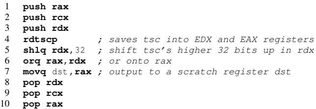
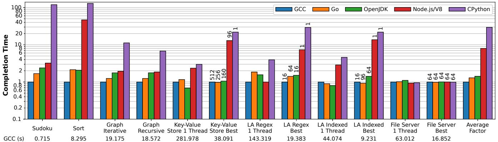
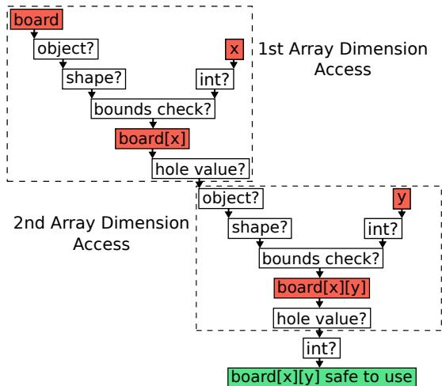
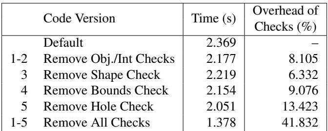
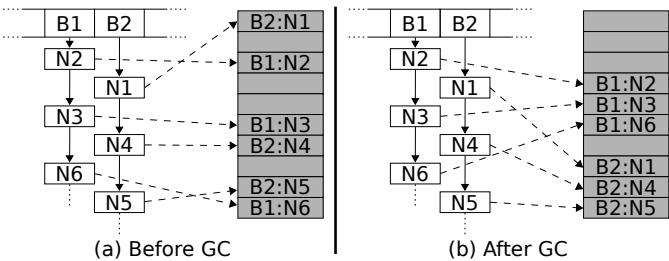

# Investigating Managed Language Runtime Performance: Why JavaScript and Python are 8x and 29x slower than C++, yet Java and Go can be Faster? 图表详解

### Figure 1: The sequence of assembly instructions inlined into the processing of each bytecode instruction.

- 该图展示了为测量字节码指令执行时间而内联到解释器中的 **x86 汇编指令序列**，核心目标是读取 CPU 的 **时间戳计数器 (TSC)**。
- 指令序列设计精巧，旨在最小化对被测代码性能的干扰，同时确保测量精度。
- 序列开头通过 `push` 指令保存 `rax`, `rcx`, `rdx` 寄存器，以避免破坏解释器原有的寄存器状态。
- 关键指令 `rdtscp` 被用于读取 TSC，它将 TSC 的低 32 位存入 `EAX`，高 32 位存入 `EDX`，并确保指令在所有 CPU 核心上同步。
- 由于 `rdtscp` 返回的是两个 32 位值，后续指令 `shlq rdx, 32` 和 `orq rax, rdx` 负责将高 32 位左移并与低 32 位合并，最终得到一个完整的 64 位 TSC 值，并存储在 `RAX` 中。
- 最后三行 `pop` 指令恢复之前保存的寄存器，保证解释器逻辑不受影响。
- 此序列会被嵌入到每个目标字节码指令处理逻辑的**开始和结束处**，通过计算两次 TSC 读数的差值来精确测量该指令的执行延迟。

| 行号 | 指令            | 功能描述                                                                      |
| ---- | --------------- | ----------------------------------------------------------------------------- |
| 1    | `push rax`      | 保存 RAX 寄存器值，防止被后续操作覆盖。                                       |
| 2    | `push rcx`      | 保存 RCX 寄存器值。                                                           |
| 3    | `push rdx`      | 保存 RDX 寄存器值。                                                           |
| 4    | `rdtscp`        | 读取时间戳计数器 (TSC)，将高 32 位存入 EDX，低 32 位存入 EAX。                |
| 5    | `shlq rdx, 32`  | 将 RDX 中的高 32 位左移 32 位，准备与低 32 位合并。                           |
| 6    | `orq rax, rdx`  | 将 RDX（已移位）与 RAX 进行按位或操作，合并高低 32 位，形成完整的 64 位 TSC。 |
| 7    | `movq dst, rax` | 将最终的 64 位 TSC 值移动到目标寄存器 `dst`。                                 |
| 8    | `pop rdx`       | 恢复 RDX 寄存器原始值。                                                       |
| 9    | `pop rcx`       | 恢复 RCX 寄存器原始值。                                                       |
| 10   | `pop rax`       | 恢复 RAX 寄存器原始值。                                                       |

- 该方法允许研究人员在不修改应用源代码的情况下，对运行时系统内部的字节码执行进行**细粒度性能剖析**，是论文中分析 OpenJDK、V8 等复杂运行时性能瓶颈的关键技术手段。

### Table 1: The applications and the component(s) they stress.

- 该图片为 **Table 1**，标题为 “The applications and the component(s) they stress”，用于说明 LangBench 基准测试套件中六个应用所侧重的压力维度。
- 表格包含五列：**Application**（应用名称）、**CPU**（CPU 密集型）、**Memory**（内存密集型）、**I/O**（I/O 密集型）、**Parallel**（并行性）。
- 各应用压力分布如下：

| Application     | CPU | Memory | I/O | Parallel |
| --------------- | --- | ------ | --- | -------- |
| Sudoku solver   | ✓   |        |     |          |
| String sorting  | ✓   |        |     |          |
| Graph coloring  | ✓   | ✓      |     |          |
| Key-Value store |     | ✓      | ✓   | ✓        |
| Log analysis    | ✓   | ✓      | ✓   | ✓        |
| File server     |     |        | ✓   | ✓        |

- **Sudoku solver** 和 **String sorting** 仅对 **CPU** 有显著压力，属于纯计算密集型任务。
- **Graph coloring** 同时施压 **CPU** 和 **Memory**，表明其算法涉及大量内存访问与计算。
- **Key-Value store**、**Log analysis** 和 **File server** 均涉及 **I/O** 操作，且后两者还支持 **Parallel** 并行执行。
- **Log analysis** 是唯一一个同时在 **CPU、Memory、I/O** 三方面均有压力的应用，体现其综合性。
- **File server** 虽无 CPU 或 Memory 标记，但因其处理大量文件读取，实际依赖 **I/O** 与 **Parallel** 扩展能力。
- 此表设计旨在覆盖不同资源瓶颈场景，确保 LangBench 能全面评估各语言运行时在多样化负载下的表现。

### Figure 2: Relative completion times for various language implementations normalized to optimized code under GCC. Note the logarithmic scale of the y axis. “LA” refers to the log analysis application. The numbers at the bottom shows the benchmark’s absolute execution time in the C++ implementation. For benchmarks with concurrency, the “Best” bars are annotated with the thread count that results in best completion time. For key-value store and file server it is the number of client threads, not the number of threads used server side. For GCC and OpenJDK, the server creates 1 (kernel) thread to handle each client thread, so the number of server-side threads is the same as the client. For both Node.js and CPython, their best completion time in key-value store is achieved when using a single server-side thread (due to their scalability characterstic described in §7). As for the file server benchmark, both Node.js and CPython’s best performance is achieved when using 64 server-side threads (§7). The number of server-side threads in Go is automatically determined by the runtime as described in §8.2. The number of threads for log analysis is the number of worker threads (as there is no client).

- 图表展示了 LangBench 基准测试中五种语言实现（GCC、Go、OpenJDK、Node.js/V8、CPython）的完成时间，**所有数据均以 GCC 优化版本为基准进行归一化**，纵轴为对数刻度。

- **CPython 在绝大多数基准测试中表现最差**，完成时间远超其他语言，尤其在 Sort 和 Sudoku 等计算密集型任务中，其耗时可达 GCC 的数十倍甚至上百倍。

- **Node.js/V8 性能次于 CPython**，但在部分 I/O 密集型任务（如 File Server）中表现接近 GCC，说明其事件驱动模型在特定场景下有效。

- **Go 和 OpenJDK 整体性能接近 GCC**，平均仅慢 1.30x 和 1.43x，且在部分测试（如 Key-Value Store 单线程、Graph Coloring）中甚至优于 GCC。

- **并发性能差异显著**：Go 和 OpenJDK 能有效利用多核，随着线程数增加性能提升；而 Node.js 和 CPython 因设计限制（单线程事件循环/GIL），增加线程反而导致性能下降，最佳性能通常出现在单线程或少量线程配置。

- **关键数据点**：

    - Sudoku：CPython 耗时是 GCC 的 **129.66x**，Node.js 为 **8.01x**，Go 为 **1.30x**，OpenJDK 为 **1.43x**。
    - Sort：CPython 耗时是 GCC 的 **29.50x**，Node.js 为 **8.01x**，Go 为 **1.30x**，OpenJDK 为 **1.43x**。
    - Key-Value Store（Best）：Go 在 256 线程下比 GCC 快 **1.02x**，OpenJDK 在 160 线程下接近 GCC，Node.js 和 CPython 最佳性能在 1 线程。
    - File Server（Best）：Go、OpenJDK、GCC 均在高并发下表现良好，Node.js 和 CPython 在 64 线程下达到最佳。

- **平均性能因子**：

    | 语言       | 平均完成时间因子 |
    | ---------- | ---------------- |
    | GCC        | 1.00x            |
    | Go         | 1.30x            |
    | OpenJDK    | 1.43x            |
    | Node.js/V8 | 8.01x            |
    | CPython    | 29.50x           |

- **图表底部标注了每个基准测试在 GCC 下的绝对执行时间**，便于理解相对性能的实际意义。例如，Sudoku 在 GCC 下仅需 0.715 秒，而 CPython 需要超过 90 秒。

- **并发优化注释**：对于支持并发的基准测试，“Best”柱状图上标注了达到最佳性能的线程数，这些数字反映了各语言运行时在并发调度上的不同策略和效率。

### Figure 3: Checks required to access board[x][y] in V8/Node.js.

- 图片展示了在 **V8/Node.js** 运行时中，访问二维数组 `board[x][y]` 所需执行的完整类型与边界检查流程，共包含 **11 个独立检查步骤**。
- 整个流程分为两个主要阶段：**第一维数组访问**（`board[x]`）和**第二维数组访问**（`board[x][y]`），每个阶段都包含对象类型、形状、边界和空值检查。
- **第一维访问**（`board[x]`）的检查路径：
    - 首先确认 `board` 是一个 **object**（非整数）。
    - 确认其内部 **shape** 为数组类型。
    - 检查索引 `x` 是否为 **int** 类型。
    - 执行 **bounds check**，确保 `x` 在数组长度范围内。
    - 检查 `board[x]` 的值是否为 **hole**（稀疏数组中的未初始化位置），若是则转换为 `undefined`。
- **第二维访问**（`board[x][y]`）重复上述逻辑：
    - 对 `board[x]` 的结果再次确认是 **object**。
    - 确认其 **shape** 为数组。
    - 检查索引 `y` 是否为 **int**。
    - 执行 **bounds check**。
    - 检查 `board[x][y]` 是否为 **hole**。
- 最终，在所有检查通过后，系统确认 `board[x][y]` 是一个安全可用的 **int** 值，方可用于后续计算。
- 根据论文数据，这些检查在 Sudoku 基准测试中占 V8 总执行时间的 **41.83%**，是性能瓶颈的主要来源。
- 下表总结了移除不同检查对性能的影响：

| 移除的检查项                  | 性能提升幅度 |
| ----------------------------- | ------------ |
| 第一维的 object? 和 int? 检查 | 8.1%         |
| 所有检查（完全禁用）          | 8x 加速      |

- 论文指出，通过改用 **packed arrays**（如 `Int8Array`）可避免 hole 检查，使优化版 Sudoku 实现提速 **1.48x**。
- 此图直观揭示了动态类型语言在运行时为保证安全性所付出的巨大性能代价，也解释了为何静态类型语言（如 Go、Java）在此类操作上更高效。

### Table 2: We modified V8’s JIT compiler and removed each of the checks performed for a 2D array access to board[x][y] shown in Figure 3. We measured the resulting execution time, and compare it against the default execution time with all checks. We also show the execution time when all checks are removed.

- 该表格（Table 2）展示了在 V8/Node.js 的 Sudoku 基准测试中，通过修改 JIT 编译器逐步移除对二维数组 `board[x][y]` 访问所执行的类型与边界检查后，程序执行时间的变化。
- 表格记录了六种不同代码版本的执行耗时（秒）及对应检查开销百分比，旨在量化动态类型检查对性能的具体影响。
- **默认版本**（Default）包含全部11项检查，执行时间为 **2.369 秒**，作为基准线。
- 逐步移除检查后，执行时间显著下降：
    - 移除对象/整数类型检查（1-2）：耗时降至 **2.177 秒**，开销占比 **8.105%**。
    - 移除 Shape 检查（3）：耗时 **2.219 秒**，开销 **6.332%**。
    - 移除边界检查（4）：耗时 **2.154 秒**，开销 **9.076%**。
    - 移除 Hole 检查（5）：耗时 **2.051 秒**，开销 **13.423%** —— 此项开销最大。
    - 移除所有检查（1-5）：耗时锐减至 **1.378 秒**，总检查开销高达 **41.832%**。

| Code Version               | Time (s) | Overhead of Checks (%) |
| -------------------------- | -------- | ---------------------- |
| Default                    | 2.369    | –                      |
| 1-2 Remove Obj./Int Checks | 2.177    | 8.105                  |
| 3 Remove Shape Check       | 2.219    | 6.332                  |
| 4 Remove Bounds Check      | 2.154    | 9.076                  |
| 5 Remove Hole Check        | 2.051    | 13.423                 |
| 1-5 Remove All Checks      | 1.378    | 41.832                 |

- 数据表明，在 V8 中，**动态类型和边界检查是性能瓶颈的核心来源**，尤其“Hole Check”贡献了最大单一项开销。
- 完全移除所有检查后，性能提升近 **1.72x**，证明若开发者能确保数据类型稳定（如使用 monotype），可极大释放 JIT 性能潜力。
- 此实验也揭示了 JavaScript 动态语义在高性能场景下的代价，以及通过底层运行时干预实现优化的可能性。

### Figure 4: Code showing where Go and OpenJDK perform array bounds checking when accessing board[x][i] in a loop. Table 3: Statistics for array access bytecodes (BC) performed by various interpreters for the sudoku benchmark.

- 该图片为论文中的 **Table 3**，标题为“Statistics for array access bytecodes (BC) performed by various interpreters for the sudoku benchmark”，用于量化不同运行时在执行数独基准测试时，处理数组访问字节码（Bytecode）的性能开销。
- 表格数据揭示了 **OpenJDK、Node.js 和 CPython** 在解释器层面的性能差异，尤其体现在指令数（Insn. per BC）和周期数（Cycles per BC）两个维度上。
- **OpenJDK** 的性能表现最优，其汇编实现的 `aaload` 和 `iaload` 字节码分别仅需 **12 条指令/7.7 周期** 和 **11 条指令/7.1 周期**。这得益于其静态类型系统和针对特定数据类型的专用字节码。
- OpenJDK 的 C++ 实现版本性能较差，`aaload` 需要 **33 条指令/12.5 周期**，`iaload` 需要 **22 条指令/11.1 周期**，表明手写汇编比 C++ 编译器生成的代码效率更高。
- **Node.js (V8)** 使用单一的 `LdaKeyedProperty` 字节码处理所有类型的键值访问，导致其开销显著增加，需要 **90 条指令/26.3 周期**。
- **CPython** 的性能最差，其 `BINARY_SUBSCR` 字节码需要 **138 条指令/41.8 周期**，是 V8 的约 1.5 倍，是 OpenJDK 汇编版本的近 6 倍。
- 数据对比清晰地说明了 **静态类型与专用字节码设计** 对于解释器性能的巨大优势，以及 **动态类型语言** 在通用字节码设计下所付出的高昂性能代价。

| 运行时      | Bytecode         | Insn. per BC | Cycles per BC |
| :---------- | :--------------- | :----------- | :------------ |
| **OpenJDK** | Assembly aaload  | **12**       | **7.7**       |
| **OpenJDK** | Assembly iaload  | **11**       | **7.1**       |
| **OpenJDK** | C++ aaload       | 33           | 12.5          |
| **OpenJDK** | C++ iaload       | 22           | 11.1          |
| **Node.js** | LdaKeyedProperty | 90           | 26.3          |
| **CPython** | BINARY_SUBSCR    | 138          | 41.8          |

### Figure 5: The key-value store before and after a GC pause. White boxes logically represent Java objects, and the shaded boxes represent the objects’ location in the JVM heap. A ‘B’ denotes a bucket mapped to by the hash function, and an ‘N’ denotes a node in the bucket’s linked list. The number of the node represents the order they are inserted into the hashtable. The memory for the nodes of the bucket begins scattered, but after GC relocation is ordered by the traversal of the bucket’s linked lists.

- 图片展示了 JVM 在执行 **Garbage Collection (GC)** 前后，**Hashtable** 中链表节点在堆内存中的布局变化。
- 左侧图 (a) “Before GC” 显示初始状态：节点按插入顺序（N2, N1, N3, N4, N6, N5）分配在堆中，导致同一桶（B1, B2）内的节点物理地址**高度分散**，缺乏局部性。
- 右侧图 (b) “After GC” 显示 GC 后状态：JVM 的**移动式垃圾回收器 (moving GC)** 将存活对象复制到新区域，并按**链表遍历顺序**重新排列。例如，B1 桶的节点被重排为 B1:N2, B1:N3, B1:N6；B2 桶的节点被重排为 B2:N1, B2:N4, B2:N5。
- 这种重排显著改善了**缓存局部性 (cache locality)**。当程序遍历链表时，相邻节点更可能位于相邻或相近的内存页/缓存行中，从而减少缓存未命中。
- 该优化是 OpenJDK 在单线程 key-value store 基准测试中比 GCC 快 1.46x 的关键原因，尽管其循环内指令数更多。
- 此现象揭示了一个反直觉结论：**更频繁的 GC 触发**（通过设置较小堆空间实现）能带来更好的性能，因为它更频繁地整理内存，提升局部性。

| 状态      | 节点物理布局           | 缓存局部性 | 性能影响                     |
| :-------- | :--------------------- | :--------- | :--------------------------- |
| Before GC | 按插入顺序分散存储     | 差         | 遍历时缓存未命中率高，性能差 |
| After GC  | 按链表遍历顺序紧凑存储 | 好         | 遍历时缓存命中率高，性能优   |

- 图中白色方框代表逻辑上的 Java 对象（如节点 N1），灰色方框代表它们在 JVM 堆中的实际物理位置。虚线箭头表示对象间的引用关系。

### Figure 6: The OpenJDK single threaded key-value store benchmark run with increasing heap sizes, corresponding to fewer GC cycles.

- 图表展示了 OpenJDK 在单线程 key-value store 基准测试中，**完成时间（Completion Time）** 随 **堆大小（Heap Size）** 增加的变化趋势。
- 横轴为堆大小，从 128 MB 递增至 128 GB；纵轴为完成时间，单位为秒（s），范围从 160 s 至 400 s。
- 数据点显示，随着堆大小增加，完成时间总体呈上升趋势，尤其在堆大小超过 8 GB 后，增长速率显著加快。
- **关键观察**：当堆大小为 128 MB 时，完成时间约为 180 s；而当堆大小增至 128 GB 时，完成时间接近 370 s，**性能下降近一倍**。
- 这种现象源于 GC 行为：较小的堆会触发更频繁的 GC 周期，而频繁的 GC 会通过对象重定位改善内存局部性（cache locality），从而提升性能。
- 相反，大堆导致 GC 触发频率降低，对象在内存中保持初始分散布局，导致缓存命中率下降，进而拖慢执行速度。
- 图表直观验证了论文第 8.1 节的核心发现：**GC 的移动特性可优化缓存局部性，反而使程序在小堆、高频 GC 下运行更快**。

| 堆大小 (Heap Size) | 完成时间 (Completion Time, s) |
| ------------------ | ----------------------------- |
| 128 MB             | ~180                          |
| 256 MB             | ~175                          |
| 512 MB             | ~195                          |
| 1 GB               | ~195                          |
| 2 GB               | ~195                          |
| 4 GB               | ~195                          |
| 8 GB               | ~205                          |
| 16 GB              | ~230                          |
| 32 GB              | ~280                          |
| 64 GB              | ~360                          |
| 128 GB             | ~370                          |

- 此图是理解“**GC 不仅不是纯开销，反而可能成为性能优化手段**”的关键证据。

### Figure 7: Relative completion time and peak memory usage for various language implementations as a multiplicative factor compared to optimized code under GCC. Each benchmark uses the most optimized version for that language implementation.

- 图表分为上下两部分，上半部分展示各语言实现的**完成时间**（Completion Time），下半部分展示**峰值内存使用量**（Peak Memory Usage），两者均以 GCC 为基准进行归一化处理。
- 完成时间采用对数刻度，单位为秒，数值越小表示性能越好；内存使用量采用线性刻度，数值越小表示内存效率越高。
- 图例中包含五种语言实现：**GCC**、**Go**、**OpenJDK**、**Node.js/V8**、**CPython**，以及一个“Min Memory Usage”条形图，代表在最小内存配置下运行时的完成时间。
- 横轴列出十二个 LangBench 基准测试，包括 Sudoku、Sort、Graph Iterative、Graph Recursive、Key-Value Store 1 Thread、Key-Value Store Best、LA Regex 1 Thread、LA Regex Best、LA Indexed 1 Thread、LA Indexed Best、File Server 1 Thread、File Server Best，最后是 Average Factor。

| 基准测试                 | GCC 完成时间 (s) | Go 完成时间倍数 | OpenJDK 完成时间倍数 | Node.js/V8 完成时间倍数 | CPython 完成时间倍数 |
| ------------------------ | ---------------- | --------------- | -------------------- | ----------------------- | -------------------- |
| Sudoku                   | 0.715            | ~1.3x           | ~2.0x                | ~3.5x                   | ~100x                |
| Sort                     | 8.295            | ~1.3x           | ~10.0x               | ~8.0x                   | ~130x                |
| Graph Iterative          | 19.175           | ~1.4x           | ~1.6x                | ~2.0x                   | ~5.0x                |
| Graph Recursive          | 18.572           | ~1.4x           | ~1.6x                | ~2.0x                   | ~5.0x                |
| Key-Value Store 1 Thread | 281.978          | ~1.1x           | ~1.4x                | ~2.0x                   | ~3.0x                |
| Key-Value Store Best     | 38.091           | ~1.0x           | ~1.4x                | ~2.0x                   | ~3.0x                |
| LA Regex 1 Thread        | 143.319          | ~1.0x           | ~1.0x                | ~1.0x                   | ~2.0x                |
| LA Regex Best            | 19.383           | ~1.0x           | ~1.0x                | ~1.0x                   | ~2.0x                |
| LA Indexed 1 Thread      | 44.074           | ~1.0x           | ~1.0x                | ~1.0x                   | ~2.0x                |
| LA Indexed Best          | 9.231            | ~0.9x           | ~1.0x                | ~1.0x                   | ~2.0x                |
| File Server 1 Thread     | 63.012           | ~1.0x           | ~1.0x                | ~1.0x                   | ~1.0x                |
| File Server Best         | 16.852           | ~1.0x           | ~1.0x                | ~1.0x                   | ~1.0x                |
| Average Factor           | —                | **1.30x**       | **1.43x**            | **8.01x**               | **29.50x**           |

- **完成时间分析**：

    - **Go** 和 **OpenJDK** 性能接近 GCC，平均分别慢 1.30x 和 1.43x，部分场景甚至优于 GCC。
    - **Node.js/V8** 平均慢 8.01x，主要瓶颈在于动态类型检查和解释器开销。
    - **CPython** 平均慢 29.50x，最差情况（Sudoku）高达 100x 以上，主要因无 JIT 编译且解释器效率低下。
    - “Min Memory Usage” 条形图显示，在最小内存配置下，部分语言（如 OpenJDK 在 Sudoku 上）性能显著下降，表明内存与性能存在权衡。

- **峰值内存使用量分析**：

    - 所有语言实现均比 GCC 使用更多内存，平均倍数分别为：**Go 2.12x**、**OpenJDK 3.38x**、**Node.js/V8 3.70x**、**CPython 2.08x**。
    - **OpenJDK** 和 **Node.js/V8** 内存开销最大，尤其在 Sudoku 上分别达到 10.94x 和 10.0x。
    - **Go** 在 Sudoku 上表现优异，仅用 0.59x 内存，源于其轻量级标准库和高效内存管理。
    - **CPython** 内存效率相对较高，但仍在 Sort 上达到 4.06x 开销。

- **关键发现**：

    - **内存与性能权衡**：为获得最佳性能，OpenJDK 和 Node.js/V8 需要大量堆内存，导致资源调度困难。
    - **Go 的优势**：在多个基准测试中内存使用低于 GCC，且性能接近或优于 GCC，体现其高效设计。
    - **CPython 的局限**：虽内存效率尚可，但性能严重落后，尤其在计算密集型任务中。
    - **V8 的优化空间**：在正则表达式等特定场景下，V8 可与 GCC 性能持平，得益于其高效的内置库实现。
