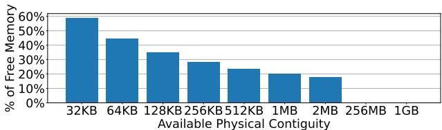

# Learning to Walk: Architecting Learned Virtual Memory Translation 通俗讲解

### 0. 整体创新点通俗解读

**痛点直击 (The "Why")**

- 传统的 **radix page tables**（多级页表）在翻译虚拟地址时，最坏情况下需要 **5次串行内存访问** 才能找到物理地址。随着数据中心应用的内存需求爆炸式增长（动辄TB级），这些串行访问成了巨大的性能瓶颈。
- 虽然硬件通过增大 **TLB** 和 \*\*Page Walk Cache \*\*(PWC) 来缓解，但这只是“打补丁”，无法根治问题。研究显示，在真实生产环境中，**高达20%的CPU周期** 被浪费在页表遍历上。
- 另一种方案 \*\*hashed page tables \*\*(HPT)，比如 \*\*Elastic Cuckoo Page Tables \*\*(ECPT)，试图用哈希函数实现单次访问。但它为了处理哈希冲突，不得不进行 **多次并行内存访问**。这虽然降低了延迟，却带来了 **更高的内存带宽消耗和缓存污染**，本质上是用带宽换延迟，并不划算。

**通俗比方 (The Analogy)**

想象你要在一个巨大、结构化的城市（虚拟地址空间）里找一个特定的门牌号（物理页帧）。Radix页表就像一本严格的行政区划手册：你必须先查省，再查市，再查区，最后到街道，步骤固定但繁琐。哈希页表则像一个天才但健忘的向导，他脑子里有个公式能直接算出门牌大概在哪片区域，但他经常记混（哈希冲突），所以会同时派几个人去好几个可能的地方找，效率不高还扰民。

LVM的做法完全不同。它认为，这个城市的布局其实非常有规律（比如住宅区、商业区泾渭分明，且内部连续）。所以，LVM不是用死板的手册或容易出错的公式，而是**雇佣了一个对这个城市了如指掌的本地向导**。这个向导的大脑就是一个 **learned index**（学习型索引），他通过观察城市的历史布局（应用的虚拟地址分配模式），学会了如何用最少的步骤（理想情况下一步）直接带你到目的地。

*Figure 4: LVM learns the distribution of virtual addresses and maps them to page tables*

**关键一招 (The "How")**

作者的核心洞察在于：**应用程序的虚拟地址空间具有极强的规律性**（论文图3显示，至少78%的虚拟页是连续分配的）。基于此，他们没有照搬为数据库设计的、庞大而复杂的learned index，而是从头设计了一套专为虚拟内存翻译优化的轻量级方案。

- **替换核心组件**：LVM用一个**分层的、基于简单线性模型**（y=ax+b）的learned index，彻底替换了传统页表的树形结构或哈希函数。这个模型的目标不是预测数据位置，而是**直接预测页表项**（PTE）。
- **解决动态更新难题**：为了解决learned index难以处理新地址映射的问题，LVM引入了两个巧妙机制：
    - \*\*Gapped Page Tables \*\*(GPT)：在页表中预留空位（gaps），允许新条目直接插入，避免频繁重建模型。
    - **Rescaling **(重缩放)：当新地址在现有范围边缘扩展时（这是最常见的情况），LVM只需**扩大底层的GPT数组，而无需重新训练模型**，极大地降低了管理开销。

*Figure 5: LVM out of bounds inserts close to the edge.*

- **拥抱碎片化现实**：针对数据中心物理内存高度碎片化的问题（论文图3显示，几百MB的连续内存几乎不存在），LVM的GPT被设计成可以**很小**（几百KB级别），并且每个leaf node都有自己的GPT。这样，即使系统内存很碎，LVM也能灵活地找到足够小的连续块来分配，完全不依赖大块连续物理内存。
- **统一支持多页大小**：LVM利用线性模型的特性，将不同大小的页（4KB, 2MB, 1GB）编码为模型中**不同斜率**（slope）的线段，从而在一个统一的索引结构中高效支持所有页大小，避免了为每种页大小维护单独索引的开销。

*Figure 6: Regular and huge pages as represented by LVM.*

最终，这套设计让LVM在硬件上实现了接近理想的 **single-access address translation**（单次访问地址翻译），大幅降低了MMU开销和内存流量，同时保持了极小的索引体积和对硬件友好的整数运算。

*Figure 9: End-to-end speedups.*

### 1. 基于成本模型的分层线性学习索引

**痛点直击 (The "Why")**

- 传统的 **radix page tables** 在处理超大内存时，**page walk** 需要多达5次串行内存访问，这在TLB Miss频发的现代数据中心负载下成了性能瓶颈。
- 而现有的 **learned indexes**（如RMI）虽然能用模型预测位置，但它们是为数据库设计的，直接搬过来会“水土不服”：
    - **太臃肿**：为了高精度，模型层级深、参数多，动辄几十MB，根本无法放进MMU的 **page walk cache (PWC)**。
    - **太脆弱**：应用的虚拟地址空间是动态增长的，传统学习索引一旦有新插入就需要昂贵的 **retraining**，开销巨大。
    - **太理想化**：假设物理内存大片连续，而现实中（如Meta的数据中心）**物理内存碎片化**严重，几百MB的连续块几乎不存在。

**通俗比方 (The Analogy)**
想象你要在一个超大的城市（虚拟地址空间）里送快递（地址翻译）。Radix树就像一本厚厚的、按行政区划层层嵌套的电话簿，你得先查区、再查街道、最后查门牌，步骤太多。而一个无约束的Learned Index，就像是雇了一个记忆力超强但体型巨大的向导，他脑子里记着所有地址，但他自己就占了半间屋子（模型太大），而且每次城市扩建一条新街，他就得重新背一遍整本地图（retraining）。

LVM的做法完全不同：它雇佣了一组**精干的、分层的本地向导**。顶层向导只负责告诉你去哪个城区（内部节点），他只需要记住几个关键路口（简单的线性函数 `y=ax+b`）。到了城区，本地向导再告诉你具体的街区（叶节点）。最关键的是，LVM有一个**精明的调度经理（成本模型）**，他会严格控制：

- 向导团队总共不能超过3层（**d_limit=3**），避免指令传递太慢。
- 每个向导只准带一张小纸条记路（**16字节的slope和intercept**），确保整个团队能挤进一个小办公室（**LWC**）。
- 如果某个区域太复杂，与其让一个向导死记硬背，不如多派几个简单向导分片包干，这样总体效率更高。

**关键一招 (The "How")**
作者没有追求单个模型的极致精度，而是通过一个**量身定制的成本模型**，从根本上扭转了学习索引的设计目标：从“预测越准越好”变成了“在硬件约束下综合效率最高”。

- **替换的核心流程**：在构建分层索引时，每决定一个节点要分裂成多少个子节点（branching factor），不再仅仅看数据分布的复杂度（比如spline points数量），而是代入一个**综合成本函数** `C(n)` 来评估。
    - 这个函数 `C(n)` 巧妙地将 **index depth (d)**、**index size (s)**、**collision rate (cr)** 和 **memory accesses per collision (ma)** 这四个硬件友好的指标打包在一起，并用可调权重（x1, x2, x3）进行平衡。
    - 例如，即使增加子节点数能稍微降低碰撞率，但如果导致模型总大小激增或深度超标，成本模型也会否决这个方案。
- **结果**：这个成本模型像一个“紧箍咒”，强制生成的索引树**又矮又瘦**。如Table 2所示，其稳态索引大小平均只有**162字节**，峰值也不过**570字节**，轻松被 **LVM Walk Cache (LWC)** 全部缓存（

*Figure 8: LVM Page Walk Cache Entry.*

），从而实现了接近理想的**单次内存访问**翻译。同时，这种结构天然适应了虚拟地址空间的**高度规律性**（

*Figure 2: Virtual memory gap coverage of gap = 1.*

），用最简单的线性模型就足以胜任。

### 2. 支持高效插入的间隙页表 (Gapped Page Tables, GPTs)

**痛点直击**

传统页表（无论是 radix 还是 hashed）在处理动态内存分配时都面临一个根本性矛盾：硬件希望地址翻译结构是静态、紧凑且可预测的，但操作系统和应用程序却需要频繁地、动态地插入新的虚拟页映射。对于 Learned Index 这类基于模型的结构，这个问题被急剧放大：

- **重训练代价太高**：每次插入新键（VPN）都可能破坏原有模型的准确性，导致必须对整个模型或其大部分进行昂贵的重训练（retraining），这在操作系统内核的快速路径上是不可接受的。
- **物理内存碎片化**：即使模型能适应，底层存储 PTEs 的物理内存也往往是高度碎片化的，无法提供大块连续空间来简单地“追加”新条目。

因此，之前的 Learned Index 设计要么只适用于静态数据集，要么在动态更新时性能急剧下降，完全无法满足虚拟内存系统对**高效、低开销动态插入**的核心需求。

______________________________________________________________________

**通俗比方**

想象你是一位图书管理员，负责管理一个巨大的、不断增长的图书馆（虚拟地址空间）。你的工作不是把书（PTEs）随便乱放，而是要让任何人都能通过一个**智能索引卡**（Learned Model）快速找到书的位置。

- **老办法（Radix/Hash）**：你用一个固定的、多层的目录柜（树或哈希桶）。每来一本新书，你可能得在目录里找半天空位，甚至要挪动很多书来腾地方，效率很低。
- **天真 Learned Index**：你画了一张非常精确的地图（模型），标明了每本书该放哪。但只要新书不属于原来的规划区域，整张地图就作废了，你得重画，累死。
- **LVM 的 Gapped Page Tables (GPTs)**：你变得聪明了。你在每个书架区域（Leaf Node）预留了很多**空书位**（gaps）。当新书来了，只要它大致属于这个区域，你就把它塞进最近的空位里，地图（模型）完全不用改！如果一个区域快满了，你也只是稍微扩展一下这个书架（rescaling），而不是重画整个图书馆的地图。这就像是在城市规划中预留了“发展用地”，避免了每次建新房都要重新规划整个城市的麻烦。

*Figure 5: LVM out of bounds inserts close to the edge.*

______________________________________________________________________

**关键一招**

作者并没有将 Learned Index 视为一个僵化的、必须完美拟合所有点的函数，而是巧妙地将其与一个灵活的底层存储结构——**Gapped Page Table (GPT)**——解耦并协同设计。具体来说，他们扭转了“模型必须绝对精确”的思路，转而利用应用地址空间的**局部连续性**这一特性：

- **预留空槽 (Gaps)**：在构建叶节点模型时，LVM 会主动将 PTEs 在物理内存中**稀疏化**（通过 `ga_scale=1.3` 参数），人为制造出大量空闲槽位。这使得后续的**范围内的插入**（within-bounds inserts）可以直接填入这些空位，无需任何模型改动。
- **最小插入距离 (Minimum Insertion Distance)**：针对最常见的**边界外连续扩展**（如堆/栈的增长），LVM 不是一次只处理一个新页，而是**批量预占**一段虚拟地址空间（如 64MB）。这吸收了微小的非连续性，并将插入成本分摊。
- **叶节点重缩放 (Leaf Rescaling)**：当需要处理边界外的插入时，LVM **不修改模型本身**，而是直接**扩展**该叶节点对应的 GPT 的物理大小。因为模型学习的是 VPN 到 GPT **内部索引**的映射，只要 GPT 变大了，新 VPN 就能自然地被模型“预测”到新扩展的区域中去，实现了无缝插入。

这种设计的核心逻辑转换在于：**将动态更新的复杂性从“昂贵的模型重训练”转移到了“廉价的底层存储结构调整”上**。模型只需捕捉宏观的、稳定的地址空间分布规律，而微观的、动态的变化则由 GPT 的灵活性来吸收，从而实现了高效、低开销的动态插入支持。

### 3. 自适应物理内存碎片的分配策略

**痛点直击**

- 传统的 **learned indexes** 和许多高性能数据结构（如 **hashed page tables**）都假设能申请到一大块**物理连续内存**来存放它们的核心数据表。
- 然而，在真实的**数据中心**和**生产环境**中，物理内存经过长时间的分配与释放后，会变得高度**碎片化**。论文引用的研究 [95] 明确指出，申请**几百MB**甚至更大的连续物理内存几乎是不可能的。
- 这就造成了一个尴尬的局面：一个理论上很高效的算法，因为无法满足其“奢侈”的内存分配要求，而在现实中根本无法部署。这就像设计了一辆顶级跑车，却发现现实世界里根本没有足够长的直道让它跑起来。

**通俗比方**

- 想象你要在城市里建一个大型仓库（存放页表项）。传统方法希望找到一整块巨大的空地（大块连续物理内存）一次性建好。
- 但现实是，城市里只有很多零散的小空地（**几百KB**级别的连续块），大的地块早就被占满了。
- LVM 的思路不是执着于找大空地，而是**化整为零**：它把大仓库的设计图拆分成很多个**小型储物单元**（即每个叶节点对应一个**gapped page table**）。
- 然后，它像一个精明的城市规划师，哪里有合适的小空地，就把一个储物单元建在哪里。最终，通过一张智能地图（**learned index**），它依然能快速定位到任何一个货物（**PTE**）所在的精确储物单元和位置。

**关键一招**

- 作者没有试图去改变操作系统那难以撼动的**物理内存碎片化**现状，而是巧妙地**重构了页表本身的数据布局**。
- 具体来说，LVM 在训练其 **learned index** 的**叶节点模型**时，做了一个关键操作：
    - 它先向 OS 查询当前可用的**物理内存连续性**（例如，通过 Linux 的 buddy allocator 查询下一个可用的分配阶）。
    - 然后，它根据这个**实际可用的、较小的连续块大小**，来决定这个叶节点需要覆盖多少个虚拟页（VPN）。
    - 最关键的一步是，**叶节点的线性模型学习的目标不再是 PTE 在本地表中的相对索引，而是 PTE 的绝对物理地址**。这个绝对地址等于 `（本地表基地址 PAGPT_base）+（模型预测的偏移量）`。
- 这个逻辑转换意味着，**learned index 的输出直接就是 PTE 的物理地址**，无论这个 PTE 被放在哪个零散的物理内存块里。硬件在进行页表遍历时，拿到这个地址就可以直接去取数据，完全不需要关心这些小页表在物理上是否连在一起。

*Figure 3: Median percentage of free memory in a Meta's datacenter that can be allocated contiguously at various sizes.*

这张图清晰地展示了现实：**几百MB**的连续内存几乎不存在，但**几百KB**的连续块仍然很充裕。LVM 的设计正是精准地瞄准了这个“甜蜜点”。

*Figure 4: LVM learns the distribution of virtual addresses and maps them to page tables*

这张架构图则直观地展现了 LVM 的实现：每个 **Leaf Model** 都指向自己独立的 **Gapped Page Table (GPT)**，这些 GPT 可以分散在物理内存的任何地方。这种设计彻底解耦了逻辑上的地址映射和物理上的内存布局，从而优雅地绕过了物理内存碎片化的难题。

### 4. 单索引多页大小支持

**痛点直击 (The "Why")**

- 传统的虚拟内存系统，无论是 **radix page tables** 还是 **hashed page tables**（如 ECPT），在支持 **multiple page sizes**（4KB, 2MB, 1GB）时都异常别扭。
- 它们通常需要为每种页大小维护一套**完全独立的索引结构**。这不仅浪费了大量内存，更致命的是，它直接破坏了“单次访问完成地址翻译”这个理想目标。
- 每次进行地址翻译时，硬件必须先查询一个额外的元数据结构来确定该虚拟地址（VA）对应的是哪种页大小，然后再去对应的索引里查找。这相当于把一次本可以完成的操作，硬生生拆成了**两次甚至多次内存访问**，引入了不必要的延迟和复杂性。

**通俗比方 (The Analogy)**

- 想象你有一本超级电话簿，里面记录了所有人的联系方式。传统方法就像是为不同城市的人分别印制了不同的电话簿：北京一本、上海一本、深圳一本。每次你要找一个人，得先翻一个“城市索引”确定他在哪本电话簿里，然后再去那本厚厚的书里查找。
- LVM 的做法则聪明得多。它只用**一本电话簿**，但通过一种巧妙的排版规则来区分城市：比如，北京的号码按顺序紧密排列（斜率大），而上海的号码因为人少，每个号码之间会空出很多页（斜率小）。你只需要知道这个排版规则（即学习到的线性模型），就能根据名字（VPN）直接算出他在电话簿里的精确位置，无论他来自哪个城市（页大小）。

**关键一招 (The "How")**

- 作者并没有为每种页大小创建独立的索引，而是巧妙地利用了**线性模型**（y = ax + b）的核心特性——**斜率**（a）。
- 在 LVM 的学习索引中，一个 **leaf node** 的线性模型负责将虚拟页号（VPN）映射到其页表项（PTE）在 **gapped page table** 中的物理地址。
- **核心洞察在于**：一个大的连续区域（比如一个 2MB 的 huge page）在虚拟地址空间中只对应**一个** PTE，而在同样大小的虚拟地址范围内，4KB 的页面则会对应**512个** PTE。
- 因此，在累积分布函数（CDF）的视角下，huge page 区域的“密度”远低于 4KB 页面区域。LVM 的线性模型通过学习这种密度差异，自然地为 huge page 区域分配了一个**很小的斜率**（因为 VPN 变化很大，但 PTE 位置几乎不变），而为 4KB 页面区域分配了一个**接近 1 的斜率**（因为 VPN 和 PTE 位置几乎是 1:1 对应）。
- 如图所示，LVM 将 huge page 视为其起始 4KB sub-page 的一个特殊映射，并通过 PTE 中的**两个比特位**来编码实际的页大小。这样，无论查询该 huge page 范围内的哪个地址，模型都会将其“向下取整”到同一个 PTE 位置，并通过检查该 PTE 的页大小字段来完成最终翻译。

*Figure 6: Regular and huge pages as represented by LVM.*

- 这个设计一举两得：既在一个统一的索引结构中无缝支持了多种页大小，又完全保留了**单次内存访问**完成翻译的高效性，彻底绕开了传统方案的结构性缺陷。

### 5. 面向硬件的定点算术与MMU集成

**痛点直击**

- 传统的 **learned indexes** 虽然在数据库里很火，但它们是为软件环境设计的，直接搬到 **MMU（Memory Management Unit）** 里会“水土不服”。
- 最致命的问题是，它们严重依赖 **floating-point arithmetic（浮点运算）**。在硬件里实现一个完整的浮点计算单元来做地址翻译，代价太高了：
    - **面积开销巨大**：现代处理器的 MMU 需要支持多个并行的页表遍历器（page walkers），每个都配一个浮点单元，芯片面积会爆炸。
    - **功耗和延迟不划算**：地址翻译是一个高频、低延迟要求的操作，用复杂的浮点运算来算一个简单的线性模型（y=ax+b），简直是“杀鸡用牛刀”。
    - **与现有硬件栈割裂**：操作系统内核本身也极力避免在关键路径上使用浮点运算，因为需要保存/恢复 FPU 状态，非常麻烦。

**通俗比方**

- 想象一下，你有一个超级精准但笨重的 **实验室级电子秤**（浮点运算），可以称出小数点后10位的重量。但现在你需要的是在超市收银台快速给苹果称重计价。
- LVM 的做法不是把实验室电子秤搬过来，而是聪明地换了一个 **高精度的机械杆秤**（定点运算）。这个杆秤虽然不能显示无限精度，但它通过精心设计的刻度（44位整数+20位小数），足以满足“称苹果”的精度需求，并且**结构简单、成本低廉、速度飞快**，完美嵌入到现有的收银流程（MMU pipeline）中。

**关键一招**

作者并没有试图在硬件里硬塞一个浮点单元，而是巧妙地对 learned index 的核心计算进行了 **quantization（量化）** 和 **hardware-software co-design（软硬件协同设计）**：

- **模型参数的定点化**：将 learned index 中每个线性模型的斜率（a）和截距（b）从浮点数转换为 **fixed-point（定点数）**，具体格式是 **44-bit integer + 20-bit fractional**。这个精度经过验证，足以保证预测的准确性，同时让计算变得极其简单。
- **专用硬件单元的引入**：在 MMU 中，用一个极简的 **LVM Page Table Walker** 替换了传统的 radix page walker。这个新 walker 的核心就是一个 **adder（加法器）** 和一个 **multiplier（乘法器）**，专门用来执行 `y = a*x + b` 这个定点运算。
- **定制化的缓存结构**：设计了 **LVM Walk Cache (LWC)** 来缓存这些定点模型。 如图所示，每个 LWC entry 只需存储 slope 和 intercept 两个 8-byte 的定点值，总共 **16 bytes**。这使得整个 learned index 极其 compact，一个很小的 LWC 就能缓存整个进程的索引，命中率高达 **99%+**。

这种设计的核心扭转在于：**牺牲了一点理论上的模型表达能力（从浮点到定点），换来了硬件实现上的巨大收益（面积、功耗、速度）**。最终结果是，LVM 的硬件开销甚至比传统的 radix PWC 更小，实现了 **3.0× 的面积缩减**，同时性能却逼近理想状态。
