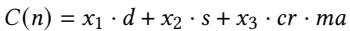
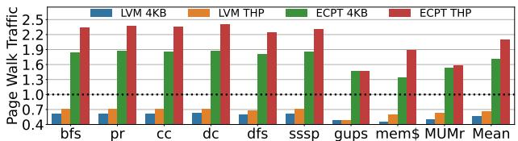

# Learning to Walk: Architecting Learned Virtual Memory Translation 论文解析

## 0. 论文基本信息

**作者 (Authors)**

- Kaiyang Zhao
- Yuang Chen
- Xenia Xu
- Dan Schatzberg
- Nastaran Hajinaza
- Rupin Vakharwala
- Andy Anderson
- Dimitrios Skarlatos

**发表期刊/会议 (Journal/Conference)**

- 58th IEEE/ACM International Symposium on Microarchitecture (MICRO '25)

**发表年份 (Publication Year)**

- 2025

______________________________________________________________________

## 1. 摘要

**目的**

- 解决现代数据中心应用中，由 **radix page tables** 引起的虚拟内存地址转换性能瓶颈问题。该瓶颈源于其多级页表结构导致的长达 **5 次串行内存访问** 的页表遍历（page walk）。
- 设计一种新型页表结构，能够实现接近理想的 **单次内存访问** 完成地址转换，同时克服现有方案（如 hashed page tables）的并行访问开销和物理内存连续性要求高等缺点。

**方法**

- 提出 **Learned Virtual Memory (LVM)**，一种基于 **learned index** 的页表结构。
- LVM 的核心创新在于用一个为虚拟内存定制的、轻量级的 **learned index** 替代传统哈希函数或固定树形结构。
- 该 learned index 的关键设计包括：
    - **利用虚拟地址空间的规律性**: 通过分析发现，应用程序的虚拟地址空间具有高度规律性（**gap=1 的覆盖率最低为 78%**），非常适合用简单模型学习。

*Figure 1:Address translations schemes.LVMavoids both the long sequential page walks of radix page tables and the high collision rates and parallel accesses of hashed page tables.*

- **引入面向虚拟内存的成本模型 (Cost Model)**: 该模型在 **index 深度**、**宽度** 和 **碰撞率** 之间进行权衡，以生成一个**极小且高缓存命中率**的索引结构。

- **采用 Gapped Page Tables (GPTs)**: 叶节点关联独立的 GPT，放松了对**大块物理内存连续性**的要求，能适应数据中心常见的碎片化环境。

*Figure 3: Median percentage of free memory in a Meta's datacenter that can be allocated contiguously at various sizes.*

- **支持高效动态插入**: 通过 **minimum insertion distance** 和 **rescaling** 技术，避免了昂贵的模型重训练。

*Figure 5: LVM out of bounds inserts close to the edge.*

- **统一支持多页大小**: 利用线性模型的不同斜率在同一索引结构中表示不同大小的页面（如 4KB, 2MB, 1GB）。

*Figure 6: Regular and huge pages as represented by LVM.*

- **使用定点数运算**: 确保硬件实现的高效性，避免浮点运算开销。

**结果**

- 在 Linux OS 扩展、RTL 综合和全系统仿真中对 LVM 进行了全面评估。
- **性能提升**:
    - 相比 radix page tables，**平均减少 44% 的地址转换开销**。
    - 应用程序执行时间获得 **2%-27% 的加速**。
    - 性能表现**与理想页表（Ideal page table）相差在 1% 以内**。
- **硬件效率**:
    - **LVM Walk Cache (LWC) 面积比 radix 的 PWC 减少 1.5 倍**。
    - RTL 实现显示，LVM 的硬件结构在面积、功耗上均优于 radix。
- **架构特性**:
    - **碰撞率极低**：4KB 页面下平均仅 **0.2%**。
    - **索引尺寸极小**：稳态下平均仅需 **162 字节**，且不随应用内存占用增长而线性增长。
    - **OS 管理开销可忽略**：平均仅占总执行时间的 **1.17%**。
- **对比其他方案**:
    - 显著优于 **Elastic Cuckoo Page Tables (ECPT)**，不仅性能更高，而且**内存流量大幅降低**（ECPT 的页表遍历流量是 radix 的 1.7-2.1 倍，而 LVM 则大幅减少）。
    - 优于 **ASAP**, **Midgard**, 和 **Flattened Page Tables (FPT)** 等先前工作。

| 方案    | 相比 Radix 4KB 的平均加速 | 页表遍历流量 (vs Radix 4KB) | 索引/缓存面积 |
| :------ | :-----------------------: | :-------------------------: | :-----------: |
| **LVM** |          **14%**          |          **-43%**           |   **-1.5x**   |
| ECPT    |            9%             |            +70%             |       -       |
| ASAP    |            -3%            |              +              |       -       |
| Midgard |            3%             |              -              |       -       |

**结论**

- **Learned Virtual Memory (LVM)** 成功地将 **learned indexes** 的理念应用于虚拟内存地址翻译这一硬件关键路径。
- 通过一系列针对虚拟内存特性的创新设计（成本模型、Gapped Page Tables、高效更新、多页大小支持等），LVM 克服了传统 learned indexes 在硬件场景下面临的模型过大、更新困难、依赖连续内存等核心挑战。
- LVM 能够提供接近理论最优的 **单次访问地址翻译** 性能，显著优于当前主流的 radix 和 hashed page tables，并且硬件开销更低，是一种面向未来大规模内存系统的、实用且高效的页表设计方案。

______________________________________________________________________

## 2. 背景知识与核心贡献

**研究背景与动机**

- **虚拟内存地址翻译已成为数据中心性能瓶颈**。随着内存密集型应用的普及和内存容量（如通过 CXL 技术达到 TB 级）的激增，传统的 **radix page tables**（多级页表）因其需要多达 5 次串行内存访问（page walk）而带来巨大开销。
- 行业报告显示，在 Google 和 Meta 的生产环境中，约 **20% 的 CPU 周期**被消耗在 page walk 上。
- 现有优化方案存在明显缺陷：
    - **基于大页（huge pages）或内存连续性**的方法依赖于物理内存的连续分配，这在高度碎片化的现代数据中心中是**稀缺资源**。
    - **哈希页表（Hashed Page Tables, HPTs）**，如 Elastic Cuckoo Page Tables (ECPT)，虽能并行化访问，但无法消除多次内存访问的本质，反而因并行探测（如 3-way cuckoo hashing）导致**内存流量增加**和**缓存污染**。
    - **传统 Learned Indexes** 虽在数据库领域取得成功，但其为软件设计，存在**模型过大**（数十MB）、**依赖浮点运算**、**需要大块物理连续内存**、**难以高效支持动态插入**等问题，完全不适用于对延迟和硬件实现有严苛要求的 MMU 地址翻译场景。

*Figure 1:Address translations schemes.LVMavoids both the long sequential page walks of radix page tables and the high collision rates and parallel accesses of hashed page tables.*

**核心贡献**

论文提出了 **Learned Virtual Memory (LVM)**，一种专为硬件地址翻译设计的新型页表结构，旨在实现高效的单次内存访问翻译。其核心贡献包括：

- **验证了虚拟地址空间的规律性**：通过对多样化的真实应用（包括 Meta 生产负载）进行分析，发现其虚拟页号（VPN）分布具有高度规律性（至少 **78% 的 gap=1**，即连续分配），这为使用 Learned Index 提供了理论基础。

*Figure 2: Virtual memory gap coverage of gap = 1.*

- **设计了面向虚拟内存的轻量级 Learned Index**：

    - 采用**简单的线性模型**（`y = ax + b`）作为基础构建块，仅需存储斜率和截距，模型极小（平均 **162 字节**），易于缓存。
    - 引入**定制化的成本模型**，在模型深度、宽度和碰撞率之间进行权衡，确保翻译路径短且高效。
    - 使用**定点数算术**替代浮点运算，便于硬件实现。
    - 通过**Gapped Page Tables (GPTs)** 组织叶节点数据，并结合创新的**重缩放（rescaling）** 和**最小插入距离**技术，高效支持动态插入，避免了昂贵的全局重训练。

- **解决了物理内存碎片化问题**：LVM 不要求大块物理连续内存。它能根据系统当前可用的物理连续性（研究发现数百 KB 的连续块依然丰富），动态创建多个小型 GPT，从而适应高度碎片化的环境。

*Figure 3: Median percentage of free memory in a Meta's datacenter that can be allocated contiguously at various sizes.*

- **无缝支持多页大小**：LVM 在单一 Learned Index 结构内，通过不同斜率的线性模型来表示不同大小的页面（如 4KB, 2MB, 1GB），无需为每种页大小维护独立的数据结构。

- **完整的软硬件协同设计**：提供了 Linux 内核原型、RTL 硬件实现和全系统模拟评估。结果表明，LVM 相比 radix 页表，**平均减少 44% 的地址翻译开销**，应用执行时间**提升 2-27%**，性能**接近理想单次访问页表**（差距在 1% 以内），同时将页表遍历缓存（PWC）面积需求**减少了 1.5 倍**。

______________________________________________________________________

## 3. 核心技术和实现细节

### 0. 技术架构概览

**整体架构概览**

Learned Virtual Memory (LVM) 的核心目标是通过一个**单次内存访问**即可完成地址翻译，从而取代传统的多级 radix page tables。其整体架构围绕一个为虚拟内存系统量身定制的 **learned index** 展开，并由操作系统和硬件协同管理。

- LVM 的基本思想是用一个**学习得到的函数**（learned function）替代 hashed page tables 中的固定哈希函数，该函数能够根据应用虚拟地址空间（Virtual Address Space）的结构规律，直接预测出页表项（PTE）的物理位置。
- 整个系统由两部分组成：**OS 软件部分**负责构建、训练和动态维护 learned index 与底层数据结构；**硬件 MMU 部分**则在 TLB miss 时，利用该 index 执行高效的地址翻译。

*Figure 4: LVM learns the distribution of virtual addresses and maps them to page tables*

**核心组件与数据结构**

LVM 的架构主要包含两个核心组件：**Learned Index** 和 **Gapped Page Tables (GPTs)**。

- **Learned Index**

    - 组织为一个**层次化模型**（hierarchy of models），包含内部节点（internal nodes）和叶节点（leaf nodes）。
    - **内部节点**：负责将整个虚拟地址空间（VPN）划分为更小的子集，并通过一个简单的线性模型 `y = ax + b` 将输入的 VPN 映射到其子节点的索引。
    - **叶节点**：负责最终的映射，其线性模型将 VPN 直接映射到其对应 PTE 在 Gapped Page Table 中的**物理地址**。
    - 所有模型参数（斜率 `a` 和截距 `b`）均使用**定点数**（fixed-point arithmetic）表示，以满足硬件快速计算的要求，每个模型仅占用 **16 字节**。
    - 该索引的深度和宽度由一个**成本模型**（cost model）动态决定，该模型在**预测精度**、**索引深度/宽度**和**缓存效率**之间进行权衡，确保索引结构精简且高效。

- **Gapped Page Tables (GPTs)**

    - 每个叶节点都关联一个独立的 GPT，用于存储实际的 PTE。
    - GPT 是一个带有**空隙**（gaps）的数组，这些空隙为未来的插入操作预留了空间，从而支持高效的动态更新。
    - **关键设计**：GPT **不要求大块物理连续内存**。LVM 会根据系统当前可用的物理内存碎片情况（通常为几百 KB 级别），动态分配多个小的、非连续的 GPT。叶节点的模型在训练时会直接学习 PTE 的**绝对物理地址**，而非相对偏移量。

**硬件支持架构**

LVM 对硬件的改动被严格限制在 **MMU** 内部，保持了与现有系统的兼容性。

- **LVM Page Table Walker**：替换了传统的页表遍历器。它包含一个加法器和一个乘法器，用于计算 learned index 中线性模型的输出。
- **LVM Walk Cache (LWC)**：替换了传统的 Page Walk Cache (PWC)。它是一个全相联缓存，专门用于缓存 learned index 中的模型节点（slope 和 intercept）。
    - LWC 条目还包含**地址空间标识符**（ASID），以支持高效的上下文切换。
    - 由于 learned index 本身非常小（平均仅 **162 字节**），LVM 的 LWC 面积比 radix PWC **小 1.5 倍**，并且能实现 **>99%** 的命中率。
- 其他 MMU 组件（如 L1/L2 TLB）和处理器缓存层次结构保持不变。

*Figure 7: LVM hardware overview.*

**关键特性支持机制**

- **高效动态插入**（Efficient Insertion）

    - **边界外插入**（Out-of-bounds inserts）：利用应用倾向于连续扩展地址空间的特性，LVM 通过**预分配最小插入距离**（minimum insertion distance）和**重缩放**（rescaling）技术，在不重新训练模型的情况下处理新页面。
    - **边界内插入**（Within-bounds inserts）：利用 GPT 中的空隙直接插入；若发生冲突，则仅对局部叶节点进行轻量级重训练。

- **多页大小支持**（Multiple Page Sizes）

    - LVM 在**单一 learned index** 中无缝支持 4KB、2MB、1GB 等多种页大小。
    - 其原理是利用不同页大小在累积分布函数（CDF）上表现为**不同斜率**的线性段。大页（如 2MB）对应更平缓的斜率，因为其覆盖的 VPN 范围更广但只产生一个 PTE。
    - PTE 本身包含**2 位元数据**来编码其页大小。

### 1. 基于成本模型的分层线性学习索引

**LVM学习索引的核心架构与成本模型**

- LVM的学习索引是一个**分层的模型结构**，旨在替代传统页表（如radix或hashed page tables）以实现高效的**单次访问地址翻译**。
- 该索引的核心构建单元是**线性模型**（linear model），形式为 `y = ax + b`。每个节点（无论是内部节点还是叶节点）仅需存储**斜率a**和**截距b**两个参数。
- 索引被组织成树状层次结构：
    - **内部节点**（internal nodes）：负责将整个虚拟地址空间（VPN key space）划分为更小的子集，并将查询路由到正确的子节点。其输出 `y` 是一个子节点的索引。
    - **叶节点**（leaf nodes）：负责最终的映射，其输出 `y` 是**页表项**（PTE）在**间隙页表**（Gapped Page Table, GPT）中的物理地址。
- 整个索引的目标是学习虚拟页号（VPN）到其对应PTE物理地址的映射函数，利用了应用虚拟地址空间高度**规则**（regular）的特性。

*Figure 4: LVM learns the distribution of virtual addresses and maps them to page tables*

**成本模型**（Cost Model）

- 成本模型是LVM设计的**核心创新**，用于在索引的**深度**（depth）、**宽度**（分支因子，branching factor）和**碰撞率**（collision rate）之间进行权衡，以优化整体翻译延迟和硬件缓存效率。
- 该模型定义了一个**翻译成本函数** `C(n)`，用于评估一个拥有 `n` 个子节点的节点的优劣。成本函数综合考虑了以下因素：
    - **索引深度**（d）：更深的索引意味着更多的间接访问，增加延迟。
    - **索引大小**（s）：更大的索引占用更多内存，降低在\*\*LVM Walk Cache \*\*(LWC) 中的缓存效率。
    - **碰撞率**（cr）：更高的碰撞率会导致额外的内存访问来解决冲突。
    - **每次碰撞的平均额外访问次数**（ma）。
- 成本函数的具体形式为加权和，通过调整权重 `x1`, `x2`, `x3` 来反映不同因素的重要性。论文中经验性地设置为 `x1 = 10`, `x2 = 5`, `x3 = 200`，表明对碰撞解决成本的惩罚最高。

- **训练流程中的应用**：
    - 在训练一个节点时，成本模型首先估算该节点key space的复杂度（通过计算**样条点**（spline points）的数量）。
    - 模型围绕这个估算值（±2范围内）尝试不同的子节点数量 `n`。
    - 对每个候选的 `n`，计算其成本 `C(n)`。
    - 选择成本最低的 `n` 作为该节点的最终分支因子，并据此划分key space给子节点。
- **硬性约束**：
    - **深度限制**（d_limit）：为了防止索引过深，LVM设置了硬性深度上限（论文中设为 `d_limit = 3`），确保硬件页表遍历器能在有限步数内完成查找。
    - **覆盖率约束**：模型会检查一个节点是否提供了足够的“每字节覆盖范围”。如果一个节点过于“稀疏”（即用很多字节只覆盖了很小的地址空间），则不会为其创建子节点，以保证索引的空间效率和缓存友好性。

**输入输出关系及在LVM中的作用**

- **输入**：待翻译的**虚拟页号**（VPN）。
- **处理流程**：
    1. 从**根节点**开始，将VPN输入到根节点的线性模型中。
    1. 模型输出一个子节点索引，根据此索引选择下一个要访问的内部节点。
    1. 重复步骤2，直到到达一个**叶节点**。
    1. 将VPN输入到叶节点的线性模型中，模型直接输出目标PTE所在的**物理地址**。
    1. 硬件从该物理地址加载PTE，并进行标签匹配验证。
- **输出**：目标**页表项**（PTE）的物理地址。
- **在整体系统中的作用**：
    - **替代传统页表遍历**：将原本需要多次内存访问（radix）或多次并行访问（hashed）的页表遍历过程，简化为一次（或极少数几次）沿着学习索引的模型计算和一次PTE内存访问。
    - **实现单次访问翻译**：在绝大多数情况下（论文称99.4%），LVM能实现真正的单次内存访问完成地址翻译，性能接近**理想页表**（Ideal page table）。
    - **硬件友好**：线性模型仅需简单的**定点乘加运算**（fixed-point arithmetic），易于在硬件MMU中实现，且模型本身非常小巧（平均仅162字节），能被高效地缓存在\*\*LVM Walk Cache \*\*(LWC)中。

______________________________________________________________________

**关键参数与性能指标总结**

| 参数/指标                           | 值/描述                 | 说明                    |
| :---------------------------------- | :---------------------- | :---------------------- |
| **模型类型**                        | 线性模型 (`y = ax + b`) | 简单、高效、可解释性强  |
| **成本模型权重**                    | `x1=10, x2=5, x3=200`   | 高度惩罚碰撞解决成本    |
| \*\*深度限制 \*\*(d_limit)          | 3                       | 保证硬件遍历效率        |
| \*\*间隙数组缩放因子 \*\*(ga_scale) | 1.3                     | 为未来插入预留空间      |
| **平均索引大小**                    | 162 bytes (THP)         | 极小，缓存效率极高      |
| **平均碰撞率**                      | 0.6% (THP)              | 远低于传统哈希表 (~19%) |
| **单次访问成功率**                  | 99.4%                   | 性能接近理想页表        |
| **LWC命中率**                       | >99%                    | 得益于极小的索引尺寸    |

### 2. 支持高效插入的间隙页表 (Gapped Page Tables, GPTs)

**间隙页表 (Gapped Page Tables, GPTs) 的设计原理与实现**

LVM 采用 **间隙页表 (Gapped Page Tables, GPTs)** 作为其叶节点模型映射的目标存储结构，这是支持高效动态插入的核心机制。GPTs 通过在物理存储布局上预留空槽，并结合创新的软件管理策略，有效避免了传统 learned indexes 在面对动态数据时所需的昂贵重训练开销。

- **基本概念**：每个 LVM 叶节点都关联一个独立的 GPT。该表在逻辑上是一个数组，但物理上被组织为一个 **gapped array**，即在初始化时就预分配了比当前所需更多的空间，这些未使用的空间被称为 **gaps**（间隙/空槽）。
- **核心目的**：这些 gaps 为未来的 **insertions**（插入）操作提供了缓冲区，使得新加入的虚拟页号 (VPN) 可以直接放入由叶节点模型预测的位置或其附近，而无需立即修改模型本身。
- **物理内存适应性**：GPTs 的设计巧妙地解决了数据中心中 **physical memory fragmentation**（物理内存碎片化）的问题。如图

*Figure 3: Median percentage of free memory in a Meta's datacenter that can be allocated contiguously at various sizes.*

所示，虽然数百 MB 的连续物理内存极为稀缺，但数百 KB 级别的连续块仍然普遍存在。因此，LVM 为每个叶节点分配独立的、较小的 GPT，而非一个巨大的连续页表，从而能灵活地利用系统中可用的物理内存碎片。

**支持高效插入的关键技术**

LVM 区分了两种主要的插入场景，并采用了不同的优化策略来处理，确保绝大多数插入操作都能在不触发模型重训练的情况下完成。

- **边界外插入 (Out-of-bounds inserts)**：
    - **场景假设**：应用程序倾向于以 **contiguous**（连续）的方式扩展其虚拟地址空间，因此新页面通常会分配在现有地址空间的边缘附近。
    - **最小插入距离 (Minimum Insertion Distance)**：当发生一次靠近边界的插入时，LVM 不会只为这一个新页面分配空间，而是会一次性将地址空间向该方向扩展一个预设的 **minimum insertion distance**（默认为 **64MB**）。这种批处理方式可以吸收后续可能发生的邻近插入，摊销管理开销。
    - **叶节点重缩放 (Rescaling)**：在扩展地址空间后，LVM 会相应地 **expand the gapped page table**（扩展间隙页表），增加新的空槽。关键在于，**existing linear model is not modified**（现有线性模型不被修改）。新旧 VPN 都使用同一个模型进行位置预测，新 VPN 被直接插入到扩展后的新区域中。这一过程完全避免了重训练。
    - **流程示例**：如图

*Figure 5: LVM out of bounds inserts close to the edge.*

所示，当插入 VPN 1030 时，系统先将键范围扩展至 1050，然后按比例（`ga_scale=1.3`）扩展 GPT，并将新键插入到由原模型预测的位置。

- **边界内插入 (Within-bounds inserts) 与远端边界外插入**：
    - **常规处理**：对于落在现有键范围内的插入，LVM 直接查询叶节点模型，并尝试将新条目放入预测位置。得益于 GPT 中的 gaps，大多数情况下该位置是空的，插入可立即完成。
    - **冲突处理**：如果预测位置已被占用（发生碰撞），LVM 会执行一次 **local retraining**（局部重训练），仅针对该叶节点重新拟合线性模型，以容纳新键。这是一个轻量级操作。
    - **极端情况**：只有在局部重训练也无法成功（极其罕见）时，LVM 才会考虑重建父节点甚至整个索引。根据评估，这种情况在整个应用生命周期中平均只发生 **2次**，最坏情况下也仅有 **3次**。

**参数设置与输入输出关系**

GPTs 的行为由几个关键参数控制，这些参数定义了其与 learned index 模型的交互方式。

- **核心参数**：
    - `ga_scale` (**Gapped Array Scale Factor**): 默认值为 **1.3**。该因子决定了在构建 GPT 时，为每个现有 VPN 预留多少额外的空槽。例如，若有 N 个 VPN，则分配 `N * ga_scale` 个槽位。
    - `minimum insertion distance`: 默认值为 **64MB**，用于批处理边界扩展。
- **输入输出关系**：
    - **输入**: 叶节点模型接收一个 **Virtual Page Number (VPN)** 作为输入。
    - **模型计算**: 模型执行一个简单的线性函数 `y = a*x + b`，其中 `x` 是 VPN。
    - **输出**: 输出 `y` 并非一个相对索引，而是经过特殊处理的 **Physical Address (PA)**。具体来说，在训练阶段，模型学习的目标是 `(PTE's index in GPT) + (Base Physical Address of the GPT)`。因此，模型的直接输出就是 PTE 在物理内存中的 **absolute location**（绝对位置），硬件页表遍历器可以直接用此地址去访存。
- **在整体架构中的作用**：GPTs 作为 learned index 的“叶子”，承担了最终的 PTE 存储功能。它们将 learned index 的预测能力与物理内存的实际布局解耦，使得 LVM 能够在保持模型简洁（仅需存储斜率和截距）的同时，灵活应对动态变化的虚拟地址空间和受限的物理内存条件，最终实现了接近 **single-access address translation**（单次访问地址翻译）的理想性能。

### 3. 自适应物理内存碎片的分配策略

**自适应物理内存碎片的分配策略**

LVM 的核心创新之一在于其能够有效应对现代数据中心中普遍存在的**物理内存碎片化**问题。传统数据结构（如大型哈希表或某些学习型索引）通常要求大块（数百MB级别）的**physically contiguous memory**，这在生产环境中已被证明是**infeasible**。LVM 通过一种巧妙的设计，将对物理连续性的需求降低到系统中依然丰富的**hundreds of KB**级别。

- **设计动机与观察**
    - 研究（如论文[95]及本文图3）表明，在Meta等公司的生产数据中心，**数百兆字节 (hundreds of MBs)** 级别的物理连续内存区域几乎不存在。
    - 

*Figure 3: Median percentage of free memory in a Meta's datacenter that can be allocated contiguously at various sizes.*

- 然而，**数百千字节 (hundreds of KBs)** 级别的小块连续内存仍然广泛可用，即使在高度碎片化的服务器上也是如此。

- 因此，LVM 的设计目标是将内存分配需求适配到这个可行的粒度上。

- **核心机制：Per-Leaf-Node Gapped Page Tables (GPTs)**

    - LVM 的学习型索引的每个**leaf node**都关联一个独立的**gapped page table (GPT)**。
    - 这些 GPT 是小型的、概念上为数组的页表条目（PTEs）集合。
    - 关键点在于，**不同的 leaf node 的 GPT 可以被分配在物理地址空间中完全不相邻的位置**。这从根本上解耦了逻辑上的页表结构与物理内存布局的连续性要求。

- **算法流程与实现细节**

    - **Leaf Node 训练阶段**:
        - 当一个 leaf node 需要被创建或重建时，LVM 会向操作系统内存分配器（如 Linux 的 buddy allocator）查询当前可用的最大物理连续块大小。
        - 基于查询到的**available contiguity**，LVM 动态决定该 leaf node 所需覆盖的虚拟地址范围以及其 GPT 的大小。
        - 如果可用的连续块较小，LVM 会选择创建**更多的 leaf nodes**，每个负责更小的虚拟地址子空间，从而确保每个 GPT 都能放入一个小的连续物理块中。
    - **模型学习与地址映射**:
        - 在训练 leaf node 的线性模型 `y = ax + b` 时，其输出 `y` 并非简单的 PTE 在本地 GPT 中的索引。
        - 相反，`y` 被直接训练为 PTE 的**最终物理地址 (physical address)**。
        - 这是通过在训练时将 GPT 的**base physical address** 加到 PTE 的本地索引上来实现的。即，模型学习的是 `(VPN, PA_of_PTE)` 的映射关系。
        - 因此，硬件在执行页表遍历时，leaf node 模型的输出可以直接用于访存，无需额外的基地址加法操作。

- **参数设置与动态适应**

    - **Gapped Array Scale Factor (`ga_scale`)**: 论文中设定为 **1.3**。这意味着在分配 GPT 时，会预留 **30%** 的额外空间（gaps），用于支持未来的**insertions**而无需立即重建模型。
    - **物理连续性阈值**: 该策略没有一个固定的硬编码阈值，而是完全**dynamic**的。它依赖于 OS 分配器在运行时返回的实际可用连续块大小。评估中甚至测试了将最大连续分配限制在 **256 KB** 的极端情况，LVM 依然能保持高性能。
    - **Free Memory Fragmentation Index (FMFI)**: 为了量化碎片化程度，论文使用了 FMFI 指标，并在 **0.8, 0.85, 0.9** 等高碎片化水平下验证了 LVM 的鲁棒性。

- **在整体架构中的作用**

    - **消除硬件瓶颈**: 通过避免对大块连续内存的需求，LVM 移除了一个阻碍学习型索引在操作系统和硬件中落地的关键障碍。
    - **保障单次访问翻译**: 即使在物理内存高度碎片化的情况下，LVM 依然能维持其**single-access translation**的核心优势，因为每个 leaf node 的 GPT 本身是连续的，一次访存即可命中。
    - **维持高缓存效率**: 由于学习型索引本身非常小（见下表），且 GPT 的访问模式高效，LVM 的 **LWC (LVM Walk Cache)** 命中率能保持在 **99%以上**，远优于传统 radix 页表的 PWC。

| **指标**                                   | **LVM (4KB pages)**  | **LVM (THP)**        | **说明**                   |
| :----------------------------------------- | :------------------- | :------------------- | :------------------------- |
| **稳态索引大小 (Steady-State Index Size)** | **112 bytes**        | **162 bytes**        | 极小的内存占用，易于缓存   |
| **峰值索引大小 (Peak Index Size)**         | ~570 bytes           | ~570 bytes           | 仅在初始化训练阶段短暂出现 |
| **LWC 命中率**                             | **>99%**             | **>99%**             | 得益于极小的索引尺寸       |
| **所需物理连续性**                         | **~Hundreds of KBs** | **~Hundreds of KBs** | 与生产环境现实相符         |

______________________________________________________________________

**总结**

LVM 的自适应分配策略是一种务实且高效的设计。它没有试图去解决物理内存碎片化这个系统级难题，而是通过**per-leaf-node GPT**的架构，将自身的需求调整到与系统能力相匹配的粒度。这种“**顺应而非对抗**”的思路，结合其学习型索引对虚拟地址空间**regularity**的利用，共同构成了 LVM 能够在真实世界复杂环境中提供接近理想性能的关键。

### 4. 单索引多页大小支持

**LVM单索引多页大小支持的核心原理**

LVM通过巧妙利用其**线性模型**（Linear Model）的数学特性，在单一的Learned Index结构中无缝支持多种页大小（如4KB、2MB、1GB），彻底规避了传统方案（如ECPT）为每种页大小维护独立数据结构所带来的开销和复杂性。

- **核心思想：斜率编码页大小**
    - 在LVM的Learned Index中，每个**叶节点**（Leaf Node）的线性模型 `y = ax + b` 用于将**虚拟页号**（VPN）映射到**页表项**（PTE）在\*\*Gapped Page Table \*\*(GPT)中的物理位置。
    - **页大小信息被隐式地编码在线性模型的斜率 `a` 中**。具体而言：
        - **较小的页**（如4KB）：在一个给定的VPN范围内，会存在更多的PTE。因此，其对应的线性模型具有**更陡峭的斜率**（higher slope），因为VPN的微小变化会导致PTE位置发生较大偏移。
        - **较大的页**（如2MB或1GB）：一个大页会覆盖一个连续的VPN范围（例如，一个2MB页覆盖512个4KB页）。对于这个范围内的所有VPN，它们都应指向同一个PTE。因此，其对应的线性模型具有**更平缓的斜率**（lower slope），理想情况下接近于0，表示一个宽泛的VPN区间映射到一个固定的PTE位置。

*Figure 6: Regular and huge pages as represented by LVM.*

- **训练与表示流程**

    - 在训练阶段，LVM的索引构建算法会处理混合了不同页大小的映射。
    - 对于一个**大页**（Huge Page），LVM仅使用其起始VPN（即第一个4KB子页的VPN）作为训练样本。例如，一个从VPN 1024开始的2MB页，其VPN范围是\[1024, 1536)，但训练时只将VPN 1024及其目标PTE位置作为输入。
    - 线性回归过程会自动学习到一个能将整个\[1024, 1536)区间内的任意VPN都“引导”至正确PTE位置的函数。这通常表现为一个低斜率的线，确保该区间内所有查询都能命中同一个PTE槽位。

- **地址翻译查询流程**

    - 当硬件MMU需要翻译一个虚拟地址（VA）时，它首先从中提取出**4KB粒度的VPN**。
    - 这个VPN被送入LVM的Learned Index进行遍历。
    - 无论该VPN属于一个4KB页还是一个更大的页（如2MB），索引都会根据其学到的模型（包含正确的斜率信息）计算出一个PTE的物理地址。
    - **关键点**：由于大页内部的所有4KB VPN在训练时都被“视为”指向同一个PTE，因此查询时对任何子VPN的计算结果都会收敛到该大页唯一的PTE上。

- **页大小的显式标识**

    - 虽然页大小信息已隐含在模型斜率中，但为了在翻译完成后明确告知处理器实际的页大小（以便正确计算物理地址），LVM在**PTE本身**中保留了显式的标识位。
    - 如论文所述，PTE使用**两个比特位来编码页大小**，明确指示该条目对应的是4KB、2MB还是1GB的页。这使得硬件能够正确地将页内偏移量与PPN组合，形成最终的物理地址。

**优势与作用**

- **消除冗余结构**：无需为4KB、2MB、1GB等不同页大小分别维护独立的哈希表或索引树，极大地节省了内存开销，并简化了OS的管理逻辑。
- **维持单次访问**：无论查询的地址属于何种页大小，LVM都能在**绝大多数情况下**（>99%）通过一次内存访问完成翻译，完美实现了其“最优单次访问”的设计目标。
- **灵活性与可扩展性**：该机制天然支持任意数量的页大小，只要在PTE中增加相应的标识位即可，无需修改Learned Index的核心架构。这为未来引入新的页大小提供了便利。
- **与现有机制兼容**：LVM的设计完全兼容Linux的\*\*Transparent Huge Pages \*\*(THP)等现有大页管理机制，OS可以像往常一样决定何时以及如何使用大页，而LVM负责高效地处理底层的翻译。

### 5. 面向硬件的定点算术与MMU集成

**定点算术实现原理与参数设置**

- LVM摒弃了传统Learned Index中计算开销大且硬件实现复杂的**floating-point operations**，转而采用高效的**fixed-point arithmetic**。
- 其量化策略将每个模型参数（斜率a和截距b）表示为一个64位整数：
    - **44位**用于表示**integer part**（整数部分）。
    - **20位**用于表示**fractional part**（小数部分）。
- 这种设计使得每个模型参数恰好占用**8 bytes**，每个内部或叶节点（包含a和b两个参数）总共占用**16 bytes**。
- 在硬件页表遍历器中，仅需一个**adder**（加法器）和一个**multiplier**（乘法器）即可完成模型计算 `y = ax + b`，其中所有运算均在定点数域内进行，避免了浮点单元的面积和功耗开销。

**LVM硬件MMU集成架构**

- LVM对硬件的修改被严格限制在**Memory Management Unit (MMU)** 内部，保持了与现有系统其余部分（如L1/L2 TLB）的兼容性。
- 核心硬件组件包括：
    - **LVM Page Table Walker**: 替代了传统的Radix页表遍历器。它负责在TLB未命中时，遍历Learned Index的层级模型。
    - **LVM Walk Cache (LWC)**: 替代了传统的Page Walk Cache (PWC)，用于缓存Learned Index中的模型节点。
- 硬件查找流程如下：
    1. 发生L2 TLB miss后，LVM页表遍历器启动。
    1. 遍历器从根节点开始，利用当前虚拟页号（VPN）作为输入，通过其内置的定点算术单元计算出子节点的索引。
    1. 遍历器查询LWC以获取该子节点的模型（slope和intercept）。如果LWC命中，则直接使用；否则，从主存中按需加载。
    1. 此过程递归进行，直至到达叶节点。
    1. 叶节点模型输出的是**物理地址**（Physical Address, PA），该地址直接指向目标**Page Table Entry (PTE)** 在Gapped Page Table中的位置。
    1. 遍历器最终从内存层次结构中获取该PTE，完成地址翻译。

*Figure 7: LVM hardware overview.*

**LVM Walk Cache (LWC) 设计细节**

- LWC是一个**fully associative**（全相联）缓存，专门用于存储Learned Index节点的模型参数。
- 每个LWC条目（entry）的详细结构如下：

*Figure 8: LVM Page Walk Cache Entry.*

- 关键字段包括：
    - **Slope** 和 **Intercept**: 各占8字节，共16字节，存储模型的核心参数。
    - **Level** 和 **Offset**: 用于在物理内存中唯一标识该节点的位置，因为同一层级的所有内部节点在物理上是连续存放的。
    - **Address Space Identifier (ASID)**: 支持多进程上下文切换，无需在进程切换时刷新整个LWC，提高了效率。
- LWC的缓存行（cache line）大小为64字节，可容纳**4个**独立的16字节模型节点。
- 由于Learned Index本身极其紧凑（平均稳态大小仅为**112-162 bytes**），LWC可以轻松缓存整个索引，从而获得极高的命中率（**>99%** across all applications）。

**硬件性能与资源开销**

- RTL实现和综合结果（基于22nm PDK）表明，LVM的硬件设计非常高效：
    - 单个LVM页表遍历器的计算和LWC查找可以在**2 cycles**内完成（@2GHz）。
    - 单个遍历器的面积开销仅为 **0.000637 mm²**。
    - LWC的面积开销为 **0.00364 mm²**，泄漏功耗为 **0.588 mW**。
- 与传统的Radix PWC相比，LVM的硬件结构在关键指标上实现了显著优化：

| 指标              | LVM vs. Radix        |
| :---------------- | :------------------- |
| **Size in Bytes** | **3.0× improvement** |
| **Area**          | **1.5× improvement** |
| **Power**         | **1.9× improvement** |

这种高效的硬件集成，结合其微小的索引尺寸和单次访问的翻译特性，共同构成了LVM能够大幅降低MMU开销并接近理想页表性能的基石。

______________________________________________________________________

## 4. 实验方法与实验结果

**实验设置**

- **仿真平台**: 采用 **SST** (Structural Simulation Toolkit) 作为后端进行周期精确的架构仿真，并与 **QEMU** 前端集成以运行完整的 **Linux kernel 5.15** 系统。
- **内存模型**: 使用 **DRAMSim3** 对主存进行建模。
- **工作负载**: 覆盖了多样化的内存密集型应用，包括：
    - **graphBIG** 套件中的六个图计算负载（BFS, DFS, CC, DC, PR, SSSP），内存占用约 **75GB**。
    - **HPC** 负载 **GUPS**。
    - **BioBench2** 中的生物信息学工具 **MUMmer (MUMr)**，内存占用 **20GB**。
    - 内存键值存储 **Memcached (mem$)**，内存占用高达 **124GB**。
- **基线对比**:
    - **Radix Page Tables**: 标准的四级页表。
    - **Elastic Cuckoo Page Tables (ECPT)**: 代表当前最先进的哈希页表方案。
    - **Ideal Page Table**: 理想化的单次内存访问即可完成地址翻译的方案，用于衡量性能上限。
- **配置变量**: 所有方案均在 **4KB** 小页和启用 **Transparent Huge Pages (THP)** 的 **2MB** 大页两种模式下进行评估。
- **LVM实现**: 通过一个 **4200行C/C++代码** 的用户态代理来管理LVM，该代理与修改后的Linux内核交互，以模拟硬件行为。

**结果数据**

- **端到端性能加速**:
    - 相比 **4KB Radix**，LVM平均提速 **14%**（范围 **5%-26%**）。
    - 相比 **THP Radix**，LVM平均提速 **7%**（范围 **2%-27%**）。
    - 相比 **4KB ECPT**，LVM平均提速 **5%**。
    - LVM的性能表现极为接近理想方案，平均仅相差 **1%**。

*Figure 9: End-to-end speedups.*

- **MMU开销分析**:
    - LVM将地址翻译相关的 **MMU开销** 平均降低了 **39%**（4KB）和 **29%**（THP）。
    - 在 **Page Walk Cycles** 上，LVM相比Radix平均减少 **52%**（4KB）和 **44%**（THP），其优势是ECPT的 **2倍**。

*Figure 10: MMU overhead relative to radix.Results are normalized separately to radix 4KB and THP.*

- **内存流量与缓存效率**:
    - LVM大幅减少了 **Page Walk Traffic**，相比Radix平均降低 **43%**（4KB）和 **34%**（THP）。
    - 与ECPT相比，LVM的Page Walk内存访问次数减少了 **2.9-3.1倍**，因为ECPT使用并行访问，虽然降低了延迟但增加了带宽压力。
    - LVM的 **L2/L3 Cache MPKI** 与Radix几乎持平（差异在 **1%** 以内），而ECPT则因并行访问导致缓存污染，MPKI显著增加（L2增加 **44%**，L3增加 **40%**）。

*Figure 11: Page walk traffic relative to radix.Results are normalized separately to Radix 4KB and THP.*

*Figure 12: Cache MPKI relative to radix page tables.*

- **硬件特性**:
    - **LVM Walk Cache (LWC)** 的命中率极高，超过 **99%**，得益于其极小的索引尺寸。
    - RTL综合结果显示，LVM的硬件结构在面积、功耗上均优于Radix。LVM的 **Page Walk Cache** 面积比Radix的 **Page Walk Cache (PWC)** 小 **1.5倍**，整体硬件结构面积小 **3.0倍**。

**消融实验与关键特性分析**

- **索引规模与可扩展性**:
    - LVM的**学习索引**本身极其紧凑。在稳态下，4KB页模式平均仅需 **112字节**，THP模式平均 **162字节**。
    - 索引大小与应用的**内存占用量无关**。例如，**memcached** (124GB) 的索引比 **MUMmer** (20GB) 更小。即使将memcached的工作集从32GB扩展到240GB，其索引大小仍稳定在112字节，展现了卓越的可扩展性。

- **碰撞率与处理**:

    - 得益于对虚拟地址空间规律性的学习，LVM的**碰撞率**极低，4KB模式下平均仅 **0.2%**，远优于传统哈希表（**22%**）。
    - 通过成本模型和错误边界约束（**Cerr = 3**），LVM确保了即使发生碰撞，也只需极少的额外内存访问（平均 **2.36** 次），保证了 **99.4%** 的翻译请求能在单次访问内完成。

- **物理内存碎片适应性**:

    - LVM通过**Gapped Page Tables (GPTs)** 和动态叶节点分配，能有效适应物理内存碎片。
    - 实验在不同碎片化水平（包括限制最大连续块为 **256KB** 和高 **FMFI** 值）下进行，LVM性能未受影响，始终保持高LWC命中率，证明了其对现实数据中心环境的鲁棒性。

*Figure 3: Median percentage of free memory in a Meta's datacenter that can be allocated contiguously at various sizes.*

- **操作系统开销**:

    - LVM的OS管理开销（包括初始化、插入、重训练）非常低。对于4KB页，平均仅占总执行时间的 **1.17%**；对于THP，更是低于 **0.01%**。
    - **重训练**事件极为罕见，在整个应用运行期间平均只发生 **2次**，且每次耗时不到 **1.7ms**，对尾部延迟无影响。

- **与其他工作的对比**:

    - **ASAP**: 因需要大块物理连续内存且引入额外预取流量，性能不如LVM。
    - **Midgard**: 通过中间地址空间减少LLC命中时的页表遍历，但对主存访问无帮助。LVM在所有场景下均优于Midgard。
    - **Flattened Page Tables (FPT)**: 依赖大页物理连续性，在碎片化环境中性能退化至Radix水平，而LVM则不受影响。

______________________________________________________________________
