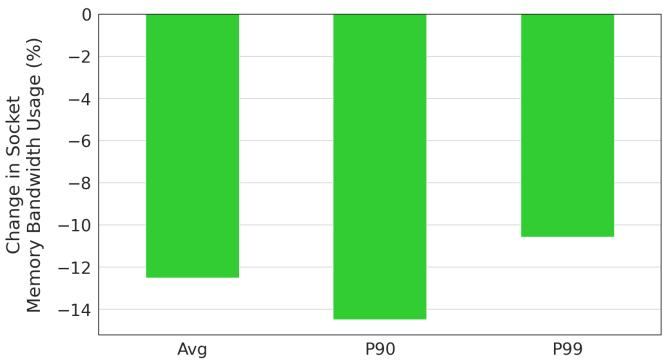
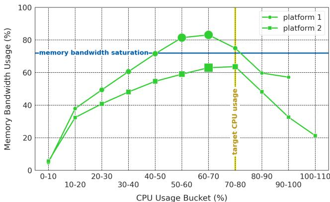
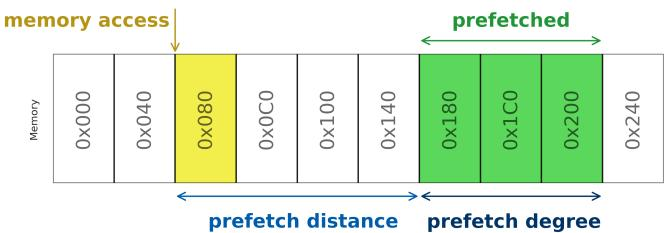
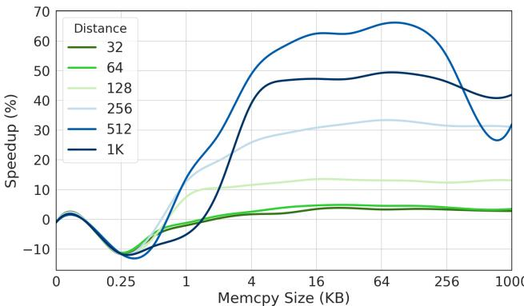
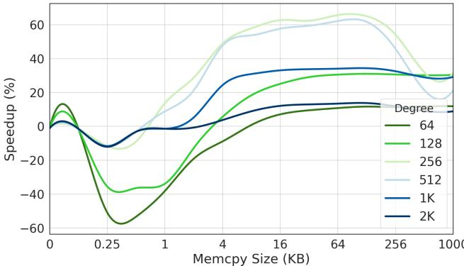
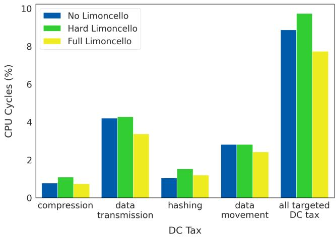

# Limoncello: Prefetchers for Scale 论文解析

## 0. 论文基本信息

**作者 (Authors)**

- Akanksha Jain
- Hannah Lin
- Carlos Villavieja
- Baris Kasikci
- Chris Kennelly
- Milad Hashemi
- Parthasarathy Ranganathan

**发表期刊/会议 (Journal/Conference)**

- 29th ACM International Conference on Architectural Support for Programming Languages and Operating Systems, Volume 3 (ASPLOS ’24)

**发表年份 (Publication Year)**

- 2024

______________________________________________________________________

## 1. 摘要

**目的**

- 解决在**高利用率、资源受限**的大型数据中心环境中，传统**硬件预取器 (hardware prefetchers)** 因过度消耗**内存带宽 (memory bandwidth)** 而导致**内存延迟 (memory latency)** 增加、系统性能下降的问题。
- 提出一种无需硬件修改的软件方案，在高带宽压力下通过动态切换预取策略，实现**内存延迟**与**缓存未命中率 (cache miss rate)** 之间的更优权衡。

**方法**

- Limoncello 系统包含两个核心组件：**Hard Limoncello** 和 **Soft Limoncello**。
- **Hard Limoncello (硬件预取器动态调控)**:
    - 基于**socket级内存带宽遥测数据**，设计了一个带有**滞后性 (hysteresis)** 的状态机控制器。
    - 当内存带宽利用率超过**80%** 的饱和阈值时，通过写入**MSR (Model-Specific Registers)** **禁用硬件预取器**；当利用率降至**60%** 以下时，重新启用。
    - 

*Figure 8. State diagram of Hard Limoncello controller for modulating hardware prefetchers. Green (lighter) indicates hardware prefetchers are off, blue (darker) that they are on.*

- **Soft Limoncello (精准软件预取)**:
    - 利用大规模**硬件消融研究 (hardware ablation study)**，在禁用硬件预取器的机器上进行**全舰队性能分析 (fleetwide profiling)**，识别出对硬件预取最敏感的函数。
    - 发现**数据中心税 (data center tax)** 函数（如压缩、哈希、数据传输、memcpy）是主要的性能回退来源，也是理想的软件预取目标。
    - 

*Figure 11. Change in CPU cycles (%) from Hard Limoncello. Functions that regress in performance when hardware prefetchers are disabled show an increase in CPU cycles (green) and an increase in LLC MPKI (blue). Data center tax functions in particular show performance regressions from disabling hardware prefetchers while other functions tend to improve in performance and decrease in cycles and MPKI.*

- 针对这些函数，通过微基准测试和负载测试，精细调优**预取地址 (prefetch address)**、**预取距离 (prefetch distance)** 和**预取度 (prefetch degree)** 等参数。
- 

*Figure 15. Soft Limoncello memcpy microbenchmarking.*

**结果**

- 在 Google 生产舰队的大规模部署评估中，Limoncello 取得了显著成效：
    - **应用吞吐量 (application throughput)** 在高 CPU 利用率（70%-80%）下**提升了 10%**。
    - **内存延迟**显著降低，其中 L3 延迟的**中位数减少了 13%**，P99 延迟**减少了 10%**。
    - **Socket 内存带宽**平均**减少了 15%**，饱和的 socket 数量**减少了近 8%**。
    - 成功将服务器的**CPU 利用率瓶颈**从原来的 40-50% 提升至目标的 **70-80%** 区间。
- 关键性能指标对比如下表所示：

| 指标                  | 改进幅度            |
| :-------------------- | :------------------ |
| **应用吞吐量**        | **+10%**            |
| **内存延迟 (中位数)** | **-13%**            |
| **内存延迟 (P99)**    | **-10%**            |
| **Socket 内存带宽**   | **-15%**            |
| **CPU 利用率上限**    | **40-50% → 70-80%** |

- 

*Figure 16. Limoncello application throughput gain. Application throughput increases by 6-13% increase, dependent on the CPU utilization level of the machines.*

- 

*Figure 17. Limoncello memory latency reduction. Memory latency reduces by 13% in the median and 10% in the P99.*

- 

*Figure 18. Limoncello socket bandwidth usage reduction. Average socket bandwidth reduces by 15%.*

- 

*Figure 19. Increase in CPU utilization due to Limoncello. Before Limoncello, memory bandwidth saturation was reached in the 40-50% CPU utilization band (Figure 4), but with Limoncello memory bandwidth saturation is not met until the 70-80% band. Sizes of the markers are in proportion to the fraction of platform servers in the CPU usage bucket.*

**结论**

- 在大规模、高利用率的数据中心场景下，传统的硬件预取器设计哲学（优先考虑覆盖率而非带宽效率）已不再适用，甚至会成为性能瓶颈。
- **硬件与软件协同的预取策略**（即 Limoncello）能够有效解决这一问题。通过在高带宽压力下**禁用低效的硬件预取**，并辅以**针对关键“数据中心税”函数的精准软件预取**，可以在不牺牲缓存命中率的前提下，大幅降低内存延迟并提升系统整体吞吐量。
- 该工作证明了**垂直整合 (vertical integration)** 和**软件定义的硬件调控**在现代数据中心优化中的巨大潜力，并为未来的**硬件-软件接口 (Hardware-Software Interfaces)** 设计指明了新方向。

______________________________________________________________________

## 2. 背景知识与核心贡献

**研究背景**

- 现代超大规模数据中心面临严重的 **内存墙 (memory wall)** 问题，**内存延迟**占用了近 **40%** 的CPU周期，成为主要性能瓶颈。
- 传统的 **硬件预取器 (hardware prefetchers)** 在设计时通常针对如 SPEC 等基准测试套件进行优化，这些场景通常 **内存带宽充裕**。
- 然而，在真实的数据中心环境中，系统长期运行在 **高内存带宽利用率** 状态下。在此场景中，激进的硬件预取器会产生大量 **不准确的预取请求**，不仅浪费宝贵的内存带宽，还会因 **队列延迟增加** 而显著 **恶化内存延迟**。
- 同时，**内存带宽/核心** 的硬件发展趋势已趋于停滞，而工作负载的 **内存带宽需求** 却在持续增长，导致服务器在达到目标 **CPU利用率 (70-80%)** 前就因内存带宽饱和而无法调度更多任务。

*Figure 2. Memory bandwidth per core has plateaued over several generations of server CPUs.*

*Figure 3. Average memory bandwidth usage of fleet workloads has increased over the last 4 years. Each point in the graph shows memory bandwidth usage per compute unit averaged across all workloads in the fleet.*

*Figure 4. Memory bandwidth can saturate with just 50% CPU utilization in a bandwidth-bound platform. Sizes of the markers are in proportion to the number of platform servers in the CPU usage bucket.*

**研究动机**

- 研究团队通过在Google数万台机器上进行实验发现，**禁用硬件预取器** 虽然会导致 **LLC miss rate (缓存未命中率) 上升约20%**，却能带来 **15%的内存延迟降低** 和 **11.2%-15.7%的内存带宽节省**。
- 这揭示了一个关键矛盾：在 **低带宽利用率** 场景下，应优化 **缓存命中率**；而在 **高带宽利用率** 场景下（数据中心常态），应优先优化 **内存延迟**。
- 传统的 **软件预取 (software prefetching)** 方法依赖于有代表性的基准测试，这在工作负载和输入极其多样化的大型生产集群中难以实现。
- 因此，需要一种能够 **动态适应** 系统负载状态，并结合 **硬件与软件优势** 的新型预取方案。

*Figure 1. Average load-to-use latency per DRAM request reduces by 15% when hardware prefetchers are disabled. Data is gathered using the Intel MLC tool [10].*

*Table 1. Disabling hardware prefetchers reduces both average and tail memory bandwidth.*

**核心贡献**

- 提出并实现了 **Limoncello**，一个纯软件的、可大规模部署的动态预取控制系统，无需任何硬件修改。
- **Limoncello 由两部分组成**：
    - **Hard Limoncello**: 基于实时 **socket级内存带宽遥测** 数据，动态地 **启用或禁用硬件预取器**。当带宽利用率超过阈值（如80%）时禁用以降低延迟，低于另一阈值（如60%）时重新启用以提高命中率，并引入 **滞后机制 (hysteresis)** 避免频繁切换。
    - **Soft Limoncello**: 通过大规模 **硬件消融研究 (hardware ablation study)**，精准识别出对硬件预取最敏感的“**数据中心税 (data center tax)**”函数（如压缩、哈希、数据传输、memcpy），并在这些函数中 **手动插入精细调优的软件预取指令**，以弥补禁用硬件预取后的性能损失。
- 在Google生产集群的大规模部署评估表明，Limoncello取得了显著成效：
    - **应用吞吐量提升10%**。
    - **内存延迟降低15%**（中位数降低13%，P99降低10%）。
    - **Socket内存带宽平均减少15%**，使服务器能在更高CPU利用率（70-80%）下稳定运行。

*Figure 5. Memory bandwidth usage on SPEC with and without hardware prefetching over 3 generations of a server platform. We see a 30-40% increase in memory bandwidth usage when hardware prefetching is enabled.*

*Figure 16. Limoncello application throughput gain. Application throughput increases by 6-13% increase, dependent on the CPU utilization level of the machines.*

*Figure 17. Limoncello memory latency reduction. Memory latency reduces by 13% in the median and 10% in the P99.*

*Figure 18. Limoncello socket bandwidth usage reduction. Average socket bandwidth reduces by 15%.*

______________________________________________________________________

## 3. 核心技术和实现细节

### 0. 技术架构概览

**整体技术架构**

Limoncello 是一个**软件为中心**的系统，通过动态协同 **Hard Limoncello**（硬件预取器调控）和 **Soft Limoncello**（针对性软件预取）两个组件，在无需任何硬件修改的前提下，优化高利用率数据中心环境下的内存性能。

- **核心目标**：在**内存带宽受限**的高负载场景下，通过关闭低效的硬件预取器来降低**内存延迟**，并辅以精准的软件预取来维持关键函数的**缓存命中率**，从而提升**应用吞吐量**。
- **决策依据**：系统依赖于**全舰队范围**（fleetwide）的实时遥测数据和历史性能剖析，实现了对工作负载特性的深刻理解与动态响应。

**Hard Limoncello: 动态硬件预取器调控**

该组件负责根据实时内存带宽压力，动态开关整个 CPU socket 的硬件预取器。

- **触发条件**：基于每秒采集的 **socket-level 内存带宽遥测**数据。
- **控制逻辑**：采用带有**滞后**（hysteresis）的双阈值状态机，避免因带宽波动导致频繁切换。
    - 当内存带宽持续超过**上限阈值**（例如 **80%** 的平台饱和带宽）时，**禁用**硬件预取器。
    - 当内存带宽持续低于**下限阈值**（例如 **60%** 的平台饱和带宽）时，**重新启用**硬件预取器。
- **执行方式**：通过向 CPU 的 \*\*Model-Specific Registers \*\*(MSRs) 写入特定值来实现硬件预取器的开关。
- **设计动机**：如

*Figure 1. Average load-to-use latency per DRAM request reduces by 15% when hardware prefetchers are disabled. Data is gathered using the Intel MLC tool [10].*

所示，在高带宽利用率下，硬件预取器会显著增加 **load-to-use latency**；而禁用它们可以带来 **15%** 的延迟降低。

*Figure 6. Limoncello disables hardware prefetchers when memory bandwidth utilization is high to optimize for memory latency.*

**Soft Limoncello: 精准软件预取注入**

该组件旨在弥补 Hard Limoncello 关闭硬件预取器后，对特定关键函数造成的缓存缺失惩罚。

- **目标识别**：通过大规模的**硬件消融实验**（ablation study），对比开启/关闭硬件预取器时的函数级性能剖析数据，识别出对硬件预取最敏感的“**data center tax functions**”。
    - 这些函数包括：**Compression**（压缩）、**Data transmission**（数据传输）、**Hashing**（哈希）和 **Data movement**（如 `memcpy`）。
    - 如

*Figure 10. Application throughput based on different Hard Limoncello configurations. ?? /?? indicates the lower (?? %) and upper (?? %) memory bandwidth thresholds in the configuration. Thresholds are expressed as a percentage of memory bandwidth saturation.*

和

*Figure 11. Change in CPU cycles (%) from Hard Limoncello. Functions that regress in performance when hardware prefetchers are disabled show an increase in CPU cycles (green) and an increase in LLC MPKI (blue). Data center tax functions in particular show performance regressions from disabling hardware prefetchers while other functions tend to improve in performance and decrease in cycles and MPKI.*

所示，这些函数在硬件预取关闭后表现出显著的 **CPU cycles** 和 **LLC MPKI** 增加。

- **预取策略**：针对已识别的目标函数，手动插入软件预取指令，并精细调优三个关键参数：
    - **Prefetch address**（预取地址）：选择最能受益的内存访问点。
    - **Prefetch distance**（预取距离）：决定提前多少字节发起预取。
    - **Prefetch degree**（预取度）：决定一次预取多少连续数据。
- **调优方法**：结合**舰队级剖析数据**（如 `memcpy` 的参数大小分布，见 ）和**微基准测试**（microbenchmarks），迭代寻找最优参数组合。

**协同工作流程**

Limoncello 的两个组件协同工作，形成一个闭环的动态优化系统。

1. **监控阶段**：系统持续监控每个 socket 的内存带宽利用率。
1. **决策与执行**（Hard Limoncello） 根据预设阈值，动态开关硬件预取器。在低负载时利用硬件预取，在高负载时关闭以节省带宽、降低延迟。
1. **补偿与优化**（Soft Limoncello） 在硬件预取器被关闭的高负载场景下，由预先植入的软件预取指令为关键的“data center tax functions”提供精准的数据预取，防止其性能严重退化。
1. **效果**：如

*Figure 16. Limoncello application throughput gain. Application throughput increases by 6-13% increase, dependent on the CPU utilization level of the machines.*

、

*Figure 17. Limoncello memory latency reduction. Memory latency reduces by 13% in the median and 10% in the P99.*

和

*Figure 18. Limoncello socket bandwidth usage reduction. Average socket bandwidth reduces by 15%.*

所示，该架构最终实现了 **10%** 的应用吞吐量提升、**15%** 的内存延迟降低和 **15%** 的 socket 带宽消耗减少。

### 1. Hard Limoncello

**核心机制与实现原理**

- **Hard Limoncello** 的核心是一个**软件控制器 (software controller)**，它通过动态地启用或禁用 CPU 的**硬件预取器 (hardware prefetchers)** 来优化系统在高内存带宽利用率下的性能。
- 其基本原理源于一个关键观察：在**内存带宽稀缺**的环境中（如大型数据中心的高负载时段），硬件预取器虽然能降低**缓存未命中率 (cache miss rate)**，但其产生的额外内存流量会加剧内存子系统的拥塞，从而显著增加**内存延迟 (memory latency)** 和**加载到使用延迟 (load-to-use latency)**。图1清晰地展示了这一现象，在高带宽利用率下，开启硬件预取器（蓝色线）比关闭时（橙色线）的延迟高出近一倍。
- 因此，Hard Limoncello 的策略是：在**低内存带宽利用率**时，保留硬件预取器以优化缓存命中；在**高内存带宽利用率**时，**禁用硬件预取器**以释放宝贵的内存带宽、降低延迟。

**算法流程与控制逻辑**

- 控制器的决策基于**socket-level**（套接字级别）的**内存带宽遥测数据 (telemetry)**，该数据通过 `perf` 工具每秒采集一次。
- 为了避免因内存带宽的短期波动（如图7所示）而导致预取器状态频繁切换，控制器引入了**迟滞机制 (hysteresis)**，具体体现在两个方面：
    - **双阈值设计**: 设置一个较高的**上阈值 (upper threshold)** 用于触发禁用操作，和一个较低的**下阈值 (lower threshold)** 用于触发重新启用操作。
    - **持续时间要求**: 内存带宽必须在上阈值之上（或下阈值之下）**持续一段预设的时间**，控制器才会执行状态切换。
- 整个控制逻辑被封装在一个**状态机 (state machine)** 中（如图8所示），确保了状态转换的平滑和稳定。

*Figure 7. Memory bandwidth variability in a machine.*

*Figure 8. State diagram of Hard Limoncello controller for modulating hardware prefetchers. Green (lighter) indicates hardware prefetchers are off, blue (darker) that they are on.*

- **具体执行流程**如下：
    - 当内存带宽利用率**持续超过上阈值**时，控制器向 CPU 的**模型特定寄存器 (Model-Specific Registers, MSRs)** 写入特定值，以**禁用**该 socket 上的所有硬件预取器。
    - 预取器一旦被禁用，即使带宽回落到上阈值以下，也不会立即重新开启。
    - 只有当带宽利用率**持续低于下阈值**时，控制器才会再次写入 MSR，**重新启用**硬件预取器。
- 图9提供了一个直观的时间线示例，展示了这种带有迟滞的开关行为。

*Figure 9. Hardware prefetcher state over time. The green lines in the figure show when hardware prefetchers are disabled. When machine load exceeds an upper threshold, hardware prefetchers are disabled and remain disabled until machine load returns below a lower threshold.*

**参数设置与阈值确定**

- 上、下阈值并非随意设定，而是通过在 Google 生产集群中进行大规模的**硬件消融研究 (hardware ablation study)** 确定的。
- 实验方法是在数万台机器上部署不同阈值组合的 Hard Limoncello，并监控其对**应用吞吐量 (application throughput)** 的影响。
- 最终，阈值被定义为平台**内存带宽饱和阈值 (memory bandwidth saturation threshold)** 的一个百分比。该饱和阈值是在机器资格认证过程中确定的，超过此阈值，内存延迟会急剧上升。
- 如图10所示，经过实验分析，**80%** 作为上阈值、**60%** 作为下阈值的配置（即 60/80 配置）能带来最佳的应用吞吐量提升。

*Figure 10. Application throughput based on different Hard Limoncello configurations. ?? /?? indicates the lower (?? %) and upper (?? %) memory bandwidth thresholds in the configuration. Thresholds are expressed as a percentage of memory bandwidth saturation.*

**输入、输出及在整体系统中的作用**

- **输入**: 每秒采集的 socket 级内存带宽利用率数据。
- **输出**: 对 CPU MSR 的写入指令，用于控制硬件预取器的开关状态。
- **在 Limoncello 整体架构中的作用**:
    - Hard Limoncello 是整个系统的**第一道防线**，负责在宏观层面解决高负载下的内存带宽争用问题。
    - 它通过牺牲一部分缓存命中率（因为禁用了硬件预取器），换取了更低的内存延迟和更高的有效内存带宽容量（如图4和图19所示，这使得服务器 CPU 利用率可以从 40-50% 提升至目标的 70-80%）。
    - 然而，禁用硬件预取器会导致某些对预取敏感的函数（如数据移动、压缩等“数据中心税”函数）性能下降。这部分损失由 **Soft Limoncello** 组件通过精准插入**软件预取 (software prefetching)** 指令来弥补，从而实现了硬件与软件协同的最优效果。

### 2. Soft Limoncello

**Soft Limoncello 的实现原理与目标函数识别**

- Soft Limoncello 的核心目标是在 **Hard Limoncello** 关闭硬件预取器后，通过精准的软件预取（software prefetching）来补偿特定关键函数因缓存未命中率（MPKI）上升而导致的性能损失。
- 其实现不依赖于传统的、基于代表性基准测试（representative benchmarks）的 profile-guided optimization (PGO)，因为这在 Google 大规模、高多样性的生产环境中难以奏效。
- 取而代之的是一种创新的、基于 **fleetwide hardware ablation study**（全舰队硬件消融研究）的方法：
    - 在大规模实验集群上关闭硬件预取器。
    - 利用 Google 内部的 **global profiling tool** 持续采集程序计数器（PC）、CPU 使用率和 LLC（Last Level Cache）未命中数据。
    - 通过对比开启/关闭硬件预取器时各函数的性能差异（特别是 CPU cycles 和 LLC MPKI），识别出对硬件预取高度依赖的“**prefetch-friendly**”函数。
- 分析发现，性能回退最严重的函数主要集中在所谓的“**data center tax**”（数据中心税）操作上，这些函数包括：
    - **Compression/Decompression**：处理连续内存块，访问模式可预测。
    - **Data transmission**（如 RPC 序列化/反序列化）：涉及可预测的内存读写。
    - **Hashing**：对数据块进行预定义序列的操作。
    - **Data movement**（如 `memcpy`, `memmove`）：对连续内存区域进行操作。

*Figure 10. Application throughput based on different Hard Limoncello configurations. ?? /?? indicates the lower (?? %) and upper (?? %) memory bandwidth thresholds in the configuration. Thresholds are expressed as a percentage of memory bandwidth saturation.*

*Figure 11. Change in CPU cycles (%) from Hard Limoncello. Functions that regress in performance when hardware prefetchers are disabled show an increase in CPU cycles (green) and an increase in LLC MPKI (blue). Data center tax functions in particular show performance regressions from disabling hardware prefetchers while other functions tend to improve in performance and decrease in cycles and MPKI.*

*Figure 12. Aggregated change in CPU cycles (%) from Hard Limoncello. Data center tax functions (green) increased in CPU cycles under Hard Limoncello. In contrast, overall nondata center tax functions (blue) decreased in cycles.*

**软件预取器的设计空间与参数调优**

- 软件预取的有效性高度依赖于三个关键设计参数的精细调整：
    - \*\*Prefetch address \*\*(预取地址)：必须精确指向即将被使用的数据。错误的地址会导致浪费带宽。目标地址通常来自函数的调用参数（如 `memcpy` 的源指针）。
    - \*\*Prefetch distance \*\*(预取距离)：指在实际使用前多少指令或字节发出预取请求。距离太近会导致预取不及时（untimely），太远则可能导致数据在缓存中被替换（stale）。
    - \*\*Prefetch degree \*\*(预取度)：指一次预取操作获取的数据量（例如，多少个 cache line）。度太小收益低，太大则可能引入不必要的数据，浪费带宽。
- 为了确定这些参数，Limoncello 团队采用了以下流程：
    - 利用 fleetwide profiling 工具收集目标函数（如 `memcpy`）的**调用参数大小分布**，以识别值得优化的“长尾”大尺寸操作。
    - 针对这些大尺寸操作，在**微基准测试**（microbenchmarks，如 LLVM libc 套件）和**负载测试**（load tests）上进行广泛的参数扫描（sweeping）。
    - 迭代测试不同的地址、距离和度的组合，选择能带来**正向性能提升**的配置。

*Figure 14. memcpy argument size distribution. The chart shows the probability density function (PDF) of the number of times each copy size appears in the profiling data. Most copy sizes are small.*

*Figure 13. Software prefetch instructions act on addresses at a distance and can prefetch different degrees of data.*

**以 memcpy 为例的具体实现**

- `memcpy` 被识别为一个典型的 prefetch-friendly 函数，因为它对连续内存进行操作，且软件可以直接获知访问的地址和长度。
- Profiling 数据显示，大多数 `memcpy` 调用尺寸很小，但导致性能回退的工作负载往往有**更大**的平均拷贝尺寸（比非回退工作负载大 26%）。
- 因此，软件预取仅针对**超过特定阈值的大尺寸** `memcpy` 调用进行插入，以避免对小拷贝造成不必要的开销。
- 通过在 LLVM libc 微基准上固定一个参数并扫描另一个参数，团队找到了最优的预取距离和度。

*(b) Microbenchmark exercising different prefetch degrees. Prefetching is fixed at a distance of 512 bytes.*

*Figure 15. Soft Limoncello memcpy microbenchmarking.*

**输入输出关系及在整体系统中的作用**

- **输入**：
    - 来自 Hard Limoncello 的信号：硬件预取器已被关闭。
    - Fleetwide profiling 数据：用于识别目标函数及其调用特征（如参数大小）。
    - 微基准和负载测试结果：用于确定最优的预取参数。
- **输出**：
    - 在特定库函数（如 glibc 中的 `memcpy`）的源代码中**静态插入**经过调优的软件预取指令（如 x86 的 `prefetcht0`）。
- **在整体系统中的作用**：
    - **维持低缓存未命中率**：在硬件预取器关闭的高带宽压力场景下，通过精准的软件预取，有效控制了关键“数据中心税”函数的 LLC MPKI，防止了性能大幅回退。
    - **实现硬件-软件协同**：Hard Limoncello 负责宏观层面的带宽管理（关掉全局但低效的硬件预取），Soft Limoncello 负责微观层面的性能保障（为最关键的少数函数提供高效、精准的软件预取）。
    - **最终效果**：评估数据显示，Soft Limoncello 成功消除了 Hard Limoncello 单独部署时观察到的工作负载性能回退，并将目标函数的 CPU cycles 显著降低。

*Figure 20. Software prefetcher impact in Limoncello. The y-axis shows the portion of fleetwide cycles spent in the respective function categories. The center bar (green) shows Hard Limoncello deployed without any software prefetchers. Adding software prefetchers into Limoncello lowered CPU cycles spent in targeted functions by 2% (yellow).*

### 3. 基于大规模硬件消融研究的目标识别方法

**核心方法论：基于大规模硬件消融研究的目标识别**

Limoncello 项目的核心创新之一在于其识别软件预取目标的方法。该方法摒弃了传统依赖代表性基准测试（benchmark）的 Profile-Guided Optimization (PGO) 范式，转而采用一种在超大规模生产环境中可行的、数据驱动的硬件消融研究（hardware ablation study）。

- **消融实验设计**：

    - 在 Google 数据中心舰队中，选取**数十万台**具有代表性的机器（覆盖不同地理区域和多样化工作负载）。
    - 将这些机器分为**实验组**和**对照组**。
    - **实验组**：在特定条件下（由 Hard Limoncello 控制）**禁用所有硬件预取器**。
    - **对照组**：保持硬件预取器始终开启，且不添加任何软件预取。
    - 实验持续进行**数周**，以捕获全天候及跨周的工作负载变化。

- **数据采集与分析**：

    - 利用 Google 内部的**全局性能分析工具**（global profiling tool），该工具能够持续、低开销地采样整个舰队中应用程序的性能计数器。
    - 采集的关键指标包括：**程序计数器**（program counter）、**CPU 周期消耗**、**最后一级缓存**（LLC）。
    - 通过对比实验组（无硬件预取）和对照组（有硬件预取）的函数级性能数据，精确量化每个函数在失去硬件预取支持后的性能退化程度。

- **目标函数筛选标准**：

    - **性能显著退化**：函数在实验组中表现出**CPU 周期显著增加**（即性能下降）。
    - **缓存缺失率激增**：上述性能退化主要由 **LLC MPKI**（Misses Per Kilo Instructions）大幅上升引起，表明该函数高度依赖预取来隐藏内存延迟。
    - **高调用热度**：该函数必须是“hot function”，即在整个舰队中消耗大量 CPU 周期，优化它能带来全局性收益。
    - 分析结果揭示，满足以上条件的函数绝大多数属于所谓的“**data center tax functions**”（数据中心税函数）。

*Figure 11. Change in CPU cycles (%) from Hard Limoncello. Functions that regress in performance when hardware prefetchers are disabled show an increase in CPU cycles (green) and an increase in LLC MPKI (blue). Data center tax functions in particular show performance regressions from disabling hardware prefetchers while other functions tend to improve in performance and decrease in cycles and MPKI.*

*Figure 12. Aggregated change in CPU cycles (%) from Hard Limoncello. Data center tax functions (green) increased in CPU cycles under Hard Limoncello. In contrast, overall nondata center tax functions (blue) decreased in cycles.*

**识别出的关键目标：数据中心税函数**

通过上述消融研究，论文明确指出了四类最适合作为软件预取目标的函数：

- \*\*Compression/Decompression \*\*(压缩/解压缩)：处理连续数据块，内存访问模式高度可预测。
- \*\*Data transmission \*\*(数据传输)：如 RPC 的序列化/反序列化，涉及对连续内存地址的读写。
- \*\*Hashing \*\*(哈希)：算法通常按预定顺序处理数据块，产生规则的内存访问流。
- \*\*Data movement \*\*(数据移动)：如 `memcpy` 和 `memmove`，直接操作大段连续内存。

这些函数之所以成为理想目标，原因如下：

- 它们被封装在**标准库函数**中，便于集中优化。
- 它们占据了数据中心 **30-40%** 的 CPU 周期，优化回报极高。
- 函数签名（如 `memcpy(void* dest, const void* src, size_t n)`）**直接暴露了将要访问的数据地址和总量**，使得软件预取可以做到极其精准，避免了硬件预取器所需的“warm-up”学习期和潜在的过度预取问题。

**输入输出关系及在整体架构中的作用**

- **输入**：

    - **原始输入**：来自消融实验的海量、函数级性能剖析数据（CPU cycles, LLC MPKI）。
    - **处理逻辑**：通过对比分析，筛选出因禁用硬件预取而性能显著退化的热点函数。

- **输出**：

    - **明确的优化目标列表**：即上述四类“数据中心税函数”。
    - **精细化的预取参数指导**：对于每个目标函数（如 `memcpy`），剖析数据还提供了调用参数（如拷贝大小）的分布信息，这直接指导了后续 Soft Limoncello 设计中的**预取距离**（prefetch distance）和**预取度**（prefetch degree）的选择。

- **在 Limoncello 整体架构中的作用**：

    - 该方法是 **Soft Limoncello 组件的基石**。它解决了“在哪里插入软件预取”这一最关键也最困难的问题。
    - 通过精准定位少数几个高影响力、高收益的函数，使得软件预取的部署变得**可扩展**（scalable）和**高效**，避免了盲目地在整个代码库中插入预取指令所带来的维护复杂性和潜在性能损失。
    - 它实现了 **Hard Limoncello 和 Soft Limoncello 的完美协同**：Hard Limoncello 在高带宽压力下关闭硬件预取以降低系统延迟，而 Soft Limoncello 则通过针对性地补偿关键函数的缓存缺失，确保了整体应用吞吐量的净提升。

### 4. 软件预取参数调优（地址、距离、度）

**软件预取参数调优的核心方法论**

Limoncello 的 Soft Limoncello 组件通过一套严谨的数据驱动流程，为 `memcpy` 等数据密集型函数确定最优的软件预取参数。该流程结合了**舰队范围的性能分析 (fleetwide profiling)** 与**针对性的微基准测试 (microbenchmarking)**，以解决在大规模、多样化生产环境中进行预取优化的挑战。

- **目标函数筛选**：首先，通过在数万机器上进行**硬件消融实验 (hardware ablation study)**，即全局关闭硬件预取器，利用全局性能分析工具监控各函数的 **CPU cycles** 和 **LLC MPKI (Last-Level Cache Misses Per Kilo Instructions)** 变化。
    - 分析发现，**数据中⼼税 (data center tax)** 函数（如压缩、哈希、数据传输、`memcpy`/`memmove`）在硬件预取器关闭后表现出显著的性能回归（cycles 增加，MPKI 上升），被识别为**预取友好 (prefetch-friendly)** 的关键优化目标。
    - 

*Figure 10. Application throughput based on different Hard Limoncello configurations. ?? /?? indicates the lower (?? %) and upper (?? %) memory bandwidth thresholds in the configuration. Thresholds are expressed as a percentage of memory bandwidth saturation.*

-

*Figure 11. Change in CPU cycles (%) from Hard Limoncello. Functions that regress in performance when hardware prefetchers are disabled show an increase in CPU cycles (green) and an increase in LLC MPKI (blue). Data center tax functions in particular show performance regressions from disabling hardware prefetchers while other functions tend to improve in performance and decrease in cycles and MPKI.*

- **参数设计空间定义**：针对选定的目标函数，优化聚焦于三个核心参数：
    - **预取地址 (Prefetch address)**：确定需要插入预取指令的确切内存位置。选择标准是该地址的访问必须导致高延迟的缓存未命中，且其访问模式可预测。
    - **预取距离 (Prefetch distance)**：指预取指令执行时，距离实际数据使用点的**提前量**（通常以字节或缓存行为单位）。距离过短会导致预取不及时，过长则可能导致数据在使用前被逐出缓存。
    - **预取度 (Prefetch degree)**：指单次预取操作所获取的**数据量**（例如，一次预取多少个连续的缓存行）。度太小无法覆盖后续访问，太大则会浪费宝贵的内存带宽。

**基于数据的参数决策流程**

决策过程并非凭空猜测，而是严格依赖从生产环境中收集的真实数据。

- **利用调用参数分布指导优化**：
    - 对于 `memcpy` 这类函数，其性能对拷贝数据的大小高度敏感。舰队范围的性能分析工具收集了这些函数的**调用参数大小分布**。
    - 分析显示，虽然大多数 `memcpy` 调用处理的是小数据块，但导致性能回归的工作负载往往涉及**更大的拷贝尺寸**（平均大 26%）。由于硬件预取器需要“热身”时间，对大数据块更有效，因此软件预取也应重点优化大数据场景。
    - 

*Figure 14. memcpy argument size distribution. The chart shows the probability density function (PDF) of the number of times each copy size appears in the profiling data. Most copy sizes are small.*

- **微基准测试驱动的参数搜索**：

    - 基于上述洞察，团队构建了专门的微基准测试（如 LLVM libc 微基准套件），用于系统性地搜索最优参数组合。
    - 测试策略采用**控制变量法**：
        - 固定**预取度**（例如 256 字节），扫描不同的**预取距离**，找到使性能最佳的距离值。
        - 固定**预取距离**（例如 512 字节），扫描不同的**预取度**，找到使性能最佳的度值。
    - 

-

*(b) Microbenchmark exercising different prefetch degrees. Prefetching is fixed at a distance of 512 bytes.*

- 最终的性能验证在更接近真实负载的**负载测试 (load tests)** 中完成，确保微基准中的收益能在生产环境中复现。

**输入输出关系及整体作用**

- **输入**：

    - **舰队级性能画像**：来自消融实验的函数级 CPU cycles 和 LLC MPKI 数据，用于识别优化目标。
    - **调用上下文数据**：目标函数（如 `memcpy`）的调用参数（如 size）的统计分布。
    - **微架构指标**：在不同预取配置下，微基准和负载测试产生的吞吐量、延迟等性能数据。

- **输出**：

    - **精确的代码补丁**：在目标库函数（如 glibc 中的 `memcpy`）的特定位置，插入带有**最优距离和度**的软件预取指令（如 x86 的 `prefetcht0`）。
    - **条件化预取逻辑**：通常只对超过特定大小阈值的调用启用软件预取，以避免对小数据块造成不必要的开销。

- **在 Limoncello 整体架构中的作用**：

    - **弥补硬件预取的空白**：当 Hard Limoncello 在高带宽利用率下关闭硬件预取器以降低内存延迟时，Soft Limoncello 通过精准的软件预取，**维持了关键函数的低缓存未命中率 (MPKI)**，防止了性能回退。
    - **实现协同增效**：这种软硬协同的策略，使得系统在高负载下既能享受**更低的内存延迟**（来自关闭硬件预取），又能保持**较高的缓存效率**（来自精准的软件预取），最终实现了 **10% 的应用吞吐量提升**。
    - 

*Figure 20. Software prefetcher impact in Limoncello. The y-axis shows the portion of fleetwide cycles spent in the respective function categories. The center bar (green) shows Hard Limoncello deployed without any software prefetchers. Adding software prefetchers into Limoncello lowered CPU cycles spent in targeted functions by 2% (yellow).*

______________________________________________________________________

## 4. 实验方法与实验结果

**实验设置**

- **部署环境**: 实验在 **Google 的生产数据中心集群**中进行，每台机器运行**数百个服务**，由集中式调度器管理。评估基于真实的生产流量。
- **硬件平台**: 评估使用了两个不同代际的大型 **x86 out-of-order multicore** 平台（Platform 1 和 Platform 2）。
- **Hard Limoncello 配置**:
    - 基于第3节描述的硬件消融研究，将硬件预取器的开关阈值设定为平台内存带宽饱和阈值的 **80% (上限)** 和 **60% (下限)**。
    - 使用一个带有**滞后效应 (hysteresis)** 的控制器来动态调节硬件预取器状态，避免因短期波动导致频繁切换。
- **Soft Limoncello 配置**:
    - 利用消融研究中的性能分析数据，识别出 **data center tax functions**（如压缩、哈希、数据传输、memcpy）作为软件预取的目标。
    - 通过微基准测试（如 LLVM libc microbenchmark suite）和负载测试，为这些目标函数精心调优**预取距离 (prefetch distance)** 和**预取度 (prefetch degree)**。
- **评估指标**:
    - **机器级指标**: 内存带宽、**DRAM 延迟**、CPU 利用率。
    - **工作负载级指标**: **应用吞吐量 (application throughput)**，即单位时间内每个服务处理的请求数。

**结果数据**

- **应用吞吐量**: Limoncello 在高利用率场景下显著提升了性能。在 **70% 和 80% CPU 利用率**下，应用吞吐量提升了 **10%**。在 60% 利用率下，性能没有下降。

*Figure 16. Limoncello application throughput gain. Application throughput increases by 6-13% increase, dependent on the CPU utilization level of the machines.*

- **内存延迟**: Limoncello 有效降低了内存延迟。**L3 延迟**的中位数减少了 **13%**，P99 延迟减少了 **10%**。

*Figure 17. Limoncello memory latency reduction. Memory latency reduces by 13% in the median and 10% in the P99.*

- **内存带宽**: 插槽级别的内存带宽平均减少了 **15%**，达到饱和状态的插槽数量减少了近 **8%**。

*Figure 18. Limoncello socket bandwidth usage reduction. Average socket bandwidth reduces by 15%.*

- **CPU 利用率**: 部署 Limoncello 后，服务器能够突破原有的内存带宽瓶颈，在不牺牲性能的前提下，将 CPU 利用率从原来的 **40-50%** 提升至目标的 **70-80%** 区间。

*Figure 19. Increase in CPU utilization due to Limoncello. Before Limoncello, memory bandwidth saturation was reached in the 40-50% CPU utilization band (Figure 4), but with Limoncello memory bandwidth saturation is not met until the 70-80% band. Sizes of the markers are in proportion to the fraction of platform servers in the CPU usage bucket.*

- **Data Center Tax Functions**: 对于被识别出的四类关键函数，仅使用 Hard Limoncello 会导致其 CPU 周期增加，但加入 Soft Limoncello 后，成功抵消了这一负面影响，并进一步降低了这些函数的 CPU 周期开销约 **2%**。

*Figure 20. Software prefetcher impact in Limoncello. The y-axis shows the portion of fleetwide cycles spent in the respective function categories. The center bar (green) shows Hard Limoncello deployed without any software prefetchers. Adding software prefetchers into Limoncello lowered CPU cycles spent in targeted functions by 2% (yellow).*

**消融实验**

- **目的**: 消融实验是 Limoncello 设计和验证的核心，主要用于两个目的：(1) 量化硬件预取器在大规模生产环境中的真实影响；(2) 精准定位需要软件预取补偿的代码区域。
- **实验设计**:
    - 创建了两组各包含 **10,000 台**机器的实验组和对照组。
    - **实验组**: 运行 **Hard Limoncello**（即在高负载时禁用硬件预取器），**不添加任何软件预取**。
    - **对照组**: 保持所有硬件预取器**始终开启**。
    - 机器选择覆盖多个地理区域和多样化的工作负载，以确保结果的代表性。实验持续**两周**，以捕捉日间和周间的流量变化。
- **关键发现**:
    - **整体影响**: 禁用硬件预取器后，集群平均性能**下降了 5%**，但部分内存密集型应用（如搜索、ML 模型服务）的 QPS 却有显著提升（>10% 到 >30%）。这揭示了硬件预取器效果的**双重性**。
    - **函数级分析**: 通过全局性能分析工具，对比两组机器在函数粒度上的 **LLC MPKI (Last Level Cache Misses Per Kilo Instructions)** 和 CPU 周期。
        - 发现 **data center tax functions** 在硬件预取器关闭后，**MPKI 和 CPU 周期显著增加**，被归类为 **prefetch-friendly**。
        - 而其他许多函数则因**内存延迟降低和缓存污染减少**而性能提升，被归类为 **prefetch-unfriendly**。

*Figure 11. Change in CPU cycles (%) from Hard Limoncello. Functions that regress in performance when hardware prefetchers are disabled show an increase in CPU cycles (green) and an increase in LLC MPKI (blue). Data center tax functions in particular show performance regressions from disabling hardware prefetchers while other functions tend to improve in performance and decrease in cycles and MPKI.*

*Figure 12. Aggregated change in CPU cycles (%) from Hard Limoncello. Data center tax functions (green) increased in CPU cycles under Hard Limoncello. In contrast, overall nondata center tax functions (blue) decreased in cycles.*

- **带宽影响**: 消融实验数据（见表1）显示，禁用硬件预取器可将整个集群的平均内存带宽降低 **11.2%–15.7%**，对峰值和 P99 尾部带宽也有显著影响。

*Table 1. Disabling hardware prefetchers reduces both average and tail memory bandwidth.*

- **作用**: 该消融实验直接指导了 **Soft Limoncello** 的设计，明确了软件预取应精准地插入到哪些函数中，从而在享受 Hard Limoncello 带来的低延迟和低带宽优势的同时，避免了关键路径上的性能回退。

______________________________________________________________________
