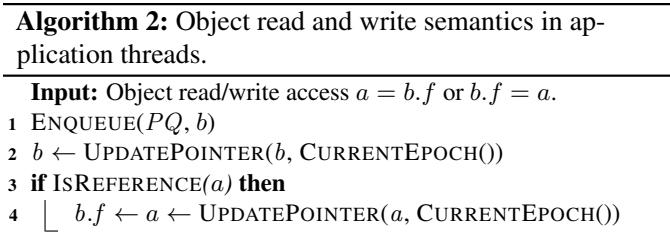
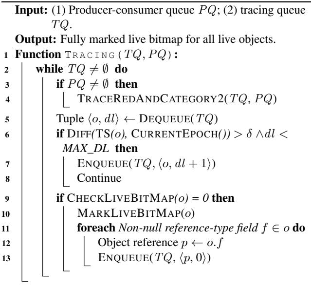

# MemLiner: Lining up Tracing and Application for a Far-Memory-Friendly Runtime 通俗讲解

### 0. 整体创新点通俗解读

**痛点直击 (The "Why")**

在现代数据中心，很多 Java/Scala 等托管语言（managed language）写的应用（比如 Spark、Cassandra）内存需求巨大，本地内存根本装不下。于是大家开始用 **far-memory**（远端内存）技术，把本地内存当缓存，不够就通过高速网络（如 RDMA）去远端服务器“换页”（swap）。这听起来很美，但有个致命问题：**垃圾回收器**（GC）。

- 应用程序线程访问内存是有规律的，比如顺序扫描一个大数组，这种模式很容易被 **prefetcher**（预取器，如 Leap）识别并提前把数据拉到本地，性能很好。
- 但与此同时，**GC 线程**（尤其是 G1、Shenandoah 这种并发 GC）在后台疯狂地做 **graph traversal**（图遍历），从根对象出发，递归地追踪所有存活对象。这个访问模式是典型的“指针追逐”（pointer-chasing），非常 **random**（随机）。
- 结果就是，从操作系统角度看，总的内存访问 = 应用的（可能很规整的）模式 + GC 的（完全随机的）模式。两者一混合，整个访问轨迹就变得一团糟。
- 这直接导致两个灾难性后果：
    - **资源竞争**：应用刚把一个页换进来，GC 线程马上把它踢出去；GC 刚为遍历换进一个页，应用又把它踢出去。双方互相“拆台”，导致 **local-memory misses**（本地内存缺失）暴增，频繁触发昂贵的远程交换。
    - **预取失效**：OS-level 的预取器（如 Leap）看到这种混合后的随机访问流，根本无法识别出任何有效模式，只能放弃预取或瞎猜，导致 **prefetching accuracy and coverage**（预取准确率和覆盖率）暴跌。

简单说，以前的 far-memory 系统只考虑了“应用”这一方，完全忽略了 GC 这个在托管语言里无处不在的“捣蛋鬼”，导致性能严重不达预期。

______________________________________________________________________

**通俗比方 (The Analogy)**

想象一下，你（应用程序）正在图书馆（本地内存）里专心致志地按顺序阅读一套百科全书（你的工作集）。图书馆管理员（OS 预取器）很聪明，看你翻到第5卷，就提前把第6、7卷从仓库（远端内存）调过来放你桌上，效率很高。

但这时，另一个图书整理员（GC 线程）冲了进来，他要检查哪些书是“活”的（还在被人看），哪些是“死”的（可以下架）。他的工作方式是从目录（roots）开始，看到目录里提到“量子物理”，就跑去拿《量子物理》这本书；翻开发现里面引用了《线性代数》，又跑去拿《线性代数》…… 他的路线完全随机，东奔西跑。

结果就是，你的桌子上堆满了整理员乱放的、你根本不需要的书，而你正要看的下一卷书却被他不小心放回了仓库。管理员也懵了，完全看不懂你们俩到底想干嘛，干脆不帮你预取了。你们俩非但没配合好，反而把对方的工作都搞砸了。

MemLiner 的核心思想就是：**让图书整理员别自己瞎跑，而是跟着你看书的节奏来整理**！ 你看到哪本书，他就立刻过来检查这本书以及它附近几本相关的书。这样，你们俩的活动区域就高度重合了，桌子（本地内存）上的书对你俩都有用，管理员也能清晰地看到你们共同的阅读路径，从而高效地预取。

 *Figure 1: Our main idea: the working sets of GC threads, in blue, and application threads, in red, during a time window (a) without or (b) with the access alignment from MemLiner.*

______________________________________________________________________

**关键一招 (The "How")**

作者并没有试图去改造 OS 的预取器或者完全重构 GC，而是做了一个非常巧妙的“**对齐**”（alignment）操作。具体来说，就是在现有的 **read/write barrier**（读写屏障，GC 本来就需要的基础设施）上，增加了一个轻量级的通信机制：

- **第一步：建立沟通渠道**。每当应用程序线程访问一个对象（比如 `obj.field`），读写屏障会把这个对象的指针悄悄塞进一个 \*\*thread-local producer-consumer queue \*\*(PQ)。这个操作开销极小。
- **第二步：GC 跟着应用走**。GC 的 tracing 线程在工作时，会优先处理 PQ 里的这些“热点”对象。它不仅会立刻标记这些对象为存活，还会顺着它们的引用 **向前探索几步**（默认3跳），把应用**即将访问**的相关对象也一并处理掉。这就相当于 GC 在“预支”未来的访问成本，帮应用把路铺好。
- **第三步：智能处理冷数据**。对于那些不在 PQ 里的、应用很久没碰过的“冷”对象，MemLiner 不会让 GC 盲目地去访问它们（因为这会触发不必要的远程交换）。它通过一个精巧的 **epoch-based timestamp** 机制（把时间戳编码在对象指针的空闲位里）来估算一个对象是否还在本地内存。如果估计不在，就暂时跳过，等以后再说。并且，这个“推迟”的次数是 **adaptive**（自适应）的：当堆内存快耗尽时，就不再推迟，确保 GC 能及时完成。

通过这三步，MemLiner 成功地将 GC 的内存访问路径“掰弯”，使其与应用程序的路径 **lining up**（对齐）。这样一来，两者的 **working set**（工作集）高度重叠，极大地减少了互相驱逐页面的情况，同时也向底层的预取器暴露出了清晰、可预测的访问模式，从而一举解决了 far-memory 系统在托管语言环境下的两大痛点。

### 1. 基于读写屏障的应用-GC协调机制

**痛点直击 (The "Why")**

- 在远内存（Far-Memory）系统中，应用线程和GC线程的内存访问模式是**完全脱节**的。应用线程按业务逻辑顺序访问对象，而GC线程则从根对象开始做图遍历。
- 这种脱节导致了两个灾难性后果：
    - **资源恶性竞争**：应用线程刚把一个远程页面换入本地缓存，GC线程可能立刻把它换出去；反之亦然。双方都在不断地“驱逐”对方需要的页面，造成大量不必要的**远程交换（Remote Swaps）** 和 **RDMA带宽浪费**。
    - **预取器失效**：操作系统或硬件的预取器（如Leap）看到的是应用和GC交织在一起的、看似**完全随机**的内存访问流，根本无法识别出任何有效的访问模式，从而放弃预取，让所有远程访问都变成高延迟的按需加载。

**通俗比方 (The Analogy)**

- 想象一个图书馆（内存），书架上大部分书（数据）都存放在远处的仓库（远内存）里。你（应用线程）正在写一篇论文，需要按章节顺序查阅特定的几本书。与此同时，图书管理员（GC线程）在进行年度盘点，他有一张自己的清单，正漫无目的地在整个图书馆里穿梭，把他认为重要的书都翻一遍。
- 结果就是：你刚让助手从仓库把《A》书拿过来，还没看完，管理员就把它放回去了，因为他觉得这本书不重要。等你需要《B》书时，发现它又被管理员拿去盘点了。整个过程效率极低，而且因为你俩的行动毫无关联，负责预测你需求的智能小车（预取器）也彻底懵了，干脆罢工。
- MemLiner的做法是：给你配一个对讲机（读写屏障）。每当你伸手去拿一本书时，你就立刻通过对讲机告诉管理员：“嘿，我正在看《A》这本书！”。管理员听到后，会立刻放下手头的工作，先来确认《A》这本书的状态，并顺便快速扫一眼和《A》放在同一个书架格子里的几本相关书籍（向前追溯几跳）。这样，你们俩的行动就**对齐**了，减少了互相干扰，也让智能小车能清晰地看到你的阅读路径。

**关键一招 (The "How")**

- 作者并没有发明一套全新的通信机制，而是巧妙地**复用并扩展了JVM中已有的基础设施——读写屏障（Read/Write Barrier）**。
- 具体来说，MemLiner在应用线程每次通过读写屏障访问堆对象时，执行以下操作：
    - **推送指针**：将当前被访问的对象指针，推送到该应用线程私有的、一个轻量级的**生产者-消费者队列（PQ）** 中。
    - **即时追踪**：GC的并发追踪线程会持续监控所有应用线程的PQ。一旦发现有新的指针被推入，就**立即中断**自己原有的、可能低效的图遍历，转而优先追踪这个刚刚被应用访问过的对象（即“红色对象”）。
    - **前瞻性探索**：不仅如此，GC线程还会以这个“红色对象”为起点，**向前探索最多3跳**的引用关系，将那些“即将被应用访问”的对象（即“波浪线对象”）也一并标记。这相当于为应用线程“预付”了未来可能产生的远程访问开销。
- 这个设计的精妙之处在于，它利用了**应用线程自身的行为作为GC工作的最高优先级信号**，将原本割裂的两个工作流无缝地编织在一起，从根本上解决了访问模式冲突的问题。 *Figure 1: Our main idea: the working sets of GC threads, in blue, and application threads, in red, during a time window (a) without or (b) with the access alignment from MemLiner.*

### 2. 基于Epoch的时间戳指针编码

**痛点直击**

- 在远内存（Far-Memory）系统中，应用线程和GC线程的内存访问模式是“两张皮”。应用可能在顺序读数据，而GC却在随机遍历对象图。这导致OS的**prefetcher**（如Leap）完全失效，因为它看到的是一个混乱的、毫无规律的访问流。
- 更糟的是，GC线程会把大量它需要但应用近期不用的页面从远端swap进来，挤占了宝贵的本地缓存，迫使应用自己要用的页面又被换出去。结果就是双方都在疯狂地触发**page fault**，争抢RDMA带宽，性能雪崩。
- 传统GC对此束手无策，因为它不知道哪些对象“现在”在本地内存里。如果能知道，它就可以优先处理本地对象，避开那些会导致昂贵swap的远端对象。

**通俗比方**

- 想象你在一个巨大的图书馆（整个堆）里找书（对象）。你的本地缓存就是你手边的一个小书桌（本地内存），只能放几本书。
- 图书管理员（GC线程）的任务是给所有活着的书贴标签。但他有个坏习惯：他有一张完整的图书清单，就按清单顺序一间一间屋子（远内存）去跑，把书搬回你的小书桌来检查。这非常耗时，而且他搬回来的书你可能根本用不上，反而把你正在看的书挤掉了。
- **MemLiner的做法是**：给图书馆里每本书的索引卡（对象指针）上加一个**时间戳**。这个时间戳记录了“这本书最后一次被读者（应用线程）拿起来看”是在哪个“管理周期”（Epoch）。
- 同时，图书馆规定：每当你的小书桌上超过一定比例的书被换掉（比如30%），就算进入了一个新的“管理周期”，全局的周期计数器（Epoch ID）就加一。
- 现在，图书管理员拿到一本书的索引卡时，先看一眼时间戳。如果时间戳和当前的“管理周期”很接近，说明这本书**很可能还在你的小书桌上**，拿起来检查几乎不花时间。如果时间戳很旧，说明这本书**肯定在远处的书架上**，这时候管理员就会先把它放一边，等有空或者实在没办法时再去拿。这样，他就把大部分精力都花在了“顺手就能拿到”的书上，效率大增，也不再打扰你看书了。

**关键一招**

- 作者没有去修改复杂的GC算法本身，也没有要求OS提供新的查询接口，而是巧妙地**劫持并改造了对象指针**这个最基础的数据结构。
- 具体来说，他们在64位指针里**预留了4个未使用的bit作为时间戳**（ts），如图所示：
    
- 这个时间戳的更新机制是核心：
    - **应用侧**：每当应用通过read/write barrier访问一个对象时，MemLiner就**原子地**将该对象指针中的时间戳更新为当前的**Epoch ID**。
    - **内核侧**：内核监控着JVM进程的本地内存页（cache）的变化。当被换出的页数量超过一个阈值N%时，就认为进入了一个新的**Epoch**，并将全局的Epoch计数器加一（模16，因为只有4个bit）。
- 在GC的tracing过程中（见Algorithm 3），当GC线程从工作队列（TQ）中取出一个待处理的对象引用`o`时，它会执行以下逻辑：
    - 比较`TS(o)`（指针中的时间戳）和`CURRENT_EPOCH()`（当前的Epoch ID）。
    - 如果两者之差小于一个阈值`δ`，就认为对象`o`**极大概率在本地内存**，于是立即处理它。
    - 如果差值很大，则认为对象`o`**在远内存**，于是将其重新放回队列尾部，并增加一个延迟计数器（`dl`）。只有当延迟次数超过自适应阈值`MAX_DL`（根据堆内存压力动态调整）时，才被迫处理它。
- 这一招的精妙之处在于，它用**极低的开销**（只需在barrier里加几条指令更新指针，以及内核里维护一个简单的计数器）就为GC提供了一个**关于对象物理位置的、足够好的概率性估计**，从而让GC能够智能地“趋利避害”，极大地减少了不必要的page fault和swap操作。

### 3. 优先级驱动的混合追踪算法

**痛点直击**

- 在远内存（Far-Memory）系统中，应用线程和GC线程的内存访问模式是**完全脱节**的。应用可能在顺序读一个大数组，而GC却在随机地遍历整个堆的对象图。
- 这种脱节导致了两个致命问题：
    - **资源恶性竞争**：应用刚把一个页面从远程换入本地，GC就把它踢出去了；反之亦然。双方都在不断地触发昂贵的**远程页面交换（Page Swap）**，造成巨大的性能开销。
    - **预取器失效**：底层OS的预取器（如Leap）看到的是应用和GC交织在一起的、看似**完全随机**的访问流，根本无法识别出任何有效的访问模式，只能放弃预取或进行大量无效预取。

**通俗比方**

- 想象一个图书馆（本地内存）很小，大部分书都存放在远处的仓库（远内存）里。有两个角色：
    - **读者（Application Thread）**：他有一份明确的阅读清单，按顺序看书。
    - **图书管理员（GC Thread）**：他的任务是盘点所有被借阅过的书（活对象），但他有自己的盘点路线，跟读者的阅读顺序毫无关系。
- 结果就是，读者刚让助手从仓库把下一本书拿进来，管理员就为了盘点把他不需要的书塞进图书馆，把读者刚拿进来的书又挤回了仓库。两人互相添乱，效率极低。
- MemLiner的做法是，给管理员配一个对讲机。每当读者翻开一本书，就立刻通过对讲机告诉管理员：“我正在看这本书！”。管理员听到后，会立刻放下手头的工作，先来盘点这本书，并且顺手把这本书参考文献里的几本也一起盘点了（因为读者很可能马上就要看那些）。只有当对讲机安静下来时，管理员才回到自己原来的盘点路线上，但会优先盘点那些最近被翻过、还在图书馆里的书，而把那些明显很久没人碰的书（在仓库里）暂时放一放。

**关键一招**

- MemLiner的核心创新在于设计了一个**双模态、优先级驱动的追踪算法**，巧妙地将应用的访问行为“注入”到GC的追踪流程中。
- 具体来说，它做了两件事：
    - **实时响应模式（高优先级）**：
        - 利用JVM已有的**Read/Write Barrier**作为“对讲机”，让应用线程在每次访问对象时，将其地址放入一个**线程本地的生产者-消费者队列（PQ）**。
        - GC线程会**优先检查PQ**。一旦发现有新对象，就立即中断常规遍历，转而追踪这个对象（红色对象）及其**前向最多3跳**的引用（波浪线对象）。这相当于为应用即将访问的数据“预付费”了远程交换的成本。
    - **智能延迟模式（低优先级）**：
        - 当PQ为空时，GC回归传统的**根对象图遍历**。
        - 但MemLiner在此处做了一个关键扭转：它没有盲目地追踪所有遇到的对象。它通过**指针时间戳（Pointer Timestamp）** 来估计一个对象是否还在本地内存。
            - 每次对象被访问，其指针中的4位时间戳会被更新为当前**Epoch ID**。
            - Epoch由内核根据本地缓存的页面置换频率来推进。
        - 在遍历时，如果一个对象的时间戳与当前Epoch相差很大，GC就认为它**很可能在远内存**，于是将其**推迟处理**（放回队列尾部），并增加一个**延迟计数器（dl）**。
        - 只有当延迟次数超过一个**自适应阈值（MAX_DL）** 时，GC才会强制处理它。而MAX_DL会根据堆内存的紧张程度动态调整（内存越紧张，MAX_DL越小，甚至为0），确保在关键时刻能及时完成回收，避免Full GC。
-  *Figure 4: Classification of reachable objects in the heap: red objects are being accessed by the application and shaded objects are what MemLiner intends to trace.*
- 

### 4. 自适应延迟限制(MAX_DL)调优

**痛点直击 (The "Why")**

- 传统的垃圾回收（GC）在远内存（far-memory）环境下会陷入一个两难困境：如果严格按照应用的访问路径来追踪对象，虽然能减少本地缓存干扰、提升预取效率，但可能会**无限期推迟**对某些冷数据的扫描。一旦堆内存耗尽而GC还没完成标记，就只能触发代价高昂的 **Full GC**（Stop-The-World），导致应用长时间停顿。
- 反之，如果为了尽快完成GC而不管三七二十一地扫描所有对象，又会频繁触发远内存的 **page fault**，把大量不相关的冷数据换入本地，严重干扰应用线程的工作集，导致性能雪崩。

**通俗比方 (The Analogy)**

- 这就像一个图书管理员（GC线程）和一群正在查资料的学生（应用线程）共用一张小桌子（本地内存）。学生只关心手头几本书（热数据）。
- 管理员有两种策略：
    - **策略A（死板）**：按图书馆目录顺序一本本搬书来检查。结果是把学生不需要的书堆满桌子，学生找不到自己的书，效率极低。
    - **策略B（理想但危险）**：只帮学生拿他们正在看的书，并顺便整理一下旁边几本相关的。这很高效，但如果图书馆快没地方放新书了（堆内存快满了），他还在悠闲地“顺便”，就会导致整个图书馆（JVM）必须关门（Full GC）来紧急大扫除。
- **MemLiner的自适应延迟限制（MAX_DL）** 就像给管理员配了一个**智能警报器**。当书架空余空间充足（绿区）时，警报器安静，管理员可以悠闲地“顺便”；当空余空间变少（黄区），警报器开始闪烁，提醒他偶尔也要去处理一些积压的书；当空余空间告急（红区），警报器狂响，管理员必须立刻放下手头一切，优先完成所有书籍的清点工作，防止图书馆瘫痪。

**关键一招 (The "How")**

- 作者没有改变GC的基本追踪算法，而是在其核心循环中引入了一个**动态的“耐心值”**——**MAX_DL**。
- 具体来说，在MemLiner的追踪队列（TQ）中，每个待处理的对象都附带一个**延迟计数器（dl）**。
    - 当GC线程发现一个对象很可能在远内存（通过**epoch timestamp**判断）时，它不会立刻去访问（避免page fault），而是将该对象重新放回队列，并将其 **dl** 值加1。
    - **关键逻辑在于**：只有当 `dl < MAX_DL` 时，GC才会选择推迟处理。一旦 `dl` 达到 **MAX_DL**，无论对象多“冷”，GC都必须立刻处理它，以保证标记过程能最终完成。
- **MAX_DL的值不是固定的，而是根据当前堆内存的“健康状况”实时调整**：
    - **绿区（>50%可用）**：`MAX_DL = 4`，非常有耐心，最大化减少干扰。
    - **黄区（15%-50%可用）**：`MAX_DL = 2`，开始有些着急，平衡效率与进度。
    - **红区（\<15%可用）**：`MAX_DL = 0`，完全失去耐心，强制立即处理所有对象，不惜一切代价避免 **Full GC**。

这个设计精妙之处在于，它将一个复杂的系统级权衡（性能 vs. 安全性）转化为了一个简单的、基于**单一指标（堆可用率）** 的阈值控制问题，既保证了在常态下的高性能，又在危机时刻提供了可靠的兜底保障。
