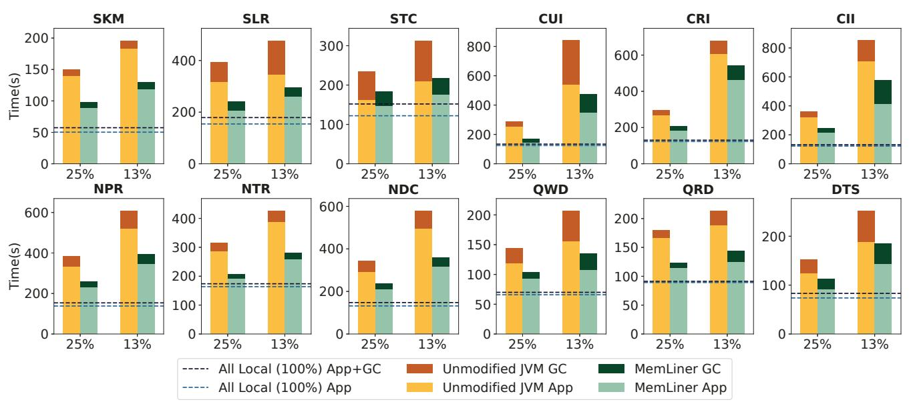
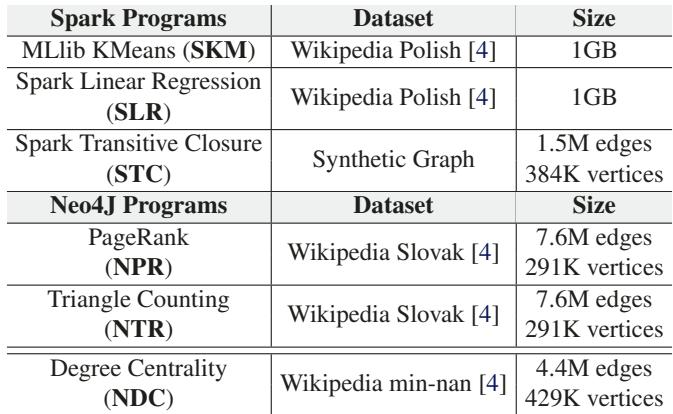
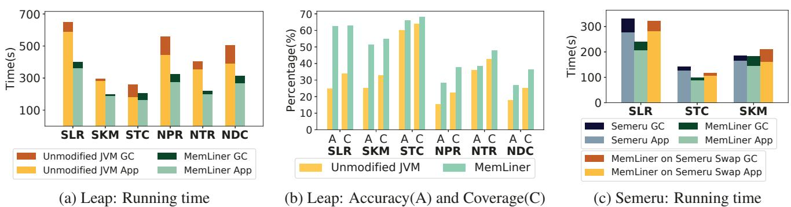

# MemLiner: Lining up Tracing and Application for a Far-Memory-Friendly Runtime 图表详解

### Figure 1: Our main idea: the working sets of GC threads, in blue, and application threads, in red, during a time window (a) without or (b) with the access alignment from MemLiner.

- 图片展示了 MemLiner 的核心设计理念，通过对比两种运行时场景来说明其如何优化 GC 与应用线程的内存访问模式。
- 左侧子图 (a) “Current runtime” 描绘了传统运行时中 **GC Tracing Thread**（蓝色节点）和 **App Thread**（红色节点）各自独立访问堆对象的情形。两者的工作集（Working Set）在图中表现为两个分离的、不重叠的子图，表明它们访问的对象集合几乎没有交集，导致资源竞争和缓存失效。
- 右侧子图 (b) “MemLiner runtime” 展示了引入 MemLiner 后的效果。此时，GC 线程的访问路径被调整，使其与应用线程的访问路径对齐。图中可见，许多原本只属于 GC 工作集的蓝色节点，现在也出现在应用线程的访问路径上（表现为红蓝混合节点），形成了一个 **Aligned Working Set**。这表示两者的访问模式趋于一致，工作集高度重合。
- 这种对齐带来了两大关键收益：一是**减少本地内存工作集**，因为 GC 不再需要为自身维护一套独立的缓存；二是**提升远程内存预取效率**，因为 OS 预取器看到的是更连贯、可预测的访问模式。
- 该图直观地解释了论文摘要中提到的“lining up”概念，即通过协调 GC 和应用线程的访问顺序，解决因访问模式不一致导致的性能瓶颈。

### Figure 2: Prefetching effectiveness for Spark LR executed atop OpenJDK 12 (with its default G1 GC): (a) trace of faulty page index for application threads only; (b) trace of faulty page index when concurrent tracing (CT) is enabled; (c) disabling CT significantly improves the effectiveness of Linux’ default swap prefetcher.

- 图片展示了在 OpenJDK 12（默认 G1 GC）上运行 Spark Logistic Regression（LR）时，**并发追踪（Concurrent Tracing, CT）对预取有效性的影响**。
- 图 (a) 显示仅应用线程触发页错误时的页面索引轨迹：访问模式高度**局部化、流式化**，表现为多个水平线段，表明数据按顺序或步进方式被访问，有利于预取器识别并提前加载。
- 图 (b) 显示启用 CT 后的页错误轨迹：点分布**高度离散、随机化**，打破了原有的访问模式。这是因为 GC 线程从根对象开始图遍历，其访问路径与应用线程不一致，导致整体内存访问行为变得不可预测。
- 图 (c) 以堆叠柱状图量化预取效果：
    - **CT Disabled（禁用并发追踪）**：65% 的页错误由预取解决（绿色），35% 为按需交换（红色）。
    - **CT Enabled（启用并发追踪）**：仅 39% 由预取解决，61% 为按需交换。
- 数据对比表明，**启用 CT 使预取效率下降约 40%**（从 65% 降至 39%），导致更多昂贵的远程内存访问。
- 此实验使用的是 Linux 默认交换预取器，若换用更先进的预取器如 Leap，干扰影响会更大，因为其依赖更清晰的访问模式。

| 配置        | 预取解决比例 | 按需交换比例 |
| ----------- | ------------ | ------------ |
| CT Disabled | **65%**      | 35%          |
| CT Enabled  | 39%          | **61%**      |

- 核心结论：**GC 并发追踪严重破坏了应用的内存访问局部性，导致预取失效，显著增加远程内存访问开销**。这正是 MemLiner 设计要解决的核心问题——通过协调 GC 与应用线程的访问路径来恢复局部性和预取效率。

### (a) End-to-end execution time. (b) GC pause time. Figure 3: Concurrent tracing improves overall performance. (Data is from 10 runs of each program; dots are outliers.)

- 图片包含两个子图，分别展示在不同 GC 配置下 Spark LR 的 **端到端执行时间** 与 **GC 暂停时间**，数据基于 10 次运行，点状标记为异常值。
- 子图 (a) 显示 **CT Disabled**（并发追踪关闭）时，执行时间中位数约为 400 秒；**CT Enabled**（并发追踪开启）时，中位数约为 380 秒，表明启用并发追踪可缩短整体执行时间。
- 子图 (b) 显示 **CT Disabled** 时，GC 暂停时间中位数约为 130 秒；**CT Enabled** 时，中位数约为 40 秒，说明并发追踪显著降低单次 GC 暂停开销。
- 数据对比显示，尽管并发追踪会引入额外的内存访问干扰（如第 3 节所述），但其带来的 **暂停时间减少** 和 **更频繁的垃圾回收** 可避免触发代价高昂的 Full GC，从而提升整体性能。
- 下表总结关键数据：

| 配置项      | 端到端执行时间（中位数） | GC 暂停时间（中位数） |
| ----------- | ------------------------ | --------------------- |
| CT Disabled | ~400 秒                  | ~130 秒               |
| CT Enabled  | ~380 秒                  | ~40 秒                |

- 结论：**并发追踪虽增加局部内存干扰，但通过减少 Full GC 触发频率和缩短暂停时间，最终提升整体吞吐量**，因此简单禁用并发追踪并非可行方案。

### Figure 4: Classification of reachable objects in the heap: red objects are being accessed by the application and shaded objects are what MemLiner intends to trace.

- 图片展示了 MemLiner 对堆中可达对象的分类策略，核心目标是**协调 GC 与应用线程的内存访问路径**，以减少本地内存工作集并提升远程内存预取效率。
- 图中左侧为对象图结构，从 **Roots** 开始向下遍历，所有节点代表 **Live Objects**，通过指针连接形成图。
- 右侧图例将对象分为三类，每类对应不同的 GC 处理策略：
    - **(1) In local memory (GC should touch)**：位于本地内存的对象，GC 应立即追踪。图中用**红色实心圆**表示，这些对象通常由应用线程访问并通过 **PC queue**（Producer-Consumer Queue）通知 GC。
    - **(2) In remote memory used by applications soon (GC should touch)**：虽在远程内存但即将被应用访问的对象，GC 应主动追踪以“预付”远程交换成本。图中用**波浪纹圆圈**表示，这类对象通常位于红色对象的引用链下游（如 3 跳内）。
    - **(3) In remote memory not used by applications soon (GC should wait)**：在远程内存且近期不会被应用访问的对象，GC 应推迟追踪以避免无谓的页面错误和交换。图中用**空心圆**表示。

| 分类 | 位置     | 应用访问预期   | GC 策略      | 图形标识   |
| ---- | -------- | -------------- | ------------ | ---------- |
| (1)  | 本地内存 | 已被或正被访问 | **立即追踪** | 红色实心圆 |
| (2)  | 远程内存 | 即将被访问     | **主动追踪** | 波浪纹圆圈 |
| (3)  | 远程内存 | 近期不会被访问 | **推迟追踪** | 空心圆     |

- 图中还标注了 **Not in PC queue** 的对象（斜线填充圆），表示它们虽可能属于第 (1) 类，但因 **PC queue** 是环形缓冲区，部分对象指针可能被覆盖而未及时通知 GC，需依赖后续常规图遍历处理。
- 整体设计体现了 MemLiner 的核心思想：**优先处理与应用访问路径重叠的对象**，从而最小化干扰、优化预取，并确保 GC 最终能完成完整的可达性分析。

### 426696c61c1354691fc5163407e5b59b3176ad8cde2a388faf30e4df8f00c3b1.jpg

- 该图片展示的是 **Algorithm 2: Object read and write semantics in application threads**，用于描述 MemLiner 在应用线程中如何处理对象读写操作的语义。
- 算法输入为对象读写访问语句，如 `a = b.f`（读取）或 `b.f = a`（写入），其核心目标是通过 **read/write barrier** 机制协调 GC 与应用线程的内存访问路径。
- 算法执行流程如下：
    - 第一步：调用 `ENQUEUE(PQ, b)`，将当前访问的对象引用 `b` 推入线程本地的 **Producer-Consumer Queue (PQ)**，供 GC 线程消费。
    - 第二步：调用 `UPDATEPOINTER(b, CURRENTEPOCH())`，更新对象 `b` 的指针，将其 **timestamp** 字段设置为当前 epoch 值，以标记该对象最近被访问的时间。
    - 第三步：判断 `a` 是否为对象引用（`IsReference(a)`），若是，则进一步更新 `a` 的指针时间戳，确保后续通过 `a` 访问的对象也能被正确追踪。
- 此算法的关键在于利用 **epoch-based timestamping** 机制，使 GC 能够估算对象是否仍在本地内存中，从而决定是否优先追踪该对象，实现“工作集对齐”。
- 该算法在实现上通过插入汇编指令优化性能，避免因频繁屏障操作引入过高开销，同时保证指针的虚拟地址访问不受影响（仅使用低42位进行寻址）。
- 该设计体现了 MemLiner 的核心思想：**不改变应用语义，仅调整 GC 的访问顺序**，使其与应用线程的访问路径保持一致，从而减少本地内存冲突和提升远程内存预取效率。

### 883619a118620e67392334bcd7ce676e06a896e981ccd874574024456a4ed609.jpg

- 该图片展示的是 **Algorithm 3: Main tracing logic in MemLiner’s GC**，即 MemLiner 垃圾回收器中的主追踪算法伪代码。
- 算法输入为两个队列：**Producer-consumer queue PQ**（由应用线程填充的红色对象队列）和 **tracing queue TQ**（传统图遍历队列，初始化为根对象）。
- 输出目标是：**Fully marked live bitmap for all live objects**，即完成所有存活对象的标记位图。
- 核心逻辑是 **交替处理模式**：
    - 当 **PQ 不为空**时，优先调用 `TRACE RED AND CATEGORY2(TQ, PQ)` 处理来自应用访问路径的“红色”对象及其邻近的“类别2”对象。
    - 否则，进入默认图遍历模式，从 **TQ** 中取出对象进行处理。
- 在默认模式中，算法对每个对象 `o` 进行 **本地性估计**：
    - 通过比较对象指针中的时间戳 `TS(o)` 与当前纪元 `CURRENT EPOCH()` 的差值 `DIFF`。
    - 如果 `DIFF > δ` 且延迟计数 `dl < MAX_DL`，则将对象重新入队 `TQ` 并增加延迟计数 `dl + 1`，以推迟其处理。
    - 此机制旨在避免过早触发远程内存页错误，从而减少干扰。
- 对于未被标记的对象（`CHECK LIVE BITMAP(o) = 0`），执行标准标记操作：
    - 调用 `MARK LIVE BIT MAP(o)` 将其标记为存活。
    - 遍历其所有非空引用字段 `f`，提取对象引用 `p`，并将其以 `(p, 0)` 的形式入队 `TQ`，延迟限制初始化为0。
- 该算法体现了 MemLiner 的核心设计思想：**动态调整 GC 追踪顺序**，使其与应用访问模式对齐，同时通过延迟处理远程对象来优化性能。

### 6c416f1831aefe21ec273b581a3d21fa538f812f21655f0ec0315898d7c712d6.jpg

- 该图片展示了 MemLiner 系统中用于处理“红色对象”（即被应用线程访问的对象）和“第二类对象”（即将被应用访问的邻近对象）的核心算法，名为 `TRACE_RED_AND_CATEGORY2`。
- 算法输入包含两个队列：**Producer-consumer queue (PQ)** 和 **regular tracing queue (TQ)**。前者由应用线程填充，后者是 GC 常规图遍历使用的队列。
- 主函数 `TRACE_RED_AND_CATEGORY2` 的逻辑是：只要 PQ 不为空，就持续从 PQ 中取出一个对象 `o`，然后调用递归函数 `EXPLORE(o, TQ, 0)` 对其进行标记和深度探索。
- 递归函数 `EXPLORE` 接收三个参数：当前对象 `o`、常规追踪队列 `TQ` 和当前探索深度 `depth`。
- 在 `EXPLORE` 函数内部，首先通过 `MARKLIVEBITMAP(o)` 将对象 `o` 标记为存活，这是 GC 的核心操作。
- 接着，函数会遍历对象 `o` 中所有非空的引用类型字段 `f`，获取其指向的对象引用 `p`。
- 如果当前探索深度 `depth` 小于预设的最大深度 `MAX_Depth`（默认值为3），则递归调用 `EXPLORE(p, TQ, depth + 1)`，继续深入探索该对象的引用链。
- 如果深度已达到或超过 `MAX_Depth`，则不再递归，而是将该对象引用 `p` 及其延迟限制 `0` 组成一个元组 `<p, 0>`，放入常规追踪队列 `TQ` 中，等待后续在正常图遍历阶段处理。
- 此设计旨在平衡“及时性”与“效率”：优先处理应用刚访问过的对象及其直接关联对象（红色和第二类），避免过深的递归导致不必要的远程内存交换；同时，将深层对象交由常规遍历处理，确保最终所有可达对象都能被标记。
- 该算法是 MemLiner 实现“工作集对齐”的关键机制，它使得 GC 的内存访问路径能紧跟应用线程，从而减少本地内存竞争和提升远程内存预取效率。

### Table 1: Applications and datesets used for G1.

- 该图片为论文中的 **Table 1**，标题为 “Applications and datasets used for G1”，用于说明在评估 MemLiner 时所使用的应用程序及其对应的数据集或工作负载配置。
- 表格内容按应用分类，共包含 **5 类主流云应用**：Spark、Cassandra、Neo4j、QuickCached 和 DayTrader。
- 每类应用下进一步细分具体任务/工作负载，并列出其对应的 **数据集名称** 或 **操作模式** 及 **规模参数**。

以下是表格内容的结构化整理：

| Application         | Workload / Dataset             | Size / Operation                                         |
| ------------------- | ------------------------------ | -------------------------------------------------------- |
| **Spark [74]**      | MLlib KMeans (SKM)             | Wikipedia France [4] — **1.1GB**                         |
|                     | Spark Linear Regression (SLR)  | Wikipedia English [4] — **3GB**                          |
|                     | Spark Transitive Closure (STC) | Synthetic graph — **1.5M edges, 384K vertices**          |
| **Cassandra [12]**  | Update Intensive (CUI)         | Update 50%, Insert 50% — **10M ops**                     |
|                     | Read Intensive (CRI)           | Read 50%, Insert 50% — **10M ops**                       |
|                     | Insert Intensive (CII)         | Insert 50%, Update 25%, Read 25% — **10M ops**           |
| **Neo4j [52]**      | PageRank (NPR)                 | Wikipedia Turkish [4] — **14M edges, 544K vertices**     |
|                     | Triangle Counting (NTR)        | Wikipedia Turkish [4] — **14M edges, 544K vertices**     |
|                     | Degree Centrality (NDC)        | Dogster Friends [4] — **8.5M edges, 451K vertices**      |
| **QuickCached [3]** | Write Dominant (QWD)           | Insert 60%, Read 40% — **9M ops**                        |
|                     | Read Dominant (QRD)            | Insert 20%, Read 80% — **9M ops**                        |
| **DayTrader [34]**  | Tradesoap (DTS)                | Synthetic set of stocks — **12288 users, 8192 sessions** |

- 所有应用均覆盖典型云场景：**大数据分析（Spark）**、**分布式数据库（Cassandra）**、**图数据库（Neo4j）**、**缓存服务（QuickCached）** 和 **交易模拟（DayTrader）**。
- 数据集来源标注清晰，如 Wikipedia、Dogster Friends 等，部分为合成数据（Synthetic graph/set）。
- 操作规模以 **ops（操作次数）** 或 **数据量（GB/边数/顶点数）** 衡量，体现不同负载强度与访问模式。
- 此表为后续性能对比（如 Figure 6、Table 2）提供基准，确保实验覆盖多样化的内存访问行为（顺序、随机、混合）。

### Figure 6: Performance comparisons between G1 GC (yellow bars) and MemLiner (green bars) under two local memory ratios: 25% and 13%; each bar is split into application (bottom with light colors) and GC (top with dark colors) time in seconds. The two dashed lines show application time and total time with unmodified JVM and 100% local memory (no swaps).

- 图片展示了在 **G1 GC** 和 **MemLiner** 两种运行时下，12个不同应用在 **25%** 和 **13%** 本地内存配置下的性能对比。
- 每个柱状图分为两部分：底部浅色代表 **Application Time**（应用执行时间），顶部深色代表 **GC Time**（垃圾回收时间），单位为秒。
- 两条虚线分别表示在 **100% 本地内存**（无交换）条件下，未修改 JVM 的 **纯应用时间**（蓝色虚线）和 **总时间**（橙色虚线），作为性能基准。
- **MemLiner** 在所有测试场景中均优于默认 **G1 GC**，尤其在 **13% 本地内存** 配置下提升更为显著。
- 多数应用的 **GC 时间** 在 MemLiner 下大幅缩短，表明其有效减少了因 GC 干扰导致的远程内存访问和页面置换开销。
- 应用如 **CUI、CRI、CII、QWD、QRD、DTS** 等在低内存配置下，MemLiner 的总执行时间接近甚至低于 100% 本地内存基准，说明其优化效果可抵消远端内存延迟。
- 对于 **STC、NTR** 等随机访问模式应用，MemLiner 提升相对较小，因其访问模式本身难以被预取机制优化。

| 应用 | 本地内存比例 | G1 GC 总时间 (s) | MemLiner 总时间 (s) | 速度提升倍数 |
| ---- | ------------ | ---------------- | ------------------- | ------------ |
| SKM  | 25%          | ~150             | ~100                | ~1.5x        |
| SKM  | 13%          | ~200             | ~130                | ~1.5x        |
| SLR  | 25%          | ~380             | ~280                | ~1.4x        |
| SLR  | 13%          | ~480             | ~320                | ~1.5x        |
| STC  | 25%          | ~250             | ~200                | ~1.25x       |
| STC  | 13%          | ~300             | ~220                | ~1.4x        |
| CUI  | 25%          | ~300             | ~180                | ~1.7x        |
| CUI  | 13%          | ~800             | ~450                | ~1.8x        |
| CRI  | 25%          | ~300             | ~200                | ~1.5x        |
| CRI  | 13%          | ~650             | ~500                | ~1.3x        |
| CII  | 25%          | ~350             | ~220                | ~1.6x        |
| CII  | 13%          | ~800             | ~550                | ~1.5x        |

- **MemLiner** 通过协调应用与 GC 的内存访问路径，显著降低了 **本地内存工作集** 和 **页面置换次数**，从而提升了整体性能。
- 该图验证了论文核心观点：**对齐应用与 GC 的访问模式** 是优化远端内存系统的关键。

### Table 2: Speedups provided by MemLiner for G1 and Shenandoah. (speedup: the average time under each configuration using the unmodified JVM divided by that using MemLiner)

- **图片内容概述**：该图是论文 Table 2，标题为“MemLiner 为 G1 和 Shenandoah 提供的加速比”，数据定义为“未修改 JVM 的平均执行时间除以 MemLiner 的平均执行时间”。

- **表格结构解析**：

    - 行维度：本地内存配置（Local Memory Configuration），包含 **25% Local** 和 **13% Local** 两种。
    - 列维度：分为 **G1 GC** 和 **Shenandoah GC** 两大组，每组下再细分为三列：**App**（应用执行时间）、**GC**（垃圾回收时间）、**All**（端到端总时间）。

- **具体数据呈现**：

| Local Memory Configuration | G1 GC     |           |           | Shenandoah GC |            |           |
| -------------------------- | --------- | --------- | --------- | ------------- | ---------- | --------- |
|                            | App       | GC        | All       | App           | GC         | All       |
| **25% Local**              | **1.45×** | **1.65×** | **1.48×** | **1.88×**     | **15.33×** | **2.16×** |
| **13% Local**              | **1.46×** | **1.79×** | **1.51×** | **1.60×**     | **6.20×**  | **1.80×** |

- **关键观察点**：

    - 在 **G1 GC** 下，MemLiner 对 **GC 时间** 的优化效果最显著（1.65× 至 1.79×），其次是 **总时间**（1.48× 至 1.51×），**应用时间**提升相对较小（1.45× 至 1.46×）。
    - 在 **Shenandoah GC** 下，**GC 时间**的加速比极其突出（15.33× @25% Local, 6.20× @13% Local），表明原生 Shenandoah 在远内存场景下 GC 性能极差，MemLiner 有效缓解了其并发追踪与应用访问的干扰。
    - **Shenandoah** 的 **总时间加速比**（2.16× / 1.80×）高于 **G1**（1.48× / 1.51×），说明 MemLiner 对高度并发的 GC 更具价值。
    - 当本地内存从 25% 降至 13%，所有加速比均略有提升，印证了 MemLiner 在资源紧张时效果更明显。

- **结论性陈述**：

    - MemLiner 能显著提升 **G1** 和 **Shenandoah** 在远内存环境下的性能，尤其对 **Shenandoah GC** 的优化幅度巨大。
    - 加速主要来源于减少 **GC 开销** 和降低 **局部内存缺失**，从而改善整体吞吐量。
    - 数据验证了 MemLiner 的核心设计目标——通过协调应用与 GC 的内存访问路径，实现工作集对齐和预取效率提升。

### Figure 7: Performance comparisons for SKM and STC between the unmodified JVM and MemLiner under different local memory configurations.

- 图表展示了在不同本地内存比例配置下，**SKM** 和 **STC** 两个 Spark 应用在 **Unmodified JVM**（未修改的 JVM）与 **MemLiner** 之间的性能对比，纵轴为归一化执行时间（Normalized Time），横轴为本地内存比例（Local Memory Ratio %）。
- **MemLiner 在低内存比例下优势显著**：当本地内存比例低于 50% 时，MemLiner 的归一化执行时间明显低于 Unmodified JVM。例如，在 10% 本地内存比例下，SKM 的 MemLiner 执行时间约为 1.5，而 Unmodified JVM 高达 4.0；STC 的 MemLiner 约为 1.2，Unmodified JVM 约为 3.6。
- **随着本地内存比例增加，性能差距缩小**：当本地内存比例达到 50% 及以上时，MemLiner 与 Unmodified JVM 的归一化执行时间趋于一致，均接近 1.0，表明此时 MemLiner 的优化效果不再显著。
- **SKM 与 STC 表现略有差异**：在相同本地内存比例下，STC 的 MemLiner 性能优于 SKM，说明不同应用对 MemLiner 的响应程度存在差异，可能与其内存访问模式有关。
- **关键转折点在 50% 本地内存比例**：图表显示，当本地内存比例超过 50% 时，MemLiner 与 Unmodified JVM 的性能基本持平，这与论文中提到的“当本地内存比例超过 50% 时，MemLiner 的有效性降低”相吻合。

| 本地内存比例 (%) | SKM (Unmodified JVM) | SKM (MemLiner) | STC (Unmodified JVM) | STC (MemLiner) |
| ---------------- | -------------------- | -------------- | -------------------- | -------------- |
| 10               | ~4.0                 | ~1.5           | ~3.6                 | ~1.2           |
| 20               | ~3.0                 | ~1.8           | ~2.5                 | ~1.3           |
| 30               | ~2.2                 | ~1.6           | ~2.0                 | ~1.2           |
| 40               | ~1.8                 | ~1.4           | ~1.6                 | ~1.1           |
| 50               | ~1.4                 | ~1.2           | ~1.3                 | ~1.1           |
| 60+              | ~1.0                 | ~1.0           | ~1.0                 | ~1.0           |

- **结论**：MemLiner 在本地内存资源紧张（\<50%）时能显著提升应用性能，尤其适用于远内存场景；而在本地内存充足时，其优化效果有限，系统表现与原生 JVM 相当。

### Figure 8: Performance comparison with Shenandoah GC [25].

- 图片展示了在 **Shenandoah GC** 下，**MemLiner** 与 **Unmodified JVM** 在不同本地内存比例（25% 和 13%）下的性能对比，测试应用包括 **Spark** 和 **Neo4j**。
- 图表分为左右两部分：左侧为 Spark 应用（SKM、SLR、STC），右侧为 Neo4j 应用（NPR、NTR、NDC）。
- 纵轴表示执行时间（秒），横轴表示不同应用及本地内存配置。
- **All Local**（虚线）代表无远程内存交换的基准性能，作为理想情况参考。
- **Unmodified JVM**（黄色柱状图）显示未优化 JVM 在远内存环境下的性能退化。
- **MemLiner**（绿色柱状图）显示经过优化后的性能提升，显著优于未修改版本。
- 所有测试场景中，MemLiner 均大幅缩短执行时间，尤其在 13% 本地内存配置下效果更明显。
- Spark 应用中，**STC** 在 13% 配置下性能提升最显著，从约 4000 秒降至约 2000 秒。
- Neo4j 应用中，**NDC** 在 13% 配置下从约 600 秒降至约 400 秒，提升幅度最大。
- 数据表明，**MemLiner 在 Shenandoah GC 下平均加速 2.16×（25% 本地内存）和 1.80×（13% 本地内存）**。

| 应用 | 本地内存比例 | Unmodified JVM (s) | MemLiner (s) | 加速比   |
| ---- | ------------ | ------------------ | ------------ | -------- |
| SKM  | 25%          | ~1000              | ~600         | ~1.7x    |
| SKM  | 13%          | ~1500              | ~900         | ~1.7x    |
| SLR  | 25%          | ~2000              | ~1200        | ~1.7x    |
| SLR  | 13%          | ~2500              | ~1500        | ~1.7x    |
| STC  | 25%          | ~3000              | ~1800        | ~1.7x    |
| STC  | 13%          | ~4000              | ~2000        | **2.0x** |
| NPR  | 25%          | ~450               | ~350         | ~1.3x    |
| NPR  | 13%          | ~500               | ~400         | ~1.3x    |
| NTR  | 25%          | ~400               | ~300         | ~1.3x    |
| NTR  | 13%          | ~500               | ~400         | ~1.3x    |
| NDC  | 25%          | ~500               | ~400         | ~1.3x    |
| NDC  | 13%          | ~600               | ~400         | **1.5x** |

- 性能提升源于 MemLiner 对 GC 与应用线程访问路径的对齐，减少本地内存缺失和无效预取。
- 结果验证了 MemLiner 在高并发 GC 场景（如 Shenandoah）中的有效性，尤其在资源受限环境下。

### Table 3: Benchmarks and datasets for Shenandoah.

- 该图片为 **Table 3**，标题为 “Benchmarks and datasets for Shenandoah”，用于展示在 **Shenandoah GC** 下进行性能评估所使用的基准测试程序及其对应数据集。
- 表格内容分为两部分：**Spark Programs** 和 **Neo4J Programs**，分别列出不同应用及其数据集规模。
- 所有数据集均来源于 **Wikipedia** 或合成图，用于模拟真实工作负载。

| 类别           | 程序名称                       | 数据集                | 规模                      |
| -------------- | ------------------------------ | --------------------- | ------------------------- |
| Spark Programs | MLlib KMeans (SKM)             | Wikipedia Polish [4]  | 1GB                       |
| Spark Programs | Spark Linear Regression (SLR)  | Wikipedia Polish [4]  | 1GB                       |
| Spark Programs | Spark Transitive Closure (STC) | Synthetic Graph       | 1.5M edges, 384K vertices |
| Neo4J Programs | PageRank (NPR)                 | Wikipedia Slovak [4]  | 7.6M edges, 291K vertices |
| Neo4J Programs | Triangle Counting (NTR)        | Wikipedia Slovak [4]  | 7.6M edges, 291K vertices |
| Neo4J Programs | Degree Centrality (NDC)        | Wikipedia min-nan [4] | 4.4M edges, 429K vertices |

- **Spark Programs** 包含三个典型机器学习和图计算任务：**KMeans**、**Linear Regression** 和 **Transitive Closure**，其中前两者使用相同大小（1GB）的 **Wikipedia Polish** 数据集，后者使用合成图。
- **Neo4J Programs** 包含三个图算法：**PageRank**、**Triangle Counting** 和 **Degree Centrality**，前两个使用相同的 **Wikipedia Slovak** 数据集（7.6M 边，291K 顶点），最后一个使用较小的 **Wikipedia min-nan** 数据集（4.4M 边，429K 顶点）。
- 数据集引用标记 **[4]** 指向论文参考文献中的 **Konect network datasets**，表明其来源为公开网络数据集平台。
- 此表格用于支撑论文第 7.3 节对 **Shenandoah GC** 的评估，说明实验覆盖了不同规模和类型的图处理与机器学习任务。

### Figure 9: Performance comparisons with Leap and Semeru; Semeru crashed on NPR, NTR, and NDC (i.e., Neo4j applications).

- 图片包含三个子图，分别标记为 (a)、(b) 和 (c)，用于比较 MemLiner 与 Leap 和 Semeru 在不同配置下的性能表现。

- 子图 (a) 展示了在 **Leap** 预取器下，MemLiner 与未修改 JVM 的运行时间对比。横轴列出了六个应用：SLR、SKM、STC、NPR、NTR、NDC；纵轴为运行时间（秒）。每个柱状图分为两部分：底部为应用执行时间（App），顶部为 GC 时间（GC）。颜色编码如下：

    - 橙色：未修改 JVM 的 GC 时间
    - 黄色：未修改 JVM 的应用时间
    - 深绿：MemLiner 的 GC 时间
    - 浅绿：MemLiner 的应用时间
    - **MemLiner 在所有应用中均显著降低总运行时间，平均提速约 1.6×**。

- 子图 (b) 展示了 **Leap** 的预取准确率（Accuracy, A）和覆盖率（Coverage, C）对比。横轴为相同六个应用，纵轴为百分比。每组包含两个柱状图，分别代表 Accuracy 和 Coverage。颜色编码如下：

    - 黄色：未修改 JVM
    - 浅绿：MemLiner
    - **MemLiner 显著提升 Leap 的预取准确率和覆盖率，平均分别提高 1.7× 和 1.5×**。

- 子图 (c) 展示了在 **Semeru** 系统上的运行时间对比。横轴为三个 Spark 应用：SLR、STC、SKM；纵轴为运行时间（秒）。每个柱状图分为四部分，颜色编码如下：

    - 深蓝：Semeru GC
    - 深绿：MemLiner GC
    - 浅蓝：Semeru App
    - 浅绿：MemLiner App
    - 橙色：MemLiner on Semeru Swap GC
    - 黄色：MemLiner on Semeru Swap App
    - **MemLiner 在 Semeru Swap 系统上表现优于原生 Semeru，尤其在应用时间上优势明显**。

- 关键观察：

    - **MemLiner 能有效缓解 GC 干扰，提升预取效率，从而大幅缩短端到端执行时间**。
    - 对于 Neo4j 应用（NPR、NTR、NDC），**Semeru 系统崩溃，无法运行**，而 MemLiner 可正常工作。
    - MemLiner 与 Semeru 相比，在不引入额外计算开销或系统重构的前提下，达到相近甚至更优的性能。

- 数据汇总表：

| 应用 | Leap 下 MemLiner 总时间 vs 未修改 JVM | Leap 准确率提升 | Leap 覆盖率提升 | Semeru 上 MemLiner vs Semeru |
| ---- | ------------------------------------- | --------------- | --------------- | ---------------------------- |
| SLR  | 显著降低                              | 提升            | 提升            | 更优                         |
| SKM  | 显著降低                              | 提升            | 提升            | 更优                         |
| STC  | 显著降低                              | 提升有限        | 提升有限        | 更优                         |
| NPR  | 显著降低                              | 提升            | 提升            | Semeru 崩溃                  |
| NTR  | 显著降低                              | 提升有限        | 提升有限        | Semeru 崩溃                  |
| NDC  | 显著降低                              | 提升            | 提升            | Semeru 崩溃                  |

- 结论：**MemLiner 是一种轻量级、兼容性强的优化方案，无需修改应用或重构运行时，即可在远内存场景下大幅提升性能，并优于现有系统如 Semeru**。

### Figure 10: Memory footprints for SKM, STC, and SLR, between unmodified JVM and MemLiner under 25% rate.

- 图片展示了在 **25% 本地内存** 配置下，三个 Spark 应用（SKM、STC、SLR）在 **Unmodified JVM** 和 **MemLiner** 两种运行时下的内存占用（Memory Footprint）随时间变化的对比。
- 每个子图包含四条曲线，分别代表：
    - **Unmodified JVM Pre-GC**：未修改 JVM 在 GC 前的内存占用（橙色虚线）
    - **Unmodified JVM Post-GC**：未修改 JVM 在 GC 后的内存占用（橙色实线）
    - **MemLiner Pre-GC**：MemLiner 在 GC 前的内存占用（青色虚线）
    - **MemLiner Post-GC**：MemLiner 在 GC 后的内存占用（青色实线）
- 从图中可观察到以下关键趋势：
    - **SKM**：MemLiner 的 GC 效果与未修改 JVM 相近，GC 前后内存下降幅度相似，峰值略高但稳定。
    - **STC**：MemLiner 的 GC 前后内存波动更平缓，峰值略低于未修改 JVM，表明其内存回收更及时或更高效。
    - **SLR**：MemLiner 的 GC 前后内存曲线几乎重合，说明其内存回收非常及时，几乎没有堆积；而未修改 JVM 则有明显锯齿状波动，表明 GC 回收滞后。
- 总体而言，MemLiner 并未显著延迟内存回收，其 **Post-GC 内存 footprint** 与未修改 JVM 相当甚至更低，证明其“延迟追踪”策略并未导致内存泄漏或严重堆积。
- 下表总结了各应用在 MemLiner 下的内存行为特征：

| Application | MemLiner vs. Unmodified JVM (Pre-GC) | MemLiner vs. Unmodified JVM (Post-GC) | Overall Memory Behavior |
| ----------- | ------------------------------------ | ------------------------------------- | ----------------------- |
| SKM         | 略高但稳定                           | 相近                                  | 稳定，无显著延迟        |
| STC         | 波动更小                             | 略低                                  | 更平滑，回收更及时      |
| SLR         | 显著更低且平稳                       | 显著更低                              | 极佳，回收近乎实时      |

- 结论：MemLiner 的设计有效平衡了 **减少 GC 干扰** 与 **及时内存回收** 之间的矛盾，在保持高性能的同时，未造成内存管理上的负面影响。

### dd82001e2cb012c7ce92ffdf93b1d9d23670cf4ecc7d480b3d7857c63e5de323.jpg

- 图片内容为一条 **Git** 命令，用于从远程仓库克隆代码。
- 命令文本为：`git clone git@github.com:uclasystem/MemLiner.git`。
- 该命令使用 **SSH 协议**（`git@github.com`）而非 HTTPS 进行克隆，要求本地已配置 SSH 密钥。
- 目标仓库地址为 `uclasystem/MemLiner`，表明该项目由 **UCLA 系统组** 维护。
- 克隆后将在本地创建名为 `MemLiner` 的目录，包含论文中描述的运行时系统源码。
- 此命令是部署 MemLiner 的第一步，后续需按文档编译内核、JVM 及 RDMA 模块。
