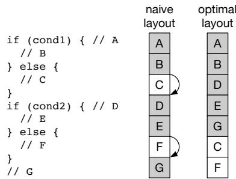
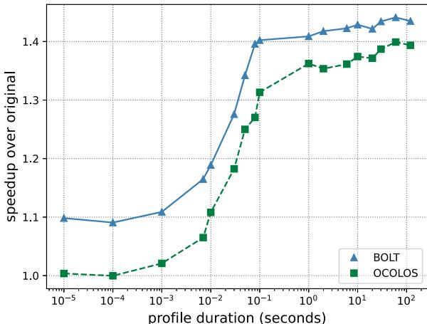
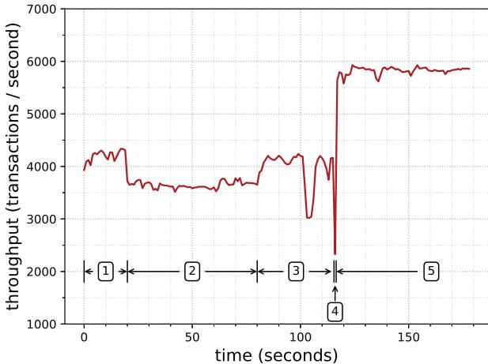
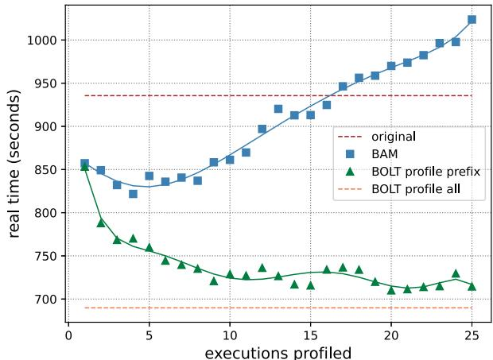

# OCOLOS: Online COde Layout OptimizationS 图表详解

### Fig. 1: AMD & Intel per-core L1i capacity over time

- 图表标题为“Fig. 1: AMD & Intel per-core L1i capacity over time”，展示了从2006年至2022年间，**AMD**与**Intel**两家公司处理器每核心的**L1 instruction cache (L1i)**容量变化趋势。
- **Intel**的L1i容量在图示时间范围内始终保持**32 KiB**不变，以蓝色实线方块标记，表明其设计策略倾向于维持稳定、低延迟的缓存结构。
- **AMD**的L1i容量则呈现波动变化：起始于2006年的**64 KiB**（红色虚线三角形），随后在2010年降至**32 KiB**，并在2014年回升至**48 KiB**，2018年再次达到**64 KiB**，最终在2022年回落至**32 KiB**。
- 数据点分布显示，**Intel**在所有年份均保持恒定容量，而**AMD**则根据架构演进多次调整L1i大小，反映其对性能与功耗平衡的不同取舍。
- 下表总结关键年份数据：

| 年份 | Intel L1i (KiB) | AMD L1i (KiB) |
|------|------------------|---------------|
| 2006 | 32               | 64            |
| 2010 | 32               | 32            |
| 2014 | 32               | 48            |
| 2018 | 32               | 64            |
| 2022 | 32               | 32            |

- 图中趋势印证论文引言所述：尽管摩尔定律持续推动晶体管密度增长，但**L1i**因**latency-critical**特性，其容量并未同步扩展，尤其**Intel**长期维持32 KiB，凸显前端瓶颈问题日益严峻。

### Fig. 2: Example program which benefits from PGO

- 图片展示了 **Fig. 2: Example program which benefits from PGO**，用于说明 **Profile-Guided Optimization (PGO)** 如何通过调整代码布局提升性能。
- 左侧为源代码片段，包含两个 `if-else` 条件语句：
  - 第一个 `if (cond1)` 分支：执行块 A、B（true）或 C（false）。
  - 第二个 `if (cond2)` 分支：执行块 D、E（true）或 F（false）。
  - 最后执行块 G。
- 右侧对比了两种代码布局方式：
  - **Naive layout**（朴素布局）：按源码顺序排列基本块 A→B→C→D→E→F→G。若 `cond1` 和 `cond2` 均为真，则需执行两次跳转（从 B 到 D，从 E 到 G），导致 **taken branches** 增加。
  - **Optimal layout**（优化布局）：根据 PGO 分析的热点路径重新排序为 A→B→D→E→G→C→F。若 `cond1` 和 `cond2` 均为真，则所有块连续执行，**无 taken branches**，最大化 L1i 和 iTLB 局部性。
- 关键性能影响：
  - **Taken branches** 会增加 Branch Target Buffer (BTB) 压力，而 BTB 仅存储 taken 分支信息。
  - 优化布局通过线性化常见路径，减少分支预测开销和指令缓存缺失。
- 该图直观体现了 PGO 的核心价值：**将高频执行路径的代码块物理相邻放置**，从而降低前端停顿，提升 IPC。

| 布局类型       | 基本块顺序     | cond1=true, cond2=true 时的跳转次数 | 性能优势                     |
|----------------|----------------|--------------------------------------|------------------------------|
| Naive layout   | A→B→C→D→E→F→G | 2                                    | 无                           |
| Optimal layout | A→B→D→E→G→C→F | 0                                    | 减少 taken branches，提升局部性 |

### Fig. 3: Performance achieved when running MySQL with the Sysbench read only input, using BOLT to produce a binary from the given profiling input or, with the all bar, from profiles of all inputs combined.

- 图片展示了在 MySQL 使用 Sysbench 的 **read only** 输入时，不同配置下的性能表现，单位为每秒事务数（transactions / second）。
- 性能数据基于使用 **BOLT** 工具从不同“训练”输入生成的优化二进制文件，然后在统一的 **read only** 输入下进行测试。
- 图中包含三种对比基准：
  - **OCOLOS**：在线优化系统，其性能用浅灰色条形表示。
  - **original**：未经过任何 PGO 优化的原始二进制，用虚线表示。
  - **BOLT**：离线优化工具，其性能用深蓝色条形表示。
- 横轴代表不同的“训练”输入，即用于生成 BOLT 优化二进制的配置；纵轴列出这些输入名称。
- 关键观察点：
  - 当 BOLT 使用与运行时输入完全一致的 **read only** 配置进行训练时，性能达到峰值，约为 **5800 tps**。
  - 当使用 **insert** 输入作为训练数据时，性能最差，约为 **4600 tps**，比最佳情况低约 **21%**。
  - 将所有输入的配置合并为 **all** 进行训练时，性能约为 **5300 tps**，比最佳情况低约 **8%**，显示出聚合配置存在“破坏性干扰”。
  - **OCOLOS** 的性能（约 **5700 tps**）几乎与 BOLT 最佳配置持平，证明其在线优化能始终匹配当前运行负载。
- 数据总结如下表：

| 训练输入 (Profiling Input) | BOLT 性能 (tps) | OCOLOS 性能 (tps) | 相对差异 |
|---------------------------|------------------|-------------------|----------|
| read only                 | ~5800            | ~5700             | +1.8%    |
| insert                    | ~4600            | ~5700             | +24%     |
| all                       | ~5300            | ~5700             | +7.5%    |

- 结论：该图有力验证了论文核心观点——**离线 PGO 的性能高度依赖于训练数据的质量和相关性**，而 **OCOLOS 通过在线实时优化，避免了这一问题，始终提供接近最优的性能**。

### Figure 4a: Main steps OCOLOS takes to optimize a target process

- 图片展示了 OCOLOS 系统优化目标进程的六个主要步骤，以时间轴形式呈现，从左至右依次推进。
- **步骤①：Profile** —— 在目标进程运行期间，OCOLOS 通过 Linux perf 工具收集硬件性能数据（如 LBR 样本），用于识别热点控制流路径。此阶段与目标进程并行执行，不中断其运行。
- **步骤②：Build optimized binary** —— 利用收集到的 profile 数据和原始二进制文件，调用 BOLT 工具生成一个经过布局优化的新二进制文件。该过程在后台进行，同样不影响目标进程的正常执行。
- **步骤③：Pause process** —— 当优化二进制准备就绪后，OCOLOS 使用 ptrace API 暂停目标进程，进入“stop-the-world”状态，为代码注入做准备。这是唯一中断服务的阶段。
- **步骤④：Inject code** —— 将 BOLT 生成的优化代码段注入到目标进程的地址空间中，通常放置于高地址区域，避免覆盖原有代码。原代码（C0）保持不变，新代码（C1）作为替代版本存在。
- **步骤⑤：Update pointers** —— 在暂停状态下，OCOLOS 更新关键代码指针，如直接调用指令、虚函数表条目、栈上返回地址等，使其指向新注入的 C1 代码。此操作遵循“**run C1 code in the common case**”原则，优先确保高频路径使用优化代码。
- **步骤⑥：Run with optimized code** —— 完成代码注入与指针更新后，恢复目标进程执行。此时进程将主要运行优化后的 C1 代码，从而获得性能提升。

| 步骤编号 | 步骤名称             | 是否中断进程 | 主要操作                                                                 |
|----------|----------------------|--------------|--------------------------------------------------------------------------|
| ①        | Profile              | 否           | 收集 LBR 性能样本，识别热点路径                                          |
| ②        | Build optimized binary | 否           | 调用 BOLT 生成优化二进制                                                 |
| ③        | Pause process        | 是           | 使用 ptrace 暂停目标进程                                                 |
| ④        | Inject code          | 是           | 将优化代码注入进程地址空间                                               |
| ⑤        | Update pointers      | 是           | 修改直接调用、v-table、返回地址等指针指向新代码                          |
| ⑥        | Run with optimized code | 否           | 恢复进程，执行优化后代码                                                 |

- 整个流程设计强调**最小化运行时开销**，仅在步骤③至⑤期间短暂暂停进程，其余阶段均与目标进程并发执行，确保服务连续性。
- 该图清晰体现了 OCOLOS 的核心设计理念：**在线优化、无侵入、固定成本**，即通过一次性的代码替换实现持续性能收益，无需修改应用源码或依赖外部配置文件。

### Figure 4b: Starting state of the address space (left) and state after code replacement (right)

- 图片 8e4009da7cb85456e504591a7cb55b364aebc5c3d4c6534f6c0e172f2fb96366.jpg 展示了 OCOLOS 系统在运行时进行代码替换前后的地址空间状态对比，左侧为初始状态（C0），右侧为替换后状态（C1）。
- **核心设计原则**：OCOLOS 不直接覆盖原始代码，而是将优化后的代码 C1 注入到新地址空间，同时保留原始代码 C0。通过更新部分代码指针，引导执行流进入 C1，从而在保证正确性的同时实现性能提升。
- 在初始状态（左图）中：
  - 函数 a0、b0、c0 构成原始代码段 C0。
  - v-table 中存储指向 b0 的函数指针。
  - 栈中保存返回地址 c0，表示当前调用栈包含 c0。
- 在替换后状态（右图）中：
  - 原始代码 C0 保持不变，确保未被更新的指针仍可安全执行。
  - 新代码 C1 包含优化版本 b1 和 c1，其中 b1 被标记为灰色，表示其为新注入的优化代码。
  - **关键修改**：v-table 中的函数指针从指向 b0 更新为指向 b1；c0 内部的 call 指令也从调用 b0 改为调用 b1。
  - 栈中的返回地址仍指向 c0，表明 OCOLOS 并未修改所有代码指针，仅更新了“常见路径”上的指针以最大化性能收益。
- 此设计体现了 OCOLOS 的两大设计原则：
  - **Design Principle #1**: preserve addresses of C0 instructions — 保留原始指令地址，避免破坏不可追踪的代码指针。
  - **Design Principle #2**: run C1 code in the common case — 优先执行优化代码 C1，但允许偶尔回退至 C0 以保证兼容性和正确性。
- 下表总结了代码替换前后关键组件的变化：

| 组件         | 初始状态 (C0)       | 替换后状态 (C1)     | 变化说明                     |
|--------------|---------------------|---------------------|------------------------------|
| 函数 a0      | 存在于 C0           | 未变                | 未被优化或调用，无需更新     |
| 函数 b0      | 存在于 C0           | 保留，新增 b1       | b1 为优化版本，注入新地址    |
| 函数 c0      | 存在于 C0           | 保留，新增 c1       | c1 为优化版本，内部 call 更新 |
| v-table      | 指向 b0             | 指向 b1             | **更新指针以引导执行至 C1**  |
| 栈返回地址   | 指向 c0             | 仍指向 c0           | 未更新，体现“常见路径”策略   |
| call 指令    | c0 → b0             | c0 → b1             | **更新调用目标至优化函数**   |

- 该图直观展示了 OCOLOS 如何在不修改应用源码的前提下，通过选择性地重定向控制流，实现在线代码布局优化，同时规避因指针失效导致的程序崩溃风险。

### Figure 4c: Before (left) and after (right) continuous optimization

- 图片展示了 OCOLOS 系统在**连续优化**（Continuous Optimization）场景下，代码版本从 Ci 到 Ci+1 的替换过程。左侧为“优化前”状态，右侧为“优化后”状态。
- 核心目标是：在不破坏程序正确性的前提下，**移除旧的、不再被引用的代码版本 Ci**，以节省内存并维持前端性能。
- 该图通过三个关键区域说明了代码指针的更新机制：
  - **函数调用关系**：函数 a0 调用 b0，b0 调用 c0。在优化后，a0 仍调用 b0，但 b0 的调用目标被更新为新的 b1,i+1（一个从 bi 复制而来的副本），而非更优化的 bi+1。
  - **虚表（v-table）**：虚表中的函数指针从指向 b1 更新为指向 b1,i+1，确保动态分派能正确跳转到新版本。
  - **栈帧返回地址（stack）**：当前正在执行的函数（如 b1）的返回地址，在优化后被更新为指向 b1,i+1 中对应的位置，保证函数返回时不会跳回已删除的旧代码。

| 区域         | 优化前 (Ci)                 | 优化后 (Ci+1)               | 更新策略说明                                                                 |
|--------------|-----------------------------|-----------------------------|------------------------------------------------------------------------------|
| 函数调用     | a0 → b0 → c0                | a0 → b0 → c1                | 直接调用路径保持不变，但被调用函数的目标被重定向至新版本或其副本。           |
| 虚表指针     | v-table → func ptr: b1      | v-table → func ptr: b1,i+1  | 虚表中的指针被显式更新，指向新版本中对应的函数副本，确保多态调用正确性。     |
| 栈返回地址   | stack → ret addr: b1        | stack → ret addr: b1,i+1    | 通过 libunwind 和 ptrace 遍历栈，将所有指向旧函数的返回地址更新为指向副本。 |

- 关键设计点在于：OCOLOS 并非直接将所有调用重定向到最优化的版本 bi+1，而是创建了一个**功能等价但位置不同的副本 b1,i+1**。这是因为 bi+1 的内部指令布局可能与 bi 不同，导致无法简单地通过偏移量计算来更新返回地址。
- 这种“复制+重定向”的策略确保了**正在执行的函数上下文不会被破坏**，同时允许后续的新调用（如来自其他线程或新函数）自然地进入更优化的版本 bi+1。
- 此机制是 OCOLOS 实现“连续优化”的核心，它解决了在线代码替换中“如何安全地回收旧代码”的难题，避免了内存无限增长的问题。

### Fig. 5: Performance of OCOLOS (light blue bars) compared to BOLT using an oracle profile of the input being run (dark blue bars), Clang PGO using the same oracle profile (purple bars) and BOLT using an average-case profiling input aggregated from all inputs (pink bars). All bars are normalized to original non-PGO binaries (white bars).

- 图表展示了 **OCOLOS** 与多种 **PGO** 优化方案在不同工作负载下的性能对比，所有数据均以 **original**（未优化二进制）为基准进行归一化。
- 性能指标为 **normalized throughput**，数值越高表示加速效果越显著。
- 对比方案包括：
  - **OCOLOS**（浅蓝色）：在线优化系统。
  - **BOLT, oracle input**（深蓝色）：使用当前输入的“完美”配置文件离线优化。
  - **PGO, oracle input**（紫色）：Clang 内置 PGO 使用相同“完美”配置文件。
  - **BOLT, average-case input**（粉色）：BOLT 使用聚合所有输入的平均配置文件。
  - **original**（白色）：无任何 PGO 优化的原始二进制。

- 主要观察结果如下：

| 工作负载类别 | 最佳表现方案 | OCOLOS 相对表现 |
|--------------|----------------|------------------|
| MySQL (read only) | BOLT, oracle input | 接近最佳，略低于 BOLT oracle |
| MySQL (delete/write only) | BOLT, oracle input | 明显落后于 BOLT oracle（差距约 13-18%）|
| MongoDB (read update) | BOLT, oracle input | 接近最佳，略低于 BOLT oracle |
| Memcached (set10 get90) | BOLT, oracle input | 略优于 BOLT oracle |
| Verilator (dhrystone) | BOLT, oracle input | 显著优于 BOLT oracle，达 **2.20×** 加速 |

- **OCOLOS** 在多数场景下性能接近 **BOLT oracle input**，平均仅落后 **4.6%**，证明其在线优化机制的有效性。
- **BOLT average-case input** 表现普遍较差，平均比 OCOLOS 慢 **8.9%**，说明聚合配置文件会引入干扰，降低优化效果。
- **Clang PGO** 在多个测试中表现不如 BOLT，尤其在 MySQL 和 MongoDB 上，验证了论文中提到的 **PC 到源码映射困难** 导致的优化不足问题。
- **MongoDB scan95 insert5** 是一个异常案例，所有 PGO 方案（包括 OCOLOS）性能均劣于 original，TopDown 分析显示其瓶颈从前端转移到后端内存访问，暗示优化可能引发新的性能问题。
- **Verilator** 工作负载受益最大，OCOLOS 达到 **2.20×** 加速，表明其对计算密集型、单线程应用的优化潜力巨大。

- 关键结论：
  - **OCOLOS** 成功实现了在线 PGO，避免了离线 PGO 的配置文件过时和映射失效问题。
  - 其性能接近离线最优方案，同时具备动态适应输入变化的能力。
  - 在特定场景（如 Verilator）下，甚至超越离线最优方案，展示出独特优势。

### TABLE I: Benchmark characterization data

- 该表格（TABLE I）提供了四个基准测试程序（MySQL、Mongo、Mem$、Verilator）在OCOLOS优化过程中的关键特征数据，用于量化其规模和优化操作的范围。
- 表格内容分为两大部分：**代码结构与优化操作统计**，以及**内存消耗（max RSS）**。

**代码结构与优化操作统计**

| 指标 | MySQL | Mongo | Mem$ | Verilator |
| :--- | :--- | :--- | :--- | :--- |
| functions | 33,170 | 69,807 | 374 | 406 |
| v-tables | 3,812 | 6,165 | 0 | 10 |
| .text section (MiB) | 24.6 | 50.0 | 0.142 | 2.3 |
| avg funcs reordered | 963.6 | 2,364.2 | 74.2 | 83.2 |
| avg funcs on stack | 79 | 100.6 | 10 | 5 |
| avg call sites changed | 31,677.2 | 30,9297.8 | 496.6 | 251.2 |

- **函数总数**（functions）显示了程序的复杂度，MongoDB拥有近7万函数，远超其他程序。
- **虚表数量**（v-tables）反映了面向对象设计的程度，MySQL和MongoDB有数千个，而Memcached没有，Verilator仅有10个。
- **.text段大小**（.text section）代表原始二进制代码体积，MongoDB最大（50 MiB），Memcached最小（0.142 MiB）。
- **平均重排函数数**（avg funcs reordered）表明BOLT优化涉及的函数规模，MongoDB最多（超过2300个），这与其庞大的函数总数相符。
- **平均栈上函数数**（avg funcs on stack）指代码替换时，当前正在执行的函数数量，用于指导哪些函数需要被复制以维持正确性。MongoDB在此项也最高（100.6）。
- **平均修改调用点数**（avg call sites changed）是OCOLOS在运行时需要修补的直接调用指令数量，MySQL高达3.1万个，说明其控制流复杂，需要大量指针更新。

**内存消耗（max RSS）**

| 配置 | MySQL | Mongo | Mem$ | Verilator |
| :--- | :--- | :--- | :--- | :--- |
| original | 397.4 | 1434.4 | 67.8 | 263.4 |
| BOLT | 398.0 | 1432.8 | 67.9 | 263.7 |
| OCOLOS | 438.5 | 1640.5 | 69.8 | 265.4 |

- **最大驻留集大小**（max RSS）衡量程序运行时占用的物理内存峰值。
- 对比可见，**OCOLOS**相比原始版本和离线BOLT版本，均引入了额外的内存开销。
- 内存开销主要来自在进程地址空间中注入新的优化代码（C1），而非覆盖原代码（C0）。
- 开销幅度因程序而异：MongoDB增加最显著（+206.1 MiB），而Verilator仅增加2.0 MiB。
- 作者在文中指出，此内存消耗是**瞬时的**，仅在代码替换期间存在，完成后可释放，不属于持续性开销。

### Fig. 6: The impact of profile duration on speedup for MySQL read only

- 图表展示了 **OCOLOS** 与 **BOLT** 在不同 **profile duration（配置文件持续时间）** 下对 **MySQL read only** 工作负载的性能加速效果，纵轴为相对于原始二进制的 **speedup over original**，横轴为以秒为单位的对数刻度。
- **OCOLOS**（绿色虚线方块）和 **BOLT**（蓝色实线三角）在极短采样时间（如 10⁻⁵ 秒）下均接近无加速（speedup ≈ 1.0），表明此时采集的性能数据不足以驱动有效优化。
- 当 profile duration 达到 **10⁻² 秒（0.01秒）** 时，两者开始出现明显加速，**OCOLOS** 约达 1.1x，**BOLT** 约达 1.15x，显示即使短暂采样也能带来可观收益。
- 在 **10⁻¹ 秒（0.1秒）** 时，**OCOLOS** 加速至约 **1.3x**，而 **BOLT** 达到 **1.4x**，说明更长的采样时间能提升优化质量，但边际收益递减。
- 超过 **1秒** 后，两者增速放缓，**OCOLOS** 在 100 秒时稳定在约 **1.4x**，**BOLT** 则略高，稳定在 **1.42x** 左右，表明采样时间超过 1 秒后优化收益趋于饱和。
- **BOLT** 始终优于 **OCOLOS**，因其为离线优化，可完整应用所有代码指针重定向，而 **OCOLOS** 仅更新部分指针以避免运行时开销，导致其性能略逊于理论上限。
- 该图验证了 **OCOLOS** 的实用性：即使仅需 **1秒** 采样，即可获得接近离线优化的大部分性能增益，满足在线动态优化的需求。

| Profile Duration (s) | OCOLOS Speedup | BOLT Speedup |
|----------------------|----------------|--------------|
| 10⁻⁵                 | ~1.0           | ~1.1         |
| 10⁻³                 | ~1.05          | ~1.1         |
| 10⁻²                 | ~1.1           | ~1.15        |
| 10⁻¹                 | ~1.3           | ~1.4         |
| 1                    | ~1.35          | ~1.4         |
| 10                   | ~1.4           | ~1.42        |
| 100                  | ~1.4           | ~1.42        |

- 关键结论：**OCOLOS** 可在极短时间内（如 1 秒）完成有效性能优化，无需长时间采样，适合生产环境中的在线动态调整。

### Fig. 7: Throughput of MySQL read only before, during, and after code replacement. 95% tail latency degrades from 1.00ms to at most 1.55ms during code replacement.

- 图表展示了 MySQL 在只读工作负载下，**OCOLOS** 执行代码替换前、中、后的吞吐量变化，单位为每秒事务数（transactions/second）。
- 横轴为时间（秒），纵轴为吞吐量。整个过程被划分为五个阶段，由数字 1 至 5 标注。
- **阶段 1 (0–20 秒)**：系统处于预热期，运行原始二进制文件，吞吐量稳定在约 **4,200 tps**。
- **阶段 2 (20–100 秒)**：启动 Linux `perf` 工具收集 LBR 性能数据，吞吐量轻微下降至约 **3,600 tps**，因采样引入少量开销。
- **阶段 3 (100–120 秒)**：后台执行 `perf2bolt` 和 BOLT 优化流程，生成新二进制。此阶段 CPU 资源竞争加剧，吞吐量进一步波动并短暂跌至 **3,000 tps** 以下。
- **阶段 4 (约 120 秒)**：OCOLOS 执行“停机世界”（stop-the-world）代码替换，持续 **669 毫秒**。在此期间，吞吐量骤降至零，服务暂停。
- **阶段 5 (120 秒后)**：代码替换完成，MySQL 使用优化后代码恢复并行执行，吞吐量跃升至近 **6,000 tps**，性能提升显著。
- 尾延迟方面，95% 分位的事务延迟在阶段 1 平均为 **1.00 ms**，在阶段 3–4 最高恶化至 **1.55 ms**，阶段 5 回落至 **0.73 ms**。
- 下表总结各阶段关键性能指标：

| 阶段 | 时间范围 (秒) | 吞吐量 (tps) | 主要活动 | 延迟 (95%) |
|------|----------------|--------------|----------|------------|
| 1    | 0–20           | ~4,200       | 预热     | 1.00 ms    |
| 2    | 20–100         | ~3,600       | LBR 采样 | 略增       |
| 3    | 100–120        | 3,000–4,000  | BOLT 优化 | 1.55 ms (峰值) |
| 4    | ~120           | 0            | 代码替换 | 无响应     |
| 5    | >120           | ~5,850       | 优化运行 | 0.73 ms    |

- 整体来看，尽管代码替换带来短暂中断和性能波动，但**OCOLOS** 在完成后实现了约 **1.41×** 的吞吐量提升，且尾延迟优于原始版本。

### TABLE II: Fixed costs of code replacement

- **图片内容**：该图是论文中的 **Table II**，标题为 “Fixed costs of code replacement”，展示了 OCOLOS 系统在不同基准测试程序上执行代码替换时的固定开销时间（单位：秒）。
- **数据结构**：表格包含三行四列，分别对应三个阶段的时间消耗和四个不同的基准测试程序（MySQL、Mongo、Mem$、Verilator）。
- **关键数据**：
  - **perf2bolt time (sec)**：将 Linux `perf` 工具收集的 LBR 样本转换为 BOLT 可用格式所需的时间。MySQL 最长（28.186 秒），Verilator 最短（4.181 秒）。
  - **llvm-bolt time (sec)**：BOLT 工具实际执行优化并生成新二进制文件所需的时间。Mongo 最长（17.882 秒），Mem$ 最短（0.1404 秒）。
  - **replacement time (sec)**：OCOLOS 在运行时暂停目标进程、注入新代码并更新指针所花费的时间。Mem$ 最短（0.020 秒），Mongo 最长（1.221 秒）。

| 阶段                | MySQL   | Mongo   | Mem$    | Verilator |
|---------------------|---------|---------|---------|-----------|
| perf2bolt time (sec) | 28.186  | 26.624  | 12.918  | 4.181     |
| llvm-bolt time (sec) | 8.237   | 17.882  | 0.1404  | 1.935     |
| replacement time (sec)| 0.669   | 1.221   | 0.020   | 0.146     |

- **性能分析**：
  - **整体耗时**：对于 MySQL 和 Mongo 这类大型服务端应用，整个优化流程耗时较长（约 30–45 秒），主要瓶颈在于 `perf2bolt` 和 `llvm-bolt` 阶段。
  - **替换效率**：**replacement time** 相对较短，即使在复杂多线程应用如 MongoDB 中也仅需 **1.221 秒**，体现了 OCOLOS 在运行时代码替换机制上的高效性。
  - **轻量级应用优势**：对于 Memcached 和 Verilator 这类相对轻量或单线程的应用，整个流程耗时显著降低，尤其 Mem$ 的 `llvm-bolt time` 仅为 **0.1404 秒**，说明 OCOLOS 对小型程序同样适用且开销极低。
- **设计启示**：
  - **可扩展性**：尽管 `llvm-bolt time` 在大型程序中较高，但该阶段可在后台并发执行，不影响主程序运行，符合 OCOLOS “**fixed-costs only**” 的设计理念。
  - **暂停影响可控**：**replacement time** 是唯一需要暂停程序的阶段，其短暂性（最长不足 1.3 秒）确保了对服务可用性的冲击最小化，尤其适合在线系统部署。
  - **适用场景**：对于频繁重启或短生命周期的程序，可结合 **BAM 模式**规避运行时暂停成本；对于长期运行的服务，OCOLOS 能通过周期性优化持续提升性能。

### Fig. 8: Microarchitectural events (per 1,000 instructions) for MySQL inputs

- 图片展示了 MySQL 在不同工作负载下，四种配置（original, OCOLOS, BOLT_oracle, BOLT_average-case）的微架构事件指标，单位为每千条指令的事件数。
- **L1i misses**：OCOLOS 和 BOLT_oracle 均显著降低 L1i 缓存未命中次数，降幅普遍在 30%-60% 之间。BOLT_average-case 表现次之，而 original 配置未命中率最高。例如，在 `read only` 输入下，original 约 58 次/千指令，OCOLOS 降至约 25 次。
- **iTLB misses**：OCOLOS 和 BOLT_oracle 同样大幅减少 iTLB 未命中，多数场景下降幅度超过 50%。BOLT_average-case 效果有限，部分输入甚至接近 original。如 `update index` 下，original 为 10.5，OCOLOS 降至 3.5。
- **taken branches**：所有优化配置均有效减少 taken branches 数量，OCOLOS 和 BOLT_oracle 几乎持平，表明其基本块重排效果接近离线最优。例如 `delete` 输入中，original 为 120，优化后降至 90 左右。
- **branch mispredictions**：优化对分支预测错误影响较小，各配置间差异不大，说明主要性能提升来自缓存和分支频率优化，而非预测精度改进。例如 `insert` 输入下，所有配置均在 15-20 之间波动。
- 数据汇总如下表：

| Input          | Metric             | original | OCOLOS | BOLT_oracle | BOLT_average-case |
|----------------|--------------------|----------|--------|-------------|-------------------|
| point select   | L1i misses         | ~60      | ~40    | ~45         | ~50               |
|                | iTLB misses        | ~2.5     | ~1.0   | ~1.0        | ~2.0              |
|                | taken branches     | ~110     | ~80    | ~85         | ~95               |
|                | branch mispreds    | ~2       | ~1     | ~1          | ~2                |
| read only      | L1i misses         | ~58      | ~25    | ~25         | ~40               |
|                | iTLB misses        | ~7.5     | ~2.5   | ~2.5        | ~5.0              |
|                | taken branches     | ~100     | ~70    | ~70         | ~85               |
|                | branch mispreds    | ~3       | ~2     | ~2          | ~3                |
| rand ranges    | L1i misses         | ~10      | ~5     | ~5          | ~8                |
|                | iTLB misses        | ~0.5     | ~0.2   | ~0.2        | ~0.5              |
|                | taken branches     | ~80      | ~60    | ~60         | ~70               |
|                | branch mispreds    | ~1       | ~0.5   | ~0.5        | ~1                |
| update nonindex| L1i misses         | ~50      | ~25    | ~25         | ~40               |
|                | iTLB misses        | ~10.0    | ~3.5   | ~3.5        | ~7.5              |
|                | taken branches     | ~110     | ~80    | ~80         | ~95               |
|                | branch mispreds    | ~20      | ~15    | ~15         | ~18               |

- 总体来看，**OCOLOS 的微架构表现与 BOLT_oracle 高度一致**，证明其在线优化能逼近离线最优布局。BOLT_average-case 因混合多输入导致优化冲突，性能损失明显。原始配置在所有指标上均最差，凸显 PGO 的必要性。

### Fig. 9: TopDown’s [109] Front-end Latency and Retire percentages allow us to accurately classify which workloads will benefit from OCOLOS and which won’t.

- 图表展示了使用 Intel TopDown 方法分析的两个关键微架构指标：**Front-End Latency %**（横轴）和 **Retire %**（纵轴），用于预测 OCOLOS 是否能带来性能增益。
- 数据点分为两类：红色“×”表示**无性能增益**，蓝色“○”表示**有性能增益**。两者被一条斜线清晰分隔，形成分类边界。
- 分类边界大致从左上角（低 Front-End Latency、高 Retire）延伸至右下角（高 Front-End Latency、低 Retire）。该区域划分表明：
  - 当工作负载的 Front-End Latency 较高（> ~50%）且 Retire 较低（< ~15%）时，OCOLOS 很可能带来显著性能提升。
  - 反之，当 Front-End Latency 较低或 Retire 较高时，OCOLOS 带来的收益有限甚至为负。
- 该图验证了 OCOLOS 的优化目标——缓解前端瓶颈。只有当前端延迟成为主要性能瓶颈时，通过代码布局优化减少指令缓存缺失和分支预测压力，才能有效提升 IPC。
- 下表总结了图表中关键区域的含义：

| 区域 | Front-End Latency % | Retire % | OCOLOS 效果 |
|------|---------------------|----------|-------------|
| 蓝色区域（右上） | 高（>50%） | 低（<15%） | **有性能增益** |
| 粉色区域（左下） | 低（<50%） | 高（>15%） | **无性能增益** |

- 此分类模型可作为 OCOLOS 的部署决策依据：仅在检测到高 Front-End Latency 时才启动在线优化，避免对非前端受限的工作负载造成不必要的开销。

### Fig. 10: The running time of a Clang build with the original compiler, and compilers optimized by BOLT and BAM.

- 图表展示了在不同优化策略下，从零开始构建 Clang 编译器所需的**真实运行时间（秒）**，横轴为“已分析的执行次数”，纵轴为“运行时间”。
- **原始编译器（original）**：以红色虚线表示，其运行时间稳定在约 **940 秒**，作为性能基线。
- **BAM 模式（蓝色方块）**：代表 OCOLOS 的批处理加速模式。其运行时间随分析次数增加而下降，在分析约 5 次后达到最低点（约 **850 秒**），随后略有回升。这表明 BAM 在早期收集少量配置文件即可获得显著收益，但过多分析会因延迟优化启动而得不偿失。
- **BOLT profile prefix（绿色三角形）**：代表使用 BOLT 优化，但仅基于前 N 次执行的配置文件生成优化二进制。其表现优于原始版本，最低点约为 **710 秒**，说明即使只用部分数据也能有效优化。
- **BOLT profile all（橙色虚线）**：代表使用完整构建过程的所有执行数据生成优化二进制。其运行时间稳定在约 **690 秒**，是所有方案中最快的，作为理论最优值。
- 数据对比显示，**BAM 在仅分析 1 次时即实现 1.09× 加速**，在最佳点（约 5 次）达到 **1.14× 加速**，接近 BOLT profile all 的性能，验证了其在实际部署中的高效性。
- 性能趋势揭示了一个关键权衡：**分析开销 vs. 优化收益**。BAM 在初期快速获益，但后期因等待更多分析数据导致整体构建时间上升，体现了“边际效益递减”。

| 优化策略             | 最低运行时间 (秒) | 相对原始加速比 | 关键特点                     |
|----------------------|-------------------|----------------|------------------------------|
| original             | ~940              | 1.00×          | 基线，无优化                 |
| BAM                  | ~850              | 1.14×          | 实时分析，自动切换，有延迟   |
| BOLT profile prefix  | ~710              | ~1.32×         | 理论最优，需预知全部输入     |
| BOLT profile all     | ~690              | ~1.36×         | 理想情况，非实时             |

- 结论：该图有力证明了 **BAM 能在无需修改源码或构建脚本的前提下，通过在线、增量式分析，为大型软件构建提供显著加速**，且其性能接近离线全量分析的最优结果。

