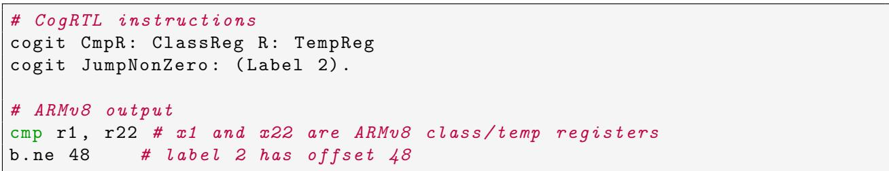
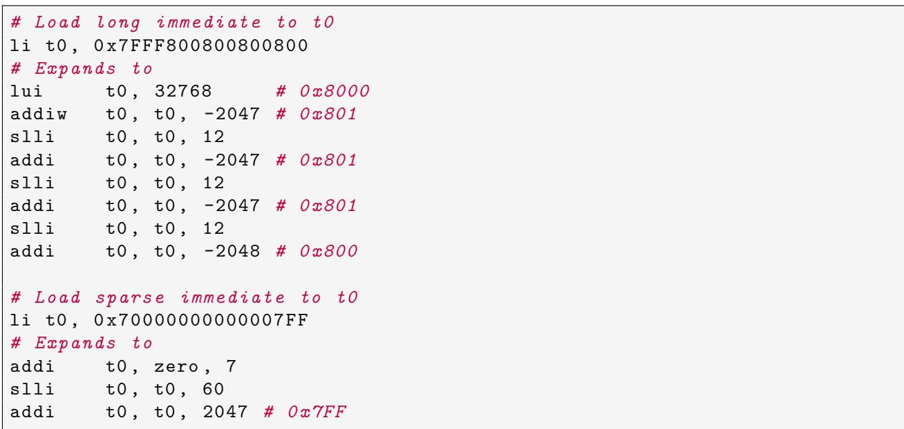

# Porting a JIT Compiler to RISC-V: Challenges and Opportunities 图表详解

### Figure 1: Slang VM transpilation.

- 图片展示了 Pharo VM 的 **Slang transpilation** 流程，核心是将用受限 Smalltalk 编写的 VM 源码转换为 C 语言代码。
- 整个流程分为左右两部分：左侧为 **Smalltalk 环境中的 VM 组件**，右侧为 **C 语言编译与执行流程**。
- 左侧组件自上而下包括：
    - **JIT Compiler**
    - **Bytecode Compiler**
    - **Garbage Collector**
    - **Interpreter**（包含 Dispatch、Load/Store、Arithmetic、Function Call 四个子模块）
- 右侧流程从左到右依次为：
    - **Production VM in C**（由 Slang 转换而来）
    - **Routines + Plugins**（作为附加模块链接）
    - 最终通过 **GCC 或 Clang 编译**生成可执行文件（**Executable**）
- 关键连接箭头表明：左侧的整个 VM 架构通过 **Slang** 工具被“转译”（Transpiled）为 C 语言代码，进入右侧的编译链。
- 此设计允许开发者在 **Pharo Smalltalk 环境中直接调试和模拟 VM 行为**，无需频繁切换到 C 语言环境，极大提升开发效率。
- 该架构体现了 **元循环虚拟机（metacircular VM）** 的设计理念：VM 自身用高级语言编写，并能自我模拟和调试。

| 阶段     | 输入              | 处理工具    | 输出       |
| -------- | ----------------- | ----------- | ---------- |
| 开发阶段 | Smalltalk VM 源码 | Slang       | C 语言源码 |
| 编译阶段 | C 语言源码 + 插件 | GCC / Clang | 可执行程序 |

- **Slang 的作用**是限制 Smalltalk 特性（如多态、异常），确保其能正确映射到 C 语言结构，同时保留 VM 的可调试性和可扩展性。
- 此图强调了 **开发便利性与生产性能之间的平衡**：开发时在 Smalltalk 中高效迭代，发布时通过 C 编译获得高性能。

### Figure 2: Cogit compilation phases.

- 图片展示了 **Cogit** JIT 编译器的三阶段编译流程，整体结构清晰，分为 **ISA agnostic**（与指令集无关）和 **Code Generation**（代码生成）两大区域。
- 第一阶段为 **Bytecode Scanning**，目标是从字节码中提取元数据（如方法是否需要栈帧），该阶段不涉及具体架构，属于 **ISA agnostic**。
- 第二阶段为 **Bytecode Parsing**，将字节码转换为中间表示 **CogRTL IR**，同样属于 **ISA agnostic**，确保前端逻辑独立于目标平台。
- 第三阶段为 **Code Generation**，负责将 **CogRTL IR** “具体化”为对应架构的机器码（Concretize IR in Machine Code），这是唯一依赖目标 ISA 的部分，需为每个新架构重写。
- 三个阶段通过箭头串联，形成线性流程：**Bytecodes → Bytecode Scanning → Bytecode Parsing → Code Generation → Machine Code**。
- 图中虚线框标注了各阶段的目标（Step Objectives），强调每一步的功能边界。
- 整体设计体现了 **解耦思想**：前两阶段保持通用，仅第三阶段适配不同架构，极大简化了跨平台移植工作。

| 阶段 | 名称              | 是否 ISA 无关 | 主要任务                 | 输出         |
| ---- | ----------------- | ------------- | ------------------------ | ------------ |
| 1    | Bytecode Scanning | 是            | 提取元数据（如栈帧需求） | 元数据       |
| 2    | Bytecode Parsing  | 是            | 转换字节码为 CogRTL IR   | CogRTL IR    |
| 3    | Code Generation   | 否            | 将 IR 转换为机器码       | Machine Code |

- 此图是理解 **Pharo VM** 如何支持多架构的关键，尤其在移植到 **RISC-V** 时，只需重写第三阶段，前两阶段可复用。
- 图中“**Concretize IR in Machine Code**”明确指出该阶段是“具体化”，即从抽象 IR 到具体机器指令的映射，是架构差异的核心处理点。

### 9a08b27be50372f3a6ae6a6fa72ebdd1e30abc4693a6ce41086a653a28a9bfb8.jpg

- 图片展示了 **CogRTL** 中间表示（IR）指令及其在 **ARMv8** 架构下的机器码生成结果，用于说明条件跳转的编译过程。
- 代码分为两部分：上半部分为 **CogRTL IR 指令**，下半部分为对应的 **ARMv8 输出**。
- **CogRTL 指令** 包含两条：
    - `cogit CmpR: ClassReg R: TempReg`：比较类寄存器与临时寄存器。
    - `cogit JumpNonZero: (Label 2).`：若比较结果非零，则跳转到标签 2。
- **ARMv8 输出** 对应两条汇编指令：
    - `cmp r1, r22`：比较寄存器 r1 与 r22，其中注释说明 r1 和 r22 分别对应 ARMv8 的 class/temp 寄存器。
    - `b.ne 48`：若不相等则跳转，偏移量为 48，注释指出标签 2 的偏移为 48。
- 此示例体现 **一比一映射** 特性：CogRTL 的每条 IR 指令直接对应一条 ARMv8 机器指令，无需额外处理或重写。
- 该映射依赖于 ARMv8 支持 **条件码标志位**，即 `cmp` 指令隐式设置状态标志，后续 `b.ne` 根据标志位决定是否跳转。
- 与 RISC-V 的对比中，此映射方式无法直接复用，因 RISC-V 不提供条件码，需通过组合指令实现类似逻辑。
- 下表总结关键指令映射关系：

| CogRTL IR 指令              | ARMv8 机器码  | 说明                         |
| --------------------------- | ------------- | ---------------------------- |
| `CmpR: ClassReg R: TempReg` | `cmp r1, r22` | 比较两个寄存器，设置条件标志 |
| `JumpNonZero: (Label 2)`    | `b.ne 48`     | 根据标志位跳转，偏移 48      |

- 此图作为论文第 3.1 节“中间表示不匹配”的例证，突出 RISC-V 与 x86/ARM 在条件分支处理上的根本差异。

### 2ebc0cac7ecfd21c8d87ef4b86d873d71b66937dfdec5776e7fe04bbe97d43a6.jpg

- 该图片展示了一段 Smalltalk 代码，属于 Pharo VM 的 Cogit JIT 编译器，具体为 `CogCompiler >> noteFollowingConditionalBranch:` 方法的实现。

- 此方法的核心功能是**处理 RISC-V 架构下无条件码的分支指令生成问题**。它通过“向后看”（look-ahead）的方式，将原本依赖隐式标志位的 IR 指令序列（如 `CmpRR` + `JumpZero`）重写为 RISC-V 原生支持的显式比较跳转指令（如 `BrEqualRR`）。

- 代码逻辑分为三个主要部分：

    - **提取下一个指令的操作码**：根据 `nextInstruction` 的操作码（如 `JumpZero`, `JumpNonZero`），映射到对应的 RISC-V 分支操作码（如 `BrEqualRR`, `BrNotEqualRR`）。
    - **提取当前指令的操作数**：根据当前指令的操作码（如 `CmpRR`, `CmpCqR`），提取用于比较的源操作数，并可能引入临时寄存器（`TempReg`）来处理立即数。
    - **重写指令序列**：将原指令序列替换为新的、符合 RISC-V 规范的指令，并返回修改后的 `nextInstruction`。

- 关键变量与操作说明：

| 变量/操作                         | 作用                                                              |
| :-------------------------------- | :---------------------------------------------------------------- |
| `newBranchOpcode`                 | 根据后续跳转指令确定最终要生成的 RISC-V 分支操作码。              |
| `newBranchLeft`, `newBranchRight` | 存储用于比较的左、右操作数。                                      |
| `opcode := Label`                 | 将原 `CmpRR` 指令标记为 `Label`，使其在后续阶段被忽略或移除。     |
| `MoveCqR`                         | 当遇到 `CmpCqR` 时，先将立即数移动到临时寄存器 `TempReg` 中。     |
| `rewriteOpcode:with:with:`        | 执行核心的指令重写操作，将 `nextInstruction` 替换为新的分支指令。 |

- 代码中使用了 Smalltalk 的 `caseOf:` 语法进行模式匹配，体现了其面向对象和消息传递的特性。
- 注释 `"Opcode extraction from the next instruction"` 和 `"Operands extraction from the current instruction"` 清晰地标明了代码的两个关键步骤。
- 最后一行 `^ nextInstruction` 表示方法返回被重写后的指令对象，供后续的机器码生成阶段使用。
- 此设计避免了为 RISC-V 重新定义整个 CogRTL IR，而是通过在**汇编阶段增加一个预处理步骤**来解决架构差异，是一种典型的“适配层”解决方案。

### 988a85933dbf9e32d0a401304b81615aa7ae2862f1eb32096eeb0d866d07825c.jpg

- 图片展示了 RISC-V 架构下两个典型操作的**软件模拟实现**：左移旋转（`rol`）和加法溢出检查（`addoverflow`），体现了 RISC-V 通过简单指令组合替代复杂指令的设计哲学。
- **左移旋转 `rol` 实现**：
    - 使用四条 RISC-V 指令完成，无专用 `rol` 指令。
    - 第一步 `sll rd, rs1, rshamt`：将源寄存器 `rs1` 左移 `rshamt` 位，结果存入目标寄存器 `rd`。
    - 第二步 `sub temp, zero, rshamt`：计算负的移位量，用于后续右移。
    - 第三步 `srl temp, rs1, temp`：将 `rs1` 右移 `(xlen - rshamt)` 位，结果存入临时寄存器 `temp`。
    - 第四步 `or rd, rd, temp`：将前两步结果进行按位或运算，完成旋转。
- **软件溢出检查 `addoverflow` 实现**：
    - 通过比较操作数与结果的符号位变化来判断溢出。
    - 第一步 `add t0, t1, t2`：执行实际加法，结果存入 `t0`。
    - 第二步 `slti t3, t2, 0`：获取第二个操作数 `t2` 的符号位（0 或 1）。
    - 第三步 `slt t4, t0, t1`：比较结果 `t0` 是否小于第一个操作数 `t1`。
    - 第四步 `bne t3, t4, overflow`：若符号位与大小关系不一致，则跳转至 `overflow` 标签，表示发生溢出。
- 该图示例说明了 RISC-V 的设计权衡：**牺牲单指令效率换取硬件简化**，将复杂性转移至编译器或运行时。
- 下表总结了两个操作的指令序列及其功能：

| 操作          | 指令序列                    | 功能描述                                   |
| ------------- | --------------------------- | ------------------------------------------ |
| `rol`         | `sll`, `sub`, `srl`, `or`   | 通过移位和逻辑或组合实现左旋               |
| `addoverflow` | `add`, `slti`, `slt`, `bne` | 通过符号位与大小比较检测有符号整数加法溢出 |

- 这些实现方式在 RISC-V 中是常见模式，尤其在未启用 B 扩展（含 `rol` 指令）或未提供硬件溢出标志的情况下。

### 475a4001aab7301a4beeae96db5252a6aa8e77127d30fe368aa85b8acc650584.jpg

- 该图片展示了 Pharo VM 中 `CogRISCV64Compiler` 类的 `concretizeCall` 方法实现，用于将中间表示（IR）中的“调用”指令转换为 RISC-V 64 位机器码。

- 此方法的核心挑战在于处理 **RISC-V 的 PC 相对寻址**和**符号扩展**机制，因为直接跳转目标地址可能超出单条指令的立即数范围。

- 方法逻辑分为三个主要阶段：计算偏移量、修正符号扩展、发射机器指令。

- **计算偏移量阶段**：

    - 首先提取目标地址与当前程序计数器（PC）之间的差值（即 `offset`）。
    - 将该差值拆分为两部分：
        - **低12位 (`offsetLow`)**：通过 `bitAnd: 16rFFF` 获取，用于 `jalr` 指令的立即数字段。
        - **高20位 (`offsetHigh`)**：通过右移12位并进行符号扩展修正后获取，用于 `auipc` 指令。

- **符号扩展修正阶段**：

    - 关键步骤是 **“11th bit correction for sign extension”**。
    - 由于 `jalr` 指令的12位立即数字段在使用时会进行符号扩展，如果原始偏移量的第11位为1，则会导致错误的符号扩展。
    - 修正方法是：在右移前向 `offset` 加上 `16r800`（即 2048），确保当第11位为1时，右移后的高位能正确反映符号。
    - 最终结果再通过 `bitAnd: 16rFFFFF` 截取为20位。

- **发射机器指令阶段**：

    - 使用 `auipc` 指令加载高20位到寄存器 `ConcreteIPReg`（通常是 `x1`，即 `ra` 寄存器）。
    - 紧接着使用 `jalr` 指令，以 `ConcreteIPReg` 为基址，加上低12位偏移量，并将返回地址存入 `LR`（链接寄存器）。
    - 整个过程生成两条指令，总长度为8字节（`machineCodeSize := 8`）。

- **关键数据表**：

| 步骤 | 操作                                                                                                          | 目的                                               |
| :--- | :------------------------------------------------------------------------------------------------------------ | :------------------------------------------------- |
| 1    | `offsetLow := self computeSignedValue64Bits: (offset bitAnd: 16rFFF)`                                         | 提取低12位，用于 `jalr` 的立即数。                 |
| 2    | `offsetHigh := (((self computeSignedValue64Bits: offset) + 16r800) >> 12) bitAnd: 16rFFFFF`                   | 修正第11位符号扩展问题，提取高20位，用于 `auipc`。 |
| 3    | `self machineCodeAt: 0 put: (self addUpperImmediateToPC: offsetHigh toRegister: ConcreteIPReg)`               | 发射 `auipc` 指令，加载高20位。                    |
| 4    | `self machineCodeAt: 4 put: (self jumpTo: ConcreteIPReg withOffset: offsetLow andStorePreviousPCPlus4in: LR)` | 发射 `jalr` 指令，完成跳转并保存返回地址。         |

- 此实现体现了 RISC-V 架构设计哲学：**通过简单指令组合实现复杂功能**，而非提供单一复杂指令。
- 该方法是 **JIT 编译器**中处理跨模块或动态调用的关键环节，其正确性直接影响程序执行流。
- 符号扩展修正逻辑是 RISC-V 特有的工程细节，凸显了从 x86/ARM 移植 JIT 编译器时面临的底层架构差异。

### 2510b3040a23551d3f63aacf485cbf0d54c80111473b6b41a9cb854d3a648462.jpg

- 图片展示了 RISC-V 汇编中 `li`（load immediate）伪指令在不同场景下的实际展开过程，体现了 RISC-V 在处理大立即数时的复杂性。
- **核心问题**：RISC-V 为简化硬件设计，不提供直接加载 64 位立即数的单条指令，而是通过组合 `lui`、`addi`、`slli` 等基础指令来实现。
- 第一个例子是加载一个**密集型大立即数** `0x7FFF800800800800` 到寄存器 `t0`。该值无法用一条指令表示，因此被分解为一系列操作：
    - 首先使用 `lui` 加载最高 20 位（`32768` 对应 `0x8000`）。
    - 接着通过多次 `addiw` 和 `slli` 组合，逐步填充低位并修正符号扩展带来的偏差（如 `-2047`、`-2048`）。
    - 最终通过 8 条指令完成加载，体现了“从高位到低位”递归构建的策略。

| 步骤 | 指令                  | 作用                    |
| ---- | --------------------- | ----------------------- |
| 1    | `lui t0, 32768`       | 加载高 20 位 (`0x8000`) |
| 2    | `addiw t0, t0, -2047` | 修正低 12 位并移位      |
| 3    | `slli t0, t0, 12`     | 左移 12 位              |
| 4    | `addi t0, t0, -2047`  | 再次修正并移位          |
| 5    | `slli t0, t0, 12`     | 左移 12 位              |
| 6    | `addi t0, t0, -2047`  | 再次修正并移位          |
| 7    | `slli t0, t0, 12`     | 左移 12 位              |
| 8    | `addi t0, t0, -2048`  | 最终修正得到目标值      |

- 第二个例子是加载一个**稀疏型立即数** `0x70000000000007FF`，其有效位集中在高位和低位。

    - 编译器优化后仅需 3 条指令：`addi` 初始化为 `7`，`slli` 左移 60 位，再 `addi` 加上 `2047`（即 `0x7FF`）。
    - 这种情况显著减少了指令数量，说明 RISC-V 的立即数加载逻辑会根据数值的“稀疏性”进行优化。

- **关键术语保留**：`li`, `lui`, `addi`, `slli`, `addiw` 均为 RISC-V 标准指令或伪指令。

- **设计哲学体现**：这种展开机制反映了 RISC-V “硬件极简、软件补偿”的设计理念，将复杂性转移至编译器层面。

- **对 JIT 编译器的影响**：在 Cogit 这类 JIT 编译器中，此类展开意味着一个简单的 `li` 操作可能膨胀为多达 8 条机器指令，增加了代码体积和 patching 复杂度。

- **解决方案提示**：论文中提到的“out-of-line literals”策略可规避此问题——将大常量存入内存，通过 `auipc` + `ld` 两条指令访问，从而避免复杂的立即数展开。

### Figure 3: Inline and out-of-line literals.

- 图片展示了 **Pharo VM** 中两种处理字面量（Literals）的策略：**Inline literals** 与 **Out-of-line literals**，用于解决 RISC-V 架构下立即数加载的复杂性。
- 左侧为 **Inline literals** 模式：
    - 字面量直接嵌入生成的机器码中。
    - 适用于小数值（如 ≤12位），可被单条指令容纳。
    - 对于大数值，需拆分为多条指令（如 `lui` + `addi` + `slli` 等），可能导致代码膨胀。
- 右侧为 **Out-of-line literals** 模式：
    - 字面量被集中存储在独立区域（类似 `.data` 段），机器码中仅保留指向它们的引用。
    - 引用通过固定长度指令序列（如 `auipc` + `ld`）访问，始终占用 **两条指令**。
    - 由 **Literals Manager** 统一管理字面量位置与引用更新。
- 两种模式对比：

| 特性            | Inline Literals                | Out-of-line Literals             |
| --------------- | ------------------------------ | -------------------------------- |
| 存储位置        | 嵌入机器码中                   | 独立内存区域                     |
| 访问方式        | 直接使用立即数                 | 通过 PC-relative 地址加载        |
| 指令开销        | 小数值：1条；大数值：最多8条   | 固定2条（auipc + ld）            |
| 代码膨胀风险    | 高（尤其大立即数）             | 低（字面量集中存储）             |
| 补丁/重定位支持 | 复杂（需重新生成多条指令序列） | 简单（只需更新字面量内容或引用） |
| Pharo 实现名称  | InlineLiteralsCompiler         | OutOfLineLiteralsCompiler        |

- 在 Pharo 的 Cogit 编译器中，当字面量超过 **12位** 时，自动切换至 **Out-of-line literals** 模式，以规避 RISC-V 立即数扩展的复杂逻辑。
- 此设计显著简化了 **代码修补（Code patching）** 流程，尤其在 JIT 运行时动态更新调用目标或内联缓存时，避免因立即数重编码导致的指令序列重构。
