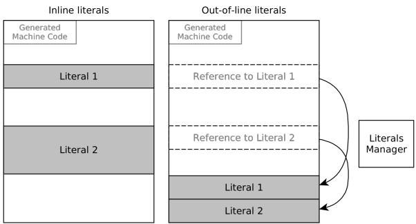
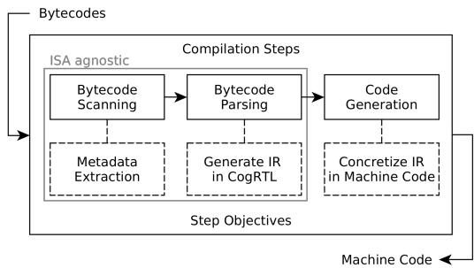
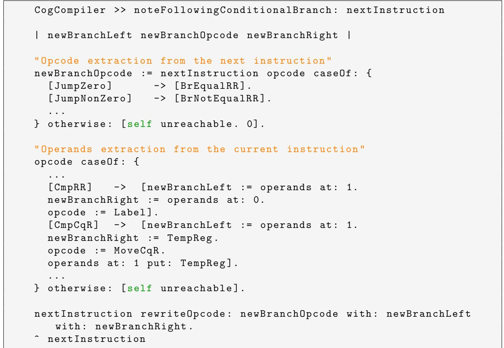

# Porting a JIT Compiler to RISC-V: Challenges and Opportunities 论文解析

## 0. 论文基本信息

**作者 (Authors)**: Quentin Ducasse, Guillermo Polito, Pablo Tesone, et al.

**发表期刊/会议 (Journal/Conference)**: MPLR

**发表年份 (Publication Year)**: 2022

**研究机构 (Affiliations)**: Laboratoire Lab-STICC - ENSTA Bretagne, France, CNRS, INRIA - Centrale Lille, UMR 9189 CRIStAL, France

______________________________________________________________________

## 1. 摘要

**目的**

- 将 **Pharo** 虚拟机的 **JIT** 编译器 **Cogit** 从其原生的 **x86** 架构移植到新兴的 **RISC-V** 指令集架构（ISA）。
- 探索 **RISC-V** 的**模块化与可扩展性**特性，为虚拟机（如垃圾回收、安全机制）或特定应用（如信号处理、机器学习）设计和原型化**自定义指令**。
- 系统性地识别并解决 **x86** 启发式编译器设计与 **RISC-V** 简约主义哲学之间的根本性冲突。

**方法**

- **利用现有开发框架**：依托 **Pharo** 强大的元循环开发环境，通过 **Slang** 转译器将 VM 代码转为 C，并在 **Pharo** 高级环境中进行大部分开发和调试。
- **构建 ISA-agnostic 测试套件**：开发了一个包含约 **1400** 个可配置测试的套件，覆盖从单字节码重编译到多态内联缓存（**Polymorphic Inline Cache**）生成等核心功能，确保移植的正确性。
- **采用模拟与仿真**：使用 **Unicorn** 处理器模拟器执行生成的 **RISC-V** 机器码，并通过钩子（hooks）机制模拟**自定义指令**的行为，实现无需真实硬件的快速原型验证。
- **针对性解决架构冲突**：
    - **条件码缺失**：重构具体化（concretization）阶段，将 `Cmp`/`Jump` 指令对合并为单一的 RISC-V 分支指令（如 `bne`），而非依赖隐式标志寄存器。
    - **立即数加载**：引入 **OutOfLineLiteralsCompiler**，将大于 **12-bit** 的立即数存储在代码附近的内存中，通过 `auipc`/`ld` 指令序列（固定两指令）访问，避免复杂的多指令立即数合成。
    - **符号扩展处理**：在调用（call）指令的具体化和代码修补（code patching）逻辑中，显式处理 **12-bit** 偏移量的符号扩展问题，确保地址计算正确。
         *Figure 3: Inline and out-of-line literals.*

**结果**

- 成功实现了 **Cogit** 到 **RISC-V** 的开源移植，使其能在 **RV64GC** 平台上运行完整的 **Pharo** 虚拟机。
- 有效解决了 **RISC-V** 与 **x86** 启发式 **JIT** 设计之间的四大主要冲突：**中间表示（IR）不匹配**、**条件码处理**、**指令扩展**以及**立即数加载**。
- 建立了一套高效的开发流程，结合 **ISA-agnostic** 测试、**VM** 仿真和**机器码调试器**，显著降低了移植和未来维护的复杂度。
- 实现了一个灵活的**自定义指令仿真框架**，允许开发者在 **Pharo** 环境中通过定义方法来模拟新指令的行为，为硬件-软件协同设计提供了低成本的实验平台。

**结论**

- 将为 **CISC** 架构（如 **x86**）设计的 **JIT** 编译器移植到 **RISC-V** 这类简约 **RISC** 架构时，会遇到由**设计理念差异**（如无条件码、有限寻址模式）带来的显著挑战。
- 通过**工具链创新**（如 **ISA-agnostic** 测试、高级仿真）和**针对性的设计选择**（如 **OutOfLineLiterals**、重构具体化逻辑），可以有效克服这些挑战，而无需完全重写中间表示（**IR**）。
- **RISC-V** 的**可扩展性**为虚拟机优化开辟了新途径。本文提出的自定义指令原型方法，为未来探索利用**硬件加速**来增强 **VM** 组件（如实现 **RIMI** 安全模型）或特定领域应用奠定了坚实基础。长期来看，可能需要一个更抽象、与 **ISA** 解耦的 **IR** 来更好地适应多样化的硬件架构。

______________________________________________________________________

## 2. 背景知识与核心贡献

**研究背景**

- **RISC-V** 是一种开源、模块化且可扩展的指令集架构 (ISA)，其设计理念是将复杂性从硬件转移到编译器，从而简化处理器设计。这导致它与传统的 **x86** 等 CISC 架构存在显著差异。
- 许多现有的 **JIT (Just-in-Time) 编译器**（如 Pharo VM 的 **Cogit**）最初是为 x86 架构设计的，其内部的中间表示 (IR) 和代码生成逻辑深度依赖于 x86 的特性，例如 **条件码 (condition codes)** 和复杂的寻址模式。
- 将这类 JIT 编译器移植到 RISC-V 时，会遇到根本性的不匹配问题，因为 RISC-V **缺乏条件码**、**寻址模式单一**，并且许多复杂操作（如大立即数加载、旋转）需要通过多条简单指令组合实现。

**研究动机**

- **首要动机**是让完整的 **Pharo 虚拟机**能够在 **RISC-V** 架构上运行，以利用该平台日益增长的生态。
- **核心动机**是探索 RISC-V 的 **可扩展性**，特别是通过定义和实验 **自定义指令 (custom instructions)** 来加速虚拟机的关键组件（如垃圾回收、安全机制）或特定应用（如信号处理、机器学习）。
- 需要一套高效的方法论和工具链来应对移植过程中的挑战，并支持未来在硬件-软件协同设计方面的快速原型开发。

**核心贡献**

- **开源实现**: 提供了一个 **开源的 Cogit RISC-V JIT 编译器** 实现，填补了 Pharo 生态在 RISC-V 平台上的空白。
- **挑战分析**: 系统性地识别并阐述了将一个 **x86 启发式** 的 JIT 编译器移植到 RISC-V 时所面临的主要 **设计冲突 (clashes)**，包括：
    - **中间表示 (IR) 不匹配**: CogRTL IR 依赖隐式的条件码，而 RISC-V 没有。
    - **指令扩展 (Instruction Expansion)**: RISC-V 需要用多条指令模拟 x86 中的单条复杂指令（如旋转、溢出检查）。
    - **立即数处理**: RISC-V 的立即数加载（尤其是 64 位）非常复杂，涉及符号扩展和多指令序列。
- **解决方案与设计选择**: 提出了具体的工程策略来解决上述冲突：
    - **条件码处理**: 通过在代码生成阶段进行 **回溯 (backtracking)**，将 `Cmp` + `Jump` 的 IR 序列融合成一条 RISC-V 分支指令。
    - **立即数优化**: 引入 **OutOfLineLiteralsCompiler**，将大立即数存储在代码附近的内存中，通过 `auipc`/`ld` 序列（固定两条指令）访问，避免了内联立即数可能膨胀至 **8 条指令** 的问题。
         *Figure 3: Inline and out-of-line literals.*
- **开发工具与环境**: 展示了一套强大的、与 ISA 无关的开发和测试框架，极大简化了移植工作：
    - 一个包含 **1400 个测试** 的 **ISA-agnostic test harness**，用于验证 VM 核心功能。
    - 利用 **Pharo 的 VM 模拟框架**，使大部分开发工作能在高级语言环境中完成，并使用其原生调试工具。
    - 一种通过 **Unicorn 处理器模拟器** 的钩子机制来 **模拟自定义指令** 的方法，允许在不修改硬件的情况下，在 Pharo 环境中快速原型化和测试新的 RISC-V 指令。

______________________________________________________________________

## 3. 核心技术和实现细节

### 0. 技术架构概览

**整体技术架构**

本文描述了将 **Pharo** 虚拟机（VM）的 **JIT** 编译器 **Cogit** 从 **x86** 架构移植到 **RISC-V** 架构的整体技术方案。该架构的核心在于解决 **x86** 启发式设计与 **RISC-V** 精简指令集原则之间的根本性冲突，并利用 **Pharo** 自身强大的元循环（meta-circular）和仿真能力来简化开发流程。

- **核心组件分层**:

    - **应用层**: **Pharo** 语言及其运行时环境，基于纯面向对象和消息传递模型。
    - **虚拟机层**: **Pharo VM** 本身，包含一个字节码解释器、**Cogit JIT** 编译器和一个分代垃圾回收器。
    - **编译与移植层**:
        - **Slang**: 一种 **VM** 专用的 **Smalltalk** 子集，用于编写 **VM** 逻辑，并被转译（transpiled）为 **C** 代码。这使得开发者可以在 **Pharo** 环境中直接仿真和调试 **VM** 的大部分行为。
        - **Cogit JIT**: 采用三阶段编译流程：**Bytecode scan**（提取元数据）、**Bytecode parsing**（生成中间表示 **IR**）和 **Machine code generation**（即 concretization，生成目标机器码）。其中，前两个阶段是 **ISA-agnostic**（指令集无关）的，只有最后的 concretization 阶段需要为 **RISC-V** 重新实现。
             *Figure 2: Cogit compilation phases.*
    - **目标硬件层**: **RISC-V** 指令集架构，以其开放性、模块化和可扩展性为特点。

- **关键中间表示 (IR) 与挑战**:

    - **CogRTL**: Cogit 使用的 **2-address-code IR**。其历史设计紧密围绕 **x86** 的特性，特别是对**条件码**（condition codes）的依赖。
    - **主要冲突点**:
        - **RISC-V** 缺乏**条件码**寄存器，而 **CogRTL** 的许多指令（如 `CmpCqR`/`Jump<Condition>` 序列）隐式依赖此状态。
        - **RISC-V** 的立即数加载、分支偏移等操作均为**符号扩展**（sign-extension），且立即数位宽有限（通常为12位），导致复杂地址或大常量的处理变得繁琐。
        - 许多在 **x86** 中为单条指令的操作（如旋转、溢出检查）在 **RISC-V** 基础指令集中需要通过**指令组合**（instruction expansion）来实现。

- **解决方案与设计选择**:

    - **条件码处理**: 未重写整个 **IR**，而是在 **concretization** 阶段进行**指令序列重写**。当检测到条件跳转指令时，回溯并将其与前一条比较指令合并，生成 **RISC-V** 风格的寄存器-寄存器比较跳转指令（如 `bne`）。
        
    - **大立即数处理**: 引入 **OutOfLineLiteralsCompiler**。对于超过12位的立即数，不再尝试将其编码进指令流，而是将其作为**字面量**（literals）存放在代码附近的内存区域，并通过 `auipc`/`ld` 指令对进行访问，从而将最坏情况下的8条指令缩减为稳定的2条。
         *Figure 3: Inline and out-of-line literals.*
    - **符号扩展修正**: 在生成调用（`call`）等指令时，显式检查立即数的高位，必要时进行手动修正以抵消**符号扩展**带来的副作用。
        

- **开发与仿真环境**:

    - **VM 仿真框架**: 利用 **Slang** 的特性，整个 **VM**（包括 **JIT** 生成的代码）可以在 **Pharo** 环境中被完整仿真。**JIT** 代码通过 **Unicorn** 处理器模拟器执行。
    - **ISA-agnostic 测试套件**: 包含约1400个可配置测试，覆盖从简单字节码重编译到多态内联缓存（**Polymorphic Inline Cache**）等核心功能，确保新后端的正确性。
    - **自定义指令仿真**: 通过 **Unicorn** 的 `UC_INSN_INVALID` 钩子，可以捕获未定义的**自定义指令**，并在 **Pharo** 环境中用 **Smalltalk** 方法模拟其行为，从而实现硬件-软件协同设计的快速原型验证。
    - **Slang 转译流程**:
         *Figure 1: Slang VM transpilation.*

### 1. CogRTL IR to RISC-V Concretization with Conditional Code Handling

**核心挑战：IR与ISA的语义鸿沟**

- **CogRTL IR** 的设计深受 **x86** 架构影响，其条件跳转逻辑依赖于隐式的**条件码 (condition codes)**。
    - 典型的 IR 指令序列为 `CmpCqR` (比较寄存器与立即数) 后紧跟 `Jump<Condition>` (如 `JumpZero`)。
    - 在 **x86** 或 **ARMv8** 上，这可以被直接、线性地映射为两条机器指令（`cmp` + `jz`），因为比较指令会设置状态寄存器（flag register）。
- **RISC-V ISA** 的核心设计原则之一是**简化处理器硬件**，因此**完全摒弃了条件码和状态寄存器**。
    - 所有分支指令（如 `beq`, `bne`, `blt`）都是**显式比较两个寄存器**的值，并根据结果决定是否跳转。
    - 这导致了一个根本性的不匹配：CogRTL 的两步式（比较+跳转）抽象无法在 RISC-V 上找到直接的一对一指令对应。

**解决方案：具体化阶段的指令融合重写**

- 为了解决上述不匹配，作者没有选择重构整个 **CogRTL IR**（这会影响所有现有后端），而是在 **RISC-V 后端的具体化 (concretization) 阶段**引入了一个**上下文感知的重写机制**。
- 该机制的核心思想是：当编译器在处理一个比较指令（如 `CmpRR` 或 `CmpCqR`）时，它会**向前窥探 (look-ahead)** 下一条 IR 指令。
- 如果下一条指令是一个条件跳转（`Jump<Condition>`），则触发一个**融合重写流程**，将这两条 IR 指令**合并**并**转换**为一条或多条符合 RISC-V 语义的指令。

**算法流程与关键处理**

- **检测与通知**：
    - 在遍历 IR 列表进行具体化时，遇到 `Jump<Condition>` 指令，编译器会向其前驱指令（即比较指令）发送一个**通知**，表明其结果将被用于一个条件分支。
- **操作数提取与指令转换**：
    - **对于 `CmpRR` (寄存器-寄存器比较)**：
        - 直接提取两个源寄存器的操作数。
        - 将 `CmpRR` IR 指令本身**转换为一个无操作的 `Label`**（即从输出中移除）。
        - 将提取的两个寄存器和跳转偏移量传递给一个新的、融合后的分支指令（如 `BrEqualRR`）的具体化逻辑，最终生成如 `beq r1, r2, offset` 的 RISC-V 代码。
    - **对于 `CmpCqR` (立即数-寄存器比较)**：
        - 由于 RISC-V 分支指令不能直接与立即数比较，需要先将立即数加载到一个**临时寄存器 (temp register)** 中。
        - 将 `CmpCqR` IR 指令**重写为一个 `MoveCqR` (将立即数移入临时寄存器)** 指令。
        - 然后，像处理 `CmpRR` 一样，将临时寄存器和原寄存器作为操作数，传递给融合后的分支指令的具体化逻辑。
            

**输入输出关系及在整体中的作用**

- **输入**：一个线性的 **CogRTL IR** 指令序列，其中包含 `Cmp*` 和 `Jump<Condition>` 指令对。
- **输出**：符合 **RISC-V ISA** 规范的机器码指令序列，其中条件分支由单条 `bXX` 指令实现，必要时辅以 `li` 或 `mv` 指令来处理立即数。
- **在整体 JIT 编译流程中的作用**：
    - **弥合抽象差距**：该方案巧妙地在**后端**解决了**前端 IR** 与**目标 ISA** 之间的语义不匹配问题，避免了对整个编译器架构的颠覆性修改。
    - **维持开发效率**：使得大部分与 ISA 无关的编译逻辑（字节码扫描、解析）得以复用，仅需重写具体化阶段，极大地降低了移植成本。
    - **保障性能**：通过指令融合，生成了与手写 RISC-V 汇编同样高效的代码，避免了因模拟条件码而引入额外的、不必要的指令开销。

### 2. Out-of-Line Literals Management

**核心观点**

- **OutOfLineLiteralsCompiler** 的设计初衷是为了规避 RISC-V ISA 在处理大立即数（immediate values）时的固有复杂性。由于 RISC-V 指令集采用固定长度编码（通常为32位），其立即数字段宽度受限（如12位），导致加载一个完整的64位常量可能需要多达 **8条指令** 的组合（如 `lui`, `addi`, `slli` 等）。
- 该方案的核心思想是将大于 **12位** 的字面量（literals）从指令流中“搬出”，存储在代码附近的专用内存区域（类似于传统汇编中的 `.data` 段），从而将复杂的立即数加载过程，简化为一个固定的、两指令的内存加载序列。

**实现原理与算法流程**

- **字面量管理器 (LiteralsManager)**：编译器内部维护一个 **LiteralsManager** 组件，用于追踪当前编译单元（通常是单个方法）所需的所有字面量。
- **决策阈值**：在 **concretization**（机器码生成）阶段，对于每一个需要嵌入立即数的中间表示（IR）指令，编译器会调用一个名为 `usesOutOfLineLiteral` 的函数进行判断。
    - 该函数的**核心参数**是字面量的位宽。
    - **决策规则**：如果字面量的绝对值无法用 **12位有符号立即数**（即范围 [-2048, 2047]）精确表示，则将其标记为 **out-of-line literal**。
- **内存布局**：所有被标记为 out-of-line 的字面量会被收集并连续地存放在 JIT 代码块末尾的一个预留区域中。
- **指令生成**：当需要访问一个 out-of-line 字面量时，编译器不再尝试生成复杂的立即数加载序列，而是生成一个标准的 **PC-relative** 内存加载序列：
    1. 使用 **`auipc`**（Add Upper Immediate to PC）指令，将字面量所在内存区域的高20位地址加载到一个临时寄存器中。
    1. 紧接着使用 **`ld`**（Load Doubleword）或 `lw`（Load Word）等指令，以 `auipc` 结果为基地址，加上一个12位偏移量，完成对字面量的实际加载。
- 这个 `auipc` + `ld` 的组合**始终是两条指令**，无论字面量本身的大小或稀疏程度如何。

 *Figure 3: Inline and out-of-line literals.*

**输入输出关系及在整体中的作用**

- **输入**：来自 CogRTL 中间表示（IR）的指令，这些指令包含需要作为操作数的字面量（例如 `MoveCqR` 指令中的常量）。
- **处理**：
    - 编译器分析字面量大小。
    - 小于等于12位的字面量走 **InlineLiteralsCompiler** 路径，直接尝试嵌入指令。
    - 大于12位的字面量被 **LiteralsManager** 收集，并在代码区外分配存储空间。
- **输出**：
    - 对于 out-of-line 字面量，生成固定的 **`auipc`/`ld`** 两指令序列。
    - 在代码块末尾附加一个包含所有大字面量的数据区域。
- **在整体中的作用**：
    - **简化代码生成**：将一个 NP-hard 风格的立即数最优编码问题（如 LLVM 和 GCC 所做的复杂递归优化），降级为一个简单的内存分配和固定模式指令生成问题。
    - **稳定代码尺寸**：确保任何字面量的加载开销都是可预测的 **2条指令**，避免了 inline 方案中指令数量（1-8条）的剧烈波动，有利于 JIT 代码缓存（code cache）管理和分支预测。
    - **简化 Code Patching**：在动态类型语言中，JIT 代码经常需要被修补（patching），例如更新内联缓存（Polymorphic Inline Cache）中的类指针或方法地址。如果这些地址是大立即数，inline 方案的 patching 逻辑必须能处理1到8条指令的任意组合，极其复杂。而 out-of-line 方案只需修改数据区域中的一个值，patching 逻辑变得**极其简单和健壮**，因为指令序列本身是固定不变的。

### 3. ISA-Agnostic Test Harness and VM Simulation Framework

**ISA-Agnostic Test Harness 的设计与实现**

- 该测试套件的核心目标是解耦 **VM 功能逻辑** 与 **特定 ISA (Instruction Set Architecture)** 的实现细节，从而在移植 JIT 编译器时能快速验证新后端的正确性。
- 测试套件包含约 **1400 个可配置测试**，覆盖范围从最基础的单字节码（bytecode）重编译，到复杂的 **Polymorphic Inline Cache (PIC)** 生成逻辑。
- 其工作原理基于 **Cogit JIT 编译器的三阶段架构**：
    - **Bytecode scan phase** 和 **Bytecode parsing phase** 是 **ISA-agnostic** 的，它们将 Pharo 字节码转换为中间表示 **CogRTL IR**。
    - **Machine code generation phase (concretization)** 是 ISA-specific 的。
- 测试套件通过固定输入的字节码序列，捕获并验证 CogRTL IR 的生成结果。对于机器码生成阶段，则通过模拟器执行并检查其行为是否符合预期，而非直接比对二进制机器码。
- 这种设计使得开发者可以在 **Pharo 高级环境** 中编写和运行绝大多数测试，充分利用其强大的 **native tools**（如调试器、对象检查器），而无需依赖目标硬件。

**VM Simulation Framework 的架构与流程**

- 该框架利用 **meta-circular** 特性，即 Pharo VM 本身是用 Smalltalk (Slang) 编写的，并可通过 **Slang** 转译为 C 代码。
- 开发者可以在 Pharo 环境中直接运行一个 **VM Simulator**，它使用 Pharo 对象来模拟真实 VM 的内存布局和状态。
    -  *Figure 1: Slang VM transpilation.*
- JIT 生成的机器码并不直接在宿主机上执行，而是交由一个 **processor emulator** —— **Unicorn** —— 来执行。
- 框架的关键在于处理 **JIT 代码与 VM 其余部分（如解释器、原语）的交互**：
    - 当 JIT 代码需要调用一个 **trampoline** 或 **primitive** 时，模拟器会为其分配一个 **fake address**。
    - Unicorn 在尝试访问这些无效地址时会触发 **UC_MEM_UNMAPPED** 错误。
    - 模拟框架通过预设的 **hook** 捕获此错误，将控制权交还给 Pharo 环境中的对应模拟方法，执行完后再将控制权交还给 Unicorn 继续执行 JIT 代码。
- 整个流程使得开发者能够在完全受控的高级环境中，对 JIT 生成的低级机器码进行端到端的功能验证和调试。

**对 RISC-V 移植工作的关键作用**

- **硬件无关开发**：在缺乏真实 RISC-V 硬件或其性能不足以支持高效开发循环的情况下，该模拟框架允许团队在 x86 或 ARM 主机上完成绝大部分 RISC-V JIT 后端的开发和调试工作。
- **加速调试**：结合 Pharo 内置的 **machine code debugger**，开发者可以直观地查看 **CogRTL IR**、生成的 **RISC-V 汇编** 以及 **trampoline stubs** 之间的映射关系，极大地简化了调试过程。
- **验证复杂逻辑**：对于 **code patching**（如 PIC 更新、GC 引用更新）这类高度依赖 ISA 特性的复杂操作，模拟器提供了一个安全的沙箱环境来验证其正确性。
- **无缝集成**：整个开发、测试、调试流程都发生在 **Pharo 环境** 内部，形成了一个高效的闭环，显著降低了移植工作的认知负荷和工程成本。

______________________________________________________________________

**Custom Instruction Simulation 扩展机制**

- 为了支持 RISC-V 的 **extensibility** 特性，该模拟框架被进一步扩展以支持 **custom instructions** 的原型设计。
- 其实现巧妙地复用了 Unicorn 的错误处理机制：
    - 当 Unicorn 遇到一条无法识别的指令时，会抛出 **UC_INSN_INVALID** 错误。
    - 框架注册一个 hook 来捕获此错误。
    - Hook 会从当前指令指针处 **提取 opcode 和 operands**。
    - 然后在 Pharo 环境中查找一个与该 opcode 对应的 **simulation method**。
    - 如果找到，则调用该方法执行自定义逻辑，之后将控制权交还给 Unicorn。
- 这一流程使得开发者能够以极低的成本（仅需在 Pharo 中定义一个方法）来 **prototype** 新的硬件指令，并立即在完整的 VM 环境中测试其效果，为 **hardware-software co-design** 提供了强大的支持。

### 4. Custom Instruction Prototyping via Simulator Hooks

**实现原理**

- 该方案的核心在于利用 **Unicorn** 处理器模拟器提供的 **hook（钩子）机制**，特别是对 **UC_INSN_INVALID** 错误的捕获能力。
- 当 JIT 编译器生成的机器码中包含一个标准 RISC-V ISA 未定义的 **自定义指令 (custom instruction)** 时，Unicorn 在执行到该指令时会抛出 **UC_INSN_INVALID** 异常。
- 开发者预先注册一个错误处理钩子 (hook)，专门监听此异常。一旦触发，控制流会立即从 Unicorn 模拟器中断，并跳转到 Pharo 环境中的一个预定义方法。
- 该 Pharo 方法负责解析无效指令的原始字节码，提取其 **opcode** 和 **operands**，然后根据 opcode 查找并调用对应的 **Pharo 模拟方法 (simulation method)** 来执行该自定义指令的逻辑。
- 执行完毕后，控制流无缝返回给 Unicorn，使其能继续执行后续的机器码，从而在不修改底层模拟器的情况下，实现了对自定义指令的动态、可编程的仿真。

**算法流程**

- **1. 指令生成阶段**:
    - 在 Cogit JIT 编译器的 **concretization（具体化）** 阶段，当遇到需要映射为自定义硬件功能的 IR 指令时，编译器会直接生成该自定义指令的 **机器码字节序列**。
    - 同时，该自定义指令的 **opcode** 被注册到 Cogit 的一个内部列表中，用于后续的模拟识别。
- **2. 模拟执行阶段**:
    - Pharo VM 的测试或开发环境启动，通过 **Unicorn** 加载并开始执行 JIT 生成的代码。
    - **3. 异常触发与拦截**:
        - Unicorn 执行流遇到未知的自定义指令，触发 **UC_INSN_INVALID** 错误。
        - 预先安装的钩子捕获此错误，并暂停 Unicorn 的执行。
    - **4. 指令解析与分派**:
        - 钩子函数从 Unicorn 的上下文中读取当前 **程序计数器 (PC)** 指向的指令字节。
        - 解析出指令的 **opcode**，并查询 Cogit 维护的已知自定义指令列表。
        - 如果找到匹配项，则进一步解析出指令的操作数（如寄存器索引、立即数等）。
    - **5. Pharo 方法执行**:
        - 钩子调用一个通用的分派方法，该方法根据 **opcode** 动态查找并执行一个与之绑定的 **Pharo 方法**。
        - 这个 Pharo 方法完全用 Smalltalk 编写，可以访问整个 Pharo 对象内存和开发工具，从而以**高抽象级别**实现自定义指令的语义。
    - **6. 状态同步与恢复**:
        - Pharo 方法执行完毕后，将其计算结果写回到 Unicorn 模拟的 **寄存器状态** 或 **内存** 中。
        - 钩子将 Unicorn 的 **PC** 推进到下一条指令，并恢复执行。

**参数设置与输入输出关系**

- **输入**:
    - **自定义指令的机器码**: 由 JIT 编译器生成，是整个流程的触发源。
    - **Unicorn 模拟状态**: 包含完整的 CPU 寄存器文件和内存映射，作为自定义指令执行的上下文。
- **输出**:
    - **更新后的模拟状态**: 自定义指令的执行结果会修改 Unicorn 中的寄存器或内存，这些变更对后续的机器码执行是可见的。
    - **开发反馈**: 由于整个过程在 Pharo 环境中进行，开发者可以使用 **对象检查器 (object inspector)**、**调试器 (debugger)** 等工具实时观察自定义指令的执行效果和副作用。
- **关键参数**:
    - **Opcode 映射表**: 一个从自定义指令 opcode 到 Pharo 方法选择器 (selector) 的字典，是连接机器码世界和 Pharo 对象世界的桥梁。
    - **钩子优先级**: 在 Unicorn 中注册的钩子需要正确配置，以确保能捕获到指令无效异常。

**在整体系统中的作用**

- **快速原型验证 (Rapid Prototyping)**: 该机制允许开发者在**无需真实硬件**或复杂的 RTL 仿真的情况下，快速迭代和验证自定义指令的设计。这极大地降低了硬件-软件协同设计的门槛。
- **无缝集成开发体验**: 由于自定义指令的行为由 Pharo 方法定义，开发者可以充分利用 Pharo 强大的 **元循环 (meta-circular)** 特性，在同一个环境中同时开发 VM、JIT 编译器和硬件扩展的逻辑。
- **支持高级研究**: 如论文结论所述，此框架为探索 **RISC-V J extension** 或 **RIMI** 等安全模型提供了理想的实验平台。研究人员可以先在模拟环境中完整地实现和测试新指令集对 VM（如垃圾回收、JIT 代码保护）的影响，再决定是否投入硬件实现。
- **降低开发成本**: 相比于使用 **Pydgin** 等需要预先定义指令行为并重新生成整个模拟器的方案，基于 Unicorn 钩子的方法**侵入性更低、灵活性更高**，新增或修改自定义指令的成本仅为编写一个新的 Pharo 方法。

______________________________________________________________________

## 4. 实验方法与实验结果

**实验设置**

- 该研究的核心并非传统意义上的性能基准测试，而是**JIT编译器的移植工程**。其“实验”主要体现在**功能正确性验证**和**开发方法论**上。
- **核心工具链**：
    - **VM Simulation Framework**: 利用Pharo强大的元循环特性，在Pharo环境中直接模拟整个VM（包括JIT生成的机器码），无需依赖真实RISC-V硬件。
    - **ISA-agnostic Test Harness**: 一个包含约**1400个可配置测试**的套件，覆盖从单字节码重编译到多态内联缓存（**Polymorphic Inline Cache**）生成等核心VM功能。这些测试在移植到ARMv8时已被证明有效。
    - **Machine Code Debugger**: 一个专用的调试器，用于可视化和探索生成的机器码、IR以及它们之间的映射关系，极大简化了开发过程。
- **处理器模拟器**: 使用**Unicorn**框架来执行JIT生成的RISC-V机器码，并通过其hook机制处理未映射内存访问（用于模拟trampoline调用）和无效指令（用于模拟自定义指令）。

**结果数据**

- 论文成功实现了**Cogit RISC-V JIT编译器**的开源实现，这是其最核心的成果。
- 移植工作克服了RISC-V ISA与原有x86-inspired编译器设计之间的多个关键冲突，证明了在**无真实硬件**的情况下，通过高级仿真环境完成复杂系统软件（如JIT编译器）移植的可行性。
- 成功构建了一个**自定义指令原型框架**，允许开发者在Pharo环境中快速定义、模拟和测试新的RISC-V指令，为未来的硬件/软件协同设计铺平了道路。
- 论文并未提供具体的**性能指标**（如Speedup, IPC, Throughput）或与其他JIT（如V8, OpenJ9）在RISC-V上的对比数据，因为其重点在于**功能实现**和**工程挑战**的解决。

**消融实验**

- 论文没有进行典型的消融实验（Ablation Study），即系统地移除某个组件以量化其贡献。
- 然而，论文通过对比不同的**设计选择**，间接展示了各种解决方案的必要性和权衡：
    - **条件码处理**：对比了两种方案——(1) 在JIT上下文中重新定义标志寄存器（scratch registers），这会破坏IR到机器码的一对一映射；(2) 在具体化（concretization）阶段重构指令序列（如将`CmpCqR` + `JumpZero`合并为`BrEqualRR`）。后者被采用，因为它更符合RISC-V的设计哲学。
    - **立即数加载策略**：对比了**Inline Literals**（将字面量直接嵌入指令流）和**Out-of-Line Literals**（将大字面量放在附近内存区域）。
        - 对于RISC-V，由于其固定长度指令集和复杂的立即数加载逻辑（最多可展开为**8条指令**），团队选择了**Out-of-Line Literals**方案。
        - 该方案通过`auipc`/`ld`指令对（始终为**2条指令**）来访问大字面量，简化了代码生成和后续的**code patching**（代码修补）逻辑。
        - 这一设计决策本身就是对“内联立即数”方案在RISC-V上不适用性的一种“消融”论证。

 *Figure 3: Inline and out-of-line literals.*

______________________________________________________________________
