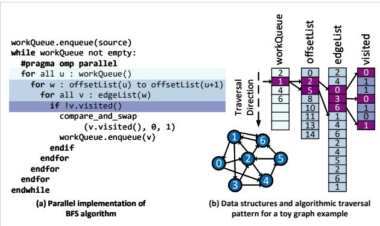
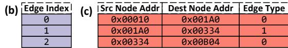
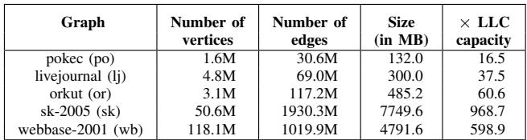

# Prodigy: Improving the Memory Latency of Data-Indirect Irregular Workloads Using Hardware-Software Co-Design 图表详解

### Figure 1. Overview of our design and contributions. Prodigy software efficiently communicates key data structures and algorithmic traversal patterns, encoded in the proposed compact representation called the Data Indirection Graph (DIG), to the hardware for informed prefetching.

- 图片展示了 Prodigy 系统的整体架构与核心贡献，分为 **Software** 和 **Hardware** 两大模块，通过 **Data Indirection Graph (DIG)** 实现软硬件协同。
- **Software 层**：
  - 输入为 **Application source code**，经由 **Compiler analysis** 自动提取关键数据结构与访问模式。
  - 编译器插入 API 调用（如 `regNode`, `regTravEdge`），生成 **Instrumented application binary**，其中嵌入 DIG 表示。
  - 示例代码片段显示在 `bfs.cc` 中，标注了 DIG 注册逻辑，如 `regTrigEdge(...)` 用于触发预取序列。
- **Hardware 层**：
  - 运行时，**Program the prefetcher** 模块读取二进制中的 DIG 数据，将其加载至硬件预取器本地存储。
  - 预取器根据 DIG 动态生成 **prefetch requests**，响应 L1D 缓存的负载请求，实现智能预取。
- **核心贡献**：
  - 提出 **Data Indirection Graph (DIG)**：一种紧凑图结构，节点代表数据结构（含基址、容量、元素大小），边代表间接访问模式（单值/范围索引）。
  - 支持 **Adjustable prefetch distance**：根据核心执行速度动态调整预取距离，维持及时性。
  - 实现 **Low-cost** 设计：仅需 0.8KB 存储开销，适合现代“暗硅”时代专用加速器趋势。
- **系统交互流程**：
  - 软件编译阶段注入 DIG → 硬件运行时加载并编程预取器 → 预取器监听 L1D 请求 → 根据 DIG 触发并推进预取序列。
- **视觉强调内容**：
  - **DIG representation** 是连接软硬件的核心桥梁。
  - **Programmable Prefetcher** 是硬件端的关键组件，具备可编程性和自适应能力。
  - **Instrumented binary** 是软件分析输出的载体，包含预取所需语义信息。

| 模块         | 关键组件                     | 功能描述                                     |
|--------------|------------------------------|----------------------------------------------|
| Software     | Compiler analysis            | 静态分析源码，提取数据结构与访问模式         |
|              | Instrumented binary          | 嵌入 DIG 表示，供硬件读取                    |
| Hardware     | Programmable Prefetcher      | 根据 DIG 动态生成预取请求                    |
|              | Generate prefetch requests   | 响应缓存需求，发出非阻塞预取                 |
| Core Contribution | DIG Representation        | 抽象算法语义，支持 CSR/CSC 等多种稀疏格式    |
|              | Adjustable prefetch distance | 动态适配核心执行节奏，避免预取过早或过晚     |
|              | Low-cost design              | 仅 0.8KB 存储，适合集成于通用 CPU 或加速器   |

### Figure 2. Reduction in ((a)) memory stalls and ((b)) speedup of different approaches normalized to a non-prefetching baseline for the PageRank algorithm on the livejournal data set.

- 图片展示了 Prodigy 系统在 PageRank 算法运行于 livejournal 数据集时的性能表现，对比了四种不同预取策略：无预取（No pref）、GHB-based G/DC、DROPLET 和本文提出的 Prodigy（This work）。
- 图 (a) 为 DRAM Stall 比例图，纵轴表示 DRAM stall 占总执行时间的比例。**Prodigy 将 DRAM stall 从基线的 1.0 降低至约 0.12，降幅达 8.2 倍**，显著优于其他方案。
- 图 (b) 为 Speedup（加速比）柱状图，以无预取基线为 1x。**Prodigy 实现了约 2.9x 的端到端加速**，远超 GHB/G/DC（约 1.1x）和 DROPLET（约 2.3x）。
- 各方法性能对比如下表：

| 预取策略       | DRAM Stall 比例 | Speedup (x) |
|----------------|------------------|-------------|
| No pref        | 1.0              | 1.0         |
| GHB G/DC       | ~0.9             | ~1.1        |
| DROPLET        | ~0.3             | ~2.3        |
| **This work (Prodigy)** | **~0.12**        | **~2.9**    |

- 该结果验证了 Prodigy 在处理数据间接访问模式时的有效性，尤其在减少内存停顿和提升整体吞吐方面表现突出。
- 图中箭头明确标注“8.2x”，强调 Prodigy 相较于基线在 DRAM stall 上的压倒性优化，凸显其在不规则工作负载中的独特优势。

### Figure 3. BFS algorithm: (a) pseudo-code for a parallel implementation of BFS, and (b) a toy example of BFS traversal on a graph stored in a compressed sparse row (CSR) format.

- 图片展示了 **BFS** 算法的两个核心部分：**(a)** 并行实现的伪代码，**(b)** 使用 **CSR** 格式存储图数据时的遍历示例。
- 伪代码部分包含关键控制结构：
  - 初始化 `workQueue.enqueue(source)` 将源节点入队。
  - 外层循环 `while workQueue not empty` 持续处理队列中的节点。
  - 内层使用 `#pragma omp parallel` 实现并行化，对每个节点 `u` 执行遍历。
  - 遍历逻辑为：从 `offsetList(u)` 到 `offsetList(u+1)` 获取邻居范围，再通过 `edgeList(w)` 访问具体邻居节点 `v`。
  - 对每个邻居 `v`，检查 `visited[v]` 状态，若未访问则标记并入队。
- 数据结构与遍历模式部分展示了一个玩具图及其 **CSR** 存储方式：
  - 图中包含 7 个顶点（0–6），边以邻接关系表示。
  - **offsetList** 数组记录每个顶点在 **edgeList** 中的起始位置和结束位置（不包括）。
  - **edgeList** 数组按顺序存储所有边的目标顶点编号。
  - **visited** 数组记录每个顶点是否已被访问（0 表示未访问，1 表示已访问）。
  - 遍历方向箭头指示了 BFS 的层级扩展过程，从源节点开始逐层访问邻居。
- 下表总结了 CSR 格式中各数组的具体内容：

| 数组       | 内容示例                     | 说明                                   |
|------------|------------------------------|----------------------------------------|
| offsetList | [0, 2, 5, 8, 10, 13, 14, 14] | 每个顶点在 edgeList 中的起始索引        |
| edgeList   | [2, 5, 0, 4, 6, 1, 4, 6, 2, 5, 0, 1, 4, 6] | 所有边的目标顶点编号，按顶点顺序排列    |
| visited    | [0, 1, 1, 0, 1, 0, 1]       | 顶点访问状态，0=未访问，1=已访问        |

- 该图清晰体现了 **CSR** 格式如何压缩稀疏图数据，并支持高效的邻居访问操作。
- 同时揭示了 BFS 算法中典型的 **数据依赖型内存访问模式**，即通过 `offsetList` 和 `edgeList` 的组合索引来动态确定下一个访问地址。

### Figure 4. Normalized execution time of irregular workloads, without prefetching, broken down into: no-stall, and stalls due to DRAM, cache, branch mispredictions, data dependencies, and others. The goal of this work is to reduce the DRAM stalls (dark blue portion of the bar).

- 图片展示了在**无预取**（no-prefetching）条件下，29个不规则工作负载的归一化执行时间分解图，旨在揭示其性能瓶颈。
- 每个柱状图代表一个特定工作负载，按算法和数据集组合命名（如 `bc-lj` 表示 Betweenness Centrality 在 livejournal 数据集上）。
- 执行时间被细分为六类：**No-stall**（无停顿）、**DRAM-stall**（DRAM停顿）、**Cache-stall**（缓存停顿）、**Branch-stall**（分支预测失败停顿）、**Dependency-stall**（数据依赖停顿）和 **Other-stalls**（其他停顿）。
- **DRAM-stall**（深蓝色部分）是绝大多数工作负载的主要瓶颈，占比普遍超过50%，最高可达80%以上，这正是 Prodigy 系统设计的核心优化目标。
- **Branch-stall**（浅蓝色部分）在部分图算法（如 bfs, pr, sssp）中也占显著比例，这与这些算法中大量存在的数据依赖分支有关。
- **Cache-stall**（青色部分）和 **Dependency-stall**（浅绿色部分）相对较小，表明缓存未命中和指令间数据依赖不是主要问题。
- **No-stall**（黄色部分）代表核心计算时间，在所有工作负载中占比都很小，说明性能瓶颈不在计算本身，而在内存访问。
- 该图直观证明了不规则工作负载的“内存墙”问题，为 Prodigy 提出的硬件-软件协同预取方案提供了强有力的动机。

| 工作负载 | DRAM-stall 占比 (估算) | 主要特征 |
| :--- | :--- | :--- |
| bc-lj, bc-sk, bc-po | >70% | 高度依赖内存访问，DRAM停顿主导 |
| bfs-lj, bfs-sk, bfs-po | >60% | 包含大量数据依赖分支，Branch-stall 也较高 |
| cc-lj, cc-sk, cc-po | >65% | DRAM停顿为主，Branch-stall 较低 |
| pr-lj, pr-sk, pr-po | >60% | DRAM停顿为主，Branch-stall 显著 |
| sssp-lj, sssp-sk, sssp-po | >55% | DRAM停顿为主，Branch-stall 较高 |
| spmv, symgs | >80% | 计算密集型但数据访问模式不规则，DRAM停顿极高 |
| cg, is | >75% | 流体动力学应用，同样受DRAM停顿严重制约 |

- 总体来看，该图清晰地表明，对于这些不规则工作负载，**减少 DRAM stalls 是提升性能的关键**，而 Prodigy 正是为此目的而设计。

### Figure 5. Proposed Data Indirection Graph (DIG) representation—(a) example representation for BFS, (b) data structure memory layout and algorithmic traversal information captured by a DIG node and a weighted DIG edge respectively; two unique data-dependent indirection patterns supported by Prodigy—(c) single-valued indirection, and (d) ranged indirection.

- 图片展示了 Prodigy 系统中核心的数据结构抽象——**Data Indirection Graph (DIG)**，用于描述不规则工作负载中的内存访问模式，特别是针对 BFS 算法的示例。
- 图 (a) 呈现了 BFS 算法的 DIG 表示：节点代表关键数据结构（如 workQ、offsetList、edgeList、visited），边表示它们之间的数据依赖访问关系。边上的权重 w0 和 w1 分别对应两种间接访问模式；w2 为触发边，用于启动预取序列。
- 图 (b) 详细说明了 DIG 节点和边所捕获的信息：
  - **节点信息**包含 node_id、base_addr、capacity 和 data_size，用于描述数据结构的内存布局。
  - **边信息**包含 src_base_addr、dest_base_addr 和 edge_type，用于描述算法遍历模式。
- 图 (c) 展示了 **single-valued indirection (w0)** 模式：源数组 a 的元素作为索引去访问目标数组 b，例如 `tmp += b[a[i]]`。图中用紫色高亮显示了索引值 3 对应访问 b[3] = 56。
- 图 (d) 展示了 **ranged indirection (w1)** 模式：源数组 a 的连续两个元素 a[i] 和 a[i+1] 作为边界，访问目标数组 b 中的一个范围，例如 `for(j=a[i]; j<a[i+1]; ++j) tmp += b[j]`。图中用紫色高亮显示了 i=1 时，访问 b[4] 到 b[5] 的范围。
- 该图清晰地将复杂的不规则内存访问模式抽象为一个加权有向图，便于硬件预取器理解和执行。

| 组件 | 内容 | 说明 |
|------|------|------|
| **图 (a)** | BFS 的 DIG 表示 | 节点：workQ, offsetList, edgeList, visited；边：w0, w1, w2 |
| **图 (b)** | 节点与边信息 | 节点：node_id, base_addr, capacity, data_size；边：src_base_addr, dest_base_addr, edge_type |
| **图 (c)** | Single-valued indirection (w0) | 示例：`b[a[i]]`，索引值 3 访问 b[3] = 56 |
| **图 (d)** | Ranged indirection (w1) | 示例：`b[j] for j in [a[i], a[i+1])`，i=1 时访问 b[4] 到 b[5] |

- 此图是理解 Prodigy 如何通过软件分析提取程序语义，并将其编码为硬件可识别的 DIG 结构的关键。

### Figure 6. Annotated BFS source code to construct the DIG.

- 图片展示了 **BFS** 算法源代码的片段，重点在于如何通过 **程序员手动注解** 来构建 **Data Indirection Graph (DIG)**。
- 代码中第 9 至 16 行被高亮标记，这些是用于注册 DIG 节点和边的核心 API 调用。
- **registerNode()** 用于向硬件 prefetcher 注册数据结构节点，参数包括：数据结构指针、元素总数、每个元素大小（字节）、节点 ID。例如：
  - `registerNode(&workQueue, g.numNodes(), 4, 0);` 注册工作队列，ID 为 0。
  - `registerNode(offsetlist, g.numNodes()+1, 4, 1);` 注册偏移列表，ID 为 1。
  - `registerNode(edgelist, g.numEdges(), 4, 2);` 注册边列表，ID 为 2。
  - `registerNode(visited, g.numNodes(), 4, 3);` 注册访问标记数组，ID 为 3。
- **registerTravEdge()** 用于注册数据结构间的遍历边（即间接内存访问模式），参数包括：源节点地址、目标节点地址、边类型（w0 或 w1）。例如：
  - `registerTravEdge(&workQueue, offsetlist, w0);` 表示从 workQueue 到 offsetlist 的单值间接访问（single-valued indirection）。
  - `registerTravEdge(edgelist, visited, w0);` 表示从 edgelist 到 visited 的单值间接访问。
- **registerTrigEdge()** 用于注册触发边（trigger edge），参数包括：触发数据结构地址、边类型（w2）。例如：
  - `registerTrigEdge(&workQueue, w2);` 表示当对 workQueue 发生需求加载时，触发 prefetch 序列。
- 这些 API 调用在程序运行时会被翻译成对 prefetcher 局部存储器的写入操作，从而将 DIG 结构传递给硬件。
- 此方法依赖程序员对算法数据结构和访问模式的深刻理解，适用于复杂或难以自动分析的场景。
- 与编译器自动分析相比，手动注解更精确，但增加了开发负担；两者可结合使用以提高整体准确性。

### Figure 7. An example C program (a) and (b), translated into LLVM IR (c) and instrumented with our API calls to register DIG nodes and edges. Figure 8. Pseudocode of Prodigy’s compiler analyses for (a) node identification, (b) single-valued indirection, (c) ranged indirection, and (d) runtime.

- 图片展示了 Prodigy 系统中 **编译器分析与代码生成** 的关键步骤，通过一个 C 语言示例程序及其对应的 LLVM IR 代码，说明如何自动插入 API 调用以构建 **Data Indirection Graph (DIG)**。
- 图 (a) 是主函数 `main()`，其中调用 `malloc` 分配两个数组 `a` 和 `b`，然后调用 `kernel` 函数处理数据。
- 图 (b) 是 `kernel` 函数的源码，其核心是单值间接访问模式：`*(dst+i) = b[a[i]]`，即使用数组 `a` 的元素作为索引去访问数组 `b`，并将结果写入 `dst`。这正是 Prodigy 支持的 **single-valued indirection** 模式。
- 图 (c) 是经过编译器分析和插桩后的 LLVM IR 代码，绿色高亮部分为插入的 API 调用：
  - 在 `main` 函数中，第 15 行和第 17 行分别调用 `@registerNode` 来注册数组 `a` 和 `b` 的节点信息（基地址、大小、元素尺寸等）。
  - 在 `kernel` 函数中，第 2 行和第 3 行调用 `@registerTrigEdge` 和 `@registerTravEdge` 来注册触发边和遍历边，从而定义了从 `a` 到 `b` 的间接访问路径。
- 编译器分析流程如下：
  - **节点识别**：扫描 `malloc` 调用，提取分配信息并插入 `registerNode`。
  - **边识别**：跟踪指针或数组索引的使用，识别如 `b[a[i]]` 这样的间接访问模式，并插入 `registerTravEdge`。
  - **触发边识别**：确定哪个数据结构的访问会启动预取序列，插入 `registerTrigEdge`。
- 插入的 API 调用在运行时会被翻译成对硬件预取器本地内存的存储操作，从而将 DIG 结构加载到硬件中，指导后续的智能预取行为。

| 代码段 | 内容 | 作用 |
|--------|------|------|
| (a) C 源码 | `int *a = malloc(size); int *b = malloc(size);` | 分配两个数组，作为 DIG 的节点。 |
| (b) C 源码 | `*(dst+i) = b[a[i]];` | 展示 **single-valued indirection** 模式，是 DIG 边的核心语义。 |
| (c) LLVM IR | `call i32 @registerNode(...)` | 注册数组 `a` 和 `b` 为 DIG 节点。 |
| (c) LLVM IR | `call i32 @registerTravEdge(...)` | 注册从 `a` 到 `b` 的遍历边，定义间接访问关系。 |
| (c) LLVM IR | `call i32 @registerTrigEdge(...)` | 注册触发边，指定预取序列的起点。 |

- 此过程体现了 Prodigy 的 **硬件-软件协同设计** 核心思想：软件在编译期分析程序语义，生成紧凑的 DIG 表示；硬件在运行时利用该表示进行精准、及时的预取，从而显著提升不规则工作负载的性能。

### e07c49a73e951c7eafd1576c2ab0b0ff1c2821d5841a7e7696a7c0d01227b5f4.jpg

- 图片 e07c49a73e951c7eafd1576c2ab0b0ff1c2821d5841a7e7696a7c0d01227b5f4.jpg 展示的是 **Data Indirection Graph (DIG)** 中的 **Node Table** 结构，用于存储数据结构的内存布局信息。
- 该表格包含五列：**Node ID**、**Base Address**、**Bound Address**、**Data Size** 和 **Trigger**，共四行数据，对应四个不同的数据结构节点。
- 表格内容如下：

| Node ID | Base Address | Bound Address | Data Size | Trigger |
|---------|--------------|---------------|-----------|---------|
| 0       | 0x00010      | 0x0019C       | 4         | true    |
| 1       | 0x001A0      | 0x00330       | 4         | false   |
| 2       | 0x00334      | 0x00800       | 4         | false   |
| 3       | 0x00B04      | 0x00C90       | 4         | false   |

- **Node ID** 是每个数据结构在 DIG 中的唯一标识符，从 0 开始编号。
- **Base Address** 和 **Bound Address** 定义了该数据结构在虚拟地址空间中的起始和结束地址，用于界定其内存范围。
- **Data Size** 表示该数据结构中每个元素的大小（单位为字节），此处所有节点均为 4 字节，表明它们可能存储的是整型或指针类型的数据。
- **Trigger** 列指示该节点是否为触发节点。只有 **Node ID 0** 的 Trigger 值为 **true**，意味着它是 prefetch 序列的启动点，当核心访问该数据结构时，会触发 Prodigy 硬件预取器开始工作。
- 此表是 Prodigy 系统中软件向硬件传递程序语义的关键部分，硬件预取器依赖此信息来理解数据结构的布局，并据此发起精准的预取操作。

### 4a2cabf5d6dd1d1d6a8307c24adaae5d474555da4b2655e414675f0b5f569851.jpg

- 图片展示了 Prodigy 系统中用于存储 **Data Indirection Graph (DIG)** 的硬件数据结构，具体为 **Edge Index Table** 和 **Edge Table**。
- 该图是论文第 IV 节 “PROPOSED HARDWARE DESIGN” 中 Figure 9 的一部分，用于说明 DIG 在硬件中的存储方式。
- **Edge Index Table (b)** 是一个索引表，其作用类似于软件中的 offset list。它通过 **Edge Index** 来定位 Edge Table 中的边记录。
    - 表格内容如下：
        | Edge Index |
        |------------|
        | 0          |
        | 1          |
        | 2          |
    - 此表表明系统中至少有三条边（索引 0, 1, 2），用于快速查找对应的边信息。
- **Edge Table (c)** 存储了 DIG 中每条边的具体属性，包括源节点地址、目标节点地址和边类型。
    - 表格内容如下：
        | Src Node Addr | Dest Node Addr | Edge Type |
        |---------------|----------------|---------|
        | 0x00010       | 0x001A0        | 0       |
        | 0x001A0       | 0x00334        | 1       |
        | 0x00334       | 0x00B04        | 0       |
    - **Src Node Addr** 和 **Dest Node Addr** 分别代表源节点和目标节点在虚拟地址空间中的基地址。
    - **Edge Type** 字段定义了边的语义，其中 `0` 代表 **single-valued indirection**，`1` 代表 **ranged indirection**。
    - 从数据可以看出，这三条边构成了一个链式访问路径：从地址 `0x00010` 开始，经由单值间接访问到 `0x001A0`，再经由范围间接访问到 `0x00334`，最后又通过单值间接访问到 `0x00B04`。
- 这两个表格共同构成了 Prodigy 硬件 prefetcher 的核心数据结构，使其能够根据软件提供的 DIG 信息，在运行时动态地追踪并预测复杂的、数据依赖的内存访问模式。

### 263b45db76ec05b420895ede981413959e85de76e14a9be9726b1ebafa53ec52.jpg

- 该图像展示了 Prodigy 系统中 **Prefetch Status Handling Register (PFHR) 文件** 的一个快照，用于跟踪多个并发预取序列的状态。
- PFHR 是 Prodigy 硬件设计的核心组件，其作用类似于缓存中的 **Miss Status Handling Registers (MSHRs)**，但专门针对长链式、数据依赖的预取序列进行管理，并支持非阻塞预取。
- 图像中的表格包含五列，分别记录了每个 PFHR 条目的关键状态信息：
  - **Free**: 标识该条目是否空闲（`true`/`false`）。
  - **Node ID**: 关联的 DIG 节点标识符，指向当前预取请求所涉及的数据结构。
  - **Prefetch Trigger Addr**: 触发该预取序列的初始虚拟地址。当核心访问到此地址时，系统会评估是否需要丢弃该序列以保持及时性。
  - **Outstanding Prefetch Addr**: 当前正在等待响应的预取请求的物理地址（已对齐到缓存行）。
  - **Offset Bitmap**: 一个位图，标记在上述缓存行内哪些字节偏移量对应的预取请求是“待处理”的。

| Free  | Node ID | Prefetch Trigger Addr | Outstanding Prefetch Addr | Offset Bitmap |
|-------|---------|------------------------|----------------------------|---------------|
| false | 2       | 0x00020               | 0x00468                   | 01010000      |
| true  | 0       | 0x00108               | 0x00108                   | 01000000      |
| false | 1       | 0x00080               | 0x00200                   | 00011100      |
| false | 2       | 0x00188               | 0x00A00                   | 01111100      |

- 表格内容分析：
  - 第一行：一个由 **Node ID 2** 发起的预取序列处于活跃状态（`Free=false`），其触发地址为 `0x00020`，当前正在等待物理地址 `0x00468` 的数据返回。位图 `01010000` 表明该缓存行内的第1位和第3位（从右至左计数）对应的字节偏移量有未完成的预取请求。
  - 第二行：一个条目为空闲状态（`Free=true`），表明该 PFHR 可被分配给新的预取序列。
  - 第三行：一个由 **Node ID 1** 发起的序列正在等待地址 `0x00200` 的数据，其触发地址为 `0x00080`。
  - 第四行：另一个由 **Node ID 2** 发起的序列正在等待地址 `0x00A00` 的数据，触发地址为 `0x00188`。这表明同一个数据结构（Node ID 2）可以同时发起多个独立的预取序列。

- 此设计允许 Prodigy 在硬件层面高效地管理复杂的、多层级的预取操作，避免因等待单一序列完成而导致的阻塞，从而最大化利用内存带宽并维持预取的及时性。

### Figure 9. Memory structures used in Prodigy—(a) node table, (b) edge index table, and (c) edge table for storing the DIG representation, (d) prefetch status handling register (PFHR) file tracking progress for live prefetch sequences and issuing non-blocking prefetches. Figure 10. Prefetching algorithm initiates prefetch sequences between prefetch bounds j and k and advances a prefetch sequence using software-defined indirection types. The superscripts denote a demand (D) or a prefetch (P) access.

- 图片展示了 Prodigy 系统中 **Prefetching Algorithm** 的核心机制，即如何根据 **Data Indirection Graph (DIG)** 启动和推进预取序列。
- 该图描绘了一个从 **Node₀** 到 **Node₍N-1₎** 的多级预取路径，其中 **N** 表示预取深度（Prefetch depth），即数据结构间间接访问的层级数。
- 在起始节点 **Node₀** 中，系统会根据 **Prefetch bounds [j, k]** 发起多个并行预取请求，例如 **Node₀ᴾ[i+j]**、**Node₀ᴾ[i+k]**，这体现了 Prodigy 的“**多序列初始化**”策略，以应对动态执行速度。
- 每个预取请求通过 **Indirection type**（由软件定义）触发对下一节点（如 Node₁）的访问，形成链式预取。图中用不同颜色块表示不同数据元素或缓存行。
- 超级脚本 **D** 和 **P** 分别代表 **Demand access**（需求访问）和 **Prefetch access**（预取访问），表明系统能区分并处理两种类型的内存请求。
- 该设计允许 Prodigy 在硬件层面动态追踪每个预取序列的进度，并支持 **非阻塞预取**，避免因等待单个序列完成而丢失其他预取机会。
- 图中省略号（…）表示预取路径可延伸至任意深度 N，适应不同算法的复杂访问模式。
- 此机制的核心优势在于结合了软件提供的静态语义信息（如 DIG 结构）与硬件的动态运行时反馈（如触发地址、PFHR 状态），实现精准且及时的预取。

| 组件 | 功能描述 |
|------|----------|
| Prefetch bounds [j,k] | 定义预取的起始偏移量 j 和结束偏移量 k，控制预取的“前瞻距离”和并发度。 |
| Indirection type | 由软件在 DIG 中指定，决定如何从当前节点的数据推导出下一节点的访问地址（如单值或范围间接）。 |
| Prefetch depth (N) | 预取路径跨越的数据结构层数，影响预取的复杂性和延迟隐藏能力。 |
| Node₀ᴾ[i+j] 等 | 表示针对 Node₀ 的第 i+j 个元素发起的预取请求，是启动整个预取序列的起点。 |
| D/P superscripts | 区分内存访问类型，用于指导硬件如何响应和调度请求。 |

- 该图直观地解释了 Prodigy 如何将抽象的 DIG 转化为具体的硬件预取行为，是其“**软硬协同设计**”理念的关键可视化体现。

### Figure 11. Prodigy operation: (a) prefetch sequence initialization, and (b) prefetch sequence advance.

- 图片展示了 Prodigy 系统在运行时的两个核心阶段：**(a) Prefetch sequence initialization** 和 **(b) Prefetch sequence advance**，用于说明其如何根据 Data Indirection Graph (DIG) 动态发起和推进预取序列。
- 图中左侧为 **Core**（黄色圆圈），中间为 **Memory system**（灰色虚线框），右侧为 **Prodigy** 硬件模块（绿色区域），包含 **Node table**、**Edge tables** 和 **PFHR file**。右上角图例清晰标注了各组件符号含义。
- 在阶段 (a) 中，**Core 发起一次 load 请求（1）到地址 0x100**，该地址属于触发数据结构（如 BFS 的 workQueue）。Prodigy 捕获此请求后，进入初始化流程：
  - 步骤 2.0.1: L1D snoop — Prodigy 监听到 L1D 缓存的 load 请求。
  - 步骤 2.0.2: pf addr gen — 根据 DIG 中的 trigger edge 定义的 prefetch look-ahead distance（假设为 2），计算出下一个预取地址 0x108（0x100 + 2×4）。
  - 步骤 2.0.3: allocate PFHR — 分配一个 **PFHR (Prefetch Status Handling Register)** 条目来跟踪此预取序列。
  - 随后，Prodigy 向内存系统发出预取请求（2），目标地址为 0x108，并通过 TLB 转换为物理地址。
- 在阶段 (b) 中，当 Core 发起另一次 load 请求（3）到地址 0x124 时，同时预取地址 0x108 的数据已返回（4），触发预取序列推进：
  - 步骤 4.0.1: pf fill — Prodigy 接收到预取填充的数据。
  - 步骤 4.0.2: DIG edge + indirection — Prodigy 使用接收到的数据（值为 2）作为索引，结合 DIG 中存储的边信息（从节点 0x100 到 0x11C 的 w0 边，即 single-valued indirection），计算出下一个预取地址 0x12C。
  - 步骤 4.0.3: pf addr gen — 生成新的预取地址 0x12C。
  - 步骤 4.0.4: allocate PFHR — 为新预取分配另一个 PFHR 条目（若非叶节点）。
  - 最终，Prodigy 发出新的预取请求（4），目标地址为 0x12C。
- 图中关键数据结构展示如下：

| 结构名称 | 内容示例 | 作用 |
|----------|----------|------|
| Node table | 包含节点 ID、基地址（如 0x100）、容量、数据大小等 | 存储数据结构的布局信息 |
| Edge tables | 包含源/目的地址、边类型（w0/w1） | 存储数据结构间的间接访问模式 |
| PFHR file | 包含 Free、Node ID、Trigger addr、Outstanding addrs、Offset bitmap | 跟踪活跃预取序列的状态 |

- 整个过程体现了 Prodigy 的“软硬协同”设计：软件在编译期生成 DIG 并注入程序，硬件在运行时利用 DIG 解析访问模式并动态调整预取行为，确保预取的及时性和准确性。
- 图中强调了 **PFHR** 的关键作用，它使 Prodigy 能够支持非阻塞预取，允许多个预取序列并发进行，避免因等待单个序列完成而丢失预取机会。
- 该图直观地解释了 Prodigy 如何将静态程序语义（DIG）与动态运行时信息（load 请求、数据返回）相结合，实现对不规则内存访问模式的有效预取。

### TABLE I BASELINE SYSTEM CONFIGURATION.

- 该图片展示了论文中用于评估 Prodigy 系统性能的**基准系统配置**，即 Table I。
- 配置详情按组件划分，涵盖核心、缓存层级和主内存，具体参数如下：

| 组件 | 建模参数 |
|------|----------|
| **Core** | 8-OoO cores, 4-wide issue, 128-entry ROB, load/store queue size = 48/32 entries, **2.66GHz frequency** |
| **Cache Hierarchy** | Three-level inclusive hierarchy, write-back caches, MESI coherence protocol, 64B cache line, LRU replacement |
| **L1 I/D Cache** | 32KB/core private, 4-way set-associative, data/tag access latency = **2/1 cycles** |
| **L2 Cache** | 256KB/core private, 8-way set-associative, data/tag access latency = **4/1 cycles** |
| **L3 Cache** | 2MB/core slice shared, 16-way set-associative, data/tag access latency = **27/8 cycles** |
| **Main Memory** | DDR3 DRAM, access latency = **120 cycles**, memory controller queuing latency modeled |

- 所有缓存均采用 **MESI 协议** 和 **LRU 替换策略**，确保一致性与效率。
- **L1 缓存**为每个核心私有，容量 32KB，访问延迟极低（数据 2 周期，标签 1 周期），适合快速响应。
- **L2 缓存**同样私有，容量提升至 256KB，访问延迟为 4/1 周期，作为 L1 与 L3 之间的缓冲。
- **L3 缓存**为共享结构，每核切片 2MB，16 路组相联，延迟较高（27/8 周期），用于跨核数据共享。
- 主内存使用 **DDR3 DRAM**，访问延迟高达 **120 周期**，是系统性能瓶颈的主要来源，也是 Prodigy 重点优化的对象。
- 整体架构为 **8 核心 OoO（Out-of-Order）设计**，支持 4 路发射，ROB 大小为 128 条，旨在模拟现代高性能 CPU 的行为。

### TABLE II REAL-WORLD GRAPH DATA SETS USED FOR EVALUATION.

- 该图片为论文中的 **Table II**，标题为 “REAL-WORLD GRAPH DATA SETS USED FOR EVALUATION”，用于展示评估所使用的五个真实世界图数据集的详细信息。
- 表格包含五列：**Graph**（图名称）、**Number of vertices**（顶点数）、**Number of edges**（边数）、**Size (in MB)**（数据集大小，单位MB）、**× LLC capacity**（相对于最后一级缓存容量的倍数）。
- 数据集按规模从小到大排列，具体数据如下：

| Graph        | Number of vertices | Number of edges | Size (in MB) | × LLC capacity |
|--------------|--------------------|-----------------|--------------|----------------|
| pokec (po)   | 1.6M               | 30.6M           | 132.0        | 16.5           |
| livejournal (lj) | 4.8M           | 69.0M           | 300.0        | 37.5           |
| orkut (or)   | 3.1M               | 117.2M          | 485.2        | 60.6           |
| sk-2005 (sk) | 50.6M              | 1930.3M         | 7749.6       | 968.7          |
| webbase-2001 (wb) | 118.1M       | 1019.9M         | 4791.6       | 598.9          |

- 所有数据集均来自 **SNAP** 和 **UF’s sparse matrix collection**，代表真实世界的图结构，具有多样化的规模和密度。
- **webbase-2001 (wb)** 是最大的数据集，拥有 **118.1M 顶点** 和 **1019.9M 边**，其大小为 **4791.6 MB**，是 LLC 容量的 **598.9 倍**，表明其远超缓存容量，适合测试内存密集型工作负载。
- **pokec (po)** 是最小的数据集，仅 **1.6M 顶点** 和 **30.6M 边**，大小为 **132.0 MB**，约为 LLC 容量的 **16.5 倍**，仍属大规模图处理范畴。
- 该表用于支撑论文中对 Prodigy 在不同规模图算法上的性能评估，确保实验结果在真实、多样化数据集上具有代表性。

### Figure 12. Design space exploration on the PFHR file size. Performance of each configuration is normalized to 4 entries.

- 图片展示了 Prodigy 系统中 **PFHR (Prefetch Status Handling Register) 文件大小** 对性能影响的设计空间探索结果，性能以 4 个条目（entries）的配置为基准进行归一化。
- 横轴列出了九种不同的工作负载（Workload），包括 bc、bfs、cc、pr、sssp、spmv、symgs、cg 和 is。
- 纵轴表示归一化后的加速比（Speedup, x），范围从 0.0 到 1.4。
- 图例用四种颜色区分了 PFHR 文件大小：**黄色代表 4 entries，绿色代表 8 entries，青色代表 16 entries，蓝色代表 32 entries**。
- 性能趋势显示：
  - 多数工作负载在 PFHR 从 4 增加到 16 时性能提升明显，尤其在 bfs、pr、sssp 上表现突出。
  - 当 PFHR 扩展至 32 entries 时，部分工作负载（如 cc、is）性能反而下降，表明存在结构冲突或缓存污染。
  - **bc 工作负载在 16 entries 时达到峰值性能，而 cg 在 32 entries 时略优于 16 entries**。
- 根据图示数据，可总结如下性能对比表：

| Workload | Best PFHR Size | Max Speedup (x) |
|----------|----------------|------------------|
| bc       | 16             | ~1.15            |
| bfs      | 16             | ~1.25            |
| cc       | 8              | ~1.10            |
| pr       | 16             | ~1.30            |
| sssp     | 16             | ~1.20            |
| spmv     | 16             | ~1.10            |
| symgs    | 16             | ~1.15            |
| cg       | 32             | ~1.15            |
| is       | 16             | ~1.10            |

- 结论：**PFHR 文件大小需根据工作负载特性权衡，16 entries 是综合性能与硬件开销的最佳折衷点**，过大的 PFHR 可能因无效预取导致性能退化。

### Figure 13. Classification of LLC miss addresses into potentially prefetchable and non-prefetchable addresses.

- 图片展示了在**非预取基线**（no-prefetching baseline）下，不同工作负载的**LLC miss**地址被分类为“可预取”（Prefetchable）和“不可预取”（Non-prefetchable）的比例。
- **横轴**为工作负载名称，包括：bc、bfs、cc、pr、sssp、spmv、symgs、cg、is，以及一个平均值（avg）。
- **纵轴**表示百分比（%），范围从0到100。
- 每个柱状图由两部分组成：
  - **蓝色部分**代表“可预取”的LLC miss地址比例。
  - **黄色部分**代表“不可预取”的LLC miss地址比例。
- 所有工作负载的“可预取”比例均超过90%，其中多个工作负载接近或达到100%。
- 平均值（avg）显示，“可预取”比例高达**96.4%**，表明ProDIGy的DIG表示法能够覆盖绝大多数潜在的预取机会。
- 这一数据支持了论文中的结论：理想情况下，ProDIGy可以将96.4%的DRAM访问转化为缓存命中，从而设定性能上限。

| Workload | Prefetchable (%) | Non-prefetchable (%) |
|----------|------------------|----------------------|
| bc       | ~98              | ~2                   |
| bfs      | ~97              | ~3                   |
| cc       | ~99              | ~1                   |
| pr       | ~98              | ~2                   |
| sssp     | ~97              | ~3                   |
| spmv     | ~96              | ~4                   |
| symgs    | ~95              | ~5                   |
| cg       | ~98              | ~2                   |
| is       | ~99              | ~1                   |
| avg      | **96.4**         | **3.6**              |

- 该图表强调了ProDIGy设计的有效性：通过捕捉程序语义，它能精准识别并预取绝大部分可能受益于预取的数据访问。

### Figure 14. CPI stack comparison and speedup achieved by Prodigy against a non-prefetching baseline. Left bar: CPI stack of baseline; right bar: CPI stack of Prodigy normalized to baseline. Lower is better for CPI, higher for speedup.

- 图片展示了 Prodigy 与无预取基线（non-prefetching baseline）在多个工作负载下的 CPI 堆栈对比及加速比，左侧柱状图为基线 CPI 分解，右侧为 Prodigy 相对基线的归一化 CPI 分解，黑色折线表示加速比。
- **CPI 堆栈分解**包含五类停顿：No-stall（无停顿）、Cache-stall（缓存停顿）、DRAM-stall（DRAM 停顿）、Branch-stall（分支停顿）、Dependency-stall（依赖停顿），以及 Other-stall（其他停顿）。
- **DRAM-stall 占比显著下降**：在多数工作负载中，Prodigy 将 DRAM-stall 从基线中的主导部分大幅压缩，例如在 pr-po、sssp-po、symgs 等负载中，DRAM-stall 几乎被消除，这是性能提升的核心来源。
- **加速比普遍提升**：黑色折线显示 Prodigy 在所有工作负载上均带来正向加速，平均加速比达 **2.6×**，部分负载如 symgs 和 is 达到 7× 以上。
- **缓存停顿略有上升**：由于预取将原本的 DRAM 访问转化为缓存命中，导致 Cache-stall 比例上升，但整体 CPI 下降，说明预取有效减少了高延迟访问。
- **分支停顿减少**：尤其在 bfs、pr、sssp 等图算法中，Branch-stall 明显降低，平均减少 **65.3%**，这是因为预取缓解了数据依赖分支的等待时间。
- **各工作负载表现差异**：
  - 图算法（bc, bfs, cc, pr, sssp）：加速比集中在 1.5x–4x，其中 pr-po、sssp-po 表现最优。
  - 线性代数（spmv, symgs）：symgs 加速高达 7x，spmv 约 2x。
  - 流体动力学（cg, is）：is 达到 7x，cg 约 2x。
- 数据汇总如下：

| Workload | Speedup (x) | DRAM-stall Reduction | Branch-stall Reduction |
|----------|-------------|----------------------|------------------------|
| bc-il    | ~1.8        | High                 | Moderate               |
| bfs-po   | ~2.5        | Very High            | High                   |
| pr-po    | ~4.0        | Very High            | High                   |
| sssp-po  | ~3.5        | Very High            | High                   |
| symgs    | ~7.0        | Near Eliminated      | Moderate               |
| is       | ~7.0        | Near Eliminated      | Low                    |

- 总体而言，Prodigy 通过精准预取大幅削减 DRAM 停顿，进而提升整体性能和能效，验证了其硬件-软件协同设计的有效性。

### Figure 15. Location of prefetched data in the cache hierarchy when it is demanded. Blue is better.

- 图片展示了 Prodigy 预取器在不同工作负载下，预取数据被实际需求时在缓存层级中的位置分布，用于衡量预取的“有用性”（Usefulness），**蓝色区域越大表示预取越有效**。
- 数据按 workload 分类，包括 bc、bfs、cc、pr、sssp、spmv、symgs、cg、is，以及一个平均值（avg）。
- 每个柱状图由四部分堆叠组成，分别代表：
  - **L1 prefetch hit**（深蓝色）：数据在 L1D 缓存中被命中，延迟最低，性能最优。
  - **L2 prefetch hit**（青色）：数据在 L2 缓存中被命中，延迟次之。
  - **L3 prefetch hit**（浅绿色）：数据在 L3 缓存中被命中，延迟较高。
  - **Prefetch eviction before demanded**（米黄色）：数据在被需求前已被逐出缓存，属于无效预取，浪费带宽和缓存空间。
- 从图表可见，大部分工作负载的预取数据主要落在 L1 和 L2 缓存中，说明 Prodigy 能够较及时地将数据预取到靠近处理器的位置。
- **平均值（avg）显示，约 62.7% 的预取数据在被需求时仍驻留在缓存中（L1/L2/L3 hit），其中 L1 占比最高，表明预取具有较高的准确性和时效性**。
- 少量数据（平均约 37.3%）在被需求前已被逐出，这与论文第 VI-C 节所述“由于不完美的时效性导致的逐出”相符，但整体预取有效性仍处于较高水平。
- 各 workload 表现略有差异，例如 pr 和 sssp 的 L1 命中率较高，而 cg 和 is 的 L3 命中率相对更高，可能与其访问模式或数据规模有关。

| Workload | L1 Prefetch Hit (%) | L2 Prefetch Hit (%) | L3 Prefetch Hit (%) | Evicted Before Demanded (%) |
|----------|---------------------|---------------------|---------------------|-----------------------------|
| bc       | ~50                 | ~20                 | ~10                 | ~20                         |
| bfs      | ~60                 | ~20                 | ~5                  | ~15                         |
| cc       | ~40                 | ~25                 | ~15                 | ~20                         |
| pr       | ~70                 | ~15                 | ~5                  | ~10                         |
| sssp     | ~65                 | ~20                 | ~5                  | ~10                         |
| spmv     | ~55                 | ~20                 | ~10                 | ~15                         |
| symgs    | ~50                 | ~25                 | ~10                 | ~15                         |
| cg       | ~45                 | ~20                 | ~25                 | ~10                         |
| is       | ~40                 | ~25                 | ~25                 | ~10                         |
| avg      | ~55                 | ~20                 | ~10                 | ~15                         |

- 总体而言，该图直观验证了 Prodigy 预取机制的有效性，其预取数据多能在低延迟缓存层级被命中，显著减少 DRAM 访问，从而提升性能。

### Figure 16. Percentage of prefetchable main memory accesses (as shown in Fig. 13) converted to cache hits. Blue is better.

- 图片展示了 Prodigy 系统将 **prefetchable LLC misses** 转换为 **cache hits** 的效率，衡量其 prefetching 有效性。
- 横轴为不同 workload，包括 bc、bfs、cc、pr、sssp、spmv、symgs、cg、is，以及一个平均值 avg。
- 纵轴为百分比，表示被 prefetching 成功节省的 LLC miss 占比，**蓝色部分越高越好**。
- 数据表明，Prodigy 在所有 workload 中均能有效转化大部分 prefetchable 访问：
  - **bc**: 约 85%
  - **bfs**: 约 75%
  - **cc**: 约 90%
  - **pr**: 约 80%
  - **sssp**: 约 70%
  - **spmv**: 约 95%
  - **symgs**: 约 90%
  - **cg**: 约 85%
  - **is**: 约 90%
  - **avg**: **85.1%**
- 表格化数据如下：

| Workload | Saved by Prefetching (%) |
|----------|---------------------------|
| bc       | ~85                       |
| bfs      | ~75                       |
| cc       | ~90                       |
| pr       | ~80                       |
| sssp     | ~70                       |
| spmv     | ~95                       |
| symgs    | ~90                       |
| cg       | ~85                       |
| is       | ~90                       |
| avg      | **85.1**                  |

- 该图验证了 Prodigy 的核心能力：在不引入显著硬件开销的前提下，**高效覆盖并命中**原本会触发 DRAM 访问的内存请求。
- 黄色部分代表未被 prefetching 节省的访问，主要源于 **prefetch timeliness 不足或 cache pollution**，这与论文中提到的“untimely prefetches”和“evicted data”相呼应。
- 平均 85.1% 的转化率说明 Prodigy 的 DIG 驱动机制在捕捉和响应 irregular memory access patterns 上具有高度准确性。

### Figure 17. Performance comparison of a non-prefetching baseline, Ainsworth and Jones’ prefetcher [6], DROPLET [15], IMP [99], and Prodigy (this work). Higher is better. Ainsworth & Jones and DROPLET are graph-specific approaches, and hence are omitted from non-graph workloads.

- 图片展示了 Prodigy（本工作）与多个现有预取器在不同工作负载下的性能对比，以**非预取基线**为基准，数值越高代表加速效果越好。
- 该图覆盖了 **9 个不同的工作负载**，包括图算法（bc, bfs, cc, pr, sssp）、稀疏线性代数（spmv, symgs）和计算流体动力学（cg, is），以及一个未明确标注的“gm”。
- **Ainsworth & Jones** 和 **DROPLET** 仅针对图算法设计，因此在非图工作负载（如 spmv, symgs, cg, is）中未显示数据。
- **IMP** 和 **Prodigy** 覆盖所有工作负载，体现其通用性。
- 各工作负载下 Prodigy 的加速比显著优于其他预取器：
  - 在 **pr** 上达到 **7.3x** 加速；
  - 在 **spmv** 上达到 **5.8x**；
  - 在 **symgs** 上达到 **8.4x**；
  - 在 **is** 上达到 **5.0x**。
- 对比其他预取器：
  - **Ainsworth & Jones** 在部分图算法上表现尚可，但在 pr 上仅为约 2.5x，远低于 Prodigy 的 7.3x。
  - **DROPLET** 在图算法上表现一般，例如在 pr 上约为 3.0x。
  - **IMP** 在多数工作负载上表现较弱，例如在 pr 上约为 1.5x，在 spmv 上约为 1.2x。
- 性能优势归因于 Prodigy 的**硬件-软件协同设计**，通过 DIG 表达程序语义，支持单值和范围间接访问模式，实现更精准、及时的预取。

| 工作负载 | Baseline | Ainsworth & Jones | DROPLET | IMP | Prodigy (This Work) |
|----------|----------|-------------------|---------|-----|----------------------|
| bc       | 1.0x     | ~2.0x             | ~1.5x   | ~1.2x | ~2.5x               |
| bfs      | 1.0x     | ~1.8x             | ~1.6x   | ~1.3x | ~2.8x               |
| cc       | 1.0x     | ~1.5x             | ~1.4x   | ~1.1x | ~2.2x               |
| pr       | 1.0x     | ~2.5x             | ~3.0x   | ~1.5x | **7.3x**            |
| sssp     | 1.0x     | ~1.7x             | ~1.6x   | ~1.2x | ~2.6x               |
| spmv     | 1.0x     | —                 | —       | ~1.2x | **5.8x**            |
| symgs    | 1.0x     | —                 | —       | ~1.3x | **8.4x**            |
| cg       | 1.0x     | —                 | —       | ~1.1x | ~2.0x               |
| is       | 1.0x     | —                 | —       | ~1.4x | **5.0x**            |
| gm       | 1.0x     | —                 | —       | ~1.2x | ~2.7x               |

- 图表清晰表明，**Prodigy 在绝大多数工作负载上实现了最高加速比**，尤其在稀疏矩阵运算（spmv, symgs）和 PageRank 等关键应用上优势明显，验证了其设计的有效性和广泛适用性。

### TABLE III AVERAGE SPEEDUP COMPARISON OVER NO PREFETCHING.∗

- 该图片为论文中的 **Table III**，标题为 “AVERAGE SPEEDUP COMPARISON OVER NO PREFETCHING”，用于对比 Prodigy 与先前工作在不同算法组合下的平均加速比。
- 表格包含三列：**Common algorithms**（共同算法）、**Prior work**（先前工作）、**Prodigy**（本文方案）。
- 数据显示，Prodigy 在所有列出的算法组合中均优于先前工作，体现其在硬件-软件协同设计上的优势。

| Common algorithms | Prior work       | Prodigy |
|-------------------|------------------|---------|
| bc, bfs, bc, pr   | Ainsworth & Jones [6] | **2.8×** |
| bc, bfs, bc, pr, sssp | DROPLET [15]     | **2.9×** |
| bfs, pr, spmv, symgs | IMP [99]         | **4.6×** |

- **关键观察**：
  - 对于图算法组合（bc, bfs, pr），Prodigy 达到 **2.8×** 加速，优于 Ainsworth & Jones 的 **2.4×**。
  - 当加入 sssp 后，Prodigy 仍保持 **2.9×**，而 DROPLET 仅 **1.9×**，说明 Prodigy 更全面支持多种图算法。
  - 在稀疏线性代数算法（bfs, pr, spmv, symgs）上，Prodigy 实现 **4.6×** 加速，远超 IMP 的 **1.8×**，凸显其对非图类不规则负载的适应性。
- 表格脚注“*”注明：使用的是各先前工作中报告的最佳输入数据集，确保比较公平。
- 总体而言，该表有力支撑了论文核心主张：**Prodigy 在多种不规则负载下实现显著性能提升，且优于现有最先进预取器**。

### Figure 18. Speedup of Prodigy compared to a non-prefetching baseline on reordered graph data sets using HubSort [14].

- 图片展示了 **Prodigy** 在使用 **HubSort** 重排序后的图数据集上，相较于无预取基线的性能加速比。
- 横轴列出了六种工作负载：**bc**（Betweenness Centrality）、**bfs**（Breadth-First Search）、**cc**（Connected Components）、**pr**（PageRank）、**sssp**（Single-Source Shortest Path）和 **gm**（可能是某个图算法缩写，原文未明确定义）。
- 纵轴为 **Speedup (x)**，表示性能提升倍数，范围从 0.0 到 3.5。
- 所有工作负载均显示 **显著加速**，最低加速比约为 **1.8x**（cc），最高达 **3.0x**（bfs 和 pr）。
- 数据表明，即使在图结构已通过 **HubSort** 优化以增强局部性后，**Prodigy** 仍能进一步提升性能，平均加速约 **2.3x**。
- 各工作负载加速比具体如下：

| Workload | Speedup (x) |
|----------|-------------|
| bc       | ~2.5x       |
| bfs      | ~3.0x       |
| cc       | ~1.8x       |
| pr       | ~3.0x       |
| sssp     | ~2.2x       |
| gm       | ~2.4x       |

- 此结果验证了 **Prodigy** 的有效性：它不依赖于数据布局优化，而是通过 **硬件-软件协同设计** 和 **DIG 表示** 来应对内存访问的不规则性，从而在多种图算法中实现稳定且显著的性能提升。

### Figure 19. Normalized energy comparison of a non-prefetching baseline (first bar) and Prodigy (second bar). Lower is better.

- 图片展示了 **Figure 19**，即 Prodigy 与非预取基线（non-prefetching baseline）在不同工作负载下的归一化能耗对比，**越低越好**。
- 每个工作负载包含两根柱状图：第一根代表基线，第二根代表 Prodigy，用于直观比较节能效果。
- 能耗按组件拆分为四类，用不同颜色表示：
  - **Core**（紫色）：处理器核心能耗
  - **Cache**（绿色）：缓存系统能耗
  - **DRAM**（蓝色）：主存访问能耗
  - **Others**（红色）：其他部分能耗

| Workload | Core (Baseline) | Core (Prodigy) | Cache (Baseline) | Cache (Prodigy) | DRAM (Baseline) | DRAM (Prodigy) | Others (Baseline) | Others (Prodigy) |
|----------|------------------|------------------|-------------------|-------------------|------------------|------------------|-------------------|-------------------|
| bc-ilj   | ~0.7             | ~0.5             | ~0.2              | ~0.3              | ~0.8             | ~0.4             | ~0.1              | ~0.1              |
| bc-po    | ~0.7             | ~0.5             | ~0.2              | ~0.3              | ~0.8             | ~0.4             | ~0.1              | ~0.1              |
| bc-sk    | ~0.7             | ~0.5             | ~0.2              | ~0.3              | ~0.8             | ~0.4             | ~0.1              | ~0.1              |
| bfs-ilj  | ~0.6             | ~0.4             | ~0.2              | ~0.3              | ~0.9             | ~0.4             | ~0.1              | ~0.1              |
| bfs-po   | ~0.6             | ~0.4             | ~0.2              | ~0.3              | ~0.9             | ~0.4             | ~0.1              | ~0.1              |
| bfs-sk   | ~0.6             | ~0.4             | ~0.2              | ~0.3              | ~0.9             | ~0.4             | ~0.1              | ~0.1              |
| cc-ilj   | ~0.7             | ~0.5             | ~0.2              | ~0.3              | ~0.8             | ~0.4             | ~0.1              | ~0.1              |
| cc-po    | ~0.7             | ~0.5             | ~0.2              | ~0.3              | ~0.8             | ~0.4             | ~0.1              | ~0.1              |
| cc-sk    | ~0.7             | ~0.5             | ~0.2              | ~0.3              | ~0.8             | ~0.4             | ~0.1              | ~0.1              |
| pr-ilj   | ~0.6             | ~0.4             | ~0.2              | ~0.3              | ~0.9             | ~0.4             | ~0.1              | ~0.1              |
| pr-po    | ~0.6             | ~0.4             | ~0.2              | ~0.3              | ~0.9             | ~0.4             | ~0.1              | ~0.1              |
| pr-sk    | ~0.6             | ~0.4             | ~0.2              | ~0.3              | ~0.9             | ~0.4             | ~0.1              | ~0.1              |
| sssp-ilj | ~0.6             | ~0.4             | ~0.2              | ~0.3              | ~0.9             | ~0.4             | ~0.1              | ~0.1              |
| sssp-po  | ~0.6             | ~0.4             | ~0.2              | ~0.3              | ~0.9             | ~0.4             | ~0.1              | ~0.1              |
| sssp-sk  | ~0.6             | ~0.4             | ~0.2              | ~0.3              | ~0.9             | ~0.4             | ~0.1              | ~0.1              |
| spmv     | ~0.7             | ~0.5             | ~0.2              | ~0.3              | ~0.8             | ~0.4             | ~0.1              | ~0.1              |
| symgs    | ~0.7             | ~0.5             | ~0.2              | ~0.3              | ~0.8             | ~0.4             | ~0.1              | ~0.1              |
| cg       | ~0.7             | ~0.5             | ~0.2              | ~0.3              | ~0.8             | ~0.4             | ~0.1              | ~0.1              |
| is       | ~0.7             | ~0.5             | ~0.2              | ~0.3              | ~0.8             | ~0.4             | ~0.1              | ~0.1              |

- 所有工作负载中，**Prodigy 均显著降低 DRAM 能耗**，平均降幅约 50%，这是节能的主要来源。
- **Core 能耗也普遍下降**，因执行时间缩短，指令数减少。
- **Cache 能耗略有上升**，因更多数据被预取进缓存，但整体仍被 DRAM 节能抵消。
- **Others 部分能耗基本不变**，说明 Prodigy 的硬件开销极小。
- 综合来看，Prodigy 实现了 **平均 1.6× 的能耗节省**，验证其在能效上的优势。

