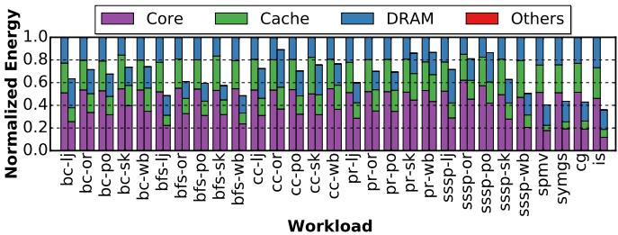
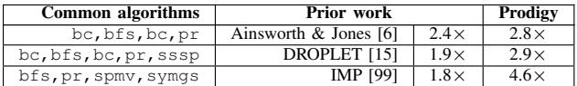
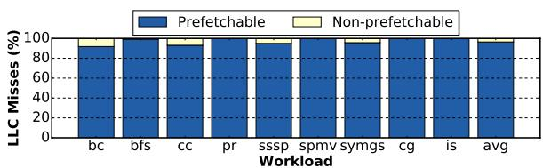

# Prodigy: Improving the Memory Latency of Data-Indirect Irregular Workloads Using Hardware-Software Co-Design 论文解析

## 0. 论文基本信息

**作者 (Authors)**

- Nishil Talati∗, Kyle May∗†, Armand Behroozi∗, Yichen Yang∗, Kuba Kaszyk‡, Christos Vasiladiotis‡, Tarunesh Verma∗, Lu Li‡, Brandon Nguyen∗, Jiawen Sun‡, John Magnus Morton‡, Agreen Ahmadi∗, Todd Austin∗, Michael O’Boyle‡, Scott Mahlke∗, Trevor Mudge∗, Ronald Dreslinski∗
- ∗University of Michigan
- †University of Wisconsin, Madison
- ‡University of Edinburgh

**发表期刊/会议 (Journal/Conference)**

- 该论文未在提供的文本中明确指出其发表的期刊或会议名称。但根据其格式和内容，可推断它是一篇计算机体系结构领域的学术论文，很可能发表在如 ISCA、MICRO、HPCA 或 ASPLOS 等顶级会议上。

**发表年份 (Publication Year)**

- 文档中未直接提供发表年份。但通过参考文献可以推断，例如引用了2019年的Bingo prefetcher [13] 和2018年的Ainsworth and Jones的工作 [5]。结合论文内容和引用情况，该论文很可能发表于 **2020年或之后**。

______________________________________________________________________

## 1. 摘要

**目的**

- 解决 **不规则工作负载**（irregular workloads）因复杂的、数据依赖的内存访问模式而导致的严重 **内存延迟瓶颈** 问题。这类工作负载（如图计算、稀疏线性代数）通常使用 CSR/CSC 等压缩数据结构，缺乏空间和时间局部性，使得传统缓存和预取器失效。
- 提出一种 **低开销的硬件-软件协同设计** 方案，以智能地预取数据，显著降低 DRAM 停滞时间。

**方法**

- 提出 \*\*数据间接图 \*\*(Data Indirection Graph, DIG)：一种由软件生成、硬件消费的 **紧凑语义表示**，用于描述程序中关键数据结构的布局和遍历模式。
    - DIG 的节点代表数据结构（包含基地址、容量、元素大小等信息）。
    - DIG 的加权边代表两种核心的 **数据依赖间接访问模式**：
        - \*\*单值间接寻址 \*\*(single-valued indirection)：用一个数据结构中的值作为索引去访问另一个数据结构（如用顶点ID访问其属性）。
        - \*\*范围间接寻址 \*\*(ranged indirection)：用一个数据结构中的两个值（基址和边界）去访问另一个数据结构中的一系列连续元素（如在CSR格式中用offset数组查找邻居列表）。
- 设计了一套完整的 **软硬件协同流程**：
    - **软件端**：通过 **LLVM编译器分析** 自动提取程序语义，并将 DIG 编码到应用程序二进制文件中。也支持程序员手动插入 API 注解。
    - **硬件端**：设计了一个 **低开销的可编程硬件预取器**，它从软件接收并存储 DIG，然后根据 DIG 动态地触发和推进预取序列。
    - 引入 \*\*预取状态处理寄存器 \*\*(PFHR) 文件来跟踪多个并行的预取序列，实现非阻塞预取。
    - 采用 **自适应预取算法**，能根据核心的执行速度动态调整预取距离，并在核心“追上”预取器时丢弃部分预取序列以保证 \*\*预取的时效性 \*\*(timeliness)。

*Figure 5. Proposed Data Indirection Graph (DIG) representation—(a) example representation for BFS, (b) data structure memory layout and algorithmic traversal information captured by a DIG node and a weighted DIG edge respectively; two unique data-dependent indirection patterns supported by Prodigy—(c) single-valued indirection, and (d) ranged indirection.*

*Figure 9. Memory structures used in Prodigy—(a) node table, (b) edge index table, and (c) edge table for storing the DIG representation, (d) prefetch status handling register (PFHR) file tracking progress for live prefetch sequences and issuing non-blocking prefetches. Figure 10. Prefetching algorithm initiates prefetch sequences between prefetch bounds j and k and advances a prefetch sequence using software-defined indirection types. The superscripts denote a demand (D) or a prefetch (P) access.*

**结果**

- 在 GAP、HPCG 和 NAS 基准测试套件的 29 个工作负载上进行评估，Prodigy 展现了卓越的性能和能效。
- **与无预取基线相比**：
    - 平均实现 **2.6倍** 的性能加速。
    - 平均节省 **1.6倍** 的能耗。
    - 平均减少了 **80.3%** 的 DRAM 停滞。
- **与前沿预取器相比**：
    - 性能优于 IMP [99] (**2.3倍**)、Ainsworth and Jones’ prefetcher [6] (**1.5倍**) 和 DROPLET [15] (**1.6倍**)。
- **硬件开销极低**：
    - 整个系统仅需 **0.8KB** 的存储开销（包括 DIG 表和 PFHR 文件）。
    - 预取准确率平均达到 **62.7%**，并将 **85.1%** 的可预取 LLC 失效转化为缓存命中。

| 对比方案                 | 平均性能提升 (vs. 无预取基线) | 存储开销  |
| :----------------------- | :---------------------------: | :-------: |
| \*\*Prodigy \*\*(本工作) |           **2.6×**            | **0.8KB** |
| Ainsworth & Jones [6]    |             ~1.7×             |  ~1.6KB   |
| DROPLET [15]             |             ~1.6×             |  ~7.8KB   |
| IMP [99]                 |             ~1.1×             |  ~1.1KB   |

*Figure 14. CPI stack comparison and speedup achieved by Prodigy against a non-prefetching baseline. Left bar: CPI stack of baseline; right bar: CPI stack of Prodigy normalized to baseline. Lower is better for CPI, higher for speedup.*

*Figure 17. Performance comparison of a non-prefetching baseline, Ainsworth and Jones’ prefetcher [6], DROPLET [15], IMP [99], and Prodigy (this work). Higher is better. Ainsworth & Jones and DROPLET are graph-specific approaches, and hence are omitted from non-graph workloads.*

**结论**

- Prodigy 通过 **DIG** 这一创新的软硬件接口，成功地将程序的高级语义（数据结构布局和遍历模式）传递给硬件预取器。
- 该方案结合了 **软件的静态分析能力** 和 **硬件的动态运行时信息**，实现了对复杂不规则内存访问模式的高效、及时预取。
- Prodigy 是一种 **通用、低开销且高效** 的解决方案，能够显著提升多种不规则工作负载的性能和能效，证明了在 CPU 中集成此类专用、低成本加速器的巨大价值。

______________________________________________________________________

## 2. 背景知识与核心贡献

**研究背景与动机**

- 现代 **irregular workloads**（如图计算、稀疏线性代数）广泛使用 **compressed sparse row/column (CSR/CSC)** 等稀疏数据结构，以节省空间。
- 这些工作负载的内存访问模式具有高度 **不规则性 (irregularity)** 和 **数据依赖性 (data-dependency)**，导致：
    - 数据集过大，无法有效利用 **on-chip caches**。
    - 传统基于空间或地址相关性的 **prefetcher**（如 GHB-based G/DC）完全失效。
    - 程序执行时间的 **50%以上** 被 **DRAM stalls** 所占据。
- 现有解决方案存在明显不足：
    - **纯硬件 prefetcher**：要么适用范围窄（仅支持指针遍历），要么硬件开销巨大。
    - **纯软件 prefetching**：缺乏动态运行时信息，难以保证 **prefetch timeliness**（预取及时性），且对动态分配的数据结构支持不佳。

*Figure 4. Normalized execution time of irregular workloads, without prefetching, broken down into: no-stall, and stalls due to DRAM, cache, branch mispredictions, data dependencies, and others. The goal of this work is to reduce the DRAM stalls (dark blue portion of the bar).*

**核心贡献**

- 提出 **Prodigy**，一个 **hardware-software co-design** 的低开销智能预取方案，旨在解决数据间接（data-indirect）不规则工作负载的内存延迟问题。
- 设计了 **Data Indirection Graph (DIG)**，一种新颖的、紧凑的程序语义表示方法：
    - DIG 是一个**加权有向图**，其 **节点 (nodes)** 描述关键数据结构的内存布局（基地址、容量、元素大小）。
    - 其 **边 (edges)** 抽象了两类核心的、数据依赖的间接访问模式：
        - **single-valued indirection**：用一个数据结构中的值作为索引去访问另一个数据结构（如通过顶点ID查找其属性）。
        - **ranged indirection**：用一个数据结构中的两个值作为基址和边界，去访问另一个数据结构中的一系列元素（如在 CSR 格式中通过 offset 查找邻居列表）。
    - DIG 表示与具体的稀疏格式（如 CSR/CSC）无关，具有通用性。

*Figure 5. Proposed Data Indirection Graph (DIG) representation—(a) example representation for BFS, (b) data structure memory layout and algorithmic traversal information captured by a DIG node and a weighted DIG edge respectively; two unique data-dependent indirection patterns supported by Prodigy—(c) single-valued indirection, and (d) ranged indirection.*

- 开发了一套完整的 **programming model** 和 **compiler pass**（基于 LLVM）：
    - 能够自动分析程序源码，提取数据结构和遍历模式，并生成 **DIG**。
    - 也支持程序员通过简单的 **API calls**（如 `registerNode`, `registerTravEdge`）进行手动标注，减轻编译器负担。
- 实现了一个 **低开销的硬件预取器**：
    - 利用从软件传递过来的 **DIG** 信息来指导预取。
    - 引入 **PreFetch status Handling Register (PFHR) file** 来跟踪长预取序列的状态，实现 **non-blocking prefetching**。
    - 采用 **adaptive prefetching algorithm**，能根据核心的执行速度动态调整预取距离，并在核心“追上”预取器时丢弃无效的预取序列，确保 **timeliness**。

*Figure 9. Memory structures used in Prodigy—(a) node table, (b) edge index table, and (c) edge table for storing the DIG representation, (d) prefetch status handling register (PFHR) file tracking progress for live prefetch sequences and issuing non-blocking prefetches. Figure 10. Prefetching algorithm initiates prefetch sequences between prefetch bounds j and k and advances a prefetch sequence using software-defined indirection types. The superscripts denote a demand (D) or a prefetch (P) access.*

- 在真实的大规模数据集上进行了全面评估，结果表明 Prodigy 仅需 **0.8KB** 的硬件存储开销，即可实现：
    - 相比无预取基线，平均 **2.6×** 的性能加速和 **1.6×** 的能耗节省。
    - 相比当前最先进的硬件预取器（如 IMP, Ainsworth & Jones, DROPLET），性能提升 **1.5–2.3×**。

______________________________________________________________________

## 3. 核心技术和实现细节

### 0. 技术架构概览

**整体技术架构**

Prodigy 是一个 **hardware-software co-design** 系统，旨在通过智能预取（prefetching）来降低数据间接（data-indirect）不规则工作负载的内存延迟。其核心思想是结合软件提供的静态程序语义信息与硬件获取的动态运行时信息，以实现精准且及时的预取。

- **软件侧 (Software Side)**
    - 引入了一种名为 **Data Indirection Graph (DIG)** 的紧凑表示法，用于抽象和编码程序中关键数据结构的布局及其遍历模式。
    - DIG 是一个有向加权图，其中：
        - **节点 (Nodes)** 代表数据结构（如数组），包含其基地址、容量和元素大小等内存布局信息。
        - **边 (Edges)** 代表数据依赖的间接访问模式，主要支持两种类型：**single-valued indirection**（单值间接寻址）和 **ranged indirection**（范围间接寻址）。
    - 提供了两种构建 DIG 的方式：
        - **手动注解**: 程序员使用简单的 API（如 `registerNode`, `registerTravEdge`）在源代码中显式标注。
        - **自动编译器分析**: 通过一个 **LLVM compiler pass** 自动分析程序，识别数据结构和间接访问模式，并在二进制文件中插入相应的 API 调用。
    - 编译后的应用程序在运行时会将 DIG 表示加载到硬件预取器的本地内存中。

*Figure 5. Proposed Data Indirection Graph (DIG) representation—(a) example representation for BFS, (b) data structure memory layout and algorithmic traversal information captured by a DIG node and a weighted DIG edge respectively; two unique data-dependent indirection patterns supported by Prodigy—(c) single-valued indirection, and (d) ranged indirection.*

- **硬件侧 (Hardware Side)**
    - 设计了一个**低成本、可编程的硬件预取器**，该预取器由软件生成的 DIG 进行配置。
    - 预取器包含以下关键硬件结构：
        - **DIG 存储表**: 包括 **node table**, **edge table**, 和 **edge index table**，用于存储从软件传递过来的 DIG 信息。
        - **PreFetch status Handling Register (PFHR) file**: 一个类似于 MSHR 的硬件结构，用于跟踪多个并行预取序列的进度，确保预取器是非阻塞的，并能根据核心的执行速度动态调整。
    - 预取算法分为两个阶段：
        - **预取序列初始化**: 当核心对带有 **trigger edge** 的数据结构发出需求加载（demand load）时，预取器会启动一个或多个预取序列。它会根据遍历深度动态调整**预取距离 (prefetch distance)**。
        - **预取序列推进**: 当预取的数据返回时，预取器会根据 DIG 中定义的边类型（single-valued 或 ranged indirection）解析数据内容，并计算出下一个要预取的地址，从而沿着数据结构的遍历路径继续预取。

*Figure 9. Memory structures used in Prodigy—(a) node table, (b) edge index table, and (c) edge table for storing the DIG representation, (d) prefetch status handling register (PFHR) file tracking progress for live prefetch sequences and issuing non-blocking prefetches. Figure 10. Prefetching algorithm initiates prefetch sequences between prefetch bounds j and k and advances a prefetch sequence using software-defined indirection types. The superscripts denote a demand (D) or a prefetch (P) access.*

- **协同工作流程 (Co-Design Workflow)**
    - **编译时**: 编译器分析源代码，提取语义信息并生成 DIG，将其编码为 API 调用嵌入二进制文件。
    - **运行时初始化**: 应用程序启动后，执行 API 调用，将 DIG 加载到预取器的本地 SRAM 中。
    - **运行时执行**: 预取器监听 L1D cache 的加载请求。一旦检测到对触发数据结构的访问，便根据 DIG 启动预取序列，并利用 PFHR 文件管理这些序列，动态地沿着不规则的数据结构进行预取。

*Figure 1. Overview of our design and contributions. Prodigy software efficiently communicates key data structures and algorithmic traversal patterns, encoded in the proposed compact representation called the Data Indirection Graph (DIG), to the hardware for informed prefetching.*

- **关键优势与开销**
    - **性能**: 平均获得 **2.6×** 的加速比（相比无预取基线），并优于多种 SOTA 预取器。
    - **能效**: 平均节省 **1.6×** 的能耗。
    - **硬件成本**: 总存储开销仅为 **0.8KB**，包括 DIG 表（0.53KB）和 PFHR 文件（0.26KB），硬件面积开销可忽略不计（约 0.004%）。

### 1. Data Indirection Graph (DIG)

**Data Indirection Graph (DIG) 的核心定义与目的**

- **Data Indirection Graph (DIG)** 是 Prodigy 系统提出的一种**紧凑的图表示法**，其根本目的是在**硬件-软件协同设计**的框架下，将不规则工作负载（如图计算、稀疏线性代数）中复杂的、数据依赖的内存访问模式，从软件端高效地传递给硬件端的预取器。
- DIG 的设计基于一个关键观察：大量不规则工作负载的内存访问可以被归纳为两种基本模式：**single-valued indirection**（单值间接寻址）和 **ranged indirection**（范围间接寻址）。DIG 通过图结构对这两种模式进行抽象和编码。

**DIG 的图结构组成**

DIG 是一个**带权有向图**，其节点和边分别承载不同的语义信息。

- **节点 (Nodes)**: 代表程序中的一个**关键数据结构**（通常是数组）。
    - 每个节点包含以下字段：
        - `node_id`: 数据结构的唯一标识符。
        - `base_addr`: 数组的基地址。
        - `capacity`: 数组中元素的总数。
        - `data_size`: 每个元素的字节大小。
    - 这些信息共同定义了数据结构在内存中的**布局 (layout)**。
- **边 (Edges)**: 代表数据结构之间的**算法遍历模式 (algorithmic traversal pattern)**，即一种数据依赖的间接内存访问。
    - 每条边包含以下字段：
        - `src_base_addr`: 源数据结构的基地址。
        - `dest_base_addr`: 目标数据结构的基地址。
        - `edge_type`: 边的类型，由权重标识，具体对应两种间接寻址模式。
- **触发边 (Trigger Edge)**: 一种特殊的自环边（`w2`），用于标记预取序列的起始点。它指定了哪个数据结构的访问会触发整个预取链。

*Figure 5. Proposed Data Indirection Graph (DIG) representation—(a) example representation for BFS, (b) data structure memory layout and algorithmic traversal information captured by a DIG node and a weighted DIG edge respectively; two unique data-dependent indirection patterns supported by Prodigy—(c) single-valued indirection, and (d) ranged indirection.*

**DIG 支持的两种核心间接寻址模式**

- **Single-valued Indirection (`w0`)**:
    - 模式描述：从源数据结构（如 `A`）中加载一个值（如 `A[i]`），该值作为一个**索引**（或指针）去访问目标数据结构（如 `B[A[i]]`）。
    - 典型应用场景：在图算法中，使用顶点ID（来自边列表）去索引顶点属性（如 `visited` 列表或 PageRank 分数）。
- **Ranged Indirection (`w1`)**:
    - 模式描述：从源数据结构（如 `offset`）中加载两个值（如 `offset[i]` 和 `offset[i+1]`），这两个值定义了一个**基地址和边界**，用于连续访问目标数据结构（如 `edge[offset[i] ... offset[i+1]-1]`）中的一系列元素。
    - 典型应用场景：在 CSR/CSC 格式中，通过偏移数组找到某个顶点的所有邻居（边列表的一个连续子集）。

*Figure 5. Proposed Data Indirection Graph (DIG) representation—(a) example representation for BFS, (b) data structure memory layout and algorithmic traversal information captured by a DIG node and a weighted DIG edge respectively; two unique data-dependent indirection patterns supported by Prodigy—(c) single-valued indirection, and (d) ranged indirection.*

**DIG 的构建与通信流程**

DIG 的生成和传递是一个软硬件协同的过程，支持手动和自动两种方式。

- **手动构建（程序员注解）**:
    - 程序员通过调用特定的 API 来显式地构建 DIG。
        - `registerNode()`: 注册一个数据结构节点。
        - `registerTravEdge()`: 注册一个遍历边（`w0` 或 `w1`）。
        - `registerTrigEdge()`: 注册一个触发边（`w2`）。
    - 

*Figure 6. Annotated BFS source code to construct the DIG.*

- **自动构建（编译器分析）**:
    - Prodigy 提供了一个 **LLVM 编译器 Pass**，能够自动分析源代码并插入上述 API 调用。
    - 构建流程分为三步：
        1. **节点识别**: 扫描内存分配指令（如 `malloc`），提取 `base_addr`, `capacity`, `data_size` 等信息来注册节点。
        1. **边识别**: 通过静态分析追踪地址计算和数据流，识别出 `A[B[i]]` 形式的单值间接寻址和循环边界由数组控制的范围间接寻址，并注册相应的边。
        1. **触发边识别**: 将没有入边的节点（通常是遍历的起点，如工作队列）标记为触发节点。
    - 

*Figure 7. An example C program (a) and (b), translated into LLVM IR (c) and instrumented with our API calls to register DIG nodes and edges. Figure 8. Pseudocode of Prodigy’s compiler analyses for (a) node identification, (b) single-valued indirection, (c) ranged indirection, and (d) runtime.*

-

*Figure 12. Design space exploration on the PFHR file size. Performance of each configuration is normalized to 4 entries.*

**DIG 在硬件中的存储与作用**

构建好的 DIG 会被写入硬件预取器本地的专用存储结构中，指导预取行为。

- **硬件存储结构**:
    - **Node Table**: 存储所有 DIG 节点的信息。
    - **Edge Table**: 存储所有 DIG 边的信息。
    - **Edge Index Table**: 类似于软件中的偏移数组，用于快速查找从某个节点出发的所有出边。
    - 

*Figure 9. Memory structures used in Prodigy—(a) node table, (b) edge index table, and (c) edge table for storing the DIG representation, (d) prefetch status handling register (PFHR) file tracking progress for live prefetch sequences and issuing non-blocking prefetches. Figure 10. Prefetching algorithm initiates prefetch sequences between prefetch bounds j and k and advances a prefetch sequence using software-defined indirection types. The superscripts denote a demand (D) or a prefetch (P) access.*

- **在预取流程中的作用**:
    1. **触发**: 当 CPU 核心发出一个对“触发数据结构”的**需求加载 (demand load)** 时，硬件预取器被激活。
    1. **初始化**: 预取器根据触发边的信息，计算出需要预取的初始地址（可能是一个范围），并向内存系统发出预取请求。
    1. **推进**: 当一个预取请求的数据返回时，预取器查询 DIG，找到该数据所属节点的出边。
        - 如果是 `w0` (单值)，则使用返回的数据作为索引，结合目标节点的 `base_addr` 和 `data_size`，计算出下一个要预取的地址。
        - 如果是 `w1` (范围)，则使用返回的两个值作为边界，生成一系列连续的预取地址。
    1. **状态跟踪**: 整个预取链的状态由 **PFHR (PreFetch status Handling Register)** 文件跟踪，确保非阻塞和及时性。
    - 

*Figure 11. Prodigy operation: (a) prefetch sequence initialization, and (b) prefetch sequence advance.*

**DIG 的优势与开销**

- **优势**:
    - **格式无关性**: DIG 抽象了具体的稀疏数据格式（如 CSR, CSC），只要其访问模式符合两种间接寻址，即可被表达。
    - **精准性**: 通过软件提供的静态语义信息，硬件预取器能精确地知道要预取哪些数据结构以及如何遍历，避免了传统预取器的盲目猜测。
    - **低开销**: DIG 表示极其紧凑。论文指出，对于评估的工作负载，最大的 DIG 仅有 11 个节点和 11 条边。整个硬件存储开销仅为 **0.8KB**。
- **硬件开销明细**:

| 组件       | 存储内容                                 | 估算大小 (KB) |
| :--------- | :--------------------------------------- | :------------ |
| DIG Tables | Node Table, Edge Table, Edge Index Table | 0.53          |
| PFHR File  | 16 个状态寄存器                          | 0.26          |
| **总计**   |                                          | **0.8**       |

### 2. 编译器自动分析与代码生成

**编译器自动分析与代码生成的核心流程**

Prodigy 的编译器通过一个 **LLVM pass** 自动完成对源码的分析，并在二进制中插入 API 调用以构建 **Data Indirection Graph (DIG)**。其核心目标是识别程序中的关键数据结构（节点）和它们之间的数据依赖访问模式（边），从而免除程序员的手动标注。

- **输入**: 应用程序的源代码，经过前端编译后生成的 **LLVM IR**。
- **输出**: 经过插桩（instrumented）的 LLVM IR，其中包含了用于注册 DIG 节点和边的 **API 调用**（如 `registerNode`, `registerTravEdge`）。
- **作用**: 作为 **硬件-软件协同设计** 的桥梁，将静态的、高层次的程序语义（数据布局与访问模式）精准地传递给硬件预取器，使其能够理解并预测复杂的不规则内存访问。

**节点（Node）识别与注册**

编译器首先扫描 LLVM IR 以识别代表关键数据结构的内存分配点。

- 分析过程会查找 **AllocCall** 指令（例如 `malloc` 或用户自定义的分配器调用）。
- 对于每个分配点，编译器提取以下信息：
    - `base_ptr`: 分配内存块的基地址（在运行时确定）。
    - `num_elems`: 数组中的元素数量。
    - `total_size`: 分配的总字节数。
- 基于这些信息，编译器在分配点之后立即插入一个 **`registerNode()`** API 调用，将该数据结构注册为 DIG 中的一个节点。
- 

*Figure 7. An example C program (a) and (b), translated into LLVM IR (c) and instrumented with our API calls to register DIG nodes and edges. Figure 8. Pseudocode of Prodigy’s compiler analyses for (a) node identification, (b) single-valued indirection, (c) ranged indirection, and (d) runtime.*

- 图 (c) 展示了 LLVM IR，在两个 `malloc` 调用后，分别插入了 `registerNode` 调用，对应图 (a) 和 (b) 中的数组 `a` 和 `b`。

**边（Edge）识别与注册**

在识别出节点后，编译器通过追踪数据流来发现节点之间的 **indirection**（间接访问）关系，并将其分类为 **single-valued indirection** 或 **ranged indirection**。

- **Single-valued Indirection 识别**:
    - 编译器寻找形如 `b[a[i]]` 的访问模式。
    - 它首先定位到计算 `a[i]` 地址的指令（`AddrCalc`）。
    - 然后追踪该地址加载（`Load`）的结果，并找到使用该结果去计算 `b[...]` 地址的后续指令。
    - 一旦确认这种依赖链，编译器就会插入一个 **`registerTravEdge()`** 调用，其参数为源数组 `a` 和目标数组 `b` 的基地址，并标记 `edge_type` 为 **w0**。
    - 

*Figure 12. Design space exploration on the PFHR file size. Performance of each configuration is normalized to 4 entries.*

中的伪代码 (b) 描述了这一过程。

- **Ranged Indirection 识别**:
    - 编译器寻找控制循环边界的数据访问，例如 `for (j = offset[i]; j < offset[i+1]; j++) { ... edge_list[j] ... }`。
    - 它会检测到 `offset[i]` 和 `offset[i+1]` 这对值被用来界定对 `edge_list` 的连续访问范围。
    - 识别到这种模式后，编译器同样插入 **`registerTravEdge()`** 调用，但将 `edge_type` 标记为 **w1**。
    - 

*Figure 12. Design space exploration on the PFHR file size. Performance of each configuration is normalized to 4 entries.*

中的伪代码 (c) 描述了这一过程。

**触发边（Trigger Edge）的确定**

触发边用于告诉硬件预取器从哪个数据结构的访问开始启动预取序列。

- 编译器采用一个简单的启发式规则：在已识别的所有遍历边构成的图中，**没有入边（incoming edge）的节点**被视为触发节点。
- 这是因为这类节点通常是算法遍历的起点（例如 BFS 中的 `workQueue`）。
- 对于每个触发节点，编译器会插入一个 **`registerTrigEdge()`** 调用。
- 在

*Figure 7. An example C program (a) and (b), translated into LLVM IR (c) and instrumented with our API calls to register DIG nodes and edges. Figure 8. Pseudocode of Prodigy’s compiler analyses for (a) node identification, (b) single-valued indirection, (c) ranged indirection, and (d) runtime.*

的例子中，数组 `a` 的访问（IR 行 6）没有入边，因此被设为触发节点，并在函数开头（IR 行 2-3）插入了相应的注册调用。

**设计优势与考量**

- **避免复杂分析**: 该方法巧妙地避开了代价高昂的 **interprocedural analysis**（跨过程分析）。节点和边的关系解析被推迟到运行时，通过虚拟地址匹配来完成，这大大简化了编译时的分析负担。
- **低开销**: 论文指出，编译器分析带来的额外编译时间平均**不到一秒**，且插入的 API 调用只在程序初始化时执行一次，对动态指令数的影响**可忽略不计**。
- **灵活性**: 自动生成的 API 调用与程序员手动插入的 API 兼容，二者可以互补，提高了系统的鲁棒性和准确性。

### 3. 基于DIG的低开销硬件预取器

**核心观点**

Prodigy 的硬件预取器是一个高度专业化、低开销的单元，其核心创新在于利用软件在编译时生成的 **Data Indirection Graph (DIG)** 来指导硬件进行精准的、基于语义的预取。该设计摒弃了传统预取器依赖地址相关性或模式匹配的通用方法，转而采用一种“**软硬协同、语义驱动**”的范式。

- **输入**: 预取器的主要输入是两部分：

    - **静态语义信息**: 由软件（通过编译器或程序员注解）生成并加载到预取器本地 SRAM 中的 **DIG**。DIG 包含了数据结构的布局（基地址、容量、元素大小）和它们之间的访问关系（单值间接寻址 `w0`、范围间接寻址 `w1` 和触发边 `w2`）。
    - **动态运行时事件**: 预取器通过侦听（snoop）L1D cache 的 **demand load 请求**来触发预取行为。当一个 demand load 的地址落在 DIG 中标记为“触发节点”的地址范围内时，预取序列被激活。

- **输出**: 预取器向内存子系统发出 **non-binding prefetch requests**（非绑定预取请求），将数据提前加载到 L1D cache 中，以隐藏后续计算的 DRAM 访问延迟。

*Figure 5. Proposed Data Indirection Graph (DIG) representation—(a) example representation for BFS, (b) data structure memory layout and algorithmic traversal information captured by a DIG node and a weighted DIG edge respectively; two unique data-dependent indirection patterns supported by Prodigy—(c) single-valued indirection, and (d) ranged indirection.*

**硬件存储结构与算法流程**

预取器的硬件实现围绕两个关键组件：用于存储 DIG 的本地内存和用于跟踪预取状态的寄存器文件。

- **DIG 存储结构**:
    - **Node Table (节点表)**: 存储每个数据结构节点的信息，包括 `base_addr`（基地址）、`bound_addr`（边界地址）和 `data_size`（元素大小）。这些信息将软件中的虚拟地址空间映射到硬件可理解的格式。
    - **Edge Table (边表)**: 存储节点间的间接访问关系，包括源节点和目标节点的基地址以及 `edge_type`（`w0`, `w1` 或 `w2`）。
    - **Edge Index Table (边索引表)**: 类似于 CSR 格式中的偏移数组，用于快速查找从某个源节点出发的所有出边，加速图遍历。
    - 这些表的总存储开销被严格控制在 **0.8KB** 以内，其中 DIG 表约占 **0.53KB**，PFHR 文件约占 **0.26KB**。

*Figure 9. Memory structures used in Prodigy—(a) node table, (b) edge index table, and (c) edge table for storing the DIG representation, (d) prefetch status handling register (PFHR) file tracking progress for live prefetch sequences and issuing non-blocking prefetches. Figure 10. Prefetching algorithm initiates prefetch sequences between prefetch bounds j and k and advances a prefetch sequence using software-defined indirection types. The superscripts denote a demand (D) or a prefetch (P) access.*

- **预取状态跟踪 (PFHR)**:

    - 引入 **PreFetch status Handling Register (PFHR) file** 来管理多个并发的预取序列。
    - 每个 PFHR 条目包含：
        - `Free`: 标记条目是否空闲。
        - `Node ID`: 当前正在处理的 DIG 节点。
        - `Prefetch trigger address`: 触发此预取序列的原始 demand 地址。
        - `Outstanding prefetch addresses`: 正在等待返回的预取物理地址列表。
        - `Offset bitmap`: 用于跟踪一个 cache line 内哪些字节已被预取。
    - PFHR 的设计使预取器成为 **non-blocking**（非阻塞）的，允许同时发起多个长链预取请求，极大提升了吞吐量。

- **预取算法流程**:
    预取过程分为初始化和推进两个阶段。

    - **预取序列初始化**:
        - 当侦听到对“触发节点”的 demand load 时，算法被激活。
        - 根据触发边 `w2` 中编码的 **prefetch look-ahead distance**（预取前瞻距离）参数，计算出需要提前预取的起始地址。该距离是一个启发式值，会根据 DIG 的关键路径深度动态调整（路径越深，距离越小）。
        - 为这个新的预取序列分配一个 PFHR 条目，并发出第一个预取请求。
    - **预取序列推进**:
        - 当一个预取请求的数据返回（prefetch fill）时，预取器通过 CAM 查找对应的 PFHR。
        - 利用 PFHR 中的 `Node ID` 查询 Edge Index Table 和 Edge Table，找到所有出边及其 `edge_type`。
        - 根据 `edge_type` 执行相应的间接寻址计算：
            - 对于 **single-valued indirection (`w0`)**: 将返回的数据值作为索引，结合目标节点的 `base_addr` 和 `data_size`，计算出下一个要预取的地址。
            - 对于 **ranged indirection (`w1`)**: 将返回的数据值（通常是一对 base/bound）解释为一个范围，并预取该范围内的所有连续元素。
        - 为新计算出的地址分配新的 PFHR（如果目标是非叶节点），并发出新的预取请求，如此递归推进，直到到达 DIG 的叶节点。

**自适应机制与整体作用**

Prodigy 的硬件预取器不仅是被动执行 DIG 指令，还具备关键的动态适应能力。

- **动态丢弃机制**: PFHR 中存储的 `Prefetch trigger address` 是实现自适应的关键。如果核心的执行速度很快，以至于发出了对这个 `trigger address` 的 demand load，说明预取器已经落后。此时，硬件会 **主动丢弃** 整个预取序列，因为继续完成它只能部分隐藏延迟，反而可能造成 cache pollution。这种机制确保了预取的 **timeliness**（及时性）。
- **在整体系统中的作用**: 该预取器充当了连接软件语义世界和硬件执行世界的桥梁。软件通过 DIG 精确地“告诉”硬件“**数据在哪里，以及如何被访问**”，而硬件则利用其对运行时状态（如核心执行进度、cache 响应）的感知，动态地、高效地执行预取。这种协同使得 Prodigy 能够在极低的硬件成本（**0.8KB**）下，对复杂的不规则工作负载（如图计算、稀疏线性代数）实现高达 **2.6×** 的平均性能提升。

| 组件                 | 功能         | 关键参数/特性                                               |
| :------------------- | :----------- | :---------------------------------------------------------- |
| **DIG (软件生成)**   | 编码程序语义 | 节点（数据结构布局）、边（`w0`/`w1`/`w2` 间接访问模式）     |
| **Node/Edge Tables** | 存储 DIG     | 总计约 **0.53KB**，存储虚拟地址信息                         |
| **PFHR File**        | 跟踪预取状态 | **16 个条目**，总计约 **0.26KB**，支持 non-blocking 预取    |
| **预取算法**         | 执行预取逻辑 | 基于 `w0`/`w1` 的地址计算，动态前瞻距离，**自适应丢弃**机制 |

### 4. 预取状态处理寄存器文件 (PFHR)

**PFHR 的设计动机与核心功能**

- 传统的预取器在处理图计算等不规则工作负载时面临两大挑战：
    - **长依赖链跟踪**：一个完整的预取序列（例如 BFS 中从 workQueue -> offset -> edge -> visited）可能跨越 **四个或更多** 数据结构，硬件需要跟踪整个链路上多个未完成的请求。
    - **阻塞问题**：如果预取器必须等待一个完整的序列全部完成后才能开始下一个，会严重限制其并行性和效率，导致预取机会丢失。
- **PreFetch status Handling Register (PFHR) 文件** 被设计用来解决上述问题，其核心目标是实现 **非阻塞预取 (non-blocking prefetching)** 并 **动态管理预取序列的时效性**。

*Figure 9. Memory structures used in Prodigy—(a) node table, (b) edge index table, and (c) edge table for storing the DIG representation, (d) prefetch status handling register (PFHR) file tracking progress for live prefetch sequences and issuing non-blocking prefetches. Figure 10. Prefetching algorithm initiates prefetch sequences between prefetch bounds j and k and advances a prefetch sequence using software-defined indirection types. The superscripts denote a demand (D) or a prefetch (P) access.*

**PFHR 条目的内部结构与字段含义**

每个 PFHR 条目（即文件中的一行）包含以下关键字段，用于精确跟踪一个活跃的预取序列：

- **Free**: 一个标志位，指示该 PFHR 条目当前是空闲还是被占用。
- **Node ID**: 记录当前正在等待其数据返回的 **DIG 节点 ID**。这标识了预取链中的当前位置。
- **Prefetch trigger address**: 存储启动此预取序列的 **虚拟地址**。这是保证预取 **timeliness (时效性)** 的关键。
- **Outstanding prefetch addresses**: 存储一个或多个已发出但尚未返回的 **cache line-aligned 物理地址**。当预取数据返回时，硬件通过 **CAM (Content-Addressable Memory) 查找** 此字段来定位对应的 PFHR 条目。
- **Offset bitmap**: 一个位图，用于跟踪在一个 cache line 内，哪些具体的 **byte-addresses** 的预取请求是未完成的。这对于处理部分 cache line 访问的情况至关重要。

**PFHR 驱动的预取算法流程**

PFHR 是 Prodigy 动态、自适应预取算法的核心执行单元，其工作流程分为初始化和推进两个阶段：

- **预取序列初始化 (Initialization)**:

    - 当处理器核心发出一个 **demand load request**，且该请求的地址落在某个带有 **trigger edge (触发边)** 的数据结构范围内时，触发事件发生。
    - 硬件根据 DIG 中 trigger edge 携带的信息（如预取深度、方向），计算出一个或多个前瞻地址。
    - 为每个前瞻地址分配一个新的 **PFHR 条目**，并用初始信息（如 Node ID、trigger address）填充它。
    - 向内存子系统发出预取请求，并将请求的物理地址记录在 `Outstanding prefetch addresses` 字段中。

- **预取序列推进 (Advancement)**:

    - 当一个预取请求的数据返回（prefetch fill）时，硬件在 PFHR 文件的 `Outstanding prefetch addresses` 列上执行 **CAM 查找**，找到匹配的 PFHR 条目。
    - 根据该条目中的 **Node ID**，硬件查询 **DIG 的边表 (edge table)** 和 **边索引表 (edge index table)**，以确定从当前节点出发的所有 **outgoing edges** 及其 **indirection type (w0 或 w1)**。
    - 利用返回的预取数据（作为索引）和 DIG 中存储的下一节点的 **base address** 与 **data size**，计算出下一级数据结构的访问地址。
    - 如果下一级不是叶子节点，则为新的预取请求分配另一个 PFHR 条目（或复用），并重复此过程。

**基于 Trigger Address 的动态丢弃机制**

- **核心问题**：如果处理器核心的执行速度非常快，它可能会在预取序列完成前就追上并访问了原本要预取的数据。此时，继续完成该预取序列只会浪费带宽并可能导致 **cache pollution (缓存污染)**。
- **解决方案**：PFHR 中的 **Prefetch trigger address** 字段为此提供了优雅的解决方案。
    - 在预取序列推进过程中，硬件会持续监控核心的 **demand load requests**。
    - 如果发现一个 demand 请求的地址与某个 **活跃 PFHR 条目** 中的 `Prefetch trigger address` 相同（或足够接近），则判定该预取序列已经 **过时 (stale)**。
    - 系统会立即 **drop (丢弃)** 整个与该 PFHR 关联的预取序列，释放其占用的 PFHR 条目和其他资源。
    - 这种机制确保了预取器总是尝试 **跑在核心前面 (run ahead of the core)**，专注于隐藏未来内存访问的延迟，而不是徒劳地追赶已经发生的访问。

**参数设置与设计权衡**

- **PFHR 文件大小** 是一个关键的设计参数，直接影响性能和硬件开销。
    - 如 Figure 12 所示，**4 个条目** 的基线配置存在严重的 **structural hazards (结构性冲突)**，当所有条目都被占用时，新的预取请求会被丢弃。
    - 实验表明，将 PFHR 文件大小增加到 **16 个条目** 能在性能和面积之间取得最佳平衡。
    - 对于某些工作负载（如 Connected Components），过大的 PFHR 文件（>8）反而会因引入过多 **untimely prefetches (非及时预取)** 而损害性能，这凸显了动态丢弃机制的重要性。

| PFHR 配置        | 性能影响          | 原因                                 |
| :--------------- | :---------------- | :----------------------------------- |
| **4 entries**    | 基线 (性能较差)   | 结构性冲突严重，预取请求常被丢弃     |
| **8-16 entries** | **性能显著提升**  | 足够的并行度支持多条预取序列同时进行 |
| **>16 entries**  | 收益递减/可能下降 | 非及时预取增加，可能导致缓存污染     |

**在 Prodigy 整体架构中的作用**

- **桥梁作用**：PFHR 文件是连接 **静态软件语义 (DIG)** 和 **动态硬件执行** 的桥梁。它将 DIG 中描述的抽象遍历模式，转化为一系列具体的、可跟踪的硬件状态。
- **实现非阻塞**：通过允许多个 PFHR 条目并行存在，Prodigy 的预取器可以同时处理来自不同工作项（如 work queue 中的不同顶点）的多个预取序列，极大地提升了吞吐量。
- **保障时效性**：其内置的 **trigger address** 监控和丢弃逻辑，是 Prodigy 能够实现 **adaptive prefetching algorithm (自适应预取算法)** 的硬件基础，有效解决了传统软件预取无法应对动态执行速度变化的难题。

### 5. 自适应预取算法

**自适应预取算法的实现原理**

Prodigy 的自适应预取算法旨在解决传统预取器在处理不规则工作负载时面临的 **预取时效性 (prefetch timeliness)** 问题。其核心思想是动态调整预取行为，使其既能有效隐藏内存延迟，又不会因过度或过时的预取而污染缓存。该算法通过两个关键机制实现：**基于遍历深度的预取距离调整**和**基于核心执行进度的预取序列丢弃**。

- **输入**: 算法的主要输入包括：
    - **Data Indirection Graph (DIG)**: 由软件编译器生成并传递给硬件，其中包含了数据结构间的依赖关系和完整的 **遍历路径 (traversal path)**。
    - **Demand Load Requests**: 来自处理器核心的 L1D 缓存加载请求，用于触发预取序列和监控核心进度。
    - **Prefetch Fills**: 预取数据返回的信号，用于驱动预取序列的推进。
- **输出**: 算法的输出是发送到内存子系统的 **非绑定预取请求 (non-binding prefetch requests)**，这些请求旨在将未来所需的数据提前加载到缓存中。
- **在整体系统中的作用**: 该算法是 Prodigy 硬件预取器的决策核心。它利用 DIG 提供的静态语义信息和运行时的动态反馈，将抽象的遍历模式转化为具体的、高效的内存访问流，从而显著降低 **DRAM stalls**。

**算法流程与关键机制**

该算法分为两个主要阶段：**预取序列初始化 (prefetch sequence initialization)** 和 **预取序列推进 (prefetch sequence advance)**。自适应性主要体现在初始化阶段。

- **预取序列初始化**
    - 当硬件预取器通过侦听 (snooping) 发现一个对 **触发数据结构 (trigger data structure)** 的需求加载请求时，会启动初始化过程。
    - **动态预取距离计算**: 算法会分析 DIG 中从触发节点到叶节点的 **关键路径长度 (critical path length)**，即 **遍历深度 (prefetch depth)**。
        - 根据论文描述，采用了一个简单的启发式规则：**遍历深度越高，预取距离越小**。
        - 具体策略为：对于深度为 1-3 的路径，使用较大的预取距离；对于深度达到 4 或以上的复杂路径（如 BFS 中常见的四层数据结构访问），则将预取距离设为 **1**。这是因为长路径本身就需要较长时间来遍历，过大的预取距离会导致数据过早进入缓存并可能被替换出去。
    - **多序列初始化**: 为了应对核心执行速度的动态变化，算法并非只初始化一个预取序列，而是根据预取距离参数 `j` 和 `k` 初始化 **多个连续的预取序列**（例如，同时为工作队列中的下几个顶点启动预取）。

*Figure 11. Prodigy operation: (a) prefetch sequence initialization, and (b) prefetch sequence advance.*

*图 11 展示了初始化过程：当检测到对 `workQueue` (地址 `0x100`) 的需求访问时，根据预取距离 2，计算出要预取的地址 `0x108` 并发出请求。*

- **选择性丢弃预取序列**
    - 为了确保预取始终 **领先于核心 (run ahead of the core)**，算法引入了反馈机制。
    - 每个激活的预取序列都会在其对应的 **PreFetch status Handling Register (PFHR)** 条目中记录其 **预取触发地址 (prefetch trigger address)**。
    - 在后续执行中，如果核心发出了一个需求加载请求，其地址恰好匹配某个 PFHR 中记录的触发地址，这意味着 **核心已经追上了该预取序列的起点**。
    - 此时，算法会 **立即丢弃 (drop)** 整个对应的预取序列。因为继续完成这个序列只能部分隐藏延迟，效率低下。
    - 通过丢弃“过时”的序列，可以释放宝贵的 PFHR 资源，并将带宽留给为更远未来数据发起的新预取序列，从而维持预取的前瞻性和有效性。

**参数设置与硬件支持**

- **关键参数**:
    - **Prefetch Depth**: 从 DIG 中动态解析得出，是决定预取距离的核心依据。
    - **Prefetch Distance (`j`, `k`)**: 由触发边 (trigger edge) 传达，决定了初始化时的前瞻步长和并发序列数量。
    - **PFHR File Size**: 这是一个重要的硬件资源配置。如图 12 所示，PFHR 数量直接影响性能。太少会导致结构冒险，无法跟踪足够的并发预取流；太多则可能因预取不及时而污染缓存。论文最终选择了 **16 个条目**作为平衡点。

*Figure 12. Design space exploration on the PFHR file size. Performance of each configuration is normalized to 4 entries.*

- **硬件结构支持**:
    - **DIG Tables (Node Table, Edge Table, Edge Index Table)**: 存储程序语义，为算法提供遍历规则。
    - **PFHR File**: 如图 9(d) 所示，这是实现非阻塞、多序列跟踪和选择性丢弃的关键硬件。每个 PFHR 条目包含状态、节点ID、触发地址、未完成的预取地址等信息，功能上类似于 MSHR，但专为长预取序列设计。

*Figure 9. Memory structures used in Prodigy—(a) node table, (b) edge index table, and (c) edge table for storing the DIG representation, (d) prefetch status handling register (PFHR) file tracking progress for live prefetch sequences and issuing non-blocking prefetches. Figure 10. Prefetching algorithm initiates prefetch sequences between prefetch bounds j and k and advances a prefetch sequence using software-defined indirection types. The superscripts denote a demand (D) or a prefetch (P) access.*

______________________________________________________________________

**性能影响与效果**

该自适应算法直接促成了 Prodigy 的高效率。通过动态调整和选择性丢弃，它在保持极低硬件开销（仅 **0.8KB**）的同时，实现了 **62.7%** 的平均预取准确率，并将 **85.1%** 的可预取 LLC miss 转化为缓存命中，最终带来了 **2.6倍** 的平均性能提升。

______________________________________________________________________

## 4. 实验方法与实验结果

**实验设置**

- **模拟平台**: 使用 **Sniper** 多核模拟器，基于 **Pin** 工具构建，针对 x86 架构。
- **系统配置**: 模拟一个 **8-core** 的共享内存系统，详细的缓存层次、频率等参数见下表。
- **工作负载**:
    - **图算法**: 来自 **GAP benchmark suite** 的 5 个算法 (bc, bfs, cc, pr, sssp)。
    - **稀疏线性代数**: 来自 **HPCG benchmark suite** 的 2 个算法 (spmv, symgs)。
    - **计算流体动力学**: 来自 **NAS parallel benchmark suite** 的 2 个算法 (cg, is)。
- **数据集**: 图算法使用来自 **SNAP** 和 **UF sparse matrix collection** 的 5 个真实世界大规模图数据集。非图算法使用各自基准套件提供的标准输入。
- **对比基线**:
    - **无预取基线 (no-prefetching baseline)**。
    - **传统硬件预取器**: GHB-based global/delta correlation (G/DC)。
    - **SOTA 预取器**: IMP [99], Ainsworth and Jones’ prefetcher [5], [6], DROPLET [15]。
    - **软件预取**: Ainsworth and Jones’ software预取方法 [8]。
- **评估指标**: 主要关注 **性能 (Speedup)**、**能耗 (Energy Consumption)** 和 **硬件开销 (Hardware Overhead)**。

*TABLE I BASELINE SYSTEM CONFIGURATION.*

**结果数据分析**

- **与无预取基线对比**:
    - Prodigy 在全部 29 个工作负载上实现了 **平均 2.6× 的性能加速**。
    - **DRAM stalls** 平均减少了 **80.3%**，这是性能提升的主要来源。
    - 能耗方面，实现了 **平均 1.6× 的节能**，主要得益于执行时间缩短带来的静态能耗降低。
    - 对于 PageRank 算法在 livejournal 数据集上的具体表现，Prodigy 将 **DRAM stalls 减少了 8.2×**，并带来了 **2.9× 的端到端加速**，远超传统预取器。

*Figure 2. Reduction in ((a)) memory stalls and ((b)) speedup of different approaches normalized to a non-prefetching baseline for the PageRank algorithm on the livejournal data set.*

*Figure 14. CPI stack comparison and speedup achieved by Prodigy against a non-prefetching baseline. Left bar: CPI stack of baseline; right bar: CPI stack of Prodigy normalized to baseline. Lower is better for CPI, higher for speedup.*

*Figure 19. Normalized energy comparison of a non-prefetching baseline (first bar) and Prodigy (second bar). Lower is better.*

- **与 SOTA 硬件预取器对比**:
    - Prodigy 相对于其他先进预取器表现出显著优势：
        | 对比对象              | 平均加速比 (vs. 无预取) | Prodigy 相对优势 |
        | :-------------------- | :---------------------: | :--------------: |
        | Ainsworth & Jones [6] |          ~1.7×          |     **1.5×**     |
        | DROPLET [15]          |          ~1.6×          |     **1.6×**     |
        | IMP [99]              |          ~1.1×          |     **2.3×**     |
    - 性能优势的核心原因在于 **更高的预取准确率 (62.7% vs. 44.6% for [6])** 和对 **ranged indirection** 模式的完整支持，而许多先前工作仅支持 **single-valued indirection**。

*Figure 17. Performance comparison of a non-prefetching baseline, Ainsworth and Jones’ prefetcher [6], DROPLET [15], IMP [99], and Prodigy (this work). Higher is better. Ainsworth & Jones and DROPLET are graph-specific approaches, and hence are omitted from non-graph workloads.*

*TABLE III AVERAGE SPEEDUP COMPARISON OVER NO PREFETCHING.∗*

- **预取有效性分析**:
    - **预取潜力**: 分析表明，**96.4%** 的 LLC misses 理论上是可被 Prodigy 预取的。
    - **实际效果**: Prodigy 成功将 **85.1%** 的可预取 LLC misses 转化为 cache hits。
    - **预取命中位置**: 大部分被命中的预取数据位于 **L1D cache**，这带来了最低的访问延迟。

*Figure 13. Classification of LLC miss addresses into potentially prefetchable and non-prefetchable addresses.*

*Figure 16. Percentage of prefetchable main memory accesses (as shown in Fig. 13) converted to cache hits. Blue is better.*

*Figure 15. Location of prefetched data in the cache hierarchy when it is demanded. Blue is better.*

**消融实验与设计空间探索**

- **PFHR 文件大小的影响**:
    - 对 **PFHR (PreFetch status Handling Register)** 文件大小进行了探索，以平衡性能和硬件成本。
    - 结果显示，将 PFHR 数量从 4 增加到 **16** 可带来最高 **30%** 的性能提升。
    - 最终选择 **16 个 PFHR** 作为设计点，在性能和面积之间取得了良好折衷。但对某些工作负载（如 cc），过大的 PFHR 文件反而会因缓存污染而损害性能。

*Figure 12. Design space exploration on the PFHR file size. Performance of each configuration is normalized to 4 entries.*

- **Ranged Indirection 的重要性**:

    - 通过分析发现，**ranged indirection** 模式负责了图算法中 **55.3%** 的数据预取。
    - 这一发现解释了为何仅支持 **single-valued indirection** 的预取器（如 IMP）性能受限，因为它们错过了大部分预取机会。

- **与图重排序技术的结合**:

    - 即使在应用了 **HubSort** 等图重排序技术以增加局部性后，Prodigy 依然能带来 **平均 2.3×** 的额外性能提升。
    - 这证明了即使经过软件优化，不规则内存访问依然是瓶颈，硬件辅助预取仍然至关重要。

*Figure 18. Speedup of Prodigy compared to a non-prefetching baseline on reordered graph data sets using HubSort [14].*

- **硬件开销**:
    - Prodigy 的总硬件存储开销仅为 **0.8KB**，其中 DIG 表占 **0.53KB**，PFHR 文件占 **0.26KB**。
    - 相比之下，其他 SOTA 方案的硬件开销要大得多（例如 [5] 需要 32KB），Prodigy 的开销可以忽略不计（约 CPU 芯片总面积的 **0.004%**）。

______________________________________________________________________
