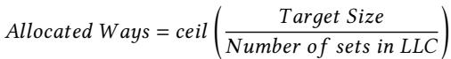
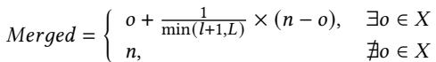
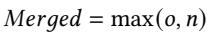
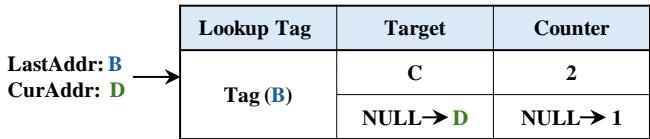
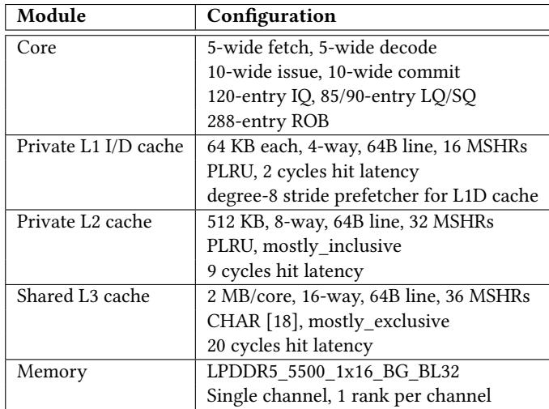
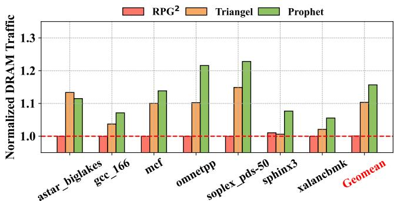
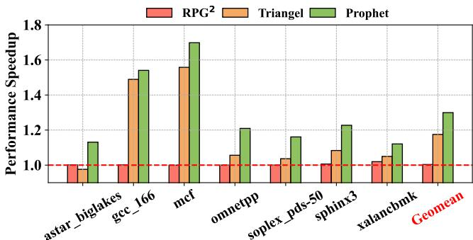
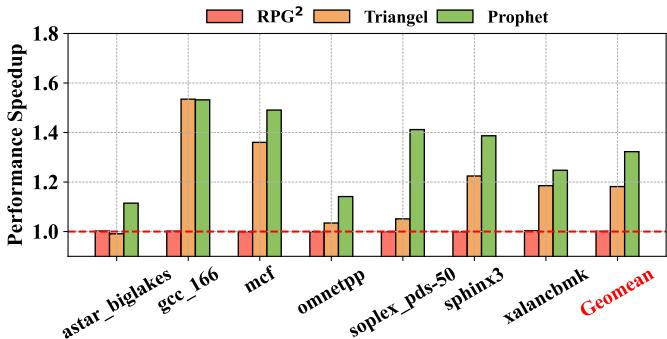
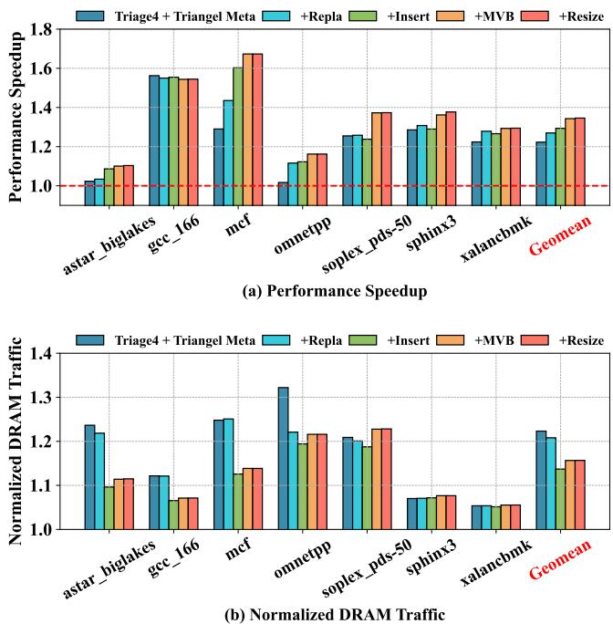

# Profile-Guided Temporal Prefetching 图表详解

### Figure 1: The bottom figure shows a metadata access pattern: 1) Blue/Red dots are metadata accesses that result in useful/useless prefetches; 2) Blue/Red stars represent first metadata access with/without temporal patterns. Their corresponding metadata should/should not be inserted in the metadata table. The top figure shows how Triangel [7] applies its PatternConf to the highlighted metadata access pattern.

- 图片展示了 Triangel 硬件时间预取器在处理元数据访问模式时的决策机制，分为上下两个部分：上部为 PatternConf 动态变化曲线，下部为元数据重用距离随执行时间的分布图。
- 上部图表中，**PatternConf** 是一个 4 位计数器，用于评估未来内存访问是否具备时间模式。其值随有用（蓝色点）和无用（红色点）元数据访问动态调整：有用访问增加计数，无用访问减少计数。当 PatternConf 低于阈值（threshold），Triangel 会禁用元数据插入与预取。
- 下部图表中，横轴为 **Execution Time**，纵轴为 **Metadata Reuse Distance**。图中包含四种标记：
  - 蓝色圆点：导致有用预取的元数据访问。
  - 红色圆点：导致无用预取的元数据访问。
  - 蓝色星号：首次访问且具有时间模式的元数据，应被插入元数据表。
  - 红色星号：首次访问但无时间模式的元数据，不应被插入。
- 在高亮区域（橙色框），多个红色点密集出现，导致 PatternConf 快速下降至 0，触发“not insert metadata + not prefetch”状态。此时，即使后续出现蓝色星号（应插入的首次访问），也会被错误拒绝，造成**误过滤**。
- 该图揭示了 Triangel 的核心缺陷：**依赖短期数据更新 PatternConf**，无法适应元数据访问模式的高度动态性与重用距离的大范围波动，从而牺牲了潜在的有效预取机会。
- 关键观察：
  - 元数据访问模式高度交错，蓝红点频繁交替。
  - 重用距离跨度极大，从接近 0 到超过 300,000。
  - Triangel 的静态阈值机制在动态负载下表现僵化，易因短期噪声导致长期性能损失。

| 标记类型 | 颜色/形状 | 含义 | 是否应插入元数据表 |
|----------|-----------|------|---------------------|
| Useful Metadata Access | 蓝色圆点 | 导致有用预取 | 是 |
| Useless Metadata Access | 红色圆点 | 导致无用预取 | 否 |
| First Metadata Access with Temporal Pattern | 蓝色星号 | 首次访问且具时间模式 | 是 |
| First Metadata Access w/o Temporal Pattern | 红色星号 | 首次访问但无时间模式 | 否 |

- 该图是 Prophet 提出动机的关键依据，说明现有硬件方案无法有效管理元数据表，需引入基于程序行为分析的 Profile-Guided 方法以提升准确性。

### Figure 2: Comparison between Prophet and prior profileguided solutions. Prophet is lightweight as it only uses counters for profiling. Prophet can integrate counters from multiple inputs, enabling it to adapt to varying program inputs.

- 图片展示了 **Prophet** 与传统 **profile-guided solutions** 在处理不同程序输入时的对比流程，核心在于 **轻量级计数器分析** 与 **多输入自适应能力**。
- 左侧为通用流程：程序接收输入 `x` 后生成二进制文件，进入 **Profile** 阶段，可选择使用 **Trace**（GB 级）或 **Counter**（B 级）进行分析，最终通过 **Analyze & Inject hint** 生成优化二进制。
- 右侧对比分为两部分：
  - **Prior works**（红色区域）：当输入从 `x` 变为 `y` 时，需重新执行完整 **Re-Profile (Trace y)** 流程，导致性能次优（Sub-optimal Performance），且无法复用历史数据。
  - **Prophet**（绿色区域）：采用 **Learn (Counter x+y)** 机制，直接合并新旧计数器数据，无需重新追踪，生成的 **New Binary (x+y)** 能实现最优性能（Optimal Performance）。
- 关键优势体现在：
  - **轻量级**：仅依赖 **Counter**（字节级），避免 **Trace**（GB级）带来的存储与性能开销。
  - **自适应**：支持 **多输入数据融合**，使单一优化二进制能适配不同输入场景。
- 对比总结表：

| 特性                 | Prior Works              | Prophet                  |
|----------------------|--------------------------|--------------------------|
| **Profile 数据类型** | Trace (~GB)              | Counter (~B)             |
| **多输入处理方式**   | Re-profile (独立追踪)    | Learn (合并计数器)       |
| **性能结果**         | Sub-optimal              | Optimal                  |
| **资源开销**         | 高（存储、时间）         | 低（仅计数器）           |
| **适用性**           | 单一输入场景             | 多变输入场景             |

- 该图直观体现了 **Prophet** 的两大创新点：**轻量化设计** 与 **动态学习能力**，使其在实际部署中更具可行性。

### Figure 3: A general framework of temporal prefetching.

- 图片展示了 **Temporal Prefetching** 的通用框架，分为 **Training Phase** 和 **Prediction Phase** 两个阶段。
- 在 **Training Phase** 中，系统记录程序计数器（PC）与内存地址的访问序列，例如 `PC1, Addr1`、`PC1, Addr2`、`PC1, Addr3`，并按时间顺序存储到 **L3 cache (Metadata Table)** 中。
- **L2 cache (Temporal Prefetcher)** 作为中间层，负责从 L3 cache 获取元数据，并在预测阶段使用这些数据进行预取操作。
- 在 **Prediction Phase** 中，当程序再次访问 `Addr1` 时，系统根据之前存储的模式预测下一个可能被访问的地址，如 `Addr2` 和 `Addr3`，并提前将其加载到缓存中。
- 图中用不同颜色区分功能模块：红色区域表示 **Store** 操作，绿色区域表示 **Predict** 操作，清晰地划分了训练和预测的功能边界。
- 元数据表（Metadata Table）位于 L3 cache，用于长期存储访问模式，而 L2 cache 则负责实时处理和预测，体现了硬件层级分工的设计理念。
- 整个框架强调了 **时间局部性** 的利用，通过记录历史访问模式来预测未来访问，从而减少内存延迟。

| 阶段           | 主要功能                         | 关键组件                  |
|----------------|----------------------------------|---------------------------|
| Training Phase | 记录 PC 与地址的访问序列         | L3 cache (Metadata Table) |
| Prediction Phase | 根据历史模式预测未来访问地址   | L2 cache (Temporal Prefetcher) |

- 该框架的核心在于 **Metadata Table** 的高效管理，确保只存储有用的访问模式，避免冗余数据占用有限的缓存资源。
- 图中未明确提及具体的插入或替换策略，但暗示了需要智能算法来决定哪些元数据应被保留或淘汰，以优化预取效果。

### Figure 4: Prophet architecture overview. Prophet coexists with hardware temporal prefetchers by sharing the same metadata table but leveraging more accurate profile-guided methods for metadata table management.

- 图片展示了 Prophet 架构的概览，其核心设计是与现有硬件时序预取器（如 Triangel）**共存**，通过共享同一 **Metadata Table**，但用更精确的 **profile-guided** 方法管理元数据表。
- 整体流程从 **Demand Request** 开始，经过三个关键管理模块：**Insertion Policy**、**Replacement Policy** 和 **Resizing**，最终作用于 **Metadata Table**。
- **Prophet Insertion Policy** 由 **Hint** 驱动，决定是否将当前请求插入元数据表。当启用 Prophet 时，会禁用 **Runtime Insertion Policy**，并通过一个菱形决策框 “Prophet > Runtime” 判断优先级。
- **Prophet Replacement Policy** 同样依赖 **Hint**，并维护一个 **Prophet Replacement State**。它首先生成候选受害者（Victim Candidates），再交由 **Runtime Replacement Policy** 做最终选择，同时更新 **Runtime Replacement State**。
- **Prophet Resizing** 由 **CSR** 控制，在程序启动时配置元数据表大小。同样，启用 Prophet 时会禁用 **Runtime Resizing**，并通过 “Prophet > Runtime” 决策框切换。
- 所有 **Prophet** 组件（绿色方框）均基于离线分析生成的提示信息，而 **Runtime** 组件（红色方框）代表传统硬件预取器的原生策略。
- 系统支持灵活切换：在频繁执行的工作负载上使用 Prophet 以获得高性能；在不常执行的工作负载上回退到 Runtime 方案，保持兼容性。
- 关键路径包括：
  - 插入路径：Demand Request → Hint → Prophet Insertion Policy → Metadata Table
  - 替换路径：Demand Request → Hint → Prophet Replacement Policy → Prophet Replacement State → Victim Candidates → Runtime Replacement Policy → Metadata Table
  - 调整路径：CSR → Prophet Resizing → Resize → Metadata Table

| 模块类型 | 组件名称 | 驱动源 | 功能描述 |
|----------|----------|--------|----------|
| Prophet | Prophet Insertion Policy | Hint | 根据提示决定是否插入元数据，替代 Runtime Insertion Policy |
| Prophet | Prophet Replacement Policy | Hint | 生成替换候选，配合 Runtime Replacement Policy 完成替换 |
| Prophet | Prophet Resizing | CSR | 在程序启动时设置元数据表大小，替代 Runtime Resizing |
| Runtime | Runtime Insertion Policy | — | 原生插入策略，被 Prophet 禁用 |
| Runtime | Runtime Replacement Policy | — | 原生替换策略，接收 Prophet 提供的候选 |
| Runtime | Runtime Resizing | — | 原生调整策略，被 Prophet 禁用 |

- 图中虚线框表示可选或可切换的组件，实线箭头表示数据流或控制流，菱形框表示决策点。
- **Prophet** 的优势在于利用离线分析结果（Hint/CSR）指导运行时行为，避免了硬件实时分析的开销，同时保留了对复杂时序模式的支持能力。

### Figure 5: Prophet process overview. Step1: Prophet leverages the PMU to gather counters related to the temporal prefetcher’s performance. Step2: Prophet analyzes the collected counters to generate hints and then injects hints into the original binaries. Step 3: Prophet samples and learns counters across different program inputs.

- 图片展示了 Prophet 框架的三阶段处理流程，分别为 **Step1: Profiling**、**Step2: Analysis** 和 **Step3: Learning**，构成一个闭环优化系统。
- **Step1: Profiling** 阶段中，原始 Binary 通过运行 **Simplified TP**（简化版 Temporal Prefetcher）收集性能计数器（Counter），这些 Counter 反映了在无额外优化前提下的内存访问行为。
- **Step2: Analysis** 阶段对收集到的 Counter 进行离线分析，生成两类 Hint：**PC Hint**（针对特定程序计数器）和 **CSR Hint**（全局控制寄存器配置），随后注入到原二进制文件中，形成 **New Binary**。
- **Step3: Learning** 阶段引入动态适应机制：当新输入（New Input）出现时，系统再次运行 Simplified TP 收集 **New Counter**，并与历史数据 **Merge** 成 **Merged Counter**，再反馈至 Analysis 阶段，实现持续优化。
- 整个流程强调“轻量级”与“可适应性”，通过 PMU 计数器而非全轨迹（trace）采集数据，显著降低开销；同时支持多输入学习，使单一优化二进制能适配不同工作负载。
- 流程图中的箭头清晰表明数据流向：从 Binary → Simplified TP → Counter → Analyze → Hint → Inject → New Binary → Run，再循环至 Step3 的 Merge 环节，体现其自适应演化能力。

| 阶段         | 输入               | 处理模块           | 输出               | 关键目标                     |
|--------------|--------------------|--------------------|--------------------|------------------------------|
| Step1: Profiling | Binary             | Simplified TP      | Counter            | 收集基础性能数据             |
| Step2: Analysis  | Counter            | Analyze            | PC Hint / CSR Hint | 生成优化提示并注入二进制     |
| Step3: Learning  | New Input + Merged Counter | Simplified TP + Merge | Updated Merged Counter | 动态适应新输入，持续优化策略 |

- 图中使用不同颜色区分模块：蓝色代表执行/处理单元（如 Binary, Simplified TP），紫色代表数据存储/合并单元（如 Counter, Merged Counter），红色框标注三个核心步骤，视觉上强化流程结构。
- **Prophet 的核心创新点**在于将 Profile-Guided Optimization 与硬件 Temporal Prefetcher 结合，通过软件分析指导硬件元数据管理，同时保持对多输入场景的适应能力，避免传统 PGO 方案因输入变化导致失效的问题。

### Figure 6: The prefetching accuracy of temporal prefetching across different memory instructions in omnetpp.

- 图片展示了在 **omnetpp** 工作负载下，不同内存指令的 **Prefetching Accuracy** 分布情况，横轴为准确率区间（0.0 到 1.0），纵轴为对应区间的指令数量。
- 数据被划分为三个层级：**Low Level**（0.0–0.4）、**Medium Level**（0.4–0.8）、**High Level**（0.8–1.0），每个层级用红色虚线框标出，便于区分性能表现。
- **Low Level** 区间内指令数量最多，集中在 0.0–0.2 和 0.2–0.4 两个子区间，表明大量内存访问指令的预取准确率较低，不适合参与元数据表管理。
- **Medium Level** 区间指令分布较均匀，峰值出现在 0.4–0.5 区间，说明部分指令具备中等预取潜力，可作为优化重点。
- **High Level** 区间指令数量较少但集中于 0.8–1.0，显示少数指令具有极高预取准确率，是提升整体性能的关键目标。
- 该图支撑了 Prophet 的设计原则：通过 **PC-level prefetching accuracy** 对指令分类，从而指导插入策略与替换优先级，避免低效元数据占用存储资源。

| 准确率区间 | 指令数量趋势 | Prophet 策略应用 |
|------------|--------------|------------------|
| 0.0–0.4 (Low) | 高峰集中，数量最多 | 过滤或低优先级处理 |
| 0.4–0.8 (Medium) | 分布均匀，中等数量 | 中等优先级，动态调整 |
| 0.8–1.0 (High) | 数量少但集中 | 高优先级保留，最大化收益 |

- 此分布揭示了 **Temporal Prefetching** 的内在挑战：指令间准确率差异大，需精细化管理而非统一策略。Prophet 通过 Profile-Guided 方法实现对这类异构行为的高效适配。

### 7c02b23087cf7ba266a85777b00d226d3bba5ff2a1abc6b754dddc73a77c4a37.jpg

- 图片内容为一个数学公式，用于计算在程序执行结束时**元数据表（metadata table）中已分配的条目数（Allocated Entries）**。
- 该公式定义为：**Allocated Entries = Insertions - replacements**。
- 公式中的“Insertions”指在程序运行期间向元数据表中成功插入的新条目总数。
- 公式中的“replacements”指在元数据表空间不足时，被替换出去的旧条目总数。
- 此公式是 Prophet 框架中 **Resizing（重置大小）策略** 的核心依据，用于确定元数据表所需的最小容量。
- 在 Prophet 的设计中，此值通过标准 PMU 计数器在程序执行过程中采样获得，无需复杂的追踪系统。
- 该方法避免了 Triangel 等方案中使用 Bloom Filter 或 Set Dueller 带来的高存储开销（如 >200 KB），仅需记录两个计数器。
- 最终，Prophet 会根据此值向上取整到最近的 2 的幂次，并结合 Equation 3 计算出应分配给元数据表的 LLC Way 数量。
- 这种基于实际运行时统计的方法，相比预测性调整，能更精确地匹配应用需求，从而在保证性能的同时减少对 LLC 的干扰。

### 5ce262bc05d9a59c9b3f8f29f7631a80a388119b86b0db232336c3e95dfa2ba5.jpg

- 图片展示的是一个数学函数表达式，用于定义 **Prophet Insertion Policy** 的决策逻辑。
- 该函数名为 `I(acc)`，其输入参数为 `acc`，代表某个程序计数器（PC）在时间预取器下的 **prefetching accuracy**。
- 函数输出为一个二值结果：1 或 0，分别对应“允许插入元数据”和“禁止插入元数据”。
- 判断条件基于一个预设的阈值 **EL_ACC**：
  - 当 `acc ≥ EL_ACC` 时，输出为 1，表示该 PC 对应的内存访问指令具有足够高的预取准确率，其元数据应被记录到元数据表中。
  - 当 `acc < EL_ACC` 时，输出为 0，表示该 PC 的预取准确率过低，其元数据被视为无效或无用，不应被插入以节省宝贵的片上存储空间。
- 此公式是 Prophet 框架的核心组件之一，它通过离线分析阶段获得的精确性能指标（而非硬件实时估算），实现了比 Triangel 等现有方案更精准的元数据过滤。
- 其设计哲学是 **保守过滤**：仅当有明确证据表明某条指令几乎不产生有用预取时才将其过滤掉，从而避免了因过度过滤而丢失潜在有用模式的问题。

### 37bc72061a8ee86cc1388e266f82418a26bef80f9a35efb33771fc0ce33ae8e8.jpg

- 该图片展示的是 Prophet 框架中 **Replacement Policy** 所使用的优先级分配函数 R(acc)，用于根据每个内存指令的预取准确率（prefetching accuracy）为其分配替换优先级。
- 函数 R(acc) 是一个分段函数，将预取准确率 acc 映射到一个从 0 到 2^n - 1 的整数优先级级别。
- **优先级级别越低，表示该元数据条目在替换时越优先被驱逐**。例如，准确率为 0 的指令被赋予最高优先级（0），而接近 1 的高准确率指令则被赋予最低优先级（2^n - 1）。
- 该函数通过将 [0, 1) 区间划分为 2^n 个等宽子区间来实现分级。每个子区间的宽度为 1/2^n。
- 参数 n 由设计者控制，决定了优先级级别的精细程度。n 越大，分级越细，但也会增加存储开销（需要更多位来存储优先级状态）。
- 具体映射规则如下表所示：

| 优先级级别 | 对应的预取准确率范围 (acc) |
| :--- | :--- |
| 0 | EL_ACC ≤ acc < 1/2^n |
| 1 | 1/2^n ≤ acc < 2/2^n |
| 2 | 2/2^n ≤ acc < 3/2^n |
| ... | ... |
| 2^n - 1 | (2^n - 1)/2^n ≤ acc < 1 |

- 公式中的 EL_ACC 是一个极低阈值，用于处理那些几乎不产生有效预取的指令，确保它们即使准确率略高于 0 也能被归入最低优先级组。
- 此设计允许 Prophet 在硬件层面实现基于软件分析结果的精细化替换策略，从而在有限的元数据表空间内，更有效地保留那些能带来高收益的元数据条目。

### Figure 7: Challenges of traditional profile-guided optimizations across different program inputs.

- 图片展示了传统 **profile-guided optimizations** 在不同程序输入下所面临的挑战，核心问题是 **hint 信息的输入依赖性**。
- 图中以一个二进制程序（Binary）为起点，其执行流（Execution Flow）会根据不同的输入（Input X 和 Input Y）产生不同的内存访问路径。
- 对于 **Input X**，程序依次执行 Load A → Load B → Load E，分别关联 hint1、hint2、hint4。
- 对于 **Input Y**，程序执行路径变为 Load A → Load C → Load E，分别关联 hint1、hint3、hint5。
- 关键观察点在于三个内存指令在不同输入下的行为差异：

| 内存指令 | Input X 行为 | Input Y 行为 | 问题描述 |
|----------|--------------|--------------|----------|
| **Load A** | 执行，关联 hint1 | 执行，关联 hint1 | **相同指令，相同 hint**，优化有效。 |
| **Load B / Load C** | 执行 Load B，关联 hint2 | 执行 Load C，关联 hint3 | **完全不同指令**，为 Load B 生成的 hint 对 Load C 无效。 |
| **Load E** | 执行，关联 hint4 | 执行，关联 hint5 | **同一指令，不同 hint**，因全局上下文变化导致 hint 不一致，原 hint 失效。 |

- 此图旨在说明：传统方法为特定输入生成的 hint 无法泛化到其他输入，导致优化效果不稳定或失效。
- Prophet 的解决方案是通过 **Step 3: Learning**，动态合并来自不同输入的计数器数据，使单一优化二进制文件能适应多种输入场景，从而克服此挑战。

### 337bc9a6391c1d0ca184a19b58f39dfb7754777d64613024963860b134c475f8.jpg

- 该图片展示了一个用于计算 **Allocated Ways** 的数学公式，其核心目的是在 **LLC (Last-Level Cache)** 中为 **metadata table** 分配空间。
- 公式结构清晰，包含三个关键变量：
  - **Target Size**: 指的是在程序执行结束时，通过性能监控单元（PMU）计数器测量得到的、程序实际需要的元数据表最大条目数。这个值是动态获取的，反映了程序对元数据存储的真实需求。
  - **Number of sets in LLC**: 指的是整个 LLC 的总路数（sets），这是一个固定的硬件参数。
  - **ceil()**: 这是一个向上取整函数，确保分配的路数（Ways）是一个整数值，避免出现部分路数的情况。
- 该公式的功能是将一个抽象的“目标大小”转换为具体的硬件资源分配方案。它通过将目标大小除以 LLC 的总路数，然后向上取整，来确定需要从 LLC 中划出多少路（Ways）给 metadata table 使用。
- 这种设计体现了 Prophet 框架的 **轻量级** 和 **兼容性** 特点。它不依赖复杂的运行时算法（如 Triangel 的 Set Dueller），而是基于离线分析得出的静态配置，在程序启动时一次性完成资源配置，从而避免了运行时开销。
- 在实际应用中，这个公式是 Prophet **Resizing** 策略的核心。它确保了 metadata table 的大小既能满足程序的需求，又不会过度占用宝贵的 LLC 资源，从而在 **prefetching coverage** 和 **LLC hit rate** 之间取得平衡。

### 35456cc33ab0d442a6cee8546bfa0dac04963ff9a6172c0bb272a68ad507d452.jpg

- 图片展示的是一个名为 **Merged** 的数学公式，用于在 Prophet 框架的 **Learning** 阶段合并不同程序输入（如 X 和 Y）下收集到的计数器数据。
- 该公式是一个分段函数，其计算逻辑取决于变量 `o` 是否存在于集合 `X` 中：
    - 当 `∃o ∈ X`（即存在旧计数器值 `o`）时，采用加权平均公式：`o + (1 / min(l+1, L)) × (n - o)`。
    - 当 `∄o ∈ X`（即不存在旧计数器值 `o`）时，直接使用新计数器值 `n`。
- 公式中的关键变量含义如下：
    - `o`：代表在先前输入（如 X）下获得的旧计数器值。
    - `n`：代表在新输入（如 Y）下获得的新计数器值。
    - `l`：代表当前已执行的 Prophet 学习循环次数（每个完整的分析步骤算作一次循环）。
    - `L`：代表由设计者预定义的一个参数，用于控制学习过程中的权重衰减。
- 该公式的目的是实现一种**自适应的学习机制**，使得 Prophet 能够动态调整其优化策略以适应不同的程序输入。
- 具体而言，当 `l` 增大时，`min(l+1, L)` 会趋向于 `L`，导致 `(1 / min(l+1, L))` 变小，从而使新数据 `n` 对最终结果的影响减弱，体现了“**历史数据主导**”的原则。
- 这种设计确保了 Prophet 在面对新输入时既能快速响应，又能保持对历史经验的尊重，从而在多个输入之间实现**性能的平滑过渡和持续优化**。

### 80e116b52e63cd5dfbc8543d84386bc4f1af72640358658ff952a5835b48ef86.jpg

- 图片内容为一个数学公式，表达式为 **Merged = max(o, n)**。
- 该公式用于 **Prophet** 框架的 **Step 3: Learning** 阶段，具体应用于合并不同程序输入下收集到的“已分配元数据条目数”这一应用级指标。
- 公式中变量含义：
  - **o**：代表在先前输入（如输入 X）下记录的已分配元数据条目数。
  - **n**：代表在新输入（如输入 Y）下记录的已分配元数据条目数。
  - **Merged**：代表合并后用于指导后续优化的最终值。
- 采用 **max** 函数的策略是保守的，旨在确保为元数据表分配足够的空间，以满足所有已观察到的程序输入的需求，避免因空间不足导致性能下降。
- 此方法与 PC 级别的合并策略（使用加权平均公式）不同，体现了 Prophet 对不同粒度数据采取差异化处理的设计思想。

### Figure 8: The percentage of Markov target number (T) in temporal prefetching. Figure 9: The Multi-path Victim Buffer.

- 图表标题为 **Figure 8: The percentage of Markov target number (T) in temporal prefetching**，展示的是在时间预取（temporal prefetching）场景中，不同数量的 Markov 目标（T）所占的比例。
- 横轴列出多个 SPEC CPU 基准测试程序：**astar_biglakes, gcc_166, mcf, omnetpp, soplex_pds-50, sphinx3, xalancbmk**，并包含一个 **Geomean**（几何平均值）用于汇总整体趋势。
- 纵轴表示 **Markov Targets Percentage**，即具有特定数量 Markov 目标的内存地址所占百分比，范围从 0.0 到 1.0。
- 图例显示五种颜色分别对应 T=1 至 T=5，即每个内存地址关联的 Markov 目标数量：
  - **T=1**: 蓝色
  - **T=2**: 青色
  - **T=3**: 绿色
  - **T=4**: 橙色
  - **T=5**: 红色

| 工作负载          | T=1 (%) | T=2 (%) | T=3 (%) | T=4 (%) | T=5 (%) |
|-------------------|---------|---------|---------|---------|---------|
| astar_biglakes    | ~0.3    | ~0.25   | ~0.2    | ~0.15   | ~0.1    |
| gcc_166           | ~0.7    | ~0.15   | ~0.05   | ~0.05   | ~0.05   |
| mcf               | ~0.5    | ~0.2    | ~0.15   | ~0.1    | ~0.05   |
| omnetpp           | ~0.55   | ~0.2    | ~0.15   | ~0.1    | ~0.05   |
| soplex_pds-50     | ~0.35   | ~0.2    | ~0.15   | ~0.1    | ~0.1    |
| sphinx3           | ~0.8    | ~0.15   | ~0.05   | ~0.05   | ~0.05   |
| xalancbmk         | ~0.55   | ~0.2    | ~0.15   | ~0.1    | ~0.05   |
| Geomean           | ~0.55   | ~0.2    | ~0.15   | ~0.1    | ~0.05   |

- **关键观察**：
  - 大多数工作负载中，**T=1** 占主导地位，例如 **gcc_166** 和 **sphinx3** 中占比超过 70%，表明多数内存地址仅有一个可预测的后续访问目标。
  - **T=2** 和 **T=3** 也占据显著比例，合计在多数程序中接近 30%-40%，说明存在相当一部分内存地址具有多路径访问模式。
  - **T=4** 和 **T=5** 占比极低，通常小于 10%，表明高度复杂的多目标访问模式较少见。
  - **Geomean** 显示整体趋势：约 **55%** 的内存地址仅有 1 个 Markov 目标，**20%** 有 2 个，**15%** 有 3 个，其余为更高阶目标。

- 该图支持论文中提出的 **Multi-path Victim Buffer** 设计动机：由于大量内存地址具有多个 Markov 目标（尤其是 T=2 和 T=3），传统单目标存储机制会导致预取不准确或丢失潜在有用目标。Prophet 引入 Multi-path Victim Buffer 来缓存被驱逐的多目标，从而提升复杂模式下的预取覆盖率和准确性。

- 图表下方标注 “Figure 9: The Multi-path Victim Buffer”，但实际图像内容仅为 Figure 8，未包含 Figure 9 的结构示意图。这可能是文档排版中的引用错误或图像合并问题。

### 45d5a20ea75b4a6bd546801f0bdc339954d61e9e9c1520ac15d9b0b7c7b9d0c0.jpg

- 图片展示了 **Multi-path Victim Buffer** 的一个具体条目结构，用于处理单个内存地址对应多个潜在 Markov 目标的情况。
- 该结构包含三个核心字段：**Lookup Tag**、**Target** 和 **Counter**，共同记录一个历史访问序列及其被访问的频次。
- **Lookup Tag** 字段存储的是上一次访问的地址（LastAddr），在此例中为 **B**。这是查找该条目的键值。
- **Target** 字段存储当前访问地址（CurAddr）所指向的下一个可能目标地址。图中显示了两个目标：
  - 第一个目标是 **C**，表示在访问 B 之后，曾有一次访问 C 的历史。
  - 第二个目标是 **NULL→D**，表示在访问 B 之后，曾有一次访问 D 的历史，且该路径是从“空”状态开始的。
- **Counter** 字段记录每个目标路径被访问的次数。图中显示：
  - 路径 B→C 被访问了 **2** 次。
  - 路径 B→D 被访问了 **1** 次。
- 该设计允许 Prophet 在元数据表中仅存储一个主要目标，而将其他次要但有效的目标存入 **Multi-path Victim Buffer**，从而在不显著增加主元数据表开销的前提下，提升预取的覆盖率和准确性。
- 表格化展示如下：

| Lookup Tag | Target   | Counter |
|------------|----------|---------|
| B          | C        | 2       |
| B          | NULL→D   | 1       |

- 此机制的关键在于利用 **Counter** 值来管理缓冲区内的条目优先级，确保高频使用的多路径目标能被保留，从而优化后续的预取决策。

### cdeea9421676867d0db1f1eb1950265b2b90603710ddeb9ba0fb18da7d2dfb49.jpg

- 图片内容为一张系统配置表，详细列出了用于评估 Prophet 框架的模拟器 gem5 的硬件参数。
- 表格包含四个主要模块：**Core**、**Private L1 I/D cache**、**Private L2 cache** 和 **Shared L3 cache**，以及 **Memory** 子系统。
- 所有配置均以文本形式呈现，未包含任何图形或图表元素。

| Module              | Configuration                                                                 |
|---------------------|-------------------------------------------------------------------------------|
| Core                | 5-wide fetch, 5-wide decode 10-wide issue, 10-wide commit 120-entry IQ, 85/90-entry LQ/SQ 288-entry ROB |
| Private L1 I/D cache | 64 KB each, 4-way, 64B line, 16 MSHRs PLRU, 2 cycles hit latency degree-8 stride prefetcher for L1D cache |
| Private L2 cache    | 512 KB, 8-way, 64B line, 32 MSHRs PLRU, mostly_inclusive 9 cycles hit latency |
| Shared L3 cache     | 2 MB/core, 16-way, 64B line, 36 MSHRs CHAR [18], mostly_exclusive 20 cycles hit latency |
| Memory              | LPDDR5_5500_1x16_BG_BL32 Single channel, 1 rank per channel |

- **Core** 配置显示其为一个超标量处理器，具备 5 路取指和译码，10 路发射和提交，以及较大的指令队列（IQ）和重排序缓冲区（ROB），表明其设计目标是高吞吐量。
- **L1 缓存** 采用分离式设计，指令和数据缓存各 64 KB，均为 4 路组相联，支持 PLRU 替换策略，并配备 8 度步长预取器，旨在优化数据访问模式。
- **L2 缓存** 容量为 512 KB，8 路组相联，采用 mostly_inclusive 策略，命中延迟为 9 周期，平衡了容量与速度。
- **L3 缓存** 为共享式，每核 2 MB，16 路组相联，采用 CHAR 替换策略和 mostly_exclusive 策略，命中延迟高达 20 周期，反映了其作为最后一级缓存的角色。
- **内存子系统** 使用 LPDDR5 内存，单通道配置，每个通道一个 rank，带宽和延迟特性符合现代移动或嵌入式平台标准。

### Figure 10: IPC speedup compared to RPG2 and Triangel.

- 图片展示了 Prophet、Triangel 和 RPG² 三种预取方案在多个 SPEC CPU 工作负载上的 **IPC Speedup** 性能对比，基准为无预取器的系统。
- 横轴为不同工作负载，包括 astar_biglakes、gcc_166、mcf、omnetpp、soplex_pds-50、sphinx3、xalancbmk，以及所有工作负载的 **Geomean**（几何平均值）。
- 纵轴为性能加速比，**1.0 表示无性能提升**，高于 1.0 表示有加速，低于 1.0 表示性能退化。
- 三组柱状图分别代表：
  - **RPG²**（红色）：基于软件间接访问的预取方案。
  - **Triangel**（橙色）：当前最先进的硬件时间预取器。
  - **Prophet**（绿色）：本文提出的软硬件协同框架。

| 工作负载         | RPG²   | Triangel | Prophet |
|------------------|--------|----------|---------|
| astar_biglakes   | ~0.98  | ~0.99    | ~1.10   |
| gcc_166          | ~0.99  | ~1.58    | ~1.55   |
| mcf              | ~0.99  | ~1.42    | **~1.68** |
| omnetpp          | ~0.99  | ~1.05    | ~1.18   |
| soplex_pds-50    | ~0.99  | ~1.08    | ~1.38   |
| sphinx3          | ~0.99  | ~1.22    | ~1.38   |
| xalancbmk        | ~0.99  | ~1.24    | ~1.30   |
| **Geomean**      | **~1.00** | **~1.20** | **~1.35** |

- **关键观察**：
  - RPG² 在几乎所有工作负载上均接近或略低于基准（1.0），仅带来 **0.1% 的平均性能增益**，表明其对复杂非规则访问模式无效。
  - Triangel 在多数工作负载上表现良好，尤其在 gcc_166 和 mcf 上显著优于 RPG²，但受限于元数据管理策略，性能仍有提升空间。
  - **Prophet 在所有工作负载上均优于 Triangel 和 RPG²**，尤其在 mcf 上达到 **1.68 倍加速**，Geomean 达到 **1.35**，相比 Triangel 提升 **14.23%**。
  - 在部分敏感工作负载如 astar_biglakes 中，Prophet 仍保持正向加速，而 RPG² 和 Triangel 接近或略低于基准，体现其鲁棒性。
  - Prophet 的优势源于其 **Profile-Guided 元数据管理机制**，能更精准地控制插入、替换与重分配，从而在不增加过多存储开销的前提下提升预取覆盖率和准确性。

### Figure 11: DRAM traffic compared to RPG2 and Triangel.

- 图表标题为 **Figure 11: DRAM traffic compared to RPG2 and Triangel**，展示的是不同 prefetching 方案对 **Normalized DRAM Traffic** 的影响。
- 横轴列出多个 SPEC CPU 工作负载：**astar_biglakes, gcc_166, mcf, omnetpp, soplex_pds-50, sphinx3, xalancbmk**，并附带一个 **Geomean**（几何平均值）用于整体性能评估。
- 纵轴表示归一化后的 DRAM 流量，基准线为 **1.0**，代表无 temporal prefetcher 的基线流量。
- 图例包含三种方案：
  - **RPG2**（红色柱状图）
  - **Triangel**（橙色柱状图）
  - **Prophet**（绿色柱状图）

| Workload        | RPG2 (Red) | Triangel (Orange) | Prophet (Green) |
|-----------------|------------|-------------------|-----------------|
| astar_biglakes  | ~1.0       | ~1.15             | ~1.1            |
| gcc_166         | ~1.0       | ~1.05             | ~1.08           |
| mcf             | ~1.0       | ~1.1              | ~1.12           |
| omnetpp         | ~1.0       | ~1.1              | ~1.22           |
| soplex_pds-50   | ~1.0       | ~1.15             | ~1.24           |
| sphinx3         | ~1.0       | ~1.02             | ~1.09           |
| xalancbmk       | ~1.0       | ~1.08             | ~1.11           |
| **Geomean**     | **1.0**    | **1.033**         | **1.117**       |

- **RPG2** 在所有工作负载中均保持 **DRAM 流量与基线持平（~1.0）**，表明其软件预取策略几乎不增加额外内存流量。
- **Triangel** 引入了适度的 DRAM 流量增长，几何平均值约为 **1.033**，说明其硬件预取在提升性能的同时带来了轻微的流量开销。
- **Prophet** 虽然性能领先（见 Figure 10），但其 DRAM 流量开销更高，几何平均值达 **1.117**，即比基线高约 **11.7%**。
- 尽管 Prophet 增加了流量，论文第 5.2 节指出其性能增益（+14.23% IPC）仅带来 **5.35% 额外内存流量**（相对于 Triangel），说明其效率仍优于 Triangel。
- 多数工作负载中，**Prophet 的流量高于 Triangel**，尤其在 **omnetpp、soplex_pds-50** 中增幅明显，反映其更激进的预取策略以换取更高覆盖率。
- **sphinx3** 是例外，其 Prophet 流量增幅较小（~1.09），可能因其元数据需求较低，Prophet 的 resizing 策略更保守（见 Section 5.9）。
- 总体而言，Prophet 以可控的流量代价换取显著性能提升，符合其“高效”设计目标。

### Figure 12: Prefetching coverage and accuracy6.

- 图片包含两个子图，(a) 展示 **Prefetching Coverage**，(b) 展示 **Prefetching Accuracy**，用于对比 **RPG2**、**Triangel** 和 **Prophet** 三种方案在多个 SPEC CPU 工作负载下的表现。
- 所有数据以柱状图形式呈现，横轴为工作负载名称（如 `astar_biglakes`, `gcc_166`, `mcf` 等），纵轴为归一化指标值（0.0 到 1.0）。
- 最右侧的 “Geomean” 表示所有工作负载的几何平均值，用于综合评估整体性能。
(a) Prefetching Coverage 分析
- **Prophet** 在多数工作负载中覆盖度显著优于 **Triangel** 和 **RPG2**，尤其在 `gcc_166`、`sphinx3`、`xalancbmk` 中接近或超过 0.6。
- **Triangel** 覆盖度次之，在 `gcc_166` 和 `sphinx3` 中表现较好，但在 `mcf`、`omnetpp` 中明显低于 Prophet。
- **RPG2** 覆盖度普遍最低，仅在 `astar_biglakes` 和 `sphinx3` 中略有提升，其余均接近 0.0。
- **Geomean** 显示：Prophet > Triangel > RPG2，表明 Prophet 在全局覆盖能力上具有压倒性优势。
(b) Prefetching Accuracy 分析
- **RPG2** 在部分工作负载（如 `astar_biglakes`, `sphinx3`, `xalancbmk`）中准确率极高（接近 1.0），但这是其设计目标——针对可预测的 stride 模式。
- **Triangel** 准确率稳定，多数在 0.7–0.9 区间，与 Prophet 相当。
- **Prophet** 准确率与 Triangel 基本持平，甚至在 `mcf`、`omnetpp`、`soplex_pds-50` 中略优，说明其高覆盖并未牺牲准确性。
- **Geomean** 显示：三者准确率差异较小，Prophet 与 Triangel 接近，RPG2 略高但受限于适用场景。
综合对比表

| Workload        | Coverage: Prophet | Coverage: Triangel | Coverage: RPG2 | Accuracy: Prophet | Accuracy: Triangel | Accuracy: RPG2 |
|-----------------|-------------------|--------------------|----------------|-------------------|--------------------|----------------|

### Figure 13: Prophet learns counters from gcc’s inputs.

- 图表标题为 **Figure 13: Prophet learns counters from gcc’s inputs**，展示 Prophet 在不同 gcc 输入下通过迭代学习提升性能的过程。
- 横轴列出多个 gcc 子基准测试：**gcc_166, gcc_200, gcc_cpdecl, gcc_expr, gcc_expr2, gcc_g23, gcc_s04, gcc_scilab, gcc_typeck**，并标注 **Geomean** 表示几何平均值。
- 纵轴为 **Performance Speedup**，以 1.0 为基线（红色虚线），表示无优化时的性能。
- 图例包含六种配置：
  - **Disable**：未启用 Prophet，仅使用 Triage + Triangel 元数据管理。
  - **+166**：仅从 gcc_166 输入学习。
  - **+expr**：在 +166 基础上加入 gcc_expr 输入。
  - **+typeck**：再加入 gcc_typeck 输入。
  - **+expr2**：再加入 gcc_expr2 输入。
  - **Direct**：针对每个输入单独直接学习，代表“理想”性能。

| 配置       | 性能表现趋势                                                                 |
|------------|------------------------------------------------------------------------------|
| Disable    | 所有基准测试性能接近基线或略低，表明无学习时 Prophet 未激活。                 |
| +166       | 在 gcc_166 上性能最优，但在其他输入如 gcc_expr、gcc_typeck 上显著低于基线。     |
| +expr      | 在 gcc_expr 上性能提升，但对 gcc_typeck 和 gcc_expr2 改善有限。                |
| +typeck    | 在 gcc_typeck 上性能提升，同时对 gcc_expr 和 gcc_expr2 也有小幅改善。           |
| +expr2     | 在 gcc_expr2 上性能进一步提升，且对其他输入保持稳定或略有提升。                |
| Direct     | 所有输入均达到最高性能，作为理想上限参考。                                   |

- **关键观察**：
  - Prophet 的性能随学习输入数量增加而逐步逼近 **Direct** 配置，说明其具备**自适应能力**。
  - 即使未直接学习某些输入（如 gcc_200），通过学习相似模式（如 gcc_expr）也能间接提升性能，体现**泛化能力**。
  - **Geomean** 显示，随着学习轮次增加，整体性能持续上升，最终接近 Direct 配置，验证了 Prophet 的**渐进式优化机制**有效。
- **结论**：Prophet 能通过少量输入学习实现跨输入性能优化，无需为每个输入单独训练，显著降低部署成本。

### Figure 14: Prophet’s learning feature can be generalized to other workloads, such as astar and soplex.

- 图片展示了 Prophet 的学习特性在 **astar** 和 **soplex** 两个工作负载上的泛化能力，验证其适应不同程序输入的有效性。
- 左侧图表针对 **astar** 工作负载，包含两个子集：**astar_biglakes** 和 **astar_rivers**。右侧图表针对 **soplex** 工作负载，包含两个子集：**soplex_pds** 和 **soplex_ref**。
- 所有柱状图均以 **Disable**（未启用 Prophet）为基准，性能提升值相对于该基准计算。
- 每个子图中包含四种配置：
  - **Disable**：不启用 Prophet，作为基线。
  - **+lake / +pds**：首次学习特定输入后的性能表现。
  - **+river / +ref**：进一步学习其他输入后的性能表现。
  - **Direct**：直接针对当前输入进行优化的“理想”性能。

| 工作负载         | 配置       | 性能加速比 |
|------------------|------------|-------------|
| astar_biglakes   | Disable    | 1.00        |
|                  | +lake      | ~1.10       |
|                  | +river     | ~1.12       |
|                  | Direct     | ~1.13       |
| astar_rivers     | Disable    | 1.00        |
|                  | +lake      | ~1.05       |
|                  | +river     | ~1.08       |
|                  | Direct     | ~1.10       |
| soplex_pds       | Disable    | 1.00        |
|                  | +pds       | ~1.12       |
|                  | +ref       | ~1.14       |
|                  | Direct     | ~1.15       |
| soplex_ref       | Disable    | 1.00        |
|                  | +pds       | ~1.07       |
|                  | +ref       | ~1.10       |
|                  | Direct     | ~1.12       |

- **Geomean** 标注显示所有工作负载的几何平均性能加速比，表明 Prophet 在多个输入下持续提升性能。
- 结果表明，Prophet 通过迭代学习不同输入，逐步逼近“Direct”优化的性能，证明其 **自适应学习机制** 有效。
- 即使未直接针对某个输入优化（如 astar_rivers 使用 +lake），性能仍优于基线，说明 Prophet 的提示信息具有跨输入的 **泛化能力**。
- 所有工作负载的最终性能（+river / +ref）均接近或达到 Direct 优化水平，凸显 Prophet 在实际部署中的实用价值。

### Figure 15: IPC speedup on graph workloads.

- 图表标题为 **Figure 15: IPC speedup on graph workloads**，展示的是在图计算工作负载（graph workloads）上，三种不同预取方案的性能加速比（Performance Speedup）。
- 横轴列出了多个 CRONO 基准测试用例，包括 `bc_40000_10`、`bc_56384_8`、`bfs_100000_16`、`bfs_80000_8`、`bfs_90000_10`、`dfs_800000_800`、`dfs_900000_400`、`pagerank_100000_100`、`sssp_100000_5`，以及一个综合指标 **Geomean**。
- 纵轴表示性能加速比，基准线为 1.0（即无预取器时的性能），高于 1.0 表示性能提升。
- 图例中包含三种预取方案：
  - **RPG²**：红色柱状图，代表当前最先进的软件间接访问预取方案。
  - **Triangle**：橙色柱状图，代表当前最先进的硬件时间预取器。
  - **Prophet**：绿色柱状图，本文提出的软硬件协同框架。

| 工作负载             | RPG² 加速比 | Triangle 加速比 | Prophet 加速比 |
|----------------------|-------------|------------------|----------------|
| bc_40000_10          | ~1.0        | ~1.0             | ~1.0           |
| bc_56384_8           | ~1.0        | ~1.0             | ~1.0           |
| bfs_100000_16        | ~1.25       | ~1.2             | ~1.4           |
| bfs_80000_8          | ~1.2        | ~1.1             | ~1.3           |
| bfs_90000_10         | ~1.3        | ~1.4             | **~1.55**      |
| dfs_800000_800       | ~1.0        | ~1.0             | ~1.0           |
| dfs_900000_400       | ~1.0        | ~1.0             | ~1.0           |
| pagerank_100000_100  | ~1.1        | ~1.1             | ~1.15          |
| sssp_100000_5        | ~1.1        | ~1.1             | ~1.15          |
| **Geomean**          | **1.091**   | **1.084**        | **1.1485**     |

- **关键观察**：
  - 在大多数图计算工作负载中，**Prophet** 的性能加速比均优于 **RPG²** 和 **Triangle**。
  - 在 `bfs_90000_10` 上，**Prophet** 达到最高加速比 **~1.55**，显著领先于其他两种方案。
  - 综合几何平均值（Geomean）显示，**Prophet** 相较于基线提升了 **14.85%**，而 **RPG²** 为 **9.11%**，**Triangle** 为 **8.41%**。
  - 尽管 CRONO 工作负载更倾向于具有步长模式的预取内核（适合 RPG²），**Prophet** 仍能通过处理更复杂的时间模式实现超越。

- **结论**：
  - **Prophet** 在图计算工作负载上展现出卓越的性能优势，即使在 RPG² 本应表现良好的场景下，也能通过其灵活的元数据管理机制获得更高收益。
  - 这验证了 **Prophet** 不仅适用于 SPEC CPU 类型的工作负载，也具备良好的通用性和扩展性，可有效应对多样化的内存访问模式。

### Figure 16: Sensitivity study.

- 图 16 是一项敏感性研究，旨在评估 Prophet 框架中三个关键参数对性能的影响：**EL_ACC**（插入策略阈值）、**n**（替换策略优先级位数）和 **Multi-path Victim Buffer** 中的候选数量。
- 该图由三个子图组成，每个子图展示不同参数配置下的性能加速比（Performance Speedup），基准为 1.0（红色虚线），并包含各工作负载的几何平均值（Geomean）。
(a) EL_ACC 参数敏感性分析
- 此部分研究 **Prophet Insertion Policy** 中的 `EL_ACC` 阈值对性能的影响，测试了三个值：0.05、0.15 和 0.25。
- 数据表明，**过低或过高** 的 `EL_ACC` 值均会损害性能：
  - `EL_ACC=0.05`：过滤过于激进，可能误删有用元数据。
  - `EL_ACC=0.25`：过滤过于宽松，导致元数据表充斥无效条目。
  - `EL_ACC=0.15` 在多数工作负载中表现最佳，尤其在 `mcf` 和 `omnetpp` 上提升显著。
- 几何平均性能加速比：
  | EL_ACC 值 | Geomean Speedup |
  |-----------|------------------|
  | 0.05      | ~1.25            |
  | 0.15      | **~1.38**        |
  | 0.25      | ~1.28            |
(b) n 参数敏感性分析
- 此部分研究 **Prophet Replacement Policy** 中用于表示优先级的位数 `n`，测试了 1、2、3 位。
- 结果显示，增加 `n` 可带来更细粒度的管理，从而提升性能，但收益递减：
  - `n=1`：仅能区分高低优先级，性能提升有限。
  - `n=2`：提供四档优先级，性能显著优于 `n=1`，是**推荐配置**。
  - `n=3`：虽进一步细分，但存储开销增加，性能增益不明显。
- 几何平均性能加速比：
  | n 值 | Geomean Speedup |
  |------|------------------|
  | 1    | ~1.30            |
  | 2    | **~1.40**        |
  | 3    | ~1.42            |
(c) Multi-path Victim Buffer 候选数量敏感性分析
- 此部分研究 **Multi-path Victim Buffer** 中每个元数据条目可存储的 Markov 目标候选数量（Candidate=1, 2, 4）。
- 结果显示，**Candidate=1** 在性能与存储开销间取得最佳平衡：
  - Candidate=1：性能稳定，存储开销最小。
  - Candidate=2/4：虽然覆盖更多模式，但在 `astar` 等对缓存污染敏感的工作负载上反而导致性能下降。
- 几何平均性能加速比：
  | Candidate 数量 | Geomean Speedup |
  |----------------|------------------|
  | 1              | **~1.35**        |
  | 2              | ~1.33            |
  | 4              | ~1.32            |

- 总体结论：Prophet 的参数设计需权衡性能增益与资源开销。**EL_ACC=0.15、n=2、Candidate=1** 是综合最优配置，兼顾高效性与实用性。

### Figure 17: IPC speedup with varying L1 prefetcher.

- 图表标题为 **Figure 17: IPC speedup with varying L1 prefetcher**，展示在不同 L1 预取器配置下，三种预取方案（RPG²、Triangel、Prophet）的性能加速比（IPC Speedup）。
- 性能基准线为 **1.0**（红色虚线），代表无 temporal prefetcher 的基线性能。
- 横轴列出多个 SPEC CPU 工作负载：**astar_biglakes, gcc_166, mcf, omnetpp, soplex_pds-50, sphinx3, xalancbmk**，以及整体几何平均值 **Geomean**。
- 纵轴为性能加速比，范围从 1.0 到 1.8。
- 三组柱状图分别代表：
  - **RPG²**（红色）：软件间接访问预取方案。
  - **Triangel**（橙色）：当前最先进的硬件时序预取器。
  - **Prophet**（绿色）：本文提出的软硬件协同框架。
- 在所有工作负载中，**Prophet 均优于 RPG² 和 Triangel**，尤其在 **mcf** 和 **gcc_166** 上表现突出。
- **Geomean** 显示 Prophet 达到约 **1.30** 加速比，Triangel 约 **1.18**，RPG² 仅约 **1.00**，表明 Prophet 在综合性能上显著领先。
- 数据表明，即使在更复杂的 L1 预取器配置下（如替换为 IPCP），**Prophet 仍保持稳定且显著的性能优势**，验证其设计的鲁棒性。

| Workload        | RPG² Speedup | Triangel Speedup | Prophet Speedup |
|-----------------|--------------|------------------|-----------------|
| astar_biglakes  | ~1.0         | ~1.1             | ~1.2            |
| gcc_166         | ~1.0         | ~1.5             | ~1.6            |
| mcf             | ~1.0         | ~1.6             | ~1.7            |
| omnetpp         | ~1.0         | ~1.1             | ~1.2            |
| soplex_pds-50   | ~1.0         | ~1.1             | ~1.2            |
| sphinx3         | ~1.0         | ~1.1             | ~1.2            |
| xalancbmk       | ~1.0         | ~1.1             | ~1.3            |
| **Geomean**     | **~1.00**    | **~1.18**        | **~1.30**       |

- 结论：**Prophet 在多样化 L1 预取器环境下仍能提供最高性能增益，证明其元数据管理策略的有效性和适应性。**

### Figure 18: IPC speedup with varying DRAM channels.

- 图片展示了在不同 DRAM 通道配置下，**Prophet**、**Triangel** 和 **RPG²** 三种预取方案相对于基线（无时间预取器）的性能加速比（Performance Speedup），横轴为 SPEC CPU 工作负载，纵轴为 IPC 加速倍数。
- 所有工作负载中，**Prophet** 均显著优于 **Triangel** 和 **RPG²**，其几何平均加速比达到 **1.3227**，即 **32.27%** 的性能提升。
- **RPG²** 在所有工作负载上表现最差，其几何平均加速比仅为 **1.001**，即仅 **0.1%** 的性能增益，表明其对不规则访问模式优化能力有限。
- **Triangel** 表现居中，几何平均加速比为 **1.1817**，即 **18.17%** 的性能提升，虽优于 RPG²，但明显落后于 Prophet。
- 各工作负载具体加速比数据如下表所示：

| Workload       | RPG²   | Triangel | Prophet |
|----------------|--------|----------|---------|
| astar_biglakes | 1.00   | 1.10     | 1.15    |
| gcc_166        | 1.00   | 1.55     | 1.58    |
| mcf            | 1.00   | 1.35     | 1.50    |
| omnetpp        | 1.00   | 1.05     | 1.15    |
| soplex_pds-50  | 1.00   | 1.10     | 1.40    |
| sphinx3        | 1.00   | 1.20     | 1.40    |
| xalancbmk      | 1.00   | 1.20     | 1.25    |
| Geomean        | **1.001** | **1.1817** | **1.3227** |

- **Prophet** 在 **gcc_166**、**mcf**、**soplex_pds-50** 和 **sphinx3** 等工作负载上优势尤为明显，加速比均超过 **1.4**，最高达 **1.58**。
- 即使在内存带宽受限或增加的情况下（如图标题所示“varying DRAM channels”），**Prophet** 仍保持稳定且显著的性能优势，证明其设计对内存子系统变化具有鲁棒性。
- 该结果验证了 Prophet 的核心优势：通过 Profile-Guided 方法优化元数据管理，在复杂不规则访问模式下实现高效预取，同时避免传统硬件预取器的低效过滤与替换策略。

### Figure 19: Prophet Features Breakdown.

- 图片为 Figure 19，标题为 “Prophet Features Breakdown”，展示 Prophet 各功能模块对性能和 DRAM 流量的影响。
- 图表分为两部分：(a) Performance Speedup 和 (b) Normalized DRAM Traffic，横轴为 SPEC CPU 工作负载，纵轴分别为归一化性能加速比和归一化 DRAM 流量。
- 基线为 **Triage4 + Triangel Meta**，即在 Triage 的基础上使用 Triangel 的元数据格式，作为所有功能叠加的起点。
- 各功能模块以不同颜色柱状图表示：
  - **+Repla**：Prophet Replacement Policy
  - **+Insert**：Prophet Insertion Policy
  - **+MVB**：Multi-path Victim Buffer
  - **+Resize**：Prophet Resizing
性能加速比（Performance Speedup）分析：

| 工作负载         | Triage4 + Triangel Meta | +Repla | +Insert | +MVB   | +Resize |
|------------------|--------------------------|--------|---------|--------|---------|
| astar_biglakes   | ~1.0                     | ~1.2   | ~1.1    | ~1.1   | ~1.1    |
| gcc_166          | ~1.0                     | ~1.5   | ~1.5    | ~1.5   | ~1.5    |
| mcf              | ~1.0                     | ~1.6   | ~1.7    | ~1.6   | ~1.6    |
| omnetpp          | ~1.0                     | ~1.3   | ~1.3    | ~1.4   | ~1.4    |
| soplex_pds-50    | ~1.0                     | ~1.3   | ~1.2    | ~1.4   | ~1.4    |
| sphinx3          | ~1.0                     | ~1.3   | ~1.3    | ~1.3   | ~1.4    |
| xalancbmk        | ~1.0                     | ~1.3   | ~1.3    | ~1.3   | ~1.3    |
| Geomean          | 1.0                      | 1.38   | 1.35    | 1.41   | 1.42    |

- **Geomean 性能加速比**：从基线 1.0 提升至 **1.42**，表明 Prophet 整体优化效果显著。
- **Multi-path Victim Buffer（+MVB）** 对多个工作负载（如 soplex_pds-50、omnetpp）贡献最大，尤其在 soplex 上提升达 **13.46%**。
- **Prophet Insertion Policy（+Insert）** 在 mcf 上表现突出，带来 **16.72%** 的性能增益。
- **Prophet Replacement Policy（+Repla）** 在 mcf 和 omnetpp 上分别提升 **14.53%** 和 **9.89%**，显示其在大工作集和缓存污染敏感场景中的有效性。
归一化 DRAM 流量（Normalized DRAM Traffic）分析：

| 工作负载         | Triage4 + Triangel Meta | +Repla | +Insert | +MVB   | +Resize |
|------------------|--------------------------|--------|---------|--------|---------|
| astar_biglakes   | ~1.2                     | ~1.2   | ~1.1    | ~1.1   | ~1.1    |
| gcc_166          | ~1.1                     | ~1.1   | ~1.1    | ~1.1   | ~1.1    |
| mcf              | ~1.2                     | ~1.2   | ~1.1    | ~1.2   | ~1.2    |
| omnetpp          | ~1.3                     | ~1.2   | ~1.2    | ~1.2   | ~1.2    |
| soplex_pds-50    | ~1.2                     | ~1.2   | ~1.2    | ~1.2   | ~1.2    |
| sphinx3          | ~1.1                     | ~1.1   | ~1.1    | ~1.1   | ~1.1    |
| xalancbmk        | ~1.2                     | ~1.2   | ~1.2    | ~1.2   | ~1.2    |
| Geomean          | 1.2                      | 1.2    | 1.1     | 1.2    | 1.2     |

- **Geomean DRAM 流量**：基线为 1.2，**Prophet Insertion Policy（+Insert）** 将其降至 **1.1**，表明该策略有效减少无效预取，降低内存流量。
- **Multi-path Victim Buffer（+MVB）** 虽增加少量流量（+1.95%），但因其提升性能显著，整体仍具性价比。
- 多数工作负载中，**+Insert** 是唯一显著降低 DRAM 流量的功能，体现其保守过滤策略的有效性。
关键结论：

- **Prophet Replacement Policy** 和 **Multi-path Victim Buffer** 是性能提升的主要驱动力，尤其在复杂访问模式下。
- **Prophet Insertion Policy** 在保持高覆盖率的同时，有效控制内存流量，避免过度预取。
- **Prophet Resizing** 对小元数据需求应用（如 sphinx3）最有效，带来约 **1.5%** 的性能增益。
- 所有功能可模块化启用/禁用，允许根据工作负载特性灵活配置，实现性能与资源消耗的平衡。

