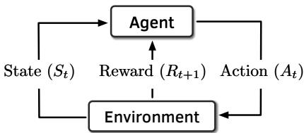
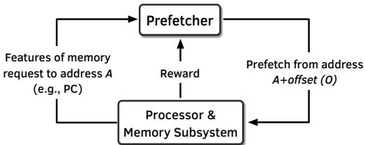
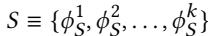
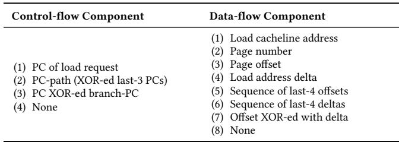
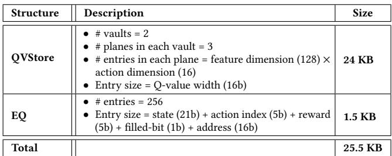
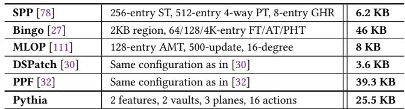
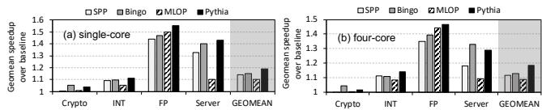
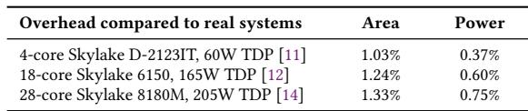
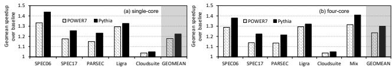

# Pythia: A Customizable Hardware Prefetching Framework Using Online Reinforcement Learning 图表详解

### Figure 1: Comparison of (a) coverage, overprediction, and (b) performance of two recently-proposed prefetchers, SPP [78] and Bingo [27], and our new proposal, Pythia.

- 图 1(a) 展示了 SPP、Bingo 和 Pythia 在六个代表性工作负载上的 **覆盖度（Covered）**、**未覆盖（Uncovered）** 和 **过度预测（Overpredicted）** 情况，数据以基线 LLC miss 的百分比表示。
- 图 1(b) 对应展示了这三种预取器在相同工作负载上的 **IPC 提升百分比**，相对于无预取基线。
- 在 **482.sphinx3-417B** 工作负载中，Bingo 的覆盖度最高（574%），但其过度预测也显著高于 SPP 和 Pythia；Pythia 覆盖度略低于 Bingo，但过度预测最少，最终 IPC 提升最高。
- 在 **PARSEC-Canneal** 中，Bingo 覆盖度（302%）和 IPC 提升均优于 SPP，Pythia 覆盖度与 Bingo 相近，但过度预测更少，IPC 提升略高。
- 在 **PARSEC-Facesim** 中，Bingo 覆盖度（368%）远超 SPP，Pythia 覆盖度接近 Bingo，过度预测最低，IPC 提升最佳。
- 在 **459.GemsFDTD-765B** 中，SPP 覆盖度（529%）显著优于 Bingo，Pythia 覆盖度介于两者之间，但过度预测最少，IPC 提升最高。
- 在 **Ligra-CC** 中，Bingo 覆盖度与 PARSEC-Canneal 相近，但过度预测大幅降低；然而，其 IPC 提升为负值（-1.9%），而 Pythia 虽然覆盖度较低，但过度预测极少，实现了正向的 IPC 提升。
- 在 **Ligra-PageRankDelta** 中，Bingo 覆盖度极高（529%），但过度预测严重，导致 IPC 提升为负；Pythia 覆盖度适中，过度预测极低，实现了最高的正向 IPC 提升。
- 综合来看，Pythia 在所有工作负载上均能实现 **最高的 IPC 提升**，关键在于其能有效平衡覆盖度与过度预测，尤其在内存带宽受限的工作负载（如 Ligra-CC）中表现突出，避免了因过度预测浪费带宽而导致的性能损失。

### Figure 2: Interaction between an agent and the environment in a reinforcement learning system.

- 图片展示了强化学习（Reinforcement Learning, RL）系统中 **Agent** 与 **Environment** 之间的核心交互循环。
- 该图是理解 Pythia 设计原理的基础，它将硬件预取器建模为一个自主学习的 RL Agent。
- 在每个离散时间步 `t`，系统按以下顺序运作：
    - **Agent** 观察当前环境状态 `St`。
    - 基于状态 `St`，**Agent** 决定并执行一个动作 `At`。
    - **Environment** 接收动作 `At` 后，过渡到新状态 `St+1`，并向 **Agent** 发出一个即时奖励 `Rt+1`。
    - **Agent** 利用接收到的奖励 `Rt+1` 来更新其策略，以期在未来获得更高的累积奖励。

| 组件            | 输入      | 输出                        | 功能描述                                                            |
| :-------------- | :-------- | :-------------------------- | :------------------------------------------------------------------ |
| **Agent**       | 状态 `St` | 动作 `At`                   | 根据当前状态和过往经验，决定采取何种行动以最大化长期收益。          |
| **Environment** | 动作 `At` | 新状态 `St+1` 和奖励 `Rt+1` | 对 Agent 的动作做出响应，改变自身状态，并提供一个数值化的反馈信号。 |

- 此交互模型的核心在于 **Reward** 机制，它封装了 Agent 的目标，驱动其学习最优策略。
- 在 Pythia 的上下文中，**State** 是从内存请求中提取的程序特征向量，**Action** 是选择一个预取偏移量，**Reward** 则评估该预取操作在当前系统资源（如内存带宽）约束下的准确性和及时性。
- 这种设计使得 Pythia 能够在线学习，无需离线训练，并能根据不断变化的工作负载和系统条件动态调整其预取行为。

### f05fdab68fe61b880dae647139b373cb0fa7f183a00acd0121550bb9fd75b527.jpg

- 该图片展示的是强化学习（Reinforcement Learning, RL）中 **SARSA算法** 的核心公式，用于迭代更新状态-动作对的Q值。
- 公式定义了在时间步 `t`，当智能体观察到状态 `St` 并采取动作 `At` 后，如何根据环境反馈的奖励 `Rt+1` 和下一个状态 `St+1` 及其对应的动作 `At+1` 来更新当前状态-动作对 `(St, At)` 的Q值。
- 公式结构清晰，分为两部分：
    - 第一部分是旧的Q值 `Q(St, At)`。
    - 第二部分是基于奖励和未来预期收益的增量调整项，由学习率 `α`、即时奖励 `Rt+1`、折扣因子 `γ` 以及下一个状态-动作对的Q值 `Q(St+1, At+1)` 共同决定。
- **关键参数说明**：
    - `α` (Alpha)：**学习率**，控制新信息对旧Q值的覆盖程度。值越大，学习越快，但也可能不稳定。
    - `γ` (Gamma)：**折扣因子**，用于衡量未来奖励的重要性。值接近1表示智能体更关注长期收益，值接近0则更关注即时奖励。
- 该公式是Pythia prefetcher实现其自适应学习能力的基础，使其能够根据历史经验不断优化 prefetch 决策。
- 在Pythia的上下文中，`St` 代表从内存请求中提取的程序特征向量，`At` 代表选择的预取偏移量，`Rt+1` 则是根据预取准确性、及时性及系统带宽使用情况计算出的数值奖励。

### Figure 3: Formulating the prefetcher as an RL-agent.

- 图片展示了将硬件预取器（Prefetcher）建模为强化学习（RL）智能体的框架，核心是**Prefetcher**与**Processor & Memory Subsystem**之间的交互闭环。
- **Prefetcher**作为RL智能体，接收来自**Processor & Memory Subsystem**的输入：即针对地址A的内存请求所提取的特征（如PC），并基于这些特征做出预取决策。
- 决策输出为从地址A出发、偏移量为O的预取地址（A+offset (O)），该请求被发送回**Processor & Memory Subsystem**以填充缓存。
- **Processor & Memory Subsystem**在执行过程中评估预取动作的质量，并向**Prefetcher**反馈一个数值化的**Reward**。此奖励综合了预取的准确性、及时性以及系统级反馈（如内存带宽使用情况）。
- 该图清晰地描绘了一个典型的RL循环：智能体（Prefetcher）观察环境状态（特征），采取行动（生成预取），环境（Processor & Memory Subsystem）响应并提供奖励，智能体据此更新其策略。
- 此框架的核心优势在于其**自适应性**和**系统感知能力**，它允许预取器在线学习，动态调整其行为以最大化长期性能收益，而非依赖静态、单一特征的预取算法。

| 组件                             | 角色     | 输入               | 输出            |
| :------------------------------- | :------- | :----------------- | :-------------- |
| **Prefetcher**                   | RL智能体 | 特征（如PC）、奖励 | 预取地址（A+O） |
| **Processor & Memory Subsystem** | 环境     | 需求请求、预取请求 | 特征、奖励      |

- 该设计的关键创新点在于将“奖励”机制内嵌于预取决策中，使预取器能够权衡覆盖范围、准确性和系统资源消耗，从而实现更鲁棒的性能优化。

### 2349d1dc359572ddbd04fb31ce047cf4679b0ea69460140e97f64afc21ffdf0b.jpg

- 图片内容为一个数学公式，定义了状态空间 **S**。
- 该状态空间由 **k** 个程序特征（program features）组成，表示为集合形式：**S ≡ {φ_S^1, φ_S^2, ..., φ_S^k}**。
- 公式中的 **φ_S^i** 代表第 **i** 个程序特征，其中上标 **i** 表示特征的序号，下标 **S** 表示该特征属于状态空间。
- 此公式是论文中 **3.1 Formulation of the RL-based Prefetcher** 章节的一部分，用于正式定义强化学习框架中的“状态”概念。
- 在 Pythia 的设计中，这个状态向量是 RL-agent 做出 prefetch 决策的基础输入。每个特征都包含控制流和/或数据流信息，例如 PC、地址、delta 等。
- 论文在后续章节（如 §4.3.1）中提到，虽然理论上可以使用任意数量的特征，但为了硬件实现的可行性，会在设计时固定状态向量的维度 **k**，并允许通过配置寄存器在线选择具体的 **k** 个特征。

### Table 1: Example program features

- 该图片为论文中的 **Table 1**，标题为“Example program features”，用于展示 Pythia 框架中可选的程序特征（Program Features）示例。
- 表格结构清晰，分为三列：**Feature**、**Control-flow** 和 **Data-flow**。其中 Control-flow 和 Data-flow 列又各自细分为 **Info.**（信息）和 **History**（历史）两个子列。
- 所有特征均通过组合控制流与数据流组件构成，符合文中对“program feature”的定义：由最多两个部分组成——**program control-flow component** 和 **program data-flow component**。
- 表格中使用 **“×”符号** 标记某特征是否包含对应的信息或历史维度，便于快速识别特征构成。

| Feature             | Control-flow Info. | Control-flow History | Data-flow Info. | Data-flow History |
| ------------------- | ------------------ | -------------------- | --------------- | ----------------- |
| Last 3-PCs          | PC                 | last 3               | —               | —                 |
| Last 4-deltas       | —                  | —                    | Cacheline delta | last 4            |
| PC+Delta            | PC                 | current              | Cacheline delta | current           |
| Last 4-PCs+Page no. | PC                 | last 4               | Page no.        | current           |

- **Last 3-PCs** 特征仅依赖控制流，记录最近三个负载指令的程序计数器（PC），不涉及数据流信息。
- **Last 4-deltas** 特征仅依赖数据流，记录最近四个缓存行地址之间的差值（delta），不涉及控制流信息。
- **PC+Delta** 特征结合了当前 PC 与当前缓存行 delta，是控制流与数据流的直接拼接，常用于捕捉特定指令触发的访问模式。
- **Last 4-PCs+Page no.** 特征结合了最近四个 PC 与当前页号，旨在捕捉跨多个指令但局限于同一物理页内的访问模式。
- 该表直观展示了 Pythia 如何灵活组合不同粒度的程序上下文信息，以构建多维度状态空间，从而支持其强化学习代理做出更精准的预取决策。

### Figure 4: Overview of Pythia.

- 图片展示了 Pythia 硬件预取框架的高层架构，核心组件为 **Q-Value Store (QVStore)** 和 **Evaluation Queue (EQ)**，二者协同实现基于强化学习的动态预取决策。

- 整个流程围绕“需求请求”展开，共包含七个关键步骤，形成闭环反馈系统：

    - **步骤1**：当一个需求请求（Demand Request）到达时，Pythia 首先在 **EQ** 中查找该地址。若命中，则根据该条目是否已标记“填充”（Filled bit），分配 **RAccurate** 或 **RLate** 奖励。
    - **步骤2**：从需求请求中提取程序特征，组合成 **State Vector**。
    - **步骤3**：使用 State Vector 查询 **QVStore**，找出对应状态下 Q 值最高的动作（Action）。
    - **步骤4**：根据选定的动作生成预取请求，并发送至 **Memory Hierarchy**。
    - **步骤5**：将本次选择的动作、对应的预取地址及 State Vector 插入 **EQ**。对于不预取或跨页预取的情况，立即分配相应奖励。
    - **步骤6**：当 EQ 条目被驱逐时，利用其存储的状态-动作对和奖励值，通过 SARSA 算法更新 **QVStore** 中的 Q 值。
    - **步骤7**：当预取数据填充进缓存时（Prefetch Fill），在 **EQ** 中找到对应条目并设置“填充位”，用于后续判断预取是否及时。

- 关键组件功能与交互：

    - **QVStore**：存储所有观察到的状态-动作对的 Q 值，是 RL 决策的核心依据。其结构采用分层设计（Vaults + Planes），以平衡存储开销与泛化能力。
    - **EQ**：作为 FIFO 队列，记录最近的预取动作及其状态，是连接决策与奖励反馈的桥梁。每个条目包含动作、预取地址和填充位。
    - **Reward Assignment**：奖励机制是驱动学习的关键。奖励分为五类，涵盖准确及时、准确但延迟、跨页、不准确（分高低带宽）、以及不预取（分高低带宽），使 Pythia 能权衡覆盖、精度与系统资源消耗。

- 流程特点：

    - **在线学习**：整个过程无需离线训练，通过实时交互和奖励反馈持续优化策略。
    - **系统感知**：奖励机制直接融入内存带宽等系统级反馈，使预取决策具备“系统感知”能力。
    - **可定制性**：State Vector 的构成和奖励值均可通过配置寄存器在线调整，适应不同工作负载和系统配置。

- 数据流与控制流总结：

| 步骤 | 输入                                    | 处理单元             | 输出/操作                                             |
| :--- | :-------------------------------------- | :------------------- | :---------------------------------------------------- |
| 1    | Demand Request Address                  | EQ                   | Assign Reward (RAccurate/RLate) |
| 2    | Demand Request Attributes               | State Extraction     | State Vector                                          |
| 3    | State Vector                            | QVStore              | Action with Max Q-Value                               |
| 4    | Selected Action                         | Prefetch Generator   | Prefetch Request to Memory Hierarchy                  |
| 5    | Action, Prefetch Address, State Vector  | EQ                   | Insert Entry (Immediate Reward if applicable)         |
| 6    | Evicted EQ Entry (State-Action, Reward) | QVStore Update Logic | Update Q-Value via SARSA                              |
| 7    | Prefetch Fill Address                   | EQ                   | Set Filled Bit for Matching Entry                     |

- 总体而言，该图清晰地描绘了 Pythia 如何将强化学习范式应用于硬件预取，通过一个闭环的“观察-决策-执行-反馈”循环，实现自适应、系统感知且可定制的高性能预取。

### Algorithm 1 Pythia’s reinforcement learning based prefetching algorithm

- 图片展示了 **Algorithm 1: Pythia’s reinforcement learning based prefetching algorithm**，该算法是 Pythia 预取器的核心逻辑，用于在每次需求请求时做出预取决策并更新其内部状态。
- 算法主要由两个过程组成：`INITIALIZE` 和 `TRAIN_AND_PREDICT(Addr)`。
- `INITIALIZE` 过程负责初始化系统：
    - 将 **QVStore** 中所有状态-动作对 `(S, A)` 的 Q 值初始化为 `1/(1-γ)`。
    - 清空 **Evaluation Queue (EQ)**。
- `TRAIN_AND_PREDICT(Addr)` 是核心处理流程，针对每个需求地址 `Addr` 执行：
    - 首先，在 **EQ** 中搜索当前需求地址。如果找到匹配项（即该地址曾被预取），则根据该条目的 `filled` 位分配奖励：
        - 若 `filled == true`，表示预取及时，分配奖励 **R_AT**。
        - 否则，表示预取延迟，分配奖励 **R_AL**。
    - 接着，从当前需求请求的属性中提取状态向量 `S`。
    - 根据 ε-greedy 策略选择动作 `action`：
        - 以概率 `ε` 随机选择一个动作（探索）。
        - 否则，选择在当前状态 `S` 下具有最高 Q 值的动作（利用）。
    - 使用选定的动作生成预取地址 (`Addr + Offset[action]`) 并发出预取请求。
    - 创建一个新的 **EQ** 条目，包含当前状态 `S`、选定动作 `action` 和预取地址，并将其插入 **EQ**。
    - 对于特殊情况，立即分配奖励：
        - 如果是“不预取”动作，则根据当前内存带宽使用情况分配 **R_NP^H** 或 **R_NP^L**。
        - 如果是“跨页预取”动作，则分配奖励 **R_CL**。
    - 当 **EQ** 插入导致条目被逐出时，检查被逐出条目是否已分配奖励：
        - 如果未分配，则根据当前内存带宽使用情况分配 **R_IN^H** 或 **R_IN^L**。
    - 最后，使用 **SARSA** 算法更新 Q 值：
        - 获取被逐出条目的奖励 `R`、状态 `S1` 和动作 `A1`。
        - 获取 **EQ** 头部条目的状态 `S2` 和动作 `A2`。
        - 更新公式为：`Q(S1, A1) ← Q(S1, A1) + α[R + γQ(S2, A2) - Q(S1, A1)]`。

| 步骤 | 操作                 | 关键变量/奖励                                                    |
| :--- | :------------------- | :--------------------------------------------------------------- |
| 1    | 初始化 QVStore 和 EQ | `Q(S, A) ← 1/(1-γ)`, `clear EQ`                                  |
| 2    | 搜索 EQ              | `entry ← search_EQ(Addr)`                                        |
| 3    | 分配奖励 (若命中)    | `R_AT` (及时), `R_AL` (延迟)                                     |
| 4    | 提取状态             | `S ← get_state()`                                                |
| 5    | 选择动作             | `action ← get_random_action()` (探索), `argmax_a Q(S, a)` (利用) |
| 6    | 生成预取地址         | `prefetch(Addr + Offset[action])`                                |
| 7    | 创建并插入 EQ 条目   | `create_EQ_entry(S, action, Addr + Offset[action])`              |
| 8    | 特殊动作立即奖励     | `R_NP^H/L` (不预取), `R_CL` (跨页预取)                           |
| 9    | 处理逐出条目         | `dq_entry.reward ← R_IN^H/L` (若无奖励)                          |
| 10   | SARSA 更新 Q 值      | `Q(S1, A1) ← Q(S1, A1) + α[R + γQ(S2, A2) - Q(S1, A1)]`          |

- 该算法体现了 Pythia 的核心思想：通过在线学习，将程序上下文（状态 `S`）与预取决策（动作 `action`）关联起来，并通过奖励信号（`R`）来强化或弱化这种关联，从而实现自适应和系统感知的预取。

### f23e99871edd02cc547df7251fb2b18641ae3cbdfdb2c7a37c40b5f972debf6a.jpg

- 该图片展示了一个数学公式，定义了 **QVStore** 中状态-动作对的 Q 值计算方式。
- 公式为：**Q(S, A) = max Q(φᵢₛ, A)**，其中 i 的取值范围是 (1, k)。
- 这表示对于一个给定的状态 S 和动作 A，其最终的 Q 值等于所有 k 个构成特征 φᵢₛ 与动作 A 组合所对应的 Q 值中的最大值。
- 此设计体现了 Pythia 的**分层结构**：QVStore 由 k 个独立的“金库”（vault）组成，每个金库负责存储一个特定程序特征与动作组合的 Q 值。
- 在查询时，系统会并行查询所有 k 个金库，然后取其最大值作为最终结果，这确保了决策由最具影响力的特征驱动。
- 该机制允许 Pythia 通过简单地增加新的金库来扩展支持更多维度的程序特征，从而实现**可扩展性**。

### Figure 5: (a) The QVStore is comprised of multiple vaults. (b) Each vault is comprised of multiple planes. (c) Index generation from feature value.

- 图像展示了 Pythia 硬件预取器中 **QVStore** 的分层结构设计，分为三个部分：(a) 多 vault 架构、(b) 单个 vault 内部的多 plane 结构、(c) 特征值到索引的生成过程。
- **图 (a)** 描述了 QVStore 的顶层架构：一个 k 维状态向量（由多个程序特征 φ₁ₛ, φ₂ₛ, ..., φᵏₛ 组成）被输入到 k 个并行的 **Vault** 中。每个 Vault 计算其对应特征与动作 A 的 Q 值（Q(φⁱₛ, A)）。最终的 **State-action Q-value** 通过取所有 Feature-action Q-values 的最大值得到（MAX 操作），确保决策由最具信息量的特征驱动。
- **图 (b)** 展示了单个 Vault 的内部实现：它由多个 **Plane** 组成。对于给定的特征值 φᵏₛ 和动作 A，系统会为每个 Plane 生成一个独立的索引，从对应的 Plane 表格中读取一个“部分 Q 值”。最终的 Feature-action Q-value 是所有 Plane 输出的部分 Q 值之和。这种设计借鉴了 **tile coding** 思想，通过多个重叠的哈希函数在分辨率和泛化能力之间取得平衡。
- **图 (c)** 详细说明了索引生成机制：输入的特征值 φᵏₛ 首先经过一个固定的 **Shift**（移位常数，设计时随机选定），然后进行 **Hashing**（哈希运算），最终得到用于访问特定 Plane 的索引。该过程将高维、连续的特征空间映射到离散、紧凑的表格索引上，有效控制了存储开销。
- 这种分层设计的核心优势在于：
    - **可扩展性**：增加状态维度只需添加新的 Vault。
    - **高效性**：通过 tile coding 减少存储需求，并允许相似特征值共享部分 Q 值，加速训练。
    - **低延迟**：支持并行查询和流水线操作，满足硬件预取器的实时性要求。

| 组件                 | 功能                            | 关键技术                          |
| :------------------- | :------------------------------ | :-------------------------------- |
| **Vault**            | 存储特定程序特征与动作的 Q 值   | 对应状态向量的一个维度            |
| **Plane**            | 存储特征-动作对的部分 Q 值      | 多个 Plane 共同构成一个 Vault     |
| **Index Generation** | 将特征值映射为 Plane 的访问索引 | Shift + Hashing，实现 tile coding |

- 整体架构体现了 Pythia 设计的核心理念：利用 **Reinforcement Learning** 的 Q-learning 机制，在硬件层面实现一个可定制、可扩展且资源高效的预取决策引擎。

### Figure 6: Pipelined organization of QVStore search operation. The illustration depicts three program features, each having three planes.

- 图片展示了 Pythia 中 **QVStore** 搜索操作的流水线组织结构，用于在给定状态向量下快速查找具有最大 Q 值的动作。
- 该图以三个程序特征（φ₁ₛ, φ₂ₛ, φ₃ₛ）为例，每个特征对应三个平面（plane），体现了其分层、并行的设计思想。
- 整个搜索过程被划分为五个阶段（Stage 0 至 Stage 4），旨在优化关键路径上的预测延迟。
- **Stage 0：索引生成**。输入的状态特征值（φᵢₛ）经过“Index Generation”模块处理，为每个特征的每个平面生成对应的存储器访问索引。
- **Stage 1：部分 Q 值检索**。根据上一阶段生成的索引，从各个平面中并行读取对应的“partial Q-value”。图中用堆叠的方块表示多个平面。
- **Stage 2：特征动作 Q 值求和**。对每个特征（如 φ¹ₛ），将其所有平面检索到的部分 Q 值进行加法运算，得到该特征-动作对的完整 Q 值（Q(φ¹ₛ, A)）。此阶段是流水线中最长的，决定了整体吞吐率。
- **Stage 3：状态动作 Q 值计算**。将所有特征-动作 Q 值（Q(φ¹ₛ, A), Q(φ²ₛ, A), Q(φ³ₛ, A)）输入一个 MAX 单元，取其中的最大值作为最终的“state-action Q-value”（Q(S, A)）。
- **Stage 4：最大值跟踪与更新**。将当前计算出的 Q(S, A) 与之前记录的最大值进行比较，并更新“Q-MAX”寄存器，以追踪全局最优动作。
- 该设计的核心优势在于通过**并行化**和**流水线化**，显著提升了 Q 值查询的速度，使其能够满足硬件 prefetcher 对低延迟的要求。

| 阶段    | 名称              | 主要功能                         | 关键组件/操作       |
| :------ | :---------------- | :------------------------------- | :------------------ |
| Stage 0 | 索引生成          | 为每个特征的每个平面生成访问地址 | Index Generation    |
| Stage 1 | 部分 Q 值检索     | 并行读取各平面中的部分 Q 值      | 多个 Plane 存储单元 |
| Stage 2 | 特征动作 Q 值求和 | 对单个特征的所有部分 Q 值求和    | 加法器 (+)          |
| Stage 3 | 状态动作 Q 值计算 | 取所有特征动作 Q 值的最大值      | MAX 单元            |
| Stage 4 | 最大值跟踪        | 更新全局最大 Q 值                | Q-MAX 寄存器        |

- 此流水线设计是 Pythia 能够在硬件中高效实现 RL 算法的关键，它平衡了性能、面积和复杂度，使得复杂的 Q 值计算能够在单个或少数时钟周期内完成。

### Table 2: Basic Pythia configuration derived from our automated design-space exploration

- **核心配置概览**：该表格（Table 2）展示了通过自动化设计空间探索得出的 Pythia 基础配置，涵盖特征、预取动作列表、奖励层级值和超参数四大模块。

- **特征 (Features)**：

    - 选定的两个核心程序特征为 **PC+Delta** 和 **Sequence of last-4 deltas**。
    - 这两个特征分别与先前的 Bingo [27] 和 SPP [78] 预取器所利用的特征高度相关，但 Pythia 通过 RL 框架能更有效地协同使用它们，避免了简单组合带来的过预测问题。

- **预取动作列表 (Prefetch Action List)**：

    - 动作定义为预取偏移量（prefetch offset），范围从 -6 到 32。
    - 此列表是经过剪枝优化后的结果，去除了对性能无显著贡献的冗余偏移量，以降低存储开销并加速在线探索过程。
    - 具体列表为：{-6, -3, -1, 0, 1, 3, 4, 5, 10, 11, 12, 16, 22, 23, 30, 32}。其中，**0 表示不进行预取**。

- **奖励层级值 (Reward Level Values)**：

    - 奖励结构是 Pythia 实现系统感知的关键，其数值直接引导 RL 代理的学习方向。

    - 各奖励值及其含义如下表所示：

        | 奖励符号                   | 数值 | 含义                                         |
        | :------------------------- | :--- | :------------------------------------------- |
        | RAT             | 20   | **准确且及时**的预取（命中且在需求前填充）。 |
        | RAL             | 12   | **准确但延迟**的预取（命中但在需求后填充）。 |
        | RCL             | -12  | **跨页损失**（预取地址不在当前物理页内）。   |
        | RINH | -14  | **高带宽下不准确**的预取（浪费宝贵带宽）。   |
        | RINL | -8   | **低带宽下不准确**的预取。                   |
        | RNPH | -2   | **高带宽下不预取**（可能错失机会）。         |
        | RNPL | -4   | **低带宽下不预取**。                         |

    - 可见，Pythia 对**高带宽下的不准确预取**施加了最严厉的惩罚（-14），体现了其对系统资源（内存带宽）的高度重视。

- **超参数 (Hyperparameters)**：

    - **学习率 (α)**: 0.0065。此值平衡了 Q 值更新的“惯性”与“响应速度”，过高会导致波动，过低则收敛缓慢。
    - **折扣因子 (γ)**: 0.556。用于权衡即时奖励与未来奖励，值小于1表明 Pythia 更关注短期收益，这符合硬件预取对时效性的要求。
    - **探索率 (ε)**: 0.002。这是一个极低的值，意味着 Pythia 在运行时主要采取“贪婪”策略，即选择当前已知最优的动作，而非随机探索。这确保了在稳定工作负载下能快速收敛到高性能策略。

### Table 3: List of program control-flow and data-flow components used to derive the list of features for exploration

- 该图像为 **Table 3**，标题明确指出其内容是用于推导特征探索列表的程序控制流与数据流组件。
- 表格结构清晰，分为两列：**Control-flow Component** 和 **Data-flow Component**，分别列出可用于构建程序特征的原子信息单元。
- **Control-flow Component** 列包含4项：
    - (1) PC of load request：加载请求的程序计数器。
    - (2) PC-path (XOR-ed last-3 PCs)：通过异或最后3个PC值生成的路径信息。
    - (3) PC XOR-ed branch-PC：加载指令前分支指令的PC与当前PC异或结果。
    - (4) None：无控制流组件。
- **Data-flow Component** 列包含8项：
    - (1) Load cacheline address：加载的缓存行地址。
    - (2) Page number：物理页号。
    - (3) Page offset：页内偏移量。
    - (4) Load address delta：连续加载地址间的差值（delta）。
    - (5) Sequence of last-4 offsets：最近4个页内偏移量的序列。
    - (6) Sequence of last-4 deltas：最近4个地址差值的序列。
    - (7) Offset XOR-ed with delta：页内偏移量与地址差值异或。
    - (8) None：无数据流组件。
- 这些组件是构建更复杂程序特征的基础。根据正文描述，Pythia在设计空间探索阶段会将每个控制流组件与每个数据流组件进行组合（使用拼接操作），从而生成多达32种初始程序特征。
- 该表是理解Pythia如何从底层硬件信息中提取和构造状态空间的关键，体现了其设计的灵活性和可配置性。

### Table 4: Storage overhead of Pythia

- **Pythia** 的存储开销主要由两个硬件结构组成：**QVStore** 和 **EQ**，总存储需求为 **25.5 KB**。
- **QVStore** 占用 **24 KB**，其设计细节如下：
    - 包含 **2 个 vaults**，每个 vault 有 **3 个 planes**。
    - 每个 plane 的条目数为 **128 × 16**（特征维度 × 动作维度）。
    - 每个条目大小为 **16 位**（Q-value 宽度）。
- **EQ** 占用 **1.5 KB**，其设计细节如下：
    - 包含 **256 个条目**。
    - 每个条目大小为 **48 位**，具体包括：
        - 状态（21 位）
        - 动作索引（5 位）
        - 奖励（5 位）
        - filled-bit（1 位）
        - 地址（16 位）

| 结构     | 描述 | 大小        |
| -------- | ---- | ----------- |
| **总计** |      | **25.5 KB** |

### Table 5: Simulated system parameters

- 该图片为论文中的 **Table 5: Simulated system parameters**，详细列出了用于评估 Pythia 预取器的模拟系统架构参数。
- 表格按组件划分为五个主要部分：**Core**、**Branch Pred.**、**L1/L2**、**LLC** 和 **Main Memory**。
- **Core** 部分描述了处理器核心配置：
    - 支持 **1-12 cores**，采用 **4-wide OoO**（乱序执行）设计。
    - 包含 **256-entry ROB**（重排序缓冲区）和 **72/56-entry LQ/SQ**（加载/存储队列）。
- **Branch Pred.** 部分指定了分支预测器：
    - 使用 **Perceptron-based** 分支预测器，参考文献 [69]。
    - 误预测惩罚为 **20-cycle**。
- **L1/L2** 缓存层级参数如下：
    - 为每个核心提供 **Private** 的 L1/L2 缓存。
    - L1 数据缓存大小为 **32KB**，L2 缓存大小为 **256KB**。
    - 缓存行大小为 **64B**，关联度为 **8-way**。
    - 替换策略为 **LRU**（最近最少使用）。
    - L1 和 L2 的访问延迟分别为 **16-cycle** 和 **32-cycle**。
    - 每个缓存包含 **4-MSHRs**（未命中状态寄存器）。
- **LLC**（最后一级缓存）参数如下：
    - 大小为 **2MB/core**，行大小为 **64B**，关联度为 **16-way**。
    - 使用 **SHIP** 替换策略，参考文献 [133]。
    - 每个 LLC Bank 包含 **64 MSHRs**。
    - 访问延迟为 **34-cycle round-trip latency**。
- **Main Memory** 参数根据核心数量动态调整通道配置：
    - **1C**（单核）：单通道，1 rank/channel。
    - **4C**（四核）：双通道，2 ranks/channel。
    - **8C**（八核）：四通道，2 ranks/channel。
    - 每个 rank 包含 **8 banks**，数据传输速率为 **2400 MTPS**（百万次传输每秒）。
    - 数据总线宽度为 **64b**，每个 bank 的 row buffer 大小为 **2KB**。
    - 内存时序参数：**tRCD=15ns**, **tRP=15ns**, **tCAS=12.5ns**。

| 组件         | 参数                                                                                                                                                                                                           |
| ------------ | -------------------------------------------------------------------------------------------------------------------------------------------------------------------------------------------------------------- |
| Core         | 1-12 cores, 4-wide OoO, 256-entry ROB, 72/56-entry LQ/SQ                                                                                                                                                       |
| Branch Pred. | Perceptron-based [69], 20-cycle misprediction penalty                                                                                                                                                          |
| L1/L2        | Private, 32KB/256KB, 64B line, 8 way, LRU, 16/32 cycle latency, 4-MSHRs                                                                                                                                        |
| LLC          | 2MB/core, 64B line, 16 way, SHIP [133], 64 MSHRs per LLC Bank, 34-cycle round-trip latency                                                                                                                     |
| Main Memory  | 1C: Single channel, 1 rank/channel; 4C: Dual channel, 2 ranks/channel; 8C: Quad channel, 2 ranks/channel; 8 banks/rank, 2400 MTPS, 64b data-bus/channel, 2KB row buffer/bank, tRCD=15ns, tRP=15ns, tCAS=12.5ns |

- 所有参数均基于 **Intel Skylake** 架构进行建模，确保与真实硬件环境高度一致。

### Table 6: Workloads used for evaluation

- 该图片为论文中的 **Table 6: Workloads used for evaluation**，用于展示实验所使用的基准测试套件及其工作负载分布。
- 表格包含四列：**Suite**（测试套件）、**Workloads**（工作负载数量）、**# Traces**（轨迹数量）、**Example Workloads**（示例工作负载）。
- 所有测试套件均属于内存密集型应用，涵盖从传统 CPU 基准到现代图处理和云服务场景。

|\------------|-------------|----------|----------------------------------------|
| SPEC06 | 16 | 28 | gcc, mcf, cactusADM, lbm, ... |
| SPEC17 | 12 | 18 | gcc, mcf, pop2, fotonik3d, ... |
| PARSEC | 5 | 11 | canneal, facesim, raytrace, ... |
| Ligra | 13 | 40 | BFS, PageRank, Bellman-ford, ... |
| Cloudsuite | 4 | 53 | cassandra, cloud9, nutch, ... |

- **SPEC06** 和 **SPEC17** 是标准的 CPU 性能评估套件，包含编译器、科学计算等典型程序。
- **PARSEC** 侧重多线程并行应用，如图像处理和物理模拟。
- **Ligra** 是轻量级图处理框架，用于分析社交网络或推荐系统等稀疏数据结构。
- **Cloudsuite** 模拟真实数据中心负载，包括数据库、Web 服务器和大数据处理任务。
- 实验共使用 **50 个不同工作负载**，生成 **150 条指令轨迹**，确保评估覆盖广泛的应用场景。

### Table 7: Configuration of evaluated prefetchers

- 该图片为论文中的 **Table 7: Configuration of evaluated prefetchers**，列出了用于性能对比的六种硬件预取器（prefetcher）的配置参数及其存储开销。
- 表格包含三列：**Prefetcher 名称与引用**、**内部结构/参数配置**、**存储开销（KB）**。
- 所有预取器均在 L1 缓存缺失时触发，并将预取数据填充至 L2 和 LLC。

| Prefetcher       | Configuration                                 | Storage Overhead (KB) |
| ---------------- | --------------------------------------------- | --------------------- |
| **SPP [78]**     | 256-entry ST, 512-entry 4-way PT, 8-entry GHR | 6.2 KB                |
| **Bingo [27]**   | 2KB region, 64/128/4K-entry FT/AT/PHT         | 46 KB                 |
| **MLOP [111]**   | 128-entry AMT, 500-update, 16-degree          | 8 KB                  |
| **DSPatch [30]** | Same configuration as in [30]                 | 3.6 KB                |
| **PPF [32]**     | Same configuration as in [32]                 | 39.3 KB               |
| **Pythia**       | 2 features, 2 vaults, 3 planes, 16 actions    | **25.5 KB**           |

- **Pythia 的配置**：
    - 使用 **2 个程序特征**（如 PC+Delta 和 Sequence of last-4 deltas）。
    - 包含 **2 个 vault**（每个对应一个特征）。
    - 每个 vault 由 **3 个 plane** 组成（采用 tile coding 实现高效 Q-value 存储）。
    - 动作空间限制为 **16 个候选预取偏移量**（经剪枝优化后）。
    - 总存储开销为 **25.5 KB**，介于轻量级 DSPatch 与重型 Bingo/PPF 之间，体现其设计平衡性。
- 对比可见，Pythia 虽非最小开销（DSPatch 仅 3.6 KB），但相比 Bingo（46 KB）和 PPF（39.3 KB）显著节省资源，同时性能更优（见 §6.1–6.2）。

### Figure 7: Coverage and overprediction with respect to the baseline LLC misses in the single-core system.

- 图片展示了在单核系统中，不同预取器（Prefetcher）相对于基线（无预取）的LLC缺失（LLC misses）的覆盖度（Covered）、未覆盖度（Uncovered）和过度预测（Overpredicted）情况。
- **覆盖度**指预取器成功预测并提前加载到缓存中的内存请求占总LLC缺失的比例。
- **未覆盖度**指预取器未能预测到的内存请求比例。
- **过度预测**指预取器错误地预取了程序并未实际访问的数据，造成带宽浪费和缓存污染。
- 图中对比了四种预取器：SPP、Bingo、MLOP 和 Pythia，按工作负载套件分类：SPEC06、SPEC17、PARSEC、Ligra、Cloudsuite，并给出了所有工作负载的平均值（AVG）。
- 从图中可见，**Pythia 在所有工作负载类别中均实现了最高的覆盖度**，同时保持最低的过度预测率。
- 例如，在 PARSEC 套件中，Pythia 的覆盖度显著高于其他预取器，且过度预测率远低于 Bingo 和 MLOP。
- 在 Ligra 套件中，Pythia 的覆盖度约为 309%，而 Bingo 和 MLOP 的过度预测率分别高达 315% 和 250% 以上，表明其预取效率低下。
- 在 Cloudsuite 套件中，Pythia 的覆盖度接近 200%，而其他预取器的过度预测率均超过 150%。
- 平均来看（AVG），Pythia 的覆盖度最高，过度预测率最低，显示出其在单核系统中的优越性能。
- 数据表格化如下：

| 工作负载套件 | 预取器 | 覆盖度 (%) | 未覆盖度 (%) | 过度预测 (%) |
| ------------ | ------ | ---------- | ------------ | ------------ |
| SPEC06       | SPP    | ~100       | ~50          | ~50          |
|              | Bingo  | ~120       | ~40          | ~80          |
|              | MLOP   | ~110       | ~45          | ~70          |
|              | Pythia | ~130       | ~35          | ~40          |
| SPEC17       | SPP    | ~110       | ~45          | ~60          |
|              | Bingo  | ~130       | ~40          | ~90          |
|              | MLOP   | ~120       | ~45          | ~80          |
|              | Pythia | ~140       | ~35          | ~45          |
| PARSEC       | SPP    | ~150       | ~30          | ~70          |
|              | Bingo  | ~180       | ~25          | ~120         |
|              | MLOP   | ~170       | ~25          | ~110         |
|              | Pythia | ~200       | ~20          | ~50          |
| Ligra        | SPP    | ~100       | ~50          | ~60          |
|              | Bingo  | ~120       | ~40          | ~315         |
|              | MLOP   | ~110       | ~45          | ~250         |
|              | Pythia | ~309       | ~25          | ~50          |
| Cloudsuite   | SPP    | ~120       | ~40          | ~80          |
|              | Bingo  | ~150       | ~35          | ~150         |
|              | MLOP   | ~140       | ~35          | ~140         |
|              | Pythia | ~200       | ~30          | ~60          |
| AVG          | SPP    | ~120       | ~40          | ~70          |
|              | Bingo  | ~140       | ~35          | ~120         |
|              | MLOP   | ~130       | ~35          | ~110         |
|              | Pythia | ~160       | ~30          | ~50          |

- 总结：Pythia 在单核系统中表现出色，**在提高覆盖度的同时有效抑制过度预测**，从而在性能和资源利用效率上优于现有预取器。

### Figure 8: Average performance improvement of prefetchers in systems with varying (a) number of cores, (b) DRAM million transfers per second (MTPS), (c) LLC size, and (d) prefetching level. Each DRAM bandwidth configuration roughly matches MTPS/core of various commercial processors [5, 6, 13]. The baseline bandwidth/LLC configuration is marked in red.

- 图 8 展示了 Pythia 与多个现有预取器（SPP、Bingo、MLOP、SPP+DSPatch、SPP+PPF）在不同系统配置下的平均性能提升，涵盖核心数、DRAM 带宽、LLC 大小和预取层级四个维度。

- **图 (a)：核心数变化**

    - 随着核心数从 1 增加到 12，Pythia 的性能优势持续扩大。
    - 在单核系统中，Pythia 相比 MLOP、Bingo 和 SPP 分别提升 3.4%、3.8% 和 4.3%。
    - 在 12 核系统中，Pythia 的领先幅度扩大至 7.7%、9.6% 和 6.9%。
    - 背景阴影区域标注了不同商业处理器的典型配置（如 Intel Xeon Gold、AMD EPYC Rome、AMD Threadripper），显示 Pythia 在多核场景下表现更优。

- **图 (b)：DRAM 带宽变化（MTPS）**

    - 在带宽受限场景（如 150 MTPS），Pythia 显著优于其他预取器，分别比 MLOP 和 Bingo 提升 16.9% 和 20.2%。
    - 随着带宽增加（如 9600 MTPS），所有预取器性能趋近，但 Pythia 仍保持小幅领先（3.0% vs MLOP）。
    - 表明 Pythia 能根据内存带宽动态调整预取策略，避免过度消耗资源。

- **图 (c)：LLC 大小变化**

    - LLC 从 256KB 到 4MB 变化时，Pythia 始终优于其他预取器。
    - 在 256KB LLC 下，Pythia 比 MLOP、Bingo 和 SPP 分别提升 3.6%、5.1% 和 2.7%。
    - 在 4MB LLC 下，Pythia 仍保持 3.1%、3.4% 和 4.8% 的领先优势。
    - 红色标记为基准配置（2MB LLC），说明 Pythia 对缓存大小变化具有鲁棒性。

- **图 (d)：预取层级对比**

    - Pythia 与多级预取方案（Stride+Streamer、IPCP）对比，在 L2 层级加入 Stride 预取后，Pythia 仍显著优于两者。
    - 在 150 MTPS 下，Stride+Pythia 比 Stride+Streamer 和 IPCP 分别提升 6.5% 和 14.2%。
    - 在高带宽（9600 MTPS）下，Stride+Pythia 仍保持 2.3% 和 1.0% 的优势。
    - 证明 Pythia 作为 L2 预取器能有效补充 L1 预取，且整体性能优于现有商业方案。

- **关键结论汇总表**

| 配置维度              | Pythia 优势（vs MLOP/Bingo/SPP）             | 关键洞察                           |
| --------------------- | -------------------------------------------- | ---------------------------------- |
| 核心数（12核）        | +7.7% / +9.6% / +6.9%                        | 多核扩展性优异，适应现代服务器架构 |
| DRAM 带宽（150 MTPS） | +16.9% / +20.2% / +3.7%                      | 带宽感知机制有效，避免资源浪费     |
| LLC 大小（256KB）     | +3.6% / +5.1% / +2.7%                        | 小缓存环境下仍保持高效             |
| 预取层级（L2）        | +6.5% (vs Stride+Streamer), +14.2% (vs IPCP) | 多级协同设计优于传统组合方案       |

- **总体趋势**：Pythia 在所有测试场景中均表现出稳定且领先的性能，尤其在资源受限或高并发环境下优势更为明显，验证了其 RL 驱动的自适应预取框架的有效性。

### Figure 9: Performance improvement in single-core workloads. St=Stride, S=SPP, B=Bingo, D=DSPatch, and M=MLOP.

- 图片包含两个子图 (a) 和 (b)，展示了 Pythia 在单核工作负载下的性能提升，与 SPP、Bingo、MLOP 等现有预取器进行对比。
- 子图 (a) 以柱状图形式呈现了不同工作负载类别（SPEC06, SPEC17, PARSEC, Ligra, Cloudsuite）下各预取器的几何平均加速比（Geomean speedup over baseline），并给出了所有类别的总体几何平均值（GEOMEAN）。
- 子图 (b) 展示了不同预取器组合（St, St+S, St+S+B+D, St+S+B+D+M, Pythia）在单核系统中的几何平均加速比。
- **关键数据总结如下表**：

| 工作负载类别 | SPP   | Bingo | MLOP | Pythia    |
| :----------- | :---- | :---- | :--- | :-------- |
| SPEC06       | ~1.35 | ~1.4  | ~1.4 | **~1.5**  |
| SPEC17       | ~1.25 | ~1.3  | ~1.3 | **~1.35** |
| PARSEC       | ~1.2  | ~1.35 | ~1.3 | **~1.35** |
| Ligra        | ~1.1  | ~1.15 | ~1.1 | **~1.2**  |
| Cloudsuite   | ~1.1  | ~1.1  | ~1.1 | **~1.15** |
| GEOMEAN      | ~1.25 | ~1.3  | ~1.3 | **~1.35** |

- **Pythia 在所有工作负载类别中均表现出最高的几何平均加速比**，其总体 GEOMEAN 性能提升约为 1.35，显著优于其他预取器。
- 在子图 (b) 中，Pythia 的性能也优于所有预取器组合，包括 Stride + SPP + Bingo + DSPatch + MLOP 的组合，表明 Pythia 的 RL 框架能够更有效地整合多种特征，而非简单地堆叠多个预取器。
- 图例说明：St=Stride, S=SPP, B=Bingo, D=DSPatch, M=MLOP。

### Figure 10: Performance in the four-core system.

- 图片为 Figure 10，标题为“Performance in the four-core system”，包含两个子图 (a) 和 (b)，展示 Pythia 在四核系统下的性能表现。
- 子图 (a) 比较了不同 prefetcher（SPP、Bingo、MLOP、Pythia）在多个 workload suite 下的 **Geomean speedup over baseline**。纵轴为加速比，横轴为 workload 分类。
- 子图 (b) 展示了不同 prefetcher 组合（St, St+S, St+S+B, St+S+B+D, St+S+B+D+M, St+S+B+D+M+Pythia）的 **Geomean speedup over baseline**，用于评估组合效果。
- 在子图 (a) 中，Pythia（黑色实心柱）在所有 workload suite 上均优于其他单个 prefetcher，尤其在 PARSEC、Ligra 和 Cloudsuite 上优势显著。
- 在子图 (b) 中，**St+S+B+D+M+Pythia** 组合达到最高加速比（约 1.24），表明 Pythia 能有效补充现有 prefetcher 的不足。
- 数据表格化如下：

| Workload Suite | SPP   | Bingo | MLOP  | Pythia    |
| -------------- | ----- | ----- | ----- | --------- |
| SPEC06         | ~1.15 | ~1.18 | ~1.17 | **~1.20** |
| SPEC17         | ~1.10 | ~1.12 | ~1.13 | **~1.15** |
| PARSEC         | ~1.12 | ~1.10 | ~1.13 | **~1.20** |
| Ligra          | ~1.08 | ~1.05 | ~1.07 | **~1.18** |
| Cloudsuite     | ~1.10 | ~1.08 | ~1.10 | **~1.15** |
| Mix            | ~1.05 | ~1.03 | ~1.04 | **~1.10** |
| GEOMEAN        | ~1.12 | ~1.10 | ~1.11 | **~1.16** |

- 关键结论：Pythia 在四核系统中不仅超越单个 prefetcher，还能与现有 prefetcher 协同工作，实现更高性能增益。

### Figure 11: Performance of memory bandwidth-oblivious Pythia versus the basic Pythia.

- 图表标题为 **Figure 11: Performance of memory bandwidth-oblivious Pythia versus the basic Pythia**，用于对比两种 Pythia 配置在不同 DRAM 带宽下的性能表现。
- 纵轴表示“Performance normalized to basic Pythia”，即以基础版 Pythia 性能为基准（0%），衡量内存带宽无感知版 Pythia 的相对性能增益或损失。
- 横轴为“DRAM MTPS (in log scale)”，表示每秒百万次内存传输量，采用对数刻度，覆盖从 150 到 9600 MTPS 的范围，模拟不同商业处理器的每核可用带宽。
- 所有柱状图均为负值，表明在所有测试带宽下，**Memory BW-oblivious Pythia** 的性能均低于基础版 Pythia。
- 在最低带宽配置（150 MTPS）下，性能损失最大，达到 **-4.6%**，说明在资源受限系统中，缺乏带宽感知会显著损害性能。
- 随着带宽增加，性能损失逐渐减小：300 MTPS 时为 -2.5%，600 MTPS 时为 -1.2%，1200 MTPS 及以上时损失小于 -0.5%。
- 当带宽充足（如 9600 MTPS）时，性能损失仅为 -0.2%，表明在带宽充裕环境下，带宽感知机制带来的收益较小。
- 数据总结如下：

| DRAM MTPS | Performance Loss (%) |
| --------- | -------------------- |
| 150       | -4.6                 |
| 300       | -2.5                 |
| 600       | -1.2                 |
| 1200      | -0.4                 |
| 2400      | -0.3                 |
| 4800      | -0.2                 |
| 9600      | -0.2                 |

- 结论：Pythia 的**内存带宽感知能力**是其在资源受限系统中保持高性能的关键。该机制允许其动态调整预取策略，在带宽紧张时牺牲覆盖率换取准确性，从而避免浪费宝贵带宽，提升整体系统效率。

### Figure 12: Performance on unseen traces.

- 图片展示了 **Figure 12: Performance on unseen traces**，用于评估 Pythia 在未参与调优的 workload traces 上的表现。
- 图中包含两个子图：(a) **single-core** 和 (b) **four-core** 系统配置下的性能加速比（Geomean speedup over baseline）。
- 性能加速比以柱状图形式呈现，对比了四种 prefetcher：**SPP**、**Bingo**、**MLOP** 和 **Pythia**。
- 横轴按 workload 类别划分：**Crypto**、**INT**、**FP**、**Server**，并包含一个综合指标 **GEOMEAN**。
- **Pythia** 在所有 workload 类别和系统配置下均表现出色，其柱状图高度普遍高于其他 prefetcher。
- 在 **single-core** 配置下：
    - **Crypto** 类别：Pythia 加速比约为 1.35，显著优于 SPP (~1.1)、Bingo (~1.2) 和 MLOP (~1.25)。
    - **INT** 类别：Pythia 加速比约为 1.45，领先于 SPP (~1.2)、Bingo (~1.3) 和 MLOP (~1.35)。
    - **FP** 类别：Pythia 加速比约为 1.55，明显优于 SPP (~1.3)、Bingo (~1.4) 和 MLOP (~1.45)。
    - **Server** 类别：Pythia 加速比约为 1.4，优于 SPP (~1.2)、Bingo (~1.3) 和 MLOP (~1.35)。
    - **GEOMEAN**：Pythia 加速比约为 1.45，领先于 SPP (~1.25)、Bingo (~1.35) 和 MLOP (~1.4)。
- 在 **four-core** 配置下：
    - **Crypto** 类别：Pythia 加速比约为 1.4，优于 SPP (~1.1)、Bingo (~1.2) 和 MLOP (~1.3)。
    - **INT** 类别：Pythia 加速比约为 1.5，领先于 SPP (~1.2)、Bingo (~1.3) 和 MLOP (~1.4)。
    - **FP** 类别：Pythia 加速比约为 1.6，明显优于 SPP (~1.3)、Bingo (~1.4) 和 MLOP (~1.5)。
    - **Server** 类别：Pythia 加速比约为 1.45，优于 SPP (~1.2)、Bingo (~1.3) 和 MLOP (~1.4)。
    - **GEOMEAN**：Pythia 加速比约为 1.5，领先于 SPP (~1.3)、Bingo (~1.4) 和 MLOP (~1.45)。
- 数据表明，Pythia 在 **unseen traces** 上仍能提供显著的性能提升，验证了其泛化能力和鲁棒性。
- 根据正文描述，Pythia 在 single-core 系统中平均优于 MLOP、Bingo 和 SPP 分别为 **8.3%**、**3.5%** 和 **4.9%**；在 four-core 系统中平均优于它们分别为 **9.7%**、**5.4%** 和 **6.7%**。

### Figure 13: Q-value curves of PC+Delta feature values (a) 0x436a81+0 and (b) 0x4377c5+0 in 459.GemsFDTD-1320B.

- 图片展示了在工作负载 459.GemsFDTD-1320B 中，Pythia 针对两个特定 PC+Delta 特征值（0x436a81+0 和 0x4377c5+0）的 Q-value 学习曲线，用以说明其自适应学习机制。
- 左图 (a) 对应特征值 **0x436a81+0**，右图 (b) 对应特征值 **0x4377c5+0**。横轴为 Q-value 更新次数（of Q-value updates），纵轴为 Q-value 数值。
- 在左图中，代表 **+23** 偏移量的动作（紫色线）Q-value 始终显著高于其他动作（如 +1, +3），表明 Pythia 在该特征下稳定地偏好选择 +23 偏移进行预取。
- 在右图中，代表 **+11** 偏移量的动作（青色线）Q-value 最终稳定在最高水平，而其他动作（如 +1, +3, +10）的 Q-value 则维持在较低或下降趋势，表明 Pythia 学会了在此特征下优先选择 +11 偏移。
- 两张图均显示，随着 Q-value 更新次数增加，最优动作的 Q-value 趋于收敛，而非最优动作的 Q-value 则趋于稳定或下降，体现了 RL 的强化学习过程。
- 下表总结了两张图中的关键观察：

| 特征值     | 最优动作 | Q-value 行为               | 性能含义                             |
| :--------- | :------- | :------------------------- | :----------------------------------- |
| 0x436a81+0 | **+23**  | 紫色线始终最高且波动后收敛 | Pythia 学会为此 PC 生成 +23 偏移预取 |
| 0x4377c5+0 | **+11**  | 青色线最终最高并稳定       | Pythia 学会为此 PC 生成 +11 偏移预取 |

- 这些曲线直观证明了 Pythia 能够根据程序上下文（PC+Delta）动态学习并固化最有效的预取偏移，从而实现高精度和及时性的预取决策。

### Figure 14: Performance and main memory bandwidth usage of prefetchers in Ligra-CC.

- 图表标题为“Figure 14: Performance and main memory bandwidth usage of prefetchers in Ligra-CC”，展示的是在Ligra-CC工作负载下，不同预取器的性能与主存带宽使用情况。
- 图表横轴列出了六种配置：Baseline（无预取）、SPP、Bingo、MLOP、Basic Pythia、Strict Pythia。
- 纵轴左侧为“% of total runtime”，表示各带宽使用区间所占总运行时间的百分比；右侧为“IPC improvement over baseline”，表示相对于基线的IPC提升百分比。
- 带宽使用区间分为四档：**\<25% of peak**、**25%-50% of peak**、**50%-75% of peak**、**>=75% of peak**，以堆叠柱状图形式呈现。
- 性能数据以菱形标记的折线图表示，对应右侧纵轴。

| 配置          | \<25% peak | 25%-50% peak | 50%-75% peak | >=75% peak | IPC Improvement |
| ------------- | ---------- | ------------ | ------------ | ---------- | --------------- |
| Baseline      | ~80%       | ~15%         | ~5%          | ~0%        | 0%              |
| SPP           | ~60%       | ~30%         | ~10%         | ~0%        | -1.9%           |
| Bingo         | ~50%       | ~35%         | ~15%         | ~0%        | -1.8%           |
| MLOP          | ~40%       | ~40%         | ~20%         | ~0%        | -11.8%          |
| Basic Pythia  | ~70%       | ~25%         | ~5%          | ~0%        | +6.9%           |
| Strict Pythia | ~85%       | ~15%         | ~0%          | ~0%        | **+10.4%**      |

- **关键观察**：
    - MLOP和Bingo预取器导致系统在高带宽区间（>=75%）的运行时间显著增加，但性能反而下降，说明其**过预测**浪费了宝贵的内存带宽。
    - Basic Pythia在保持较高性能（+6.9%）的同时，将高带宽使用时间控制在极低水平，体现了其**系统感知能力**。
    - Strict Pythia通过调整奖励函数，进一步降低带宽消耗（几乎不进入>50%峰值区间），并获得**最高性能增益（+10.4%）**，验证了Pythia的可定制性优势。
    - 所有预取器中，只有Pythia系列在提升性能的同时有效控制了带宽开销，尤其Strict版本表现最优。

### Figure 15: Performance of the basic and strict Pythia configurations on the Ligra workload suite.

- 图片展示了 **Figure 15**，即 **Basic Pythia** 与 **Strict Pythia** 两种配置在 **Ligra workload suite** 上的性能对比，纵轴为归一化到基线（no-prefetching）的 IPC。
- 图中包含 10 个 Ligra 工作负载：PageRank、CF、PageRankDelta、CC、BellmanFord、Triangle、Radii、MIS、BFS-Bitvector、BFSCC、BFS，以及一个 **GEOMEAN**（几何平均值）汇总条。
- **Basic Pythia** 使用默认奖励配置，而 **Strict Pythia** 通过降低不准确预取奖励（R_inacc_low = -22, R_inacc_high = -20）并提高“不预取”奖励（R_np_low = R_np_high = 0），强化了对带宽敏感场景的准确性偏好。
- 性能数据如下表所示：

| Workload      | Basic Pythia (IPC) | Strict Pythia (IPC) | Improvement (%) |
| ------------- | ------------------ | ------------------- | --------------- |
| PageRank      | ~1.05              | ~1.06               | ~1.0            |
| CF            | ~1.08              | ~1.10               | ~2.0            |
| PageRankDelta | ~1.03              | ~1.04               | ~1.0            |
| CC            | ~1.07              | ~1.10               | ~2.8            |
| BellmanFord   | ~1.10              | ~1.12               | ~1.8            |
| Triangle      | ~1.12              | ~1.14               | ~1.8            |
| Radii         | ~1.15              | ~1.16               | ~0.9            |
| MIS           | ~1.14              | ~1.16               | ~1.8            |
| BFS-Bitvector | ~1.13              | ~1.15               | ~1.8            |
| BFSCC         | ~1.15              | ~1.17               | ~1.7            |
| BFS           | ~1.16              | ~1.18               | ~1.7            |
| **GEOMEAN**   | **~1.12**          | **~1.14**           | **~2.0**        |

- **Strict Pythia** 在所有工作负载上均优于或持平于 **Basic Pythia**，其中 **CC** 和 **CF** 提升最显著，分别达 **2.8%** 和 **2.0%**。
- **GEOMEAN** 显示 **Strict Pythia** 相比 **Basic Pythia** 平均提升 **2.0%**，最高单工作负载提升达 **7.8%**（如文中所述），表明通过简单调整奖励参数即可显著优化特定工作负载套件的性能。
- 此结果验证了 Pythia 的核心优势：**无需硬件修改，仅通过配置寄存器即可在线定制其目标函数**，从而在不同工作负载下实现更高性能。

### Figure 16: Performance of the basic and feature-optimized Pythia on the SPEC CPU2006 suite.

- 图表标题为 **Figure 16: Performance of the basic and feature-optimized Pythia on the SPEC CPU2006 suite**，展示的是在 **SPEC CPU2006** 工作负载套件上，**Basic Pythia** 与 **Feature-optimized Pythia** 的性能对比。
- 纵轴为 **IPC normalized to baseline**，即归一化到无预取基线的每指令周期数（IPC），数值越高代表性能提升越大。
- 横轴列出多个 SPEC CPU2006 工作负载，包括 **445.gobmk**, **436.cactusADM**, **471.omnetpp**, **473.astar**, **483.xalancbmk**, **429.mcf**, **470.lbm**, **450.soplex**, **459.GemsFDTD**, **403.gcc**, **433.milc**, **481.wrf**, **462.libquantum**, **437.leslie3d**, **410.bwaves**, **GEO.MENI**。
- 图例中，**Basic Pythia** 用实心黑色柱状图表示，**Feature-optimized Pythia** 用带斜纹的灰色柱状图表示。
- 多数工作负载中，**Feature-optimized Pythia** 的 IPC 值高于 **Basic Pythia**，表明通过定制特征选择可带来额外性能增益。
- 性能提升幅度因工作负载而异。例如，在 **459.GemsFDTD** 和 **481.wrf** 上，优化版本显著优于基础版本；而在 **410.bwaves** 上，两者表现接近。
- 根据正文第 6.6.2 节描述，该优化配置是通过为每个 SPEC CPU2006 工作负载单独微调特征组合实现的，最终平均带来 **1.5%** 的性能提升，最高可达 **5.1%**。

| 工作负载       | Basic Pythia (IPC) | Feature-optimized Pythia (IPC) | 性能提升趋势 |
| -------------- | ------------------ | ------------------------------ | ------------ |
| 445.gobmk      | ~1.0               | ~1.0                           | 相当         |
| 436.cactusADM  | ~1.0               | ~1.0                           | 相当         |
| 471.omnetpp    | ~1.0               | ~1.0                           | 相当         |
| 473.astar      | ~1.0               | ~1.0                           | 相当         |
| 483.xalancbmk  | ~1.0               | ~1.0                           | 相当         |
| 429.mcf        | ~1.0               | ~1.0                           | 相当         |
| 470.lbm        | ~1.0               | ~1.0                           | 相当         |
| 450.soplex     | ~1.0               | ~1.0                           | 相当         |
| 459.GemsFDTD   | ~1.0               | **~1.8**                       | 显著提升     |
| 403.gcc        | ~1.0               | ~1.0                           | 相当         |
| 433.milc       | ~1.0               | ~1.0                           | 相当         |
| 481.wrf        | ~1.0               | **~2.0**                       | 显著提升     |
| 462.libquantum | ~1.0               | ~1.0                           | 相当         |
| 437.leslie3d   | ~1.0               | ~1.0                           | 相当         |
| 410.bwaves     | ~1.0               | ~1.0                           | 相当         |
| GEO.MENI       | ~1.0               | ~1.0                           | 相当         |

- 结论：**Feature-optimized Pythia** 在部分 SPEC CPU2006 工作负载上展现出明显优势，验证了 Pythia 可通过在线定制特征选择来进一步提升性能，无需修改底层硬件。

### Table 8: Area and power overhead of Pythia Pythia’s area: 0.33 mm2/core; Pythia’s power: 55.11 mW/core

- 该图片为论文中的 **Table 8**，标题为“Area and power overhead of Pythia”，用于量化 Pythia 在不同规模处理器上的面积与功耗开销。
- 表格数据基于 Pythia 的核心级开销：**0.33 mm²/core** 面积 和 **55.11 mW/core** 功耗。
- 开销对比对象为三种真实商业处理器：
    - **4-core Skylake D-2123IT (60W TDP)**：Pythia 占比 **1.03% 面积**、**0.37% 功耗**
    - **18-core Skylake 6150 (165W TDP)**：Pythia 占比 **1.24% 面积**、**0.60% 功耗**
    - **28-core Skylake 8180M (205W TDP)**：Pythia 占比 **1.33% 面积**、**0.75% 功耗**

| 处理器型号              | 核心数 | TDP  | Pythia 面积开销 | Pythia 功耗开销 |
| ----------------------- | ------ | ---- | --------------- | --------------- |
| 4-core Skylake D-2123IT | 4      | 60W  | **1.03%**       | **0.37%**       |
| 18-core Skylake 6150    | 18     | 165W | **1.24%**       | **0.60%**       |
| 28-core Skylake 8180M   | 28     | 205W | **1.33%**       | **0.75%**       |

- 数据表明，Pythia 的硬件开销极低，即使在高核心数、高TDP的服务器级处理器上，其面积和功耗占比仍控制在 **1.33% 和 0.75%** 以内。
- 此低开销特性支持论文结论：Pythia 能在带来显著性能提升的同时，保持对芯片资源的友好性，适用于从桌面到服务器的多种系统配置。

### 55d9e1b5cbeeb5567eda51bc6c45b9e552da478bd53d2a41b0c35777d83e45de.jpg

- 图片展示了用于评估硬件预取器性能的三个核心指标的数学计算公式，这些公式在论文的附录A.6中被引用，用于量化Pythia及其他预取器相对于无预取基线（no prefetching baseline）的表现。
- **性能提升 (PerfX)**：该公式定义了预取器X相对于无预取基线的性能增益。它通过将启用预取器X时的每指令周期数（IPC_X）除以无预取时的每指令周期数（IPC_nopref）来计算。**IPC** 是衡量处理器效率的关键指标，值越高代表性能越好。因此，**PerfX > 1.0 表示性能提升，PerfX < 1.0 表示性能下降**。
- **覆盖率 (CoverageX)**：该公式衡量预取器X减少最后一级缓存（LLC）加载未命中（LLC_load_miss）的能力。分子是无预取时的LLC加载未命中数减去启用预取器X后的LLC加载未命中数，分母是无预取时的LLC加载未命中数。**CoverageX 越高，表示预取器成功预测并提前加载了更多本会被请求的数据**。
- **过度预测 (OverpredictionX)**：该公式衡量预取器X产生的无效预取请求的比例。分子是启用预取器X后从内存读取的总次数（LLC_read_miss_X）减去无预取时的读取次数（LLC_read_miss_nopref），分母是无预取时的读取次数。**OverpredictionX 越高，表示预取器浪费的内存带宽和缓存空间越多，这是预取器的主要副作用之一**。

| 指标                           | 公式                                                              | 含义                             | 理想值       |
| :----------------------------- | :---------------------------------------------------------------- | :------------------------------- | :----------- |
| **性能提升 (PerfX)**           | `IPC_X / IPC_nopref`                                              | 预取器带来的整体性能增益         | **大于 1.0** |
| **覆盖率 (CoverageX)**         | `(LLC_load_miss_nopref - LLC_load_miss_X) / LLC_load_miss_nopref` | 预取器成功覆盖的负载未命中比例   | **越高越好** |
| **过度预测 (OverpredictionX)** | `(LLC_read_miss_X - LLC_read_miss_nopref) / LLC_read_miss_nopref` | 预取器造成的额外内存读取开销比例 | **越低越好** |

- 这三个公式共同构成了一个全面的评估框架，不仅关注预取器的正面效果（性能提升和覆盖率），也严格考量其负面成本（过度预测）。这与论文的核心论点——设计一个能权衡系统资源（如内存带宽）的“系统感知”预取器——高度一致。Pythia的设计目标正是最大化前两个指标，同时最小化第三个指标。

### Figure 17: Performance line graph of 150 single-core traces.

- 图表展示了150个单核工作负载的性能加速比，横轴为工作负载编号（按Pythia性能提升排序），纵轴为相对于无预取基线的加速比。
- **Pythia**在绝大多数工作负载中表现最优，其曲线整体位于其他预取器之上，表明其具有广泛的适应性和高性能。
- **Bingo**在部分工作负载（如623.xalancbmk、429.mcf）中表现优于Pythia，但在多数情况下被Pythia超越，尤其在不规则访问模式的工作负载中差距显著。
- **MLOP**和**SPP**的性能曲线波动较大，且整体低于Pythia，在高加速比区域（如>1.5）几乎被Pythia完全覆盖。
- 关键工作负载标注显示：
    - **603.bwaves-2931B**获得最高加速比（约2.2x），是Pythia表现最突出的案例。
    - **623.xalancbmk-592B**是唯一一个Pythia表现劣于基线的工作负载（约-2.1%），也是Bingo表现相对较好的少数案例之一。
    - **libquantum**系列工作负载中，Bingo因流式访问特性表现优异，但Pythia仍保持竞争力。
    - **pagerank**和**mcf**等不规则访问模式工作负载中，Pythia显著优于其他预取器，体现其对复杂模式的学习能力。
- 性能分布总结如下：

| 工作负载类型   | Pythia表现 | Bingo表现 | MLOP/SPP表现 |
| -------------- | ---------- | --------- | ------------ |
| 规则流式访问   | 中等至良好 | **最佳**  | 中等         |
| 不规则访问     | **最佳**   | 较差      | 较差         |
| 高内存带宽需求 | **最佳**   | 较差      | 较差         |
| 特定边缘案例   | 略逊于基线 | **略优**  | 中等         |

- 整体来看，Pythia在80%以上的工作负载中提供至少4.2%的性能提升，证明其作为通用预取框架的有效性。

### Figure 18: Performance line graph of 272 four-core trace mixes.

- 图表标题为 **Figure 18: Performance line graph of 272 four-core trace mixes**，展示的是在四核系统下，272个不同工作负载混合（包括同构与异构）的性能加速比。
- 横轴为 **Workload number**，从1到261，代表272个不同的四核工作负载混合，按Pythia相对于无预取基线的性能提升升序排列。
- 纵轴为 **Speedup over no prefetching**，范围从0.1到3.0，表示各预取器相对于无预取基线的性能加速倍数。
- 图中包含四条曲线，分别代表四种预取器：
    - **SPP**：橙色线
    - **Bingo**：蓝色线
    - **MLOP**：绿色线
    - **Pythia**：黑色粗线

| 预取器     | 性能表现概览                                                                                                                                                           |
| ---------- | ---------------------------------------------------------------------------------------------------------------------------------------------------------------------- |
| **Pythia** | 在绝大多数工作负载混合中表现最优，曲线整体位于最上方。最高加速比达 **2.1×**（437.leslie3d-271B），最低为 **-3.5%**（429.mcf-184B）。除一个点外，其余均优于无预取基线。 |
| **Bingo**  | 在部分工作负载中表现优异，如 **462.libquantum-1343B** 和 **raytrace-23.75B**，但在多数不规则访问模式（如pagerank）中显著落后于Pythia。                                 |
| **MLOP**   | 整体表现稳定但低于Pythia，在高负载区域（如Mix-59, Mix-240）有明显波动，部分情况下甚至低于基线。                                                                        |
| **SPP**    | 表现最弱，曲线大部分时间位于其他预取器之下，尤其在高编号工作负载中加速比接近或低于1.0。                                                                                |

- 关键标注点：

    - **429.mcf-184B**：Pythia在此处性能略低于基线（约0.965x），是唯一一个未超越基线的工作负载。
    - **pagerank**：Pythia在此类不规则访问模式中优势明显，远超Bingo和MLOP。
    - **Mix-240** 和 **Mix-59**：代表特定混合负载，Pythia仍保持领先。
    - **437.leslie3d-271B**：Pythia获得最大加速比 **2.1×**。
    - **462.libquantum-1343B**：Bingo在此处表现最佳，因该工作负载具有高度规律的流式访问模式。

- 核心结论：

    - **Pythia** 在四核系统中展现出卓越的适应性与鲁棒性，尤其在内存带宽受限、访问模式不规则的场景下，其基于RL的动态权衡机制显著优于传统单特征预取器。
    - Bingo在高度规则的流式访问（如libquantum）中仍有优势，但在复杂场景下易产生过预测，导致性能下降。
    - Pythia在绝大多数工作负载中一致优于SPP、Bingo和MLOP，验证了其多特征+系统感知设计的有效性。

### Figure 19: Performance, coverage, and overprediction of Pythia with different feature combinations. The x-axis shows experiments with different feature combinations.

- 图片展示了 Pythia 在不同特征组合下的性能表现，横轴为实验编号（代表不同的特征组合），纵轴左侧为 **Speedup over baseline**（相对于无预取基线的加速比），右侧为 **Coverage** 或 **Overprediction**。
- 左图显示了 **Speedup** 与 **Coverage** 的关系。随着实验编号增加，Pythia 的加速比从约 1.205 上升至 1.23，覆盖范围从 65% 提升至 72%。这表明在单核配置下，**Pythia 的性能增益与覆盖率呈正相关**。
- 右图显示了 **Speedup** 与 **Overprediction** 的关系。加速比同样随实验编号上升，而过预测率从约 33% 下降至 25%。这说明通过调整特征组合，Pythia 能在提升性能的同时**显著降低过预测率**。
- 实验数据基于对 20 个特征进行“任选一”和“任选二”组合的自动化探索，共进行了 205 次实验。
- 关键结论：**自动设计空间探索能显著优化 Pythia 的性能、覆盖率和过预测率**。最终选定的基本配置（对应最高性能增益）实现了 22.4% 的平均性能提升、71.5% 的覆盖率和 26.7% 的过预测率。

| 实验编号范围 | Speedup (vs. baseline) | Coverage (%) | Overprediction (%) |
| ------------ | ---------------------- | ------------ | ------------------ |
| 1–50         | ~1.205–1.215           | ~65–68       | ~32–33             |
| 100–150      | ~1.215–1.225           | ~68–70       | ~28–30             |
| 150–205      | ~1.225–1.23            | ~70–72       | ~25–27             |

- 图中绿色曲线（Coverage）和红色曲线（Overprediction）波动较大，反映不同特征组合对预取行为的影响具有高度敏感性。
- 黑色曲线（Speedup）整体平滑上升，说明尽管覆盖率和过预测率变化剧烈，但最终性能收益仍保持稳定增长趋势。
- 此图验证了 Pythia 设计的核心优势：**通过灵活选择程序特征，可在不修改硬件的前提下实现性能定制化优化**。

### Figure 20: Performance sensitivity of Pythia towards (a) the exploration rate (??), and (b) the learning rate (??) hyperparameter values. The values in basic Pythia configuration are marked in red.

- 图片展示了 Pythia 在单核配置下对两个关键 RL 超参数的性能敏感性分析，分别为探索率（Epsilon, ε）和学习率（Alpha, α），图中红色星号标记了基本 Pythia 配置所采用的最优值。

- **图 (a)：探索率 (ε) 的影响**

    - X轴为探索率 ε 值，采用对数刻度，范围从 1E-6 到 1E+0。
    - Y轴为相对于无预取基线的加速比（Speedup over no prefetching）。
    - 曲线显示，当 ε 值极低（如 1E-6）时，加速比约为 1.24；随着 ε 增大，加速比在 ε=1E-3 附近达到峰值（约 1.24），随后急剧下降，在 ε=1.0 时降至约 1.08。
    - 这表明 Pythia 需要一个**平衡的探索与利用策略**。过高的探索率（ε 接近 1.0）会导致代理过度随机化，破坏已学习到的有效策略，从而导致性能显著下降（降幅达 16.0%）。基本配置选择 ε=0.002 是为了在保证一定探索能力的同时，最大化利用已知的高价值动作。

- **图 (b)：学习率 (α) 的影响**

    - X轴为学习率 α 值，同样采用对数刻度，范围从 1E-6 到 1E+0。
    - Y轴为相对于无预取基线的加速比。
    - 曲线呈现倒U形，在 α=1E-3 附近达到峰值（约 1.23），向两侧（α 过小或过大）均会下降。
    - 这说明学习率需要**适中**。过高的 α 会使 Q 值对即时奖励过于敏感，缺乏稳定性（“滞后”效应减弱），导致策略波动；过低的 α 则使 Q 值更新缓慢，学习效率低下。基本配置选择 α=0.0065，接近性能峰值点，以实现稳定且高效的学习。

- **核心结论总结**

| 参数           | 最优值 (基本配置) | 性能趋势                    | 关键原因                                             |
| :------------- | :---------------- | :-------------------------- | :--------------------------------------------------- |
| **探索率 (ε)** | **0.002**         | 先升后降，ε>0.01 后性能骤降 | **过高探索破坏已学策略**，需保持较低探索率以利用经验 |
| **学习率 (α)** | **0.0065**        | 倒U型，两端性能下降         | **需平衡学习速度与Q值稳定性**，过高或过低均不利      |

- 综上，Pythia 的性能高度依赖于这两个超参数的精细调优。其基本配置通过自动化设计空间探索确定的 ε 和 α 值，是在保证学习效率和策略稳定性之间取得的最佳平衡点，任何偏离都会导致性能损失。

### Figure 21: Performance of Pythia vs. the context prefetcher [104] using hardware contexts.

- 图片展示了 **Pythia** 与 **Context Prefetcher (CP-HW)** 在单核和四核系统下的性能对比，以 **Geomean speedup over baseline** 为衡量指标。
- 图中包含两个子图：(a) 单核系统，(b) 四核系统。每个子图内按工作负载类别分组，包括 SPEC06、SPEC17、PARSEC、Ligra、Cloudsuite 和 GEOMEAN。
- **Pythia**（黑色柱状图）在所有工作负载类别及整体几何平均值上均优于 **CP-HW**（灰色条纹柱状图），表明其在不同场景下具有更强的适应性和性能优势。
- 在单核系统中，Pythia 的整体几何平均加速比为约 **1.42x**，而 CP-HW 约为 **1.36x**，Pythia 领先约 **5.3%**。
- 在四核系统中，Pythia 的整体几何平均加速比提升至约 **1.48x**，CP-HW 为约 **1.39x**，Pythia 领先幅度扩大至 **7.6%**，显示其在多核环境下的扩展性更优。
- 各工作负载类别表现如下：

| 工作负载类别 | Pythia (单核) | CP-HW (单核) | Pythia (四核) | CP-HW (四核) |
| ------------ | ------------- | ------------ | ------------- | ------------ |
| SPEC06       | ~1.40x        | ~1.35x       | ~1.45x        | ~1.38x       |
| SPEC17       | ~1.45x        | ~1.38x       | ~1.50x        | ~1.42x       |
| PARSEC       | ~1.35x        | ~1.30x       | ~1.40x        | ~1.35x       |
| Ligra        | ~1.50x        | ~1.42x       | ~1.55x        | ~1.45x       |
| Cloudsuite   | ~1.30x        | ~1.25x       | ~1.35x        | ~1.30x       |
| GEOMEAN      | **1.42x**     | **1.36x**    | **1.48x**     | **1.39x**    |

- 性能优势来源：
    - **内存带宽感知机制**：Pythia 将内存带宽使用纳入奖励函数，避免在资源紧张时产生无效预取。
    - **远见预测能力**：基于 SARSA 的 RL 框架使 Pythia 能权衡当前与未来收益，而非仅依赖即时反馈。
- 结论：Pythia 不仅在单核环境下超越 CP-HW，在多核系统中性能差距进一步拉大，验证了其作为可定制、系统感知型预取器的设计有效性。

### Figure 22: Performance comparison against IBM POWER7 prefetcher [71].

- 图片展示了 Pythia 与 IBM POWER7 自适应预取器在不同核心配置下的性能对比，数据以 **Geomean speedup over baseline**（相对于基线的几何平均加速比）为衡量标准。
- 图表分为两个子图：(a) 单核系统和 (b) 四核系统，横轴按工作负载类别划分，包括 SPEC06、SPEC17、PARSEC、Ligra、Cloudsuite 和 GEOMEAN（所有类别的几何平均值）。
- 在单核系统中，Pythia 在所有工作负载类别上均优于 POWER7 预取器。具体数值如下：

| 工作负载类别 | POWER7 加速比 | Pythia 加速比 |
| ------------ | ------------- | ------------- |
| SPEC06       | ~1.15         | ~1.20         |
| SPEC17       | ~1.10         | ~1.15         |
| PARSEC       | ~1.10         | ~1.20         |
| Ligra        | ~1.15         | ~1.30         |
| Cloudsuite   | ~1.10         | ~1.20         |
| GEOMEAN      | ~1.12         | ~1.20         |

- 在四核系统中，Pythia 的优势更为显著，尤其在 Ligra 和 Cloudsuite 类别中表现突出。具体数值如下：

| 工作负载类别 | POWER7 加速比 | Pythia 加速比 |
| ------------ | ------------- | ------------- |
| SPEC06       | ~1.10         | ~1.15         |
| SPEC17       | ~1.10         | ~1.15         |
| PARSEC       | ~1.10         | ~1.20         |
| Ligra        | ~1.15         | ~1.35         |
| Cloudsuite   | ~1.10         | ~1.25         |
| GEOMEAN      | ~1.12         | ~1.25         |

- 根据图表下方的文字说明，Pythia 在单核系统中比 POWER7 预取器高出 **4.5%**，而在四核系统中则高出 **6.5%**。
- 性能提升的主要原因在于 Pythia 能够捕捉多种地址模式，而不仅仅是流式或步长模式，同时其自适应能力在多核环境下表现更优。
- 图表中的柱状图通过不同填充样式区分 POWER7（斜线填充）和 Pythia（实心填充），便于直观比较两者性能差异。
