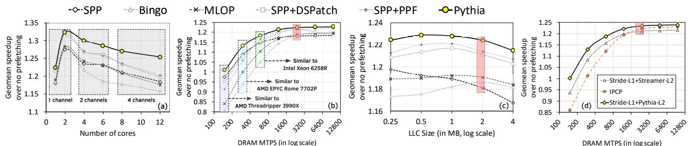
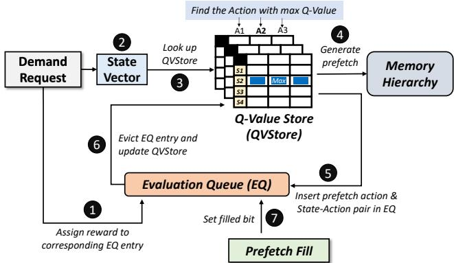

# Pythia: A Customizable Hardware Prefetching Framework Using Online Reinforcement Learning 论文解析

## 0. 论文基本信息

**作者 (Authors)**: Rahul Bera, Konstantinos Kanellopoulos, Anant V. Nori, et al.

**发表期刊/会议 (Journal/Conference)**: MICRO

**发表年份 (Publication Year)**: 2021

**研究机构 (Affiliations)**: ETH Zürich, Processor Architecture Research Labs, Intel Labs, TU Delft

______________________________________________________________________

## 1. 摘要

**目的**

- 解决现有硬件预取器的三大关键缺陷：(1) 仅依赖**单一程序特征**（如PC或地址）进行预测；(2) **缺乏内在的系统感知能力**，无法根据内存带宽等系统级反馈调整行为；(3) **设计僵化**，难以在线定制以适应不同工作负载和系统配置。
- 提出一种**整体性**（holistic）的预取算法，能够同时利用多种程序上下文信息和系统级反馈，以生成**高精度、及时且系统感知**的预取请求。

**方法**

- 提出 **Pythia**，一个基于**在线强化学习**（Online Reinforcement Learning）的可定制硬件预取框架。
- 将预取器建模为一个**RL agent**：
    - **状态**（State）: 一个由多种**程序特征**（program features）组成的向量，例如 `PC+Delta` 和 `Sequence of last-4 deltas`。
    - **动作**（Action）: 从一组候选预取偏移量（offsets）中选择一个，而非完整的缓存行地址，以大幅缩小动作空间。
    - **奖励**（Reward）: 一个包含**五个离散级别**的数值信号，用于评估预取质量。该信号不仅考虑**准确性**和**及时性**，还明确纳入了**内存带宽使用情况**作为系统级反馈。
- 设计了低开销的硬件实现：
    - \*\*Q-Value Store \*\*(QVStore): 采用分层的“**vault-plane**”表结构存储Q值，支持高效查询和扩展。
    - \*\*Evaluation Queue \*\*(EQ): 一个FIFO队列，用于跟踪最近的预取动作及其结果，以便分配奖励和更新Q值。
- 通过**自动化设计空间探索**确定基础配置，包括特征选择、动作集剪枝和奖励/超参数调优。

**结果**

- Pythia在性能上显著优于SOTA预取器（MLOP和Bingo），且优势在资源受限场景下更为突出：

| 系统配置                 | 相对于 MLOP 的性能提升 | 相对于 Bingo 的性能提升 |
| :----------------------- | :--------------------: | :---------------------: |
| **单核**                 |        **3.4%**        |        **3.8%**         |
| **十二核**               |        **7.7%**        |        **9.6%**         |
| **带宽受限**（150 MTPS） |       **16.9%**        |        **20.2%**        |

- Pythia通过**更高的预取覆盖率**和**更低的过度预测率**（overprediction）实现了上述性能增益。
- Pythia具有出色的**可定制性**：
    - 通过简单修改**配置寄存器**中的奖励值，可在Ligra图处理套件上获得**最高7.8%**（平均1.9%）的额外性能提升。
    - 通过在线调整使用的程序特征，可在SPEC CPU2006套件上获得**最高5.1%**（平均1.5%）的额外性能提升。
- 硬件开销极低：在桌面级处理器上仅增加\*\*1.03%**的面积和**0.37%\*\*的功耗。
-  *Figure 8: Average performance improvement of prefetchers in systems with varying (a) number of cores, (b) DRAM million transfers per second (MTPS), (c) LLC size, and (d) prefetching level. Each DRAM bandwidth configuration roughly matches MTPS/core of various commercial processors [5, 6, 13]. The baseline bandwidth/LLC configuration is marked in red.*
-  *Figure 11: Performance of memory bandwidth-oblivious Pythia versus the basic Pythia.*

**结论**

- 将硬件预取问题形式化为**强化学习**问题是一种有效且实用的方法。
- Pythia通过其**多特征融合**和**内在系统感知**的设计，成功克服了传统预取器的局限性，在多样化的**工作负载**和**系统配置**下均能提供**稳健且优越**的性能。
- 其**可定制的框架**和**低硬件开销**使其成为未来处理器设计中一个极具吸引力的解决方案，有望减轻架构师设计复杂预取机制的负担。

______________________________________________________________________

## 2. 背景知识与核心贡献

**研究背景**

- 传统硬件预取器（如 SPP、Bingo）通常只利用**单一类型**的程序上下文信息（例如 **PC**、**Address** 或 **Delta**）来预测未来的内存访问。
- 这些设计要么完全忽略预取带来的负面系统影响（如**内存带宽消耗**、缓存污染），要么将系统级反馈作为事后补救措施，而非内置于算法核心。
- 由于其固有的局限性，现有预取器在面对**多样化的工作负载**和**变化的系统配置**（尤其是带宽受限场景）时，性能收益往往不稳定甚至为负。

**研究动机**

- 作者观察到三个关键短板严重限制了先前预取器的普适性：
    - **单特征预测**: 仅依赖一种程序特征，导致在不匹配该特征的负载上表现不佳。
    - **缺乏内在的系统感知**: 无法根据当前系统状态（如内存带宽压力）动态调整预取策略。
    - **缺乏在线可定制性**: 硬件结构在设计时即固化，无法在硅片上灵活地适应新负载或改变优化目标（如侧重覆盖率或准确性）。
- 因此，亟需一个**整体性**的预取框架，能够**同时学习多种程序特征**并**内化系统级反馈**，以实现稳健且自适应的性能提升。

**核心贡献**

- 提出了 **Pythia**，一个基于**在线强化学习 (Online Reinforcement Learning)** 的可定制硬件预取框架。
    - 将预取器建模为一个 **RL agent**，其**状态 (State)** 是由多种程序特征（如 **PC+Delta**, **Sequence of Deltas**）组成的向量。
    - 其**动作 (Action)** 是选择一个预取偏移量（**prefetch offset**）。
    - 其**奖励 (Reward)** 是一个数值信号，综合评估了预取的**准确性**、**及时性**以及当前**内存带宽使用情况**。
- Pythia 的设计具有两大独特优势：
    - **整体性学习**: 能够在一个统一的框架内，自主学习如何结合多种程序特征和系统反馈，以生成**高精度、及时且系统感知**的预取请求。
    - **在线可定制性**: 通过简单的**配置寄存器**，即可在硅片上动态更改所使用的程序特征或奖励值，从而针对特定工作负载套件（如 Ligra 图处理）进行优化，而无需修改底层硬件。
- 实验结果表明，Pythia 在各种配置下均显著优于 SOTA 预取器：
    - 在**单核**配置下，性能优于 **MLOP** 和 **Bingo** 分别达 **3.4%** 和 **3.8%**。
    - 在**十二核**配置下，优势扩大至 **7.7%** 和 **9.6%**。
    - 在**带宽受限**的服务器类配置下，优势最为显著，分别领先 **16.9%** 和 **20.2%**。
- Pythia 的硬件开销极低，仅带来 **1.03%** 的面积和 **0.37%** 的功耗开销，并已**开源**其代码和数据集。 *Figure 1: Comparison of (a) coverage, overprediction, and (b) performance of two recently-proposed prefetchers, SPP [78] and Bingo [27], and our new proposal, Pythia.*

______________________________________________________________________

## 3. 核心技术和实现细节

### 0. 技术架构概览

**整体技术架构**

Pythia 的核心思想是将硬件预取器建模为一个 **Reinforcement Learning (RL) Agent**，使其能够通过与处理器和内存子系统的交互，在线学习如何做出最优的预取决策。其架构围绕 RL 的三个基本要素——**State (状态)**、**Action (动作)** 和 **Reward (奖励)**——进行设计，并通过两个主要的硬件结构来实现。

- **状态 (State) 定义**:

    - 状态是一个 **k 维向量**，由多个 **program features (程序特征)** 构成。
    - 每个程序特征由 **control-flow component** (如 load-PC) 和 **data-flow component** (如 cacheline address, delta) 组合而成。
    - 示例特征包括 `PC+Delta` 和 `Sequence of last-4 deltas`，这使得 Pythia 能够同时利用多种上下文信息进行决策。

- **动作 (Action) 定义**:

    - 动作被定义为选择一个 **prefetch offset (预取偏移量)**，而非完整的缓存行地址，这极大地缩小了动作空间。
    - 偏移量范围被限制在物理页内（例如 [-63, 63]），因为大多数后 L1 预取器都在页内工作。
    - 动作 `0` 表示不进行预取。

- **奖励 (Reward) 机制**:

    - 奖励方案是 Pythia **系统感知 (system-aware)** 能力的关键，它定义了预取器的优化目标。
    - 奖励分为五个级别，综合评估了预取的 **accuracy (准确性)**、**timeliness (及时性)** 和 **系统级反馈 (如 memory bandwidth usage)**。
    - 具体包括：**Accurate and timely (R_AT)**、**Accurate but late (R_AL)**、**Loss of coverage (R_LC)**、**Inaccurate (R_IN)**（根据带宽使用情况细分）以及 **No-prefetch (R_NP)**（同样根据带宽使用情况细分）。
    - 这种离散且可配置的奖励结构允许 Pythia 在带宽紧张时主动牺牲覆盖率以换取更高的准确性。

**核心硬件组件**

Pythia 的硬件实现主要由两个结构组成：

- **Q-Value Store (QVStore)**:

    - 用于存储所有观察到的 **state-action pair** 的 **Q-values**。
    - 采用了一种创新的 **分层表结构 (hierarchical table-based organization)**，而非复杂的神经网络，以满足硬件对面积和延迟的要求。
        - **Vaults**: QVStore 被划分为 k 个 **vault**，每个 vault 对应状态向量中的一个特征，独立存储该特征与所有动作的 Q 值。
        - **Planes**: 每个 vault 又由多个 **plane** 组成，借鉴了 **tile coding** 的思想。这允许相似的特征值共享部分 Q 值，加速学习过程并控制存储开销。
    - 最终的 state-action Q 值通过取所有 constituent feature-action Q 值的最大值得到。
    - QVStore 的查找操作被设计为 **五级流水线**，以降低关键路径延迟。

- **Evaluation Queue (EQ)**:

    - 一个 **FIFO 队列**，用于追踪最近执行的预取动作及其结果。
    - 每个条目包含：所选动作、生成的预取地址、一个 **filled bit**（标记预取是否已填入缓存）以及对应的状态向量。
    - EQ 是连接预取动作与其最终奖励的桥梁：
        - 当一个需求请求命中 EQ 中的地址时，根据 **filled bit** 分配 **R_AT** 或 **R_AL**。
        - 当一个 EQ 条目被驱逐时，若仍未被需求命中，则根据当前的内存带宽使用情况分配 **R_IN** 或 **R_NP**。
        - 驱逐时，条目中的奖励和 state-action pair 会被用来通过 **SARSA 算法** 更新 QVStore 中的 Q 值。

 *Figure 4: Overview of Pythia.*

**在线学习与定制化流程**

Pythia 的工作流程是一个闭环的在线学习过程：

- 对于每个新的 **demand request**:

    1. 在 **EQ** 中查找其地址，以确定之前的预取是否成功，并分配相应奖励。
    1. 从请求中提取 **state-vector**。
    1. 查询 **QVStore**，使用 **ε-greedy 策略** 选择具有最高 Q 值的动作。
    1. 执行预取动作（或不预取），并将新条目插入 **EQ**。
    1. 当 **EQ** 条目被驱逐时，利用其累积的奖励更新 **QVStore**。

- **高度可定制性**:

    - **Program features** 的选择和 **reward level values** 都可以通过 **简单的配置寄存器** 在线修改。
    - 这使得 Pythia 能够针对特定的工作负载套件（如 Ligra 图处理或 SPEC CPU2006）进行微调，而无需更改底层硬件，从而获得比基础配置更高的性能收益。

### 1. 基于强化学习的预取框架

**核心观点**

- Pythia 的核心创新在于将硬件预取问题形式化为一个 **在线强化学习 (Online Reinforcement Learning)** 问题，其目标是让预取器（RL 智能体）通过与运行环境（处理器和内存子系统）的持续交互，自主学习最优的预取策略。
- 该框架的关键优势在于其 **整体性 (holistic)** 和 **可定制性 (customizable)**：它能同时利用 **多种程序特征 (multiple program features)** 和 **系统级反馈 (system-level feedback)** 进行决策，并且可以通过简单的配置寄存器在硅片上动态调整其行为，而无需修改底层硬件。

**Pythia 的 RL 形式化定义**

- **状态 (State)**: 状态被定义为一个 **k 维向量**，其中每一维都是一个 **程序特征 (program feature)**。这些特征由控制流组件（如 load-PC、branch-PC）和数据流组件（如 cacheline address、page offset、cacheline delta）组合而成。
    - 例如，`PC+Delta` 表示加载指令的程序计数器与其访问地址的增量。
    - 论文通过自动化设计空间探索，最终选定的基本配置包含两个特征：`PC+Delta` 和 `Sequence of last-4 deltas`。
    -  *Table 1: Example program features*
- **动作 (Action)**: 动作被定义为从一组候选 **预取偏移量 (prefetch offsets)** 中进行选择。偏移量是相对于当前请求缓存行地址的增量（Δ）。
    - 由于预取通常发生在物理页内，对于 4KB 页和 64B 缓存行，偏移量范围为 [-63, 63]。
    - 为了降低复杂度，论文通过剪枝将动作空间缩减至一个更小的集合（见下表）。
    - 动作为 0 表示不进行预取。
- **奖励 (Reward)**: 奖励方案是 Pythia 实现 **系统感知 (system-awareness)** 的关键。它定义了五个离散的奖励级别，用以评估预取决策的质量：
    - **R_AT**: 准确且及时 (Accurate and timely)。
    - **R_AL**: 准确但延迟 (Accurate but late)。
    - **R_LC**: 覆盖率损失 (Loss of coverage)，即预取到了错误的物理页。
    - **R_IN**: 不准确 (Inaccurate)，根据当前内存带宽使用情况进一步细分为 **R_IN_LB** (低带宽) 和 **R_IN_HB** (高带宽)。
    - **R_NP**: 不预取 (No-prefetch)，同样根据带宽使用情况细分为 **R_NP_LB** 和 **R_NP_HB**。
    - 通过调整这些奖励值，可以引导智能体在不同系统条件下（如高/低内存带宽）权衡覆盖率、准确性和带宽消耗。

**算法流程与硬件实现**

- Pythia 的工作流程围绕两个主要硬件结构展开：**Q-Value Store (QVStore)** 和 **Evaluation Queue (EQ)**。
    -  *Figure 4: Overview of Pythia.*
- **核心算法流程 (Algorithm 1)**:
    1. **处理需求请求**: 当一个新的需求请求到达时，Pythia 首先在 EQ 中查找其地址。
        - 如果找到匹配项，则根据其 `filled` 位分配奖励 **R_AT** 或 **R_AL**。
    1. **提取状态并选择动作**: 从需求请求中提取 k 维状态向量，并查询 QVStore 以找到具有最高 Q 值的动作（采用 ε-greedy 策略进行探索与利用的平衡）。
    1. **生成预取请求**: 使用选定的动作（偏移量）生成预取地址，并向内存层次结构发出请求。
    1. **更新 EQ**: 将新选择的动作、预取地址和状态向量插入 EQ 的尾部。
        - 对于“不预取”或“跨页预取”的动作，会立即为其分配相应的奖励。
    1. **处理 EQ 驱逐**: 当 EQ 条目被驱逐时：
        - 如果该条目尚未分配奖励，则根据当前内存带宽使用情况分配 **R_IN_HB** 或 **R_IN_LB**。
        - 使用 SARSA 算法和存储在驱逐条目中的奖励来更新 QVStore 中对应的 Q 值。
    1. **处理预取填充**: 当一个预取请求完成并填充到缓存时，在 EQ 中找到对应条目并将其 `filled` 位置为 1，用于后续判断预取是否及时。
- **QVStore 的分层设计**:
    - 为了解决高维状态空间带来的存储爆炸问题，QVStore 采用了创新的 **Vault-Plane** 分层组织。
        - **Vault**: QVStore 被划分为 k 个 Vault，每个 Vault 对应状态向量中的一个特征。最终的状态-动作 Q 值是所有 Vault 返回的特征-动作 Q 值中的 **最大值**。
            - 
        - **Plane**: 每个 Vault 内部由多个 **Plane** 组成，这是对 **Tile Coding** 技术的硬件适配。每个特征值通过多个哈希函数映射到不同 Plane 的索引，最终的特征-动作 Q 值是所有 Plane 中对应条目的 **部分 Q 值之和**。
            - 这种设计既实现了相似特征值之间的 **泛化 (generalization)**，又通过多哈希减少了不相关特征值的冲突。
            -  *Figure 5: (a) The QVStore is comprised of multiple vaults. (b) Each vault is comprised of multiple planes. (c) Index generation from feature value.*

**参数设置与自动化探索**

- 论文通过一个三阶段的自动化设计空间探索过程来确定 Pythia 的基本配置。
- **特征选择**: 从 32 个初始特征中，通过线性回归和性能测试，选出了 `PC+Delta` 和 `Sequence of last-4 deltas` 的组合。
- **动作选择**: 通过对完整动作集 [-63, 63] 进行剪枝，移除了对性能影响不大的动作。
- **奖励与超参数调优**: 使用网格搜索在 10 个测试轨迹上筛选出 25 个最佳配置，再在全部单核工作负载上选出最终胜者。
- 最终的基本配置如下表所示：

| 组件             | 配置                                                                       |
| :--------------- | :------------------------------------------------------------------------- |
| **状态维度 (k)** | 2                                                                          |
| **程序特征**     | PC+Delta, Sequence of last-4 deltas                                        |
| **动作集**       | {-63, -31, -15, -7, -3, -1, 0, 1, 3, 7, 15, 31, 63}                        |
| **奖励值**       | R_AT=15, R_AL=5, R_LC=-10, R_IN_LB=-8, R_IN_HB=-15, R_NP_LB=-4, R_NP_HB=-8 |
| **超参数**       | 学习率 α=0.0065, 折扣因子 γ=0.9, 探索率 ε=0.002                            |

 *Table 2: Basic Pythia configuration derived from our automated design-space exploration*

**输入输出关系及整体作用**

- **输入**: Pythia 的主要输入是来自 L1 缓存未命中（或其他触发点）的 **需求请求 (demand request)**。从这个请求中，它可以提取出 PC、地址、历史 Delta 等原始信息，进而构建其 **状态向量**。此外，它还持续监控 **内存带宽使用情况** 作为系统级反馈。
- **输出**: Pythia 的输出是一个或多个 **预取请求 (prefetch requests)**，这些请求被发送到 L2 缓存或更低层级的内存。
- **在整体系统中的作用**:
    - **性能提升**: 通过生成高覆盖率、高准确性的预取，有效隐藏内存访问延迟，从而提升 IPC 和整体性能。评估显示，Pythia 在单核、多核和带宽受限场景下均显著优于 SOTA 预取器（如 MLOP 和 Bingo）。
    - **资源效率**: 其内在的系统感知能力使其能够在资源紧张（如高内存带宽压力）时自动抑制过度预取，避免因 **缓存污染 (cache pollution)** 和 **带宽浪费** 而导致的性能下降。
    - **适应性与可定制性**: 作为一款 **可定制框架**，Pythia 可以通过修改配置寄存器（如奖励值、特征选择）来针对特定工作负载套件（如 Ligra 图计算）进行优化，而无需任何硬件改动，这大大降低了部署和维护成本。

### 2. 分层Q值存储结构 (QVStore)

**分层Q值存储结构 (QVStore) 的设计原理与实现**

Pythia的**QVStore**是其强化学习框架的核心硬件组件，用于高效存储和查询状态-动作对（state-action pair）的**Q-value**。为克服传统单表或神经网络方法在硬件实现上的高开销和高延迟问题，Pythia提出了一种创新的、基于**tile coding**思想的分层表结构。

**核心架构：Vault 与 Plane**

- **整体组织**：QVStore被组织为 **k** 个独立的分区，称为 **vault**。每个 vault 对应状态向量（state-vector）中的一个特定**program feature**（例如 PC+Delta）。
- **Vault 内部结构**：每个 vault 并非一个巨大的二维单表，而是由 **p** 个更小的二维表组成，这些表被称为 **plane**。这种设计直接源于 **tile coding** 技术。
- **Q值计算逻辑**：
    - 对于一个给定的状态-动作对 (s, a)，其中 s = {f1, f2, ..., fk}，系统会并行查询所有 k 个 vault。
    - 在第 i 个 vault 中，针对特征 fi 和动作 a，系统会查询其内部所有的 p 个 plane，并将从每个 plane 中获取的**partial Q-value**相加，得到该特征-动作对 (fi, a) 的最终 Q 值。
    - 最终的状态-动作 Q 值 Q(s, a) 被定义为所有 k 个特征-动作 Q 值中的**最大值**。公式表示为：`Q(s, a) = max(Q(f1, a), Q(f2, a), ..., Q(fk, a))`。
    - 这种“**取最大值**”的聚合策略确保了决策由状态向量中最具判别力的那个特征所主导。

**Tile Coding 机制详解**

- **动机**：直接用特征原始值作为索引会导致表规模随特征位宽指数级增长，这在硬件上不可行。Tile coding 通过引入重叠的哈希函数，在**分辨率**（区分不同特征值的能力）和**泛化能力**（相似特征值共享部分信息以加速学习）之间取得平衡。
- **Plane 查询流程**：
    - 对于一个输入特征值（如一个PC值），在查询某个特定 plane 时，首先将其与一个在设计时随机选定的**shifting constant**相加。
    - 然后，对移位后的结果进行**哈希**操作，生成该 plane 内的**feature index**。
    - 这个 feature index 与**action index**共同构成地址，用于从该 plane 中读取一个 partial Q-value。
- **优势**：
    - **泛化能力**：相似的特征值经过不同的 shifting constant 和哈希后，可能会在某些 plane 中映射到相同的索引，从而共享 partial Q-value，这有助于加速对新但相似模式的学习。
    - **高分辨率**：由于存在多个 plane（即多个不同的 shifting constant 和哈希函数），两个差异较大的特征值不太可能在所有 plane 中都发生冲突，从而保证了区分度。

 *Figure 5: (a) The QVStore is comprised of multiple vaults. (b) Each vault is comprised of multiple planes. (c) Index generation from feature value.*

**硬件实现与参数设置**

- **基本配置**：根据论文中的自动化设计空间探索（见表2），Pythia的基本配置使用 **k=2** 个 vault（对应特征 PC+Delta 和 Sequence of last-4 deltas），每个 vault 包含 **p=4** 个 plane。
- **存储开销**：整个 QVStore 在基本配置下仅消耗 **24KB** 的存储空间，加上 **1.5KB** 的 Evaluation Queue (EQ)，总元数据开销仅为 **25.5KB**，这对于现代处理器核心而言是极低的开销。
- **查询流水线**：为了满足硬件 prefetcher 的低延迟要求，QVStore 的查询操作被设计为一个 **5-stage pipeline**。关键步骤包括并行计算所有 plane 的索引、读取 partial Q-values、求和得到每个 vault 的 Q 值、取最大值得到最终 Q(s, a)、并与当前已知的最大 Q 值进行比较以确定最优动作。
- **可扩展性**：该架构具有天然的可扩展性。若需增加状态向量的维度（即使用更多 program features），只需简单地向 QVStore 中添加一个新的 vault，而无需重构整个存储结构。

**在整体系统中的作用与输入输出关系**

- **输入**：QVStore 的主要输入是来自当前**demand request**的**state-vector**（由多个 program features 组成）和一个候选**action**（prefetch offset）。
- **处理**：QVStore 根据上述分层和 tile coding 机制，快速计算出该 state-action 对的 Q-value。
- **输出**：在 Pythia 的决策阶段，系统会遍历所有可能的 action，利用 QVStore 找到能产生**最高 Q-value**的那个 action，并据此生成 prefetch 请求。
- **反馈更新**：当一个 prefetch action 的结果（通过 EQ 获得 reward）最终确定后，对应的 state-action pair 的 Q-value 会根据 **SARSA** 更新算法进行迭代优化，并写回 QVStore。这个过程使得 Pythia 能够持续学习和改进其 prefetching 策略。

### 3. 可配置的多特征状态空间与奖励机制

**Pythia的可配置多特征状态空间**

- Pythia的状态（State）被定义为一个 **k维向量**，该向量由多个**程序特征**（program features）构成。每个程序特征是**控制流组件**（如load-PC、branch-PC）与**数据流组件**（如cacheline address, page offset, cacheline delta）的组合。
- 状态空间的设计核心在于其**可配置性**。虽然向量维度k在硬件设计时因存储预算而固定，但具体选择哪k个特征可以在**硅片上通过简单的配置寄存器在线更改**，无需修改硬件结构。
- 论文通过自动化设计空间探索（§4.3.1）确定了基础配置中的两个关键特征：**PC+Delta** 和 **Sequence of last-4 deltas**。这一选择直观地融合了Bingo和SPP两种前沿预取器的优势特征。
- 为了高效处理高维状态空间，Pythia设计了分层的**QVStore**（Q-Value Store）结构。QVStore由多个**vault**（保险库）组成，每个vault对应状态向量中的一个特征，并记录该特征与所有可能动作（action）的Q值。
- 每个vault内部采用受**tile coding**启发的组织方式，由多个**plane**（平面）构成。这使得相似的特征值可以共享部分Q值，加速学习过程，同时通过多plane减少不相关特征值间的冲突。

 *Figure 5: (a) The QVStore is comprised of multiple vaults. (b) Each vault is comprised of multiple planes. (c) Index generation from feature value.*

**基于系统反馈的精细化奖励机制**

- Pythia的奖励（Reward）方案定义了五个离散级别，明确地将**内存带宽使用情况**作为系统级反馈信息融入其中，以指导预取策略在覆盖率、准确性和系统资源消耗之间进行权衡。
- 五个奖励级别及其作用如下：
    - **R_AT**: **Accurate and timely**（准确且及时）。当预取地址在被填充到缓存后才被需求时给予此正向奖励，鼓励生成高质量的预取。
    - **R_AL**: **Accurate but late**（准确但延迟）。当预取地址在填充前就被需求时给予此较低的正向奖励，表明预取虽正确但未隐藏延迟。
    - **R_LC**: **Loss of coverage**（覆盖率损失）。当预取动作产生的地址与触发它的需求访问不在同一物理页时给予此负向奖励，引导预取器在页内操作。
    - **R_IN**: **Inaccurate**（不准确）。当预取地址在时间窗口内未被需求时给予此负向奖励，并进一步细分为：
        - **R_IN_LB**: 在**低带宽使用**（low bandwidth usage）情况下。
        - **R_IN_HB**: 在**高带宽使用**（high bandwidth usage）情况下。
    - **R_NP**: **No-prefetch**（无预取）。当决定不进行预取时给予此奖励，同样根据带宽使用情况细分为 **R_NP_LB** 和 **R_NP_HB**。
- 这种设计使得Pythia能够**自适应地调整其激进程度**。例如，在高带宽压力下，`R_IN_HB` 的惩罚会远大于 `R_IN_LB`，从而有效抑制产生不准确预取的倾向，优先保证带宽效率。

**算法流程与输入输出关系**

- **输入**：每个新的**需求请求**（demand request）到达时，Pythia从中提取**状态向量**（包含PC、地址、delta等信息），并获取当前的**内存带宽使用情况**。
- **处理流程**：
    1. **评估历史动作**：检查**Evaluation Queue (EQ)**，看当前需求地址是否匹配之前发出的预取地址。若匹配，则根据预取是否已填充（filled bit）分配 `R_AT` 或 `R_AL` 奖励。
    1. **决策新动作**：使用提取的状态向量查询QVStore，通过**ε-greedy策略**选择能带来最高预期Q值的**预取偏移量**（prefetch offset）作为动作。
    1. **执行与记录**：执行预取动作（或不预取），并将状态、动作、生成的预取地址（如有）作为一个新条目插入EQ。
    1. **更新学习模型**：当EQ条目被驱逐时，为其分配最终奖励（若尚未分配），并使用**SARSA算法**更新QVStore中对应的Q值。
- **输出**：一个**预取请求**（或空操作），该请求是基于对多维程序特征的理解和对当前系统状态（特别是带宽）的考量而做出的**系统感知**（system-aware）决策。
- **在整体中的作用**：这套机制使Pythia成为一个**在线强化学习代理**，它不仅能从程序的内存访问模式中学习，还能从其行为对整个内存子系统的影响中学习，从而在各种工作负载和系统配置下持续优化其预取策略。

**基础配置参数**

| 组件         | 参数           | 值                                       |
| :----------- | :------------- | :--------------------------------------- |
| **状态空间** | 特征维度 (k)   | 2                                        |
|              | 特征1          | PC + Delta                               |
|              | 特征2          | Sequence of last-4 deltas                |
| **动作空间** | 预取偏移量范围 | [-16, -8, -4, -2, -1, 0, 1, 2, 4, 8, 16] |
| **奖励**     | R_AT           | +16                                      |
|              | R_AL           | +8                                       |
|              | R_LC           | -16                                      |
|              | R_IN_HB        | -16                                      |
|              | R_IN_LB        | -8                                       |
|              | R_NP_HB        | -4                                       |
|              | R_NP_LB        | 0                                        |
| **超参数**   | 学习率 (α)     | 0.0065                                   |
|              | 折扣因子 (γ)   | 0.9                                      |
|              | 探索率 (ε)     | 0.002                                    |

 *Table 2: Basic Pythia configuration derived from our automated design-space exploration*

### 4. 评估队列 (Evaluation Queue, EQ)

**评估队列 (Evaluation Queue, EQ) 的核心作用与实现原理**

- **EQ 是 Pythia 实现闭环强化学习的关键硬件结构**，其主要功能是作为一个先进先出（FIFO）的缓冲区，用于**跟踪和评估**最近执行的预取动作（prefetch action）的有效性。
- 它通过将**预取决策**与后续的**需求访问（demand request）** 进行关联，为强化学习代理提供延迟奖励（delayed reward），从而驱动 Q-value 的更新和策略的优化。

**EQ 的内部结构与数据项**

每个 EQ 条目（entry）包含以下三个关键信息：

- **所采取的动作 (taken action)**：即从动作空间中选择的预取偏移量（prefetch offset），值为 0 表示未进行预取。
- **生成的预取地址 (prefetch address)**：根据当前需求地址和所选偏移量计算得出的完整缓存行地址。
- **填充位 (filled bit)**：一个布尔标志位，用于指示该预取请求是否已经从内存成功填充到缓存中。

**EQ 的工作流程与算法逻辑**

- **插入阶段 (Insertion)**:

    - 对于每一个新的**需求请求 (demand request)**，Pythia 在做出预取决策后，会立即将该决策（动作、计算出的预取地址）以及当前的状态向量（state-vector）打包成一个新的条目，插入到 EQ 的尾部。
    - 如果决策是“不预取”或预取地址超出了当前物理页，则会**立即分配一个即时奖励**（分别为 `R_no_pref` 或 `R_page_cross`）给该新条目。

- **奖励分配阶段 (Reward Assignment)**:

    - **在队列驻留期间 (During Residency)**: 当一个新的**需求请求**到达时，Pythia 会用其地址查询 EQ。如果命中某个条目，说明该需求访问了之前被预取的数据。此时，Pythia 会检查该条目的 **filled bit**：
        - 如果 **filled bit 被置位**，说明预取在需求到来前已完成，这是一个**准确且及时 (accurate and timely)** 的预取，分配奖励 `R_acc_timely`。
        - 如果 **filled bit 未被置位**，说明需求在预取完成前就已发生，这是一个**准确但过晚 (accurate but late)** 的预取，分配奖励 `R_acc_late`。
    - **在队列驱逐时 (During Eviction)**: 当一个 EQ 条目因 FIFO 策略需要被驱逐时，如果它尚未被分配奖励（即其预取地址从未被需求访问过），则 Pythia 会根据**当前的内存带宽使用情况**为其分配一个**不准确 (inaccurate)** 的奖励：
        - 高带宽使用时，分配 `R_inacc_high_bw`。
        - 低带宽使用时，分配 `R_inacc_low_bw`。

- **Q-value 更新阶段 (Q-value Update)**:

    - 在一个 EQ 条目被驱逐时，它携带的**状态-动作对 (state-action pair)** 和**已分配的奖励 (reward)** 会被用来更新 **QVStore** 中对应的 Q-value。
    - 具体来说，Pythia 使用 **SARSA 算法**进行更新，该算法不仅利用当前获得的奖励，还会参考下一个状态-动作对（即当前 EQ 头部的条目）的 Q-value，以实现对长期收益的考量。

**EQ 在 Pythia 整体架构中的输入输出关系**

- **输入**:

    - 来自处理器的**需求请求地址**（用于查询 EQ 以分配奖励）。
    - 来自预取决策逻辑的**动作、预取地址和状态向量**（用于创建新条目）。
    - 来自内存子系统的**预取填充信号**（用于设置 EQ 条目的 filled bit）。
    - 来自系统监控单元的**内存带宽使用情况**（用于在驱逐时分配不准确奖励）。

- **输出**:

    - **奖励信号 (reward)**：传递给 QVStore 更新逻辑，用于指导学习过程。
    - **状态-动作对 (state-action pair)**：与奖励一同传递给 QVStore，指明需要更新的具体 Q-value。

 *Figure 4: Overview of Pythia.*

**参数设置与设计考量**

- **队列深度**: EQ 的大小是一个关键的设计参数。它必须足够深，以覆盖从发出预取请求到该数据可能被需求访问之间的最大时间窗口（即最长的内存延迟）。如果队列太浅，有效的预取可能会在被需求访问前就被驱逐，导致被错误地归类为“不准确”，从而损害学习效果。
- **存储开销**: 根据论文中的 **Table 4**，EQ 在基础配置下仅消耗 **1.5KB** 的存储空间，这在整个 Pythia 框架（总开销 25.5KB）中占比较小，体现了其设计的高效性。

| 组件        | 存储开销    |
| :---------- | :---------- |
| **QVStore** | 24 KB       |
| **EQ**      | **1.5 KB**  |
| **总计**    | **25.5 KB** |

**总结**

**EQ 本质上是一个硬件实现的“经验回放”机制**，它巧妙地解决了强化学习中奖励延迟的问题。通过将预取动作与其未来的结果（是否被需求、是否及时）进行绑定，EQ 为 Pythia 提供了一个精确、系统感知的反馈信号，使其能够在线学习并不断优化其预取策略，最终实现高覆盖率、高准确率且对系统资源友好的预取效果。

______________________________________________________________________

## 4. 实验方法与实验结果

**实验设置**

- **模拟平台与基准**：使用 **ChampSim** 跟踪驱动模拟器，模拟一个类似 **Intel Skylake** 的多核处理器。单核模拟预热 1 亿条指令并模拟后续 5 亿条；多核（最多 12 核）则分别预热和模拟 5 千万和 1.5 亿条指令。
- **工作负载**：评估集包含来自 **SPEC CPU2006/2017**, **PARSEC 2.1**, **Ligra**, 和 **Cloudsuite** 的 **150 条**内存密集型工作负载轨迹。此外，还使用了 **500 条**来自 **CVP-2** 的未见过的轨迹进行泛化能力测试。
- **对比基线**：与五种前沿预取器进行比较：**SPP**, **SPP+PPF**, **SPP+DSPatch**, **Bingo**, 和 **MLOP**。在特定实验中，也与商业多级预取方案（L1 **stride** + L2 **streamer**）及 **IPCP** 进行了对比。
- **系统配置变量**：
    - **核心数量**：从单核到十二核，并相应调整 DRAM 通道数以模拟真实场景。
    - **DRAM 带宽**：从 **150 MTPS** (极度受限) 到 **9600 MTPS** (非常充裕)，以评估在不同带宽压力下的表现。
    - **LLC 大小**：从 **256KB** 到 **4MB**，以测试对缓存容量变化的鲁棒性。
- **硬件开销评估**：使用 **Chisel HDL** 实现 Pythia，并通过 **Synopsys Design Compiler** 和 **14nm 工艺库** 进行综合，以精确测量面积和功耗开销。

**结果数据**

- **性能提升**：Pythia 在各种配置下均显著优于基线。
    - 在 **单核** 配置下，平均性能优于 **MLOP** 和 **Bingo** **3.4%** 和 **3.8%**。
    - 在 **十二核** 配置下，优势扩大至 **7.7%** 和 **9.6%**。
    - 在 **带宽极度受限** (150 MTPS) 的服务器类配置下，优势最为显著，分别领先 **MLOP** 和 **Bingo** **16.9%** 和 **20.2%**。
- **预取质量**：Pythia 的卓越性能源于其更高的预取质量和更低的系统干扰。
    - 相比 **MLOP**, **Bingo**, 和 **SPP**，Pythia 平均提供 **6.9%**, **8.8%**, 和 **14%** 更高的 **coverage**。
    - 同时，其 **overprediction** 率分别降低了 **83.8%**, **78.2%**, 和 **3.6%**。
- **硬件开销**：性能提升的代价极小。
    - 在桌面级 4 核处理器上，仅增加 **1.03%** 的面积和 **0.37%** 的功耗开销。
    - 其元数据存储开销仅为 **25.5KB**。

 *Figure 8: Average performance improvement of prefetchers in systems with varying (a) number of cores, (b) DRAM million transfers per second (MTPS), (c) LLC size, and (d) prefetching level. Each DRAM bandwidth configuration roughly matches MTPS/core of various commercial processors [5, 6, 13]. The baseline bandwidth/LLC configuration is marked in red.*

**消融实验**

- **系统感知能力的重要性**：通过创建一个对内存带宽使用情况“无感知”的 Pythia 变体（将高/低带宽下的奖励值设为相同）来验证。
    - 结果表明，在 **低带宽** (150-600 MTPS) 场景下，该变体平均性能比完整版 Pythia **下降 4.6%**。
    - 在 **高带宽** 场景下，两者性能相当。这证明了 **内存带宽感知** 对于在资源受限环境中保持鲁棒性能至关重要。
         *Figure 11: Performance of memory bandwidth-oblivious Pythia versus the basic Pythia.*
- **多特征融合 vs. 预取器组合**：将 Pythia 与多个单一特征预取器（如 Stride, SPP, Bingo 等）的组合进行比较。
    - 在单核下，Pythia 比最佳组合平均高出 **1.4%**。
    - 在四核下，优势扩大到 **4.9%**。这是因为组合多个预取器会**叠加各自的 overprediction**，在多核带宽竞争环境下造成严重性能损失，而 Pythia 的 RL 框架能**协同学习**多个特征，避免了这一问题。
         *Figure 9: Performance improvement in single-core workloads. St=Stride, S=SPP, B=Bingo, D=DSPatch, and M=MLOP.*
         *Figure 10: Performance in the four-core system.*
- **在线定制化能力**：
    - **奖励函数定制**：针对 **Ligra** 图处理套件，通过调整奖励函数（更严厉地惩罚不准确预取，更鼓励不预取），在基本配置基础上平均再提升 **2.0%** (最高 **7.8%**) 的性能。
         *Figure 15: Performance of the basic and strict Pythia configurations on the Ligra workload suite.*
    - **特征选择定制**：针对 **SPEC CPU2006** 套件，通过为每个工作负载选择最优的特征组合，平均再获得 **1.5%** (最高 **5.1%**) 的性能提升。
         *Figure 16: Performance of the basic and feature-optimized Pythia on the SPEC CPU2006 suite.*

______________________________________________________________________
