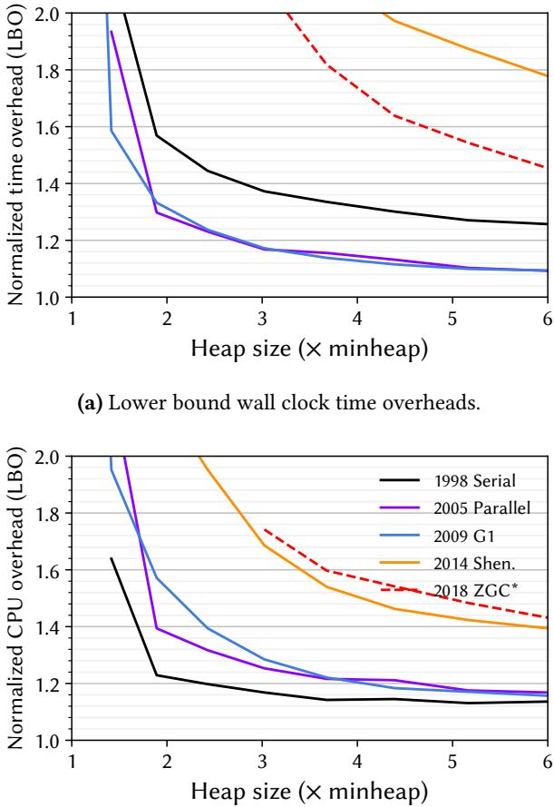
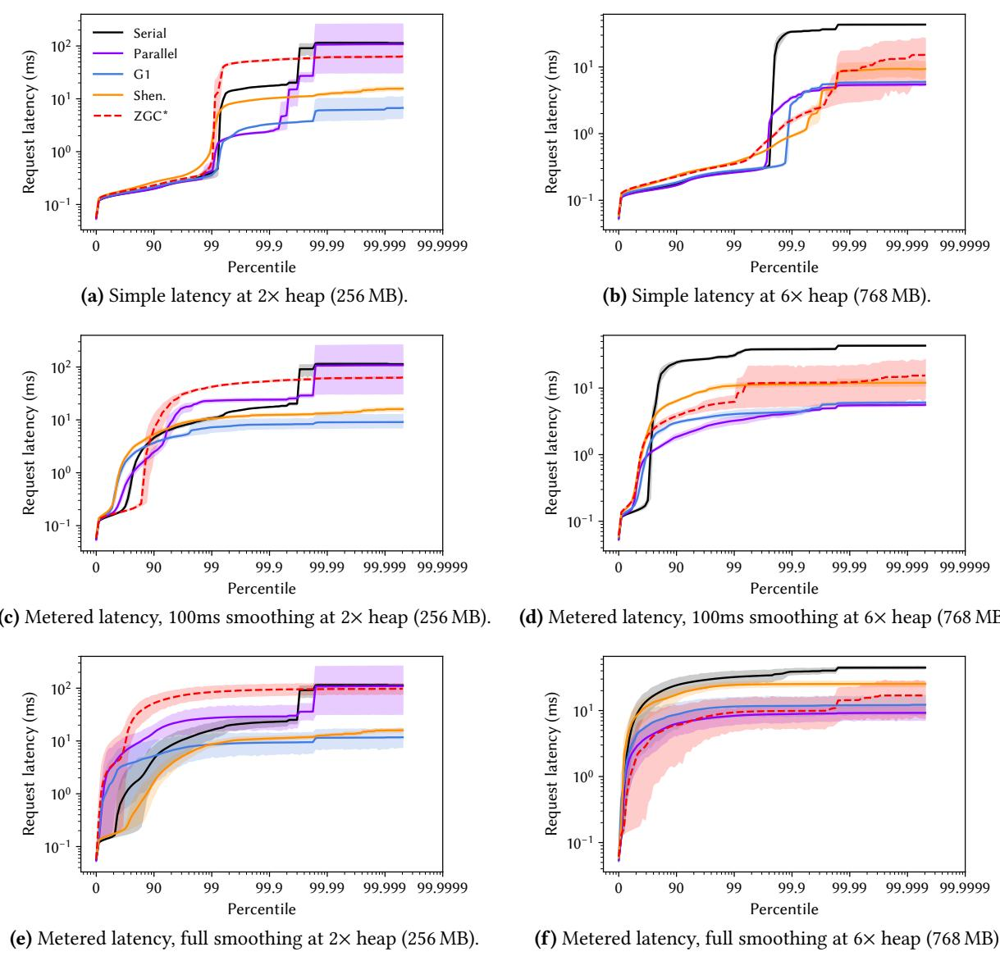

# Rethinking Java Performance Analysis 图表详解

### (b) Lower bound total CPU overheads (Linux TASK_CLOCK). Figure 1. Lower bounds on the overheads of five OpenJDK 21 production garbage collectors with their default settings, as a function of heap size, showing the geometric mean of overhead over all 22 DaCapo Chopin benchmarks. We only plot data points where the respective collector can run all 22 benchmarks to completion. In the best case, wall clock overheads are 9 % (G1 and Parallel) and total CPU overheads are 15 % (Serial). At smaller heaps, overheads exceed 2×.

- 图片包含两个子图，分别展示五种 OpenJDK 21 生产级 **garbage collector** 在不同堆大小下的开销表现，数据基于 22 个 **DaCapo Chopin** 基准测试的几何平均值。
- 子图 (a) 显示 **wall clock time overheads**，即程序总运行时间相对于理想 GC 的归一化开销；子图 (b) 显示 **total CPU overheads**，使用 Linux **TASK_CLOCK** 统计所有线程的累计 CPU 时间，反映系统总计算资源消耗。
- 五种收集器按引入年份排序：**Serial (1998)**、**Parallel (2005)**、**G1 (2009)**、**Shenandoah (2014)**、**ZGC (2018)**。其中 ZGC 不支持压缩指针，比较时需注意其内存模型差异。
- 所有曲线均随堆大小（以最小堆 minheap 的倍数表示）增加而下降，体现典型的 **time-space tradeoff**：堆越小，GC 频率越高，开销越大。
- 在最佳情况下（大堆），**wall clock overhead** 最低为 **9%**（G1 和 Parallel），**total CPU overhead** 最低为 **15%**（Serial）。但在小堆（如 1×minheap）下，部分收集器开销可超过 **2×**，甚至高达 **17×**（小堆）或 **63%**（大堆）。
- **Serial** 收集器在 total CPU 开销上表现最优（最低 15%），因其单线程设计避免了并行开销；但其 wall clock 开销在小堆时最高，因无法利用多核加速。
- **Parallel** 虽能利用多核加速，但因并行效率不完美，其 total CPU 开销高于 Serial，尤其在小堆时更明显。
- **G1** 通过分区域并发回收，在 latency 上优于 Parallel，但代价是更高的 CPU 开销。
- **Shenandoah** 和 **ZGC** 作为低暂停收集器，几乎全程与应用并发执行，虽改善了 pause times，但引入了显著的额外开销，尤其在 small heap 下表现最差。
- 图中 ZGC 使用虚线标记，因其不支持压缩指针，与其他收集器存在架构差异，直接比较需谨慎。
- 数据点仅在收集器能完成全部 22 个基准测试时绘制，确保结果可比性。

| 收集器     | 引入年份 | Wall Clock 最佳开销 | Total CPU 最佳开销 | 小堆开销趋势 |
| ---------- | -------- | ------------------- | ------------------ | ------------ |
| Serial     | 1998     | 较高                | **15%**            | 急剧上升     |
| Parallel   | 2005     | **9%**              | 中等               | 上升         |
| G1         | 2009     | **9%**              | 中等偏高           | 平缓下降     |
| Shenandoah | 2014     | 高                  | 高                 | 剧烈波动     |
| ZGC        | 2018     | 高                  | 高                 | 高且不稳定   |

- 该图揭示了一个关键问题：尽管新式收集器旨在降低延迟，但其 **total CPU overhead** 却普遍更高，这在多租户环境（如移动设备、数据中心）中可能带来隐性成本，却被长期忽视。
- 作者强调，这种“开销被忽略”的现象源于方法论滞后——研究者常只关注 wall clock 或 pause times，而忽略 total CPU 消耗和用户实际体验。
- 图表设计清晰，横轴为堆大小倍数，纵轴为归一化开销（LBO），便于横向比较不同收集器在不同内存配置下的相对性能。
- 结论：**GC 开销不应仅用 wall clock 或 pause times 衡量，必须结合 total CPU 和 user-experienced latency 进行多维评估**，否则将误导技术选型与研究方向。

### Figure 2. Cheng and Blelloch [12] used a figure like this to illustrate the problem with using GC pauses as a measure of responsiveness and proposed the minimum mutator utilization (MMU) metric as a response. GC pause time continues to be widely (mis)used as a proxy for responsiveness more than twenty years later.

- 图片展示了两个并列的时间轴示意图，用于对比不同垃圾回收（GC）暂停模式对程序（Prog）执行的影响。
- 左侧图示为“Several short pauses”，表示程序执行过程中被多个短暂的 GC 暂停打断，每个暂停块较小且分散。
- 右侧图示为“One long pause”，表示程序仅被一次较长的 GC 暂停中断，暂停块较大但集中。
- 该图旨在说明：**单纯比较 GC 暂停时长无法准确反映用户感知的响应性（responsiveness）**。多个短暂停可能累积影响更大，甚至超过单次长暂停。
- 此图源自 Cheng 和 Blelloch [12] 的研究，他们指出使用 GC pause time 作为响应性代理指标是错误的，并提出 **Minimum Mutator Utilization (MMU)** 作为更合理的度量标准。
- 尽管已有二十年以上学术共识，论文指出当前业界仍广泛**误用 GC pause time 作为响应性指标**，凸显方法论滞后问题。
- 下表总结图中关键元素及其含义：

| 元素                 | 含义         | 说明                               |
| -------------------- | ------------ | ---------------------------------- |
| Prog                 | 程序执行时间 | 白色块代表应用线程运行时段         |
| GC                   | 垃圾回收暂停 | 灰色块代表 Stop-The-World 暂停时段 |
| Several short pauses | 多次短暂停   | 分散打断，可能影响用户体验连续性   |
| One long pause       | 单次长暂停   | 集中打断，可能造成明显卡顿感       |

- 该图强调：评估 Java 性能，尤其是延迟敏感场景，必须超越简单暂停时长，转向如 MMU 或 DaCapo Chopin 提供的 **Simple Latency / Metered Latency** 等更贴近用户实际体验的指标。

### Figure 3. DaCapo Chopin records the time for each event for its latency-sensitive workloads, avoiding the need for users to resort to using misleading proxies such as GC pause times. These figures plot the distribution of request latencies for cassandra for each of OpenJDK 21’s five production collectors, with the 95th percentile indicated by the shaded area. Even at the generous 6.0× heap, the newer collectors do not deliver better latency than G1 on this workload.

- 图片展示了 **Cassandra** 工作负载在不同垃圾回收器（GC）和堆大小配置下的请求延迟分布，数据来自 **DaCapo Chopin** 套件，使用 **OpenJDK 21**。
- 六个子图分别呈现了 **Simple Latency** 和 **Metered Latency** 在 **2× heap (256 MB)** 与 **6× heap (768 MB)** 下的表现，其中 Metered Latency 又细分为 **100ms smoothing** 和 **full smoothing** 两种模式。
- 所有图表的横轴为 **Percentile**（从 0 到 99.9999），纵轴为 **Request latency (ms)**（对数刻度），清晰展示尾部延迟行为。
- 图中包含五种 GC：**Serial**、**Parallel**、**G1**、**Shenandoah (Shen.)**、**ZGC**\*，每种 GC 用不同颜色/线型表示，便于对比。
- **95th percentile** 以阴影区域标出，直观显示主流请求的延迟范围；高百分位（如 99.9+）则反映极端情况，是衡量系统稳定性的关键。
- 在 **2× heap** 条件下，**G1** 的 Simple Latency 表现最优，尤其在 99.9% 以上分位点明显优于其他 GC；**Shenandoah** 和 **ZGC** 在高百分位出现陡峭上升，表明其尾部延迟较差。
- 当堆增大至 **6× heap**，所有 GC 的 Simple Latency 曲线整体右移，意味着平均延迟增加，但 **G1** 仍保持相对优势，**Shenandoah** 和 **ZGC** 的尾部延迟问题依旧显著。
- **Metered Latency** 引入“排队效应”模拟，使延迟曲线更贴近真实用户感知。在 **100ms smoothing** 模式下，各 GC 曲线与 Simple Latency 相近；但在 **full smoothing** 模式下，曲线趋于平滑，尾部延迟被放大，更能暴露 GC 对系统响应的累积影响。
- 关键发现：即使在 **6× heap** 这种内存充裕的条件下，**新式低暂停 GC（Shenandoah, ZGC）并未在 Cassandra 上展现出比 G1 更优的延迟表现**，这挑战了“新 GC 必然更好”的直觉。
- 数据表格化总结如下：

| 配置                              | 最佳 GC（低延迟） | 尾部延迟最差 GC | 备注                        |
| --------------------------------- | ----------------- | --------------- | --------------------------- |
| Simple Latency @ 2× heap          | G1                | Shenandoah, ZGC | G1 在 99.9%+ 分位点领先     |
| Simple Latency @ 6× heap          | G1                | Shenandoah, ZGC | 所有 GC 延迟上升，G1 仍最优 |
| Metered Latency @ 2× heap (100ms) | G1                | Shenandoah, ZGC | 排队效应轻微，趋势同 Simple |
| Metered Latency @ 6× heap (100ms) | G1                | Shenandoah, ZGC | 同上，但绝对延迟更高        |
| Metered Latency @ 2× heap (full)  | G1                | Shenandoah, ZGC | 尾部延迟被放大，差距更明显  |
| Metered Latency @ 6× heap (full)  | G1                | Shenandoah, ZGC | 所有 GC 延迟进一步恶化      |

- 此分析强调：**不能仅依赖 GC pause time 评估性能**，必须测量真实用户请求延迟；**堆大小并非越大越好**，需权衡内存成本与延迟表现；**新 GC 不一定适合所有场景**，需结合工作负载特性选择。

### Figure 4. Principal components analysis of the 22 DaCapo workloads with respect to the 33 nominal statistics which had non-null results for all benchmarks.

- 图片展示了对22个DaCapo Chopin工作负载进行主成分分析（PCA）的结果，基于33个所有基准测试均有有效数据的名义统计量。
- 分析结果分为两个子图：(a) PC1与PC2，(b) PC3与PC4，分别代表前四个主成分中的两组组合。
- **PC1解释了18%的方差**，是最重要的主成分；**PC2解释了16%**，**PC3解释了14%**，**PC4解释了11%**。前四者合计解释超过50%的总方差。
- 每个点代表一个工作负载，其在坐标系中的位置反映其在对应主成分上的得分，点间距离越大表示行为差异越显著。
- 工作负载分布广泛，无明显聚集，表明DaCapo Chopin套件具有良好的多样性，避免了功能重复或过度偏向特定行为模式。
- 关键工作负载如`zxing`、`jme`、`cassandra`、`h2`、`lusearch`等分布在不同象限，显示其在性能特征上存在显著差异。
- 以下为各主成分所占方差比例及对应子图：

| 主成分 | 解释方差比例 | 子图标识 |
| ------ | ------------ | -------- |
| PC1    | 18%          | (a)      |
| PC2    | 16%          | (a)      |
| PC3    | 14%          | (b)      |
| PC4    | 11%          | (b)      |

- 此PCA可视化支持论文核心主张：DaCapo Chopin通过多维特征刻画工作负载，有助于研究人员理解其行为并设计更科学的实验方法。

### Figure 5. LBO overheads for cassandra and lusearch.

- 图片展示了 **Figure 5**，即针对 **cassandra** 和 **lusearch** 两个基准测试的 **LBO（Lower Bound Overhead）开销分析**，分为四个子图，分别从 **wall clock** 和 **task clock** 两个维度衡量不同垃圾回收器在不同堆大小下的性能开销。
- 子图 (a) 显示 **cassandra 的 wall clock 开销**。随着堆大小从 1× 到 6× minheap 增加，所有 GC 的归一化开销均下降。**Serial** 和 **Parallel** 在大堆时表现最佳（接近 1.0），而 **ZGC** 在小堆时开销极高（>2.0），但在大堆时趋于稳定。**G1** 和 **Shenandoah** 表现居中。
- 子图 (b) 显示 **cassandra 的 total CPU 开销（task clock）**。与 wall clock 不同，**task clock 开销普遍更高**，尤其在小堆时。**Serial** 和 **Parallel** 在 3× 堆以上仍保持较低开销（约 1.1–1.3），但 **G1** 在 3× 堆时开销已达 1.6，**Shenandoah** 和 **ZGC** 更高。这表明这些并发收集器虽减少应用暂停，却消耗更多 CPU 资源。
- 子图 (c) 显示 **lusearch 的 wall clock 开销**。**Shenandoah** 在所有堆大小下开销均超过 2.0，远高于其他收集器。**Serial** 和 **Parallel** 在大堆时表现最优（接近 1.0）。**G1** 和 **ZGC** 居中，但 ZGC 在小堆时开销显著上升。
- 子图 (d) 显示 **lusearch 的 total CPU 开销（task clock）**。与 wall clock 相反，**Shenandoah** 的 task clock 开销反而低于 wall clock，且在大堆时接近 1.0。这表明 Shenandoah 在 lusearch 上通过 **主动节流（throttling）应用线程** 来保证 GC 进度，从而降低整体 CPU 使用率，但牺牲了 wall clock 时间。
- 关键观察：**wall clock 与 task clock 结果常不一致**，凸显仅依赖单一指标评估 GC 性能的局限性。例如，cassandra 中 G1 的 wall clock 开销低，但 task clock 开销高；lusearch 中 Shenandoah 的 wall clock 开销高，但 task clock 开销低。
- 下表总结各 GC 在两个基准上的关键表现：

| Benchmark | GC         | Wall Clock (6× minheap) | Task Clock (6× minheap) | 备注                                      |
| --------- | ---------- | ----------------------- | ----------------------- | ----------------------------------------- |
| cassandra | Serial     | ~1.0                    | ~1.1                    | 最稳定                                    |
| cassandra | Parallel   | ~1.0                    | ~1.2                    | 略高于 Serial                             |
| cassandra | G1         | ~1.0                    | ~1.6                    | CPU 开销显著                              |
| cassandra | Shenandoah | ~1.1                    | ~1.8                    | 并发代价高                                |
| cassandra | ZGC        | ~1.0                    | ~1.7                    | 小堆开销大                                |
| lusearch  | Serial     | ~1.0                    | ~1.0                    | 最优                                      |
| lusearch  | Parallel   | ~1.0                    | ~1.0                    | 稳定                                      |
| lusearch  | G1         | ~1.2                    | ~1.2                    | 均衡                                      |
| lusearch  | Shenandoah | >2.0                    | ~1.0                    | **节流导致 wall clock 高，task clock 低** |
| lusearch  | ZGC        | ~1.4                    | ~1.2                    | 中等                                      |

- 结论：**LBO 方法揭示了传统评估忽略的 GC 真实成本**，特别是并发收集器在多核环境下的资源竞争和节流行为。研究者应同时报告 **wall clock** 和 **task clock** 开销，以全面理解 GC 对系统性能的影响。

### Figure 6. User-experienced latency for h2, plotting the latency distribution for 100000 requests using each collector.

- 图片展示了 **h2** 数据库工作负载在不同垃圾回收器（GC）和堆大小配置下的 **用户感知延迟** 分布，共包含四个子图，分别对应 **简单延迟** 和 **计量延迟** 在 **2× 堆** 与 **6× 堆** 下的表现。
- 所有子图的 Y 轴为 **请求延迟（ms）**，采用对数刻度，范围从 10⁻² ms 到 10² ms；X 轴为 **百分位数**，覆盖从 0 到 99.9999%，重点突出尾部延迟行为。
- 图例统一标识五种 OpenJDK 21 生产级 GC：**Serial**（黑色实线）、**Parallel**（紫色实线）、**G1**（蓝色实线）、**Shenandoah**（橙色实线）、**ZGC**（红色虚线）。
- **简单延迟**（Simple Latency）直接测量每个请求从开始到结束的时间，反映应用自身执行时间，不考虑外部排队效应。
- **计量延迟**（Metered Latency）通过引入“均匀合成起始时间”模拟真实系统中的请求排队效应，更贴近用户实际体验，尤其在高并发或 GC 暂停场景下更能暴露系统瓶颈。
- 在 **2× 堆（1.36 GB）** 配置下：
    - 简单延迟（图 a）显示所有 GC 的曲线高度重合，尤其在 99% 百分位以下，表明此时 GC 暂停对单个请求影响较小。
    - 计量延迟（图 c）同样与简单延迟接近，说明 h2 工作负载在此堆大小下 GC 暂停未显著引发请求堆积。
    - **Serial** 表现相对较好，尾部延迟略低于其他 GC，因其单线程设计避免了并行/并发 GC 的同步开销。
- 在 **6× 堆（4 GB）** 配置下：
    - 简单延迟（图 b）中各 GC 曲线仍较接近，但 **Shenandoah** 和 **ZGC** 在 99.9% 之后出现轻微上扬，暗示其并发处理可能带来额外开销。
    - 计量延迟（图 d）中差异更为明显，**Shenandoah** 的尾部延迟显著恶化，甚至超过 **Serial**，这与其“突变器节流”机制有关——当无法及时回收内存时，它会主动限制应用线程以腾出资源给 GC，导致请求排队加剧。
- 关键观察：
    - **h2** 是一个低内存周转率（GTO）但高分配率（ARA）的工作负载，其主要压力集中在数据库构建阶段，查询阶段 GC 频率低且高效，因此即使使用简单 GC 如 Serial 也能表现良好。
    - 新型低暂停 GC（如 Shenandoah、ZGC）在 h2 上并未展现预期的延迟优势，反而在大堆下因资源竞争和节流机制导致性能退化。
    - **计量延迟** 更能揭示系统级延迟问题，尤其在高百分位处，是评估真实用户体验的关键指标。
- 性能对比摘要：

| GC 类型        | 2× 堆简单延迟 | 2× 堆计量延迟 | 6× 堆简单延迟 | 6× 堆计量延迟 | 尾部延迟表现      |
| -------------- | ------------- | ------------- | ------------- | ------------- | ----------------- |
| **Serial**     | 优            | 优            | 优            | 优            | 最稳定            |
| **Parallel**   | 中            | 中            | 中            | 中            | 略逊于 Serial     |
| **G1**         | 中            | 中            | 中            | 中            | 平衡              |
| **Shenandoah** | 中            | 中            | 中偏弱        | **差**        | 大堆下显著恶化    |
| **ZGC**        | 中            | 中            | 中            | 中偏弱        | 略优于 Shenandoah |

- 结论：该图强调了在评估 GC 性能时，不能仅依赖 GC 暂停时间或墙钟时间，而应结合 **用户感知延迟**（尤其是计量延迟）和 **工作负载特性**（如 h2 的低 GC 频率、高分配率）进行多维度分析。新型 GC 并非在所有场景下都优于传统 GC，需根据具体应用场景选择。
