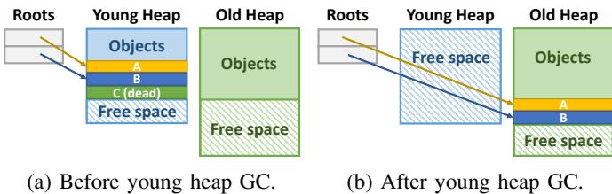
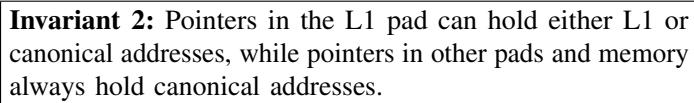
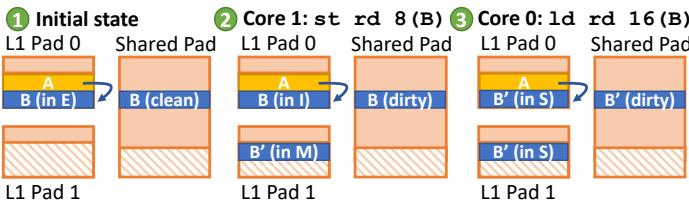
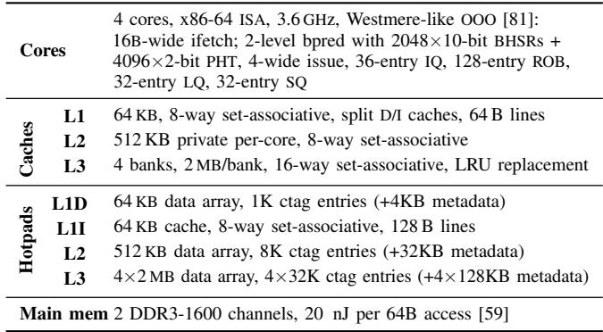
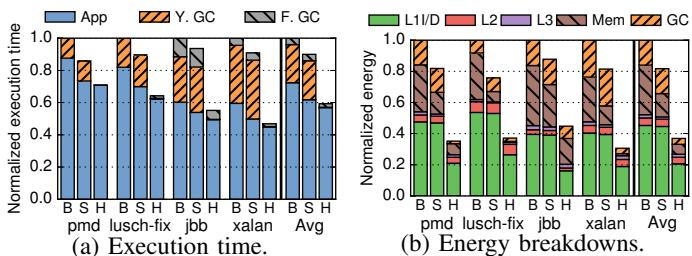
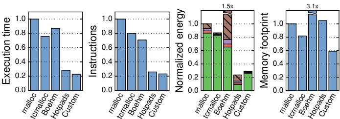

# Rethinking the Memory Hierarchy for Modern Languages 图表详解

### Fig. 1: Generational GC example.

- 图片展示了 **Generational GC** 的一个典型示例，分为两个阶段：(a) 年轻代垃圾回收前，(b) 年轻代垃圾回收后。

- 在 (a) 阶段：

    - **Roots** 指向年轻代堆（Young Heap）中的对象 A 和 B。
    - 对象 C 被标记为 **dead**，表示其不可达，可被回收。
    - 年轻代堆中包含已分配对象和空闲空间（Free space），布局呈连续块状。
    - 老年代堆（Old Heap）中已有部分对象，且下方保留空闲空间。

- 在 (b) 阶段：

    - 年轻代堆执行 **GC** 后，对象 C 被清除，释放空间。
    - 存活对象 A 和 B 被移动至老年代堆，实现 **moving GC** 的紧凑布局。
    - 年轻代堆清空后，所有空间变为 Free space，便于后续快速分配。
    - Roots 更新指向老年代堆中的 A 和 B，维持可达性。

- 此图直观体现了 **generational hypothesis**：多数对象在年轻代即死亡，仅少量存活对象晋升至老年代。

- 该机制通过分离堆空间、按年龄分层管理，显著降低 GC 开销，提升缓存局部性。

- 图中颜色区分清晰：

    | 区域        | 颜色        | 含义           |
    | ----------- | ----------- | -------------- |
    | Young Heap  | 蓝色        | 年轻代堆       |
    | Old Heap    | 绿色        | 老年代堆       |
    | Objects     | 黄/蓝/绿    | 不同对象实例   |
    | Dead Object | 绿底斜线    | 已死亡对象     |
    | Free Space  | 斜线填充    | 可分配空闲区域 |
    | Roots       | 灰色框+箭头 | 根引用指针     |

- 此图是理解 Hotpads 中 **Collection-Eviction (CE)** 机制的基础，Hotpads 将类似 GC 的移动与压缩逻辑应用于硬件内存层级管理。

### Fig. 2: Hotpads is a hierarchical memory system with multiple levels of pads.

- 图片展示了 **Hotpads** 的整体架构，是一个多级 **pad** 构成的层次化内存系统。
- 从左至右依次为：**Core** → **L1 Pad** → **L2 Pad** → **L3 Pad** → **Main Memory**。
- 各组件之间通过双向箭头连接，表示数据可在层级间双向流动，支持读写操作。
- **Pad** 是 Hotpads 的核心单元，类似传统缓存但采用直接寻址（directly addressed），非关联式查找（associative lookup）。
- 每个 **Pad** 层级独立管理对象生命周期，支持隐式数据迁移、指针重写、层级内分配与统一回收机制。
- **Main Memory** 作为最底层存储，由软件管理垃圾回收，而所有 **Pad** 层均由硬件自动管理。
- 该结构摒弃传统扁平地址空间抽象，通过隐藏物理布局提升效率，尤其适配 **memory-safe languages** 如 Java、Go、Rust。
- 图中未显示具体数据路径或控制信号，仅示意层级关系与访问流向，强调“硬件管理的分层直接寻址内存”这一设计哲学。

### Fig. 3: Pad organization.

- 图片展示了 Hotpads 架构中单个 **pad** 的内部组织结构，其设计核心是将数据与元数据分离管理，以支持硬件自动化的对象级内存操作。
- **Data Array** 是 pad 的主体存储区域，采用循环缓冲区（circular buffer）形式管理。它被划分为两个连续部分：
    - **Objects**：已分配的对象区域，新对象通过“bump pointer allocation”机制追加到该区域末尾。
    - **Free space**：空闲空间区域，用于容纳新分配或从上层迁移来的对象。
- **Metadata (word/object)** 是一个独立的、按字或对象粒度管理的元数据数组。它不与 Data Array 混合存储，而是作为辅助结构存在，包含以下关键信息：
    - **Pointer bit**：标记每个字是否存储指针，用于 GC 和指针重写。
    - **Valid/Dirty bits**：指示对象副本的有效性和修改状态，用于缓存一致性协议。
    - **Recency bits**：记录对象访问时间戳，用于指导 CE 过程中的驱逐决策。
- **Canonical Tags** 是一个类似 V-Way cache 的解耦标签存储结构。它仅存储非规范对象（即副本）的地址映射，将对象的规范地址（canonical address）映射到其在当前 pad 中的实际地址。这使得硬件可以在不进行全关联查找的情况下定位对象副本。
- 整体结构体现了 Hotpads 的核心设计理念：通过**直接寻址**和**硬件管理**来替代传统缓存的关联查找，从而提升效率。所有数据移动和垃圾回收都由硬件隐式触发并完成，对软件透明。

| 组件               | 功能                     | 关键特性                                                            |
| :----------------- | :----------------------- | :------------------------------------------------------------------ |
| **Data Array**     | 存储实际对象数据         | 循环缓冲区；Bump pointer 分配；包含 Objects 和 Free space           |
| **Metadata**       | 存储对象和字的元数据     | 独立于 Data Array；包含 Pointer bit, Valid/Dirty bits, Recency bits |
| **Canonical Tags** | 存储非规范对象的地址映射 | 解耦标签结构；仅针对副本；实现快速地址转换                          |

- 该组织方式确保了 Hotpads 能够高效执行其四大核心功能：隐式对象移动、指针重写、层级内分配和统一的收集-驱逐（CE）。例如，当需要重写指针时，硬件可以利用 Metadata 中的 Pointer bit 快速识别目标位置，并利用 Canonical Tags 找到对象副本，从而避免昂贵的关联查找。

### Fig. 4: Example showing Hotpads’s key features.

- 图片展示了 Hotpads 内存层次结构的六个关键操作阶段，以单核系统为例，包含 RegFile、L1 Pad、L2 Pad 和 Main Memory 四个层级。
- **初始状态（步骤 1）**：核心寄存器指向 L2 Pad 中的对象 A，A 指向主存中的对象 B。L1 Pad 为空，仅含空闲空间；L2 Pad 含对象 A；Main Memory 含对象 B。
- **访问对象 A（步骤 2）**：核心发起对 A 的访问，系统将 A 从 L2 Pad 复制到 L1 Pad 的空闲区域，并重写寄存器中指向 A 的指针为 L1 地址。此时 L1 Pad 包含 A，L2 Pad 仍保留 A 副本。
- **访问对象 B（步骤 3）**：核心解引用 A 中指向 B 的指针，触发 B 从 Main Memory 复制至 L1 Pad，同时 A 中指向 B 的指针被硬件自动重写为 L1 地址。此过程避免了后续访问的关联查找。
- **分配新对象 C（步骤 4）**：核心调用 alloc 指令创建新对象 C，直接在 L1 Pad 空闲区分配，无需主存支持。C 被放置于 L1 Pad，不产生任何外部内存流量。
- **L1 Pad 满溢触发 CE（步骤 5）**：当 L1 Pad 空间耗尽，启动 Collection-Eviction（CE）过程。系统识别出 C 为死对象（未被引用），B 为活对象且最近被访问，A 为活对象但未被近期访问。D 为新创建对象，由 B 引用。
- **CE 执行后状态（步骤 6）**：
    - 死对象 C 被回收，释放空间。
    - 非近期访问的活对象 A 和 D 被迁移到 L2 Pad。
    - 最近访问的活对象 B 保留在 L1 Pad 并移动至数组起始位置，实现紧凑布局。
    - 主存中 B 的副本变为 stale（过时），因 L1 已有最新版本。
    - 寄存器中指向 B 的指针保持有效，指向 L1 新地址。

| 步骤 | 核心动作       | L1 Pad 变化                    | L2 Pad 变化 | Main Memory 变化 |
| ---- | -------------- | ------------------------------ | ----------- | ---------------- |
| 1    | 初始状态       | 空闲空间                       | 对象 A      | 对象 B           |
| 2    | 访问 A         | 复制 A，重写指针               | 保留 A      | 无变化           |
| 3    | 解引用 A→B     | 复制 B，重写 A 中指针          | 保留 A      | 无变化           |
| 4    | 分配 C         | 添加 C                         | 无变化      | 无变化           |
| 5    | L1 满，触发 CE | 标记 C 死，B 活且最近访问      | 无变化      | B 标记为 stale   |
| 6    | CE 完成        | 移除 C，保留并紧凑 B，腾出空间 | 添加 A 和 D | B 保持 stale     |

- **关键机制体现**：
    - **隐式对象移动**：数据随访问自动迁移，无需软件干预。
    - **指针重写**：硬件自动更新指针指向最新副本，避免重复关联查找。
    - **层级内分配**：新对象优先在 L1 分配，零延迟访问。
    - **统一 GC 与驱逐**：CE 过程同步完成垃圾回收与非活跃对象驱逐，提升效率。
- **设计优势**：通过对象粒度管理、指针重写和并发 CE，Hotpads 显著降低关联查找开销、减少主存流量、提升缓存利用率，最终实现性能与能效双重优化。

### TABLE I: HOTPADS ISA.

- **Hotpads ISA** 专为内存安全语言设计，其指令集围绕对象指针操作展开，摒弃传统地址算术，强化硬件对内存布局的控制。
- 指令分为五类：数据加载/存储、指针加载/存储、指针解引用、指针相等比较、对象分配，每类均采用 **base+offset** 寻址模式，基址寄存器 **rb** 必须为对象指针。
- 所有内存访问均通过对象边界进行，禁止指向对象内部任意偏移，确保指针语义清晰，便于硬件重写与管理。
- **指针加载 (ldptr)** 与 **指针存储 (stptr)** 用于读写指针字段，系统据此识别哪些字包含指针，用于后续的垃圾回收与指针重写。
- **指针解引用 (derefptr)** 是关键优化指令，它不仅加载指针，还触发目标对象自动载入 L1 pad 并重写原指针，避免后续访问的关联查找开销。
- **指针相等比较 (seqptr)** 解决多副本问题，比较两个指针是否指向同一对象，而非字面值相等，支持跨层级指针比较。
- **对象分配 (alloc)** 指令直接在 L1 pad 分配新对象，无需主存 backing，提升分配效率；大小对象按阈值分层分配至不同 pad 层级。
- 下表总结 Hotpads ISA 核心指令格式与语义：

| 指令类型     | 指令格式                | 操作语义                                                                     |
| ------------ | ----------------------- | ---------------------------------------------------------------------------- |
| 数据加载     | `ld rd, disp(rb)`       | `rd ← Mem[EffAddr]`，加载非指针数据                                          |
| 数据存储     | `st rd, disp(rb)`       | `Mem[EffAddr] ← rd`，存储非指针数据                                          |
| 指针加载     | `ldptr rp, disp(rb)`    | `rp ← Mem[EffAddr]`，加载指针并标记该寄存器为指针                            |
| 指针存储     | `stptr rp, disp(rb)`    | `Mem[EffAddr] ← rp`，存储指针并更新相关元数据                                |
| 指针解引用   | `derefptr rp, disp(rb)` | `rp ← Mem[EffAddr]`，同时将目标对象载入 L1 并重写该指针                      |
| 指针相等比较 | `seqptr rd, rp1, rp2`   | `rd ← (rp1 == rp2) ? 1 : 0`，比较两指针是否指向同一对象                      |
| 对象分配     | `alloc rp, rs1, rs2`    | `NewAddr ← Alloc(rs1); Mem[NewAddr] ← rs2; rp ← NewAddr`，分配新对象并初始化 |

- 所有指针操作均依赖硬件维护的元数据（如指针位、c-tags），确保指针完整性与高效重写，是 Hotpads 避免关联缓存的核心机制。

### Fig. 5: Hotpads pointer format.

- 图片展示了 **Hotpads** 系统中指针的位格式，总长度为 64 位，用于支持对象级内存管理与硬件自动重写。
- 指针结构分为三个主要字段：**Address (48b)**、**Size (14b)** 和两个控制位（**Canonical bit** 与 **CE epoch bit**）。
- **Address (48b)** 占据最低 48 位（bit 0–47），表示对象在内存中的字地址（word address），是访问数据的核心部分。
- **Size (14b)** 位于高位（bit 48–61），存储对象大小（以字为单位），用于硬件判断对象边界和分配策略。
- **Canonical bit** 位于 bit 48，用于标识当前指针是否指向对象的“规范层级”（canonical level），即该对象最终驻留的层级。
- **CE epoch bit** 位于 bit 49，用于支持并发的 Collection-Eviction（CE）过程，通过交替位协议区分新旧指针版本，确保一致性。
- 高位剩余位（bit 62–63）未在图中标注用途，可能保留或用于未来扩展。
- 该格式设计允许 Hotpads 硬件在不依赖传统关联缓存的前提下，实现对象移动、指针重写和垃圾回收等操作。

| 字段名称      | 位范围 | 位宽 | 功能描述                               |
| ------------- | ------ | ---- | -------------------------------------- |
| Address       | 0–47   | 48b  | 对象的字地址，用于直接寻址             |
| Size          | 48–61  | 14b  | 对象大小（字数），辅助内存管理         |
| Canonical bit | 48     | 1b   | 标识指针是否指向对象的 canonical level |
| CE epoch bit  | 49     | 1b   | 支持并发 CE 过程，区分指针版本         |
| 保留位        | 62–63  | 2b   | 未使用或预留                           |

- 该指针格式是 Hotpads 实现“隐藏内存布局”核心理念的关键机制，使系统能透明地重定位对象并重写指针，从而避免关联查找开销。

### 0ac9c00777a7d825976f8c96009fa9301d4a669d24cdc1aeef6c959ecec8cd6d.jpg

- **图片内容**：该图片展示的是论文中关于 Hotpads 内存层次结构的一个关键不变式（Invariant 2），其文本为：“**Pointers in the L1 pad can hold either L1 or canonical addresses, while pointers in other pads and memory always hold canonical addresses.**”

- **核心含义**：

    - 在 **L1 pad** 中，指针可以指向两个位置：要么是当前 L1 pad 内的对象地址（即本地副本），要么是指向该对象的“规范地址”（canonical address）。
    - 在 **L2、L3 等更高层级的 pad 或主存**中，所有指针都必须指向对象的“规范地址”，不允许指向低层级（如 L1）的副本。

- **设计目的**：

    - 保证内存一致性与简化硬件管理。通过限制非 L1 层级只能引用规范地址，避免了跨层级指针混乱。
    - 允许 L1 层进行高效的指针重写（pointer rewriting），因为 L1 可以自由切换指向本地副本或规范地址，而其他层级无需处理这种动态性。

- **技术影响**：

    - 支持 **指针重写机制**：当程序访问一个不在 L1 的对象时，系统将其复制到 L1，并自动将原指针重写为 L1 地址，后续访问直接命中，避免关联查找。
    - 实现 **分层垃圾回收与驱逐（CE）**：由于高层级只引用规范地址，它们在执行 GC 时无需关心低层级副本的存在，简化了并发和一致性维护。

- **与其他不变式的协同**：

    - 与 Invariant 1（对象始终存在于其规范层级）配合，确保每个对象都有唯一“最终归属地”。
    - 与 Invariant 3（对象只能指向同级或更高级别对象）共同构建安全的引用拓扑，防止指针悬空或越界。

- **性能优势**：

    - 减少 L1 访问中的关联查找开销，提升命中效率。
    - 避免多层级间复杂的指针同步逻辑，降低硬件复杂度。

| 层级        | 指针可指向地址类型        | 是否允许指向低层级副本 |
| ----------- | ------------------------- | ---------------------- |
| L1 pad      | L1 地址 或 Canonical 地址 | 是                     |
| L2/L3 pad   | 仅 Canonical 地址         | 否                     |
| Main Memory | 仅 Canonical 地址         | 否                     |

- **总结**：该不变式是 Hotpads 架构实现高效、安全、硬件管理内存层次的核心约束之一，它通过明确指针语义边界，支撑了指针重写、对象移动、分层 GC 等关键技术特性。

### 355b7401dc1d297a13aa74f1aa2b5ecb014eddd4f91fd7695dd871802f933cc9.jpg

- 图片内容为论文《Rethinking the Memory Hierarchy for Modern Languages》中关于 Hotpads 微架构的两个核心不变式（Invariants），编号为 Invariant 3 和 Invariant 4。
- **Invariant 3** 规定了对象间指针的层级约束：**特定层级的对象只能指向同级或更高级别的对象**。这一规则确保了数据流在层次结构中的单向性，是实现分层垃圾回收与数据迁移的基础。
- **Invariant 4** 定义了对象生命周期终结时的处理原则：**对象死亡后，仅能在其 canonical level 被垃圾回收**。这保证了回收操作的确定性和一致性，避免跨层级回收引发的状态混乱。
- 这两个不变式共同支撑了 Hotpads 的“分层并发收集-驱逐”（Collection-Eviction, CE）机制，使每个 pad 可独立执行 GC 操作而不影响更高层级，从而实现高效、低开销的内存管理。
- 在实际系统中，这两个不变式通过硬件强制执行，例如在对象迁移或指针重写时检查目标地址层级，并在违反规则时触发异常或自动调整对象的 canonical level（如图 10 所示）。

| 不变式编号  | 内容摘要                              | 核心作用                        |
| ----------- | ------------------------------------- | ------------------------------- |
| Invariant 3 | 对象指针只能指向同级或更高级别对象    | 维持层级结构完整性，支持分层 GC |
| Invariant 4 | 死亡对象仅在其 canonical level 被回收 | 确保回收一致性，简化状态管理    |

- 这些设计选择直接源于现代内存安全语言（如 Java、Go、Rust）的语义特性——隐藏内存布局并由运行时管理对象生命周期——Hotpads 将此理念延伸至硬件层面，从而摆脱传统缓存体系对关联查找和虚拟地址转换的依赖。

### Fig. 6: In-pad object format.

- 图片展示了 Hotpads 系统中存储在 **pad** 内部的 **object** 的内存布局格式，即 **In-pad object format**。
- 该对象格式主要由三部分组成：**Data Array**、**Canonical pointer (if copy)** 和 **First object word**。
- **Data Array** 是对象实际数据存储区域，包含对象内容及后续字（Additional object words）。
- **Canonical pointer (if copy)** 仅存在于非规范副本对象中，用于指向其在规范层级（canonical level）的原始地址。此字段位于对象数据之前，便于快速转换。
- **First object word** 是对象的第一个字（64位），其内部结构被划分为多个元数据字段，具体如下：

| 字段名称      | 位宽 | 位置  | 功能说明                                                                                                                                       |
| ------------- | ---- | ----- | ---------------------------------------------------------------------------------------------------------------------------------------------- |
| Type id       | 48b  | 0–47  | 对象类型标识符，由程序设置，Hotpads 不依赖它判断指针，但可被程序用于识别对象类型（如 vtable 指针）。**高16位必须为0**，供 Hotpads 存储元数据。 |
| CE mark state | 2b   | 48–49 | 用于 **Collection-Eviction (CE)** 过程中的标记状态（unscanned, to-scan, scanned），见 Sec. V-E。                                               |
| Canonical bit | 1b   | 50    | 标识当前对象是否为规范对象（即其地址是否为其 canonical address）。                                                                             |
| Coherence     | 13b  | 51–63 | 用于对象级一致性协议（如 MESI），在多核系统中记录共享者集合或状态。                                                                            |

- 所有字段均嵌入在对象的第一个字内，以节省空间并支持硬件高效访问。
- **Type id** 被设计为对 Hotpads 透明，系统不依赖它进行指针识别，而是通过 `ldptr`、`stptr`、`derefptr` 指令来标记哪些字包含指针。
- **Coherence** 字段在多核场景下用于维护对象一致性，例如记录哪些核心持有该对象的副本。
- **CE mark state** 与垃圾回收机制紧密耦合，支持在硬件中执行并发的移动式 GC。
- 此格式允许 Hotpads 在硬件层面管理对象生命周期、移动和一致性，无需软件干预，是实现高效内存层次结构的关键设计之一。

### Fig. 7: Canonical tag entry format.

- 图片展示了 Hotpads 系统中 **Canonical tag entry** 的格式，用于在 pad 层级中映射对象的 **canonical address** 到其当前所在层级的 **pad address**。
- 该条目由三个字段组成，从左到右依次为：
    - **Canonical Address (48b)**：绿色区域，存储对象在其 canonical level 的地址，长度为 48 位。
    - **Valid bit**：白色小方块，标记该条目是否有效。若无效，则对应的对象副本可能已被驱逐或标记为脏。
    - **Pad address**：橙色区域，存储该对象在当前 pad 中的实际物理地址（即 per-level address）。
- 此结构是 **c-tags array** 的基本单元，其作用类似于传统缓存中的 tag 阵列，但针对的是对象而非 cache line。
- **关键设计点**：
    - 只有非 canonical 对象（即副本）才需要 c-tag 条目。
    - 通过此映射，系统可在访问时快速定位对象在当前 pad 中的位置，避免全局搜索。
    - Valid bit 用于支持 **invalidation** 机制，在 c-tag 满时可选择性驱逐旧条目。
- 该设计实现了 **decoupled tag store**，与 V-Way cache 类似，但服务于对象粒度的数据移动和指针重写机制。

| 字段名称          | 位宽 | 颜色 | 功能                          |
| ----------------- | ---- | ---- | ----------------------------- |
| Canonical Address | 48b  | 绿色 | 对象在 canonical level 的地址 |
| Valid bit         | 1b   | 白色 | 标记条目有效性                |
| Pad address       | 可变 | 橙色 | 对象在当前 pad 中的物理地址   |

- 此结构支撑了 Hotpads 的核心优化之一：**pointer rewriting**，使得后续对同一对象的访问可直接命中 pad 地址，避免重复的关联查找。

### Fig. 8: In-pad metadata format.

- 图片 92066845325f32a89a92f02d6ccde491024fd31b7b67f9b5cdbaeb31e8b5938b.jpg 展示的是 Hotpads 系统中 **pad 内部的元数据格式**，即 Fig. 8: In-pad metadata format。
- 元数据分为两类：**Per-word metadata** 和 **Per-object metadata**，分别服务于字粒度和对象粒度的操作。
- **Per-word metadata** 仅包含一个字段：
    - **Pointer bit**：标记该字是否存储了一个指向 pad 内对象的指针。此位由 `ldptr`、`stptr` 和 `derefptr` 指令设置，并在层级间传播。
- **Per-object metadata** 存储在每两个字（word）对应的元数据条目中，因为对象最小为两字长。它包含三个字段：
    - **Valid bit**：指示该对象副本是否有效。若无效，访问时需从其 canonical level 重新加载。
    - **Dirty bit**：指示该对象副本自上次写入以来是否被修改过。用于决定是否需要写回上层。
    - **Recency (4b)**：4 位粗粒度 LRU 时间戳，用于在 Collection-Eviction (CE) 过程中选择要驱逐的对象。当 1/8 的 pad 容量被当前时间戳标记时，时间戳递增。

| 元数据类型 | 字段名称    | 位宽   | 作用                          |
| ---------- | ----------- | ------ | ----------------------------- |
| Per-word   | Pointer bit | 1 bit  | 标记该字是否为 pad 指针       |
| Per-object | Valid bit   | 1 bit  | 标记对象副本是否有效          |
| Per-object | Dirty bit   | 1 bit  | 标记对象副本是否被修改        |
| Per-object | Recency     | 4 bits | 用于 CE 驱逐策略的 LRU 时间戳 |

- 所有元数据均独立于数据数组存储，以避免每次访问都读取额外数据，从而提升性能。
- 整体元数据开销为 **4 bits per word**，占总存储容量的 **6.25%**。
- 此设计确保了 Hotpads 能在硬件层面高效管理对象生命周期、一致性及驱逐策略，是实现其低开销 GC 和高效数据移动的关键基础。

### Fig. 9: Steps in L1 pad access. Wider arrows denote more frequent events.

- 图片展示了 Hotpads 架构中 **L1 pad** 的访问流程，核心目标是通过直接寻址和元数据管理，**避免或减少关联查找（associative lookup）**，从而提升效率。
- 流程起点为来自核心的指针（Pointer from core），该指针可能指向 L1 canonical、L1 non-canonical 或非 L1（即更高层级或主存）的对象。
- **L1 canonical 访问路径**：若指针指向的是 L1 canonical 对象（即对象的“最终归属地”在 L1），则无需任何检查，直接访问数据数组（Access data array）。这是最频繁、最高效的路径，由图中**最粗箭头**表示。
- **L1 non-canonical 访问路径**：若指针指向的是 L1 中的副本（non-canonical），系统会首先检查其 **Valid 位**。若有效（Y），则直接访问数据数组；若无效（N），则需读取该对象上方存储的 **canonical pointer**，并用此 canonical 地址重新发起访问。
- **Non-L1 (canonical) 访问路径**：若指针指向的是非 L1 层级的 canonical 对象，系统会进行 **c-tag 查找**。若命中（Hit? Y），则获取其在 L1 的副本地址，并访问数据数组；若未命中（N），则向下一层次（如 L2 pad）发起请求，待对象被载入 L1 后再进行访问。
- 在所有成功访问数据数组的路径末端，都会有一个“Adjust”步骤，用于更新相关的元数据，包括 **Recency**（记录访问时间戳）、**Dirty**（标记是否被修改）和 **Pointer**（用于指针重写）位。
- 整个流程设计体现了 Hotpads 的核心思想：利用硬件管理对象移动和指针重写，将大部分访问转化为对 L1 数据数组的**直接寻址**，从而规避了传统缓存架构中每次访问都必须进行的昂贵关联查找。图中的箭头粗细直观地反映了各路径的发生频率，突出了直接访问的主导地位。

### Fig. 10: Example of an eviction that requires changing the canonical level of a non-evicted object (P).

- 图片展示了 Hotpads 系统中一个关键的 **对象驱逐（eviction）** 场景，涉及 **L1 Pad** 和 **L2 Pad** 之间的数据迁移与 **canonical level** 的动态调整。
- 核心问题是：当对象 E 从 L1 驱逐到 L2 时，若其内部指针指向另一个仍在 L1 的对象 P，则必须确保 **P 的 canonical level 不低于 E 的新 level（L2）**，以维持系统不变量 Invariant 3。
- 图 (a) “Before E’s eviction” 显示：
    - L1 Pad 中包含对象 E（红色）和对象 P（蓝色），两者均为 L1 canonical。
    - L2 Pad 中存在 E 的一个 **stale copy**（红色条纹），表明 E 曾被驱逐过但未更新。
    - E 内部有一个指针指向 P。
- 图 (b) “After E’s eviction” 显示：
    - 对象 E 已被成功驱逐至 L2 Pad，并覆盖了原有的 stale copy。
    - 关键变化：对象 P 虽未被驱逐，但其 **canonical level 被提升至 L2**，使其在 L2 Pad 中拥有一个 **canonical copy**（蓝色块）。
    - 原 L1 中的 P 变为非 canonical copy（蓝色条纹），并保留其内容。
    - E 在 L2 中的指针现在指向 P 的 L2 canonical 地址。
- 此机制确保了 **对象间引用的层级一致性**：任何对象只能指向相同或更高层级的对象。
- 下表总结了对象状态变化：

| 对象 | 初始 Canonical Level | 驱逐后 Canonical Level | 驱逐后位置                                 |
| ---- | -------------------- | ---------------------- | ------------------------------------------ |
| E    | L1                   | **L2**                 | L2 Pad                                     |
| P    | L1                   | **L2**                 | L1 Pad (non-canonical), L2 Pad (canonical) |

- 这一操作虽然增加了额外开销（创建 P 的 L2 copy），但避免了因违反层级约束而导致的系统错误，是 Hotpads 实现 **硬件管理内存层次结构** 的必要设计。

### Fig. 11: Dual-ended compaction example. All objects are 2 words long, except E, which takes 4 words.

- 图片展示了 Hotpads 系统中 **Collection-Eviction (CE)** 过程中的 **Dual-ended compaction** 机制，用于在不占用额外空间的前提下高效构建重命名表（Rename Table）。
- 该机制的核心思想是：**在压缩过程中动态腾出空间**，而非预先分配整个重命名表，从而最大化利用 pad 的容量。
- 所有对象默认为 2 字长，唯独对象 E 占用 4 字长，用于演示不同大小对象的处理方式。
- 整个过程分为三个阶段：**Before CE**、**During Compact** 和 **After Compact**，并辅以右侧的 **Rename Table Contents** 表格说明最终映射关系。

**Before CE 阶段**

- 数据数组从上到下依次存放对象 A、B、C、D、E、F、G，其中 A、D、G 被标记为“hot”（近期访问），其余为非热对象。
- 左侧预留了部分空间（10–14 字）用于后续放置重命名表。
- 此时所有对象均位于其原始位置，尚未进行任何移动或重命名。

**During Compact 阶段**

- 压缩从两端同时进行：
    - **前端（顶部）**：从对象 A 开始向下扫描，将“hot”对象（A、G）保留并移动至新区域起始处。
    - **后端（底部）**：从对象 G 开始向上扫描，将“hot”对象（G、D）保留并移动至新区域末端。
- 非热对象（B、C、E、F）被标记为“Evict”，准备移出当前 pad。
- 在压缩过程中，**重命名表逐步构建**，并放置于数据数组中部空闲区域（原对象 D、E、F 所在位置）。
- 每次移动一个对象，其旧地址与新地址的映射即被写入重命名表，实现增量式构建。

**After Compact 阶段**

- 所有“hot”对象（A、G、D）被紧凑排列在数据数组顶部，形成连续的已分配区域。
- 非热对象（B、C、E、F）已被移除，其原位置被重命名表和空闲空间取代。
- 重命名表完整构建完毕，存储所有被移动对象的旧地址到新地址的映射。
- 右侧表格清晰列出每个对象的重命名条目，例如：
    - A pointer → 新地址 0
    - G pointer → 新地址 2
    - D pointer → 新地址 6

**关键优势**

- **空间效率高**：重命名表无需预分配，而是利用压缩过程中释放的空间动态构建，避免了传统方法中高达 50% 的空间浪费。
- **性能开销低**：压缩与重命名表构建同步进行，无需额外遍历或复制操作。
- **支持变长对象**：即使对象大小不一（如 E 占 4 字），也能正确处理，确保压缩后数据布局紧凑。

**总结**

- Dual-ended compaction 是 Hotpads 实现高效内存管理的关键技术之一，它通过**双向压缩 + 动态重命名表构建**，在保证数据完整性的同时，极大提升了 pad 的利用率和 CE 过程的执行效率。

### Fig. 12: Example access to an L2-canonical object using subobjects.

- 图片展示了 Hotpads 系统中对一个 **L2-canonical object**（即其规范层级为 L2 的对象）进行访问时，如何通过 **subobjects** 机制实现高效缓存。
- 核心场景：核心执行指令 `ld rd, 20(rp)`，其中寄存器 `rp` 指向位于 L2 的 224 字节（28 字）对象 A，偏移量为 20 字。
- 对象 A 的完整地址为 L2 的 `0xA00`。由于对象尺寸超过子对象阈值（64 字节），Hotpads 不会将整个对象加载到 L1，而是只加载包含所需数据的子对象。
- 所需数据位于对象 A 的第 20 字，因此系统加载的是包含第 16 至 23 字的子对象，命名为 **Subobj. A.2**。
- Subobj. A.2 被加载到 L1 Pad 的地址 `0xD0`，并在 L1 的 **c-tag**（canonical tag）数组中建立映射条目，记录其规范地址 `0xA10`（即子对象在 L2 中的起始地址）与 L1 地址 `0xD0` 的对应关系。
- 图中箭头清晰地表示了从 L2 的完整对象 A 到 L1 的子对象 Subobj. A.2 的数据移动路径。
- 此机制允许 Hotpads 在处理大对象时，仅按需加载小块数据，从而节省 L1 Pad 的宝贵空间并减少数据传输量。
- 关键术语保留英文：**L2-canonical object**, **subobjects**, **L1 Pad**, **c-tag**, **Subobj. A.2**。

| 组件             | 地址/值                                 | 描述                                                   |
| ---------------- | --------------------------------------- | ------------------------------------------------------ |
| RegFile (rp)     | Addr: 0xA00                             | 寄存器 rp 指向 L2 中对象 A 的起始地址。                |
| Object A (L2)    | Size: 224 bytes (28 words), Addr: 0xA00 | 完整对象 A 存储在 L2，大小为 224 字节。                |
| Subobj. A.2 (L1) | Size: 8 words, Addr: 0xD0               | 加载到 L1 的子对象，包含对象 A 的第 16-23 字。         |
| L1 c-tag entry   | Canonical Addr: 0xA10, L1 Addr: 0xD0    | 记录子对象在 L2 的规范地址与其在 L1 的实际地址的映射。 |

- 该图例证了 Hotpads 如何将大对象视为独立的地址空间，并通过子对象对其进行缓存，从而在保持高效性的同时支持任意大小的对象。
- 这种设计避免了传统缓存因固定大小缓存行而导致的大对象访问效率低下问题。

### Fig. 13: Example of object-level coherence in Hotpads.

- 图片展示了 Hotpads 系统中 **对象级一致性（object-level coherence）** 的工作流程，以双核系统为例，包含两个私有 L1 Pad 和一个共享 L2 Pad。
- 该图分为三个阶段，演示了当 Core 1 修改对象 B 后，Core 0 如何通过一致性协议重新获取最新数据的过程。
- 所有对象在 Hotpads 中被视为独立单元，一致性操作仅针对对象本身，避免了传统缓存中的 **伪共享（false sharing）** 问题。

| 阶段                  | 描述                                                                                                                                                                | 核心动作                                                           | 对象状态变化                                      |
| --------------------- | ------------------------------------------------------------------------------------------------------------------------------------------------------------------- | ------------------------------------------------------------------ | ------------------------------------------------- |
| ① Initial state       | 初始状态：Core 0 的 L1 Pad 0 持有对象 B 的副本，处于 **Exclusive (E)** 状态；共享 Pad 中的 B 为 clean。                                                             | 无                                                                 | B: E (L1 Pad 0), clean (Shared Pad)               |
| ② Core 1: st rd 8(B)  | Core 1 执行存储指令修改对象 B。触发一致性协议，共享 Pad 将 B 标记为 dirty，并向 Core 0 发送无效化请求。                                                             | Core 1 写入 B → 共享 Pad 更新状态 → Core 0 L1 副本被标记为 invalid | B: invalid (L1 Pad 0), dirty (Shared Pad)         |
| ③ Core 0: ld rd 16(B) | Core 0 尝试加载 B 的第 16 字偏移处数据。发现其本地副本已失效，于是从共享 Pad 重新获取 B 的最新版本，并将其置于 **Shared (S)** 状态。同时，Core 1 的副本也降级为 S。 | Core 0 发起读取 → 从 Shared Pad 获取 → 更新本地副本并设置为 S      | B: S (L1 Pad 0), S (L1 Pad 1), dirty (Shared Pad) |

- 在此过程中，**指针重写（pointer rewriting）** 并未发生，因为访问的是同一对象的不同副本，而非指向不同对象的指针。
- 一致性协议基于 **MESI 状态机**，但作用粒度是对象而非缓存行，显著提升了多核环境下对细粒度数据竞争的处理效率。
- 图中使用颜色区分对象状态：黄色代表当前活跃访问的对象，蓝色代表对象内容，斜线填充区域表示空闲或未分配空间。
- 此机制确保了即使在并发访问下，各核心看到的对象视图始终保持一致，且仅传输必要对象，降低带宽消耗。

### 1f29043e9fb2619458afa096ffbcff4918419d66e36a263165ac63cb0a488328.jpg

- 该图片为一张硬件配置对比表，详细列出了用于实验评估的 **Cache** 和 **Hotpads** 两种内存层次结构在多核处理器上的具体参数。

- 表格分为三大部分：**Cores**（核心）、**Caches**（缓存）和 **Hotpads**（热垫），最后一行为 **Main mem**（主存）。

- **Cores** 部分描述了处理器核心的通用架构：

    - 采用 **x86-64 ISA**，频率为 **3.6GHz**，基于类似 **Westmere** 的乱序执行（**OOO**）设计。
    - 指令预取宽度为 **16B**，分支预测器为两级，包含 **2048×10-bit BHSRs** 和 **4096×2-bit PHT**。
    - 发射宽度为 **4-wide issue**，重排序缓冲区（**ROB**）为 **128-entry**，加载队列（**LQ**）和存储队列（**SQ**）均为 **32-entry**。

- **Caches** 部分描述了传统缓存层级的配置：

    - **L1**：**64 KB** 容量，**8-way set-associative**，数据与指令分离（**split D/I caches**），缓存行大小为 **64 B**。
    - **L2**：**512 KB** 私有每核缓存，**8-way set-associative**。
    - **L3**：共享三级缓存，共 **4 banks**，每 bank **2 MB**，总计 **8 MB**，**16-way set-associative**，替换策略为 **LRU**。

- **Hotpads** 部分描述了 Hotpads 内存层次结构的配置：

    - **L1D**：**64 KB data array**，**1K ctag entries**，额外 **+4KB metadata**。
    - **L1I**：**64 KB cache**，**8-way set-associative**，缓存行大小为 **128 B**。注意此处 L1I 仍使用传统缓存，而非 Hotpads 数据结构。
    - **L2**：**512 KB data array**，**8K ctag entries**，额外 **+32KB metadata**。
    - **L3**：**4×2 MB data array**（即 4 个 bank，每个 2MB），**4×32K ctag entries**，额外 **+4×128KB metadata**。

- **Main mem** 部分描述了主存配置：

    - 使用 **2 DDR3-1600 channels**，每次访问 **64B** 数据消耗 **20 nJ** 能量。

- 对比可见，Hotpads 在 L1D、L2、L3 层级均采用了 **data array + ctag entries + metadata** 的结构，这与传统缓存的 **set-associative** 结构形成鲜明对比。

- Hotpads 的 **ctag entries** 数量远小于其 data array 容量（如 L1D 为 1K vs 64KB），表明其依赖 **pointer rewriting** 来减少对 ctag 的访问频率。

- Hotpads 的 **metadata** 开销明确列出（如 L1D 为 +4KB），而传统缓存未单独列出，说明 Hotpads 的元数据管理更为显式和精细。

- **L1I** 保留了传统缓存设计，表明 Hotpads 当前主要优化数据访问路径，指令访问仍沿用现有方案。

- 主存部分统一，确保比较基准一致，能量开销按 **64B access** 计算，便于横向对比不同层级的能耗效率。

### c72e759b78b173fda8fe4234d12f52e16638a00605b94f6fcb01664e8822395f.jpg

- 图片内容为一张表格，标题为“TABLE III: WORKLOADS”，用于描述论文中实验所使用的基准测试套件（Benchmark Suites）及其对应的输入参数。
- 该表格共包含三行数据，分别对应三个不同的基准测试套件：**DaCapo MR-9.12**、**SpecJBB** 和 **JgraphT**。
- 表格结构清晰，分为两列：“Suite”和“Benchmark and input”，前者列出测试套件名称，后者列出具体基准程序及输入配置。
- **DaCapo MR-9.12** 套件包含多个 Java 应用程序，如 batik、fop、h2、jython、pmd、luindex、lusearch、lusearch-fix、sunflow、xalan，所有程序均使用默认输入。
- **SpecJBB** 套件仅包含一个基准程序，配置为每个线程运行 1 个仓库，执行 50K 事务。
- **JgraphT** 套件包含两个图处理工作负载：pagerank 和 coloring，均基于 amazon-2008 图数据集。

| Suite          | Benchmark and input                                                                                   |
| -------------- | ----------------------------------------------------------------------------------------------------- |
| DaCapo MR-9.12 | batik, fop, h2, jython, pmd, luindex, lusearch, lusearch-fix, sunflow, xalan (all use default inputs) |
| SpecJBB        | 1 warehouse per thread, 50K transactions                                                              |
| JgraphT        | pagerank, coloring with amazon-2008 graph                                                             |

- 此表格是论文第六节“EXPERIMENTAL METHODOLOGY”中用于说明实验设置的关键组成部分，确保了评估结果的可复现性和代表性。
- 所有基准程序均在 Java 环境下运行，符合论文研究对象——现代内存安全语言（如 Java）的性能优化目标。

### TABLE IV: LATENCY, ENERGY, AND AREA OF CACHES AND PADS.

- **图片内容**：该图是论文中的 Table IV，标题为“LATENCY, ENERGY, AND AREA OF CACHES AND PADS”，用于对比传统 Cache 与 Hotpads 在不同层级（L1、L2、L3）的延迟、能耗、面积和漏电功耗。

- **数据结构**：

    - 表格按层级（L1、L2、L3）划分。
    - 每层包含两种类型：Cache 和 Pad。
    - 指标包括：Latency (cycles) — 分 Direct Hit 和 Miss；Energy (pJ) — 分 Direct Hit 和 Miss；Area (mm²)；Leakage (mW)。

- **关键数据对比**：

| Level | Type  | Latency (cycles)  | Energy (pJ)       | Area (mm²) | Leakage (mW) |
| ----- | ----- | ----------------- | ----------------- | ---------- | ------------ |
|       |       | Direct Hit / Miss | Direct Hit / Miss |            |              |
| L1    | Cache | – / 2             | – / 74            | 0.26       | 32           |
|       | Pad   | 2 / 3             | 16 / 27           | 0.28       | 32           |
| L2    | Cache | – / 9             | – / 371           | 1.53       | 77           |
|       | Pad   | 7 / 9             | 348 / 378         | 1.55       | 81           |
| L3    | Cache | – / 14            | – / 742           | 21.46      | 791          |
|       | Pad   | 9 / 14            | 655 / 771         | 21.88      | 793          |

- **核心发现**：

    - **L1 Pad 直接命中能耗极低**：仅 **16 pJ**，比 L1 Cache Miss 的 74 pJ 低 **4.3×**，是性能提升的关键。
    - **Pad 面积略高**：整体面积比 Cache 高约 **2%**，主要因额外元数据开销。
    - **L1 Pad 延迟可控**：Direct Hit 为 2 cycles，与 Cache Miss 相当；Miss 为 3 cycles，仅比 Cache 多 1 cycle。
    - **高能效优势集中在 L1**：因工作负载中 L1 访问占比高，且 Pointer Rewriting 使多数访问为 Direct Hit，故整体能耗大幅降低。
    - **泄漏功耗相近**：各层级 Pad 与 Cache 泄漏功耗差异微小，说明设计未显著增加静态功耗。

- **设计意义**：

    - Hotpads 通过 **直接寻址 + 指针重写**，避免了传统 Cache 的关联查找开销，在 L1 实现 **高能效访问**。
    - 虽然 Pad 在 Miss 场景下延迟略高，但因 **绝大多数访问为 Direct Hit**，整体 AMAT 仅比 Cache 高 4%，性能损失可忽略。
    - 数据表明，Hotpads 在保持合理面积和漏电的同时，实现了 **2.3× 的 L1 能效提升**，支撑其整体 2.6× 的内存层次能耗降低。

### Fig. 14: Simulation results for single-threaded workloads.

- 图片展示了单线程工作负载下 Hotpads 与传统缓存层次结构（Baseline）、带 scrubbing 优化的缓存（Scrubbing）以及理想内存系统（Perfect Mem）的性能、能耗和访问延迟对比，数据基于 13 个 Java 基准测试，图中显示了其中 8 个代表性应用及平均值。
- **执行时间**（图 a）：Hotpads 平均比 Baseline 快 **34%**，最高提升达 **86%**（lusearch）。其优势主要来自两方面：一是 GC 开销从 Baseline 的 11% 降至 **1.5%**；二是应用运行时因内存性能提升而减少 **21%**。Scrubbing 仅比 Baseline 快 17%，因未加速 GC，故 Hotpads 比 Scrubbing 快 15%。Perfect Mem 作为理论上限，比 Baseline 快 57%，Hotpads 弥补了其中 **61%** 的差距。
- **内存层次动态能耗**（图 b）：Hotpads 将整体动态能耗降低 **2.6×**。关键贡献包括：L1 数据垫能耗仅为 L1 缓存的 **1/2.3**（因多数访问为直接寻址），主存能耗降低 **4.1×**，CE 过程能耗比软件 GC 低 **2.9×**。Scrubbing 仅降低 22% 能耗，Hotpads 比其节能 **2.1×**。
- **平均内存访问时间 (AMAT)**（图 c）：Hotpads 的 AMAT 比 Baseline 低 **4%**，略高于 Scrubbing（高 7%）。尽管 L1 垫在需要 c-tag 查找时延迟稍高（+6%），但因 **指针重写**使 80% 的 L1 访问为直接访问，抵消了该开销。
- 应用差异显著：
    - 短生命周期对象多的应用（如 lusearch, xalan, lusearch-fix）：Hotpads 几乎消除主存流量，GC 能耗极低。
    - 混合生命周期对象应用（如 fop, specjbb, pmd）：Hotpads 仍大幅减少主存流量，优于 Baseline 和 Scrubbing。
    - 长生命周期大结构应用（如 pagerank, coloring）：Hotpads 主要收益来自降低 GC 开销，主存流量改善有限。

| 应用         | Hotpads vs Baseline (执行时间) | Hotpads vs Baseline (能耗) | Hotpads vs Baseline (AMAT) |
| ------------ | ------------------------------ | -------------------------- | -------------------------- |
| lusearch     | -86%                           | -70%                       | -10%                       |
| xalan        | -50%                           | -60%                       | -5%                        |
| lusearch-fix | -60%                           | -65%                       | -8%                        |
| fop          | -30%                           | -50%                       | -3%                        |
| specjbb      | -25%                           | -45%                       | -2%                        |
| pmd          | -20%                           | -40%                       | -1%                        |
| pagerank     | -15%                           | -30%                       | +1%                        |
| coloring     | -10%                           | -25%                       | +2%                        |
| **平均**     | **-34%**                       | **-62%**                   | **-4%**                    |

- **指针重写**是 Hotpads 高效的核心机制，使 L1 垫访问避免绝大多数关联查找，大幅提升能效并控制延迟增长。
- **CE 过程**高效且并发，虽频繁但成本极低，是降低 GC 开销的关键，平均将 GC 成本降低 **8×**。

### Fig. 15: Simulation results for baselines w/ DRRIP & prefetchers.

- 图片展示了在基础缓存层次结构上引入 **DRRIP** 替换策略和 **Nehalem风格流预取器** 后的性能与能耗对比，标记为 **B+E**（增强型基线）和 **S+E**（增强型Scrubbing），并与原始基线（B）、Scrubbing（S）、Hotpads（H）进行比较。
- 图(a)为归一化执行时间，图(b)为各层级内存动态能耗分解。所有数据均以基线（B）为1.0基准归一化。
- 执行时间方面：
    - **B+E** 相比基线 **B** 平均提升约8%，主要得益于预取器对GC和分配模式的优化。
    - **S+E** 相比 **S** 提升约5%，因Scrubbing已加速分配，增强项主要优化GC阶段。
    - **Hotpads (H)** 仍显著优于 **B+E** 和 **S+E**，平均分别快23%和12%，证明其架构优势超越传统缓存优化。
- 能耗方面：
    - **B+E** 和 **S+E** 的L1/L2能耗略有增加，主因是预取器误预测导致额外流量。
    - **Hotpads (H)** 在所有层级能耗均大幅降低，尤其主存能耗下降4.1×，整体内存层级能耗比基线低2.6×。
    - **S+E** 因预取误判导致主存能耗反而高于 **S**，凸显Hotpads无需预取即高效的优势。
- 应用差异：
    - 对短生命周期对象密集的应用（如lusearch），**Hotpads** 收益最大，因对象在片上即被回收，避免主存访问。
    - 对长生命周期应用（如coloring），**Hotpads** 主要收益来自GC开销降低，主存流量改善有限。
- 总结：即使加入当前最先进的缓存优化技术，**Hotpads** 仍保持显著性能与能效优势，验证其“对象级移动+指针重写+并发收集”设计的有效性。

| 指标           | B    | S    | H    | B+E  | S+E  |
| -------------- | ---- | ---- | ---- | ---- | ---- |
| 执行时间(平均) | 1.00 | 0.83 | 0.66 | 0.92 | 0.78 |
| 内存能耗(平均) | 1.00 | 0.78 | 0.38 | 0.95 | 0.85 |

注：B=Baseline, S=Scrubbing, H=Hotpads, E=Enhanced with DRRIP & prefetchers。

### Fig. 18: Breakdown of access types across pad levels.

- 图片展示了 Hotpads 系统中不同层级（L1、L2、L3）在多个 Java 工作负载下的访问类型分布，包括 **Direct Access**、**Canonical Tag Hit** 和 **Canonical Tag Miss** 三种访问模式。
- 每个柱状图代表一个工作负载（如 lusearch、xalan、fop 等），并按 L1、L2、L3 分层显示访问比例。所有访问均从 L1 开始，因此 L1 的总访问量为 100%。
- **Direct Access** 占比极高，在 L1 层级普遍超过 80%，最高达 96.5%（lusearch），表明 **指针重写机制** 极其有效，大幅减少了对 c-tag 的查找需求。
- **Canonical Tag Hit** 在 L1 中占比极低（通常 \<4%），但在 L2 和 L3 中显著上升，说明高层级 pad 更依赖 tag 查找来定位对象副本。
- **Canonical Tag Miss** 在 L1 中几乎可忽略（\<0.5%），但在 L2 和 L3 中有所增加，尤其在 L3 达到 1.2%–3.3%，反映高层级 miss 需要回溯至更上层或主存。
- 数据表明 Hotpads 的访问效率高度集中于 L1：由于指针重写，绝大多数访问直接命中数据阵列，避免了昂贵的关联查找，从而实现 **2.3× 能效提升**。
- 各工作负载表现略有差异：
    - lusearch、xalan、lusearch-fix 等短生命周期对象密集型应用，L1 Direct Access 最高（>95%），GC 开销最小。
    - pagerank、coloring 等长生命周期数据结构应用，L1 Direct Access 略低（约 80%），因更多对象需跨层级访问。
- 下表总结各工作负载在 L1 的访问类型分布：

| Workload     | Direct Access (%) | Canonical Tag Hit (%) | Canonical Tag Miss (%) |
| ------------ | ----------------- | --------------------- | ---------------------- |
| lusearch     | 96.5              | 3.2                   | 0.1                    |
| xalan        | 97.9              | 2.1                   | 0.5                    |
| lusearch-fix | 96.6              | 3.4                   | 0.1                    |
| fop          | 97.8              | 2.1                   | 0.4                    |
| specjbb      | 98.4              | 1.6                   | 0.6                    |
| pmd          | 96.7              | 3.3                   | 0.4                    |
| pagerank     | 80.0              | 19.2                  | 0.8                    |
| coloring     | 82.0              | 17.2                  | 0.8                    |

- 总体趋势显示，Hotpads 通过 **L1 层级的指针重写** 实现高效访问，而高层级则承担更多 tag 查找与 miss 处理，符合“常见情况优化”设计原则。

### Fig. 16: Breakdown of bytes read and written per level.

- 图片展示了 Hotpads 与传统缓存层次结构（Baseline）在不同层级（L1/D, L2, L3, Mem）上的读写流量对比，数据已归一化至 Baseline 的基准值。
- **Hotpads 在所有层级均显著降低数据流量**，尤其在主存（Mem）层，其读写流量仅为 Baseline 的约 **15%**，即节省高达 **6.6×**。
- 流量减少主要源于两个机制：一是 Hotpads 以对象为单位移动数据，而非固定大小的缓存行，提升空间利用率；二是 Collection-Eviction（CE）机制快速回收死亡对象，大幅减少无效写入。
- 各层级具体表现如下：

| 层级 | 读流量 (Hotpads / Baseline) | 写流量 (Hotpads / Baseline) |
| ---- | --------------------------- | --------------------------- |
| L1/D | ~0.9                        | ~0.8                        |
| L2   | ~0.7                        | ~0.5                        |
| L3   | ~0.5                        | ~0.4                        |
| Mem  | ~0.15                       | ~0.15                       |

- **L1 数据层（L1/D）** 读写流量略高于 Baseline，因 Hotpads 需维护额外元数据及指针重写开销，但整体仍保持高效。
- **L2 和 L3 层** 流量下降明显，反映 Hotpads 对中层数据移动的优化效果。
- **主存层（Mem）** 流量锐减，是性能与能效提升的核心来源，说明 Hotpads 成功将大部分对象生命周期管理限制在片上层级。
- 图例中“App R/W”代表应用读写，“GC R/W”代表垃圾回收相关读写。Hotpads 显著压缩 GC 相关流量，尤其在主存层几乎可忽略，体现其硬件 CE 机制对软件 GC 开销的有效替代。

### Fig. 17: Allocated, evicted, and collected bytes per pad level.

- 图片展示了 Hotpads 系统中不同层级 pad（L1/D, L2, L3, Mem）的 **对象字节分配、驱逐与回收** 情况，数据已归一化至总分配字节数。
- **L1/D 层级** 是核心活跃区：约 80% 的对象字节在此分配，其中近 75% 被直接 **收集（Collected）**，仅约 25% 被驱逐到更高层级。这表明 Hotpads 的 CE 机制能高效在 L1 内部处理大量短生命周期对象。
- **L2 层级** 承担中转角色：分配量显著下降，约 60% 的流入字节被收集，其余约 40% 被驱逐至 L3 或主存。其“流入”与“流出”比例接近，说明它主要作为 L1 与 L3 之间的缓冲。
- **L3 层级** 作为更高级缓存：分配量进一步减少，约 70% 流入字节被收集，约 30% 被驱逐至主存。其“流入”远大于“流出”，表明它保留了较多长期存活对象。
- **主存（Mem）** 是最终存储层：流入字节极少（不足总分配量的 10%），且绝大部分（约 90%）被收集，仅有少量被驱逐（可能指写回或释放）。这印证了 Hotpads 将大部分内存操作保留在片上 pad 中，极大减少了对主存的访问。
- 总体趋势显示，Hotpads 通过分层管理，实现了 **“越靠近处理器，对象生命周期越短，回收越频繁”** 的设计目标，从而有效降低主存流量和 GC 开销。

| Pad Level | Allocated (In) | Evicted (Out) | Collected (Out) |
| :-------- | :------------- | :------------ | :-------------- |
| L1/D      | ~0.8           | ~0.2          | ~0.75           |
| L2        | ~0.2           | ~0.1          | ~0.1            |
| L3        | ~0.1           | ~0.03         | ~0.07           |
| Mem       | ~0.05          | ~0.005        | ~0.045          |

*注：表中数值为根据图表估算的归一化比例。*

### Fig. 19: CDFs of lengths and intervals for L1 CEs.

- 图片展示了 **L1 Collection-Eviction (CE)** 过程的两个关键性能指标：**CE持续时间** 和 **连续CE之间的间隔**，通过累积分布函数（CDF）呈现。
- 数据基于三个代表性应用：**specjbb**、**lusearch-fix** 和 **pagerank**，用于分析不同工作负载下CE行为的差异。
- 上方表格总结了各层级 **Pad** 的平均 CE 长度、平均间隔及运行 CE 所占时间比例：
    | Pad level | Avg. CE length (cycles) | Avg. interval between CEs (cycles) | Fraction of time running CEs |
    | --------- | ----------------------- | ---------------------------------- | ---------------------------- |
    | L1        | 5.1K                    | 128K                               | 3.99%                        |
    | L2        | 251K                    | 3.9M                               | 6.29%                        |
    | L3        | 5.7M                    | 237M                               | 2.41%                        |
- 图 (a) 显示 **CE长度** 的 CDF：
    - **lusearch-fix** 的 CE 最短，约 90% 的 CE 在 5,000 周期内完成，表明其对象生命周期短，大量对象在 L1 即被回收。
    - **specjbb** 和 **pagerank** 的 CE 更长，需数万周期，因它们有更多存活对象需移动或驱逐。
- 图 (b) 显示 **CE间隔** 的 CDF：
    - **lusearch-fix** 的 CE 间隔最短，约 90% 的间隔小于 100,000 周期，反映其高分配率导致频繁触发 CE。
    - **specjbb** 和 **pagerank** 的间隔更长，表明其对象分配速率较低或对象寿命较长。
- 尽管存在差异，所有应用的 CE 均为 **短暂且稀疏事件**，即使在最坏情况下（最长 CE + 最短间隔），CE 也仅占用极小部分执行时间，验证了其 **并发性与低开销设计的有效性**。

### Fig. 20: Simulation results for multithreaded workloads.

- 图 20 展示了 Hotpads 在多线程工作负载下的性能与能耗表现，分为两个子图：(a) 执行时间归一化对比，(b) 能耗分解。

- **执行时间**（图 a）：

    - 纵轴为归一化执行时间（Normalized execution time），基准为 Baseline（传统缓存架构）。
    - 横轴为不同应用：pmd、lusearch-fix、jbb、xalan，以及平均值（Avg）。
    - 每个柱状图由三部分组成：App（应用主体）、Y. GC（年轻代垃圾回收）、F. GC（全堆垃圾回收）。
    - **Hotpads 显著优于 Baseline 和 Scrubbing**，在多线程下性能提升达 **68%**，主要源于 GC 开销的大幅降低。
    - GC 占比在多线程中更高，因 Maxine JVM 的 GC 非并行，导致串行 GC 成为瓶颈；Hotpads 的硬件 CE 机制有效缓解此问题。

- **能耗分解**（图 b）：

    - 纵轴为归一化能耗（Normalized energy），基准同样为 Baseline。
    - 横轴同上，展示各层级内存能耗占比。
    - 图例颜色对应层级：L1/D（L1 数据）、L2、L3、Mem（主存）、GC（垃圾回收）。
    - **Hotpads 总体能耗降低 2.7×**，主要贡献来自：
        - L1 数据能耗显著下降（因直接访问为主，避免关联查找）。
        - 主存能耗大幅减少（对象在片上被收集，减少进出主存流量）。
        - GC 能耗降低（硬件 CE 并发且高效）。
    - Scrubbing 仅小幅降低能耗（约 22%），因未优化 GC。

- 多线程下 Hotpads 优势更明显，因 GC 压力更大，而其硬件并发 CE 机制能有效应对。

| 应用         | Baseline 执行时间 | Hotpads 执行时间 | 提升幅度 | 主要收益来源             |
| ------------ | ----------------- | ---------------- | -------- | ------------------------ |
| pmd          | 1.0               | ~0.5             | ~50%     | GC 减少 + 内存效率       |
| lusearch-fix | 1.0               | ~0.4             | ~60%     | 对象生命周期短，片上收集 |
| jbb          | 1.0               | ~0.3             | ~70%     | 高频分配，GC 开销大      |
| xalan        | 1.0               | ~0.5             | ~50%     | 中等生命周期对象         |
| **Avg**      | **1.0**           | **~0.32**        | **68%**  | **综合 GC + 内存优化**   |

- 结论：Hotpads 在多线程场景下不仅维持单线程的高能效，更因 GC 优化获得更大性能增益，验证其在真实并发环境中的有效性。

### Fig. 21: Simulation results for GCbench.

- 图片展示了 **GCbench** 基准测试在不同内存管理策略下的性能对比，横轴为四种实现方式：**malloc**（标准C手动分配）、**tcmalloc**（Google优化分配器）、**Boehm**（非移动式GC）、**Hotpads**（本文提出的硬件管理层次）和 **Custom**（定制化arena分配）。
- 纵轴分别表示四个关键指标：**Execution time**（执行时间）、**Instructions**（指令数）、**Normalized energy**（归一化能耗）、**Memory footprint**（内存占用），所有数据均以 **malloc** 为基准（1.0）进行归一化。
- **执行时间**方面，**Custom** 最优（约0.23），**Hotpads** 次之（约0.28），**tcmalloc**（约0.75）优于 **Boehm**（约0.85），表明 **Hotpads** 在自动内存管理中接近手工优化性能。
- **指令数**趋势与执行时间一致，**Custom** 和 **Hotpads** 显著减少指令开销，说明其内存访问模式更高效，减少冗余操作。
- **归一化能耗**柱状图显示，**Custom** 能耗最低（约0.2），**Hotpads** 紧随其后（约0.24），而 **Boehm** 能耗高达 **1.5x**，凸显传统GC的高能耗问题。**Hotpads** 通过硬件管理显著降低能耗。
- **内存占用**方面，**Custom** 占用最小（约0.6），**Hotpads** 仅略高于基准（约1.05），远优于 **Boehm**（约1.3），证明其紧凑布局和高效回收机制有效控制内存膨胀。
- 综合来看，**Hotpads** 在保持自动内存管理便利性的同时，性能逼近手工优化方案，尤其在能耗和内存效率上表现突出，验证了其设计的有效性。

| 策略     | Execution Time | Instructions | Normalized Energy | Memory Footprint |
| -------- | -------------- | ------------ | ----------------- | ---------------- |
| malloc   | 1.0            | 1.0          | 1.0               | 1.0              |
| tcmalloc | ~0.75          | ~0.75        | ~0.8              | ~0.8             |
| Boehm    | ~0.85          | ~0.8         | **1.5x**          | ~1.3             |
| Hotpads  | ~0.28          | ~0.3         | ~0.24             | ~1.05            |
| Custom   | **~0.23**      | **~0.25**    | **~0.2**          | **~0.6**         |
