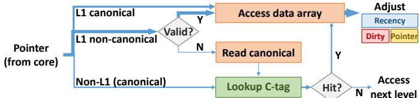

# Rethinking the Memory Hierarchy for Modern Languages 论文解析

## 0. 论文基本信息

**作者 (Authors)**: Po-An Tsai, Yee Ling Gan, Daniel Sanchez

**发表期刊/会议 (Journal/Conference)**: MICRO

**发表年份 (Publication Year)**: 2018

**研究机构 (Affiliations)**: Massachusetts Institute of Technology

______________________________________________________________________

## 1. 摘要

**目的**

- 为 **Java、Go、Rust** 等现代 **memory-safe languages**（内存安全语言）重新设计内存层次结构，以解决传统基于 **flat address space**（扁平地址空间）的缓存层次与这些语言语义不匹配的问题。
- 利用内存安全语言 **隐藏内存布局** 的核心特性，将控制权交给硬件，从而消除对 **associative caches**（关联缓存）的需求，提升性能和能效。

**方法**

- 提出 **Hotpads**，一种全新的硬件管理的内存层次结构，其核心是名为 **pads** 的直接寻址存储器层级，类似于 **scratchpads**（暂存器）。
- Hotpads 的关键特性包括：
    - **Implicit, object-based data movement**（隐式、基于对象的数据移动）：数据移动由内存访问隐式触发。
    - **Pointer rewriting**（指针重写）：硬件自动重写指针，使其指向对象在 L1 pad 中的位置，从而避免后续访问的关联查找。
    - **In-hierarchy object allocation**（层级内对象分配）：新对象直接在 L1 pad 的空闲空间中分配，无需主存后备存储。
    - **Unified hierarchical garbage collection and evictions**（统一的分层垃圾回收与驱逐）：通过 **collection-eviction (CE)** 过程，在回收死对象的同时，将非最近使用的活对象驱逐到下一级 pad。
- 设计了配套的 **Hotpads ISA**，将指针视为 **abstract data types (ADTs)**，禁止程序读取或操作原始指针，并引入 `derefptr`、`seqptr`、`alloc` 等新指令。
- 采用 **canonical levels**（规范层级）和 **canonical tags (c-tags)**（规范标签）等机制来管理对象在层级中的位置和元数据，确保系统正确性。

 *Fig. 4: Example showing Hotpads’s key features.*

**结果**

- 通过详细的模拟器评估，Hotpads 相比传统缓存层次展现出显著优势：
    - **性能**：平均提升 **34%**，最高可达 **86%**。
    - **能效**：内存层次的动态能耗降低 **2.6倍**。
    - **垃圾回收开销**：平均减少 **8倍**。
- 核心优势来源：
    - **L1 pad 效率**：得益于指针重写，**80%** 的 L1 访问为直接访问，使其能效比 L1 缓存高 **2.3倍**。
    - **高效利用片上容量**：以可变大小的对象而非固定大小的缓存行进行管理，提高了利用率。
    - **大幅减少数据移动**：主存流量最高可减少 **6.6倍**。
- 对于不安全的传统程序，Hotpads 的兼容模式仅带来 **4%** 的平均性能损失。

| 指标             | Baseline (Cache) | Hotpads          | 提升/降低 |
| :--------------- | :--------------- | :--------------- | :-------- |
| 平均性能         | 1.0x             | **1.34x**        | **+34%**  |
| 内存层次动态能耗 | 1.0x             | **0.38x**        | **-2.6x** |
| GC 开销          | 11% of time      | **1.5% of time** | **-8x**   |
| Legacy Mode 性能 | 1.0x             | **0.96x**        | **-4%**   |

 *Fig. 14: Simulation results for single-threaded workloads.*

**结论**

- 将内存安全语言“**隐藏内存布局**”的核心思想扩展到硬件层面是可行且高效的。**Hotpads** 通过摒弃传统的扁平地址空间抽象，成功地将 **garbage collection**（垃圾回收）的原则与 **memory hierarchy**（内存层次）的设计相统一。
- Hotpads 不仅在性能和能效上大幅超越了传统缓存，还为未来的内存系统研究开辟了新方向，例如：
    - **Security**（安全性）：通过消除缓存，可有效规避 **Spectre** 和 **Meltdown** 等基于缓存的侧信道攻击。
    - **Isolation**（隔离）：可简化或消除 **Virtual Memory**（虚拟内存）开销，并提供更廉价的性能隔离。
    - **Concurrency and non-volatility**（并发与非易失性）：其多版本存储特性可用于实现 **transactional memory**（事务内存）或加速 **NVM logging**（非易失内存日志）。

______________________________________________________________________

## 2. 背景知识与核心贡献

**研究背景与动机**

- 现代主流编程语言（如 **Java**, **Go**, **Rust**）均为 **memory-safe (内存安全)** 语言，它们通过隐藏底层内存布局、禁止直接指针操作来防止内存错误，并依赖 **Garbage Collection (GC, 垃圾回收)** 进行自动内存管理。
- 然而，当前的计算机体系结构（特别是 **memory hierarchy, 内存层次结构**）仍为 **C**/**Fortran** 等早期语言设计，其核心是维护一个对程序员透明的 **flat address space (平坦地址空间)** 抽象。
- 为了在物理上实现这种抽象，现代系统严重依赖 **associative caches (相联缓存)** 和 **virtual memory (虚拟内存)** 等昂贵的硬件机制，这与内存安全语言的语义存在根本性不匹配，导致了显著的性能和能效开销。

**核心贡献：Hotpads 架构**

- 提出 **Hotpads**，一种为内存安全语言从头设计的全新内存层次结构。其核心思想是将“**隐藏内存布局**”这一软件原则延伸至硬件，彻底摒弃平坦地址空间抽象。
- Hotpads 使用一个由硬件管理的、层级化的 **directly addressed memories (直接寻址存储器)**，作者称之为 **pads (垫)**，替代传统的相联缓存。
- 通过以下四个关键特性实现高效的数据管理和访问：
    - **Implicit, object-based data movement (隐式、基于对象的数据移动)**: 数据移动由内存访问隐式触发，而非显式指令。
    - **Pointer rewriting to avoid associative lookups (指针重写以避免相联查找)**: 硬件在对象被加载到 L1 pad 后，自动重写指向它的指针，使得后续访问变为高效的直接寻址，从而**避免了绝大多数的相联查找**。
    - **In-hierarchy object allocation (层次内对象分配)**: 新创建的对象直接在 L1 pad 的空闲空间中分配，无需预先在主存中分配后备存储。
    - **Unified hierarchical garbage collection and evictions (统一的分层垃圾回收与驱逐)**: 当 pad 空间不足时，触发 **collection-eviction (CE, 收集-驱逐)** 过程。该过程融合了 **tracing GC (追踪式垃圾回收)** 和缓存驱逐逻辑，既能回收死亡对象，又能将存活但非最近使用的对象驱逐到下一级 pad。

 *Fig. 4: Example showing Hotpads’s key features.*

**主要成果与优势**

- **性能与能效**: 在 Java 基准测试中，Hotpads 相比传统缓存层次结构，**平均性能提升 34%**，**内存层次能耗降低 2.6 倍**。
- **GC 开销大幅降低**: 通过硬件并发执行 CE 过程，**GC 开销平均减少了 8 倍**。
- **兼容性**: 提供兼容模式以支持内存不安全的遗留程序，仅带来 **4%** 的平均性能损失。
- **开启新优化方向**: 该架构天然规避了基于缓存的侧信道攻击（如 **Spectre**, **Meltdown**），并为未来的 **security (安全)**、**isolation (隔离)** 和 **concurrency (并发)** 技术提供了新的硬件基础。

______________________________________________________________________

## 3. 核心技术和实现细节

### 0. 技术架构概览

**整体技术架构**

Hotpads 是一种为 **memory-safe languages**（如 Java, Go, Rust）从头设计的新型内存层次结构，其核心思想是将软件中“隐藏内存布局”的原则延伸至硬件，从而摒弃传统的**flat address space**（平坦地址空间）抽象，并用一套由硬件管理的、基于对象的直接寻址内存（称为 **pads**）来替代关联式缓存。

- **基本组成单元 (Pads)**:

    - Hotpads 由一个多层次的 **pads** 组成，每个 pad 类似于一个硬件管理的 **scratchpad**。
    - 每个 pad 内部包含三个主要部分：
        - **Data Array**: 用于存储对象的主数据区，采用**循环缓冲区**组织，包含一个连续的已分配对象块和一个连续的空闲空间块。
        - **Canonical Tags (c-tags) Array**: 一个解耦的、类似 **V-way cache** 的关联式标签存储，用于将对象的**canonical address**（规范地址）映射到其在当前 pad 中的物理地址。
        - **Metadata Arrays**: 包含 per-word 和 per-object 的元数据，例如指针位（标识字是否为指针）、有效/脏位、以及用于驱逐决策的**recency bits**。
    -  *Fig. 3: Pad organization.*

- **核心运行机制**:

    - **隐式、基于对象的数据移动**: 所有数据移动都由硬件在访问时自动触发。当核心访问一个不在 L1 pad 中的对象时，该对象会被完整地复制到 L1 pad 的空闲区域。
    - **指针重写 (Pointer Rewriting)**: 为了规避昂贵的关联式查找，硬件会在对象被复制到 L1 pad 后，自动重写所有指向该对象的指针（包括寄存器和 L1 pad 内的指针），使其直接指向 L1 中的新位置。这使得后续的访问变为高效的**direct access**。
        -  *Fig. 4: Example showing Hotpads’s key features.*
    - **层级内对象分配 (In-hierarchy Allocation)**: 新创建的小对象直接在 L1 pad 的空闲空间中分配，无需在主存中预留后备存储，从而实现极低开销的分配。
    - **统一的层级垃圾回收与驱逐 (Collection-Eviction, CE)**: 当一个 pad 空间不足时，会触发一个类似**moving garbage collection**的过程。该过程同时完成两项任务：
        - **回收 (Collection)**: 识别并释放不可达（dead）对象的空间。
        - **驱逐 (Eviction)**: 将可达但近期未被访问的（live but non-recently accessed）对象驱逐到下一级 pad。
    - **并发执行**: CE 过程与程序执行并发进行，通过一个简单的**alternating-bit protocol**（交替位协议）来保证一致性，仅引入极短的暂停时间（数十个周期）。

- **关键不变性 (Invariants)**:

    - **Invariant 1**: 一个对象始终存在于其**canonical level**（规范层级）。
    - **Invariant 2**: 非 L1 层级的对象指针必须是**canonical**的。
    - **Invariant 3**: 一个对象只能指向与其同级或更高级（离核心更远）的对象。
    - **Invariant 4**: 只有 canonical 对象或 L1 中的对象副本可以作为根（roots）。
    - 这些不变性确保了层级化 CE 的正确性和独立性。

- **指令集架构 (ISA) 支持**:

    - Hotpads ISA 将指针视为**abstract data types (ADTs)**，禁止程序直接读取或操作原始指针值。
    - 引入了新的指令来支持安全的指针操作：
        - `derefptr`: 用于指针解引用，触发指针重写。
        - `ldptr` / `stptr`: 用于加载/存储指针，告知硬件该数据是指针。
        - `seqptr`: 用于安全地比较两个指针是否指向同一对象（即使它们的位模式不同）。
        - `alloc`: 用于在层级内分配新对象。
    -  *TABLE I: HOTPADS ISA.*

- **对复杂场景的支持**:

    - **大对象**: 通过**subobjects**（子对象）机制支持任意大小的对象。大对象被分割成固定大小的块（如 64 字节），按需将子对象缓存到 pads 中。
    - **多核一致性**: 在共享的最高级 pad（如 L3）上实现**object-level MESI coherence**，避免了 false sharing，并利用对象首字中的额外位存储 sharer set。
    - **向后兼容**: 提供**legacy mode**，将传统 C/C++ 程序的整个地址空间视为一个大对象，以支持内存不安全的遗留代码，仅带来约 **4%** 的性能损失。

### 1. 隐式、基于对象的数据移动

**隐式、基于对象的数据移动的实现原理与流程**

- **核心触发机制**：该机制完全由硬件驱动，其唯一触发条件是**内存访问**（memory access）。当处理器核心发起一次对某个对象的访问请求时，硬件会自动检查该对象是否存在于当前层级的 **pad**（例如 L1 pad）中。
- **缺失处理 (Miss Handling)**：
    - 如果目标对象**不在**L1 pad中（即发生“miss”），硬件不会像传统缓存那样去获取一个固定大小的 **cache line**，而是会定位到该对象的**完整数据**。
    - 硬件随后将**整个对象**从其所在位置（可能是更高层级的 L2/L3 pad 或 main memory）**复制**（copy）到 L1 pad 的**空闲空间**（free space）区域。
    - 这个过程对软件完全透明，程序无需执行任何显式的加载（load）或移动（move）指令。

 *Fig. 4: Example showing Hotpads’s key features.*

- **对象边界识别**：为了能够精确地移动整个对象而非固定大小的数据块，Hotpads 需要知道每个对象的边界。这通过两种方式实现：

    - **指针内嵌元数据**：如图 `aa7f421464a9fee508f7ec1751fd796efdee2876a7909da1be9294af99d3053b.jpg` 所示，Hotpads 的指针格式在其高16位中嵌入了**对象大小**（size in words）等元数据。这使得硬件在拿到指针后能立即知道对象的长度。
    - **ISA 指令约束**：Hotpads ISA 规定所有内存访问必须采用 **base+offset** 寻址模式，且 **base** 寄存器必须是一个指向**对象起始地址**的指针。这确保了硬件总能从对象头部开始操作。

- **与传统缓存的关键区别**：

    - **粒度不同**：传统缓存以**固定大小**（fixed-size cache lines）为单位进行数据移动，而 Hotpads 以**可变大小**（variable-size objects）为单位。这避免了因 cache line 内部包含不相关数据而导致的**内部碎片**（internal fragmentation）和**带宽浪费**。
    - **效率提升**：论文评估显示（Fig. 14d），这种基于对象的移动方式显著提高了**片上容量利用率**（on-chip capacity utilization）。L1 pad 的利用率达到 **35%**，而传统 L1 cache 仅为 **29%**。

**在整体架构中的作用与输入输出关系**

- **输入**：来自处理器核心的**内存访问请求**，该请求包含一个**对象指针**（object pointer）和一个**偏移量**（offset）。
- **输出**：
    - **数据**：被访问的对象数据被放置在 L1 pad 中，并完成本次访问。
    - **状态**：L1 pad 的**已分配区域**（allocated region）增长，**空闲空间**（free space）相应减少。同时，会在 **canonical tags **(c-tags) 数组中创建一个新的条目，用于记录该对象的**规范地址**（canonical address）到其在 L1 pad 中的物理地址的映射。
- **核心作用**：
    - **构建高效内存层次**：这是 Hotpads 整个内存层次结构运作的基础。它使得数据能够根据访问热度自动在层级间流动，将热点对象保留在快速的 L1 pad 中。
    - **支撑指针重写**：只有当对象被成功移动到 L1 pad 后，后续的**指针重写**（pointer rewriting）机制才能生效，从而将后续对该对象的访问转化为高效的**直接寻址**（direct access），避免昂贵的关联查找（associative lookup）。
    - **赋能统一垃圾回收**：当 L1 pad 的空闲空间耗尽时，会触发**收集-驱逐**（collection-eviction, CE）过程。CE 过程依赖于 pad 中存放的是完整的、边界清晰的对象，才能准确地遍历对象图、标记存活对象并进行压缩或驱逐。隐式数据移动确保了 CE 过程的操作对象是语义完整的“对象”，而非无意义的“缓存行”。

### 2. 指针重写以避免关联查找

**指针重写机制的核心原理**

- **根本目标**：消除传统缓存中每次内存访问都必须进行的**关联查找 (associative lookup)**，从而降低延迟和能耗。
- **核心洞察**：在**内存安全语言**中，程序员无法直接读取或操作指针的原始地址值，只能对其进行**解引用 (dereference)** 或**比较 (comparison)**。这为硬件在底层透明地修改指针值提供了可能。
- **基本策略**：当一个对象被从高层级（如 L2 pad 或主存）复制到 **L1 pad** 时，硬件会自动将所有指向该对象的指针更新为指向其在 L1 pad 中的新地址。后续对该指针的解引用操作将直接命中 L1 pad，无需任何标签查询。

**算法流程与关键组件**

- **触发时机**：
    - 当核心发起一个内存访问，且其基地址指针（base pointer）指向的对象**不在 L1 pad** 中时。
    - 硬件首先将该对象从其**规范层级 (canonical level)** 复制到 L1 pad 的空闲区域。
- **重写位置**：
    - **寄存器中的指针**：如果访问是由 `ld`/`st` 指令发起，硬件会在数据返回后，将核心寄存器文件中对应的指针值重写为 L1 地址。
    - **L1 pad 内存中的指针**：如果访问是由 `derefptr` 指令发起，硬件在将目标对象 B 加载到 L1 后，会**直接修改 L1 pad 中对象 A 的字段**，将其指向 B 的指针更新为 B 在 L1 中的地址。
- **辅助数据结构**：
    - **规范标签数组 (canonical tags array, c-tags)**：这是一个小型的、类似缓存标签的**组相联结构**。它存储了从对象的**规范地址**到其在当前 pad 层级（如 L1）中物理地址的映射。只有当对象的副本存在于该 pad 时，才需要 c-tag 条目。
    - **指针格式**：Hotpads 指针的高 16 位包含元数据，其中一位是 **canonical bit**，用于标识该指针是否指向对象的规范层级。这使得硬件能快速判断是否需要进行重写或查询 c-tags。

 *Fig. 9: Steps in L1 pad access. Wider arrows denote more frequent events.*

**输入输出关系及在整体架构中的作用**

- **输入**：
    - 一个指向非 L1 对象的指针（通常是一个**规范指针**）。
    - 一次内存访问请求（`ld`/`st` 或 `derefptr`）。
- **输出**：
    - 对于 `ld`/`st`：返回请求的数据，并**重写源寄存器中的指针**。
    - 对于 `derefptr`：返回请求的数据，并**重写 L1 pad 中源对象内的指针字段**。
    - 对象的一个副本被放置在 L1 pad 中。
- **在 Hotpads 架构中的作用**：
    - **性能提升**：通过将昂贵的关联查找（c-tag 查询）从“每次访问”降级为“首次访问”，极大地提升了 L1 访问效率。评估显示，**80% 的 L1 访问**成为直接访问。
    - **能效优化**：直接访问 L1 pad 的动态能耗（**16 pJ**）远低于 L1 缓存命中（**69 pJ**），实现了 **4.3×** 的能效提升。
    - **简化设计**：由于大部分访问变为直接寻址，L1 pad 可以采用更简单的、类似 **scratchpad** 的组织方式，避免了全相联或高相联度缓存的复杂性和面积开销。
    - **与垃圾回收协同**：指针重写确保了在 **collection-eviction (CE)** 过程中移动对象后，所有指向该对象的指针都能被正确更新，维持了系统的正确性。

**效果与局限性**

- **效果显著**：如图所示，指针重写机制成功将 **80%** 的 L1 pad 访问转化为高效的直接访问，这是 Hotpads 相对于传统缓存取得性能和能效优势的关键。

 *Fig. 19: CDFs of lengths and intervals for L1 CEs.*

- **主要局限**：
    - **仅限 L1**：为了简化设计和控制开销，指针重写**只在 L1 pad 执行**。更高层级的 pad（如 L2, L3）仍然需要依赖 c-tags 进行关联查找，但由于 L1 的高命中率，这部分开销对整体影响较小。
    - **依赖 ISA 支持**：需要新的指令（如 `derefptr`, `ldptr`）来明确告知硬件哪些内存操作涉及指针，以便进行正确的重写和元数据管理。

### 3. 层次化垃圾回收与驱逐统一（Collection-Eviction, CE）

**CE过程的触发条件与核心目标**

- **触发条件**：当一个pad的**空闲空间**降至预设的**低阈值**时，会触发一次Collection-Eviction (CE) 过程。
- **核心目标**：CE旨在一次性**回收约75%的pad容量**，通过两个互补的操作实现：
    - **垃圾回收 (Garbage Collection)**: 识别并释放**死亡对象**（即不可达对象）占用的空间。
    - **驱逐 (Eviction)**: 将**存活但非最近访问**的对象移动到下一级pad，以腾出空间给更热的数据。

**CE算法的详细流程**

CE过程在硬件中由一个专用引擎执行，其流程模仿了**移动式垃圾回收器 (moving GC)**，包含四个关键步骤：

- **1. 寻找根指针 (Find roots)**

    - **输入**: 对于L1 pad，根指针是当前位于**核心寄存器**中的所有指向该L1 pad内对象的指针。核心会将这些指针提供给CE引擎。
    - **优势**: 与软件GC需要遍历整个调用栈不同，Hotpads的根查找成本**极低**（仅需几十个周期），因为栈帧本身也被分配在堆（pad）中，无需单独扫描。

- **2. 标记存活对象 (Mark live objects)**

    - 使用标准的**三色标记法 (tricolor mark pass)** 来遍历对象图。
    - 利用对象头部的两个**CE标记位**来记录状态（未扫描、待扫描、已扫描）。
    - 为了加速，使用一个小型**FIFO队列**（实现中为16个条目）来缓存待扫描对象，减少对整个数据阵列的线性扫描。

- **3. 压缩或驱逐存活对象 (Compact or evict live objects)**

    - 引擎再次扫描数据阵列，处理每个被标记为存活的对象。
    - **决策依据**: 检查对象的**4位粗粒度LRU时间戳**（recency bits）。如果对象不在最近访问的**25%容量**内，则被**驱逐**到下一级pad；否则，被**移动**到数据阵列的空闲区域前端，形成一个紧凑的存活对象块。
    - **维护层级不变量**: 在驱逐过程中，必须确保**不变量3**（一个对象只能指向同级或更高级的对象）不被破坏。如果一个被驱逐的对象E指向了另一个仍在L1的存活对象P，且P的**规范层级 (canonical level)** 是L1，那么P的规范层级会被提升到L2，以便E能合法地指向它。 *Fig. 10: Example of an eviction that requires changing the canonical level of a non-evicted object (P).*
    - **构建重命名表**: 在移动/驱逐过程中，引擎会构建一个**重命名表 (rename table)**，记录每个存活对象的旧地址到新地址（或新层级地址）的映射。

- **4. 更新指针 (Update pointers)**

    - 引擎遍历整个数据阵列以及核心寄存器中的所有指针。
    - 对于每一个指向已被移动/驱逐对象的旧指针，查询**重命名表**并将其更新为新的正确地址。
    - 完成后，**重命名表**被丢弃。

**并发执行与空间管理技巧**

- **并发操作**: CE过程与程序执行**并发**进行，通过一个简单的**交替位协议 (alternating-bit protocol)** 实现。指针格式中包含一个**epoch位**，用于区分新旧指针版本，确保在CE期间访问旧指针仍能正确找到对象。
- **双端压缩 (Dual-ended compaction)**: 为了高效地容纳可能很大的重命名表（实现中占pad容量的50%），采用了**双端压缩**策略。 *Fig. 11: Dual-ended compaction example. All objects are 2 words long, except E, which takes 4 words.*
    - 重命名表被放置在旧数据区域的末尾之后。
    - 压缩过程交替从旧区域的**开头**和**末尾**处理对象。
    - 从开头压缩释放的空间用于存放**新的紧凑对象块**。
    - 从末尾压缩释放的空间用于动态增长**重命名表**。

**在整体系统中的作用**

- **统一内存管理**: CE过程是Hotpads设计的核心创新，它**统一了**传统上分离的**缓存驱逐**（基于局部性）和**垃圾回收**（基于可达性）两大机制。
- **利用双重经验法则**: 它同时利用了**局部性原理 (locality principle)** 和**分代假说 (generational hypothesis)**，使得内存层次结构的管理更加智能和高效。
- **显著降低开销**: 通过在硬件中并发、高效地执行CE，Hotpads将**GC开销平均降低了8倍**，这是其整体性能提升34%的关键因素之一。 *Fig. 14: Simulation results for single-threaded workloads.*

### 4. 层级内对象分配

**核心机制与实现原理**

- **直接在L1 pad分配**：Hotpads的`alloc`指令在创建新对象时，会直接在**L1 pad**的**空闲空间 (free space)** 中进行分配。这利用了L1 pad内部采用的**bump pointer allocation**（指针碰撞分配）机制，即新对象被简单地放置在已分配区域的末尾。
- **无需主存后备存储**：与传统系统不同，这些在L1 pad中分配的新对象**不需要预先在主存中分配对应的后备存储空间**。这意味着对象从诞生起就位于最快的存储层级，其首次访问就是一次**L1命中**，避免了昂贵的缓存未命中和主存访问开销。
- **大对象分级处理**：对于超过特定大小阈值的对象，Hotpads会将其分配到更高级别的pad中，以避免耗尽宝贵的L1空间。论文中给出的具体分配策略如下：
    - 尺寸 ≤ 512 B → 分配至 **L1 pad**
    - 512 B < 尺寸 ≤ 4 KB → 分配至 **L2 pad**
    - 4 KB < 尺寸 < 128 KB → 分配至 **L3 pad**
    - 尺寸 ≥ 128 KB → 直接分配至 **Main memory**
- **对象初始化**：分配完成后，对象的**type id**会被写入其第一个字（word），而后续的所有字都会被**清零**，确保对象处于一个干净、可预测的初始状态。

**在整体架构中的作用与优势**

- **消除分配开销**：传统的内存分配（如`malloc`）通常涉及复杂的空闲链表管理或系统调用，而Hotpads的bump-pointer分配是**O(1)常数时间**操作，极大地加速了对象创建过程。
- **提升数据局部性**：新分配的对象天然位于L1，这使得程序在创建对象后立即对其进行初始化和操作时，能获得**最佳的数据局部性**，显著减少内存延迟。
- **降低主存流量**：由于大量短生命周期的对象（尤其是小对象）在其整个生命周期内都只存在于片上pads中，从未“触达”主存，因此**大幅减少了对主存的读写流量**。这一点在评估部分得到了验证，Hotpads相比基线系统将主存能量消耗降低了**4.1倍**。
- **与CE过程协同**：这种分配方式与\*\*Collection-Eviction \*\*(CE) 过程无缝衔接。当L1 pad空间不足时，CE过程会回收已死亡的对象，从而释放出连续的空闲空间供新的`alloc`操作使用，形成了一个高效的、硬件管理的内存循环。

 *Fig. 4: Example showing Hotpads’s key features.*

**关键参数与配置**

| 对象尺寸范围     | 分配目标层级 |
| :--------------- | :----------- |
| ≤ 512 Bytes      | L1 pad       |
| 512 Bytes – 4 KB | L2 pad       |
| 4 KB – 128 KB    | L3 pad       |
| ≥ 128 KB         | Main memory  |

______________________________________________________________________

**输入输出关系**

- **输入**：
    - `alloc`指令接收两个寄存器输入：`rs1`（指定对象大小，单位为word）和`rs2`（指定type id）。
- **输出**：
    - 指令执行后，会在目标pad（通常是L1）的空闲空间中分配一块连续内存。
    - 新分配对象的起始地址（即一个**Hotpads指针**）被写入目标寄存器`rp`。
    - 该指针包含了嵌入的元数据，如对象大小和层级信息（见下图）。

 *Fig. 5: Hotpads pointer format.*

### 5. 规范层级与不变式

**规范层级与不变式的核心机制**

Hotpads 通过引入 **规范层级 (canonical level)** 的概念，并强制执行一组关键的 **不变式 (invariants)**，从根本上解决了在硬件中高效、安全地管理分层内存和指针重写的问题。这一机制是其能够统一垃圾回收（GC）与数据放置、并实现高效指针重写的基础。

- **规范层级 (canonical level) 的定义**:

    - 每个对象都有一个 **规范层级**，它被定义为该对象自创建以来所达到的 **最大层级**。
    - 对象的 **规范地址 (canonical address)** 是其在规范层级中的地址。
    - 规范层级充当了对象的 **“最终存储位置”** 或 **“后备存储”**，类似于传统缓存层次结构中主存的角色，但任何层级都可以成为对象的规范层级。
    - 对象可以在比其规范层级更小的层级（如 L1）中拥有副本，但其规范层级只会随着时间推移而 **单调递增**（即只能被逐出到更高层级，不能降级）。

- **指针格式与元数据**:

    - Hotpads 的指针不仅包含地址，还嵌入了 **元数据**。
    - 如图  *Fig. 5: Hotpads pointer format.* 所示，指针的高 16 位包含对象大小、以及一个 **规范位 (canonical bit)**。
    - **规范位** 用于标识该指针是否指向对象的规范地址。这对于快速判断指针类型和决定是否需要重写至关重要。

**关键不变式及其作用**

系统强制执行四个核心不变式，其中以下两个对于分层管理和指针操作最为关键：

- **不变式 1: 对象始终存在于其规范层级**。

    - 这确保了对象的规范层级是其数据的权威来源，简化了数据获取和一致性维护。

- **不变式 2: 非规范层级的对象副本只能存在于比其规范层级更小的层级中**。

    - 这保证了层级结构的清晰性，防止了数据在层级间的混乱分布。

- **不变式 3: 一个层级的对象只能指向相同或更高层级的对象**。

    - 这是实现 **分层收集-驱逐 (CE)** 过程的关键。它确保了在对某一层级（如 L1）执行 CE 时，无需担心有来自更高层级（如 L2）的指针指向 L1 中即将被移动或驱逐的对象，从而实现了 **层级间的操作独立性**。
    - 当需要驱逐一个对象，而该对象又指向另一个非规范层级（如 L1）的对象时，系统会提升被指向对象的规范层级（例如从 L1 提升到 L2），以维持此不变式。如图  *Fig. 10: Example of an eviction that requires changing the canonical level of a non-evicted object (P).* 所示。

- **不变式 4: 如果一个对象在某个层级有副本，那么该对象本身或其规范副本必须存在于该层级或更高层级**。

    - 这与不变式 3 协同工作，共同保障了 CE 过程的正确性和独立性。

**在整体系统中的作用**

- **简化指针重写**:

    - 由于不变式 3 的存在，指针重写可以安全地 **仅在 L1 层级进行**。因为 L1 中的对象不可能被更高层级的对象引用，重写 L1 中的指针不会破坏其他层级的数据完整性。这使得 L1 能够实现高效的直接寻址，避免了昂贵的关联查找。

- **实现分层的收集-驱逐 (CE)**:

    - 不变式 3 和 4 共同确保了每个 pad 可以 **独立地** 执行 CE 过程，而无需暂停或协调更高层级的操作。这极大地提高了 GC 的并发性和效率，将传统的 stop-the-world GC 开销降至最低。

- **保障内存安全与一致性**:

    - 这套机制在硬件层面强制执行了内存安全规则，防止了悬空指针和非法内存访问。同时，它为对象级别的缓存一致性协议（如 MESI）提供了坚实的基础，因为对象的生命周期和移动路径是受控且可预测的。

______________________________________________________________________

## 4. 实验方法与实验结果

**实验设置**

- **硬件平台**：使用 **MaxSim** 仿真平台，模拟一个 **4-core** 处理器。
- **内存层次结构**：采用三级结构，具体参数见下表。

| Level | Cache/Pads Size | Associativity / Organization         | Block/Subobject Size                 |
| :---- | :-------------- | :----------------------------------- | :----------------------------------- |
| L1    | 64 KB           | 4-way (Cache) / Direct-mapped (Pads) | 8 bytes (access) / 64 bytes (object) |
| L2    | 1 MB            | 8-way                                | 64 bytes                             |
| L3    | 16 MB           | 16-way                               | 64 bytes                             |

- **核心模型**：基于 **Westmere** 的乱序执行核心。
- **ISA 实现**：在 x86 架构上通过未使用的操作码模拟 **Hotpads ISA**，并为物理寄存器添加 **pointer bit** 以区分指针和普通数据。
- **软件栈**：
    - 使用 **Maxine JVM** 作为 Java 虚拟机，并修改其 **C1X JIT compiler** 以生成符合 Hotpads ISA 的代码。
    - **Baseline (缓存系统)**：使用经过调优的 **stop-the-world generational GC**，其中 **young heap size** 设为 **16 MB**（约为 LLC 大小的两倍）。
    - **Hotpads 系统**：在硬件中执行并发的 **Collection-Eviction (CE)** 过程，在软件中对主存执行非分代的 **stop-the-world GC**。主存堆大小与 Baseline 保持一致，以确保公平比较。
- **工作负载**：共 **13** 个 Java 基准测试程序，包括 **10** 个 **DaCapo** 套件、**SPECjbb2005** 以及来自 **JgraphT** 库的 **PageRank** 和 **Coloring**。

**结果数据**

- **性能提升**：
    - **Hotpads** 相比 **Baseline** 平均提升 **34%** 的性能，最高可达 **86%**（在 `lusearch` 上）。
    - 性能提升主要来自两方面：
        - **GC 开销**：从 Baseline 的平均 **11%** 降低到 Hotpads 的 **1.5%**。
        - **应用运行时间**：由于更好的内存性能，减少了 **21%**。
    - 即使与采用了 **DRRIP** 替换策略和 **Nehalem** 流式预取器的增强型缓存基线相比，Hotpads 依然领先 **23%**。
- **能效提升**：
    - **Hotpads** 将内存层次结构的**动态能耗**降低了 **2.6倍**。
    - 能耗降低的主要因素：
        - **L1 pads** 的直接访问能耗极低，比 L1 cache 命中能耗低 **4.3倍**。
        - **主存能耗** 降低了 **4.1倍**。
        - **CE 过程** 的能耗比软件 GC 低 **2.9倍**。
- **内存访问效率**：
    - **平均内存访问时间 (AMAT)** 比 Baseline 低 **4%**。
    - **片上容量利用率**：L1 pads 的利用率为 **35%**，高于 Baseline 缓存的 **29%**。
    - **数据移动量**：主存读写流量最高可减少 **6.6倍**，而仅使用 **cache scrubbing** 技术只能减少 **66%**。
- **多线程性能**：在多线程工作负载上，由于 Maxine GC 本身不是并行的，Hotpads 的性能优势进一步扩大到 **68%**，同时能耗也降低了 **2.7倍**。
- **对传统程序的支持**：在 **legacy mode** 下运行未修改的 **SPEC CPU2006** 程序，Hotpads 仅比传统缓存慢 **4%**，证明了其良好的兼容性。

 *Fig. 14: Simulation results for single-threaded workloads.*

**消融实验与关键机制分析**

- **指针重写 (Pointer Rewriting) 的有效性**：
    - **80%** 的 L1 pad 访问被转化为**直接访问**，从而避免了关联查找。
    - 这是 L1 pads 能效远超 L1 caches 的根本原因。
    -  *Fig. 19: CDFs of lengths and intervals for L1 CEs.*
- **统一垃圾回收与驱逐 (Collection-Eviction, CE) 的开销**：
    - CE 过程非常轻量且并发执行。
    - **L1 CE** 平均持续时间很短，且活跃周期占总周期的比例极小。
    - 尽管 L1 pads 更小导致 CE 触发更频繁，但每次 CE 的成本也非常低（比 L3 CE 便宜约 **1000倍**）。
    -  *Fig. 17: Allocated, evicted, and collected bytes per pad level.*
    -  *Fig. 19: CDFs of lengths and intervals for L1 CEs.*
- **对象粒度 vs. 缓存行粒度**：
    - **对象粒度**的数据移动显著提高了片上存储的利用率（**35% vs 29%**）。
    - 对于短生命周期的对象，Hotpads 能在它们到达主存前就在片上 pads 中完成分配和回收，大幅减少了主存流量。
    -  *Fig. 16: Breakdown of bytes read and written per level.*
- **与现有优化技术的对比**：
    - **Cache Scrubbing** 技术通过在缓存中直接分配新对象和清理死亡对象，将性能提升了 **17%**，能耗降低了 **22%**。
    - **Hotpads** 在此基础上进一步将性能提升了 **15%**，能耗再降低 **2.1倍**，这主要归功于其**硬件管理的 CE 过程**，它从根本上消除了年轻代 GC 的大部分开销。
- **对编译型语言的适用性**：
    - 通过 **GCBench** 案例研究证明，即使对于 C 语言，只要使用 Hotpads ISA，也能获得巨大收益。
    - **Hotpads + Boehm GC** 的性能接近于手动优化的 **Custom Arena Allocator**，同时保持了自动内存管理的简洁性，并实现了最低的内存能耗（比 glibc malloc 低 **4.2倍**）。

______________________________________________________________________
