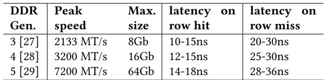
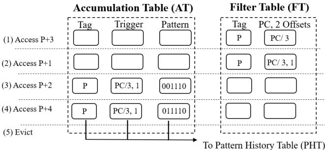
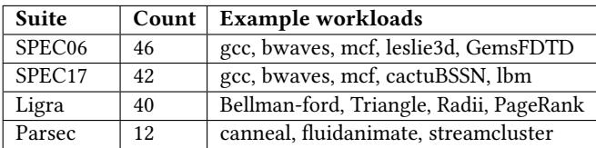
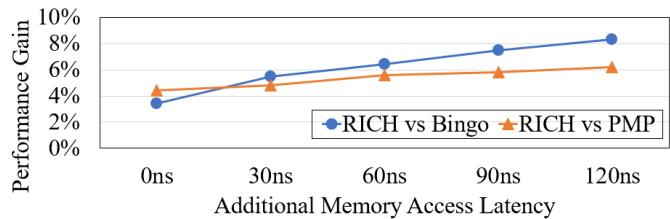

# RICH Prefetcher: Storing Rich Information in Memory to Trade Capacity and Bandwidth for Latency Hiding 图表详解

### Table 1: DDR specifications across generations exhibit the high-bandwidth high-capacity and high-latency trends

- 该图片为论文中的 **Table 1**，标题明确指出其展示的是 **DDR 规格在不同代际间的演进趋势**，核心聚焦于 **高带宽、大容量与高延迟** 的并存现象。
- 表格横向列出四列关键指标：**DDR Gen.（代际）**、**Peak speed（峰值速度）**、**Max. size（最大容量）**、**latency on row hit（行命中延迟）** 和 **latency on row miss（行未命中延迟）**。
- 纵向对比三代主流 DDR 标准：**DDR3 [27]**、**DDR4 [28]**、**DDR5 [29]**，清晰呈现技术迭代路径。

| DDR Gen. | Peak speed | Max. size | latency on row hit | latency on row miss |
| -------- | ---------- | --------- | ------------------ | ------------------- |
| 3 [27]   | 2133 MT/s  | 8Gb       | 10-15ns            | 20-30ns             |
| 4 [28]   | 3200 MT/s  | 16Gb      | 12-15ns            | 25-30ns             |
| 5 [29]   | 7200 MT/s  | 64Gb      | 14-18ns            | 28-36ns             |

- **峰值速度** 从 DDR3 的 2133 MT/s 跃升至 DDR5 的 7200 MT/s，增长超过 **三倍**，体现 **高带宽** 趋势。
- **最大容量** 从 8Gb 增至 64Gb，同样实现 **八倍提升**，印证 **大容量** 发展方向。
- **访问延迟** 指标同步上升：**行命中延迟** 从 10-15ns 增至 14-18ns，**行未命中延迟** 从 20-30ns 扩展至 28-36ns，表明 **高延迟** 成为伴随性能提升的代价。
- 该表格作为背景支撑，旨在说明现代内存系统设计中 **带宽与容量提升以牺牲延迟为代价** 的普遍规律，为论文提出的 RICH prefetcher 针对高延迟场景优化提供必要性依据。

### Figure 1: Different workloads favor distinct spatial region sizes for prefetching; approximately half achieve peak performance under conventional 4 KB regions,while the remainder achieve peak performance with larger spatial region sizes

- 图片为一个环形图，标题为“Figure 1: Different workloads favor distinct spatial region sizes for prefetching; approximately half achieve peak performance under conventional 4 KB regions, while the remainder achieve peak performance with larger spatial region sizes”，旨在展示不同工作负载在预取时对空间区域大小的偏好。
- 图表中心标注“Percentage of optimal spatial prefetch region sizes:”，表明其统计的是各区域尺寸作为最优预取单元的占比。
- 图例清晰对应六种区域尺寸：**1KB**、**2KB**、**4KB**、**8KB**、**16KB**、**32KB**，分别以不同颜色区分。
- 各区域尺寸对应的百分比如下表所示：

| 区域尺寸 | 占比  |
| -------- | ----- |
| 1KB      | 7.1%  |
| 2KB      | 24.3% |
| 4KB      | 22.1% |
| 8KB      | 12.1% |
| 16KB     | 25.7% |
| 32KB     | 8.6%  |

- 数据显示，**4KB**区域虽是传统主流选择，但仅占**22.1%**，不足四分之一；而**16KB**区域占比最高，达**25.7%**，成为最常被选为最优预取尺寸的工作负载。
- **2KB**和**16KB**合计占比**50%**，印证了原文“approximately half achieve peak performance under conventional 4 KB regions, while the remainder achieve peak performance with larger spatial region sizes”的结论。
- 该图直观揭示了单一固定区域尺寸（如4KB）无法满足多样化的访问模式需求，支持论文中提出多尺度区域预取的设计动机。

### Figure 2: The multi-offset trigger mechanism can distinguish "common-origin, later-divergent" access streams

- 图片展示了 **multi-offset trigger mechanism** 如何区分具有“共同起点、后期发散”特征的访问流，这是传统单偏移触发机制无法做到的。
- 左侧图示为 **single-offset trigger mechanism** 的局限性：在 4 KB 空间区域内，两个访问流 A 和 B 均从地址 0x1 开始访问，但后续路径不同（A 访问 0x4, 0xc；B 访问 0xc, 0x1），单偏移机制仅凭首个偏移量无法区分二者，导致误预测。
- 右侧图示为 **multi-offset trigger mechanism** 的优势：通过记录多个访问偏移（如 0x1 和 0x4 对应流 A，0x1 和 0xc 对应流 B），系统可识别出两个流虽起始相同，但后续行为不同，从而分别建模并准确预测。
- 该机制的核心在于利用 **多偏移信息** 验证访问模式的连续性和方向性，避免将“common-origin, later-divergent”流错误归类为同一模式。
- 图中明确标注了两个访问流的具体地址序列：
    - 流 A 地址：**0x1, 0x4, 0xc**
    - 流 B 地址：**0x1, 0xc, 0x4**
- 此设计直接支持 RICH prefetcher 中对 16 KB 区域采用 (PC, 5 offsets) 触发策略，以提升大区域预取的准确性，同时牺牲部分覆盖率换取高精度。

| 机制类型      | 能否区分流 A/B | 核心依据                                      | 缺陷/优势                            |
| ------------- | -------------- | --------------------------------------------- | ------------------------------------ |
| Single-offset | ❌ 不能        | 仅依赖首个访问偏移（0x1）                     | 无法捕捉后续发散行为，易产生误预测   |
| Multi-offset  | ✅ 能          | 依赖多个访问偏移组合（如 0x1+0x4 vs 0x1+0xc） | 提升准确性，尤其适用于大区域预取场景 |

- 该图是 RICH 设计中 **Insight 2** 的直观体现，即“观察更多访问偏移可提高准确性，代价是降低覆盖率”，为后续多尺度区域仲裁机制奠定基础。

### Figure 3: By using more access offsets in a trigger, we can trade off between the accuracy and coverage of prefetching. Specifically, a), b),and c) correspond to 16 KB-region, 4 KBregion, and 2 KB-region.

- 图片展示了在不同空间区域大小（16 KB、4 KB、2 KB）下，使用不同数量的访问偏移量（offsets）作为触发条件时，预取器的 **Accuracy**（准确率）、**Coverage**（覆盖率）和 **Timeliness**（及时性）三者之间的权衡关系。

- 三个子图分别对应：

    - **a) 16 KB-region**：随着触发条件中包含的偏移量从 (PC,1 offset) 增加到 (PC,10 offsets)，**Accuracy** 从约50%显著上升至接近100%，而 **Coverage** 则从约50%持续下降至约20%，**Timeliness** 基本保持稳定在75%-80%区间。
    - **b) 4 KB-region**：随着偏移量从 (PC,1 offset) 增加到 (PC,8 offsets)，**Accuracy** 从约65%上升至约95%，**Coverage** 从约60%下降至约25%，**Timeliness** 稍有下降但仍维持在75%左右。
    - **c) 2 KB-region**：随着偏移量从 (PC,1 offset) 增加到 (PC,8 offsets)，**Accuracy** 从约65%上升至约95%，**Coverage** 从约60%下降至约25%，**Timeliness** 略有波动但基本稳定在70%以上。

- 数据趋势总结如下：

| 区域大小 | Accuracy 趋势 | Coverage 趋势 | Timeliness 趋势 |
| -------- | ------------- | ------------- | --------------- |
| 16 KB    | **显著上升**  | **显著下降**  | 基本稳定        |
| 4 KB     | 上升          | 下降          | 略降            |
| 2 KB     | 上升          | 下降          | 基本稳定        |

- 核心结论：
    - 增加触发条件中的访问偏移量可有效提升 **Accuracy**，尤其在大区域（如16 KB）中效果显著，能将准确率从不足50%提升至90%以上。
    - 代价是 **Coverage** 显著降低，因为更严格的触发条件导致更少的预取机会被激活。
    - **Timeliness** 受影响较小，表明该机制主要影响预测是否发生，而非预测时机。
    - RICH设计据此采用差异化策略：对16 KB区域采用\*\*(PC,5 offsets)**以追求高精度，对4 KB区域采用**(PC,3 offsets)**平衡精度与覆盖，对2 KB区域保留**(PC,1 offset)**或**(PC,address)\*\*以最大化覆盖。

### 24623341e46f13ed9c6004980d11054a104d928f1085abdd3d49c538fd7c2597.jpg

- 图片展示了 RICH 预取器在不同区域大小和触发机制下的 **Accuracy**（准确率）与 **Coverage**（覆盖率）对比，直观呈现了其多尺度设计的核心权衡策略。

- 数据以柱状图形式呈现，蓝色代表 Accuracy，橙色代表 Coverage，横轴为四种不同的预取配置：

    - 16 KB-region (PC, 5 offsets)
    - 4 KB-region (PC, 3 offsets)
    - 2 KB-region (PC, offset)
    - 2 KB-region (PC, address)

- 各配置性能数据如下表所示：

| 配置                         | Accuracy   | Coverage   |
| :--------------------------- | :--------- | :--------- |
| 16 KB-region (PC, 5 offsets) | **约 90%** | **约 30%** |
| 4 KB-region (PC, 3 offsets)  | **约 85%** | **约 40%** |
| 2 KB-region (PC, offset)     | **约 65%** | **约 60%** |
| 2 KB-region (PC, address)    | **约 90%** | **约 10%** |

- 分析表明，RICH 的设计实现了明确的性能取舍：

    - **大区域（16KB）**：采用 (PC, 5 offsets) 触发，追求 **高准确率**（~90%），但牺牲了部分覆盖率（~30%），适用于对误预取代价敏感的场景。
    - **中区域（4KB）**：采用 (PC, 3 offsets) 触发，在准确率（~85%）和覆盖率（~40%）之间取得平衡。
    - **小区域（2KB）**：采用 (PC, offset) 触发，优先保证 **高覆盖率**（~60%），准确率相对较低（~65%），用于捕捉更广泛的访问模式。
    - **特殊小区域（2KB）**：采用 (PC, address) 触发，其准确率与 16KB 区域相当（~90%），但覆盖率极低（~10%），因其触发条件苛刻（需精确地址匹配），主要用于特定高精度需求。

- 此图表是 RICH 设计哲学的直接体现：通过 **多级触发机制** 和 **区域仲裁策略**，动态选择最优预取粒度，从而在整体上实现 **高准确率、高覆盖率和高及时性** 的协同优化。

### Figure 4: Achieving high accuracy in large spatial regions and high coverage in small spatial regions by using different numbers of trigger offsets Figure 5: Placing 16 KB PHT off-chip keeps most prefetch opportunities, even with additional memory access latency

- 图表标题为 **Figure 5**，其核心结论是：将 **16 KB PHT** 放置在片外（off-chip）仍能保留大部分预取机会，即使存在额外的内存访问延迟。
- 横轴表示 **Additional Memory Access Latency**，从 0 ns 到 50 ns，以 10 ns 为步长递增，模拟未来高延迟内存系统场景。
- 纵轴表示 **Late Prefetches**，即“迟到预取”的比例，范围从 5% 到 20%，衡量因元数据加载延迟导致预取请求未能及时完成的比例。
- 数据趋势显示，随着额外延迟增加，**Late Prefetches** 比例呈缓慢上升趋势：
    - 在 0 ns 延迟时，约为 **11%**。
    - 在 50 ns 延迟时，上升至约 **15%**。
- 这表明即使引入高达 50 ns 的额外延迟，**RICH prefetcher** 仍能维持超过 **85%** 的预取机会未被浪费，验证了其对延迟的容忍能力。
- 此设计策略有效平衡了 **on-chip area overhead** 与 **off-chip latency penalty**，通过将大区域模式（16 KB-region patterns）卸载到主存，显著节省芯片面积，同时性能损失可控。
- 该结果支撑论文中提出的 **hierarchical storage design**，即高频模式保留在片上缓存，低频模式存储于片外，实现成本与性能的最优折衷。

| Additional Memory Access Latency | Late Prefetches (%) |
| -------------------------------- | ------------------- |
| 0 ns                             | ~11%                |
| 10 ns                            | ~12%                |
| 20 ns                            | ~12.5%              |
| 30 ns                            | ~13.5%              |
| 40 ns                            | ~14%                |
| 50 ns                            | ~15%                |

### Table 2: Categorization of RICH's metadata

- **Table 2** 对 RICH prefetcher 的元数据进行了系统性分类，依据三个核心维度：**Area overheads**、**Access frequency** 和 **Latency tolerance**，并据此决定其存储位置（on-chip/off-chip）。

- 元数据被划分为四类：

    - **Large region’s patterns** (16 KB-region)
    - **Small region’s patterns** (4 KB & 2 KB-region)
    - **Training metadata**
    - **Control metadata**

- 各类元数据的特性与 RICH 的决策如下表所示：

| 元数据类别              | Area overheads      | Access frequency | Latency tolerance | RICH’s structures                               | RICH’s decision                                                         |
| ----------------------- | ------------------- | ---------------- | ----------------- | ----------------------------------------------- | ----------------------------------------------------------------------- |
| Large region’s patterns | **high (> 100 KB)** | mixed            | **high**          | 16 KB-region PHT Cache, 16 KB-region PHT        | Frequently accessed: **on-chip** Infrequently accessed: **off-chip** |
| Small region’s patterns | medium (~30 KB)     | mixed            | low               | 4 KB-region PHT, 2 KB-region PHT                | **on-chip**                                                             |
| Training metadata       | low (< 10 KB)       | **high**         | low               | FTs, ATs                                        | **on-chip**                                                             |
| Control metadata        | low (< 10 KB)       | **high**         | low               | Inflight Prefetch Table, 16 KB-region Valid Map | **on-chip**                                                             |

- 关键设计洞察：
    - **大区域模式**因面积开销巨大且对延迟容忍度高，采用**分层存储**：高频访问部分缓存在片上（PHT Cache），低频部分卸载至片外主存，以平衡性能与成本。
    - **小区域模式**、**训练元数据**和**控制元数据**均因访问频率高或对延迟敏感，被强制部署在**片上**，确保快速响应。
    - 此分类策略是 RICH 实现“用容量和带宽换延迟隐藏”核心思想的关键支撑，有效规避了传统预取器受限于片上资源的瓶颈。

### Table 3: Cover ratio under a 2oo-entry storage constraint of 16 KB-region patterns

- 该图片为论文中的 **Table 3**，标题为 “Cover ratio under a 200-entry storage constraint of 16 KB-region patterns”，用于评估在仅保留 **200个条目** 的存储限制下，RICH prefetcher 对 **16 KB-region patterns** 的覆盖能力。
- 表格展示了8个代表性工作负载（traces）的覆盖比例（% Covered），这些工作负载在使用16 KB区域预取时能获得显著性能收益。
- 数据表明，在有限的200个条目缓存容量下，RICH仍能对多数工作负载实现高覆盖率，验证了其 **分层存储策略** 的有效性。

| Trace          | % Covered  |
| -------------- | ---------- |
| bwaves-891     | **100.0%** |
| gcc-1850       | **93.7%**  |
| mcf-782        | **90.4%**  |
| mcf-1152       | **86.7%**  |
| bwaves-2609    | **80.5%**  |
| fotonik3d-7084 | **66.9%**  |
| roms-1070      | **38.7%**  |
| roms-294       | **32.8%**  |

- 覆盖率最高的工作负载是 **bwaves-891**，达到 **100%**，说明其16 KB区域访问模式高度集中，少量高频模式即可完全覆盖。
- 覆盖率最低的是 **roms-294** 和 **roms-1070**，分别为 **32.8%** 和 **38.7%**，表明这些工作负载的访问模式更分散，需要更多条目才能有效覆盖。
- 此结果支持论文中提出的观点：16 KB区域模式具有 **混合频率分布**，因此采用 **分层存储**（高频模式放片上缓存，低频模式放片外内存）是合理且高效的。

### Figure 6: Architecture of RICH

- 图片展示了 **RICH Prefetcher** 的完整架构，分为 **On-chip** 和 **Off-chip** 两大模块，通过清晰的数据流和控制流连接。
- **On-chip 部分** 包含三个核心组件：**Training Unit**、**Pattern Storage**（即 PHTs）和 **Prediction Unit**，并辅以 **Region Arbitration** 和 **Control Units**。
- **Training Unit** 负责从 L2 cache miss/hit 事件中捕获访问模式，为 16 KB、4 KB 和 2 KB 三个区域分别维护 **Filter Table (FT)** 和 **Accumulation Table (AT)**，用于过滤噪声并累积位向量模式。
- **Pattern Storage** 中，2 KB 和 4 KB 区域的 **PHT** 完全驻留在芯片上；而 16 KB 区域采用 **分层设计**，仅保留一个小型 **PHT Cache** 在片上，作为主存中完整 **16 KB-region PHT** 的缓存。
- **Prediction Unit** 是触发预测的核心，包含三个 **Lookup Units**，分别对应不同区域大小。它们根据 (PC, address) 或 (PC, offsets) 等触发条件查询对应的 PHT。
- **Region Arbitration** 单元负责解决多区域同时触发时的优先级问题，并与 **Inflight Prefetch Table** 协作，避免对同一内存空间的重复或重叠预取。
- **Control Units** 专门管理 16 KB 区域的元数据读写，包括与 **Valid Map** 单元协同判断离线模式是否存在，以及异步发起对主存的元数据加载请求。
- **Off-chip 部分** 主要由 **Main Memory** 构成，其中存储了完整的 **16 KB-region PHT** 数组。当片上缓存未命中且 Valid Map 标记有效时，会触发对主存的访问。
- 数据流向明确：L2 cache 的访问事件驱动 Training Unit 和 Lookup Units；Prediction Unit 的输出经 Region Arbitration 后进入 **Prefetch Buffer**，再通过 **TLB** 发送至 **LLC** 和 **Main Memory**。
- 整体架构体现了 **“用容量和带宽换延迟”** 的设计理念，将大量不常访问的 16 KB 模式卸载到主存，同时利用片上高速缓存保证关键路径的低延迟。
- 关键术语如 **PHT**, **FT**, **AT**, **TLB**, **LLC**, **Valid Map**, **Inflight Prefetch Table** 均在图中清晰标注，符合论文描述。

| 组件名称                          | 所属模块 | 功能简述                                       |
| :-------------------------------- | :------- | :--------------------------------------------- |
| Training Unit                     | On-chip  | 从 L2 访问事件中学习并构建各区域的位向量模式。 |
| 16 KB-region PHT Cache            | On-chip  | 片上缓存，存储高频访问的 16 KB 区域模式。      |
| 4 KB-region PHT / 2 KB-region PHT | On-chip  | 存储对应区域的访问模式，完全驻留片上。         |
| Lookup Units                      | On-chip  | 根据触发条件查询 PHT，生成预取请求。           |
| Region Arbitration                | On-chip  | 解决多区域冲突，选择最优预取方案。             |
| Inflight Prefetch Table           | On-chip  | 记录正在进行的预取，防止重叠。                 |
| 16 KB-region Control              | On-chip  | 管理 16 KB 区域元数据的离线读写。              |
| Valid Map                         | On-chip  | 标记主存中哪些 16 KB 模式是有效的。            |
| 16 KB-region PHT (Main Memory)    | Off-chip | 存储所有 16 KB 区域模式的主数组。              |
| Prefetch Buffer                   | On-chip  | 缓冲待发出的预取流。                           |
| TLB                               | On-chip  | 处理虚拟地址到物理地址的转换。                 |
| LLC / Main Memory                 | Off-chip | 最终执行预取操作的目标存储层级。               |

### Figure 7: Training process of each region

- 图片展示了 RICH 预取器中每个区域（2KB、4KB、16KB）的**训练过程**，核心机制基于 **Filter Table (FT)** 和 **Accumulation Table (AT)** 两个表协同工作。

- 训练流程以一个 (PC, 2 offsets) 触发器为例，图中用编号 (1) 到 (5) 标示了关键步骤：

    - **(1) 初始访问 P+3**：当程序首次访问某个区域内的偏移量 3 时，该信息被记录在 FT 中，但此时不启动模式学习。
    - **(2) 第二次访问 P+1**：后续访问偏移量 1，FT 再次记录。此时系统仍处于“过滤”阶段，等待更多不同偏移量来确认访问模式的有效性。
    - **(3) 第三次访问 P+2**：当观察到第三个不同的偏移量（此处为 2）时，FT 条目被“提升”至 AT。AT 初始化一个位向量（Pattern），并开始记录所有已访问的偏移量。
    - **(4) 后续访问 P+4**：随着更多访问发生（如偏移量 4），AT 持续更新其位向量，将新访问的偏移位置位（例如，从 `001110` 更新为 `011110`）。
    - **(5) 区域驱逐**：当该区域被 L2 缓存驱逐或 AT 达到容量上限时，最终形成的完整模式会被传输至 **Pattern History Table (PHT)** 用于后续预测。

- 下表总结了 FT 和 AT 在各步骤中的状态变化：

| 步骤 | Filter Table (FT) 状态  | Accumulation Table (AT) 状态                      |
| ---- | ----------------------- | ------------------------------------------------- |
| (1)  | 记录 PC 和偏移量 3      | 无条目                                            |
| (2)  | 记录 PC 和偏移量 3、1   | 无条目                                            |
| (3)  | 将 PC/3,1 条目提升至 AT | 创建新条目，Tag=P，Trigger=PC/3,1，Pattern=001110 |
| (4)  | 保持不变                | 更新 Pattern 为 011110                            |
| (5)  | 保持不变                | 将最终 Pattern 传输至 PHT                         |

- 关键设计点：
    - **多偏移触发机制**：通过要求至少观察到多个不同偏移量（如 2 或 5 个），有效过滤掉噪声访问，确保只有稳定的空间局部性模式才被学习。
    - **分阶段学习**：FT 负责初步筛选，AT 负责精确建模，这种分离设计降低了硬件复杂度和误学习风险。
    - **LRU 替换策略**：三个区域的 PHT 均采用 LRU 策略管理条目，保证常用模式优先保留。
    - **触发器定义**：触发器由程序计数器 (PC) 和一组偏移量组成，是识别特定访问模式的关键标识符。

### Figure 8: The Region Arbitration unit selects the appropriate region to prefetch (Step P3)

- **Region Arbitration** 单元负责在多个可能触发的预取区域中选择最优的一个，以避免重复或冲突的预取操作。

- 该单元接收来自 **2KB、4KB 和 16KB PHTs** 的查找命中信号作为输入，启动优先级仲裁流程。

- **Priority Selection** 模块根据预定义的优先级顺序决定哪个区域应被选中：

    - 最高优先级：**2KB by (PC, address)**
    - 其次：**16KB**
    - 再次：**4KB**
    - 最低：**2KB by (PC, offset)**

- 选定区域后，系统会检查其是否与任何**更高优先级的 Inflight Prefetch Region** 存在重叠：

    - 若存在重叠（Y），则当前请求被 **Ignored**，防止冗余预取。
    - 若无重叠（N），则允许生成预取请求并送入 **Prefetch Buffer**。

- **Inflight Prefetch Table** 用于跟踪当前正在执行的预取任务，包含以下字段：

    | Region number | Number of prefetches left | Region type          |
    | ------------- | ------------------------- | -------------------- |
    | 0x70          | 15                        | 2KB by (PC, address) |
    | 0x60          | 64                        | 16KB                 |
    | ...           | ...                       | ...                  |

- 表格中的条目会随着预取进度动态更新，当 “Number of prefetches left” 归零时，对应条目被移除。

- 此机制确保了预取行为既高效又不浪费带宽，尤其在多尺度区域同时活跃时，能有效协调资源分配。

### Table 4: Breakdown of on-chip storage overheads

- **Table 4** 详细列出了 RICH prefetcher 的片上存储开销分解，涵盖多个核心组件的位宽、条目数和总存储容量。
- 各结构的存储开销如下表所示：

| Structure               | Width (bits) | Size (entries) | Storage (KB) |
| ----------------------- | ------------ | -------------- | ------------ |
| FTs (2, 4, 16 KB)       | 64, 64, 90   | 64, 64, 64     | 1.7          |
| ATs (2, 4, 16 KB)       | 91, 106, 312 | 128, 128, 32   | 4.3          |
| PHTs (2, 4 KB)          | 43, 71       | 4096, 1024     | 30.4         |
| 16 KB-region PHT Cache  | 271          | 256            | 8.5          |
| Inflight Prefetch Table | 48           | 6              | 0.05         |
| 16 KB-region Valid Map  | 1            | 4096           | 0.5          |
| Prefetch Buffer         | 48           | 320            | 1.9          |
| **Total**               | —            | —              | **47.3**     |

- **FTs (Filter Tables)**：用于过滤噪声模式，针对 2 KB、4 KB 和 16 KB 区域分别配置，总占用 **1.7 KB**。
- **ATs (Accumulation Tables)**：用于累积访问足迹以构建预取模式，其位宽随区域增大而增加，总占用 **4.3 KB**。
- **PHTs (Pattern History Tables)**：存储学习到的访问模式，2 KB 和 4 KB 区域的 PHT 占用 **30.4 KB**，是主要开销来源。
- **16 KB-region PHT Cache**：作为片上缓存，仅保留高频模式，256 条目占用 **8.5 KB**。
- **Inflight Prefetch Table**：追踪正在进行的预取请求，6 条目仅占 **0.05 KB**。
- **16 KB-region Valid Map**：标记哪些 16 KB 模式存在于片外，4096 位（即 512 字节）占用 **0.5 KB**。
- **Prefetch Buffer**：缓冲预取请求，320 条目占用 **1.9 KB**。
- 总体来看，RICH 的片上存储开销为 **47.3 KB**，显著低于 Bingo 的 127 KB，体现了其在面积效率上的优势。

### Table 5: Simulated system

- 该表格详细列出了论文中用于评估 RICH prefetcher 的模拟系统配置，涵盖了从核心微架构到主存的各个层级。

- 核心（Core）部分描述了处理器的前端和执行单元：

    - **8-wide fetch** 和 **6-wide decode/dispatch** 表明其具备宽发射能力。
    - 拥有 **512-entry ROB**（Reorder Buffer）和 **192/114-entry LQ/SQ**（Load/Store Queue），支持大量乱序指令。
    - 采用 **Perceptron branch predictor**，并设定 **17-cycle misprediction penalty**，反映其分支预测机制及惩罚开销。

- 一级缓存（L1 Cache）分为指令缓存（L1-I）和数据缓存（L1-D）：

    - **L1-I Cache**：私有，容量为 **32KB**，组织方式为 **8-way set associative**，行大小 **64B**，往返延迟 **4 cycles**，拥有 **8 MSHRs**（Miss Status Holding Registers）。
    - **L1-D Cache**：私有，容量为 **48KB**，组织方式为 **12-way set associative**，行大小 **64B**，往返延迟 **5 cycles**，拥有 **16 MSHRs**。

- 二级缓存（L2 Cache）配置如下：

    - 私有，容量为 **1.25MB**，组织方式为 **20-way set associative**，行大小 **64B**，往返延迟 **15 cycles**，拥有 **48 MSHRs**。

- 最后一级缓存（LLC, Last Level Cache）：

    - 容量为 **3MB/core**，组织方式为 **12-way set associative**，行大小 **64B**，往返延迟 **55 cycles**，拥有 **64 MSHRs**。

- 主存（Main Memory）配置根据通道数不同而异：

    - **1C (Single Channel)**：单通道，每通道 **1 rank**。
    - **4C (Dual Channel)**：双通道，每通道 **2 ranks**。
    - 使用 **DDR5-4800 MTPS** 内存标准，每通道数据总线宽度为 **64-bit**。
    - 关键时序参数：**tRCD = tRP = tCAS = 16.6ns**，这些参数直接影响内存访问延迟。

| 组件        | 配置详情                                                                                                                                  |
| ----------- | ----------------------------------------------------------------------------------------------------------------------------------------- |
| Core        | 8-wide fetch, 6-wide decode/dispatch, 512-entry ROB, 192/114-entry LQ/SQ, Perceptron branch predictor with 17-cycle misprediction penalty |
| L1-I Cache  | Private, 32KB (8-way, 64B line), 4-cycle round-trip latency, 8 MSHRs                                                                      |
| L1-D Cache  | Private, 48KB (12-way, 64B line), 5-cycle round-trip latency, 16 MSHRs                                                                    |
| L2 Cache    | Private, 1.25MB (20-way, 64B line), 15-cycle round-trip latency, 48 MSHRs                                                                 |
| LLC         | 3MB/core (12-way, 64B line), 55-cycle round-trip latency, 64 MSHRs                                                                        |
| Main Memory | 1C: Single channel, 1 rank/channel; 4C: Dual channel, 2 ranks/channel. DDR5-4800 MTPS, 64-bit data bus per channel, tRCD=tRP=tCAS=16.6ns  |

- 整体来看，该模拟系统基于现代高性能处理器设计，特别是参考了 Intel Alder Lake 的性能核心（P-Core）架构，旨在真实反映当前主流硬件环境下的 prefetcher 性能表现。

### Table 6: Comparison of area overheads

- 该图片为论文中的 **Table 6: Comparison of area overheads**，用于对比不同硬件预取器（prefetcher）的存储开销。
- 表格横向列出五种预取器：**Bingo**、**PMP**、**SPP-PPF**、**SMS** 和 **RICH**。
- 各预取器对应的面积开销如下：

| Prefetcher | Area Overhead                        |
| ---------- | ------------------------------------ |
| Bingo      | **127.8 KB**                         |
| PMP        | **4.3 KB**                           |
| SPP-PPF    | **48.4 KB**                          |
| SMS        | **116.6 KB**                         |
| RICH       | **47.3 KB on-chip, 128 KB off-chip** |

- **RICH** 的设计采用分层存储策略：将高频访问模式保留在片上（on-chip），低频模式卸载至片外主存（off-chip），从而在控制总开销的同时提升性能。
- 相较于 **Bingo** 和 **SMS** 等传统预取器，**RICH** 的片上开销显著降低（从 127.8 KB / 116.6 KB 降至 47.3 KB），但通过引入 128 KB 片外存储换取更丰富的元数据支持。
- **PMP** 虽然片上开销最小（仅 4.3 KB），但其覆盖度和及时性受限，性能不及 RICH。
- **SPP-PPF** 开销居中（48.4 KB），但其基于 delta 序列的机制在高带宽场景下扩展性不足。
- 此表凸显 **RICH** 在“性能-开销”权衡上的创新：以可控的片外存储代价，换取更优的预取准确率与覆盖范围。

### Table 7: Workloads used for evaluation

- 该图片为论文中的 **Table 7**，标题为 “Workloads used for evaluation”，用于说明实验所使用的基准测试集构成。
- 表格包含三列：**Suite**（测试套件）、**Count**（工作负载数量）、**Example workloads**（示例工作负载）。
- 具体数据如下：

| Suite  | Count | Example workloads                       |
| ------ | ----- | --------------------------------------- |
| SPEC06 | 46    | gcc, bwaves, mcf, leslie3d, GemsFDTD    |
| SPEC17 | 42    | gcc, bwaves, mcf, cactuBSSN, lbm        |
| Ligra  | 40    | Bellman-ford, Triangle, Radii, PageRank |
| Parsec | 12    | canneal, fluidanimate, streamcluster    |

- 所有工作负载均来自主流基准测试集，包括 **SPEC CPU 2006**、**SPEC CPU 2017**、**Ligra** 和 **Parsec**。
- 实验中排除了 L2 缓存每千条指令缺失率（MPKI）低于 2 的工作负载，因其受内存延迟影响较小。
- 总计使用 **140+** 个 trace 进行单核性能评估，涵盖计算密集型、图处理和多线程应用等多种场景。

### Figure 9: RICH outperforms Bingo across four benchmark suites on a single-core system

- 图片展示了在单核系统下，RICH 预取器与其他四种预取器（SPP-PPF、SMS、Bingo、PMP）在四个基准测试套件（SPEC17、SPEC06、Ligra、Parsec）上的性能对比，以“无预取”为基准（1.0），衡量各预取器带来的加速比。
- **RICH 在所有四个基准套件中均取得最高加速比**，验证了其设计在多类工作负载下的普适性优势。
- 各基准套件具体表现如下：

| 基准套件 | SPP-PPF | SMS   | Bingo | PMP   | RICH      |
| -------- | ------- | ----- | ----- | ----- | --------- |
| SPEC17   | ~1.15   | ~1.20 | ~1.20 | ~1.22 | **~1.28** |
| SPEC06   | ~1.40   | ~1.48 | ~1.45 | ~1.48 | **~1.55** |
| Ligra    | ~1.35   | ~1.38 | ~1.38 | ~1.39 | **~1.43** |
| Parsec   | ~1.05   | ~1.08 | ~1.07 | ~1.08 | **~1.10** |

- 在 **GEOMEAN（几何平均）** 汇总指标上，RICH 达到约 **1.40**，显著领先于 Bingo（~1.35）和 PMP（~1.36），表明其综合性能最优。
- 从图中可见，**Bingo 和 PMP 性能接近**，但 RICH 始终超越二者；SPP-PPF 在 SPEC06 上表现突出，但在其他套件中相对落后。
- 此图直接支持论文核心结论：RICH 在单核环境下平均优于 Bingo **3.4%**，体现了其多区域、多触发机制在实际负载中的有效性。

### Figure 10: RICH improves coverage and timeliness while maintaining comparable accuracy

- 图表标题为“Figure 10: RICH improves coverage and timeliness while maintaining comparable accuracy”，旨在对比 RICH 与其他主流 prefetcher 在 Accuracy、Coverage 和 Timeliness 三个核心指标上的表现。
- 图表横轴为三项性能指标：Accuracy、Coverage、Timeliness；纵轴为百分比，范围从 0% 到 100%。
- 图例包含五种 prefetcher：SPP-PPF（橙色斜线）、SMS（橙色点状）、Bingo（蓝色网格）、PMP（浅蓝斜线）、RICH（黄色实心）。
- **RICH 在 Coverage 和 Timeliness 上显著领先**，在 Accuracy 上与 Bingo 相当，优于 PMP。
- 具体数据如下：

| Prefetcher | Accuracy (%) | Coverage (%) | Timeliness (%) |
| ---------- | ------------ | ------------ | -------------- |
| SPP-PPF    | ~70          | ~55          | ~65            |
| SMS        | ~70          | ~60          | ~70            |
| Bingo      | **76.6**     | 64           | 78             |
| PMP        | ~70          | 69           | 80             |
| RICH       | **76.3**     | **75**       | **91**         |

- **Coverage 方面**：RICH 达到 75%，比 Bingo 高出 11%，比 PMP 高出 6.2%，体现其多区域+多偏移触发机制对复杂访问模式的捕捉能力。
- **Timeliness 方面**：RICH 达到 91%，比 Bingo 高出 13%，比 PMP 高出 11%，反映其大区域预取策略有效提前填充缓存。
- **Accuracy 方面**：RICH 为 76.3%，与 Bingo 的 76.6% 几乎持平，略低于 Bingo，但远高于其他方案，说明其多偏移验证机制有效控制误预取。
- 综合来看，RICH 通过牺牲少量 Accuracy 换取大幅 Coverage 和 Timeliness 提升，实现整体性能最优，符合其“用容量和带宽换延迟隐藏”的设计哲学。

### Figure 11: Detailed speedup achieved by Bingo, PMP and RICH on representative traces

- 图片展示了 **Figure 11**，标题为“Detailed speedup achieved by Bingo, PMP and RICH on representative traces”，用于比较三种预取器在多个代表性工作负载上的性能加速比。
- 横轴列出了 40 个 SPEC CPU、Ligra 和 Parsec 工作负载的缩写名称，如 `602.gcc-754`、`603.bwaves-891`、`459.GemsFDTD-765B` 等，覆盖了科学计算、编译器、图形处理等场景。
- 纵轴表示“Speedup over no prefetching”，即相对于无预取基线的性能加速倍数，范围从 0 到 3.8。
- 图中使用三种颜色柱状图分别代表：
    - 蓝色：**PMP**
    - 橙色：**Bingo**
    - 黄色：**RICH**
- 在绝大多数工作负载上，**RICH** 的加速比高于 **Bingo** 和 **PMP**，表明其综合性能更优。
- 部分工作负载上，**RICH** 的加速比显著领先，例如：
    - `603.bwaves-891`：RICH 达到 **3.8**，Bingo 为 3.6，PMP 为 2.5
    - `601.bwaves-1740`：RICH 达到 **4.8**，Bingo 为 3.8，PMP 为 2.8
    - `459.GemsFDTD-765B`：RICH 达到 **4.8**，Bingo 为 3.6，PMP 为 2.5
- 在少数工作负载上（如 `605.mcf-782`、`605.mcf-1152`），三者性能接近，但 **RICH** 仍保持微弱优势。
- 数据表格化如下：

| Workload          | PMP Speedup | Bingo Speedup | RICH Speedup |
| ----------------- | ----------- | ------------- | ------------ |
| 602.gcc-754       | ~1.5        | ~1.6          | ~1.7         |
| 603.bwaves-891    | ~2.5        | ~3.6          | **3.8**      |
| 601.bwaves-1740   | ~2.8        | ~3.8          | **4.8**      |
| 459.GemsFDTD-765B | ~2.5        | ~3.6          | **4.8**      |
| 654.roms-294      | ~1.8        | ~2.0          | ~2.1         |
| 482.sphinx3-1297  | ~1.6        | ~1.7          | ~1.8         |

- **关键结论**：RICH 在多数工作负载上实现了最高加速比，尤其在具有跨页空间局部性的工作负载（如 `603.bwaves`、`459.GemsFDTD`）中表现突出，验证了其多区域、多偏移触发机制的有效性。

### Figure 12: Each region makes a significant contribution to prefetching,and we achieve a significant reduction in AMAT

- 图片包含两个子图，分别展示 RICH prefetcher 在不同工作负载下的区域贡献和平均缺失访问时间（AMAT）表现。
- 子图 a) 标题为“Contribution of Each Region to Prefetch Coverage”，显示了 **2 KB-region**、**4 KB-region** 和 **16 KB-region** 在四个基准测试套件（Parsec、Ligra、SPEC06、SPEC17）中的覆盖贡献比例。
    - Parsec：2 KB-region 约占 0.5，4 KB-region 约占 0.2，16 KB-region 约占 0.3。
    - Ligra：2 KB-region 约占 0.3，4 KB-region 约占 0.2，16 KB-region 约占 0.5。
    - SPEC06：2 KB-region 约占 0.4，4 KB-region 约占 0.2，16 KB-region 约占 0.4。
    - SPEC17：2 KB-region 约占 0.3，4 KB-region 约占 0.2，16 KB-region 约占 0.5。
- 子图 b) 标题为“Average Miss Access Time (AMAT) (cycles)”，比较了三种 prefetcher（PMP、Bingo、RICH）在 L1D、L2C、LLC 和 Main Memory 层级上的 AMAT。
    - PMP：L1D 约 5 cycles，L2C 约 5 cycles，LLC 约 10 cycles，Main Memory 约 30 cycles，总计约 50 cycles。
    - Bingo：L1D 约 5 cycles，L2C 约 5 cycles，LLC 约 10 cycles，Main Memory 约 25 cycles，总计约 45 cycles。
    - RICH：L1D 约 5 cycles，L2C 约 5 cycles，LLC 约 5 cycles，Main Memory 约 20 cycles，总计约 35 cycles。
- 数据表明，**RICH 在所有层级上均实现了最低的 AMAT**，尤其在 Main Memory 层级显著优于 Bingo 和 PMP。
- 各区域对覆盖的贡献因工作负载而异，说明 **RICH 的多区域设计能自适应不同程序的内存访问模式**。
- 综合来看，RICH 通过有效利用多尺度区域和分层存储策略，在保持高准确率的同时显著提升覆盖和及时性，从而降低整体访问延迟。

### Figure 13: RICH demonstrates greater performance gains compared to Bingo and PMP as memory latency increases, highlighting its potential for future high-latency systems

- 图表展示了 RICH prefetcher 相较于 Bingo 和 PMP 在不同内存访问延迟下的性能增益，横轴为额外增加的内存访问延迟（0ns 至 120ns），纵轴为性能提升百分比。
- **RICH vs Bingo** 的性能增益随延迟增加呈线性上升趋势，从 0ns 时的约 3.4% 增长至 120ns 时的 **8.3%**，表明 RICH 在高延迟系统中优势显著。
- **RICH vs PMP** 的性能增益增长较平缓，从 0ns 时约 4.4% 上升至 120ns 时的 **6.2%**，说明 RICH 对 PMP 的领先幅度在高延迟下仍持续扩大。
- 数据点分布显示，随着延迟增加，RICH 的相对优势愈发明显，印证其设计初衷——通过利用丰富元数据和多尺度区域预取机制有效掩盖高延迟。
- 下表总结关键延迟点对应的性能增益：

| 额外延迟 | RICH vs Bingo | RICH vs PMP |
| -------- | ------------- | ----------- |
| 0ns      | ~3.4%         | ~4.4%       |
| 30ns     | ~5.0%         | ~4.8%       |
| 60ns     | ~6.0%         | ~5.2%       |
| 90ns     | ~7.0%         | ~5.8%       |
| 120ns    | **8.3%**      | **6.2%**    |

- 图表标题明确指出：RICH 在高延迟系统中表现更优，凸显其面向未来内存架构（如 CXL、NVM）的设计前瞻性。

### Figure 14: Performance under different memory bandwidth

- 图表标题为“Figure 14: Performance under different memory bandwidth”，展示不同内存带宽下各预取器的性能增益。
- 横轴为“Peak DRAM Bandwidth”，范围从5GB/s到35GB/s，共7个测试点；纵轴为“Performance Gain”，单位为百分比，范围0%至40%。
- 图中包含五条曲线，分别代表五个预取器：**RICH**（蓝色）、**Bingo**（橙色）、**PMP**（灰色）、**SMS**（黄色）、**SPP-PPF**（浅蓝色）。
- **RICH**在所有带宽条件下均表现最优，尤其在高带宽场景优势显著。在35GB/s时，其性能增益达**39%**，远超其他预取器。
- **Bingo**次之，在35GB/s时性能增益为**34%**，与RICH差距扩大。
- **PMP**和**SMS**表现接近，35GB/s时分别为**33%**和**30%**，但整体增长斜率低于RICH。
- **SPP-PPF**表现最弱，35GB/s时仅**20%**，且增长平缓。
- 在低带宽（5GB/s）时，**RICH**性能增益为**19%**，略低于**Bingo**的**20.1%**，表明其激进预取策略在带宽受限时可能引发竞争。
- 随着带宽提升，**RICH**性能增益快速上升，从5GB/s的19%跃升至35GB/s的39%，增幅达**20个百分点**，体现其对高带宽资源的高效利用能力。
- 其他预取器在带宽增加时也有提升，但幅度较小，例如**Bingo**从20.1%增至34%，增幅仅**13.9个百分点**。
- 数据汇总如下：

| Peak DRAM Bandwidth | RICH (%) | Bingo (%) | PMP (%)  | SMS (%)  | SPP-PPF (%) |
| ------------------- | -------- | --------- | -------- | -------- | ----------- |
| 5GB/s               | 19.0     | 20.1      | 12.0     | 11.0     | 13.0        |
| 10GB/s              | 28.0     | 26.0      | 20.0     | 18.0     | 16.0        |
| 15GB/s              | 32.0     | 29.0      | 25.0     | 22.0     | 18.0        |
| 20GB/s              | 34.0     | 31.0      | 28.0     | 25.0     | 19.0        |
| 25GB/s              | 36.0     | 33.0      | 30.0     | 27.0     | 20.0        |
| 30GB/s              | 38.0     | 34.0      | 32.0     | 29.0     | 20.0        |
| 35GB/s              | **39.0** | **34.0**  | **33.0** | **30.0** | **20.0**    |

- 结论：**RICH**设计针对高带宽内存趋势，能有效利用丰富元数据和多区域预取机制，在高带宽环境下实现显著性能提升；但在低带宽场景需权衡预取激进性以避免资源争用。

### Figure 15: Multi-offset trigger mechanism significantly benefits RICH, while offloading part of the 16 KB-Region patterns has limited performance impact.

- 图表标题为 **Figure 15**，旨在展示 **Multi-offset trigger mechanism** 对 RICH 的显著增益，以及将部分 **16 KB-region patterns** 卸载至片外对性能影响有限。
- 图表上半部分为折线图，横轴表示七种不同配置（从 (1) 到 (7)），纵轴为“Performance Gain over No Prefetching”，范围从 10% 至 50%。
- 折线图显示：**2 KB-region only** 配置性能增益约 35%，**4 KB-region only** 约 25%，**16 KB-region only** 最低约 18%，随后逐步提升至 **RICH** 配置的约 40%。
- 下半部分表格详细列出各配置的关键特性与片上开销：
    - **(1) 2KB-region only**：仅支持 2KB 区域，无多区域、多偏移、区域仲裁或片外存储，片上开销 22 KB。
    - **(2) 4KB-region only**：仅支持 4KB 区域，片上开销 10 KB。
    - **(3) 16KB-region only**：仅支持 16KB 区域，片上开销 137 KB。
    - **(4) Naive multi-region**：支持多区域但无多偏移触发和区域仲裁，片上开销 174 KB。
    - **(5) Multi-region multi-trigger**：加入多偏移触发机制，片上开销仍为 174 KB。
    - **(6) All-on-chip**：在 (5) 基础上增加区域仲裁，片上开销增至 175 KB。
    - **(7) RICH (proposed)**：完整设计，包含区域仲裁与片外协作策略，片上开销大幅降至 **47.3 KB**。
- 关键结论：引入 **multi-offset trigger** 和 **region arbitration** 显著提升性能；而将部分 16KB 模式卸载至片外，仅导致约 **0.5% 性能损失**，验证了其高效性。
- 数据表明，**RICH 在保持高性能的同时，片上资源消耗仅为传统全片上方案的约 27%**，体现其在高带宽、大容量内存系统中的设计优势。

### Figure 16: Iso-storage comparison shows RICH is more storage efficient than Bingo and PMP.

- 图片展示了在**相同存储预算**下，RICH 与 Bingo、PMP 及其增强版本的性能对比，旨在验证 RICH 的**存储效率**。
- **横轴**为不同 prefetcher 配置：Bingo、Enhanced Bingo、PMP、Enhanced PMP、RICH。
- **纵轴**为“Speedup over No Prefetching”，即相对于无预取基线的加速比，数值越高代表性能越好。
- 数据显示，**RICH 的加速比最高**，约为 1.4，显著优于其他所有配置。
- Bingo 和 Enhanced Bingo 的加速比相近，均约为 1.35，表明单纯扩大 Bingo 的 PHT 容量带来的收益有限。
- PMP 和 Enhanced PMP 的加速比也相近，约为 1.33，同样说明简单扩容对 PMP 的提升不明显。
- 这一结果支持了论文中的核心观点：**RICH 能更有效地将丰富的元数据转化为性能增益**，而传统 prefetcher 在扩容后面临边际效益递减。
- 下表总结了各配置的存储开销和性能表现：

| Prefetcher     | On-chip Storage (KB) | Off-chip Storage (KB) | Total Storage (KB) | Speedup over No Prefetching |
| -------------- | -------------------- | --------------------- | ------------------ | --------------------------- |
| Bingo          | 127                  | 0                     | 127                | ~1.35                       |
| Enhanced Bingo | 193                  | 0                     | 193                | ~1.35                       |
| PMP            | 128                  | 0                     | 128                | ~1.33                       |
| Enhanced PMP   | 194                  | 0                     | 194                | ~1.33                       |
| **RICH**       | **47**               | **128**               | **175**            | **~1.40**                   |

- 尽管 RICH 的总存储开销（175 KB）介于 Bingo/PMP 与其增强版之间，但其**性能优势明显**，证明其设计能更高效地利用存储资源。
- RICH 的成功在于其**分层存储策略**：将高频模式保留在片上，低频模式卸载到片外，既节省了宝贵的片上面积，又未牺牲太多性能。

### Figure 17: Sensitivity to different prefetch count thresholds for 16 KB-region under different memory latencies

- 图片展示了 RICH prefetcher 在不同内存延迟下，其 16 KB-region 模式对 **prefetch count threshold** 的敏感性分析。该阈值用于决定是否将不频繁的 16 KB 模式写入 off-chip PHT，以避免因 row buffer miss 导致的性能损失。
- 图表分为三个子图 (a, b, c)，分别对应 **0ns、30ns 和 60ns** 的额外内存延迟场景，纵轴为 Performance Gain（相对于无 prefetch 基线），横轴为 Threshold 值（从 10 到 70）。
- 在 **0ns 延迟**（常规系统）下，性能增益在阈值为 **10** 时达到峰值（约 40%），随后随阈值增加而下降。这表明在低延迟环境下，较低的阈值能捕获更多有效模式，从而获得更高收益。
- 在 **30ns 延迟** 下，性能增益在阈值为 **30** 时达到最优（约 50%）。此时，过低的阈值会因频繁触发 off-chip 访问导致 row buffer miss，而过高阈值则会错过大量潜在的 prefetch 机会。
- 在 **60ns 延迟** 下，性能增益同样在阈值为 **30** 时达到最高点（约 56%），趋势与 30ns 场景类似。这进一步验证了在高延迟系统中，**30** 是一个平衡性能与开销的稳健选择。
- 综合三图可见，随着内存延迟增加，最优阈值从 10 上升至 30，说明在高延迟系统中，需要更严格的筛选机制来避免 off-chip 访问带来的负面影响。

| 延迟 (ns) | 最优 Threshold | 最高 Performance Gain (%) |
| --------- | -------------- | ------------------------- |
| 0         | 10             | ~40                       |
| 30        | 30             | ~50                       |
| 60        | 30             | ~56                       |

### Figure 18: Sensitivity to different PHT sizes

- 图片展示了 RICH prefetcher 对不同 Pattern History Table (PHT) 尺寸的敏感性分析，分为三个子图：a) 2 KB-region PHT、b) 4 KB-region PHT、c) 16 KB-region PHT Cache。
- **性能增益**（Performance Gain）作为纵轴，横轴为对应区域的 PHT 条目数（Entries），用于衡量不同配置下 prefetcher 的性能表现。
- 子图 a) 显示 2 KB-region PHT 在条目数从 2048 增加到 16384 时，性能增益从约 38% 上升至 39.5%，并在 8192 条目后趋于饱和；**低于 2048 条目时性能明显下降**，表明该区域对容量较敏感。
- 子图 b) 显示 4 KB-region PHT 在条目数从 512 增加到 4096 时，性能增益从约 37.5% 上升至 39.5%，在 2048 条目后基本饱和；**1024 条目已可实现接近最优性能**，说明其容量需求适中。
- 子图 c) 显示 16 KB-region PHT Cache（仅限于 on-chip 部分）在条目数从 128 增加到 1024 时，性能增益从约 38% 上升至 39.5%，**即使仅 256 条目也接近饱和**，证明其设计高效，依赖 off-chip 存储补充。
- 综合来看，RICH 的多级存储策略有效平衡了 on-chip 容量与性能：2 KB 和 4 KB 区域需适度 on-chip 空间，而 16 KB 区域通过小容量 cache + off-chip 存储即可维持高性能。

| 区域大小               | 最优条目数 | 性能饱和点 | 关键观察                                 |
| ---------------------- | ---------- | ---------- | ---------------------------------------- |
| 2 KB-region PHT        | 8192+      | 8192       | **低于 2048 条目性能显著下降**           |
| 4 KB-region PHT        | 2048+      | 2048       | 1024 条目已接近最优                      |
| 16 KB-region PHT Cache | 256+       | 256        | **极小容量即达饱和，依赖 off-chip 补充** |

- 此结果验证了论文中提出的**分层存储机制**的有效性：通过将高频模式保留在 on-chip，低频模式移至 off-chip，RICH 在控制面积开销的同时保持高覆盖率和及时性。

### Figure 19: RICH outperforms Bingo in both homogeneous and heterogeneous workloads on a 4-core system

- 图表展示了在 4 核系统下，**RICH** 与其他四种主流 prefetcher（**SPP-PPF**、**SMS**、**Bingo**、**PMP**）在三种不同 workload 类型下的性能对比，性能指标为 **Speedup over No Prefetching**。
- 横轴分为三组：**Heter Geomean**（异构工作负载几何平均）、**Homo Geomean**（同构工作负载几何平均）、**Geomean**（所有工作负载的几何平均），纵轴表示相对于无预取基线的加速比。
- **RICH** 在所有三类 workload 中均取得最高加速比，其柱状图以红色实心填充，显著高于其他 prefetcher。
- 各 prefetcher 在不同 workload 下的表现如下：

| Workload Type | SPP-PPF | SMS   | Bingo | PMP   | RICH      |
| ------------- | ------- | ----- | ----- | ----- | --------- |
| Heter Geomean | ~1.15   | ~1.28 | ~1.20 | ~1.20 | **~1.32** |
| Homo Geomean  | ~1.10   | ~1.25 | ~1.30 | ~1.28 | **~1.36** |
| Geomean       | ~1.20   | ~1.28 | ~1.25 | ~1.23 | **~1.34** |

- **RICH** 相较于 **Bingo** 的优势在异构负载中尤为明显（**+3.4%**），在同构负载中略有缩小（**+4.6%**），整体几何平均提升达 **+7.2%**。
- 尽管 **RICH** 采用激进预取策略，在多核环境下会占用更多带宽资源，但其仍能保持领先性能，验证了其在多核场景下的有效性。
- 图例清晰标注各 prefetcher 对应的颜色与图案，便于快速识别。**RICH** 的红色实心柱形在视觉上突出其最优表现。
