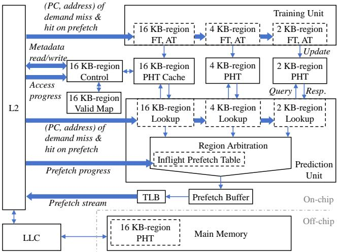
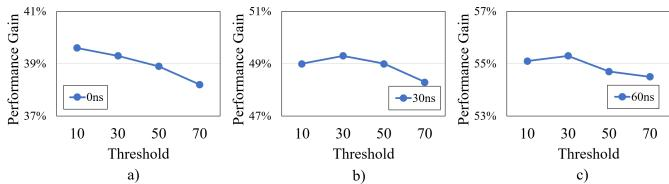
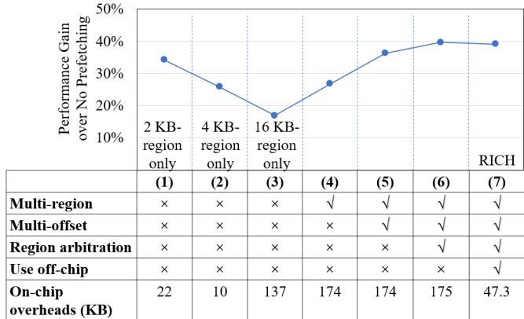
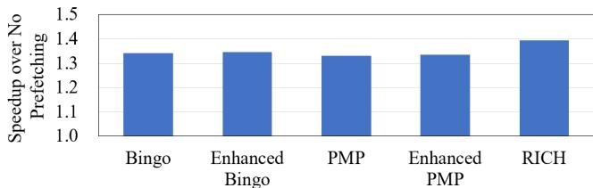

# RICH Prefetcher: Storing Rich Information in Memory to Trade Capacity and Bandwidth for Latency Hiding 论文解析

## 0. 论文基本信息

**作者 (Authors)**

- Ningzhi Ai
- Wenjian He
- Hu He
- Jing Xia
- Heng Liao
- Guowei Zhang

**发表期刊/会议 (Journal/Conference)**

- 58th IEEE/ACM International Symposium on Microarchitecture (MICRO '25)

**发表年份 (Publication Year)**

- 2025

______________________________________________________________________

## 1. 摘要

**目的**

- 针对未来内存系统（如 **Non-Volatile Memory (NVM)** 和 **CXL-based memory pooling**）呈现出的 **高带宽、大容量但高延迟** 的趋势，解决传统硬件预取器（prefetcher）因受限于片上存储面积而无法充分利用丰富元数据（rich metadata）来有效隐藏延迟的问题。
- 旨在设计一种新型预取器，能够战略性地利用额外的内存容量和带宽，以换取更优的延迟隐藏能力。

**方法**

- 提出 **RICH Prefetcher**，其核心设计理念是通过消耗内存容量和带宽来换取更低的有效访问延迟。
- **多尺度空间局部性利用**：
    - 支持 **2 KB**、**4 KB** 和 **16 KB** 三种不同大小的空间区域进行预取。
    - 为不同区域设计差异化的触发机制：对 **16 KB 大区域**采用 **(PC, 5 offsets)** 的多偏移触发机制以保证**高精度**；对 **2 KB/4 KB 小区域**采用更轻量级的触发（如 Bingo 的 **(PC, address)**）以保证**高覆盖率**。
    - 设计了**区域仲裁单元 (Region Arbitration)**，根据精度和性能优先级（16KB > 4KB > 2KB，但 (PC, address) 触发的 2KB 优先级最高）选择最优的预取区域，并引入去重机制避免重叠预取。
- **分层元数据存储**：
    - 对元数据按**访问频率**、**延迟容忍度**和**面积开销**进行分类。
    - **片上存储**：存放对延迟敏感的小区域（2KB/4KB）模式、训练元数据和控制元数据。
    - **片外存储**：将访问不频繁、面积开销大的 **16 KB 区域模式表 (PHT)** 存放在主存中，并在片上保留一个小型缓存。仅当模式的预取计数（prefetch count）超过阈值（如30）时，才将其写入片外存储，以减少不必要的片外访问。
    - 

*Table 2: Categorization of RICH's metadata*

**结果**

- 在标准单核系统中，RICH 相比当前最先进的 **Bingo** 预取器实现了 **3.4%** 的平均性能提升。
- 在模拟未来高延迟内存系统（增加 **120 ns** 内存延迟）的场景下，RICH 的优势更为显著，性能提升分别达到 **8.3%**（对比 Bingo）和 **6.2%**（对比 PMP）。
- RICH 在关键指标上全面超越基线：
    - **覆盖率 (Coverage)**: **75%** vs. Bingo 的 64%。
    - **及时性 (Timeliness)**: **91%** vs. Bingo 的 78%。
    - **准确率 (Accuracy)**: **76.3%**，与 Bingo 的 76.6% 基本持平。
- 即使将部分 16KB 模式表放置在片外，性能损失也仅为 **0.5%**，验证了分层存储策略的有效性。
- 

*Figure 10: RICH improves coverage and timeliness while maintaining comparable accuracy*

- 

*Figure 14: Performance under different memory bandwidth*

**结论**

- RICH 预取器通过创新的**多尺度区域预取**和**分层元数据存储**机制，成功地将丰富的元数据转化为显著的性能收益，尤其适用于**高延迟、高带宽**的未来内存架构。
- 该设计证明了在内存资源日益丰富的背景下，硬件预取器的设计范式可以从“**最小化元数据**”转向“**战略性利用丰富元数据**”，从而更有效地应对内存墙挑战。

______________________________________________________________________

## 2. 背景知识与核心贡献

**研究背景**

- 现代内存技术的发展趋势是**高带宽**（high bandwidth）和**大容量**（high capacity），但代价是**访问延迟**（access latency）显著增加。
- 这一趋势体现在多个层面：
    - **设备层面**：如**非易失性内存**（NVM）等新型存储介质，虽然密度高、成本低，但访问延迟远高于传统 DRAM。
    - **系统层面**：如基于 \*\*CXL \*\*(Compute Express Link) 的内存池化架构，通过共享内存扩展了有效容量，但也引入了额外的访问延迟。
- 传统的硬件预取器（如 SMS, Bingo, PMP）主要为**面积效率**（area efficiency）而设计，通常将元数据（metadata）存储在片上，这限制了其能捕获的内存访问模式的多样性，尤其难以处理跨越多个页面的大范围空间局部性。

**研究动机**

- 面对高延迟内存，传统的“精简元数据”设计哲学已不再适用。高带宽、大容量的内存系统有能力承载和传输更丰富的信息，这为设计更强大的预取器提供了机会。
- 然而，直接扩展现有预取器的元数据规模会面临两个核心挑战：
    - **如何将丰富的元数据有效转化为性能收益**？简单地扩大规模往往遭遇**边际效益递减**（law of diminishing marginal returns）。
    - **如何以最小的开销实现这些元数据**？将所有元数据放在片上会消耗大量宝贵的**片上面积**（on-chip area），而完全依赖片外存储则会因获取元数据本身的高延迟而抵消预取带来的好处。

**核心贡献**

RICH 预取器通过一种创新的设计，巧妙地利用了未来内存系统的特性，实现了用**容量和带宽换取延迟隐藏**的目标。

- **提出了一种多尺度、多触发机制的预取策略**，结合了大区域和小区域预取的优势：
    - **大区域**（16 KB）：采用**多偏移触发**（multi-offset trigger）机制（如 (PC, 5 offsets)），通过观察多个访问地址后再触发预取，确保了**高精度**（high accuracy），适合发射长距离、高带宽的预取流以提升**及时性**（timeliness）。
    - **小区域**（2 KB/4 KB）：采用轻量级触发（如 Bingo 的 (PC, address) 或 (PC, 3 offsets)），优先保证**高覆盖率**（high coverage），即使预测错误，其惩罚（浪费的带宽和缓存污染）也较小。
    - **区域仲裁机制**：当多个区域同时被触发时，根据预设的优先级（2KB-(PC,address) > 16KB > 4KB > 2KB-(PC,offset)）和去重逻辑选择最优的预取请求，避免了冗余和冲突。

*Figure 2: The multi-offset trigger mechanism can distinguish "common-origin, later-divergent" access streams*

*Figure 3: By using more access offsets in a trigger, we can trade off between the accuracy and coverage of prefetching. Specifically, a), b),and c) correspond to 16 KB-region, 4 KBregion, and 2 KB-region.*

- **设计了一种分层的片上/片下元数据存储机制**，以最小化整体开销：
    - **片上存储**：存放对延迟敏感的组件，包括 2KB/4KB 区域的模式表（PHT）、训练单元（Training Unit）和控制元数据。
    - **片下存储**（主存）：存放访问频率较低、但占用空间巨大的 16KB 区域模式。该设计利用了 16KB 大预取流本身对元数据访问延迟的**天然容忍度**（latency tolerance）。
    - **两级缓存结构**：为 16KB 模式设计了一个小型的片上 PHT Cache，并配合一个 Valid Map 来管理片外存储的有效性，仅当模式的预取计数（prefetch count）超过阈值时才进行片外读写，有效减少了不必要的片外访问。

*Table 2: Categorization of RICH's metadata*

*Figure 4: Achieving high accuracy in large spatial regions and high coverage in small spatial regions by using different numbers of trigger offsets Figure 5: Placing 16 KB PHT off-chip keeps most prefetch opportunities, even with additional memory access latency*

- **实验评估结果显著**：
    - 在常规系统中，RICH 相比当前最先进的 Bingo 预取器实现了 **3.4%** 的性能提升。
    - 在模拟未来高延迟内存系统（额外增加 120ns 延迟）的场景下，RICH 的优势更为突出，性能提升分别达到 **8.3%**（vs. Bingo）和 **6.2%**（vs. PMP）。
    - RICH 在**覆盖率**和**及时性**上均有大幅提升，同时保持了与 Bingo 相当的**准确性**。

*Figure 10: RICH improves coverage and timeliness while maintaining comparable accuracy*

*Figure 14: Performance under different memory bandwidth*

______________________________________________________________________

## 3. 核心技术和实现细节

### 0. 技术架构概览

**整体架构概览**

RICH (Storing **Rich Information** in Memory to Trade Capacity and Bandwidth for Latency Hiding) 是一种新型硬件预取器，其核心设计哲学是利用未来高带宽、大容量但高延迟的内存系统（如 **NVM** 或 **CXL-based memory pooling**）特性，通过战略性地消耗额外的内存容量和带宽来换取更低的有效内存访问延迟。其架构围绕两个关键洞察构建：一是利用**多尺度空间局部性**，二是采用**片上/片下分层存储**来管理丰富的元数据。

**多尺度空间预取与仲裁机制**

- RICH 同时支持 **2 KB**、**4 KB** 和 **16 KB** 三种不同粒度的空间区域预取，以适应不同工作负载对空间局部性的多样化需求。
- 为平衡\*\*准确性 **(Accuracy)与**覆盖率 \*\*(Coverage)，RICH 为不同区域大小设计了差异化的触发机制：
    - **16 KB 大区域**：采用 **(PC, 5 offsets)** 的**多偏移触发**机制。该机制通过观察一个区域内至少5个不同的访问偏移量后再触发预取，显著提高了预测的准确性（>90%），但牺牲了部分覆盖率。这解决了传统单偏移触发在大区域上因“同源异流”（common-origin, later-divergent）访问模式而导致的高误预取率问题。
    - **4 KB 中区域**：采用 **(PC, 3 offsets)** 触发机制，作为准确性和覆盖率的折中。
    - **2 KB 小区域**：沿用 **Bingo** 的触发方式，包括 **(PC, offset)** 和 **(PC, address)**。其中 **(PC, address)** 触发能捕获部分时间局部性，且因其误预取代价低，被赋予最高优先级。
- 当多个区域同时被触发时，RICH 通过一个\*\*区域仲裁单元 \*\*(Region Arbitration) 进行决策：
    - 采用**固定优先级策略**：2KB-(PC,address) > 16KB > 4KB > 2KB-(PC,offset)。
    - 引入**去重机制**：一旦大区域（如16KB）预取被触发，在其完成前会阻止其覆盖范围内的小区域（如4KB、2KB）再次触发，以避免冗余和低效的预取。

*Figure 8: The Region Arbitration unit selects the appropriate region to prefetch (Step P3)*

**片上/片下分层元数据存储**

- RICH 对其元数据进行细致分类，并根据**访问频率**、**延迟容忍度**和**面积开销**将其智能地分配到片上或片下存储，以最小化整体开销。
- **适合片下存储的元数据**：
    - **16 KB 区域的模式历史表 **(PHT)：这些模式向量（256-bit）数量庞大，全部放在片上会导致超过 **100 KB** 的昂贵开销。由于16KB预取本身具有高延迟容忍度（一次预取大量数据），因此大部分低频访问的16KB模式被卸载到**主存**中。
    - 采用**两级存储策略**：一个小型的 **256-entry 片上 PHT Cache** 缓存高频模式，而完整的 **4096-entry PHT** 存储在片下主存（占用 **128 KB**）。
    - 引入**写回过滤机制**：只有当一个16KB模式的预取计数（即位向量中'1'的数量）超过阈值（如30）时，才将其从片上缓存写回到片下PHT，以减少不必要的片外访问。
- **适合片上存储的元数据**：
    - **2 KB 和 4 KB 区域的 PHT**：对延迟敏感，必须保留在片上以保证及时响应。
    - \*\*训练单元 **(Training Unit)：包含**过滤表 **(FT) 和**累积表 \*\*(AT)，用于在线学习访问模式，需频繁与L2 Cache交互。
    - **控制元数据**：如\*\*飞行中预取表 \*\*(Inflight Prefetch Table) 和仲裁逻辑，面积小但访问频繁。

*Table 2: Categorization of RICH's metadata*

**端到端工作流程**

- **训练过程**：当发生L2 Cache Miss或命中预取行时，训练单元会记录访问信息。对于每个区域，先在FT中记录访问，当观察到足够多的不同偏移后，将模式提升到AT中累积成位向量，最终存入对应的PHT。
- **片上预测过程**：
    - **查找阶段**：Lookup Units 使用FIFO缓冲区收集最近的访问偏移，以形成触发条件。
    - **查询阶段**：满足触发条件后，查询对应的片上PHT。若16KB PHT未命中，则进入片下预测流程。
    - **仲裁阶段**：Region Arbitration单元根据优先级和去重规则，决定最终执行哪个区域的预取请求。
- \*\*片下预测过程 \*\*(仅16KB)：
    - 当片上PHT未命中但片下Valid Map指示存在有效模式时，异步发起片外元数据加载请求。
    - 在等待元数据返回期间，系统会跟踪处理器对目标16KB区域的“**迟到访问**”（late prefetches），并在元数据返回后，从预取流中剔除这些已被访问的子区域，以避免无用预取。
    - 最终，修剪后的预取请求被送入仲裁单元并生成预取流。

*Figure 6: Architecture of RICH*

### 1. 多尺度空间预取与多偏移触发机制

**多尺度空间预取与多偏移触发机制的实现原理**

RICH预取器的核心创新在于其**多尺度空间预取**（multi-scale spatial prefetching）与**多偏移触发**（multi-offset trigger）机制，该机制通过动态选择不同粒度的空间区域并匹配相应的触发策略，以协同优化**覆盖率**（Coverage）和**准确性**（Accuracy）。

- **区域尺寸与触发条件的差异化设计**：
    - **16KB大区域**：采用 **(PC, 5 offsets)** 触发条件。此设计旨在解决“**common-origin, later-divergent**”（同源异流）问题，即多个访问流起始于同一偏移但后续轨迹不同。通过观察前5个不同的访问偏移，可以高置信度地验证访问流的方向，从而实现**accuracy-first**（精度优先）策略。
        - 实验表明，使用5个偏移可将16KB区域的预取**准确性提升至90%以上**，有效避免了因误预取大量无用缓存行而造成的带宽浪费和缓存污染。
        - 

*Figure 3: By using more access offsets in a trigger, we can trade off between the accuracy and coverage of prefetching. Specifically, a), b),and c) correspond to 16 KB-region, 4 KBregion, and 2 KB-region.*

- **4KB中等区域**：采用 **(PC, 3 offsets)** 触发条件。作为16KB和2KB之间的折衷，在保证较高准确性的同时，提供比16KB更广的覆盖范围。

- **2KB小区域**：沿用Bingo的两种触发方式：

    - **(PC, offset)**：用于捕捉基本的空间局部性，实现**coverage-first**（覆盖优先）策略，确保广泛的模式捕获。
    - **(PC, address)**：用于捕捉特定的时序局部性（temporal locality），其准确性与16KB区域相当，但误预取成本极低。

- **输入与输出关系**：

    - **输入**：处理器核心产生的L2缓存未命中（demand miss）或对预取数据的命中（hit on prefetch）事件，包含**程序计数器**（PC）和**虚拟地址**（address）。
    - **处理流程**：
        1. **偏移收集**：Lookup Unit为每个活动的区域维护一个FIFO缓冲区，持续收集访问偏移。16KB区域的FIFO深度为5，4KB为3，2KB则无需FIFO。
        1. **触发判定**：当FIFO被填满（对于16KB/4KB）或发生单次访问（对于2KB）时，生成对应的触发事件。
        1. **模式查询**：使用触发事件（如哈希后的(PC, 5 offsets)）查询片上\*\*Pattern History Table \*\*(PHT)。
        1. **区域仲裁**：若多个区域同时触发，则根据预设的**固定优先级**进行仲裁。
    - **输出**：一个经过仲裁的、最优的预取请求，包含目标区域标签和对应的位向量（bit-vector）模式，用于生成具体的预取流。

**区域仲裁与协同工作机制**

为避免不同尺度预取间的冗余和冲突，RICH设计了一套精细的**Region Arbitration**（区域仲裁）单元。

- **仲裁优先级规则**（从高到低）：

    1. **2KB区域**（由 (PC, address) 触发）
    1. **16KB区域**（由 (PC, 5 offsets) 触发）
    1. **4KB区域**（由 (PC, 3 offsets) 触发）
    1. **2KB区域**（由 (PC, offset) 触发）

- **去重机制**（De-duplication）：

    - 一旦一个大区域（如16KB）的预取被触发并开始执行，在其完成前，会阻止其内部所有子区域（4KB和2KB）的预取触发。
    - 这一机制基于一个关键洞察：**大区域预取在多偏移触发下具有更高的准确性**，应优先保障其执行，避免被低准确性的小区预取干扰。
    - 同时，为了防止大区域预取因触发条件苛刻（需5次访问）而导致机会丢失，**小区域预取可以先行启动**，确保在大区域模式确认前不丢失早期的预取机会。

*Figure 8: The Region Arbitration unit selects the appropriate region to prefetch (Step P3)*

**参数设置与性能权衡**

该机制的关键参数（如偏移数量、PHT大小）均经过实验调优，以在性能和开销间取得最佳平衡。

- **多偏移触发的权衡效应**：
    - 增加触发所需的偏移数量会**显著提高准确性**，但会**降低覆盖率**，因为更严格的触发条件更难被满足。
    - 

*Figure 2: The multi-offset trigger mechanism can distinguish "common-origin, later-divergent" access streams*

展示了多偏移如何区分同源异流的访问模式。

*Figure 3: By using more access offsets in a trigger, we can trade off between the accuracy and coverage of prefetching. Specifically, a), b),and c) correspond to 16 KB-region, 4 KBregion, and 2 KB-region.*

的图表(a)(b)(c)清晰地量化了在16KB、4KB、2KB区域上，偏移数量与准确率、覆盖率之间的此消彼长关系。

- **PHT容量敏感性**：
    - **2KB PHT**：由于(PC, address)触发会产生大量条目，其性能在4096个条目时达到饱和。
    - **4KB PHT**：在1024个条目时性能饱和。
    - **16KB PHT **(片上缓存)：仅需256个条目即可获得接近最优的性能，这得益于其**分层存储设计**——低频模式被卸载到片外内存，片上缓存只需保留高频热点模式。

*Table 3: Cover ratio under a 2oo-entry storage constraint of 16 KB-region patterns*

显示，仅200个片上条目就能覆盖大部分16KB预取请求。

______________________________________________________________________

**在整体架构中的作用**

该机制是RICH实现其设计哲学——“**用容量和带宽换取延迟隐藏**”——的关键执行单元。

- **提升覆盖率**：通过2KB小区域的广泛触发，捕获了传统4KB固定粒度预取器无法覆盖的细粒度或跨页空间局部性。
- **提升及时性**（Timeliness）：通过16KB大区域的批量预取，充分利用高带宽内存的优势，在一次触发中填充大量数据，显著增加了预取距离，使数据更可能在处理器真正需要时已存在于缓存中。
- **维持高准确性**：通过为大区域引入多偏移验证，从根本上解决了大区域预取易误判的难题，使得激进的预取策略变得可行且高效。
- **最终效果**：如

*Figure 10: RICH improves coverage and timeliness while maintaining comparable accuracy*

所示，RICH在保持与Bingo相当的**准确性**（76.3% vs 76.6%）的同时，将**覆盖率**从64%大幅提升至75%，并将**及时性**从78%提升至91%。

### 2. 基于优先级的区域仲裁策略

**仲裁策略的实现原理与算法流程**

RICH 的区域仲裁（Region Arbitration）单元是其多尺度预取机制的核心，负责在多个潜在预取请求冲突时做出最优决策。其实现基于一个**固定优先级**规则和一个**去重（de-duplication）** 机制。

- **固定优先级规则**：该规则的设计源于对不同区域预取特性的深刻洞察。
    - **2KB-(PC,address)** 触发的预取拥有最高优先级。这是因为 `(PC, address)` 触发器能捕捉到精确的**temporal locality**（时间局部性），其**accuracy**（准确率）与16KB区域相当，但其**misprediction cost**（误预测代价）极低，因为它只预取少量缓存行。
    - **16KB** 区域预取紧随其后。它通过 **(PC, 5 offsets)** 触发，实现了超过90%的高准确率，并能带来显著的性能增益（timeliness高），但误预测代价高昂。
    - **4KB** 区域预取使用 **(PC, 3 offsets)** 触发，作为中等粒度的折中方案，优先级居中。
    - **2KB-(PC,offset)** 触发的预取优先级最低。它采用**coverage-first**（覆盖率优先）策略，触发条件宽松，但准确率相对较低，主要用于兜底覆盖。
- **去重（de-duplication）机制**：为避免在重叠内存空间上发出冗余预取请求，浪费带宽和缓存空间。
    - 一旦一个更大、更高优先级的区域（如16KB）被触发并开始预取，系统会暂时**block**（阻塞）对该区域内所有更小区域（如4KB和2KB）的后续触发。
    - 这一机制建立在“**larger regions have higher accuracy**”（更大区域具有更高准确率）的前提之上，确保了预取资源被分配给最可靠的预测。
- **处理晚触发问题**：为了避免因等待大区域（16KB）收集足够偏移量（5个）而导致小区域预取机会丢失，RICH允许小区域预取先行。
    - 例如，2KB预取可以在第一个访问发生时就被触发，而无需等待16KB区域完成其触发条件。这保证了**timeliness**（及时性），防止因大区域预测延迟而错过小区域的预取窗口。

*Figure 8: The Region Arbitration unit selects the appropriate region to prefetch (Step P3)*

**输入输出关系及在整体中的作用**

区域仲裁单元的输入是来自三个不同区域查找单元（Lookup Units）的潜在预取请求，输出则是最终胜出的、将要被执行的预取请求。

- **输入**：
    - `req16KB`: 来自16KB区域查找单元的请求，包含区域标签（region_tag）和对应的位向量模式（pattern）。
    - `req4KB`: 来自4KB区域查找单元的请求。
    - `req2KB`: 来自2KB区域查找单元的请求，可能由 `(PC, offset)` 或 `(PC, address)` 触发。
- **处理逻辑**：
    1. **优先级裁决**：首先根据固定的优先级顺序（2KB-(PC,address) > 16KB > 4KB > 2KB-(PC,offset)）从非空请求中选出一个“获胜请求”（win_req）。
    1. **重叠检查**：接着，将这个获胜请求与 **Inflight Prefetch Table**（飞行中预取表）进行比对。该表记录了所有正在进行中的预取操作所覆盖的内存区域。
        - 如果当前获胜请求与表中任何条目存在**overlap**（重叠），则只有当当前请求的优先级**高于**表中对应条目的优先级时，才会被允许执行；否则，该请求会被忽略（ignored）。
- **输出**：
    - 一个经过双重验证（优先级和重叠检查）的最终预取请求，该请求将被送入 **Prefetch Buffer** 并最终生成具体的预取流。
- **在整体中的作用**：
    - **协同优化**：该策略成功地将大区域的**high performance gain**（高性能增益）和小区域的**low misprediction penalties**（低误预测惩罚）结合起来，实现了**synergistic optimization**（协同优化）。
    - **资源高效**：通过去重和优先级选择，最大限度地减少了**useless prefetches**（无用预取），提高了内存带宽和缓存空间的利用效率。
    - **保障性能**：确保了系统总是优先执行最可靠、收益最高的预取操作，从而在复杂多变的内存访问模式下维持了**high coverage**（高覆盖率）和**high timeliness**（高及时性）。

______________________________________________________________________

### 3. 分层元数据存储架构

**分层元数据存储架构的设计原理**

RICH prefetcher 的核心创新之一是其分层元数据存储架构，该架构旨在利用未来高带宽、大容量但高延迟的内存系统特性，在不显著增加片上面积开销的前提下，有效管理用于多尺度空间预取的丰富元数据。

- **设计驱动力**: 传统的预取器受限于片上存储（on-chip storage）的稀缺性，通常将所有元数据（如 Pattern History Table, PHT）保存在芯片上，这严重限制了可学习模式的复杂度和数量。RICH 则反其道而行之，主动利用片外主存（off-chip main memory）的巨大容量来存放部分元数据。
- **分类依据**: RICH 根据三个关键维度对元数据进行分类，以决定其存储位置：
    - **访问频率 (Access Frequency)**: 高频访问的元数据应置于片上以保证低延迟。
    - **延迟容忍度 (Latency Tolerance)**: 某些元数据的使用场景天然能容忍较高的访问延迟。
    - **面积开销 (Area Overheads)**: 大型数据结构会消耗大量宝贵的片上资源。
- **具体策略**: 基于上述分析，RICH 将不同区域大小的预取模式进行差异化处理：
    - **2KB 和 4KB 区域模式**: 这些模式对延迟极为敏感，因为它们需要快速响应单次或少数几次缓存未命中。因此，它们的 PHT 被完全放置在**片上**。
    - **16KB 区域模式**: 这些模式具有独特的性质，使其非常适合片外存储：
        - **高延迟容忍度**: 一次成功的 16KB 区域预取可以带来多达 256 条缓存线（cache line）的数据，即使获取其元数据有延迟，只要在处理器访问到该区域末尾前完成，依然能提供巨大的性能收益。实验表明，即使增加 **50ns** 的额外延迟，预取机会的损失也**小于15%**。
        - **混合访问频率**: 虽然总的模式种类繁多（单个 trace 可超 **3500** 种），但实际访问呈现出高度集中性，即少数高频模式覆盖了大部分请求。
        - **巨大面积开销**: 存储所有 16KB 模式需要超过 **100KB** 的片上存储，成本过高。

*Figure 4: Achieving high accuracy in large spatial regions and high coverage in small spatial regions by using different numbers of trigger offsets Figure 5: Placing 16 KB PHT off-chip keeps most prefetch opportunities, even with additional memory access latency*

**16KB 区域元数据的分层存储实现**

为了高效管理 16KB 区域的元数据，RICH 采用了一种类似缓存的层级结构。

- **片上组件**:
    - **16KB PHT Cache**: 一个小型的、全相联或高相联的片上缓存，容量为 **256 个条目**。它专门用于缓存**高频访问**的 16KB 区域模式，以实现快速访问。
    - **Valid Map Unit**: 一个 **4096 位**的位图（bit-vector），用于标记哪些 16KB 模式当前有效并存在于片外存储中。每个位对应一个唯一的 **12-bit trigger ID**。
- **片外组件**:
    - **Off-chip PHT**: 位于主存中的一个专用数组，可容纳 **4096** 个 16KB 区域模式。每个模式是一个 **256-bit** 的位向量，总计占用 **128KB** 主存空间。
- **地址映射机制**:
    - 采用 **12-bit trigger ID** 作为索引，实现了片上 Valid Map、片上 PHT Cache（作为标签）和片外 PHT 之间的**一对一映射**。这种设计简化了查找逻辑，避免了复杂的哈希冲突处理。
- **写回与过滤策略**:
    - 并非所有在片上 PHT Cache 中被淘汰的模式都会被写入片外 PHT。
    - 系统引入了一个 **prefetch count threshold**（预取计数阈值），只有当一个模式的位向量中 '1' 的数量（即预期能预取的缓存线数）**超过阈值（默认为30）** 时，才认为其价值足够高，值得进行片外存储操作。这有效减少了不必要的片外读写，避免了因元数据访问导致的 **row buffer misses** 性能损失。

*Table 2: Categorization of RICH's metadata*

*Table 3: Cover ratio under a 2oo-entry storage constraint of 16 KB-region patterns*

**预测流程中的协同工作机制**

分层存储架构深度集成到 RICH 的预测流程中，确保了高效和正确性。

- **输入**: 预测单元接收到由 **(PC, 5 offsets)** 触发的 16KB 区域预取请求。
- **片上查找**:
    - 首先计算 **12-bit trigger ID**，并在 **16KB PHT Cache** 中查找。
    - 如果命中（Hit），则立即使用该模式生成预取流。
- **片外查找（Miss 处理）**:
    - 如果片上未命中，则查询 **Valid Map Unit**。
    - 如果 Valid Map 对应位为 **1**，说明有效模式存在于片外。此时，控制单元会**异步**发起一个从主存加载该模式的请求。
    - 在等待片外数据返回期间，处理器可能已经访问了该 16KB 区域的部分内容。为此，系统会跟踪这些“**late prefetches**”（晚期预取），并以 **2KB 子区域**为粒度进行标记（共8位）。
- **输出与整合**:
    - 当片外模式数据返回后，它会被同时存入 **16KB PHT Cache**，并根据 **late prefetches** 的标记信息对模式进行修剪（trimming），避免对已访问过的子区域重复预取。
    - 修剪后的模式被送入 **Region Arbitration** 单元，参与最终的预取决策。
- **整体作用**: 该架构成功地将**绝大部分**（通过 Valid Map 管理）16KB 模式的存储负担卸载到片外，同时通过一个小巧的片上缓存和智能的过滤/修剪机制，将片外访问带来的延迟开销降至最低，实现了**面积开销**与**性能收益**的最佳平衡。评估显示，相比将所有元数据放在片上的方案，此分层设计仅带来 **0.5%** 的性能损失。

*Table 4: Breakdown of on-chip storage overheads*

### 4. 片外元数据访问过滤机制

**核心机制与设计动机**

- RICH引入片外元数据访问过滤机制的核心目的是**避免因频繁、低效的片外访问而抵消预取带来的性能收益**。在高延迟内存系统中，一次片外元数据访问可能触发**两次行缓冲区未命中（row buffer misses）**，其代价高昂。
- 该机制基于一个关键洞察：并非所有16KB区域的访问模式都值得被持久化到片外存储。只有那些能带来**显著净收益**的模式才应触发片外操作。
- **净收益**的衡量标准是模式的**预取计数（prefetch count）**，即其位向量（bit-vector）中'1'的数量，它直接代表了成功预取的cache line数量。

**算法流程与实现细节**

- **写入过滤（Eviction to Off-chip）**:
    - 当16KB区域的On-chip PHT Cache因容量限制需要驱逐（evict）一个条目时，系统会检查该模式的**预取计数**。
    - 只有当**预取计数超过预设阈值（默认为30）** 时，该模式才会被写入片外主存中的PHT；否则，该模式将被直接丢弃。
- **加载过滤（Load from Off-chip）**:
    - 在片上预测过程中，如果16KB区域的查询在On-chip PHT Cache中未命中，但Valid Map指示片外存在有效模式，则会发起片外加载请求。
    - 此处的“过滤”体现在决策逻辑上：系统只会在预期收益（由历史预取计数推断）大于潜在损失（行缓冲区未命中开销）时，才允许进行这次加载。这个判断在训练阶段通过写入过滤已经隐式完成，因为只有高价值模式才被存入片外。

**参数设置与敏感性分析**

- **预取计数阈值**是一个关键可调参数，其最优值与系统内存延迟密切相关。
    - 在**常规内存延迟**下，较低的阈值（如10）即可获得最佳性能，因为片外访问的惩罚相对较小。
    - 在**高内存延迟**场景下（如增加60ns或120ns），更高的阈值（如30）更为合适，以确保只有能带来巨大收益的模式才值得承担高昂的访问延迟。
- 

*Figure 17: Sensitivity to different prefetch count thresholds for 16 KB-region under different memory latencies*

- 这一敏感性分析证明了该过滤机制的有效性和必要性，它能根据系统特性动态调整策略，最大化性能。

**输入输出关系及在整体架构中的作用**

- **输入**:
    - 从Training Unit生成的16KB区域模式及其对应的**预取计数**。
    - On-chip PHT Cache的**驱逐信号**。
    - Prediction Unit发出的**片上未命中信号**和Valid Map的**有效性查询结果**。
- **输出**:
    - 对片外存储的**有条件写入/加载请求**。
    - 一个经过筛选的、仅包含高价值模式的**片外PHT**。
- **在RICH整体架构中的作用**:
    - **降低片外带宽压力**: 通过过滤掉低价值模式，显著减少了不必要的片外元数据流量，将宝贵的带宽留给真正有用的数据预取。
    - **提升片外存储效率**: 确保有限的128KB片外元数据空间被用于存储最具价值的模式，提高了存储资源的利用率。
    - **保障性能净收益**: 这是整个**片上/片下协同存储策略（hierarchical storage design）** 的关键一环，它保证了将元数据卸载到片外这一设计决策能够真正带来性能提升，而非成为新的瓶颈。该机制与**多偏移触发（multi-offset trigger）** 和**区域仲裁（Region Arbitration）** 共同构成了RICH高效利用丰富元数据的核心支柱。

______________________________________________________________________

## 4. 实验方法与实验结果

**实验设置**

- **仿真平台与配置**：实验基于 **ChampSim** 仿真器，模拟一个 **Intel Alder Lake 性能核 (P-Core)** 的单核及四核系统。L2 Cache 大小为 **2 MB**，主内存访问延迟在基线配置下为 **210 ns**。
- **对比对象**：RICH 与四种先进的空间预取器进行对比，分别是 **Bingo**、**PMP**、**SPP-PPF** 和 **SMS**。所有预取器均部署在 **L2 Cache** 层级。
- **工作负载**：
    - 使用了超过 **100 条**来自 **SPEC CPU 2006/2017**、**Ligra** 和 **Parsec** 的 traces。
    - 排除了 L2 **MPKI (Misses Per Kilo Instructions)** 小于 2 的 traces，以聚焦于内存敏感型应用。
    - 单核评估使用全部 traces；多核评估包括 **同构 (homogeneous)** 和 **异构 (heterogeneous)** 工作负载组合。
- **评估指标**：主要性能指标为 **Speedup**（相对于无预取基线），并辅以 **Accuracy**（准确率）、**Coverage**（覆盖率）和 **Timeliness**（及时性）进行深入分析。

*Table 5: Simulated system*

**核心结果数据**

- **单核性能**：在标准延迟下，RICH 相对于无预取基线平均提升 **39%**。与 SOTA 预取器相比：
    - 超越 **Bingo** **3.4%**
    - 超越 **PMP** **4.4%**
    - 超越 **SMS** **6.6%**
    - 超越 **SPP-PPF** **16.8%**
- **高延迟场景下的优势**：当主存延迟额外增加 **120 ns** 时，RICH 的优势显著扩大：
    - 超越 **Bingo** **8.3%**
    - 超越 **PMP** **6.2%**
        这证明了 RICH 在未来高延迟内存系统（如 CXL, NVM）中的巨大潜力。
- **性能指标分解**：RICH 的成功源于其在关键指标上的全面优化：
    - **Coverage**: **75%** (vs. Bingo 的 64%)
    - **Timeliness**: **91%** (vs. Bingo 的 78%)
    - **Accuracy**: **76.3%** (与 Bingo 的 76.6% 基本持平)

*Figure 10: RICH improves coverage and timeliness while maintaining comparable accuracy*

- **带宽敏感性**：RICH 的设计充分利用了高带宽特性。当带宽从 **5 GB/s** 提升至 **35 GB/s** 时，其性能增益从 **19%** 大幅跃升至 **39%**，增幅远超 Bingo（20% -> 34%）。这表明 RICH 能更高效地利用高带宽资源。

*Figure 14: Performance under different memory bandwidth*

- **多核性能**：在 4 核系统中，RICH 依然保持领先，超越 Bingo **2.8%**，超越 PMP **7%**。尽管其激进的预取策略在多核竞争带宽时收益略有下降，但优势依然稳固。

*Figure 19: RICH outperforms Bingo in both homogeneous and heterogeneous workloads on a 4-core system*

**消融实验 (Ablation Study)**

消融实验通过逐步构建 RICH 的各个组件，验证了其设计决策的有效性。

- **基础配置**：仅使用 **2KB-region only**（即 Bingo 的基础机制）作为起点。
- **无效的简单组合**：将 2KB、4KB、16KB 区域简单组合（**Naive multi-region**），性能反而比仅用 2KB 更差，凸显了直接组合不同粒度区域的冲突问题。
- **多偏移触发机制的关键作用**：引入 **Multi-region multi-trigger**（即为大区域使用多偏移触发）后，性能得到显著恢复。这证明了 **multi-offset trigger** 对于保证大区域预取 **Accuracy** 的至关重要性。

*Figure 15: Multi-offset trigger mechanism significantly benefits RICH, while offloading part of the 16 KB-Region patterns has limited performance impact.*

- **区域仲裁机制的必要性**：在多触发基础上加入 **Region Arbitration**（**All-on-chip** 配置），性能进一步提升。该机制通过优先选择高准确率的大区域预取，并阻止小区域对已覆盖空间的重复预取，有效解决了预取冗余和冲突问题。
- **片上/片下协同存储的高效性**：最终的 **RICH (proposed)** 配置将不常用的 16KB 模式表（PHT）卸载到片外内存。结果显示，相比完全片上实现（**All-on-chip**），性能仅损失 **0.5%**。这有力地证明了其 **hierarchical storage** 设计在几乎不牺牲性能的前提下，大幅降低了宝贵的 **on-chip area** 开销。

**存储效率对比**

- **Iso-storage 实验**：在相近的总存储预算下（RICH: 47KB on-chip + 128KB off-chip; Enhanced Bingo/PMP: ~193KB on-chip），RICH 依然大幅领先。
- **边际效益递减**：简单地扩大 Bingo 或 PMP 的 PHT（分别增至 193KB 和 194KB）仅带来 **0.3%** 的微弱性能提升，验证了论文的核心观点——**简单地扩展传统预取器会遭遇边际效益递减，而 RICH 的 rich metadata 设计能更高效地将其转化为性能增益**。

*Figure 16: Iso-storage comparison shows RICH is more storage efficient than Bingo and PMP.*

______________________________________________________________________
