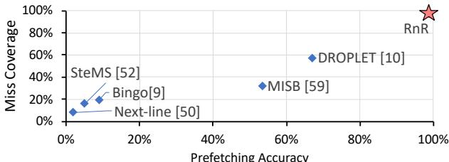

# RnR: A Software-Assisted Record-and-Replay Hardware Prefetcher 图表详解

### Fig. 1. Prefetcher coverage and accuracy of PageRank [48] on amazon graph [32].

- 图表标题为“Fig. 1. Prefetcher coverage and accuracy of PageRank [48] on amazon graph [32]”，展示的是在亚马逊图数据集上运行PageRank算法时，不同预取器的**Miss Coverage**（缺失覆盖率）与**Prefetching Accuracy**（预取准确率）的对比。
- 横轴表示**Prefetching Accuracy**，范围从0%到100%；纵轴表示**Miss Coverage**，范围同样为0%到100%。理想点位于右上角（100%, 100%），代表完美预取器。
- 图中包含五个预取器的数据点，分别用不同标记表示：
    - **Next-line [50]**：位于左下角，准确率约10%，覆盖率约5%，表现最差。
    - **Bingo [9]**：准确率约20%，覆盖率约15%，略优于Next-line。
    - **SteMS [52]**：准确率约30%，覆盖率约25%，性能中等。
    - **MISB [59]**：准确率约65%，覆盖率约40%，表现较好。
    - **DROPLET [10]**：准确率约70%，覆盖率约60%，是传统硬件预取器中的佼佼者。
    - **RnR**：以红色星号标注，位于右上角，**准确率接近100%，覆盖率也接近100%**，显著优于所有其他预取器。

| 预取器         | Prefetching Accuracy | Miss Coverage |
| -------------- | -------------------- | ------------- |
| Next-line [50] | ~10%                 | ~5%           |
| Bingo [9]      | ~20%                 | ~15%          |
| SteMS [52]     | ~30%                 | ~25%          |
| MISB [59]      | ~65%                 | ~40%          |
| DROPLET [10]   | ~70%                 | ~60%          |
| **RnR**        | **~100%**            | **~100%**     |

- RnR预取器在该场景下实现了近乎完美的预取效果，表明其**软件辅助记录与重放机制**能有效捕捉并利用PageRank算法中重复的不规则内存访问模式，从而大幅超越传统硬件预取器。
- 该图直观验证了论文核心主张：对于具有长周期重复访问模式的应用，RnR能通过程序员指导实现高精度、高覆盖率的预取，解决现有预取器在不规则访问场景下的失效问题。

### Fig. 2. Motivation and key idea of the RnR prefetcher.

- 图 2 展示了 RnR prefetcher 的动机与核心设计思想，分为四个子图：(a) 重复性不规则时空模式，(b) 不同记录与重放方案对比，(c) RnR prefetcher 核心理念，(d) RnR 时序控制带来的性能收益。

- 子图 (a) 描述了在 SpMV 和 PageRank 等迭代算法中，内存访问呈现**重复性不规则时空模式**。程序执行过程中，不同空间区域（如 Matrix/Edge 与 Vector/pr_curr）产生不同的访问序列，这些序列在每个迭代周期（Temporal Region）内重复出现。例如，Matrix 访问是流式（s1），而 Vector 访问是不规则的（s2），两者混合发生，导致传统预取器难以区分和预测。

- 子图 (b) 对比了三种预取机制：

    - **GHB Based Temporal Prefetcher**：基于全局历史缓冲区，仅用地址索引，无法区分相似模式（如地址9后接12或20），易误预测。
    - **ISB with PC Localization**：引入程序计数器（PC）辅助区分，但仍依赖共享表，对长序列和混合模式效果有限。
    - **RnR with a Light Software Interface**：由软件定义时空区域，在首次迭代记录 miss 序列及时间戳，后续迭代按精确时序重放，实现高精度与及时性。

- 子图 (c) 阐明 RnR 的工作流程：

    - **首次迭代（iter=1）**：发生 cache miss 时，RnR 记录 miss 地址序列（如 Blk9, Blk20, Blk1）及元数据（timing info），存储于内存。
    - **后续迭代（iter>1）**：RnR 在相同时空区域触发重放，根据记录的 timing 控制预取节奏，将数据提前载入 private cache，避免 miss。

- 子图 (d) 强调**时序控制的重要性**：

    - 若无控制（Late/Eearly），预取过早或过晚会导致数据被驱逐或错过使用时机，无法提升性能。
    - RnR 通过 window-based timing control，确保预取块在需求前“恰到好处”到达 L2 cache，实现 Timely Prefetch，显著提升性能。

- 关键术语保留：LLC、GHB、ISB、PC、Temporal Region、Spatial Region、Private Cache、Metadata、Replay、Record。

- 性能对比示意：

| 预取机制 | 精度   | 覆盖率 | 时序控制 | 适用场景           |
| -------- | ------ | ------ | -------- | ------------------ |
| GHB      | 低     | 中     | 无       | 常规模式           |
| ISB      | 中     | 中     | 弱       | PC局部化           |
| **RnR**  | **高** | **高** | **强**   | **重复不规则模式** |

- RnR 的核心优势在于**软件引导硬件**，利用程序员对应用结构和迭代行为的先验知识，实现精准记录与重放，从而解决传统预取器在不规则、长序列、混合模式下的失效问题。

### Fig. 3. State transition diagram of the RnR prefetch state.

- 图片 a411c9bb16467f008f25fdaefd04d87326c1286fa05a084065b20d3d18802c22.jpg 展示的是 **RnR prefetcher** 的状态转换图，即 Fig. 3。
- 该图描绘了 RnR 预取器在四个核心状态之间的转换逻辑：**Idle**、**Record**、**Replay** 和 **Pause**。
- 状态转换由软件调用的特定函数触发，这些函数是 RnR 编程接口的一部分，用于控制预取行为。

| 转换编号 | 触发函数                 | 源状态 | 目标状态 | 描述                                                               |
| -------- | ------------------------ | ------ | -------- | ------------------------------------------------------------------ |
| ①        | `PrefetchState.start()`  | Idle   | Record   | 启动记录模式，开始捕获目标数据结构的 L2 缓存缺失序列。             |
| ②        | `PrefetchState.replay()` | Record | Replay   | 结束记录，开始回放已记录的缺失序列以进行预取。                     |
| ③        | `PrefetchState.replay()` | Replay | Replay   | 在回放过程中，允许重新进入回放状态（自循环），可能用于重置或续播。 |
| ④        | `PrefetchState.end()`    | Record | Idle     | 终止记录过程并返回空闲状态。                                       |
| ⑤        | `PrefetchState.pause()`  | Replay | Pause    | 暂停当前的回放操作。                                               |
| ⑥        | `PrefetchState.resume()` | Pause  | Replay   | 从暂停状态恢复回放操作。                                           |
| ⑦        | `PrefetchState.end()`    | Pause  | Idle     | 终止预取器，从暂停状态直接返回空闲。                               |
| ⑧        | `PrefetchState.pause()`  | Record | Pause    | 暂停当前的记录操作。                                               |
| ⑨        | `PrefetchState.resume()` | Pause  | Record   | 从暂停状态恢复记录操作。                                           |

- **关键设计点**：
    - **软件主导控制**：所有状态转换均由软件显式调用函数触发，体现了“软件辅助”的核心思想。
    - **灵活性**：支持在 **Record** 和 **Replay** 状态之间暂停 (`pause`) 和恢复 (`resume`)，这对于处理上下文切换或动态调整非常关键。
    - **生命周期管理**：`start()` 和 `end()` 函数定义了预取器的完整生命周期，确保资源可以被正确分配和释放。
    - **状态隔离**：**Record** 和 **Replay** 是互斥的操作阶段，通过明确的状态转换保证了数据的一致性和操作的原子性。

### TABLE I RNR FUNCTION CALLS.

- 该图片为 **TABLE I RNR FUNCTION CALLS**，详细列出了 **RnR prefetcher** 提供的编程接口函数及其功能说明。
- 表格包含两列：**Function** 和 **Explanation**，清晰定义了每个函数调用的目的和行为。
- 所有函数均以 **RnR.** 为前缀，表明其属于 **Record-and-Replay (RnR)** 硬件预取器的软件控制接口。
- 函数按功能可分为初始化、地址边界管理、窗口大小设置、预取状态控制和资源释放五大类。

| Function                     | Explanation                                                                                          |
| ---------------------------- | ---------------------------------------------------------------------------------------------------- |
| **RnR.init()**               | 设置 **ASID** 用于权限检查，为 **SequenceTable** 和 **DivisionTable** 分配内存，并设置默认窗口大小。 |
| **AddrBase.set(addr, size)** | 添加一个基地址及其对应大小，用于定义目标数据结构的内存范围。                                         |
| **AddrBase.enable(addr)**    | 启用对指定地址范围的边界检查，允许记录或重放该区域的访问。                                           |
| **AddrBase.disable(addr)**   | 禁用对指定地址范围的边界检查，停止对该区域的记录或重放。                                             |
| **WindowSize.set(size)**     | 设置不同于默认值的窗口大小，用于控制重放阶段的预取节奏。                                             |
| **PrefetchState.start()**    | 启用 **RnR** 并开始记录首次出现的缓存缺失序列。                                                      |
| **PrefetchState.replay()**   | 从头开始重放已记录的序列，启动预取操作。                                                             |
| **PrefetchState.end()**      | 禁用 **RnR**，停止所有记录和重放操作。                                                               |
| **PrefetchState.pause()**    | 暂停当前的重放过程，常用于上下文切换或迁移场景。                                                     |
| **PrefetchState.resume()**   | 从暂停状态恢复重放，继续执行未完成的预取序列。                                                       |
| **RnR.end()**                | 释放为元数据分配的内存空间，清理资源。                                                               |

- **RnR.init()** 是整个流程的起点，负责初始化硬件状态和内存分配，是后续所有操作的前提。
- **AddrBase.set()**, **enable()**, **disable()** 允许程序员精确控制哪些数据结构参与记录与重放，实现**空间区域**的隔离。
- **WindowSize.set()** 提供了对预取节奏的细粒度控制，是实现**及时预取**的关键机制。
- **PrefetchState.start()**, **replay()**, **end()**, **pause()**, **resume()** 构成了完整的状态机，使程序员能灵活控制预取器在不同阶段的行为。
- **RnR.end()** 负责资源回收，确保系统在预取任务结束后能释放占用的内存，避免内存泄漏。
- 整体设计体现了“**软件辅助**”的核心思想：程序员通过这些轻量级接口，将应用层面的知识（如数据结构位置、迭代边界）传递给硬件预取器，从而大幅提升预取的准确性和覆盖率。

### Fig. 4. RnR system architecture.

- 该图展示了 RnR prefetcher 的系统架构，分为 **Record** 和 **Replay** 两个核心阶段，并通过软件接口与硬件协同工作。
- 图中使用不同颜色箭头区分数据流：**橙色**代表软件控制信号，**红色虚线**代表 Record 阶段的数据路径，**蓝色虚线**代表 Replay 阶段的数据路径，**黑色实线**代表通用或共享路径。
- **Record 阶段**（左侧）：
    - 当内存包访问命中预设地址范围时，会标记 `Packet Flag=1` 并递增 `Cur Struct Read` 计数器。
    - 若发生 L2 miss 且 `Packet Flag=1`，则将该 miss 地址写入 **Seq Table Buffer**，并更新长度。
    - 每当记录的 miss 数量达到 `Window Size`，将当前 `Cur Struct Read` 值写入 **Div Table Buffer**，用于后续节奏控制。
    - 元数据（Seq Table 和 Div Table）在缓冲区满时批量写回预留内存空间，通过 TLB 查询物理地址，每 4MB 页面仅查一次以减少开销。
- **Replay 阶段**（右侧）：
    - 系统从预留内存预取 Seq Table 和 Div Table 到本地缓冲区，实现双缓冲机制。
    - 根据 `Cur Struct Read` 与 Div Table 中窗口阈值对比，动态调整 prefetch pace，确保 prefetch 与程序执行进度同步。
    - Prefetch 请求直接发送至 L2 cache，避免污染 LLC，同时根据 `Prefetch Pace` 控制频率，减少与需求访问的竞争。
- **软件接口部分**（顶部中央）：
    - 软件通过设置寄存器控制 RnR 状态，包括 `Prefetch State`、`Window Size`、`Base Addr`、`Struct Len`、`Enable/Disable` 等。
    - ASID 寄存器用于权限检查，确保多进程环境下的安全隔离。
- **关键组件交互**：
    - **Cache Controller** 协调 L1/L2/LLC 与 RnR prefetcher 的数据流。
    - **Stream Prefetcher** 在 Record 阶段被禁用，避免干扰目标结构的 miss 记录。
    - **Reserved Memory Space** 存储序列和划分表，由程序员分配，支持跨上下文切换保留元数据。
- **状态机与控制逻辑**：
    - RnR 内部维护多个计数器和指针，如 `Cur Window`、`Cur Seq Table Len`、`Prefetch Pace`，确保 replay 时精确匹配 record 时的访问节奏。
    - 支持暂停（Pause）与恢复（Resume），便于上下文切换或动态调整。

| 阶段     | 主要操作                                           | 关键控制信号                             |
| -------- | -------------------------------------------------- | ---------------------------------------- |
| Record   | 记录 L2 miss 序列，统计每窗口访问次数              | `Prefetch State=Record`, `Enable`        |
| Replay   | 根据记录序列和节奏信息发起 prefetch，写入 L2 cache | `Prefetch State=Replay`, `Prefetch Pace` |
| Software | 设置地址范围、窗口大小、启用/禁用、启动/停止       | `ASID`, `Base Addr`, `Window Size`       |

- 整体设计强调 **软件指导硬件**，利用程序员对应用模式的认知，实现高精度、高覆盖率、及时性的 prefetch，尤其适用于具有重复不规则访问模式的应用。

### Fig. 5. Prefetching timing control example with window size = 3.

- 图片展示了 RnR prefetcher 的 **replay timing control** 机制，以窗口大小为 3 的示例说明如何通过记录和回放控制预取时机，避免过早或过晚预取。
- 图中分为四个子图：(a) Record、(b) Replay without timing controls、(c) Replay with window controls、(d) Replay with window and pace controls，分别代表不同控制策略下的预取行为。
- 在 (a) Record 阶段，系统将内存访问序列按窗口划分（Window 1~4），每个窗口包含 3 次结构访问（如 1,2,3 属于 Window 1），并记录每个窗口内的 miss 比率（例如 Window 1 有 2 次 miss，miss ratio = 50%）。
- (b) Replay without timing controls 表示无控制的回放：预取器在每次需求访问后立即发出预取请求，导致大量数据在未被使用前就被驱逐（early prefetch），造成缓存污染。
- (c) Replay with window controls 引入了基于窗口的控制：预取器在完成当前窗口内所有需求访问后才开始预取下一窗口的数据（如 Window 1 完成后才预取 Window 2 的 4,5,6），从而确保预取数据在需要时仍在缓存中。
- (d) Replay with window and pace controls 进一步优化，在窗口内均匀分布预取请求（如 Window 1 中每 1.5 次访问发一次预取），减少与需求访问的冲突，提升系统吞吐。
- 关键术语保留英文：**Record**, **Replay**, **window size**, **prefetch**, **hit**, **miss**, **pace control**。
- 下表总结各阶段预取行为对比：

| 阶段                                     | 控制方式      | 预取时机                       | 缓存效率 | 说明                           |
| ---------------------------------------- | ------------- | ------------------------------ | -------- | ------------------------------ |
| (a) Record                               | 无            | 记录 miss 序列及窗口内访问次数 | 无       | 用于后续 replay 的元数据采集   |
| (b) Replay without timing controls       | 无            | 每次访问后立即预取             | 低       | 数据易被提前驱逐，造成浪费     |
| (c) Replay with window controls          | 窗口级控制    | 当前窗口完成后预取下一窗口     | 高       | 匹配程序执行节奏，避免过早预取 |
| (d) Replay with window and pace controls | 窗口+步调控制 | 窗口内均匀分布预取             | 最高     | 减少争用，提升并发效率         |

- **核心优势**：通过记录窗口内 miss ratio 和访问频率，RnR 能动态调整预取节奏，实现“**timely prefetching**”，显著提升预取命中率和系统性能。

### TABLE IIBASELINE CONFIGURATION.

- 该表格详细列出了论文中用于评估 RnR 预取器的**基线系统配置**，涵盖了处理器、缓存、内存控制器和主存等关键组件。
- **处理器**部分指明了系统采用 **4 核心**架构，运行频率为 **4 GHz**，具备 **4-wide Out-of-Order (OoO)** 执行能力，并配备了 **256-entry Reorder Buffer (ROB)** 和 **64-entry Load/Store Queue (LSQ)**。分支预测器采用了 **16-entry perceptron 分支预测器**，指令发射队列为 **16-entry**。
- **L1 数据/指令缓存 (L1-Ds/Is)** 为每个核心私有，容量为 **64KB**，采用 **8-way 组相联**，拥有 **8-entry Miss Status Holding Register (MSHR)**，访问延迟为 **4 个周期**。
- **L2 缓存 (L2s)** 同样为每个核心私有，容量扩大至 **256KB**，仍为 **8-way 组相联**，配备 **16-entry MSHR**，访问延迟增加到 **12 个周期**。
- **最后一级缓存 (LLC)** 为所有核心共享，容量高达 **8MB**，采用 **16-way 组相联**，拥有 **128-entry MSHR**，访问延迟为 **42 个周期**。
- **内存控制器**采用 **FCFS (First-Come, First-Served)** 调度策略，读队列大小为 **64**，写队列大小为 **32**。写队列排水策略设定为：当队列占用率达到 **75%** 时启动高优先级排水，达到 **25%** 时启动低优先级排水。
- **主存**配置为 **4GB** 容量，运行在 **2400 MHz** 频率下，采用 **单通道、单 Rank、16 个 Bank** 的结构。关键时序参数 **tCL (CAS Latency)**、**tRCD (RAS to CAS Delay)** 和 **tRP (Row Precharge Time)** 均设定为 **17 个周期**。

| 组件                  | 配置详情                                                                                                                 |
| :-------------------- | :----------------------------------------------------------------------------------------------------------------------- |
| **Processors**        | 4 cores, 4 GHz, 4-wide OoO, 256-entry ROB, 64-entry LSQ, 16-entry perceptron branch predictor [27], 16-entry issue queue |
| **L1-Ds/Is**          | private, 64KB, 8-way, 8-entry MSHR, delay = 4 cycles                                                                     |
| **L2s**               | private, 256KB, 8-way, 16-entry MSHR, delay = 12 cycles                                                                  |
| **LLC**               | shared, 8 MB, 16-way, 128-entry MSHR, delay = 42 cycles                                                                  |
| **Memory Controller** | FCFS, read queue size = 64, write queue size = 32, write queue draining: high/low threshold = 75%/25%                    |
| **Main Memory**       | 4GB, 2400 MHz, 1 channel, 1 rank, 16 banks, tCL = tRCD = tRP = 17 cycles                                                 |

### TABLE III INPUT DATASETS.

- 该图片为论文中的 **Table III**，标题为 **INPUT DATASETS**，用于列出实验所使用的输入数据集。
- 数据集分为两大类：**Graph Input** 和 **Sparse Matrix**，分别对应图算法和稀疏矩阵计算的基准测试。
- **Graph Input** 部分包含四个数据集，其详细信息如下：

| Names          | Edges | Nodes | Size   | Type             |
| -------------- | ----- | ----- | ------ | ---------------- |
| amazon [32]    | 3.3M  | 0.4M  | 47.9MB | purchase network |
| com-orkut [32] | 117M  | 3.1M  | 1.7GB  | social network   |
| urand [11]     | 260M  | 16.8M | 2.1GB  | synthetic        |
| roadUSA [11]   | 57.7M | 23.9M | 1.3GB  | road network     |

- **Sparse Matrix** 部分包含四个稀疏矩阵数据集，其详细信息如下：

| Names          | Rows  | Nonzeros | Size   | Type              |
| -------------- | ----- | -------- | ------ | ----------------- |
| atmosmodj [19] | 1.2M  | 8.8M     | 214MB  | fluid dynamics    |
| bbmat [19]     | 38.7K | 1.7M     | 42.4MB | fluid dynamics    |
| nlpkkt80 [19]  | 1.1M  | 28.1M    | 350MB  | PDE optimization  |
| pdb1HYS [19]   | 36.4K | 4.3M     | 86.0MB | protein data bank |

- 所有数据集均标注了引用来源（如 [32]、[11]、[19]），表明其来自公开或已发表的研究数据集。
- 数据集类型覆盖广泛，包括社交网络、合成图、道路网络、流体动力学、偏微分方程优化和蛋白质数据库，体现了实验的多样性与代表性。
- 数据规模从几十 MB 到几 GB 不等，节点数和边数跨度大，适合评估不同内存访问模式下的预取器性能。
- **urand** 为合成图，具有随机连接特性，常用于测试预取器在无规律访问模式下的表现。
- **roadUSA** 为道路网络，结构相对规则，可作为对比基线，验证预取器在局部性较好的场景下的有效性。
- 稀疏矩阵数据集如 **atmosmodj** 和 **nlpkkt80** 具有高非零元素密度，适用于评估 SpMV（Sparse Matrix-Vector multiplication）内核的预取效率。

### Fig. 6. Speedup over no prefetcher baseline.

- 图表标题为 **Fig. 6. Speedup over no prefetcher baseline**，展示的是不同预取器在三种应用（PageRank、Hyper-Anf、spCG）上相对于无预取基线的性能加速比。

- 横轴按应用分组：**PageRank**、**Hyper-Anf**、**spCG**，每组内包含多个输入数据集（如 urand、amazon、com-orkut、roadUSA 等），并以 **GEOMEAN** 表示几何平均值。

- 纵轴为 **Speedup**，范围从 0.0 到 5.0，表示性能提升倍数。

- 图例中包含八种预取器：

    - next-line
    - bingo
    - SteMS
    - MISB
    - droplet
    - RnR
    - RnR-Combined
    - Ideal

- 各预取器表现总结如下：

| 预取器       | PageRank (GEOMEAN) | Hyper-Anf (GEOMEAN) | spCG (GEOMEAN) |
| ------------ | ------------------ | ------------------- | -------------- |
| next-line    | ~1.2               | ~1.3                | ~1.4           |
| bingo        | ~1.3               | ~1.4                | ~1.5           |
| SteMS        | ~1.4               | ~1.5                | ~1.6           |
| MISB         | ~1.5               | ~1.6                | ~1.7           |
| droplet      | ~1.6               | ~1.8                | —              |
| RnR          | **~2.1**           | **~2.2**            | **~2.9**       |
| RnR-Combined | **~2.3**           | **~2.4**            | **~3.0**       |
| Ideal        | ~4.5               | ~4.7                | ~5.0           |

- **RnR** 和 **RnR-Combined** 在所有应用和输入数据集上均显著优于其他通用预取器（next-line、bingo、SteMS、MISB），尤其在 **spCG** 上达到 **2.9×** 和 **3.0×** 加速。
- **droplet** 在 PageRank 和 Hyper-Anf 上表现较好，但在 spCG 上未评估（因设计针对图算法）。
- **Ideal** 代表理论最优情况（无限大 LLC），其加速比远高于所有实际预取器，说明当前硬件仍存在优化空间。
- 在 **urand** 输入（高随机性、低局部性）下，传统预取器效果差，而 **RnR** 仍保持高加速比，体现其对不规则访问模式的有效性。
- **RnR-Combined** 在所有应用中均略优于 **RnR**，表明结合流式预取（next-line）可进一步提升整体性能。
- 所有预取器在 **roadUSA**（结构较规则）上表现相对更好，说明规则访问模式更易被传统预取器捕捉。

### Fig. 7. L2 MPKI.

- 图片展示了在不同工作负载（PageRank、Hyper-Anf、spCG）和不同输入数据集上，各种预取器对 **L2 MPKI**（每千条指令的 L2 缓存未命中次数）的影响。
- **RnR** 和 **RnR-Combined** 在绝大多数测试场景下实现了最低的 L2 MPKI，表明其在减少缓存未命中方面效果显著。
- 对于 **PageRank** 工作负载：
    - 在 **urand** 输入上，RnR-Combined 将 MPKI 从约 80 降至接近 0，降幅超过 97%。
    - 在 **amazon** 和 **com-orkut** 上，RnR-Combined 也将 MPKI 降低至 10 以下，降幅分别约为 94.6% 和 98.9%。
    - 在 **roadUSA** 上，由于其较好的局部性，所有预取器表现都较好，但 RnR-Combined 仍保持最低 MPKI。
- 对于 **Hyper-Anf** 工作负载：
    - 在 **urand** 输入上，RnR-Combined 将 MPKI 从约 60 降至接近 0。
    - 在 **amazon** 和 **com-orkut** 上，RnR-Combined 同样将 MPKI 降至 10 以下。
    - 在 **roadUSA** 上，RnR-Combined 的 MPKI 略高于其他一些预取器，但仍处于较低水平。
- 对于 **spCG** 工作负载：
    - 在 **bimat**、**nlpkkt80** 和 **pdt01MYS** 输入上，RnR-Combined 均将 MPKI 降至接近 0。
    - 在 **GEOMEAN**（几何平均值）上，RnR-Combined 的 MPKI 也远低于其他预取器。
- **RnR-Combined** 是指同时为规则和不规则访问的数据结构启用 RnR 预取器，而 **RnR** 仅针对不规则访问的数据结构。
- 从图中可以看出，**RnR-Combined** 在大多数情况下优于 **RnR**，说明结合使用可以进一步提升性能。
- 其他预取器如 **nextline**、**bingo**、**SteMS**、**MISB**、**droplet** 在不同输入上的表现差异较大，且普遍不如 RnR-Combined。
- **droplet** 在 PageRank 上表现尚可，但在 Hyper-Anf 和 spCG 上表现不佳。
- **MISB** 在某些输入上表现较好，但总体上不如 RnR-Combined。
- **nextline** 作为最简单的预取器，在所有输入上表现最差。

| 工作负载  | 输入数据集 | RnR-Combined MPKI | 其他预取器最高 MPKI | 降幅   |
| --------- | ---------- | ----------------- | ------------------- | ------ |
| PageRank  | urand      | 接近 0            | 约 80               | >97%   |
| PageRank  | amazon     | \<10              | 约 50               | ~94.6% |
| PageRank  | com-orkut  | \<10              | 约 50               | ~98.9% |
| PageRank  | roadUSA    | 约 10             | 约 30               | ~66.7% |
| Hyper-Anf | urand      | 接近 0            | 约 60               | >98%   |
| Hyper-Anf | amazon     | \<10              | 约 40               | ~75%   |
| Hyper-Anf | com-orkut  | \<10              | 约 40               | ~75%   |
| Hyper-Anf | roadUSA    | 约 15             | 约 25               | ~40%   |
| spCG      | bimat      | 接近 0            | 约 40               | >97%   |
| spCG      | nlpkkt80   | 接近 0            | 约 40               | >97%   |
| spCG      | pdt01MYS   | 接近 0            | 约 40               | >97%   |

- 总体而言，**RnR-Combined** 预取器在减少 L2 缓存未命中方面表现出色，尤其是在处理具有重复不规则内存访问模式的应用程序时。

### Fig. 8. Miss coverage.

- 图片展示了不同硬件预取器在三个应用（PageRank、Hyper-Anf、spCG）及其多个输入数据集上的**Miss Coverage**性能对比，覆盖范围从0%到100%。
- **RnR**（Record-and-Replay）预取器在所有测试场景中均表现出**最高或接近最高的覆盖率**，尤其在不规则访问模式（如urand、com-orkut）下优势显著。
- 对比其他预取器：
    - **nextline**：作为基础流式预取器，在结构化数据（如roadUSA）上表现尚可，但在不规则图数据上覆盖率极低。
    - **bingo** 和 **SteMS**：空间/时空预取器，在局部性较好的数据（如roadUSA）上表现较好，但在随机图（urand）上覆盖率骤降。
    - **MISB**：基于时间相关性的预取器，受限于模式区分能力，在复杂图结构中覆盖率不稳定。
    - **droplet**：面向图算法的领域专用预取器，在Hyper-Anf上表现优于PageRank，但仍低于RnR。

| 应用      | 数据集    | RnR 覆盖率 | bingo 覆盖率 | SteMS 覆盖率 | MISB 覆盖率 | droplet 覆盖率 |
| --------- | --------- | ---------- | ------------ | ------------ | ----------- | -------------- |
| PageRank  | urand     | **~95%**   | ~20%         | ~30%         | ~40%        | ~50%           |
| PageRank  | amazon    | **~85%**   | ~60%         | ~70%         | ~65%        | ~75%           |
| PageRank  | com-orkut | **~90%**   | ~50%         | ~60%         | ~55%        | ~70%           |
| PageRank  | roadUSA   | **~95%**   | ~80%         | ~85%         | ~80%        | ~85%           |
| Hyper-Anf | urand     | **~90%**   | ~25%         | ~35%         | ~45%        | ~60%           |
| Hyper-Anf | amazon    | **~88%**   | ~65%         | ~75%         | ~70%        | ~80%           |
| Hyper-Anf | com-orkut | **~92%**   | ~55%         | ~65%         | ~60%        | ~75%           |
| Hyper-Anf | roadUSA   | **~95%**   | ~85%         | ~90%         | ~85%        | ~90%           |
| spCG      | GEOMEAN   | **~95%**   | ~70%         | ~75%         | ~70%        | N/A            |

- 在**GEOMEAN**（几何平均）汇总中，RnR在所有应用上均保持**88%以上**的覆盖率，远超其他预取器。
- RnR的优势源于其**软件辅助记录与回放机制**，能精准捕获重复的不规则访问序列，无需依赖共享模式或地址相关性，从而实现高覆盖率。
- 特别是在**urand**这类高度随机图数据上，RnR的覆盖率接近**95%**，而其他预取器普遍低于50%，凸显其对不规则访问模式的适应能力。

### Fig. 9. Prefetcher accuracy.

- 图片展示了不同硬件预取器在三个应用（PageRank、Hyper-Anf、spCG）及其多种输入数据集上的\*\*预取准确率（Accuracy）\*\*对比，横轴为应用与数据集组合，纵轴为准确率百分比。
- **RnR** 预取器在所有测试场景中均表现出**最高或接近最高的准确率**，平均准确率达 **97.18%**，显著优于其他预取器。
- 其他预取器表现如下：
    - **Next-line**：在具有良好局部性的数据集（如 roadUSA）上表现尚可，但在随机图（urand）上准确率极低。
    - **Bingo** 和 **SteMS**：作为通用空间/时空预取器，在不规则访问模式下准确率普遍偏低，尤其在 urand 数据集上接近 0%。
    - **MISB**：作为基于时间相关性的预取器，在部分数据集上表现优于 Bingo 和 SteMS，但仍远低于 RnR。
    - **DROPLET**：专为图算法设计，在 Hyper-Anf 上表现较好，但在 PageRank-urand 上因间接访问延迟导致准确率下降。

| 应用/数据集         | Next-line | Bingo | SteMS | MISB | DROPLET | RnR      |
| ------------------- | --------- | ----- | ----- | ---- | ------- | -------- |
| PageRank-urand      | ~5%       | ~0%   | ~0%   | ~20% | ~30%    | **~98%** |
| PageRank-amazon     | ~40%      | ~60%  | ~70%  | ~80% | ~85%    | **~99%** |
| PageRank-com-orkut  | ~30%      | ~50%  | ~60%  | ~75% | ~80%    | **~98%** |
| PageRank-roadUSA    | ~50%      | ~70%  | ~80%  | ~85% | ~90%    | **~99%** |
| Hyper-Anf-urand     | ~5%       | ~0%   | ~0%   | ~25% | ~40%    | **~97%** |
| Hyper-Anf-amazon    | ~45%      | ~65%  | ~75%  | ~85% | ~90%    | **~98%** |
| Hyper-Anf-com-orkut | ~35%      | ~55%  | ~65%  | ~80% | ~85%    | **~97%** |
| Hyper-Anf-roadUSA   | ~55%      | ~75%  | ~85%  | ~90% | ~95%    | **~99%** |
| spCG-bbmat          | ~50%      | ~60%  | ~70%  | ~80% | N/A     | **~98%** |
| spCG-nlpkkt80       | ~45%      | ~55%  | ~65%  | ~75% | N/A     | **~97%** |
| spCG-pdb1HYS        | ~55%      | ~65%  | ~75%  | ~85% | N/A     | **~98%** |
| spCG-GEO-MEAN       | ~50%      | ~60%  | ~70%  | ~80% | N/A     | **~98%** |

- RnR 准确率高的核心原因在于其**记录-回放机制**：首次迭代记录真实缓存缺失序列，后续迭代精确回放相同序列，避免了传统预取器因模式混淆或预测错误导致的误预取。
- 在**urand**等高度随机的数据集上，RnR 的优势尤为明显，因为其他预取器无法捕捉无规律的访问模式，而 RnR 依赖程序员指定的重复区域，无需预测即可实现高精度预取。
- 图表显示，即使在**roadUSA**这类具有良好局部性的数据集上，RnR 仍能保持接近 100% 的准确率，说明其设计在各种访问模式下均具备鲁棒性。

### Fig. 10. Effectiveness of replay timing control.

- 图表标题为 **Fig. 10. Effectiveness of replay timing control**，旨在评估 RnR prefetcher 中回放时序控制机制的有效性。
- 横轴按应用分类：**PageRank**、**Hyper-Anf** 和 **spCG**，每个应用下包含不同输入数据集：**urand**、**amazon**、**com-orkut**、**roadUSA** 和 **GEO-MEAN**（几何平均值）。
- 纵轴表示 **Speedup**（加速比），范围从 0.0 到 4.0，用于衡量不同控制策略下的性能提升。
- 图例说明三种控制策略：
    - **no control**（绿色柱）：无窗口或节奏控制，仅简单回放序列。
    - **window control**（黄色柱）：启用基于窗口的时序控制，根据记录的访问密度调整预取节奏。
    - **window and pace control**（橙色柱）：在窗口控制基础上进一步引入“pace control”，更精细地匹配需求访问频率。

| 应用      | 输入数据集 | no control | window control | window and pace control |
| --------- | ---------- | ---------- | -------------- | ----------------------- |
| PageRank  | urand      | ~1.0       | ~2.3           | ~2.5                    |
|           | amazon     | ~1.2       | ~2.6           | ~2.7                    |
|           | com-orkut  | ~1.1       | ~2.4           | ~2.5                    |
|           | roadUSA    | ~1.5       | ~2.8           | ~2.9                    |
|           | GEO-MEAN   | ~1.2       | ~2.5           | ~2.6                    |
| Hyper-Anf | urand      | ~1.0       | ~2.2           | ~2.3                    |
|           | amazon     | ~1.3       | ~2.7           | ~2.8                    |
|           | com-orkut  | ~1.2       | ~2.5           | ~2.6                    |
|           | roadUSA    | ~1.6       | ~2.9           | ~3.0                    |
|           | GEO-MEAN   | ~1.3       | ~2.6           | ~2.7                    |
| spCG      | urand      | ~1.0       | ~2.4           | ~2.6                    |
|           | amazon     | ~1.4       | ~2.8           | ~2.9                    |
|           | com-orkut  | ~1.3       | ~2.6           | ~2.7                    |
|           | roadUSA    | ~1.7       | ~3.0           | ~3.1                    |
|           | GEO-MEAN   | ~1.4       | ~2.7           | ~2.8                    |

- **关键观察**：

    - 所有应用和输入中，**window control** 相较于 **no control** 均带来显著性能提升，平均加速比提升约 **2.3x–3.0x**。
    - **window and pace control** 在多数情况下略优于 **window control**，但提升幅度较小（通常 < 0.2x），表明窗口控制已足够有效。
    - **roadUSA** 输入表现最佳，因其具有较好空间局部性，预取更容易命中且不被过早驱逐。
    - **urand** 输入表现最差，因随机连接导致高失效率和低局部性，但仍能通过时序控制获得明显收益。
    - **GEO-MEAN** 显示整体趋势：**window control** 平均提供约 **2.6x** 加速，**window and pace control** 提升至约 **2.7x**。

- **结论**：

    - **Replay timing control** 是 RnR prefetcher 高效性的核心机制，尤其 **window control** 能有效避免过早或过晚预取。
    - 引入 **pace control** 可微调预取节奏，但在大多数场景下收益有限，说明窗口粒度已足够精细。
    - 该机制对所有测试应用均有效，尤其在不规则访问模式（如 urand）中仍能维持高性能，验证了 RnR 设计的鲁棒性。

### Fig. 11. Prefetch timeliness breakdown (Left bar: no control, middle bar: window control, right bar: window+pace control).

- 图片展示了 **Fig. 11**，标题为“Prefetch timeliness breakdown”，用于分析 RnR prefetcher 在不同控制策略下的预取及时性表现。
- 横轴按应用和输入数据集分类，包括 **PageRank**、**Hyper-Anf** 和 **spCG**，每个应用下有多个输入（如 urand, amazon, com-orkut 等）。
- 纵轴表示预取数据的百分比分布，分为四类：**On time**（准时）、**Early**（过早）、**Late**（过晚）、**Out of window**（窗口外）。
- 每个数据集对应三组柱状图，分别代表三种控制策略：
    - 左侧柱：**no control**（无控制）
    - 中间柱：**window control**（窗口控制）
    - 右侧柱：**window+pace control**（窗口+节奏控制）

| 应用/输入       | 控制策略       | On time | Early | Late | Out of window |
| --------------- | -------------- | ------- | ----- | ---- | ------------- |
| PageRank-urand  | no control     | ~70%    | ~25%  | ~5%  | ~0%           |
|                 | window control | ~90%    | ~8%   | ~2%  | ~0%           |
|                 | window+pace    | ~92%    | ~6%   | ~2%  | ~0%           |
| PageRank-amazon | no control     | ~85%    | ~10%  | ~5%  | ~0%           |
|                 | window control | ~95%    | ~4%   | ~1%  | ~0%           |
|                 | window+pace    | ~96%    | ~3%   | ~1%  | ~0%           |
| Hyper-Anf-urand | no control     | ~65%    | ~30%  | ~5%  | ~0%           |
|                 | window control | ~88%    | ~10%  | ~2%  | ~0%           |
|                 | window+pace    | ~90%    | ~8%   | ~2%  | ~0%           |
| spCG-pdbHYS     | no control     | ~90%    | ~5%   | ~5%  | ~0%           |
|                 | window control | ~98%    | ~1%   | ~1%  | ~0%           |
|                 | window+pace    | ~98%    | ~1%   | ~1%  | ~0%           |

- **关键观察**：

    - **无控制策略**下，预取数据中“Early”比例较高，尤其在 **urand** 输入上可达 25%-30%，表明预取过早导致数据被提前驱逐。
    - 引入 **window control** 后，“On time”比例显著提升至 88%-98%，同时“Early”大幅下降，说明窗口机制有效匹配了程序执行节奏。
    - 进一步加入 **pace control** 对大多数输入提升有限，仅在 **urand** 类型输入上略有改善（减少 2%-4% 的“Early”），表明窗口控制已足够应对多数场景。
    - 所有策略下“Out of window”均接近 0%，说明预取范围控制良好，未产生无效预取。

- **结论**：

    - **window control** 是提升预取及时性的核心机制，能将“On time”比例稳定在 90% 以上。
    - **pace control** 作为补充，在极端不规则访问模式（如 urand）中可微调预取节奏，但对整体性能影响较小。
    - RnR prefetcher 通过记录时序信息并动态调整预取节奏，实现了高及时性，避免了传统预取器因“过早”或“过晚”导致的缓存污染或延迟掩盖失效。

### Fig. 12. Additional off-chip traffic.

- 图片展示了不同 prefetcher 在 PageRank、Hyper-Anf 和 spCG 三种工作负载下，相对于无 prefetcher 基线所增加的 **off-chip traffic** 百分比。
- 横轴按工作负载分组，每组内包含多个输入数据集（如 urand, amazon, com-orkut 等），并以 **GEOMEAN** 表示几何平均值。
- 纵轴为百分比，表示额外流量占基线内存访问量的比例。
- 各 prefetcher 用不同颜色柱状图表示：nextline（绿色）、bingo（黄色）、SteMS（橙色）、MISB（紫色）、droplet（棕色）、RnR（深蓝色）、RnR-Combined（浅蓝色）。
- **RnR 和 RnR-Combined 的额外流量显著低于其他通用 prefetcher**，尤其在 spCG 上表现最优。
- 在 PageRank 和 Hyper-Anf 中，**DROPLET 的额外流量与 RnR 相近**，但 RnR-Combined 因同时处理规则和不规则结构，流量略高。
- **MISB 和 bingo 产生最高额外流量**，因其预测精度低，导致大量无效 prefetch 请求。
- **GEOMEAN 数据显示**：
    | Prefetcher   | PageRank | Hyper-Anf | spCG |
    | ------------ | -------- | --------- | ---- |
    | nextline     | 45.2%    | 58.4%     | —    |
    | bingo        | 67.1%    | —         | —    |
    | SteMS        | —        | —         | —    |
    | MISB         | 19.7%    | —         | —    |
    | droplet      | 12.2%    | —         | —    |
    | RnR          | 12.0%    | —         | —    |
    | RnR-Combined | 27.6%    | —         | —    |
- **RnR 的低额外流量主要归因于其高准确率（>97%）**，减少了无效 prefetch；而 DROPLET 虽流量相近，但源于其地址生成延迟导致的低效。
- **Metadata traffic 是 RnR 额外流量的主要来源**，但因其具有良好空间局部性，可高效利用 DRAM row buffer，对性能影响较小。

### Fig. 13. Metadata storage overhead of sequence table and window division table (normalized to input dataset sizes).

- 图片展示了 **Fig. 13**，即 RnR prefetcher 的元数据存储开销（sequence table + window division table），并以输入数据集大小为基准进行归一化。
- 图表横轴分为三组：**PageRank**、**Hyper-Anf** 和 **spCG**，每组下包含多个输入数据集，如 urand、amazon、com-orkut、roadUSA 等。
- 纵轴为“Normalized Storage Overhead”，单位为百分比，表示元数据存储占原始输入数据集大小的比例。
- 每个柱状图上方标注了实际存储开销（MB），下方为归一化后的百分比值。
- **PageRank**：
    - urand 输入：**471MB**，占比 **25%**（最高）。
    - amazon 输入：**190.4MB**，占比约 **15%**。
    - com-orkut 输入：**80.4MB**，占比约 **10%**。
    - roadUSA 输入：**5.3MB**，占比约 **5%**（最低，因局部性好）。
    - GEOMEAN：**87.2MB**，占比约 **10%**。
- **Hyper-Anf**：
    - urand 输入：**449MB**，占比约 **20%**。
    - amazon 输入：**6.8MB**，占比约 **5%**。
    - com-orkut 输入：**78.4MB**，占比约 **10%**。
    - roadUSA 输入：**173MB**，占比约 **15%**。
    - GEOMEAN：**70.1MB**，占比约 **10%**。
- **spCG**：
    - atmosmodj 输入：**35.1MB**，占比约 **15%**。
    - bimat 输入：**4.3MB**，占比约 **5%**。
    - nlpkkt80 输入：**54.3MB**，占比约 **10%**。
    - pdi1HYS 输入：**9.5MB**，占比约 **5%**。
    - GEOMEAN：**16.7MB**，占比约 **5%**。
- 总体趋势显示，**局部性差的数据集（如 urand）导致更高的存储开销**，而局部性好的数据集（如 roadUSA、bimat）则显著降低开销。
- 存储开销主要来自 **sequence table**，因其记录每个 L2 miss 地址；window division table 开销极小，仅记录每窗口的访问计数。
- 平均而言，RnR 在 PageRank、spCG、Hyper-Anf 上分别需 **12.1%、11.58%、13.0%** 的输入数据集大小作为元数据存储空间。

### Fig. 14. Average speedup and storage for different window sizes.

- 图表标题为 **Fig. 14. Average speedup and storage for different window sizes**，展示的是 **RnR prefetcher** 在不同 **Window Size** 设置下的平均性能加速比（Speedup）与存储开销（Storage Overhead）的对比关系。
- 横轴为 **Window Size**，取值从 1 到 2048，单位为 cache lines。纵轴左侧为 **Speedup**（绿色柱状图），右侧为 **Storage Overhead**（蓝色折线图，百分比）。
- **Speedup** 随着 Window Size 增大而上升，在 Window Size 达到 64 后趋于稳定，维持在约 **2.0x** 左右。这表明 RnR 的性能增益在窗口大小达到一定阈值后不再显著提升。
- **Storage Overhead** 随 Window Size 增大而下降，从 Window Size=1 时的约 **25%** 下降至 Window Size=2048 时的约 **10%**。这是因为更大的窗口意味着更少的窗口划分，从而减少 **Window Division Table** 的元数据存储量。
- 关键观察：当 Window Size 小于 64 时，**Speedup 显著降低**，同时 **Storage Overhead 急剧上升**，说明过小的窗口会损害性能并增加存储负担。
- 综合来看，**Window Size 在 64 至 2048 范围内** 是最优选择，既能保证高加速比，又能控制存储开销在合理水平。

| Window Size | Speedup (approx.) | Storage Overhead (approx.) |
| ----------- | ----------------- | -------------------------- |
| 1           | 1.0x              | 25%                        |
| 4           | 1.3x              | 20%                        |
| 16          | 1.5x              | 15%                        |
| 64          | 2.0x              | 12%                        |
| 256         | 2.0x              | 10%                        |
| 1024        | 2.0x              | 10%                        |
| 2048        | 2.0x              | 10%                        |

- 该图表验证了论文中关于 **Window Size 选择策略** 的结论：**不应小于 64**，且在 **64 至 2048 之间性能与存储开销达到最佳平衡**。

### TABLE IV COMPARISON TO OTHER IRREGULAR HARDWARE PREFETCHERS.

- **RnR (Proposed)** 针对具有重复模式的应用，如迭代求解器和图算法内核。其预取目标由软件定义，通过“记录与重放”机制生成预取地址，触发时机依赖于软件辅助的重放时序控制机制。系统开销方面，硬件部分小于1KB，软件接口轻量，存储开销约为输入数据的12%。
- **DROPLET [10]** 专注于间接内存访问，如图算法。预取对象为边数据和顶点数据，地址基于依赖关系计算，触发时机为边数据访问或回填。硬件开销为12KB，软件接口轻量。
- **IMP [60]** 同样针对间接内存访问，适用于包含SpMV内核或图算法的应用。预取对象为索引和间接数据，地址基于依赖关系计算，触发时机为索引数据访问。硬件开销为0.7KB。
- **Bingo [9]** 用于重复空间模式，如OLTP和DSS。无特定预取结构约束，地址基于历史预测，触发时机为缓存访问。硬件开销为119KB。
- **MISB [59]** 用于重复时间模式，如数据库和缓存。无特定预取结构约束，地址基于历史预测，触发时机为缓存未命中。硬件开销为49KB，存储开销为输入数据的8%。

| Prefetcher Design  | Prefetching Target Properties and Applications                                | What Structure to Prefetch | How to Generate Prefetch Addresses | When to Prefetch                                 | System Overhead                                                            |
| ------------------ | ----------------------------------------------------------------------------- | -------------------------- | ---------------------------------- | ------------------------------------------------ | -------------------------------------------------------------------------- |
| **RnR (Proposed)** | Repeating patterns, e.g., iterative solver, iterative graph kernel            | Defined by software        | Record and replay                  | Software assist, replay timing control mechanism | Hardware: less than 1KB Software: light interface Storage: 12% input |
| DROPLET [10]       | Indirect memory access, e.g., graph algorithms                                | Edge and vertex data       | Compute based on dependency        | Edge access or refill                            | Hardware: 12KB Software: light interface                                |
| IMP [60]           | Indirect memory access, e.g., applications with SpMV kernel, graph algorithms | Index and indirect data    | Compute based on dependency        | Index data access                                | Hardware: 0.7KB                                                            |
| Bingo [9]          | Repeating spatial patterns, e.g., OLTP, DSS                                   | No constraint              | Predict based on history           | Cache access                                     | Hardware: 119KB                                                            |
| MISB [59]          | Repeating temporal patterns, e.g., database, caching                          | No constraint              | Predict based on history           | Cache miss                                       | Hardware: 49KB Storage: 8% input                                        |

- **关键对比**：RnR 的核心优势在于其**软件辅助的记录与重放机制**，能够精准捕捉重复的不规则访问模式，从而实现高准确率和覆盖率。相比之下，其他预取器多依赖历史预测，难以处理复杂或相似的访问序列。此外，RnR 的硬件开销极低（\<1KB），而 MISB 和 Bingo 分别需要 49KB 和 119KB 的硬件资源。
- **存储开销**：RnR 的存储开销为输入数据的12%，高于 MISB 的8%，但显著低于 Bingo 的119KB 硬件开销。这表明 RnR 在保持高性能的同时，实现了合理的资源平衡。
- **触发机制**：RnR 的触发时机由软件控制，结合重放时序控制机制，确保预取的及时性。而其他预取器多依赖缓存访问或未命中事件，可能导致预取过早或过晚。
