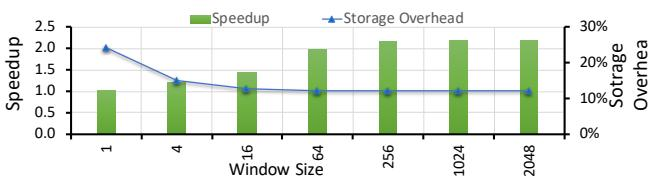
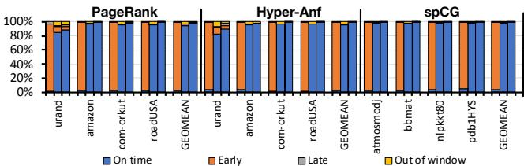
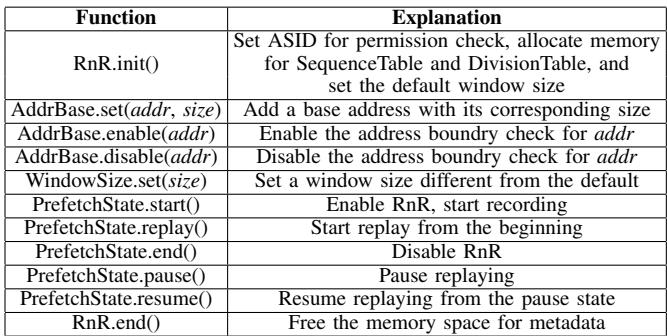
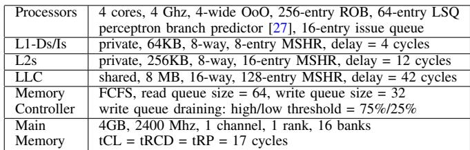
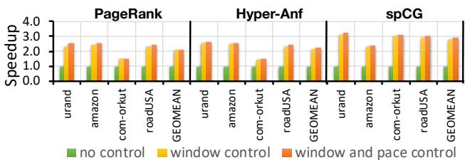

# RnR: A Software-Assisted Record-and-Replay Hardware Prefetcher 论文解析

## 0. 论文基本信息

**作者 (Authors)**

- Chao Zhang (Lehigh University)
- Yuan Zeng (Lehigh University)
- John Shalf (Lawrence Berkeley National Lab)
- Xiaochen Guo (Lehigh University)

**发表期刊/会议 (Journal/Conference)**

- 该论文未在提供的文本中明确指出其发表的期刊或会议名称。

**发表年份 (Publication Year)**

- 该论文未在提供的文本中明确指出其发表年份。

______________________________________________________________________

## 1. 摘要

**目的**

- 解决具有**不规则内存访问模式**（irregular memory access patterns）的应用程序难以从传统硬件预取器中受益的问题。这类应用（如图算法、迭代求解器）通常具有高缓存缺失率和长内存延迟，导致处理器停顿。
- 克服现有方案的局限性：
    - **软件预取器**会引入额外的指令开销。
    - **硬件预取器**难以高效、准确地预测长且复杂的不规则访问序列。
- 针对一类关键场景：许多重要应用（如PageRank、稀疏矩阵-向量乘法 SpMV）的内存访问序列在**多次迭代或程序阶段中会重复出现**。

**方法**

- 提出一种**软件辅助的记录与回放**（Record-and-Replay, RnR）硬件预取器。
- 核心思想是利用**程序员的先验知识**，通过一个轻量级的编程接口，精确控制硬件预取器的行为。
- 具体实现包含以下关键组件：
    - **轻量级编程接口**：允许程序员在应用代码中指定：
        - 哪些数据结构具有不规则的重复访问模式。
        - 何时开始**记录**（Record）首次出现的缓存缺失序列。
        - 何时开始**回放**（Replay）以进行预取。
    - **记录阶段**（Record）：
        - 在首次迭代中，仅记录针对目标数据结构的**私有L2缓存缺失地址序列**。
        - 同时记录**时间信息**（timing information），即每个预取窗口内的总需求访问次数，用于后续控制回放节奏。
    - **回放阶段**（Replay）：
        - 在后续重复迭代中，硬件预取器根据记录的序列主动发出预取请求。
        - 采用**基于窗口的回放时机控制机制**（Replay Timing Control），通过匹配程序执行进度（由需求访问计数驱动）来动态调整预取的激进程度，确保数据在需要时已在缓存中，避免过早预取被驱逐或过晚预取无法隐藏延迟。
    - **与其他预取器协同**：RnR专注于不规则模式，而常规的流式或步长预取器可继续处理规则访问模式，二者互不干扰。

*Fig. 2. Motivation and key idea of the RnR prefetcher.*

**结果**

- 在三个不规则工作负载（PageRank, Hyper-Anf, spCG）上评估，RnR预取器展现出卓越性能。
- **性能提升**：
    - 对图应用平均实现 **2.16倍** 加速。
    - 对包含SpMV内核的迭代求解器（spCG）实现 **2.91倍** 加速。
- **预取效率**：
    - **预取准确率**（Prefetching Accuracy）超过 **95%**。
    - **缺失覆盖率**（Miss Coverage）同样超过 **95%**。
- **与其他预取器对比**：
    - RnR在所有测试用例中均优于Next-line、Bingo、SteMS等通用预取器以及专为图设计的DROPLET预取器，尤其在随机连接图（如urand）上优势巨大。

| 预取器类型 | PageRank (平均) | Hyper-Anf (平均) |   spCG    |
| :--------- | :-------------: | :--------------: | :-------: |
| **RnR**    |    **2.11×**    |    **2.23×**     | **2.90×** |

*Fig. 6. Speedup over no prefetcher baseline.*

*Fig. 9. Prefetcher accuracy.*

**结论**

- RnR预取器通过**软件辅助**的方式，成功解决了传统硬件预取器在处理**长重复不规则内存访问模式**时的准确性和时效性难题。
- 其核心优势在于将**程序员对应用语义的理解**（如迭代边界、目标数据结构）与**硬件的高效执行能力**相结合，实现了接近完美的预取效果。
- 该设计具有**低硬件开销**（每核小于1KB）、**良好的可扩展性**（适用于多核系统）以及**易于集成**（可与其他预取器共存）的特点，为提升不规则应用的性能提供了一种高效且实用的新范式。

______________________________________________________________________

## 2. 背景知识与核心贡献

**研究背景**

- 现代处理器面临巨大的 **processor-memory frequency gap**，依赖缓存来缓解延迟。
- 具有**良好局部性**（good locality）的应用能有效利用缓存层次结构，而许多重要应用（如图计算、稀疏矩阵运算、推荐系统）具有**不规则内存访问模式**（irregular memory access patterns），导致**高缓存缺失率**和**长延迟**，严重拖累性能。
- **硬件预取器**（hardware prefetcher）难以高效、准确地预测长且复杂的不规则访问序列；而**软件预取器**（software prefetcher）会引入额外的指令开销，并且难以精确把握预取时机。

**研究动机**

- 许多重要的不规则应用（如**迭代求解器**、**图算法**、**稀疏矩阵-向量乘法 SpMV**）在多次迭代或程序阶段中，其内存访问序列是**重复出现**的。
- 传统的硬件预取器（如基于**全局历史缓冲区 GHB** 的时序预取器或基于**OS页面**的空间预取器）无法有效区分和处理这种混合了规则与不规则访问的长重复模式，导致**预取准确率**（prefetching accuracy）和**缺失覆盖率**（miss coverage）低下。
- 程序员对应用程序的重复模式（何时开始/结束、涉及哪些数据结构）拥有**先验知识**，如果能将这部分知识传递给硬件，就能实现近乎完美的预取。
- 现有预取器常因缺乏**时序信息**而发出过早或过晚的预取请求，影响效果。

*Fig. 2. Motivation and key idea of the RnR prefetcher.*

**核心贡献**

- 提出了一种**软硬件协同**的 **Record-and-Replay **(RnR) 硬件预取器，专门针对具有**长重复不规则内存访问模式**的应用。
- 设计了一个**轻量级编程接口**，允许程序员在代码中明确指定：
    - 哪些**数据结构**具有不规则访问模式。
    - 在哪个**时间点**开始记录（Record）首次出现的缓存缺失序列。
    - 在哪个**时间点**开始回放（Replay）以进行预取。
- 引入了一种新的**回放时序控制机制**（Replay Timing Control）：
    - 在记录阶段，不仅记录缺失地址序列，还记录每个**预取窗口**（prefetch window）内的**缺失比率**（miss ratio）作为元数据。
    - 在回放阶段，根据记录的缺失比率动态调整预取的**激进程度**（aggressiveness）和**频率**，确保预取数据能及时到达且不会因过早预取而被驱逐。
- RnR预取器能与现有的硬件预取器共存，通过过滤掉程序员指定的区域，让传统预取器专注于处理规则模式，从而实现优势互补。
- 实验评估表明，对于所测试的工作负载，RnR预取器平均可实现 **2.16倍**（图应用）和 **2.91倍**（迭代求解器）的加速比，并能达到**超过95%的预取准确率和缺失覆盖率**。

______________________________________________________________________

## 3. 核心技术和实现细节

### 0. 技术架构概览

**整体技术架构**

RnR (Record-and-Replay) 是一种**软件辅助的硬件预取器**，其核心架构围绕一个轻量级的软硬件协同接口展开，旨在高效处理具有**长重复不规则内存访问模式**的应用。

- **核心思想**: 通过程序员在应用代码中显式标记，系统在首次执行时**记录 (Record)** 目标数据结构的 L2 缓存未命中序列及其时序信息，并在后续重复执行阶段**回放 (Replay)** 该序列以进行精准预取。
- **目标场景**: 主要针对**迭代求解器 (iterative solvers)**、**图算法 (graph algorithms)** 和**稀疏矩阵-向量乘法 (SpMV)** 等应用，这些应用在多次迭代中会重复访问相同的不规则内存地址序列。

**软件-硬件接口与控制流**

RnR 的运作由程序员通过一组 API 控制，这些 API 操作一系列 per-core 的专用寄存器来管理预取器的状态和范围。

- **关键寄存器**:
    - **ASID 寄存器**: 用于权限检查。
    - **边界检查地址寄存器**: 定义需要记录/回放的**目标数据结构**的虚拟地址范围。
    - **序列表 (Sequence Table) 基地址寄存器**: 指向存储记录的缓存未命中地址序列的内存区域。
    - **窗口划分表 (Window Division Table) 基地址寄存器**: 指向存储时序信息（每个窗口内的总需求访问次数）的内存区域。
    - **预取状态寄存器**: 控制 RnR 的工作状态（初始化、记录、回放、暂停、结束）。
- **API 调用流程**:
    - `RnR.init()`: 初始化内部参数并分配元数据内存。
    - `RnR.AddrBase.set(...)`: 设置目标数据结构的地址范围。
    - `RnR.AddrBase.enable(...)` / `disable(...)`: 启用或禁用特定地址范围的记录/回放。
    - `RnR.PrefetchState.start()`: 开始记录阶段。
    - `RnR.PrefetchState.replay()`: 结束记录并开始回放（预取）阶段。
    - `RnR.end()`: 终止整个 RnR 过程并释放元数据内存。
- **状态机**: RnR 预取器根据软件设置的状态寄存器，在 **Record**、**Replay**、**Pause** 等状态间转换，以支持上下文切换等操作系统事件。

*Fig. 3. State transition diagram of the RnR prefetch state.*

**记录 (Record) 阶段架构**

此阶段发生在目标模式的首次执行时，硬件负责捕获并存储必要的信息。

- **过滤机制**: 仅当 L2 缓存未命中的请求落在程序员指定的**地址范围内**时，才会被记录。这避免了记录具有良好局部性的常规访问。
- **记录内容**:
    - **序列表**: 存储过滤后的 L2 未命中物理地址序列。
    - **窗口划分表**: 将记录过程划分为固定大小的**窗口 (window)**，并记录每个窗口内对目标数据结构的**总需求访问次数**。这个比率（未命中数/总访问数）是后续回放时控制预取速度的关键。
- **元数据写入优化**: 为了减少开销，元数据写入采用**非临时存储 (non-temporal stores)** 并以 **cache line (64B)** 为单位进行批处理。使用一个 **4MB 页面缓冲区**来最小化 TLB 查找次数。

**回放 (Replay) 阶段架构**

在此阶段，RnR 利用记录的信息主动发起预取，以隐藏内存延迟。

- **元数据预取**: 序列表和窗口划分表本身具有**流式访问模式**，因此可以被高效地预取到硬件内部的 **128B 双缓冲区**中。
- **预取目标**: 预取的数据被直接放入 **private L2 cache**，以避免污染共享的 LLC。
- **与现有预取器共存**: RnR 会将目标地址范围从常规的**流式预取器 (stream prefetcher)** 中排除，让常规预取器专注于处理规则访问模式，实现优势互补。

*Fig. 4. RnR system architecture.*

**回放时序控制机制 (Replay Timing Control)**

这是 RnR 架构的关键创新，确保预取既不过早（导致数据被驱逐）也不过晚（无法隐藏延迟）。

- **基于窗口的节奏匹配**: 回放阶段，硬件会监控对目标数据结构的**当前需求访问计数 (Cur Struct Read)**。
- **动态调整预取侵略性**: 当当前窗口的需求访问计数达到记录值时，RnR 知道该窗口的计算即将完成，并准备预取**下一个窗口**的数据。
- **窗口内均匀分发**: 为了减少与需求访问的争用，预取请求会在窗口内**均匀分发**。例如，如果一个窗口有 6 次需求访问和 2 次预取，则每 3 次需求访问后发起一次预取。

*Fig. 5. Prefetching timing control example with window size = 3.*

**可扩展性与开销**

- **多核扩展**: 所有硬件状态（寄存器、缓冲区）均为 **per-core** 设计，因此硬件开销随核心数线性增长，但总量很小（\<1KB/core）。
- **存储开销**: 元数据（主要是序列表）存储在主存中，其大小与目标数据结构的 L2 未命中次数成正比。对于评估的应用，平均存储开销约为输入数据集大小的 **12.1%**。

*Fig. 13. Metadata storage overhead of sequence table and window division table (normalized to input dataset sizes).*

- **操作系统支持**: 在上下文切换或进程迁移时，RnR 的少量架构状态（约 **86.5B**）可以被保存和恢复，而元数据本身位于堆内存中，无需重新训练。

### 1. 软件辅助的记录与回放（Record-and-Replay）机制

**核心机制与实现原理**

RnR (Record-and-Replay) 预取器的核心思想是利用应用程序中普遍存在的**重复不规则内存访问模式**（例如迭代求解器、图算法中的多次迭代），通过一个轻量级的软件-硬件协同接口，将首次执行时的缓存未命中序列精确记录下来，并在后续重复执行时直接回放该序列进行预取，从而绕过传统硬件预取器难以预测长且复杂不规则模式的难题。

- **软件辅助的关键作用**：程序员通过提供的编程接口，显式地告知硬件预取器三个关键信息：
    - **哪些数据结构**具有重复的不规则访问模式（定义空间区域）。
    - **何时开始记录**（通常在第一次迭代开始时）。
    - **何时开始回放**（预取，通常在后续迭代开始时）。
- **记录内容**：RnR 并非记录所有内存访问，而是选择性地记录**私有 L2 缓存的未命中地址序列**。这过滤掉了能被 L1/L2 缓存命中的具有局部性的访问，只关注真正需要从内存获取的数据，提高了记录效率并减少了存储开销。
- **元数据存储**：记录下来的地址序列（Sequence Table）和用于控制回放节奏的时序信息（Window Division Table）被存储在由程序员分配的**主内存**中，而非有限的片上存储。这使得 RnR 能够处理非常长的访问模式。

*Fig. 2. Motivation and key idea of the RnR prefetcher.*

**编程接口与工作流程**

RnR 通过一组特殊的架构寄存器和函数调用为程序员提供接口。

- **架构状态寄存器**（每核）：
    - `ASID` 寄存器：用于权限检查。
    - 边界地址寄存器：定义目标数据结构的虚拟地址范围。
    - 序列表基地址、窗口划分表基地址寄存器：指向主存中元数据的起始位置。
    - 窗口大小寄存器：定义时序控制的粒度。
    - 预取状态寄存器：控制当前是 `Record`、`Replay`、`Pause` 还是 `End` 状态。
- **工作流程**：
    1. **初始化** (`RnR.init()`)：设置内部参数，分配元数据内存。
    1. **定义区域** (`RnR.AddrBase.set()`)：指定要监控的数据结构（如 `pcurr`, `pnext` 数组）及其大小。
    1. **开始记录** (`RnR.PrefetchState.start()`)：进入 `Record` 状态，在第一次迭代中记录 L2 未命中序列。
    1. **切换到回放** (`RnR.PrefetchState.replay()`)：在后续迭代开始前，切换到 `Replay` 状态。
    1. **动态更新区域**：对于像 PageRank 这样在迭代间交换指针的应用，需要在每次迭代后更新边界寄存器以指向新的活动数组。
    1. **结束** (`RnR.PrefetchState.end()`)：终止 RnR 功能并释放资源。

*Fig. 3. State transition diagram of the RnR prefetch state.*

**回放时序控制机制**

这是 RnR 实现**高时效性**（Timeliness）的关键，避免了过早预取（数据被驱逐）或过晚预取（无法隐藏延迟）的问题。

- **窗口化**（Windowing）：记录阶段，L2 未命中序列被划分为固定大小（由窗口大小寄存器定义）的窗口。同时，记录每个窗口内发生的**总需求访问次数**（Demand Accesses）到窗口划分表（Window Division Table）。
- **动态调整预取节奏**：回放阶段，RnR 会监控对目标数据结构的实时需求访问次数（`Cur Struct Read` 计数器）。
    - 当实时访问次数达到记录中某个窗口对应的总访问次数时，RnR 知道该窗口的计算即将完成，便开始为**下一个窗口**预取数据。
    - 这确保了预取的数据在需要时正好在缓存中，而不会因等待太久而被驱逐。
- **窗口内均匀分发**：为了减少对内存带宽的瞬时冲击，RnR 会根据窗口内的未命中数量和总访问次数，计算出一个**预取步调**（NPace = Window_Demand_Accesses / Window_Misses），并在窗口内均匀地发出预取请求。

*Fig. 5. Prefetching timing control example with window size = 3.*

**输入输出关系及系统集成**

- **输入**：
    - **软件输入**：程序员通过 API 提供的空间/时间区域定义、记录/回放控制信号。
    - **硬件输入**：来自处理器核心的 L2 缓存未命中请求流。
- **输出**：
    - **记录阶段输出**：生成并写入主存的 Sequence Table 和 Window Division Table。
    - **回放阶段输出**：向内存子系统发出的、基于记录序列的预取请求，目标是私有 L2 缓存。
- **在整体系统中的作用**：
    - RnR **专注于**处理那些传统硬件预取器（如 Next-line, Bingo, SteMS）难以处理的**长重复不规则模式**。
    - 它可以与现有的常规预取器**共存**。通过边界寄存器，RnR 将目标数据结构从常规预取器的训练集中排除，让常规预取器继续高效处理流式或步长等规则访问模式，而 RnR 则负责不规则部分，形成互补。

*Fig. 4. RnR system architecture.*

______________________________________________________________________

**性能与开销评估**

RnR 的设计在性能提升和资源开销之间取得了良好平衡。

- **性能提升**：在评估的图应用（PageRank, Hyper-Anf）和迭代求解器（spCG）上，RnR 实现了显著的加速比。
- **高精度与覆盖率**：得益于精确的记录与回放，RnR 达到了**超过 95% 的预取准确率**和**高缺失覆盖率**，远超对比的通用预取器。
- **硬件开销极低**：每核仅需不到 **1KB** 的额外寄存器和控制逻辑，面积开销可忽略不计（< 0.01%）。
- **存储开销可控**：元数据存储开销与输入数据集大小和其局部性相关，平均约为原始数据集大小的 **12%** 左右。

| 指标                                     | RnR 表现                  | 对比预取器表现                                       |
| :--------------------------------------- | :------------------------ | :--------------------------------------------------- |
| **平均加速比** (PageRank/Hyper-Anf/spCG) | **2.16x / 2.16x / 2.91x** | 显著低于 RnR，尤其在随机图（urand）上                |
| **预取准确率**                           | **~97.18%**               | 通用预取器通常 < 50%，DROPLET 在特定场景下较好       |
| **缺失覆盖率**                           | **~88-91%**               | 通用预取器覆盖率很低，DROPLET 对特定图算法有效       |
| **硬件面积开销**                         | **< 1KB/核**              | MISB 需要 ~49KB 片上元数据缓存                       |
| **额外片外流量**                         | **~12.0%**                | 主要来自元数据；通用预取器因低准确率产生更多无效流量 |

*Fig. 6. Speedup over no prefetcher baseline.*

*Fig. 9. Prefetcher accuracy.*

### 2. 基于窗口的回放时序控制

**核心机制与实现原理**

- RnR 预取器的核心创新之一是其 **Replay Timing Control (回放时序控制)** 机制，旨在解决传统预取器因缺乏精确时序信息而导致的 **过早 (early)** 或 **过晚 (late)** 预取问题。
- 该机制的关键在于将程序执行过程划分为一系列 **时间窗口 (time window)**，并在 **Record (记录)** 阶段捕获每个窗口内的 **内存访问行为特征**。
- 具体而言，在记录阶段，系统会维护一个 **当前结构读取计数器 (Cur Struct Read counter)**，用于统计对目标数据结构的总访问次数。
- 同时，系统会记录 **L2 cache miss sequence (L2缓存未命中序列)**。每当记录的未命中数量达到预设的 **窗口大小 (Window Size)** 时，就会将当前的 **Cur Struct Read 计数值** 保存到 **Window Division Table (窗口划分表)** 中。
- 这个保存的计数值实质上代表了在产生 `Window Size` 个缓存未命中的过程中，程序对目标数据结构执行的 **总需求访问次数 (total demand accesses)**。由此可以计算出该窗口的 **未命中率 (miss ratio)**。

*Fig. 5. Prefetching timing control example with window size = 3.*

**回放阶段的动态调整算法**

- 在 **Replay (回放)** 阶段，RnR 预取器会重置其内部计数器，并再次使用 **Cur Struct Read counter** 来跟踪当前迭代中对目标数据结构的访问进度。
- 预取器会从内存中 **预取 (prefetch)** 之前记录好的 **Sequence Table** 和 **Window Division Table** 到内部缓冲区。
- 预取器的核心逻辑是：将当前的 **Cur Struct Read** 值与 **Window Division Table** 中记录的值进行比较。
    - 当 `Cur Struct Read` 达到第一个窗口的记录值时，意味着程序执行进度已与记录阶段的第一个窗口末尾对齐。
    - 此时，预取器会开始为 **下一个窗口** 的未命中地址发出预取请求。
- 为了进一步优化带宽利用并减少与需求访问的冲突，预取器不仅控制何时开始预取下一个窗口，还控制 **窗口内的预取频率**。
    - 预取频率由公式 `NPace = StructAccessesInCurrentWindow / MissesInCurrentWindow` 决定。
    - 这意味着预取器会 **均匀地** 在当前窗口的需求访问之间插入预取请求，而不是一次性发出所有请求。

**参数设置与设计考量**

- **窗口大小 (Window Size)** 是一个关键的设计参数，它定义了时序控制的粒度。
    - 窗口太小会导致 **Window Division Table** 过大，增加存储开销，并可能因过于频繁的调整而引入不必要的复杂性。
    - 窗口太大则会降低时序控制的精度，无法有效应对程序局部性变化。
- 论文实验表明，对于私有 L2 缓存作为预取目标的场景，**窗口大小在 64 到 2048 个缓存行之间** 能取得较好的性能和存储开销平衡。
- 默认窗口大小被设置为 **L2 缓存大小的一半**，以支持 **double buffering (双缓冲)** 策略，确保在处理当前窗口数据的同时，可以提前将下一个窗口的数据预取到缓存中。

*Fig. 14. Average speedup and storage for different window sizes.*

**输入、输出及在整体架构中的作用**

- **输入**:
    - **Record 阶段**: 对目标数据结构的 **L2 未命中地址流** 和 **总需求访问流**。
    - **Replay 阶段**: 当前迭代中对目标数据结构的 **实时需求访问流**。
- **输出**:
    - **Record 阶段**: 存储在内存中的 **Sequence Table** (未命中地址序列) 和 **Window Division Table** (每个窗口对应的总需求访问数)。
    - **Replay 阶段**: **精准调度的预取请求流**，其速度和节奏与程序的实际执行进度动态匹配。
- **在整体架构中的作用**:
    - **解耦地址生成与处理器**: 预取地址直接从记录的序列中回放，无需复杂的在线预测或地址计算，降低了硬件复杂度。
    - **确保预取及时性 (Timeliness)**: 通过匹配程序执行进度，极大减少了 **过早预取**（导致数据在使用前被驱逐）和 **过晚预取**（无法隐藏延迟）的情况。
    - **提升预取效率**: 均匀分布的预取请求减少了对内存子系统的瞬时压力，避免了与需求访问的激烈竞争，从而提高了整体内存带宽利用率。

*Fig. 11. Prefetch timeliness breakdown (Left bar: no control, middle bar: window control, right bar: window+pace control).*

### 3. 软硬件协同的轻量级编程接口

**软硬件协同的轻量级编程接口实现原理**

RnR (Record-and-Replay) 预取器的核心创新在于其轻量级的软件-硬件协同接口。该接口通过暴露一组**特殊的体系结构寄存器 (special registers)**，允许程序员在应用代码中精确地划定预取操作的时空边界，并控制其生命周期。这解决了传统硬件预取器无法有效处理长且重复的不规则访存模式的根本问题。

- **体系结构状态寄存器定义**：每个核心都配备了一组专用寄存器，用于与RnR硬件逻辑通信。这些寄存器包括：
    - **地址空间标识符 (ASID) 寄存器**：用于权限检查，确保预取操作仅限于当前进程。
    - **边界检查地址寄存器组**：存储目标数据结构的**虚拟地址基址**及其**大小**。硬件利用这些信息过滤出需要记录或回放的缓存未命中。
    - **序列表 (Sequence Table) 基址寄存器**：指向内存中用于存储记录下来的L2缓存未命中地址序列的区域。
    - **窗口大小 (Window Size) 寄存器**：定义了用于控制回放节奏的时间窗口粒度（以结构体未命中次数计）。
    - **窗口划分表 (Window Division Table) 基址寄存器**：指向内存中存储每个窗口内总需求访问次数的区域，用于计算回放时的预取节奏。
    - **预取状态 (Prefetch State) 寄存器**：控制RnR硬件的状态机，其值由软件通过函数调用设置。

*Fig. 3. State transition diagram of the RnR prefetch state.*

- **软件控制流程与API**：程序员通过调用一组简单的函数来操作上述寄存器，从而驱动RnR状态机。主要函数调用及其作用如下：

| 函数调用                                      | 作用                                                                                           |
| :-------------------------------------------- | :--------------------------------------------------------------------------------------------- |
| `RnR.init()`                                  | 初始化RnR，分配元数据内存，并设置默认参数（如窗口大小）。                                      |
| `RnR.AddrBase.set(base, size)`                | 将数据结构的基址和大小写入边界检查寄存器。                                                     |
| `RnR.AddrBase.enable(base)` / `disable(base)` | 动态启用或禁用对特定地址范围的记录/回放，适用于指针交换场景（如PageRank中的`pcurr`/`pnext`）。 |
| `RnR.PrefetchState.start()`                   | 将预取状态设为“记录 (Record)”，开始捕获L2未命中序列。                                          |
| `RnR.PrefetchState.replay()`                  | 将预取状态切换到“回放 (Replay)”，开始根据记录的数据进行预取。                                  |
| `RnR.PrefetchState.end()`                     | 终止RnR操作，释放相关资源。                                                                    |

*TABLE I RNR FUNCTION CALLS.*

**算法流程与输入输出关系**

该接口的运作贯穿于应用程序的迭代周期中，其输入是程序员的意图（通过API调用表达），输出是精准、及时的硬件预取行为。

- **记录 (Record) 阶段流程**：

    1. 软件调用 `start()`，将状态寄存器置为“记录”。
    1. 硬件监控所有L2缓存未命中。
    1. 对于每个未命中，硬件检查其虚拟地址是否落在任一已启用的边界范围内。
    1. 如果在范围内，则将该物理地址追加到**序列表缓冲区**，并递增**当前结构读计数器 (Cur Struct Read counter)**。
    1. 每当记录的未命中数量达到**窗口大小**，就将当前的`Cur Struct Read`计数值写入**窗口划分表**，作为该窗口的“总需求访问次数”。
    1. 元数据（序列表和划分表）以缓存行粒度批量写回内存，以减少写流量。

- **回放 (Replay) 阶段流程**：

    1. 软件调用 `replay()`，将状态寄存器置为“回放”，并重置内部计数器。
    1. 硬件同样监控所有L2未命中，并更新`Cur Struct Read`计数器以跟踪程序执行进度。
    1. 硬件根据**窗口划分表**中的信息，动态计算预取节奏。具体而言，在一个窗口内，预取请求的频率为 `NPace = Window_Division_Table[Current_Window] / Window_Size`，即每`NPace`次结构访问发出一次预取。
    1. 当`Cur Struct Read`计数器达到下一个窗口的起始点时，硬件切换到下一个窗口，并更新`NPace`。
    1. 预取请求被发送到LLC，数据最终被填充到私有的L2缓存中。

*Fig. 5. Prefetching timing control example with window size = 3.*

**在整体系统中的作用**

这个轻量级接口是RnR预取器实现**高精度 (>95%)** 和**高覆盖率 (>91%)** 的关键。

- **解耦地址生成与处理器**：预取地址直接从内存中的序列表读取，无需在运行时重新计算（如DROPLET需要先预取边再计算顶点地址），避免了计算延迟导致的预取不及时。
- **精准的时空控制**：软件明确告知硬件“何时开始记录”、“记录什么”、“何时开始回放”，使得硬件能专注于目标数据结构，避免了全局历史缓冲区(GHB)等设计因模式混淆而导致的预测错误。
- **高效的元数据管理**：元数据存储在程序员分配的连续堆内存中，便于操作系统在上下文切换时保存和恢复（仅需保存寄存器状态），且可以在程序阶段结束后立即释放，提高了资源利用率。
- **与现有预取器共存**：通过地址范围过滤，RnR只处理指定的不规则数据结构，而常规的流式或步长式预取器可以继续处理其他具有规则模式的数据，实现了优势互补。

### 4. 私有L2缓存未命中序列记录

**核心动机与设计原理**

RnR预取器选择记录**私有L2缓存未命中序列**，而非所有内存访问或更高层级（如LLC）的未命中，其背后有深刻的设计考量。

- **过滤局部性访问**：现代处理器的L1和L2缓存旨在捕获具有**空间局部性**和**时间局部性**的数据访问。通过仅记录L2未命中，RnR能够自动过滤掉那些已经被L1/L2缓存成功服务的、具有良好局部性的访问模式。
- **聚焦真正难题**：该设计将预取器的关注点精准地集中在那些**无法被传统缓存层次结构有效处理**的不规则、长距离依赖的内存访问上，这正是硬件预取器最难预测的部分。
- **降低记录开销**：记录所有内存访问会产生巨大的元数据存储和带宽开销。仅记录L2未命中可以显著减少需要记录的地址数量，使方案在实践中更为可行。

**记录阶段的详细算法流程**

记录过程由软件通过编程接口触发，并由硬件协同完成。其核心流程如下：

- 当软件调用 `RnR.PrefetchState.start()` 后，硬件状态机进入 **‘Record’** 状态。
- 对于每一个**需求访问 (demand access)**：
    - 首先检查其虚拟地址是否落在由 `RnR.AddrBase.set()` 定义的**目标数据结构地址范围内**。
    - 如果在范围内，则递增 **Cur Struct Read counter**，此计数器用于后续的预取节奏控制。
    - 访问按常规流程经过TLB和缓存层次。
    - 如果该访问**在私有L2缓存中未命中**，并且属于目标地址范围，则触发记录动作。
- **元数据写入**：
    - 将该L2未命中的物理地址追加到**Sequence Table (序列表)** 的缓冲区中。
    - **Window Division Table (窗口划分表)** 的更新：每记录满一个**窗口大小 (Window Size)** 的未命中（例如，默认为L2缓存大小的一半），就将当前的 **Cur Struct Read counter** 值写入窗口划分表。这个值代表了在记录该窗口内所有未命中时，程序对目标数据结构的总访问次数，从而隐含了该窗口的**未命中率**信息。
    - 为了最小化写流量，元数据写回以**64B缓存行粒度**进行批处理。
    - 为加速虚拟地址到物理地址的转换，硬件维护了一个**4MB大页的物理页地址缓冲区**，避免了对每个元数据写入都进行TLB查找。

*Fig. 4. RnR system architecture.*

**关键参数设置**

- **记录位置**：**私有L2缓存**。这是权衡了局部性过滤效果和实现复杂度后的最佳选择。
- **目标地址范围**：由程序员通过 `RnR.AddrBase.set(base_addr, size)` 显式指定，确保只记录相关数据结构的访问。
- **窗口大小 (Window Size)**：这是一个核心参数，定义了节奏控制的粒度。
    - 默认值设为**L2缓存大小的一半**，以支持双缓冲策略。
    - 实验表明，窗口大小在 **64到2048个缓存行**之间能取得较好的性能与存储开销平衡。过小的窗口会增加元数据开销并降低有效性。

| 窗口大小影响          | 性能影响                         | 存储开销影响               |
| :-------------------- | :------------------------------- | :------------------------- |
| **过小 (\<64 CL)**    | 显著降低预取有效性               | 显著增加（窗口划分表变大） |
| **适中 (64-2048 CL)** | 速度提升稳定且高                 | 开销可控                   |
| **过大 (>L2/2)**      | 可能导致预取数据在L2中被过早驱逐 | 减少，但失去精细控制优势   |

**输入输出关系及在整体架构中的作用**

- **输入**：
    - 软件指令：定义目标地址范围、启动/停止记录。
    - 硬件信号：来自处理器核心的L2缓存未命中请求及其地址。
- **输出**：
    - **Sequence Table**：一个精确的、按时间顺序排列的目标数据结构L2未命中物理地址序列。
    - **Window Division Table**：一个记录了每个预取窗口对应程序执行进度（总结构访问次数）的表，用于推导未命中率。
- **在整体架构中的作用**：
    - 这两个表共同构成了**Record-and-Replay**机制的“录音带”。
    - **Sequence Table** 提供了“**预取什么**”的精确答案，保证了接近100%的**预取准确率**。
    - **Window Division Table** 提供了“**何时以及以多快速度预取**”的指导，通过匹配程序执行进度来实现**及时预取 (timely prefetching)**，解决了传统预取器因时机不当而导致数据被驱逐或延迟的问题。这一机制的有效性在图10和图11中得到了验证。

### 5. 与现有预取器的集成设计

**RnR与现有预取器的集成设计**

- RnR并非旨在取代所有现有的硬件预取器，而是作为一种**专用补充**，与通用预取器协同工作，共同优化系统性能。
- 其核心集成策略是通过**地址范围过滤 (address range filtering)** 来划分职责，确保不同类型的内存访问模式由最适合的预取器处理。

**集成原理与算法流程**

- **职责划分**:
    - **RnR预取器**: 专门负责处理由程序员通过软件接口标记的、具有**重复不规则访问模式**的目标数据结构（例如PageRank中的`pcurr`/`pnext`数组或SpMV中的稠密向量）。
    - **传统硬件预取器 (如Next-line, BINGO)**: 继续处理所有**未被RnR标记的地址范围**内的内存访问。这包括常规的**流式 (streaming)** 或**步长 (stride)** 访问模式，例如SpMV中按顺序访问的稀疏矩阵CSR格式的行指针和列索引数组。
- **过滤机制实现**:
    - 在处理器流水线中，当发生L2 Cache Miss时，该请求会首先经过RnR模块的检查。
    - RnR模块内部维护一个由软件配置的**边界检查地址寄存器 (boundary checking address registers)** 列表，其中包含了所有目标数据结构的虚拟地址范围。
    - 硬件会检查当前Miss请求的地址是否落在任何一个已启用的边界范围内。
        - 如果**在范围内**，该请求将被标记为RnR目标，并交由RnR的**Record**或**Replay**逻辑处理，同时**排除**在传统L2流式预取器的训练范围之外。
        - 如果**不在范围内**，该请求将被忽略，可以被其他传统的硬件预取器（如L2 Stream Prefetcher）正常观察和训练。
- **协同优势**:
    - 这种设计避免了传统预取器因尝试预测复杂的不规则模式而产生的**低准确率**和**高带宽浪费**问题。
    - 同时，也避免了RnR去处理简单、高效的流式模式，因为专用的流式预取器（如Next-line）在这些场景下效率更高、开销更小。

*Fig. 4. RnR system architecture.*

**参数设置与输入输出关系**

- **输入**:
    - **软件输入**: 程序员通过API（如`RnR.AddrBase.set(base_addr, size)`和`RnR.AddrBase.enable()`）向硬件提供目标数据结构的**基地址 (base address)** 和**大小 (size)**。这些信息被写入RnR的边界寄存器，定义了过滤的地址范围。
    - **硬件输入**: 来自L2 Cache的**Miss请求地址**。
- **输出**:
    - **对RnR内部**: 地址匹配结果决定了是否启动记录或重放逻辑。
    - **对其他预取器**: 通过过滤机制，为其他预取器提供了一个“干净”的、不含复杂不规则模式的访问流，使其能更专注、高效地工作。
- **在整体系统中的作用**:
    - 该集成设计使得RnR能够无缝嵌入到现代处理器复杂的预取器生态系统中。
    - 它充当了一个**智能分流器 (smart traffic director)** 的角色，将内存访问流精准地导向最合适的预取引擎，从而在整体上实现了**更高的预取准确率**、**更低的无效带宽消耗**以及**更优的系统性能**。

______________________________________________________________________

## 4. 实验方法与实验结果

**实验设置**

- 采用 **ChampSim**（DPC3官方模拟器）进行**trace-based simulation**。
- 模拟配置基于 **Intel i7-6700**，具体参数如下表所示。
- 使用 **PIN tool** 提取应用核心（ROI）的指令和内存访问轨迹。
- 模拟流程包括 **2000万条指令预热** 和 **至少5亿条指令的核心执行**。
- 评估了三类具有重复访问模式的应用：
    - **PageRank** (来自 Ligra)
    - **sparse CG (spCG)** (来自 Adept)
    - **Hyper-anf** (来自 x-stream)
- 输入数据集涵盖不同特性的图和稀疏矩阵，详情见下表。
- 应用以 **SPMD (Single Program Multiple Data)** 模型实现，并使用 **METIS** 进行四路图划分。

*TABLE IIBASELINE CONFIGURATION.*

*TABLE III INPUT DATASETS.*

______________________________________________________________________

**结果数据分析**

- **性能提升 (Speedup)**:
    - RnR 在所有测试负载上均取得最佳性能。
    - 对 **PageRank**, **Hyper-Anf**, **spCG** 分别实现了 **2.11×**, **2.23×**, **2.90×** 的平均加速比。
    - 在随机图 **urand** 上优势尤为明显，因为其极差的局部性使传统硬件预取器失效。
    - 

*Fig. 6. Speedup over no prefetcher baseline.*

- **缓存缺失率 (L2 MPKI)**:
    - **RnR-Combined** 方案将 PageRank, Hyper-Anf, spCG 的 L2 缺失率分别降低了 **97.3%**, **94.6%**, **98.9%**。
    - 

*Fig. 7. L2 MPKI.*

- **预取覆盖率 (Miss Coverage)**:
    - 覆盖率衡量预取器能消除多少基线缺失。RnR 平均达到 **91.4%** (PageRank), **84.5%** (Hyper-Anf), **88.7%** (spCG)。
    - 远高于其他通用预取器（如 SteMS, Bingo），因为 RnR 能精确捕获整个重复序列，而非依赖共享模式。
    - 

*Fig. 8. Miss coverage.*

- **预取准确率 (Prefetching Accuracy)**:
    - 准确率衡量发出的预取请求中有多少是有用的。RnR 平均准确率达到 **97.18%**。
    - 高准确率源于其“记录-回放”机制，避免了模式匹配错误。
    - 

*Fig. 9. Prefetcher accuracy.*

- **额外片外流量 (Additional Off-chip Traffic)**:
    - RnR 的额外流量主要来自**元数据**访问，而非无效预取。
    - 其总流量开销（**12.0%**）与领域专用预取器 DROPLET（**12.2%**）相当，但远低于通用预取器（如 Bingo **67.1%**）。
    - 

*Fig. 12. Additional off-chip traffic.*

______________________________________________________________________

**消融实验 (Ablation Study)**

- **重放时序控制的有效性**:
    - 实验对比了三种方案：无控制、仅窗口控制、窗口+步调控制。
    - **无控制** 的方案因预取过早（数据被驱逐）或过晚而几乎无性能收益。
    - **窗口控制** 通过匹配程序进度来调整预取激进程度，带来了显著的 **2.31×** 加速。
    - **窗口+步调控制** 在窗口内均匀分布预取请求，进一步微调了性能，但在大多数负载上提升有限，仅在 **urand** 图上略微减少了早期预取。
    - 

*Fig. 10. Effectiveness of replay timing control.*

-

*Fig. 11. Prefetch timeliness breakdown (Left bar: no control, middle bar: window control, right bar: window+pace control).*

- **窗口大小 (Window Size) 的影响**:
    - 窗口大小决定了调整预取速度的粒度。
    - 实验发现，在 **64 到 2048 个 cache line** 的范围内，性能和存储开销都相对稳定。
    - 窗口过小（\<64）会显著降低预取效果并增加元数据（窗口划分表）的存储开销。
    - 

*Fig. 14. Average speedup and storage for different window sizes.*

- **记录迭代开销 (Record Iteration Overhead)**:
    - 第一次记录迭代会产生写入元数据的开销。
    - 由于写操作不在关键路径上，且使用非临时存储（non-temporal stores），开销被有效隐藏。
    - 平均仅导致 **1.02%** 的性能下降，最坏情况（PageRank-urand）也仅为 **1.75%**。

______________________________________________________________________
