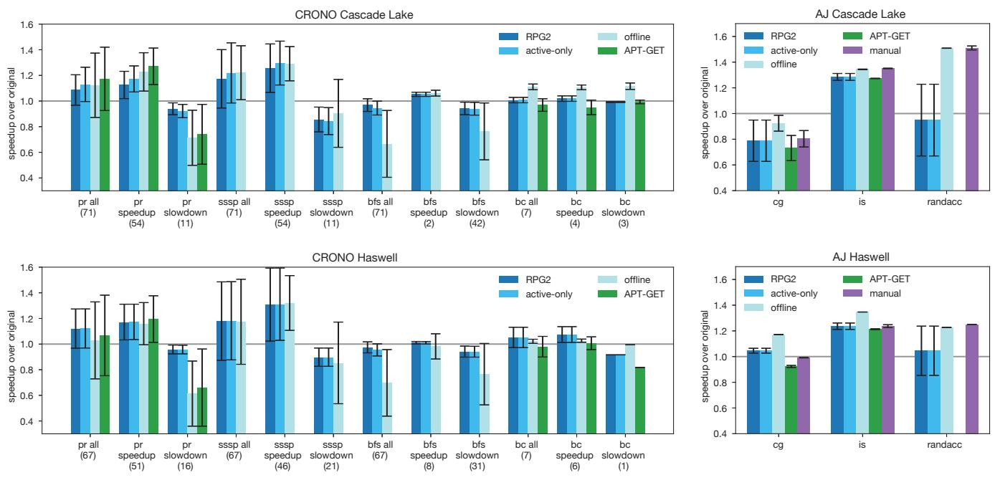
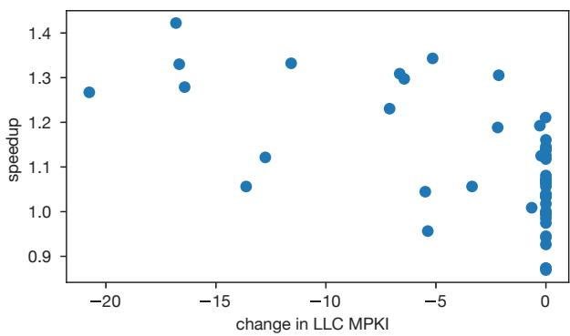
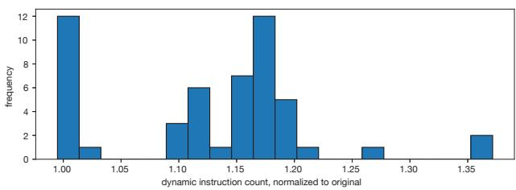

# RPG2: Robust Profile-Guided Runtime Prefetch Generation 图表详解

### Figure 1. The sssp benchmark from CRONO [2] has very different optimal prefetch distances (shaded regions) with different inputs.

- 图表展示了 **sssp** 基准测试在 **Haswell** 架构上的性能表现，横轴为 **prefetch distance**（预取距离），纵轴为 **speedup**（加速比），基准线为 1.0。
- 四条曲线分别代表不同输入数据集：**RO-edges**（绿色）、**amazon0601**（蓝色）、**gowalla**（紫色）、**NotreDame**（橙色）。
- 每条曲线的**阴影区域**标示了该输入下**最优预取距离范围**，即加速比最高的区间：
    - **RO-edges**：最优区间为 **20–34**，最高加速比接近 **1.8x**。
    - **amazon0601**：最优区间为 **70–100**，加速比稳定在 **1.2x** 左右。
    - **gowalla**：最优区间为 **1–2**，加速比约 **1.2x**，超过此范围性能迅速下降。
    - **NotreDame**：无明显最优区间，整体加速比接近或低于 1.0，部分距离甚至导致性能下降。
- 数据表明，**同一程序在不同输入下，最优预取距离差异巨大**，静态编译器难以统一优化。
- 表格总结各输入最优预取距离与性能表现：

| 输入数据集 | 最优预取距离范围 | 最高加速比 | 性能趋势                   |
| ---------- | ---------------- | ---------- | -------------------------- |
| RO-edges   | 20–34            | ~1.8x      | 明显峰值，范围较宽         |
| amazon0601 | 70–100           | ~1.2x      | 平缓上升后趋于稳定         |
| gowalla    | 1–2              | ~1.2x      | 窄峰，过早或过晚均显著降速 |
| NotreDame  | 无明确最优       | ≤1.0x      | 多数距离无收益，部分有害   |

- 此图直观揭示了**预取距离对性能的高度敏感性**，强调动态调整的必要性，也是 RPG2 系统设计的核心动机。

### Figure 2. The pr benchmark from CRONO [2] sees a speedup or a slowdown with prefetching, depending on the microarchitecture.

- 图表展示了 **CRONO** 套件中的 **pr** 基准测试在不同微架构和输入下的性能表现，纵轴为 **speedup（越高越好）**，横轴为 **prefetch distance**。
- 四条曲线分别代表两种输入（**wiki-topcats** 和 **tvshow-edges**）在两种微架构（**Cascade Lake** 和 **Haswell**）上的表现：
    - **wiki-topcats Cascade Lake**：虚线浅蓝色，整体表现优异，speedup 稳定在 1.75–2.00 区间。
    - **tvshow-edges Haswell**：实线深绿色，表现中等，speedup 在 1.00–1.25 之间波动。
    - **wiki-topcats Haswell**：实线浅蓝色，表现较差，speedup 接近 1.00，部分区域甚至低于 1.00。
    - **tvshow-edges Cascade Lake**：虚线深绿色，表现最差，speedup 多数时间低于 1.00，表明 prefetching 导致性能下降。
- 数据总结如下：

| 输入         | 微架构       | 性能趋势             | 最大 speedup |
| ------------ | ------------ | -------------------- | ------------ |
| wiki-topcats | Cascade Lake | 显著提升             | ~2.00        |
| tvshow-edges | Haswell      | 轻微提升             | ~1.25        |
| wiki-topcats | Haswell      | 基本无提升或轻微下降 | ~1.00        |
| tvshow-edges | Cascade Lake | 明显下降             | \<1.00       |

- 关键发现：
    - **prefetching 的效果高度依赖于微架构与输入的组合**，同一输入在不同微架构上可能产生完全相反的效果。
    - **Cascade Lake** 对 **wiki-topcats** 输入表现出极佳的 prefetch 效果，但对 **tvshow-edges** 输入则适得其反。
    - **Haswell** 上 **tvshow-edges** 输入受益于 prefetching，而 **wiki-topcats** 则几乎无收益。
    - 这种不一致性凸显了静态编译器难以准确预测最优 prefetch 配置的问题，也说明了 **RPG2** 这类动态调整系统的重要性。

### Figure 3. The bfs benchmark from CRONO [2] often (but not always) suffers significant performance slowdown with prefetching.

- 图片展示了 **bfs** 基准测试在不同输入和微架构下的性能表现，横轴为 **prefetch distance**（预取距离），纵轴为 **speedup**（加速比），基准线为 1.0。
- **amazon0505** 输入在 **Cascade Lake** 上表现良好，加速比稳定在 1.0 以上，表明预取在此配置下有效。
- 同一输入 **amazon0505** 在 **Haswell** 上加速比略低于 1.0，说明预取在此微架构下效果不佳或略有拖累。
- **RO-edges** 输入在 **Haswell** 上加速比约为 0.45，显著低于基准线，表明预取导致严重性能下降。
- **RO-edges** 输入在 **Cascade Lake** 上加速比约为 0.3，性能下降更为严重，进一步凸显预取的负面影响。
- 数据表明，预取效果高度依赖于 **输入数据** 和 **微架构**，同一输入在不同硬件上表现差异巨大。
- 性能变化趋势显示，**prefetch distance** 的调整对性能影响有限，尤其在 RO-edges 输入中，无论距离如何调整，性能均未改善。

| 输入       | 微架构       | 加速比范围 | 性能趋势 |
| ---------- | ------------ | ---------- | -------- |
| amazon0505 | Cascade Lake | >1.0       | 稳定提升 |
| amazon0505 | Haswell      | ~0.95      | 轻微下降 |
| RO-edges   | Haswell      | ~0.45      | 显著下降 |
| RO-edges   | Cascade Lake | ~0.3       | 极度下降 |

- 此图印证了论文核心观点：**预取是双刃剑**，不当使用会导致性能大幅下滑，需动态调整以适应运行时环境。

### Figure 4. RPG2 proceeds through four phases when optimizing a target process.

- 图片展示了 RPG2 系统优化目标进程的四个核心阶段，从左至右依次为：**Profile**、**Build new binary**、**Insert code** 和 **Tune**。
- 在第一阶段 **Profile** 中，RPG2 通过分析运行中的目标进程，识别出频繁触发 LLC miss 的指令。图中示例代码 `ld [r3+r2]→r4` 被标记为高频 LLC miss 源，其前向依赖链（backwards slice）被提取用于后续 prefetch kernel 构建。
- 第二阶段 **Build new binary** 基于 BOLT 工具生成新二进制文件。图中红色高亮部分为插入的 **prefetch kernel**，包含：
    - 寄存器保存（`push r5`）
    - 地址计算（`add r1, #20→r5`，其中 20 为初始 prefetch distance）
    - 边界检查（`cmp r5, #100; bgte cleanup`）
    - 预取指令（`pf [r3+r5]`）
    - 清理与恢复（`pop r5`）
    - 原始循环体继续执行
- 第三阶段 **Insert code** 将新函数 `newtop` 注入目标进程地址空间。此阶段需暂停进程，通过 `ptrace` 或 `libpg2` 实现代码替换，并更新所有指向原函数 `top` 的调用点和栈返回地址，确保控制流正确跳转至 `newtop`。
- 第四阶段 **Tune** 对 prefetch distance 进行动态调整。图中显示将距离从 20 修改为 32（`add r1, #32→r2`），该过程通过修改机器码中的立即数实现，每次调整仅需重写少量字节，且伴随短暂进程暂停。
- 整个流程强调 **在线优化** 与 **无侵入式回退**：若 tuning 后性能未提升，RPG2 可快速回滚至原始代码 `top`，避免性能损失。
- 关键术语保留英文：**LLC miss**、**prefetch kernel**、**backwards slice**、**BOLT**、**ptrace**、**libpg2**。
- 该图直观呈现了 RPG2 如何在不中断程序语义的前提下，动态注入并优化 prefetch 指令，体现其“**robust**”特性——既能提升性能，也能安全回退。

| 阶段             | 主要操作                   | 关键技术/组件            | 目标                   |
| ---------------- | -------------------------- | ------------------------ | ---------------------- |
| Profile          | 识别高频 LLC miss 指令     | PEBS, perf               | 定位可优化点           |
| Build new binary | 插入 prefetch kernel       | BOLT, InjectPrefetchPass | 生成含预取逻辑的新函数 |
| Insert code      | 注入新函数到运行进程       | ptrace, libpg2, OSR      | 实现运行时代码替换     |
| Tune             | 动态调整 prefetch distance | IPC 监控, 二分搜索       | 找到最优预取距离或回退 |

- 图中箭头与虚线框清晰划分各阶段边界，强调“**paused**”状态仅在关键操作时发生，其余时间目标进程正常运行，最小化性能干扰。

### Table 1. Memory access categories that RPG2 supports

- 图片内容为 **Table 1**，标题为 “Memory access categories that RPG2 supports”，用于说明 RPG2 系统支持的三种内存访问模式及其对应的预取策略。
- 表格包含三列：**demand access**（需求访问）、**prefetch**（预取表达式）、**description**（描述）。
- 三种访问模式均基于数组和循环变量构建，适用于常见数据结构如密集数组、稀疏数组和 stencil 模式。

| demand access  | prefetch         | description                                                   |
| -------------- | ---------------- | ------------------------------------------------------------- |
| a[j]           | a[j+d]           | **direct access using inner loop induction var**              |
| a\[f(b[j])\]   | a\[f(b[j+d])\]   | **indirect access using inner loop induction var**            |
| a\[f(b[i])+j\] | a\[f(b[i+d])+j\] | **indirect access using inner and outer loop induction vars** |

- 第一行对应直接访问模式，RPG2 在内层循环中对索引 `j` 偏移 `d` 进行预取，适用于具有空间局部性的数组访问。
- 第二行对应间接访问模式，通过函数 `f` 对 `b[j]` 的结果进行寻址，预取时将 `j` 替换为 `j+d`，以覆盖更复杂的指针链式访问。
- 第三行对应嵌套循环中的混合访问模式，使用外层循环变量 `i` 和内层变量 `j`，预取时仅偏移外层变量 `i` 至 `i+d`，该策略在实验中表现优于同时偏移内外层变量。
- RPG2 当前仅支持这三类模式，但作者指出其已覆盖多数实际代码场景，如稠密/稀疏数组与 stencil 计算。
- 未支持的模式包括纯指针结构（无数组参与），留待未来扩展。

### Figure 5. Annotated example of RPG2 code transformations.

- 图片展示了 RPG2 系统对一段原始汇编代码进行优化的完整流程，核心目标是为**间接内存访问**（如 `ld [r3+r2]→r4`）插入**prefetch kernel**，同时保证语义不变。
- 原始代码是一个循环体，包含两个关键加载指令：`ld [r0+r1]→r2` 和 `ld [r3+r2]→r4`。其中，后者是导致 LLC miss 的热点负载，被选为 prefetch 目标。
- RPG2 通过**backwards slicing**分析数据依赖链，从 `ld [r3+r2]→r4` 回溯至 `ld [r0+r1]→r2`，确认其属于 `a[??(b[j])]` 类型的间接访问模式，从而决定在**外层循环头**插入 prefetch kernel。
- 优化后的代码结构清晰分为三部分：
    - **Prefetch Kernel**：位于 `newtop` 标签下，负责计算并执行 prefetch 指令。
    - **Cleanup**：恢复被借用寄存器的状态。
    - **Original Loop Body**：保持原有逻辑不变。
- 具体优化步骤如下：
    - **保存寄存器**：`push r5` 将寄存器 `r5` 压栈，作为临时工作寄存器。
    - **计算 prefetch 地址**：`add r1, #20→r5` 计算 20 个迭代后的地址偏移量。
    - **边界检查**：`cmp r5, #100` 和 `bgte cleanup_` 确保不会访问非法内存。
    - **执行 prefetch**：`ld [r0+r5]→r5` 和 `pf [r3+r5]` 分别加载索引和发出 prefetch 指令。
    - **恢复状态**：`pop r5` 恢复原寄存器值。
    - **执行原循环体**：后续指令与原始代码完全一致。
- 整个过程体现了 RPG2 的设计哲学：**NOP-like semantics**，即 prefetch kernel 在功能上等价于空操作，仅增加预取行为，不改变程序逻辑。
- 该图还用箭头标注了控制流路径，清晰展示了 prefetch kernel 如何无缝嵌入到原有循环中，确保程序正确性和性能提升。

### Figure 6. The PC register and code memory of the target process before and after, RPG2’s code replacement.

- 图片展示了 RPG2 系统在运行时进行 **代码替换** 的前后对比，核心目标是将原始函数 `f0` 替换为优化后的函数 `f1`，同时保持程序语义不变。
- **“before” 部分**：
    - 程序计数器（PC）指向函数 `f0` 的某条指令，表示当前正在执行 `f0`。
    - 函数 `g0` 和 `h0` 内部均包含对 `f0` 的调用指令（`call f0`），即它们的执行流会跳转到 `f0`。
    - 所有调用和执行都围绕 `f0` 进行，此时系统尚未应用任何优化。
- **“after” 部分**：
    - RPG2 将优化后的函数 `f1` 放置在内存中的新位置（红色区域），而原始函数 `f0` 仍保留在原处。
    - 所有原本调用 `f0` 的指令（如 `g0` 和 `h0` 中的 `call f0`）被修改为调用 `f1`（即 `call f1`）。
    - PC 指针已更新，指向 `f1` 中对应的指令位置，确保线程从 `f0` 的执行点无缝切换到 `f1` 的对应位置。
    - 此设计允许 RPG2 在性能退化时快速回滚至 `f0`，无需重新编译或重启进程。
- 关键机制：RPG2 利用 **BOLT Address Translation Table (BATT)** 实现 **On-Stack Replacement (OSR)**，将 `f0` 的 PC 映射到 `f1` 的等效位置，从而支持在函数执行中途切换版本。
- 优势总结：

| 特性               | 描述                                                       |
| ------------------ | ---------------------------------------------------------- |
| **零数据布局变更** | Prefetch kernel 设计为逻辑 NOP，不改变寄存器或栈变量分配。 |
| **安全回滚**       | 若 `f1` 导致性能下降，可恢复至 `f0`，保留原始性能。        |
| **低开销注入**     | 使用 `libpg2` 直接操作目标进程内存，避免频繁系统调用。     |
| **兼容性**         | 无需源码，仅依赖二进制文件，适用于 C/C++ 等非托管语言。    |

- 该图直观体现了 RPG2 如何在运行时动态插入并激活优化代码，同时保障程序稳定性和性能可逆性。

### Figure 7. RPG2 and baseline performance on Cascade Lake (top) and Haswell (bottom).

- 图片展示了 RPG2 系统在 Cascade Lake 和 Haswell 两种微架构上的性能表现，对比了多个基线方案，包括 **APT-GET**、**offline**、**active-only** 和 **manual**。
- 数据按基准测试（CRONO 和 AJ）和机器类型分组，每个柱状图代表不同输入集合的平均加速比（speedup over original），误差条表示标准差。
- CRONO 基准测试包含 pr、sssp、bfs 和 bc，AJ 基准测试包含 cg、is 和 randacc。每个基准测试进一步细分为“all”、“speedup”和“slowdown”三组，分别对应所有输入、仅加速输入和仅减速输入。
- 在 Cascade Lake 上，RPG2 在 pr 和 sssp 的“speedup”组中表现优异，接近或超过 offline 和 APT-GET；但在 bfs 的“slowdown”组中，RPG2 显著优于其他方案，因其能自动回滚至原始代码。
- 在 Haswell 上，RPG2 在 pr 和 sssp 的“speedup”组中仍保持竞争力，但在 bfs 的“slowdown”组中优势更加明显，因为其能有效避免 prefetching 带来的性能下降。
- 对于 AJ 基准测试，RPG2 在 is 和 randacc 上表现良好，尤其在 Haswell 上接近 manual 优化水平；但在 cg 上表现较弱，可能因输入特性或 prefetching 策略不匹配。
- **active-only** 模式仅在收集到足够 profiling 数据时激活优化，因此其性能通常低于 full RPG2，但高于 offline，表明 online profiling 存在一定噪声和延迟。
- **offline** 模式始终启用 prefetching，虽在部分输入上表现最佳，但在 prefetching 有害的输入上会导致显著 slowdown，而 RPG2 能动态规避此类情况。
- 总体而言，RPG2 在保证性能提升的同时，通过动态调整和回滚机制，显著提升了 prefetching 的鲁棒性，尤其在面对输入和微架构变化时表现稳定。

| Benchmark | Machine      | Group         | RPG2 Speedup | APT-GET Speedup | Offline Speedup | Notes                |
| --------- | ------------ | ------------- | ------------ | --------------- | --------------- | -------------------- |
| pr        | Cascade Lake | all (71)      | ~1.2         | ~1.1            | ~1.2            | RPG2 与 offline 相当 |
| pr        | Cascade Lake | speedup (54)  | ~1.3         | ~1.2            | ~1.3            | RPG2 略优            |
| pr        | Cascade Lake | slowdown (11) | ~0.9         | ~0.8            | ~0.7            | RPG2 明显优于其他    |
| sssp      | Cascade Lake | all (71)      | ~1.3         | ~1.2            | ~1.3            | RPG2 与 offline 相当 |
| sssp      | Cascade Lake | speedup (54)  | ~1.4         | ~1.3            | ~1.4            | RPG2 略优            |
| sssp      | Cascade Lake | slowdown (11) | ~0.8         | ~0.7            | ~0.6            | RPG2 明显优于其他    |
| bfs       | Cascade Lake | all (71)      | ~1.0         | ~0.9            | ~1.0            | RPG2 与 offline 相当 |
| bfs       | Cascade Lake | speedup (2)   | ~1.1         | ~1.0            | ~1.1            | RPG2 略优            |
| bfs       | Cascade Lake | slowdown (42) | ~0.7         | ~0.6            | ~0.5            | RPG2 明显优于其他    |
| bc        | Cascade Lake | all (7)       | ~1.1         | ~1.0            | ~1.1            | RPG2 与 offline 相当 |
| bc        | Cascade Lake | speedup (4)   | ~1.2         | ~1.1            | ~1.2            | RPG2 略优            |
| bc        | Cascade Lake | slowdown (3)  | ~0.9         | ~0.8            | ~0.7            | RPG2 明显优于其他    |
| pr        | Haswell      | all (67)      | ~1.2         | ~1.1            | ~1.2            | RPG2 与 offline 相当 |
| pr        | Haswell      | speedup (51)  | ~1.3         | ~1.2            | ~1.3            | RPG2 略优            |
| pr        | Haswell      | slowdown (16) | ~0.8         | ~0.7            | ~0.6            | RPG2 明显优于其他    |
| sssp      | Haswell      | all (67)      | ~1.3         | ~1.2            | ~1.3            | RPG2 与 offline 相当 |
| sssp      | Haswell      | speedup (46)  | ~1.4         | ~1.3            | ~1.4            | RPG2 略优            |
| sssp      | Haswell      | slowdown (21) | ~0.7         | ~0.6            | ~0.5            | RPG2 明显优于其他    |
| bfs       | Haswell      | all (67)      | ~1.0         | ~0.9            | ~1.0            | RPG2 与 offline 相当 |
| bfs       | Haswell      | speedup (8)   | ~1.1         | ~1.0            | ~1.1            | RPG2 略优            |
| bfs       | Haswell      | slowdown (31) | ~0.6         | ~0.5            | ~0.4            | RPG2 明显优于其他    |
| bc        | Haswell      | all (7)       | ~1.1         | ~1.0            | ~1.1            | RPG2 与 offline 相当 |
| bc        | Haswell      | speedup (6)   | ~1.2         | ~1.1            | ~1.2            | RPG2 略优            |
| bc        | Haswell      | slowdown (1)  | ~0.9         | ~0.8            | ~0.7            | RPG2 明显优于其他    |
| cg        | Cascade Lake | -             | ~0.8         | ~0.7            | ~0.9            | RPG2 表现一般        |
| is        | Cascade Lake | -             | ~1.3         | ~1.2            | ~1.3            | RPG2 与 offline 相当 |
| randacc   | Cascade Lake | -             | ~1.4         | ~1.3            | ~1.4            | RPG2 略优            |
| cg        | Haswell      | -             | ~1.0         | ~0.9            | ~1.1            | RPG2 表现一般        |
| is        | Haswell      | -             | ~1.2         | ~1.1            | ~1.2            | RPG2 与 offline 相当 |
| randacc   | Haswell      | -             | ~1.3         | ~1.2            | ~1.3            | RPG2 略优            |

- 关键结论：**RPG2 的核心优势在于其动态适应能力**，不仅能捕捉输入和微架构变化带来的性能差异，还能在 prefetching 有害时自动回滚，从而在整体上提供更稳定和可靠的性能提升。

### Figure 8. How close RPG2 gets to the optimal prefetch distance, for inputs with a single optimal distance.

- 图表标题为 **Figure 8**，主题是评估 RPG2 在具有单一最优预取距离的输入上，其搜索结果与真实最优值之间的偏差。
- 横轴表示 **absolute distance from optimal prefetch distance**，即 RPG2 找到的距离与真实最优距离之间的绝对差值，单位为迭代次数。
- 纵轴表示 **frequency**，即在 120 个测试输入中，对应偏差值出现的频次。
- 数据分布呈现明显的右偏态：**大部分输入（约 50%）的偏差在 10 以内**，其中偏差为 0–3 的输入有 22 个，偏差为 4–10 的输入合计约 36 个。
- 偏差超过 20 的输入数量显著减少，但仍有部分输入存在较大误差，如偏差在 50–60 区间内仍存在多个案例。
- 最大偏差接近 65，表明在少数极端情况下，RPG2 的搜索未能收敛至最优解。
- 作者指出，**性能增益并不总是随距离逼近最优值而线性提升**，因此即使存在一定偏差，实际性能影响可能有限。
- 主要误差来源是 **IPC 测量噪声**，导致搜索空间被误判，从而提前终止或偏离最优路径。

| 偏差区间 | 频次（输入数） | 占比（近似） |
| -------- | -------------- | ------------ |
| 0–3      | 22             | 18.3%        |
| 4–10     | ~36            | ~30%         |
| 11–20    | ~15            | ~12.5%       |
| 21–30    | ~10            | ~8.3%        |
| 31–40    | ~5             | ~4.2%        |
| 41–50    | ~3             | ~2.5%        |
| 51–60    | ~8             | ~6.7%        |
| >60      | ~2             | ~1.7%        |

- 总体而言，RPG2 的预取距离搜索算法在大多数情况下表现良好，但在高噪声环境下仍有改进空间。

### Figure 9. The impact of profiling phase duration on RPG2’s optimization activation.

- 图表标题为 **Figure 9**，主题是 **profiling phase duration** 对 **RPG2’s optimization activation** 的影响。
- 横轴表示 **profiling phase duration**，取值为 **0.5s, 1s, 2s, 4s**；纵轴为百分比，范围从 **0% 到 100%**。
- 纵向堆叠柱状图分为三段：
    - **蓝色底部区域（always）**：表示在所有运行中，RPG2 的优化阶段（代码生成、注入和调优）**始终被激活**。
    - **浅蓝色中间区域（mixed）**：表示优化阶段**有时被激活，有时未被激活**。
    - **红色顶部区域（never）**：表示优化阶段**从未被激活**。
- 数据趋势显示：
    - 随着 **profiling duration 增加**，**always 区域扩大**，说明更长的采样时间提高了 RPG2 成功触发优化的概率。
    - **never 区域缩小**，表明较长的 profiling 减少了因数据不足导致优化失败的情况。
    - **mixed 区域变化较小**，说明部分输入对 profiling 时间不敏感。
- 具体数值估算（基于视觉比例）：

| Profiling Duration | Always (%) | Mixed (%) | Never (%) |
| ------------------ | ---------- | --------- | --------- |
| 0.5s               | ~38%       | ~47%      | ~15%      |
| 1s                 | ~40%       | ~45%      | ~15%      |
| 2s                 | ~39%       | ~48%      | ~13%      |
| 4s                 | ~48%       | ~40%      | ~12%      |

- 结论：**延长 profiling phase 可提升 RPG2 优化激活率**，但边际收益递减。默认设置 **2s** 是兼顾效率与效果的合理折衷。

### Figure 10. RPG2’s impact on IPC over time.

- 图片展示了 RPG2 系统在两个不同输入（higgs-retweet_network 和 soc-sign-bitcoinalpha-edit）下对 IPC（Instructions Per Cycle）随时间变化的影响，用于评估其在线优化行为。
- 左图对应 higgs-retweet_network 输入，在 Haswell 机器上运行。初始 IPC 约为 **0.44**，在约 **6 秒**处因 RPG2 进入代码注入与调优阶段而短暂下降，随后稳定在 **0.55** 以上，最终选定 prefetch distance 为 **62**，实现 **超过 25% 的 IPC 提升**。
- 右图对应 soc-sign-bitcoinalpha-edit 输入，在 Cascade Lake 机器上运行。初始 IPC 约为 **2.0**，在约 **3 秒**后进入 prefetch active 阶段（阴影区域），但 IPC 不升反降，表明 prefetching 有害性能；RPG2 在约 **8 秒**时检测到此情况并执行 rollback，恢复至原始代码，IPC 回升至 **2.0** 附近。
- 两张图共同说明 RPG2 能动态响应程序行为：在有益时提升性能，在有害时快速回退，避免持续性能损失。
- 关键操作时间点：
    - **代码注入与调优暂停**：发生在第 6 秒（左图）和第 3–8 秒（右图），期间 IPC 波动。
    - **Rollback 触发**：右图中于第 8 秒完成，恢复原始性能。
- RPG2 的核心能力体现在：
    - **实时监测 IPC 变化**作为性能指标。
    - **自动决策是否启用或禁用 prefetch**，无需人工干预。
    - **支持 On-Stack Replacement (OSR)**，确保在函数执行中途也能安全切换代码版本。

| 时间点 (秒) | 事件描述                             | IPC 变化趋势     |
| ----------- | ------------------------------------ | ---------------- |
| 0–6         | 初始执行 + profiling                 | 稳定或轻微波动   |
| 6           | 代码注入与调优开始                   | 短暂下降         |
| 6–9         | 调优完成，启用最优 prefetch distance | 显著上升（左图） |
| 3–8         | prefetch active（有害案例）          | 下降 → 持续低谷  |
| 8           | Rollback 至原始代码                  | 恢复至初始水平   |

- 此图验证了 RPG2 的“鲁棒性”设计目标：不仅追求性能提升，更关键的是能识别并规避性能陷阱，确保系统整体稳定性。

### Figure 11. The relationship between speedup and LLC MPKI for pr on Cascade Lake.

- 图表展示了在 Cascade Lake 平台上运行 pr 基准测试时，**speedup** 与 **LLC MPKI（Last-Level Cache Misses Per Kilo-Instruction）变化量**之间的关系。
- 横轴为“change in LLC MPKI”，表示相对于无 prefetch 基线的 LLC 缺失率变化，负值代表减少，正值代表增加；纵轴为 speedup，即性能加速比。
- 数据点分布显示：**大部分数据点集中在横轴负半轴**，表明 RPG2 的 prefetch 机制普遍降低了 LLC MPKI，即减少了缓存缺失。
- 尽管 LLC MPKI 降低，但 speedup 并未呈现强正相关性。例如：
    - 当 LLC MPKI 减少约 -15 时，speedup 可达 1.3–1.4；
    - 但当 LLC MPKI 减少至 -5 左右时，speedup 仍可高达 1.3；
    - 同时，部分数据点即使 LLC MPKI 几乎无变化（接近 0），speedup 仍维持在 1.1–1.2 区间。
- 存在少量数据点位于横轴右侧（LLC MPKI 增加），其 speedup 多数低于 1.0，说明 prefetch 在这些情况下反而导致性能下降。
- 图中密集簇状分布于横轴接近 0、纵轴 1.0–1.2 区域，暗示部分输入下 prefetch 对 LLC MPKI 影响微弱，但仍有小幅性能提升，可能源于其他层级缓存或 DRAM 带宽优化。
- 该图验证了论文第 4.4 节结论：**LLC MPKI 不是衡量 prefetch 效果的可靠指标**，因为性能提升不仅依赖于 LLC 缺失减少，还受其他内存层级行为和带宽竞争影响。

| 横轴区间 (change in LLC MPKI) | 纵轴表现 (speedup) | 性能趋势       |
| ----------------------------- | ------------------ | -------------- |
| -20 至 -15                    | 1.3 – 1.4          | 显著加速       |
| -15 至 -5                     | 1.1 – 1.3          | 中等加速       |
| 接近 0                        | 1.0 – 1.2          | 微幅加速或持平 |
| > 0                           | < 1.0              | 性能退化       |

- 综上，该图揭示了 prefetch 优化效果的复杂性：**仅靠降低 LLC MPKI 无法准确预测性能收益**，RPG2 的在线调优机制正是为了应对这种非线性、多因素耦合的性能响应。

### 730aba1441c65a0b28581ce05a8fe5cdd1337d9e8945548c95855ca07331eae4.jpg

- 该图片为 **Table 2**，标题为“Average latency of RPG2 operations”，展示了 RPG2 系统在不同基准测试（benchmark）中关键操作的平均延迟数据。
- 表格包含六行和八列，其中第一列为操作类型，其余七列为不同基准测试：pr、sssp、bfs、bc、is、randacc、cg。
- 所有数据单位均为毫秒（ms），除第一行“RPG² exec (s)”单位为秒（s），表示 RPG2 整体执行时间。
- 数据显示，**BOLT 生成二进制文件耗时最长**，平均在 26.4ms 至 32.0ms 之间，其中 randacc 最高（32.0ms），cg 最低（26.4ms）。
- **代码插入（code insert）** 耗时稳定，各基准测试均在 2.9ms 至 3.9ms 之间，cg 最快（2.9ms），pr 最慢（3.9ms）。
- **单次 prefetch distance 编辑（1x pd edit）** 耗时极短，所有基准测试均在 1.1ms 至 1.4ms 之间，randacc 和 is 最快（1.1ms），bfs 最慢（1.4ms）。
- **prefetch distance 编辑次数（# pd edits）** 平均在 8.8 至 12.7 次之间，bc 最高（12.7），randacc 最低（8.8）。
- RPG2 整体执行时间（RPG² exec）从 7.6 秒（pr）到 8.8 秒（cg）不等，表明系统在后台运行时对主程序影响较小。
- 数据表明，RPG2 的**停机操作（stop-the-world）延迟极低**，如代码插入和单次编辑均在毫秒级，确保了在线优化的实时性。
- 表格数据支持论文第 4.3.1 节结论：RPG2 的关键操作延迟低，对性能干扰小，符合其“轻量级在线优化”设计目标。

### Figure 12. RPG2’s impact on dynamic instruction count for pr on Cascade Lake.

- 图片展示了 RPG2 系统在 Cascade Lake 平台上对 pr 基准测试的 **动态指令计数**（dynamic instruction count）影响，数据已归一化至原始无预取版本。
- 横轴表示归一化后的指令计数比例，从 1.00（无额外开销）到 1.35（增加 35%），纵轴为对应比例出现的频率。
- 数据分布显示：**约一半输入**的指令计数增幅低于 15%，集中在 1.00–1.15 区间；最差情况增幅达 **37%**，出现在 1.35 区间。
- 高频峰值位于 1.15 和 1.20，表明多数输入因 prefetch kernel 的插入导致指令数适度增长，但整体仍被性能增益所抵消。
- 该图验证了 RPG2 的开销可控性：尽管引入了额外计算逻辑（如地址计算、边界检查），其带来的指令膨胀并未显著拖累整体性能。

| 归一化指令计数 | 频率（近似） | 性能影响说明           |
| -------------- | ------------ | ---------------------- |
| 1.00           | 12           | 无额外开销，极少数情况 |
| 1.05           | 1            | 几乎无影响             |
| 1.10–1.15      | 6–12         | 中等开销，常见范围     |
| 1.20           | 5            | 较高开销，但仍可接受   |
| 1.25–1.35      | 1–2          | 最高开销，仅少数输入   |

- 结论：RPG2 的 prefetch kernel 引入的指令开销是**输入依赖型**的，取决于数据结构大小与预取距离，但系统设计确保了即使在最坏情况下，性能收益仍能覆盖此开销。

### 30d16b2b71fbc63c4f826cad21b9ce416d506db55f96a7c7a9e9ac5e0706ce34.jpg

- 该图片展示的是 **Table 3**，标题为“**The influence of prefetch distance on performance**”，用于量化不同程序输入和微架构下，预取距离对性能的影响模式。
- 表格按 **benchmark**（pr, sssp, bfs, bc）和 **microarchitecture**（Cascade Lake, Haswell）分类，统计了每种组合下不同性能行为类型的输入数量。
- 性能行为类型共八类，包括：
    - **single optimal**：存在唯一最优预取距离。
    - **range optimal**：存在一个连续的最优距离区间。
    - **asymptotic**：性能随距离增加趋于饱和。
    - **both bad**：在两种微架构上预取均导致性能下降。
    - **Haswell bad**：仅在 Haswell 上有害。
    - **Cascade bad**：仅在 Cascade Lake 上有害。
    - **noisy**：行为过于随机，无法清晰归类。
    - **other**：其余未归入上述类别的行为。

以下是表格数据整理：

| 类型           | Cascade Lake (pr) | Cascade Lake (sssp) | Cascade Lake (bfs) | Cascade Lake (bc) | Haswell (pr) | Haswell (sssp) | Haswell (bfs) | Haswell (bc) |
| -------------- | ----------------- | ------------------- | ------------------ | ----------------- | ------------ | -------------- | ------------- | ------------ |
| single optimal | 26                | 25                  | 1                  | 2                 | 18           | 23             | 0             | 1            |
| range optimal  | 2                 | 7                   | 1                  | 3                 | 7            | 9              | 0             | 0            |
| asymptotic     | 15                | 13                  | 2                  | 2                 | 18           | 14             | 1             | 6            |
| both bad       | 11                | 10                  | 52                 | 0                 | 11           | 10             | 52            | 0            |
| Haswell bad    | -                 | -                   | -                  | -                 | 1            | 1              | 5             | 0            |
| Cascade bad    | 2                 | 2                   | 5                  | 0                 | -            | -              | -             | -            |
| noisy          | 4                 | 3                   | 1                  | 0                 | 7            | 2              | 4             | 1            |
| other          | 2                 | 2                   | 0                  | 2                 | 0            | 3              | 0             | 1            |

- 数据表明，**bfs** 在两种微架构上绝大多数输入都属于 **both bad** 类型，说明其预取极易导致性能退化。
- **pr** 和 **sssp** 的输入中，**single optimal** 和 **asymptotic** 占比较高，意味着在这两个基准测试中，通过搜索或固定距离仍可能获得较好收益。
- **bc** 基准测试样本较少，但显示在 Haswell 上更倾向于 **asymptotic** 行为。
- **Haswell bad** 和 **Cascade bad** 类型的存在，凸显了预取效果对 **微架构高度敏感**，同一输入在不同机器上表现可能截然相反。
- **noisy** 类型在 Haswell 上出现频率更高，暗示其性能响应更不稳定，增加了自动调优难度。
- 该表支持论文核心论点：预取优化不能依赖静态编译，必须具备 **动态适应能力**，如 RPG2 所提供的运行时调整与回滚机制。

### Figure 13. The relationship between multiple loads’ prefetch distances and performance for sssp running the p2pGnutella05 input on Cascade Lake.

- 该图展示了在 **Cascade Lake** 微架构上运行 **sssp** 基准测试（输入为 **p2pGnutella05**）时，两个独立负载（**load0** 和 **load1**）的 **prefetch distance** 对性能（以 **speedup** 衡量）的影响。
- 图中三维曲面表示不同 **load0 prefetch distance**（x轴）与 **load1 prefetch distance**（y轴）组合下所获得的 **speedup**（z轴），颜色从蓝到黄绿渐变代表性能由低到高。
- **load0 prefetch distance** 的影响更为显著：当其值较小时（如20-40），无论 **load1 prefetch distance** 如何变化，整体 **speedup** 都较高；随着 **load0 prefetch distance** 增大，**speedup** 明显下降，表明 **load0** 是性能瓶颈的关键点。
- **load1 prefetch distance** 的影响相对次要：在 **load0 prefetch distance** 固定的情况下，调整 **load1 prefetch distance** 只能带来小幅性能波动（约 ±2%），说明其优化空间有限。
- 存在多个局部最优解：曲面并非平滑单调，而是呈现多个峰谷，意味着某些特定距离组合（如 load0=30, load1=60）可能比“对称”配置（两者距离相等）更优。
- RPG2 当前采用“对称”策略（即所有 prefetch location 使用相同距离），在此场景下可能无法达到理论最优性能，凸显了未来支持 **asymmetric prefetch distances** 的必要性。
- 性能敏感度高：即使微小的距离调整也可能导致 **speedup** 从 1.24 降至 1.12，说明 **prefetch distance tuning** 必须精确，且需动态适应运行时环境。

| 维度                        | 范围      | 性能趋势                                                      |
| --------------------------- | --------- | ------------------------------------------------------------- |
| **load0 prefetch distance** | 20–100    | **显著负相关**：距离越小，speedup越高；距离增大，性能急剧下降 |
| **load1 prefetch distance** | 20–100    | **弱相关**：在固定 load0 距离下，仅引起小幅波动（±2%）        |
| **speedup**                 | 1.12–1.24 | 最高可达 **1.24×**，最低跌至 **1.12×**，差距达 **10.7%**      |

- 该图验证了论文第 4.5 节观点：多负载场景下，**prefetch distance search space** 呈现非线性、非对称特性，静态或统一距离策略难以逼近最优解。
