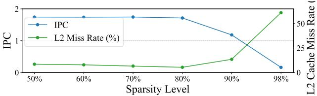
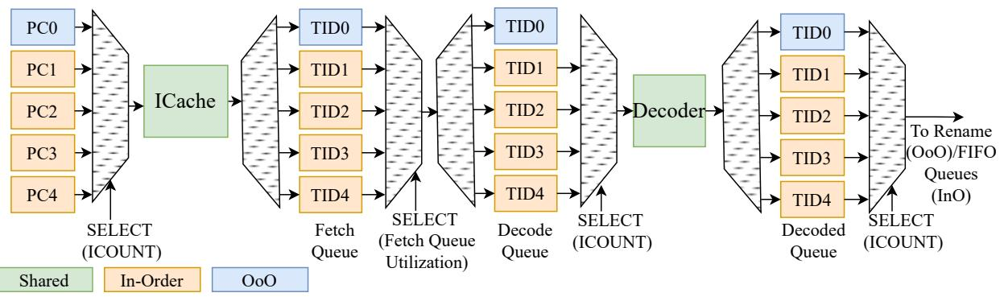
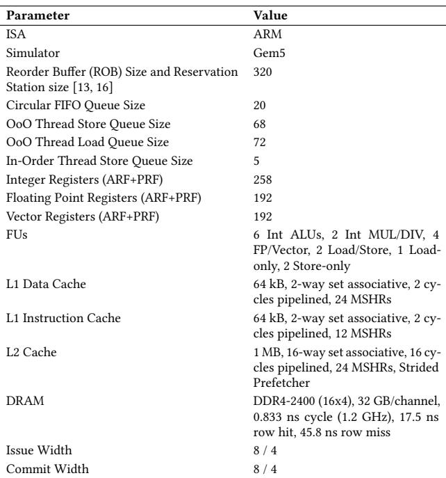
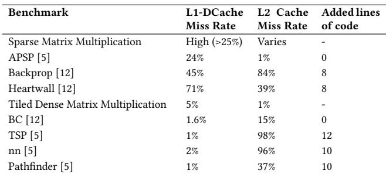
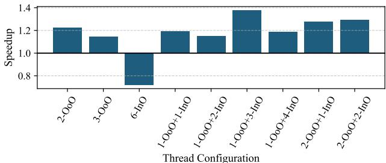
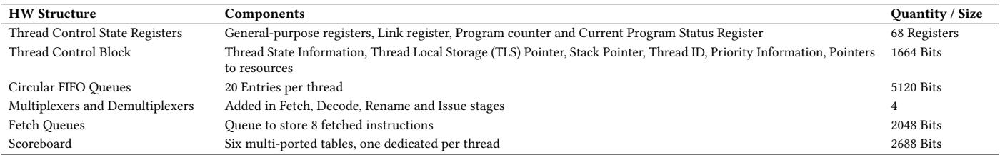
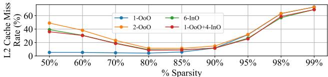

# SHADOW: Simultaneous Multi-Threading Architecture with Asymmetric Threads 图表详解

### Figure 1: SHADOW dynamically redistributes work as IPC changes.High ILP skews execution toward the OoO thread, while a low IPC distributes the work more evenly. SHADOW adapts to the application without software intervention.

- 图片展示了 SHADOW 架构在不同稀疏度（70% 和 98%）下，**OoO 线程与多个 InO 线程的 IPC 贡献比例及工作负载分配情况**，直观体现其动态适应能力。
- 左侧为 **70% 稀疏度场景**：
    - **IPC 分布**：OoO:Tid0 占比约 35%，四个 InO 线程（Tid1–Tid4）合计占比约 65%，其中 Tid1 和 Tid2 各占约 20%，Tid3 和 Tid4 各占约 12.5%。
    - **工作分配**：OoO:Tid0 执行约 50% 的工作量，InO 线程平均分担剩余 50%，表明此时 ILP 较高，OoO 线程仍主导执行。
- 右侧为 **98% 稀疏度场景**：
    - **IPC 分布**：OoO:Tid0 占比降至约 25%，四个 InO 线程合计占比提升至 75%，各线程贡献更均衡（Tid1–Tid4 各约 18.75%）。
    - **工作分配**：OoO:Tid0 仅执行约 25% 的工作，其余 75% 由四个 InO 线程均分，反映高稀疏度下 ILP 极低，系统自动将负载转移至轻量级 InO 线程。
- 关键结论：
    - 随着稀疏度增加，**ILP 下降、TLP 上升**，SHADOW 自动调整资源分配，无需软件干预。
    - OoO 线程在低稀疏度时高效利用 ILP，而在高稀疏度时让出执行权，避免因内存停顿导致的资源浪费。
    - InO 线程在高稀疏度下承担主要负载，因其无重命名和推测开销，能持续推进工作，维持整体吞吐。

| 稀疏度 | 线程类型 | IPC 占比 | 工作分配占比 |
| ------ | -------- | -------- | ------------ |
| 70%    | OoO:Tid0 | ~35%     | ~50%         |
|        | InO:Tid1 | ~20%     | ~12.5%       |
|        | InO:Tid2 | ~20%     | ~12.5%       |
|        | InO:Tid3 | ~12.5%   | ~12.5%       |
|        | InO:Tid4 | ~12.5%   | ~12.5%       |
| 98%    | OoO:Tid0 | ~25%     | ~25%         |
|        | InO:Tid1 | ~18.75%  | ~18.75%      |
|        | InO:Tid2 | ~18.75%  | ~18.75%      |
|        | InO:Tid3 | ~18.75%  | ~18.75%      |
|        | InO:Tid4 | ~18.75%  | ~18.75%      |

- 此图验证了 SHADOW 的核心优势：**通过硬件支持的异构 SMT + 软件工作窃取机制，在同一核心内无缝切换 ILP/TLP 平衡点，最大化资源利用率**。

### Figure 2: Change in the IPC and L2 cache misses of the SpMM application with varying sparsity.

- 图表展示了 **SpMM** 应用在不同稀疏度（Sparsity Level）下，**IPC** 与 **L2 Cache Miss Rate** 的变化趋势。
- 横轴为稀疏度，从 **50%** 到 **98%**，代表矩阵中非零元素比例递减。
- 左侧纵轴表示 **IPC**（Instructions Per Cycle），右侧纵轴表示 **L2 Cache Miss Rate (%)**。
- **IPC 曲线（蓝色）**：在稀疏度低于 **80%** 时保持高位稳定（约 1.8–2.0），随后随稀疏度增加急剧下降，在 **98%** 时降至接近 **0**。
- **L2 Miss Rate 曲线（绿色）**：在稀疏度低于 **80%** 时维持极低水平（\<5%），之后迅速攀升，在 **98%** 时达到 **~50%**。
- 两条曲线在 **~90% 稀疏度** 处交叉，表明此时 **ILP 开始显著衰减**，而 **内存访问压力剧增**。
- 数据表明，随着稀疏度提高，**内存访问模式愈发不规则**，导致缓存失效率上升，进而严重抑制 OoO 核心的指令级并行能力。
- 此图直观揭示了传统 OoO 架构在处理高稀疏度工作负载时的瓶颈，为 SHADOW 引入 InO 线程以提升 TLP 提供动机。

| Sparsity Level | IPC (approx.) | L2 Miss Rate (%) |
| -------------- | ------------- | ---------------- |
| 50%            | ~2.0          | \<5%             |
| 70%            | ~1.9          | \<5%             |
| 80%            | ~1.8          | ~5%              |
| 90%            | ~1.2          | ~25%             |
| 98%            | ~0.1          | ~50%             |

- 关键结论：**高稀疏度直接导致 ILP 崩溃与 L2 缓存失效激增**，凸显动态平衡 ILP/TLP 的必要性。

### Figure 3: Speedup of 95%-sparse SpMM on a single OoO thread, showing diminishing returns from enlarging the ROB/RS or LSQ sizes.

- 图表标题为 **Figure 3**，展示的是在 **95%-sparse SpMM** 工作负载下，单个 **OoO thread** 的性能加速比（Speedup）随 **ROB/RS** 或 **LSQ** 尺寸扩增的变化趋势，旨在揭示其**收益递减**现象。
- 横轴为 **ROB / Reservation Station Size**，取值点为 128、256、512，代表重排序缓冲区与保留站的容量规模。
- 纵轴为 **Speedup**，基准为 1.00，表示相对于最小配置（128）的性能提升倍数。
- 图中包含两条曲线：
    - **蓝色线（ROB scaling）**：对应不同 ROB/RS 大小下的加速比，同时标注了对应的 **LQ/SQ**（Load Queue / Store Queue）大小。
    - **橙色线（LSQ scaling）**：对应仅扩大 LSQ 容量时的加速比，ROB/RS 固定。

| ROB/RS Size | LQ/SQ Size (ROB scaling) | Speedup (ROB scaling) | Speedup (LSQ scaling) |
| ----------- | ------------------------ | --------------------- | --------------------- |
| 128         | LQ:72 / SQ:68            | 1.00                  | 1.00                  |
| 256         | LQ:144 / SQ:136          | ~1.05                 | ~1.01                 |
| 512         | LQ:216 / SQ:204          | ~1.06                 | ~1.01                 |

- **ROB scaling** 曲线显示，从 128 扩展到 256 时，性能提升约 **5%**；继续扩展至 512，仅再提升约 **1%**，表明**收益显著递减**。
- **LSQ scaling** 曲线几乎平坦，即使 LSQ 容量翻倍（从 68 到 204），性能提升微乎其微，说明在该工作负载下，**LSQ 并非瓶颈**。
- 图表结论：单纯扩大 **ROB/RS** 可带来有限性能提升，但边际效益快速下降；而扩大 **LSQ** 几乎无效。这支持论文观点——内存密集型负载如 SpMM 需要更高效的 TLP 而非单纯扩大 ILP 窗口。
- 该图用于论证传统 OoO 架构在稀疏内存负载下的局限性，为引入 **SHADOW** 的混合执行模型提供动机。

### Figure 4: Breakdown of IPC contributions from all threads for 95% sparse SpMM.

- 图片展示了在 **95% 稀疏 SpMM** 工作负载下，不同线程配置中各线程对 **IPC（Instructions Per Cycle）** 的贡献分解。

- 横轴为 **Thread Configuration**，从左至右依次为：1-OoO、1-OoO+1-InO、1-OoO+2-InO、1-OoO+3-InO、1-OoO+4-InO、2-OoO、2-OoO+1-InO、2-OoO+2-InO、3-OoO、6-InO。

- 纵轴为 IPC 值，范围从 0.0 到 1.5。

- 每个柱状图由多个颜色块堆叠而成，代表不同线程（Tid:0 至 Tid:5）的 IPC 贡献，颜色对应图例：

    - **Tid:0**: 深蓝色
    - **Tid:1**: 橙色
    - **Tid:2**: 绿色
    - **Tid:3**: 红色
    - **Tid:4**: 紫色
    - **Tid:5**: 黄色

- 关键观察点：

    - 在 **1-OoO** 配置下，仅 Tid:0（深蓝色）有贡献，IPC 约为 0.8。
    - 当引入 InO 线程时（如 1-OoO+1-InO），总 IPC 提升，且 Tid:1（橙色）开始贡献。
    - **1-OoO+4-InO** 配置下，总 IPC 达到峰值约 1.3，其中 OoO 线程（Tid:0）贡献约 0.5，四个 InO 线程（Tid:1 至 Tid:4）共同贡献剩余部分。
    - **2-OoO** 配置下，两个 OoO 线程（Tid:0 和 Tid:1）均有贡献，但总 IPC 略低于 1-OoO+4-InO。
    - **6-InO** 配置下，六个 InO 线程均参与执行，但总 IPC 低于混合配置，约为 1.0。

- 数据汇总表：

| Thread Configuration | Total IPC | OoO Threads (Tid:0,1,2) | InO Threads (Tid:1-5)      |
| -------------------- | --------- | ----------------------- | -------------------------- |
| 1-OoO                | ~0.8      | Tid:0                   | —                          |
| 1-OoO+1-InO          | ~1.0      | Tid:0                   | Tid:1                      |
| 1-OoO+2-InO          | ~1.1      | Tid:0                   | Tid:1, Tid:2               |
| 1-OoO+3-InO          | ~1.2      | Tid:0                   | Tid:1, Tid:2, Tid:3        |
| 1-OoO+4-InO          | ~1.3      | Tid:0                   | Tid:1, Tid:2, Tid:3, Tid:4 |
| 2-OoO                | ~1.2      | Tid:0, Tid:1            | —                          |
| 2-OoO+1-InO          | ~1.1      | Tid:0, Tid:1            | Tid:2                      |
| 2-OoO+2-InO          | ~1.0      | Tid:0, Tid:1            | Tid:2, Tid:3               |
| 3-OoO                | ~0.9      | Tid:0, Tid:1, Tid:2     | —                          |
| 6-InO                | ~1.0      | —                       | Tid:0 至 Tid:5             |

- 结论：
    - **混合 OoO + InO 配置**（特别是 1-OoO+4-InO）在 95% 稀疏 SpMM 上实现了最高的 IPC，表明 SHADOW 架构能有效平衡 ILP 与 TLP。
    - 单纯增加 OoO 线程（如 3-OoO）或全部使用 InO 线程（6-InO）均无法达到最优性能。
    - **InO 线程**在内存密集型工作负载中能有效补充 OoO 线程的不足，提升整体资源利用率。

### Figure 5: Microarchitecture design of SHADOW configured with 1 OoO and 4 InO threads.

- **图5展示了SHADOW微架构在1 OoO + 4 InO线程配置下的完整流水线设计**，其核心思想是将**OoO与InO线程并行执行于同一物理核心**，通过硬件分区与软件协作实现动态ILP-TLP平衡。
- **前端（Fetch & Decode）阶段**：
    - 支持最多6个SMT上下文（PC0至PC4），其中**PC0分配给OoO线程**，**PC1至PC4分配给4个InO线程**。
    - 所有线程共享**ICache**，通过**ICOUNT策略**选择当前周期访问指令缓存的线程，优先服务队列中指令最多的线程。
    - **分支预测器（BP）仅服务于OoO线程**，InO线程无预测机制，遇到分支时暂停取指直至解析完成。
- **重命名与调度阶段**：
    - **OoO线程**：经Decode后进入**Rename模块**进行寄存器重命名，消除假依赖，随后被分配至**OoO RS**（Reservation Station）和**ROB**（Reorder Buffer）。
    - **InO线程**：绕过Rename模块，直接进入各自独立的**FIFO队列**（TID1至TID4），每个FIFO对应一个InO线程。这些FIFO连接至各自的**In Order RS**单元。
    - **RS资源动态划分**：在运行时，RS被划分为OoO部分和InO部分；每个InO线程独占一个RS条目，其余条目平均分配给OoO线程。
- **执行与提交阶段**：
    - **Execute、Writeback（WB）阶段**对所有线程开放，OoO与InO线程均可从**Register File**读取操作数，在ALU执行，并通过写回旁路（writeback bypass）更新结果。
    - **Commit阶段仅由OoO线程执行**，因其需按序提交以维护程序语义；InO线程非推测执行，无需提交逻辑，也无回滚机制。
- **关键结构与数据流**：
    - **LD Queue与Store Queue**：仅OoO线程使用，支持推测加载与存储冲突检测；InO线程不使用Load Queue，保守执行，仅检查Store Queue以保证正确性。
    - **Register File**：物理寄存器文件（PRF）被分区使用。InO线程使用架构寄存器文件（ARF），每个线程获得固定数量的寄存器；剩余寄存器由OoO线程共享，通过Register Alias Table（RAT）管理。
    - **ROB**：仅OoO线程使用，用于跟踪指令状态与顺序提交；InO线程不占用ROB条目，从而释放宝贵资源供OoO线程使用。
- **线程间协作机制**：
    - **软件工作窃取（Work Stealing）**：由用户级Pthreads实现，各线程独立竞争全局任务队列，根据自身执行效率动态获取更多或更少的工作量。
    - **无中心调度器**：SHADOW不引入复杂的硬件调度逻辑，而是依赖线程自身的贪婪行为与软件锁机制实现负载均衡。
- **性能优化点**：
    - **InO线程轻量化**：省去重命名、ROB分配、分支预测等复杂机制，降低硬件开销，提升TLP扩展性。
    - **OoO线程深度ILP挖掘**：保留完整的乱序执行能力，在低缓存缺失率场景下最大化单线程性能。
    - **资源隔离与共享结合**：关键结构如ICache、ALU、Register File共享，而ROB、RS、LD/ST Queue等按线程类型分区，避免资源争用。

| 阶段       | OoO线程处理路径                     | InO线程处理路径             |
| ---------- | ----------------------------------- | --------------------------- |
| Fetch      | PC0 → ICache → Fetch                | PC1-4 → ICache → Fetch      |
| Decode     | Decode → Rename                     | Decode → FIFO TID1-4        |
| Rename     | Rename → ROB & OoO RS               | Bypass Rename               |
| Issue      | OoO RS → Execute                    | In Order RS → Execute       |
| Execute    | Execute → WB                        | Execute → WB                |
| Commit     | Commit (顺序)                       | 无Commit                    |
| Load/Store | 使用LD Queue & Store Queue          | 仅使用Store Queue，保守执行 |
| Register   | PRF + RAT (Speculative & Permanent) | ARF (无重命名)              |

- **整体设计优势**：
    - **面积与功耗开销极低**：仅增加约1%的硬件开销，主要来自额外的FIFO队列与RS条目。
    - **适应性强**：通过软件工作窃取机制，自动适应不同稀疏度、缓存压力的应用场景。
    - **编程模型透明**：开发者无需修改代码即可利用SHADOW架构，只需在启动时调用`shdw_cfg`指令配置线程模式。

### Figure 6: Microarchitecture of the fetch and decode stage configured with 1 OoO and 4 InO threads.

- 图像展示了 SHADOW 架构中 **Fetch 和 Decode 阶段**的微架构设计，配置为 **1 个 OoO 线程**与 **4 个 InO 线程**。

- 整体流程从左至右：程序计数器（PC）→ 指令缓存（ICache）→ Fetch Queue → Decode Queue → Decoded Queue → 分发至 Rename 或 FIFO 队列。

- **PC 选择机制**：

    - 共有 5 个 PC（PC0 至 PC4），其中 **PC0 为蓝色**，代表 **OoO 线程**；其余 **PC1 至 PC4 为橙色**，代表 **InO 线程**。
    - 通过 **SELECT (ICOUNT)** 机制选择当前周期访问 ICache 的线程，该策略优先选择指令队列中指令最多的线程，以保证前端持续供料。

- **Fetch Queue 结构**：

    - 每个线程拥有独立的 Fetch Queue（TID0 至 TID4），分别对应其 PC。
    - TID0 为蓝色（OoO），TID1-TID4 为橙色（InO）。
    - 后续通过 **SELECT (Fetch Queue Utilization)** 决定哪个线程的指令进入 Decode Queue，同样基于队列利用率。

- **Decode 阶段**：

    - 所有线程共享一个 **Decoder** 单元。
    - 解码后指令进入 **Decoded Queue**，再通过 **SELECT (ICOUNT)** 机制决定分发路径。

- **分发路径**：

    - **OoO 线程**（TID0）：解码后指令送往 **Rename** 阶段，参与寄存器重命名和乱序调度。
    - **InO 线程**（TID1-TID4）：解码后指令直接进入 **FIFO Queues**，跳过重命名，按顺序执行。

- **颜色编码含义**：

    | 颜色 | 含义     |
    | ---- | -------- |
    | 蓝色 | OoO 线程 |
    | 橙色 | InO 线程 |
    | 绿色 | 共享资源 |

- **关键设计特点**：

    - **硬件隔离**：每个线程拥有独立的 PC 和 Fetch Queue，避免前端争用。
    - **动态调度**：使用 ICOUNT 和队列利用率作为调度依据，确保高吞吐。
    - **路径分化**：在 Decode 后明确分流，OoO 走复杂重命名路径，InO 走轻量 FIFO 路径，实现 **不对称多线程**。
    - **无分支预测开销**：InO 线程不进行分支预测，仅依赖 TLP 掩盖延迟，简化硬件。

- 此设计支持 **运行时可配置**，允许根据工作负载动态调整 OoO/InO 线程比例，同时保持前端结构简洁高效。

### Figure 7: SHADoW's microarchitecture of the Rename and Wakeup+Select stages configured with 1OoO and 4 inO threads

- 图片展示了 SHADOW 架构中 **Rename** 与 **Wakeup+Select** 阶段的微架构设计，配置为 **1个OoO线程 + 4个InO线程**。
- 整体结构分为三个主要区域：左侧为 **Rename** 阶段，中间为 **Reservation Stations** 与 **Select+Wakeup** 逻辑，右侧为 **Partitioned Physical Register File**。
- **Decode Instruction** 输入后，根据线程类型分流：
    - OoO 线程进入 **Rename Instruction** 模块，进行寄存器重命名和依赖检查，随后分配至 **ROB**、**LDQ** 和 **STQ**。
    - InO 线程直接进入各自的 **FIFO Inst Queue**（TID:1 至 TID:4），跳过重命名阶段，降低硬件开销。
- **Reservation Stations** 区域包含：
    - 一个 **OoO Reservation Station**，服务于唯一的 OoO 线程。
    - 四个独立的 **In-Order RS**（Tid 1 至 Tid 4），每个 InO 线程独占一个入口，简化调度逻辑。
- **Select+Wakeup** 机制：
    - 所有 RS 条目通过 **WB Reg Broadcast** 接收写回信号，更新源操作数就绪状态。
    - 使用 **SELECT** 逻辑基于“Cycles since decode”选择最老的就绪指令发送至执行单元。
    - InO RS 的条目结构包含 Src1/Src2 Reg、READY 位、D/S/M 标志、Dest Tag、Req 和 Scheduled 位，支持顺序执行与依赖跟踪。
- 右侧 **Partitioned Physical Register File** 显示物理寄存器按线程 ID 分区：
    - Tid:0 对应 OoO 线程。
    - Tid:1 至 Tid:4 对应四个 InO 线程。
    - 寄存器分区确保线程间隔离，避免资源竞争。
- 关键设计特点：
    - **非对称执行路径**：OoO 线程走完整重命名与乱序调度流程，InO 线程绕过重命名，使用 FIFO 队列与轻量级 RS。
    - **资源分区**：RS 与寄存器文件均按线程静态划分，避免动态仲裁开销。
    - **低功耗优化**：InO 线程的 FIFO 队列在空闲时可关闭，节省能耗。
- 下表总结各模块功能与归属：

| 模块名称                | 所属线程类型  | 功能描述                          |
| ----------------------- | ------------- | --------------------------------- |
| Rename Instruction      | OoO           | 寄存器重命名、依赖检查            |
| ROB / LDQ / STQ         | OoO           | 乱序缓冲、加载/存储队列           |
| FIFO Inst Queue         | InO (TID:1-4) | 指令缓存，无重命名                |
| OoO Reservation Station | OoO           | 存储待发射指令，支持乱序调度      |
| In-Order RS             | InO (TID:1-4) | 单入口 RS，支持顺序执行与依赖跟踪 |
| Partitioned PRF         | All           | 物理寄存器按线程分区，确保隔离    |

- 此设计实现了 **ILP 与 TLP 的协同执行**：OoO 线程挖掘深度指令级并行，InO 线程提供高吞吐线程级并行，两者共享执行单元但路径分离，最大化资源利用率。

### Figure 8: Register File partitioning in SHADOW.

- 图片展示了 SHADOW 架构中 **物理寄存器文件 (PRF)** 的分区机制，核心是为不同线程类型（OoO 与 InO）分配独立的寄存器资源。
- PRF 被划分为多个连续块，每个块对应一个线程 ID（Tid），例如 Tid0、Tid1、Tid2。图中显示了三个线程的分配：**Tid0** 占用 Reg 1-106，**Tid1** 占用 Reg 107-214，**Tid2** 占用 Reg 215-256。
- 每个线程块内标注了其执行模式：前两个块（Tid0 和 Tid1）标记为 **(OoO)**，表示它们是乱序执行线程；第三个块（Tid2）标记为 **(InO)**，表示它是顺序执行线程。
- 对于 OoO 线程，其寄存器块被进一步细分为 **Speculative RAT**（推测寄存器别名表）和 **Permanent RAT**（永久寄存器别名表）。
    - Speculative RAT 在重命名时更新，用于跟踪当前推测状态。
    - Permanent RAT 在提交时更新，用于维护架构状态。
- 对于 InO 线程，其寄存器块仅关联 **Permanent RAT**，因为 InO 线程不进行推测执行，无需维护推测状态。
- 此分区策略确保了：
    - **资源隔离**：不同线程的寄存器空间互不干扰。
    - **模式适配**：OoO 线程获得完整的重命名支持，而 InO 线程则避免了不必要的硬件开销。
    - **动态配置**：通过调整各线程的寄存器块大小和数量，SHADOW 可在运行时灵活配置 OoO 与 InO 线程的比例。

| 线程 ID | 寄存器范围  | 执行模式 | 关联 RAT 类型           |
| ------- | ----------- | -------- | ----------------------- |
| Tid0    | Reg 1-106   | OoO      | Speculative + Permanent |
| Tid1    | Reg 107-214 | OoO      | Speculative + Permanent |
| Tid2    | Reg 215-256 | InO      | Permanent Only          |

- 该设计体现了 SHADOW 的核心思想：在单核内同时支持异构线程，通过硬件资源的精细划分，在保持高性能的同时，最小化面积和功耗开销。

### Figure 9: Impact of adding an InO Thread to an OoO system: An illustrative assembly example.

- 图 9 展示了在 OoO 系统中引入一个 InO 线程对指令执行和资源占用的影响，通过一个包含 8 条指令（A-H）的汇编序列进行说明。

- 指令序列初始化寄存器 R10, R11, R13, R14，并包含多个 Load 和算术操作，其中 A、B、G、H 为长延迟 Load 指令。

- **图 (a) 仅 OoO 执行**：

    - 所有指令均分配 ROB 条目，ROB 被填满后无法接受新指令。
    - 长延迟 Load 指令（如 A、B、G、H）占据 ROB 条目直至退休，即使后续指令（如 D、E、F）已完成也无法释放条目。
    - 导致 ROB 资源被阻塞，新指令无法进入流水线，系统吞吐量下降。
    - 最终状态：4 条指令处于“Issued In-Order”（绿色），4 条处于“Stalled”（红色），无空闲 ROB 条目。

- **图 (b) 1-OoO + 1-InO 混合执行**：

    - OoO 线程仍使用 ROB，但 InO 线程绕过 ROB，使用轻量级 Circular FIFO 队列。
    - InO 线程的指令（如 C、D、E、F）不占用 ROB 条目，可与 OoO 线程并行执行。
    - 长延迟 Load 指令仍由 OoO 线程处理，但 InO 线程可继续执行非依赖指令，提升整体并行度。
    - 最终状态：6 条指令处于“Issued In-Order”或“Issued OoO”（绿色/蓝色），2 条处于“Stalled”（红色），相比纯 OoO 更高效利用执行单元。

- **关键对比数据**：

| 配置          | 在飞指令数 | ROB 占用 | Stalled 指令数 | 性能优势                       |
| ------------- | ---------- | -------- | -------------- | ------------------------------ |
| 仅 OoO        | 4          | 100%     | 4              | ROB 阻塞严重，吞吐量低         |
| 1 OoO + 1 InO | 6          | \<100%   | 2              | **提升内存级并行性，增加吞吐** |

- **核心结论**：
    - 引入 InO 线程可有效缓解 OoO 核心因长延迟 Load 导致的 ROB 饱和问题。
    - InO 线程无需重命名和推测执行，硬件开销极小，却能显著提升内存密集型负载的性能。
    - SHADOW 架构通过这种混合执行模式，在保持 OoO 深 ILP 能力的同时，扩展 TLP，实现动态平衡。

### Algorithm 1: SHADOW's Work Stealing Mechanism

- 该图展示了 **SHADOW** 架构中用于动态负载分配的 **Work Stealing Mechanism** 算法，其核心是基于 **Pthreads** 的用户态协作调度。
- 算法初始化全局变量 `currentChunk` 和互斥锁（mutex），并定义 **CHUNK_SIZE** 作为每个线程单次窃取的工作单元大小，此参数可调以平衡负载粒度与同步开销。
- 系统并行生成 N 个 worker 线程，每个线程进入无限循环，通过加锁访问共享的 `currentChunk` 变量，确保原子性地获取下一个工作块起始索引 `startChunk`。
- 获取工作后，线程立即更新 `currentChunk` 并释放锁，避免阻塞其他线程，体现“**先占后放**”的轻量级同步策略。
- 若 `startChunk` 超出总工作量 `TotalWork`，线程退出循环；否则计算本次处理的结束索引 `endChunk`，并在 `[startChunk, endChunk)` 区间内执行实际计算任务。
- 所有线程在完成各自工作后进行同步和汇合（join），最终返回完整工作负载的执行结果，保证程序正确终止。
- 该机制无需操作系统介入调度，完全在用户空间通过锁实现去中心化负载均衡，适应 **ILP-TLP** 动态变化：高 ILP 时 OoO 线程窃取更多工作，高 TLP 时 InO 线程分担更多负载。

| 步骤 | 操作描述                         | 关键作用             |
| ---- | -------------------------------- | -------------------- |
| 1    | 初始化 `currentChunk=0` 和 mutex | 建立全局工作分配状态 |
| 2    | 定义 `CHUNK_SIZE`                | 控制工作窃取粒度     |
| 3    | Spawn N worker threads           | 启动并行执行单元     |
| 4–17 | 线程循环窃取并执行工作           | 实现动态负载均衡     |
| 18   | Synchronize and join threads     | 确保所有线程完成     |
| 19   | Return completed workload        | 标志任务终结         |

- 算法设计简洁高效，仅依赖基本同步原语，避免复杂硬件支持或系统调用，符合 SHADOW “**低开销、软件透明**”的设计哲学。

### Table 1: CPU Microarchitectural Parameters

- **核心架构参数**：该表详细列出了用于模拟 SHADOW 架构的 CPU 微架构参数，基于 **ARM ISA** 和 **Gem5** 模拟器，旨在评估其在不同工作负载下的性能表现。
- **关键缓冲区配置**：
    - **Reorder Buffer (ROB)** 和 **Reservation Station (RS)** 大小为 320，用于支持 OoO 执行的指令窗口。
    - **Circular FIFO Queue Size** 为 20，服务于 InO 线程的轻量级指令队列。
    - **OoO Thread Store/Load Queue Size** 分别为 68 和 72，用于处理 OoO 线程的内存操作。
    - **In-Order Thread Store Queue Size** 仅为 5，反映 InO 线程对存储队列的低需求。
- **寄存器文件分配**：
    - **Integer Registers (ARF+PRF)** 总数为 258。
    - **Floating Point Registers (ARF+PRF)** 和 **Vector Registers (ARF+PRF)** 均为 192，支持浮点和向量运算。
- **功能单元（FUs）**：
    - 包含 6 个整数 ALU、2 个整数乘除单元、4 个浮点/向量单元、2 个 Load/Store 单元、1 个仅 Load 单元和 2 个仅 Store 单元，提供全面的执行能力。
- **缓存层级结构**：
    - **L1 Data Cache**：64 kB，2-way set associative，2 cycles pipelined，24 MSHRs。
    - **L1 Instruction Cache**：64 kB，2-way set associative，2 cycles pipelined，12 MSHRs。
    - **L2 Cache**：1 MB，16-way set associative，16 cycles pipelined，24 MSHRs，配备 Strided Prefetcher。
- **主存系统**：
    - 使用 **DDR4-2400 (16x4)**，带宽为 32 GB/Channel，周期时间为 0.833 ns（1.2 GHz），行命中延迟为 17.5 ns，行未命中延迟为 45.8 ns。
- **流水线宽度**：
    - **Issue Width** 为 8/4，表示每周期可发射 8 条指令，但受限于 4 条实际执行。
    - **Commit Width** 为 8/4，表示每周期可提交 8 条指令，但受限于 4 条实际提交。

| 参数                                                   | 值                                                                                           |
| ------------------------------------------------------ | -------------------------------------------------------------------------------------------- |
| ISA                                                    | ARM                                                                                          |
| Simulator                                              | Gem5                                                                                         |
| Reorder Buffer (ROB) Size and Reservation Station size | 320                                                                                          |
| Circular FIFO Queue Size                               | 20                                                                                           |
| OoO Thread Store Queue Size                            | 68                                                                                           |
| OoO Thread Load Queue Size                             | 72                                                                                           |
| In-Order Thread Store Queue Size                       | 5                                                                                            |
| Integer Registers (ARF+PRF)                            | 258                                                                                          |
| Floating Point Registers (ARF+PRF)                     | 192                                                                                          |
| Vector Registers (ARF+PRF)                             | 192                                                                                          |
| FUs                                                    | 6 Int ALUs, 2 Int MUL/DIV, 4 FP/Vector, 2 Load/Store, 1 Load-only, 2 Store-only              |
| L1 Data Cache                                          | 64 kB, 2-way set associative, 2 cycles pipelined, 24 MSHRs                                   |
| L1 Instruction Cache                                   | 64 kB, 2-way set associative, 2 cycles pipelined, 12 MSHRs                                   |
| L2 Cache                                               | 1 MB, 16-way set associative, 16 cycles pipelined, 24 MSHRs, Strided Prefetcher              |
| DRAM                                                   | DDR4-2400 (16x4), 32 GB/channel, 0.833 ns cycle (1.2 GHz), 17.5 ns row hit, 45.8 ns row miss |
| Issue Width                                            | 8 / 4                                                                                        |
| Commit Width                                           | 8 / 4                                                                                        |

- **设计目标**：这些参数共同构成了一个高性能的 ARM 核心模型，用于评估 SHADOW 在混合 OoO 和 InO 线程执行下的效率，特别是在内存密集型工作负载中的表现。

### Table 2: Benchmarks used to evaluate SHADOW

- 该图片为论文中的 **Table 2**，标题为“Benchmarks used to evaluate SHADOW”，用于列出评估 SHADOW 架构所使用的基准测试程序及其关键性能指标。
- 表格包含四列：**Benchmark**（基准测试名称）、**L1-D Cache Miss Rate**（一级数据缓存缺失率）、**L2 Cache Miss Rate**（二级缓存缺失率）和 **Added lines of code**（为适配动态工作窃取机制新增的代码行数）。
- 所有基准测试均基于 **Pthreads** 实现，以支持 SHADOW 的软件驱动工作窃取机制。
- 下表总结了各基准测试的具体数据：

| Benchmark                         | L1-D Cache Miss Rate | L2 Cache Miss Rate | Added lines of code |
| --------------------------------- | -------------------- | ------------------ | ------------------- |
| Sparse Matrix Multiplication      | High (>25%)          | Varies             | -                   |
| APSP [5]                          | 24%                  | 1%                 | 0                   |
| Backprop [12]                     | 45%                  | 84%                | 8                   |
| Heartwall [12]                    | 71%                  | 39%                | 8                   |
| Tiled Dense Matrix Multiplication | 5%                   | 1%                 | -                   |
| BC [12]                           | 1.6%                 | 15%                | 0                   |
| TSP [5]                           | 1%                   | 98%                | 12                  |
| nn [5]                            | 2%                   | 96%                | 10                  |
| Pathfinder [5]                    | 1%                   | 37%                | 10                  |

- **Sparse Matrix Multiplication (SpMM)** 被列为高 L1 缓存缺失率（>25%），是主要评估对象，其 L2 缺失率随稀疏度变化，未修改代码。
- **APSP、Backprop、Heartwall** 属于内存密集型应用，L1 缺失率较高（24%-71%），其中 **Backprop** 和 **Heartwall** 的 L2 缺失率也极高（84%、39%），表明其对内存带宽压力大。
- **Tiled Dense Matrix Multiplication** 是计算密集型代表，L1 缺失率仅 5%，L2 缺失率 1%，几乎无缓存压力。
- **BC、TSP、nn、Pathfinder** 中，**TSP** 和 **nn** 的 L2 缺失率高达 98%，但 L1 缺失率极低（1%-2%），说明其访问模式高度不规则，导致 L2 预取失效。
- 新增代码行数反映集成工作窃取机制的改造成本：**TSP** 最高（12 行），**nn** 和 **Pathfinder** 为 10 行，**Backprop** 和 **Heartwall** 为 8 行，其余如 **APSP**、**BC**、**Tiled Dense MM** 无需修改。
- 此表格为后续性能分析（Section 5）提供分类依据，将基准测试按 **L1 缓存缺失率** 分为高（≥25%）和低（\<25%）两类，用于对比不同配置下 SHADOW 的适应性。

### Figure 10: Per-workload speedup for various SHADOW thread configurations.

- 图片 338b5d1963025d649d0ba04ced904b767224453b52ab8b0b757779464fc0f629.jpg 是 Figure 10，标题为“Per-workload speedup for various SHADOW thread configurations”，展示不同 SHADOW 线程配置在多个基准测试上的性能加速比。

- **横轴**列出八个基准测试：APSP、BC、dense MM、backprop、heartwall、nn、pathfinder、TSP。

- **纵轴**表示相对于单线程 OoO 基线的 Speedup，范围从 0 到 3。

- 图例包含八种配置，颜色与条形图一一对应：

    - 2-OoO（深蓝）
    - 3-OoO（橙）
    - 1-OoO+1-InO（绿）
    - 1-OoO+2-InO（红）
    - 1-OoO+3-InO（紫）
    - 1-OoO+4-InO（黄）
    - 2-OoO+1-InO（青）
    - 6-InO（浅绿）

- 各基准测试表现总结如下：

| Benchmark  | 最佳配置    | 最高加速比 | 关键观察                                              |
| ---------- | ----------- | ---------- | ----------------------------------------------------- |
| APSP       | 1-OoO+4-InO | ~2.5X      | 混合配置显著优于纯 OoO 或纯 InO，体现 TLP 优势。      |
| BC         | 2-OoO+1-InO | ~1.5X      | 混合配置略优，缓存压力较小，ILP 与 TLP 平衡良好。     |
| dense MM   | 2-OoO       | ~1.2X      | 纯 OoO 最佳，增加 InO 线程导致缓存冲突，性能下降。    |
| backprop   | 1-OoO+4-InO | ~2.8X      | 高度依赖 TLP，混合配置大幅提升性能，纯 InO 表现次之。 |
| heartwall  | 1-OoO       | ~1.0X      | 单线程 OoO 最优，多线程加剧 L2 缺失，性能恶化。       |
| nn         | 1-OoO       | ~1.0X      | 对缓存敏感，任何额外线程均降低性能，纯 OoO 保持稳定。 |
| pathfinder | 1-OoO       | ~1.0X      | 类似 nn，高度 ILP 密集且缓存敏感，多线程无益。        |
| TSP        | 3-OoO       | ~2.0X      | 多 OoO 线程提升 ILP，L2 预取有效，性能随线程数上升。  |

- **关键结论**：

    - **混合配置（如 1-OoO+4-InO）在 TLP 密集型负载（如 APSP、backprop）中表现最优**，可实现高达 2.8X 加速。
    - **纯 OoO 配置在 ILP 密集或缓存敏感型负载（如 dense MM、nn、pathfinder）中更优**，多线程引入资源竞争和缓存压力。
    - **SHADOW 的灵活性允许根据工作负载特性动态选择最优配置**，无单一配置适用于所有场景。
    - **6-InO 配置在多数负载中表现不佳**，尤其在需要 ILP 的场景下，缺乏 OoO 能力导致性能受限。

- 总体趋势显示，SHADOW 的性能增益取决于工作负载的 ILP/TLP 平衡及对共享资源（RF、ROB、SQ、缓存）的压力程度。

### d9235f2c630d1500fe69874ae2e20f2f56167d3b0c0fe98f06fdc1b39f24f52f.jpg

- 图片内容为一张表格，标题为“Table 3: Best configuration, speedup, and explanation for each benchmark”，用于总结 SHADOW 架构在不同基准测试（Benchmark）下的最优配置、性能提升及原因分析。
- 表格包含五列：**Benchmark**、**Best Config**、**Speedup**、**Characterization** 和 **Rationale for Best Config**。
- 所有数据均基于 SHADOW 在特定工作负载下的评估结果，旨在展示其动态平衡 ILP 与 TLP 的能力。

| Benchmark      | Best Config | Speedup   | Characterization  | Rationale for Best Config                             |
| -------------- | ----------- | --------- | ----------------- | ----------------------------------------------------- |
| TSP [5]        | 3 OoO       | 1.70×     | TLP-rich          | L2 misses drop; TLP helps ILP via prefetching         |
| APSP [5]       | 2 OoO-2 InO | 1.56×     | Resource Pressure | Additional threads cause RF and SQ contention         |
| BC [12]        | 2 OoO-1 InO | 1.37×     | Resource Pressure | Additional threads cause RF contention                |
| Backprop [12]  | 1 OoO-3 InO | 3.16×     | Resource Pressure | Additional threads cause RF, ROB and cache contention |
| Tiled Dense MM | 2 OoO       | 1.20×     | Cache sensitivity | 2 OoO balances ILP/TLP; more threads degrade cache    |
| Heartwall [12] | 1 OoO       | 1.00×     | Cache sensitivity | Conflict misses rise with more threads                |
| Pathfinder [5] | 1 OoO       | 1.00×     | Cache sensitivity | Conflict misses rise with more threads                |
| nn [5]         | 1 OoO       | 1.00×     | Cache sensitivity | Conflict misses rise with more threads                |
| **Average**    | –           | **1.36×** | –                 | –                                                     |

- **关键发现**：
    - **Backprop** 获得最高加速比 **3.16×**，得益于 1 OoO + 3 InO 配置有效利用了 TLP，同时避免了资源争用。
    - **TSP** 在 3 OoO 配置下表现最佳，因 TLP 丰富且 L2 缺失率下降，通过预取辅助 ILP。
    - 多数缓存敏感型应用（如 Heartwall、Pathfinder、nn）在单线程 OoO 下表现最优，增加线程会加剧冲突缺失。
    - **平均加速比为 1.36×**，表明 SHADOW 在多样化工作负载中具有稳定性能增益。
- **设计启示**：
    - 最优配置高度依赖于工作负载的特性（ILP/TLP 平衡、资源压力、缓存敏感性）。
    - SHADOW 的可配置性允许用户根据具体应用选择最佳线程组合，实现自适应性能优化。

### Figure 11: Geometric mean performance of SHADOW configurations on high D-cache miss rate benchmarks from Table 2, normalized to a single-threaded OoO core.

- 图片展示了 SHADOW 架构在**高 D-cache miss rate**基准测试上的几何平均性能，所有数据均以**单线程 OoO 核心**为基准（归一化为 1.0）。
- 横轴列出了九种不同的线程配置，包括纯 OoO、纯 InO 和混合 OoO+InO 配置。
- 纵轴表示**Speedup**，即相对于单线程 OoO 的性能提升倍数。
- **关键观察点**：
    - **1-OoO + 4-InO** 配置表现最佳，速度提升达到约 **1.47x**，显著优于其他配置。
    - **2-OoO + 2-InO** 配置次之，速度提升约为 **1.35x**。
    - **6-InO** 配置表现不佳，速度仅为 **0.9x**，低于基准，表明纯 InO 在高缓存缺失场景下无法有效利用 TLP。
    - **2-OoO** 和 **3-OoO** 配置性能接近或略低于基准，说明在高缓存缺失情况下，增加 OoO 线程会因 ROB/RF/SQ 资源竞争而降低效率。
    - **1-OoO + 1-InO** 和 **1-OoO + 2-InO** 配置性能适中，分别约为 **1.2x** 和 **1.25x**。

| Thread Configuration | Speedup (vs. 1 OoO) |
| -------------------- | ------------------- |
| 2-OoO                | ~1.15               |
| 3-OoO                | ~1.10               |
| 6-InO                | ~0.90               |
| 1-OoO + 1-InO        | ~1.20               |
| 1-OoO + 2-InO        | ~1.25               |
| 1-OoO + 3-InO        | ~1.30               |
| **1-OoO + 4-InO**    | **~1.47**           |
| 2-OoO + 1-InO        | ~1.30               |
| 2-OoO + 2-InO        | ~1.35               |

- 结论：在高缓存缺失的工作负载下，**混合 OoO+InO 配置**（特别是 **1-OoO + 4-InO**）能最有效地平衡 ILP 和 TLP，从而实现最高的性能增益。纯 OoO 或纯 InO 配置均无法充分利用资源，导致性能下降。

### Figure 12: Geometric mean performance of SHADOW configurations on low D-cache miss rate benchmarks from Table 2, normalized to a single-threaded OoO core.

- 图片展示了 **SHADOW** 在 **低 L1 D-cache miss rate** 工作负载下的几何平均性能，基准为单线程 OoO 核心。
- 所有配置的性能均以 **Speedup**（加速比）形式呈现，数值低于 1.0 表示性能下降。
- **2-OoO** 配置表现最佳，加速比约为 **0.95**，接近基准性能，表明在低缓存压力下，增加一个 OoO 线程可带来轻微收益。
- **3-OoO** 和 **6-InO** 配置性能显著下降，加速比分别降至约 **0.85** 和 **0.60**，说明过多线程会加剧缓存冲突，导致性能恶化。
- 混合配置如 **1-OoO+1-InO**、**1-OoO+2-InO**、**1-OoO+3-InO**、**1-OoO+4-InO** 均表现不佳，加速比在 **0.75–0.85** 之间，表明在低缓存压力下，InO 线程无法有效利用资源，反而引入额外开销。
- **2-OoO+1-InO** 和 **2-OoO+2-InO** 配置性能略优于纯 OoO 多线程，但仍未超过基准，加速比分别为 **0.85** 和 **0.80**，显示混合模式在低缓存压力下优势有限。

| Thread Configuration | Speedup (vs. 1-OoO) |
| -------------------- | ------------------- |
| 2-OoO                | ~0.95               |
| 3-OoO                | ~0.85               |
| 6-InO                | ~0.60               |
| 1-OoO+1-InO          | ~0.85               |
| 1-OoO+2-InO          | ~0.80               |
| 1-OoO+3-InO          | ~0.75               |
| 1-OoO+4-InO          | ~0.75               |
| 2-OoO+1-InO          | ~0.85               |
| 2-OoO+2-InO          | ~0.80               |

- 总体趋势表明，在低缓存压力工作负载中，**单线程 OoO** 或 **双线程 OoO** 是最优选择，而引入 InO 线程或过度增加 OoO 线程均会导致性能下降。

### Figure 13: Performance of SHADOW with varying degrees of sparsity for an 8 wide CPU over 1 OoO thread.

- 图表展示了在 **8-wide CPU** 架构下，不同线程配置的 **SHADOW** 在处理 **SpMM**（Sparse Matrix Multiplication）时，随矩阵稀疏度变化的性能表现，基准为单个 **OoO** 线程。

- 横轴为 **Sparsity Levels**，从 50% 到 99%，表示矩阵中非零元素的比例越低，内存访问越不规则，**ILP** 越难提取。

- 纵轴为 **Speedup**，即相对于单 OoO 线程的加速比。

- 四条曲线分别代表：

    - **2-OoO**：两个 OoO 线程。
    - **6-InO**：六个 InO 线程。
    - **1-OoO+4-InO**：SHADOW 的混合配置，一个 OoO + 四个 InO 线程。
    - **FIFOShelf**：一种基于指令流切换的 SMT 架构。

- 性能趋势分析：

    - 在 **低稀疏度**（如 50%-70%），所有配置加速比接近 1，说明此时 **ILP** 充足，单 OoO 线程已能高效利用资源。
    - 随着稀疏度增加至 **85%**，**2-OoO** 和 **6-InO** 开始出现性能分化，前者因 ROB/RF 压力增长而增速放缓，后者因无投机开销开始显现优势。
    - 在 **95%** 以上稀疏度，**1-OoO+4-InO** 配置显著领先，最高达到 **3.1X** 加速比，证明其在高内存压力下能有效平衡 **ILP** 与 **TLP**。
    - **FIFOShelf** 表现稳定但始终落后于 SHADOW 的混合配置，因其仍受限于共享结构（如寄存器文件、LSQ）的竞争。

- 关键数据点（近似值）：

| Sparsity | 2-OoO | 6-InO | 1-OoO+4-InO | FIFOShelf |
| -------- | ----- | ----- | ----------- | --------- |
| 50%      | 1.0   | 1.0   | 1.0         | 1.0       |
| 70%      | 1.1   | 1.0   | 1.1         | 1.0       |
| 85%      | 1.2   | 1.3   | 1.4         | 1.2       |
| 95%      | 1.5   | 1.8   | 2.5         | 1.6       |
| 98%      | 1.7   | 2.8   | 3.0         | 1.8       |
| 99%      | 1.8   | 3.0   | **3.1**     | 2.0       |

- 核心结论：
    - **SHADOW 的 1-OoO+4-InO 配置在高稀疏度场景下性能最优**，尤其在 99% 稀疏度时达到 **3.1X** 加速比。
    - 该配置通过让 **OoO 线程负责 ILP 密集部分，InO 线程承担 TLP 密集任务**，实现了动态负载均衡。
    - 相较于纯 OoO 或纯 InO 配置，以及 FIFOShelf，SHADOW 在极端稀疏场景下展现出更强的适应性和效率。

### Table 4: Hardware overhead of SHADOW

- **Table 4** 详细列出了 SHADOW 架构引入的硬件开销，其设计目标是在保持高性能的同时，将额外面积和功耗控制在极低水平（仅1%）。
- 表格内容按硬件结构分类，清晰展示了新增组件及其规模，体现了 SHADOW 在微架构层面的精简与高效。
- 所有新增组件均为轻量级设计，未涉及对核心执行单元（如 ROB、RS、PRF）的修改，从而避免了显著的性能或频率损失。

| HW Structure                    | Components                                                                                                                          | Quantity / Size  |
| ------------------------------- | ----------------------------------------------------------------------------------------------------------------------------------- | ---------------- |
| Thread Control State Registers  | General-purpose registers, Link register, Program counter and Current Program Status Register                                       | **68 Registers** |
| Thread Control Block            | Thread State Information, Thread Local Storage (TLS) Pointer, Stack Pointer, Thread ID, Priority Information, Pointers to resources | **1664 Bits**    |
| Circular FIFO Queues            | 20 Entries per thread                                                                                                               | **5120 Bits**    |
| Multiplexers and Demultiplexers | Added in Fetch, Decode, Rename and Issue stages                                                                                     | **4**            |
| Fetch Queues                    | Queue to store 8 fetched instructions                                                                                               | **2048 Bits**    |
| Scoreboard                      | Six multi-ported tables, one dedicated per thread                                                                                   | **2688 Bits**    |

- **Thread Control State Registers** 包含每个线程必需的上下文信息，如程序计数器和状态寄存器，共占用 **68个寄存器**，是支持多线程上下文切换的基础。
- **Thread Control Block** 存储线程的元数据，如 TLS 指针和优先级信息，总大小为 **1664位**，用于管理线程资源分配。
- **Circular FIFO Queues** 为每个 InO 线程提供独立的指令缓冲区，每线程20条目，总计 **5120位**，确保 InO 线程能绕过重命名阶段并顺序执行。
- **Multiplexers and Demultiplexers** 共添加 **4个**，分布在取指、译码、重命名和发射阶段，用于在 OoO 和 InO 路径间路由指令，是实现异构执行的关键但轻量的开关。
- **Fetch Queues** 用于暂存从指令缓存取出的指令，容量为8条，总大小 **2048位**，保证前端流水线的持续供给。
- **Scoreboard** 为每个 InO 线程配备一个专用的多端口表，共六个，总大小 **2688位**，用于跟踪依赖关系，确保 InO 线程的正确顺序执行，无需复杂的跨路径依赖检测。

### Figure 14: Performance of SHADOW with varying degrees of sparsity for a 4 wide CPU over 1 OoO thread.

- 图表展示了在 **4-wide CPU** 架构下，不同线程配置的 **SHADOW** 在处理 **SpMM** 时随矩阵稀疏度变化的性能表现，基准为单个 **OoO** 线程。
- 性能以 **Speedup**（加速比）衡量，横轴为 **Sparsity Levels**（稀疏度），从 50% 到 99%，纵轴为加速比，范围 1 至 3。
- 四种配置对比：
    - **2-OoO**：蓝色线，代表两个 OoO 线程。
    - **6-InO**：橙色线，代表六个 InO 线程。
    - **1-OoO+4-InO**：绿色线，代表 SHADOW 的混合配置。
    - **FIFOShelf**：红色线，作为对比的投机式 SMT 架构。

| 配置        | 50% 稀疏度 | 85% 稀疏度 | 95% 稀疏度 | 99% 稀疏度 |
| ----------- | ---------- | ---------- | ---------- | ---------- |
| 2-OoO       | ~1.0       | ~1.1       | ~1.3       | ~1.7       |
| 6-InO       | ~1.0       | ~1.1       | ~1.6       | ~2.8       |
| 1-OoO+4-InO | ~1.0       | ~1.2       | ~1.8       | **3.1**    |
| FIFOShelf   | ~1.0       | ~1.0       | ~1.1       | ~1.6       |

- **关键观察**：

    - 在低稀疏度（如 50%-70%）时，所有配置性能接近，因 ILP 充足，OoO 线程主导。
    - 当稀疏度上升至 85% 以上，**1-OoO+4-InO** 配置开始显著领先，尤其在 **99% 稀疏度** 达到 **3.1X** 加速比，体现其动态平衡 ILP/TLP 的优势。
    - **6-InO** 在高稀疏度下表现优异，但低于混合配置，说明纯 InO 缺乏 ILP 支撑。
    - **FIFOShelf** 始终落后于 SHADOW 混合配置，验证了非投机式线程划分更高效。
    - **2-OoO** 在高稀疏度下受限于 ROB/RF 资源竞争，性能提升有限。

- 结论：SHADOW 的 **1-OoO+4-InO** 配置在 **4-wide CPU** 上对高稀疏度 SpMM 工作负载展现出最优适应性，通过软件工作窃取机制动态分配任务，在内存受限场景下最大化资源利用率。

### Figure 15: Miss rate for different thread configurations.

- 图表标题为 **Figure 15: Miss rate for different thread configurations**，展示在不同线程配置下，**L2 Cache Miss Rate (%)** 随矩阵\*\*稀疏度（% Sparsity）\*\*变化的趋势。
- 横轴为**稀疏度百分比**，从50%到99%，覆盖了从低稀疏到高稀疏的典型场景；纵轴为**L2缓存缺失率**，范围0%至60%以上。
- 图中包含四条曲线，分别代表四种SHADOW配置：
    - **1-OoO**（蓝色圆点线）：单个Out-of-Order线程。
    - **2-OoO**（橙色方块线）：两个OoO线程。
    - **6-InO**（绿色三角线）：六个In-Order线程。
    - **1-OoO + 4-InO**（红色菱形线）：一个OoO线程加四个InO线程的混合配置。

| 稀疏度 | 1-OoO | 2-OoO | 6-InO | 1-OoO+4-InO |
| ------ | ----- | ----- | ----- | ----------- |
| 50%    | ~5%   | ~10%  | ~10%  | ~10%        |
| 70%    | ~10%  | ~15%  | ~15%  | ~15%        |
| 85%    | ~15%  | ~20%  | ~20%  | ~20%        |
| 95%    | ~30%  | ~35%  | ~35%  | ~35%        |
| 98%    | ~60%  | ~65%  | ~65%  | ~65%        |
| 99%    | ~73%  | ~75%  | ~75%  | ~75%        |

- 在\*\*低稀疏度（如50%）\*\*时，所有配置的L2缺失率均较低，**1-OoO表现最优**，缺失率仅约5%，而其他多线程配置因资源竞争略有上升。
- 随着稀疏度增加，所有配置的L2缺失率均显著上升，尤其在**95%以上稀疏度时急剧攀升**，表明内存访问模式高度不规则，硬件预取失效。
- **1-OoO + 4-InO**配置在各稀疏度下与**2-OoO**和**6-InO**的缺失率几乎重合，说明其**缓存行为与纯OoO或纯InO配置无显著差异**，未引入额外缓存压力。
- 尽管多线程配置导致轻微的L2缺失率上升，但论文指出该影响有限，**并未显著损害整体性能**，因为SHADOW通过动态工作窃取机制有效利用了TLP来掩盖内存延迟。
- 该图支持论文核心观点：SHADOW的混合架构能在保持合理缓存效率的同时，通过**动态平衡ILP与TLP**实现性能提升，尤其在高稀疏度场景下优势明显。

### Figure 16: Performance of SHADOW with varying matrix size for 95% sparsity for an 8 wide CPU over 1 OoO thread.

- 图表标题为 **Figure 16**，展示的是在 **95% 稀疏度** 条件下，**8-wide CPU** 上不同线程配置的 **SHADOW 架构性能随矩阵尺寸变化的趋势**，基准为单个 **OoO 线程**。
- 横轴为 **Matrix Size**，从 **400x400** 到 **900x900**，共六个数据点，代表稀疏矩阵乘法（SpMM）中矩阵规模的变化。
- 纵轴为 **Speedup**，表示相对于单 OoO 线程的加速比，范围从 1.0 到 2.5。
- 图中包含三条曲线，分别代表三种 SHADOW 配置：
    - **蓝色圆点线**：**2-OoO**（两个出序线程）
    - **橙色圆点线**：**6-InO**（六个入序线程）
    - **绿色圆点线**：**1-OoO + 4-InO**（一个出序 + 四个入序线程，即 SHADOW 的核心混合配置）

| Matrix Size | 2-OoO Speedup | 6-InO Speedup | 1-OoO+4-InO Speedup |
| ----------- | ------------- | ------------- | ------------------- |
| 900x900     | ~1.3          | ~1.2          | ~1.4                |
| 800x800     | ~1.3          | ~1.2          | ~1.4                |
| 700x700     | ~1.3          | ~1.2          | ~1.4                |
| 600x600     | ~1.3          | ~1.3          | ~1.4                |
| 500x500     | ~1.3          | ~1.3          | ~1.5                |
| 400x400     | ~1.3          | ~1.4          | **~1.7**            |

- 在所有矩阵尺寸下，**1-OoO + 4-InO** 配置始终表现最优，其加速比稳定在 **1.4 至 1.7** 之间，尤其在 **400x400** 小矩阵时达到峰值 **1.7X**。
- **2-OoO** 配置性能稳定，加速比维持在 **1.3X** 左右，未随矩阵尺寸显著提升。
- **6-InO** 配置在小矩阵（如 400x400）时接近甚至略超 2-OoO，但在大矩阵时落后于混合配置，最高仅达 **1.4X**。
- 结论：**SHADOW 的混合架构（1-OoO + 4-InO）在不同矩阵规模下均优于纯 OoO 或纯 InO 配置**，尤其在小矩阵场景下优势最明显，证明其能有效平衡 ILP 与 TLP，适应不同工作负载规模。

### Figure 17: Performance of SHADOW with varying matrix size for 90% sparsity for a 4 wide CPU over1 OoO thread.

- 图表展示了在 **90% 稀疏度** 和 **4-wide CPU** 条件下，不同线程配置对 **SpMM 性能** 的影响，基准为单个 OoO 线程。
- 三组配置分别为：**2-OoO**（蓝色）、**6-InO**（橙色）和 **1-OoO+4-InO**（绿色），性能以 **Speedup** 表示。
- 随着矩阵尺寸从 **900×900** 缩小至 **400×400**，所有配置的加速比均呈上升趋势，表明小矩阵更易受益于多线程并行。
- **1-OoO+4-InO** 配置在所有矩阵尺寸下均表现最优，最高加速比接近 **1.8X**，验证了 SHADOW 在混合 ILP/TLP 场景下的有效性。
- **6-InO** 配置次之，加速比稳定在 **1.5X–1.6X** 区间，体现 InO 线程在高稀疏度下的 TLP 优势。
- **2-OoO** 配置表现最弱，加速比始终低于 **1.2X**，说明纯 OoO 多线程在内存受限场景下因资源竞争而效率低下。

| Matrix Size | 2-OoO Speedup | 6-InO Speedup | 1-OoO+4-InO Speedup |
| ----------- | ------------- | ------------- | ------------------- |
| 900×900     | ~1.05         | ~1.3          | ~1.5                |
| 800×800     | ~1.07         | ~1.35         | ~1.55               |
| 700×700     | ~1.08         | ~1.4          | ~1.6                |
| 600×600     | ~1.1          | ~1.45         | ~1.65               |
| 500×500     | ~1.12         | ~1.5          | ~1.7                |
| 400×400     | ~1.15         | ~1.55         | **~1.8**            |

- 数据表明，SHADOW 的 **异构 SMT 架构** 能有效平衡 ILP 与 TLP，在稀疏矩阵乘法中实现显著性能提升，尤其在小规模数据集上优势更为明显。

### Figure 18: Breakdown of IPC contribution from each thread with varying degrees of sparsity over 1 OoO thread.

- 图片展示了在不同稀疏度（50%、70%、85%、98%）下，SHADOW架构中各线程对IPC（Instructions Per Cycle）的贡献分解，基准为单个OoO线程。
- **图例说明**：Tid:0至Tid:5分别代表6个硬件线程，其中Tid:0为OoO线程，其余为InO线程。颜色块堆叠表示各线程对总IPC的贡献比例。
- 在**50%稀疏度**时，1-OoO配置IPC最高（约4.0），2-OoO次之（约2.0），6-InO和1-OoO+4-InO均低于2.0。此时OoO线程主导性能，InO线程贡献有限。
- 在**70%稀疏度**时，1-OoO IPC降至约3.7，2-OoO约为2.0，6-InO和1-OoO+4-InO均接近2.5。OoO线程仍占主导，但InO线程开始分担负载。
- 在**85%稀疏度**时，1-OoO IPC进一步下降至约3.0，2-OoO约为2.0，6-InO和1-OoO+4-InO均接近2.8。OoO线程效率降低，InO线程贡献显著提升。
- 在**98%稀疏度**时，所有配置IPC均大幅下降，1-OoO仅约0.5，2-OoO约0.8，6-InO和1-OoO+4-InO均约1.4。此时InO线程成为主要性能来源，OoO线程因内存停顿几乎无法有效执行。
- 以下表格总结了各稀疏度下不同配置的IPC值：

| 稀疏度 | 1-OoO | 2-OoO | 6-InO | 1-OoO+4-InO |
| ------ | ----- | ----- | ----- | ----------- |
| 50%    | ~4.0  | ~2.0  | ~2.0  | ~2.0        |
| 70%    | ~3.7  | ~2.0  | ~2.5  | ~2.5        |
| 85%    | ~3.0  | ~2.0  | ~2.8  | ~2.8        |
| 98%    | ~0.5  | ~0.8  | ~1.4  | ~1.4        |

- **关键观察**：随着稀疏度增加，OoO线程的IPC急剧下降，而InO线程的贡献逐渐上升，最终在高稀疏度下成为性能主力。SHADOW通过动态工作窃取机制，使InO线程在OoO线程停滞时接管更多工作，从而维持整体吞吐量。
- 该图验证了SHADOW的核心优势：在低稀疏度时依赖OoO线程提取ILP，在高稀疏度时依靠InO线程扩展TLP，实现自适应负载平衡。

### Figure 19: Distribution of work across threads with dynamic work stealing for various degrees of sparsity.

- 图片展示了在不同稀疏度（50%、70%、85%、98%）下，SHADOW架构中\*\*六个线程（Tid:0 至 Tid:5）\*\*通过动态工作窃取机制所承担的总迭代次数分布。
- 每个柱状图代表一种SHADOW配置：1-OoO、2-OoO、6-InO、1-OoO+4-InO。其中，**1-OoO+4-InO**是SHADOW的核心混合配置。
- **Tid:0**（深蓝色）始终是唯一的OoO线程，在低稀疏度时承担绝大部分工作；随着稀疏度增加，其工作量占比显著下降。
- 在**50%稀疏度**时，1-OoO+4-InO配置中，Tid:0（OoO）完成约350次迭代，其余四个InO线程（Tid:1至Tid:4）合计完成约250次，显示OoO线程主导执行。
- 在**70%稀疏度**时，Tid:0的工作量降至约300次，而InO线程的总工作量上升至约300次，表明工作开始向InO线程均衡转移。
- 在**85%稀疏度**时，Tid:0与InO线程群的工作量基本持平，各承担约300次迭代，体现ILP下降后TLP的补偿作用。
- 在**98%稀疏度**时，Tid:0仅完成约200次迭代，而四个InO线程合计完成约400次，**InO线程成为主要执行单元**，有效维持了整体吞吐。
- 该图直观验证了SHADOW的自适应能力：**高ILP时由OoO线程“贪婪”抢占工作，低ILP时由InO线程“接力”维持执行**，无需硬件干预。
- 对比纯配置：6-InO在高稀疏度下表现良好，但缺乏ILP利用能力；2-OoO在低稀疏度下优于1-OoO，但在高稀疏度下因ROB压力性能下滑。

| 稀疏度 | 配置        | Tid:0 (OoO) 迭代数 | InO线程总迭代数 | 工作分配趋势 |
| ------ | ----------- | ------------------ | --------------- | ------------ |
| 50%    | 1-OoO+4-InO | ~350               | ~250            | OoO主导      |
| 70%    | 1-OoO+4-InO | ~300               | ~300            | 开始均衡     |
| 85%    | 1-OoO+4-InO | ~300               | ~300            | 基本均衡     |
| 98%    | 1-OoO+4-InO | ~200               | ~400            | **InO主导**  |

- 此动态负载均衡是SHADOW实现高效资源利用率的关键，也是其区别于MorphCore等模式切换架构的核心优势。
